cola Report for GDS1615
==================

**Date**: 2019-12-25 20:17:11 CET, **cola version**: 1.3.2

----------------------------------------------------------------

<style type='text/css'>

body, td, th {
   font-family: Arial,Helvetica,sans-serif;
   background-color: white;
   font-size: 13px;
  max-width: 800px;
  margin: auto;
  margin-left:210px;
  padding: 0px 10px 0px 10px;
  border-left: 1px solid #EEEEEE;
  line-height: 150%;
}

tt, code, pre {
   font-family: 'DejaVu Sans Mono', 'Droid Sans Mono', 'Lucida Console', Consolas, Monaco, 

monospace;
}

h1 {
   font-size:2.2em;
}

h2 {
   font-size:1.8em;
}

h3 {
   font-size:1.4em;
}

h4 {
   font-size:1.0em;
}

h5 {
   font-size:0.9em;
}

h6 {
   font-size:0.8em;
}

a {
  text-decoration: none;
  color: #0366d6;
}

a:hover {
  text-decoration: underline;
}

a:visited {
   color: #0366d6;
}

pre, img {
  max-width: 100%;
}
pre {
  overflow-x: auto;
}
pre code {
   display: block; padding: 0.5em;
}

code {
  font-size: 92%;
  border: 1px solid #ccc;
}

code[class] {
  background-color: #F8F8F8;
}

table, td, th {
  border: 1px solid #ccc;
}

blockquote {
   color:#666666;
   margin:0;
   padding-left: 1em;
   border-left: 0.5em #EEE solid;
}

hr {
   height: 0px;
   border-bottom: none;
   border-top-width: thin;
   border-top-style: dotted;
   border-top-color: #999999;
}

@media print {
   * {
      background: transparent !important;
      color: black !important;
      filter:none !important;
      -ms-filter: none !important;
   }

   body {
      font-size:12pt;
      max-width:100%;
   }

   a, a:visited {
      text-decoration: underline;
   }

   hr {
      visibility: hidden;
      page-break-before: always;
   }

   pre, blockquote {
      padding-right: 1em;
      page-break-inside: avoid;
   }

   tr, img {
      page-break-inside: avoid;
   }

   img {
      max-width: 100% !important;
   }

   @page :left {
      margin: 15mm 20mm 15mm 10mm;
   }

   @page :right {
      margin: 15mm 10mm 15mm 20mm;
   }

   p, h2, h3 {
      orphans: 3; widows: 3;
   }

   h2, h3 {
      page-break-after: avoid;
   }
}
</style>


## Summary


All available functions which can be applied to this `res_list` object:


```r
res_list
```

```
#> A 'ConsensusPartitionList' object with 24 methods.
#>   On a matrix with 21168 rows and 127 columns.
#>   Top rows are extracted by 'SD, CV, MAD, ATC' methods.
#>   Subgroups are detected by 'hclust, kmeans, skmeans, pam, mclust, NMF' method.
#>   Number of partitions are tried for k = 2, 3, 4, 5, 6.
#>   Performed in total 30000 partitions by row resampling.
#> 
#> Following methods can be applied to this 'ConsensusPartitionList' object:
#>  [1] "cola_report"           "collect_classes"       "collect_plots"         "collect_stats"        
#>  [5] "colnames"              "functional_enrichment" "get_anno_col"          "get_anno"             
#>  [9] "get_classes"           "get_matrix"            "get_membership"        "get_stats"            
#> [13] "is_best_k"             "is_stable_k"           "ncol"                  "nrow"                 
#> [17] "rownames"              "show"                  "suggest_best_k"        "test_to_known_factors"
#> [21] "top_rows_heatmap"      "top_rows_overlap"     
#> 
#> You can get result for a single method by, e.g. object["SD", "hclust"] or object["SD:hclust"]
#> or a subset of methods by object[c("SD", "CV")], c("hclust", "kmeans")]
```

The call of `run_all_consensus_partition_methods()` was:


```
#> run_all_consensus_partition_methods(data = mat, mc.cores = 4, anno = anno)
```

Dimension of the input matrix:


```r
mat = get_matrix(res_list)
dim(mat)
```

```
#> [1] 21168   127
```

### Density distribution

The density distribution for each sample is visualized as in one column in the
following heatmap. The clustering is based on the distance which is the
Kolmogorov-Smirnov statistic between two distributions.


```r
library(ComplexHeatmap)
densityHeatmap(mat, top_annotation = HeatmapAnnotation(df = get_anno(res_list), 
    col = get_anno_col(res_list)), ylab = "value", cluster_columns = TRUE, show_column_names = FALSE,
    mc.cores = 4)
```


### Suggest the best k


Folowing table shows the best `k` (number of partitions) for each combination
of top-value methods and partition methods. Clicking on the method name in
the table goes to the section for a single combination of methods.

[The cola vignette](http://bioconductor.org/packages/devel/bioc/vignettes/cola/inst/doc/cola.html#toc_13)
explains the definition of the metrics used for determining the best
number of partitions.


```r
suggest_best_k(res_list)
```


|                            | The best k| 1-PAC| Mean silhouette| Concordance|   |Optional k |
|:---------------------------|----------:|-----:|---------------:|-----------:|:--|:----------|
|[ATC:kmeans](#ATC-kmeans)   |          2| 1.000|           0.956|       0.980|** |           |
|[MAD:skmeans](#MAD-skmeans) |          2| 1.000|           0.967|       0.985|** |           |
|[SD:mclust](#SD-mclust)     |          3| 0.998|           0.960|       0.972|** |           |
|[SD:NMF](#SD-NMF)           |          2| 0.997|           0.950|       0.980|** |           |
|[MAD:kmeans](#MAD-kmeans)   |          2| 0.983|           0.947|       0.975|** |           |
|[ATC:NMF](#ATC-NMF)         |          3| 0.960|           0.938|       0.973|** |2          |
|[ATC:skmeans](#ATC-skmeans) |          6| 0.957|           0.867|       0.937|** |2,3,5      |
|[MAD:NMF](#MAD-NMF)         |          2| 0.950|           0.943|       0.976|** |           |
|[MAD:mclust](#MAD-mclust)   |          4| 0.923|           0.913|       0.957|*  |           |
|[SD:kmeans](#SD-kmeans)     |          2| 0.922|           0.948|       0.977|*  |           |
|[SD:skmeans](#SD-skmeans)   |          3| 0.920|           0.921|       0.963|*  |2          |
|[ATC:mclust](#ATC-mclust)   |          6| 0.919|           0.885|       0.921|*  |5          |
|[ATC:pam](#ATC-pam)         |          4| 0.894|           0.844|       0.937|   |           |
|[MAD:pam](#MAD-pam)         |          6| 0.826|           0.844|       0.902|   |           |
|[CV:NMF](#CV-NMF)           |          2| 0.823|           0.895|       0.956|   |           |
|[CV:mclust](#CV-mclust)     |          4| 0.763|           0.825|       0.905|   |           |
|[CV:kmeans](#CV-kmeans)     |          2| 0.737|           0.885|       0.947|   |           |
|[CV:skmeans](#CV-skmeans)   |          2| 0.736|           0.886|       0.948|   |           |
|[SD:pam](#SD-pam)           |          4| 0.609|           0.757|       0.846|   |           |
|[ATC:hclust](#ATC-hclust)   |          3| 0.534|           0.729|       0.846|   |           |
|[CV:pam](#CV-pam)           |          4| 0.423|           0.554|       0.736|   |           |
|[SD:hclust](#SD-hclust)     |          3| 0.201|           0.602|       0.743|   |           |
|[MAD:hclust](#MAD-hclust)   |          2| 0.197|           0.537|       0.783|   |           |
|[CV:hclust](#CV-hclust)     |          3| 0.127|           0.432|       0.681|   |           |

\*\*: 1-PAC > 0.95, \*: 1-PAC > 0.9


### CDF of consensus matrices

Cumulative distribution function curves of consensus matrix for all methods.


```r
collect_plots(res_list, fun = plot_ecdf)
```


### Consensus heatmap

Consensus heatmaps for all methods. ([What is a consensus heatmap?](http://bioconductor.org/packages/devel/bioc/vignettes/cola/inst/doc/cola.html#toc_9))


<style type='text/css'>


.ui-helper-hidden {
	display: none;
}
.ui-helper-hidden-accessible {
	border: 0;
	clip: rect(0 0 0 0);
	height: 1px;
	margin: -1px;
	overflow: hidden;
	padding: 0;
	position: absolute;
	width: 1px;
}
.ui-helper-reset {
	margin: 0;
	padding: 0;
	border: 0;
	outline: 0;
	line-height: 1.3;
	text-decoration: none;
	font-size: 100%;
	list-style: none;
}
.ui-helper-clearfix:before,
.ui-helper-clearfix:after {
	content: "";
	display: table;
	border-collapse: collapse;
}
.ui-helper-clearfix:after {
	clear: both;
}
.ui-helper-zfix {
	width: 100%;
	height: 100%;
	top: 0;
	left: 0;
	position: absolute;
	opacity: 0;
	filter:Alpha(Opacity=0); 
}

.ui-front {
	z-index: 100;
}


.ui-state-disabled {
	cursor: default !important;
	pointer-events: none;
}


.ui-icon {
	display: inline-block;
	vertical-align: middle;
	margin-top: -.25em;
	position: relative;
	text-indent: -99999px;
	overflow: hidden;
	background-repeat: no-repeat;
}

.ui-widget-icon-block {
	left: 50%;
	margin-left: -8px;
	display: block;
}


.ui-widget-overlay {
	position: fixed;
	top: 0;
	left: 0;
	width: 100%;
	height: 100%;
}
.ui-accordion .ui-accordion-header {
	display: block;
	cursor: pointer;
	position: relative;
	margin: 2px 0 0 0;
	padding: .5em .5em .5em .7em;
	font-size: 100%;
}
.ui-accordion .ui-accordion-content {
	padding: 1em 2.2em;
	border-top: 0;
	overflow: auto;
}
.ui-autocomplete {
	position: absolute;
	top: 0;
	left: 0;
	cursor: default;
}
.ui-menu {
	list-style: none;
	padding: 0;
	margin: 0;
	display: block;
	outline: 0;
}
.ui-menu .ui-menu {
	position: absolute;
}
.ui-menu .ui-menu-item {
	margin: 0;
	cursor: pointer;
	
	list-style-image: url("data:image/gif;base64,R0lGODlhAQABAIAAAAAAAP///yH5BAEAAAAALAAAAAABAAEAAAIBRAA7");
}
.ui-menu .ui-menu-item-wrapper {
	position: relative;
	padding: 3px 1em 3px .4em;
}
.ui-menu .ui-menu-divider {
	margin: 5px 0;
	height: 0;
	font-size: 0;
	line-height: 0;
	border-width: 1px 0 0 0;
}
.ui-menu .ui-state-focus,
.ui-menu .ui-state-active {
	margin: -1px;
}


.ui-menu-icons {
	position: relative;
}
.ui-menu-icons .ui-menu-item-wrapper {
	padding-left: 2em;
}


.ui-menu .ui-icon {
	position: absolute;
	top: 0;
	bottom: 0;
	left: .2em;
	margin: auto 0;
}


.ui-menu .ui-menu-icon {
	left: auto;
	right: 0;
}
.ui-button {
	padding: .4em 1em;
	display: inline-block;
	position: relative;
	line-height: normal;
	margin-right: .1em;
	cursor: pointer;
	vertical-align: middle;
	text-align: center;
	-webkit-user-select: none;
	-moz-user-select: none;
	-ms-user-select: none;
	user-select: none;

	
	overflow: visible;
}

.ui-button,
.ui-button:link,
.ui-button:visited,
.ui-button:hover,
.ui-button:active {
	text-decoration: none;
}


.ui-button-icon-only {
	width: 2em;
	box-sizing: border-box;
	text-indent: -9999px;
	white-space: nowrap;
}


input.ui-button.ui-button-icon-only {
	text-indent: 0;
}


.ui-button-icon-only .ui-icon {
	position: absolute;
	top: 50%;
	left: 50%;
	margin-top: -8px;
	margin-left: -8px;
}

.ui-button.ui-icon-notext .ui-icon {
	padding: 0;
	width: 2.1em;
	height: 2.1em;
	text-indent: -9999px;
	white-space: nowrap;

}

input.ui-button.ui-icon-notext .ui-icon {
	width: auto;
	height: auto;
	text-indent: 0;
	white-space: normal;
	padding: .4em 1em;
}


input.ui-button::-moz-focus-inner,
button.ui-button::-moz-focus-inner {
	border: 0;
	padding: 0;
}
.ui-controlgroup {
	vertical-align: middle;
	display: inline-block;
}
.ui-controlgroup > .ui-controlgroup-item {
	float: left;
	margin-left: 0;
	margin-right: 0;
}
.ui-controlgroup > .ui-controlgroup-item:focus,
.ui-controlgroup > .ui-controlgroup-item.ui-visual-focus {
	z-index: 9999;
}
.ui-controlgroup-vertical > .ui-controlgroup-item {
	display: block;
	float: none;
	width: 100%;
	margin-top: 0;
	margin-bottom: 0;
	text-align: left;
}
.ui-controlgroup-vertical .ui-controlgroup-item {
	box-sizing: border-box;
}
.ui-controlgroup .ui-controlgroup-label {
	padding: .4em 1em;
}
.ui-controlgroup .ui-controlgroup-label span {
	font-size: 80%;
}
.ui-controlgroup-horizontal .ui-controlgroup-label + .ui-controlgroup-item {
	border-left: none;
}
.ui-controlgroup-vertical .ui-controlgroup-label + .ui-controlgroup-item {
	border-top: none;
}
.ui-controlgroup-horizontal .ui-controlgroup-label.ui-widget-content {
	border-right: none;
}
.ui-controlgroup-vertical .ui-controlgroup-label.ui-widget-content {
	border-bottom: none;
}


.ui-controlgroup-vertical .ui-spinner-input {

	
	width: 75%;
	width: calc( 100% - 2.4em );
}
.ui-controlgroup-vertical .ui-spinner .ui-spinner-up {
	border-top-style: solid;
}

.ui-checkboxradio-label .ui-icon-background {
	box-shadow: inset 1px 1px 1px #ccc;
	border-radius: .12em;
	border: none;
}
.ui-checkboxradio-radio-label .ui-icon-background {
	width: 16px;
	height: 16px;
	border-radius: 1em;
	overflow: visible;
	border: none;
}
.ui-checkboxradio-radio-label.ui-checkboxradio-checked .ui-icon,
.ui-checkboxradio-radio-label.ui-checkboxradio-checked:hover .ui-icon {
	background-image: none;
	width: 8px;
	height: 8px;
	border-width: 4px;
	border-style: solid;
}
.ui-checkboxradio-disabled {
	pointer-events: none;
}
.ui-datepicker {
	width: 17em;
	padding: .2em .2em 0;
	display: none;
}
.ui-datepicker .ui-datepicker-header {
	position: relative;
	padding: .2em 0;
}
.ui-datepicker .ui-datepicker-prev,
.ui-datepicker .ui-datepicker-next {
	position: absolute;
	top: 2px;
	width: 1.8em;
	height: 1.8em;
}
.ui-datepicker .ui-datepicker-prev-hover,
.ui-datepicker .ui-datepicker-next-hover {
	top: 1px;
}
.ui-datepicker .ui-datepicker-prev {
	left: 2px;
}
.ui-datepicker .ui-datepicker-next {
	right: 2px;
}
.ui-datepicker .ui-datepicker-prev-hover {
	left: 1px;
}
.ui-datepicker .ui-datepicker-next-hover {
	right: 1px;
}
.ui-datepicker .ui-datepicker-prev span,
.ui-datepicker .ui-datepicker-next span {
	display: block;
	position: absolute;
	left: 50%;
	margin-left: -8px;
	top: 50%;
	margin-top: -8px;
}
.ui-datepicker .ui-datepicker-title {
	margin: 0 2.3em;
	line-height: 1.8em;
	text-align: center;
}
.ui-datepicker .ui-datepicker-title select {
	font-size: 1em;
	margin: 1px 0;
}
.ui-datepicker select.ui-datepicker-month,
.ui-datepicker select.ui-datepicker-year {
	width: 45%;
}
.ui-datepicker table {
	width: 100%;
	font-size: .9em;
	border-collapse: collapse;
	margin: 0 0 .4em;
}
.ui-datepicker th {
	padding: .7em .3em;
	text-align: center;
	font-weight: bold;
	border: 0;
}
.ui-datepicker td {
	border: 0;
	padding: 1px;
}
.ui-datepicker td span,
.ui-datepicker td a {
	display: block;
	padding: .2em;
	text-align: right;
	text-decoration: none;
}
.ui-datepicker .ui-datepicker-buttonpane {
	background-image: none;
	margin: .7em 0 0 0;
	padding: 0 .2em;
	border-left: 0;
	border-right: 0;
	border-bottom: 0;
}
.ui-datepicker .ui-datepicker-buttonpane button {
	float: right;
	margin: .5em .2em .4em;
	cursor: pointer;
	padding: .2em .6em .3em .6em;
	width: auto;
	overflow: visible;
}
.ui-datepicker .ui-datepicker-buttonpane button.ui-datepicker-current {
	float: left;
}


.ui-datepicker.ui-datepicker-multi {
	width: auto;
}
.ui-datepicker-multi .ui-datepicker-group {
	float: left;
}
.ui-datepicker-multi .ui-datepicker-group table {
	width: 95%;
	margin: 0 auto .4em;
}
.ui-datepicker-multi-2 .ui-datepicker-group {
	width: 50%;
}
.ui-datepicker-multi-3 .ui-datepicker-group {
	width: 33.3%;
}
.ui-datepicker-multi-4 .ui-datepicker-group {
	width: 25%;
}
.ui-datepicker-multi .ui-datepicker-group-last .ui-datepicker-header,
.ui-datepicker-multi .ui-datepicker-group-middle .ui-datepicker-header {
	border-left-width: 0;
}
.ui-datepicker-multi .ui-datepicker-buttonpane {
	clear: left;
}
.ui-datepicker-row-break {
	clear: both;
	width: 100%;
	font-size: 0;
}


.ui-datepicker-rtl {
	direction: rtl;
}
.ui-datepicker-rtl .ui-datepicker-prev {
	right: 2px;
	left: auto;
}
.ui-datepicker-rtl .ui-datepicker-next {
	left: 2px;
	right: auto;
}
.ui-datepicker-rtl .ui-datepicker-prev:hover {
	right: 1px;
	left: auto;
}
.ui-datepicker-rtl .ui-datepicker-next:hover {
	left: 1px;
	right: auto;
}
.ui-datepicker-rtl .ui-datepicker-buttonpane {
	clear: right;
}
.ui-datepicker-rtl .ui-datepicker-buttonpane button {
	float: left;
}
.ui-datepicker-rtl .ui-datepicker-buttonpane button.ui-datepicker-current,
.ui-datepicker-rtl .ui-datepicker-group {
	float: right;
}
.ui-datepicker-rtl .ui-datepicker-group-last .ui-datepicker-header,
.ui-datepicker-rtl .ui-datepicker-group-middle .ui-datepicker-header {
	border-right-width: 0;
	border-left-width: 1px;
}


.ui-datepicker .ui-icon {
	display: block;
	text-indent: -99999px;
	overflow: hidden;
	background-repeat: no-repeat;
	left: .5em;
	top: .3em;
}
.ui-dialog {
	position: absolute;
	top: 0;
	left: 0;
	padding: .2em;
	outline: 0;
}
.ui-dialog .ui-dialog-titlebar {
	padding: .4em 1em;
	position: relative;
}
.ui-dialog .ui-dialog-title {
	float: left;
	margin: .1em 0;
	white-space: nowrap;
	width: 90%;
	overflow: hidden;
	text-overflow: ellipsis;
}
.ui-dialog .ui-dialog-titlebar-close {
	position: absolute;
	right: .3em;
	top: 50%;
	width: 20px;
	margin: -10px 0 0 0;
	padding: 1px;
	height: 20px;
}
.ui-dialog .ui-dialog-content {
	position: relative;
	border: 0;
	padding: .5em 1em;
	background: none;
	overflow: auto;
}
.ui-dialog .ui-dialog-buttonpane {
	text-align: left;
	border-width: 1px 0 0 0;
	background-image: none;
	margin-top: .5em;
	padding: .3em 1em .5em .4em;
}
.ui-dialog .ui-dialog-buttonpane .ui-dialog-buttonset {
	float: right;
}
.ui-dialog .ui-dialog-buttonpane button {
	margin: .5em .4em .5em 0;
	cursor: pointer;
}
.ui-dialog .ui-resizable-n {
	height: 2px;
	top: 0;
}
.ui-dialog .ui-resizable-e {
	width: 2px;
	right: 0;
}
.ui-dialog .ui-resizable-s {
	height: 2px;
	bottom: 0;
}
.ui-dialog .ui-resizable-w {
	width: 2px;
	left: 0;
}
.ui-dialog .ui-resizable-se,
.ui-dialog .ui-resizable-sw,
.ui-dialog .ui-resizable-ne,
.ui-dialog .ui-resizable-nw {
	width: 7px;
	height: 7px;
}
.ui-dialog .ui-resizable-se {
	right: 0;
	bottom: 0;
}
.ui-dialog .ui-resizable-sw {
	left: 0;
	bottom: 0;
}
.ui-dialog .ui-resizable-ne {
	right: 0;
	top: 0;
}
.ui-dialog .ui-resizable-nw {
	left: 0;
	top: 0;
}
.ui-draggable .ui-dialog-titlebar {
	cursor: move;
}
.ui-draggable-handle {
	-ms-touch-action: none;
	touch-action: none;
}
.ui-resizable {
	position: relative;
}
.ui-resizable-handle {
	position: absolute;
	font-size: 0.1px;
	display: block;
	-ms-touch-action: none;
	touch-action: none;
}
.ui-resizable-disabled .ui-resizable-handle,
.ui-resizable-autohide .ui-resizable-handle {
	display: none;
}
.ui-resizable-n {
	cursor: n-resize;
	height: 7px;
	width: 100%;
	top: -5px;
	left: 0;
}
.ui-resizable-s {
	cursor: s-resize;
	height: 7px;
	width: 100%;
	bottom: -5px;
	left: 0;
}
.ui-resizable-e {
	cursor: e-resize;
	width: 7px;
	right: -5px;
	top: 0;
	height: 100%;
}
.ui-resizable-w {
	cursor: w-resize;
	width: 7px;
	left: -5px;
	top: 0;
	height: 100%;
}
.ui-resizable-se {
	cursor: se-resize;
	width: 12px;
	height: 12px;
	right: 1px;
	bottom: 1px;
}
.ui-resizable-sw {
	cursor: sw-resize;
	width: 9px;
	height: 9px;
	left: -5px;
	bottom: -5px;
}
.ui-resizable-nw {
	cursor: nw-resize;
	width: 9px;
	height: 9px;
	left: -5px;
	top: -5px;
}
.ui-resizable-ne {
	cursor: ne-resize;
	width: 9px;
	height: 9px;
	right: -5px;
	top: -5px;
}
.ui-progressbar {
	height: 2em;
	text-align: left;
	overflow: hidden;
}
.ui-progressbar .ui-progressbar-value {
	margin: -1px;
	height: 100%;
}
.ui-progressbar .ui-progressbar-overlay {
	background: url("data:image/gif;base64,R0lGODlhKAAoAIABAAAAAP///yH/C05FVFNDQVBFMi4wAwEAAAAh+QQJAQABACwAAAAAKAAoAAACkYwNqXrdC52DS06a7MFZI+4FHBCKoDeWKXqymPqGqxvJrXZbMx7Ttc+w9XgU2FB3lOyQRWET2IFGiU9m1frDVpxZZc6bfHwv4c1YXP6k1Vdy292Fb6UkuvFtXpvWSzA+HycXJHUXiGYIiMg2R6W459gnWGfHNdjIqDWVqemH2ekpObkpOlppWUqZiqr6edqqWQAAIfkECQEAAQAsAAAAACgAKAAAApSMgZnGfaqcg1E2uuzDmmHUBR8Qil95hiPKqWn3aqtLsS18y7G1SzNeowWBENtQd+T1JktP05nzPTdJZlR6vUxNWWjV+vUWhWNkWFwxl9VpZRedYcflIOLafaa28XdsH/ynlcc1uPVDZxQIR0K25+cICCmoqCe5mGhZOfeYSUh5yJcJyrkZWWpaR8doJ2o4NYq62lAAACH5BAkBAAEALAAAAAAoACgAAAKVDI4Yy22ZnINRNqosw0Bv7i1gyHUkFj7oSaWlu3ovC8GxNso5fluz3qLVhBVeT/Lz7ZTHyxL5dDalQWPVOsQWtRnuwXaFTj9jVVh8pma9JjZ4zYSj5ZOyma7uuolffh+IR5aW97cHuBUXKGKXlKjn+DiHWMcYJah4N0lYCMlJOXipGRr5qdgoSTrqWSq6WFl2ypoaUAAAIfkECQEAAQAsAAAAACgAKAAAApaEb6HLgd/iO7FNWtcFWe+ufODGjRfoiJ2akShbueb0wtI50zm02pbvwfWEMWBQ1zKGlLIhskiEPm9R6vRXxV4ZzWT2yHOGpWMyorblKlNp8HmHEb/lCXjcW7bmtXP8Xt229OVWR1fod2eWqNfHuMjXCPkIGNileOiImVmCOEmoSfn3yXlJWmoHGhqp6ilYuWYpmTqKUgAAIfkECQEAAQAsAAAAACgAKAAAApiEH6kb58biQ3FNWtMFWW3eNVcojuFGfqnZqSebuS06w5V80/X02pKe8zFwP6EFWOT1lDFk8rGERh1TTNOocQ61Hm4Xm2VexUHpzjymViHrFbiELsefVrn6XKfnt2Q9G/+Xdie499XHd2g4h7ioOGhXGJboGAnXSBnoBwKYyfioubZJ2Hn0RuRZaflZOil56Zp6iioKSXpUAAAh+QQJAQABACwAAAAAKAAoAAACkoQRqRvnxuI7kU1a1UU5bd5tnSeOZXhmn5lWK3qNTWvRdQxP8qvaC+/yaYQzXO7BMvaUEmJRd3TsiMAgswmNYrSgZdYrTX6tSHGZO73ezuAw2uxuQ+BbeZfMxsexY35+/Qe4J1inV0g4x3WHuMhIl2jXOKT2Q+VU5fgoSUI52VfZyfkJGkha6jmY+aaYdirq+lQAACH5BAkBAAEALAAAAAAoACgAAAKWBIKpYe0L3YNKToqswUlvznigd4wiR4KhZrKt9Upqip61i9E3vMvxRdHlbEFiEXfk9YARYxOZZD6VQ2pUunBmtRXo1Lf8hMVVcNl8JafV38aM2/Fu5V16Bn63r6xt97j09+MXSFi4BniGFae3hzbH9+hYBzkpuUh5aZmHuanZOZgIuvbGiNeomCnaxxap2upaCZsq+1kAACH5BAkBAAEALAAAAAAoACgAAAKXjI8By5zf4kOxTVrXNVlv1X0d8IGZGKLnNpYtm8Lr9cqVeuOSvfOW79D9aDHizNhDJidFZhNydEahOaDH6nomtJjp1tutKoNWkvA6JqfRVLHU/QUfau9l2x7G54d1fl995xcIGAdXqMfBNadoYrhH+Mg2KBlpVpbluCiXmMnZ2Sh4GBqJ+ckIOqqJ6LmKSllZmsoq6wpQAAAh+QQJAQABACwAAAAAKAAoAAAClYx/oLvoxuJDkU1a1YUZbJ59nSd2ZXhWqbRa2/gF8Gu2DY3iqs7yrq+xBYEkYvFSM8aSSObE+ZgRl1BHFZNr7pRCavZ5BW2142hY3AN/zWtsmf12p9XxxFl2lpLn1rseztfXZjdIWIf2s5dItwjYKBgo9yg5pHgzJXTEeGlZuenpyPmpGQoKOWkYmSpaSnqKileI2FAAACH5BAkBAAEALAAAAAAoACgAAAKVjB+gu+jG4kORTVrVhRlsnn2dJ3ZleFaptFrb+CXmO9OozeL5VfP99HvAWhpiUdcwkpBH3825AwYdU8xTqlLGhtCosArKMpvfa1mMRae9VvWZfeB2XfPkeLmm18lUcBj+p5dnN8jXZ3YIGEhYuOUn45aoCDkp16hl5IjYJvjWKcnoGQpqyPlpOhr3aElaqrq56Bq7VAAAOw==");
	height: 100%;
	filter: alpha(opacity=25); 
	opacity: 0.25;
}
.ui-progressbar-indeterminate .ui-progressbar-value {
	background-image: none;
}
.ui-selectable {
	-ms-touch-action: none;
	touch-action: none;
}
.ui-selectable-helper {
	position: absolute;
	z-index: 100;
	border: 1px dotted black;
}
.ui-selectmenu-menu {
	padding: 0;
	margin: 0;
	position: absolute;
	top: 0;
	left: 0;
	display: none;
}
.ui-selectmenu-menu .ui-menu {
	overflow: auto;
	overflow-x: hidden;
	padding-bottom: 1px;
}
.ui-selectmenu-menu .ui-menu .ui-selectmenu-optgroup {
	font-size: 1em;
	font-weight: bold;
	line-height: 1.5;
	padding: 2px 0.4em;
	margin: 0.5em 0 0 0;
	height: auto;
	border: 0;
}
.ui-selectmenu-open {
	display: block;
}
.ui-selectmenu-text {
	display: block;
	margin-right: 20px;
	overflow: hidden;
	text-overflow: ellipsis;
}
.ui-selectmenu-button.ui-button {
	text-align: left;
	white-space: nowrap;
	width: 14em;
}
.ui-selectmenu-icon.ui-icon {
	float: right;
	margin-top: 0;
}
.ui-slider {
	position: relative;
	text-align: left;
}
.ui-slider .ui-slider-handle {
	position: absolute;
	z-index: 2;
	width: 1.2em;
	height: 1.2em;
	cursor: default;
	-ms-touch-action: none;
	touch-action: none;
}
.ui-slider .ui-slider-range {
	position: absolute;
	z-index: 1;
	font-size: .7em;
	display: block;
	border: 0;
	background-position: 0 0;
}


.ui-slider.ui-state-disabled .ui-slider-handle,
.ui-slider.ui-state-disabled .ui-slider-range {
	filter: inherit;
}

.ui-slider-horizontal {
	height: .8em;
}
.ui-slider-horizontal .ui-slider-handle {
	top: -.3em;
	margin-left: -.6em;
}
.ui-slider-horizontal .ui-slider-range {
	top: 0;
	height: 100%;
}
.ui-slider-horizontal .ui-slider-range-min {
	left: 0;
}
.ui-slider-horizontal .ui-slider-range-max {
	right: 0;
}

.ui-slider-vertical {
	width: .8em;
	height: 100px;
}
.ui-slider-vertical .ui-slider-handle {
	left: -.3em;
	margin-left: 0;
	margin-bottom: -.6em;
}
.ui-slider-vertical .ui-slider-range {
	left: 0;
	width: 100%;
}
.ui-slider-vertical .ui-slider-range-min {
	bottom: 0;
}
.ui-slider-vertical .ui-slider-range-max {
	top: 0;
}
.ui-sortable-handle {
	-ms-touch-action: none;
	touch-action: none;
}
.ui-spinner {
	position: relative;
	display: inline-block;
	overflow: hidden;
	padding: 0;
	vertical-align: middle;
}
.ui-spinner-input {
	border: none;
	background: none;
	color: inherit;
	padding: .222em 0;
	margin: .2em 0;
	vertical-align: middle;
	margin-left: .4em;
	margin-right: 2em;
}
.ui-spinner-button {
	width: 1.6em;
	height: 50%;
	font-size: .5em;
	padding: 0;
	margin: 0;
	text-align: center;
	position: absolute;
	cursor: default;
	display: block;
	overflow: hidden;
	right: 0;
}

.ui-spinner a.ui-spinner-button {
	border-top-style: none;
	border-bottom-style: none;
	border-right-style: none;
}
.ui-spinner-up {
	top: 0;
}
.ui-spinner-down {
	bottom: 0;
}
.ui-tabs {
	position: relative;
	padding: .2em;
}
.ui-tabs .ui-tabs-nav {
	margin: 0;
	padding: .2em .2em 0;
}
.ui-tabs .ui-tabs-nav li {
	list-style: none;
	float: left;
	position: relative;
	top: 0;
	margin: 1px .2em 0 0;
	border-bottom-width: 0;
	padding: 0;
	white-space: nowrap;
}
.ui-tabs .ui-tabs-nav .ui-tabs-anchor {
	float: left;
	padding: .5em 1em;
	text-decoration: none;
}
.ui-tabs .ui-tabs-nav li.ui-tabs-active {
	margin-bottom: -1px;
	padding-bottom: 1px;
}
.ui-tabs .ui-tabs-nav li.ui-tabs-active .ui-tabs-anchor,
.ui-tabs .ui-tabs-nav li.ui-state-disabled .ui-tabs-anchor,
.ui-tabs .ui-tabs-nav li.ui-tabs-loading .ui-tabs-anchor {
	cursor: text;
}
.ui-tabs-collapsible .ui-tabs-nav li.ui-tabs-active .ui-tabs-anchor {
	cursor: pointer;
}
.ui-tabs .ui-tabs-panel {
	display: block;
	border-width: 0;
	padding: 1em 1.4em;
	background: none;
}
.ui-tooltip {
	padding: 8px;
	position: absolute;
	z-index: 9999;
	max-width: 300px;
}
body .ui-tooltip {
	border-width: 2px;
}

.ui-widget {
	font-family: Arial,Helvetica,sans-serif;
	font-size: 1em;
}
.ui-widget .ui-widget {
	font-size: 1em;
}
.ui-widget input,
.ui-widget select,
.ui-widget textarea,
.ui-widget button {
	font-family: Arial,Helvetica,sans-serif;
	font-size: 1em;
}
.ui-widget.ui-widget-content {
	border: 1px solid #c5c5c5;
}
.ui-widget-content {
	border: 1px solid #dddddd;
	background: #ffffff;
	color: #333333;
}
.ui-widget-content a {
	color: #333333;
}
.ui-widget-header {
	border: 1px solid #dddddd;
	background: #e9e9e9;
	color: #333333;
	font-weight: bold;
}
.ui-widget-header a {
	color: #333333;
}


.ui-state-default,
.ui-widget-content .ui-state-default,
.ui-widget-header .ui-state-default,
.ui-button,


html .ui-button.ui-state-disabled:hover,
html .ui-button.ui-state-disabled:active {
	border: 1px solid #c5c5c5;
	background: #f6f6f6;
	font-weight: normal;
	color: #454545;
}
.ui-state-default a,
.ui-state-default a:link,
.ui-state-default a:visited,
a.ui-button,
a:link.ui-button,
a:visited.ui-button,
.ui-button {
	color: #454545;
	text-decoration: none;
}
.ui-state-hover,
.ui-widget-content .ui-state-hover,
.ui-widget-header .ui-state-hover,
.ui-state-focus,
.ui-widget-content .ui-state-focus,
.ui-widget-header .ui-state-focus,
.ui-button:hover,
.ui-button:focus {
	border: 1px solid #cccccc;
	background: #ededed;
	font-weight: normal;
	color: #2b2b2b;
}
.ui-state-hover a,
.ui-state-hover a:hover,
.ui-state-hover a:link,
.ui-state-hover a:visited,
.ui-state-focus a,
.ui-state-focus a:hover,
.ui-state-focus a:link,
.ui-state-focus a:visited,
a.ui-button:hover,
a.ui-button:focus {
	color: #2b2b2b;
	text-decoration: none;
}

.ui-visual-focus {
	box-shadow: 0 0 3px 1px rgb(94, 158, 214);
}
.ui-state-active,
.ui-widget-content .ui-state-active,
.ui-widget-header .ui-state-active,
a.ui-button:active,
.ui-button:active,
.ui-button.ui-state-active:hover {
	border: 1px solid #003eff;
	background: #007fff;
	font-weight: normal;
	color: #ffffff;
}
.ui-icon-background,
.ui-state-active .ui-icon-background {
	border: #003eff;
	background-color: #ffffff;
}
.ui-state-active a,
.ui-state-active a:link,
.ui-state-active a:visited {
	color: #ffffff;
	text-decoration: none;
}


.ui-state-highlight,
.ui-widget-content .ui-state-highlight,
.ui-widget-header .ui-state-highlight {
	border: 1px solid #dad55e;
	background: #fffa90;
	color: #777620;
}
.ui-state-checked {
	border: 1px solid #dad55e;
	background: #fffa90;
}
.ui-state-highlight a,
.ui-widget-content .ui-state-highlight a,
.ui-widget-header .ui-state-highlight a {
	color: #777620;
}
.ui-state-error,
.ui-widget-content .ui-state-error,
.ui-widget-header .ui-state-error {
	border: 1px solid #f1a899;
	background: #fddfdf;
	color: #5f3f3f;
}
.ui-state-error a,
.ui-widget-content .ui-state-error a,
.ui-widget-header .ui-state-error a {
	color: #5f3f3f;
}
.ui-state-error-text,
.ui-widget-content .ui-state-error-text,
.ui-widget-header .ui-state-error-text {
	color: #5f3f3f;
}
.ui-priority-primary,
.ui-widget-content .ui-priority-primary,
.ui-widget-header .ui-priority-primary {
	font-weight: bold;
}
.ui-priority-secondary,
.ui-widget-content .ui-priority-secondary,
.ui-widget-header .ui-priority-secondary {
	opacity: .7;
	filter:Alpha(Opacity=70); 
	font-weight: normal;
}
.ui-state-disabled,
.ui-widget-content .ui-state-disabled,
.ui-widget-header .ui-state-disabled {
	opacity: .35;
	filter:Alpha(Opacity=35); 
	background-image: none;
}
.ui-state-disabled .ui-icon {
	filter:Alpha(Opacity=35); 
}


.ui-icon {
	width: 16px;
	height: 16px;
}
.ui-icon,
.ui-widget-content .ui-icon {
	background-image: url("images/ui-icons_444444_256x240.png");
}
.ui-widget-header .ui-icon {
	background-image: url("images/ui-icons_444444_256x240.png");
}
.ui-state-hover .ui-icon,
.ui-state-focus .ui-icon,
.ui-button:hover .ui-icon,
.ui-button:focus .ui-icon {
	background-image: url("images/ui-icons_555555_256x240.png");
}
.ui-state-active .ui-icon,
.ui-button:active .ui-icon {
	background-image: url("images/ui-icons_ffffff_256x240.png");
}
.ui-state-highlight .ui-icon,
.ui-button .ui-state-highlight.ui-icon {
	background-image: url("images/ui-icons_777620_256x240.png");
}
.ui-state-error .ui-icon,
.ui-state-error-text .ui-icon {
	background-image: url("images/ui-icons_cc0000_256x240.png");
}
.ui-button .ui-icon {
	background-image: url("images/ui-icons_777777_256x240.png");
}


.ui-icon-blank { background-position: 16px 16px; }
.ui-icon-caret-1-n { background-position: 0 0; }
.ui-icon-caret-1-ne { background-position: -16px 0; }
.ui-icon-caret-1-e { background-position: -32px 0; }
.ui-icon-caret-1-se { background-position: -48px 0; }
.ui-icon-caret-1-s { background-position: -65px 0; }
.ui-icon-caret-1-sw { background-position: -80px 0; }
.ui-icon-caret-1-w { background-position: -96px 0; }
.ui-icon-caret-1-nw { background-position: -112px 0; }
.ui-icon-caret-2-n-s { background-position: -128px 0; }
.ui-icon-caret-2-e-w { background-position: -144px 0; }
.ui-icon-triangle-1-n { background-position: 0 -16px; }
.ui-icon-triangle-1-ne { background-position: -16px -16px; }
.ui-icon-triangle-1-e { background-position: -32px -16px; }
.ui-icon-triangle-1-se { background-position: -48px -16px; }
.ui-icon-triangle-1-s { background-position: -65px -16px; }
.ui-icon-triangle-1-sw { background-position: -80px -16px; }
.ui-icon-triangle-1-w { background-position: -96px -16px; }
.ui-icon-triangle-1-nw { background-position: -112px -16px; }
.ui-icon-triangle-2-n-s { background-position: -128px -16px; }
.ui-icon-triangle-2-e-w { background-position: -144px -16px; }
.ui-icon-arrow-1-n { background-position: 0 -32px; }
.ui-icon-arrow-1-ne { background-position: -16px -32px; }
.ui-icon-arrow-1-e { background-position: -32px -32px; }
.ui-icon-arrow-1-se { background-position: -48px -32px; }
.ui-icon-arrow-1-s { background-position: -65px -32px; }
.ui-icon-arrow-1-sw { background-position: -80px -32px; }
.ui-icon-arrow-1-w { background-position: -96px -32px; }
.ui-icon-arrow-1-nw { background-position: -112px -32px; }
.ui-icon-arrow-2-n-s { background-position: -128px -32px; }
.ui-icon-arrow-2-ne-sw { background-position: -144px -32px; }
.ui-icon-arrow-2-e-w { background-position: -160px -32px; }
.ui-icon-arrow-2-se-nw { background-position: -176px -32px; }
.ui-icon-arrowstop-1-n { background-position: -192px -32px; }
.ui-icon-arrowstop-1-e { background-position: -208px -32px; }
.ui-icon-arrowstop-1-s { background-position: -224px -32px; }
.ui-icon-arrowstop-1-w { background-position: -240px -32px; }
.ui-icon-arrowthick-1-n { background-position: 1px -48px; }
.ui-icon-arrowthick-1-ne { background-position: -16px -48px; }
.ui-icon-arrowthick-1-e { background-position: -32px -48px; }
.ui-icon-arrowthick-1-se { background-position: -48px -48px; }
.ui-icon-arrowthick-1-s { background-position: -64px -48px; }
.ui-icon-arrowthick-1-sw { background-position: -80px -48px; }
.ui-icon-arrowthick-1-w { background-position: -96px -48px; }
.ui-icon-arrowthick-1-nw { background-position: -112px -48px; }
.ui-icon-arrowthick-2-n-s { background-position: -128px -48px; }
.ui-icon-arrowthick-2-ne-sw { background-position: -144px -48px; }
.ui-icon-arrowthick-2-e-w { background-position: -160px -48px; }
.ui-icon-arrowthick-2-se-nw { background-position: -176px -48px; }
.ui-icon-arrowthickstop-1-n { background-position: -192px -48px; }
.ui-icon-arrowthickstop-1-e { background-position: -208px -48px; }
.ui-icon-arrowthickstop-1-s { background-position: -224px -48px; }
.ui-icon-arrowthickstop-1-w { background-position: -240px -48px; }
.ui-icon-arrowreturnthick-1-w { background-position: 0 -64px; }
.ui-icon-arrowreturnthick-1-n { background-position: -16px -64px; }
.ui-icon-arrowreturnthick-1-e { background-position: -32px -64px; }
.ui-icon-arrowreturnthick-1-s { background-position: -48px -64px; }
.ui-icon-arrowreturn-1-w { background-position: -64px -64px; }
.ui-icon-arrowreturn-1-n { background-position: -80px -64px; }
.ui-icon-arrowreturn-1-e { background-position: -96px -64px; }
.ui-icon-arrowreturn-1-s { background-position: -112px -64px; }
.ui-icon-arrowrefresh-1-w { background-position: -128px -64px; }
.ui-icon-arrowrefresh-1-n { background-position: -144px -64px; }
.ui-icon-arrowrefresh-1-e { background-position: -160px -64px; }
.ui-icon-arrowrefresh-1-s { background-position: -176px -64px; }
.ui-icon-arrow-4 { background-position: 0 -80px; }
.ui-icon-arrow-4-diag { background-position: -16px -80px; }
.ui-icon-extlink { background-position: -32px -80px; }
.ui-icon-newwin { background-position: -48px -80px; }
.ui-icon-refresh { background-position: -64px -80px; }
.ui-icon-shuffle { background-position: -80px -80px; }
.ui-icon-transfer-e-w { background-position: -96px -80px; }
.ui-icon-transferthick-e-w { background-position: -112px -80px; }
.ui-icon-folder-collapsed { background-position: 0 -96px; }
.ui-icon-folder-open { background-position: -16px -96px; }
.ui-icon-document { background-position: -32px -96px; }
.ui-icon-document-b { background-position: -48px -96px; }
.ui-icon-note { background-position: -64px -96px; }
.ui-icon-mail-closed { background-position: -80px -96px; }
.ui-icon-mail-open { background-position: -96px -96px; }
.ui-icon-suitcase { background-position: -112px -96px; }
.ui-icon-comment { background-position: -128px -96px; }
.ui-icon-person { background-position: -144px -96px; }
.ui-icon-print { background-position: -160px -96px; }
.ui-icon-trash { background-position: -176px -96px; }
.ui-icon-locked { background-position: -192px -96px; }
.ui-icon-unlocked { background-position: -208px -96px; }
.ui-icon-bookmark { background-position: -224px -96px; }
.ui-icon-tag { background-position: -240px -96px; }
.ui-icon-home { background-position: 0 -112px; }
.ui-icon-flag { background-position: -16px -112px; }
.ui-icon-calendar { background-position: -32px -112px; }
.ui-icon-cart { background-position: -48px -112px; }
.ui-icon-pencil { background-position: -64px -112px; }
.ui-icon-clock { background-position: -80px -112px; }
.ui-icon-disk { background-position: -96px -112px; }
.ui-icon-calculator { background-position: -112px -112px; }
.ui-icon-zoomin { background-position: -128px -112px; }
.ui-icon-zoomout { background-position: -144px -112px; }
.ui-icon-search { background-position: -160px -112px; }
.ui-icon-wrench { background-position: -176px -112px; }
.ui-icon-gear { background-position: -192px -112px; }
.ui-icon-heart { background-position: -208px -112px; }
.ui-icon-star { background-position: -224px -112px; }
.ui-icon-link { background-position: -240px -112px; }
.ui-icon-cancel { background-position: 0 -128px; }
.ui-icon-plus { background-position: -16px -128px; }
.ui-icon-plusthick { background-position: -32px -128px; }
.ui-icon-minus { background-position: -48px -128px; }
.ui-icon-minusthick { background-position: -64px -128px; }
.ui-icon-close { background-position: -80px -128px; }
.ui-icon-closethick { background-position: -96px -128px; }
.ui-icon-key { background-position: -112px -128px; }
.ui-icon-lightbulb { background-position: -128px -128px; }
.ui-icon-scissors { background-position: -144px -128px; }
.ui-icon-clipboard { background-position: -160px -128px; }
.ui-icon-copy { background-position: -176px -128px; }
.ui-icon-contact { background-position: -192px -128px; }
.ui-icon-image { background-position: -208px -128px; }
.ui-icon-video { background-position: -224px -128px; }
.ui-icon-script { background-position: -240px -128px; }
.ui-icon-alert { background-position: 0 -144px; }
.ui-icon-info { background-position: -16px -144px; }
.ui-icon-notice { background-position: -32px -144px; }
.ui-icon-help { background-position: -48px -144px; }
.ui-icon-check { background-position: -64px -144px; }
.ui-icon-bullet { background-position: -80px -144px; }
.ui-icon-radio-on { background-position: -96px -144px; }
.ui-icon-radio-off { background-position: -112px -144px; }
.ui-icon-pin-w { background-position: -128px -144px; }
.ui-icon-pin-s { background-position: -144px -144px; }
.ui-icon-play { background-position: 0 -160px; }
.ui-icon-pause { background-position: -16px -160px; }
.ui-icon-seek-next { background-position: -32px -160px; }
.ui-icon-seek-prev { background-position: -48px -160px; }
.ui-icon-seek-end { background-position: -64px -160px; }
.ui-icon-seek-start { background-position: -80px -160px; }

.ui-icon-seek-first { background-position: -80px -160px; }
.ui-icon-stop { background-position: -96px -160px; }
.ui-icon-eject { background-position: -112px -160px; }
.ui-icon-volume-off { background-position: -128px -160px; }
.ui-icon-volume-on { background-position: -144px -160px; }
.ui-icon-power { background-position: 0 -176px; }
.ui-icon-signal-diag { background-position: -16px -176px; }
.ui-icon-signal { background-position: -32px -176px; }
.ui-icon-battery-0 { background-position: -48px -176px; }
.ui-icon-battery-1 { background-position: -64px -176px; }
.ui-icon-battery-2 { background-position: -80px -176px; }
.ui-icon-battery-3 { background-position: -96px -176px; }
.ui-icon-circle-plus { background-position: 0 -192px; }
.ui-icon-circle-minus { background-position: -16px -192px; }
.ui-icon-circle-close { background-position: -32px -192px; }
.ui-icon-circle-triangle-e { background-position: -48px -192px; }
.ui-icon-circle-triangle-s { background-position: -64px -192px; }
.ui-icon-circle-triangle-w { background-position: -80px -192px; }
.ui-icon-circle-triangle-n { background-position: -96px -192px; }
.ui-icon-circle-arrow-e { background-position: -112px -192px; }
.ui-icon-circle-arrow-s { background-position: -128px -192px; }
.ui-icon-circle-arrow-w { background-position: -144px -192px; }
.ui-icon-circle-arrow-n { background-position: -160px -192px; }
.ui-icon-circle-zoomin { background-position: -176px -192px; }
.ui-icon-circle-zoomout { background-position: -192px -192px; }
.ui-icon-circle-check { background-position: -208px -192px; }
.ui-icon-circlesmall-plus { background-position: 0 -208px; }
.ui-icon-circlesmall-minus { background-position: -16px -208px; }
.ui-icon-circlesmall-close { background-position: -32px -208px; }
.ui-icon-squaresmall-plus { background-position: -48px -208px; }
.ui-icon-squaresmall-minus { background-position: -64px -208px; }
.ui-icon-squaresmall-close { background-position: -80px -208px; }
.ui-icon-grip-dotted-vertical { background-position: 0 -224px; }
.ui-icon-grip-dotted-horizontal { background-position: -16px -224px; }
.ui-icon-grip-solid-vertical { background-position: -32px -224px; }
.ui-icon-grip-solid-horizontal { background-position: -48px -224px; }
.ui-icon-gripsmall-diagonal-se { background-position: -64px -224px; }
.ui-icon-grip-diagonal-se { background-position: -80px -224px; }


.ui-corner-all,
.ui-corner-top,
.ui-corner-left,
.ui-corner-tl {
	border-top-left-radius: 3px;
}
.ui-corner-all,
.ui-corner-top,
.ui-corner-right,
.ui-corner-tr {
	border-top-right-radius: 3px;
}
.ui-corner-all,
.ui-corner-bottom,
.ui-corner-left,
.ui-corner-bl {
	border-bottom-left-radius: 3px;
}
.ui-corner-all,
.ui-corner-bottom,
.ui-corner-right,
.ui-corner-br {
	border-bottom-right-radius: 3px;
}


.ui-widget-overlay {
	background: #aaaaaa;
	opacity: .3;
	filter: Alpha(Opacity=30); 
}
.ui-widget-shadow {
	-webkit-box-shadow: 0px 0px 5px #666666;
	box-shadow: 0px 0px 5px #666666;
} 
</style>
<script src='js/jquery-1.12.4.js'></script>
<script src='js/jquery-ui.js'></script>

<script>
$( function() {
	$( '#tabs-collect-consensus-heatmap' ).tabs();
} );
</script>
<div id='tabs-collect-consensus-heatmap'>
<ul>
<li><a href='#tab-collect-consensus-heatmap-1'>k = 2</a></li>
<li><a href='#tab-collect-consensus-heatmap-2'>k = 3</a></li>
<li><a href='#tab-collect-consensus-heatmap-3'>k = 4</a></li>
<li><a href='#tab-collect-consensus-heatmap-4'>k = 5</a></li>
<li><a href='#tab-collect-consensus-heatmap-5'>k = 6</a></li>
</ul>
<div id='tab-collect-consensus-heatmap-1'>
<pre><code class="r">collect_plots(res_list, k = 2, fun = consensus_heatmap, mc.cores = 4)
</code></pre>

<p></p>

</div>
<div id='tab-collect-consensus-heatmap-2'>
<pre><code class="r">collect_plots(res_list, k = 3, fun = consensus_heatmap, mc.cores = 4)
</code></pre>

<p></p>

</div>
<div id='tab-collect-consensus-heatmap-3'>
<pre><code class="r">collect_plots(res_list, k = 4, fun = consensus_heatmap, mc.cores = 4)
</code></pre>

<p></p>

</div>
<div id='tab-collect-consensus-heatmap-4'>
<pre><code class="r">collect_plots(res_list, k = 5, fun = consensus_heatmap, mc.cores = 4)
</code></pre>

<p></p>

</div>
<div id='tab-collect-consensus-heatmap-5'>
<pre><code class="r">collect_plots(res_list, k = 6, fun = consensus_heatmap, mc.cores = 4)
</code></pre>

<p></p>

</div>
</div>


### Membership heatmap

Membership heatmaps for all methods. ([What is a membership heatmap?](http://bioconductor.org/packages/devel/bioc/vignettes/cola/inst/doc/cola.html#toc_12))


<script>
$( function() {
	$( '#tabs-collect-membership-heatmap' ).tabs();
} );
</script>
<div id='tabs-collect-membership-heatmap'>
<ul>
<li><a href='#tab-collect-membership-heatmap-1'>k = 2</a></li>
<li><a href='#tab-collect-membership-heatmap-2'>k = 3</a></li>
<li><a href='#tab-collect-membership-heatmap-3'>k = 4</a></li>
<li><a href='#tab-collect-membership-heatmap-4'>k = 5</a></li>
<li><a href='#tab-collect-membership-heatmap-5'>k = 6</a></li>
</ul>
<div id='tab-collect-membership-heatmap-1'>
<pre><code class="r">collect_plots(res_list, k = 2, fun = membership_heatmap, mc.cores = 4)
</code></pre>

<p></p>

</div>
<div id='tab-collect-membership-heatmap-2'>
<pre><code class="r">collect_plots(res_list, k = 3, fun = membership_heatmap, mc.cores = 4)
</code></pre>

<p>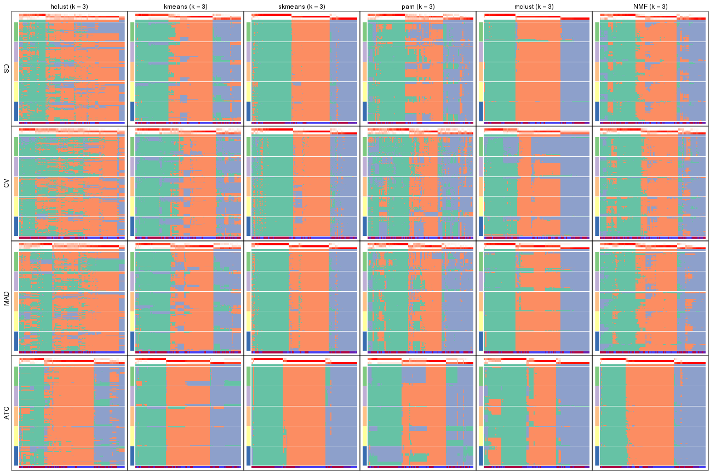</p>

</div>
<div id='tab-collect-membership-heatmap-3'>
<pre><code class="r">collect_plots(res_list, k = 4, fun = membership_heatmap, mc.cores = 4)
</code></pre>

<p></p>

</div>
<div id='tab-collect-membership-heatmap-4'>
<pre><code class="r">collect_plots(res_list, k = 5, fun = membership_heatmap, mc.cores = 4)
</code></pre>

<p></p>

</div>
<div id='tab-collect-membership-heatmap-5'>
<pre><code class="r">collect_plots(res_list, k = 6, fun = membership_heatmap, mc.cores = 4)
</code></pre>

<p></p>

</div>
</div>


### Signature heatmap

Signature heatmaps for all methods. ([What is a signature heatmap?](http://bioconductor.org/packages/devel/bioc/vignettes/cola/inst/doc/cola.html#toc_22))


Note in following heatmaps, rows are scaled.


<script>
$( function() {
	$( '#tabs-collect-get-signatures' ).tabs();
} );
</script>
<div id='tabs-collect-get-signatures'>
<ul>
<li><a href='#tab-collect-get-signatures-1'>k = 2</a></li>
<li><a href='#tab-collect-get-signatures-2'>k = 3</a></li>
<li><a href='#tab-collect-get-signatures-3'>k = 4</a></li>
<li><a href='#tab-collect-get-signatures-4'>k = 5</a></li>
<li><a href='#tab-collect-get-signatures-5'>k = 6</a></li>
</ul>
<div id='tab-collect-get-signatures-1'>
<pre><code class="r">collect_plots(res_list, k = 2, fun = get_signatures, mc.cores = 4)
</code></pre>

<p></p>

</div>
<div id='tab-collect-get-signatures-2'>
<pre><code class="r">collect_plots(res_list, k = 3, fun = get_signatures, mc.cores = 4)
</code></pre>

<p></p>

</div>
<div id='tab-collect-get-signatures-3'>
<pre><code class="r">collect_plots(res_list, k = 4, fun = get_signatures, mc.cores = 4)
</code></pre>

<p></p>

</div>
<div id='tab-collect-get-signatures-4'>
<pre><code class="r">collect_plots(res_list, k = 5, fun = get_signatures, mc.cores = 4)
</code></pre>

<p></p>

</div>
<div id='tab-collect-get-signatures-5'>
<pre><code class="r">collect_plots(res_list, k = 6, fun = get_signatures, mc.cores = 4)
</code></pre>

<p></p>

</div>
</div>


### Statistics table

The statistics used for measuring the stability of consensus partitioning.
([How are they
defined?](http://bioconductor.org/packages/devel/bioc/vignettes/cola/inst/doc/cola.html#toc_13))


<script>
$( function() {
	$( '#tabs-get-stats-from-consensus-partition-list' ).tabs();
} );
</script>
<div id='tabs-get-stats-from-consensus-partition-list'>
<ul>
<li><a href='#tab-get-stats-from-consensus-partition-list-1'>k = 2</a></li>
<li><a href='#tab-get-stats-from-consensus-partition-list-2'>k = 3</a></li>
<li><a href='#tab-get-stats-from-consensus-partition-list-3'>k = 4</a></li>
<li><a href='#tab-get-stats-from-consensus-partition-list-4'>k = 5</a></li>
<li><a href='#tab-get-stats-from-consensus-partition-list-5'>k = 6</a></li>
</ul>
<div id='tab-get-stats-from-consensus-partition-list-1'>
<pre><code class="r">get_stats(res_list, k = 2)
</code></pre>

<pre><code>#&gt;             k  1-PAC mean_silhouette concordance area_increased  Rand Jaccard
#&gt; SD:NMF      2 0.9975           0.950       0.980          0.499 0.500   0.500
#&gt; CV:NMF      2 0.8232           0.895       0.956          0.502 0.498   0.498
#&gt; MAD:NMF     2 0.9504           0.943       0.976          0.502 0.498   0.498
#&gt; ATC:NMF     2 0.9992           0.947       0.979          0.497 0.505   0.505
#&gt; SD:skmeans  2 0.9987           0.974       0.988          0.504 0.497   0.497
#&gt; CV:skmeans  2 0.7364           0.886       0.948          0.504 0.496   0.496
#&gt; MAD:skmeans 2 0.9996           0.967       0.985          0.504 0.496   0.496
#&gt; ATC:skmeans 2 1.0000           0.971       0.989          0.503 0.497   0.497
#&gt; SD:mclust   2 0.3909           0.274       0.584          0.341 0.584   0.584
#&gt; CV:mclust   2 0.3740           0.780       0.839          0.400 0.559   0.559
#&gt; MAD:mclust  2 0.4753           0.830       0.844          0.389 0.554   0.554
#&gt; ATC:mclust  2 0.5699           0.914       0.940          0.418 0.591   0.591
#&gt; SD:kmeans   2 0.9224           0.948       0.977          0.503 0.497   0.497
#&gt; CV:kmeans   2 0.7368           0.885       0.947          0.499 0.496   0.496
#&gt; MAD:kmeans  2 0.9826           0.947       0.975          0.502 0.496   0.496
#&gt; ATC:kmeans  2 1.0000           0.956       0.980          0.499 0.500   0.500
#&gt; SD:pam      2 0.3035           0.663       0.832          0.492 0.503   0.503
#&gt; CV:pam      2 0.0791           0.392       0.685          0.482 0.503   0.503
#&gt; MAD:pam     2 0.2615           0.771       0.843          0.488 0.501   0.501
#&gt; ATC:pam     2 0.6739           0.832       0.917          0.478 0.519   0.519
#&gt; SD:hclust   2 0.1270           0.650       0.804          0.386 0.598   0.598
#&gt; CV:hclust   2 0.0770           0.468       0.666          0.378 0.522   0.522
#&gt; MAD:hclust  2 0.1973           0.537       0.783          0.408 0.544   0.544
#&gt; ATC:hclust  2 0.4008           0.806       0.891          0.372 0.645   0.645
</code></pre>

</div>
<div id='tab-get-stats-from-consensus-partition-list-2'>
<pre><code class="r">get_stats(res_list, k = 3)
</code></pre>

<pre><code>#&gt;             k 1-PAC mean_silhouette concordance area_increased  Rand Jaccard
#&gt; SD:NMF      3 0.604           0.700       0.864          0.330 0.723   0.502
#&gt; CV:NMF      3 0.516           0.682       0.842          0.315 0.753   0.543
#&gt; MAD:NMF     3 0.580           0.693       0.854          0.325 0.716   0.492
#&gt; ATC:NMF     3 0.960           0.938       0.973          0.306 0.717   0.504
#&gt; SD:skmeans  3 0.920           0.921       0.963          0.315 0.703   0.474
#&gt; CV:skmeans  3 0.684           0.813       0.908          0.319 0.780   0.583
#&gt; MAD:skmeans 3 0.842           0.884       0.947          0.317 0.726   0.503
#&gt; ATC:skmeans 3 0.915           0.917       0.967          0.320 0.739   0.522
#&gt; SD:mclust   3 0.998           0.960       0.972          0.919 0.550   0.345
#&gt; CV:mclust   3 0.489           0.813       0.839          0.501 0.714   0.516
#&gt; MAD:mclust  3 0.823           0.912       0.932          0.654 0.711   0.512
#&gt; ATC:mclust  3 0.692           0.721       0.880          0.570 0.709   0.522
#&gt; SD:kmeans   3 0.580           0.775       0.862          0.300 0.775   0.576
#&gt; CV:kmeans   3 0.421           0.647       0.793          0.298 0.796   0.608
#&gt; MAD:kmeans  3 0.532           0.726       0.832          0.304 0.770   0.568
#&gt; ATC:kmeans  3 0.748           0.919       0.935          0.324 0.735   0.520
#&gt; SD:pam      3 0.374           0.649       0.791          0.320 0.753   0.543
#&gt; CV:pam      3 0.256           0.452       0.721          0.349 0.651   0.413
#&gt; MAD:pam     3 0.455           0.626       0.820          0.343 0.685   0.452
#&gt; ATC:pam     3 0.554           0.769       0.811          0.341 0.710   0.496
#&gt; SD:hclust   3 0.201           0.602       0.743          0.392 0.882   0.812
#&gt; CV:hclust   3 0.127           0.432       0.681          0.406 0.598   0.419
#&gt; MAD:hclust  3 0.217           0.506       0.686          0.333 0.848   0.745
#&gt; ATC:hclust  3 0.534           0.729       0.846          0.636 0.707   0.548
</code></pre>

</div>
<div id='tab-get-stats-from-consensus-partition-list-3'>
<pre><code class="r">get_stats(res_list, k = 4)
</code></pre>

<pre><code>#&gt;             k 1-PAC mean_silhouette concordance area_increased  Rand Jaccard
#&gt; SD:NMF      4 0.667           0.705       0.855         0.1211 0.765   0.429
#&gt; CV:NMF      4 0.487           0.586       0.760         0.1197 0.854   0.613
#&gt; MAD:NMF     4 0.654           0.674       0.842         0.1178 0.813   0.525
#&gt; ATC:NMF     4 0.733           0.748       0.863         0.1110 0.855   0.631
#&gt; SD:skmeans  4 0.630           0.601       0.803         0.1228 0.867   0.633
#&gt; CV:skmeans  4 0.521           0.555       0.751         0.1209 0.878   0.659
#&gt; MAD:skmeans 4 0.644           0.655       0.822         0.1208 0.880   0.662
#&gt; ATC:skmeans 4 0.850           0.829       0.871         0.1076 0.882   0.664
#&gt; SD:mclust   4 0.694           0.870       0.924         0.0446 0.740   0.417
#&gt; CV:mclust   4 0.763           0.825       0.905         0.1551 0.751   0.434
#&gt; MAD:mclust  4 0.923           0.913       0.957         0.0947 0.731   0.402
#&gt; ATC:mclust  4 0.811           0.791       0.861         0.0845 0.863   0.645
#&gt; SD:kmeans   4 0.626           0.662       0.774         0.1256 0.856   0.611
#&gt; CV:kmeans   4 0.533           0.649       0.717         0.1281 0.849   0.596
#&gt; MAD:kmeans  4 0.618           0.631       0.789         0.1204 0.852   0.596
#&gt; ATC:kmeans  4 0.741           0.648       0.793         0.1067 0.916   0.758
#&gt; SD:pam      4 0.609           0.757       0.846         0.1358 0.889   0.683
#&gt; CV:pam      4 0.423           0.554       0.736         0.1383 0.801   0.496
#&gt; MAD:pam     4 0.646           0.638       0.829         0.1367 0.825   0.539
#&gt; ATC:pam     4 0.894           0.844       0.937         0.1746 0.844   0.579
#&gt; SD:hclust   4 0.326           0.585       0.755         0.2146 0.794   0.627
#&gt; CV:hclust   4 0.181           0.431       0.651         0.1287 0.969   0.936
#&gt; MAD:hclust  4 0.364           0.599       0.781         0.2033 0.761   0.550
#&gt; ATC:hclust  4 0.526           0.670       0.789         0.0973 0.931   0.815
</code></pre>

</div>
<div id='tab-get-stats-from-consensus-partition-list-4'>
<pre><code class="r">get_stats(res_list, k = 5)
</code></pre>

<pre><code>#&gt;             k 1-PAC mean_silhouette concordance area_increased  Rand Jaccard
#&gt; SD:NMF      5 0.604           0.570       0.765         0.0682 0.895   0.625
#&gt; CV:NMF      5 0.595           0.603       0.774         0.0773 0.844   0.504
#&gt; MAD:NMF     5 0.606           0.609       0.778         0.0719 0.864   0.546
#&gt; ATC:NMF     5 0.674           0.580       0.787         0.0796 0.894   0.658
#&gt; SD:skmeans  5 0.711           0.641       0.823         0.0698 0.910   0.678
#&gt; CV:skmeans  5 0.534           0.532       0.699         0.0662 0.909   0.675
#&gt; MAD:skmeans 5 0.677           0.618       0.799         0.0673 0.925   0.726
#&gt; ATC:skmeans 5 1.000           0.932       0.975         0.0777 0.931   0.738
#&gt; SD:mclust   5 0.872           0.838       0.926         0.1284 0.885   0.642
#&gt; CV:mclust   5 0.788           0.758       0.890         0.1151 0.850   0.549
#&gt; MAD:mclust  5 0.861           0.848       0.933         0.0887 0.908   0.699
#&gt; ATC:mclust  5 0.975           0.939       0.975         0.0817 0.903   0.692
#&gt; SD:kmeans   5 0.735           0.768       0.856         0.0663 0.922   0.716
#&gt; CV:kmeans   5 0.708           0.764       0.851         0.0715 0.929   0.738
#&gt; MAD:kmeans  5 0.748           0.785       0.864         0.0684 0.905   0.658
#&gt; ATC:kmeans  5 0.755           0.801       0.865         0.0751 0.859   0.545
#&gt; SD:pam      5 0.609           0.583       0.782         0.0596 0.919   0.709
#&gt; CV:pam      5 0.481           0.428       0.655         0.0594 0.951   0.814
#&gt; MAD:pam     5 0.711           0.732       0.845         0.0507 0.892   0.622
#&gt; ATC:pam     5 0.686           0.612       0.792         0.0488 0.913   0.676
#&gt; SD:hclust   5 0.437           0.424       0.696         0.1068 0.904   0.744
#&gt; CV:hclust   5 0.254           0.413       0.535         0.1287 0.719   0.467
#&gt; MAD:hclust  5 0.447           0.485       0.743         0.0998 0.954   0.859
#&gt; ATC:hclust  5 0.565           0.597       0.719         0.0970 0.924   0.771
</code></pre>

</div>
<div id='tab-get-stats-from-consensus-partition-list-5'>
<pre><code class="r">get_stats(res_list, k = 6)
</code></pre>

<pre><code>#&gt;             k 1-PAC mean_silhouette concordance area_increased  Rand Jaccard
#&gt; SD:NMF      6 0.630           0.510       0.704         0.0407 0.913   0.622
#&gt; CV:NMF      6 0.609           0.476       0.685         0.0444 0.946   0.748
#&gt; MAD:NMF     6 0.610           0.524       0.717         0.0413 0.931   0.686
#&gt; ATC:NMF     6 0.697           0.644       0.803         0.0478 0.905   0.620
#&gt; SD:skmeans  6 0.691           0.529       0.750         0.0388 0.926   0.686
#&gt; CV:skmeans  6 0.561           0.413       0.655         0.0411 0.959   0.815
#&gt; MAD:skmeans 6 0.673           0.526       0.747         0.0395 0.967   0.852
#&gt; ATC:skmeans 6 0.957           0.867       0.937         0.0261 0.968   0.850
#&gt; SD:mclust   6 0.830           0.747       0.855         0.0432 0.918   0.676
#&gt; CV:mclust   6 0.814           0.805       0.878         0.0435 0.967   0.854
#&gt; MAD:mclust  6 0.831           0.832       0.894         0.0481 0.924   0.698
#&gt; ATC:mclust  6 0.919           0.885       0.921         0.0490 0.939   0.748
#&gt; SD:kmeans   6 0.706           0.632       0.787         0.0456 0.934   0.712
#&gt; CV:kmeans   6 0.709           0.584       0.732         0.0436 0.957   0.805
#&gt; MAD:kmeans  6 0.730           0.669       0.805         0.0452 0.955   0.800
#&gt; ATC:kmeans  6 0.806           0.658       0.810         0.0460 0.932   0.695
#&gt; SD:pam      6 0.700           0.640       0.802         0.0486 0.921   0.670
#&gt; CV:pam      6 0.580           0.525       0.690         0.0435 0.904   0.610
#&gt; MAD:pam     6 0.826           0.844       0.902         0.0477 0.955   0.796
#&gt; ATC:pam     6 0.732           0.632       0.798         0.0378 0.905   0.603
#&gt; SD:hclust   6 0.475           0.391       0.669         0.0501 0.943   0.809
#&gt; CV:hclust   6 0.335           0.511       0.645         0.0828 0.875   0.614
#&gt; MAD:hclust  6 0.511           0.461       0.698         0.0576 0.929   0.758
#&gt; ATC:hclust  6 0.606           0.529       0.670         0.0778 0.870   0.556
</code></pre>

</div>
</div>

Following heatmap plots the partition for each combination of methods and the
lightness correspond to the silhouette scores for samples in each method. On
top the consensus subgroup is inferred from all methods by taking the mean
silhouette scores as weight.


<script>
$( function() {
	$( '#tabs-collect-stats-from-consensus-partition-list' ).tabs();
} );
</script>
<div id='tabs-collect-stats-from-consensus-partition-list'>
<ul>
<li><a href='#tab-collect-stats-from-consensus-partition-list-1'>k = 2</a></li>
<li><a href='#tab-collect-stats-from-consensus-partition-list-2'>k = 3</a></li>
<li><a href='#tab-collect-stats-from-consensus-partition-list-3'>k = 4</a></li>
<li><a href='#tab-collect-stats-from-consensus-partition-list-4'>k = 5</a></li>
<li><a href='#tab-collect-stats-from-consensus-partition-list-5'>k = 6</a></li>
</ul>
<div id='tab-collect-stats-from-consensus-partition-list-1'>
<pre><code class="r">collect_stats(res_list, k = 2)
</code></pre>

<p>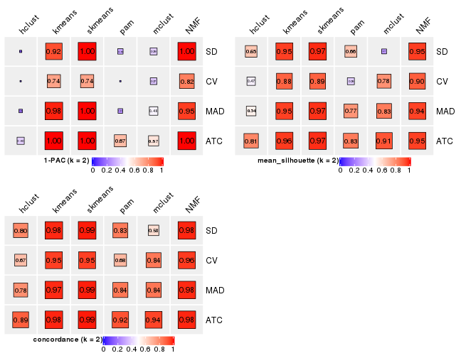</p>

</div>
<div id='tab-collect-stats-from-consensus-partition-list-2'>
<pre><code class="r">collect_stats(res_list, k = 3)
</code></pre>

<p></p>

</div>
<div id='tab-collect-stats-from-consensus-partition-list-3'>
<pre><code class="r">collect_stats(res_list, k = 4)
</code></pre>

<p></p>

</div>
<div id='tab-collect-stats-from-consensus-partition-list-4'>
<pre><code class="r">collect_stats(res_list, k = 5)
</code></pre>

<p></p>

</div>
<div id='tab-collect-stats-from-consensus-partition-list-5'>
<pre><code class="r">collect_stats(res_list, k = 6)
</code></pre>

<p></p>

</div>
</div>

### Partition from all methods


Collect partitions from all methods:


<script>
$( function() {
	$( '#tabs-collect-classes-from-consensus-partition-list' ).tabs();
} );
</script>
<div id='tabs-collect-classes-from-consensus-partition-list'>
<ul>
<li><a href='#tab-collect-classes-from-consensus-partition-list-1'>k = 2</a></li>
<li><a href='#tab-collect-classes-from-consensus-partition-list-2'>k = 3</a></li>
<li><a href='#tab-collect-classes-from-consensus-partition-list-3'>k = 4</a></li>
<li><a href='#tab-collect-classes-from-consensus-partition-list-4'>k = 5</a></li>
<li><a href='#tab-collect-classes-from-consensus-partition-list-5'>k = 6</a></li>
</ul>
<div id='tab-collect-classes-from-consensus-partition-list-1'>
<pre><code class="r">collect_classes(res_list, k = 2)
</code></pre>

<p></p>

</div>
<div id='tab-collect-classes-from-consensus-partition-list-2'>
<pre><code class="r">collect_classes(res_list, k = 3)
</code></pre>

<p></p>

</div>
<div id='tab-collect-classes-from-consensus-partition-list-3'>
<pre><code class="r">collect_classes(res_list, k = 4)
</code></pre>

<p></p>

</div>
<div id='tab-collect-classes-from-consensus-partition-list-4'>
<pre><code class="r">collect_classes(res_list, k = 5)
</code></pre>

<p></p>

</div>
<div id='tab-collect-classes-from-consensus-partition-list-5'>
<pre><code class="r">collect_classes(res_list, k = 6)
</code></pre>

<p></p>

</div>
</div>


### Top rows overlap


Overlap of top rows from different top-row methods:


<script>
$( function() {
	$( '#tabs-top-rows-overlap-by-euler' ).tabs();
} );
</script>
<div id='tabs-top-rows-overlap-by-euler'>
<ul>
<li><a href='#tab-top-rows-overlap-by-euler-1'>top_n = 1000</a></li>
<li><a href='#tab-top-rows-overlap-by-euler-2'>top_n = 2000</a></li>
<li><a href='#tab-top-rows-overlap-by-euler-3'>top_n = 3000</a></li>
<li><a href='#tab-top-rows-overlap-by-euler-4'>top_n = 4000</a></li>
<li><a href='#tab-top-rows-overlap-by-euler-5'>top_n = 5000</a></li>
</ul>
<div id='tab-top-rows-overlap-by-euler-1'>
<pre><code class="r">top_rows_overlap(res_list, top_n = 1000, method = &quot;euler&quot;)
</code></pre>

<p></p>

</div>
<div id='tab-top-rows-overlap-by-euler-2'>
<pre><code class="r">top_rows_overlap(res_list, top_n = 2000, method = &quot;euler&quot;)
</code></pre>

<p></p>

</div>
<div id='tab-top-rows-overlap-by-euler-3'>
<pre><code class="r">top_rows_overlap(res_list, top_n = 3000, method = &quot;euler&quot;)
</code></pre>

<p></p>

</div>
<div id='tab-top-rows-overlap-by-euler-4'>
<pre><code class="r">top_rows_overlap(res_list, top_n = 4000, method = &quot;euler&quot;)
</code></pre>

<p></p>

</div>
<div id='tab-top-rows-overlap-by-euler-5'>
<pre><code class="r">top_rows_overlap(res_list, top_n = 5000, method = &quot;euler&quot;)
</code></pre>

<p></p>

</div>
</div>

Also visualize the correspondance of rankings between different top-row methods:


<script>
$( function() {
	$( '#tabs-top-rows-overlap-by-correspondance' ).tabs();
} );
</script>
<div id='tabs-top-rows-overlap-by-correspondance'>
<ul>
<li><a href='#tab-top-rows-overlap-by-correspondance-1'>top_n = 1000</a></li>
<li><a href='#tab-top-rows-overlap-by-correspondance-2'>top_n = 2000</a></li>
<li><a href='#tab-top-rows-overlap-by-correspondance-3'>top_n = 3000</a></li>
<li><a href='#tab-top-rows-overlap-by-correspondance-4'>top_n = 4000</a></li>
<li><a href='#tab-top-rows-overlap-by-correspondance-5'>top_n = 5000</a></li>
</ul>
<div id='tab-top-rows-overlap-by-correspondance-1'>
<pre><code class="r">top_rows_overlap(res_list, top_n = 1000, method = &quot;correspondance&quot;)
</code></pre>

<p></p>

</div>
<div id='tab-top-rows-overlap-by-correspondance-2'>
<pre><code class="r">top_rows_overlap(res_list, top_n = 2000, method = &quot;correspondance&quot;)
</code></pre>

<p></p>

</div>
<div id='tab-top-rows-overlap-by-correspondance-3'>
<pre><code class="r">top_rows_overlap(res_list, top_n = 3000, method = &quot;correspondance&quot;)
</code></pre>

<p></p>

</div>
<div id='tab-top-rows-overlap-by-correspondance-4'>
<pre><code class="r">top_rows_overlap(res_list, top_n = 4000, method = &quot;correspondance&quot;)
</code></pre>

<p></p>

</div>
<div id='tab-top-rows-overlap-by-correspondance-5'>
<pre><code class="r">top_rows_overlap(res_list, top_n = 5000, method = &quot;correspondance&quot;)
</code></pre>

<p></p>

</div>
</div>


Heatmaps of the top rows:


<script>
$( function() {
	$( '#tabs-top-rows-heatmap' ).tabs();
} );
</script>
<div id='tabs-top-rows-heatmap'>
<ul>
<li><a href='#tab-top-rows-heatmap-1'>top_n = 1000</a></li>
<li><a href='#tab-top-rows-heatmap-2'>top_n = 2000</a></li>
<li><a href='#tab-top-rows-heatmap-3'>top_n = 3000</a></li>
<li><a href='#tab-top-rows-heatmap-4'>top_n = 4000</a></li>
<li><a href='#tab-top-rows-heatmap-5'>top_n = 5000</a></li>
</ul>
<div id='tab-top-rows-heatmap-1'>
<pre><code class="r">top_rows_heatmap(res_list, top_n = 1000)
</code></pre>

<p></p>

</div>
<div id='tab-top-rows-heatmap-2'>
<pre><code class="r">top_rows_heatmap(res_list, top_n = 2000)
</code></pre>

<p></p>

</div>
<div id='tab-top-rows-heatmap-3'>
<pre><code class="r">top_rows_heatmap(res_list, top_n = 3000)
</code></pre>

<p></p>

</div>
<div id='tab-top-rows-heatmap-4'>
<pre><code class="r">top_rows_heatmap(res_list, top_n = 4000)
</code></pre>

<p></p>

</div>
<div id='tab-top-rows-heatmap-5'>
<pre><code class="r">top_rows_heatmap(res_list, top_n = 5000)
</code></pre>

<p></p>

</div>
</div>


### Test to known annotations


Test correlation between subgroups and known annotations. If the known
annotation is numeric, one-way ANOVA test is applied, and if the known
annotation is discrete, chi-squared contingency table test is applied.


<script>
$( function() {
	$( '#tabs-test-to-known-factors-from-consensus-partition-list' ).tabs();
} );
</script>
<div id='tabs-test-to-known-factors-from-consensus-partition-list'>
<ul>
<li><a href='#tab-test-to-known-factors-from-consensus-partition-list-1'>k = 2</a></li>
<li><a href='#tab-test-to-known-factors-from-consensus-partition-list-2'>k = 3</a></li>
<li><a href='#tab-test-to-known-factors-from-consensus-partition-list-3'>k = 4</a></li>
<li><a href='#tab-test-to-known-factors-from-consensus-partition-list-4'>k = 5</a></li>
<li><a href='#tab-test-to-known-factors-from-consensus-partition-list-5'>k = 6</a></li>
</ul>
<div id='tab-test-to-known-factors-from-consensus-partition-list-1'>
<pre><code class="r">test_to_known_factors(res_list, k = 2)
</code></pre>

<pre><code>#&gt;               n disease.state(p) k
#&gt; SD:NMF      124         5.62e-10 2
#&gt; CV:NMF      121         2.36e-07 2
#&gt; MAD:NMF     124         9.74e-10 2
#&gt; ATC:NMF     124         1.50e-07 2
#&gt; SD:skmeans  126         2.61e-10 2
#&gt; CV:skmeans  124         6.44e-07 2
#&gt; MAD:skmeans 126         7.15e-10 2
#&gt; ATC:skmeans 124         9.74e-09 2
#&gt; SD:mclust    14               NA 2
#&gt; CV:mclust   122         2.18e-01 2
#&gt; MAD:mclust  122         1.37e-01 2
#&gt; ATC:mclust  126         2.65e-01 2
#&gt; SD:kmeans   125         1.10e-10 2
#&gt; CV:kmeans   124         2.95e-07 2
#&gt; MAD:kmeans  123         2.77e-10 2
#&gt; ATC:kmeans  123         1.12e-07 2
#&gt; SD:pam      110         5.02e-09 2
#&gt; CV:pam       54         4.24e-04 2
#&gt; MAD:pam     121         1.14e-01 2
#&gt; ATC:pam     123         6.17e-07 2
#&gt; SD:hclust   107         2.55e-06 2
#&gt; CV:hclust    70         1.03e-09 2
#&gt; MAD:hclust   91         1.25e-09 2
#&gt; ATC:hclust  124         1.35e-05 2
</code></pre>

</div>
<div id='tab-test-to-known-factors-from-consensus-partition-list-2'>
<pre><code class="r">test_to_known_factors(res_list, k = 3)
</code></pre>

<pre><code>#&gt;               n disease.state(p) k
#&gt; SD:NMF      104         2.39e-09 3
#&gt; CV:NMF      101         5.53e-11 3
#&gt; MAD:NMF     105         1.16e-08 3
#&gt; ATC:NMF     124         9.13e-07 3
#&gt; SD:skmeans  125         4.92e-13 3
#&gt; CV:skmeans  118         7.79e-12 3
#&gt; MAD:skmeans 121         1.47e-13 3
#&gt; ATC:skmeans 123         2.58e-07 3
#&gt; SD:mclust   126         4.38e-08 3
#&gt; CV:mclust   123         1.88e-08 3
#&gt; MAD:mclust  125         2.25e-08 3
#&gt; ATC:mclust   98         2.72e-08 3
#&gt; SD:kmeans   119         5.87e-13 3
#&gt; CV:kmeans   106         1.58e-12 3
#&gt; MAD:kmeans  115         4.44e-13 3
#&gt; ATC:kmeans  126         6.53e-07 3
#&gt; SD:pam      113         9.04e-10 3
#&gt; CV:pam       65         7.98e-08 3
#&gt; MAD:pam      96         3.96e-08 3
#&gt; ATC:pam     123         3.38e-07 3
#&gt; SD:hclust   105         9.35e-07 3
#&gt; CV:hclust    59         7.12e-06 3
#&gt; MAD:hclust   77         6.00e-08 3
#&gt; ATC:hclust  116         6.47e-07 3
</code></pre>

</div>
<div id='tab-test-to-known-factors-from-consensus-partition-list-3'>
<pre><code class="r">test_to_known_factors(res_list, k = 4)
</code></pre>

<pre><code>#&gt;               n disease.state(p) k
#&gt; SD:NMF      107         4.45e-09 4
#&gt; CV:NMF       97         1.55e-10 4
#&gt; MAD:NMF     107         1.05e-07 4
#&gt; ATC:NMF     112         1.16e-06 4
#&gt; SD:skmeans   90         1.20e-12 4
#&gt; CV:skmeans   86         1.71e-12 4
#&gt; MAD:skmeans  99         3.64e-10 4
#&gt; ATC:skmeans 117         1.49e-07 4
#&gt; SD:mclust   125         6.40e-10 4
#&gt; CV:mclust   120         2.19e-09 4
#&gt; MAD:mclust  124         1.24e-09 4
#&gt; ATC:mclust  118         3.21e-09 4
#&gt; SD:kmeans   103         8.05e-13 4
#&gt; CV:kmeans    95         4.43e-11 4
#&gt; MAD:kmeans   88         1.14e-14 4
#&gt; ATC:kmeans   95         3.33e-10 4
#&gt; SD:pam      119         3.57e-10 4
#&gt; CV:pam       93         5.29e-09 4
#&gt; MAD:pam      94         1.20e-08 4
#&gt; ATC:pam     116         8.30e-08 4
#&gt; SD:hclust    97         1.02e-11 4
#&gt; CV:hclust    48         5.60e-06 4
#&gt; MAD:hclust   91         5.42e-12 4
#&gt; ATC:hclust  113         5.92e-09 4
</code></pre>

</div>
<div id='tab-test-to-known-factors-from-consensus-partition-list-4'>
<pre><code class="r">test_to_known_factors(res_list, k = 5)
</code></pre>

<pre><code>#&gt;               n disease.state(p) k
#&gt; SD:NMF       89         1.81e-08 5
#&gt; CV:NMF       95         2.81e-09 5
#&gt; MAD:NMF      97         1.88e-08 5
#&gt; ATC:NMF      89         1.39e-05 5
#&gt; SD:skmeans  104         3.77e-10 5
#&gt; CV:skmeans   83         2.37e-09 5
#&gt; MAD:skmeans  99         5.29e-10 5
#&gt; ATC:skmeans 121         9.04e-09 5
#&gt; SD:mclust   118         1.59e-10 5
#&gt; CV:mclust   110         3.74e-10 5
#&gt; MAD:mclust  116         2.48e-11 5
#&gt; ATC:mclust  125         1.12e-09 5
#&gt; SD:kmeans   116         1.84e-13 5
#&gt; CV:kmeans   115         2.35e-11 5
#&gt; MAD:kmeans  115         1.02e-13 5
#&gt; ATC:kmeans  122         1.97e-10 5
#&gt; SD:pam       89         3.70e-11 5
#&gt; CV:pam       61         4.35e-08 5
#&gt; MAD:pam     112         1.34e-10 5
#&gt; ATC:pam      90         1.40e-08 5
#&gt; SD:hclust    78         2.32e-13 5
#&gt; CV:hclust    43         4.26e-10 5
#&gt; MAD:hclust   73         1.58e-15 5
#&gt; ATC:hclust   97         5.21e-09 5
</code></pre>

</div>
<div id='tab-test-to-known-factors-from-consensus-partition-list-5'>
<pre><code class="r">test_to_known_factors(res_list, k = 6)
</code></pre>

<pre><code>#&gt;               n disease.state(p) k
#&gt; SD:NMF       78         2.84e-08 6
#&gt; CV:NMF       70         2.90e-08 6
#&gt; MAD:NMF      77         1.82e-09 6
#&gt; ATC:NMF      99         4.27e-06 6
#&gt; SD:skmeans   75         2.86e-08 6
#&gt; CV:skmeans   59         7.85e-10 6
#&gt; MAD:skmeans  81         1.21e-08 6
#&gt; ATC:skmeans 119         1.12e-09 6
#&gt; SD:mclust   108         5.31e-12 6
#&gt; CV:mclust   121         8.94e-12 6
#&gt; MAD:mclust  122         3.16e-12 6
#&gt; ATC:mclust  120         3.59e-11 6
#&gt; SD:kmeans    94         9.71e-12 6
#&gt; CV:kmeans    87         1.62e-11 6
#&gt; MAD:kmeans  101         3.40e-14 6
#&gt; ATC:kmeans   98         1.06e-09 6
#&gt; SD:pam       97         7.56e-11 6
#&gt; CV:pam       78         2.51e-07 6
#&gt; MAD:pam     123         3.25e-11 6
#&gt; ATC:pam      99         4.99e-10 6
#&gt; SD:hclust    63         2.84e-11 6
#&gt; CV:hclust    74         8.65e-11 6
#&gt; MAD:hclust   68         1.93e-14 6
#&gt; ATC:hclust   79         1.45e-09 6
</code></pre>

</div>
</div>


 
## Results for each method


---------------------------------------------------


### SD:hclust


The object with results only for a single top-value method and a single partition method 
can be extracted as:

```r
res = res_list["SD", "hclust"]
# you can also extract it by
# res = res_list["SD:hclust"]
```

A summary of `res` and all the functions that can be applied to it:

```r
res
```

```
#> A 'ConsensusPartition' object with k = 2, 3, 4, 5, 6.
#>   On a matrix with 21168 rows and 127 columns.
#>   Top rows (1000, 2000, 3000, 4000, 5000) are extracted by 'SD' method.
#>   Subgroups are detected by 'hclust' method.
#>   Performed in total 1250 partitions by row resampling.
#>   Best k for subgroups seems to be 3.
#> 
#> Following methods can be applied to this 'ConsensusPartition' object:
#>  [1] "cola_report"             "collect_classes"         "collect_plots"          
#>  [4] "collect_stats"           "colnames"                "compare_signatures"     
#>  [7] "consensus_heatmap"       "dimension_reduction"     "functional_enrichment"  
#> [10] "get_anno_col"            "get_anno"                "get_classes"            
#> [13] "get_consensus"           "get_matrix"              "get_membership"         
#> [16] "get_param"               "get_signatures"          "get_stats"              
#> [19] "is_best_k"               "is_stable_k"             "membership_heatmap"     
#> [22] "ncol"                    "nrow"                    "plot_ecdf"              
#> [25] "rownames"                "select_partition_number" "show"                   
#> [28] "suggest_best_k"          "test_to_known_factors"
```

`collect_plots()` function collects all the plots made from `res` for all `k` (number of partitions)
into one single page to provide an easy and fast comparison between different `k`.

```r
collect_plots(res)
```


The plots are:

- The first row: a plot of the ECDF (empirical cumulative distribution
  function) curves of the consensus matrix for each `k` and the heatmap of
  predicted classes for each `k`.
- The second row: heatmaps of the consensus matrix for each `k`.
- The third row: heatmaps of the membership matrix for each `k`.
- The fouth row: heatmaps of the signatures for each `k`.

All the plots in panels can be made by individual functions and they are
plotted later in this section.

`select_partition_number()` produces several plots showing different
statistics for choosing "optimized" `k`. There are following statistics:

- ECDF curves of the consensus matrix for each `k`;
- 1-PAC. [The PAC
  score](https://en.wikipedia.org/wiki/Consensus_clustering#Over-interpretation_potential_of_consensus_clustering)
  measures the proportion of the ambiguous subgrouping.
- Mean silhouette score.
- Concordance. The mean probability of fiting the consensus class ids in all
  partitions.
- Area increased. Denote $A_k$ as the area under the ECDF curve for current
  `k`, the area increased is defined as $A_k - A_{k-1}$.
- Rand index. The percent of pairs of samples that are both in a same cluster
  or both are not in a same cluster in the partition of k and k-1.
- Jaccard index. The ratio of pairs of samples are both in a same cluster in
  the partition of k and k-1 and the pairs of samples are both in a same
  cluster in the partition k or k-1.

The detailed explanations of these statistics can be found in [the _cola_
vignette](http://bioconductor.org/packages/devel/bioc/vignettes/cola/inst/doc/cola.html#toc_13).

Generally speaking, lower PAC score, higher mean silhouette score or higher
concordance corresponds to better partition. Rand index and Jaccard index
measure how similar the current partition is compared to partition with `k-1`.
If they are too similar, we won't accept `k` is better than `k-1`.

```r
select_partition_number(res)
```


The numeric values for all these statistics can be obtained by `get_stats()`.

```r
get_stats(res)
```

```
#>   k 1-PAC mean_silhouette concordance area_increased  Rand Jaccard
#> 2 2 0.127           0.650       0.804         0.3857 0.598   0.598
#> 3 3 0.201           0.602       0.743         0.3924 0.882   0.812
#> 4 4 0.326           0.585       0.755         0.2146 0.794   0.627
#> 5 5 0.437           0.424       0.696         0.1068 0.904   0.744
#> 6 6 0.475           0.391       0.669         0.0501 0.943   0.809
```

`suggest_best_k()` suggests the best $k$ based on these statistics. The rules are as follows:

- All $k$ with Jaccard index larger than 0.95 are removed because increasing
  $k$ does not provide enough extra information. If all $k$ are removed, it is
  marked as no subgroup is detected.
- For all $k$ with 1-PAC score larger than 0.9, the maximal $k$ is taken as
  the best $k$, and other $k$ are marked as optional $k$.
- If it does not fit the second rule. The $k$ with the maximal vote of the
  highest 1-PAC score, highest mean silhouette, and highest concordance is
  taken as the best $k$.

```r
suggest_best_k(res)
```

```
#> [1] 3
```


Following shows the table of the partitions (You need to click the **show/hide
code output** link to see it). The membership matrix (columns with name `p*`)
is inferred by
[`clue::cl_consensus()`](https://www.rdocumentation.org/link/cl_consensus?package=clue)
function with the `SE` method. Basically the value in the membership matrix
represents the probability to belong to a certain group. The finall class
label for an item is determined with the group with highest probability it
belongs to.

In `get_classes()` function, the entropy is calculated from the membership
matrix and the silhouette score is calculated from the consensus matrix.


<script>
$( function() {
	$( '#tabs-SD-hclust-get-classes' ).tabs();
} );
</script>
<div id='tabs-SD-hclust-get-classes'>
<ul>
<li><a href='#tab-SD-hclust-get-classes-1'>k = 2</a></li>
<li><a href='#tab-SD-hclust-get-classes-2'>k = 3</a></li>
<li><a href='#tab-SD-hclust-get-classes-3'>k = 4</a></li>
<li><a href='#tab-SD-hclust-get-classes-4'>k = 5</a></li>
<li><a href='#tab-SD-hclust-get-classes-5'>k = 6</a></li>
</ul>

<div id='tab-SD-hclust-get-classes-1'>
<p><a id='tab-SD-hclust-get-classes-1-a' style='color:#0366d6' href='#'>show/hide code output</a></p>
<pre><code class="r">cbind(get_classes(res, k = 2), get_membership(res, k = 2))
</code></pre>

<pre><code>#&gt;          class entropy silhouette    p1    p2
#&gt; GSM76115     2   0.204   0.772427 0.032 0.968
#&gt; GSM76116     2   0.242   0.774011 0.040 0.960
#&gt; GSM76117     2   0.494   0.760359 0.108 0.892
#&gt; GSM76118     2   0.402   0.767398 0.080 0.920
#&gt; GSM76119     2   0.574   0.657302 0.136 0.864
#&gt; GSM76120     2   0.574   0.657302 0.136 0.864
#&gt; GSM76121     2   0.615   0.722845 0.152 0.848
#&gt; GSM76122     2   0.416   0.769806 0.084 0.916
#&gt; GSM76123     2   0.574   0.657302 0.136 0.864
#&gt; GSM76124     2   0.518   0.763030 0.116 0.884
#&gt; GSM76125     2   0.574   0.657302 0.136 0.864
#&gt; GSM76126     2   0.343   0.741300 0.064 0.936
#&gt; GSM76127     2   0.574   0.657302 0.136 0.864
#&gt; GSM76128     2   0.574   0.657302 0.136 0.864
#&gt; GSM76129     2   0.184   0.772450 0.028 0.972
#&gt; GSM76130     2   0.574   0.657302 0.136 0.864
#&gt; GSM76131     2   0.141   0.775084 0.020 0.980
#&gt; GSM76132     2   0.141   0.775084 0.020 0.980
#&gt; GSM76133     2   0.141   0.775084 0.020 0.980
#&gt; GSM76134     2   0.163   0.771883 0.024 0.976
#&gt; GSM76135     2   0.141   0.775084 0.020 0.980
#&gt; GSM76136     2   0.141   0.775084 0.020 0.980
#&gt; GSM76137     2   0.118   0.768496 0.016 0.984
#&gt; GSM76138     2   0.163   0.769432 0.024 0.976
#&gt; GSM76139     2   0.118   0.774240 0.016 0.984
#&gt; GSM76140     1   0.913   0.735090 0.672 0.328
#&gt; GSM76141     2   0.141   0.775084 0.020 0.980
#&gt; GSM76142     2   0.141   0.775084 0.020 0.980
#&gt; GSM76143     2   0.141   0.775084 0.020 0.980
#&gt; GSM76144     2   0.141   0.775084 0.020 0.980
#&gt; GSM76145     2   0.141   0.769181 0.020 0.980
#&gt; GSM76146     2   0.141   0.775084 0.020 0.980
#&gt; GSM76147     2   0.141   0.775084 0.020 0.980
#&gt; GSM76148     2   0.118   0.774240 0.016 0.984
#&gt; GSM76149     2   0.141   0.769181 0.020 0.980
#&gt; GSM76150     2   0.141   0.769181 0.020 0.980
#&gt; GSM76151     2   0.141   0.769181 0.020 0.980
#&gt; GSM76152     1   0.909   0.738608 0.676 0.324
#&gt; GSM76153     2   0.141   0.775084 0.020 0.980
#&gt; GSM76154     2   0.141   0.769181 0.020 0.980
#&gt; GSM76155     2   0.141   0.769181 0.020 0.980
#&gt; GSM76156     2   0.141   0.775084 0.020 0.980
#&gt; GSM76030     2   0.605   0.737853 0.148 0.852
#&gt; GSM76031     1   0.891   0.754882 0.692 0.308
#&gt; GSM76032     1   1.000   0.244773 0.504 0.496
#&gt; GSM76033     2   0.821   0.628761 0.256 0.744
#&gt; GSM76034     2   0.730   0.697887 0.204 0.796
#&gt; GSM76035     2   0.781   0.672698 0.232 0.768
#&gt; GSM76036     2   0.802   0.657133 0.244 0.756
#&gt; GSM76037     2   0.388   0.770956 0.076 0.924
#&gt; GSM76038     1   0.891   0.754882 0.692 0.308
#&gt; GSM76039     2   0.998  -0.180803 0.472 0.528
#&gt; GSM76040     2   0.802   0.657133 0.244 0.756
#&gt; GSM76041     1   0.932   0.702114 0.652 0.348
#&gt; GSM76042     2   0.909   0.484774 0.324 0.676
#&gt; GSM76043     2   0.975   0.235982 0.408 0.592
#&gt; GSM76044     2   0.904   0.495786 0.320 0.680
#&gt; GSM76045     1   0.991   0.478382 0.556 0.444
#&gt; GSM76046     2   0.775   0.683793 0.228 0.772
#&gt; GSM76047     2   0.994   0.000403 0.456 0.544
#&gt; GSM76048     2   0.925   0.469941 0.340 0.660
#&gt; GSM76049     2   0.653   0.724348 0.168 0.832
#&gt; GSM76050     1   0.844   0.786615 0.728 0.272
#&gt; GSM76051     2   0.827   0.634570 0.260 0.740
#&gt; GSM76052     2   0.821   0.628761 0.256 0.744
#&gt; GSM76053     2   0.722   0.712540 0.200 0.800
#&gt; GSM76054     2   0.802   0.657133 0.244 0.756
#&gt; GSM76055     2   0.775   0.666056 0.228 0.772
#&gt; GSM76056     1   0.999   0.345366 0.520 0.480
#&gt; GSM76057     2   0.991  -0.009280 0.444 0.556
#&gt; GSM76058     1   0.999   0.256342 0.516 0.484
#&gt; GSM76059     1   0.574   0.784116 0.864 0.136
#&gt; GSM76060     2   0.952   0.357297 0.372 0.628
#&gt; GSM76061     2   0.895   0.513514 0.312 0.688
#&gt; GSM76062     1   0.574   0.784116 0.864 0.136
#&gt; GSM76063     2   0.518   0.756052 0.116 0.884
#&gt; GSM76064     1   0.839   0.791746 0.732 0.268
#&gt; GSM76065     2   0.416   0.772210 0.084 0.916
#&gt; GSM76066     1   0.788   0.800967 0.764 0.236
#&gt; GSM76067     1   0.943   0.675409 0.640 0.360
#&gt; GSM76068     2   0.827   0.634132 0.260 0.740
#&gt; GSM76069     1   0.969   0.617667 0.604 0.396
#&gt; GSM76070     2   0.482   0.768274 0.104 0.896
#&gt; GSM76071     1   0.706   0.806367 0.808 0.192
#&gt; GSM76072     1   0.706   0.806367 0.808 0.192
#&gt; GSM76073     1   0.615   0.793868 0.848 0.152
#&gt; GSM76074     1   0.605   0.791570 0.852 0.148
#&gt; GSM76075     2   1.000  -0.171766 0.492 0.508
#&gt; GSM76076     2   0.997  -0.044990 0.468 0.532
#&gt; GSM76077     2   0.963   0.306868 0.388 0.612
#&gt; GSM76078     2   0.988   0.109395 0.436 0.564
#&gt; GSM76079     1   0.574   0.784116 0.864 0.136
#&gt; GSM76080     2   0.574   0.745154 0.136 0.864
#&gt; GSM76081     2   0.730   0.702561 0.204 0.796
#&gt; GSM76082     2   0.833   0.627315 0.264 0.736
#&gt; GSM76083     2   0.997  -0.044990 0.468 0.532
#&gt; GSM76084     2   0.563   0.747303 0.132 0.868
#&gt; GSM76085     2   0.855   0.588109 0.280 0.720
#&gt; GSM76086     1   0.936   0.688671 0.648 0.352
#&gt; GSM76087     2   0.118   0.774240 0.016 0.984
#&gt; GSM76088     2   0.961   0.314263 0.384 0.616
#&gt; GSM76089     2   0.574   0.746121 0.136 0.864
#&gt; GSM76090     2   0.998  -0.091178 0.476 0.524
#&gt; GSM76091     1   0.615   0.794498 0.848 0.152
#&gt; GSM76092     1   0.644   0.798240 0.836 0.164
#&gt; GSM76093     1   0.574   0.784116 0.864 0.136
#&gt; GSM76094     2   0.541   0.753209 0.124 0.876
#&gt; GSM76095     1   0.949   0.672961 0.632 0.368
#&gt; GSM76096     2   0.917   0.454487 0.332 0.668
#&gt; GSM76097     2   0.706   0.695823 0.192 0.808
#&gt; GSM76098     2   0.634   0.753664 0.160 0.840
#&gt; GSM76099     1   0.895   0.746110 0.688 0.312
#&gt; GSM76100     1   0.808   0.795736 0.752 0.248
#&gt; GSM76101     1   0.574   0.784116 0.864 0.136
#&gt; GSM76102     2   0.808   0.610992 0.248 0.752
#&gt; GSM76103     1   0.943   0.678898 0.640 0.360
#&gt; GSM76104     2   0.814   0.634439 0.252 0.748
#&gt; GSM76105     2   0.482   0.763042 0.104 0.896
#&gt; GSM76106     2   0.574   0.745154 0.136 0.864
#&gt; GSM76107     2   0.343   0.741300 0.064 0.936
#&gt; GSM76108     2   0.833   0.609101 0.264 0.736
#&gt; GSM76109     1   0.574   0.784116 0.864 0.136
#&gt; GSM76110     1   0.730   0.804304 0.796 0.204
#&gt; GSM76111     1   0.855   0.782462 0.720 0.280
#&gt; GSM76112     1   0.697   0.806222 0.812 0.188
#&gt; GSM76113     2   0.584   0.751932 0.140 0.860
#&gt; GSM76114     1   0.932   0.718062 0.652 0.348
</code></pre>

<script>
$('#tab-SD-hclust-get-classes-1-a').parent().next().next().hide();
$('#tab-SD-hclust-get-classes-1-a').click(function(){
  $('#tab-SD-hclust-get-classes-1-a').parent().next().next().toggle();
  return(false);
});
</script>
</div>

<div id='tab-SD-hclust-get-classes-2'>
<p><a id='tab-SD-hclust-get-classes-2-a' style='color:#0366d6' href='#'>show/hide code output</a></p>
<pre><code class="r">cbind(get_classes(res, k = 3), get_membership(res, k = 3))
</code></pre>

<pre><code>#&gt;          class entropy silhouette    p1    p2    p3
#&gt; GSM76115     2  0.2280    0.65281 0.008 0.940 0.052
#&gt; GSM76116     2  0.2063    0.65738 0.008 0.948 0.044
#&gt; GSM76117     2  0.3856    0.65426 0.072 0.888 0.040
#&gt; GSM76118     2  0.3589    0.64997 0.052 0.900 0.048
#&gt; GSM76119     3  0.5760    1.00000 0.000 0.328 0.672
#&gt; GSM76120     3  0.5760    1.00000 0.000 0.328 0.672
#&gt; GSM76121     2  0.5159    0.61346 0.140 0.820 0.040
#&gt; GSM76122     2  0.4371    0.65231 0.032 0.860 0.108
#&gt; GSM76123     3  0.5760    1.00000 0.000 0.328 0.672
#&gt; GSM76124     2  0.4423    0.66218 0.048 0.864 0.088
#&gt; GSM76125     3  0.5760    1.00000 0.000 0.328 0.672
#&gt; GSM76126     2  0.5926    0.00400 0.000 0.644 0.356
#&gt; GSM76127     3  0.5760    1.00000 0.000 0.328 0.672
#&gt; GSM76128     3  0.5760    1.00000 0.000 0.328 0.672
#&gt; GSM76129     2  0.2774    0.64834 0.008 0.920 0.072
#&gt; GSM76130     3  0.5760    1.00000 0.000 0.328 0.672
#&gt; GSM76131     2  0.1529    0.65467 0.000 0.960 0.040
#&gt; GSM76132     2  0.1529    0.65467 0.000 0.960 0.040
#&gt; GSM76133     2  0.1529    0.65467 0.000 0.960 0.040
#&gt; GSM76134     2  0.2165    0.64582 0.000 0.936 0.064
#&gt; GSM76135     2  0.1529    0.65467 0.000 0.960 0.040
#&gt; GSM76136     2  0.1529    0.65467 0.000 0.960 0.040
#&gt; GSM76137     2  0.2448    0.63830 0.000 0.924 0.076
#&gt; GSM76138     2  0.2200    0.64920 0.004 0.940 0.056
#&gt; GSM76139     2  0.1643    0.65329 0.000 0.956 0.044
#&gt; GSM76140     1  0.5919    0.68621 0.724 0.260 0.016
#&gt; GSM76141     2  0.1529    0.65467 0.000 0.960 0.040
#&gt; GSM76142     2  0.1529    0.65467 0.000 0.960 0.040
#&gt; GSM76143     2  0.1529    0.65467 0.000 0.960 0.040
#&gt; GSM76144     2  0.1529    0.65467 0.000 0.960 0.040
#&gt; GSM76145     2  0.1964    0.64542 0.000 0.944 0.056
#&gt; GSM76146     2  0.1529    0.65467 0.000 0.960 0.040
#&gt; GSM76147     2  0.1529    0.65467 0.000 0.960 0.040
#&gt; GSM76148     2  0.1643    0.65329 0.000 0.956 0.044
#&gt; GSM76149     2  0.2261    0.64153 0.000 0.932 0.068
#&gt; GSM76150     2  0.2261    0.64153 0.000 0.932 0.068
#&gt; GSM76151     2  0.2261    0.64153 0.000 0.932 0.068
#&gt; GSM76152     1  0.5881    0.68932 0.728 0.256 0.016
#&gt; GSM76153     2  0.1529    0.65467 0.000 0.960 0.040
#&gt; GSM76154     2  0.2261    0.64153 0.000 0.932 0.068
#&gt; GSM76155     2  0.1964    0.64542 0.000 0.944 0.056
#&gt; GSM76156     2  0.1529    0.65467 0.000 0.960 0.040
#&gt; GSM76030     2  0.5585    0.65850 0.092 0.812 0.096
#&gt; GSM76031     1  0.5619    0.70379 0.744 0.244 0.012
#&gt; GSM76032     2  0.9937    0.03576 0.316 0.388 0.296
#&gt; GSM76033     2  0.8038    0.58031 0.100 0.620 0.280
#&gt; GSM76034     2  0.7064    0.63760 0.076 0.704 0.220
#&gt; GSM76035     2  0.7556    0.62825 0.100 0.676 0.224
#&gt; GSM76036     2  0.7442    0.58334 0.056 0.628 0.316
#&gt; GSM76037     2  0.3415    0.66027 0.020 0.900 0.080
#&gt; GSM76038     1  0.5619    0.70379 0.744 0.244 0.012
#&gt; GSM76039     2  0.8045    0.06533 0.432 0.504 0.064
#&gt; GSM76040     2  0.7467    0.58047 0.056 0.624 0.320
#&gt; GSM76041     1  0.8883    0.57151 0.568 0.256 0.176
#&gt; GSM76042     2  0.8139    0.48499 0.276 0.616 0.108
#&gt; GSM76043     2  0.9231    0.32267 0.300 0.516 0.184
#&gt; GSM76044     2  0.8109    0.49254 0.272 0.620 0.108
#&gt; GSM76045     1  0.9129    0.34229 0.480 0.372 0.148
#&gt; GSM76046     2  0.7433    0.60839 0.072 0.660 0.268
#&gt; GSM76047     2  0.9731    0.21595 0.308 0.444 0.248
#&gt; GSM76048     2  0.8930    0.47932 0.148 0.536 0.316
#&gt; GSM76049     2  0.5965    0.65255 0.108 0.792 0.100
#&gt; GSM76050     1  0.7072    0.73744 0.724 0.160 0.116
#&gt; GSM76051     2  0.7660    0.57415 0.064 0.612 0.324
#&gt; GSM76052     2  0.8038    0.58031 0.100 0.620 0.280
#&gt; GSM76053     2  0.7022    0.63266 0.068 0.700 0.232
#&gt; GSM76054     2  0.7378    0.58417 0.052 0.628 0.320
#&gt; GSM76055     2  0.6699    0.61411 0.164 0.744 0.092
#&gt; GSM76056     2  0.8852    0.08544 0.396 0.484 0.120
#&gt; GSM76057     2  0.8872    0.36333 0.288 0.556 0.156
#&gt; GSM76058     2  0.9947    0.00993 0.328 0.380 0.292
#&gt; GSM76059     1  0.0592    0.71217 0.988 0.000 0.012
#&gt; GSM76060     2  0.8518    0.51296 0.208 0.612 0.180
#&gt; GSM76061     2  0.7777    0.59411 0.164 0.676 0.160
#&gt; GSM76062     1  0.2066    0.71908 0.940 0.000 0.060
#&gt; GSM76063     2  0.5119    0.65542 0.028 0.812 0.160
#&gt; GSM76064     1  0.7278    0.73859 0.712 0.152 0.136
#&gt; GSM76065     2  0.3370    0.66828 0.024 0.904 0.072
#&gt; GSM76066     1  0.6590    0.74677 0.756 0.112 0.132
#&gt; GSM76067     1  0.9163    0.52479 0.540 0.252 0.208
#&gt; GSM76068     2  0.7537    0.57542 0.056 0.612 0.332
#&gt; GSM76069     1  0.7644    0.55906 0.624 0.308 0.068
#&gt; GSM76070     2  0.4059    0.67405 0.012 0.860 0.128
#&gt; GSM76071     1  0.5344    0.76577 0.824 0.084 0.092
#&gt; GSM76072     1  0.5344    0.76577 0.824 0.084 0.092
#&gt; GSM76073     1  0.1877    0.74065 0.956 0.032 0.012
#&gt; GSM76074     1  0.1751    0.73786 0.960 0.028 0.012
#&gt; GSM76075     2  0.9891    0.13305 0.280 0.404 0.316
#&gt; GSM76076     2  0.9795    0.20646 0.256 0.428 0.316
#&gt; GSM76077     2  0.8878    0.47429 0.216 0.576 0.208
#&gt; GSM76078     2  0.9555    0.32230 0.232 0.480 0.288
#&gt; GSM76079     1  0.0983    0.72043 0.980 0.004 0.016
#&gt; GSM76080     2  0.5627    0.64908 0.032 0.780 0.188
#&gt; GSM76081     2  0.6396    0.60049 0.016 0.664 0.320
#&gt; GSM76082     2  0.7622    0.57264 0.060 0.608 0.332
#&gt; GSM76083     2  0.9795    0.20646 0.256 0.428 0.316
#&gt; GSM76084     2  0.5574    0.64887 0.032 0.784 0.184
#&gt; GSM76085     2  0.8173    0.56668 0.100 0.600 0.300
#&gt; GSM76086     1  0.9271    0.51206 0.528 0.228 0.244
#&gt; GSM76087     2  0.1860    0.65040 0.000 0.948 0.052
#&gt; GSM76088     2  0.8631    0.48965 0.220 0.600 0.180
#&gt; GSM76089     2  0.5263    0.65944 0.084 0.828 0.088
#&gt; GSM76090     2  0.9820    0.18675 0.264 0.424 0.312
#&gt; GSM76091     1  0.3637    0.74276 0.892 0.024 0.084
#&gt; GSM76092     1  0.2599    0.74591 0.932 0.052 0.016
#&gt; GSM76093     1  0.0592    0.71217 0.988 0.000 0.012
#&gt; GSM76094     2  0.4206    0.65014 0.088 0.872 0.040
#&gt; GSM76095     1  0.6852    0.61617 0.664 0.300 0.036
#&gt; GSM76096     2  0.8362    0.35340 0.300 0.588 0.112
#&gt; GSM76097     2  0.6644    0.54716 0.140 0.752 0.108
#&gt; GSM76098     2  0.6337    0.64479 0.044 0.736 0.220
#&gt; GSM76099     1  0.6606    0.69146 0.716 0.236 0.048
#&gt; GSM76100     1  0.4994    0.74359 0.816 0.160 0.024
#&gt; GSM76101     1  0.0592    0.71217 0.988 0.000 0.012
#&gt; GSM76102     2  0.8042    0.39728 0.248 0.636 0.116
#&gt; GSM76103     1  0.9243    0.51869 0.532 0.232 0.236
#&gt; GSM76104     2  0.7941    0.58807 0.096 0.628 0.276
#&gt; GSM76105     2  0.4253    0.65842 0.048 0.872 0.080
#&gt; GSM76106     2  0.5627    0.64908 0.032 0.780 0.188
#&gt; GSM76107     2  0.5926    0.00400 0.000 0.644 0.356
#&gt; GSM76108     2  0.7276    0.59112 0.192 0.704 0.104
#&gt; GSM76109     1  0.0592    0.71217 0.988 0.000 0.012
#&gt; GSM76110     1  0.3715    0.75948 0.868 0.128 0.004
#&gt; GSM76111     1  0.5220    0.73277 0.780 0.208 0.012
#&gt; GSM76112     1  0.5344    0.76782 0.824 0.092 0.084
#&gt; GSM76113     2  0.6138    0.66929 0.060 0.768 0.172
#&gt; GSM76114     1  0.8304    0.64491 0.624 0.232 0.144
</code></pre>

<script>
$('#tab-SD-hclust-get-classes-2-a').parent().next().next().hide();
$('#tab-SD-hclust-get-classes-2-a').click(function(){
  $('#tab-SD-hclust-get-classes-2-a').parent().next().next().toggle();
  return(false);
});
</script>
</div>

<div id='tab-SD-hclust-get-classes-3'>
<p><a id='tab-SD-hclust-get-classes-3-a' style='color:#0366d6' href='#'>show/hide code output</a></p>
<pre><code class="r">cbind(get_classes(res, k = 4), get_membership(res, k = 4))
</code></pre>

<pre><code>#&gt;          class entropy silhouette    p1    p2    p3    p4
#&gt; GSM76115     2   0.145     0.7208 0.000 0.956 0.008 0.036
#&gt; GSM76116     2   0.182     0.7193 0.000 0.944 0.020 0.036
#&gt; GSM76117     2   0.383     0.7034 0.060 0.868 0.040 0.032
#&gt; GSM76118     2   0.351     0.7089 0.040 0.884 0.036 0.040
#&gt; GSM76119     4   0.271     0.9988 0.000 0.112 0.004 0.884
#&gt; GSM76120     4   0.271     0.9988 0.000 0.112 0.004 0.884
#&gt; GSM76121     2   0.500     0.6560 0.128 0.796 0.040 0.036
#&gt; GSM76122     2   0.374     0.6985 0.020 0.864 0.028 0.088
#&gt; GSM76123     4   0.271     0.9988 0.000 0.112 0.004 0.884
#&gt; GSM76124     2   0.434     0.6910 0.024 0.836 0.044 0.096
#&gt; GSM76125     4   0.271     0.9988 0.000 0.112 0.004 0.884
#&gt; GSM76126     2   0.588     0.2099 0.004 0.552 0.028 0.416
#&gt; GSM76127     4   0.271     0.9988 0.000 0.112 0.004 0.884
#&gt; GSM76128     4   0.280     0.9930 0.000 0.108 0.008 0.884
#&gt; GSM76129     2   0.181     0.7229 0.000 0.940 0.008 0.052
#&gt; GSM76130     4   0.271     0.9988 0.000 0.112 0.004 0.884
#&gt; GSM76131     2   0.250     0.7207 0.000 0.916 0.044 0.040
#&gt; GSM76132     2   0.241     0.7214 0.000 0.920 0.044 0.036
#&gt; GSM76133     2   0.250     0.7207 0.000 0.916 0.044 0.040
#&gt; GSM76134     2   0.212     0.7239 0.000 0.932 0.028 0.040
#&gt; GSM76135     2   0.250     0.7207 0.000 0.916 0.044 0.040
#&gt; GSM76136     2   0.250     0.7207 0.000 0.916 0.044 0.040
#&gt; GSM76137     2   0.306     0.7142 0.000 0.888 0.040 0.072
#&gt; GSM76138     2   0.168     0.7225 0.000 0.948 0.012 0.040
#&gt; GSM76139     2   0.259     0.7193 0.000 0.912 0.044 0.044
#&gt; GSM76140     1   0.591     0.6574 0.696 0.232 0.056 0.016
#&gt; GSM76141     2   0.250     0.7207 0.000 0.916 0.044 0.040
#&gt; GSM76142     2   0.250     0.7207 0.000 0.916 0.044 0.040
#&gt; GSM76143     2   0.250     0.7207 0.000 0.916 0.044 0.040
#&gt; GSM76144     2   0.250     0.7207 0.000 0.916 0.044 0.040
#&gt; GSM76145     2   0.161     0.7243 0.000 0.952 0.016 0.032
#&gt; GSM76146     2   0.250     0.7207 0.000 0.916 0.044 0.040
#&gt; GSM76147     2   0.241     0.7214 0.000 0.920 0.044 0.036
#&gt; GSM76148     2   0.259     0.7193 0.000 0.912 0.044 0.044
#&gt; GSM76149     2   0.182     0.7241 0.000 0.944 0.020 0.036
#&gt; GSM76150     2   0.182     0.7241 0.000 0.944 0.020 0.036
#&gt; GSM76151     2   0.182     0.7241 0.000 0.944 0.020 0.036
#&gt; GSM76152     1   0.587     0.6599 0.700 0.228 0.056 0.016
#&gt; GSM76153     2   0.250     0.7207 0.000 0.916 0.044 0.040
#&gt; GSM76154     2   0.182     0.7241 0.000 0.944 0.020 0.036
#&gt; GSM76155     2   0.161     0.7243 0.000 0.952 0.016 0.032
#&gt; GSM76156     2   0.250     0.7207 0.000 0.916 0.044 0.040
#&gt; GSM76030     2   0.566     0.6557 0.068 0.772 0.092 0.068
#&gt; GSM76031     1   0.570     0.6748 0.716 0.212 0.060 0.012
#&gt; GSM76032     3   0.319     0.6211 0.048 0.060 0.888 0.004
#&gt; GSM76033     3   0.600     0.6186 0.004 0.316 0.628 0.052
#&gt; GSM76034     2   0.681    -0.1942 0.020 0.480 0.448 0.052
#&gt; GSM76035     3   0.728     0.2720 0.044 0.440 0.464 0.052
#&gt; GSM76036     3   0.572     0.6756 0.000 0.272 0.668 0.060
#&gt; GSM76037     2   0.320     0.7024 0.004 0.884 0.032 0.080
#&gt; GSM76038     1   0.570     0.6748 0.716 0.212 0.060 0.012
#&gt; GSM76039     2   0.706     0.0742 0.424 0.492 0.036 0.048
#&gt; GSM76040     3   0.578     0.6745 0.000 0.272 0.664 0.064
#&gt; GSM76041     3   0.723    -0.1728 0.408 0.084 0.488 0.020
#&gt; GSM76042     2   0.820     0.3839 0.252 0.536 0.152 0.060
#&gt; GSM76043     2   0.874    -0.1727 0.232 0.368 0.356 0.044
#&gt; GSM76044     2   0.818     0.3910 0.248 0.540 0.152 0.060
#&gt; GSM76045     1   0.854     0.2795 0.420 0.276 0.272 0.032
#&gt; GSM76046     3   0.639     0.4834 0.000 0.376 0.552 0.072
#&gt; GSM76047     3   0.788     0.5343 0.184 0.192 0.576 0.048
#&gt; GSM76048     3   0.460     0.7126 0.004 0.184 0.780 0.032
#&gt; GSM76049     2   0.599     0.6421 0.084 0.752 0.096 0.068
#&gt; GSM76050     1   0.638     0.5722 0.624 0.044 0.308 0.024
#&gt; GSM76051     3   0.556     0.6868 0.000 0.260 0.684 0.056
#&gt; GSM76052     3   0.600     0.6186 0.004 0.316 0.628 0.052
#&gt; GSM76053     2   0.685    -0.2482 0.012 0.468 0.452 0.068
#&gt; GSM76054     3   0.581     0.6708 0.000 0.276 0.660 0.064
#&gt; GSM76055     2   0.631     0.6192 0.132 0.724 0.052 0.092
#&gt; GSM76056     2   0.868     0.1355 0.268 0.428 0.260 0.044
#&gt; GSM76057     2   0.837     0.2420 0.164 0.488 0.296 0.052
#&gt; GSM76058     3   0.435     0.6135 0.096 0.076 0.824 0.004
#&gt; GSM76059     1   0.117     0.7221 0.968 0.000 0.020 0.012
#&gt; GSM76060     2   0.796     0.2265 0.116 0.512 0.324 0.048
#&gt; GSM76061     2   0.764     0.3834 0.104 0.576 0.268 0.052
#&gt; GSM76062     1   0.372     0.7127 0.820 0.000 0.168 0.012
#&gt; GSM76063     2   0.631     0.3144 0.004 0.612 0.312 0.072
#&gt; GSM76064     1   0.631     0.5517 0.604 0.044 0.336 0.016
#&gt; GSM76065     2   0.355     0.7099 0.004 0.868 0.048 0.080
#&gt; GSM76066     1   0.541     0.5212 0.604 0.008 0.380 0.008
#&gt; GSM76067     3   0.565     0.1223 0.344 0.028 0.624 0.004
#&gt; GSM76068     3   0.556     0.6868 0.000 0.260 0.684 0.056
#&gt; GSM76069     1   0.790     0.5098 0.552 0.276 0.116 0.056
#&gt; GSM76070     2   0.524     0.6136 0.004 0.748 0.184 0.064
#&gt; GSM76071     1   0.462     0.6893 0.764 0.012 0.212 0.012
#&gt; GSM76072     1   0.458     0.6912 0.768 0.012 0.208 0.012
#&gt; GSM76073     1   0.199     0.7413 0.944 0.016 0.024 0.016
#&gt; GSM76074     1   0.187     0.7398 0.948 0.012 0.024 0.016
#&gt; GSM76075     3   0.238     0.6420 0.008 0.064 0.920 0.008
#&gt; GSM76076     3   0.238     0.6643 0.004 0.080 0.912 0.004
#&gt; GSM76077     2   0.822     0.1440 0.132 0.480 0.336 0.052
#&gt; GSM76078     3   0.585     0.6469 0.060 0.204 0.716 0.020
#&gt; GSM76079     1   0.190     0.7329 0.932 0.000 0.064 0.004
#&gt; GSM76080     2   0.623     0.0750 0.000 0.552 0.388 0.060
#&gt; GSM76081     3   0.608     0.6206 0.000 0.312 0.620 0.068
#&gt; GSM76082     3   0.554     0.6892 0.000 0.256 0.688 0.056
#&gt; GSM76083     3   0.238     0.6643 0.004 0.080 0.912 0.004
#&gt; GSM76084     2   0.622     0.0879 0.000 0.556 0.384 0.060
#&gt; GSM76085     3   0.546     0.6863 0.004 0.264 0.692 0.040
#&gt; GSM76086     3   0.439     0.2790 0.236 0.000 0.752 0.012
#&gt; GSM76087     2   0.276     0.7169 0.000 0.904 0.044 0.052
#&gt; GSM76088     2   0.806     0.2216 0.128 0.508 0.316 0.048
#&gt; GSM76089     2   0.525     0.6707 0.060 0.796 0.080 0.064
#&gt; GSM76090     3   0.246     0.6591 0.008 0.076 0.912 0.004
#&gt; GSM76091     1   0.495     0.6858 0.736 0.004 0.232 0.028
#&gt; GSM76092     1   0.263     0.7441 0.920 0.036 0.020 0.024
#&gt; GSM76093     1   0.117     0.7221 0.968 0.000 0.020 0.012
#&gt; GSM76094     2   0.421     0.6934 0.076 0.848 0.044 0.032
#&gt; GSM76095     1   0.661     0.5798 0.628 0.280 0.072 0.020
#&gt; GSM76096     2   0.803     0.3171 0.276 0.540 0.056 0.128
#&gt; GSM76097     2   0.627     0.6184 0.120 0.728 0.052 0.100
#&gt; GSM76098     2   0.670     0.3401 0.024 0.600 0.316 0.060
#&gt; GSM76099     1   0.693     0.6216 0.652 0.208 0.104 0.036
#&gt; GSM76100     1   0.515     0.7227 0.780 0.148 0.044 0.028
#&gt; GSM76101     1   0.117     0.7221 0.968 0.000 0.020 0.012
#&gt; GSM76102     2   0.783     0.4263 0.232 0.584 0.068 0.116
#&gt; GSM76103     3   0.505     0.2483 0.264 0.012 0.712 0.012
#&gt; GSM76104     3   0.608     0.5975 0.004 0.332 0.612 0.052
#&gt; GSM76105     2   0.398     0.6934 0.028 0.856 0.032 0.084
#&gt; GSM76106     2   0.623     0.0750 0.000 0.552 0.388 0.060
#&gt; GSM76107     2   0.588     0.2099 0.004 0.552 0.028 0.416
#&gt; GSM76108     2   0.686     0.5850 0.156 0.684 0.064 0.096
#&gt; GSM76109     1   0.117     0.7221 0.968 0.000 0.020 0.012
#&gt; GSM76110     1   0.421     0.7410 0.836 0.104 0.048 0.012
#&gt; GSM76111     1   0.540     0.7020 0.748 0.184 0.052 0.016
#&gt; GSM76112     1   0.498     0.6715 0.720 0.016 0.256 0.008
#&gt; GSM76113     2   0.672     0.3998 0.040 0.628 0.280 0.052
#&gt; GSM76114     1   0.800     0.3941 0.464 0.140 0.364 0.032
</code></pre>

<script>
$('#tab-SD-hclust-get-classes-3-a').parent().next().next().hide();
$('#tab-SD-hclust-get-classes-3-a').click(function(){
  $('#tab-SD-hclust-get-classes-3-a').parent().next().next().toggle();
  return(false);
});
</script>
</div>

<div id='tab-SD-hclust-get-classes-4'>
<p><a id='tab-SD-hclust-get-classes-4-a' style='color:#0366d6' href='#'>show/hide code output</a></p>
<pre><code class="r">cbind(get_classes(res, k = 5), get_membership(res, k = 5))
</code></pre>

<pre><code>#&gt;          class entropy silhouette    p1    p2    p3    p4    p5
#&gt; GSM76115     2  0.3475    0.45115 0.000 0.804 0.004 0.012 0.180
#&gt; GSM76116     2  0.4030    0.36218 0.000 0.736 0.008 0.008 0.248
#&gt; GSM76117     2  0.5262    0.24136 0.056 0.664 0.008 0.004 0.268
#&gt; GSM76118     2  0.5127    0.27632 0.036 0.680 0.012 0.008 0.264
#&gt; GSM76119     4  0.0794    0.82765 0.000 0.028 0.000 0.972 0.000
#&gt; GSM76120     4  0.0794    0.82765 0.000 0.028 0.000 0.972 0.000
#&gt; GSM76121     2  0.6005    0.10358 0.128 0.616 0.008 0.004 0.244
#&gt; GSM76122     2  0.5012   -0.16436 0.004 0.548 0.008 0.012 0.428
#&gt; GSM76123     4  0.0794    0.82765 0.000 0.028 0.000 0.972 0.000
#&gt; GSM76124     5  0.5152    0.22342 0.012 0.472 0.012 0.004 0.500
#&gt; GSM76125     4  0.0794    0.82765 0.000 0.028 0.000 0.972 0.000
#&gt; GSM76126     4  0.7425   -0.09222 0.012 0.340 0.012 0.364 0.272
#&gt; GSM76127     4  0.0794    0.82765 0.000 0.028 0.000 0.972 0.000
#&gt; GSM76128     4  0.1026    0.82059 0.000 0.024 0.004 0.968 0.004
#&gt; GSM76129     2  0.3650    0.45427 0.000 0.796 0.000 0.028 0.176
#&gt; GSM76130     4  0.0794    0.82765 0.000 0.028 0.000 0.972 0.000
#&gt; GSM76131     2  0.1106    0.56088 0.000 0.964 0.024 0.000 0.012
#&gt; GSM76132     2  0.1211    0.56028 0.000 0.960 0.024 0.000 0.016
#&gt; GSM76133     2  0.1106    0.56088 0.000 0.964 0.024 0.000 0.012
#&gt; GSM76134     2  0.2789    0.52431 0.000 0.880 0.008 0.020 0.092
#&gt; GSM76135     2  0.1106    0.56088 0.000 0.964 0.024 0.000 0.012
#&gt; GSM76136     2  0.1106    0.56088 0.000 0.964 0.024 0.000 0.012
#&gt; GSM76137     2  0.1949    0.54649 0.000 0.932 0.016 0.040 0.012
#&gt; GSM76138     2  0.3123    0.47265 0.000 0.828 0.000 0.012 0.160
#&gt; GSM76139     2  0.1267    0.56024 0.000 0.960 0.024 0.004 0.012
#&gt; GSM76140     1  0.5685    0.56216 0.676 0.112 0.016 0.004 0.192
#&gt; GSM76141     2  0.1106    0.56088 0.000 0.964 0.024 0.000 0.012
#&gt; GSM76142     2  0.1106    0.56088 0.000 0.964 0.024 0.000 0.012
#&gt; GSM76143     2  0.1106    0.56088 0.000 0.964 0.024 0.000 0.012
#&gt; GSM76144     2  0.1106    0.56088 0.000 0.964 0.024 0.000 0.012
#&gt; GSM76145     2  0.2674    0.50329 0.000 0.868 0.000 0.012 0.120
#&gt; GSM76146     2  0.1106    0.56088 0.000 0.964 0.024 0.000 0.012
#&gt; GSM76147     2  0.1211    0.56028 0.000 0.960 0.024 0.000 0.016
#&gt; GSM76148     2  0.1267    0.56024 0.000 0.960 0.024 0.004 0.012
#&gt; GSM76149     2  0.2464    0.51748 0.000 0.888 0.000 0.016 0.096
#&gt; GSM76150     2  0.2464    0.51748 0.000 0.888 0.000 0.016 0.096
#&gt; GSM76151     2  0.2519    0.51431 0.000 0.884 0.000 0.016 0.100
#&gt; GSM76152     1  0.5640    0.56641 0.680 0.108 0.016 0.004 0.192
#&gt; GSM76153     2  0.1106    0.56088 0.000 0.964 0.024 0.000 0.012
#&gt; GSM76154     2  0.2464    0.51748 0.000 0.888 0.000 0.016 0.096
#&gt; GSM76155     2  0.2674    0.50329 0.000 0.868 0.000 0.012 0.120
#&gt; GSM76156     2  0.1106    0.56088 0.000 0.964 0.024 0.000 0.012
#&gt; GSM76030     2  0.6322    0.03146 0.040 0.560 0.064 0.004 0.332
#&gt; GSM76031     1  0.5466    0.58974 0.696 0.096 0.016 0.004 0.188
#&gt; GSM76032     3  0.3018    0.60897 0.036 0.036 0.884 0.000 0.044
#&gt; GSM76033     3  0.5521    0.63958 0.004 0.280 0.648 0.028 0.040
#&gt; GSM76034     3  0.6550    0.30461 0.012 0.436 0.452 0.020 0.080
#&gt; GSM76035     3  0.7109    0.38065 0.032 0.396 0.456 0.024 0.092
#&gt; GSM76036     3  0.4676    0.68109 0.000 0.264 0.696 0.032 0.008
#&gt; GSM76037     2  0.4350    0.00959 0.000 0.588 0.004 0.000 0.408
#&gt; GSM76038     1  0.5466    0.58974 0.696 0.096 0.016 0.004 0.188
#&gt; GSM76039     1  0.7204   -0.35218 0.404 0.312 0.020 0.000 0.264
#&gt; GSM76040     3  0.4751    0.68030 0.000 0.264 0.692 0.036 0.008
#&gt; GSM76041     3  0.6930   -0.13751 0.372 0.028 0.472 0.008 0.120
#&gt; GSM76042     2  0.8219   -0.30597 0.224 0.380 0.108 0.004 0.284
#&gt; GSM76043     3  0.8791    0.06336 0.192 0.256 0.324 0.012 0.216
#&gt; GSM76044     2  0.8211   -0.30318 0.224 0.384 0.108 0.004 0.280
#&gt; GSM76045     1  0.8470    0.22584 0.360 0.128 0.236 0.008 0.268
#&gt; GSM76046     3  0.5985    0.54579 0.000 0.344 0.568 0.044 0.044
#&gt; GSM76047     3  0.7445    0.54084 0.148 0.136 0.580 0.020 0.116
#&gt; GSM76048     3  0.3835    0.69358 0.004 0.168 0.800 0.020 0.008
#&gt; GSM76049     2  0.6513   -0.01201 0.048 0.544 0.068 0.004 0.336
#&gt; GSM76050     1  0.6146    0.55518 0.592 0.008 0.280 0.008 0.112
#&gt; GSM76051     3  0.4429    0.68742 0.000 0.256 0.712 0.028 0.004
#&gt; GSM76052     3  0.5521    0.63958 0.004 0.280 0.648 0.028 0.040
#&gt; GSM76053     3  0.6782    0.35315 0.008 0.408 0.464 0.040 0.080
#&gt; GSM76054     3  0.4775    0.67774 0.000 0.268 0.688 0.036 0.008
#&gt; GSM76055     5  0.5826    0.53745 0.072 0.332 0.016 0.000 0.580
#&gt; GSM76056     2  0.8588   -0.23136 0.180 0.336 0.240 0.004 0.240
#&gt; GSM76057     2  0.8023   -0.13593 0.076 0.384 0.268 0.004 0.268
#&gt; GSM76058     3  0.3857    0.59819 0.088 0.052 0.832 0.000 0.028
#&gt; GSM76059     1  0.1043    0.69874 0.960 0.000 0.000 0.000 0.040
#&gt; GSM76060     2  0.7683   -0.01067 0.048 0.416 0.280 0.004 0.252
#&gt; GSM76061     2  0.7224    0.07778 0.032 0.492 0.240 0.004 0.232
#&gt; GSM76062     1  0.4295    0.68291 0.780 0.000 0.132 0.004 0.084
#&gt; GSM76063     2  0.5225    0.20593 0.000 0.636 0.312 0.028 0.024
#&gt; GSM76064     1  0.6234    0.55071 0.588 0.020 0.296 0.008 0.088
#&gt; GSM76065     2  0.4633    0.13838 0.000 0.632 0.016 0.004 0.348
#&gt; GSM76066     1  0.5728    0.51792 0.588 0.004 0.332 0.008 0.068
#&gt; GSM76067     3  0.5283    0.14399 0.336 0.012 0.616 0.004 0.032
#&gt; GSM76068     3  0.4603    0.69028 0.000 0.248 0.712 0.028 0.012
#&gt; GSM76069     1  0.6672    0.38737 0.464 0.044 0.088 0.000 0.404
#&gt; GSM76070     2  0.4196    0.43505 0.000 0.780 0.168 0.012 0.040
#&gt; GSM76071     1  0.4635    0.67876 0.744 0.000 0.184 0.008 0.064
#&gt; GSM76072     1  0.4600    0.68013 0.748 0.000 0.180 0.008 0.064
#&gt; GSM76073     1  0.1043    0.70240 0.960 0.000 0.000 0.000 0.040
#&gt; GSM76074     1  0.0963    0.70239 0.964 0.000 0.000 0.000 0.036
#&gt; GSM76075     3  0.2443    0.63165 0.008 0.040 0.912 0.004 0.036
#&gt; GSM76076     3  0.2388    0.65131 0.008 0.056 0.912 0.004 0.020
#&gt; GSM76077     2  0.7978   -0.11700 0.064 0.348 0.300 0.004 0.284
#&gt; GSM76078     3  0.5724    0.59533 0.036 0.188 0.688 0.004 0.084
#&gt; GSM76079     1  0.2928    0.70664 0.872 0.000 0.032 0.004 0.092
#&gt; GSM76080     2  0.5696   -0.06410 0.000 0.548 0.388 0.036 0.028
#&gt; GSM76081     3  0.5121    0.64845 0.000 0.300 0.648 0.040 0.012
#&gt; GSM76082     3  0.4497    0.69060 0.000 0.248 0.716 0.028 0.008
#&gt; GSM76083     3  0.2388    0.65131 0.008 0.056 0.912 0.004 0.020
#&gt; GSM76084     2  0.5687   -0.05065 0.000 0.552 0.384 0.036 0.028
#&gt; GSM76085     3  0.4810    0.68773 0.004 0.240 0.712 0.020 0.024
#&gt; GSM76086     3  0.4952    0.30115 0.216 0.000 0.708 0.008 0.068
#&gt; GSM76087     2  0.1393    0.55773 0.000 0.956 0.024 0.012 0.008
#&gt; GSM76088     2  0.7836   -0.04040 0.060 0.404 0.276 0.004 0.256
#&gt; GSM76089     2  0.6086    0.10103 0.036 0.588 0.056 0.004 0.316
#&gt; GSM76090     3  0.2523    0.64487 0.012 0.052 0.908 0.004 0.024
#&gt; GSM76091     1  0.5416    0.64991 0.672 0.000 0.196 0.004 0.128
#&gt; GSM76092     1  0.1732    0.70120 0.920 0.000 0.000 0.000 0.080
#&gt; GSM76093     1  0.1043    0.69874 0.960 0.000 0.000 0.000 0.040
#&gt; GSM76094     2  0.5598    0.19006 0.072 0.644 0.012 0.004 0.268
#&gt; GSM76095     1  0.6427    0.46243 0.592 0.136 0.032 0.000 0.240
#&gt; GSM76096     5  0.6515    0.23529 0.236 0.120 0.008 0.032 0.604
#&gt; GSM76097     5  0.6924    0.38158 0.084 0.376 0.032 0.020 0.488
#&gt; GSM76098     2  0.7543   -0.18874 0.012 0.392 0.308 0.020 0.268
#&gt; GSM76099     1  0.6064    0.54653 0.560 0.016 0.076 0.004 0.344
#&gt; GSM76100     1  0.4503    0.66496 0.764 0.032 0.020 0.004 0.180
#&gt; GSM76101     1  0.1043    0.69874 0.960 0.000 0.000 0.000 0.040
#&gt; GSM76102     2  0.8202   -0.45908 0.228 0.352 0.036 0.040 0.344
#&gt; GSM76103     3  0.5213    0.27915 0.244 0.008 0.688 0.012 0.048
#&gt; GSM76104     3  0.5657    0.62827 0.004 0.292 0.632 0.032 0.040
#&gt; GSM76105     2  0.4855   -0.12626 0.016 0.544 0.004 0.000 0.436
#&gt; GSM76106     2  0.5696   -0.06410 0.000 0.548 0.388 0.036 0.028
#&gt; GSM76107     4  0.7425   -0.09222 0.012 0.340 0.012 0.364 0.272
#&gt; GSM76108     5  0.6232    0.56658 0.100 0.288 0.028 0.000 0.584
#&gt; GSM76109     1  0.1043    0.69874 0.960 0.000 0.000 0.000 0.040
#&gt; GSM76110     1  0.3818    0.68050 0.812 0.028 0.016 0.000 0.144
#&gt; GSM76111     1  0.5250    0.62246 0.708 0.084 0.020 0.000 0.188
#&gt; GSM76112     1  0.4769    0.66847 0.720 0.000 0.216 0.008 0.056
#&gt; GSM76113     2  0.7002    0.21368 0.024 0.556 0.260 0.024 0.136
#&gt; GSM76114     1  0.7309    0.40427 0.404 0.020 0.328 0.004 0.244
</code></pre>

<script>
$('#tab-SD-hclust-get-classes-4-a').parent().next().next().hide();
$('#tab-SD-hclust-get-classes-4-a').click(function(){
  $('#tab-SD-hclust-get-classes-4-a').parent().next().next().toggle();
  return(false);
});
</script>
</div>

<div id='tab-SD-hclust-get-classes-5'>
<p><a id='tab-SD-hclust-get-classes-5-a' style='color:#0366d6' href='#'>show/hide code output</a></p>
<pre><code class="r">cbind(get_classes(res, k = 6), get_membership(res, k = 6))
</code></pre>

<pre><code>#&gt;          class entropy silhouette    p1    p2    p3    p4    p5    p6
#&gt; GSM76115     2  0.3935    0.40221 0.000 0.692 0.008 0.012 0.288 0.000
#&gt; GSM76116     2  0.4242    0.25727 0.000 0.612 0.012 0.008 0.368 0.000
#&gt; GSM76117     2  0.5254    0.11365 0.060 0.548 0.012 0.000 0.376 0.004
#&gt; GSM76118     2  0.5504    0.16923 0.036 0.568 0.016 0.004 0.352 0.024
#&gt; GSM76119     4  0.0363    0.79574 0.000 0.012 0.000 0.988 0.000 0.000
#&gt; GSM76120     4  0.0363    0.79574 0.000 0.012 0.000 0.988 0.000 0.000
#&gt; GSM76121     2  0.6362   -0.02517 0.128 0.504 0.016 0.000 0.324 0.028
#&gt; GSM76122     5  0.4941    0.30802 0.004 0.384 0.000 0.012 0.564 0.036
#&gt; GSM76123     4  0.0363    0.79574 0.000 0.012 0.000 0.988 0.000 0.000
#&gt; GSM76124     5  0.4811    0.41628 0.008 0.312 0.000 0.004 0.628 0.048
#&gt; GSM76125     4  0.0363    0.79574 0.000 0.012 0.000 0.988 0.000 0.000
#&gt; GSM76126     4  0.7916   -0.03908 0.008 0.252 0.008 0.340 0.244 0.148
#&gt; GSM76127     4  0.0363    0.79574 0.000 0.012 0.000 0.988 0.000 0.000
#&gt; GSM76128     4  0.0551    0.78610 0.000 0.008 0.004 0.984 0.000 0.004
#&gt; GSM76129     2  0.4671    0.40900 0.000 0.684 0.008 0.024 0.256 0.028
#&gt; GSM76130     4  0.0363    0.79574 0.000 0.012 0.000 0.988 0.000 0.000
#&gt; GSM76131     2  0.0146    0.59144 0.000 0.996 0.004 0.000 0.000 0.000
#&gt; GSM76132     2  0.0405    0.59002 0.000 0.988 0.004 0.000 0.008 0.000
#&gt; GSM76133     2  0.0146    0.59144 0.000 0.996 0.004 0.000 0.000 0.000
#&gt; GSM76134     2  0.3304    0.52293 0.000 0.804 0.008 0.020 0.168 0.000
#&gt; GSM76135     2  0.0146    0.59144 0.000 0.996 0.004 0.000 0.000 0.000
#&gt; GSM76136     2  0.0146    0.59144 0.000 0.996 0.004 0.000 0.000 0.000
#&gt; GSM76137     2  0.2840    0.56286 0.000 0.876 0.016 0.040 0.064 0.004
#&gt; GSM76138     2  0.3787    0.43851 0.000 0.720 0.008 0.012 0.260 0.000
#&gt; GSM76139     2  0.0291    0.59063 0.000 0.992 0.004 0.004 0.000 0.000
#&gt; GSM76140     1  0.5286    0.55386 0.664 0.044 0.012 0.000 0.232 0.048
#&gt; GSM76141     2  0.0146    0.59144 0.000 0.996 0.004 0.000 0.000 0.000
#&gt; GSM76142     2  0.0146    0.59144 0.000 0.996 0.004 0.000 0.000 0.000
#&gt; GSM76143     2  0.0146    0.59144 0.000 0.996 0.004 0.000 0.000 0.000
#&gt; GSM76144     2  0.0146    0.59144 0.000 0.996 0.004 0.000 0.000 0.000
#&gt; GSM76145     2  0.3420    0.49628 0.000 0.776 0.008 0.012 0.204 0.000
#&gt; GSM76146     2  0.0146    0.59144 0.000 0.996 0.004 0.000 0.000 0.000
#&gt; GSM76147     2  0.0508    0.58957 0.000 0.984 0.004 0.000 0.012 0.000
#&gt; GSM76148     2  0.0291    0.59063 0.000 0.992 0.004 0.004 0.000 0.000
#&gt; GSM76149     2  0.3321    0.51552 0.000 0.796 0.008 0.016 0.180 0.000
#&gt; GSM76150     2  0.3321    0.51552 0.000 0.796 0.008 0.016 0.180 0.000
#&gt; GSM76151     2  0.3354    0.51129 0.000 0.792 0.008 0.016 0.184 0.000
#&gt; GSM76152     1  0.5262    0.55449 0.668 0.044 0.012 0.000 0.228 0.048
#&gt; GSM76153     2  0.0146    0.59144 0.000 0.996 0.004 0.000 0.000 0.000
#&gt; GSM76154     2  0.3321    0.51552 0.000 0.796 0.008 0.016 0.180 0.000
#&gt; GSM76155     2  0.3420    0.49628 0.000 0.776 0.008 0.012 0.204 0.000
#&gt; GSM76156     2  0.0146    0.59144 0.000 0.996 0.004 0.000 0.000 0.000
#&gt; GSM76030     2  0.6097   -0.19662 0.036 0.444 0.064 0.004 0.440 0.012
#&gt; GSM76031     1  0.5119    0.57361 0.684 0.036 0.012 0.000 0.216 0.052
#&gt; GSM76032     3  0.2790    0.46981 0.008 0.020 0.856 0.000 0.000 0.116
#&gt; GSM76033     3  0.5227    0.56436 0.004 0.240 0.664 0.028 0.056 0.008
#&gt; GSM76034     3  0.6598    0.34406 0.012 0.372 0.456 0.020 0.124 0.016
#&gt; GSM76035     3  0.7120    0.36536 0.024 0.340 0.456 0.020 0.120 0.040
#&gt; GSM76036     3  0.4093    0.58475 0.000 0.240 0.720 0.032 0.004 0.004
#&gt; GSM76037     5  0.3950    0.20454 0.000 0.432 0.000 0.000 0.564 0.004
#&gt; GSM76038     1  0.5119    0.57361 0.684 0.036 0.012 0.000 0.216 0.052
#&gt; GSM76039     1  0.7123   -0.29139 0.396 0.232 0.020 0.000 0.312 0.040
#&gt; GSM76040     3  0.4161    0.58366 0.000 0.240 0.716 0.036 0.004 0.004
#&gt; GSM76041     3  0.7368   -0.10569 0.292 0.024 0.424 0.000 0.076 0.184
#&gt; GSM76042     5  0.8037    0.36650 0.220 0.276 0.112 0.008 0.356 0.028
#&gt; GSM76043     3  0.8916    0.00837 0.168 0.192 0.304 0.016 0.232 0.088
#&gt; GSM76044     5  0.7978    0.36777 0.220 0.276 0.112 0.008 0.360 0.024
#&gt; GSM76045     1  0.8582    0.16447 0.300 0.092 0.200 0.000 0.256 0.152
#&gt; GSM76046     3  0.5784    0.49566 0.000 0.288 0.584 0.048 0.076 0.004
#&gt; GSM76047     3  0.7523    0.39047 0.104 0.116 0.556 0.016 0.112 0.096
#&gt; GSM76048     3  0.3616    0.58221 0.004 0.140 0.808 0.020 0.000 0.028
#&gt; GSM76049     5  0.6271    0.13414 0.040 0.432 0.068 0.004 0.440 0.016
#&gt; GSM76050     1  0.6533    0.45234 0.520 0.004 0.252 0.000 0.056 0.168
#&gt; GSM76051     3  0.3720    0.58961 0.000 0.236 0.736 0.028 0.000 0.000
#&gt; GSM76052     3  0.5227    0.56436 0.004 0.240 0.664 0.028 0.056 0.008
#&gt; GSM76053     3  0.6594    0.35970 0.008 0.340 0.476 0.044 0.128 0.004
#&gt; GSM76054     3  0.4185    0.58247 0.000 0.244 0.712 0.036 0.004 0.004
#&gt; GSM76055     5  0.5806    0.41502 0.044 0.244 0.008 0.000 0.612 0.092
#&gt; GSM76056     2  0.8656   -0.23532 0.132 0.328 0.144 0.000 0.220 0.176
#&gt; GSM76057     2  0.8132   -0.17255 0.040 0.356 0.160 0.000 0.236 0.208
#&gt; GSM76058     3  0.4271    0.46346 0.052 0.048 0.780 0.000 0.004 0.116
#&gt; GSM76059     1  0.1858    0.62048 0.904 0.000 0.004 0.000 0.000 0.092
#&gt; GSM76060     2  0.7951   -0.07551 0.024 0.360 0.232 0.000 0.224 0.160
#&gt; GSM76061     2  0.7411    0.00982 0.008 0.440 0.188 0.000 0.216 0.148
#&gt; GSM76062     1  0.5211    0.56421 0.652 0.000 0.100 0.000 0.024 0.224
#&gt; GSM76063     2  0.5344    0.17181 0.000 0.596 0.320 0.028 0.048 0.008
#&gt; GSM76064     1  0.6671    0.44891 0.496 0.008 0.240 0.000 0.044 0.212
#&gt; GSM76065     2  0.4326   -0.14629 0.000 0.496 0.008 0.000 0.488 0.008
#&gt; GSM76066     1  0.6239    0.41954 0.480 0.000 0.288 0.000 0.020 0.212
#&gt; GSM76067     3  0.5825    0.16681 0.260 0.008 0.564 0.000 0.008 0.160
#&gt; GSM76068     3  0.3946    0.58994 0.000 0.228 0.736 0.028 0.004 0.004
#&gt; GSM76069     5  0.7278   -0.36829 0.332 0.016 0.060 0.000 0.368 0.224
#&gt; GSM76070     2  0.4511    0.42957 0.000 0.752 0.152 0.008 0.060 0.028
#&gt; GSM76071     1  0.5412    0.57548 0.648 0.000 0.148 0.000 0.028 0.176
#&gt; GSM76072     1  0.5379    0.57767 0.652 0.000 0.144 0.000 0.028 0.176
#&gt; GSM76073     1  0.1408    0.63522 0.944 0.000 0.000 0.000 0.020 0.036
#&gt; GSM76074     1  0.1480    0.63507 0.940 0.000 0.000 0.000 0.020 0.040
#&gt; GSM76075     3  0.2646    0.48586 0.004 0.028 0.876 0.000 0.004 0.088
#&gt; GSM76076     3  0.2575    0.51108 0.004 0.044 0.880 0.000 0.000 0.072
#&gt; GSM76077     2  0.8167   -0.15251 0.036 0.308 0.256 0.000 0.248 0.152
#&gt; GSM76078     3  0.5865    0.41950 0.008 0.156 0.644 0.000 0.064 0.128
#&gt; GSM76079     1  0.4459    0.60524 0.712 0.000 0.020 0.000 0.048 0.220
#&gt; GSM76080     2  0.5573   -0.11391 0.000 0.504 0.408 0.036 0.048 0.004
#&gt; GSM76081     3  0.4531    0.55596 0.000 0.276 0.672 0.040 0.004 0.008
#&gt; GSM76082     3  0.3807    0.59044 0.000 0.228 0.740 0.028 0.000 0.004
#&gt; GSM76083     3  0.2575    0.51108 0.004 0.044 0.880 0.000 0.000 0.072
#&gt; GSM76084     2  0.5568   -0.10072 0.000 0.508 0.404 0.036 0.048 0.004
#&gt; GSM76085     3  0.4588    0.59329 0.004 0.204 0.728 0.020 0.028 0.016
#&gt; GSM76086     3  0.4949    0.21266 0.100 0.000 0.640 0.000 0.004 0.256
#&gt; GSM76087     2  0.0653    0.58737 0.000 0.980 0.004 0.012 0.004 0.000
#&gt; GSM76088     2  0.8065   -0.09740 0.032 0.352 0.228 0.000 0.228 0.160
#&gt; GSM76089     2  0.5938   -0.11153 0.032 0.480 0.056 0.004 0.416 0.012
#&gt; GSM76090     3  0.2705    0.50298 0.004 0.040 0.876 0.000 0.004 0.076
#&gt; GSM76091     1  0.6283    0.49239 0.524 0.000 0.124 0.000 0.060 0.292
#&gt; GSM76092     1  0.2325    0.63274 0.892 0.000 0.000 0.000 0.048 0.060
#&gt; GSM76093     1  0.1958    0.61874 0.896 0.000 0.004 0.000 0.000 0.100
#&gt; GSM76094     2  0.5753    0.06079 0.076 0.532 0.020 0.000 0.360 0.012
#&gt; GSM76095     1  0.6442    0.47060 0.560 0.072 0.032 0.000 0.272 0.064
#&gt; GSM76096     5  0.6053   -0.27560 0.172 0.020 0.000 0.004 0.544 0.260
#&gt; GSM76097     6  0.6673    0.33771 0.060 0.100 0.008 0.008 0.344 0.480
#&gt; GSM76098     6  0.8003    0.29263 0.008 0.156 0.304 0.024 0.152 0.356
#&gt; GSM76099     1  0.7055    0.34309 0.404 0.008 0.052 0.000 0.276 0.260
#&gt; GSM76100     1  0.4731    0.60342 0.736 0.012 0.020 0.000 0.148 0.084
#&gt; GSM76101     1  0.1958    0.61874 0.896 0.000 0.004 0.000 0.000 0.100
#&gt; GSM76102     5  0.8342   -0.11536 0.208 0.252 0.024 0.012 0.316 0.188
#&gt; GSM76103     3  0.5032    0.22464 0.132 0.000 0.648 0.000 0.004 0.216
#&gt; GSM76104     3  0.5510    0.55725 0.004 0.244 0.648 0.028 0.056 0.020
#&gt; GSM76105     5  0.4419    0.27322 0.016 0.408 0.000 0.000 0.568 0.008
#&gt; GSM76106     2  0.5573   -0.11391 0.000 0.504 0.408 0.036 0.048 0.004
#&gt; GSM76107     4  0.7916   -0.03908 0.008 0.252 0.008 0.340 0.244 0.148
#&gt; GSM76108     5  0.6095    0.35732 0.064 0.208 0.016 0.000 0.616 0.096
#&gt; GSM76109     1  0.1958    0.61874 0.896 0.000 0.004 0.000 0.000 0.100
#&gt; GSM76110     1  0.3877    0.62773 0.796 0.020 0.016 0.000 0.144 0.024
#&gt; GSM76111     1  0.5425    0.59209 0.676 0.048 0.020 0.000 0.200 0.056
#&gt; GSM76112     1  0.5378    0.56848 0.648 0.000 0.164 0.000 0.024 0.164
#&gt; GSM76113     2  0.7035    0.16072 0.020 0.480 0.280 0.024 0.176 0.020
#&gt; GSM76114     1  0.7689    0.16671 0.284 0.000 0.280 0.000 0.208 0.228
</code></pre>

<script>
$('#tab-SD-hclust-get-classes-5-a').parent().next().next().hide();
$('#tab-SD-hclust-get-classes-5-a').click(function(){
  $('#tab-SD-hclust-get-classes-5-a').parent().next().next().toggle();
  return(false);
});
</script>
</div>
</div>

Heatmaps for the consensus matrix. It visualizes the probability of two
samples to be in a same group.


<script>
$( function() {
	$( '#tabs-SD-hclust-consensus-heatmap' ).tabs();
} );
</script>
<div id='tabs-SD-hclust-consensus-heatmap'>
<ul>
<li><a href='#tab-SD-hclust-consensus-heatmap-1'>k = 2</a></li>
<li><a href='#tab-SD-hclust-consensus-heatmap-2'>k = 3</a></li>
<li><a href='#tab-SD-hclust-consensus-heatmap-3'>k = 4</a></li>
<li><a href='#tab-SD-hclust-consensus-heatmap-4'>k = 5</a></li>
<li><a href='#tab-SD-hclust-consensus-heatmap-5'>k = 6</a></li>
</ul>
<div id='tab-SD-hclust-consensus-heatmap-1'>
<pre><code class="r">consensus_heatmap(res, k = 2)
</code></pre>

<p></p>

</div>
<div id='tab-SD-hclust-consensus-heatmap-2'>
<pre><code class="r">consensus_heatmap(res, k = 3)
</code></pre>

<p></p>

</div>
<div id='tab-SD-hclust-consensus-heatmap-3'>
<pre><code class="r">consensus_heatmap(res, k = 4)
</code></pre>

<p></p>

</div>
<div id='tab-SD-hclust-consensus-heatmap-4'>
<pre><code class="r">consensus_heatmap(res, k = 5)
</code></pre>

<p></p>

</div>
<div id='tab-SD-hclust-consensus-heatmap-5'>
<pre><code class="r">consensus_heatmap(res, k = 6)
</code></pre>

<p></p>

</div>
</div>

Heatmaps for the membership of samples in all partitions to see how consistent they are:


<script>
$( function() {
	$( '#tabs-SD-hclust-membership-heatmap' ).tabs();
} );
</script>
<div id='tabs-SD-hclust-membership-heatmap'>
<ul>
<li><a href='#tab-SD-hclust-membership-heatmap-1'>k = 2</a></li>
<li><a href='#tab-SD-hclust-membership-heatmap-2'>k = 3</a></li>
<li><a href='#tab-SD-hclust-membership-heatmap-3'>k = 4</a></li>
<li><a href='#tab-SD-hclust-membership-heatmap-4'>k = 5</a></li>
<li><a href='#tab-SD-hclust-membership-heatmap-5'>k = 6</a></li>
</ul>
<div id='tab-SD-hclust-membership-heatmap-1'>
<pre><code class="r">membership_heatmap(res, k = 2)
</code></pre>

<p></p>

</div>
<div id='tab-SD-hclust-membership-heatmap-2'>
<pre><code class="r">membership_heatmap(res, k = 3)
</code></pre>

<p></p>

</div>
<div id='tab-SD-hclust-membership-heatmap-3'>
<pre><code class="r">membership_heatmap(res, k = 4)
</code></pre>

<p></p>

</div>
<div id='tab-SD-hclust-membership-heatmap-4'>
<pre><code class="r">membership_heatmap(res, k = 5)
</code></pre>

<p></p>

</div>
<div id='tab-SD-hclust-membership-heatmap-5'>
<pre><code class="r">membership_heatmap(res, k = 6)
</code></pre>

<p></p>

</div>
</div>

As soon as we have had the classes for columns, we can look for signatures
which are significantly different between classes which can be candidate marks
for certain classes. Following are the heatmaps for signatures.


Signature heatmaps where rows are scaled:


<script>
$( function() {
	$( '#tabs-SD-hclust-get-signatures' ).tabs();
} );
</script>
<div id='tabs-SD-hclust-get-signatures'>
<ul>
<li><a href='#tab-SD-hclust-get-signatures-1'>k = 2</a></li>
<li><a href='#tab-SD-hclust-get-signatures-2'>k = 3</a></li>
<li><a href='#tab-SD-hclust-get-signatures-3'>k = 4</a></li>
<li><a href='#tab-SD-hclust-get-signatures-4'>k = 5</a></li>
<li><a href='#tab-SD-hclust-get-signatures-5'>k = 6</a></li>
</ul>
<div id='tab-SD-hclust-get-signatures-1'>
<pre><code class="r">get_signatures(res, k = 2)
</code></pre>

<p></p>

</div>
<div id='tab-SD-hclust-get-signatures-2'>
<pre><code class="r">get_signatures(res, k = 3)
</code></pre>

<p></p>

</div>
<div id='tab-SD-hclust-get-signatures-3'>
<pre><code class="r">get_signatures(res, k = 4)
</code></pre>

<p></p>

</div>
<div id='tab-SD-hclust-get-signatures-4'>
<pre><code class="r">get_signatures(res, k = 5)
</code></pre>

<p></p>

</div>
<div id='tab-SD-hclust-get-signatures-5'>
<pre><code class="r">get_signatures(res, k = 6)
</code></pre>

<p></p>

</div>
</div>


Signature heatmaps where rows are not scaled:


<script>
$( function() {
	$( '#tabs-SD-hclust-get-signatures-no-scale' ).tabs();
} );
</script>
<div id='tabs-SD-hclust-get-signatures-no-scale'>
<ul>
<li><a href='#tab-SD-hclust-get-signatures-no-scale-1'>k = 2</a></li>
<li><a href='#tab-SD-hclust-get-signatures-no-scale-2'>k = 3</a></li>
<li><a href='#tab-SD-hclust-get-signatures-no-scale-3'>k = 4</a></li>
<li><a href='#tab-SD-hclust-get-signatures-no-scale-4'>k = 5</a></li>
<li><a href='#tab-SD-hclust-get-signatures-no-scale-5'>k = 6</a></li>
</ul>
<div id='tab-SD-hclust-get-signatures-no-scale-1'>
<pre><code class="r">get_signatures(res, k = 2, scale_rows = FALSE)
</code></pre>

<p></p>

</div>
<div id='tab-SD-hclust-get-signatures-no-scale-2'>
<pre><code class="r">get_signatures(res, k = 3, scale_rows = FALSE)
</code></pre>

<p></p>

</div>
<div id='tab-SD-hclust-get-signatures-no-scale-3'>
<pre><code class="r">get_signatures(res, k = 4, scale_rows = FALSE)
</code></pre>

<p>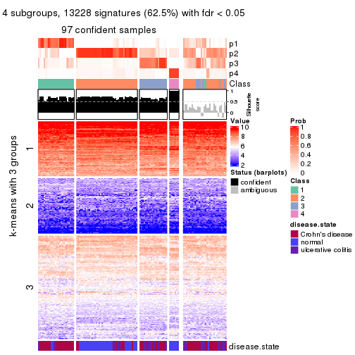</p>

</div>
<div id='tab-SD-hclust-get-signatures-no-scale-4'>
<pre><code class="r">get_signatures(res, k = 5, scale_rows = FALSE)
</code></pre>

<p></p>

</div>
<div id='tab-SD-hclust-get-signatures-no-scale-5'>
<pre><code class="r">get_signatures(res, k = 6, scale_rows = FALSE)
</code></pre>

<p></p>

</div>
</div>


Compare the overlap of signatures from different k:

```r
compare_signatures(res)
```


`get_signature()` returns a data frame invisibly. TO get the list of signatures, the function
call should be assigned to a variable explicitly. In following code, if `plot` argument is set
to `FALSE`, no heatmap is plotted while only the differential analysis is performed.

```r
# code only for demonstration
tb = get_signature(res, k = ..., plot = FALSE)
```

An example of the output of `tb` is:

```
#>   which_row         fdr    mean_1    mean_2 scaled_mean_1 scaled_mean_2 km
#> 1        38 0.042760348  8.373488  9.131774    -0.5533452     0.5164555  1
#> 2        40 0.018707592  7.106213  8.469186    -0.6173731     0.5762149  1
#> 3        55 0.019134737 10.221463 11.207825    -0.6159697     0.5749050  1
#> 4        59 0.006059896  5.921854  7.869574    -0.6899429     0.6439467  1
#> 5        60 0.018055526  8.928898 10.211722    -0.6204761     0.5791110  1
#> 6        98 0.009384629 15.714769 14.887706     0.6635654    -0.6193277  2
...
```

The columns in `tb` are:

1. `which_row`: row indices corresponding to the input matrix.
2. `fdr`: FDR for the differential test. 
3. `mean_x`: The mean value in group x.
4. `scaled_mean_x`: The mean value in group x after rows are scaled.
5. `km`: Row groups if k-means clustering is applied to rows.


UMAP plot which shows how samples are separated.


<script>
$( function() {
	$( '#tabs-SD-hclust-dimension-reduction' ).tabs();
} );
</script>
<div id='tabs-SD-hclust-dimension-reduction'>
<ul>
<li><a href='#tab-SD-hclust-dimension-reduction-1'>k = 2</a></li>
<li><a href='#tab-SD-hclust-dimension-reduction-2'>k = 3</a></li>
<li><a href='#tab-SD-hclust-dimension-reduction-3'>k = 4</a></li>
<li><a href='#tab-SD-hclust-dimension-reduction-4'>k = 5</a></li>
<li><a href='#tab-SD-hclust-dimension-reduction-5'>k = 6</a></li>
</ul>
<div id='tab-SD-hclust-dimension-reduction-1'>
<pre><code class="r">dimension_reduction(res, k = 2, method = &quot;UMAP&quot;)
</code></pre>

<p></p>

</div>
<div id='tab-SD-hclust-dimension-reduction-2'>
<pre><code class="r">dimension_reduction(res, k = 3, method = &quot;UMAP&quot;)
</code></pre>

<p></p>

</div>
<div id='tab-SD-hclust-dimension-reduction-3'>
<pre><code class="r">dimension_reduction(res, k = 4, method = &quot;UMAP&quot;)
</code></pre>

<p></p>

</div>
<div id='tab-SD-hclust-dimension-reduction-4'>
<pre><code class="r">dimension_reduction(res, k = 5, method = &quot;UMAP&quot;)
</code></pre>

<p></p>

</div>
<div id='tab-SD-hclust-dimension-reduction-5'>
<pre><code class="r">dimension_reduction(res, k = 6, method = &quot;UMAP&quot;)
</code></pre>

<p></p>

</div>
</div>


Following heatmap shows how subgroups are split when increasing `k`:

```r
collect_classes(res)
```


Test correlation between subgroups and known annotations. If the known
annotation is numeric, one-way ANOVA test is applied, and if the known
annotation is discrete, chi-squared contingency table test is applied.

```r
test_to_known_factors(res)
```

```
#>             n disease.state(p) k
#> SD:hclust 107         2.55e-06 2
#> SD:hclust 105         9.35e-07 3
#> SD:hclust  97         1.02e-11 4
#> SD:hclust  78         2.32e-13 5
#> SD:hclust  63         2.84e-11 6
```


If matrix rows can be associated to genes, consider to use `functional_enrichment(res,
...)` to perform function enrichment for the signature genes. See [this vignette](http://bioconductor.org/packages/devel/bioc/vignettes/cola/inst/doc/functional_enrichment.html) for more detailed explanations.


 

---------------------------------------------------


### SD:kmeans*


The object with results only for a single top-value method and a single partition method 
can be extracted as:

```r
res = res_list["SD", "kmeans"]
# you can also extract it by
# res = res_list["SD:kmeans"]
```

A summary of `res` and all the functions that can be applied to it:

```r
res
```

```
#> A 'ConsensusPartition' object with k = 2, 3, 4, 5, 6.
#>   On a matrix with 21168 rows and 127 columns.
#>   Top rows (1000, 2000, 3000, 4000, 5000) are extracted by 'SD' method.
#>   Subgroups are detected by 'kmeans' method.
#>   Performed in total 1250 partitions by row resampling.
#>   Best k for subgroups seems to be 2.
#> 
#> Following methods can be applied to this 'ConsensusPartition' object:
#>  [1] "cola_report"             "collect_classes"         "collect_plots"          
#>  [4] "collect_stats"           "colnames"                "compare_signatures"     
#>  [7] "consensus_heatmap"       "dimension_reduction"     "functional_enrichment"  
#> [10] "get_anno_col"            "get_anno"                "get_classes"            
#> [13] "get_consensus"           "get_matrix"              "get_membership"         
#> [16] "get_param"               "get_signatures"          "get_stats"              
#> [19] "is_best_k"               "is_stable_k"             "membership_heatmap"     
#> [22] "ncol"                    "nrow"                    "plot_ecdf"              
#> [25] "rownames"                "select_partition_number" "show"                   
#> [28] "suggest_best_k"          "test_to_known_factors"
```

`collect_plots()` function collects all the plots made from `res` for all `k` (number of partitions)
into one single page to provide an easy and fast comparison between different `k`.

```r
collect_plots(res)
```


The plots are:

- The first row: a plot of the ECDF (empirical cumulative distribution
  function) curves of the consensus matrix for each `k` and the heatmap of
  predicted classes for each `k`.
- The second row: heatmaps of the consensus matrix for each `k`.
- The third row: heatmaps of the membership matrix for each `k`.
- The fouth row: heatmaps of the signatures for each `k`.

All the plots in panels can be made by individual functions and they are
plotted later in this section.

`select_partition_number()` produces several plots showing different
statistics for choosing "optimized" `k`. There are following statistics:

- ECDF curves of the consensus matrix for each `k`;
- 1-PAC. [The PAC
  score](https://en.wikipedia.org/wiki/Consensus_clustering#Over-interpretation_potential_of_consensus_clustering)
  measures the proportion of the ambiguous subgrouping.
- Mean silhouette score.
- Concordance. The mean probability of fiting the consensus class ids in all
  partitions.
- Area increased. Denote $A_k$ as the area under the ECDF curve for current
  `k`, the area increased is defined as $A_k - A_{k-1}$.
- Rand index. The percent of pairs of samples that are both in a same cluster
  or both are not in a same cluster in the partition of k and k-1.
- Jaccard index. The ratio of pairs of samples are both in a same cluster in
  the partition of k and k-1 and the pairs of samples are both in a same
  cluster in the partition k or k-1.

The detailed explanations of these statistics can be found in [the _cola_
vignette](http://bioconductor.org/packages/devel/bioc/vignettes/cola/inst/doc/cola.html#toc_13).

Generally speaking, lower PAC score, higher mean silhouette score or higher
concordance corresponds to better partition. Rand index and Jaccard index
measure how similar the current partition is compared to partition with `k-1`.
If they are too similar, we won't accept `k` is better than `k-1`.

```r
select_partition_number(res)
```


The numeric values for all these statistics can be obtained by `get_stats()`.

```r
get_stats(res)
```

```
#>   k 1-PAC mean_silhouette concordance area_increased  Rand Jaccard
#> 2 2 0.922           0.948       0.977         0.5026 0.497   0.497
#> 3 3 0.580           0.775       0.862         0.2996 0.775   0.576
#> 4 4 0.626           0.662       0.774         0.1256 0.856   0.611
#> 5 5 0.735           0.768       0.856         0.0663 0.922   0.716
#> 6 6 0.706           0.632       0.787         0.0456 0.934   0.712
```

`suggest_best_k()` suggests the best $k$ based on these statistics. The rules are as follows:

- All $k$ with Jaccard index larger than 0.95 are removed because increasing
  $k$ does not provide enough extra information. If all $k$ are removed, it is
  marked as no subgroup is detected.
- For all $k$ with 1-PAC score larger than 0.9, the maximal $k$ is taken as
  the best $k$, and other $k$ are marked as optional $k$.
- If it does not fit the second rule. The $k$ with the maximal vote of the
  highest 1-PAC score, highest mean silhouette, and highest concordance is
  taken as the best $k$.

```r
suggest_best_k(res)
```

```
#> [1] 2
```


Following shows the table of the partitions (You need to click the **show/hide
code output** link to see it). The membership matrix (columns with name `p*`)
is inferred by
[`clue::cl_consensus()`](https://www.rdocumentation.org/link/cl_consensus?package=clue)
function with the `SE` method. Basically the value in the membership matrix
represents the probability to belong to a certain group. The finall class
label for an item is determined with the group with highest probability it
belongs to.

In `get_classes()` function, the entropy is calculated from the membership
matrix and the silhouette score is calculated from the consensus matrix.


<script>
$( function() {
	$( '#tabs-SD-kmeans-get-classes' ).tabs();
} );
</script>
<div id='tabs-SD-kmeans-get-classes'>
<ul>
<li><a href='#tab-SD-kmeans-get-classes-1'>k = 2</a></li>
<li><a href='#tab-SD-kmeans-get-classes-2'>k = 3</a></li>
<li><a href='#tab-SD-kmeans-get-classes-3'>k = 4</a></li>
<li><a href='#tab-SD-kmeans-get-classes-4'>k = 5</a></li>
<li><a href='#tab-SD-kmeans-get-classes-5'>k = 6</a></li>
</ul>

<div id='tab-SD-kmeans-get-classes-1'>
<p><a id='tab-SD-kmeans-get-classes-1-a' style='color:#0366d6' href='#'>show/hide code output</a></p>
<pre><code class="r">cbind(get_classes(res, k = 2), get_membership(res, k = 2))
</code></pre>

<pre><code>#&gt;          class entropy silhouette    p1    p2
#&gt; GSM76115     2  0.0000      0.981 0.000 1.000
#&gt; GSM76116     2  0.0000      0.981 0.000 1.000
#&gt; GSM76117     2  0.4690      0.893 0.100 0.900
#&gt; GSM76118     2  0.5059      0.881 0.112 0.888
#&gt; GSM76119     2  0.0000      0.981 0.000 1.000
#&gt; GSM76120     2  0.0000      0.981 0.000 1.000
#&gt; GSM76121     1  0.9754      0.314 0.592 0.408
#&gt; GSM76122     2  0.0000      0.981 0.000 1.000
#&gt; GSM76123     2  0.0000      0.981 0.000 1.000
#&gt; GSM76124     2  0.5737      0.853 0.136 0.864
#&gt; GSM76125     2  0.0000      0.981 0.000 1.000
#&gt; GSM76126     2  0.0000      0.981 0.000 1.000
#&gt; GSM76127     2  0.0000      0.981 0.000 1.000
#&gt; GSM76128     2  0.0376      0.978 0.004 0.996
#&gt; GSM76129     2  0.0000      0.981 0.000 1.000
#&gt; GSM76130     2  0.0000      0.981 0.000 1.000
#&gt; GSM76131     2  0.0000      0.981 0.000 1.000
#&gt; GSM76132     2  0.0000      0.981 0.000 1.000
#&gt; GSM76133     2  0.0000      0.981 0.000 1.000
#&gt; GSM76134     2  0.0000      0.981 0.000 1.000
#&gt; GSM76135     2  0.0000      0.981 0.000 1.000
#&gt; GSM76136     2  0.0000      0.981 0.000 1.000
#&gt; GSM76137     2  0.0000      0.981 0.000 1.000
#&gt; GSM76138     2  0.0000      0.981 0.000 1.000
#&gt; GSM76139     2  0.0000      0.981 0.000 1.000
#&gt; GSM76140     1  0.0000      0.971 1.000 0.000
#&gt; GSM76141     2  0.0000      0.981 0.000 1.000
#&gt; GSM76142     2  0.0000      0.981 0.000 1.000
#&gt; GSM76143     2  0.0000      0.981 0.000 1.000
#&gt; GSM76144     2  0.0000      0.981 0.000 1.000
#&gt; GSM76145     2  0.0000      0.981 0.000 1.000
#&gt; GSM76146     2  0.0000      0.981 0.000 1.000
#&gt; GSM76147     2  0.0000      0.981 0.000 1.000
#&gt; GSM76148     2  0.0000      0.981 0.000 1.000
#&gt; GSM76149     2  0.0000      0.981 0.000 1.000
#&gt; GSM76150     2  0.0000      0.981 0.000 1.000
#&gt; GSM76151     2  0.0000      0.981 0.000 1.000
#&gt; GSM76152     1  0.0000      0.971 1.000 0.000
#&gt; GSM76153     2  0.0000      0.981 0.000 1.000
#&gt; GSM76154     2  0.0000      0.981 0.000 1.000
#&gt; GSM76155     2  0.0000      0.981 0.000 1.000
#&gt; GSM76156     2  0.0000      0.981 0.000 1.000
#&gt; GSM76030     2  0.2043      0.956 0.032 0.968
#&gt; GSM76031     1  0.0000      0.971 1.000 0.000
#&gt; GSM76032     1  0.0000      0.971 1.000 0.000
#&gt; GSM76033     1  0.7376      0.748 0.792 0.208
#&gt; GSM76034     2  0.0000      0.981 0.000 1.000
#&gt; GSM76035     1  0.2236      0.943 0.964 0.036
#&gt; GSM76036     2  0.0000      0.981 0.000 1.000
#&gt; GSM76037     2  0.0000      0.981 0.000 1.000
#&gt; GSM76038     1  0.0000      0.971 1.000 0.000
#&gt; GSM76039     1  0.0000      0.971 1.000 0.000
#&gt; GSM76040     2  0.0000      0.981 0.000 1.000
#&gt; GSM76041     1  0.0000      0.971 1.000 0.000
#&gt; GSM76042     1  0.0000      0.971 1.000 0.000
#&gt; GSM76043     1  0.0000      0.971 1.000 0.000
#&gt; GSM76044     1  0.8386      0.631 0.732 0.268
#&gt; GSM76045     1  0.0000      0.971 1.000 0.000
#&gt; GSM76046     2  0.0000      0.981 0.000 1.000
#&gt; GSM76047     1  0.0000      0.971 1.000 0.000
#&gt; GSM76048     1  0.1633      0.953 0.976 0.024
#&gt; GSM76049     2  0.9129      0.527 0.328 0.672
#&gt; GSM76050     1  0.0000      0.971 1.000 0.000
#&gt; GSM76051     1  0.9815      0.312 0.580 0.420
#&gt; GSM76052     2  0.0000      0.981 0.000 1.000
#&gt; GSM76053     2  0.1843      0.959 0.028 0.972
#&gt; GSM76054     2  0.0000      0.981 0.000 1.000
#&gt; GSM76055     2  0.5059      0.881 0.112 0.888
#&gt; GSM76056     1  0.0000      0.971 1.000 0.000
#&gt; GSM76057     1  0.0000      0.971 1.000 0.000
#&gt; GSM76058     1  0.0000      0.971 1.000 0.000
#&gt; GSM76059     1  0.0000      0.971 1.000 0.000
#&gt; GSM76060     1  0.0000      0.971 1.000 0.000
#&gt; GSM76061     2  0.4690      0.894 0.100 0.900
#&gt; GSM76062     1  0.0000      0.971 1.000 0.000
#&gt; GSM76063     2  0.0000      0.981 0.000 1.000
#&gt; GSM76064     1  0.0000      0.971 1.000 0.000
#&gt; GSM76065     2  0.0376      0.978 0.004 0.996
#&gt; GSM76066     1  0.0000      0.971 1.000 0.000
#&gt; GSM76067     1  0.0000      0.971 1.000 0.000
#&gt; GSM76068     1  0.2423      0.940 0.960 0.040
#&gt; GSM76069     1  0.0000      0.971 1.000 0.000
#&gt; GSM76070     2  0.0000      0.981 0.000 1.000
#&gt; GSM76071     1  0.0000      0.971 1.000 0.000
#&gt; GSM76072     1  0.0000      0.971 1.000 0.000
#&gt; GSM76073     1  0.0000      0.971 1.000 0.000
#&gt; GSM76074     1  0.0000      0.971 1.000 0.000
#&gt; GSM76075     1  0.0376      0.968 0.996 0.004
#&gt; GSM76076     1  0.1184      0.959 0.984 0.016
#&gt; GSM76077     1  0.0000      0.971 1.000 0.000
#&gt; GSM76078     1  0.0000      0.971 1.000 0.000
#&gt; GSM76079     1  0.0000      0.971 1.000 0.000
#&gt; GSM76080     2  0.0000      0.981 0.000 1.000
#&gt; GSM76081     2  0.0000      0.981 0.000 1.000
#&gt; GSM76082     1  0.0672      0.965 0.992 0.008
#&gt; GSM76083     1  0.8207      0.668 0.744 0.256
#&gt; GSM76084     2  0.0000      0.981 0.000 1.000
#&gt; GSM76085     1  0.2423      0.940 0.960 0.040
#&gt; GSM76086     1  0.0000      0.971 1.000 0.000
#&gt; GSM76087     2  0.0000      0.981 0.000 1.000
#&gt; GSM76088     1  0.0000      0.971 1.000 0.000
#&gt; GSM76089     2  0.0000      0.981 0.000 1.000
#&gt; GSM76090     1  0.0000      0.971 1.000 0.000
#&gt; GSM76091     1  0.0000      0.971 1.000 0.000
#&gt; GSM76092     1  0.0000      0.971 1.000 0.000
#&gt; GSM76093     1  0.0000      0.971 1.000 0.000
#&gt; GSM76094     2  0.4562      0.898 0.096 0.904
#&gt; GSM76095     1  0.0000      0.971 1.000 0.000
#&gt; GSM76096     1  0.0000      0.971 1.000 0.000
#&gt; GSM76097     1  0.0000      0.971 1.000 0.000
#&gt; GSM76098     2  0.0000      0.981 0.000 1.000
#&gt; GSM76099     1  0.0000      0.971 1.000 0.000
#&gt; GSM76100     1  0.0000      0.971 1.000 0.000
#&gt; GSM76101     1  0.0000      0.971 1.000 0.000
#&gt; GSM76102     1  0.0000      0.971 1.000 0.000
#&gt; GSM76103     1  0.0000      0.971 1.000 0.000
#&gt; GSM76104     2  0.0376      0.978 0.004 0.996
#&gt; GSM76105     2  0.6623      0.805 0.172 0.828
#&gt; GSM76106     2  0.0000      0.981 0.000 1.000
#&gt; GSM76107     2  0.0000      0.981 0.000 1.000
#&gt; GSM76108     1  0.0000      0.971 1.000 0.000
#&gt; GSM76109     1  0.0000      0.971 1.000 0.000
#&gt; GSM76110     1  0.0000      0.971 1.000 0.000
#&gt; GSM76111     1  0.0000      0.971 1.000 0.000
#&gt; GSM76112     1  0.0000      0.971 1.000 0.000
#&gt; GSM76113     2  0.0000      0.981 0.000 1.000
#&gt; GSM76114     1  0.0000      0.971 1.000 0.000
</code></pre>

<script>
$('#tab-SD-kmeans-get-classes-1-a').parent().next().next().hide();
$('#tab-SD-kmeans-get-classes-1-a').click(function(){
  $('#tab-SD-kmeans-get-classes-1-a').parent().next().next().toggle();
  return(false);
});
</script>
</div>

<div id='tab-SD-kmeans-get-classes-2'>
<p><a id='tab-SD-kmeans-get-classes-2-a' style='color:#0366d6' href='#'>show/hide code output</a></p>
<pre><code class="r">cbind(get_classes(res, k = 3), get_membership(res, k = 3))
</code></pre>

<pre><code>#&gt;          class entropy silhouette    p1    p2    p3
#&gt; GSM76115     2  0.1636    0.84894 0.016 0.964 0.020
#&gt; GSM76116     2  0.4249    0.79594 0.108 0.864 0.028
#&gt; GSM76117     2  0.6819    0.58693 0.328 0.644 0.028
#&gt; GSM76118     2  0.7050    0.51144 0.372 0.600 0.028
#&gt; GSM76119     2  0.5529    0.63368 0.000 0.704 0.296
#&gt; GSM76120     2  0.5560    0.62794 0.000 0.700 0.300
#&gt; GSM76121     1  0.4249    0.76006 0.864 0.108 0.028
#&gt; GSM76122     2  0.4249    0.79594 0.108 0.864 0.028
#&gt; GSM76123     2  0.5560    0.62794 0.000 0.700 0.300
#&gt; GSM76124     2  0.7143    0.46248 0.396 0.576 0.028
#&gt; GSM76125     2  0.5560    0.62794 0.000 0.700 0.300
#&gt; GSM76126     2  0.5560    0.62794 0.000 0.700 0.300
#&gt; GSM76127     2  0.5560    0.62794 0.000 0.700 0.300
#&gt; GSM76128     3  0.3192    0.73241 0.000 0.112 0.888
#&gt; GSM76129     2  0.0592    0.85383 0.000 0.988 0.012
#&gt; GSM76130     2  0.5529    0.63368 0.000 0.704 0.296
#&gt; GSM76131     2  0.0000    0.85537 0.000 1.000 0.000
#&gt; GSM76132     2  0.0000    0.85537 0.000 1.000 0.000
#&gt; GSM76133     2  0.0000    0.85537 0.000 1.000 0.000
#&gt; GSM76134     2  0.0592    0.85383 0.000 0.988 0.012
#&gt; GSM76135     2  0.0000    0.85537 0.000 1.000 0.000
#&gt; GSM76136     2  0.0000    0.85537 0.000 1.000 0.000
#&gt; GSM76137     2  0.0592    0.85383 0.000 0.988 0.012
#&gt; GSM76138     2  0.1636    0.84894 0.016 0.964 0.020
#&gt; GSM76139     2  0.0000    0.85537 0.000 1.000 0.000
#&gt; GSM76140     1  0.0747    0.88860 0.984 0.000 0.016
#&gt; GSM76141     2  0.0000    0.85537 0.000 1.000 0.000
#&gt; GSM76142     2  0.0000    0.85537 0.000 1.000 0.000
#&gt; GSM76143     2  0.0000    0.85537 0.000 1.000 0.000
#&gt; GSM76144     2  0.0000    0.85537 0.000 1.000 0.000
#&gt; GSM76145     2  0.0592    0.85383 0.000 0.988 0.012
#&gt; GSM76146     2  0.0000    0.85537 0.000 1.000 0.000
#&gt; GSM76147     2  0.0000    0.85537 0.000 1.000 0.000
#&gt; GSM76148     2  0.0000    0.85537 0.000 1.000 0.000
#&gt; GSM76149     2  0.0592    0.85383 0.000 0.988 0.012
#&gt; GSM76150     2  0.0592    0.85383 0.000 0.988 0.012
#&gt; GSM76151     2  0.0592    0.85383 0.000 0.988 0.012
#&gt; GSM76152     1  0.3116    0.92569 0.892 0.000 0.108
#&gt; GSM76153     2  0.0000    0.85537 0.000 1.000 0.000
#&gt; GSM76154     2  0.0592    0.85383 0.000 0.988 0.012
#&gt; GSM76155     2  0.0592    0.85383 0.000 0.988 0.012
#&gt; GSM76156     2  0.0000    0.85537 0.000 1.000 0.000
#&gt; GSM76030     2  0.5722    0.76021 0.132 0.800 0.068
#&gt; GSM76031     1  0.3116    0.92569 0.892 0.000 0.108
#&gt; GSM76032     3  0.2878    0.76101 0.096 0.000 0.904
#&gt; GSM76033     3  0.3899    0.79294 0.056 0.056 0.888
#&gt; GSM76034     2  0.3340    0.79798 0.000 0.880 0.120
#&gt; GSM76035     3  0.3155    0.79086 0.044 0.040 0.916
#&gt; GSM76036     3  0.4452    0.72838 0.000 0.192 0.808
#&gt; GSM76037     2  0.4249    0.79594 0.108 0.864 0.028
#&gt; GSM76038     1  0.3116    0.92569 0.892 0.000 0.108
#&gt; GSM76039     1  0.0747    0.88860 0.984 0.000 0.016
#&gt; GSM76040     3  0.4452    0.72838 0.000 0.192 0.808
#&gt; GSM76041     1  0.3619    0.90479 0.864 0.000 0.136
#&gt; GSM76042     1  0.0747    0.88860 0.984 0.000 0.016
#&gt; GSM76043     3  0.6081    0.52700 0.344 0.004 0.652
#&gt; GSM76044     1  0.2492    0.84346 0.936 0.048 0.016
#&gt; GSM76045     1  0.3192    0.92337 0.888 0.000 0.112
#&gt; GSM76046     3  0.4291    0.73208 0.000 0.180 0.820
#&gt; GSM76047     3  0.5882    0.45053 0.348 0.000 0.652
#&gt; GSM76048     3  0.3237    0.78726 0.056 0.032 0.912
#&gt; GSM76049     2  0.7582    0.47121 0.380 0.572 0.048
#&gt; GSM76050     1  0.3482    0.91151 0.872 0.000 0.128
#&gt; GSM76051     3  0.3896    0.79320 0.052 0.060 0.888
#&gt; GSM76052     3  0.4291    0.73208 0.000 0.180 0.820
#&gt; GSM76053     3  0.6473    0.45142 0.016 0.332 0.652
#&gt; GSM76054     3  0.4452    0.72838 0.000 0.192 0.808
#&gt; GSM76055     2  0.6912    0.56580 0.344 0.628 0.028
#&gt; GSM76056     1  0.0000    0.89598 1.000 0.000 0.000
#&gt; GSM76057     1  0.2903    0.84718 0.924 0.048 0.028
#&gt; GSM76058     3  0.4178    0.70847 0.172 0.000 0.828
#&gt; GSM76059     1  0.3116    0.92569 0.892 0.000 0.108
#&gt; GSM76060     3  0.7784    0.41709 0.388 0.056 0.556
#&gt; GSM76061     2  0.5803    0.70345 0.212 0.760 0.028
#&gt; GSM76062     1  0.3116    0.92569 0.892 0.000 0.108
#&gt; GSM76063     2  0.2878    0.80724 0.000 0.904 0.096
#&gt; GSM76064     3  0.6308    0.00455 0.492 0.000 0.508
#&gt; GSM76065     2  0.3846    0.79410 0.108 0.876 0.016
#&gt; GSM76066     1  0.3686    0.90103 0.860 0.000 0.140
#&gt; GSM76067     3  0.5650    0.53277 0.312 0.000 0.688
#&gt; GSM76068     3  0.3456    0.78773 0.060 0.036 0.904
#&gt; GSM76069     1  0.0592    0.89072 0.988 0.000 0.012
#&gt; GSM76070     2  0.0000    0.85537 0.000 1.000 0.000
#&gt; GSM76071     1  0.3116    0.92569 0.892 0.000 0.108
#&gt; GSM76072     1  0.3116    0.92569 0.892 0.000 0.108
#&gt; GSM76073     1  0.3116    0.92569 0.892 0.000 0.108
#&gt; GSM76074     1  0.3116    0.92569 0.892 0.000 0.108
#&gt; GSM76075     3  0.3461    0.77920 0.076 0.024 0.900
#&gt; GSM76076     3  0.3530    0.78275 0.068 0.032 0.900
#&gt; GSM76077     1  0.4035    0.81203 0.880 0.040 0.080
#&gt; GSM76078     3  0.6420    0.57369 0.288 0.024 0.688
#&gt; GSM76079     1  0.3116    0.92569 0.892 0.000 0.108
#&gt; GSM76080     3  0.4346    0.73111 0.000 0.184 0.816
#&gt; GSM76081     3  0.4452    0.72838 0.000 0.192 0.808
#&gt; GSM76082     3  0.3207    0.77062 0.084 0.012 0.904
#&gt; GSM76083     3  0.3888    0.79330 0.048 0.064 0.888
#&gt; GSM76084     2  0.4291    0.72991 0.000 0.820 0.180
#&gt; GSM76085     3  0.3583    0.79089 0.056 0.044 0.900
#&gt; GSM76086     3  0.5650    0.53277 0.312 0.000 0.688
#&gt; GSM76087     2  0.0000    0.85537 0.000 1.000 0.000
#&gt; GSM76088     1  0.3889    0.81523 0.884 0.032 0.084
#&gt; GSM76089     2  0.2903    0.83156 0.048 0.924 0.028
#&gt; GSM76090     3  0.5894    0.65941 0.220 0.028 0.752
#&gt; GSM76091     1  0.3116    0.92569 0.892 0.000 0.108
#&gt; GSM76092     1  0.2959    0.92569 0.900 0.000 0.100
#&gt; GSM76093     1  0.3116    0.92569 0.892 0.000 0.108
#&gt; GSM76094     2  0.6912    0.56222 0.344 0.628 0.028
#&gt; GSM76095     1  0.0747    0.88860 0.984 0.000 0.016
#&gt; GSM76096     1  0.0747    0.88860 0.984 0.000 0.016
#&gt; GSM76097     1  0.0747    0.88860 0.984 0.000 0.016
#&gt; GSM76098     3  0.4452    0.72838 0.000 0.192 0.808
#&gt; GSM76099     1  0.0237    0.89787 0.996 0.000 0.004
#&gt; GSM76100     1  0.0747    0.90244 0.984 0.000 0.016
#&gt; GSM76101     1  0.3116    0.92569 0.892 0.000 0.108
#&gt; GSM76102     1  0.3038    0.92191 0.896 0.000 0.104
#&gt; GSM76103     3  0.5621    0.53958 0.308 0.000 0.692
#&gt; GSM76104     3  0.5111    0.75722 0.036 0.144 0.820
#&gt; GSM76105     2  0.7256    0.36207 0.440 0.532 0.028
#&gt; GSM76106     3  0.6274    0.13300 0.000 0.456 0.544
#&gt; GSM76107     2  0.5650    0.62357 0.000 0.688 0.312
#&gt; GSM76108     1  0.0983    0.88539 0.980 0.004 0.016
#&gt; GSM76109     1  0.3116    0.92569 0.892 0.000 0.108
#&gt; GSM76110     1  0.3038    0.92579 0.896 0.000 0.104
#&gt; GSM76111     1  0.2796    0.92464 0.908 0.000 0.092
#&gt; GSM76112     1  0.3116    0.92569 0.892 0.000 0.108
#&gt; GSM76113     3  0.5325    0.66237 0.004 0.248 0.748
#&gt; GSM76114     1  0.3038    0.92552 0.896 0.000 0.104
</code></pre>

<script>
$('#tab-SD-kmeans-get-classes-2-a').parent().next().next().hide();
$('#tab-SD-kmeans-get-classes-2-a').click(function(){
  $('#tab-SD-kmeans-get-classes-2-a').parent().next().next().toggle();
  return(false);
});
</script>
</div>

<div id='tab-SD-kmeans-get-classes-3'>
<p><a id='tab-SD-kmeans-get-classes-3-a' style='color:#0366d6' href='#'>show/hide code output</a></p>
<pre><code class="r">cbind(get_classes(res, k = 4), get_membership(res, k = 4))
</code></pre>

<pre><code>#&gt;          class entropy silhouette    p1    p2    p3    p4
#&gt; GSM76115     2  0.5936      0.537 0.080 0.684 0.004 0.232
#&gt; GSM76116     4  0.6555      0.401 0.080 0.340 0.004 0.576
#&gt; GSM76117     4  0.6129      0.523 0.076 0.268 0.004 0.652
#&gt; GSM76118     4  0.6077      0.531 0.076 0.260 0.004 0.660
#&gt; GSM76119     2  0.7323      0.530 0.408 0.464 0.120 0.008
#&gt; GSM76120     2  0.7273      0.525 0.408 0.460 0.128 0.004
#&gt; GSM76121     4  0.3292      0.546 0.080 0.036 0.004 0.880
#&gt; GSM76122     4  0.6507      0.421 0.080 0.328 0.004 0.588
#&gt; GSM76123     2  0.7273      0.525 0.408 0.460 0.128 0.004
#&gt; GSM76124     4  0.6050      0.535 0.076 0.256 0.004 0.664
#&gt; GSM76125     2  0.7235      0.528 0.408 0.464 0.124 0.004
#&gt; GSM76126     2  0.7235      0.528 0.408 0.464 0.124 0.004
#&gt; GSM76127     2  0.7273      0.525 0.408 0.460 0.128 0.004
#&gt; GSM76128     3  0.5223      0.538 0.408 0.004 0.584 0.004
#&gt; GSM76129     2  0.3485      0.764 0.076 0.872 0.004 0.048
#&gt; GSM76130     2  0.7323      0.530 0.408 0.464 0.120 0.008
#&gt; GSM76131     2  0.0188      0.791 0.004 0.996 0.000 0.000
#&gt; GSM76132     2  0.0188      0.791 0.004 0.996 0.000 0.000
#&gt; GSM76133     2  0.0188      0.791 0.004 0.996 0.000 0.000
#&gt; GSM76134     2  0.3366      0.768 0.076 0.880 0.008 0.036
#&gt; GSM76135     2  0.0188      0.791 0.004 0.996 0.000 0.000
#&gt; GSM76136     2  0.0188      0.791 0.004 0.996 0.000 0.000
#&gt; GSM76137     2  0.3884      0.765 0.092 0.856 0.016 0.036
#&gt; GSM76138     2  0.5708      0.568 0.076 0.708 0.004 0.212
#&gt; GSM76139     2  0.0188      0.791 0.004 0.996 0.000 0.000
#&gt; GSM76140     4  0.1305      0.426 0.036 0.000 0.004 0.960
#&gt; GSM76141     2  0.0188      0.791 0.004 0.996 0.000 0.000
#&gt; GSM76142     2  0.0188      0.791 0.004 0.996 0.000 0.000
#&gt; GSM76143     2  0.0188      0.791 0.004 0.996 0.000 0.000
#&gt; GSM76144     2  0.0188      0.791 0.004 0.996 0.000 0.000
#&gt; GSM76145     2  0.3793      0.764 0.076 0.864 0.016 0.044
#&gt; GSM76146     2  0.0188      0.791 0.004 0.996 0.000 0.000
#&gt; GSM76147     2  0.0524      0.788 0.004 0.988 0.000 0.008
#&gt; GSM76148     2  0.0188      0.791 0.004 0.996 0.000 0.000
#&gt; GSM76149     2  0.3629      0.764 0.076 0.868 0.008 0.048
#&gt; GSM76150     2  0.3544      0.765 0.076 0.872 0.008 0.044
#&gt; GSM76151     2  0.3673      0.765 0.076 0.868 0.012 0.044
#&gt; GSM76152     1  0.5320      0.957 0.572 0.000 0.012 0.416
#&gt; GSM76153     2  0.0188      0.791 0.004 0.996 0.000 0.000
#&gt; GSM76154     2  0.3629      0.764 0.076 0.868 0.008 0.048
#&gt; GSM76155     2  0.3567      0.762 0.076 0.868 0.004 0.052
#&gt; GSM76156     2  0.0188      0.791 0.004 0.996 0.000 0.000
#&gt; GSM76030     4  0.6492      0.376 0.060 0.372 0.008 0.560
#&gt; GSM76031     1  0.5329      0.956 0.568 0.000 0.012 0.420
#&gt; GSM76032     3  0.0657      0.879 0.012 0.000 0.984 0.004
#&gt; GSM76033     3  0.1675      0.875 0.044 0.004 0.948 0.004
#&gt; GSM76034     2  0.8603      0.375 0.088 0.520 0.200 0.192
#&gt; GSM76035     3  0.0712      0.882 0.004 0.004 0.984 0.008
#&gt; GSM76036     3  0.1863      0.874 0.040 0.012 0.944 0.004
#&gt; GSM76037     4  0.6555      0.401 0.080 0.340 0.004 0.576
#&gt; GSM76038     1  0.5417      0.958 0.572 0.000 0.016 0.412
#&gt; GSM76039     4  0.0921      0.431 0.028 0.000 0.000 0.972
#&gt; GSM76040     3  0.1953      0.873 0.044 0.012 0.940 0.004
#&gt; GSM76041     1  0.6668      0.839 0.528 0.000 0.092 0.380
#&gt; GSM76042     4  0.1211      0.413 0.040 0.000 0.000 0.960
#&gt; GSM76043     3  0.4949      0.719 0.060 0.000 0.760 0.180
#&gt; GSM76044     4  0.2499      0.527 0.044 0.032 0.004 0.920
#&gt; GSM76045     1  0.6211      0.802 0.488 0.000 0.052 0.460
#&gt; GSM76046     3  0.2040      0.872 0.048 0.012 0.936 0.004
#&gt; GSM76047     3  0.5307      0.700 0.076 0.000 0.736 0.188
#&gt; GSM76048     3  0.0376      0.882 0.004 0.004 0.992 0.000
#&gt; GSM76049     4  0.6150      0.514 0.060 0.292 0.008 0.640
#&gt; GSM76050     1  0.5971      0.924 0.584 0.000 0.048 0.368
#&gt; GSM76051     3  0.0188      0.882 0.000 0.004 0.996 0.000
#&gt; GSM76052     3  0.2040      0.872 0.048 0.012 0.936 0.004
#&gt; GSM76053     3  0.7994      0.423 0.112 0.072 0.560 0.256
#&gt; GSM76054     3  0.0844      0.880 0.004 0.012 0.980 0.004
#&gt; GSM76055     4  0.6092      0.522 0.072 0.272 0.004 0.652
#&gt; GSM76056     4  0.3052      0.215 0.136 0.000 0.004 0.860
#&gt; GSM76057     4  0.6750      0.581 0.068 0.232 0.044 0.656
#&gt; GSM76058     3  0.2530      0.838 0.100 0.000 0.896 0.004
#&gt; GSM76059     1  0.5300      0.958 0.580 0.000 0.012 0.408
#&gt; GSM76060     3  0.7476      0.287 0.068 0.048 0.520 0.364
#&gt; GSM76061     4  0.5132      0.336 0.004 0.448 0.000 0.548
#&gt; GSM76062     1  0.5376      0.954 0.588 0.000 0.016 0.396
#&gt; GSM76063     2  0.3489      0.735 0.008 0.856 0.124 0.012
#&gt; GSM76064     3  0.6201      0.599 0.124 0.000 0.664 0.212
#&gt; GSM76065     4  0.4925      0.368 0.000 0.428 0.000 0.572
#&gt; GSM76066     1  0.6391      0.874 0.588 0.000 0.084 0.328
#&gt; GSM76067     3  0.3052      0.812 0.136 0.000 0.860 0.004
#&gt; GSM76068     3  0.0376      0.882 0.004 0.004 0.992 0.000
#&gt; GSM76069     4  0.2281      0.316 0.096 0.000 0.000 0.904
#&gt; GSM76070     2  0.0657      0.787 0.004 0.984 0.000 0.012
#&gt; GSM76071     1  0.5376      0.954 0.588 0.000 0.016 0.396
#&gt; GSM76072     1  0.5279      0.956 0.588 0.000 0.012 0.400
#&gt; GSM76073     1  0.5320      0.958 0.572 0.000 0.012 0.416
#&gt; GSM76074     1  0.5329      0.956 0.568 0.000 0.012 0.420
#&gt; GSM76075     3  0.0712      0.881 0.008 0.004 0.984 0.004
#&gt; GSM76076     3  0.0712      0.881 0.008 0.004 0.984 0.004
#&gt; GSM76077     4  0.6049      0.564 0.044 0.124 0.092 0.740
#&gt; GSM76078     3  0.3681      0.817 0.104 0.004 0.856 0.036
#&gt; GSM76079     1  0.5300      0.957 0.580 0.000 0.012 0.408
#&gt; GSM76080     3  0.2707      0.857 0.068 0.016 0.908 0.008
#&gt; GSM76081     3  0.1798      0.874 0.040 0.016 0.944 0.000
#&gt; GSM76082     3  0.0712      0.881 0.008 0.004 0.984 0.004
#&gt; GSM76083     3  0.0376      0.882 0.004 0.004 0.992 0.000
#&gt; GSM76084     2  0.6640      0.616 0.108 0.652 0.224 0.016
#&gt; GSM76085     3  0.0188      0.882 0.000 0.004 0.996 0.000
#&gt; GSM76086     3  0.3105      0.810 0.140 0.000 0.856 0.004
#&gt; GSM76087     2  0.0336      0.790 0.008 0.992 0.000 0.000
#&gt; GSM76088     4  0.6375      0.462 0.068 0.052 0.172 0.708
#&gt; GSM76089     2  0.6725     -0.138 0.076 0.464 0.004 0.456
#&gt; GSM76090     3  0.2715      0.838 0.100 0.004 0.892 0.004
#&gt; GSM76091     1  0.5387      0.953 0.584 0.000 0.016 0.400
#&gt; GSM76092     1  0.5105      0.946 0.564 0.000 0.004 0.432
#&gt; GSM76093     1  0.5329      0.958 0.568 0.000 0.012 0.420
#&gt; GSM76094     4  0.6129      0.522 0.076 0.268 0.004 0.652
#&gt; GSM76095     4  0.1557      0.388 0.056 0.000 0.000 0.944
#&gt; GSM76096     4  0.4134     -0.260 0.260 0.000 0.000 0.740
#&gt; GSM76097     4  0.0921      0.426 0.028 0.000 0.000 0.972
#&gt; GSM76098     3  0.1953      0.873 0.044 0.012 0.940 0.004
#&gt; GSM76099     4  0.4509     -0.337 0.288 0.000 0.004 0.708
#&gt; GSM76100     1  0.5147      0.914 0.536 0.000 0.004 0.460
#&gt; GSM76101     1  0.5329      0.958 0.568 0.000 0.012 0.420
#&gt; GSM76102     4  0.5085     -0.610 0.376 0.000 0.008 0.616
#&gt; GSM76103     3  0.2831      0.824 0.120 0.000 0.876 0.004
#&gt; GSM76104     3  0.1909      0.874 0.048 0.008 0.940 0.004
#&gt; GSM76105     4  0.5873      0.554 0.076 0.232 0.004 0.688
#&gt; GSM76106     3  0.5057      0.751 0.140 0.060 0.784 0.016
#&gt; GSM76107     2  0.7323      0.530 0.408 0.464 0.120 0.008
#&gt; GSM76108     4  0.0707      0.436 0.020 0.000 0.000 0.980
#&gt; GSM76109     1  0.5329      0.958 0.568 0.000 0.012 0.420
#&gt; GSM76110     1  0.5220      0.952 0.568 0.000 0.008 0.424
#&gt; GSM76111     4  0.5257     -0.761 0.444 0.000 0.008 0.548
#&gt; GSM76112     1  0.5626      0.944 0.588 0.000 0.028 0.384
#&gt; GSM76113     3  0.4468      0.802 0.024 0.060 0.832 0.084
#&gt; GSM76114     4  0.5590     -0.766 0.456 0.000 0.020 0.524
</code></pre>

<script>
$('#tab-SD-kmeans-get-classes-3-a').parent().next().next().hide();
$('#tab-SD-kmeans-get-classes-3-a').click(function(){
  $('#tab-SD-kmeans-get-classes-3-a').parent().next().next().toggle();
  return(false);
});
</script>
</div>

<div id='tab-SD-kmeans-get-classes-4'>
<p><a id='tab-SD-kmeans-get-classes-4-a' style='color:#0366d6' href='#'>show/hide code output</a></p>
<pre><code class="r">cbind(get_classes(res, k = 5), get_membership(res, k = 5))
</code></pre>

<pre><code>#&gt;          class entropy silhouette    p1    p2    p3    p4    p5
#&gt; GSM76115     2  0.5737     0.2156 0.000 0.460 0.000 0.084 0.456
#&gt; GSM76116     5  0.2153     0.7837 0.000 0.044 0.000 0.040 0.916
#&gt; GSM76117     5  0.1914     0.7931 0.004 0.032 0.000 0.032 0.932
#&gt; GSM76118     5  0.1907     0.7943 0.000 0.028 0.000 0.044 0.928
#&gt; GSM76119     4  0.3643     0.9328 0.000 0.212 0.008 0.776 0.004
#&gt; GSM76120     4  0.3819     0.9369 0.000 0.208 0.016 0.772 0.004
#&gt; GSM76121     5  0.2291     0.7932 0.036 0.000 0.000 0.056 0.908
#&gt; GSM76122     5  0.2149     0.7875 0.000 0.036 0.000 0.048 0.916
#&gt; GSM76123     4  0.3819     0.9369 0.000 0.208 0.016 0.772 0.004
#&gt; GSM76124     5  0.1653     0.7979 0.004 0.024 0.000 0.028 0.944
#&gt; GSM76125     4  0.3751     0.9348 0.000 0.212 0.012 0.772 0.004
#&gt; GSM76126     4  0.3848     0.9295 0.000 0.196 0.012 0.780 0.012
#&gt; GSM76127     4  0.3819     0.9369 0.000 0.208 0.016 0.772 0.004
#&gt; GSM76128     4  0.3461     0.6356 0.000 0.000 0.224 0.772 0.004
#&gt; GSM76129     2  0.4183     0.7440 0.000 0.780 0.000 0.084 0.136
#&gt; GSM76130     4  0.3643     0.9328 0.000 0.212 0.008 0.776 0.004
#&gt; GSM76131     2  0.0000     0.8251 0.000 1.000 0.000 0.000 0.000
#&gt; GSM76132     2  0.0162     0.8245 0.000 0.996 0.000 0.004 0.000
#&gt; GSM76133     2  0.0000     0.8251 0.000 1.000 0.000 0.000 0.000
#&gt; GSM76134     2  0.4262     0.7470 0.000 0.776 0.000 0.100 0.124
#&gt; GSM76135     2  0.0000     0.8251 0.000 1.000 0.000 0.000 0.000
#&gt; GSM76136     2  0.0000     0.8251 0.000 1.000 0.000 0.000 0.000
#&gt; GSM76137     2  0.4468     0.7352 0.000 0.768 0.004 0.124 0.104
#&gt; GSM76138     2  0.5663     0.3522 0.000 0.508 0.000 0.080 0.412
#&gt; GSM76139     2  0.0000     0.8251 0.000 1.000 0.000 0.000 0.000
#&gt; GSM76140     5  0.3389     0.7647 0.116 0.000 0.000 0.048 0.836
#&gt; GSM76141     2  0.0000     0.8251 0.000 1.000 0.000 0.000 0.000
#&gt; GSM76142     2  0.0000     0.8251 0.000 1.000 0.000 0.000 0.000
#&gt; GSM76143     2  0.0000     0.8251 0.000 1.000 0.000 0.000 0.000
#&gt; GSM76144     2  0.0000     0.8251 0.000 1.000 0.000 0.000 0.000
#&gt; GSM76145     2  0.4517     0.7401 0.000 0.764 0.004 0.108 0.124
#&gt; GSM76146     2  0.0000     0.8251 0.000 1.000 0.000 0.000 0.000
#&gt; GSM76147     2  0.0912     0.8206 0.000 0.972 0.000 0.012 0.016
#&gt; GSM76148     2  0.0000     0.8251 0.000 1.000 0.000 0.000 0.000
#&gt; GSM76149     2  0.4307     0.7450 0.000 0.772 0.000 0.100 0.128
#&gt; GSM76150     2  0.4262     0.7470 0.000 0.776 0.000 0.100 0.124
#&gt; GSM76151     2  0.4468     0.7418 0.000 0.768 0.004 0.104 0.124
#&gt; GSM76152     1  0.2077     0.8801 0.920 0.000 0.000 0.040 0.040
#&gt; GSM76153     2  0.0000     0.8251 0.000 1.000 0.000 0.000 0.000
#&gt; GSM76154     2  0.4291     0.7441 0.000 0.772 0.000 0.092 0.136
#&gt; GSM76155     2  0.4294     0.7380 0.000 0.768 0.000 0.080 0.152
#&gt; GSM76156     2  0.0000     0.8251 0.000 1.000 0.000 0.000 0.000
#&gt; GSM76030     5  0.2989     0.7698 0.000 0.072 0.000 0.060 0.868
#&gt; GSM76031     1  0.1830     0.8852 0.932 0.000 0.000 0.040 0.028
#&gt; GSM76032     3  0.0451     0.8884 0.004 0.000 0.988 0.000 0.008
#&gt; GSM76033     3  0.1282     0.8793 0.000 0.000 0.952 0.044 0.004
#&gt; GSM76034     5  0.8005     0.1391 0.000 0.248 0.212 0.116 0.424
#&gt; GSM76035     3  0.2152     0.8730 0.004 0.000 0.920 0.044 0.032
#&gt; GSM76036     3  0.1197     0.8775 0.000 0.000 0.952 0.048 0.000
#&gt; GSM76037     5  0.2074     0.7852 0.000 0.044 0.000 0.036 0.920
#&gt; GSM76038     1  0.1915     0.8792 0.928 0.000 0.000 0.040 0.032
#&gt; GSM76039     5  0.3412     0.7381 0.152 0.000 0.000 0.028 0.820
#&gt; GSM76040     3  0.1430     0.8762 0.000 0.000 0.944 0.052 0.004
#&gt; GSM76041     1  0.5787     0.7136 0.704 0.000 0.112 0.092 0.092
#&gt; GSM76042     5  0.2984     0.7633 0.108 0.000 0.000 0.032 0.860
#&gt; GSM76043     3  0.5211     0.6851 0.012 0.000 0.708 0.104 0.176
#&gt; GSM76044     5  0.1493     0.7964 0.028 0.000 0.000 0.024 0.948
#&gt; GSM76045     1  0.5416     0.7059 0.716 0.000 0.040 0.088 0.156
#&gt; GSM76046     3  0.2416     0.8543 0.000 0.000 0.888 0.100 0.012
#&gt; GSM76047     3  0.5778     0.5585 0.016 0.000 0.632 0.096 0.256
#&gt; GSM76048     3  0.0000     0.8889 0.000 0.000 1.000 0.000 0.000
#&gt; GSM76049     5  0.1836     0.7951 0.000 0.032 0.000 0.036 0.932
#&gt; GSM76050     1  0.2374     0.8570 0.912 0.000 0.052 0.020 0.016
#&gt; GSM76051     3  0.0162     0.8886 0.000 0.000 0.996 0.004 0.000
#&gt; GSM76052     3  0.1952     0.8663 0.000 0.000 0.912 0.084 0.004
#&gt; GSM76053     5  0.6041     0.2739 0.000 0.008 0.344 0.104 0.544
#&gt; GSM76054     3  0.0451     0.8885 0.000 0.000 0.988 0.008 0.004
#&gt; GSM76055     5  0.1356     0.7985 0.004 0.028 0.000 0.012 0.956
#&gt; GSM76056     5  0.5719     0.4698 0.284 0.000 0.000 0.120 0.596
#&gt; GSM76057     5  0.4670     0.7501 0.040 0.032 0.016 0.124 0.788
#&gt; GSM76058     3  0.1200     0.8832 0.016 0.000 0.964 0.012 0.008
#&gt; GSM76059     1  0.0693     0.8887 0.980 0.000 0.000 0.008 0.012
#&gt; GSM76060     3  0.6577     0.2884 0.016 0.004 0.508 0.124 0.348
#&gt; GSM76061     5  0.4617     0.6924 0.000 0.148 0.000 0.108 0.744
#&gt; GSM76062     1  0.0693     0.8883 0.980 0.000 0.000 0.008 0.012
#&gt; GSM76063     2  0.4843     0.6314 0.000 0.760 0.136 0.072 0.032
#&gt; GSM76064     3  0.6242     0.6224 0.052 0.000 0.644 0.124 0.180
#&gt; GSM76065     5  0.1943     0.7923 0.000 0.056 0.000 0.020 0.924
#&gt; GSM76066     1  0.3164     0.8190 0.868 0.000 0.084 0.028 0.020
#&gt; GSM76067     3  0.2149     0.8694 0.036 0.000 0.924 0.028 0.012
#&gt; GSM76068     3  0.0613     0.8883 0.004 0.000 0.984 0.004 0.008
#&gt; GSM76069     5  0.5322     0.6184 0.188 0.000 0.000 0.140 0.672
#&gt; GSM76070     2  0.1582     0.8068 0.000 0.944 0.000 0.028 0.028
#&gt; GSM76071     1  0.0798     0.8856 0.976 0.000 0.000 0.016 0.008
#&gt; GSM76072     1  0.0693     0.8863 0.980 0.000 0.000 0.012 0.008
#&gt; GSM76073     1  0.0404     0.8888 0.988 0.000 0.000 0.000 0.012
#&gt; GSM76074     1  0.0404     0.8888 0.988 0.000 0.000 0.000 0.012
#&gt; GSM76075     3  0.0854     0.8874 0.004 0.000 0.976 0.008 0.012
#&gt; GSM76076     3  0.0613     0.8883 0.004 0.000 0.984 0.004 0.008
#&gt; GSM76077     5  0.3352     0.7674 0.016 0.008 0.016 0.104 0.856
#&gt; GSM76078     3  0.3654     0.8189 0.020 0.000 0.836 0.108 0.036
#&gt; GSM76079     1  0.1549     0.8834 0.944 0.000 0.000 0.040 0.016
#&gt; GSM76080     3  0.2824     0.8371 0.000 0.000 0.864 0.116 0.020
#&gt; GSM76081     3  0.1704     0.8694 0.000 0.000 0.928 0.068 0.004
#&gt; GSM76082     3  0.0613     0.8883 0.004 0.000 0.984 0.004 0.008
#&gt; GSM76083     3  0.0451     0.8885 0.000 0.000 0.988 0.004 0.008
#&gt; GSM76084     2  0.7609     0.2524 0.000 0.484 0.260 0.148 0.108
#&gt; GSM76085     3  0.0000     0.8889 0.000 0.000 1.000 0.000 0.000
#&gt; GSM76086     3  0.2060     0.8691 0.036 0.000 0.928 0.024 0.012
#&gt; GSM76087     2  0.0609     0.8201 0.000 0.980 0.000 0.020 0.000
#&gt; GSM76088     5  0.5331     0.7060 0.036 0.012 0.080 0.128 0.744
#&gt; GSM76089     5  0.4921     0.2152 0.000 0.360 0.000 0.036 0.604
#&gt; GSM76090     3  0.1701     0.8787 0.016 0.000 0.944 0.028 0.012
#&gt; GSM76091     1  0.3146     0.8460 0.844 0.000 0.000 0.128 0.028
#&gt; GSM76092     1  0.1648     0.8833 0.940 0.000 0.000 0.040 0.020
#&gt; GSM76093     1  0.1648     0.8833 0.940 0.000 0.000 0.040 0.020
#&gt; GSM76094     5  0.1493     0.7963 0.000 0.028 0.000 0.024 0.948
#&gt; GSM76095     5  0.3681     0.7262 0.148 0.000 0.000 0.044 0.808
#&gt; GSM76096     5  0.5795     0.1390 0.412 0.000 0.000 0.092 0.496
#&gt; GSM76097     5  0.3868     0.7267 0.140 0.000 0.000 0.060 0.800
#&gt; GSM76098     3  0.1831     0.8649 0.000 0.000 0.920 0.076 0.004
#&gt; GSM76099     5  0.6153     0.0895 0.408 0.000 0.000 0.132 0.460
#&gt; GSM76100     1  0.2514     0.8740 0.896 0.000 0.000 0.060 0.044
#&gt; GSM76101     1  0.1648     0.8833 0.940 0.000 0.000 0.040 0.020
#&gt; GSM76102     1  0.5486     0.3594 0.572 0.000 0.000 0.076 0.352
#&gt; GSM76103     3  0.1804     0.8752 0.024 0.000 0.940 0.024 0.012
#&gt; GSM76104     3  0.2068     0.8595 0.000 0.000 0.904 0.092 0.004
#&gt; GSM76105     5  0.1471     0.7975 0.004 0.024 0.000 0.020 0.952
#&gt; GSM76106     3  0.4661     0.7081 0.000 0.008 0.744 0.180 0.068
#&gt; GSM76107     4  0.4087     0.8967 0.000 0.168 0.008 0.784 0.040
#&gt; GSM76108     5  0.2951     0.7617 0.112 0.000 0.000 0.028 0.860
#&gt; GSM76109     1  0.1648     0.8833 0.940 0.000 0.000 0.040 0.020
#&gt; GSM76110     1  0.1444     0.8888 0.948 0.000 0.000 0.040 0.012
#&gt; GSM76111     1  0.4465     0.6915 0.732 0.000 0.000 0.056 0.212
#&gt; GSM76112     1  0.1012     0.8854 0.968 0.000 0.000 0.020 0.012
#&gt; GSM76113     3  0.4113     0.7579 0.000 0.008 0.788 0.048 0.156
#&gt; GSM76114     1  0.6280     0.5344 0.588 0.000 0.016 0.156 0.240
</code></pre>

<script>
$('#tab-SD-kmeans-get-classes-4-a').parent().next().next().hide();
$('#tab-SD-kmeans-get-classes-4-a').click(function(){
  $('#tab-SD-kmeans-get-classes-4-a').parent().next().next().toggle();
  return(false);
});
</script>
</div>

<div id='tab-SD-kmeans-get-classes-5'>
<p><a id='tab-SD-kmeans-get-classes-5-a' style='color:#0366d6' href='#'>show/hide code output</a></p>
<pre><code class="r">cbind(get_classes(res, k = 6), get_membership(res, k = 6))
</code></pre>

<pre><code>#&gt;          class entropy silhouette    p1    p2    p3    p4    p5    p6
#&gt; GSM76115     5  0.4829     0.3527 0.000 0.240 0.000 0.072 0.672 0.016
#&gt; GSM76116     5  0.2170     0.6113 0.000 0.016 0.000 0.016 0.908 0.060
#&gt; GSM76117     5  0.1129     0.6204 0.008 0.004 0.000 0.012 0.964 0.012
#&gt; GSM76118     5  0.1138     0.6288 0.004 0.000 0.000 0.012 0.960 0.024
#&gt; GSM76119     4  0.2048     0.9614 0.000 0.120 0.000 0.880 0.000 0.000
#&gt; GSM76120     4  0.2048     0.9614 0.000 0.120 0.000 0.880 0.000 0.000
#&gt; GSM76121     5  0.4008     0.5393 0.088 0.000 0.000 0.028 0.792 0.092
#&gt; GSM76122     5  0.0748     0.6286 0.000 0.004 0.000 0.004 0.976 0.016
#&gt; GSM76123     4  0.2048     0.9614 0.000 0.120 0.000 0.880 0.000 0.000
#&gt; GSM76124     5  0.2146     0.6062 0.004 0.000 0.000 0.000 0.880 0.116
#&gt; GSM76125     4  0.2048     0.9614 0.000 0.120 0.000 0.880 0.000 0.000
#&gt; GSM76126     4  0.3193     0.9381 0.000 0.112 0.004 0.840 0.008 0.036
#&gt; GSM76127     4  0.2048     0.9614 0.000 0.120 0.000 0.880 0.000 0.000
#&gt; GSM76128     4  0.2312     0.7904 0.000 0.000 0.112 0.876 0.000 0.012
#&gt; GSM76129     2  0.5031     0.5180 0.000 0.584 0.000 0.036 0.352 0.028
#&gt; GSM76130     4  0.2048     0.9614 0.000 0.120 0.000 0.880 0.000 0.000
#&gt; GSM76131     2  0.0000     0.7956 0.000 1.000 0.000 0.000 0.000 0.000
#&gt; GSM76132     2  0.0000     0.7956 0.000 1.000 0.000 0.000 0.000 0.000
#&gt; GSM76133     2  0.0000     0.7956 0.000 1.000 0.000 0.000 0.000 0.000
#&gt; GSM76134     2  0.5171     0.6467 0.000 0.628 0.000 0.080 0.272 0.020
#&gt; GSM76135     2  0.0000     0.7956 0.000 1.000 0.000 0.000 0.000 0.000
#&gt; GSM76136     2  0.0000     0.7956 0.000 1.000 0.000 0.000 0.000 0.000
#&gt; GSM76137     2  0.5273     0.6455 0.000 0.624 0.000 0.084 0.268 0.024
#&gt; GSM76138     5  0.4986     0.2012 0.000 0.304 0.000 0.060 0.620 0.016
#&gt; GSM76139     2  0.0000     0.7956 0.000 1.000 0.000 0.000 0.000 0.000
#&gt; GSM76140     5  0.4582     0.4649 0.168 0.000 0.000 0.032 0.732 0.068
#&gt; GSM76141     2  0.0000     0.7956 0.000 1.000 0.000 0.000 0.000 0.000
#&gt; GSM76142     2  0.0000     0.7956 0.000 1.000 0.000 0.000 0.000 0.000
#&gt; GSM76143     2  0.0000     0.7956 0.000 1.000 0.000 0.000 0.000 0.000
#&gt; GSM76144     2  0.0000     0.7956 0.000 1.000 0.000 0.000 0.000 0.000
#&gt; GSM76145     2  0.6090     0.6045 0.000 0.580 0.020 0.076 0.276 0.048
#&gt; GSM76146     2  0.0000     0.7956 0.000 1.000 0.000 0.000 0.000 0.000
#&gt; GSM76147     2  0.1003     0.7877 0.000 0.964 0.000 0.016 0.020 0.000
#&gt; GSM76148     2  0.0000     0.7956 0.000 1.000 0.000 0.000 0.000 0.000
#&gt; GSM76149     2  0.5246     0.6447 0.000 0.624 0.000 0.080 0.272 0.024
#&gt; GSM76150     2  0.5171     0.6467 0.000 0.628 0.000 0.080 0.272 0.020
#&gt; GSM76151     2  0.5246     0.6447 0.000 0.624 0.000 0.080 0.272 0.024
#&gt; GSM76152     1  0.3827     0.7229 0.808 0.000 0.000 0.032 0.072 0.088
#&gt; GSM76153     2  0.0000     0.7956 0.000 1.000 0.000 0.000 0.000 0.000
#&gt; GSM76154     2  0.5218     0.6427 0.000 0.624 0.000 0.076 0.276 0.024
#&gt; GSM76155     2  0.5083     0.6397 0.000 0.628 0.000 0.068 0.284 0.020
#&gt; GSM76156     2  0.0000     0.7956 0.000 1.000 0.000 0.000 0.000 0.000
#&gt; GSM76030     5  0.4868     0.5176 0.000 0.076 0.008 0.016 0.700 0.200
#&gt; GSM76031     1  0.3666     0.7311 0.820 0.000 0.000 0.032 0.064 0.084
#&gt; GSM76032     3  0.2118     0.8516 0.000 0.000 0.888 0.008 0.000 0.104
#&gt; GSM76033     3  0.2365     0.8404 0.000 0.000 0.888 0.040 0.000 0.072
#&gt; GSM76034     5  0.8016     0.1491 0.000 0.148 0.216 0.064 0.424 0.148
#&gt; GSM76035     3  0.4037     0.7626 0.020 0.000 0.788 0.020 0.028 0.144
#&gt; GSM76036     3  0.0520     0.8608 0.000 0.000 0.984 0.008 0.000 0.008
#&gt; GSM76037     5  0.1745     0.6238 0.000 0.012 0.000 0.000 0.920 0.068
#&gt; GSM76038     1  0.3876     0.7197 0.804 0.000 0.000 0.032 0.072 0.092
#&gt; GSM76039     5  0.5261     0.3849 0.092 0.000 0.000 0.024 0.636 0.248
#&gt; GSM76040     3  0.0909     0.8583 0.000 0.000 0.968 0.020 0.000 0.012
#&gt; GSM76041     6  0.5966     0.0778 0.376 0.000 0.060 0.028 0.024 0.512
#&gt; GSM76042     5  0.5083     0.3577 0.068 0.000 0.000 0.020 0.628 0.284
#&gt; GSM76043     6  0.5555     0.0209 0.012 0.000 0.440 0.016 0.056 0.476
#&gt; GSM76044     5  0.3636     0.5390 0.012 0.000 0.000 0.016 0.764 0.208
#&gt; GSM76045     1  0.5681     0.1384 0.492 0.000 0.008 0.036 0.048 0.416
#&gt; GSM76046     3  0.3434     0.8017 0.000 0.000 0.820 0.060 0.008 0.112
#&gt; GSM76047     6  0.5995    -0.0158 0.032 0.000 0.432 0.012 0.072 0.452
#&gt; GSM76048     3  0.0937     0.8650 0.000 0.000 0.960 0.000 0.000 0.040
#&gt; GSM76049     5  0.3426     0.4888 0.000 0.004 0.000 0.000 0.720 0.276
#&gt; GSM76050     1  0.2119     0.7748 0.912 0.000 0.004 0.016 0.008 0.060
#&gt; GSM76051     3  0.0000     0.8625 0.000 0.000 1.000 0.000 0.000 0.000
#&gt; GSM76052     3  0.3330     0.8073 0.000 0.000 0.828 0.056 0.008 0.108
#&gt; GSM76053     5  0.6450     0.1296 0.000 0.000 0.308 0.060 0.492 0.140
#&gt; GSM76054     3  0.0363     0.8616 0.000 0.000 0.988 0.000 0.000 0.012
#&gt; GSM76055     5  0.3163     0.5387 0.000 0.004 0.000 0.000 0.764 0.232
#&gt; GSM76056     6  0.5023     0.4353 0.104 0.000 0.000 0.016 0.212 0.668
#&gt; GSM76057     6  0.4031     0.3509 0.000 0.000 0.008 0.008 0.332 0.652
#&gt; GSM76058     3  0.2308     0.8443 0.004 0.000 0.880 0.008 0.000 0.108
#&gt; GSM76059     1  0.1461     0.7950 0.940 0.000 0.000 0.016 0.000 0.044
#&gt; GSM76060     6  0.5193     0.4313 0.000 0.000 0.200 0.004 0.164 0.632
#&gt; GSM76061     6  0.5494     0.0678 0.000 0.100 0.000 0.008 0.400 0.492
#&gt; GSM76062     1  0.1738     0.7963 0.928 0.000 0.000 0.016 0.004 0.052
#&gt; GSM76063     2  0.5812     0.5259 0.000 0.652 0.188 0.040 0.028 0.092
#&gt; GSM76064     6  0.6135     0.2993 0.084 0.000 0.308 0.012 0.048 0.548
#&gt; GSM76065     5  0.4230     0.5151 0.000 0.056 0.000 0.004 0.716 0.224
#&gt; GSM76066     1  0.3352     0.6867 0.812 0.000 0.032 0.008 0.000 0.148
#&gt; GSM76067     3  0.2790     0.8249 0.020 0.000 0.856 0.008 0.000 0.116
#&gt; GSM76068     3  0.1219     0.8585 0.000 0.000 0.948 0.004 0.000 0.048
#&gt; GSM76069     6  0.5027     0.3910 0.068 0.000 0.000 0.020 0.272 0.640
#&gt; GSM76070     2  0.3637     0.7094 0.000 0.832 0.024 0.028 0.024 0.092
#&gt; GSM76071     1  0.0717     0.7961 0.976 0.000 0.000 0.008 0.000 0.016
#&gt; GSM76072     1  0.0717     0.7961 0.976 0.000 0.000 0.008 0.000 0.016
#&gt; GSM76073     1  0.0363     0.7998 0.988 0.000 0.000 0.012 0.000 0.000
#&gt; GSM76074     1  0.0363     0.7998 0.988 0.000 0.000 0.012 0.000 0.000
#&gt; GSM76075     3  0.2257     0.8466 0.000 0.000 0.876 0.008 0.000 0.116
#&gt; GSM76076     3  0.1588     0.8527 0.000 0.000 0.924 0.004 0.000 0.072
#&gt; GSM76077     6  0.4079     0.2686 0.000 0.000 0.008 0.004 0.380 0.608
#&gt; GSM76078     3  0.4191     0.4823 0.004 0.000 0.596 0.012 0.000 0.388
#&gt; GSM76079     1  0.2815     0.7651 0.848 0.000 0.000 0.032 0.000 0.120
#&gt; GSM76080     3  0.4051     0.7602 0.000 0.000 0.792 0.080 0.036 0.092
#&gt; GSM76081     3  0.0914     0.8588 0.000 0.000 0.968 0.016 0.000 0.016
#&gt; GSM76082     3  0.1219     0.8585 0.000 0.000 0.948 0.004 0.000 0.048
#&gt; GSM76083     3  0.1219     0.8585 0.000 0.000 0.948 0.004 0.000 0.048
#&gt; GSM76084     2  0.8286     0.2462 0.000 0.340 0.232 0.096 0.248 0.084
#&gt; GSM76085     3  0.0713     0.8636 0.000 0.000 0.972 0.000 0.000 0.028
#&gt; GSM76086     3  0.3101     0.8193 0.020 0.000 0.832 0.012 0.000 0.136
#&gt; GSM76087     2  0.0790     0.7832 0.000 0.968 0.000 0.032 0.000 0.000
#&gt; GSM76088     6  0.4153     0.3970 0.004 0.000 0.020 0.004 0.292 0.680
#&gt; GSM76089     5  0.4523     0.4265 0.000 0.240 0.000 0.020 0.696 0.044
#&gt; GSM76090     3  0.2400     0.8346 0.004 0.000 0.872 0.008 0.000 0.116
#&gt; GSM76091     6  0.4803    -0.1344 0.424 0.000 0.000 0.044 0.004 0.528
#&gt; GSM76092     1  0.2901     0.7607 0.840 0.000 0.000 0.032 0.000 0.128
#&gt; GSM76093     1  0.2815     0.7651 0.848 0.000 0.000 0.032 0.000 0.120
#&gt; GSM76094     5  0.1082     0.6314 0.000 0.004 0.000 0.000 0.956 0.040
#&gt; GSM76095     5  0.5615     0.2101 0.088 0.000 0.000 0.028 0.556 0.328
#&gt; GSM76096     6  0.6281     0.0517 0.132 0.000 0.000 0.040 0.396 0.432
#&gt; GSM76097     5  0.5076     0.2080 0.040 0.000 0.000 0.020 0.528 0.412
#&gt; GSM76098     3  0.1633     0.8493 0.000 0.000 0.932 0.024 0.000 0.044
#&gt; GSM76099     6  0.5569     0.4206 0.144 0.000 0.000 0.028 0.204 0.624
#&gt; GSM76100     1  0.4586     0.5608 0.640 0.000 0.000 0.036 0.012 0.312
#&gt; GSM76101     1  0.2815     0.7651 0.848 0.000 0.000 0.032 0.000 0.120
#&gt; GSM76102     1  0.6730    -0.0591 0.380 0.000 0.000 0.044 0.220 0.356
#&gt; GSM76103     3  0.3004     0.8217 0.012 0.000 0.832 0.012 0.000 0.144
#&gt; GSM76104     3  0.3368     0.8052 0.000 0.000 0.820 0.060 0.004 0.116
#&gt; GSM76105     5  0.2006     0.6199 0.004 0.000 0.000 0.000 0.892 0.104
#&gt; GSM76106     3  0.6181     0.5007 0.000 0.004 0.604 0.116 0.184 0.092
#&gt; GSM76107     4  0.3330     0.9291 0.000 0.100 0.004 0.840 0.020 0.036
#&gt; GSM76108     5  0.4680     0.2777 0.028 0.000 0.000 0.012 0.576 0.384
#&gt; GSM76109     1  0.2815     0.7651 0.848 0.000 0.000 0.032 0.000 0.120
#&gt; GSM76110     1  0.3170     0.7796 0.840 0.000 0.000 0.032 0.016 0.112
#&gt; GSM76111     1  0.5884     0.3846 0.556 0.000 0.000 0.028 0.136 0.280
#&gt; GSM76112     1  0.0603     0.7995 0.980 0.000 0.000 0.004 0.000 0.016
#&gt; GSM76113     3  0.5718     0.4806 0.000 0.000 0.596 0.028 0.236 0.140
#&gt; GSM76114     6  0.4584     0.4287 0.184 0.000 0.000 0.028 0.064 0.724
</code></pre>

<script>
$('#tab-SD-kmeans-get-classes-5-a').parent().next().next().hide();
$('#tab-SD-kmeans-get-classes-5-a').click(function(){
  $('#tab-SD-kmeans-get-classes-5-a').parent().next().next().toggle();
  return(false);
});
</script>
</div>
</div>

Heatmaps for the consensus matrix. It visualizes the probability of two
samples to be in a same group.


<script>
$( function() {
	$( '#tabs-SD-kmeans-consensus-heatmap' ).tabs();
} );
</script>
<div id='tabs-SD-kmeans-consensus-heatmap'>
<ul>
<li><a href='#tab-SD-kmeans-consensus-heatmap-1'>k = 2</a></li>
<li><a href='#tab-SD-kmeans-consensus-heatmap-2'>k = 3</a></li>
<li><a href='#tab-SD-kmeans-consensus-heatmap-3'>k = 4</a></li>
<li><a href='#tab-SD-kmeans-consensus-heatmap-4'>k = 5</a></li>
<li><a href='#tab-SD-kmeans-consensus-heatmap-5'>k = 6</a></li>
</ul>
<div id='tab-SD-kmeans-consensus-heatmap-1'>
<pre><code class="r">consensus_heatmap(res, k = 2)
</code></pre>

<p></p>

</div>
<div id='tab-SD-kmeans-consensus-heatmap-2'>
<pre><code class="r">consensus_heatmap(res, k = 3)
</code></pre>

<p></p>

</div>
<div id='tab-SD-kmeans-consensus-heatmap-3'>
<pre><code class="r">consensus_heatmap(res, k = 4)
</code></pre>

<p>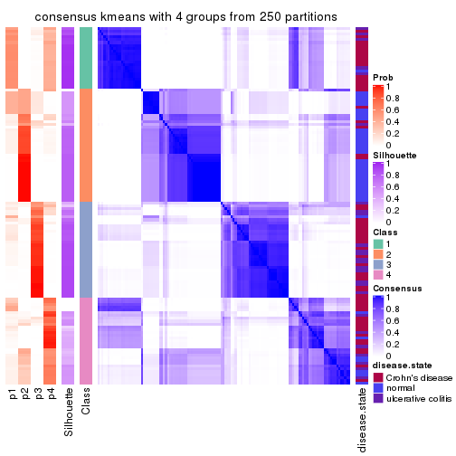</p>

</div>
<div id='tab-SD-kmeans-consensus-heatmap-4'>
<pre><code class="r">consensus_heatmap(res, k = 5)
</code></pre>

<p></p>

</div>
<div id='tab-SD-kmeans-consensus-heatmap-5'>
<pre><code class="r">consensus_heatmap(res, k = 6)
</code></pre>

<p></p>

</div>
</div>

Heatmaps for the membership of samples in all partitions to see how consistent they are:


<script>
$( function() {
	$( '#tabs-SD-kmeans-membership-heatmap' ).tabs();
} );
</script>
<div id='tabs-SD-kmeans-membership-heatmap'>
<ul>
<li><a href='#tab-SD-kmeans-membership-heatmap-1'>k = 2</a></li>
<li><a href='#tab-SD-kmeans-membership-heatmap-2'>k = 3</a></li>
<li><a href='#tab-SD-kmeans-membership-heatmap-3'>k = 4</a></li>
<li><a href='#tab-SD-kmeans-membership-heatmap-4'>k = 5</a></li>
<li><a href='#tab-SD-kmeans-membership-heatmap-5'>k = 6</a></li>
</ul>
<div id='tab-SD-kmeans-membership-heatmap-1'>
<pre><code class="r">membership_heatmap(res, k = 2)
</code></pre>

<p></p>

</div>
<div id='tab-SD-kmeans-membership-heatmap-2'>
<pre><code class="r">membership_heatmap(res, k = 3)
</code></pre>

<p></p>

</div>
<div id='tab-SD-kmeans-membership-heatmap-3'>
<pre><code class="r">membership_heatmap(res, k = 4)
</code></pre>

<p></p>

</div>
<div id='tab-SD-kmeans-membership-heatmap-4'>
<pre><code class="r">membership_heatmap(res, k = 5)
</code></pre>

<p></p>

</div>
<div id='tab-SD-kmeans-membership-heatmap-5'>
<pre><code class="r">membership_heatmap(res, k = 6)
</code></pre>

<p></p>

</div>
</div>

As soon as we have had the classes for columns, we can look for signatures
which are significantly different between classes which can be candidate marks
for certain classes. Following are the heatmaps for signatures.


Signature heatmaps where rows are scaled:


<script>
$( function() {
	$( '#tabs-SD-kmeans-get-signatures' ).tabs();
} );
</script>
<div id='tabs-SD-kmeans-get-signatures'>
<ul>
<li><a href='#tab-SD-kmeans-get-signatures-1'>k = 2</a></li>
<li><a href='#tab-SD-kmeans-get-signatures-2'>k = 3</a></li>
<li><a href='#tab-SD-kmeans-get-signatures-3'>k = 4</a></li>
<li><a href='#tab-SD-kmeans-get-signatures-4'>k = 5</a></li>
<li><a href='#tab-SD-kmeans-get-signatures-5'>k = 6</a></li>
</ul>
<div id='tab-SD-kmeans-get-signatures-1'>
<pre><code class="r">get_signatures(res, k = 2)
</code></pre>

<p></p>

</div>
<div id='tab-SD-kmeans-get-signatures-2'>
<pre><code class="r">get_signatures(res, k = 3)
</code></pre>

<p></p>

</div>
<div id='tab-SD-kmeans-get-signatures-3'>
<pre><code class="r">get_signatures(res, k = 4)
</code></pre>

<p></p>

</div>
<div id='tab-SD-kmeans-get-signatures-4'>
<pre><code class="r">get_signatures(res, k = 5)
</code></pre>

<p></p>

</div>
<div id='tab-SD-kmeans-get-signatures-5'>
<pre><code class="r">get_signatures(res, k = 6)
</code></pre>

<p></p>

</div>
</div>


Signature heatmaps where rows are not scaled:


<script>
$( function() {
	$( '#tabs-SD-kmeans-get-signatures-no-scale' ).tabs();
} );
</script>
<div id='tabs-SD-kmeans-get-signatures-no-scale'>
<ul>
<li><a href='#tab-SD-kmeans-get-signatures-no-scale-1'>k = 2</a></li>
<li><a href='#tab-SD-kmeans-get-signatures-no-scale-2'>k = 3</a></li>
<li><a href='#tab-SD-kmeans-get-signatures-no-scale-3'>k = 4</a></li>
<li><a href='#tab-SD-kmeans-get-signatures-no-scale-4'>k = 5</a></li>
<li><a href='#tab-SD-kmeans-get-signatures-no-scale-5'>k = 6</a></li>
</ul>
<div id='tab-SD-kmeans-get-signatures-no-scale-1'>
<pre><code class="r">get_signatures(res, k = 2, scale_rows = FALSE)
</code></pre>

<p></p>

</div>
<div id='tab-SD-kmeans-get-signatures-no-scale-2'>
<pre><code class="r">get_signatures(res, k = 3, scale_rows = FALSE)
</code></pre>

<p></p>

</div>
<div id='tab-SD-kmeans-get-signatures-no-scale-3'>
<pre><code class="r">get_signatures(res, k = 4, scale_rows = FALSE)
</code></pre>

<p></p>

</div>
<div id='tab-SD-kmeans-get-signatures-no-scale-4'>
<pre><code class="r">get_signatures(res, k = 5, scale_rows = FALSE)
</code></pre>

<p></p>

</div>
<div id='tab-SD-kmeans-get-signatures-no-scale-5'>
<pre><code class="r">get_signatures(res, k = 6, scale_rows = FALSE)
</code></pre>

<p></p>

</div>
</div>


Compare the overlap of signatures from different k:

```r
compare_signatures(res)
```


`get_signature()` returns a data frame invisibly. TO get the list of signatures, the function
call should be assigned to a variable explicitly. In following code, if `plot` argument is set
to `FALSE`, no heatmap is plotted while only the differential analysis is performed.

```r
# code only for demonstration
tb = get_signature(res, k = ..., plot = FALSE)
```

An example of the output of `tb` is:

```
#>   which_row         fdr    mean_1    mean_2 scaled_mean_1 scaled_mean_2 km
#> 1        38 0.042760348  8.373488  9.131774    -0.5533452     0.5164555  1
#> 2        40 0.018707592  7.106213  8.469186    -0.6173731     0.5762149  1
#> 3        55 0.019134737 10.221463 11.207825    -0.6159697     0.5749050  1
#> 4        59 0.006059896  5.921854  7.869574    -0.6899429     0.6439467  1
#> 5        60 0.018055526  8.928898 10.211722    -0.6204761     0.5791110  1
#> 6        98 0.009384629 15.714769 14.887706     0.6635654    -0.6193277  2
...
```

The columns in `tb` are:

1. `which_row`: row indices corresponding to the input matrix.
2. `fdr`: FDR for the differential test. 
3. `mean_x`: The mean value in group x.
4. `scaled_mean_x`: The mean value in group x after rows are scaled.
5. `km`: Row groups if k-means clustering is applied to rows.


UMAP plot which shows how samples are separated.


<script>
$( function() {
	$( '#tabs-SD-kmeans-dimension-reduction' ).tabs();
} );
</script>
<div id='tabs-SD-kmeans-dimension-reduction'>
<ul>
<li><a href='#tab-SD-kmeans-dimension-reduction-1'>k = 2</a></li>
<li><a href='#tab-SD-kmeans-dimension-reduction-2'>k = 3</a></li>
<li><a href='#tab-SD-kmeans-dimension-reduction-3'>k = 4</a></li>
<li><a href='#tab-SD-kmeans-dimension-reduction-4'>k = 5</a></li>
<li><a href='#tab-SD-kmeans-dimension-reduction-5'>k = 6</a></li>
</ul>
<div id='tab-SD-kmeans-dimension-reduction-1'>
<pre><code class="r">dimension_reduction(res, k = 2, method = &quot;UMAP&quot;)
</code></pre>

<p></p>

</div>
<div id='tab-SD-kmeans-dimension-reduction-2'>
<pre><code class="r">dimension_reduction(res, k = 3, method = &quot;UMAP&quot;)
</code></pre>

<p></p>

</div>
<div id='tab-SD-kmeans-dimension-reduction-3'>
<pre><code class="r">dimension_reduction(res, k = 4, method = &quot;UMAP&quot;)
</code></pre>

<p></p>

</div>
<div id='tab-SD-kmeans-dimension-reduction-4'>
<pre><code class="r">dimension_reduction(res, k = 5, method = &quot;UMAP&quot;)
</code></pre>

<p></p>

</div>
<div id='tab-SD-kmeans-dimension-reduction-5'>
<pre><code class="r">dimension_reduction(res, k = 6, method = &quot;UMAP&quot;)
</code></pre>

<p></p>

</div>
</div>


Following heatmap shows how subgroups are split when increasing `k`:

```r
collect_classes(res)
```

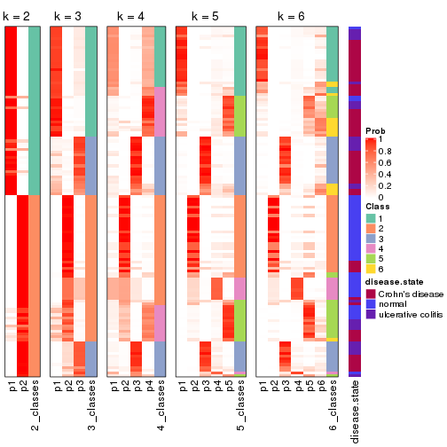


Test correlation between subgroups and known annotations. If the known
annotation is numeric, one-way ANOVA test is applied, and if the known
annotation is discrete, chi-squared contingency table test is applied.

```r
test_to_known_factors(res)
```

```
#>             n disease.state(p) k
#> SD:kmeans 125         1.10e-10 2
#> SD:kmeans 119         5.87e-13 3
#> SD:kmeans 103         8.05e-13 4
#> SD:kmeans 116         1.84e-13 5
#> SD:kmeans  94         9.71e-12 6
```


If matrix rows can be associated to genes, consider to use `functional_enrichment(res,
...)` to perform function enrichment for the signature genes. See [this vignette](http://bioconductor.org/packages/devel/bioc/vignettes/cola/inst/doc/functional_enrichment.html) for more detailed explanations.


 

---------------------------------------------------


### SD:skmeans*


The object with results only for a single top-value method and a single partition method 
can be extracted as:

```r
res = res_list["SD", "skmeans"]
# you can also extract it by
# res = res_list["SD:skmeans"]
```

A summary of `res` and all the functions that can be applied to it:

```r
res
```

```
#> A 'ConsensusPartition' object with k = 2, 3, 4, 5, 6.
#>   On a matrix with 21168 rows and 127 columns.
#>   Top rows (1000, 2000, 3000, 4000, 5000) are extracted by 'SD' method.
#>   Subgroups are detected by 'skmeans' method.
#>   Performed in total 1250 partitions by row resampling.
#>   Best k for subgroups seems to be 3.
#> 
#> Following methods can be applied to this 'ConsensusPartition' object:
#>  [1] "cola_report"             "collect_classes"         "collect_plots"          
#>  [4] "collect_stats"           "colnames"                "compare_signatures"     
#>  [7] "consensus_heatmap"       "dimension_reduction"     "functional_enrichment"  
#> [10] "get_anno_col"            "get_anno"                "get_classes"            
#> [13] "get_consensus"           "get_matrix"              "get_membership"         
#> [16] "get_param"               "get_signatures"          "get_stats"              
#> [19] "is_best_k"               "is_stable_k"             "membership_heatmap"     
#> [22] "ncol"                    "nrow"                    "plot_ecdf"              
#> [25] "rownames"                "select_partition_number" "show"                   
#> [28] "suggest_best_k"          "test_to_known_factors"
```

`collect_plots()` function collects all the plots made from `res` for all `k` (number of partitions)
into one single page to provide an easy and fast comparison between different `k`.

```r
collect_plots(res)
```


The plots are:

- The first row: a plot of the ECDF (empirical cumulative distribution
  function) curves of the consensus matrix for each `k` and the heatmap of
  predicted classes for each `k`.
- The second row: heatmaps of the consensus matrix for each `k`.
- The third row: heatmaps of the membership matrix for each `k`.
- The fouth row: heatmaps of the signatures for each `k`.

All the plots in panels can be made by individual functions and they are
plotted later in this section.

`select_partition_number()` produces several plots showing different
statistics for choosing "optimized" `k`. There are following statistics:

- ECDF curves of the consensus matrix for each `k`;
- 1-PAC. [The PAC
  score](https://en.wikipedia.org/wiki/Consensus_clustering#Over-interpretation_potential_of_consensus_clustering)
  measures the proportion of the ambiguous subgrouping.
- Mean silhouette score.
- Concordance. The mean probability of fiting the consensus class ids in all
  partitions.
- Area increased. Denote $A_k$ as the area under the ECDF curve for current
  `k`, the area increased is defined as $A_k - A_{k-1}$.
- Rand index. The percent of pairs of samples that are both in a same cluster
  or both are not in a same cluster in the partition of k and k-1.
- Jaccard index. The ratio of pairs of samples are both in a same cluster in
  the partition of k and k-1 and the pairs of samples are both in a same
  cluster in the partition k or k-1.

The detailed explanations of these statistics can be found in [the _cola_
vignette](http://bioconductor.org/packages/devel/bioc/vignettes/cola/inst/doc/cola.html#toc_13).

Generally speaking, lower PAC score, higher mean silhouette score or higher
concordance corresponds to better partition. Rand index and Jaccard index
measure how similar the current partition is compared to partition with `k-1`.
If they are too similar, we won't accept `k` is better than `k-1`.

```r
select_partition_number(res)
```


The numeric values for all these statistics can be obtained by `get_stats()`.

```r
get_stats(res)
```

```
#>   k 1-PAC mean_silhouette concordance area_increased  Rand Jaccard
#> 2 2 0.999           0.974       0.988         0.5039 0.497   0.497
#> 3 3 0.920           0.921       0.963         0.3147 0.703   0.474
#> 4 4 0.630           0.601       0.803         0.1228 0.867   0.633
#> 5 5 0.711           0.641       0.823         0.0698 0.910   0.678
#> 6 6 0.691           0.529       0.750         0.0388 0.926   0.686
```

`suggest_best_k()` suggests the best $k$ based on these statistics. The rules are as follows:

- All $k$ with Jaccard index larger than 0.95 are removed because increasing
  $k$ does not provide enough extra information. If all $k$ are removed, it is
  marked as no subgroup is detected.
- For all $k$ with 1-PAC score larger than 0.9, the maximal $k$ is taken as
  the best $k$, and other $k$ are marked as optional $k$.
- If it does not fit the second rule. The $k$ with the maximal vote of the
  highest 1-PAC score, highest mean silhouette, and highest concordance is
  taken as the best $k$.

```r
suggest_best_k(res)
```

```
#> [1] 3
#> attr(,"optional")
#> [1] 2
```

There is also optional best $k$ = 2 that is worth to check.

Following shows the table of the partitions (You need to click the **show/hide
code output** link to see it). The membership matrix (columns with name `p*`)
is inferred by
[`clue::cl_consensus()`](https://www.rdocumentation.org/link/cl_consensus?package=clue)
function with the `SE` method. Basically the value in the membership matrix
represents the probability to belong to a certain group. The finall class
label for an item is determined with the group with highest probability it
belongs to.

In `get_classes()` function, the entropy is calculated from the membership
matrix and the silhouette score is calculated from the consensus matrix.


<script>
$( function() {
	$( '#tabs-SD-skmeans-get-classes' ).tabs();
} );
</script>
<div id='tabs-SD-skmeans-get-classes'>
<ul>
<li><a href='#tab-SD-skmeans-get-classes-1'>k = 2</a></li>
<li><a href='#tab-SD-skmeans-get-classes-2'>k = 3</a></li>
<li><a href='#tab-SD-skmeans-get-classes-3'>k = 4</a></li>
<li><a href='#tab-SD-skmeans-get-classes-4'>k = 5</a></li>
<li><a href='#tab-SD-skmeans-get-classes-5'>k = 6</a></li>
</ul>

<div id='tab-SD-skmeans-get-classes-1'>
<p><a id='tab-SD-skmeans-get-classes-1-a' style='color:#0366d6' href='#'>show/hide code output</a></p>
<pre><code class="r">cbind(get_classes(res, k = 2), get_membership(res, k = 2))
</code></pre>

<pre><code>#&gt;          class entropy silhouette    p1    p2
#&gt; GSM76115     2  0.0000      0.984 0.000 1.000
#&gt; GSM76116     2  0.0000      0.984 0.000 1.000
#&gt; GSM76117     2  0.1633      0.966 0.024 0.976
#&gt; GSM76118     2  0.4022      0.916 0.080 0.920
#&gt; GSM76119     2  0.0000      0.984 0.000 1.000
#&gt; GSM76120     2  0.0000      0.984 0.000 1.000
#&gt; GSM76121     1  0.6887      0.775 0.816 0.184
#&gt; GSM76122     2  0.0000      0.984 0.000 1.000
#&gt; GSM76123     2  0.0000      0.984 0.000 1.000
#&gt; GSM76124     2  0.3274      0.936 0.060 0.940
#&gt; GSM76125     2  0.0000      0.984 0.000 1.000
#&gt; GSM76126     2  0.0000      0.984 0.000 1.000
#&gt; GSM76127     2  0.0000      0.984 0.000 1.000
#&gt; GSM76128     2  0.2948      0.941 0.052 0.948
#&gt; GSM76129     2  0.0000      0.984 0.000 1.000
#&gt; GSM76130     2  0.0000      0.984 0.000 1.000
#&gt; GSM76131     2  0.0000      0.984 0.000 1.000
#&gt; GSM76132     2  0.0000      0.984 0.000 1.000
#&gt; GSM76133     2  0.0000      0.984 0.000 1.000
#&gt; GSM76134     2  0.0000      0.984 0.000 1.000
#&gt; GSM76135     2  0.0000      0.984 0.000 1.000
#&gt; GSM76136     2  0.0000      0.984 0.000 1.000
#&gt; GSM76137     2  0.0000      0.984 0.000 1.000
#&gt; GSM76138     2  0.0000      0.984 0.000 1.000
#&gt; GSM76139     2  0.0000      0.984 0.000 1.000
#&gt; GSM76140     1  0.0000      0.992 1.000 0.000
#&gt; GSM76141     2  0.0000      0.984 0.000 1.000
#&gt; GSM76142     2  0.0000      0.984 0.000 1.000
#&gt; GSM76143     2  0.0000      0.984 0.000 1.000
#&gt; GSM76144     2  0.0000      0.984 0.000 1.000
#&gt; GSM76145     2  0.0000      0.984 0.000 1.000
#&gt; GSM76146     2  0.0000      0.984 0.000 1.000
#&gt; GSM76147     2  0.0000      0.984 0.000 1.000
#&gt; GSM76148     2  0.0000      0.984 0.000 1.000
#&gt; GSM76149     2  0.0000      0.984 0.000 1.000
#&gt; GSM76150     2  0.0000      0.984 0.000 1.000
#&gt; GSM76151     2  0.0000      0.984 0.000 1.000
#&gt; GSM76152     1  0.0000      0.992 1.000 0.000
#&gt; GSM76153     2  0.0000      0.984 0.000 1.000
#&gt; GSM76154     2  0.0000      0.984 0.000 1.000
#&gt; GSM76155     2  0.0000      0.984 0.000 1.000
#&gt; GSM76156     2  0.0000      0.984 0.000 1.000
#&gt; GSM76030     2  0.0000      0.984 0.000 1.000
#&gt; GSM76031     1  0.0000      0.992 1.000 0.000
#&gt; GSM76032     1  0.0000      0.992 1.000 0.000
#&gt; GSM76033     1  0.2423      0.956 0.960 0.040
#&gt; GSM76034     2  0.0000      0.984 0.000 1.000
#&gt; GSM76035     1  0.0000      0.992 1.000 0.000
#&gt; GSM76036     2  0.0000      0.984 0.000 1.000
#&gt; GSM76037     2  0.0000      0.984 0.000 1.000
#&gt; GSM76038     1  0.0000      0.992 1.000 0.000
#&gt; GSM76039     1  0.0000      0.992 1.000 0.000
#&gt; GSM76040     2  0.0000      0.984 0.000 1.000
#&gt; GSM76041     1  0.0000      0.992 1.000 0.000
#&gt; GSM76042     1  0.0000      0.992 1.000 0.000
#&gt; GSM76043     1  0.0000      0.992 1.000 0.000
#&gt; GSM76044     1  0.4939      0.878 0.892 0.108
#&gt; GSM76045     1  0.0000      0.992 1.000 0.000
#&gt; GSM76046     2  0.0000      0.984 0.000 1.000
#&gt; GSM76047     1  0.0000      0.992 1.000 0.000
#&gt; GSM76048     1  0.0376      0.988 0.996 0.004
#&gt; GSM76049     2  0.9323      0.483 0.348 0.652
#&gt; GSM76050     1  0.0000      0.992 1.000 0.000
#&gt; GSM76051     1  0.4431      0.902 0.908 0.092
#&gt; GSM76052     2  0.0000      0.984 0.000 1.000
#&gt; GSM76053     2  0.2948      0.941 0.052 0.948
#&gt; GSM76054     2  0.0000      0.984 0.000 1.000
#&gt; GSM76055     2  0.2603      0.951 0.044 0.956
#&gt; GSM76056     1  0.0000      0.992 1.000 0.000
#&gt; GSM76057     1  0.0000      0.992 1.000 0.000
#&gt; GSM76058     1  0.0000      0.992 1.000 0.000
#&gt; GSM76059     1  0.0000      0.992 1.000 0.000
#&gt; GSM76060     1  0.0000      0.992 1.000 0.000
#&gt; GSM76061     2  0.3879      0.919 0.076 0.924
#&gt; GSM76062     1  0.0000      0.992 1.000 0.000
#&gt; GSM76063     2  0.0000      0.984 0.000 1.000
#&gt; GSM76064     1  0.0000      0.992 1.000 0.000
#&gt; GSM76065     2  0.0000      0.984 0.000 1.000
#&gt; GSM76066     1  0.0000      0.992 1.000 0.000
#&gt; GSM76067     1  0.0000      0.992 1.000 0.000
#&gt; GSM76068     1  0.0376      0.988 0.996 0.004
#&gt; GSM76069     1  0.0000      0.992 1.000 0.000
#&gt; GSM76070     2  0.0000      0.984 0.000 1.000
#&gt; GSM76071     1  0.0000      0.992 1.000 0.000
#&gt; GSM76072     1  0.0000      0.992 1.000 0.000
#&gt; GSM76073     1  0.0000      0.992 1.000 0.000
#&gt; GSM76074     1  0.0000      0.992 1.000 0.000
#&gt; GSM76075     1  0.0000      0.992 1.000 0.000
#&gt; GSM76076     1  0.0000      0.992 1.000 0.000
#&gt; GSM76077     1  0.0000      0.992 1.000 0.000
#&gt; GSM76078     1  0.0000      0.992 1.000 0.000
#&gt; GSM76079     1  0.0000      0.992 1.000 0.000
#&gt; GSM76080     2  0.0000      0.984 0.000 1.000
#&gt; GSM76081     2  0.0000      0.984 0.000 1.000
#&gt; GSM76082     1  0.0000      0.992 1.000 0.000
#&gt; GSM76083     1  0.3114      0.941 0.944 0.056
#&gt; GSM76084     2  0.0000      0.984 0.000 1.000
#&gt; GSM76085     1  0.0672      0.985 0.992 0.008
#&gt; GSM76086     1  0.0000      0.992 1.000 0.000
#&gt; GSM76087     2  0.0000      0.984 0.000 1.000
#&gt; GSM76088     1  0.0000      0.992 1.000 0.000
#&gt; GSM76089     2  0.0000      0.984 0.000 1.000
#&gt; GSM76090     1  0.0000      0.992 1.000 0.000
#&gt; GSM76091     1  0.0000      0.992 1.000 0.000
#&gt; GSM76092     1  0.0000      0.992 1.000 0.000
#&gt; GSM76093     1  0.0000      0.992 1.000 0.000
#&gt; GSM76094     2  0.1633      0.966 0.024 0.976
#&gt; GSM76095     1  0.0000      0.992 1.000 0.000
#&gt; GSM76096     1  0.0000      0.992 1.000 0.000
#&gt; GSM76097     1  0.0000      0.992 1.000 0.000
#&gt; GSM76098     2  0.0000      0.984 0.000 1.000
#&gt; GSM76099     1  0.0000      0.992 1.000 0.000
#&gt; GSM76100     1  0.0000      0.992 1.000 0.000
#&gt; GSM76101     1  0.0000      0.992 1.000 0.000
#&gt; GSM76102     1  0.0000      0.992 1.000 0.000
#&gt; GSM76103     1  0.0000      0.992 1.000 0.000
#&gt; GSM76104     2  0.7139      0.760 0.196 0.804
#&gt; GSM76105     2  0.4431      0.903 0.092 0.908
#&gt; GSM76106     2  0.0000      0.984 0.000 1.000
#&gt; GSM76107     2  0.0000      0.984 0.000 1.000
#&gt; GSM76108     1  0.0000      0.992 1.000 0.000
#&gt; GSM76109     1  0.0000      0.992 1.000 0.000
#&gt; GSM76110     1  0.0000      0.992 1.000 0.000
#&gt; GSM76111     1  0.0000      0.992 1.000 0.000
#&gt; GSM76112     1  0.0000      0.992 1.000 0.000
#&gt; GSM76113     2  0.0672      0.978 0.008 0.992
#&gt; GSM76114     1  0.0000      0.992 1.000 0.000
</code></pre>

<script>
$('#tab-SD-skmeans-get-classes-1-a').parent().next().next().hide();
$('#tab-SD-skmeans-get-classes-1-a').click(function(){
  $('#tab-SD-skmeans-get-classes-1-a').parent().next().next().toggle();
  return(false);
});
</script>
</div>

<div id='tab-SD-skmeans-get-classes-2'>
<p><a id='tab-SD-skmeans-get-classes-2-a' style='color:#0366d6' href='#'>show/hide code output</a></p>
<pre><code class="r">cbind(get_classes(res, k = 3), get_membership(res, k = 3))
</code></pre>

<pre><code>#&gt;          class entropy silhouette    p1    p2    p3
#&gt; GSM76115     2  0.0000      0.981 0.000 1.000 0.000
#&gt; GSM76116     2  0.0000      0.981 0.000 1.000 0.000
#&gt; GSM76117     1  0.5497      0.625 0.708 0.292 0.000
#&gt; GSM76118     1  0.3752      0.825 0.856 0.144 0.000
#&gt; GSM76119     2  0.1964      0.949 0.000 0.944 0.056
#&gt; GSM76120     2  0.1964      0.949 0.000 0.944 0.056
#&gt; GSM76121     1  0.0747      0.939 0.984 0.016 0.000
#&gt; GSM76122     2  0.1643      0.943 0.044 0.956 0.000
#&gt; GSM76123     2  0.1964      0.949 0.000 0.944 0.056
#&gt; GSM76124     1  0.2537      0.887 0.920 0.080 0.000
#&gt; GSM76125     2  0.1964      0.949 0.000 0.944 0.056
#&gt; GSM76126     2  0.2165      0.943 0.000 0.936 0.064
#&gt; GSM76127     2  0.1964      0.949 0.000 0.944 0.056
#&gt; GSM76128     3  0.0000      0.945 0.000 0.000 1.000
#&gt; GSM76129     2  0.0000      0.981 0.000 1.000 0.000
#&gt; GSM76130     2  0.1753      0.954 0.000 0.952 0.048
#&gt; GSM76131     2  0.0000      0.981 0.000 1.000 0.000
#&gt; GSM76132     2  0.0000      0.981 0.000 1.000 0.000
#&gt; GSM76133     2  0.0000      0.981 0.000 1.000 0.000
#&gt; GSM76134     2  0.0000      0.981 0.000 1.000 0.000
#&gt; GSM76135     2  0.0000      0.981 0.000 1.000 0.000
#&gt; GSM76136     2  0.0000      0.981 0.000 1.000 0.000
#&gt; GSM76137     2  0.0000      0.981 0.000 1.000 0.000
#&gt; GSM76138     2  0.0000      0.981 0.000 1.000 0.000
#&gt; GSM76139     2  0.0000      0.981 0.000 1.000 0.000
#&gt; GSM76140     1  0.0000      0.950 1.000 0.000 0.000
#&gt; GSM76141     2  0.0000      0.981 0.000 1.000 0.000
#&gt; GSM76142     2  0.0000      0.981 0.000 1.000 0.000
#&gt; GSM76143     2  0.0000      0.981 0.000 1.000 0.000
#&gt; GSM76144     2  0.0000      0.981 0.000 1.000 0.000
#&gt; GSM76145     2  0.0000      0.981 0.000 1.000 0.000
#&gt; GSM76146     2  0.0000      0.981 0.000 1.000 0.000
#&gt; GSM76147     2  0.0000      0.981 0.000 1.000 0.000
#&gt; GSM76148     2  0.0000      0.981 0.000 1.000 0.000
#&gt; GSM76149     2  0.0000      0.981 0.000 1.000 0.000
#&gt; GSM76150     2  0.0000      0.981 0.000 1.000 0.000
#&gt; GSM76151     2  0.0000      0.981 0.000 1.000 0.000
#&gt; GSM76152     1  0.0000      0.950 1.000 0.000 0.000
#&gt; GSM76153     2  0.0000      0.981 0.000 1.000 0.000
#&gt; GSM76154     2  0.0000      0.981 0.000 1.000 0.000
#&gt; GSM76155     2  0.0000      0.981 0.000 1.000 0.000
#&gt; GSM76156     2  0.0000      0.981 0.000 1.000 0.000
#&gt; GSM76030     2  0.1031      0.966 0.000 0.976 0.024
#&gt; GSM76031     1  0.0000      0.950 1.000 0.000 0.000
#&gt; GSM76032     3  0.0000      0.945 0.000 0.000 1.000
#&gt; GSM76033     3  0.0000      0.945 0.000 0.000 1.000
#&gt; GSM76034     2  0.3192      0.888 0.000 0.888 0.112
#&gt; GSM76035     3  0.0000      0.945 0.000 0.000 1.000
#&gt; GSM76036     3  0.0000      0.945 0.000 0.000 1.000
#&gt; GSM76037     2  0.0000      0.981 0.000 1.000 0.000
#&gt; GSM76038     1  0.0000      0.950 1.000 0.000 0.000
#&gt; GSM76039     1  0.0000      0.950 1.000 0.000 0.000
#&gt; GSM76040     3  0.0000      0.945 0.000 0.000 1.000
#&gt; GSM76041     1  0.0237      0.947 0.996 0.000 0.004
#&gt; GSM76042     1  0.0000      0.950 1.000 0.000 0.000
#&gt; GSM76043     3  0.4605      0.753 0.204 0.000 0.796
#&gt; GSM76044     1  0.0000      0.950 1.000 0.000 0.000
#&gt; GSM76045     1  0.0000      0.950 1.000 0.000 0.000
#&gt; GSM76046     3  0.0000      0.945 0.000 0.000 1.000
#&gt; GSM76047     3  0.5859      0.502 0.344 0.000 0.656
#&gt; GSM76048     3  0.0000      0.945 0.000 0.000 1.000
#&gt; GSM76049     1  0.5497      0.623 0.708 0.292 0.000
#&gt; GSM76050     1  0.0424      0.944 0.992 0.000 0.008
#&gt; GSM76051     3  0.0000      0.945 0.000 0.000 1.000
#&gt; GSM76052     3  0.0000      0.945 0.000 0.000 1.000
#&gt; GSM76053     3  0.4399      0.753 0.000 0.188 0.812
#&gt; GSM76054     3  0.0000      0.945 0.000 0.000 1.000
#&gt; GSM76055     1  0.6244      0.271 0.560 0.440 0.000
#&gt; GSM76056     1  0.0000      0.950 1.000 0.000 0.000
#&gt; GSM76057     1  0.0237      0.947 0.996 0.004 0.000
#&gt; GSM76058     3  0.0592      0.940 0.012 0.000 0.988
#&gt; GSM76059     1  0.0000      0.950 1.000 0.000 0.000
#&gt; GSM76060     3  0.5812      0.648 0.264 0.012 0.724
#&gt; GSM76061     2  0.3116      0.869 0.108 0.892 0.000
#&gt; GSM76062     1  0.0000      0.950 1.000 0.000 0.000
#&gt; GSM76063     2  0.1411      0.962 0.000 0.964 0.036
#&gt; GSM76064     1  0.5968      0.397 0.636 0.000 0.364
#&gt; GSM76065     2  0.0000      0.981 0.000 1.000 0.000
#&gt; GSM76066     1  0.1964      0.903 0.944 0.000 0.056
#&gt; GSM76067     3  0.1860      0.915 0.052 0.000 0.948
#&gt; GSM76068     3  0.0000      0.945 0.000 0.000 1.000
#&gt; GSM76069     1  0.0000      0.950 1.000 0.000 0.000
#&gt; GSM76070     2  0.0000      0.981 0.000 1.000 0.000
#&gt; GSM76071     1  0.0000      0.950 1.000 0.000 0.000
#&gt; GSM76072     1  0.0000      0.950 1.000 0.000 0.000
#&gt; GSM76073     1  0.0000      0.950 1.000 0.000 0.000
#&gt; GSM76074     1  0.0000      0.950 1.000 0.000 0.000
#&gt; GSM76075     3  0.0000      0.945 0.000 0.000 1.000
#&gt; GSM76076     3  0.0000      0.945 0.000 0.000 1.000
#&gt; GSM76077     1  0.0237      0.947 0.996 0.000 0.004
#&gt; GSM76078     3  0.1964      0.912 0.056 0.000 0.944
#&gt; GSM76079     1  0.0000      0.950 1.000 0.000 0.000
#&gt; GSM76080     3  0.0424      0.941 0.000 0.008 0.992
#&gt; GSM76081     3  0.0237      0.943 0.000 0.004 0.996
#&gt; GSM76082     3  0.0000      0.945 0.000 0.000 1.000
#&gt; GSM76083     3  0.0000      0.945 0.000 0.000 1.000
#&gt; GSM76084     2  0.2356      0.936 0.000 0.928 0.072
#&gt; GSM76085     3  0.0000      0.945 0.000 0.000 1.000
#&gt; GSM76086     3  0.1964      0.912 0.056 0.000 0.944
#&gt; GSM76087     2  0.0000      0.981 0.000 1.000 0.000
#&gt; GSM76088     1  0.1163      0.929 0.972 0.000 0.028
#&gt; GSM76089     2  0.0000      0.981 0.000 1.000 0.000
#&gt; GSM76090     3  0.1289      0.929 0.032 0.000 0.968
#&gt; GSM76091     1  0.0000      0.950 1.000 0.000 0.000
#&gt; GSM76092     1  0.0000      0.950 1.000 0.000 0.000
#&gt; GSM76093     1  0.0000      0.950 1.000 0.000 0.000
#&gt; GSM76094     1  0.5431      0.636 0.716 0.284 0.000
#&gt; GSM76095     1  0.0000      0.950 1.000 0.000 0.000
#&gt; GSM76096     1  0.0000      0.950 1.000 0.000 0.000
#&gt; GSM76097     1  0.0000      0.950 1.000 0.000 0.000
#&gt; GSM76098     3  0.0000      0.945 0.000 0.000 1.000
#&gt; GSM76099     1  0.0000      0.950 1.000 0.000 0.000
#&gt; GSM76100     1  0.0000      0.950 1.000 0.000 0.000
#&gt; GSM76101     1  0.0000      0.950 1.000 0.000 0.000
#&gt; GSM76102     1  0.0000      0.950 1.000 0.000 0.000
#&gt; GSM76103     3  0.1643      0.921 0.044 0.000 0.956
#&gt; GSM76104     3  0.0000      0.945 0.000 0.000 1.000
#&gt; GSM76105     1  0.3340      0.848 0.880 0.120 0.000
#&gt; GSM76106     3  0.5706      0.517 0.000 0.320 0.680
#&gt; GSM76107     2  0.1964      0.949 0.000 0.944 0.056
#&gt; GSM76108     1  0.0000      0.950 1.000 0.000 0.000
#&gt; GSM76109     1  0.0000      0.950 1.000 0.000 0.000
#&gt; GSM76110     1  0.0000      0.950 1.000 0.000 0.000
#&gt; GSM76111     1  0.0000      0.950 1.000 0.000 0.000
#&gt; GSM76112     1  0.0000      0.950 1.000 0.000 0.000
#&gt; GSM76113     3  0.2878      0.867 0.000 0.096 0.904
#&gt; GSM76114     1  0.0000      0.950 1.000 0.000 0.000
</code></pre>

<script>
$('#tab-SD-skmeans-get-classes-2-a').parent().next().next().hide();
$('#tab-SD-skmeans-get-classes-2-a').click(function(){
  $('#tab-SD-skmeans-get-classes-2-a').parent().next().next().toggle();
  return(false);
});
</script>
</div>

<div id='tab-SD-skmeans-get-classes-3'>
<p><a id='tab-SD-skmeans-get-classes-3-a' style='color:#0366d6' href='#'>show/hide code output</a></p>
<pre><code class="r">cbind(get_classes(res, k = 4), get_membership(res, k = 4))
</code></pre>

<pre><code>#&gt;          class entropy silhouette    p1    p2    p3    p4
#&gt; GSM76115     2  0.4804     0.5206 0.000 0.616 0.000 0.384
#&gt; GSM76116     4  0.5000    -0.4124 0.000 0.500 0.000 0.500
#&gt; GSM76117     4  0.7357     0.1966 0.296 0.192 0.000 0.512
#&gt; GSM76118     4  0.7128     0.0772 0.372 0.136 0.000 0.492
#&gt; GSM76119     4  0.5256     0.4611 0.000 0.272 0.036 0.692
#&gt; GSM76120     4  0.5312     0.4650 0.000 0.268 0.040 0.692
#&gt; GSM76121     1  0.4837     0.4824 0.648 0.004 0.000 0.348
#&gt; GSM76122     4  0.6516    -0.0531 0.092 0.332 0.000 0.576
#&gt; GSM76123     4  0.5312     0.4650 0.000 0.268 0.040 0.692
#&gt; GSM76124     4  0.6801    -0.1458 0.452 0.096 0.000 0.452
#&gt; GSM76125     4  0.5256     0.4611 0.000 0.272 0.036 0.692
#&gt; GSM76126     4  0.5393     0.4655 0.000 0.268 0.044 0.688
#&gt; GSM76127     4  0.5312     0.4650 0.000 0.268 0.040 0.692
#&gt; GSM76128     4  0.4819     0.0559 0.000 0.004 0.344 0.652
#&gt; GSM76129     2  0.4103     0.6457 0.000 0.744 0.000 0.256
#&gt; GSM76130     4  0.5228     0.4640 0.000 0.268 0.036 0.696
#&gt; GSM76131     2  0.0000     0.7793 0.000 1.000 0.000 0.000
#&gt; GSM76132     2  0.0000     0.7793 0.000 1.000 0.000 0.000
#&gt; GSM76133     2  0.0000     0.7793 0.000 1.000 0.000 0.000
#&gt; GSM76134     2  0.3907     0.6658 0.000 0.768 0.000 0.232
#&gt; GSM76135     2  0.0000     0.7793 0.000 1.000 0.000 0.000
#&gt; GSM76136     2  0.0000     0.7793 0.000 1.000 0.000 0.000
#&gt; GSM76137     2  0.4967     0.2084 0.000 0.548 0.000 0.452
#&gt; GSM76138     2  0.4331     0.6443 0.000 0.712 0.000 0.288
#&gt; GSM76139     2  0.0188     0.7778 0.000 0.996 0.000 0.004
#&gt; GSM76140     1  0.2704     0.8062 0.876 0.000 0.000 0.124
#&gt; GSM76141     2  0.0000     0.7793 0.000 1.000 0.000 0.000
#&gt; GSM76142     2  0.0000     0.7793 0.000 1.000 0.000 0.000
#&gt; GSM76143     2  0.0000     0.7793 0.000 1.000 0.000 0.000
#&gt; GSM76144     2  0.0000     0.7793 0.000 1.000 0.000 0.000
#&gt; GSM76145     2  0.4164     0.6306 0.000 0.736 0.000 0.264
#&gt; GSM76146     2  0.0000     0.7793 0.000 1.000 0.000 0.000
#&gt; GSM76147     2  0.0336     0.7769 0.000 0.992 0.000 0.008
#&gt; GSM76148     2  0.0000     0.7793 0.000 1.000 0.000 0.000
#&gt; GSM76149     2  0.3907     0.6681 0.000 0.768 0.000 0.232
#&gt; GSM76150     2  0.3975     0.6638 0.000 0.760 0.000 0.240
#&gt; GSM76151     2  0.4356     0.5951 0.000 0.708 0.000 0.292
#&gt; GSM76152     1  0.0000     0.8624 1.000 0.000 0.000 0.000
#&gt; GSM76153     2  0.0000     0.7793 0.000 1.000 0.000 0.000
#&gt; GSM76154     2  0.3942     0.6669 0.000 0.764 0.000 0.236
#&gt; GSM76155     2  0.3801     0.6892 0.000 0.780 0.000 0.220
#&gt; GSM76156     2  0.0000     0.7793 0.000 1.000 0.000 0.000
#&gt; GSM76030     2  0.4539     0.5610 0.000 0.720 0.008 0.272
#&gt; GSM76031     1  0.0000     0.8624 1.000 0.000 0.000 0.000
#&gt; GSM76032     3  0.0336     0.7692 0.008 0.000 0.992 0.000
#&gt; GSM76033     3  0.4222     0.6281 0.000 0.000 0.728 0.272
#&gt; GSM76034     4  0.6121     0.3651 0.000 0.352 0.060 0.588
#&gt; GSM76035     3  0.3479     0.7252 0.012 0.000 0.840 0.148
#&gt; GSM76036     3  0.3873     0.6589 0.000 0.000 0.772 0.228
#&gt; GSM76037     2  0.4994     0.3902 0.000 0.520 0.000 0.480
#&gt; GSM76038     1  0.1022     0.8563 0.968 0.000 0.032 0.000
#&gt; GSM76039     1  0.2704     0.8085 0.876 0.000 0.000 0.124
#&gt; GSM76040     3  0.4382     0.6011 0.000 0.000 0.704 0.296
#&gt; GSM76041     1  0.4277     0.6258 0.720 0.000 0.280 0.000
#&gt; GSM76042     1  0.3123     0.7872 0.844 0.000 0.000 0.156
#&gt; GSM76043     3  0.3668     0.6376 0.188 0.000 0.808 0.004
#&gt; GSM76044     1  0.4608     0.6167 0.692 0.004 0.000 0.304
#&gt; GSM76045     1  0.3074     0.7849 0.848 0.000 0.152 0.000
#&gt; GSM76046     3  0.4981     0.3749 0.000 0.000 0.536 0.464
#&gt; GSM76047     3  0.5906     0.0713 0.436 0.000 0.528 0.036
#&gt; GSM76048     3  0.0895     0.7694 0.004 0.000 0.976 0.020
#&gt; GSM76049     2  0.7099     0.3035 0.136 0.552 0.004 0.308
#&gt; GSM76050     1  0.3123     0.7810 0.844 0.000 0.156 0.000
#&gt; GSM76051     3  0.1474     0.7583 0.000 0.000 0.948 0.052
#&gt; GSM76052     3  0.4697     0.5384 0.000 0.000 0.644 0.356
#&gt; GSM76053     4  0.4576     0.1756 0.000 0.012 0.260 0.728
#&gt; GSM76054     3  0.3024     0.7122 0.000 0.000 0.852 0.148
#&gt; GSM76055     4  0.7812     0.0255 0.264 0.328 0.000 0.408
#&gt; GSM76056     1  0.1557     0.8506 0.944 0.000 0.000 0.056
#&gt; GSM76057     1  0.8935     0.2745 0.452 0.284 0.172 0.092
#&gt; GSM76058     3  0.1022     0.7629 0.032 0.000 0.968 0.000
#&gt; GSM76059     1  0.0000     0.8624 1.000 0.000 0.000 0.000
#&gt; GSM76060     3  0.7801     0.4003 0.168 0.200 0.584 0.048
#&gt; GSM76061     2  0.4342     0.6048 0.008 0.784 0.012 0.196
#&gt; GSM76062     1  0.1867     0.8389 0.928 0.000 0.072 0.000
#&gt; GSM76063     2  0.4831     0.3306 0.000 0.704 0.016 0.280
#&gt; GSM76064     3  0.5263     0.0400 0.448 0.000 0.544 0.008
#&gt; GSM76065     2  0.4193     0.5435 0.000 0.732 0.000 0.268
#&gt; GSM76066     1  0.4898     0.3504 0.584 0.000 0.416 0.000
#&gt; GSM76067     3  0.1389     0.7572 0.048 0.000 0.952 0.000
#&gt; GSM76068     3  0.0376     0.7698 0.004 0.000 0.992 0.004
#&gt; GSM76069     1  0.2805     0.8283 0.888 0.000 0.012 0.100
#&gt; GSM76070     2  0.1637     0.7390 0.000 0.940 0.000 0.060
#&gt; GSM76071     1  0.1637     0.8453 0.940 0.000 0.060 0.000
#&gt; GSM76072     1  0.0707     0.8594 0.980 0.000 0.020 0.000
#&gt; GSM76073     1  0.0000     0.8624 1.000 0.000 0.000 0.000
#&gt; GSM76074     1  0.0000     0.8624 1.000 0.000 0.000 0.000
#&gt; GSM76075     3  0.0188     0.7695 0.004 0.000 0.996 0.000
#&gt; GSM76076     3  0.0188     0.7695 0.004 0.000 0.996 0.000
#&gt; GSM76077     1  0.8012     0.5496 0.568 0.056 0.196 0.180
#&gt; GSM76078     3  0.1822     0.7544 0.044 0.008 0.944 0.004
#&gt; GSM76079     1  0.0336     0.8616 0.992 0.000 0.008 0.000
#&gt; GSM76080     4  0.5493    -0.2435 0.000 0.016 0.456 0.528
#&gt; GSM76081     3  0.4990     0.5275 0.000 0.008 0.640 0.352
#&gt; GSM76082     3  0.0336     0.7692 0.008 0.000 0.992 0.000
#&gt; GSM76083     3  0.0469     0.7686 0.000 0.000 0.988 0.012
#&gt; GSM76084     4  0.5805     0.2721 0.000 0.388 0.036 0.576
#&gt; GSM76085     3  0.0592     0.7683 0.000 0.000 0.984 0.016
#&gt; GSM76086     3  0.1389     0.7574 0.048 0.000 0.952 0.000
#&gt; GSM76087     2  0.2530     0.7313 0.000 0.888 0.000 0.112
#&gt; GSM76088     1  0.8613     0.2607 0.452 0.120 0.340 0.088
#&gt; GSM76089     2  0.4697     0.5569 0.000 0.644 0.000 0.356
#&gt; GSM76090     3  0.1118     0.7613 0.036 0.000 0.964 0.000
#&gt; GSM76091     1  0.1824     0.8474 0.936 0.000 0.060 0.004
#&gt; GSM76092     1  0.0000     0.8624 1.000 0.000 0.000 0.000
#&gt; GSM76093     1  0.0000     0.8624 1.000 0.000 0.000 0.000
#&gt; GSM76094     4  0.7379     0.0421 0.384 0.164 0.000 0.452
#&gt; GSM76095     1  0.2216     0.8323 0.908 0.000 0.000 0.092
#&gt; GSM76096     1  0.1716     0.8447 0.936 0.000 0.000 0.064
#&gt; GSM76097     1  0.3400     0.7658 0.820 0.000 0.000 0.180
#&gt; GSM76098     3  0.5345     0.4102 0.000 0.012 0.560 0.428
#&gt; GSM76099     1  0.1576     0.8537 0.948 0.000 0.004 0.048
#&gt; GSM76100     1  0.0000     0.8624 1.000 0.000 0.000 0.000
#&gt; GSM76101     1  0.0000     0.8624 1.000 0.000 0.000 0.000
#&gt; GSM76102     1  0.0921     0.8567 0.972 0.000 0.000 0.028
#&gt; GSM76103     3  0.1389     0.7574 0.048 0.000 0.952 0.000
#&gt; GSM76104     3  0.4981     0.3802 0.000 0.000 0.536 0.464
#&gt; GSM76105     4  0.5856    -0.1774 0.464 0.032 0.000 0.504
#&gt; GSM76106     4  0.5842     0.3430 0.000 0.092 0.220 0.688
#&gt; GSM76107     4  0.5025     0.4679 0.000 0.252 0.032 0.716
#&gt; GSM76108     1  0.4164     0.6788 0.736 0.000 0.000 0.264
#&gt; GSM76109     1  0.0000     0.8624 1.000 0.000 0.000 0.000
#&gt; GSM76110     1  0.0000     0.8624 1.000 0.000 0.000 0.000
#&gt; GSM76111     1  0.0000     0.8624 1.000 0.000 0.000 0.000
#&gt; GSM76112     1  0.3528     0.7455 0.808 0.000 0.192 0.000
#&gt; GSM76113     3  0.7433     0.2390 0.000 0.208 0.504 0.288
#&gt; GSM76114     1  0.2480     0.8315 0.904 0.000 0.088 0.008
</code></pre>

<script>
$('#tab-SD-skmeans-get-classes-3-a').parent().next().next().hide();
$('#tab-SD-skmeans-get-classes-3-a').click(function(){
  $('#tab-SD-skmeans-get-classes-3-a').parent().next().next().toggle();
  return(false);
});
</script>
</div>

<div id='tab-SD-skmeans-get-classes-4'>
<p><a id='tab-SD-skmeans-get-classes-4-a' style='color:#0366d6' href='#'>show/hide code output</a></p>
<pre><code class="r">cbind(get_classes(res, k = 5), get_membership(res, k = 5))
</code></pre>

<pre><code>#&gt;          class entropy silhouette    p1    p2    p3    p4    p5
#&gt; GSM76115     5  0.6431    -0.1713 0.000 0.396 0.004 0.152 0.448
#&gt; GSM76116     5  0.3078     0.6948 0.000 0.132 0.004 0.016 0.848
#&gt; GSM76117     5  0.3895     0.7505 0.076 0.028 0.008 0.048 0.840
#&gt; GSM76118     5  0.2330     0.7722 0.036 0.020 0.004 0.020 0.920
#&gt; GSM76119     4  0.0912     0.8168 0.000 0.016 0.000 0.972 0.012
#&gt; GSM76120     4  0.0798     0.8173 0.000 0.016 0.000 0.976 0.008
#&gt; GSM76121     1  0.6210     0.0840 0.484 0.000 0.004 0.124 0.388
#&gt; GSM76122     5  0.3796     0.7240 0.016 0.076 0.000 0.076 0.832
#&gt; GSM76123     4  0.0798     0.8173 0.000 0.016 0.000 0.976 0.008
#&gt; GSM76124     5  0.1604     0.7718 0.044 0.004 0.004 0.004 0.944
#&gt; GSM76125     4  0.0798     0.8173 0.000 0.016 0.000 0.976 0.008
#&gt; GSM76126     4  0.1106     0.8142 0.000 0.024 0.000 0.964 0.012
#&gt; GSM76127     4  0.0798     0.8173 0.000 0.016 0.000 0.976 0.008
#&gt; GSM76128     4  0.0992     0.8084 0.000 0.000 0.024 0.968 0.008
#&gt; GSM76129     2  0.5211     0.6143 0.000 0.668 0.000 0.100 0.232
#&gt; GSM76130     4  0.0912     0.8168 0.000 0.016 0.000 0.972 0.012
#&gt; GSM76131     2  0.0000     0.8026 0.000 1.000 0.000 0.000 0.000
#&gt; GSM76132     2  0.0162     0.8017 0.000 0.996 0.000 0.000 0.004
#&gt; GSM76133     2  0.0000     0.8026 0.000 1.000 0.000 0.000 0.000
#&gt; GSM76134     2  0.5546     0.6136 0.000 0.656 0.008 0.108 0.228
#&gt; GSM76135     2  0.0000     0.8026 0.000 1.000 0.000 0.000 0.000
#&gt; GSM76136     2  0.0000     0.8026 0.000 1.000 0.000 0.000 0.000
#&gt; GSM76137     4  0.6283    -0.1692 0.000 0.424 0.008 0.452 0.116
#&gt; GSM76138     2  0.5747     0.2881 0.000 0.496 0.008 0.064 0.432
#&gt; GSM76139     2  0.0162     0.8013 0.000 0.996 0.000 0.004 0.000
#&gt; GSM76140     1  0.4383     0.2530 0.572 0.000 0.004 0.000 0.424
#&gt; GSM76141     2  0.0000     0.8026 0.000 1.000 0.000 0.000 0.000
#&gt; GSM76142     2  0.0000     0.8026 0.000 1.000 0.000 0.000 0.000
#&gt; GSM76143     2  0.0000     0.8026 0.000 1.000 0.000 0.000 0.000
#&gt; GSM76144     2  0.0000     0.8026 0.000 1.000 0.000 0.000 0.000
#&gt; GSM76145     2  0.5842     0.5949 0.000 0.632 0.008 0.212 0.148
#&gt; GSM76146     2  0.0000     0.8026 0.000 1.000 0.000 0.000 0.000
#&gt; GSM76147     2  0.0609     0.7975 0.000 0.980 0.000 0.000 0.020
#&gt; GSM76148     2  0.0000     0.8026 0.000 1.000 0.000 0.000 0.000
#&gt; GSM76149     2  0.5864     0.5673 0.000 0.612 0.008 0.120 0.260
#&gt; GSM76150     2  0.5672     0.5846 0.000 0.632 0.008 0.104 0.256
#&gt; GSM76151     2  0.6495     0.4730 0.000 0.532 0.008 0.264 0.196
#&gt; GSM76152     1  0.0771     0.8051 0.976 0.000 0.004 0.000 0.020
#&gt; GSM76153     2  0.0000     0.8026 0.000 1.000 0.000 0.000 0.000
#&gt; GSM76154     2  0.5598     0.5813 0.000 0.632 0.008 0.092 0.268
#&gt; GSM76155     2  0.5071     0.5918 0.000 0.660 0.008 0.048 0.284
#&gt; GSM76156     2  0.0000     0.8026 0.000 1.000 0.000 0.000 0.000
#&gt; GSM76030     2  0.5289     0.2516 0.000 0.556 0.036 0.008 0.400
#&gt; GSM76031     1  0.0510     0.8034 0.984 0.000 0.000 0.000 0.016
#&gt; GSM76032     3  0.1026     0.8072 0.004 0.000 0.968 0.024 0.004
#&gt; GSM76033     3  0.4430     0.1357 0.000 0.000 0.540 0.456 0.004
#&gt; GSM76034     4  0.5497     0.6099 0.004 0.212 0.032 0.692 0.060
#&gt; GSM76035     3  0.4901     0.6061 0.052 0.000 0.696 0.244 0.008
#&gt; GSM76036     3  0.3662     0.6024 0.000 0.000 0.744 0.252 0.004
#&gt; GSM76037     5  0.2570     0.7272 0.000 0.108 0.004 0.008 0.880
#&gt; GSM76038     1  0.0671     0.8039 0.980 0.000 0.004 0.000 0.016
#&gt; GSM76039     1  0.4029     0.5415 0.680 0.000 0.004 0.000 0.316
#&gt; GSM76040     3  0.4430     0.1422 0.000 0.000 0.540 0.456 0.004
#&gt; GSM76041     1  0.4445     0.5436 0.676 0.000 0.300 0.000 0.024
#&gt; GSM76042     1  0.4415     0.4075 0.604 0.000 0.008 0.000 0.388
#&gt; GSM76043     3  0.4876     0.6189 0.200 0.000 0.724 0.012 0.064
#&gt; GSM76044     5  0.3642     0.5760 0.232 0.000 0.008 0.000 0.760
#&gt; GSM76045     1  0.2670     0.7717 0.888 0.000 0.080 0.004 0.028
#&gt; GSM76046     4  0.3750     0.6201 0.000 0.000 0.232 0.756 0.012
#&gt; GSM76047     3  0.6932    -0.0638 0.408 0.000 0.432 0.044 0.116
#&gt; GSM76048     3  0.1764     0.7927 0.000 0.000 0.928 0.064 0.008
#&gt; GSM76049     5  0.2845     0.7386 0.020 0.096 0.008 0.000 0.876
#&gt; GSM76050     1  0.2249     0.7647 0.896 0.000 0.096 0.000 0.008
#&gt; GSM76051     3  0.2011     0.7805 0.000 0.000 0.908 0.088 0.004
#&gt; GSM76052     4  0.4383     0.2244 0.000 0.000 0.424 0.572 0.004
#&gt; GSM76053     4  0.3533     0.7554 0.000 0.004 0.056 0.836 0.104
#&gt; GSM76054     3  0.3246     0.6902 0.000 0.000 0.808 0.184 0.008
#&gt; GSM76055     5  0.1851     0.7684 0.024 0.024 0.008 0.004 0.940
#&gt; GSM76056     1  0.2825     0.7628 0.860 0.000 0.016 0.000 0.124
#&gt; GSM76057     1  0.8567    -0.0650 0.328 0.288 0.140 0.008 0.236
#&gt; GSM76058     3  0.0510     0.8057 0.016 0.000 0.984 0.000 0.000
#&gt; GSM76059     1  0.0000     0.8034 1.000 0.000 0.000 0.000 0.000
#&gt; GSM76060     3  0.6881     0.4764 0.084 0.204 0.608 0.012 0.092
#&gt; GSM76061     2  0.3873     0.5809 0.000 0.768 0.008 0.012 0.212
#&gt; GSM76062     1  0.0671     0.8023 0.980 0.000 0.016 0.000 0.004
#&gt; GSM76063     2  0.3607     0.5969 0.000 0.752 0.000 0.244 0.004
#&gt; GSM76064     1  0.5587     0.0491 0.472 0.000 0.472 0.012 0.044
#&gt; GSM76065     5  0.4630     0.2723 0.000 0.416 0.008 0.004 0.572
#&gt; GSM76066     1  0.4323     0.5058 0.656 0.000 0.332 0.000 0.012
#&gt; GSM76067     3  0.1168     0.8026 0.032 0.000 0.960 0.000 0.008
#&gt; GSM76068     3  0.1285     0.8054 0.004 0.000 0.956 0.036 0.004
#&gt; GSM76069     1  0.4675     0.5247 0.640 0.000 0.020 0.004 0.336
#&gt; GSM76070     2  0.1740     0.7672 0.000 0.932 0.000 0.056 0.012
#&gt; GSM76071     1  0.0865     0.8007 0.972 0.000 0.024 0.000 0.004
#&gt; GSM76072     1  0.0671     0.8027 0.980 0.000 0.016 0.000 0.004
#&gt; GSM76073     1  0.0162     0.8039 0.996 0.000 0.000 0.000 0.004
#&gt; GSM76074     1  0.0404     0.8033 0.988 0.000 0.000 0.000 0.012
#&gt; GSM76075     3  0.0740     0.8065 0.008 0.000 0.980 0.008 0.004
#&gt; GSM76076     3  0.0510     0.8065 0.000 0.000 0.984 0.016 0.000
#&gt; GSM76077     5  0.6382     0.3928 0.256 0.016 0.128 0.008 0.592
#&gt; GSM76078     3  0.1967     0.7876 0.020 0.000 0.932 0.012 0.036
#&gt; GSM76079     1  0.0609     0.8038 0.980 0.000 0.000 0.000 0.020
#&gt; GSM76080     4  0.1851     0.7740 0.000 0.000 0.088 0.912 0.000
#&gt; GSM76081     4  0.4698     0.0354 0.000 0.008 0.468 0.520 0.004
#&gt; GSM76082     3  0.1026     0.8071 0.004 0.000 0.968 0.024 0.004
#&gt; GSM76083     3  0.1082     0.8064 0.000 0.000 0.964 0.028 0.008
#&gt; GSM76084     4  0.5203     0.5467 0.000 0.240 0.028 0.688 0.044
#&gt; GSM76085     3  0.1502     0.7975 0.000 0.000 0.940 0.056 0.004
#&gt; GSM76086     3  0.1168     0.8019 0.032 0.000 0.960 0.000 0.008
#&gt; GSM76087     2  0.2411     0.7556 0.000 0.884 0.000 0.108 0.008
#&gt; GSM76088     1  0.8579     0.0283 0.324 0.124 0.300 0.012 0.240
#&gt; GSM76089     2  0.5356     0.2953 0.000 0.508 0.008 0.036 0.448
#&gt; GSM76090     3  0.0807     0.8034 0.012 0.000 0.976 0.000 0.012
#&gt; GSM76091     1  0.1469     0.8019 0.948 0.000 0.016 0.000 0.036
#&gt; GSM76092     1  0.0404     0.8038 0.988 0.000 0.000 0.000 0.012
#&gt; GSM76093     1  0.0404     0.8038 0.988 0.000 0.000 0.000 0.012
#&gt; GSM76094     5  0.3031     0.7640 0.096 0.016 0.008 0.008 0.872
#&gt; GSM76095     1  0.3885     0.6331 0.724 0.000 0.008 0.000 0.268
#&gt; GSM76096     1  0.3395     0.6720 0.764 0.000 0.000 0.000 0.236
#&gt; GSM76097     1  0.4621     0.3517 0.576 0.000 0.004 0.008 0.412
#&gt; GSM76098     4  0.3766     0.5798 0.000 0.000 0.268 0.728 0.004
#&gt; GSM76099     1  0.3527     0.7085 0.792 0.000 0.016 0.000 0.192
#&gt; GSM76100     1  0.1197     0.7984 0.952 0.000 0.000 0.000 0.048
#&gt; GSM76101     1  0.0404     0.8038 0.988 0.000 0.000 0.000 0.012
#&gt; GSM76102     1  0.2515     0.7812 0.904 0.000 0.008 0.044 0.044
#&gt; GSM76103     3  0.1412     0.7998 0.036 0.000 0.952 0.008 0.004
#&gt; GSM76104     4  0.2629     0.7360 0.000 0.000 0.136 0.860 0.004
#&gt; GSM76105     5  0.1648     0.7728 0.040 0.000 0.000 0.020 0.940
#&gt; GSM76106     4  0.0740     0.8157 0.000 0.008 0.004 0.980 0.008
#&gt; GSM76107     4  0.0912     0.8159 0.000 0.012 0.000 0.972 0.016
#&gt; GSM76108     5  0.4327     0.2506 0.360 0.000 0.008 0.000 0.632
#&gt; GSM76109     1  0.0162     0.8038 0.996 0.000 0.000 0.000 0.004
#&gt; GSM76110     1  0.0510     0.8038 0.984 0.000 0.000 0.000 0.016
#&gt; GSM76111     1  0.1205     0.8019 0.956 0.000 0.004 0.000 0.040
#&gt; GSM76112     1  0.1571     0.7895 0.936 0.000 0.060 0.000 0.004
#&gt; GSM76113     3  0.8138    -0.0432 0.000 0.188 0.364 0.320 0.128
#&gt; GSM76114     1  0.3806     0.7485 0.820 0.000 0.088 0.004 0.088
</code></pre>

<script>
$('#tab-SD-skmeans-get-classes-4-a').parent().next().next().hide();
$('#tab-SD-skmeans-get-classes-4-a').click(function(){
  $('#tab-SD-skmeans-get-classes-4-a').parent().next().next().toggle();
  return(false);
});
</script>
</div>

<div id='tab-SD-skmeans-get-classes-5'>
<p><a id='tab-SD-skmeans-get-classes-5-a' style='color:#0366d6' href='#'>show/hide code output</a></p>
<pre><code class="r">cbind(get_classes(res, k = 6), get_membership(res, k = 6))
</code></pre>

<pre><code>#&gt;          class entropy silhouette    p1    p2    p3    p4    p5    p6
#&gt; GSM76115     5  0.5204    0.46383 0.000 0.216 0.000 0.104 0.656 0.024
#&gt; GSM76116     5  0.3368    0.36037 0.000 0.052 0.000 0.012 0.828 0.108
#&gt; GSM76117     5  0.3957    0.32322 0.056 0.004 0.000 0.024 0.796 0.120
#&gt; GSM76118     5  0.3630    0.23874 0.040 0.000 0.000 0.004 0.780 0.176
#&gt; GSM76119     4  0.0622    0.78959 0.000 0.008 0.000 0.980 0.012 0.000
#&gt; GSM76120     4  0.0622    0.78959 0.000 0.008 0.000 0.980 0.012 0.000
#&gt; GSM76121     5  0.7312   -0.15651 0.336 0.000 0.000 0.148 0.356 0.160
#&gt; GSM76122     5  0.5031    0.29944 0.016 0.028 0.000 0.092 0.720 0.144
#&gt; GSM76123     4  0.0622    0.78959 0.000 0.008 0.000 0.980 0.012 0.000
#&gt; GSM76124     5  0.4011    0.09449 0.024 0.000 0.000 0.000 0.672 0.304
#&gt; GSM76125     4  0.0767    0.78903 0.000 0.008 0.000 0.976 0.012 0.004
#&gt; GSM76126     4  0.1777    0.77720 0.000 0.012 0.000 0.932 0.032 0.024
#&gt; GSM76127     4  0.0622    0.78959 0.000 0.008 0.000 0.980 0.012 0.000
#&gt; GSM76128     4  0.0964    0.78430 0.000 0.000 0.012 0.968 0.004 0.016
#&gt; GSM76129     2  0.5561   -0.00242 0.000 0.520 0.000 0.104 0.364 0.012
#&gt; GSM76130     4  0.0717    0.78882 0.000 0.008 0.000 0.976 0.016 0.000
#&gt; GSM76131     2  0.0000    0.83720 0.000 1.000 0.000 0.000 0.000 0.000
#&gt; GSM76132     2  0.0713    0.82138 0.000 0.972 0.000 0.000 0.028 0.000
#&gt; GSM76133     2  0.0000    0.83720 0.000 1.000 0.000 0.000 0.000 0.000
#&gt; GSM76134     5  0.5552    0.22332 0.000 0.436 0.000 0.104 0.452 0.008
#&gt; GSM76135     2  0.0000    0.83720 0.000 1.000 0.000 0.000 0.000 0.000
#&gt; GSM76136     2  0.0000    0.83720 0.000 1.000 0.000 0.000 0.000 0.000
#&gt; GSM76137     4  0.6302   -0.10461 0.000 0.260 0.000 0.424 0.304 0.012
#&gt; GSM76138     5  0.5073    0.44926 0.000 0.284 0.000 0.056 0.632 0.028
#&gt; GSM76139     2  0.0405    0.83319 0.000 0.988 0.000 0.008 0.004 0.000
#&gt; GSM76140     1  0.5547    0.21891 0.516 0.000 0.000 0.000 0.332 0.152
#&gt; GSM76141     2  0.0146    0.83626 0.000 0.996 0.000 0.000 0.004 0.000
#&gt; GSM76142     2  0.0000    0.83720 0.000 1.000 0.000 0.000 0.000 0.000
#&gt; GSM76143     2  0.0000    0.83720 0.000 1.000 0.000 0.000 0.000 0.000
#&gt; GSM76144     2  0.0146    0.83626 0.000 0.996 0.000 0.000 0.004 0.000
#&gt; GSM76145     2  0.6211   -0.16756 0.000 0.456 0.000 0.132 0.376 0.036
#&gt; GSM76146     2  0.0146    0.83626 0.000 0.996 0.000 0.000 0.004 0.000
#&gt; GSM76147     2  0.1267    0.79306 0.000 0.940 0.000 0.000 0.060 0.000
#&gt; GSM76148     2  0.0146    0.83626 0.000 0.996 0.000 0.000 0.004 0.000
#&gt; GSM76149     5  0.5574    0.27362 0.000 0.412 0.000 0.108 0.472 0.008
#&gt; GSM76150     5  0.5537    0.28205 0.000 0.408 0.000 0.104 0.480 0.008
#&gt; GSM76151     5  0.6056    0.30022 0.000 0.348 0.000 0.196 0.448 0.008
#&gt; GSM76152     1  0.2070    0.74281 0.896 0.000 0.000 0.000 0.012 0.092
#&gt; GSM76153     2  0.0000    0.83720 0.000 1.000 0.000 0.000 0.000 0.000
#&gt; GSM76154     5  0.5310    0.30209 0.000 0.404 0.000 0.072 0.512 0.012
#&gt; GSM76155     5  0.4715    0.22022 0.000 0.452 0.000 0.036 0.508 0.004
#&gt; GSM76156     2  0.0000    0.83720 0.000 1.000 0.000 0.000 0.000 0.000
#&gt; GSM76030     6  0.7405   -0.05775 0.000 0.296 0.040 0.032 0.304 0.328
#&gt; GSM76031     1  0.2020    0.73921 0.896 0.000 0.000 0.000 0.008 0.096
#&gt; GSM76032     3  0.1779    0.77744 0.000 0.000 0.920 0.016 0.000 0.064
#&gt; GSM76033     3  0.5201    0.19895 0.000 0.000 0.500 0.408 0.000 0.092
#&gt; GSM76034     4  0.6809    0.44319 0.000 0.232 0.024 0.544 0.096 0.104
#&gt; GSM76035     3  0.6449    0.54015 0.040 0.000 0.580 0.188 0.028 0.164
#&gt; GSM76036     3  0.3772    0.66738 0.000 0.000 0.772 0.180 0.008 0.040
#&gt; GSM76037     5  0.4353    0.25489 0.000 0.056 0.000 0.004 0.696 0.244
#&gt; GSM76038     1  0.2118    0.74045 0.888 0.000 0.000 0.000 0.008 0.104
#&gt; GSM76039     1  0.5282    0.38285 0.600 0.000 0.000 0.000 0.172 0.228
#&gt; GSM76040     3  0.5394    0.40815 0.000 0.000 0.588 0.316 0.040 0.056
#&gt; GSM76041     1  0.5200    0.48326 0.632 0.000 0.172 0.000 0.004 0.192
#&gt; GSM76042     1  0.5786    0.11717 0.468 0.000 0.000 0.000 0.188 0.344
#&gt; GSM76043     3  0.6128    0.27360 0.188 0.000 0.556 0.004 0.028 0.224
#&gt; GSM76044     6  0.5718    0.20378 0.164 0.000 0.000 0.000 0.396 0.440
#&gt; GSM76045     1  0.4087    0.65132 0.744 0.000 0.064 0.000 0.004 0.188
#&gt; GSM76046     4  0.4900    0.58274 0.000 0.000 0.176 0.680 0.008 0.136
#&gt; GSM76047     6  0.7472    0.22207 0.264 0.000 0.272 0.036 0.048 0.380
#&gt; GSM76048     3  0.1575    0.77679 0.000 0.000 0.936 0.032 0.000 0.032
#&gt; GSM76049     6  0.5298    0.13769 0.016 0.048 0.008 0.000 0.384 0.544
#&gt; GSM76050     1  0.3603    0.68328 0.812 0.000 0.080 0.004 0.004 0.100
#&gt; GSM76051     3  0.1777    0.76872 0.000 0.000 0.928 0.024 0.004 0.044
#&gt; GSM76052     4  0.5895    0.12122 0.000 0.000 0.372 0.484 0.020 0.124
#&gt; GSM76053     4  0.4876    0.66311 0.000 0.000 0.056 0.720 0.072 0.152
#&gt; GSM76054     3  0.3487    0.72387 0.000 0.000 0.824 0.100 0.016 0.060
#&gt; GSM76055     5  0.4866   -0.17729 0.028 0.016 0.000 0.000 0.480 0.476
#&gt; GSM76056     1  0.4146    0.52644 0.680 0.000 0.004 0.000 0.028 0.288
#&gt; GSM76057     6  0.7786    0.40407 0.212 0.228 0.064 0.000 0.072 0.424
#&gt; GSM76058     3  0.1700    0.76566 0.000 0.000 0.916 0.000 0.004 0.080
#&gt; GSM76059     1  0.0458    0.75036 0.984 0.000 0.000 0.000 0.000 0.016
#&gt; GSM76060     6  0.7358    0.08819 0.076 0.180 0.356 0.000 0.020 0.368
#&gt; GSM76061     2  0.5215    0.33917 0.004 0.608 0.004 0.000 0.100 0.284
#&gt; GSM76062     1  0.1444    0.74529 0.928 0.000 0.000 0.000 0.000 0.072
#&gt; GSM76063     2  0.5059    0.56941 0.000 0.712 0.036 0.172 0.016 0.064
#&gt; GSM76064     1  0.6631    0.03274 0.428 0.000 0.304 0.004 0.028 0.236
#&gt; GSM76065     2  0.6120   -0.30459 0.000 0.360 0.000 0.000 0.308 0.332
#&gt; GSM76066     1  0.5302    0.33776 0.584 0.000 0.292 0.000 0.004 0.120
#&gt; GSM76067     3  0.2162    0.75512 0.012 0.000 0.896 0.000 0.004 0.088
#&gt; GSM76068     3  0.1149    0.77581 0.000 0.000 0.960 0.008 0.008 0.024
#&gt; GSM76069     1  0.5319    0.03322 0.476 0.000 0.000 0.000 0.104 0.420
#&gt; GSM76070     2  0.2691    0.74764 0.000 0.872 0.000 0.032 0.008 0.088
#&gt; GSM76071     1  0.1387    0.74478 0.932 0.000 0.000 0.000 0.000 0.068
#&gt; GSM76072     1  0.1349    0.74761 0.940 0.000 0.000 0.000 0.004 0.056
#&gt; GSM76073     1  0.0713    0.75077 0.972 0.000 0.000 0.000 0.000 0.028
#&gt; GSM76074     1  0.1049    0.74927 0.960 0.000 0.000 0.000 0.008 0.032
#&gt; GSM76075     3  0.1556    0.77059 0.000 0.000 0.920 0.000 0.000 0.080
#&gt; GSM76076     3  0.0603    0.77669 0.000 0.000 0.980 0.004 0.000 0.016
#&gt; GSM76077     6  0.6023    0.44219 0.140 0.012 0.052 0.000 0.172 0.624
#&gt; GSM76078     3  0.3658    0.66515 0.008 0.008 0.760 0.000 0.008 0.216
#&gt; GSM76079     1  0.1556    0.74577 0.920 0.000 0.000 0.000 0.000 0.080
#&gt; GSM76080     4  0.3588    0.70129 0.000 0.000 0.144 0.804 0.020 0.032
#&gt; GSM76081     3  0.4899    0.29402 0.000 0.000 0.560 0.388 0.016 0.036
#&gt; GSM76082     3  0.0767    0.77592 0.000 0.000 0.976 0.008 0.004 0.012
#&gt; GSM76083     3  0.0603    0.77660 0.000 0.000 0.980 0.004 0.000 0.016
#&gt; GSM76084     4  0.7153    0.39596 0.000 0.176 0.064 0.532 0.172 0.056
#&gt; GSM76085     3  0.1970    0.77545 0.000 0.000 0.912 0.028 0.000 0.060
#&gt; GSM76086     3  0.2985    0.72091 0.036 0.000 0.844 0.000 0.004 0.116
#&gt; GSM76087     2  0.2848    0.68571 0.000 0.828 0.000 0.160 0.008 0.004
#&gt; GSM76088     6  0.7230    0.43736 0.204 0.092 0.132 0.000 0.048 0.524
#&gt; GSM76089     5  0.5758    0.43530 0.000 0.288 0.004 0.032 0.580 0.096
#&gt; GSM76090     3  0.1644    0.76454 0.000 0.000 0.920 0.000 0.004 0.076
#&gt; GSM76091     1  0.2745    0.72038 0.860 0.000 0.020 0.000 0.008 0.112
#&gt; GSM76092     1  0.0692    0.74861 0.976 0.000 0.000 0.000 0.004 0.020
#&gt; GSM76093     1  0.0405    0.74910 0.988 0.000 0.000 0.000 0.004 0.008
#&gt; GSM76094     5  0.5228    0.08644 0.080 0.008 0.000 0.012 0.632 0.268
#&gt; GSM76095     1  0.5217    0.47440 0.608 0.000 0.000 0.000 0.160 0.232
#&gt; GSM76096     1  0.4765    0.52674 0.672 0.000 0.000 0.000 0.132 0.196
#&gt; GSM76097     1  0.6140   -0.07343 0.436 0.000 0.000 0.008 0.220 0.336
#&gt; GSM76098     4  0.4174    0.38148 0.000 0.000 0.352 0.628 0.004 0.016
#&gt; GSM76099     1  0.4822    0.44125 0.620 0.000 0.004 0.000 0.068 0.308
#&gt; GSM76100     1  0.1657    0.74398 0.928 0.000 0.000 0.000 0.016 0.056
#&gt; GSM76101     1  0.0405    0.74846 0.988 0.000 0.000 0.000 0.004 0.008
#&gt; GSM76102     1  0.4249    0.67252 0.776 0.000 0.000 0.060 0.048 0.116
#&gt; GSM76103     3  0.2894    0.72582 0.036 0.000 0.852 0.000 0.004 0.108
#&gt; GSM76104     4  0.3603    0.70549 0.000 0.000 0.112 0.808 0.008 0.072
#&gt; GSM76105     5  0.4419    0.03584 0.024 0.000 0.000 0.008 0.620 0.348
#&gt; GSM76106     4  0.1596    0.78372 0.000 0.004 0.020 0.944 0.012 0.020
#&gt; GSM76107     4  0.2036    0.76988 0.000 0.008 0.000 0.916 0.048 0.028
#&gt; GSM76108     6  0.5879    0.30026 0.216 0.000 0.000 0.000 0.324 0.460
#&gt; GSM76109     1  0.0363    0.74888 0.988 0.000 0.000 0.000 0.000 0.012
#&gt; GSM76110     1  0.1524    0.74623 0.932 0.000 0.000 0.000 0.008 0.060
#&gt; GSM76111     1  0.2250    0.74258 0.888 0.000 0.000 0.000 0.020 0.092
#&gt; GSM76112     1  0.2696    0.71795 0.872 0.000 0.048 0.000 0.004 0.076
#&gt; GSM76113     3  0.8869   -0.08097 0.008 0.116 0.288 0.256 0.188 0.144
#&gt; GSM76114     1  0.4538    0.58881 0.696 0.000 0.060 0.000 0.012 0.232
</code></pre>

<script>
$('#tab-SD-skmeans-get-classes-5-a').parent().next().next().hide();
$('#tab-SD-skmeans-get-classes-5-a').click(function(){
  $('#tab-SD-skmeans-get-classes-5-a').parent().next().next().toggle();
  return(false);
});
</script>
</div>
</div>

Heatmaps for the consensus matrix. It visualizes the probability of two
samples to be in a same group.


<script>
$( function() {
	$( '#tabs-SD-skmeans-consensus-heatmap' ).tabs();
} );
</script>
<div id='tabs-SD-skmeans-consensus-heatmap'>
<ul>
<li><a href='#tab-SD-skmeans-consensus-heatmap-1'>k = 2</a></li>
<li><a href='#tab-SD-skmeans-consensus-heatmap-2'>k = 3</a></li>
<li><a href='#tab-SD-skmeans-consensus-heatmap-3'>k = 4</a></li>
<li><a href='#tab-SD-skmeans-consensus-heatmap-4'>k = 5</a></li>
<li><a href='#tab-SD-skmeans-consensus-heatmap-5'>k = 6</a></li>
</ul>
<div id='tab-SD-skmeans-consensus-heatmap-1'>
<pre><code class="r">consensus_heatmap(res, k = 2)
</code></pre>

<p></p>

</div>
<div id='tab-SD-skmeans-consensus-heatmap-2'>
<pre><code class="r">consensus_heatmap(res, k = 3)
</code></pre>

<p></p>

</div>
<div id='tab-SD-skmeans-consensus-heatmap-3'>
<pre><code class="r">consensus_heatmap(res, k = 4)
</code></pre>

<p></p>

</div>
<div id='tab-SD-skmeans-consensus-heatmap-4'>
<pre><code class="r">consensus_heatmap(res, k = 5)
</code></pre>

<p></p>

</div>
<div id='tab-SD-skmeans-consensus-heatmap-5'>
<pre><code class="r">consensus_heatmap(res, k = 6)
</code></pre>

<p></p>

</div>
</div>

Heatmaps for the membership of samples in all partitions to see how consistent they are:


<script>
$( function() {
	$( '#tabs-SD-skmeans-membership-heatmap' ).tabs();
} );
</script>
<div id='tabs-SD-skmeans-membership-heatmap'>
<ul>
<li><a href='#tab-SD-skmeans-membership-heatmap-1'>k = 2</a></li>
<li><a href='#tab-SD-skmeans-membership-heatmap-2'>k = 3</a></li>
<li><a href='#tab-SD-skmeans-membership-heatmap-3'>k = 4</a></li>
<li><a href='#tab-SD-skmeans-membership-heatmap-4'>k = 5</a></li>
<li><a href='#tab-SD-skmeans-membership-heatmap-5'>k = 6</a></li>
</ul>
<div id='tab-SD-skmeans-membership-heatmap-1'>
<pre><code class="r">membership_heatmap(res, k = 2)
</code></pre>

<p></p>

</div>
<div id='tab-SD-skmeans-membership-heatmap-2'>
<pre><code class="r">membership_heatmap(res, k = 3)
</code></pre>

<p></p>

</div>
<div id='tab-SD-skmeans-membership-heatmap-3'>
<pre><code class="r">membership_heatmap(res, k = 4)
</code></pre>

<p></p>

</div>
<div id='tab-SD-skmeans-membership-heatmap-4'>
<pre><code class="r">membership_heatmap(res, k = 5)
</code></pre>

<p></p>

</div>
<div id='tab-SD-skmeans-membership-heatmap-5'>
<pre><code class="r">membership_heatmap(res, k = 6)
</code></pre>

<p></p>

</div>
</div>

As soon as we have had the classes for columns, we can look for signatures
which are significantly different between classes which can be candidate marks
for certain classes. Following are the heatmaps for signatures.


Signature heatmaps where rows are scaled:


<script>
$( function() {
	$( '#tabs-SD-skmeans-get-signatures' ).tabs();
} );
</script>
<div id='tabs-SD-skmeans-get-signatures'>
<ul>
<li><a href='#tab-SD-skmeans-get-signatures-1'>k = 2</a></li>
<li><a href='#tab-SD-skmeans-get-signatures-2'>k = 3</a></li>
<li><a href='#tab-SD-skmeans-get-signatures-3'>k = 4</a></li>
<li><a href='#tab-SD-skmeans-get-signatures-4'>k = 5</a></li>
<li><a href='#tab-SD-skmeans-get-signatures-5'>k = 6</a></li>
</ul>
<div id='tab-SD-skmeans-get-signatures-1'>
<pre><code class="r">get_signatures(res, k = 2)
</code></pre>

<p></p>

</div>
<div id='tab-SD-skmeans-get-signatures-2'>
<pre><code class="r">get_signatures(res, k = 3)
</code></pre>

<p></p>

</div>
<div id='tab-SD-skmeans-get-signatures-3'>
<pre><code class="r">get_signatures(res, k = 4)
</code></pre>

<p></p>

</div>
<div id='tab-SD-skmeans-get-signatures-4'>
<pre><code class="r">get_signatures(res, k = 5)
</code></pre>

<p></p>

</div>
<div id='tab-SD-skmeans-get-signatures-5'>
<pre><code class="r">get_signatures(res, k = 6)
</code></pre>

<p>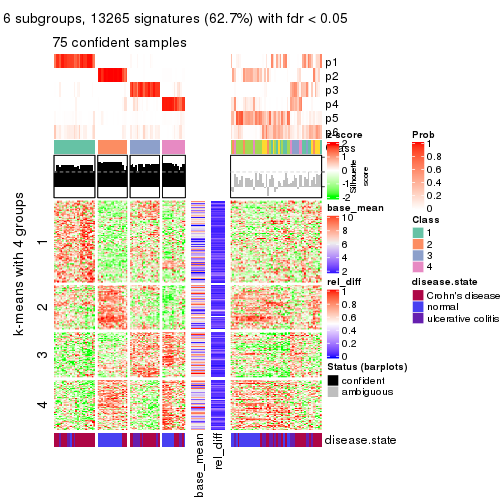</p>

</div>
</div>


Signature heatmaps where rows are not scaled:


<script>
$( function() {
	$( '#tabs-SD-skmeans-get-signatures-no-scale' ).tabs();
} );
</script>
<div id='tabs-SD-skmeans-get-signatures-no-scale'>
<ul>
<li><a href='#tab-SD-skmeans-get-signatures-no-scale-1'>k = 2</a></li>
<li><a href='#tab-SD-skmeans-get-signatures-no-scale-2'>k = 3</a></li>
<li><a href='#tab-SD-skmeans-get-signatures-no-scale-3'>k = 4</a></li>
<li><a href='#tab-SD-skmeans-get-signatures-no-scale-4'>k = 5</a></li>
<li><a href='#tab-SD-skmeans-get-signatures-no-scale-5'>k = 6</a></li>
</ul>
<div id='tab-SD-skmeans-get-signatures-no-scale-1'>
<pre><code class="r">get_signatures(res, k = 2, scale_rows = FALSE)
</code></pre>

<p></p>

</div>
<div id='tab-SD-skmeans-get-signatures-no-scale-2'>
<pre><code class="r">get_signatures(res, k = 3, scale_rows = FALSE)
</code></pre>

<p></p>

</div>
<div id='tab-SD-skmeans-get-signatures-no-scale-3'>
<pre><code class="r">get_signatures(res, k = 4, scale_rows = FALSE)
</code></pre>

<p></p>

</div>
<div id='tab-SD-skmeans-get-signatures-no-scale-4'>
<pre><code class="r">get_signatures(res, k = 5, scale_rows = FALSE)
</code></pre>

<p></p>

</div>
<div id='tab-SD-skmeans-get-signatures-no-scale-5'>
<pre><code class="r">get_signatures(res, k = 6, scale_rows = FALSE)
</code></pre>

<p></p>

</div>
</div>


Compare the overlap of signatures from different k:

```r
compare_signatures(res)
```


`get_signature()` returns a data frame invisibly. TO get the list of signatures, the function
call should be assigned to a variable explicitly. In following code, if `plot` argument is set
to `FALSE`, no heatmap is plotted while only the differential analysis is performed.

```r
# code only for demonstration
tb = get_signature(res, k = ..., plot = FALSE)
```

An example of the output of `tb` is:

```
#>   which_row         fdr    mean_1    mean_2 scaled_mean_1 scaled_mean_2 km
#> 1        38 0.042760348  8.373488  9.131774    -0.5533452     0.5164555  1
#> 2        40 0.018707592  7.106213  8.469186    -0.6173731     0.5762149  1
#> 3        55 0.019134737 10.221463 11.207825    -0.6159697     0.5749050  1
#> 4        59 0.006059896  5.921854  7.869574    -0.6899429     0.6439467  1
#> 5        60 0.018055526  8.928898 10.211722    -0.6204761     0.5791110  1
#> 6        98 0.009384629 15.714769 14.887706     0.6635654    -0.6193277  2
...
```

The columns in `tb` are:

1. `which_row`: row indices corresponding to the input matrix.
2. `fdr`: FDR for the differential test. 
3. `mean_x`: The mean value in group x.
4. `scaled_mean_x`: The mean value in group x after rows are scaled.
5. `km`: Row groups if k-means clustering is applied to rows.


UMAP plot which shows how samples are separated.


<script>
$( function() {
	$( '#tabs-SD-skmeans-dimension-reduction' ).tabs();
} );
</script>
<div id='tabs-SD-skmeans-dimension-reduction'>
<ul>
<li><a href='#tab-SD-skmeans-dimension-reduction-1'>k = 2</a></li>
<li><a href='#tab-SD-skmeans-dimension-reduction-2'>k = 3</a></li>
<li><a href='#tab-SD-skmeans-dimension-reduction-3'>k = 4</a></li>
<li><a href='#tab-SD-skmeans-dimension-reduction-4'>k = 5</a></li>
<li><a href='#tab-SD-skmeans-dimension-reduction-5'>k = 6</a></li>
</ul>
<div id='tab-SD-skmeans-dimension-reduction-1'>
<pre><code class="r">dimension_reduction(res, k = 2, method = &quot;UMAP&quot;)
</code></pre>

<p></p>

</div>
<div id='tab-SD-skmeans-dimension-reduction-2'>
<pre><code class="r">dimension_reduction(res, k = 3, method = &quot;UMAP&quot;)
</code></pre>

<p></p>

</div>
<div id='tab-SD-skmeans-dimension-reduction-3'>
<pre><code class="r">dimension_reduction(res, k = 4, method = &quot;UMAP&quot;)
</code></pre>

<p></p>

</div>
<div id='tab-SD-skmeans-dimension-reduction-4'>
<pre><code class="r">dimension_reduction(res, k = 5, method = &quot;UMAP&quot;)
</code></pre>

<p></p>

</div>
<div id='tab-SD-skmeans-dimension-reduction-5'>
<pre><code class="r">dimension_reduction(res, k = 6, method = &quot;UMAP&quot;)
</code></pre>

<p></p>

</div>
</div>


Following heatmap shows how subgroups are split when increasing `k`:

```r
collect_classes(res)
```


Test correlation between subgroups and known annotations. If the known
annotation is numeric, one-way ANOVA test is applied, and if the known
annotation is discrete, chi-squared contingency table test is applied.

```r
test_to_known_factors(res)
```

```
#>              n disease.state(p) k
#> SD:skmeans 126         2.61e-10 2
#> SD:skmeans 125         4.92e-13 3
#> SD:skmeans  90         1.20e-12 4
#> SD:skmeans 104         3.77e-10 5
#> SD:skmeans  75         2.86e-08 6
```


If matrix rows can be associated to genes, consider to use `functional_enrichment(res,
...)` to perform function enrichment for the signature genes. See [this vignette](http://bioconductor.org/packages/devel/bioc/vignettes/cola/inst/doc/functional_enrichment.html) for more detailed explanations.


 

---------------------------------------------------


### SD:pam


The object with results only for a single top-value method and a single partition method 
can be extracted as:

```r
res = res_list["SD", "pam"]
# you can also extract it by
# res = res_list["SD:pam"]
```

A summary of `res` and all the functions that can be applied to it:

```r
res
```

```
#> A 'ConsensusPartition' object with k = 2, 3, 4, 5, 6.
#>   On a matrix with 21168 rows and 127 columns.
#>   Top rows (1000, 2000, 3000, 4000, 5000) are extracted by 'SD' method.
#>   Subgroups are detected by 'pam' method.
#>   Performed in total 1250 partitions by row resampling.
#>   Best k for subgroups seems to be 4.
#> 
#> Following methods can be applied to this 'ConsensusPartition' object:
#>  [1] "cola_report"             "collect_classes"         "collect_plots"          
#>  [4] "collect_stats"           "colnames"                "compare_signatures"     
#>  [7] "consensus_heatmap"       "dimension_reduction"     "functional_enrichment"  
#> [10] "get_anno_col"            "get_anno"                "get_classes"            
#> [13] "get_consensus"           "get_matrix"              "get_membership"         
#> [16] "get_param"               "get_signatures"          "get_stats"              
#> [19] "is_best_k"               "is_stable_k"             "membership_heatmap"     
#> [22] "ncol"                    "nrow"                    "plot_ecdf"              
#> [25] "rownames"                "select_partition_number" "show"                   
#> [28] "suggest_best_k"          "test_to_known_factors"
```

`collect_plots()` function collects all the plots made from `res` for all `k` (number of partitions)
into one single page to provide an easy and fast comparison between different `k`.

```r
collect_plots(res)
```

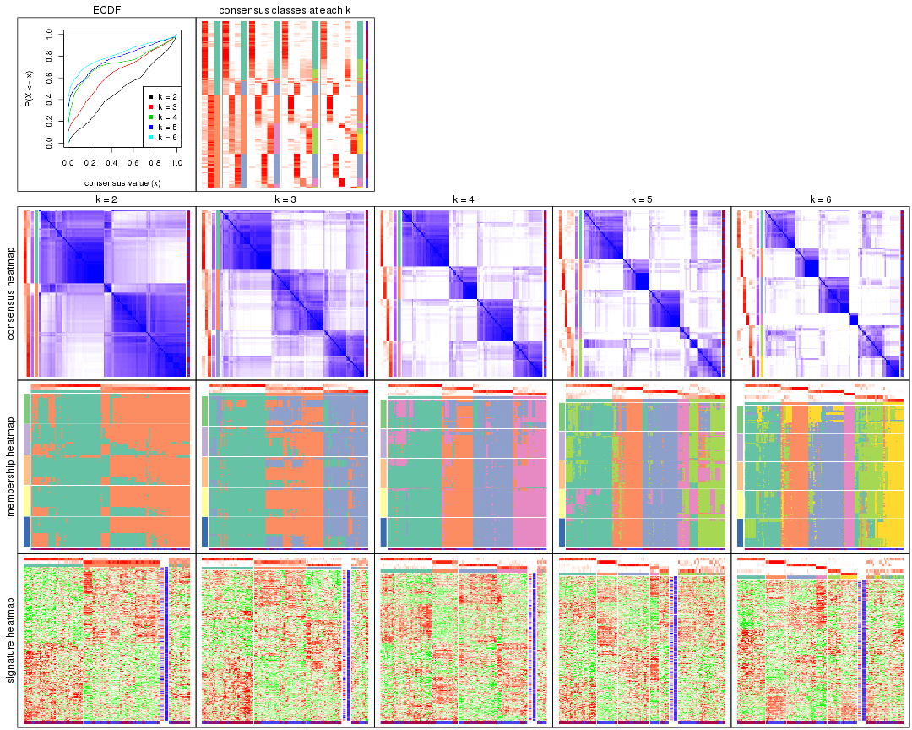

The plots are:

- The first row: a plot of the ECDF (empirical cumulative distribution
  function) curves of the consensus matrix for each `k` and the heatmap of
  predicted classes for each `k`.
- The second row: heatmaps of the consensus matrix for each `k`.
- The third row: heatmaps of the membership matrix for each `k`.
- The fouth row: heatmaps of the signatures for each `k`.

All the plots in panels can be made by individual functions and they are
plotted later in this section.

`select_partition_number()` produces several plots showing different
statistics for choosing "optimized" `k`. There are following statistics:

- ECDF curves of the consensus matrix for each `k`;
- 1-PAC. [The PAC
  score](https://en.wikipedia.org/wiki/Consensus_clustering#Over-interpretation_potential_of_consensus_clustering)
  measures the proportion of the ambiguous subgrouping.
- Mean silhouette score.
- Concordance. The mean probability of fiting the consensus class ids in all
  partitions.
- Area increased. Denote $A_k$ as the area under the ECDF curve for current
  `k`, the area increased is defined as $A_k - A_{k-1}$.
- Rand index. The percent of pairs of samples that are both in a same cluster
  or both are not in a same cluster in the partition of k and k-1.
- Jaccard index. The ratio of pairs of samples are both in a same cluster in
  the partition of k and k-1 and the pairs of samples are both in a same
  cluster in the partition k or k-1.

The detailed explanations of these statistics can be found in [the _cola_
vignette](http://bioconductor.org/packages/devel/bioc/vignettes/cola/inst/doc/cola.html#toc_13).

Generally speaking, lower PAC score, higher mean silhouette score or higher
concordance corresponds to better partition. Rand index and Jaccard index
measure how similar the current partition is compared to partition with `k-1`.
If they are too similar, we won't accept `k` is better than `k-1`.

```r
select_partition_number(res)
```


The numeric values for all these statistics can be obtained by `get_stats()`.

```r
get_stats(res)
```

```
#>   k 1-PAC mean_silhouette concordance area_increased  Rand Jaccard
#> 2 2 0.304           0.663       0.832         0.4917 0.503   0.503
#> 3 3 0.374           0.649       0.791         0.3198 0.753   0.543
#> 4 4 0.609           0.757       0.846         0.1358 0.889   0.683
#> 5 5 0.609           0.583       0.782         0.0596 0.919   0.709
#> 6 6 0.700           0.640       0.802         0.0486 0.921   0.670
```

`suggest_best_k()` suggests the best $k$ based on these statistics. The rules are as follows:

- All $k$ with Jaccard index larger than 0.95 are removed because increasing
  $k$ does not provide enough extra information. If all $k$ are removed, it is
  marked as no subgroup is detected.
- For all $k$ with 1-PAC score larger than 0.9, the maximal $k$ is taken as
  the best $k$, and other $k$ are marked as optional $k$.
- If it does not fit the second rule. The $k$ with the maximal vote of the
  highest 1-PAC score, highest mean silhouette, and highest concordance is
  taken as the best $k$.

```r
suggest_best_k(res)
```

```
#> [1] 4
```


Following shows the table of the partitions (You need to click the **show/hide
code output** link to see it). The membership matrix (columns with name `p*`)
is inferred by
[`clue::cl_consensus()`](https://www.rdocumentation.org/link/cl_consensus?package=clue)
function with the `SE` method. Basically the value in the membership matrix
represents the probability to belong to a certain group. The finall class
label for an item is determined with the group with highest probability it
belongs to.

In `get_classes()` function, the entropy is calculated from the membership
matrix and the silhouette score is calculated from the consensus matrix.


<script>
$( function() {
	$( '#tabs-SD-pam-get-classes' ).tabs();
} );
</script>
<div id='tabs-SD-pam-get-classes'>
<ul>
<li><a href='#tab-SD-pam-get-classes-1'>k = 2</a></li>
<li><a href='#tab-SD-pam-get-classes-2'>k = 3</a></li>
<li><a href='#tab-SD-pam-get-classes-3'>k = 4</a></li>
<li><a href='#tab-SD-pam-get-classes-4'>k = 5</a></li>
<li><a href='#tab-SD-pam-get-classes-5'>k = 6</a></li>
</ul>

<div id='tab-SD-pam-get-classes-1'>
<p><a id='tab-SD-pam-get-classes-1-a' style='color:#0366d6' href='#'>show/hide code output</a></p>
<pre><code class="r">cbind(get_classes(res, k = 2), get_membership(res, k = 2))
</code></pre>

<pre><code>#&gt;          class entropy silhouette    p1    p2
#&gt; GSM76115     2  0.8327     0.7172 0.264 0.736
#&gt; GSM76116     2  0.8608     0.7035 0.284 0.716
#&gt; GSM76117     2  0.8813     0.6929 0.300 0.700
#&gt; GSM76118     2  0.9993     0.3539 0.484 0.516
#&gt; GSM76119     2  0.1633     0.7531 0.024 0.976
#&gt; GSM76120     2  0.1843     0.7474 0.028 0.972
#&gt; GSM76121     1  0.7674     0.5586 0.776 0.224
#&gt; GSM76122     2  0.9000     0.6751 0.316 0.684
#&gt; GSM76123     2  0.1414     0.7494 0.020 0.980
#&gt; GSM76124     2  0.8608     0.7003 0.284 0.716
#&gt; GSM76125     2  0.1184     0.7497 0.016 0.984
#&gt; GSM76126     2  0.7950     0.7475 0.240 0.760
#&gt; GSM76127     2  0.1414     0.7518 0.020 0.980
#&gt; GSM76128     2  0.5842     0.7229 0.140 0.860
#&gt; GSM76129     2  0.9000     0.6666 0.316 0.684
#&gt; GSM76130     2  0.3114     0.7680 0.056 0.944
#&gt; GSM76131     2  0.2778     0.7727 0.048 0.952
#&gt; GSM76132     2  0.6973     0.7589 0.188 0.812
#&gt; GSM76133     2  0.7056     0.7573 0.192 0.808
#&gt; GSM76134     2  0.5629     0.7732 0.132 0.868
#&gt; GSM76135     2  0.8081     0.7283 0.248 0.752
#&gt; GSM76136     2  0.3114     0.7734 0.056 0.944
#&gt; GSM76137     2  0.0000     0.7551 0.000 1.000
#&gt; GSM76138     2  0.8499     0.7072 0.276 0.724
#&gt; GSM76139     2  0.0000     0.7551 0.000 1.000
#&gt; GSM76140     1  0.9996    -0.3129 0.512 0.488
#&gt; GSM76141     2  0.7674     0.7440 0.224 0.776
#&gt; GSM76142     2  0.5842     0.7720 0.140 0.860
#&gt; GSM76143     2  0.7056     0.7573 0.192 0.808
#&gt; GSM76144     2  0.2778     0.7725 0.048 0.952
#&gt; GSM76145     2  0.2948     0.7733 0.052 0.948
#&gt; GSM76146     2  0.7056     0.7573 0.192 0.808
#&gt; GSM76147     2  0.7299     0.7535 0.204 0.796
#&gt; GSM76148     2  0.5178     0.7745 0.116 0.884
#&gt; GSM76149     2  0.2778     0.7725 0.048 0.952
#&gt; GSM76150     2  0.7883     0.7371 0.236 0.764
#&gt; GSM76151     2  0.6247     0.7687 0.156 0.844
#&gt; GSM76152     1  0.1184     0.8151 0.984 0.016
#&gt; GSM76153     2  0.0000     0.7551 0.000 1.000
#&gt; GSM76154     2  0.4298     0.7758 0.088 0.912
#&gt; GSM76155     2  0.8016     0.7313 0.244 0.756
#&gt; GSM76156     2  0.7528     0.7494 0.216 0.784
#&gt; GSM76030     2  0.7815     0.6434 0.232 0.768
#&gt; GSM76031     1  0.0000     0.8121 1.000 0.000
#&gt; GSM76032     1  0.9933     0.4095 0.548 0.452
#&gt; GSM76033     2  0.9922    -0.1713 0.448 0.552
#&gt; GSM76034     2  0.7602     0.7580 0.220 0.780
#&gt; GSM76035     1  0.9580     0.5405 0.620 0.380
#&gt; GSM76036     2  0.2043     0.7461 0.032 0.968
#&gt; GSM76037     2  0.8909     0.6741 0.308 0.692
#&gt; GSM76038     1  0.0938     0.8149 0.988 0.012
#&gt; GSM76039     1  0.1184     0.8151 0.984 0.016
#&gt; GSM76040     2  0.1843     0.7474 0.028 0.972
#&gt; GSM76041     1  0.5842     0.7403 0.860 0.140
#&gt; GSM76042     1  0.1184     0.8151 0.984 0.016
#&gt; GSM76043     1  0.5842     0.7564 0.860 0.140
#&gt; GSM76044     1  0.2603     0.8050 0.956 0.044
#&gt; GSM76045     1  0.3431     0.8032 0.936 0.064
#&gt; GSM76046     1  1.0000     0.2865 0.504 0.496
#&gt; GSM76047     1  0.5294     0.7643 0.880 0.120
#&gt; GSM76048     2  0.9552     0.1025 0.376 0.624
#&gt; GSM76049     1  0.1633     0.8154 0.976 0.024
#&gt; GSM76050     1  0.4161     0.7864 0.916 0.084
#&gt; GSM76051     2  0.9815    -0.0777 0.420 0.580
#&gt; GSM76052     2  0.2043     0.7483 0.032 0.968
#&gt; GSM76053     2  0.6623     0.6413 0.172 0.828
#&gt; GSM76054     2  0.9833    -0.0916 0.424 0.576
#&gt; GSM76055     2  0.9996     0.3386 0.488 0.512
#&gt; GSM76056     1  0.1843     0.8092 0.972 0.028
#&gt; GSM76057     1  0.8861     0.5142 0.696 0.304
#&gt; GSM76058     1  0.9909     0.4299 0.556 0.444
#&gt; GSM76059     1  0.0376     0.8134 0.996 0.004
#&gt; GSM76060     1  0.9044     0.4812 0.680 0.320
#&gt; GSM76061     2  0.7139     0.7561 0.196 0.804
#&gt; GSM76062     1  0.1414     0.8151 0.980 0.020
#&gt; GSM76063     2  0.1184     0.7497 0.016 0.984
#&gt; GSM76064     1  0.8813     0.5032 0.700 0.300
#&gt; GSM76065     2  0.7883     0.7385 0.236 0.764
#&gt; GSM76066     1  0.8016     0.6760 0.756 0.244
#&gt; GSM76067     1  0.8608     0.6476 0.716 0.284
#&gt; GSM76068     1  0.9881     0.4789 0.564 0.436
#&gt; GSM76069     1  0.1184     0.8151 0.984 0.016
#&gt; GSM76070     2  0.1414     0.7641 0.020 0.980
#&gt; GSM76071     1  0.1184     0.8151 0.984 0.016
#&gt; GSM76072     1  0.0938     0.8149 0.988 0.012
#&gt; GSM76073     1  0.1184     0.8151 0.984 0.016
#&gt; GSM76074     1  0.1184     0.8151 0.984 0.016
#&gt; GSM76075     1  0.9988     0.3472 0.520 0.480
#&gt; GSM76076     2  1.0000    -0.3176 0.500 0.500
#&gt; GSM76077     1  0.8661     0.5502 0.712 0.288
#&gt; GSM76078     2  1.0000    -0.3176 0.500 0.500
#&gt; GSM76079     1  0.1184     0.8151 0.984 0.016
#&gt; GSM76080     2  0.0938     0.7543 0.012 0.988
#&gt; GSM76081     2  0.0938     0.7543 0.012 0.988
#&gt; GSM76082     1  0.9087     0.6233 0.676 0.324
#&gt; GSM76083     1  0.9815     0.4744 0.580 0.420
#&gt; GSM76084     2  0.0938     0.7543 0.012 0.988
#&gt; GSM76085     2  0.9815    -0.0772 0.420 0.580
#&gt; GSM76086     1  0.9129     0.5986 0.672 0.328
#&gt; GSM76087     2  0.6343     0.7676 0.160 0.840
#&gt; GSM76088     1  0.8499     0.5923 0.724 0.276
#&gt; GSM76089     2  0.8555     0.7035 0.280 0.720
#&gt; GSM76090     1  0.9087     0.6233 0.676 0.324
#&gt; GSM76091     1  0.2043     0.8069 0.968 0.032
#&gt; GSM76092     1  0.1184     0.8151 0.984 0.016
#&gt; GSM76093     1  0.0000     0.8121 1.000 0.000
#&gt; GSM76094     2  0.8909     0.6741 0.308 0.692
#&gt; GSM76095     1  0.2948     0.7986 0.948 0.052
#&gt; GSM76096     1  0.0938     0.8113 0.988 0.012
#&gt; GSM76097     1  0.3431     0.7844 0.936 0.064
#&gt; GSM76098     2  0.1843     0.7474 0.028 0.972
#&gt; GSM76099     1  0.1184     0.8151 0.984 0.016
#&gt; GSM76100     1  0.1184     0.8151 0.984 0.016
#&gt; GSM76101     1  0.1184     0.8151 0.984 0.016
#&gt; GSM76102     2  0.9044     0.6923 0.320 0.680
#&gt; GSM76103     1  0.8386     0.6546 0.732 0.268
#&gt; GSM76104     2  0.2236     0.7485 0.036 0.964
#&gt; GSM76105     2  0.9209     0.6500 0.336 0.664
#&gt; GSM76106     2  0.1184     0.7562 0.016 0.984
#&gt; GSM76107     2  0.8081     0.7283 0.248 0.752
#&gt; GSM76108     1  0.1843     0.8092 0.972 0.028
#&gt; GSM76109     1  0.1184     0.8151 0.984 0.016
#&gt; GSM76110     1  0.1184     0.8151 0.984 0.016
#&gt; GSM76111     1  0.4431     0.7633 0.908 0.092
#&gt; GSM76112     1  0.2236     0.8053 0.964 0.036
#&gt; GSM76113     2  0.3114     0.7629 0.056 0.944
#&gt; GSM76114     1  0.0000     0.8121 1.000 0.000
</code></pre>

<script>
$('#tab-SD-pam-get-classes-1-a').parent().next().next().hide();
$('#tab-SD-pam-get-classes-1-a').click(function(){
  $('#tab-SD-pam-get-classes-1-a').parent().next().next().toggle();
  return(false);
});
</script>
</div>

<div id='tab-SD-pam-get-classes-2'>
<p><a id='tab-SD-pam-get-classes-2-a' style='color:#0366d6' href='#'>show/hide code output</a></p>
<pre><code class="r">cbind(get_classes(res, k = 3), get_membership(res, k = 3))
</code></pre>

<pre><code>#&gt;          class entropy silhouette    p1    p2    p3
#&gt; GSM76115     2  0.9281      0.577 0.204 0.520 0.276
#&gt; GSM76116     2  0.9553      0.549 0.244 0.484 0.272
#&gt; GSM76117     2  0.9537      0.553 0.256 0.488 0.256
#&gt; GSM76118     2  0.9267      0.431 0.380 0.460 0.160
#&gt; GSM76119     3  0.6282     -0.147 0.004 0.384 0.612
#&gt; GSM76120     3  0.1411      0.688 0.000 0.036 0.964
#&gt; GSM76121     1  0.6678      0.642 0.728 0.208 0.064
#&gt; GSM76122     2  0.9535      0.549 0.264 0.488 0.248
#&gt; GSM76123     3  0.2261      0.665 0.000 0.068 0.932
#&gt; GSM76124     2  0.9704      0.530 0.264 0.456 0.280
#&gt; GSM76125     3  0.5327      0.505 0.000 0.272 0.728
#&gt; GSM76126     2  0.7024      0.684 0.072 0.704 0.224
#&gt; GSM76127     3  0.6169     -0.071 0.004 0.360 0.636
#&gt; GSM76128     3  0.2879      0.685 0.024 0.052 0.924
#&gt; GSM76129     2  0.4449      0.673 0.040 0.860 0.100
#&gt; GSM76130     2  0.6193      0.643 0.016 0.692 0.292
#&gt; GSM76131     2  0.3482      0.649 0.000 0.872 0.128
#&gt; GSM76132     2  0.3412      0.672 0.000 0.876 0.124
#&gt; GSM76133     2  0.3340      0.653 0.000 0.880 0.120
#&gt; GSM76134     2  0.5465      0.651 0.000 0.712 0.288
#&gt; GSM76135     2  0.0892      0.661 0.000 0.980 0.020
#&gt; GSM76136     2  0.3879      0.649 0.000 0.848 0.152
#&gt; GSM76137     2  0.6267      0.497 0.000 0.548 0.452
#&gt; GSM76138     2  0.9543      0.548 0.236 0.484 0.280
#&gt; GSM76139     2  0.3340      0.653 0.000 0.880 0.120
#&gt; GSM76140     2  0.9293      0.385 0.400 0.440 0.160
#&gt; GSM76141     2  0.2448      0.664 0.000 0.924 0.076
#&gt; GSM76142     2  0.3340      0.653 0.000 0.880 0.120
#&gt; GSM76143     2  0.3038      0.659 0.000 0.896 0.104
#&gt; GSM76144     2  0.2711      0.662 0.000 0.912 0.088
#&gt; GSM76145     3  0.7130     -0.379 0.024 0.432 0.544
#&gt; GSM76146     2  0.3412      0.651 0.000 0.876 0.124
#&gt; GSM76147     2  0.3816      0.671 0.000 0.852 0.148
#&gt; GSM76148     2  0.3038      0.658 0.000 0.896 0.104
#&gt; GSM76149     2  0.5882      0.621 0.000 0.652 0.348
#&gt; GSM76150     2  0.7529      0.640 0.060 0.624 0.316
#&gt; GSM76151     2  0.8398      0.495 0.084 0.476 0.440
#&gt; GSM76152     1  0.0592      0.868 0.988 0.012 0.000
#&gt; GSM76153     2  0.3412      0.651 0.000 0.876 0.124
#&gt; GSM76154     2  0.6566      0.623 0.016 0.636 0.348
#&gt; GSM76155     2  0.8222      0.631 0.092 0.576 0.332
#&gt; GSM76156     2  0.2537      0.663 0.000 0.920 0.080
#&gt; GSM76030     2  0.7815      0.608 0.096 0.644 0.260
#&gt; GSM76031     1  0.1860      0.859 0.948 0.052 0.000
#&gt; GSM76032     3  0.4974      0.682 0.236 0.000 0.764
#&gt; GSM76033     3  0.3752      0.728 0.144 0.000 0.856
#&gt; GSM76034     2  0.8160      0.641 0.104 0.608 0.288
#&gt; GSM76035     3  0.6286      0.252 0.464 0.000 0.536
#&gt; GSM76036     3  0.0237      0.703 0.000 0.004 0.996
#&gt; GSM76037     2  0.9276      0.563 0.264 0.524 0.212
#&gt; GSM76038     1  0.0237      0.867 0.996 0.000 0.004
#&gt; GSM76039     1  0.2448      0.850 0.924 0.076 0.000
#&gt; GSM76040     3  0.0592      0.699 0.000 0.012 0.988
#&gt; GSM76041     1  0.2537      0.809 0.920 0.000 0.080
#&gt; GSM76042     1  0.2590      0.850 0.924 0.072 0.004
#&gt; GSM76043     1  0.5733      0.412 0.676 0.000 0.324
#&gt; GSM76044     1  0.3532      0.831 0.884 0.108 0.008
#&gt; GSM76045     1  0.1031      0.859 0.976 0.000 0.024
#&gt; GSM76046     3  0.5529      0.609 0.296 0.000 0.704
#&gt; GSM76047     1  0.2796      0.818 0.908 0.000 0.092
#&gt; GSM76048     3  0.4994      0.727 0.160 0.024 0.816
#&gt; GSM76049     1  0.1585      0.856 0.964 0.028 0.008
#&gt; GSM76050     1  0.1031      0.859 0.976 0.000 0.024
#&gt; GSM76051     3  0.3752      0.728 0.144 0.000 0.856
#&gt; GSM76052     3  0.2492      0.683 0.048 0.016 0.936
#&gt; GSM76053     3  0.4172      0.654 0.156 0.004 0.840
#&gt; GSM76054     3  0.3879      0.727 0.152 0.000 0.848
#&gt; GSM76055     2  0.9148      0.504 0.336 0.504 0.160
#&gt; GSM76056     1  0.4062      0.795 0.836 0.164 0.000
#&gt; GSM76057     1  0.9787     -0.124 0.412 0.348 0.240
#&gt; GSM76058     3  0.4796      0.693 0.220 0.000 0.780
#&gt; GSM76059     1  0.0000      0.868 1.000 0.000 0.000
#&gt; GSM76060     3  0.9704      0.182 0.264 0.280 0.456
#&gt; GSM76061     2  0.7569      0.637 0.092 0.668 0.240
#&gt; GSM76062     1  0.0237      0.867 0.996 0.000 0.004
#&gt; GSM76063     3  0.4750      0.590 0.000 0.216 0.784
#&gt; GSM76064     1  0.5497      0.542 0.708 0.000 0.292
#&gt; GSM76065     2  0.7777      0.624 0.164 0.676 0.160
#&gt; GSM76066     1  0.3752      0.733 0.856 0.000 0.144
#&gt; GSM76067     1  0.5291      0.536 0.732 0.000 0.268
#&gt; GSM76068     3  0.5733      0.545 0.324 0.000 0.676
#&gt; GSM76069     1  0.1643      0.861 0.956 0.044 0.000
#&gt; GSM76070     2  0.5058      0.622 0.000 0.756 0.244
#&gt; GSM76071     1  0.0000      0.868 1.000 0.000 0.000
#&gt; GSM76072     1  0.1031      0.866 0.976 0.024 0.000
#&gt; GSM76073     1  0.0424      0.868 0.992 0.008 0.000
#&gt; GSM76074     1  0.2356      0.851 0.928 0.072 0.000
#&gt; GSM76075     3  0.4702      0.703 0.212 0.000 0.788
#&gt; GSM76076     3  0.4390      0.724 0.148 0.012 0.840
#&gt; GSM76077     1  0.5726      0.625 0.760 0.024 0.216
#&gt; GSM76078     3  0.6998      0.582 0.292 0.044 0.664
#&gt; GSM76079     1  0.0000      0.868 1.000 0.000 0.000
#&gt; GSM76080     3  0.0000      0.702 0.000 0.000 1.000
#&gt; GSM76081     3  0.1753      0.700 0.000 0.048 0.952
#&gt; GSM76082     3  0.6062      0.445 0.384 0.000 0.616
#&gt; GSM76083     3  0.5291      0.639 0.268 0.000 0.732
#&gt; GSM76084     3  0.0237      0.701 0.000 0.004 0.996
#&gt; GSM76085     3  0.3752      0.728 0.144 0.000 0.856
#&gt; GSM76086     1  0.5431      0.514 0.716 0.000 0.284
#&gt; GSM76087     2  0.4887      0.640 0.000 0.772 0.228
#&gt; GSM76088     1  0.7651      0.545 0.680 0.124 0.196
#&gt; GSM76089     2  0.9615      0.565 0.220 0.456 0.324
#&gt; GSM76090     1  0.5254      0.543 0.736 0.000 0.264
#&gt; GSM76091     1  0.1753      0.843 0.952 0.000 0.048
#&gt; GSM76092     1  0.0000      0.868 1.000 0.000 0.000
#&gt; GSM76093     1  0.0000      0.868 1.000 0.000 0.000
#&gt; GSM76094     2  0.8760      0.615 0.176 0.584 0.240
#&gt; GSM76095     1  0.3502      0.839 0.896 0.084 0.020
#&gt; GSM76096     1  0.2537      0.849 0.920 0.080 0.000
#&gt; GSM76097     1  0.6421      0.347 0.572 0.424 0.004
#&gt; GSM76098     3  0.2796      0.689 0.000 0.092 0.908
#&gt; GSM76099     1  0.1529      0.863 0.960 0.040 0.000
#&gt; GSM76100     1  0.2448      0.852 0.924 0.076 0.000
#&gt; GSM76101     1  0.0000      0.868 1.000 0.000 0.000
#&gt; GSM76102     2  0.8987      0.560 0.248 0.560 0.192
#&gt; GSM76103     3  0.6111      0.425 0.396 0.000 0.604
#&gt; GSM76104     3  0.0983      0.703 0.004 0.016 0.980
#&gt; GSM76105     2  0.9647      0.542 0.268 0.468 0.264
#&gt; GSM76106     3  0.1647      0.679 0.004 0.036 0.960
#&gt; GSM76107     2  0.8964      0.619 0.160 0.544 0.296
#&gt; GSM76108     1  0.3619      0.815 0.864 0.136 0.000
#&gt; GSM76109     1  0.0000      0.868 1.000 0.000 0.000
#&gt; GSM76110     1  0.0000      0.868 1.000 0.000 0.000
#&gt; GSM76111     1  0.1905      0.863 0.956 0.028 0.016
#&gt; GSM76112     1  0.0000      0.868 1.000 0.000 0.000
#&gt; GSM76113     3  0.3695      0.628 0.012 0.108 0.880
#&gt; GSM76114     1  0.0000      0.868 1.000 0.000 0.000
</code></pre>

<script>
$('#tab-SD-pam-get-classes-2-a').parent().next().next().hide();
$('#tab-SD-pam-get-classes-2-a').click(function(){
  $('#tab-SD-pam-get-classes-2-a').parent().next().next().toggle();
  return(false);
});
</script>
</div>

<div id='tab-SD-pam-get-classes-3'>
<p><a id='tab-SD-pam-get-classes-3-a' style='color:#0366d6' href='#'>show/hide code output</a></p>
<pre><code class="r">cbind(get_classes(res, k = 4), get_membership(res, k = 4))
</code></pre>

<pre><code>#&gt;          class entropy silhouette    p1    p2    p3    p4
#&gt; GSM76115     4  0.2510      0.780 0.008 0.012 0.064 0.916
#&gt; GSM76116     4  0.2076      0.778 0.008 0.004 0.056 0.932
#&gt; GSM76117     4  0.2275      0.776 0.020 0.004 0.048 0.928
#&gt; GSM76118     4  0.2125      0.733 0.076 0.004 0.000 0.920
#&gt; GSM76119     4  0.5343      0.654 0.000 0.052 0.240 0.708
#&gt; GSM76120     3  0.2919      0.839 0.000 0.044 0.896 0.060
#&gt; GSM76121     1  0.7353      0.454 0.508 0.120 0.012 0.360
#&gt; GSM76122     4  0.2245      0.773 0.020 0.008 0.040 0.932
#&gt; GSM76123     3  0.5188      0.654 0.000 0.044 0.716 0.240
#&gt; GSM76124     4  0.2287      0.776 0.012 0.004 0.060 0.924
#&gt; GSM76125     3  0.6192      0.618 0.000 0.244 0.652 0.104
#&gt; GSM76126     4  0.6168      0.382 0.000 0.388 0.056 0.556
#&gt; GSM76127     4  0.5249      0.645 0.000 0.044 0.248 0.708
#&gt; GSM76128     3  0.3529      0.831 0.012 0.044 0.876 0.068
#&gt; GSM76129     4  0.5161      0.185 0.004 0.476 0.000 0.520
#&gt; GSM76130     4  0.5219      0.636 0.000 0.244 0.044 0.712
#&gt; GSM76131     2  0.1389      0.805 0.000 0.952 0.048 0.000
#&gt; GSM76132     2  0.5524      0.491 0.000 0.676 0.048 0.276
#&gt; GSM76133     2  0.1302      0.806 0.000 0.956 0.044 0.000
#&gt; GSM76134     4  0.6238      0.621 0.000 0.236 0.112 0.652
#&gt; GSM76135     2  0.1488      0.784 0.000 0.956 0.012 0.032
#&gt; GSM76136     2  0.1716      0.800 0.000 0.936 0.064 0.000
#&gt; GSM76137     4  0.6111      0.664 0.000 0.092 0.256 0.652
#&gt; GSM76138     4  0.2164      0.780 0.004 0.004 0.068 0.924
#&gt; GSM76139     2  0.1302      0.806 0.000 0.956 0.044 0.000
#&gt; GSM76140     4  0.2198      0.740 0.072 0.008 0.000 0.920
#&gt; GSM76141     2  0.1452      0.802 0.000 0.956 0.036 0.008
#&gt; GSM76142     2  0.1302      0.806 0.000 0.956 0.044 0.000
#&gt; GSM76143     2  0.1302      0.806 0.000 0.956 0.044 0.000
#&gt; GSM76144     2  0.1302      0.806 0.000 0.956 0.044 0.000
#&gt; GSM76145     4  0.5742      0.670 0.000 0.060 0.276 0.664
#&gt; GSM76146     2  0.1389      0.806 0.000 0.952 0.048 0.000
#&gt; GSM76147     2  0.5869      0.238 0.000 0.596 0.044 0.360
#&gt; GSM76148     2  0.1302      0.806 0.000 0.956 0.044 0.000
#&gt; GSM76149     4  0.6388      0.659 0.000 0.156 0.192 0.652
#&gt; GSM76150     4  0.5304      0.737 0.000 0.104 0.148 0.748
#&gt; GSM76151     4  0.4434      0.732 0.000 0.016 0.228 0.756
#&gt; GSM76152     1  0.2589      0.848 0.884 0.000 0.000 0.116
#&gt; GSM76153     2  0.1302      0.806 0.000 0.956 0.044 0.000
#&gt; GSM76154     4  0.6357      0.662 0.000 0.160 0.184 0.656
#&gt; GSM76155     4  0.4814      0.747 0.004 0.048 0.172 0.776
#&gt; GSM76156     2  0.1302      0.806 0.000 0.956 0.044 0.000
#&gt; GSM76030     2  0.8113      0.567 0.128 0.576 0.204 0.092
#&gt; GSM76031     1  0.3142      0.839 0.860 0.000 0.008 0.132
#&gt; GSM76032     3  0.1767      0.872 0.044 0.000 0.944 0.012
#&gt; GSM76033     3  0.0000      0.882 0.000 0.000 1.000 0.000
#&gt; GSM76034     2  0.7549      0.375 0.004 0.508 0.200 0.288
#&gt; GSM76035     3  0.5016      0.398 0.396 0.000 0.600 0.004
#&gt; GSM76036     3  0.0000      0.882 0.000 0.000 1.000 0.000
#&gt; GSM76037     4  0.2324      0.765 0.020 0.028 0.020 0.932
#&gt; GSM76038     1  0.0779      0.869 0.980 0.000 0.004 0.016
#&gt; GSM76039     1  0.4718      0.742 0.708 0.012 0.000 0.280
#&gt; GSM76040     3  0.0188      0.882 0.000 0.000 0.996 0.004
#&gt; GSM76041     1  0.1109      0.867 0.968 0.000 0.004 0.028
#&gt; GSM76042     1  0.4594      0.746 0.712 0.000 0.008 0.280
#&gt; GSM76043     1  0.5383      0.502 0.672 0.000 0.292 0.036
#&gt; GSM76044     1  0.4726      0.803 0.784 0.048 0.004 0.164
#&gt; GSM76045     1  0.0895      0.868 0.976 0.000 0.004 0.020
#&gt; GSM76046     3  0.1913      0.864 0.040 0.000 0.940 0.020
#&gt; GSM76047     1  0.3149      0.836 0.880 0.000 0.088 0.032
#&gt; GSM76048     3  0.1356      0.879 0.032 0.000 0.960 0.008
#&gt; GSM76049     1  0.1356      0.869 0.960 0.000 0.008 0.032
#&gt; GSM76050     1  0.0779      0.869 0.980 0.000 0.004 0.016
#&gt; GSM76051     3  0.0000      0.882 0.000 0.000 1.000 0.000
#&gt; GSM76052     3  0.1305      0.870 0.004 0.000 0.960 0.036
#&gt; GSM76053     3  0.1151      0.876 0.008 0.000 0.968 0.024
#&gt; GSM76054     3  0.0000      0.882 0.000 0.000 1.000 0.000
#&gt; GSM76055     4  0.3851      0.702 0.056 0.088 0.004 0.852
#&gt; GSM76056     1  0.6308      0.674 0.648 0.120 0.000 0.232
#&gt; GSM76057     2  0.7108      0.634 0.032 0.636 0.204 0.128
#&gt; GSM76058     3  0.2101      0.862 0.060 0.000 0.928 0.012
#&gt; GSM76059     1  0.0336      0.870 0.992 0.000 0.000 0.008
#&gt; GSM76060     2  0.7684      0.598 0.124 0.600 0.216 0.060
#&gt; GSM76061     2  0.6405      0.647 0.004 0.660 0.204 0.132
#&gt; GSM76062     1  0.0657      0.864 0.984 0.000 0.004 0.012
#&gt; GSM76063     3  0.2149      0.829 0.000 0.088 0.912 0.000
#&gt; GSM76064     1  0.5522      0.691 0.716 0.000 0.204 0.080
#&gt; GSM76065     2  0.5991      0.592 0.008 0.672 0.064 0.256
#&gt; GSM76066     1  0.1109      0.867 0.968 0.000 0.004 0.028
#&gt; GSM76067     1  0.2021      0.847 0.932 0.000 0.056 0.012
#&gt; GSM76068     3  0.3895      0.752 0.184 0.000 0.804 0.012
#&gt; GSM76069     1  0.2704      0.843 0.876 0.000 0.000 0.124
#&gt; GSM76070     2  0.3649      0.717 0.000 0.796 0.204 0.000
#&gt; GSM76071     1  0.0469      0.868 0.988 0.000 0.000 0.012
#&gt; GSM76072     1  0.3306      0.823 0.840 0.000 0.004 0.156
#&gt; GSM76073     1  0.1716      0.861 0.936 0.000 0.000 0.064
#&gt; GSM76074     1  0.4103      0.759 0.744 0.000 0.000 0.256
#&gt; GSM76075     3  0.1174      0.879 0.020 0.000 0.968 0.012
#&gt; GSM76076     3  0.0469      0.881 0.000 0.000 0.988 0.012
#&gt; GSM76077     1  0.5062      0.709 0.752 0.000 0.184 0.064
#&gt; GSM76078     3  0.5740      0.625 0.204 0.060 0.720 0.016
#&gt; GSM76079     1  0.0000      0.868 1.000 0.000 0.000 0.000
#&gt; GSM76080     3  0.0336      0.881 0.000 0.000 0.992 0.008
#&gt; GSM76081     3  0.0336      0.881 0.000 0.008 0.992 0.000
#&gt; GSM76082     3  0.4137      0.731 0.208 0.000 0.780 0.012
#&gt; GSM76083     3  0.2542      0.848 0.084 0.000 0.904 0.012
#&gt; GSM76084     3  0.1211      0.868 0.000 0.000 0.960 0.040
#&gt; GSM76085     3  0.0000      0.882 0.000 0.000 1.000 0.000
#&gt; GSM76086     1  0.2179      0.848 0.924 0.000 0.064 0.012
#&gt; GSM76087     2  0.5346      0.681 0.000 0.732 0.192 0.076
#&gt; GSM76088     1  0.4545      0.745 0.792 0.024 0.172 0.012
#&gt; GSM76089     4  0.3903      0.762 0.008 0.012 0.156 0.824
#&gt; GSM76090     1  0.1584      0.856 0.952 0.000 0.036 0.012
#&gt; GSM76091     1  0.0657      0.870 0.984 0.000 0.004 0.012
#&gt; GSM76092     1  0.0000      0.868 1.000 0.000 0.000 0.000
#&gt; GSM76093     1  0.0000      0.868 1.000 0.000 0.000 0.000
#&gt; GSM76094     4  0.3008      0.766 0.020 0.044 0.032 0.904
#&gt; GSM76095     1  0.4963      0.732 0.696 0.008 0.008 0.288
#&gt; GSM76096     1  0.5471      0.716 0.684 0.048 0.000 0.268
#&gt; GSM76097     2  0.6474      0.502 0.120 0.624 0.000 0.256
#&gt; GSM76098     3  0.0657      0.880 0.000 0.004 0.984 0.012
#&gt; GSM76099     1  0.3024      0.835 0.852 0.000 0.000 0.148
#&gt; GSM76100     1  0.4103      0.759 0.744 0.000 0.000 0.256
#&gt; GSM76101     1  0.0000      0.868 1.000 0.000 0.000 0.000
#&gt; GSM76102     2  0.7040      0.478 0.028 0.580 0.076 0.316
#&gt; GSM76103     3  0.4576      0.682 0.260 0.000 0.728 0.012
#&gt; GSM76104     3  0.0524      0.881 0.004 0.000 0.988 0.008
#&gt; GSM76105     4  0.2197      0.773 0.024 0.000 0.048 0.928
#&gt; GSM76106     3  0.2401      0.820 0.004 0.000 0.904 0.092
#&gt; GSM76107     4  0.4793      0.629 0.000 0.204 0.040 0.756
#&gt; GSM76108     1  0.6182      0.675 0.636 0.088 0.000 0.276
#&gt; GSM76109     1  0.0000      0.868 1.000 0.000 0.000 0.000
#&gt; GSM76110     1  0.0592      0.870 0.984 0.000 0.000 0.016
#&gt; GSM76111     1  0.3891      0.818 0.828 0.020 0.004 0.148
#&gt; GSM76112     1  0.0469      0.866 0.988 0.000 0.000 0.012
#&gt; GSM76113     3  0.3208      0.772 0.000 0.004 0.848 0.148
#&gt; GSM76114     1  0.1022      0.870 0.968 0.000 0.000 0.032
</code></pre>

<script>
$('#tab-SD-pam-get-classes-3-a').parent().next().next().hide();
$('#tab-SD-pam-get-classes-3-a').click(function(){
  $('#tab-SD-pam-get-classes-3-a').parent().next().next().toggle();
  return(false);
});
</script>
</div>

<div id='tab-SD-pam-get-classes-4'>
<p><a id='tab-SD-pam-get-classes-4-a' style='color:#0366d6' href='#'>show/hide code output</a></p>
<pre><code class="r">cbind(get_classes(res, k = 5), get_membership(res, k = 5))
</code></pre>

<pre><code>#&gt;          class entropy silhouette    p1    p2    p3    p4    p5
#&gt; GSM76115     5  0.1168     0.4700 0.000 0.008 0.032 0.000 0.960
#&gt; GSM76116     5  0.0955     0.4724 0.000 0.004 0.028 0.000 0.968
#&gt; GSM76117     5  0.3407     0.5112 0.004 0.004 0.008 0.168 0.816
#&gt; GSM76118     5  0.4299     0.5024 0.008 0.004 0.000 0.316 0.672
#&gt; GSM76119     4  0.3999     0.6396 0.000 0.000 0.000 0.656 0.344
#&gt; GSM76120     4  0.3999     0.5627 0.000 0.000 0.344 0.656 0.000
#&gt; GSM76121     5  0.7092     0.1673 0.248 0.016 0.000 0.320 0.416
#&gt; GSM76122     5  0.2853     0.5086 0.004 0.004 0.004 0.128 0.860
#&gt; GSM76123     4  0.5265     0.6699 0.000 0.000 0.248 0.656 0.096
#&gt; GSM76124     5  0.4553     0.5032 0.000 0.004 0.016 0.328 0.652
#&gt; GSM76125     4  0.5395     0.6384 0.000 0.044 0.272 0.656 0.028
#&gt; GSM76126     4  0.6248     0.4799 0.000 0.156 0.008 0.564 0.272
#&gt; GSM76127     4  0.3999     0.6396 0.000 0.000 0.000 0.656 0.344
#&gt; GSM76128     4  0.3999     0.5627 0.000 0.000 0.344 0.656 0.000
#&gt; GSM76129     5  0.4307    -0.1447 0.000 0.496 0.000 0.000 0.504
#&gt; GSM76130     4  0.3999     0.6396 0.000 0.000 0.000 0.656 0.344
#&gt; GSM76131     2  0.0162     0.7625 0.000 0.996 0.004 0.000 0.000
#&gt; GSM76132     2  0.3530     0.6066 0.000 0.784 0.012 0.000 0.204
#&gt; GSM76133     2  0.0000     0.7649 0.000 1.000 0.000 0.000 0.000
#&gt; GSM76134     5  0.5551     0.1838 0.000 0.284 0.104 0.000 0.612
#&gt; GSM76135     2  0.0000     0.7649 0.000 1.000 0.000 0.000 0.000
#&gt; GSM76136     2  0.0000     0.7649 0.000 1.000 0.000 0.000 0.000
#&gt; GSM76137     5  0.6284     0.1592 0.000 0.080 0.252 0.056 0.612
#&gt; GSM76138     5  0.1041     0.4715 0.000 0.004 0.032 0.000 0.964
#&gt; GSM76139     2  0.0000     0.7649 0.000 1.000 0.000 0.000 0.000
#&gt; GSM76140     5  0.4419     0.5011 0.020 0.000 0.000 0.312 0.668
#&gt; GSM76141     2  0.0000     0.7649 0.000 1.000 0.000 0.000 0.000
#&gt; GSM76142     2  0.0000     0.7649 0.000 1.000 0.000 0.000 0.000
#&gt; GSM76143     2  0.0000     0.7649 0.000 1.000 0.000 0.000 0.000
#&gt; GSM76144     2  0.0000     0.7649 0.000 1.000 0.000 0.000 0.000
#&gt; GSM76145     5  0.4920     0.1989 0.000 0.048 0.308 0.000 0.644
#&gt; GSM76146     2  0.0162     0.7635 0.000 0.996 0.004 0.000 0.000
#&gt; GSM76147     2  0.4060     0.3822 0.000 0.640 0.000 0.000 0.360
#&gt; GSM76148     2  0.0000     0.7649 0.000 1.000 0.000 0.000 0.000
#&gt; GSM76149     5  0.5814     0.2130 0.000 0.208 0.180 0.000 0.612
#&gt; GSM76150     5  0.4334     0.3678 0.000 0.092 0.140 0.000 0.768
#&gt; GSM76151     5  0.4264     0.3367 0.000 0.044 0.212 0.000 0.744
#&gt; GSM76152     1  0.5618     0.5853 0.632 0.000 0.000 0.224 0.144
#&gt; GSM76153     2  0.0000     0.7649 0.000 1.000 0.000 0.000 0.000
#&gt; GSM76154     5  0.5779     0.2172 0.000 0.212 0.172 0.000 0.616
#&gt; GSM76155     5  0.4409     0.3550 0.000 0.072 0.176 0.000 0.752
#&gt; GSM76156     2  0.0000     0.7649 0.000 1.000 0.000 0.000 0.000
#&gt; GSM76030     2  0.8017     0.3917 0.176 0.500 0.180 0.016 0.128
#&gt; GSM76031     1  0.5635     0.5977 0.636 0.000 0.000 0.168 0.196
#&gt; GSM76032     3  0.1082     0.8469 0.028 0.000 0.964 0.000 0.008
#&gt; GSM76033     3  0.0000     0.8560 0.000 0.000 1.000 0.000 0.000
#&gt; GSM76034     2  0.8329     0.0464 0.000 0.364 0.180 0.180 0.276
#&gt; GSM76035     3  0.5411     0.3562 0.368 0.000 0.572 0.056 0.004
#&gt; GSM76036     3  0.0000     0.8560 0.000 0.000 1.000 0.000 0.000
#&gt; GSM76037     5  0.1202     0.4860 0.004 0.004 0.000 0.032 0.960
#&gt; GSM76038     1  0.3236     0.7442 0.828 0.000 0.000 0.152 0.020
#&gt; GSM76039     5  0.6765     0.0948 0.272 0.000 0.000 0.344 0.384
#&gt; GSM76040     3  0.0000     0.8560 0.000 0.000 1.000 0.000 0.000
#&gt; GSM76041     1  0.2046     0.7754 0.916 0.000 0.000 0.068 0.016
#&gt; GSM76042     5  0.6770     0.0928 0.276 0.000 0.000 0.340 0.384
#&gt; GSM76043     1  0.5884     0.4870 0.612 0.000 0.276 0.096 0.016
#&gt; GSM76044     1  0.5941     0.5373 0.588 0.000 0.000 0.168 0.244
#&gt; GSM76045     1  0.1981     0.7765 0.920 0.000 0.000 0.064 0.016
#&gt; GSM76046     3  0.4237     0.6740 0.032 0.000 0.780 0.168 0.020
#&gt; GSM76047     1  0.5481     0.6835 0.700 0.000 0.072 0.188 0.040
#&gt; GSM76048     3  0.0963     0.8456 0.036 0.000 0.964 0.000 0.000
#&gt; GSM76049     1  0.3374     0.7612 0.844 0.000 0.004 0.108 0.044
#&gt; GSM76050     1  0.1281     0.7802 0.956 0.000 0.000 0.032 0.012
#&gt; GSM76051     3  0.0000     0.8560 0.000 0.000 1.000 0.000 0.000
#&gt; GSM76052     3  0.2921     0.7573 0.000 0.000 0.856 0.124 0.020
#&gt; GSM76053     3  0.3734     0.6895 0.000 0.000 0.796 0.168 0.036
#&gt; GSM76054     3  0.0000     0.8560 0.000 0.000 1.000 0.000 0.000
#&gt; GSM76055     5  0.4265     0.5067 0.008 0.012 0.000 0.268 0.712
#&gt; GSM76056     1  0.7659     0.0759 0.420 0.072 0.000 0.188 0.320
#&gt; GSM76057     2  0.7894     0.4020 0.024 0.528 0.180 0.112 0.156
#&gt; GSM76058     3  0.1697     0.8242 0.060 0.000 0.932 0.000 0.008
#&gt; GSM76059     1  0.1117     0.7776 0.964 0.000 0.000 0.016 0.020
#&gt; GSM76060     2  0.7188     0.5176 0.064 0.600 0.196 0.036 0.104
#&gt; GSM76061     2  0.7230     0.4154 0.000 0.548 0.180 0.088 0.184
#&gt; GSM76062     1  0.0290     0.7737 0.992 0.000 0.000 0.000 0.008
#&gt; GSM76063     3  0.2424     0.7419 0.000 0.132 0.868 0.000 0.000
#&gt; GSM76064     1  0.6076     0.5340 0.652 0.000 0.184 0.040 0.124
#&gt; GSM76065     2  0.6479     0.2430 0.000 0.528 0.024 0.116 0.332
#&gt; GSM76066     1  0.2069     0.7761 0.924 0.000 0.012 0.052 0.012
#&gt; GSM76067     1  0.2136     0.7485 0.904 0.000 0.088 0.000 0.008
#&gt; GSM76068     3  0.3132     0.6884 0.172 0.000 0.820 0.000 0.008
#&gt; GSM76069     1  0.3732     0.6939 0.792 0.000 0.000 0.032 0.176
#&gt; GSM76070     2  0.3086     0.6452 0.000 0.816 0.180 0.004 0.000
#&gt; GSM76071     1  0.0671     0.7780 0.980 0.000 0.000 0.016 0.004
#&gt; GSM76072     1  0.6146     0.3782 0.560 0.000 0.000 0.240 0.200
#&gt; GSM76073     1  0.4394     0.6867 0.764 0.000 0.000 0.136 0.100
#&gt; GSM76074     1  0.6669     0.0150 0.400 0.000 0.000 0.232 0.368
#&gt; GSM76075     3  0.0579     0.8525 0.008 0.000 0.984 0.000 0.008
#&gt; GSM76076     3  0.0579     0.8525 0.008 0.000 0.984 0.000 0.008
#&gt; GSM76077     1  0.6585     0.5539 0.592 0.000 0.164 0.204 0.040
#&gt; GSM76078     3  0.6588     0.4812 0.168 0.048 0.640 0.128 0.016
#&gt; GSM76079     1  0.0693     0.7771 0.980 0.000 0.000 0.008 0.012
#&gt; GSM76080     3  0.0162     0.8553 0.000 0.000 0.996 0.000 0.004
#&gt; GSM76081     3  0.0000     0.8560 0.000 0.000 1.000 0.000 0.000
#&gt; GSM76082     3  0.3209     0.6815 0.180 0.000 0.812 0.000 0.008
#&gt; GSM76083     3  0.1764     0.8204 0.064 0.000 0.928 0.000 0.008
#&gt; GSM76084     3  0.0794     0.8448 0.000 0.000 0.972 0.000 0.028
#&gt; GSM76085     3  0.0000     0.8560 0.000 0.000 1.000 0.000 0.000
#&gt; GSM76086     1  0.2249     0.7467 0.896 0.000 0.096 0.000 0.008
#&gt; GSM76087     2  0.4325     0.6190 0.000 0.756 0.180 0.000 0.064
#&gt; GSM76088     1  0.5123     0.6461 0.744 0.064 0.156 0.028 0.008
#&gt; GSM76089     5  0.3006     0.4072 0.000 0.004 0.156 0.004 0.836
#&gt; GSM76090     1  0.2136     0.7474 0.904 0.000 0.088 0.000 0.008
#&gt; GSM76091     1  0.1018     0.7781 0.968 0.000 0.000 0.016 0.016
#&gt; GSM76092     1  0.0693     0.7777 0.980 0.000 0.000 0.008 0.012
#&gt; GSM76093     1  0.0693     0.7771 0.980 0.000 0.000 0.008 0.012
#&gt; GSM76094     5  0.3632     0.5112 0.004 0.020 0.000 0.176 0.800
#&gt; GSM76095     5  0.6891     0.1173 0.268 0.004 0.000 0.340 0.388
#&gt; GSM76096     5  0.6924     0.0815 0.288 0.004 0.000 0.332 0.376
#&gt; GSM76097     2  0.7406     0.0537 0.060 0.432 0.000 0.160 0.348
#&gt; GSM76098     3  0.0162     0.8553 0.000 0.004 0.996 0.000 0.000
#&gt; GSM76099     1  0.5290     0.5826 0.676 0.000 0.000 0.140 0.184
#&gt; GSM76100     1  0.6510     0.1004 0.444 0.000 0.000 0.196 0.360
#&gt; GSM76101     1  0.0693     0.7771 0.980 0.000 0.000 0.008 0.012
#&gt; GSM76102     5  0.7600     0.2535 0.016 0.248 0.020 0.328 0.388
#&gt; GSM76103     3  0.3671     0.6233 0.236 0.000 0.756 0.000 0.008
#&gt; GSM76104     3  0.0671     0.8491 0.000 0.000 0.980 0.004 0.016
#&gt; GSM76105     5  0.3582     0.5147 0.008 0.000 0.000 0.224 0.768
#&gt; GSM76106     3  0.2248     0.7865 0.000 0.000 0.900 0.012 0.088
#&gt; GSM76107     4  0.3035     0.4824 0.000 0.032 0.000 0.856 0.112
#&gt; GSM76108     5  0.7107     0.0806 0.280 0.012 0.000 0.336 0.372
#&gt; GSM76109     1  0.0693     0.7771 0.980 0.000 0.000 0.008 0.012
#&gt; GSM76110     1  0.2654     0.7728 0.884 0.000 0.000 0.084 0.032
#&gt; GSM76111     1  0.6758     0.3326 0.500 0.008 0.004 0.288 0.200
#&gt; GSM76112     1  0.0579     0.7736 0.984 0.000 0.000 0.008 0.008
#&gt; GSM76113     3  0.3577     0.6823 0.000 0.000 0.808 0.032 0.160
#&gt; GSM76114     1  0.2554     0.7768 0.892 0.000 0.000 0.072 0.036
</code></pre>

<script>
$('#tab-SD-pam-get-classes-4-a').parent().next().next().hide();
$('#tab-SD-pam-get-classes-4-a').click(function(){
  $('#tab-SD-pam-get-classes-4-a').parent().next().next().toggle();
  return(false);
});
</script>
</div>

<div id='tab-SD-pam-get-classes-5'>
<p><a id='tab-SD-pam-get-classes-5-a' style='color:#0366d6' href='#'>show/hide code output</a></p>
<pre><code class="r">cbind(get_classes(res, k = 6), get_membership(res, k = 6))
</code></pre>

<pre><code>#&gt;          class entropy silhouette    p1    p2    p3    p4    p5    p6
#&gt; GSM76115     6  0.1663     0.8029 0.000 0.000 0.000 0.000 0.088 0.912
#&gt; GSM76116     6  0.1663     0.8029 0.000 0.000 0.000 0.000 0.088 0.912
#&gt; GSM76117     6  0.3864     0.1153 0.000 0.000 0.000 0.000 0.480 0.520
#&gt; GSM76118     5  0.3023     0.5333 0.000 0.000 0.000 0.000 0.768 0.232
#&gt; GSM76119     4  0.0000     0.9531 0.000 0.000 0.000 1.000 0.000 0.000
#&gt; GSM76120     4  0.0000     0.9531 0.000 0.000 0.000 1.000 0.000 0.000
#&gt; GSM76121     5  0.3269     0.6334 0.104 0.012 0.004 0.000 0.840 0.040
#&gt; GSM76122     6  0.3774     0.3066 0.000 0.000 0.000 0.000 0.408 0.592
#&gt; GSM76123     4  0.0000     0.9531 0.000 0.000 0.000 1.000 0.000 0.000
#&gt; GSM76124     5  0.2527     0.5838 0.000 0.000 0.000 0.000 0.832 0.168
#&gt; GSM76125     4  0.0000     0.9531 0.000 0.000 0.000 1.000 0.000 0.000
#&gt; GSM76126     4  0.5482     0.5865 0.000 0.104 0.004 0.656 0.040 0.196
#&gt; GSM76127     4  0.0000     0.9531 0.000 0.000 0.000 1.000 0.000 0.000
#&gt; GSM76128     4  0.0000     0.9531 0.000 0.000 0.000 1.000 0.000 0.000
#&gt; GSM76129     6  0.4444     0.1780 0.000 0.436 0.000 0.000 0.028 0.536
#&gt; GSM76130     4  0.0000     0.9531 0.000 0.000 0.000 1.000 0.000 0.000
#&gt; GSM76131     2  0.0000     0.8291 0.000 1.000 0.000 0.000 0.000 0.000
#&gt; GSM76132     2  0.3351     0.5578 0.000 0.712 0.000 0.000 0.000 0.288
#&gt; GSM76133     2  0.0000     0.8291 0.000 1.000 0.000 0.000 0.000 0.000
#&gt; GSM76134     6  0.1421     0.8325 0.000 0.028 0.028 0.000 0.000 0.944
#&gt; GSM76135     2  0.0000     0.8291 0.000 1.000 0.000 0.000 0.000 0.000
#&gt; GSM76136     2  0.0000     0.8291 0.000 1.000 0.000 0.000 0.000 0.000
#&gt; GSM76137     6  0.0858     0.8407 0.000 0.000 0.028 0.004 0.000 0.968
#&gt; GSM76138     6  0.1663     0.8029 0.000 0.000 0.000 0.000 0.088 0.912
#&gt; GSM76139     2  0.0000     0.8291 0.000 1.000 0.000 0.000 0.000 0.000
#&gt; GSM76140     5  0.2841     0.5936 0.012 0.000 0.000 0.000 0.824 0.164
#&gt; GSM76141     2  0.0000     0.8291 0.000 1.000 0.000 0.000 0.000 0.000
#&gt; GSM76142     2  0.0000     0.8291 0.000 1.000 0.000 0.000 0.000 0.000
#&gt; GSM76143     2  0.0000     0.8291 0.000 1.000 0.000 0.000 0.000 0.000
#&gt; GSM76144     2  0.0000     0.8291 0.000 1.000 0.000 0.000 0.000 0.000
#&gt; GSM76145     6  0.1501     0.7972 0.000 0.000 0.076 0.000 0.000 0.924
#&gt; GSM76146     2  0.0000     0.8291 0.000 1.000 0.000 0.000 0.000 0.000
#&gt; GSM76147     2  0.3810     0.1838 0.000 0.572 0.000 0.000 0.000 0.428
#&gt; GSM76148     2  0.0000     0.8291 0.000 1.000 0.000 0.000 0.000 0.000
#&gt; GSM76149     6  0.0713     0.8407 0.000 0.000 0.028 0.000 0.000 0.972
#&gt; GSM76150     6  0.1218     0.8407 0.000 0.004 0.028 0.000 0.012 0.956
#&gt; GSM76151     6  0.0713     0.8407 0.000 0.000 0.028 0.000 0.000 0.972
#&gt; GSM76152     5  0.3851     0.0775 0.460 0.000 0.000 0.000 0.540 0.000
#&gt; GSM76153     2  0.0000     0.8291 0.000 1.000 0.000 0.000 0.000 0.000
#&gt; GSM76154     6  0.0713     0.8407 0.000 0.000 0.028 0.000 0.000 0.972
#&gt; GSM76155     6  0.0713     0.8407 0.000 0.000 0.028 0.000 0.000 0.972
#&gt; GSM76156     2  0.0000     0.8291 0.000 1.000 0.000 0.000 0.000 0.000
#&gt; GSM76030     2  0.6998     0.3817 0.128 0.492 0.076 0.000 0.024 0.280
#&gt; GSM76031     5  0.3864    -0.1074 0.480 0.000 0.000 0.000 0.520 0.000
#&gt; GSM76032     3  0.0790     0.8422 0.032 0.000 0.968 0.000 0.000 0.000
#&gt; GSM76033     3  0.0547     0.8520 0.000 0.000 0.980 0.000 0.000 0.020
#&gt; GSM76034     5  0.6954     0.0156 0.000 0.336 0.076 0.000 0.396 0.192
#&gt; GSM76035     3  0.5694     0.4143 0.296 0.000 0.572 0.000 0.100 0.032
#&gt; GSM76036     3  0.0547     0.8520 0.000 0.000 0.980 0.000 0.000 0.020
#&gt; GSM76037     6  0.2416     0.7482 0.000 0.000 0.000 0.000 0.156 0.844
#&gt; GSM76038     1  0.3819     0.4225 0.652 0.000 0.008 0.000 0.340 0.000
#&gt; GSM76039     5  0.2510     0.6217 0.100 0.000 0.000 0.000 0.872 0.028
#&gt; GSM76040     3  0.0547     0.8520 0.000 0.000 0.980 0.000 0.000 0.020
#&gt; GSM76041     1  0.2696     0.6958 0.856 0.000 0.028 0.000 0.116 0.000
#&gt; GSM76042     5  0.2234     0.6178 0.124 0.000 0.000 0.000 0.872 0.004
#&gt; GSM76043     1  0.5684     0.3733 0.540 0.000 0.324 0.000 0.120 0.016
#&gt; GSM76044     5  0.4082     0.0553 0.432 0.000 0.004 0.000 0.560 0.004
#&gt; GSM76045     1  0.2312     0.7023 0.876 0.000 0.012 0.000 0.112 0.000
#&gt; GSM76046     3  0.5276     0.4107 0.012 0.000 0.556 0.004 0.364 0.064
#&gt; GSM76047     1  0.5214     0.2232 0.520 0.000 0.040 0.000 0.412 0.028
#&gt; GSM76048     3  0.0777     0.8481 0.024 0.000 0.972 0.000 0.000 0.004
#&gt; GSM76049     1  0.3794     0.5940 0.724 0.000 0.000 0.000 0.248 0.028
#&gt; GSM76050     1  0.1901     0.7177 0.912 0.000 0.008 0.000 0.076 0.004
#&gt; GSM76051     3  0.0363     0.8518 0.000 0.000 0.988 0.000 0.000 0.012
#&gt; GSM76052     3  0.4503     0.6280 0.000 0.000 0.680 0.000 0.240 0.080
#&gt; GSM76053     3  0.5001     0.3631 0.000 0.000 0.540 0.000 0.384 0.076
#&gt; GSM76054     3  0.0547     0.8520 0.000 0.000 0.980 0.000 0.000 0.020
#&gt; GSM76055     5  0.2996     0.5407 0.000 0.000 0.000 0.000 0.772 0.228
#&gt; GSM76056     5  0.5108     0.2128 0.396 0.044 0.000 0.000 0.540 0.020
#&gt; GSM76057     2  0.6677     0.4266 0.044 0.556 0.076 0.000 0.252 0.072
#&gt; GSM76058     3  0.0790     0.8423 0.032 0.000 0.968 0.000 0.000 0.000
#&gt; GSM76059     1  0.3139     0.6821 0.812 0.000 0.000 0.000 0.160 0.028
#&gt; GSM76060     2  0.6460     0.5822 0.096 0.636 0.096 0.000 0.100 0.072
#&gt; GSM76061     2  0.5941     0.4904 0.004 0.600 0.076 0.000 0.244 0.076
#&gt; GSM76062     1  0.0508     0.7199 0.984 0.000 0.012 0.000 0.000 0.004
#&gt; GSM76063     3  0.3772     0.7211 0.000 0.160 0.772 0.000 0.000 0.068
#&gt; GSM76064     1  0.5122     0.5303 0.704 0.000 0.092 0.000 0.140 0.064
#&gt; GSM76065     2  0.4758     0.1105 0.000 0.500 0.032 0.000 0.460 0.008
#&gt; GSM76066     1  0.2384     0.7073 0.884 0.000 0.032 0.000 0.084 0.000
#&gt; GSM76067     1  0.2793     0.6431 0.800 0.000 0.200 0.000 0.000 0.000
#&gt; GSM76068     3  0.1444     0.8174 0.072 0.000 0.928 0.000 0.000 0.000
#&gt; GSM76069     1  0.3766     0.6321 0.720 0.000 0.000 0.000 0.256 0.024
#&gt; GSM76070     2  0.3161     0.7403 0.000 0.840 0.076 0.000 0.004 0.080
#&gt; GSM76071     1  0.1049     0.7227 0.960 0.000 0.008 0.000 0.032 0.000
#&gt; GSM76072     5  0.3756     0.3044 0.352 0.000 0.004 0.000 0.644 0.000
#&gt; GSM76073     1  0.4456     0.2897 0.524 0.000 0.000 0.000 0.448 0.028
#&gt; GSM76074     5  0.3812     0.4208 0.264 0.000 0.000 0.000 0.712 0.024
#&gt; GSM76075     3  0.0858     0.8449 0.028 0.000 0.968 0.000 0.000 0.004
#&gt; GSM76076     3  0.0632     0.8445 0.024 0.000 0.976 0.000 0.000 0.000
#&gt; GSM76077     1  0.6197     0.1262 0.452 0.000 0.068 0.000 0.400 0.080
#&gt; GSM76078     3  0.7272     0.3201 0.148 0.044 0.484 0.000 0.256 0.068
#&gt; GSM76079     1  0.2988     0.6885 0.828 0.000 0.000 0.000 0.144 0.028
#&gt; GSM76080     3  0.1387     0.8345 0.000 0.000 0.932 0.000 0.000 0.068
#&gt; GSM76081     3  0.0458     0.8520 0.000 0.000 0.984 0.000 0.000 0.016
#&gt; GSM76082     3  0.1610     0.8117 0.084 0.000 0.916 0.000 0.000 0.000
#&gt; GSM76083     3  0.1075     0.8339 0.048 0.000 0.952 0.000 0.000 0.000
#&gt; GSM76084     3  0.1957     0.8213 0.000 0.000 0.888 0.000 0.000 0.112
#&gt; GSM76085     3  0.0458     0.8521 0.000 0.000 0.984 0.000 0.000 0.016
#&gt; GSM76086     1  0.2362     0.6846 0.860 0.000 0.136 0.000 0.000 0.004
#&gt; GSM76087     2  0.3575     0.7200 0.000 0.796 0.076 0.000 0.000 0.128
#&gt; GSM76088     1  0.5261     0.6192 0.736 0.072 0.068 0.000 0.064 0.060
#&gt; GSM76089     6  0.1151     0.8373 0.000 0.000 0.032 0.000 0.012 0.956
#&gt; GSM76090     1  0.2416     0.6733 0.844 0.000 0.156 0.000 0.000 0.000
#&gt; GSM76091     1  0.3134     0.6865 0.808 0.000 0.000 0.000 0.168 0.024
#&gt; GSM76092     1  0.3175     0.6855 0.808 0.000 0.000 0.000 0.164 0.028
#&gt; GSM76093     1  0.3065     0.6856 0.820 0.000 0.000 0.000 0.152 0.028
#&gt; GSM76094     5  0.4467    -0.0774 0.000 0.028 0.000 0.000 0.508 0.464
#&gt; GSM76095     5  0.2377     0.6197 0.124 0.000 0.004 0.000 0.868 0.004
#&gt; GSM76096     5  0.0865     0.6110 0.036 0.000 0.000 0.000 0.964 0.000
#&gt; GSM76097     5  0.5059     0.1644 0.080 0.392 0.000 0.000 0.528 0.000
#&gt; GSM76098     3  0.0632     0.8513 0.000 0.000 0.976 0.000 0.000 0.024
#&gt; GSM76099     1  0.4139     0.3478 0.640 0.000 0.000 0.000 0.336 0.024
#&gt; GSM76100     5  0.3584     0.3710 0.308 0.000 0.000 0.000 0.688 0.004
#&gt; GSM76101     1  0.3065     0.6856 0.820 0.000 0.000 0.000 0.152 0.028
#&gt; GSM76102     5  0.3371     0.6155 0.036 0.116 0.020 0.000 0.828 0.000
#&gt; GSM76103     3  0.2996     0.6956 0.228 0.000 0.772 0.000 0.000 0.000
#&gt; GSM76104     3  0.2624     0.8222 0.000 0.000 0.880 0.024 0.016 0.080
#&gt; GSM76105     5  0.3727     0.2014 0.000 0.000 0.000 0.000 0.612 0.388
#&gt; GSM76106     3  0.3122     0.7749 0.000 0.000 0.816 0.020 0.004 0.160
#&gt; GSM76107     4  0.1141     0.9047 0.000 0.000 0.000 0.948 0.052 0.000
#&gt; GSM76108     5  0.2595     0.5968 0.160 0.004 0.000 0.000 0.836 0.000
#&gt; GSM76109     1  0.3065     0.6856 0.820 0.000 0.000 0.000 0.152 0.028
#&gt; GSM76110     1  0.3074     0.6617 0.792 0.000 0.004 0.000 0.200 0.004
#&gt; GSM76111     5  0.3942     0.4219 0.368 0.004 0.004 0.000 0.624 0.000
#&gt; GSM76112     1  0.2531     0.6957 0.856 0.000 0.012 0.000 0.132 0.000
#&gt; GSM76113     3  0.4228     0.6573 0.000 0.000 0.708 0.000 0.064 0.228
#&gt; GSM76114     1  0.2553     0.6948 0.848 0.000 0.008 0.000 0.144 0.000
</code></pre>

<script>
$('#tab-SD-pam-get-classes-5-a').parent().next().next().hide();
$('#tab-SD-pam-get-classes-5-a').click(function(){
  $('#tab-SD-pam-get-classes-5-a').parent().next().next().toggle();
  return(false);
});
</script>
</div>
</div>

Heatmaps for the consensus matrix. It visualizes the probability of two
samples to be in a same group.


<script>
$( function() {
	$( '#tabs-SD-pam-consensus-heatmap' ).tabs();
} );
</script>
<div id='tabs-SD-pam-consensus-heatmap'>
<ul>
<li><a href='#tab-SD-pam-consensus-heatmap-1'>k = 2</a></li>
<li><a href='#tab-SD-pam-consensus-heatmap-2'>k = 3</a></li>
<li><a href='#tab-SD-pam-consensus-heatmap-3'>k = 4</a></li>
<li><a href='#tab-SD-pam-consensus-heatmap-4'>k = 5</a></li>
<li><a href='#tab-SD-pam-consensus-heatmap-5'>k = 6</a></li>
</ul>
<div id='tab-SD-pam-consensus-heatmap-1'>
<pre><code class="r">consensus_heatmap(res, k = 2)
</code></pre>

<p></p>

</div>
<div id='tab-SD-pam-consensus-heatmap-2'>
<pre><code class="r">consensus_heatmap(res, k = 3)
</code></pre>

<p>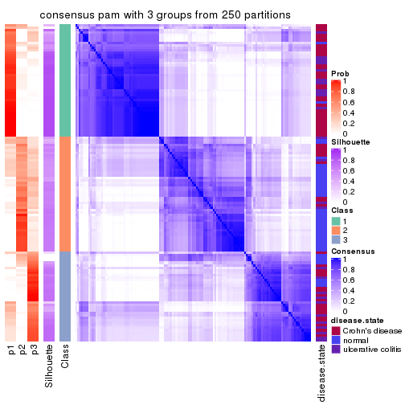</p>

</div>
<div id='tab-SD-pam-consensus-heatmap-3'>
<pre><code class="r">consensus_heatmap(res, k = 4)
</code></pre>

<p>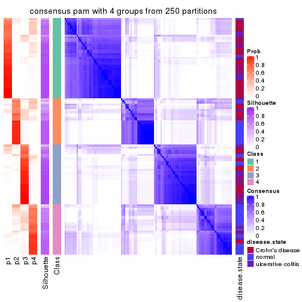</p>

</div>
<div id='tab-SD-pam-consensus-heatmap-4'>
<pre><code class="r">consensus_heatmap(res, k = 5)
</code></pre>

<p></p>

</div>
<div id='tab-SD-pam-consensus-heatmap-5'>
<pre><code class="r">consensus_heatmap(res, k = 6)
</code></pre>

<p></p>

</div>
</div>

Heatmaps for the membership of samples in all partitions to see how consistent they are:


<script>
$( function() {
	$( '#tabs-SD-pam-membership-heatmap' ).tabs();
} );
</script>
<div id='tabs-SD-pam-membership-heatmap'>
<ul>
<li><a href='#tab-SD-pam-membership-heatmap-1'>k = 2</a></li>
<li><a href='#tab-SD-pam-membership-heatmap-2'>k = 3</a></li>
<li><a href='#tab-SD-pam-membership-heatmap-3'>k = 4</a></li>
<li><a href='#tab-SD-pam-membership-heatmap-4'>k = 5</a></li>
<li><a href='#tab-SD-pam-membership-heatmap-5'>k = 6</a></li>
</ul>
<div id='tab-SD-pam-membership-heatmap-1'>
<pre><code class="r">membership_heatmap(res, k = 2)
</code></pre>

<p></p>

</div>
<div id='tab-SD-pam-membership-heatmap-2'>
<pre><code class="r">membership_heatmap(res, k = 3)
</code></pre>

<p></p>

</div>
<div id='tab-SD-pam-membership-heatmap-3'>
<pre><code class="r">membership_heatmap(res, k = 4)
</code></pre>

<p></p>

</div>
<div id='tab-SD-pam-membership-heatmap-4'>
<pre><code class="r">membership_heatmap(res, k = 5)
</code></pre>

<p></p>

</div>
<div id='tab-SD-pam-membership-heatmap-5'>
<pre><code class="r">membership_heatmap(res, k = 6)
</code></pre>

<p></p>

</div>
</div>

As soon as we have had the classes for columns, we can look for signatures
which are significantly different between classes which can be candidate marks
for certain classes. Following are the heatmaps for signatures.


Signature heatmaps where rows are scaled:


<script>
$( function() {
	$( '#tabs-SD-pam-get-signatures' ).tabs();
} );
</script>
<div id='tabs-SD-pam-get-signatures'>
<ul>
<li><a href='#tab-SD-pam-get-signatures-1'>k = 2</a></li>
<li><a href='#tab-SD-pam-get-signatures-2'>k = 3</a></li>
<li><a href='#tab-SD-pam-get-signatures-3'>k = 4</a></li>
<li><a href='#tab-SD-pam-get-signatures-4'>k = 5</a></li>
<li><a href='#tab-SD-pam-get-signatures-5'>k = 6</a></li>
</ul>
<div id='tab-SD-pam-get-signatures-1'>
<pre><code class="r">get_signatures(res, k = 2)
</code></pre>

<p></p>

</div>
<div id='tab-SD-pam-get-signatures-2'>
<pre><code class="r">get_signatures(res, k = 3)
</code></pre>

<p></p>

</div>
<div id='tab-SD-pam-get-signatures-3'>
<pre><code class="r">get_signatures(res, k = 4)
</code></pre>

<p></p>

</div>
<div id='tab-SD-pam-get-signatures-4'>
<pre><code class="r">get_signatures(res, k = 5)
</code></pre>

<p></p>

</div>
<div id='tab-SD-pam-get-signatures-5'>
<pre><code class="r">get_signatures(res, k = 6)
</code></pre>

<p></p>

</div>
</div>


Signature heatmaps where rows are not scaled:


<script>
$( function() {
	$( '#tabs-SD-pam-get-signatures-no-scale' ).tabs();
} );
</script>
<div id='tabs-SD-pam-get-signatures-no-scale'>
<ul>
<li><a href='#tab-SD-pam-get-signatures-no-scale-1'>k = 2</a></li>
<li><a href='#tab-SD-pam-get-signatures-no-scale-2'>k = 3</a></li>
<li><a href='#tab-SD-pam-get-signatures-no-scale-3'>k = 4</a></li>
<li><a href='#tab-SD-pam-get-signatures-no-scale-4'>k = 5</a></li>
<li><a href='#tab-SD-pam-get-signatures-no-scale-5'>k = 6</a></li>
</ul>
<div id='tab-SD-pam-get-signatures-no-scale-1'>
<pre><code class="r">get_signatures(res, k = 2, scale_rows = FALSE)
</code></pre>

<p></p>

</div>
<div id='tab-SD-pam-get-signatures-no-scale-2'>
<pre><code class="r">get_signatures(res, k = 3, scale_rows = FALSE)
</code></pre>

<p></p>

</div>
<div id='tab-SD-pam-get-signatures-no-scale-3'>
<pre><code class="r">get_signatures(res, k = 4, scale_rows = FALSE)
</code></pre>

<p></p>

</div>
<div id='tab-SD-pam-get-signatures-no-scale-4'>
<pre><code class="r">get_signatures(res, k = 5, scale_rows = FALSE)
</code></pre>

<p></p>

</div>
<div id='tab-SD-pam-get-signatures-no-scale-5'>
<pre><code class="r">get_signatures(res, k = 6, scale_rows = FALSE)
</code></pre>

<p></p>

</div>
</div>


Compare the overlap of signatures from different k:

```r
compare_signatures(res)
```


`get_signature()` returns a data frame invisibly. TO get the list of signatures, the function
call should be assigned to a variable explicitly. In following code, if `plot` argument is set
to `FALSE`, no heatmap is plotted while only the differential analysis is performed.

```r
# code only for demonstration
tb = get_signature(res, k = ..., plot = FALSE)
```

An example of the output of `tb` is:

```
#>   which_row         fdr    mean_1    mean_2 scaled_mean_1 scaled_mean_2 km
#> 1        38 0.042760348  8.373488  9.131774    -0.5533452     0.5164555  1
#> 2        40 0.018707592  7.106213  8.469186    -0.6173731     0.5762149  1
#> 3        55 0.019134737 10.221463 11.207825    -0.6159697     0.5749050  1
#> 4        59 0.006059896  5.921854  7.869574    -0.6899429     0.6439467  1
#> 5        60 0.018055526  8.928898 10.211722    -0.6204761     0.5791110  1
#> 6        98 0.009384629 15.714769 14.887706     0.6635654    -0.6193277  2
...
```

The columns in `tb` are:

1. `which_row`: row indices corresponding to the input matrix.
2. `fdr`: FDR for the differential test. 
3. `mean_x`: The mean value in group x.
4. `scaled_mean_x`: The mean value in group x after rows are scaled.
5. `km`: Row groups if k-means clustering is applied to rows.


UMAP plot which shows how samples are separated.


<script>
$( function() {
	$( '#tabs-SD-pam-dimension-reduction' ).tabs();
} );
</script>
<div id='tabs-SD-pam-dimension-reduction'>
<ul>
<li><a href='#tab-SD-pam-dimension-reduction-1'>k = 2</a></li>
<li><a href='#tab-SD-pam-dimension-reduction-2'>k = 3</a></li>
<li><a href='#tab-SD-pam-dimension-reduction-3'>k = 4</a></li>
<li><a href='#tab-SD-pam-dimension-reduction-4'>k = 5</a></li>
<li><a href='#tab-SD-pam-dimension-reduction-5'>k = 6</a></li>
</ul>
<div id='tab-SD-pam-dimension-reduction-1'>
<pre><code class="r">dimension_reduction(res, k = 2, method = &quot;UMAP&quot;)
</code></pre>

<p></p>

</div>
<div id='tab-SD-pam-dimension-reduction-2'>
<pre><code class="r">dimension_reduction(res, k = 3, method = &quot;UMAP&quot;)
</code></pre>

<p></p>

</div>
<div id='tab-SD-pam-dimension-reduction-3'>
<pre><code class="r">dimension_reduction(res, k = 4, method = &quot;UMAP&quot;)
</code></pre>

<p></p>

</div>
<div id='tab-SD-pam-dimension-reduction-4'>
<pre><code class="r">dimension_reduction(res, k = 5, method = &quot;UMAP&quot;)
</code></pre>

<p></p>

</div>
<div id='tab-SD-pam-dimension-reduction-5'>
<pre><code class="r">dimension_reduction(res, k = 6, method = &quot;UMAP&quot;)
</code></pre>

<p></p>

</div>
</div>


Following heatmap shows how subgroups are split when increasing `k`:

```r
collect_classes(res)
```


Test correlation between subgroups and known annotations. If the known
annotation is numeric, one-way ANOVA test is applied, and if the known
annotation is discrete, chi-squared contingency table test is applied.

```r
test_to_known_factors(res)
```

```
#>          n disease.state(p) k
#> SD:pam 110         5.02e-09 2
#> SD:pam 113         9.04e-10 3
#> SD:pam 119         3.57e-10 4
#> SD:pam  89         3.70e-11 5
#> SD:pam  97         7.56e-11 6
```


If matrix rows can be associated to genes, consider to use `functional_enrichment(res,
...)` to perform function enrichment for the signature genes. See [this vignette](http://bioconductor.org/packages/devel/bioc/vignettes/cola/inst/doc/functional_enrichment.html) for more detailed explanations.


 

---------------------------------------------------


### SD:mclust**


The object with results only for a single top-value method and a single partition method 
can be extracted as:

```r
res = res_list["SD", "mclust"]
# you can also extract it by
# res = res_list["SD:mclust"]
```

A summary of `res` and all the functions that can be applied to it:

```r
res
```

```
#> A 'ConsensusPartition' object with k = 2, 3, 4, 5, 6.
#>   On a matrix with 21168 rows and 127 columns.
#>   Top rows (1000, 2000, 3000, 4000, 5000) are extracted by 'SD' method.
#>   Subgroups are detected by 'mclust' method.
#>   Performed in total 1250 partitions by row resampling.
#>   Best k for subgroups seems to be 3.
#> 
#> Following methods can be applied to this 'ConsensusPartition' object:
#>  [1] "cola_report"             "collect_classes"         "collect_plots"          
#>  [4] "collect_stats"           "colnames"                "compare_signatures"     
#>  [7] "consensus_heatmap"       "dimension_reduction"     "functional_enrichment"  
#> [10] "get_anno_col"            "get_anno"                "get_classes"            
#> [13] "get_consensus"           "get_matrix"              "get_membership"         
#> [16] "get_param"               "get_signatures"          "get_stats"              
#> [19] "is_best_k"               "is_stable_k"             "membership_heatmap"     
#> [22] "ncol"                    "nrow"                    "plot_ecdf"              
#> [25] "rownames"                "select_partition_number" "show"                   
#> [28] "suggest_best_k"          "test_to_known_factors"
```

`collect_plots()` function collects all the plots made from `res` for all `k` (number of partitions)
into one single page to provide an easy and fast comparison between different `k`.

```r
collect_plots(res)
```


The plots are:

- The first row: a plot of the ECDF (empirical cumulative distribution
  function) curves of the consensus matrix for each `k` and the heatmap of
  predicted classes for each `k`.
- The second row: heatmaps of the consensus matrix for each `k`.
- The third row: heatmaps of the membership matrix for each `k`.
- The fouth row: heatmaps of the signatures for each `k`.

All the plots in panels can be made by individual functions and they are
plotted later in this section.

`select_partition_number()` produces several plots showing different
statistics for choosing "optimized" `k`. There are following statistics:

- ECDF curves of the consensus matrix for each `k`;
- 1-PAC. [The PAC
  score](https://en.wikipedia.org/wiki/Consensus_clustering#Over-interpretation_potential_of_consensus_clustering)
  measures the proportion of the ambiguous subgrouping.
- Mean silhouette score.
- Concordance. The mean probability of fiting the consensus class ids in all
  partitions.
- Area increased. Denote $A_k$ as the area under the ECDF curve for current
  `k`, the area increased is defined as $A_k - A_{k-1}$.
- Rand index. The percent of pairs of samples that are both in a same cluster
  or both are not in a same cluster in the partition of k and k-1.
- Jaccard index. The ratio of pairs of samples are both in a same cluster in
  the partition of k and k-1 and the pairs of samples are both in a same
  cluster in the partition k or k-1.

The detailed explanations of these statistics can be found in [the _cola_
vignette](http://bioconductor.org/packages/devel/bioc/vignettes/cola/inst/doc/cola.html#toc_13).

Generally speaking, lower PAC score, higher mean silhouette score or higher
concordance corresponds to better partition. Rand index and Jaccard index
measure how similar the current partition is compared to partition with `k-1`.
If they are too similar, we won't accept `k` is better than `k-1`.

```r
select_partition_number(res)
```


The numeric values for all these statistics can be obtained by `get_stats()`.

```r
get_stats(res)
```

```
#>   k 1-PAC mean_silhouette concordance area_increased  Rand Jaccard
#> 2 2 0.391           0.274       0.584         0.3413 0.584   0.584
#> 3 3 0.998           0.960       0.972         0.9189 0.550   0.345
#> 4 4 0.694           0.870       0.924         0.0446 0.740   0.417
#> 5 5 0.872           0.838       0.926         0.1284 0.885   0.642
#> 6 6 0.830           0.747       0.855         0.0432 0.918   0.676
```

`suggest_best_k()` suggests the best $k$ based on these statistics. The rules are as follows:

- All $k$ with Jaccard index larger than 0.95 are removed because increasing
  $k$ does not provide enough extra information. If all $k$ are removed, it is
  marked as no subgroup is detected.
- For all $k$ with 1-PAC score larger than 0.9, the maximal $k$ is taken as
  the best $k$, and other $k$ are marked as optional $k$.
- If it does not fit the second rule. The $k$ with the maximal vote of the
  highest 1-PAC score, highest mean silhouette, and highest concordance is
  taken as the best $k$.

```r
suggest_best_k(res)
```

```
#> [1] 3
```


Following shows the table of the partitions (You need to click the **show/hide
code output** link to see it). The membership matrix (columns with name `p*`)
is inferred by
[`clue::cl_consensus()`](https://www.rdocumentation.org/link/cl_consensus?package=clue)
function with the `SE` method. Basically the value in the membership matrix
represents the probability to belong to a certain group. The finall class
label for an item is determined with the group with highest probability it
belongs to.

In `get_classes()` function, the entropy is calculated from the membership
matrix and the silhouette score is calculated from the consensus matrix.


<script>
$( function() {
	$( '#tabs-SD-mclust-get-classes' ).tabs();
} );
</script>
<div id='tabs-SD-mclust-get-classes'>
<ul>
<li><a href='#tab-SD-mclust-get-classes-1'>k = 2</a></li>
<li><a href='#tab-SD-mclust-get-classes-2'>k = 3</a></li>
<li><a href='#tab-SD-mclust-get-classes-3'>k = 4</a></li>
<li><a href='#tab-SD-mclust-get-classes-4'>k = 5</a></li>
<li><a href='#tab-SD-mclust-get-classes-5'>k = 6</a></li>
</ul>

<div id='tab-SD-mclust-get-classes-1'>
<p><a id='tab-SD-mclust-get-classes-1-a' style='color:#0366d6' href='#'>show/hide code output</a></p>
<pre><code class="r">cbind(get_classes(res, k = 2), get_membership(res, k = 2))
</code></pre>

<pre><code>#&gt;          class entropy silhouette    p1    p2
#&gt; GSM76115     2  0.9933     0.1195 0.452 0.548
#&gt; GSM76116     2  0.9977     0.0574 0.472 0.528
#&gt; GSM76117     1  1.0000     0.0651 0.504 0.496
#&gt; GSM76118     1  0.9998     0.0822 0.508 0.492
#&gt; GSM76119     1  0.2948     0.4610 0.948 0.052
#&gt; GSM76120     1  0.2948     0.4610 0.948 0.052
#&gt; GSM76121     1  0.9998     0.0822 0.508 0.492
#&gt; GSM76122     2  0.9993     0.0036 0.484 0.516
#&gt; GSM76123     1  0.2948     0.4610 0.948 0.052
#&gt; GSM76124     1  0.9998     0.0822 0.508 0.492
#&gt; GSM76125     1  0.2948     0.4610 0.948 0.052
#&gt; GSM76126     1  0.2948     0.4610 0.948 0.052
#&gt; GSM76127     1  0.2948     0.4610 0.948 0.052
#&gt; GSM76128     1  0.2948     0.4610 0.948 0.052
#&gt; GSM76129     2  0.9963     0.0835 0.464 0.536
#&gt; GSM76130     1  0.2948     0.4610 0.948 0.052
#&gt; GSM76131     2  0.0000     0.5239 0.000 1.000
#&gt; GSM76132     2  0.0000     0.5239 0.000 1.000
#&gt; GSM76133     2  0.0000     0.5239 0.000 1.000
#&gt; GSM76134     2  0.9866     0.1778 0.432 0.568
#&gt; GSM76135     2  0.0000     0.5239 0.000 1.000
#&gt; GSM76136     2  0.0000     0.5239 0.000 1.000
#&gt; GSM76137     1  0.8909     0.3039 0.692 0.308
#&gt; GSM76138     2  0.9922     0.1378 0.448 0.552
#&gt; GSM76139     2  0.8555     0.4199 0.280 0.720
#&gt; GSM76140     1  0.9998     0.0822 0.508 0.492
#&gt; GSM76141     2  0.0000     0.5239 0.000 1.000
#&gt; GSM76142     2  0.0000     0.5239 0.000 1.000
#&gt; GSM76143     2  0.0000     0.5239 0.000 1.000
#&gt; GSM76144     2  0.0000     0.5239 0.000 1.000
#&gt; GSM76145     2  0.9998     0.0201 0.492 0.508
#&gt; GSM76146     2  0.0000     0.5239 0.000 1.000
#&gt; GSM76147     2  0.0000     0.5239 0.000 1.000
#&gt; GSM76148     2  0.0000     0.5239 0.000 1.000
#&gt; GSM76149     2  0.9323     0.3411 0.348 0.652
#&gt; GSM76150     2  0.9754     0.2345 0.408 0.592
#&gt; GSM76151     2  0.9933     0.1307 0.452 0.548
#&gt; GSM76152     1  0.9998     0.0822 0.508 0.492
#&gt; GSM76153     2  0.0000     0.5239 0.000 1.000
#&gt; GSM76154     2  0.7528     0.4544 0.216 0.784
#&gt; GSM76155     2  0.8608     0.4170 0.284 0.716
#&gt; GSM76156     2  0.0000     0.5239 0.000 1.000
#&gt; GSM76030     2  0.9977     0.0574 0.472 0.528
#&gt; GSM76031     1  0.9998     0.0822 0.508 0.492
#&gt; GSM76032     1  0.0000     0.4896 1.000 0.000
#&gt; GSM76033     1  0.0938     0.4843 0.988 0.012
#&gt; GSM76034     1  1.0000     0.0431 0.500 0.500
#&gt; GSM76035     1  0.0000     0.4896 1.000 0.000
#&gt; GSM76036     1  0.0000     0.4896 1.000 0.000
#&gt; GSM76037     2  0.9993     0.0036 0.484 0.516
#&gt; GSM76038     1  0.9998     0.0822 0.508 0.492
#&gt; GSM76039     1  0.9998     0.0822 0.508 0.492
#&gt; GSM76040     1  0.0000     0.4896 1.000 0.000
#&gt; GSM76041     1  0.9996     0.0838 0.512 0.488
#&gt; GSM76042     1  0.9998     0.0822 0.508 0.492
#&gt; GSM76043     1  0.9795     0.1581 0.584 0.416
#&gt; GSM76044     1  0.9998     0.0822 0.508 0.492
#&gt; GSM76045     1  0.9998     0.0822 0.508 0.492
#&gt; GSM76046     1  0.0938     0.4843 0.988 0.012
#&gt; GSM76047     1  0.9686     0.1845 0.604 0.396
#&gt; GSM76048     1  0.0000     0.4896 1.000 0.000
#&gt; GSM76049     2  0.9977     0.0574 0.472 0.528
#&gt; GSM76050     1  0.9881     0.1302 0.564 0.436
#&gt; GSM76051     1  0.0000     0.4896 1.000 0.000
#&gt; GSM76052     1  0.0000     0.4896 1.000 0.000
#&gt; GSM76053     1  0.4690     0.4544 0.900 0.100
#&gt; GSM76054     1  0.0000     0.4896 1.000 0.000
#&gt; GSM76055     1  1.0000     0.0651 0.504 0.496
#&gt; GSM76056     1  1.0000     0.0651 0.504 0.496
#&gt; GSM76057     2  0.9977     0.0574 0.472 0.528
#&gt; GSM76058     1  0.0000     0.4896 1.000 0.000
#&gt; GSM76059     1  0.9998     0.0822 0.508 0.492
#&gt; GSM76060     1  1.0000     0.0651 0.504 0.496
#&gt; GSM76061     2  0.9977     0.0574 0.472 0.528
#&gt; GSM76062     1  0.9998     0.0822 0.508 0.492
#&gt; GSM76063     1  0.9087     0.2765 0.676 0.324
#&gt; GSM76064     1  0.9044     0.2770 0.680 0.320
#&gt; GSM76065     2  0.9896     0.1656 0.440 0.560
#&gt; GSM76066     1  0.6973     0.4017 0.812 0.188
#&gt; GSM76067     1  0.0000     0.4896 1.000 0.000
#&gt; GSM76068     1  0.0000     0.4896 1.000 0.000
#&gt; GSM76069     1  0.9998     0.0822 0.508 0.492
#&gt; GSM76070     2  0.8813     0.4019 0.300 0.700
#&gt; GSM76071     1  0.9998     0.0822 0.508 0.492
#&gt; GSM76072     1  0.9998     0.0822 0.508 0.492
#&gt; GSM76073     1  0.9998     0.0822 0.508 0.492
#&gt; GSM76074     1  0.9998     0.0822 0.508 0.492
#&gt; GSM76075     1  0.0000     0.4896 1.000 0.000
#&gt; GSM76076     1  0.0000     0.4896 1.000 0.000
#&gt; GSM76077     1  1.0000     0.0651 0.504 0.496
#&gt; GSM76078     1  0.6438     0.4179 0.836 0.164
#&gt; GSM76079     1  0.9998     0.0822 0.508 0.492
#&gt; GSM76080     1  0.0376     0.4877 0.996 0.004
#&gt; GSM76081     1  0.0000     0.4896 1.000 0.000
#&gt; GSM76082     1  0.0000     0.4896 1.000 0.000
#&gt; GSM76083     1  0.0000     0.4896 1.000 0.000
#&gt; GSM76084     1  0.4022     0.4674 0.920 0.080
#&gt; GSM76085     1  0.0000     0.4896 1.000 0.000
#&gt; GSM76086     1  0.0000     0.4896 1.000 0.000
#&gt; GSM76087     2  0.8955     0.3893 0.312 0.688
#&gt; GSM76088     2  1.0000    -0.0632 0.496 0.504
#&gt; GSM76089     2  0.9710     0.2557 0.400 0.600
#&gt; GSM76090     1  0.0000     0.4896 1.000 0.000
#&gt; GSM76091     1  0.9998     0.0822 0.508 0.492
#&gt; GSM76092     1  0.9998     0.0822 0.508 0.492
#&gt; GSM76093     1  0.9998     0.0822 0.508 0.492
#&gt; GSM76094     1  1.0000     0.0651 0.504 0.496
#&gt; GSM76095     1  1.0000     0.0651 0.504 0.496
#&gt; GSM76096     1  0.9998     0.0822 0.508 0.492
#&gt; GSM76097     1  0.9998     0.0822 0.508 0.492
#&gt; GSM76098     1  0.0000     0.4896 1.000 0.000
#&gt; GSM76099     1  0.9998     0.0822 0.508 0.492
#&gt; GSM76100     1  0.9998     0.0822 0.508 0.492
#&gt; GSM76101     1  0.9998     0.0822 0.508 0.492
#&gt; GSM76102     1  0.9998     0.0822 0.508 0.492
#&gt; GSM76103     1  0.0000     0.4896 1.000 0.000
#&gt; GSM76104     1  0.1184     0.4820 0.984 0.016
#&gt; GSM76105     1  0.9998     0.0822 0.508 0.492
#&gt; GSM76106     1  0.2423     0.4688 0.960 0.040
#&gt; GSM76107     1  0.2948     0.4610 0.948 0.052
#&gt; GSM76108     1  0.9998     0.0822 0.508 0.492
#&gt; GSM76109     1  0.9998     0.0822 0.508 0.492
#&gt; GSM76110     1  0.9998     0.0822 0.508 0.492
#&gt; GSM76111     1  0.9998     0.0822 0.508 0.492
#&gt; GSM76112     1  0.9993     0.0849 0.516 0.484
#&gt; GSM76113     1  0.9998     0.0822 0.508 0.492
#&gt; GSM76114     1  0.9998     0.0822 0.508 0.492
</code></pre>

<script>
$('#tab-SD-mclust-get-classes-1-a').parent().next().next().hide();
$('#tab-SD-mclust-get-classes-1-a').click(function(){
  $('#tab-SD-mclust-get-classes-1-a').parent().next().next().toggle();
  return(false);
});
</script>
</div>

<div id='tab-SD-mclust-get-classes-2'>
<p><a id='tab-SD-mclust-get-classes-2-a' style='color:#0366d6' href='#'>show/hide code output</a></p>
<pre><code class="r">cbind(get_classes(res, k = 3), get_membership(res, k = 3))
</code></pre>

<pre><code>#&gt;          class entropy silhouette    p1    p2    p3
#&gt; GSM76115     2  0.1031      0.974 0.024 0.976 0.000
#&gt; GSM76116     2  0.1411      0.973 0.036 0.964 0.000
#&gt; GSM76117     2  0.1529      0.972 0.040 0.960 0.000
#&gt; GSM76118     2  0.1529      0.972 0.040 0.960 0.000
#&gt; GSM76119     3  0.1315      0.974 0.020 0.008 0.972
#&gt; GSM76120     3  0.1315      0.974 0.020 0.008 0.972
#&gt; GSM76121     2  0.1529      0.972 0.040 0.960 0.000
#&gt; GSM76122     2  0.1529      0.972 0.040 0.960 0.000
#&gt; GSM76123     3  0.1315      0.974 0.020 0.008 0.972
#&gt; GSM76124     2  0.1529      0.972 0.040 0.960 0.000
#&gt; GSM76125     3  0.1315      0.974 0.020 0.008 0.972
#&gt; GSM76126     3  0.3415      0.904 0.020 0.080 0.900
#&gt; GSM76127     3  0.1315      0.974 0.020 0.008 0.972
#&gt; GSM76128     3  0.1315      0.974 0.020 0.008 0.972
#&gt; GSM76129     2  0.1411      0.973 0.036 0.964 0.000
#&gt; GSM76130     3  0.1315      0.974 0.020 0.008 0.972
#&gt; GSM76131     2  0.0000      0.967 0.000 1.000 0.000
#&gt; GSM76132     2  0.0000      0.967 0.000 1.000 0.000
#&gt; GSM76133     2  0.0000      0.967 0.000 1.000 0.000
#&gt; GSM76134     2  0.0892      0.973 0.020 0.980 0.000
#&gt; GSM76135     2  0.0000      0.967 0.000 1.000 0.000
#&gt; GSM76136     2  0.0000      0.967 0.000 1.000 0.000
#&gt; GSM76137     2  0.1315      0.972 0.020 0.972 0.008
#&gt; GSM76138     2  0.1163      0.973 0.028 0.972 0.000
#&gt; GSM76139     2  0.0592      0.972 0.012 0.988 0.000
#&gt; GSM76140     2  0.1529      0.972 0.040 0.960 0.000
#&gt; GSM76141     2  0.0000      0.967 0.000 1.000 0.000
#&gt; GSM76142     2  0.0000      0.967 0.000 1.000 0.000
#&gt; GSM76143     2  0.0000      0.967 0.000 1.000 0.000
#&gt; GSM76144     2  0.0000      0.967 0.000 1.000 0.000
#&gt; GSM76145     2  0.1129      0.973 0.020 0.976 0.004
#&gt; GSM76146     2  0.0000      0.967 0.000 1.000 0.000
#&gt; GSM76147     2  0.0424      0.971 0.008 0.992 0.000
#&gt; GSM76148     2  0.0000      0.967 0.000 1.000 0.000
#&gt; GSM76149     2  0.0892      0.973 0.020 0.980 0.000
#&gt; GSM76150     2  0.0892      0.973 0.020 0.980 0.000
#&gt; GSM76151     2  0.1129      0.973 0.020 0.976 0.004
#&gt; GSM76152     1  0.0424      0.976 0.992 0.008 0.000
#&gt; GSM76153     2  0.0000      0.967 0.000 1.000 0.000
#&gt; GSM76154     2  0.0747      0.973 0.016 0.984 0.000
#&gt; GSM76155     2  0.0747      0.973 0.016 0.984 0.000
#&gt; GSM76156     2  0.0000      0.967 0.000 1.000 0.000
#&gt; GSM76030     2  0.1860      0.957 0.052 0.948 0.000
#&gt; GSM76031     1  0.2066      0.924 0.940 0.060 0.000
#&gt; GSM76032     3  0.0237      0.981 0.004 0.000 0.996
#&gt; GSM76033     3  0.0237      0.981 0.004 0.000 0.996
#&gt; GSM76034     2  0.1453      0.973 0.024 0.968 0.008
#&gt; GSM76035     3  0.1711      0.966 0.032 0.008 0.960
#&gt; GSM76036     3  0.0237      0.981 0.004 0.000 0.996
#&gt; GSM76037     2  0.1411      0.973 0.036 0.964 0.000
#&gt; GSM76038     1  0.0424      0.976 0.992 0.008 0.000
#&gt; GSM76039     2  0.1529      0.972 0.040 0.960 0.000
#&gt; GSM76040     3  0.0424      0.980 0.008 0.000 0.992
#&gt; GSM76041     1  0.0661      0.974 0.988 0.008 0.004
#&gt; GSM76042     2  0.1643      0.970 0.044 0.956 0.000
#&gt; GSM76043     1  0.1170      0.966 0.976 0.008 0.016
#&gt; GSM76044     2  0.1529      0.972 0.040 0.960 0.000
#&gt; GSM76045     1  0.0424      0.976 0.992 0.008 0.000
#&gt; GSM76046     3  0.0892      0.975 0.020 0.000 0.980
#&gt; GSM76047     1  0.0848      0.973 0.984 0.008 0.008
#&gt; GSM76048     3  0.0237      0.981 0.004 0.000 0.996
#&gt; GSM76049     1  0.6079      0.352 0.612 0.388 0.000
#&gt; GSM76050     1  0.0424      0.976 0.992 0.008 0.000
#&gt; GSM76051     3  0.0237      0.981 0.004 0.000 0.996
#&gt; GSM76052     3  0.0747      0.978 0.016 0.000 0.984
#&gt; GSM76053     2  0.6387      0.582 0.020 0.680 0.300
#&gt; GSM76054     3  0.0237      0.981 0.004 0.000 0.996
#&gt; GSM76055     2  0.1529      0.972 0.040 0.960 0.000
#&gt; GSM76056     1  0.0237      0.975 0.996 0.004 0.000
#&gt; GSM76057     1  0.0747      0.974 0.984 0.016 0.000
#&gt; GSM76058     3  0.0237      0.981 0.004 0.000 0.996
#&gt; GSM76059     1  0.0000      0.975 1.000 0.000 0.000
#&gt; GSM76060     1  0.0829      0.974 0.984 0.012 0.004
#&gt; GSM76061     1  0.2356      0.923 0.928 0.072 0.000
#&gt; GSM76062     1  0.0424      0.976 0.992 0.008 0.000
#&gt; GSM76063     2  0.3045      0.930 0.020 0.916 0.064
#&gt; GSM76064     1  0.0848      0.972 0.984 0.008 0.008
#&gt; GSM76065     2  0.1411      0.973 0.036 0.964 0.000
#&gt; GSM76066     1  0.0848      0.972 0.984 0.008 0.008
#&gt; GSM76067     3  0.0237      0.981 0.004 0.000 0.996
#&gt; GSM76068     3  0.0237      0.981 0.004 0.000 0.996
#&gt; GSM76069     1  0.0237      0.975 0.996 0.004 0.000
#&gt; GSM76070     2  0.0892      0.973 0.020 0.980 0.000
#&gt; GSM76071     1  0.0424      0.976 0.992 0.008 0.000
#&gt; GSM76072     1  0.0424      0.976 0.992 0.008 0.000
#&gt; GSM76073     1  0.0000      0.975 1.000 0.000 0.000
#&gt; GSM76074     1  0.0237      0.975 0.996 0.004 0.000
#&gt; GSM76075     3  0.0237      0.981 0.004 0.000 0.996
#&gt; GSM76076     3  0.0237      0.981 0.004 0.000 0.996
#&gt; GSM76077     1  0.0747      0.974 0.984 0.016 0.000
#&gt; GSM76078     1  0.2772      0.912 0.916 0.004 0.080
#&gt; GSM76079     1  0.0000      0.975 1.000 0.000 0.000
#&gt; GSM76080     3  0.1031      0.975 0.024 0.000 0.976
#&gt; GSM76081     3  0.0237      0.981 0.004 0.000 0.996
#&gt; GSM76082     3  0.0237      0.981 0.004 0.000 0.996
#&gt; GSM76083     3  0.0237      0.981 0.004 0.000 0.996
#&gt; GSM76084     2  0.6387      0.581 0.020 0.680 0.300
#&gt; GSM76085     3  0.0237      0.981 0.004 0.000 0.996
#&gt; GSM76086     3  0.0237      0.981 0.004 0.000 0.996
#&gt; GSM76087     2  0.0747      0.973 0.016 0.984 0.000
#&gt; GSM76088     1  0.0829      0.974 0.984 0.012 0.004
#&gt; GSM76089     2  0.0892      0.973 0.020 0.980 0.000
#&gt; GSM76090     3  0.0237      0.981 0.004 0.000 0.996
#&gt; GSM76091     1  0.0424      0.976 0.992 0.008 0.000
#&gt; GSM76092     1  0.0237      0.975 0.996 0.004 0.000
#&gt; GSM76093     1  0.0000      0.975 1.000 0.000 0.000
#&gt; GSM76094     2  0.1529      0.972 0.040 0.960 0.000
#&gt; GSM76095     1  0.1031      0.961 0.976 0.024 0.000
#&gt; GSM76096     2  0.1529      0.972 0.040 0.960 0.000
#&gt; GSM76097     2  0.1529      0.972 0.040 0.960 0.000
#&gt; GSM76098     3  0.0237      0.981 0.004 0.000 0.996
#&gt; GSM76099     1  0.0237      0.975 0.996 0.004 0.000
#&gt; GSM76100     1  0.0237      0.975 0.996 0.004 0.000
#&gt; GSM76101     1  0.0000      0.975 1.000 0.000 0.000
#&gt; GSM76102     2  0.1529      0.972 0.040 0.960 0.000
#&gt; GSM76103     3  0.0892      0.973 0.020 0.000 0.980
#&gt; GSM76104     3  0.1031      0.975 0.024 0.000 0.976
#&gt; GSM76105     2  0.1529      0.972 0.040 0.960 0.000
#&gt; GSM76106     3  0.1315      0.974 0.020 0.008 0.972
#&gt; GSM76107     3  0.4397      0.854 0.028 0.116 0.856
#&gt; GSM76108     2  0.1529      0.972 0.040 0.960 0.000
#&gt; GSM76109     1  0.0237      0.975 0.996 0.004 0.000
#&gt; GSM76110     1  0.0237      0.975 0.996 0.004 0.000
#&gt; GSM76111     1  0.0592      0.975 0.988 0.012 0.000
#&gt; GSM76112     1  0.0424      0.976 0.992 0.008 0.000
#&gt; GSM76113     2  0.1482      0.972 0.020 0.968 0.012
#&gt; GSM76114     1  0.0424      0.976 0.992 0.008 0.000
</code></pre>

<script>
$('#tab-SD-mclust-get-classes-2-a').parent().next().next().hide();
$('#tab-SD-mclust-get-classes-2-a').click(function(){
  $('#tab-SD-mclust-get-classes-2-a').parent().next().next().toggle();
  return(false);
});
</script>
</div>

<div id='tab-SD-mclust-get-classes-3'>
<p><a id='tab-SD-mclust-get-classes-3-a' style='color:#0366d6' href='#'>show/hide code output</a></p>
<pre><code class="r">cbind(get_classes(res, k = 4), get_membership(res, k = 4))
</code></pre>

<pre><code>#&gt;          class entropy silhouette    p1    p2    p3    p4
#&gt; GSM76115     2  0.3991     0.8829 0.172 0.808 0.020 0.000
#&gt; GSM76116     2  0.3172     0.8948 0.160 0.840 0.000 0.000
#&gt; GSM76117     1  0.1256     0.9316 0.964 0.008 0.000 0.028
#&gt; GSM76118     1  0.1510     0.9266 0.956 0.016 0.000 0.028
#&gt; GSM76119     4  0.0921     0.9376 0.000 0.000 0.028 0.972
#&gt; GSM76120     4  0.0921     0.9376 0.000 0.000 0.028 0.972
#&gt; GSM76121     1  0.1059     0.9327 0.972 0.000 0.016 0.012
#&gt; GSM76122     1  0.2775     0.8606 0.896 0.084 0.000 0.020
#&gt; GSM76123     4  0.0921     0.9376 0.000 0.000 0.028 0.972
#&gt; GSM76124     1  0.2124     0.9059 0.932 0.040 0.000 0.028
#&gt; GSM76125     4  0.0921     0.9376 0.000 0.000 0.028 0.972
#&gt; GSM76126     4  0.4381     0.7629 0.160 0.008 0.028 0.804
#&gt; GSM76127     4  0.0921     0.9376 0.000 0.000 0.028 0.972
#&gt; GSM76128     4  0.0921     0.9376 0.000 0.000 0.028 0.972
#&gt; GSM76129     2  0.3681     0.8848 0.176 0.816 0.008 0.000
#&gt; GSM76130     4  0.0921     0.9376 0.000 0.000 0.028 0.972
#&gt; GSM76131     2  0.0000     0.8196 0.000 1.000 0.000 0.000
#&gt; GSM76132     2  0.0000     0.8196 0.000 1.000 0.000 0.000
#&gt; GSM76133     2  0.0000     0.8196 0.000 1.000 0.000 0.000
#&gt; GSM76134     2  0.3172     0.8948 0.160 0.840 0.000 0.000
#&gt; GSM76135     2  0.0000     0.8196 0.000 1.000 0.000 0.000
#&gt; GSM76136     2  0.0000     0.8196 0.000 1.000 0.000 0.000
#&gt; GSM76137     2  0.3853     0.8894 0.160 0.820 0.020 0.000
#&gt; GSM76138     2  0.3172     0.8948 0.160 0.840 0.000 0.000
#&gt; GSM76139     2  0.2469     0.8769 0.108 0.892 0.000 0.000
#&gt; GSM76140     1  0.0921     0.9347 0.972 0.000 0.000 0.028
#&gt; GSM76141     2  0.0000     0.8196 0.000 1.000 0.000 0.000
#&gt; GSM76142     2  0.0000     0.8196 0.000 1.000 0.000 0.000
#&gt; GSM76143     2  0.0000     0.8196 0.000 1.000 0.000 0.000
#&gt; GSM76144     2  0.0000     0.8196 0.000 1.000 0.000 0.000
#&gt; GSM76145     2  0.3853     0.8894 0.160 0.820 0.020 0.000
#&gt; GSM76146     2  0.0000     0.8196 0.000 1.000 0.000 0.000
#&gt; GSM76147     2  0.0817     0.8337 0.024 0.976 0.000 0.000
#&gt; GSM76148     2  0.0000     0.8196 0.000 1.000 0.000 0.000
#&gt; GSM76149     2  0.3172     0.8948 0.160 0.840 0.000 0.000
#&gt; GSM76150     2  0.3172     0.8948 0.160 0.840 0.000 0.000
#&gt; GSM76151     2  0.3853     0.8894 0.160 0.820 0.020 0.000
#&gt; GSM76152     1  0.0000     0.9429 1.000 0.000 0.000 0.000
#&gt; GSM76153     2  0.0000     0.8196 0.000 1.000 0.000 0.000
#&gt; GSM76154     2  0.3172     0.8948 0.160 0.840 0.000 0.000
#&gt; GSM76155     2  0.3172     0.8948 0.160 0.840 0.000 0.000
#&gt; GSM76156     2  0.0000     0.8196 0.000 1.000 0.000 0.000
#&gt; GSM76030     2  0.3853     0.8894 0.160 0.820 0.020 0.000
#&gt; GSM76031     1  0.0000     0.9429 1.000 0.000 0.000 0.000
#&gt; GSM76032     3  0.0000     0.9185 0.000 0.000 1.000 0.000
#&gt; GSM76033     3  0.0000     0.9185 0.000 0.000 1.000 0.000
#&gt; GSM76034     2  0.3853     0.8894 0.160 0.820 0.020 0.000
#&gt; GSM76035     3  0.2647     0.7978 0.120 0.000 0.880 0.000
#&gt; GSM76036     3  0.0000     0.9185 0.000 0.000 1.000 0.000
#&gt; GSM76037     2  0.3172     0.8948 0.160 0.840 0.000 0.000
#&gt; GSM76038     1  0.0000     0.9429 1.000 0.000 0.000 0.000
#&gt; GSM76039     1  0.0921     0.9347 0.972 0.000 0.000 0.028
#&gt; GSM76040     3  0.0000     0.9185 0.000 0.000 1.000 0.000
#&gt; GSM76041     1  0.4134     0.6178 0.740 0.000 0.260 0.000
#&gt; GSM76042     1  0.1042     0.9306 0.972 0.000 0.020 0.008
#&gt; GSM76043     3  0.3942     0.6588 0.236 0.000 0.764 0.000
#&gt; GSM76044     1  0.1109     0.9337 0.968 0.004 0.000 0.028
#&gt; GSM76045     1  0.0000     0.9429 1.000 0.000 0.000 0.000
#&gt; GSM76046     3  0.0188     0.9159 0.004 0.000 0.996 0.000
#&gt; GSM76047     1  0.4989     0.0672 0.528 0.000 0.472 0.000
#&gt; GSM76048     3  0.0000     0.9185 0.000 0.000 1.000 0.000
#&gt; GSM76049     2  0.3946     0.8862 0.168 0.812 0.020 0.000
#&gt; GSM76050     1  0.2216     0.8573 0.908 0.000 0.092 0.000
#&gt; GSM76051     3  0.0000     0.9185 0.000 0.000 1.000 0.000
#&gt; GSM76052     3  0.0000     0.9185 0.000 0.000 1.000 0.000
#&gt; GSM76053     1  0.6275     0.5167 0.640 0.104 0.256 0.000
#&gt; GSM76054     3  0.0000     0.9185 0.000 0.000 1.000 0.000
#&gt; GSM76055     2  0.5731     0.4145 0.428 0.544 0.000 0.028
#&gt; GSM76056     1  0.4220     0.5904 0.748 0.248 0.004 0.000
#&gt; GSM76057     2  0.3946     0.8862 0.168 0.812 0.020 0.000
#&gt; GSM76058     3  0.0000     0.9185 0.000 0.000 1.000 0.000
#&gt; GSM76059     1  0.0000     0.9429 1.000 0.000 0.000 0.000
#&gt; GSM76060     2  0.4050     0.8845 0.168 0.808 0.024 0.000
#&gt; GSM76061     2  0.3946     0.8862 0.168 0.812 0.020 0.000
#&gt; GSM76062     1  0.0000     0.9429 1.000 0.000 0.000 0.000
#&gt; GSM76063     3  0.4944     0.6725 0.072 0.160 0.768 0.000
#&gt; GSM76064     3  0.3649     0.7006 0.204 0.000 0.796 0.000
#&gt; GSM76065     2  0.3172     0.8948 0.160 0.840 0.000 0.000
#&gt; GSM76066     3  0.0921     0.8959 0.028 0.000 0.972 0.000
#&gt; GSM76067     3  0.0000     0.9185 0.000 0.000 1.000 0.000
#&gt; GSM76068     3  0.0000     0.9185 0.000 0.000 1.000 0.000
#&gt; GSM76069     1  0.0000     0.9429 1.000 0.000 0.000 0.000
#&gt; GSM76070     2  0.3172     0.8948 0.160 0.840 0.000 0.000
#&gt; GSM76071     1  0.0000     0.9429 1.000 0.000 0.000 0.000
#&gt; GSM76072     1  0.0000     0.9429 1.000 0.000 0.000 0.000
#&gt; GSM76073     1  0.0000     0.9429 1.000 0.000 0.000 0.000
#&gt; GSM76074     1  0.0000     0.9429 1.000 0.000 0.000 0.000
#&gt; GSM76075     3  0.0000     0.9185 0.000 0.000 1.000 0.000
#&gt; GSM76076     3  0.0000     0.9185 0.000 0.000 1.000 0.000
#&gt; GSM76077     2  0.4855     0.7712 0.268 0.712 0.020 0.000
#&gt; GSM76078     3  0.0336     0.9131 0.008 0.000 0.992 0.000
#&gt; GSM76079     1  0.0000     0.9429 1.000 0.000 0.000 0.000
#&gt; GSM76080     3  0.0469     0.9095 0.012 0.000 0.988 0.000
#&gt; GSM76081     3  0.0000     0.9185 0.000 0.000 1.000 0.000
#&gt; GSM76082     3  0.0000     0.9185 0.000 0.000 1.000 0.000
#&gt; GSM76083     3  0.0000     0.9185 0.000 0.000 1.000 0.000
#&gt; GSM76084     3  0.5770     0.5924 0.140 0.148 0.712 0.000
#&gt; GSM76085     3  0.0000     0.9185 0.000 0.000 1.000 0.000
#&gt; GSM76086     3  0.0000     0.9185 0.000 0.000 1.000 0.000
#&gt; GSM76087     2  0.3172     0.8948 0.160 0.840 0.000 0.000
#&gt; GSM76088     2  0.3991     0.8837 0.172 0.808 0.020 0.000
#&gt; GSM76089     2  0.3172     0.8948 0.160 0.840 0.000 0.000
#&gt; GSM76090     3  0.0000     0.9185 0.000 0.000 1.000 0.000
#&gt; GSM76091     1  0.0000     0.9429 1.000 0.000 0.000 0.000
#&gt; GSM76092     1  0.0000     0.9429 1.000 0.000 0.000 0.000
#&gt; GSM76093     1  0.0000     0.9429 1.000 0.000 0.000 0.000
#&gt; GSM76094     1  0.2699     0.8753 0.904 0.068 0.000 0.028
#&gt; GSM76095     1  0.0336     0.9393 0.992 0.008 0.000 0.000
#&gt; GSM76096     1  0.0592     0.9385 0.984 0.000 0.000 0.016
#&gt; GSM76097     1  0.0921     0.9347 0.972 0.000 0.000 0.028
#&gt; GSM76098     3  0.0000     0.9185 0.000 0.000 1.000 0.000
#&gt; GSM76099     1  0.0000     0.9429 1.000 0.000 0.000 0.000
#&gt; GSM76100     1  0.0000     0.9429 1.000 0.000 0.000 0.000
#&gt; GSM76101     1  0.0000     0.9429 1.000 0.000 0.000 0.000
#&gt; GSM76102     1  0.1059     0.9327 0.972 0.000 0.016 0.012
#&gt; GSM76103     3  0.0000     0.9185 0.000 0.000 1.000 0.000
#&gt; GSM76104     3  0.3024     0.7631 0.148 0.000 0.852 0.000
#&gt; GSM76105     1  0.1109     0.9334 0.968 0.004 0.000 0.028
#&gt; GSM76106     3  0.3105     0.7717 0.140 0.000 0.856 0.004
#&gt; GSM76107     4  0.4010     0.7750 0.156 0.000 0.028 0.816
#&gt; GSM76108     1  0.0921     0.9347 0.972 0.000 0.000 0.028
#&gt; GSM76109     1  0.0000     0.9429 1.000 0.000 0.000 0.000
#&gt; GSM76110     1  0.0000     0.9429 1.000 0.000 0.000 0.000
#&gt; GSM76111     1  0.0000     0.9429 1.000 0.000 0.000 0.000
#&gt; GSM76112     3  0.4624     0.5130 0.340 0.000 0.660 0.000
#&gt; GSM76113     2  0.4701     0.8596 0.164 0.780 0.056 0.000
#&gt; GSM76114     1  0.0000     0.9429 1.000 0.000 0.000 0.000
</code></pre>

<script>
$('#tab-SD-mclust-get-classes-3-a').parent().next().next().hide();
$('#tab-SD-mclust-get-classes-3-a').click(function(){
  $('#tab-SD-mclust-get-classes-3-a').parent().next().next().toggle();
  return(false);
});
</script>
</div>

<div id='tab-SD-mclust-get-classes-4'>
<p><a id='tab-SD-mclust-get-classes-4-a' style='color:#0366d6' href='#'>show/hide code output</a></p>
<pre><code class="r">cbind(get_classes(res, k = 5), get_membership(res, k = 5))
</code></pre>

<pre><code>#&gt;          class entropy silhouette    p1    p2    p3    p4    p5
#&gt; GSM76115     2  0.4278     0.2568 0.000 0.548 0.000 0.000 0.452
#&gt; GSM76116     2  0.3039     0.7764 0.012 0.836 0.000 0.000 0.152
#&gt; GSM76117     5  0.0510     0.9654 0.016 0.000 0.000 0.000 0.984
#&gt; GSM76118     5  0.0510     0.9654 0.016 0.000 0.000 0.000 0.984
#&gt; GSM76119     4  0.0000     0.9635 0.000 0.000 0.000 1.000 0.000
#&gt; GSM76120     4  0.0000     0.9635 0.000 0.000 0.000 1.000 0.000
#&gt; GSM76121     5  0.0671     0.9640 0.016 0.000 0.004 0.000 0.980
#&gt; GSM76122     5  0.0566     0.9603 0.012 0.004 0.000 0.000 0.984
#&gt; GSM76123     4  0.0000     0.9635 0.000 0.000 0.000 1.000 0.000
#&gt; GSM76124     5  0.0609     0.9680 0.020 0.000 0.000 0.000 0.980
#&gt; GSM76125     4  0.0000     0.9635 0.000 0.000 0.000 1.000 0.000
#&gt; GSM76126     4  0.4623     0.7851 0.016 0.128 0.024 0.788 0.044
#&gt; GSM76127     4  0.0000     0.9635 0.000 0.000 0.000 1.000 0.000
#&gt; GSM76128     4  0.0794     0.9439 0.000 0.000 0.028 0.972 0.000
#&gt; GSM76129     2  0.4650     0.1570 0.012 0.520 0.000 0.000 0.468
#&gt; GSM76130     4  0.0000     0.9635 0.000 0.000 0.000 1.000 0.000
#&gt; GSM76131     2  0.0162     0.8545 0.000 0.996 0.000 0.000 0.004
#&gt; GSM76132     2  0.0162     0.8545 0.000 0.996 0.000 0.000 0.004
#&gt; GSM76133     2  0.0162     0.8545 0.000 0.996 0.000 0.000 0.004
#&gt; GSM76134     2  0.0703     0.8538 0.000 0.976 0.000 0.000 0.024
#&gt; GSM76135     2  0.0162     0.8545 0.000 0.996 0.000 0.000 0.004
#&gt; GSM76136     2  0.0162     0.8545 0.000 0.996 0.000 0.000 0.004
#&gt; GSM76137     2  0.0992     0.8521 0.008 0.968 0.000 0.000 0.024
#&gt; GSM76138     2  0.0794     0.8537 0.000 0.972 0.000 0.000 0.028
#&gt; GSM76139     2  0.0404     0.8546 0.000 0.988 0.000 0.000 0.012
#&gt; GSM76140     5  0.0794     0.9687 0.028 0.000 0.000 0.000 0.972
#&gt; GSM76141     2  0.0162     0.8545 0.000 0.996 0.000 0.000 0.004
#&gt; GSM76142     2  0.0162     0.8545 0.000 0.996 0.000 0.000 0.004
#&gt; GSM76143     2  0.0162     0.8545 0.000 0.996 0.000 0.000 0.004
#&gt; GSM76144     2  0.0162     0.8545 0.000 0.996 0.000 0.000 0.004
#&gt; GSM76145     2  0.1186     0.8508 0.008 0.964 0.008 0.000 0.020
#&gt; GSM76146     2  0.0162     0.8545 0.000 0.996 0.000 0.000 0.004
#&gt; GSM76147     2  0.0510     0.8548 0.000 0.984 0.000 0.000 0.016
#&gt; GSM76148     2  0.0162     0.8545 0.000 0.996 0.000 0.000 0.004
#&gt; GSM76149     2  0.0703     0.8538 0.000 0.976 0.000 0.000 0.024
#&gt; GSM76150     2  0.0703     0.8538 0.000 0.976 0.000 0.000 0.024
#&gt; GSM76151     2  0.0992     0.8521 0.008 0.968 0.000 0.000 0.024
#&gt; GSM76152     1  0.0000     0.9376 1.000 0.000 0.000 0.000 0.000
#&gt; GSM76153     2  0.0162     0.8545 0.000 0.996 0.000 0.000 0.004
#&gt; GSM76154     2  0.0703     0.8538 0.000 0.976 0.000 0.000 0.024
#&gt; GSM76155     2  0.0703     0.8538 0.000 0.976 0.000 0.000 0.024
#&gt; GSM76156     2  0.0162     0.8545 0.000 0.996 0.000 0.000 0.004
#&gt; GSM76030     2  0.3052     0.8062 0.016 0.876 0.036 0.000 0.072
#&gt; GSM76031     1  0.0000     0.9376 1.000 0.000 0.000 0.000 0.000
#&gt; GSM76032     3  0.0000     0.9462 0.000 0.000 1.000 0.000 0.000
#&gt; GSM76033     3  0.0000     0.9462 0.000 0.000 1.000 0.000 0.000
#&gt; GSM76034     2  0.4406     0.7343 0.016 0.768 0.044 0.000 0.172
#&gt; GSM76035     3  0.0290     0.9411 0.008 0.000 0.992 0.000 0.000
#&gt; GSM76036     3  0.0000     0.9462 0.000 0.000 1.000 0.000 0.000
#&gt; GSM76037     2  0.4659     0.1225 0.012 0.500 0.000 0.000 0.488
#&gt; GSM76038     1  0.0579     0.9309 0.984 0.000 0.008 0.000 0.008
#&gt; GSM76039     5  0.0794     0.9687 0.028 0.000 0.000 0.000 0.972
#&gt; GSM76040     3  0.0000     0.9462 0.000 0.000 1.000 0.000 0.000
#&gt; GSM76041     1  0.0609     0.9231 0.980 0.000 0.020 0.000 0.000
#&gt; GSM76042     5  0.1410     0.9465 0.060 0.000 0.000 0.000 0.940
#&gt; GSM76043     3  0.1270     0.9016 0.052 0.000 0.948 0.000 0.000
#&gt; GSM76044     5  0.0703     0.9695 0.024 0.000 0.000 0.000 0.976
#&gt; GSM76045     1  0.0404     0.9299 0.988 0.000 0.012 0.000 0.000
#&gt; GSM76046     3  0.0000     0.9462 0.000 0.000 1.000 0.000 0.000
#&gt; GSM76047     3  0.3353     0.7180 0.196 0.000 0.796 0.000 0.008
#&gt; GSM76048     3  0.0000     0.9462 0.000 0.000 1.000 0.000 0.000
#&gt; GSM76049     2  0.5089     0.5707 0.028 0.664 0.024 0.000 0.284
#&gt; GSM76050     1  0.0609     0.9238 0.980 0.000 0.020 0.000 0.000
#&gt; GSM76051     3  0.0000     0.9462 0.000 0.000 1.000 0.000 0.000
#&gt; GSM76052     3  0.0000     0.9462 0.000 0.000 1.000 0.000 0.000
#&gt; GSM76053     3  0.6498    -0.0377 0.016 0.120 0.436 0.000 0.428
#&gt; GSM76054     3  0.0000     0.9462 0.000 0.000 1.000 0.000 0.000
#&gt; GSM76055     5  0.0703     0.9695 0.024 0.000 0.000 0.000 0.976
#&gt; GSM76056     1  0.6153     0.0223 0.460 0.132 0.000 0.000 0.408
#&gt; GSM76057     2  0.4891     0.6775 0.036 0.732 0.036 0.000 0.196
#&gt; GSM76058     3  0.0000     0.9462 0.000 0.000 1.000 0.000 0.000
#&gt; GSM76059     1  0.0290     0.9383 0.992 0.000 0.000 0.000 0.008
#&gt; GSM76060     3  0.5501     0.1381 0.036 0.412 0.536 0.000 0.016
#&gt; GSM76061     2  0.3959     0.7546 0.024 0.808 0.028 0.000 0.140
#&gt; GSM76062     1  0.0000     0.9376 1.000 0.000 0.000 0.000 0.000
#&gt; GSM76063     2  0.3989     0.6076 0.008 0.728 0.260 0.000 0.004
#&gt; GSM76064     3  0.2074     0.8445 0.104 0.000 0.896 0.000 0.000
#&gt; GSM76065     2  0.3304     0.7589 0.016 0.816 0.000 0.000 0.168
#&gt; GSM76066     1  0.3561     0.6088 0.740 0.000 0.260 0.000 0.000
#&gt; GSM76067     3  0.0000     0.9462 0.000 0.000 1.000 0.000 0.000
#&gt; GSM76068     3  0.0000     0.9462 0.000 0.000 1.000 0.000 0.000
#&gt; GSM76069     1  0.0290     0.9383 0.992 0.000 0.000 0.000 0.008
#&gt; GSM76070     2  0.0912     0.8524 0.012 0.972 0.000 0.000 0.016
#&gt; GSM76071     1  0.0000     0.9376 1.000 0.000 0.000 0.000 0.000
#&gt; GSM76072     1  0.0000     0.9376 1.000 0.000 0.000 0.000 0.000
#&gt; GSM76073     1  0.0290     0.9383 0.992 0.000 0.000 0.000 0.008
#&gt; GSM76074     1  0.0290     0.9383 0.992 0.000 0.000 0.000 0.008
#&gt; GSM76075     3  0.0000     0.9462 0.000 0.000 1.000 0.000 0.000
#&gt; GSM76076     3  0.0000     0.9462 0.000 0.000 1.000 0.000 0.000
#&gt; GSM76077     2  0.6937     0.0637 0.132 0.424 0.036 0.000 0.408
#&gt; GSM76078     3  0.0000     0.9462 0.000 0.000 1.000 0.000 0.000
#&gt; GSM76079     1  0.0290     0.9383 0.992 0.000 0.000 0.000 0.008
#&gt; GSM76080     3  0.0451     0.9389 0.008 0.000 0.988 0.000 0.004
#&gt; GSM76081     3  0.0000     0.9462 0.000 0.000 1.000 0.000 0.000
#&gt; GSM76082     3  0.0000     0.9462 0.000 0.000 1.000 0.000 0.000
#&gt; GSM76083     3  0.0000     0.9462 0.000 0.000 1.000 0.000 0.000
#&gt; GSM76084     2  0.4380     0.5698 0.008 0.692 0.288 0.000 0.012
#&gt; GSM76085     3  0.0000     0.9462 0.000 0.000 1.000 0.000 0.000
#&gt; GSM76086     3  0.0000     0.9462 0.000 0.000 1.000 0.000 0.000
#&gt; GSM76087     2  0.0703     0.8538 0.000 0.976 0.000 0.000 0.024
#&gt; GSM76088     2  0.7535     0.1952 0.340 0.440 0.100 0.000 0.120
#&gt; GSM76089     2  0.0798     0.8530 0.008 0.976 0.000 0.000 0.016
#&gt; GSM76090     3  0.0000     0.9462 0.000 0.000 1.000 0.000 0.000
#&gt; GSM76091     1  0.0000     0.9376 1.000 0.000 0.000 0.000 0.000
#&gt; GSM76092     1  0.0290     0.9383 0.992 0.000 0.000 0.000 0.008
#&gt; GSM76093     1  0.0290     0.9383 0.992 0.000 0.000 0.000 0.008
#&gt; GSM76094     5  0.0510     0.9654 0.016 0.000 0.000 0.000 0.984
#&gt; GSM76095     5  0.1341     0.9500 0.056 0.000 0.000 0.000 0.944
#&gt; GSM76096     5  0.1270     0.9530 0.052 0.000 0.000 0.000 0.948
#&gt; GSM76097     5  0.0794     0.9687 0.028 0.000 0.000 0.000 0.972
#&gt; GSM76098     3  0.0162     0.9438 0.004 0.000 0.996 0.000 0.000
#&gt; GSM76099     1  0.0404     0.9365 0.988 0.000 0.000 0.000 0.012
#&gt; GSM76100     1  0.3074     0.7389 0.804 0.000 0.000 0.000 0.196
#&gt; GSM76101     1  0.0290     0.9383 0.992 0.000 0.000 0.000 0.008
#&gt; GSM76102     5  0.3430     0.7234 0.220 0.000 0.004 0.000 0.776
#&gt; GSM76103     3  0.0000     0.9462 0.000 0.000 1.000 0.000 0.000
#&gt; GSM76104     3  0.0451     0.9389 0.008 0.000 0.988 0.000 0.004
#&gt; GSM76105     5  0.0703     0.9695 0.024 0.000 0.000 0.000 0.976
#&gt; GSM76106     3  0.0867     0.9317 0.008 0.000 0.976 0.008 0.008
#&gt; GSM76107     4  0.1679     0.9322 0.012 0.004 0.016 0.948 0.020
#&gt; GSM76108     5  0.0794     0.9687 0.028 0.000 0.000 0.000 0.972
#&gt; GSM76109     1  0.0290     0.9383 0.992 0.000 0.000 0.000 0.008
#&gt; GSM76110     1  0.0404     0.9365 0.988 0.000 0.000 0.000 0.012
#&gt; GSM76111     1  0.3395     0.6708 0.764 0.000 0.000 0.000 0.236
#&gt; GSM76112     1  0.0000     0.9376 1.000 0.000 0.000 0.000 0.000
#&gt; GSM76113     2  0.5424     0.1032 0.020 0.492 0.464 0.000 0.024
#&gt; GSM76114     1  0.0000     0.9376 1.000 0.000 0.000 0.000 0.000
</code></pre>

<script>
$('#tab-SD-mclust-get-classes-4-a').parent().next().next().hide();
$('#tab-SD-mclust-get-classes-4-a').click(function(){
  $('#tab-SD-mclust-get-classes-4-a').parent().next().next().toggle();
  return(false);
});
</script>
</div>

<div id='tab-SD-mclust-get-classes-5'>
<p><a id='tab-SD-mclust-get-classes-5-a' style='color:#0366d6' href='#'>show/hide code output</a></p>
<pre><code class="r">cbind(get_classes(res, k = 6), get_membership(res, k = 6))
</code></pre>

<pre><code>#&gt;          class entropy silhouette    p1    p2    p3    p4    p5    p6
#&gt; GSM76115     2  0.4371     0.4623 0.000 0.620 0.000 0.000 0.344 0.036
#&gt; GSM76116     2  0.2871     0.7620 0.000 0.804 0.000 0.000 0.192 0.004
#&gt; GSM76117     5  0.0000     0.9004 0.000 0.000 0.000 0.000 1.000 0.000
#&gt; GSM76118     5  0.0000     0.9004 0.000 0.000 0.000 0.000 1.000 0.000
#&gt; GSM76119     4  0.0000     0.9759 0.000 0.000 0.000 1.000 0.000 0.000
#&gt; GSM76120     4  0.0000     0.9759 0.000 0.000 0.000 1.000 0.000 0.000
#&gt; GSM76121     5  0.0909     0.8877 0.012 0.000 0.020 0.000 0.968 0.000
#&gt; GSM76122     5  0.0000     0.9004 0.000 0.000 0.000 0.000 1.000 0.000
#&gt; GSM76123     4  0.0000     0.9759 0.000 0.000 0.000 1.000 0.000 0.000
#&gt; GSM76124     5  0.0000     0.9004 0.000 0.000 0.000 0.000 1.000 0.000
#&gt; GSM76125     4  0.0000     0.9759 0.000 0.000 0.000 1.000 0.000 0.000
#&gt; GSM76126     3  0.5355    -0.1383 0.000 0.040 0.472 0.460 0.012 0.016
#&gt; GSM76127     4  0.0000     0.9759 0.000 0.000 0.000 1.000 0.000 0.000
#&gt; GSM76128     4  0.1327     0.9079 0.000 0.000 0.064 0.936 0.000 0.000
#&gt; GSM76129     2  0.4252     0.4054 0.000 0.604 0.000 0.000 0.372 0.024
#&gt; GSM76130     4  0.0000     0.9759 0.000 0.000 0.000 1.000 0.000 0.000
#&gt; GSM76131     2  0.1910     0.8662 0.000 0.892 0.000 0.000 0.000 0.108
#&gt; GSM76132     2  0.1863     0.8669 0.000 0.896 0.000 0.000 0.000 0.104
#&gt; GSM76133     2  0.1910     0.8662 0.000 0.892 0.000 0.000 0.000 0.108
#&gt; GSM76134     2  0.1082     0.8745 0.000 0.956 0.000 0.000 0.004 0.040
#&gt; GSM76135     2  0.1007     0.8786 0.000 0.956 0.000 0.000 0.000 0.044
#&gt; GSM76136     2  0.1910     0.8662 0.000 0.892 0.000 0.000 0.000 0.108
#&gt; GSM76137     2  0.1708     0.8678 0.000 0.932 0.024 0.000 0.004 0.040
#&gt; GSM76138     2  0.1480     0.8722 0.000 0.940 0.000 0.000 0.020 0.040
#&gt; GSM76139     2  0.0547     0.8795 0.000 0.980 0.000 0.000 0.000 0.020
#&gt; GSM76140     5  0.0260     0.9011 0.008 0.000 0.000 0.000 0.992 0.000
#&gt; GSM76141     2  0.1444     0.8747 0.000 0.928 0.000 0.000 0.000 0.072
#&gt; GSM76142     2  0.1910     0.8662 0.000 0.892 0.000 0.000 0.000 0.108
#&gt; GSM76143     2  0.1863     0.8669 0.000 0.896 0.000 0.000 0.000 0.104
#&gt; GSM76144     2  0.1863     0.8669 0.000 0.896 0.000 0.000 0.000 0.104
#&gt; GSM76145     2  0.2237     0.8431 0.000 0.896 0.080 0.000 0.004 0.020
#&gt; GSM76146     2  0.1327     0.8763 0.000 0.936 0.000 0.000 0.000 0.064
#&gt; GSM76147     2  0.0547     0.8794 0.000 0.980 0.000 0.000 0.000 0.020
#&gt; GSM76148     2  0.1141     0.8781 0.000 0.948 0.000 0.000 0.000 0.052
#&gt; GSM76149     2  0.1082     0.8745 0.000 0.956 0.000 0.000 0.004 0.040
#&gt; GSM76150     2  0.1082     0.8745 0.000 0.956 0.000 0.000 0.004 0.040
#&gt; GSM76151     2  0.1536     0.8708 0.000 0.940 0.016 0.000 0.004 0.040
#&gt; GSM76152     1  0.0405     0.9235 0.988 0.000 0.008 0.000 0.004 0.000
#&gt; GSM76153     2  0.1910     0.8662 0.000 0.892 0.000 0.000 0.000 0.108
#&gt; GSM76154     2  0.1082     0.8745 0.000 0.956 0.000 0.000 0.004 0.040
#&gt; GSM76155     2  0.0935     0.8758 0.000 0.964 0.000 0.000 0.004 0.032
#&gt; GSM76156     2  0.1075     0.8782 0.000 0.952 0.000 0.000 0.000 0.048
#&gt; GSM76030     2  0.3934     0.7469 0.012 0.780 0.068 0.000 0.140 0.000
#&gt; GSM76031     1  0.0806     0.9171 0.972 0.000 0.020 0.000 0.008 0.000
#&gt; GSM76032     6  0.3843     0.6860 0.000 0.000 0.452 0.000 0.000 0.548
#&gt; GSM76033     3  0.0865     0.7014 0.000 0.000 0.964 0.000 0.000 0.036
#&gt; GSM76034     3  0.4726     0.2950 0.000 0.352 0.600 0.000 0.036 0.012
#&gt; GSM76035     3  0.0000     0.7180 0.000 0.000 1.000 0.000 0.000 0.000
#&gt; GSM76036     3  0.1444     0.6631 0.000 0.000 0.928 0.000 0.000 0.072
#&gt; GSM76037     2  0.2996     0.7260 0.000 0.772 0.000 0.000 0.228 0.000
#&gt; GSM76038     1  0.1245     0.9029 0.952 0.000 0.032 0.000 0.016 0.000
#&gt; GSM76039     5  0.0363     0.9002 0.012 0.000 0.000 0.000 0.988 0.000
#&gt; GSM76040     3  0.0146     0.7173 0.000 0.000 0.996 0.000 0.000 0.004
#&gt; GSM76041     1  0.1575     0.8891 0.936 0.000 0.032 0.000 0.000 0.032
#&gt; GSM76042     5  0.2019     0.8452 0.088 0.000 0.012 0.000 0.900 0.000
#&gt; GSM76043     3  0.3092     0.5710 0.016 0.000 0.852 0.000 0.088 0.044
#&gt; GSM76044     5  0.0000     0.9004 0.000 0.000 0.000 0.000 1.000 0.000
#&gt; GSM76045     1  0.2101     0.8808 0.912 0.000 0.028 0.000 0.008 0.052
#&gt; GSM76046     3  0.0000     0.7180 0.000 0.000 1.000 0.000 0.000 0.000
#&gt; GSM76047     3  0.5722     0.1168 0.260 0.000 0.576 0.000 0.144 0.020
#&gt; GSM76048     3  0.1007     0.6954 0.000 0.000 0.956 0.000 0.000 0.044
#&gt; GSM76049     5  0.7454     0.2201 0.028 0.284 0.056 0.000 0.376 0.256
#&gt; GSM76050     1  0.0865     0.9068 0.964 0.000 0.036 0.000 0.000 0.000
#&gt; GSM76051     3  0.2883     0.3981 0.000 0.000 0.788 0.000 0.000 0.212
#&gt; GSM76052     3  0.0146     0.7173 0.000 0.000 0.996 0.000 0.000 0.004
#&gt; GSM76053     3  0.3915     0.3880 0.000 0.012 0.696 0.000 0.284 0.008
#&gt; GSM76054     3  0.1141     0.6868 0.000 0.000 0.948 0.000 0.000 0.052
#&gt; GSM76055     5  0.0260     0.9011 0.008 0.000 0.000 0.000 0.992 0.000
#&gt; GSM76056     1  0.7021    -0.0908 0.344 0.048 0.004 0.000 0.296 0.308
#&gt; GSM76057     6  0.7935    -0.1777 0.044 0.292 0.084 0.000 0.272 0.308
#&gt; GSM76058     6  0.3838     0.6933 0.000 0.000 0.448 0.000 0.000 0.552
#&gt; GSM76059     1  0.0146     0.9266 0.996 0.000 0.000 0.000 0.004 0.000
#&gt; GSM76060     6  0.5261     0.3570 0.028 0.080 0.112 0.000 0.056 0.724
#&gt; GSM76061     2  0.7221     0.2835 0.024 0.444 0.080 0.000 0.144 0.308
#&gt; GSM76062     1  0.0146     0.9253 0.996 0.000 0.000 0.000 0.000 0.004
#&gt; GSM76063     2  0.3601     0.5819 0.000 0.684 0.312 0.000 0.000 0.004
#&gt; GSM76064     3  0.5855    -0.0915 0.304 0.000 0.512 0.000 0.008 0.176
#&gt; GSM76065     2  0.2989     0.7698 0.004 0.812 0.000 0.000 0.176 0.008
#&gt; GSM76066     1  0.3612     0.7155 0.780 0.000 0.052 0.000 0.000 0.168
#&gt; GSM76067     6  0.3838     0.6933 0.000 0.000 0.448 0.000 0.000 0.552
#&gt; GSM76068     6  0.3838     0.6933 0.000 0.000 0.448 0.000 0.000 0.552
#&gt; GSM76069     1  0.1124     0.9078 0.956 0.000 0.000 0.000 0.036 0.008
#&gt; GSM76070     2  0.1151     0.8728 0.000 0.956 0.032 0.000 0.000 0.012
#&gt; GSM76071     1  0.0000     0.9258 1.000 0.000 0.000 0.000 0.000 0.000
#&gt; GSM76072     1  0.0000     0.9258 1.000 0.000 0.000 0.000 0.000 0.000
#&gt; GSM76073     1  0.0146     0.9266 0.996 0.000 0.000 0.000 0.004 0.000
#&gt; GSM76074     1  0.0260     0.9253 0.992 0.000 0.000 0.000 0.008 0.000
#&gt; GSM76075     6  0.3838     0.6933 0.000 0.000 0.448 0.000 0.000 0.552
#&gt; GSM76076     6  0.3838     0.6933 0.000 0.000 0.448 0.000 0.000 0.552
#&gt; GSM76077     5  0.7909     0.2471 0.148 0.080 0.080 0.000 0.384 0.308
#&gt; GSM76078     6  0.2416     0.4590 0.000 0.000 0.156 0.000 0.000 0.844
#&gt; GSM76079     1  0.0146     0.9266 0.996 0.000 0.000 0.000 0.004 0.000
#&gt; GSM76080     3  0.0146     0.7177 0.000 0.000 0.996 0.000 0.000 0.004
#&gt; GSM76081     3  0.0790     0.7040 0.000 0.000 0.968 0.000 0.000 0.032
#&gt; GSM76082     6  0.3838     0.6933 0.000 0.000 0.448 0.000 0.000 0.552
#&gt; GSM76083     6  0.3838     0.6933 0.000 0.000 0.448 0.000 0.000 0.552
#&gt; GSM76084     3  0.3874     0.3101 0.000 0.356 0.636 0.000 0.000 0.008
#&gt; GSM76085     3  0.2941     0.3781 0.000 0.000 0.780 0.000 0.000 0.220
#&gt; GSM76086     6  0.3966     0.6883 0.004 0.000 0.444 0.000 0.000 0.552
#&gt; GSM76087     2  0.1082     0.8745 0.000 0.956 0.000 0.000 0.004 0.040
#&gt; GSM76088     6  0.7826     0.0620 0.196 0.084 0.084 0.000 0.180 0.456
#&gt; GSM76089     2  0.1053     0.8742 0.000 0.964 0.020 0.000 0.004 0.012
#&gt; GSM76090     6  0.3838     0.6933 0.000 0.000 0.448 0.000 0.000 0.552
#&gt; GSM76091     1  0.0000     0.9258 1.000 0.000 0.000 0.000 0.000 0.000
#&gt; GSM76092     1  0.0146     0.9266 0.996 0.000 0.000 0.000 0.004 0.000
#&gt; GSM76093     1  0.0146     0.9266 0.996 0.000 0.000 0.000 0.004 0.000
#&gt; GSM76094     5  0.0000     0.9004 0.000 0.000 0.000 0.000 1.000 0.000
#&gt; GSM76095     5  0.1714     0.8486 0.092 0.000 0.000 0.000 0.908 0.000
#&gt; GSM76096     5  0.1327     0.8691 0.064 0.000 0.000 0.000 0.936 0.000
#&gt; GSM76097     5  0.0260     0.9011 0.008 0.000 0.000 0.000 0.992 0.000
#&gt; GSM76098     3  0.0000     0.7180 0.000 0.000 1.000 0.000 0.000 0.000
#&gt; GSM76099     1  0.1265     0.9015 0.948 0.000 0.000 0.000 0.044 0.008
#&gt; GSM76100     1  0.1501     0.8753 0.924 0.000 0.000 0.000 0.076 0.000
#&gt; GSM76101     1  0.0146     0.9266 0.996 0.000 0.000 0.000 0.004 0.000
#&gt; GSM76102     5  0.2053     0.8291 0.108 0.000 0.004 0.000 0.888 0.000
#&gt; GSM76103     6  0.3838     0.6933 0.000 0.000 0.448 0.000 0.000 0.552
#&gt; GSM76104     3  0.0146     0.7177 0.000 0.000 0.996 0.000 0.000 0.004
#&gt; GSM76105     5  0.0000     0.9004 0.000 0.000 0.000 0.000 1.000 0.000
#&gt; GSM76106     3  0.0291     0.7159 0.000 0.004 0.992 0.000 0.000 0.004
#&gt; GSM76107     4  0.1973     0.9207 0.000 0.036 0.028 0.924 0.008 0.004
#&gt; GSM76108     5  0.0508     0.8993 0.012 0.004 0.000 0.000 0.984 0.000
#&gt; GSM76109     1  0.0146     0.9266 0.996 0.000 0.000 0.000 0.004 0.000
#&gt; GSM76110     1  0.0260     0.9257 0.992 0.000 0.000 0.000 0.008 0.000
#&gt; GSM76111     1  0.4486     0.2762 0.576 0.000 0.016 0.000 0.396 0.012
#&gt; GSM76112     1  0.0146     0.9253 0.996 0.000 0.000 0.000 0.000 0.004
#&gt; GSM76113     3  0.0993     0.6986 0.000 0.024 0.964 0.000 0.000 0.012
#&gt; GSM76114     1  0.0260     0.9247 0.992 0.000 0.000 0.000 0.000 0.008
</code></pre>

<script>
$('#tab-SD-mclust-get-classes-5-a').parent().next().next().hide();
$('#tab-SD-mclust-get-classes-5-a').click(function(){
  $('#tab-SD-mclust-get-classes-5-a').parent().next().next().toggle();
  return(false);
});
</script>
</div>
</div>

Heatmaps for the consensus matrix. It visualizes the probability of two
samples to be in a same group.


<script>
$( function() {
	$( '#tabs-SD-mclust-consensus-heatmap' ).tabs();
} );
</script>
<div id='tabs-SD-mclust-consensus-heatmap'>
<ul>
<li><a href='#tab-SD-mclust-consensus-heatmap-1'>k = 2</a></li>
<li><a href='#tab-SD-mclust-consensus-heatmap-2'>k = 3</a></li>
<li><a href='#tab-SD-mclust-consensus-heatmap-3'>k = 4</a></li>
<li><a href='#tab-SD-mclust-consensus-heatmap-4'>k = 5</a></li>
<li><a href='#tab-SD-mclust-consensus-heatmap-5'>k = 6</a></li>
</ul>
<div id='tab-SD-mclust-consensus-heatmap-1'>
<pre><code class="r">consensus_heatmap(res, k = 2)
</code></pre>

<p></p>

</div>
<div id='tab-SD-mclust-consensus-heatmap-2'>
<pre><code class="r">consensus_heatmap(res, k = 3)
</code></pre>

<p></p>

</div>
<div id='tab-SD-mclust-consensus-heatmap-3'>
<pre><code class="r">consensus_heatmap(res, k = 4)
</code></pre>

<p></p>

</div>
<div id='tab-SD-mclust-consensus-heatmap-4'>
<pre><code class="r">consensus_heatmap(res, k = 5)
</code></pre>

<p></p>

</div>
<div id='tab-SD-mclust-consensus-heatmap-5'>
<pre><code class="r">consensus_heatmap(res, k = 6)
</code></pre>

<p></p>

</div>
</div>

Heatmaps for the membership of samples in all partitions to see how consistent they are:


<script>
$( function() {
	$( '#tabs-SD-mclust-membership-heatmap' ).tabs();
} );
</script>
<div id='tabs-SD-mclust-membership-heatmap'>
<ul>
<li><a href='#tab-SD-mclust-membership-heatmap-1'>k = 2</a></li>
<li><a href='#tab-SD-mclust-membership-heatmap-2'>k = 3</a></li>
<li><a href='#tab-SD-mclust-membership-heatmap-3'>k = 4</a></li>
<li><a href='#tab-SD-mclust-membership-heatmap-4'>k = 5</a></li>
<li><a href='#tab-SD-mclust-membership-heatmap-5'>k = 6</a></li>
</ul>
<div id='tab-SD-mclust-membership-heatmap-1'>
<pre><code class="r">membership_heatmap(res, k = 2)
</code></pre>

<p></p>

</div>
<div id='tab-SD-mclust-membership-heatmap-2'>
<pre><code class="r">membership_heatmap(res, k = 3)
</code></pre>

<p></p>

</div>
<div id='tab-SD-mclust-membership-heatmap-3'>
<pre><code class="r">membership_heatmap(res, k = 4)
</code></pre>

<p></p>

</div>
<div id='tab-SD-mclust-membership-heatmap-4'>
<pre><code class="r">membership_heatmap(res, k = 5)
</code></pre>

<p></p>

</div>
<div id='tab-SD-mclust-membership-heatmap-5'>
<pre><code class="r">membership_heatmap(res, k = 6)
</code></pre>

<p></p>

</div>
</div>

As soon as we have had the classes for columns, we can look for signatures
which are significantly different between classes which can be candidate marks
for certain classes. Following are the heatmaps for signatures.


Signature heatmaps where rows are scaled:


<script>
$( function() {
	$( '#tabs-SD-mclust-get-signatures' ).tabs();
} );
</script>
<div id='tabs-SD-mclust-get-signatures'>
<ul>
<li><a href='#tab-SD-mclust-get-signatures-1'>k = 2</a></li>
<li><a href='#tab-SD-mclust-get-signatures-2'>k = 3</a></li>
<li><a href='#tab-SD-mclust-get-signatures-3'>k = 4</a></li>
<li><a href='#tab-SD-mclust-get-signatures-4'>k = 5</a></li>
<li><a href='#tab-SD-mclust-get-signatures-5'>k = 6</a></li>
</ul>
<div id='tab-SD-mclust-get-signatures-1'>
<pre><code class="r">get_signatures(res, k = 2)
</code></pre>

<p></p>

</div>
<div id='tab-SD-mclust-get-signatures-2'>
<pre><code class="r">get_signatures(res, k = 3)
</code></pre>

<p></p>

</div>
<div id='tab-SD-mclust-get-signatures-3'>
<pre><code class="r">get_signatures(res, k = 4)
</code></pre>

<p></p>

</div>
<div id='tab-SD-mclust-get-signatures-4'>
<pre><code class="r">get_signatures(res, k = 5)
</code></pre>

<p></p>

</div>
<div id='tab-SD-mclust-get-signatures-5'>
<pre><code class="r">get_signatures(res, k = 6)
</code></pre>

<p></p>

</div>
</div>


Signature heatmaps where rows are not scaled:


<script>
$( function() {
	$( '#tabs-SD-mclust-get-signatures-no-scale' ).tabs();
} );
</script>
<div id='tabs-SD-mclust-get-signatures-no-scale'>
<ul>
<li><a href='#tab-SD-mclust-get-signatures-no-scale-1'>k = 2</a></li>
<li><a href='#tab-SD-mclust-get-signatures-no-scale-2'>k = 3</a></li>
<li><a href='#tab-SD-mclust-get-signatures-no-scale-3'>k = 4</a></li>
<li><a href='#tab-SD-mclust-get-signatures-no-scale-4'>k = 5</a></li>
<li><a href='#tab-SD-mclust-get-signatures-no-scale-5'>k = 6</a></li>
</ul>
<div id='tab-SD-mclust-get-signatures-no-scale-1'>
<pre><code class="r">get_signatures(res, k = 2, scale_rows = FALSE)
</code></pre>

<p></p>

</div>
<div id='tab-SD-mclust-get-signatures-no-scale-2'>
<pre><code class="r">get_signatures(res, k = 3, scale_rows = FALSE)
</code></pre>

<p></p>

</div>
<div id='tab-SD-mclust-get-signatures-no-scale-3'>
<pre><code class="r">get_signatures(res, k = 4, scale_rows = FALSE)
</code></pre>

<p></p>

</div>
<div id='tab-SD-mclust-get-signatures-no-scale-4'>
<pre><code class="r">get_signatures(res, k = 5, scale_rows = FALSE)
</code></pre>

<p></p>

</div>
<div id='tab-SD-mclust-get-signatures-no-scale-5'>
<pre><code class="r">get_signatures(res, k = 6, scale_rows = FALSE)
</code></pre>

<p></p>

</div>
</div>


Compare the overlap of signatures from different k:

```r
compare_signatures(res)
```


`get_signature()` returns a data frame invisibly. TO get the list of signatures, the function
call should be assigned to a variable explicitly. In following code, if `plot` argument is set
to `FALSE`, no heatmap is plotted while only the differential analysis is performed.

```r
# code only for demonstration
tb = get_signature(res, k = ..., plot = FALSE)
```

An example of the output of `tb` is:

```
#>   which_row         fdr    mean_1    mean_2 scaled_mean_1 scaled_mean_2 km
#> 1        38 0.042760348  8.373488  9.131774    -0.5533452     0.5164555  1
#> 2        40 0.018707592  7.106213  8.469186    -0.6173731     0.5762149  1
#> 3        55 0.019134737 10.221463 11.207825    -0.6159697     0.5749050  1
#> 4        59 0.006059896  5.921854  7.869574    -0.6899429     0.6439467  1
#> 5        60 0.018055526  8.928898 10.211722    -0.6204761     0.5791110  1
#> 6        98 0.009384629 15.714769 14.887706     0.6635654    -0.6193277  2
...
```

The columns in `tb` are:

1. `which_row`: row indices corresponding to the input matrix.
2. `fdr`: FDR for the differential test. 
3. `mean_x`: The mean value in group x.
4. `scaled_mean_x`: The mean value in group x after rows are scaled.
5. `km`: Row groups if k-means clustering is applied to rows.


UMAP plot which shows how samples are separated.


<script>
$( function() {
	$( '#tabs-SD-mclust-dimension-reduction' ).tabs();
} );
</script>
<div id='tabs-SD-mclust-dimension-reduction'>
<ul>
<li><a href='#tab-SD-mclust-dimension-reduction-1'>k = 2</a></li>
<li><a href='#tab-SD-mclust-dimension-reduction-2'>k = 3</a></li>
<li><a href='#tab-SD-mclust-dimension-reduction-3'>k = 4</a></li>
<li><a href='#tab-SD-mclust-dimension-reduction-4'>k = 5</a></li>
<li><a href='#tab-SD-mclust-dimension-reduction-5'>k = 6</a></li>
</ul>
<div id='tab-SD-mclust-dimension-reduction-1'>
<pre><code class="r">dimension_reduction(res, k = 2, method = &quot;UMAP&quot;)
</code></pre>

<p></p>

</div>
<div id='tab-SD-mclust-dimension-reduction-2'>
<pre><code class="r">dimension_reduction(res, k = 3, method = &quot;UMAP&quot;)
</code></pre>

<p></p>

</div>
<div id='tab-SD-mclust-dimension-reduction-3'>
<pre><code class="r">dimension_reduction(res, k = 4, method = &quot;UMAP&quot;)
</code></pre>

<p></p>

</div>
<div id='tab-SD-mclust-dimension-reduction-4'>
<pre><code class="r">dimension_reduction(res, k = 5, method = &quot;UMAP&quot;)
</code></pre>

<p></p>

</div>
<div id='tab-SD-mclust-dimension-reduction-5'>
<pre><code class="r">dimension_reduction(res, k = 6, method = &quot;UMAP&quot;)
</code></pre>

<p></p>

</div>
</div>


Following heatmap shows how subgroups are split when increasing `k`:

```r
collect_classes(res)
```


Test correlation between subgroups and known annotations. If the known
annotation is numeric, one-way ANOVA test is applied, and if the known
annotation is discrete, chi-squared contingency table test is applied.

```r
test_to_known_factors(res)
```

```
#>             n disease.state(p) k
#> SD:mclust  14               NA 2
#> SD:mclust 126         4.38e-08 3
#> SD:mclust 125         6.40e-10 4
#> SD:mclust 118         1.59e-10 5
#> SD:mclust 108         5.31e-12 6
```


If matrix rows can be associated to genes, consider to use `functional_enrichment(res,
...)` to perform function enrichment for the signature genes. See [this vignette](http://bioconductor.org/packages/devel/bioc/vignettes/cola/inst/doc/functional_enrichment.html) for more detailed explanations.


 

---------------------------------------------------


### SD:NMF**


The object with results only for a single top-value method and a single partition method 
can be extracted as:

```r
res = res_list["SD", "NMF"]
# you can also extract it by
# res = res_list["SD:NMF"]
```

A summary of `res` and all the functions that can be applied to it:

```r
res
```

```
#> A 'ConsensusPartition' object with k = 2, 3, 4, 5, 6.
#>   On a matrix with 21168 rows and 127 columns.
#>   Top rows (1000, 2000, 3000, 4000, 5000) are extracted by 'SD' method.
#>   Subgroups are detected by 'NMF' method.
#>   Performed in total 1250 partitions by row resampling.
#>   Best k for subgroups seems to be 2.
#> 
#> Following methods can be applied to this 'ConsensusPartition' object:
#>  [1] "cola_report"             "collect_classes"         "collect_plots"          
#>  [4] "collect_stats"           "colnames"                "compare_signatures"     
#>  [7] "consensus_heatmap"       "dimension_reduction"     "functional_enrichment"  
#> [10] "get_anno_col"            "get_anno"                "get_classes"            
#> [13] "get_consensus"           "get_matrix"              "get_membership"         
#> [16] "get_param"               "get_signatures"          "get_stats"              
#> [19] "is_best_k"               "is_stable_k"             "membership_heatmap"     
#> [22] "ncol"                    "nrow"                    "plot_ecdf"              
#> [25] "rownames"                "select_partition_number" "show"                   
#> [28] "suggest_best_k"          "test_to_known_factors"
```

`collect_plots()` function collects all the plots made from `res` for all `k` (number of partitions)
into one single page to provide an easy and fast comparison between different `k`.

```r
collect_plots(res)
```


The plots are:

- The first row: a plot of the ECDF (empirical cumulative distribution
  function) curves of the consensus matrix for each `k` and the heatmap of
  predicted classes for each `k`.
- The second row: heatmaps of the consensus matrix for each `k`.
- The third row: heatmaps of the membership matrix for each `k`.
- The fouth row: heatmaps of the signatures for each `k`.

All the plots in panels can be made by individual functions and they are
plotted later in this section.

`select_partition_number()` produces several plots showing different
statistics for choosing "optimized" `k`. There are following statistics:

- ECDF curves of the consensus matrix for each `k`;
- 1-PAC. [The PAC
  score](https://en.wikipedia.org/wiki/Consensus_clustering#Over-interpretation_potential_of_consensus_clustering)
  measures the proportion of the ambiguous subgrouping.
- Mean silhouette score.
- Concordance. The mean probability of fiting the consensus class ids in all
  partitions.
- Area increased. Denote $A_k$ as the area under the ECDF curve for current
  `k`, the area increased is defined as $A_k - A_{k-1}$.
- Rand index. The percent of pairs of samples that are both in a same cluster
  or both are not in a same cluster in the partition of k and k-1.
- Jaccard index. The ratio of pairs of samples are both in a same cluster in
  the partition of k and k-1 and the pairs of samples are both in a same
  cluster in the partition k or k-1.

The detailed explanations of these statistics can be found in [the _cola_
vignette](http://bioconductor.org/packages/devel/bioc/vignettes/cola/inst/doc/cola.html#toc_13).

Generally speaking, lower PAC score, higher mean silhouette score or higher
concordance corresponds to better partition. Rand index and Jaccard index
measure how similar the current partition is compared to partition with `k-1`.
If they are too similar, we won't accept `k` is better than `k-1`.

```r
select_partition_number(res)
```


The numeric values for all these statistics can be obtained by `get_stats()`.

```r
get_stats(res)
```

```
#>   k 1-PAC mean_silhouette concordance area_increased  Rand Jaccard
#> 2 2 0.997           0.950       0.980         0.4994 0.500   0.500
#> 3 3 0.604           0.700       0.864         0.3302 0.723   0.502
#> 4 4 0.667           0.705       0.855         0.1211 0.765   0.429
#> 5 5 0.604           0.570       0.765         0.0682 0.895   0.625
#> 6 6 0.630           0.510       0.704         0.0407 0.913   0.622
```

`suggest_best_k()` suggests the best $k$ based on these statistics. The rules are as follows:

- All $k$ with Jaccard index larger than 0.95 are removed because increasing
  $k$ does not provide enough extra information. If all $k$ are removed, it is
  marked as no subgroup is detected.
- For all $k$ with 1-PAC score larger than 0.9, the maximal $k$ is taken as
  the best $k$, and other $k$ are marked as optional $k$.
- If it does not fit the second rule. The $k$ with the maximal vote of the
  highest 1-PAC score, highest mean silhouette, and highest concordance is
  taken as the best $k$.

```r
suggest_best_k(res)
```

```
#> [1] 2
```


Following shows the table of the partitions (You need to click the **show/hide
code output** link to see it). The membership matrix (columns with name `p*`)
is inferred by
[`clue::cl_consensus()`](https://www.rdocumentation.org/link/cl_consensus?package=clue)
function with the `SE` method. Basically the value in the membership matrix
represents the probability to belong to a certain group. The finall class
label for an item is determined with the group with highest probability it
belongs to.

In `get_classes()` function, the entropy is calculated from the membership
matrix and the silhouette score is calculated from the consensus matrix.


<script>
$( function() {
	$( '#tabs-SD-NMF-get-classes' ).tabs();
} );
</script>
<div id='tabs-SD-NMF-get-classes'>
<ul>
<li><a href='#tab-SD-NMF-get-classes-1'>k = 2</a></li>
<li><a href='#tab-SD-NMF-get-classes-2'>k = 3</a></li>
<li><a href='#tab-SD-NMF-get-classes-3'>k = 4</a></li>
<li><a href='#tab-SD-NMF-get-classes-4'>k = 5</a></li>
<li><a href='#tab-SD-NMF-get-classes-5'>k = 6</a></li>
</ul>

<div id='tab-SD-NMF-get-classes-1'>
<p><a id='tab-SD-NMF-get-classes-1-a' style='color:#0366d6' href='#'>show/hide code output</a></p>
<pre><code class="r">cbind(get_classes(res, k = 2), get_membership(res, k = 2))
</code></pre>

<pre><code>#&gt;          class entropy silhouette    p1    p2
#&gt; GSM76115     2  0.0000      0.982 0.000 1.000
#&gt; GSM76116     2  0.0000      0.982 0.000 1.000
#&gt; GSM76117     2  0.2043      0.957 0.032 0.968
#&gt; GSM76118     2  0.2603      0.946 0.044 0.956
#&gt; GSM76119     2  0.0000      0.982 0.000 1.000
#&gt; GSM76120     2  0.0000      0.982 0.000 1.000
#&gt; GSM76121     1  0.9970      0.129 0.532 0.468
#&gt; GSM76122     2  0.0000      0.982 0.000 1.000
#&gt; GSM76123     2  0.0000      0.982 0.000 1.000
#&gt; GSM76124     2  0.0938      0.974 0.012 0.988
#&gt; GSM76125     2  0.0000      0.982 0.000 1.000
#&gt; GSM76126     2  0.0000      0.982 0.000 1.000
#&gt; GSM76127     2  0.0000      0.982 0.000 1.000
#&gt; GSM76128     2  0.0376      0.980 0.004 0.996
#&gt; GSM76129     2  0.0000      0.982 0.000 1.000
#&gt; GSM76130     2  0.0000      0.982 0.000 1.000
#&gt; GSM76131     2  0.0000      0.982 0.000 1.000
#&gt; GSM76132     2  0.0000      0.982 0.000 1.000
#&gt; GSM76133     2  0.0000      0.982 0.000 1.000
#&gt; GSM76134     2  0.0000      0.982 0.000 1.000
#&gt; GSM76135     2  0.0000      0.982 0.000 1.000
#&gt; GSM76136     2  0.0000      0.982 0.000 1.000
#&gt; GSM76137     2  0.0000      0.982 0.000 1.000
#&gt; GSM76138     2  0.0000      0.982 0.000 1.000
#&gt; GSM76139     2  0.0000      0.982 0.000 1.000
#&gt; GSM76140     1  0.0672      0.969 0.992 0.008
#&gt; GSM76141     2  0.0000      0.982 0.000 1.000
#&gt; GSM76142     2  0.0000      0.982 0.000 1.000
#&gt; GSM76143     2  0.0000      0.982 0.000 1.000
#&gt; GSM76144     2  0.0000      0.982 0.000 1.000
#&gt; GSM76145     2  0.0000      0.982 0.000 1.000
#&gt; GSM76146     2  0.0000      0.982 0.000 1.000
#&gt; GSM76147     2  0.0000      0.982 0.000 1.000
#&gt; GSM76148     2  0.0000      0.982 0.000 1.000
#&gt; GSM76149     2  0.0000      0.982 0.000 1.000
#&gt; GSM76150     2  0.0000      0.982 0.000 1.000
#&gt; GSM76151     2  0.0000      0.982 0.000 1.000
#&gt; GSM76152     1  0.0000      0.974 1.000 0.000
#&gt; GSM76153     2  0.0000      0.982 0.000 1.000
#&gt; GSM76154     2  0.0000      0.982 0.000 1.000
#&gt; GSM76155     2  0.0000      0.982 0.000 1.000
#&gt; GSM76156     2  0.0000      0.982 0.000 1.000
#&gt; GSM76030     2  0.0000      0.982 0.000 1.000
#&gt; GSM76031     1  0.0000      0.974 1.000 0.000
#&gt; GSM76032     1  0.0000      0.974 1.000 0.000
#&gt; GSM76033     2  0.5408      0.857 0.124 0.876
#&gt; GSM76034     2  0.0000      0.982 0.000 1.000
#&gt; GSM76035     1  0.4161      0.897 0.916 0.084
#&gt; GSM76036     2  0.0000      0.982 0.000 1.000
#&gt; GSM76037     2  0.0000      0.982 0.000 1.000
#&gt; GSM76038     1  0.0000      0.974 1.000 0.000
#&gt; GSM76039     1  0.0000      0.974 1.000 0.000
#&gt; GSM76040     2  0.0000      0.982 0.000 1.000
#&gt; GSM76041     1  0.0000      0.974 1.000 0.000
#&gt; GSM76042     1  0.0000      0.974 1.000 0.000
#&gt; GSM76043     1  0.0000      0.974 1.000 0.000
#&gt; GSM76044     1  0.7883      0.691 0.764 0.236
#&gt; GSM76045     1  0.0000      0.974 1.000 0.000
#&gt; GSM76046     2  0.0000      0.982 0.000 1.000
#&gt; GSM76047     1  0.0000      0.974 1.000 0.000
#&gt; GSM76048     1  0.3584      0.914 0.932 0.068
#&gt; GSM76049     2  0.9896      0.201 0.440 0.560
#&gt; GSM76050     1  0.0000      0.974 1.000 0.000
#&gt; GSM76051     2  0.3274      0.931 0.060 0.940
#&gt; GSM76052     2  0.0000      0.982 0.000 1.000
#&gt; GSM76053     2  0.0000      0.982 0.000 1.000
#&gt; GSM76054     2  0.0000      0.982 0.000 1.000
#&gt; GSM76055     2  0.3114      0.934 0.056 0.944
#&gt; GSM76056     1  0.0000      0.974 1.000 0.000
#&gt; GSM76057     1  0.0938      0.966 0.988 0.012
#&gt; GSM76058     1  0.0000      0.974 1.000 0.000
#&gt; GSM76059     1  0.0000      0.974 1.000 0.000
#&gt; GSM76060     1  0.2236      0.945 0.964 0.036
#&gt; GSM76061     2  0.2423      0.950 0.040 0.960
#&gt; GSM76062     1  0.0000      0.974 1.000 0.000
#&gt; GSM76063     2  0.0000      0.982 0.000 1.000
#&gt; GSM76064     1  0.0000      0.974 1.000 0.000
#&gt; GSM76065     2  0.0000      0.982 0.000 1.000
#&gt; GSM76066     1  0.0000      0.974 1.000 0.000
#&gt; GSM76067     1  0.0000      0.974 1.000 0.000
#&gt; GSM76068     1  0.3879      0.906 0.924 0.076
#&gt; GSM76069     1  0.0000      0.974 1.000 0.000
#&gt; GSM76070     2  0.0000      0.982 0.000 1.000
#&gt; GSM76071     1  0.0000      0.974 1.000 0.000
#&gt; GSM76072     1  0.0000      0.974 1.000 0.000
#&gt; GSM76073     1  0.0000      0.974 1.000 0.000
#&gt; GSM76074     1  0.0000      0.974 1.000 0.000
#&gt; GSM76075     1  0.0376      0.972 0.996 0.004
#&gt; GSM76076     1  0.0672      0.969 0.992 0.008
#&gt; GSM76077     1  0.0000      0.974 1.000 0.000
#&gt; GSM76078     1  0.0000      0.974 1.000 0.000
#&gt; GSM76079     1  0.0000      0.974 1.000 0.000
#&gt; GSM76080     2  0.0000      0.982 0.000 1.000
#&gt; GSM76081     2  0.0000      0.982 0.000 1.000
#&gt; GSM76082     1  0.0000      0.974 1.000 0.000
#&gt; GSM76083     2  0.7602      0.717 0.220 0.780
#&gt; GSM76084     2  0.0000      0.982 0.000 1.000
#&gt; GSM76085     1  0.9850      0.255 0.572 0.428
#&gt; GSM76086     1  0.0000      0.974 1.000 0.000
#&gt; GSM76087     2  0.0000      0.982 0.000 1.000
#&gt; GSM76088     1  0.0000      0.974 1.000 0.000
#&gt; GSM76089     2  0.0000      0.982 0.000 1.000
#&gt; GSM76090     1  0.0000      0.974 1.000 0.000
#&gt; GSM76091     1  0.0000      0.974 1.000 0.000
#&gt; GSM76092     1  0.0000      0.974 1.000 0.000
#&gt; GSM76093     1  0.0000      0.974 1.000 0.000
#&gt; GSM76094     2  0.1414      0.968 0.020 0.980
#&gt; GSM76095     1  0.0000      0.974 1.000 0.000
#&gt; GSM76096     1  0.0000      0.974 1.000 0.000
#&gt; GSM76097     1  0.0000      0.974 1.000 0.000
#&gt; GSM76098     2  0.0000      0.982 0.000 1.000
#&gt; GSM76099     1  0.0000      0.974 1.000 0.000
#&gt; GSM76100     1  0.0000      0.974 1.000 0.000
#&gt; GSM76101     1  0.0000      0.974 1.000 0.000
#&gt; GSM76102     1  0.0376      0.972 0.996 0.004
#&gt; GSM76103     1  0.0000      0.974 1.000 0.000
#&gt; GSM76104     2  0.0376      0.980 0.004 0.996
#&gt; GSM76105     2  0.4690      0.887 0.100 0.900
#&gt; GSM76106     2  0.0000      0.982 0.000 1.000
#&gt; GSM76107     2  0.0000      0.982 0.000 1.000
#&gt; GSM76108     1  0.0000      0.974 1.000 0.000
#&gt; GSM76109     1  0.0000      0.974 1.000 0.000
#&gt; GSM76110     1  0.0000      0.974 1.000 0.000
#&gt; GSM76111     1  0.0000      0.974 1.000 0.000
#&gt; GSM76112     1  0.0000      0.974 1.000 0.000
#&gt; GSM76113     2  0.0000      0.982 0.000 1.000
#&gt; GSM76114     1  0.0000      0.974 1.000 0.000
</code></pre>

<script>
$('#tab-SD-NMF-get-classes-1-a').parent().next().next().hide();
$('#tab-SD-NMF-get-classes-1-a').click(function(){
  $('#tab-SD-NMF-get-classes-1-a').parent().next().next().toggle();
  return(false);
});
</script>
</div>

<div id='tab-SD-NMF-get-classes-2'>
<p><a id='tab-SD-NMF-get-classes-2-a' style='color:#0366d6' href='#'>show/hide code output</a></p>
<pre><code class="r">cbind(get_classes(res, k = 3), get_membership(res, k = 3))
</code></pre>

<pre><code>#&gt;          class entropy silhouette    p1    p2    p3
#&gt; GSM76115     2  0.0747     0.8535 0.000 0.984 0.016
#&gt; GSM76116     2  0.0892     0.8511 0.020 0.980 0.000
#&gt; GSM76117     2  0.2711     0.8189 0.088 0.912 0.000
#&gt; GSM76118     2  0.3267     0.7965 0.116 0.884 0.000
#&gt; GSM76119     2  0.6045     0.3417 0.000 0.620 0.380
#&gt; GSM76120     3  0.5178     0.6362 0.000 0.256 0.744
#&gt; GSM76121     2  0.5948     0.3957 0.360 0.640 0.000
#&gt; GSM76122     2  0.1643     0.8421 0.044 0.956 0.000
#&gt; GSM76123     3  0.5706     0.5377 0.000 0.320 0.680
#&gt; GSM76124     2  0.2625     0.8211 0.084 0.916 0.000
#&gt; GSM76125     3  0.6154     0.3402 0.000 0.408 0.592
#&gt; GSM76126     3  0.6309     0.0431 0.000 0.500 0.500
#&gt; GSM76127     3  0.5760     0.5233 0.000 0.328 0.672
#&gt; GSM76128     3  0.0237     0.8126 0.000 0.004 0.996
#&gt; GSM76129     2  0.0424     0.8543 0.008 0.992 0.000
#&gt; GSM76130     2  0.5733     0.4793 0.000 0.676 0.324
#&gt; GSM76131     2  0.1529     0.8451 0.000 0.960 0.040
#&gt; GSM76132     2  0.1411     0.8474 0.000 0.964 0.036
#&gt; GSM76133     2  0.0000     0.8550 0.000 1.000 0.000
#&gt; GSM76134     2  0.3116     0.7975 0.000 0.892 0.108
#&gt; GSM76135     2  0.0237     0.8549 0.004 0.996 0.000
#&gt; GSM76136     2  0.1753     0.8416 0.000 0.952 0.048
#&gt; GSM76137     2  0.6111     0.2951 0.000 0.604 0.396
#&gt; GSM76138     2  0.0848     0.8557 0.008 0.984 0.008
#&gt; GSM76139     2  0.3267     0.7900 0.000 0.884 0.116
#&gt; GSM76140     1  0.6274     0.1983 0.544 0.456 0.000
#&gt; GSM76141     2  0.0000     0.8550 0.000 1.000 0.000
#&gt; GSM76142     2  0.0237     0.8552 0.000 0.996 0.004
#&gt; GSM76143     2  0.0237     0.8553 0.000 0.996 0.004
#&gt; GSM76144     2  0.0000     0.8550 0.000 1.000 0.000
#&gt; GSM76145     3  0.6305     0.1106 0.000 0.484 0.516
#&gt; GSM76146     2  0.0237     0.8552 0.000 0.996 0.004
#&gt; GSM76147     2  0.0424     0.8543 0.008 0.992 0.000
#&gt; GSM76148     2  0.1289     0.8481 0.000 0.968 0.032
#&gt; GSM76149     2  0.4291     0.7192 0.000 0.820 0.180
#&gt; GSM76150     2  0.1964     0.8376 0.000 0.944 0.056
#&gt; GSM76151     2  0.5678     0.4969 0.000 0.684 0.316
#&gt; GSM76152     1  0.0424     0.8271 0.992 0.000 0.008
#&gt; GSM76153     2  0.2066     0.8345 0.000 0.940 0.060
#&gt; GSM76154     2  0.2448     0.8244 0.000 0.924 0.076
#&gt; GSM76155     2  0.0424     0.8546 0.000 0.992 0.008
#&gt; GSM76156     2  0.0424     0.8543 0.008 0.992 0.000
#&gt; GSM76030     2  0.1399     0.8516 0.004 0.968 0.028
#&gt; GSM76031     1  0.0747     0.8256 0.984 0.000 0.016
#&gt; GSM76032     3  0.4796     0.5955 0.220 0.000 0.780
#&gt; GSM76033     3  0.0000     0.8113 0.000 0.000 1.000
#&gt; GSM76034     2  0.6126     0.2851 0.000 0.600 0.400
#&gt; GSM76035     3  0.3192     0.7340 0.112 0.000 0.888
#&gt; GSM76036     3  0.0592     0.8138 0.000 0.012 0.988
#&gt; GSM76037     2  0.0747     0.8523 0.016 0.984 0.000
#&gt; GSM76038     1  0.1031     0.8236 0.976 0.000 0.024
#&gt; GSM76039     1  0.5968     0.4339 0.636 0.364 0.000
#&gt; GSM76040     3  0.0424     0.8134 0.000 0.008 0.992
#&gt; GSM76041     1  0.2261     0.8030 0.932 0.000 0.068
#&gt; GSM76042     1  0.2625     0.7986 0.916 0.084 0.000
#&gt; GSM76043     1  0.5650     0.5486 0.688 0.000 0.312
#&gt; GSM76044     2  0.4974     0.6402 0.236 0.764 0.000
#&gt; GSM76045     1  0.0592     0.8266 0.988 0.000 0.012
#&gt; GSM76046     3  0.1163     0.8128 0.000 0.028 0.972
#&gt; GSM76047     1  0.4931     0.6590 0.768 0.000 0.232
#&gt; GSM76048     3  0.1163     0.7996 0.028 0.000 0.972
#&gt; GSM76049     2  0.4504     0.7035 0.196 0.804 0.000
#&gt; GSM76050     1  0.4062     0.7316 0.836 0.000 0.164
#&gt; GSM76051     3  0.0237     0.8101 0.004 0.000 0.996
#&gt; GSM76052     3  0.0424     0.8135 0.000 0.008 0.992
#&gt; GSM76053     3  0.5560     0.5735 0.000 0.300 0.700
#&gt; GSM76054     3  0.0592     0.8138 0.000 0.012 0.988
#&gt; GSM76055     2  0.3116     0.8051 0.108 0.892 0.000
#&gt; GSM76056     1  0.5678     0.5266 0.684 0.316 0.000
#&gt; GSM76057     1  0.6204     0.2946 0.576 0.424 0.000
#&gt; GSM76058     3  0.5363     0.4981 0.276 0.000 0.724
#&gt; GSM76059     1  0.0424     0.8268 0.992 0.000 0.008
#&gt; GSM76060     1  0.4293     0.7334 0.832 0.004 0.164
#&gt; GSM76061     2  0.2066     0.8357 0.060 0.940 0.000
#&gt; GSM76062     1  0.1289     0.8207 0.968 0.000 0.032
#&gt; GSM76063     3  0.4121     0.7310 0.000 0.168 0.832
#&gt; GSM76064     1  0.6008     0.4391 0.628 0.000 0.372
#&gt; GSM76065     2  0.1529     0.8437 0.040 0.960 0.000
#&gt; GSM76066     1  0.4452     0.7037 0.808 0.000 0.192
#&gt; GSM76067     1  0.6252     0.2713 0.556 0.000 0.444
#&gt; GSM76068     3  0.1643     0.7900 0.044 0.000 0.956
#&gt; GSM76069     1  0.1289     0.8206 0.968 0.032 0.000
#&gt; GSM76070     2  0.5397     0.5680 0.000 0.720 0.280
#&gt; GSM76071     1  0.1964     0.8095 0.944 0.000 0.056
#&gt; GSM76072     1  0.1289     0.8207 0.968 0.000 0.032
#&gt; GSM76073     1  0.0000     0.8271 1.000 0.000 0.000
#&gt; GSM76074     1  0.0000     0.8271 1.000 0.000 0.000
#&gt; GSM76075     3  0.2448     0.7666 0.076 0.000 0.924
#&gt; GSM76076     3  0.1529     0.7925 0.040 0.000 0.960
#&gt; GSM76077     1  0.5070     0.6631 0.772 0.224 0.004
#&gt; GSM76078     3  0.6225     0.0955 0.432 0.000 0.568
#&gt; GSM76079     1  0.0424     0.8268 0.992 0.000 0.008
#&gt; GSM76080     3  0.1643     0.8098 0.000 0.044 0.956
#&gt; GSM76081     3  0.1643     0.8098 0.000 0.044 0.956
#&gt; GSM76082     3  0.3340     0.7244 0.120 0.000 0.880
#&gt; GSM76083     3  0.0000     0.8113 0.000 0.000 1.000
#&gt; GSM76084     3  0.4654     0.6927 0.000 0.208 0.792
#&gt; GSM76085     3  0.0592     0.8068 0.012 0.000 0.988
#&gt; GSM76086     1  0.6154     0.3602 0.592 0.000 0.408
#&gt; GSM76087     2  0.2066     0.8348 0.000 0.940 0.060
#&gt; GSM76088     1  0.2384     0.8150 0.936 0.056 0.008
#&gt; GSM76089     2  0.0237     0.8552 0.000 0.996 0.004
#&gt; GSM76090     3  0.5621     0.4313 0.308 0.000 0.692
#&gt; GSM76091     1  0.1163     0.8222 0.972 0.000 0.028
#&gt; GSM76092     1  0.0000     0.8271 1.000 0.000 0.000
#&gt; GSM76093     1  0.0000     0.8271 1.000 0.000 0.000
#&gt; GSM76094     2  0.2796     0.8158 0.092 0.908 0.000
#&gt; GSM76095     1  0.6244     0.2472 0.560 0.440 0.000
#&gt; GSM76096     1  0.5948     0.4445 0.640 0.360 0.000
#&gt; GSM76097     2  0.6295     0.0303 0.472 0.528 0.000
#&gt; GSM76098     3  0.1411     0.8115 0.000 0.036 0.964
#&gt; GSM76099     1  0.1289     0.8204 0.968 0.032 0.000
#&gt; GSM76100     1  0.2711     0.7962 0.912 0.088 0.000
#&gt; GSM76101     1  0.0000     0.8271 1.000 0.000 0.000
#&gt; GSM76102     1  0.2625     0.8015 0.916 0.084 0.000
#&gt; GSM76103     1  0.6274     0.2371 0.544 0.000 0.456
#&gt; GSM76104     3  0.0592     0.8140 0.000 0.012 0.988
#&gt; GSM76105     2  0.3752     0.7668 0.144 0.856 0.000
#&gt; GSM76106     3  0.3267     0.7714 0.000 0.116 0.884
#&gt; GSM76107     2  0.4887     0.6541 0.000 0.772 0.228
#&gt; GSM76108     2  0.5882     0.4140 0.348 0.652 0.000
#&gt; GSM76109     1  0.0000     0.8271 1.000 0.000 0.000
#&gt; GSM76110     1  0.1964     0.8119 0.944 0.056 0.000
#&gt; GSM76111     1  0.2878     0.7912 0.904 0.096 0.000
#&gt; GSM76112     1  0.2878     0.7850 0.904 0.000 0.096
#&gt; GSM76113     3  0.5431     0.5992 0.000 0.284 0.716
#&gt; GSM76114     1  0.0237     0.8271 0.996 0.000 0.004
</code></pre>

<script>
$('#tab-SD-NMF-get-classes-2-a').parent().next().next().hide();
$('#tab-SD-NMF-get-classes-2-a').click(function(){
  $('#tab-SD-NMF-get-classes-2-a').parent().next().next().toggle();
  return(false);
});
</script>
</div>

<div id='tab-SD-NMF-get-classes-3'>
<p><a id='tab-SD-NMF-get-classes-3-a' style='color:#0366d6' href='#'>show/hide code output</a></p>
<pre><code class="r">cbind(get_classes(res, k = 4), get_membership(res, k = 4))
</code></pre>

<pre><code>#&gt;          class entropy silhouette    p1    p2    p3    p4
#&gt; GSM76115     4  0.5299    0.16246 0.004 0.388 0.008 0.600
#&gt; GSM76116     2  0.3067    0.80775 0.008 0.880 0.008 0.104
#&gt; GSM76117     1  0.7966   -0.00357 0.432 0.332 0.008 0.228
#&gt; GSM76118     2  0.7270    0.44766 0.308 0.544 0.008 0.140
#&gt; GSM76119     4  0.1118    0.76141 0.000 0.036 0.000 0.964
#&gt; GSM76120     4  0.0336    0.76394 0.000 0.000 0.008 0.992
#&gt; GSM76121     4  0.5703   -0.03423 0.480 0.012 0.008 0.500
#&gt; GSM76122     4  0.7033    0.02065 0.096 0.388 0.008 0.508
#&gt; GSM76123     4  0.0524    0.76512 0.000 0.004 0.008 0.988
#&gt; GSM76124     2  0.5262    0.73223 0.096 0.768 0.008 0.128
#&gt; GSM76125     4  0.1004    0.76517 0.000 0.024 0.004 0.972
#&gt; GSM76126     4  0.0469    0.76537 0.000 0.012 0.000 0.988
#&gt; GSM76127     4  0.0188    0.76438 0.000 0.000 0.004 0.996
#&gt; GSM76128     4  0.1109    0.75605 0.004 0.000 0.028 0.968
#&gt; GSM76129     2  0.4923    0.66044 0.012 0.716 0.008 0.264
#&gt; GSM76130     4  0.1118    0.76141 0.000 0.036 0.000 0.964
#&gt; GSM76131     2  0.1151    0.83512 0.000 0.968 0.024 0.008
#&gt; GSM76132     2  0.0895    0.84201 0.000 0.976 0.004 0.020
#&gt; GSM76133     2  0.0895    0.83545 0.000 0.976 0.020 0.004
#&gt; GSM76134     2  0.4917    0.55405 0.000 0.656 0.008 0.336
#&gt; GSM76135     2  0.0376    0.84146 0.000 0.992 0.004 0.004
#&gt; GSM76136     2  0.0804    0.83871 0.000 0.980 0.012 0.008
#&gt; GSM76137     4  0.2408    0.72741 0.000 0.104 0.000 0.896
#&gt; GSM76138     2  0.3470    0.79193 0.008 0.852 0.008 0.132
#&gt; GSM76139     2  0.1902    0.83198 0.000 0.932 0.004 0.064
#&gt; GSM76140     1  0.2057    0.86006 0.940 0.032 0.008 0.020
#&gt; GSM76141     2  0.0592    0.84228 0.000 0.984 0.000 0.016
#&gt; GSM76142     2  0.0524    0.84109 0.000 0.988 0.008 0.004
#&gt; GSM76143     2  0.1059    0.84201 0.000 0.972 0.012 0.016
#&gt; GSM76144     2  0.0336    0.84219 0.000 0.992 0.000 0.008
#&gt; GSM76145     2  0.6646    0.53872 0.000 0.624 0.204 0.172
#&gt; GSM76146     2  0.0469    0.84237 0.000 0.988 0.000 0.012
#&gt; GSM76147     2  0.0524    0.84211 0.004 0.988 0.000 0.008
#&gt; GSM76148     2  0.1576    0.83668 0.000 0.948 0.004 0.048
#&gt; GSM76149     2  0.3306    0.77928 0.000 0.840 0.004 0.156
#&gt; GSM76150     2  0.4594    0.64584 0.000 0.712 0.008 0.280
#&gt; GSM76151     4  0.3726    0.59785 0.000 0.212 0.000 0.788
#&gt; GSM76152     1  0.0469    0.88288 0.988 0.000 0.012 0.000
#&gt; GSM76153     2  0.0779    0.83911 0.000 0.980 0.016 0.004
#&gt; GSM76154     2  0.2124    0.83000 0.000 0.924 0.008 0.068
#&gt; GSM76155     2  0.1890    0.83287 0.000 0.936 0.008 0.056
#&gt; GSM76156     2  0.0524    0.84018 0.004 0.988 0.008 0.000
#&gt; GSM76030     2  0.1305    0.82956 0.000 0.960 0.036 0.004
#&gt; GSM76031     1  0.0188    0.88357 0.996 0.000 0.004 0.000
#&gt; GSM76032     3  0.2915    0.79666 0.028 0.000 0.892 0.080
#&gt; GSM76033     4  0.4925    0.22616 0.000 0.000 0.428 0.572
#&gt; GSM76034     4  0.3037    0.73411 0.000 0.100 0.020 0.880
#&gt; GSM76035     4  0.7253    0.22043 0.172 0.000 0.308 0.520
#&gt; GSM76036     3  0.3257    0.74653 0.000 0.004 0.844 0.152
#&gt; GSM76037     2  0.3188    0.80120 0.008 0.872 0.008 0.112
#&gt; GSM76038     1  0.1118    0.87585 0.964 0.000 0.036 0.000
#&gt; GSM76039     1  0.1394    0.87313 0.964 0.012 0.008 0.016
#&gt; GSM76040     3  0.4889    0.40010 0.000 0.004 0.636 0.360
#&gt; GSM76041     1  0.4072    0.63512 0.748 0.000 0.252 0.000
#&gt; GSM76042     1  0.1356    0.87301 0.960 0.000 0.008 0.032
#&gt; GSM76043     3  0.5204    0.39861 0.376 0.000 0.612 0.012
#&gt; GSM76044     1  0.6549    0.54161 0.660 0.180 0.008 0.152
#&gt; GSM76045     1  0.2408    0.83426 0.896 0.000 0.104 0.000
#&gt; GSM76046     4  0.2973    0.68605 0.000 0.000 0.144 0.856
#&gt; GSM76047     1  0.5519    0.53905 0.684 0.000 0.264 0.052
#&gt; GSM76048     3  0.3196    0.76537 0.008 0.000 0.856 0.136
#&gt; GSM76049     2  0.1369    0.83621 0.016 0.964 0.016 0.004
#&gt; GSM76050     1  0.1890    0.86315 0.936 0.000 0.056 0.008
#&gt; GSM76051     3  0.2281    0.79103 0.000 0.000 0.904 0.096
#&gt; GSM76052     4  0.4941    0.20265 0.000 0.000 0.436 0.564
#&gt; GSM76053     4  0.1182    0.76617 0.000 0.016 0.016 0.968
#&gt; GSM76054     3  0.2530    0.78554 0.000 0.004 0.896 0.100
#&gt; GSM76055     2  0.5400    0.71718 0.144 0.756 0.008 0.092
#&gt; GSM76056     2  0.5559    0.30684 0.400 0.580 0.016 0.004
#&gt; GSM76057     2  0.3973    0.69387 0.004 0.792 0.200 0.004
#&gt; GSM76058     3  0.1174    0.80480 0.012 0.000 0.968 0.020
#&gt; GSM76059     1  0.0336    0.88326 0.992 0.000 0.008 0.000
#&gt; GSM76060     3  0.4155    0.61427 0.000 0.240 0.756 0.004
#&gt; GSM76061     2  0.2053    0.80921 0.000 0.924 0.072 0.004
#&gt; GSM76062     1  0.2149    0.84492 0.912 0.000 0.088 0.000
#&gt; GSM76063     3  0.3863    0.70324 0.000 0.144 0.828 0.028
#&gt; GSM76064     3  0.5386    0.42281 0.368 0.000 0.612 0.020
#&gt; GSM76065     2  0.0992    0.84069 0.012 0.976 0.008 0.004
#&gt; GSM76066     3  0.4994    0.10164 0.480 0.000 0.520 0.000
#&gt; GSM76067     3  0.2125    0.78626 0.076 0.000 0.920 0.004
#&gt; GSM76068     3  0.2266    0.79685 0.004 0.000 0.912 0.084
#&gt; GSM76069     1  0.0524    0.88354 0.988 0.008 0.004 0.000
#&gt; GSM76070     2  0.3545    0.73656 0.000 0.828 0.164 0.008
#&gt; GSM76071     1  0.1716    0.86114 0.936 0.000 0.064 0.000
#&gt; GSM76072     1  0.1211    0.87400 0.960 0.000 0.040 0.000
#&gt; GSM76073     1  0.0336    0.88326 0.992 0.000 0.008 0.000
#&gt; GSM76074     1  0.0188    0.88357 0.996 0.000 0.004 0.000
#&gt; GSM76075     3  0.0524    0.80300 0.008 0.000 0.988 0.004
#&gt; GSM76076     3  0.1114    0.80394 0.004 0.008 0.972 0.016
#&gt; GSM76077     2  0.5537    0.30602 0.016 0.588 0.392 0.004
#&gt; GSM76078     3  0.2164    0.77360 0.004 0.068 0.924 0.004
#&gt; GSM76079     1  0.0817    0.88002 0.976 0.000 0.024 0.000
#&gt; GSM76080     4  0.4103    0.57096 0.000 0.000 0.256 0.744
#&gt; GSM76081     3  0.4053    0.64696 0.000 0.004 0.768 0.228
#&gt; GSM76082     3  0.2329    0.80088 0.012 0.000 0.916 0.072
#&gt; GSM76083     3  0.1305    0.80331 0.000 0.004 0.960 0.036
#&gt; GSM76084     4  0.5699    0.38133 0.000 0.032 0.380 0.588
#&gt; GSM76085     3  0.1867    0.80029 0.000 0.000 0.928 0.072
#&gt; GSM76086     3  0.2466    0.77552 0.096 0.000 0.900 0.004
#&gt; GSM76087     2  0.4897    0.56489 0.000 0.660 0.008 0.332
#&gt; GSM76088     3  0.5013    0.42917 0.004 0.348 0.644 0.004
#&gt; GSM76089     2  0.0469    0.84237 0.000 0.988 0.000 0.012
#&gt; GSM76090     3  0.0712    0.80039 0.008 0.004 0.984 0.004
#&gt; GSM76091     1  0.2921    0.79743 0.860 0.000 0.140 0.000
#&gt; GSM76092     1  0.0000    0.88315 1.000 0.000 0.000 0.000
#&gt; GSM76093     1  0.0188    0.88359 0.996 0.000 0.004 0.000
#&gt; GSM76094     2  0.7251    0.49656 0.252 0.572 0.008 0.168
#&gt; GSM76095     2  0.5183    0.32654 0.408 0.584 0.008 0.000
#&gt; GSM76096     1  0.1721    0.86769 0.952 0.012 0.008 0.028
#&gt; GSM76097     1  0.2923    0.82714 0.896 0.080 0.008 0.016
#&gt; GSM76098     4  0.4454    0.49467 0.000 0.000 0.308 0.692
#&gt; GSM76099     1  0.0672    0.88386 0.984 0.008 0.008 0.000
#&gt; GSM76100     1  0.0779    0.88029 0.980 0.016 0.004 0.000
#&gt; GSM76101     1  0.0188    0.88359 0.996 0.000 0.004 0.000
#&gt; GSM76102     1  0.1114    0.87801 0.972 0.004 0.008 0.016
#&gt; GSM76103     3  0.3895    0.74744 0.132 0.000 0.832 0.036
#&gt; GSM76104     4  0.3024    0.68378 0.000 0.000 0.148 0.852
#&gt; GSM76105     1  0.7770    0.21708 0.492 0.220 0.008 0.280
#&gt; GSM76106     4  0.1474    0.74776 0.000 0.000 0.052 0.948
#&gt; GSM76107     4  0.1543    0.75989 0.008 0.032 0.004 0.956
#&gt; GSM76108     1  0.5352    0.50656 0.676 0.296 0.008 0.020
#&gt; GSM76109     1  0.0336    0.88326 0.992 0.000 0.008 0.000
#&gt; GSM76110     1  0.0336    0.88257 0.992 0.008 0.000 0.000
#&gt; GSM76111     1  0.1661    0.86314 0.944 0.052 0.004 0.000
#&gt; GSM76112     1  0.3610    0.71822 0.800 0.000 0.200 0.000
#&gt; GSM76113     3  0.3796    0.73337 0.000 0.096 0.848 0.056
#&gt; GSM76114     1  0.2921    0.80258 0.860 0.000 0.140 0.000
</code></pre>

<script>
$('#tab-SD-NMF-get-classes-3-a').parent().next().next().hide();
$('#tab-SD-NMF-get-classes-3-a').click(function(){
  $('#tab-SD-NMF-get-classes-3-a').parent().next().next().toggle();
  return(false);
});
</script>
</div>

<div id='tab-SD-NMF-get-classes-4'>
<p><a id='tab-SD-NMF-get-classes-4-a' style='color:#0366d6' href='#'>show/hide code output</a></p>
<pre><code class="r">cbind(get_classes(res, k = 5), get_membership(res, k = 5))
</code></pre>

<pre><code>#&gt;          class entropy silhouette    p1    p2    p3    p4    p5
#&gt; GSM76115     4  0.6812     0.1173 0.008 0.204 0.000 0.408 0.380
#&gt; GSM76116     5  0.4914     0.3951 0.000 0.260 0.000 0.064 0.676
#&gt; GSM76117     1  0.7476     0.1532 0.528 0.176 0.000 0.120 0.176
#&gt; GSM76118     5  0.7063     0.3990 0.108 0.252 0.000 0.092 0.548
#&gt; GSM76119     4  0.3160     0.6776 0.000 0.004 0.000 0.808 0.188
#&gt; GSM76120     4  0.1830     0.7488 0.000 0.000 0.008 0.924 0.068
#&gt; GSM76121     1  0.4153     0.5848 0.768 0.008 0.000 0.192 0.032
#&gt; GSM76122     5  0.6440    -0.0225 0.016 0.116 0.000 0.392 0.476
#&gt; GSM76123     4  0.1638     0.7485 0.000 0.000 0.004 0.932 0.064
#&gt; GSM76124     5  0.3790     0.5799 0.020 0.096 0.000 0.052 0.832
#&gt; GSM76125     4  0.1278     0.7519 0.000 0.016 0.004 0.960 0.020
#&gt; GSM76126     4  0.2864     0.7315 0.000 0.044 0.008 0.884 0.064
#&gt; GSM76127     4  0.1041     0.7531 0.000 0.004 0.000 0.964 0.032
#&gt; GSM76128     4  0.0981     0.7487 0.012 0.000 0.008 0.972 0.008
#&gt; GSM76129     2  0.4750     0.6833 0.016 0.760 0.000 0.120 0.104
#&gt; GSM76130     4  0.3163     0.6963 0.000 0.012 0.000 0.824 0.164
#&gt; GSM76131     2  0.0798     0.7873 0.000 0.976 0.008 0.000 0.016
#&gt; GSM76132     2  0.0794     0.7867 0.000 0.972 0.000 0.000 0.028
#&gt; GSM76133     2  0.0898     0.7879 0.000 0.972 0.008 0.000 0.020
#&gt; GSM76134     2  0.3955     0.7197 0.000 0.800 0.000 0.116 0.084
#&gt; GSM76135     2  0.0794     0.7849 0.000 0.972 0.000 0.000 0.028
#&gt; GSM76136     2  0.1364     0.7832 0.000 0.952 0.012 0.000 0.036
#&gt; GSM76137     4  0.3409     0.7034 0.000 0.112 0.000 0.836 0.052
#&gt; GSM76138     2  0.5650     0.0992 0.000 0.464 0.000 0.076 0.460
#&gt; GSM76139     2  0.1981     0.7686 0.000 0.924 0.000 0.028 0.048
#&gt; GSM76140     1  0.5299     0.1649 0.540 0.024 0.000 0.016 0.420
#&gt; GSM76141     2  0.0609     0.7878 0.000 0.980 0.000 0.000 0.020
#&gt; GSM76142     2  0.1282     0.7846 0.000 0.952 0.004 0.000 0.044
#&gt; GSM76143     2  0.0865     0.7858 0.000 0.972 0.000 0.004 0.024
#&gt; GSM76144     2  0.0162     0.7873 0.000 0.996 0.000 0.000 0.004
#&gt; GSM76145     5  0.8384     0.1230 0.000 0.284 0.256 0.144 0.316
#&gt; GSM76146     2  0.2648     0.7499 0.000 0.848 0.000 0.000 0.152
#&gt; GSM76147     2  0.1410     0.7818 0.000 0.940 0.000 0.000 0.060
#&gt; GSM76148     2  0.1331     0.7850 0.000 0.952 0.000 0.008 0.040
#&gt; GSM76149     2  0.3532     0.7469 0.000 0.832 0.000 0.076 0.092
#&gt; GSM76150     2  0.4630     0.6769 0.000 0.744 0.000 0.140 0.116
#&gt; GSM76151     4  0.5548     0.0352 0.000 0.440 0.000 0.492 0.068
#&gt; GSM76152     1  0.2771     0.7313 0.860 0.000 0.012 0.000 0.128
#&gt; GSM76153     2  0.0693     0.7874 0.000 0.980 0.008 0.000 0.012
#&gt; GSM76154     2  0.3219     0.7516 0.000 0.840 0.004 0.020 0.136
#&gt; GSM76155     2  0.3318     0.7187 0.000 0.808 0.000 0.012 0.180
#&gt; GSM76156     2  0.1732     0.7796 0.000 0.920 0.000 0.000 0.080
#&gt; GSM76030     2  0.4086     0.5988 0.000 0.704 0.012 0.000 0.284
#&gt; GSM76031     1  0.2674     0.7213 0.856 0.000 0.000 0.004 0.140
#&gt; GSM76032     3  0.2632     0.7807 0.004 0.000 0.892 0.032 0.072
#&gt; GSM76033     3  0.5584     0.2794 0.000 0.000 0.532 0.392 0.076
#&gt; GSM76034     4  0.3232     0.7312 0.000 0.084 0.016 0.864 0.036
#&gt; GSM76035     4  0.7019     0.2957 0.312 0.000 0.164 0.488 0.036
#&gt; GSM76036     3  0.3196     0.7186 0.000 0.000 0.804 0.192 0.004
#&gt; GSM76037     5  0.4840     0.4152 0.000 0.248 0.000 0.064 0.688
#&gt; GSM76038     1  0.2233     0.7514 0.904 0.000 0.016 0.000 0.080
#&gt; GSM76039     1  0.3209     0.6801 0.812 0.000 0.000 0.008 0.180
#&gt; GSM76040     3  0.5196     0.4322 0.004 0.004 0.584 0.376 0.032
#&gt; GSM76041     1  0.6785     0.0190 0.376 0.000 0.340 0.000 0.284
#&gt; GSM76042     5  0.4700     0.4950 0.184 0.000 0.000 0.088 0.728
#&gt; GSM76043     3  0.5040     0.5025 0.068 0.000 0.660 0.000 0.272
#&gt; GSM76044     5  0.4437     0.5468 0.136 0.016 0.000 0.068 0.780
#&gt; GSM76045     1  0.5946     0.4243 0.592 0.000 0.184 0.000 0.224
#&gt; GSM76046     4  0.5974     0.4436 0.000 0.000 0.132 0.548 0.320
#&gt; GSM76047     5  0.7100     0.1722 0.152 0.000 0.360 0.040 0.448
#&gt; GSM76048     3  0.2865     0.7641 0.008 0.000 0.856 0.132 0.004
#&gt; GSM76049     2  0.4632     0.2846 0.000 0.540 0.012 0.000 0.448
#&gt; GSM76050     1  0.1356     0.7517 0.956 0.000 0.012 0.004 0.028
#&gt; GSM76051     3  0.3250     0.7317 0.000 0.004 0.820 0.168 0.008
#&gt; GSM76052     3  0.5747     0.2076 0.000 0.000 0.504 0.408 0.088
#&gt; GSM76053     4  0.4442     0.5709 0.004 0.000 0.016 0.676 0.304
#&gt; GSM76054     3  0.2674     0.7625 0.000 0.000 0.868 0.120 0.012
#&gt; GSM76055     5  0.4514     0.5179 0.024 0.180 0.000 0.036 0.760
#&gt; GSM76056     2  0.6858    -0.1447 0.224 0.428 0.008 0.000 0.340
#&gt; GSM76057     5  0.6827     0.1948 0.004 0.356 0.240 0.000 0.400
#&gt; GSM76058     3  0.0579     0.7854 0.008 0.000 0.984 0.008 0.000
#&gt; GSM76059     1  0.0451     0.7574 0.988 0.000 0.008 0.000 0.004
#&gt; GSM76060     3  0.4138     0.6549 0.000 0.160 0.776 0.000 0.064
#&gt; GSM76061     2  0.3339     0.7390 0.000 0.836 0.040 0.000 0.124
#&gt; GSM76062     1  0.3169     0.7323 0.856 0.000 0.060 0.000 0.084
#&gt; GSM76063     3  0.3606     0.7000 0.000 0.152 0.816 0.024 0.008
#&gt; GSM76064     3  0.5305     0.6017 0.160 0.000 0.708 0.016 0.116
#&gt; GSM76065     2  0.4415     0.3015 0.000 0.552 0.004 0.000 0.444
#&gt; GSM76066     1  0.4430     0.1329 0.540 0.000 0.456 0.000 0.004
#&gt; GSM76067     3  0.1885     0.7771 0.044 0.000 0.932 0.004 0.020
#&gt; GSM76068     3  0.5174     0.6801 0.048 0.016 0.736 0.176 0.024
#&gt; GSM76069     5  0.5595     0.1675 0.356 0.000 0.084 0.000 0.560
#&gt; GSM76070     2  0.4221     0.6365 0.000 0.764 0.188 0.004 0.044
#&gt; GSM76071     1  0.1300     0.7596 0.956 0.000 0.028 0.000 0.016
#&gt; GSM76072     1  0.0579     0.7568 0.984 0.000 0.008 0.000 0.008
#&gt; GSM76073     1  0.0404     0.7567 0.988 0.000 0.000 0.000 0.012
#&gt; GSM76074     1  0.0290     0.7551 0.992 0.000 0.000 0.000 0.008
#&gt; GSM76075     3  0.2338     0.7591 0.000 0.000 0.884 0.004 0.112
#&gt; GSM76076     3  0.0566     0.7861 0.000 0.000 0.984 0.012 0.004
#&gt; GSM76077     5  0.5586     0.4882 0.012 0.112 0.212 0.000 0.664
#&gt; GSM76078     3  0.3031     0.7430 0.004 0.020 0.856 0.000 0.120
#&gt; GSM76079     1  0.5473     0.2223 0.520 0.000 0.064 0.000 0.416
#&gt; GSM76080     4  0.3359     0.6435 0.000 0.000 0.164 0.816 0.020
#&gt; GSM76081     3  0.4134     0.6061 0.000 0.004 0.704 0.284 0.008
#&gt; GSM76082     3  0.4155     0.7308 0.048 0.000 0.796 0.140 0.016
#&gt; GSM76083     3  0.1041     0.7861 0.000 0.004 0.964 0.032 0.000
#&gt; GSM76084     4  0.5216     0.3167 0.000 0.012 0.360 0.596 0.032
#&gt; GSM76085     3  0.1943     0.7880 0.000 0.000 0.924 0.056 0.020
#&gt; GSM76086     3  0.2139     0.7733 0.032 0.000 0.916 0.000 0.052
#&gt; GSM76087     2  0.5853     0.0779 0.000 0.472 0.000 0.432 0.096
#&gt; GSM76088     3  0.6247    -0.1192 0.000 0.144 0.432 0.000 0.424
#&gt; GSM76089     2  0.2848     0.7465 0.000 0.840 0.000 0.004 0.156
#&gt; GSM76090     3  0.1430     0.7756 0.004 0.000 0.944 0.000 0.052
#&gt; GSM76091     1  0.6722     0.1421 0.456 0.004 0.232 0.000 0.308
#&gt; GSM76092     1  0.2648     0.7101 0.848 0.000 0.000 0.000 0.152
#&gt; GSM76093     1  0.1557     0.7599 0.940 0.000 0.008 0.000 0.052
#&gt; GSM76094     2  0.7958    -0.1440 0.152 0.368 0.000 0.124 0.356
#&gt; GSM76095     5  0.5873     0.5581 0.116 0.188 0.024 0.004 0.668
#&gt; GSM76096     5  0.5748    -0.0677 0.444 0.012 0.000 0.056 0.488
#&gt; GSM76097     1  0.3996     0.6203 0.752 0.008 0.000 0.012 0.228
#&gt; GSM76098     4  0.4579     0.4182 0.000 0.016 0.308 0.668 0.008
#&gt; GSM76099     5  0.5887     0.0305 0.404 0.004 0.088 0.000 0.504
#&gt; GSM76100     1  0.2233     0.7453 0.892 0.000 0.004 0.000 0.104
#&gt; GSM76101     1  0.1357     0.7597 0.948 0.000 0.004 0.000 0.048
#&gt; GSM76102     1  0.3822     0.6917 0.832 0.024 0.004 0.032 0.108
#&gt; GSM76103     3  0.3287     0.7572 0.068 0.000 0.864 0.016 0.052
#&gt; GSM76104     4  0.3267     0.7183 0.000 0.000 0.112 0.844 0.044
#&gt; GSM76105     5  0.7073     0.4973 0.164 0.080 0.000 0.192 0.564
#&gt; GSM76106     4  0.1442     0.7452 0.000 0.004 0.032 0.952 0.012
#&gt; GSM76107     4  0.2845     0.7372 0.008 0.020 0.000 0.876 0.096
#&gt; GSM76108     5  0.5676     0.4607 0.240 0.088 0.000 0.020 0.652
#&gt; GSM76109     1  0.0963     0.7599 0.964 0.000 0.000 0.000 0.036
#&gt; GSM76110     1  0.1502     0.7595 0.940 0.004 0.000 0.000 0.056
#&gt; GSM76111     1  0.4519     0.5884 0.720 0.052 0.000 0.000 0.228
#&gt; GSM76112     1  0.1697     0.7458 0.932 0.000 0.060 0.000 0.008
#&gt; GSM76113     3  0.3980     0.7444 0.000 0.060 0.828 0.036 0.076
#&gt; GSM76114     5  0.6516     0.2949 0.216 0.004 0.268 0.000 0.512
</code></pre>

<script>
$('#tab-SD-NMF-get-classes-4-a').parent().next().next().hide();
$('#tab-SD-NMF-get-classes-4-a').click(function(){
  $('#tab-SD-NMF-get-classes-4-a').parent().next().next().toggle();
  return(false);
});
</script>
</div>

<div id='tab-SD-NMF-get-classes-5'>
<p><a id='tab-SD-NMF-get-classes-5-a' style='color:#0366d6' href='#'>show/hide code output</a></p>
<pre><code class="r">cbind(get_classes(res, k = 6), get_membership(res, k = 6))
</code></pre>

<pre><code>#&gt;          class entropy silhouette    p1    p2    p3    p4    p5    p6
#&gt; GSM76115     5  0.6053     0.2701 0.008 0.244 0.000 0.124 0.584 0.040
#&gt; GSM76116     5  0.3935     0.4088 0.000 0.144 0.000 0.024 0.784 0.048
#&gt; GSM76117     5  0.7705     0.2023 0.288 0.232 0.000 0.052 0.372 0.056
#&gt; GSM76118     5  0.4967     0.3953 0.032 0.136 0.000 0.028 0.736 0.068
#&gt; GSM76119     4  0.3975     0.7078 0.000 0.004 0.000 0.772 0.112 0.112
#&gt; GSM76120     4  0.1708     0.7628 0.000 0.000 0.004 0.932 0.040 0.024
#&gt; GSM76121     1  0.2754     0.7133 0.880 0.000 0.000 0.048 0.048 0.024
#&gt; GSM76122     5  0.6420     0.1730 0.000 0.060 0.000 0.264 0.520 0.156
#&gt; GSM76123     4  0.1666     0.7642 0.000 0.000 0.008 0.936 0.036 0.020
#&gt; GSM76124     5  0.4205     0.2130 0.000 0.008 0.008 0.016 0.692 0.276
#&gt; GSM76125     4  0.0717     0.7614 0.000 0.000 0.008 0.976 0.000 0.016
#&gt; GSM76126     4  0.3675     0.6723 0.008 0.004 0.000 0.732 0.004 0.252
#&gt; GSM76127     4  0.0865     0.7627 0.000 0.000 0.000 0.964 0.036 0.000
#&gt; GSM76128     4  0.1231     0.7620 0.012 0.000 0.012 0.960 0.004 0.012
#&gt; GSM76129     2  0.4496     0.7099 0.000 0.740 0.000 0.072 0.028 0.160
#&gt; GSM76130     4  0.3706     0.7206 0.000 0.004 0.000 0.796 0.096 0.104
#&gt; GSM76131     2  0.1245     0.7780 0.000 0.952 0.016 0.000 0.000 0.032
#&gt; GSM76132     2  0.1599     0.7685 0.000 0.940 0.008 0.000 0.028 0.024
#&gt; GSM76133     2  0.1219     0.7775 0.000 0.948 0.004 0.000 0.000 0.048
#&gt; GSM76134     2  0.4638     0.6696 0.000 0.744 0.008 0.040 0.156 0.052
#&gt; GSM76135     2  0.1957     0.7629 0.000 0.888 0.000 0.000 0.000 0.112
#&gt; GSM76136     2  0.2703     0.7391 0.000 0.824 0.004 0.000 0.000 0.172
#&gt; GSM76137     4  0.5408     0.5289 0.000 0.152 0.000 0.668 0.132 0.048
#&gt; GSM76138     5  0.4894     0.1059 0.000 0.360 0.000 0.016 0.584 0.040
#&gt; GSM76139     2  0.2398     0.7671 0.000 0.888 0.004 0.028 0.000 0.080
#&gt; GSM76140     5  0.5222     0.0489 0.368 0.016 0.004 0.008 0.568 0.036
#&gt; GSM76141     2  0.1471     0.7762 0.000 0.932 0.000 0.004 0.000 0.064
#&gt; GSM76142     2  0.2902     0.7272 0.000 0.800 0.000 0.000 0.004 0.196
#&gt; GSM76143     2  0.0865     0.7788 0.000 0.964 0.000 0.000 0.000 0.036
#&gt; GSM76144     2  0.0937     0.7783 0.000 0.960 0.000 0.000 0.000 0.040
#&gt; GSM76145     5  0.6562     0.1466 0.000 0.324 0.104 0.032 0.504 0.036
#&gt; GSM76146     2  0.4420     0.5978 0.000 0.640 0.000 0.004 0.036 0.320
#&gt; GSM76147     2  0.2209     0.7574 0.000 0.900 0.004 0.000 0.072 0.024
#&gt; GSM76148     2  0.2907     0.7447 0.000 0.828 0.000 0.020 0.000 0.152
#&gt; GSM76149     2  0.4833     0.6351 0.000 0.704 0.000 0.048 0.196 0.052
#&gt; GSM76150     2  0.5086     0.5998 0.000 0.668 0.000 0.064 0.228 0.040
#&gt; GSM76151     2  0.5830     0.5698 0.000 0.632 0.008 0.108 0.200 0.052
#&gt; GSM76152     1  0.4683     0.6054 0.688 0.000 0.036 0.000 0.240 0.036
#&gt; GSM76153     2  0.0972     0.7780 0.000 0.964 0.008 0.000 0.000 0.028
#&gt; GSM76154     2  0.4732     0.5789 0.000 0.660 0.000 0.024 0.276 0.040
#&gt; GSM76155     2  0.4146     0.5842 0.000 0.680 0.000 0.004 0.288 0.028
#&gt; GSM76156     2  0.3265     0.6871 0.000 0.748 0.000 0.000 0.004 0.248
#&gt; GSM76030     2  0.5766     0.1008 0.000 0.472 0.004 0.004 0.388 0.132
#&gt; GSM76031     1  0.4537     0.6032 0.696 0.000 0.016 0.000 0.236 0.052
#&gt; GSM76032     3  0.2020     0.7371 0.000 0.000 0.920 0.020 0.020 0.040
#&gt; GSM76033     3  0.5190     0.4051 0.000 0.000 0.592 0.328 0.052 0.028
#&gt; GSM76034     4  0.3432     0.7491 0.000 0.032 0.020 0.852 0.056 0.040
#&gt; GSM76035     1  0.6892     0.1320 0.464 0.000 0.056 0.352 0.076 0.052
#&gt; GSM76036     3  0.3171     0.6769 0.000 0.000 0.784 0.204 0.000 0.012
#&gt; GSM76037     5  0.4477     0.2975 0.000 0.068 0.000 0.028 0.740 0.164
#&gt; GSM76038     1  0.4118     0.6342 0.740 0.000 0.032 0.000 0.208 0.020
#&gt; GSM76039     1  0.5020     0.1612 0.548 0.000 0.000 0.000 0.372 0.080
#&gt; GSM76040     3  0.7296     0.0947 0.016 0.040 0.404 0.384 0.116 0.040
#&gt; GSM76041     3  0.7218    -0.2326 0.200 0.000 0.396 0.000 0.292 0.112
#&gt; GSM76042     5  0.4533     0.1753 0.008 0.000 0.004 0.064 0.708 0.216
#&gt; GSM76043     3  0.4308     0.5734 0.000 0.000 0.728 0.000 0.120 0.152
#&gt; GSM76044     5  0.3161     0.2855 0.008 0.000 0.000 0.028 0.828 0.136
#&gt; GSM76045     1  0.6084     0.4817 0.572 0.004 0.156 0.000 0.232 0.036
#&gt; GSM76046     4  0.6888     0.1870 0.000 0.000 0.172 0.380 0.372 0.076
#&gt; GSM76047     5  0.6690    -0.2449 0.008 0.000 0.312 0.020 0.396 0.264
#&gt; GSM76048     3  0.3037     0.7212 0.008 0.000 0.840 0.132 0.008 0.012
#&gt; GSM76049     5  0.6070     0.1226 0.004 0.340 0.008 0.000 0.472 0.176
#&gt; GSM76050     1  0.1719     0.7268 0.932 0.000 0.004 0.000 0.032 0.032
#&gt; GSM76051     3  0.4675     0.6638 0.020 0.028 0.736 0.184 0.004 0.028
#&gt; GSM76052     3  0.6583     0.1034 0.000 0.000 0.412 0.324 0.232 0.032
#&gt; GSM76053     4  0.4904     0.4454 0.000 0.000 0.012 0.588 0.352 0.048
#&gt; GSM76054     3  0.4203     0.6857 0.000 0.004 0.764 0.164 0.028 0.040
#&gt; GSM76055     5  0.4922    -0.1637 0.000 0.036 0.000 0.016 0.548 0.400
#&gt; GSM76056     6  0.7442     0.3244 0.100 0.216 0.012 0.000 0.268 0.404
#&gt; GSM76057     6  0.7639     0.1952 0.000 0.228 0.260 0.000 0.192 0.320
#&gt; GSM76058     3  0.1069     0.7467 0.004 0.004 0.968 0.008 0.008 0.008
#&gt; GSM76059     1  0.0935     0.7310 0.964 0.000 0.000 0.000 0.004 0.032
#&gt; GSM76060     3  0.4148     0.6132 0.000 0.192 0.748 0.000 0.024 0.036
#&gt; GSM76061     2  0.3670     0.7123 0.000 0.808 0.012 0.000 0.100 0.080
#&gt; GSM76062     1  0.3966     0.6863 0.800 0.000 0.088 0.000 0.040 0.072
#&gt; GSM76063     3  0.4687     0.6269 0.000 0.216 0.704 0.056 0.004 0.020
#&gt; GSM76064     3  0.6153     0.4397 0.112 0.000 0.604 0.004 0.192 0.088
#&gt; GSM76065     5  0.6112    -0.0918 0.000 0.308 0.000 0.000 0.372 0.320
#&gt; GSM76066     1  0.3807     0.3924 0.628 0.000 0.368 0.000 0.000 0.004
#&gt; GSM76067     3  0.1608     0.7433 0.036 0.000 0.940 0.004 0.004 0.016
#&gt; GSM76068     3  0.6067     0.6255 0.076 0.072 0.672 0.132 0.008 0.040
#&gt; GSM76069     6  0.5572     0.3658 0.052 0.000 0.040 0.000 0.432 0.476
#&gt; GSM76070     2  0.4449     0.6103 0.000 0.736 0.188 0.004 0.024 0.048
#&gt; GSM76071     1  0.1269     0.7349 0.956 0.000 0.020 0.000 0.012 0.012
#&gt; GSM76072     1  0.1230     0.7323 0.956 0.000 0.008 0.000 0.028 0.008
#&gt; GSM76073     1  0.0909     0.7337 0.968 0.000 0.000 0.000 0.020 0.012
#&gt; GSM76074     1  0.0603     0.7318 0.980 0.000 0.000 0.000 0.004 0.016
#&gt; GSM76075     3  0.2837     0.6989 0.000 0.000 0.856 0.000 0.056 0.088
#&gt; GSM76076     3  0.1261     0.7481 0.000 0.004 0.956 0.028 0.004 0.008
#&gt; GSM76077     5  0.5606    -0.1002 0.000 0.004 0.192 0.000 0.564 0.240
#&gt; GSM76078     3  0.2563     0.7096 0.000 0.000 0.876 0.000 0.052 0.072
#&gt; GSM76079     6  0.6926     0.4423 0.232 0.000 0.064 0.000 0.296 0.408
#&gt; GSM76080     4  0.3881     0.6812 0.000 0.008 0.120 0.804 0.044 0.024
#&gt; GSM76081     3  0.4590     0.5301 0.000 0.020 0.648 0.308 0.004 0.020
#&gt; GSM76082     3  0.4417     0.7040 0.076 0.012 0.784 0.092 0.004 0.032
#&gt; GSM76083     3  0.1484     0.7479 0.000 0.004 0.944 0.040 0.004 0.008
#&gt; GSM76084     4  0.6116     0.2825 0.000 0.016 0.308 0.536 0.120 0.020
#&gt; GSM76085     3  0.1844     0.7513 0.000 0.000 0.924 0.048 0.004 0.024
#&gt; GSM76086     3  0.1577     0.7382 0.016 0.000 0.940 0.000 0.008 0.036
#&gt; GSM76087     4  0.5723     0.4718 0.000 0.216 0.000 0.572 0.012 0.200
#&gt; GSM76088     3  0.6750    -0.2732 0.000 0.040 0.392 0.000 0.304 0.264
#&gt; GSM76089     2  0.4840     0.5756 0.004 0.656 0.000 0.012 0.272 0.056
#&gt; GSM76090     3  0.0870     0.7419 0.000 0.004 0.972 0.000 0.012 0.012
#&gt; GSM76091     6  0.7288     0.4421 0.140 0.000 0.224 0.000 0.216 0.420
#&gt; GSM76092     1  0.5091     0.3494 0.632 0.000 0.000 0.000 0.196 0.172
#&gt; GSM76093     1  0.3245     0.6557 0.800 0.000 0.000 0.000 0.028 0.172
#&gt; GSM76094     5  0.8194     0.0942 0.116 0.216 0.000 0.096 0.408 0.164
#&gt; GSM76095     5  0.6102     0.0836 0.012 0.064 0.052 0.000 0.512 0.360
#&gt; GSM76096     6  0.5129     0.2390 0.104 0.032 0.000 0.048 0.080 0.736
#&gt; GSM76097     6  0.7124     0.3572 0.336 0.040 0.000 0.016 0.252 0.356
#&gt; GSM76098     4  0.4169     0.6029 0.000 0.020 0.196 0.748 0.004 0.032
#&gt; GSM76099     6  0.6223     0.4496 0.080 0.008 0.056 0.000 0.352 0.504
#&gt; GSM76100     1  0.4638     0.4307 0.636 0.000 0.000 0.000 0.068 0.296
#&gt; GSM76101     1  0.3241     0.6723 0.824 0.000 0.000 0.000 0.064 0.112
#&gt; GSM76102     6  0.5981    -0.0640 0.364 0.040 0.000 0.060 0.016 0.520
#&gt; GSM76103     3  0.2146     0.7415 0.024 0.000 0.916 0.008 0.008 0.044
#&gt; GSM76104     4  0.4892     0.6690 0.000 0.000 0.156 0.700 0.020 0.124
#&gt; GSM76105     5  0.6419     0.0448 0.044 0.024 0.000 0.120 0.564 0.248
#&gt; GSM76106     4  0.2085     0.7499 0.000 0.000 0.024 0.912 0.056 0.008
#&gt; GSM76107     4  0.3783     0.7116 0.008 0.008 0.000 0.784 0.032 0.168
#&gt; GSM76108     6  0.5379     0.3484 0.032 0.032 0.000 0.008 0.404 0.524
#&gt; GSM76109     1  0.2586     0.7019 0.868 0.000 0.000 0.000 0.032 0.100
#&gt; GSM76110     1  0.2493     0.7212 0.884 0.004 0.000 0.000 0.036 0.076
#&gt; GSM76111     1  0.6525     0.4681 0.560 0.060 0.012 0.000 0.176 0.192
#&gt; GSM76112     1  0.2278     0.7243 0.900 0.000 0.044 0.000 0.004 0.052
#&gt; GSM76113     3  0.2896     0.7361 0.000 0.052 0.880 0.012 0.032 0.024
#&gt; GSM76114     6  0.6315     0.3291 0.012 0.000 0.300 0.000 0.268 0.420
</code></pre>

<script>
$('#tab-SD-NMF-get-classes-5-a').parent().next().next().hide();
$('#tab-SD-NMF-get-classes-5-a').click(function(){
  $('#tab-SD-NMF-get-classes-5-a').parent().next().next().toggle();
  return(false);
});
</script>
</div>
</div>

Heatmaps for the consensus matrix. It visualizes the probability of two
samples to be in a same group.


<script>
$( function() {
	$( '#tabs-SD-NMF-consensus-heatmap' ).tabs();
} );
</script>
<div id='tabs-SD-NMF-consensus-heatmap'>
<ul>
<li><a href='#tab-SD-NMF-consensus-heatmap-1'>k = 2</a></li>
<li><a href='#tab-SD-NMF-consensus-heatmap-2'>k = 3</a></li>
<li><a href='#tab-SD-NMF-consensus-heatmap-3'>k = 4</a></li>
<li><a href='#tab-SD-NMF-consensus-heatmap-4'>k = 5</a></li>
<li><a href='#tab-SD-NMF-consensus-heatmap-5'>k = 6</a></li>
</ul>
<div id='tab-SD-NMF-consensus-heatmap-1'>
<pre><code class="r">consensus_heatmap(res, k = 2)
</code></pre>

<p></p>

</div>
<div id='tab-SD-NMF-consensus-heatmap-2'>
<pre><code class="r">consensus_heatmap(res, k = 3)
</code></pre>

<p></p>

</div>
<div id='tab-SD-NMF-consensus-heatmap-3'>
<pre><code class="r">consensus_heatmap(res, k = 4)
</code></pre>

<p></p>

</div>
<div id='tab-SD-NMF-consensus-heatmap-4'>
<pre><code class="r">consensus_heatmap(res, k = 5)
</code></pre>

<p></p>

</div>
<div id='tab-SD-NMF-consensus-heatmap-5'>
<pre><code class="r">consensus_heatmap(res, k = 6)
</code></pre>

<p></p>

</div>
</div>

Heatmaps for the membership of samples in all partitions to see how consistent they are:


<script>
$( function() {
	$( '#tabs-SD-NMF-membership-heatmap' ).tabs();
} );
</script>
<div id='tabs-SD-NMF-membership-heatmap'>
<ul>
<li><a href='#tab-SD-NMF-membership-heatmap-1'>k = 2</a></li>
<li><a href='#tab-SD-NMF-membership-heatmap-2'>k = 3</a></li>
<li><a href='#tab-SD-NMF-membership-heatmap-3'>k = 4</a></li>
<li><a href='#tab-SD-NMF-membership-heatmap-4'>k = 5</a></li>
<li><a href='#tab-SD-NMF-membership-heatmap-5'>k = 6</a></li>
</ul>
<div id='tab-SD-NMF-membership-heatmap-1'>
<pre><code class="r">membership_heatmap(res, k = 2)
</code></pre>

<p></p>

</div>
<div id='tab-SD-NMF-membership-heatmap-2'>
<pre><code class="r">membership_heatmap(res, k = 3)
</code></pre>

<p></p>

</div>
<div id='tab-SD-NMF-membership-heatmap-3'>
<pre><code class="r">membership_heatmap(res, k = 4)
</code></pre>

<p>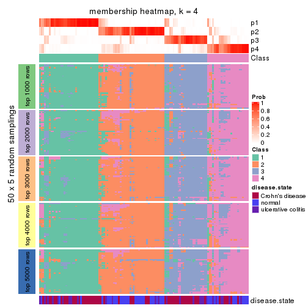</p>

</div>
<div id='tab-SD-NMF-membership-heatmap-4'>
<pre><code class="r">membership_heatmap(res, k = 5)
</code></pre>

<p></p>

</div>
<div id='tab-SD-NMF-membership-heatmap-5'>
<pre><code class="r">membership_heatmap(res, k = 6)
</code></pre>

<p></p>

</div>
</div>

As soon as we have had the classes for columns, we can look for signatures
which are significantly different between classes which can be candidate marks
for certain classes. Following are the heatmaps for signatures.


Signature heatmaps where rows are scaled:


<script>
$( function() {
	$( '#tabs-SD-NMF-get-signatures' ).tabs();
} );
</script>
<div id='tabs-SD-NMF-get-signatures'>
<ul>
<li><a href='#tab-SD-NMF-get-signatures-1'>k = 2</a></li>
<li><a href='#tab-SD-NMF-get-signatures-2'>k = 3</a></li>
<li><a href='#tab-SD-NMF-get-signatures-3'>k = 4</a></li>
<li><a href='#tab-SD-NMF-get-signatures-4'>k = 5</a></li>
<li><a href='#tab-SD-NMF-get-signatures-5'>k = 6</a></li>
</ul>
<div id='tab-SD-NMF-get-signatures-1'>
<pre><code class="r">get_signatures(res, k = 2)
</code></pre>

<p></p>

</div>
<div id='tab-SD-NMF-get-signatures-2'>
<pre><code class="r">get_signatures(res, k = 3)
</code></pre>

<p></p>

</div>
<div id='tab-SD-NMF-get-signatures-3'>
<pre><code class="r">get_signatures(res, k = 4)
</code></pre>

<p></p>

</div>
<div id='tab-SD-NMF-get-signatures-4'>
<pre><code class="r">get_signatures(res, k = 5)
</code></pre>

<p></p>

</div>
<div id='tab-SD-NMF-get-signatures-5'>
<pre><code class="r">get_signatures(res, k = 6)
</code></pre>

<p></p>

</div>
</div>


Signature heatmaps where rows are not scaled:


<script>
$( function() {
	$( '#tabs-SD-NMF-get-signatures-no-scale' ).tabs();
} );
</script>
<div id='tabs-SD-NMF-get-signatures-no-scale'>
<ul>
<li><a href='#tab-SD-NMF-get-signatures-no-scale-1'>k = 2</a></li>
<li><a href='#tab-SD-NMF-get-signatures-no-scale-2'>k = 3</a></li>
<li><a href='#tab-SD-NMF-get-signatures-no-scale-3'>k = 4</a></li>
<li><a href='#tab-SD-NMF-get-signatures-no-scale-4'>k = 5</a></li>
<li><a href='#tab-SD-NMF-get-signatures-no-scale-5'>k = 6</a></li>
</ul>
<div id='tab-SD-NMF-get-signatures-no-scale-1'>
<pre><code class="r">get_signatures(res, k = 2, scale_rows = FALSE)
</code></pre>

<p></p>

</div>
<div id='tab-SD-NMF-get-signatures-no-scale-2'>
<pre><code class="r">get_signatures(res, k = 3, scale_rows = FALSE)
</code></pre>

<p></p>

</div>
<div id='tab-SD-NMF-get-signatures-no-scale-3'>
<pre><code class="r">get_signatures(res, k = 4, scale_rows = FALSE)
</code></pre>

<p></p>

</div>
<div id='tab-SD-NMF-get-signatures-no-scale-4'>
<pre><code class="r">get_signatures(res, k = 5, scale_rows = FALSE)
</code></pre>

<p></p>

</div>
<div id='tab-SD-NMF-get-signatures-no-scale-5'>
<pre><code class="r">get_signatures(res, k = 6, scale_rows = FALSE)
</code></pre>

<p></p>

</div>
</div>


Compare the overlap of signatures from different k:

```r
compare_signatures(res)
```


`get_signature()` returns a data frame invisibly. TO get the list of signatures, the function
call should be assigned to a variable explicitly. In following code, if `plot` argument is set
to `FALSE`, no heatmap is plotted while only the differential analysis is performed.

```r
# code only for demonstration
tb = get_signature(res, k = ..., plot = FALSE)
```

An example of the output of `tb` is:

```
#>   which_row         fdr    mean_1    mean_2 scaled_mean_1 scaled_mean_2 km
#> 1        38 0.042760348  8.373488  9.131774    -0.5533452     0.5164555  1
#> 2        40 0.018707592  7.106213  8.469186    -0.6173731     0.5762149  1
#> 3        55 0.019134737 10.221463 11.207825    -0.6159697     0.5749050  1
#> 4        59 0.006059896  5.921854  7.869574    -0.6899429     0.6439467  1
#> 5        60 0.018055526  8.928898 10.211722    -0.6204761     0.5791110  1
#> 6        98 0.009384629 15.714769 14.887706     0.6635654    -0.6193277  2
...
```

The columns in `tb` are:

1. `which_row`: row indices corresponding to the input matrix.
2. `fdr`: FDR for the differential test. 
3. `mean_x`: The mean value in group x.
4. `scaled_mean_x`: The mean value in group x after rows are scaled.
5. `km`: Row groups if k-means clustering is applied to rows.


UMAP plot which shows how samples are separated.


<script>
$( function() {
	$( '#tabs-SD-NMF-dimension-reduction' ).tabs();
} );
</script>
<div id='tabs-SD-NMF-dimension-reduction'>
<ul>
<li><a href='#tab-SD-NMF-dimension-reduction-1'>k = 2</a></li>
<li><a href='#tab-SD-NMF-dimension-reduction-2'>k = 3</a></li>
<li><a href='#tab-SD-NMF-dimension-reduction-3'>k = 4</a></li>
<li><a href='#tab-SD-NMF-dimension-reduction-4'>k = 5</a></li>
<li><a href='#tab-SD-NMF-dimension-reduction-5'>k = 6</a></li>
</ul>
<div id='tab-SD-NMF-dimension-reduction-1'>
<pre><code class="r">dimension_reduction(res, k = 2, method = &quot;UMAP&quot;)
</code></pre>

<p></p>

</div>
<div id='tab-SD-NMF-dimension-reduction-2'>
<pre><code class="r">dimension_reduction(res, k = 3, method = &quot;UMAP&quot;)
</code></pre>

<p></p>

</div>
<div id='tab-SD-NMF-dimension-reduction-3'>
<pre><code class="r">dimension_reduction(res, k = 4, method = &quot;UMAP&quot;)
</code></pre>

<p></p>

</div>
<div id='tab-SD-NMF-dimension-reduction-4'>
<pre><code class="r">dimension_reduction(res, k = 5, method = &quot;UMAP&quot;)
</code></pre>

<p></p>

</div>
<div id='tab-SD-NMF-dimension-reduction-5'>
<pre><code class="r">dimension_reduction(res, k = 6, method = &quot;UMAP&quot;)
</code></pre>

<p></p>

</div>
</div>


Following heatmap shows how subgroups are split when increasing `k`:

```r
collect_classes(res)
```


Test correlation between subgroups and known annotations. If the known
annotation is numeric, one-way ANOVA test is applied, and if the known
annotation is discrete, chi-squared contingency table test is applied.

```r
test_to_known_factors(res)
```

```
#>          n disease.state(p) k
#> SD:NMF 124         5.62e-10 2
#> SD:NMF 104         2.39e-09 3
#> SD:NMF 107         4.45e-09 4
#> SD:NMF  89         1.81e-08 5
#> SD:NMF  78         2.84e-08 6
```


If matrix rows can be associated to genes, consider to use `functional_enrichment(res,
...)` to perform function enrichment for the signature genes. See [this vignette](http://bioconductor.org/packages/devel/bioc/vignettes/cola/inst/doc/functional_enrichment.html) for more detailed explanations.


 

---------------------------------------------------


### CV:hclust


The object with results only for a single top-value method and a single partition method 
can be extracted as:

```r
res = res_list["CV", "hclust"]
# you can also extract it by
# res = res_list["CV:hclust"]
```

A summary of `res` and all the functions that can be applied to it:

```r
res
```

```
#> A 'ConsensusPartition' object with k = 2, 3, 4, 5, 6.
#>   On a matrix with 21168 rows and 127 columns.
#>   Top rows (1000, 2000, 3000, 4000, 5000) are extracted by 'CV' method.
#>   Subgroups are detected by 'hclust' method.
#>   Performed in total 1250 partitions by row resampling.
#>   Best k for subgroups seems to be 3.
#> 
#> Following methods can be applied to this 'ConsensusPartition' object:
#>  [1] "cola_report"             "collect_classes"         "collect_plots"          
#>  [4] "collect_stats"           "colnames"                "compare_signatures"     
#>  [7] "consensus_heatmap"       "dimension_reduction"     "functional_enrichment"  
#> [10] "get_anno_col"            "get_anno"                "get_classes"            
#> [13] "get_consensus"           "get_matrix"              "get_membership"         
#> [16] "get_param"               "get_signatures"          "get_stats"              
#> [19] "is_best_k"               "is_stable_k"             "membership_heatmap"     
#> [22] "ncol"                    "nrow"                    "plot_ecdf"              
#> [25] "rownames"                "select_partition_number" "show"                   
#> [28] "suggest_best_k"          "test_to_known_factors"
```

`collect_plots()` function collects all the plots made from `res` for all `k` (number of partitions)
into one single page to provide an easy and fast comparison between different `k`.

```r
collect_plots(res)
```


The plots are:

- The first row: a plot of the ECDF (empirical cumulative distribution
  function) curves of the consensus matrix for each `k` and the heatmap of
  predicted classes for each `k`.
- The second row: heatmaps of the consensus matrix for each `k`.
- The third row: heatmaps of the membership matrix for each `k`.
- The fouth row: heatmaps of the signatures for each `k`.

All the plots in panels can be made by individual functions and they are
plotted later in this section.

`select_partition_number()` produces several plots showing different
statistics for choosing "optimized" `k`. There are following statistics:

- ECDF curves of the consensus matrix for each `k`;
- 1-PAC. [The PAC
  score](https://en.wikipedia.org/wiki/Consensus_clustering#Over-interpretation_potential_of_consensus_clustering)
  measures the proportion of the ambiguous subgrouping.
- Mean silhouette score.
- Concordance. The mean probability of fiting the consensus class ids in all
  partitions.
- Area increased. Denote $A_k$ as the area under the ECDF curve for current
  `k`, the area increased is defined as $A_k - A_{k-1}$.
- Rand index. The percent of pairs of samples that are both in a same cluster
  or both are not in a same cluster in the partition of k and k-1.
- Jaccard index. The ratio of pairs of samples are both in a same cluster in
  the partition of k and k-1 and the pairs of samples are both in a same
  cluster in the partition k or k-1.

The detailed explanations of these statistics can be found in [the _cola_
vignette](http://bioconductor.org/packages/devel/bioc/vignettes/cola/inst/doc/cola.html#toc_13).

Generally speaking, lower PAC score, higher mean silhouette score or higher
concordance corresponds to better partition. Rand index and Jaccard index
measure how similar the current partition is compared to partition with `k-1`.
If they are too similar, we won't accept `k` is better than `k-1`.

```r
select_partition_number(res)
```


The numeric values for all these statistics can be obtained by `get_stats()`.

```r
get_stats(res)
```

```
#>   k 1-PAC mean_silhouette concordance area_increased  Rand Jaccard
#> 2 2 0.077           0.468       0.666         0.3775 0.522   0.522
#> 3 3 0.127           0.432       0.681         0.4058 0.598   0.419
#> 4 4 0.181           0.431       0.651         0.1287 0.969   0.936
#> 5 5 0.254           0.413       0.535         0.1287 0.719   0.467
#> 6 6 0.335           0.511       0.645         0.0828 0.875   0.614
```

`suggest_best_k()` suggests the best $k$ based on these statistics. The rules are as follows:

- All $k$ with Jaccard index larger than 0.95 are removed because increasing
  $k$ does not provide enough extra information. If all $k$ are removed, it is
  marked as no subgroup is detected.
- For all $k$ with 1-PAC score larger than 0.9, the maximal $k$ is taken as
  the best $k$, and other $k$ are marked as optional $k$.
- If it does not fit the second rule. The $k$ with the maximal vote of the
  highest 1-PAC score, highest mean silhouette, and highest concordance is
  taken as the best $k$.

```r
suggest_best_k(res)
```

```
#> [1] 3
```


Following shows the table of the partitions (You need to click the **show/hide
code output** link to see it). The membership matrix (columns with name `p*`)
is inferred by
[`clue::cl_consensus()`](https://www.rdocumentation.org/link/cl_consensus?package=clue)
function with the `SE` method. Basically the value in the membership matrix
represents the probability to belong to a certain group. The finall class
label for an item is determined with the group with highest probability it
belongs to.

In `get_classes()` function, the entropy is calculated from the membership
matrix and the silhouette score is calculated from the consensus matrix.


<script>
$( function() {
	$( '#tabs-CV-hclust-get-classes' ).tabs();
} );
</script>
<div id='tabs-CV-hclust-get-classes'>
<ul>
<li><a href='#tab-CV-hclust-get-classes-1'>k = 2</a></li>
<li><a href='#tab-CV-hclust-get-classes-2'>k = 3</a></li>
<li><a href='#tab-CV-hclust-get-classes-3'>k = 4</a></li>
<li><a href='#tab-CV-hclust-get-classes-4'>k = 5</a></li>
<li><a href='#tab-CV-hclust-get-classes-5'>k = 6</a></li>
</ul>

<div id='tab-CV-hclust-get-classes-1'>
<p><a id='tab-CV-hclust-get-classes-1-a' style='color:#0366d6' href='#'>show/hide code output</a></p>
<pre><code class="r">cbind(get_classes(res, k = 2), get_membership(res, k = 2))
</code></pre>

<pre><code>#&gt;          class entropy silhouette    p1    p2
#&gt; GSM76115     2  0.9963    0.33097 0.464 0.536
#&gt; GSM76116     2  0.9996    0.23876 0.488 0.512
#&gt; GSM76117     1  0.9977   -0.00857 0.528 0.472
#&gt; GSM76118     1  0.9954   -0.04494 0.540 0.460
#&gt; GSM76119     2  0.0672    0.47347 0.008 0.992
#&gt; GSM76120     2  0.0672    0.47347 0.008 0.992
#&gt; GSM76121     1  0.9710    0.26399 0.600 0.400
#&gt; GSM76122     2  0.9909    0.38136 0.444 0.556
#&gt; GSM76123     2  0.0672    0.47347 0.008 0.992
#&gt; GSM76124     1  0.9552    0.26264 0.624 0.376
#&gt; GSM76125     2  0.0672    0.47347 0.008 0.992
#&gt; GSM76126     2  0.7950    0.60553 0.240 0.760
#&gt; GSM76127     2  0.0672    0.47347 0.008 0.992
#&gt; GSM76128     2  0.2043    0.46926 0.032 0.968
#&gt; GSM76129     2  0.9795    0.46147 0.416 0.584
#&gt; GSM76130     2  0.0672    0.47347 0.008 0.992
#&gt; GSM76131     2  0.8608    0.65663 0.284 0.716
#&gt; GSM76132     2  0.8661    0.65239 0.288 0.712
#&gt; GSM76133     2  0.8443    0.66042 0.272 0.728
#&gt; GSM76134     2  0.9933    0.38871 0.452 0.548
#&gt; GSM76135     2  0.8499    0.66022 0.276 0.724
#&gt; GSM76136     2  0.8499    0.66022 0.276 0.724
#&gt; GSM76137     2  0.8713    0.63501 0.292 0.708
#&gt; GSM76138     2  0.9970    0.33109 0.468 0.532
#&gt; GSM76139     2  0.8386    0.65854 0.268 0.732
#&gt; GSM76140     1  0.6438    0.63246 0.836 0.164
#&gt; GSM76141     2  0.8443    0.66042 0.272 0.728
#&gt; GSM76142     2  0.8499    0.66022 0.276 0.724
#&gt; GSM76143     2  0.8443    0.66042 0.272 0.728
#&gt; GSM76144     2  0.8443    0.66042 0.272 0.728
#&gt; GSM76145     2  0.9933    0.36515 0.452 0.548
#&gt; GSM76146     2  0.8555    0.65837 0.280 0.720
#&gt; GSM76147     2  0.9427    0.58177 0.360 0.640
#&gt; GSM76148     2  0.8443    0.66042 0.272 0.728
#&gt; GSM76149     2  0.9881    0.41182 0.436 0.564
#&gt; GSM76150     2  0.9881    0.41182 0.436 0.564
#&gt; GSM76151     2  0.9866    0.42065 0.432 0.568
#&gt; GSM76152     1  0.5946    0.63541 0.856 0.144
#&gt; GSM76153     2  0.8443    0.66042 0.272 0.728
#&gt; GSM76154     2  0.9881    0.41226 0.436 0.564
#&gt; GSM76155     2  0.9909    0.39020 0.444 0.556
#&gt; GSM76156     2  0.8499    0.66022 0.276 0.724
#&gt; GSM76030     1  0.9954    0.06519 0.540 0.460
#&gt; GSM76031     1  0.6531    0.62626 0.832 0.168
#&gt; GSM76032     1  0.8499    0.60916 0.724 0.276
#&gt; GSM76033     1  0.9732    0.44214 0.596 0.404
#&gt; GSM76034     2  0.9993    0.05124 0.484 0.516
#&gt; GSM76035     1  0.9732    0.38024 0.596 0.404
#&gt; GSM76036     1  1.0000    0.13632 0.504 0.496
#&gt; GSM76037     1  0.9988   -0.18022 0.520 0.480
#&gt; GSM76038     1  0.6531    0.62626 0.832 0.168
#&gt; GSM76039     1  0.9580    0.37889 0.620 0.380
#&gt; GSM76040     1  1.0000    0.14292 0.504 0.496
#&gt; GSM76041     1  0.8443    0.62038 0.728 0.272
#&gt; GSM76042     1  0.8813    0.55040 0.700 0.300
#&gt; GSM76043     1  0.8909    0.54786 0.692 0.308
#&gt; GSM76044     1  0.8713    0.55923 0.708 0.292
#&gt; GSM76045     1  0.6623    0.63743 0.828 0.172
#&gt; GSM76046     1  0.9635    0.46885 0.612 0.388
#&gt; GSM76047     1  0.8144    0.62915 0.748 0.252
#&gt; GSM76048     1  0.9522    0.52196 0.628 0.372
#&gt; GSM76049     1  0.9944    0.08866 0.544 0.456
#&gt; GSM76050     1  0.2778    0.61814 0.952 0.048
#&gt; GSM76051     1  1.0000    0.13617 0.504 0.496
#&gt; GSM76052     1  0.9732    0.44214 0.596 0.404
#&gt; GSM76053     1  0.9815    0.38288 0.580 0.420
#&gt; GSM76054     1  0.9998    0.15909 0.508 0.492
#&gt; GSM76055     1  0.9732    0.18066 0.596 0.404
#&gt; GSM76056     1  0.3114    0.61372 0.944 0.056
#&gt; GSM76057     1  0.4161    0.61957 0.916 0.084
#&gt; GSM76058     1  0.8386    0.60678 0.732 0.268
#&gt; GSM76059     1  0.0376    0.59456 0.996 0.004
#&gt; GSM76060     1  0.9248    0.50901 0.660 0.340
#&gt; GSM76061     1  0.9795    0.32589 0.584 0.416
#&gt; GSM76062     1  0.0672    0.59301 0.992 0.008
#&gt; GSM76063     2  0.9933    0.18243 0.452 0.548
#&gt; GSM76064     1  0.7745    0.63735 0.772 0.228
#&gt; GSM76065     1  0.9988   -0.11507 0.520 0.480
#&gt; GSM76066     1  0.3114    0.62171 0.944 0.056
#&gt; GSM76067     1  0.8813    0.58380 0.700 0.300
#&gt; GSM76068     1  0.9896    0.34704 0.560 0.440
#&gt; GSM76069     1  0.5294    0.63627 0.880 0.120
#&gt; GSM76070     2  0.9491    0.51708 0.368 0.632
#&gt; GSM76071     1  0.1633    0.60697 0.976 0.024
#&gt; GSM76072     1  0.1633    0.60697 0.976 0.024
#&gt; GSM76073     1  0.0938    0.60114 0.988 0.012
#&gt; GSM76074     1  0.1414    0.60517 0.980 0.020
#&gt; GSM76075     1  0.8661    0.60305 0.712 0.288
#&gt; GSM76076     1  0.9491    0.50402 0.632 0.368
#&gt; GSM76077     1  0.9044    0.52604 0.680 0.320
#&gt; GSM76078     1  0.8661    0.60642 0.712 0.288
#&gt; GSM76079     1  0.0000    0.59162 1.000 0.000
#&gt; GSM76080     2  0.9977    0.05830 0.472 0.528
#&gt; GSM76081     2  0.8608    0.60570 0.284 0.716
#&gt; GSM76082     1  0.9815    0.39753 0.580 0.420
#&gt; GSM76083     1  0.9608    0.47279 0.616 0.384
#&gt; GSM76084     2  0.9944    0.14534 0.456 0.544
#&gt; GSM76085     1  0.9661    0.46348 0.608 0.392
#&gt; GSM76086     1  0.5178    0.62585 0.884 0.116
#&gt; GSM76087     2  0.8386    0.65854 0.268 0.732
#&gt; GSM76088     1  0.8909    0.55046 0.692 0.308
#&gt; GSM76089     2  1.0000    0.11975 0.496 0.504
#&gt; GSM76090     1  0.9087    0.56737 0.676 0.324
#&gt; GSM76091     1  0.0938    0.59618 0.988 0.012
#&gt; GSM76092     1  0.0938    0.60114 0.988 0.012
#&gt; GSM76093     1  0.0376    0.59456 0.996 0.004
#&gt; GSM76094     1  0.9608    0.36426 0.616 0.384
#&gt; GSM76095     1  0.6712    0.63047 0.824 0.176
#&gt; GSM76096     1  0.9209    0.32433 0.664 0.336
#&gt; GSM76097     2  0.9775    0.28039 0.412 0.588
#&gt; GSM76098     2  0.9248    0.41174 0.340 0.660
#&gt; GSM76099     1  0.4161    0.62317 0.916 0.084
#&gt; GSM76100     1  0.4939    0.61782 0.892 0.108
#&gt; GSM76101     1  0.0376    0.59456 0.996 0.004
#&gt; GSM76102     2  0.8499    0.61738 0.276 0.724
#&gt; GSM76103     1  0.8327    0.60989 0.736 0.264
#&gt; GSM76104     1  0.9635    0.46964 0.612 0.388
#&gt; GSM76105     1  0.9944   -0.06604 0.544 0.456
#&gt; GSM76106     2  0.9983    0.04451 0.476 0.524
#&gt; GSM76107     2  0.8267    0.61455 0.260 0.740
#&gt; GSM76108     1  0.8763    0.49804 0.704 0.296
#&gt; GSM76109     1  0.0376    0.59456 0.996 0.004
#&gt; GSM76110     1  0.5842    0.63464 0.860 0.140
#&gt; GSM76111     1  0.6343    0.63691 0.840 0.160
#&gt; GSM76112     1  0.2778    0.61600 0.952 0.048
#&gt; GSM76113     1  0.9922    0.24901 0.552 0.448
#&gt; GSM76114     1  0.6801    0.64482 0.820 0.180
</code></pre>

<script>
$('#tab-CV-hclust-get-classes-1-a').parent().next().next().hide();
$('#tab-CV-hclust-get-classes-1-a').click(function(){
  $('#tab-CV-hclust-get-classes-1-a').parent().next().next().toggle();
  return(false);
});
</script>
</div>

<div id='tab-CV-hclust-get-classes-2'>
<p><a id='tab-CV-hclust-get-classes-2-a' style='color:#0366d6' href='#'>show/hide code output</a></p>
<pre><code class="r">cbind(get_classes(res, k = 3), get_membership(res, k = 3))
</code></pre>

<pre><code>#&gt;          class entropy silhouette    p1    p2    p3
#&gt; GSM76115     2   0.517    0.57276 0.092 0.832 0.076
#&gt; GSM76116     2   0.587    0.57687 0.116 0.796 0.088
#&gt; GSM76117     2   0.682    0.53262 0.248 0.700 0.052
#&gt; GSM76118     2   0.662    0.56573 0.176 0.744 0.080
#&gt; GSM76119     3   0.627    0.82699 0.000 0.456 0.544
#&gt; GSM76120     3   0.628    0.82755 0.000 0.460 0.540
#&gt; GSM76121     2   0.823    0.28406 0.364 0.552 0.084
#&gt; GSM76122     2   0.651    0.48725 0.072 0.748 0.180
#&gt; GSM76123     3   0.628    0.82755 0.000 0.460 0.540
#&gt; GSM76124     2   0.842    0.42049 0.252 0.608 0.140
#&gt; GSM76125     3   0.628    0.82755 0.000 0.460 0.540
#&gt; GSM76126     2   0.618   -0.00522 0.008 0.660 0.332
#&gt; GSM76127     3   0.628    0.82755 0.000 0.460 0.540
#&gt; GSM76128     3   0.658    0.79366 0.008 0.420 0.572
#&gt; GSM76129     2   0.542    0.54998 0.080 0.820 0.100
#&gt; GSM76130     3   0.626    0.82431 0.000 0.448 0.552
#&gt; GSM76131     2   0.405    0.36644 0.004 0.848 0.148
#&gt; GSM76132     2   0.411    0.37253 0.004 0.844 0.152
#&gt; GSM76133     2   0.394    0.34824 0.000 0.844 0.156
#&gt; GSM76134     2   0.500    0.56376 0.088 0.840 0.072
#&gt; GSM76135     2   0.417    0.35821 0.004 0.840 0.156
#&gt; GSM76136     2   0.417    0.35821 0.004 0.840 0.156
#&gt; GSM76137     2   0.524    0.40272 0.032 0.808 0.160
#&gt; GSM76138     2   0.526    0.57156 0.092 0.828 0.080
#&gt; GSM76139     2   0.400    0.34215 0.000 0.840 0.160
#&gt; GSM76140     1   0.733    0.50656 0.624 0.328 0.048
#&gt; GSM76141     2   0.394    0.34824 0.000 0.844 0.156
#&gt; GSM76142     2   0.417    0.35821 0.004 0.840 0.156
#&gt; GSM76143     2   0.394    0.34824 0.000 0.844 0.156
#&gt; GSM76144     2   0.394    0.34824 0.000 0.844 0.156
#&gt; GSM76145     2   0.494    0.57788 0.104 0.840 0.056
#&gt; GSM76146     2   0.435    0.36330 0.008 0.836 0.156
#&gt; GSM76147     2   0.468    0.47804 0.040 0.848 0.112
#&gt; GSM76148     2   0.394    0.34824 0.000 0.844 0.156
#&gt; GSM76149     2   0.453    0.56785 0.088 0.860 0.052
#&gt; GSM76150     2   0.453    0.56785 0.088 0.860 0.052
#&gt; GSM76151     2   0.442    0.56815 0.088 0.864 0.048
#&gt; GSM76152     1   0.748    0.52407 0.632 0.308 0.060
#&gt; GSM76153     2   0.394    0.34824 0.000 0.844 0.156
#&gt; GSM76154     2   0.463    0.56954 0.088 0.856 0.056
#&gt; GSM76155     2   0.442    0.57057 0.088 0.864 0.048
#&gt; GSM76156     2   0.417    0.35821 0.004 0.840 0.156
#&gt; GSM76030     2   0.661    0.54609 0.236 0.716 0.048
#&gt; GSM76031     1   0.729    0.51306 0.632 0.320 0.048
#&gt; GSM76032     1   0.823    0.41459 0.564 0.348 0.088
#&gt; GSM76033     2   0.861    0.01899 0.416 0.484 0.100
#&gt; GSM76034     2   0.742    0.51673 0.232 0.680 0.088
#&gt; GSM76035     2   0.819    0.26424 0.372 0.548 0.080
#&gt; GSM76036     2   0.890    0.29372 0.320 0.536 0.144
#&gt; GSM76037     2   0.678    0.54068 0.140 0.744 0.116
#&gt; GSM76038     1   0.729    0.51306 0.632 0.320 0.048
#&gt; GSM76039     2   0.790    0.32935 0.356 0.576 0.068
#&gt; GSM76040     2   0.890    0.29946 0.320 0.536 0.144
#&gt; GSM76041     1   0.847    0.40551 0.540 0.360 0.100
#&gt; GSM76042     2   0.814   -0.06560 0.452 0.480 0.068
#&gt; GSM76043     2   0.807   -0.06939 0.456 0.480 0.064
#&gt; GSM76044     1   0.821    0.10351 0.464 0.464 0.072
#&gt; GSM76045     1   0.738    0.50121 0.628 0.320 0.052
#&gt; GSM76046     2   0.840    0.06183 0.400 0.512 0.088
#&gt; GSM76047     1   0.811    0.44846 0.580 0.336 0.084
#&gt; GSM76048     1   0.898    0.17602 0.448 0.424 0.128
#&gt; GSM76049     2   0.671    0.54112 0.228 0.716 0.056
#&gt; GSM76050     1   0.347    0.64541 0.904 0.056 0.040
#&gt; GSM76051     2   0.895    0.28200 0.320 0.532 0.148
#&gt; GSM76052     2   0.861    0.01899 0.416 0.484 0.100
#&gt; GSM76053     2   0.826    0.21855 0.356 0.556 0.088
#&gt; GSM76054     2   0.892    0.29137 0.324 0.532 0.144
#&gt; GSM76055     2   0.776    0.50505 0.224 0.664 0.112
#&gt; GSM76056     1   0.900    0.28137 0.504 0.356 0.140
#&gt; GSM76057     1   0.898    0.22114 0.484 0.384 0.132
#&gt; GSM76058     1   0.807    0.45807 0.596 0.316 0.088
#&gt; GSM76059     1   0.140    0.63022 0.968 0.004 0.028
#&gt; GSM76060     2   0.818    0.27507 0.352 0.564 0.084
#&gt; GSM76061     2   0.782    0.47921 0.252 0.648 0.100
#&gt; GSM76062     1   0.315    0.63365 0.916 0.036 0.048
#&gt; GSM76063     2   0.753    0.51577 0.228 0.676 0.096
#&gt; GSM76064     1   0.759    0.52023 0.632 0.300 0.068
#&gt; GSM76065     2   0.675    0.57715 0.168 0.740 0.092
#&gt; GSM76066     1   0.379    0.64355 0.892 0.060 0.048
#&gt; GSM76067     1   0.836    0.37409 0.544 0.364 0.092
#&gt; GSM76068     2   0.915    0.07371 0.384 0.468 0.148
#&gt; GSM76069     1   0.756    0.52551 0.656 0.264 0.080
#&gt; GSM76070     2   0.576    0.51586 0.076 0.800 0.124
#&gt; GSM76071     1   0.244    0.64161 0.940 0.032 0.028
#&gt; GSM76072     1   0.243    0.64322 0.940 0.036 0.024
#&gt; GSM76073     1   0.205    0.63553 0.952 0.020 0.028
#&gt; GSM76074     1   0.269    0.63905 0.932 0.036 0.032
#&gt; GSM76075     1   0.823    0.38314 0.552 0.364 0.084
#&gt; GSM76076     1   0.897    0.18449 0.460 0.412 0.128
#&gt; GSM76077     2   0.817    0.17836 0.388 0.536 0.076
#&gt; GSM76078     1   0.828    0.28843 0.516 0.404 0.080
#&gt; GSM76079     1   0.165    0.62867 0.960 0.004 0.036
#&gt; GSM76080     2   0.761    0.47827 0.244 0.664 0.092
#&gt; GSM76081     2   0.611    0.36707 0.044 0.756 0.200
#&gt; GSM76082     2   0.922    0.01284 0.400 0.448 0.152
#&gt; GSM76083     1   0.907    0.13710 0.444 0.420 0.136
#&gt; GSM76084     2   0.719    0.51208 0.224 0.696 0.080
#&gt; GSM76085     2   0.851   -0.00313 0.424 0.484 0.092
#&gt; GSM76086     1   0.518    0.62603 0.832 0.088 0.080
#&gt; GSM76087     2   0.406    0.33692 0.000 0.836 0.164
#&gt; GSM76088     2   0.820    0.22467 0.376 0.544 0.080
#&gt; GSM76089     2   0.593    0.59322 0.164 0.780 0.056
#&gt; GSM76090     1   0.852    0.29615 0.508 0.396 0.096
#&gt; GSM76091     1   0.348    0.63007 0.904 0.052 0.044
#&gt; GSM76092     1   0.234    0.63044 0.940 0.012 0.048
#&gt; GSM76093     1   0.188    0.62539 0.952 0.004 0.044
#&gt; GSM76094     2   0.781    0.36361 0.336 0.596 0.068
#&gt; GSM76095     1   0.768    0.48357 0.608 0.328 0.064
#&gt; GSM76096     2   0.945    0.19891 0.304 0.488 0.208
#&gt; GSM76097     3   0.800    0.38178 0.096 0.284 0.620
#&gt; GSM76098     3   0.754    0.44492 0.056 0.332 0.612
#&gt; GSM76099     1   0.609    0.60945 0.776 0.156 0.068
#&gt; GSM76100     1   0.548    0.62407 0.816 0.108 0.076
#&gt; GSM76101     1   0.188    0.62539 0.952 0.004 0.044
#&gt; GSM76102     2   0.659    0.15083 0.032 0.688 0.280
#&gt; GSM76103     1   0.812    0.48821 0.608 0.292 0.100
#&gt; GSM76104     2   0.851   -0.01275 0.428 0.480 0.092
#&gt; GSM76105     2   0.717    0.55138 0.172 0.716 0.112
#&gt; GSM76106     2   0.764    0.47724 0.248 0.660 0.092
#&gt; GSM76107     2   0.636    0.12110 0.020 0.684 0.296
#&gt; GSM76108     2   0.864    0.17462 0.400 0.496 0.104
#&gt; GSM76109     1   0.175    0.62189 0.952 0.000 0.048
#&gt; GSM76110     1   0.718    0.53876 0.648 0.304 0.048
#&gt; GSM76111     1   0.738    0.51261 0.628 0.320 0.052
#&gt; GSM76112     1   0.331    0.64793 0.908 0.064 0.028
#&gt; GSM76113     2   0.745    0.45809 0.280 0.652 0.068
#&gt; GSM76114     1   0.780    0.52850 0.636 0.276 0.088
</code></pre>

<script>
$('#tab-CV-hclust-get-classes-2-a').parent().next().next().hide();
$('#tab-CV-hclust-get-classes-2-a').click(function(){
  $('#tab-CV-hclust-get-classes-2-a').parent().next().next().toggle();
  return(false);
});
</script>
</div>

<div id='tab-CV-hclust-get-classes-3'>
<p><a id='tab-CV-hclust-get-classes-3-a' style='color:#0366d6' href='#'>show/hide code output</a></p>
<pre><code class="r">cbind(get_classes(res, k = 4), get_membership(res, k = 4))
</code></pre>

<pre><code>#&gt;          class entropy silhouette    p1    p2    p3    p4
#&gt; GSM76115     2   0.385    0.57698 0.036 0.868 0.052 0.044
#&gt; GSM76116     2   0.456    0.56514 0.056 0.832 0.040 0.072
#&gt; GSM76117     2   0.592    0.50693 0.180 0.728 0.036 0.056
#&gt; GSM76118     2   0.528    0.53193 0.112 0.788 0.052 0.048
#&gt; GSM76119     4   0.358    0.96459 0.000 0.180 0.004 0.816
#&gt; GSM76120     4   0.336    0.97084 0.000 0.176 0.000 0.824
#&gt; GSM76121     2   0.743    0.28409 0.328 0.552 0.052 0.068
#&gt; GSM76122     2   0.585    0.46118 0.012 0.724 0.096 0.168
#&gt; GSM76123     4   0.336    0.97084 0.000 0.176 0.000 0.824
#&gt; GSM76124     2   0.755    0.38379 0.172 0.632 0.088 0.108
#&gt; GSM76125     4   0.336    0.97084 0.000 0.176 0.000 0.824
#&gt; GSM76126     2   0.730    0.11482 0.012 0.504 0.112 0.372
#&gt; GSM76127     4   0.336    0.97084 0.000 0.176 0.000 0.824
#&gt; GSM76128     4   0.441    0.85683 0.012 0.152 0.028 0.808
#&gt; GSM76129     2   0.484    0.56621 0.036 0.816 0.068 0.080
#&gt; GSM76130     4   0.354    0.95807 0.000 0.176 0.004 0.820
#&gt; GSM76131     2   0.540    0.45075 0.000 0.720 0.068 0.212
#&gt; GSM76132     2   0.540    0.45263 0.000 0.720 0.068 0.212
#&gt; GSM76133     2   0.557    0.43862 0.000 0.704 0.072 0.224
#&gt; GSM76134     2   0.341    0.57520 0.032 0.888 0.040 0.040
#&gt; GSM76135     2   0.553    0.44156 0.000 0.708 0.072 0.220
#&gt; GSM76136     2   0.553    0.44156 0.000 0.708 0.072 0.220
#&gt; GSM76137     2   0.631    0.47664 0.020 0.668 0.068 0.244
#&gt; GSM76138     2   0.376    0.57758 0.036 0.872 0.052 0.040
#&gt; GSM76139     2   0.560    0.43429 0.000 0.700 0.072 0.228
#&gt; GSM76140     1   0.632    0.43065 0.592 0.352 0.036 0.020
#&gt; GSM76141     2   0.557    0.43862 0.000 0.704 0.072 0.224
#&gt; GSM76142     2   0.553    0.44156 0.000 0.708 0.072 0.220
#&gt; GSM76143     2   0.557    0.43862 0.000 0.704 0.072 0.224
#&gt; GSM76144     2   0.557    0.43862 0.000 0.704 0.072 0.224
#&gt; GSM76145     2   0.366    0.58912 0.044 0.876 0.028 0.052
#&gt; GSM76146     2   0.557    0.44331 0.000 0.704 0.072 0.224
#&gt; GSM76147     2   0.485    0.52907 0.016 0.796 0.052 0.136
#&gt; GSM76148     2   0.557    0.43862 0.000 0.704 0.072 0.224
#&gt; GSM76149     2   0.348    0.57665 0.032 0.884 0.032 0.052
#&gt; GSM76150     2   0.348    0.57665 0.032 0.884 0.032 0.052
#&gt; GSM76151     2   0.374    0.57687 0.032 0.872 0.036 0.060
#&gt; GSM76152     1   0.645    0.46852 0.612 0.320 0.040 0.028
#&gt; GSM76153     2   0.557    0.43862 0.000 0.704 0.072 0.224
#&gt; GSM76154     2   0.344    0.58182 0.032 0.884 0.024 0.060
#&gt; GSM76155     2   0.313    0.57952 0.028 0.900 0.032 0.040
#&gt; GSM76156     2   0.553    0.44156 0.000 0.708 0.072 0.220
#&gt; GSM76030     2   0.619    0.52494 0.168 0.720 0.048 0.064
#&gt; GSM76031     1   0.625    0.45006 0.608 0.336 0.036 0.020
#&gt; GSM76032     1   0.867    0.38151 0.484 0.288 0.132 0.096
#&gt; GSM76033     2   0.887    0.00329 0.348 0.420 0.100 0.132
#&gt; GSM76034     2   0.714    0.46660 0.188 0.652 0.056 0.104
#&gt; GSM76035     2   0.807    0.21054 0.348 0.492 0.068 0.092
#&gt; GSM76036     2   0.907    0.22430 0.260 0.448 0.100 0.192
#&gt; GSM76037     2   0.563    0.52669 0.060 0.772 0.064 0.104
#&gt; GSM76038     1   0.625    0.45006 0.608 0.336 0.036 0.020
#&gt; GSM76039     2   0.711    0.31872 0.316 0.580 0.060 0.044
#&gt; GSM76040     2   0.900    0.23250 0.260 0.456 0.096 0.188
#&gt; GSM76041     1   0.816    0.38059 0.492 0.336 0.108 0.064
#&gt; GSM76042     2   0.760   -0.03896 0.392 0.488 0.068 0.052
#&gt; GSM76043     2   0.778   -0.03615 0.388 0.480 0.072 0.060
#&gt; GSM76044     2   0.747   -0.10977 0.424 0.464 0.076 0.036
#&gt; GSM76045     1   0.670    0.44822 0.588 0.332 0.056 0.024
#&gt; GSM76046     2   0.886    0.00616 0.320 0.444 0.104 0.132
#&gt; GSM76047     1   0.830    0.40892 0.504 0.308 0.108 0.080
#&gt; GSM76048     1   0.926    0.17060 0.372 0.348 0.124 0.156
#&gt; GSM76049     2   0.610    0.51875 0.160 0.728 0.048 0.064
#&gt; GSM76050     1   0.349    0.60362 0.884 0.048 0.028 0.040
#&gt; GSM76051     2   0.911    0.20984 0.264 0.440 0.100 0.196
#&gt; GSM76052     2   0.887    0.00329 0.348 0.420 0.100 0.132
#&gt; GSM76053     2   0.858    0.16788 0.280 0.496 0.088 0.136
#&gt; GSM76054     2   0.899    0.22486 0.264 0.456 0.096 0.184
#&gt; GSM76055     2   0.703    0.45376 0.156 0.672 0.068 0.104
#&gt; GSM76056     1   0.816    0.16536 0.432 0.404 0.108 0.056
#&gt; GSM76057     2   0.817   -0.10384 0.396 0.440 0.104 0.060
#&gt; GSM76058     1   0.848    0.40844 0.520 0.260 0.112 0.108
#&gt; GSM76059     1   0.106    0.56856 0.972 0.000 0.016 0.012
#&gt; GSM76060     2   0.730    0.29216 0.264 0.604 0.080 0.052
#&gt; GSM76061     2   0.676    0.46841 0.164 0.688 0.084 0.064
#&gt; GSM76062     1   0.372    0.58087 0.872 0.064 0.036 0.028
#&gt; GSM76063     2   0.780    0.46707 0.176 0.608 0.080 0.136
#&gt; GSM76064     1   0.770    0.48406 0.572 0.272 0.096 0.060
#&gt; GSM76065     2   0.565    0.53948 0.076 0.772 0.060 0.092
#&gt; GSM76066     1   0.427    0.59411 0.848 0.044 0.056 0.052
#&gt; GSM76067     1   0.889    0.34138 0.464 0.288 0.116 0.132
#&gt; GSM76068     2   0.938    0.01953 0.308 0.384 0.124 0.184
#&gt; GSM76069     1   0.697    0.46689 0.612 0.280 0.072 0.036
#&gt; GSM76070     2   0.585    0.54668 0.028 0.736 0.072 0.164
#&gt; GSM76071     1   0.171    0.59330 0.952 0.020 0.004 0.024
#&gt; GSM76072     1   0.192    0.59754 0.944 0.028 0.004 0.024
#&gt; GSM76073     1   0.153    0.58198 0.960 0.016 0.012 0.012
#&gt; GSM76074     1   0.228    0.58472 0.932 0.036 0.020 0.012
#&gt; GSM76075     1   0.861    0.35491 0.472 0.316 0.104 0.108
#&gt; GSM76076     1   0.935    0.18277 0.380 0.324 0.128 0.168
#&gt; GSM76077     2   0.754    0.17859 0.308 0.560 0.076 0.056
#&gt; GSM76078     1   0.848    0.22868 0.420 0.392 0.100 0.088
#&gt; GSM76079     1   0.173    0.57244 0.948 0.004 0.040 0.008
#&gt; GSM76080     2   0.792    0.42694 0.192 0.592 0.076 0.140
#&gt; GSM76081     2   0.712    0.43738 0.032 0.600 0.088 0.280
#&gt; GSM76082     2   0.938   -0.03127 0.328 0.364 0.116 0.192
#&gt; GSM76083     1   0.942    0.15055 0.364 0.328 0.128 0.180
#&gt; GSM76084     2   0.718    0.47393 0.164 0.660 0.072 0.104
#&gt; GSM76085     2   0.892   -0.02204 0.356 0.408 0.104 0.132
#&gt; GSM76086     1   0.582    0.57470 0.756 0.052 0.124 0.068
#&gt; GSM76087     2   0.563    0.42834 0.000 0.696 0.072 0.232
#&gt; GSM76088     2   0.732    0.26165 0.292 0.584 0.076 0.048
#&gt; GSM76089     2   0.521    0.56130 0.108 0.792 0.040 0.060
#&gt; GSM76090     1   0.901    0.26856 0.428 0.320 0.116 0.136
#&gt; GSM76091     1   0.401    0.57522 0.856 0.080 0.032 0.032
#&gt; GSM76092     1   0.169    0.57298 0.952 0.008 0.032 0.008
#&gt; GSM76093     1   0.136    0.56253 0.960 0.000 0.032 0.008
#&gt; GSM76094     2   0.698    0.34389 0.300 0.600 0.048 0.052
#&gt; GSM76095     1   0.701    0.40871 0.552 0.356 0.064 0.028
#&gt; GSM76096     2   0.912    0.15179 0.256 0.456 0.152 0.136
#&gt; GSM76097     3   0.468    0.79969 0.048 0.100 0.820 0.032
#&gt; GSM76098     3   0.619    0.77338 0.036 0.144 0.724 0.096
#&gt; GSM76099     1   0.583    0.58037 0.740 0.156 0.076 0.028
#&gt; GSM76100     1   0.500    0.56310 0.796 0.128 0.040 0.036
#&gt; GSM76101     1   0.136    0.56253 0.960 0.000 0.032 0.008
#&gt; GSM76102     2   0.769    0.23936 0.032 0.528 0.120 0.320
#&gt; GSM76103     1   0.850    0.44441 0.532 0.232 0.124 0.112
#&gt; GSM76104     2   0.892   -0.03532 0.360 0.404 0.104 0.132
#&gt; GSM76105     2   0.608    0.51329 0.108 0.744 0.060 0.088
#&gt; GSM76106     2   0.795    0.42772 0.196 0.588 0.076 0.140
#&gt; GSM76107     2   0.749    0.20889 0.020 0.524 0.120 0.336
#&gt; GSM76108     2   0.780    0.19433 0.348 0.512 0.076 0.064
#&gt; GSM76109     1   0.155    0.56025 0.952 0.000 0.040 0.008
#&gt; GSM76110     1   0.641    0.48580 0.612 0.320 0.048 0.020
#&gt; GSM76111     1   0.677    0.45527 0.584 0.332 0.060 0.024
#&gt; GSM76112     1   0.300    0.61286 0.904 0.048 0.020 0.028
#&gt; GSM76113     2   0.722    0.43756 0.224 0.632 0.056 0.088
#&gt; GSM76114     1   0.780    0.47817 0.564 0.276 0.092 0.068
</code></pre>

<script>
$('#tab-CV-hclust-get-classes-3-a').parent().next().next().hide();
$('#tab-CV-hclust-get-classes-3-a').click(function(){
  $('#tab-CV-hclust-get-classes-3-a').parent().next().next().toggle();
  return(false);
});
</script>
</div>

<div id='tab-CV-hclust-get-classes-4'>
<p><a id='tab-CV-hclust-get-classes-4-a' style='color:#0366d6' href='#'>show/hide code output</a></p>
<pre><code class="r">cbind(get_classes(res, k = 5), get_membership(res, k = 5))
</code></pre>

<pre><code>#&gt;          class entropy silhouette    p1    p2    p3    p4    p5
#&gt; GSM76115     2   0.407     0.4424 0.024 0.800 0.152 0.020 0.004
#&gt; GSM76116     2   0.477     0.4305 0.052 0.772 0.140 0.028 0.008
#&gt; GSM76117     2   0.573     0.2920 0.104 0.636 0.248 0.012 0.000
#&gt; GSM76118     2   0.456     0.3884 0.068 0.768 0.148 0.016 0.000
#&gt; GSM76119     4   0.213     0.9540 0.004 0.052 0.024 0.920 0.000
#&gt; GSM76120     4   0.230     0.9578 0.000 0.052 0.032 0.912 0.004
#&gt; GSM76121     2   0.717     0.1156 0.220 0.484 0.260 0.036 0.000
#&gt; GSM76122     2   0.523     0.3302 0.080 0.756 0.024 0.116 0.024
#&gt; GSM76123     4   0.230     0.9578 0.000 0.052 0.032 0.912 0.004
#&gt; GSM76124     2   0.574     0.2722 0.204 0.692 0.040 0.044 0.020
#&gt; GSM76125     4   0.205     0.9609 0.000 0.052 0.028 0.920 0.000
#&gt; GSM76126     2   0.872     0.0601 0.092 0.396 0.152 0.300 0.060
#&gt; GSM76127     4   0.205     0.9609 0.000 0.052 0.028 0.920 0.000
#&gt; GSM76128     4   0.342     0.8354 0.012 0.036 0.064 0.868 0.020
#&gt; GSM76129     2   0.569     0.4580 0.036 0.724 0.148 0.060 0.032
#&gt; GSM76130     4   0.205     0.9464 0.004 0.048 0.024 0.924 0.000
#&gt; GSM76131     2   0.807     0.3585 0.000 0.400 0.288 0.124 0.188
#&gt; GSM76132     2   0.805     0.3561 0.000 0.404 0.284 0.120 0.192
#&gt; GSM76133     2   0.815     0.3561 0.000 0.380 0.292 0.128 0.200
#&gt; GSM76134     2   0.390     0.4549 0.004 0.800 0.164 0.020 0.012
#&gt; GSM76135     2   0.814     0.3571 0.000 0.384 0.292 0.128 0.196
#&gt; GSM76136     2   0.814     0.3571 0.000 0.384 0.292 0.128 0.196
#&gt; GSM76137     3   0.789    -0.2822 0.000 0.356 0.368 0.096 0.180
#&gt; GSM76138     2   0.387     0.4442 0.024 0.808 0.152 0.012 0.004
#&gt; GSM76139     2   0.815     0.3521 0.000 0.380 0.292 0.128 0.200
#&gt; GSM76140     1   0.708     0.4430 0.396 0.316 0.276 0.012 0.000
#&gt; GSM76141     2   0.815     0.3561 0.000 0.380 0.292 0.128 0.200
#&gt; GSM76142     2   0.814     0.3571 0.000 0.384 0.292 0.128 0.196
#&gt; GSM76143     2   0.815     0.3561 0.000 0.380 0.292 0.128 0.200
#&gt; GSM76144     2   0.815     0.3561 0.000 0.380 0.292 0.128 0.200
#&gt; GSM76145     2   0.442     0.4266 0.008 0.752 0.208 0.020 0.012
#&gt; GSM76146     2   0.827     0.3557 0.004 0.380 0.292 0.128 0.196
#&gt; GSM76147     2   0.709     0.3749 0.000 0.536 0.256 0.068 0.140
#&gt; GSM76148     2   0.815     0.3561 0.000 0.380 0.292 0.128 0.200
#&gt; GSM76149     2   0.416     0.4451 0.004 0.772 0.192 0.020 0.012
#&gt; GSM76150     2   0.416     0.4451 0.004 0.772 0.192 0.020 0.012
#&gt; GSM76151     2   0.429     0.4468 0.004 0.764 0.196 0.024 0.012
#&gt; GSM76152     1   0.694     0.4739 0.424 0.276 0.292 0.008 0.000
#&gt; GSM76153     2   0.815     0.3561 0.000 0.380 0.292 0.128 0.200
#&gt; GSM76154     2   0.423     0.4355 0.000 0.756 0.208 0.024 0.012
#&gt; GSM76155     2   0.388     0.4414 0.000 0.784 0.188 0.016 0.012
#&gt; GSM76156     2   0.814     0.3571 0.000 0.384 0.292 0.128 0.196
#&gt; GSM76030     2   0.556     0.2235 0.056 0.600 0.332 0.008 0.004
#&gt; GSM76031     1   0.699     0.4557 0.404 0.304 0.284 0.008 0.000
#&gt; GSM76032     3   0.391     0.4344 0.144 0.028 0.808 0.020 0.000
#&gt; GSM76033     3   0.438     0.6025 0.056 0.124 0.792 0.028 0.000
#&gt; GSM76034     3   0.576     0.2409 0.020 0.404 0.536 0.032 0.008
#&gt; GSM76035     3   0.605     0.4349 0.112 0.284 0.592 0.008 0.004
#&gt; GSM76036     3   0.462     0.5419 0.016 0.116 0.792 0.052 0.024
#&gt; GSM76037     2   0.470     0.4123 0.064 0.804 0.064 0.040 0.028
#&gt; GSM76038     1   0.699     0.4557 0.404 0.304 0.284 0.008 0.000
#&gt; GSM76039     2   0.692     0.0414 0.160 0.492 0.324 0.012 0.012
#&gt; GSM76040     3   0.474     0.5370 0.020 0.124 0.784 0.048 0.024
#&gt; GSM76041     3   0.629     0.2747 0.232 0.156 0.596 0.012 0.004
#&gt; GSM76042     2   0.685    -0.1632 0.216 0.416 0.360 0.008 0.000
#&gt; GSM76043     3   0.676     0.1702 0.196 0.364 0.432 0.008 0.000
#&gt; GSM76044     2   0.682    -0.2014 0.240 0.408 0.348 0.000 0.004
#&gt; GSM76045     3   0.699    -0.3801 0.356 0.260 0.376 0.008 0.000
#&gt; GSM76046     3   0.497     0.5862 0.064 0.160 0.744 0.032 0.000
#&gt; GSM76047     3   0.549     0.2808 0.220 0.108 0.664 0.008 0.000
#&gt; GSM76048     3   0.377     0.5656 0.068 0.048 0.848 0.028 0.008
#&gt; GSM76049     2   0.556     0.2169 0.056 0.600 0.332 0.008 0.004
#&gt; GSM76050     1   0.474     0.6873 0.640 0.024 0.332 0.004 0.000
#&gt; GSM76051     3   0.462     0.5466 0.020 0.108 0.796 0.052 0.024
#&gt; GSM76052     3   0.438     0.6025 0.056 0.124 0.792 0.028 0.000
#&gt; GSM76053     3   0.551     0.5328 0.060 0.236 0.672 0.032 0.000
#&gt; GSM76054     3   0.483     0.5413 0.024 0.124 0.780 0.048 0.024
#&gt; GSM76055     2   0.616     0.3404 0.152 0.684 0.104 0.036 0.024
#&gt; GSM76056     2   0.846    -0.1990 0.308 0.340 0.252 0.024 0.076
#&gt; GSM76057     2   0.846    -0.0940 0.268 0.372 0.256 0.024 0.080
#&gt; GSM76058     3   0.403     0.4104 0.164 0.020 0.792 0.024 0.000
#&gt; GSM76059     1   0.353     0.7232 0.744 0.000 0.256 0.000 0.000
#&gt; GSM76060     3   0.631     0.3729 0.072 0.344 0.552 0.020 0.012
#&gt; GSM76061     3   0.696     0.1719 0.068 0.388 0.480 0.024 0.040
#&gt; GSM76062     1   0.574     0.6993 0.624 0.084 0.276 0.016 0.000
#&gt; GSM76063     3   0.632     0.3324 0.012 0.288 0.600 0.052 0.048
#&gt; GSM76064     3   0.617     0.0650 0.292 0.116 0.576 0.016 0.000
#&gt; GSM76065     2   0.607     0.3714 0.068 0.676 0.196 0.032 0.028
#&gt; GSM76066     1   0.505     0.6084 0.576 0.024 0.392 0.008 0.000
#&gt; GSM76067     3   0.339     0.4827 0.116 0.012 0.844 0.028 0.000
#&gt; GSM76068     3   0.382     0.5828 0.036 0.072 0.848 0.028 0.016
#&gt; GSM76069     1   0.748     0.4218 0.420 0.252 0.296 0.016 0.016
#&gt; GSM76070     3   0.751    -0.1650 0.000 0.380 0.408 0.104 0.108
#&gt; GSM76071     1   0.406     0.7176 0.700 0.004 0.292 0.004 0.000
#&gt; GSM76072     1   0.422     0.7185 0.688 0.008 0.300 0.004 0.000
#&gt; GSM76073     1   0.364     0.7217 0.728 0.000 0.272 0.000 0.000
#&gt; GSM76074     1   0.435     0.7299 0.704 0.028 0.268 0.000 0.000
#&gt; GSM76075     3   0.453     0.4631 0.136 0.068 0.776 0.020 0.000
#&gt; GSM76076     3   0.310     0.5495 0.060 0.024 0.884 0.020 0.012
#&gt; GSM76077     3   0.658     0.3982 0.096 0.316 0.552 0.024 0.012
#&gt; GSM76078     3   0.532     0.5042 0.112 0.148 0.716 0.024 0.000
#&gt; GSM76079     1   0.464     0.7228 0.708 0.020 0.256 0.012 0.004
#&gt; GSM76080     3   0.565     0.3980 0.008 0.272 0.648 0.048 0.024
#&gt; GSM76081     3   0.798    -0.1620 0.004 0.268 0.436 0.100 0.192
#&gt; GSM76082     3   0.411     0.5818 0.048 0.064 0.836 0.028 0.024
#&gt; GSM76083     3   0.324     0.5530 0.052 0.024 0.880 0.028 0.016
#&gt; GSM76084     3   0.558     0.3148 0.004 0.348 0.592 0.036 0.020
#&gt; GSM76085     3   0.438     0.5993 0.056 0.124 0.792 0.028 0.000
#&gt; GSM76086     3   0.478    -0.3561 0.428 0.000 0.552 0.020 0.000
#&gt; GSM76087     2   0.822     0.3493 0.000 0.376 0.284 0.144 0.196
#&gt; GSM76088     3   0.686     0.3386 0.140 0.324 0.508 0.016 0.012
#&gt; GSM76089     2   0.490     0.3224 0.028 0.660 0.300 0.012 0.000
#&gt; GSM76090     3   0.343     0.5270 0.084 0.032 0.856 0.028 0.000
#&gt; GSM76091     1   0.588     0.6820 0.612 0.096 0.276 0.016 0.000
#&gt; GSM76092     1   0.384     0.7274 0.736 0.004 0.256 0.000 0.004
#&gt; GSM76093     1   0.361     0.7225 0.752 0.000 0.244 0.000 0.004
#&gt; GSM76094     2   0.676     0.0654 0.156 0.504 0.320 0.016 0.004
#&gt; GSM76095     1   0.734     0.3582 0.356 0.296 0.328 0.016 0.004
#&gt; GSM76096     2   0.746     0.0381 0.336 0.492 0.040 0.076 0.056
#&gt; GSM76097     5   0.328     0.8330 0.160 0.012 0.000 0.004 0.824
#&gt; GSM76098     5   0.542     0.8223 0.120 0.020 0.056 0.056 0.748
#&gt; GSM76099     1   0.691     0.6165 0.540 0.164 0.264 0.020 0.012
#&gt; GSM76100     1   0.614     0.6778 0.624 0.112 0.240 0.012 0.012
#&gt; GSM76101     1   0.361     0.7225 0.752 0.000 0.244 0.000 0.004
#&gt; GSM76102     2   0.870     0.1715 0.104 0.428 0.160 0.252 0.056
#&gt; GSM76103     3   0.428     0.3556 0.204 0.012 0.756 0.028 0.000
#&gt; GSM76104     3   0.449     0.5957 0.060 0.128 0.784 0.028 0.000
#&gt; GSM76105     2   0.499     0.4001 0.084 0.776 0.092 0.028 0.020
#&gt; GSM76106     3   0.567     0.3941 0.008 0.276 0.644 0.048 0.024
#&gt; GSM76107     2   0.862     0.1502 0.092 0.428 0.156 0.268 0.056
#&gt; GSM76108     2   0.708     0.0710 0.252 0.520 0.196 0.016 0.016
#&gt; GSM76109     1   0.373     0.7219 0.752 0.000 0.240 0.004 0.004
#&gt; GSM76110     1   0.697     0.4739 0.412 0.276 0.304 0.008 0.000
#&gt; GSM76111     1   0.711     0.4144 0.372 0.284 0.332 0.012 0.000
#&gt; GSM76112     1   0.476     0.6849 0.624 0.016 0.352 0.008 0.000
#&gt; GSM76113     3   0.576     0.2210 0.048 0.420 0.516 0.012 0.004
#&gt; GSM76114     3   0.650    -0.0886 0.312 0.144 0.528 0.016 0.000
</code></pre>

<script>
$('#tab-CV-hclust-get-classes-4-a').parent().next().next().hide();
$('#tab-CV-hclust-get-classes-4-a').click(function(){
  $('#tab-CV-hclust-get-classes-4-a').parent().next().next().toggle();
  return(false);
});
</script>
</div>

<div id='tab-CV-hclust-get-classes-5'>
<p><a id='tab-CV-hclust-get-classes-5-a' style='color:#0366d6' href='#'>show/hide code output</a></p>
<pre><code class="r">cbind(get_classes(res, k = 6), get_membership(res, k = 6))
</code></pre>

<pre><code>#&gt;          class entropy silhouette    p1    p2    p3    p4    p5    p6
#&gt; GSM76115     5  0.4995    0.56252 0.004 0.304 0.064 0.008 0.620 0.000
#&gt; GSM76116     5  0.5159    0.58995 0.024 0.256 0.068 0.004 0.648 0.000
#&gt; GSM76117     5  0.6869    0.52102 0.108 0.232 0.136 0.008 0.516 0.000
#&gt; GSM76118     5  0.5448    0.59018 0.040 0.188 0.096 0.008 0.668 0.000
#&gt; GSM76119     4  0.2062    0.95723 0.000 0.088 0.004 0.900 0.008 0.000
#&gt; GSM76120     4  0.2009    0.95964 0.000 0.084 0.004 0.904 0.008 0.000
#&gt; GSM76121     5  0.7805    0.38058 0.240 0.176 0.124 0.024 0.428 0.008
#&gt; GSM76122     5  0.4379    0.42455 0.000 0.092 0.064 0.072 0.772 0.000
#&gt; GSM76123     4  0.2009    0.95964 0.000 0.084 0.004 0.904 0.008 0.000
#&gt; GSM76124     5  0.4750    0.39657 0.092 0.048 0.052 0.032 0.772 0.004
#&gt; GSM76125     4  0.2009    0.96215 0.000 0.084 0.004 0.904 0.008 0.000
#&gt; GSM76126     2  0.8264   -0.03523 0.028 0.304 0.076 0.288 0.272 0.032
#&gt; GSM76127     4  0.2009    0.96215 0.000 0.084 0.004 0.904 0.008 0.000
#&gt; GSM76128     4  0.1659    0.83327 0.004 0.004 0.036 0.940 0.012 0.004
#&gt; GSM76129     5  0.6063    0.45933 0.008 0.392 0.068 0.032 0.492 0.008
#&gt; GSM76130     4  0.2009    0.95115 0.000 0.084 0.004 0.904 0.008 0.000
#&gt; GSM76131     2  0.0777    0.74270 0.000 0.972 0.000 0.004 0.024 0.000
#&gt; GSM76132     2  0.1155    0.73461 0.000 0.956 0.004 0.004 0.036 0.000
#&gt; GSM76133     2  0.0146    0.75582 0.000 0.996 0.000 0.000 0.004 0.000
#&gt; GSM76134     5  0.5094    0.47865 0.000 0.400 0.048 0.016 0.536 0.000
#&gt; GSM76135     2  0.0260    0.75531 0.000 0.992 0.000 0.000 0.008 0.000
#&gt; GSM76136     2  0.0260    0.75531 0.000 0.992 0.000 0.000 0.008 0.000
#&gt; GSM76137     2  0.3786    0.63294 0.000 0.816 0.052 0.068 0.064 0.000
#&gt; GSM76138     5  0.5026    0.55883 0.004 0.312 0.064 0.008 0.612 0.000
#&gt; GSM76139     2  0.0291    0.75335 0.000 0.992 0.000 0.004 0.004 0.000
#&gt; GSM76140     1  0.6216    0.38269 0.484 0.032 0.152 0.000 0.332 0.000
#&gt; GSM76141     2  0.0146    0.75582 0.000 0.996 0.000 0.000 0.004 0.000
#&gt; GSM76142     2  0.0260    0.75531 0.000 0.992 0.000 0.000 0.008 0.000
#&gt; GSM76143     2  0.0146    0.75582 0.000 0.996 0.000 0.000 0.004 0.000
#&gt; GSM76144     2  0.0146    0.75582 0.000 0.996 0.000 0.000 0.004 0.000
#&gt; GSM76145     5  0.5745    0.47344 0.016 0.400 0.076 0.012 0.496 0.000
#&gt; GSM76146     2  0.0458    0.75166 0.000 0.984 0.000 0.000 0.016 0.000
#&gt; GSM76147     2  0.3712    0.43858 0.004 0.760 0.032 0.000 0.204 0.000
#&gt; GSM76148     2  0.0146    0.75582 0.000 0.996 0.000 0.000 0.004 0.000
#&gt; GSM76149     5  0.5126    0.47143 0.004 0.412 0.052 0.008 0.524 0.000
#&gt; GSM76150     5  0.5126    0.47143 0.004 0.412 0.052 0.008 0.524 0.000
#&gt; GSM76151     5  0.5136    0.46164 0.004 0.420 0.052 0.008 0.516 0.000
#&gt; GSM76152     1  0.6175    0.43071 0.512 0.032 0.160 0.000 0.296 0.000
#&gt; GSM76153     2  0.0146    0.75582 0.000 0.996 0.000 0.000 0.004 0.000
#&gt; GSM76154     5  0.5356    0.46598 0.004 0.408 0.064 0.012 0.512 0.000
#&gt; GSM76155     5  0.5268    0.47365 0.004 0.408 0.064 0.008 0.516 0.000
#&gt; GSM76156     2  0.0260    0.75531 0.000 0.992 0.000 0.000 0.008 0.000
#&gt; GSM76030     5  0.7059    0.45201 0.076 0.296 0.180 0.008 0.440 0.000
#&gt; GSM76031     1  0.6249    0.40159 0.484 0.032 0.160 0.000 0.324 0.000
#&gt; GSM76032     3  0.5179    0.57515 0.172 0.072 0.696 0.004 0.056 0.000
#&gt; GSM76033     3  0.6102    0.63338 0.104 0.196 0.620 0.016 0.064 0.000
#&gt; GSM76034     3  0.7119    0.13324 0.036 0.352 0.352 0.020 0.240 0.000
#&gt; GSM76035     3  0.7679    0.29013 0.196 0.280 0.336 0.004 0.184 0.000
#&gt; GSM76036     3  0.6146    0.56122 0.068 0.312 0.552 0.044 0.024 0.000
#&gt; GSM76037     5  0.4531    0.56767 0.024 0.188 0.032 0.012 0.740 0.004
#&gt; GSM76038     1  0.6249    0.40159 0.484 0.032 0.160 0.000 0.324 0.000
#&gt; GSM76039     5  0.7631    0.37209 0.248 0.196 0.140 0.004 0.404 0.008
#&gt; GSM76040     3  0.6375    0.55549 0.080 0.316 0.536 0.036 0.028 0.004
#&gt; GSM76041     3  0.6851    0.34530 0.316 0.084 0.456 0.004 0.140 0.000
#&gt; GSM76042     5  0.7391    0.12770 0.264 0.104 0.252 0.004 0.376 0.000
#&gt; GSM76043     5  0.7509   -0.03829 0.248 0.116 0.304 0.004 0.328 0.000
#&gt; GSM76044     5  0.7363    0.07446 0.304 0.100 0.228 0.004 0.364 0.000
#&gt; GSM76045     1  0.6820    0.35825 0.456 0.040 0.236 0.004 0.260 0.004
#&gt; GSM76046     3  0.6347    0.60369 0.084 0.160 0.608 0.016 0.132 0.000
#&gt; GSM76047     3  0.6536    0.44048 0.244 0.068 0.532 0.000 0.152 0.004
#&gt; GSM76048     3  0.5302    0.64681 0.088 0.132 0.712 0.024 0.044 0.000
#&gt; GSM76049     5  0.6878    0.45305 0.060 0.276 0.188 0.008 0.468 0.000
#&gt; GSM76050     1  0.3057    0.66123 0.844 0.008 0.120 0.000 0.024 0.004
#&gt; GSM76051     3  0.6133    0.56516 0.068 0.308 0.556 0.044 0.024 0.000
#&gt; GSM76052     3  0.6102    0.63338 0.104 0.196 0.620 0.016 0.064 0.000
#&gt; GSM76053     3  0.6753    0.52298 0.068 0.192 0.540 0.016 0.184 0.000
#&gt; GSM76054     3  0.6417    0.55845 0.084 0.316 0.532 0.036 0.028 0.004
#&gt; GSM76055     5  0.5914    0.53201 0.104 0.144 0.076 0.012 0.660 0.004
#&gt; GSM76056     5  0.8420   -0.04123 0.292 0.156 0.188 0.012 0.312 0.040
#&gt; GSM76057     5  0.8470    0.07191 0.232 0.156 0.208 0.016 0.348 0.040
#&gt; GSM76058     3  0.5342    0.56685 0.212 0.088 0.664 0.012 0.024 0.000
#&gt; GSM76059     1  0.0858    0.69024 0.968 0.000 0.028 0.000 0.000 0.004
#&gt; GSM76060     3  0.7675    0.29901 0.128 0.228 0.360 0.012 0.272 0.000
#&gt; GSM76061     3  0.7448    0.10111 0.076 0.308 0.312 0.012 0.292 0.000
#&gt; GSM76062     1  0.4204    0.65813 0.740 0.000 0.132 0.000 0.128 0.000
#&gt; GSM76063     2  0.6515   -0.30215 0.028 0.448 0.392 0.032 0.100 0.000
#&gt; GSM76064     3  0.6625    0.21857 0.368 0.080 0.432 0.000 0.120 0.000
#&gt; GSM76065     5  0.5899    0.55690 0.032 0.208 0.128 0.008 0.620 0.004
#&gt; GSM76066     1  0.3917    0.47453 0.692 0.000 0.284 0.000 0.024 0.000
#&gt; GSM76067     3  0.5264    0.60389 0.180 0.100 0.684 0.020 0.016 0.000
#&gt; GSM76068     3  0.6004    0.61016 0.096 0.248 0.604 0.028 0.020 0.004
#&gt; GSM76069     1  0.6798    0.39082 0.484 0.048 0.172 0.008 0.284 0.004
#&gt; GSM76070     2  0.5104    0.37147 0.000 0.660 0.212 0.016 0.112 0.000
#&gt; GSM76071     1  0.2044    0.69003 0.908 0.004 0.076 0.000 0.008 0.004
#&gt; GSM76072     1  0.2357    0.68780 0.888 0.004 0.092 0.000 0.012 0.004
#&gt; GSM76073     1  0.1349    0.69385 0.940 0.000 0.056 0.000 0.000 0.004
#&gt; GSM76074     1  0.2128    0.70181 0.908 0.000 0.056 0.000 0.032 0.004
#&gt; GSM76075     3  0.5856    0.58741 0.164 0.084 0.648 0.008 0.096 0.000
#&gt; GSM76076     3  0.5166    0.63510 0.104 0.156 0.704 0.020 0.012 0.004
#&gt; GSM76077     3  0.7533    0.33954 0.116 0.180 0.400 0.016 0.288 0.000
#&gt; GSM76078     3  0.6825    0.59465 0.176 0.128 0.548 0.012 0.136 0.000
#&gt; GSM76079     1  0.2968    0.68659 0.864 0.000 0.064 0.004 0.060 0.008
#&gt; GSM76080     3  0.7017    0.37167 0.040 0.376 0.408 0.036 0.140 0.000
#&gt; GSM76081     2  0.4741    0.54856 0.000 0.732 0.156 0.072 0.036 0.004
#&gt; GSM76082     3  0.5986    0.61501 0.104 0.244 0.604 0.028 0.016 0.004
#&gt; GSM76083     3  0.5244    0.62983 0.100 0.160 0.700 0.020 0.016 0.004
#&gt; GSM76084     2  0.6633   -0.34084 0.012 0.392 0.388 0.024 0.184 0.000
#&gt; GSM76085     3  0.6102    0.63470 0.104 0.200 0.620 0.020 0.056 0.000
#&gt; GSM76086     3  0.4315   -0.07290 0.492 0.000 0.492 0.004 0.012 0.000
#&gt; GSM76087     2  0.0777    0.74392 0.000 0.972 0.000 0.024 0.004 0.000
#&gt; GSM76088     3  0.7885    0.23845 0.164 0.212 0.332 0.016 0.276 0.000
#&gt; GSM76089     5  0.6272    0.51542 0.032 0.312 0.148 0.004 0.504 0.000
#&gt; GSM76090     3  0.5443    0.62786 0.148 0.120 0.684 0.020 0.028 0.000
#&gt; GSM76091     1  0.4494    0.63938 0.720 0.000 0.140 0.004 0.136 0.000
#&gt; GSM76092     1  0.1429    0.70002 0.940 0.000 0.052 0.000 0.004 0.004
#&gt; GSM76093     1  0.0935    0.68788 0.964 0.000 0.032 0.000 0.000 0.004
#&gt; GSM76094     5  0.7477    0.39190 0.224 0.200 0.140 0.004 0.428 0.004
#&gt; GSM76095     1  0.6891    0.33031 0.420 0.036 0.204 0.008 0.328 0.004
#&gt; GSM76096     5  0.7115    0.06477 0.204 0.016 0.112 0.060 0.560 0.048
#&gt; GSM76097     6  0.0405    0.85988 0.008 0.004 0.000 0.000 0.000 0.988
#&gt; GSM76098     6  0.3150    0.85179 0.000 0.036 0.040 0.068 0.000 0.856
#&gt; GSM76099     1  0.5679    0.59553 0.640 0.020 0.116 0.008 0.208 0.008
#&gt; GSM76100     1  0.4502    0.66126 0.768 0.012 0.088 0.008 0.112 0.012
#&gt; GSM76101     1  0.0777    0.68573 0.972 0.000 0.024 0.000 0.000 0.004
#&gt; GSM76102     2  0.8490   -0.00473 0.044 0.308 0.088 0.224 0.304 0.032
#&gt; GSM76103     3  0.5050    0.51862 0.240 0.064 0.668 0.008 0.020 0.000
#&gt; GSM76104     3  0.6125    0.63491 0.104 0.192 0.624 0.024 0.056 0.000
#&gt; GSM76105     5  0.4973    0.58611 0.052 0.180 0.040 0.008 0.716 0.004
#&gt; GSM76106     3  0.7040    0.36539 0.040 0.376 0.404 0.036 0.144 0.000
#&gt; GSM76107     2  0.8347    0.00277 0.032 0.308 0.084 0.240 0.304 0.032
#&gt; GSM76108     5  0.6764    0.28244 0.296 0.124 0.092 0.000 0.484 0.004
#&gt; GSM76109     1  0.0922    0.68337 0.968 0.000 0.024 0.000 0.004 0.004
#&gt; GSM76110     1  0.6150    0.45064 0.520 0.032 0.160 0.000 0.288 0.000
#&gt; GSM76111     1  0.6557    0.38477 0.456 0.032 0.200 0.000 0.308 0.004
#&gt; GSM76112     1  0.3300    0.65390 0.816 0.008 0.152 0.000 0.020 0.004
#&gt; GSM76113     3  0.7368    0.08061 0.076 0.288 0.324 0.008 0.304 0.000
#&gt; GSM76114     3  0.6937    0.15887 0.304 0.040 0.432 0.008 0.212 0.004
</code></pre>

<script>
$('#tab-CV-hclust-get-classes-5-a').parent().next().next().hide();
$('#tab-CV-hclust-get-classes-5-a').click(function(){
  $('#tab-CV-hclust-get-classes-5-a').parent().next().next().toggle();
  return(false);
});
</script>
</div>
</div>

Heatmaps for the consensus matrix. It visualizes the probability of two
samples to be in a same group.


<script>
$( function() {
	$( '#tabs-CV-hclust-consensus-heatmap' ).tabs();
} );
</script>
<div id='tabs-CV-hclust-consensus-heatmap'>
<ul>
<li><a href='#tab-CV-hclust-consensus-heatmap-1'>k = 2</a></li>
<li><a href='#tab-CV-hclust-consensus-heatmap-2'>k = 3</a></li>
<li><a href='#tab-CV-hclust-consensus-heatmap-3'>k = 4</a></li>
<li><a href='#tab-CV-hclust-consensus-heatmap-4'>k = 5</a></li>
<li><a href='#tab-CV-hclust-consensus-heatmap-5'>k = 6</a></li>
</ul>
<div id='tab-CV-hclust-consensus-heatmap-1'>
<pre><code class="r">consensus_heatmap(res, k = 2)
</code></pre>

<p></p>

</div>
<div id='tab-CV-hclust-consensus-heatmap-2'>
<pre><code class="r">consensus_heatmap(res, k = 3)
</code></pre>

<p></p>

</div>
<div id='tab-CV-hclust-consensus-heatmap-3'>
<pre><code class="r">consensus_heatmap(res, k = 4)
</code></pre>

<p></p>

</div>
<div id='tab-CV-hclust-consensus-heatmap-4'>
<pre><code class="r">consensus_heatmap(res, k = 5)
</code></pre>

<p></p>

</div>
<div id='tab-CV-hclust-consensus-heatmap-5'>
<pre><code class="r">consensus_heatmap(res, k = 6)
</code></pre>

<p></p>

</div>
</div>

Heatmaps for the membership of samples in all partitions to see how consistent they are:


<script>
$( function() {
	$( '#tabs-CV-hclust-membership-heatmap' ).tabs();
} );
</script>
<div id='tabs-CV-hclust-membership-heatmap'>
<ul>
<li><a href='#tab-CV-hclust-membership-heatmap-1'>k = 2</a></li>
<li><a href='#tab-CV-hclust-membership-heatmap-2'>k = 3</a></li>
<li><a href='#tab-CV-hclust-membership-heatmap-3'>k = 4</a></li>
<li><a href='#tab-CV-hclust-membership-heatmap-4'>k = 5</a></li>
<li><a href='#tab-CV-hclust-membership-heatmap-5'>k = 6</a></li>
</ul>
<div id='tab-CV-hclust-membership-heatmap-1'>
<pre><code class="r">membership_heatmap(res, k = 2)
</code></pre>

<p></p>

</div>
<div id='tab-CV-hclust-membership-heatmap-2'>
<pre><code class="r">membership_heatmap(res, k = 3)
</code></pre>

<p></p>

</div>
<div id='tab-CV-hclust-membership-heatmap-3'>
<pre><code class="r">membership_heatmap(res, k = 4)
</code></pre>

<p></p>

</div>
<div id='tab-CV-hclust-membership-heatmap-4'>
<pre><code class="r">membership_heatmap(res, k = 5)
</code></pre>

<p></p>

</div>
<div id='tab-CV-hclust-membership-heatmap-5'>
<pre><code class="r">membership_heatmap(res, k = 6)
</code></pre>

<p></p>

</div>
</div>

As soon as we have had the classes for columns, we can look for signatures
which are significantly different between classes which can be candidate marks
for certain classes. Following are the heatmaps for signatures.


Signature heatmaps where rows are scaled:


<script>
$( function() {
	$( '#tabs-CV-hclust-get-signatures' ).tabs();
} );
</script>
<div id='tabs-CV-hclust-get-signatures'>
<ul>
<li><a href='#tab-CV-hclust-get-signatures-1'>k = 2</a></li>
<li><a href='#tab-CV-hclust-get-signatures-2'>k = 3</a></li>
<li><a href='#tab-CV-hclust-get-signatures-3'>k = 4</a></li>
<li><a href='#tab-CV-hclust-get-signatures-4'>k = 5</a></li>
<li><a href='#tab-CV-hclust-get-signatures-5'>k = 6</a></li>
</ul>
<div id='tab-CV-hclust-get-signatures-1'>
<pre><code class="r">get_signatures(res, k = 2)
</code></pre>

<p></p>

</div>
<div id='tab-CV-hclust-get-signatures-2'>
<pre><code class="r">get_signatures(res, k = 3)
</code></pre>

<p></p>

</div>
<div id='tab-CV-hclust-get-signatures-3'>
<pre><code class="r">get_signatures(res, k = 4)
</code></pre>

<p></p>

</div>
<div id='tab-CV-hclust-get-signatures-4'>
<pre><code class="r">get_signatures(res, k = 5)
</code></pre>

<p></p>

</div>
<div id='tab-CV-hclust-get-signatures-5'>
<pre><code class="r">get_signatures(res, k = 6)
</code></pre>

<p></p>

</div>
</div>


Signature heatmaps where rows are not scaled:


<script>
$( function() {
	$( '#tabs-CV-hclust-get-signatures-no-scale' ).tabs();
} );
</script>
<div id='tabs-CV-hclust-get-signatures-no-scale'>
<ul>
<li><a href='#tab-CV-hclust-get-signatures-no-scale-1'>k = 2</a></li>
<li><a href='#tab-CV-hclust-get-signatures-no-scale-2'>k = 3</a></li>
<li><a href='#tab-CV-hclust-get-signatures-no-scale-3'>k = 4</a></li>
<li><a href='#tab-CV-hclust-get-signatures-no-scale-4'>k = 5</a></li>
<li><a href='#tab-CV-hclust-get-signatures-no-scale-5'>k = 6</a></li>
</ul>
<div id='tab-CV-hclust-get-signatures-no-scale-1'>
<pre><code class="r">get_signatures(res, k = 2, scale_rows = FALSE)
</code></pre>

<p></p>

</div>
<div id='tab-CV-hclust-get-signatures-no-scale-2'>
<pre><code class="r">get_signatures(res, k = 3, scale_rows = FALSE)
</code></pre>

<p></p>

</div>
<div id='tab-CV-hclust-get-signatures-no-scale-3'>
<pre><code class="r">get_signatures(res, k = 4, scale_rows = FALSE)
</code></pre>

<p>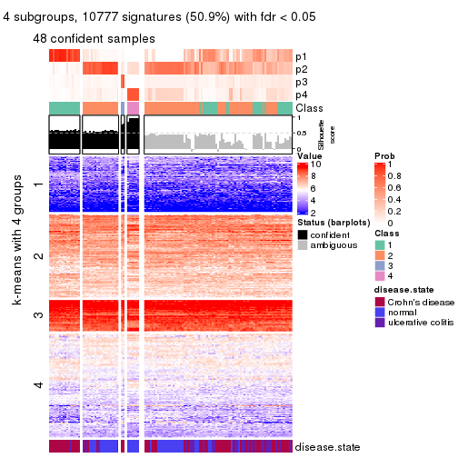</p>

</div>
<div id='tab-CV-hclust-get-signatures-no-scale-4'>
<pre><code class="r">get_signatures(res, k = 5, scale_rows = FALSE)
</code></pre>

<p></p>

</div>
<div id='tab-CV-hclust-get-signatures-no-scale-5'>
<pre><code class="r">get_signatures(res, k = 6, scale_rows = FALSE)
</code></pre>

<p></p>

</div>
</div>


Compare the overlap of signatures from different k:

```r
compare_signatures(res)
```


`get_signature()` returns a data frame invisibly. TO get the list of signatures, the function
call should be assigned to a variable explicitly. In following code, if `plot` argument is set
to `FALSE`, no heatmap is plotted while only the differential analysis is performed.

```r
# code only for demonstration
tb = get_signature(res, k = ..., plot = FALSE)
```

An example of the output of `tb` is:

```
#>   which_row         fdr    mean_1    mean_2 scaled_mean_1 scaled_mean_2 km
#> 1        38 0.042760348  8.373488  9.131774    -0.5533452     0.5164555  1
#> 2        40 0.018707592  7.106213  8.469186    -0.6173731     0.5762149  1
#> 3        55 0.019134737 10.221463 11.207825    -0.6159697     0.5749050  1
#> 4        59 0.006059896  5.921854  7.869574    -0.6899429     0.6439467  1
#> 5        60 0.018055526  8.928898 10.211722    -0.6204761     0.5791110  1
#> 6        98 0.009384629 15.714769 14.887706     0.6635654    -0.6193277  2
...
```

The columns in `tb` are:

1. `which_row`: row indices corresponding to the input matrix.
2. `fdr`: FDR for the differential test. 
3. `mean_x`: The mean value in group x.
4. `scaled_mean_x`: The mean value in group x after rows are scaled.
5. `km`: Row groups if k-means clustering is applied to rows.


UMAP plot which shows how samples are separated.


<script>
$( function() {
	$( '#tabs-CV-hclust-dimension-reduction' ).tabs();
} );
</script>
<div id='tabs-CV-hclust-dimension-reduction'>
<ul>
<li><a href='#tab-CV-hclust-dimension-reduction-1'>k = 2</a></li>
<li><a href='#tab-CV-hclust-dimension-reduction-2'>k = 3</a></li>
<li><a href='#tab-CV-hclust-dimension-reduction-3'>k = 4</a></li>
<li><a href='#tab-CV-hclust-dimension-reduction-4'>k = 5</a></li>
<li><a href='#tab-CV-hclust-dimension-reduction-5'>k = 6</a></li>
</ul>
<div id='tab-CV-hclust-dimension-reduction-1'>
<pre><code class="r">dimension_reduction(res, k = 2, method = &quot;UMAP&quot;)
</code></pre>

<p></p>

</div>
<div id='tab-CV-hclust-dimension-reduction-2'>
<pre><code class="r">dimension_reduction(res, k = 3, method = &quot;UMAP&quot;)
</code></pre>

<p></p>

</div>
<div id='tab-CV-hclust-dimension-reduction-3'>
<pre><code class="r">dimension_reduction(res, k = 4, method = &quot;UMAP&quot;)
</code></pre>

<p></p>

</div>
<div id='tab-CV-hclust-dimension-reduction-4'>
<pre><code class="r">dimension_reduction(res, k = 5, method = &quot;UMAP&quot;)
</code></pre>

<p></p>

</div>
<div id='tab-CV-hclust-dimension-reduction-5'>
<pre><code class="r">dimension_reduction(res, k = 6, method = &quot;UMAP&quot;)
</code></pre>

<p></p>

</div>
</div>


Following heatmap shows how subgroups are split when increasing `k`:

```r
collect_classes(res)
```


Test correlation between subgroups and known annotations. If the known
annotation is numeric, one-way ANOVA test is applied, and if the known
annotation is discrete, chi-squared contingency table test is applied.

```r
test_to_known_factors(res)
```

```
#>            n disease.state(p) k
#> CV:hclust 70         1.03e-09 2
#> CV:hclust 59         7.12e-06 3
#> CV:hclust 48         5.60e-06 4
#> CV:hclust 43         4.26e-10 5
#> CV:hclust 74         8.65e-11 6
```


If matrix rows can be associated to genes, consider to use `functional_enrichment(res,
...)` to perform function enrichment for the signature genes. See [this vignette](http://bioconductor.org/packages/devel/bioc/vignettes/cola/inst/doc/functional_enrichment.html) for more detailed explanations.


 

---------------------------------------------------


### CV:kmeans


The object with results only for a single top-value method and a single partition method 
can be extracted as:

```r
res = res_list["CV", "kmeans"]
# you can also extract it by
# res = res_list["CV:kmeans"]
```

A summary of `res` and all the functions that can be applied to it:

```r
res
```

```
#> A 'ConsensusPartition' object with k = 2, 3, 4, 5, 6.
#>   On a matrix with 21168 rows and 127 columns.
#>   Top rows (1000, 2000, 3000, 4000, 5000) are extracted by 'CV' method.
#>   Subgroups are detected by 'kmeans' method.
#>   Performed in total 1250 partitions by row resampling.
#>   Best k for subgroups seems to be 2.
#> 
#> Following methods can be applied to this 'ConsensusPartition' object:
#>  [1] "cola_report"             "collect_classes"         "collect_plots"          
#>  [4] "collect_stats"           "colnames"                "compare_signatures"     
#>  [7] "consensus_heatmap"       "dimension_reduction"     "functional_enrichment"  
#> [10] "get_anno_col"            "get_anno"                "get_classes"            
#> [13] "get_consensus"           "get_matrix"              "get_membership"         
#> [16] "get_param"               "get_signatures"          "get_stats"              
#> [19] "is_best_k"               "is_stable_k"             "membership_heatmap"     
#> [22] "ncol"                    "nrow"                    "plot_ecdf"              
#> [25] "rownames"                "select_partition_number" "show"                   
#> [28] "suggest_best_k"          "test_to_known_factors"
```

`collect_plots()` function collects all the plots made from `res` for all `k` (number of partitions)
into one single page to provide an easy and fast comparison between different `k`.

```r
collect_plots(res)
```


The plots are:

- The first row: a plot of the ECDF (empirical cumulative distribution
  function) curves of the consensus matrix for each `k` and the heatmap of
  predicted classes for each `k`.
- The second row: heatmaps of the consensus matrix for each `k`.
- The third row: heatmaps of the membership matrix for each `k`.
- The fouth row: heatmaps of the signatures for each `k`.

All the plots in panels can be made by individual functions and they are
plotted later in this section.

`select_partition_number()` produces several plots showing different
statistics for choosing "optimized" `k`. There are following statistics:

- ECDF curves of the consensus matrix for each `k`;
- 1-PAC. [The PAC
  score](https://en.wikipedia.org/wiki/Consensus_clustering#Over-interpretation_potential_of_consensus_clustering)
  measures the proportion of the ambiguous subgrouping.
- Mean silhouette score.
- Concordance. The mean probability of fiting the consensus class ids in all
  partitions.
- Area increased. Denote $A_k$ as the area under the ECDF curve for current
  `k`, the area increased is defined as $A_k - A_{k-1}$.
- Rand index. The percent of pairs of samples that are both in a same cluster
  or both are not in a same cluster in the partition of k and k-1.
- Jaccard index. The ratio of pairs of samples are both in a same cluster in
  the partition of k and k-1 and the pairs of samples are both in a same
  cluster in the partition k or k-1.

The detailed explanations of these statistics can be found in [the _cola_
vignette](http://bioconductor.org/packages/devel/bioc/vignettes/cola/inst/doc/cola.html#toc_13).

Generally speaking, lower PAC score, higher mean silhouette score or higher
concordance corresponds to better partition. Rand index and Jaccard index
measure how similar the current partition is compared to partition with `k-1`.
If they are too similar, we won't accept `k` is better than `k-1`.

```r
select_partition_number(res)
```


The numeric values for all these statistics can be obtained by `get_stats()`.

```r
get_stats(res)
```

```
#>   k 1-PAC mean_silhouette concordance area_increased  Rand Jaccard
#> 2 2 0.737           0.885       0.947         0.4985 0.496   0.496
#> 3 3 0.421           0.647       0.793         0.2978 0.796   0.608
#> 4 4 0.533           0.649       0.717         0.1281 0.849   0.596
#> 5 5 0.708           0.764       0.851         0.0715 0.929   0.738
#> 6 6 0.709           0.584       0.732         0.0436 0.957   0.805
```

`suggest_best_k()` suggests the best $k$ based on these statistics. The rules are as follows:

- All $k$ with Jaccard index larger than 0.95 are removed because increasing
  $k$ does not provide enough extra information. If all $k$ are removed, it is
  marked as no subgroup is detected.
- For all $k$ with 1-PAC score larger than 0.9, the maximal $k$ is taken as
  the best $k$, and other $k$ are marked as optional $k$.
- If it does not fit the second rule. The $k$ with the maximal vote of the
  highest 1-PAC score, highest mean silhouette, and highest concordance is
  taken as the best $k$.

```r
suggest_best_k(res)
```

```
#> [1] 2
```


Following shows the table of the partitions (You need to click the **show/hide
code output** link to see it). The membership matrix (columns with name `p*`)
is inferred by
[`clue::cl_consensus()`](https://www.rdocumentation.org/link/cl_consensus?package=clue)
function with the `SE` method. Basically the value in the membership matrix
represents the probability to belong to a certain group. The finall class
label for an item is determined with the group with highest probability it
belongs to.

In `get_classes()` function, the entropy is calculated from the membership
matrix and the silhouette score is calculated from the consensus matrix.


<script>
$( function() {
	$( '#tabs-CV-kmeans-get-classes' ).tabs();
} );
</script>
<div id='tabs-CV-kmeans-get-classes'>
<ul>
<li><a href='#tab-CV-kmeans-get-classes-1'>k = 2</a></li>
<li><a href='#tab-CV-kmeans-get-classes-2'>k = 3</a></li>
<li><a href='#tab-CV-kmeans-get-classes-3'>k = 4</a></li>
<li><a href='#tab-CV-kmeans-get-classes-4'>k = 5</a></li>
<li><a href='#tab-CV-kmeans-get-classes-5'>k = 6</a></li>
</ul>

<div id='tab-CV-kmeans-get-classes-1'>
<p><a id='tab-CV-kmeans-get-classes-1-a' style='color:#0366d6' href='#'>show/hide code output</a></p>
<pre><code class="r">cbind(get_classes(res, k = 2), get_membership(res, k = 2))
</code></pre>

<pre><code>#&gt;          class entropy silhouette    p1    p2
#&gt; GSM76115     2  0.0000      0.921 0.000 1.000
#&gt; GSM76116     2  0.7219      0.755 0.200 0.800
#&gt; GSM76117     1  0.4815      0.871 0.896 0.104
#&gt; GSM76118     1  0.5842      0.833 0.860 0.140
#&gt; GSM76119     2  0.0000      0.921 0.000 1.000
#&gt; GSM76120     2  0.0000      0.921 0.000 1.000
#&gt; GSM76121     1  0.1843      0.944 0.972 0.028
#&gt; GSM76122     1  0.6531      0.798 0.832 0.168
#&gt; GSM76123     2  0.0000      0.921 0.000 1.000
#&gt; GSM76124     1  0.2423      0.934 0.960 0.040
#&gt; GSM76125     2  0.0000      0.921 0.000 1.000
#&gt; GSM76126     2  0.0000      0.921 0.000 1.000
#&gt; GSM76127     2  0.0000      0.921 0.000 1.000
#&gt; GSM76128     2  0.9427      0.522 0.360 0.640
#&gt; GSM76129     2  0.0000      0.921 0.000 1.000
#&gt; GSM76130     2  0.0000      0.921 0.000 1.000
#&gt; GSM76131     2  0.0000      0.921 0.000 1.000
#&gt; GSM76132     2  0.0000      0.921 0.000 1.000
#&gt; GSM76133     2  0.0000      0.921 0.000 1.000
#&gt; GSM76134     2  0.0000      0.921 0.000 1.000
#&gt; GSM76135     2  0.0000      0.921 0.000 1.000
#&gt; GSM76136     2  0.0000      0.921 0.000 1.000
#&gt; GSM76137     2  0.0000      0.921 0.000 1.000
#&gt; GSM76138     2  0.0000      0.921 0.000 1.000
#&gt; GSM76139     2  0.0000      0.921 0.000 1.000
#&gt; GSM76140     1  0.0000      0.965 1.000 0.000
#&gt; GSM76141     2  0.0000      0.921 0.000 1.000
#&gt; GSM76142     2  0.0000      0.921 0.000 1.000
#&gt; GSM76143     2  0.0000      0.921 0.000 1.000
#&gt; GSM76144     2  0.0000      0.921 0.000 1.000
#&gt; GSM76145     2  0.0000      0.921 0.000 1.000
#&gt; GSM76146     2  0.0000      0.921 0.000 1.000
#&gt; GSM76147     2  0.0000      0.921 0.000 1.000
#&gt; GSM76148     2  0.0000      0.921 0.000 1.000
#&gt; GSM76149     2  0.0000      0.921 0.000 1.000
#&gt; GSM76150     2  0.0000      0.921 0.000 1.000
#&gt; GSM76151     2  0.0000      0.921 0.000 1.000
#&gt; GSM76152     1  0.0000      0.965 1.000 0.000
#&gt; GSM76153     2  0.0000      0.921 0.000 1.000
#&gt; GSM76154     2  0.0000      0.921 0.000 1.000
#&gt; GSM76155     2  0.0000      0.921 0.000 1.000
#&gt; GSM76156     2  0.0000      0.921 0.000 1.000
#&gt; GSM76030     2  0.0672      0.917 0.008 0.992
#&gt; GSM76031     1  0.0000      0.965 1.000 0.000
#&gt; GSM76032     1  0.0000      0.965 1.000 0.000
#&gt; GSM76033     2  0.9963      0.251 0.464 0.536
#&gt; GSM76034     2  0.2603      0.895 0.044 0.956
#&gt; GSM76035     1  0.8207      0.631 0.744 0.256
#&gt; GSM76036     2  0.1843      0.906 0.028 0.972
#&gt; GSM76037     2  0.0672      0.917 0.008 0.992
#&gt; GSM76038     1  0.0000      0.965 1.000 0.000
#&gt; GSM76039     1  0.0000      0.965 1.000 0.000
#&gt; GSM76040     2  0.5178      0.842 0.116 0.884
#&gt; GSM76041     1  0.0000      0.965 1.000 0.000
#&gt; GSM76042     1  0.0000      0.965 1.000 0.000
#&gt; GSM76043     1  0.0000      0.965 1.000 0.000
#&gt; GSM76044     1  0.0000      0.965 1.000 0.000
#&gt; GSM76045     1  0.0000      0.965 1.000 0.000
#&gt; GSM76046     2  0.9393      0.528 0.356 0.644
#&gt; GSM76047     1  0.0000      0.965 1.000 0.000
#&gt; GSM76048     1  0.3584      0.905 0.932 0.068
#&gt; GSM76049     1  0.8763      0.550 0.704 0.296
#&gt; GSM76050     1  0.0000      0.965 1.000 0.000
#&gt; GSM76051     2  0.7376      0.750 0.208 0.792
#&gt; GSM76052     2  0.9460      0.512 0.364 0.636
#&gt; GSM76053     2  0.9833      0.366 0.424 0.576
#&gt; GSM76054     2  0.4939      0.848 0.108 0.892
#&gt; GSM76055     1  0.9044      0.505 0.680 0.320
#&gt; GSM76056     1  0.0000      0.965 1.000 0.000
#&gt; GSM76057     1  0.0000      0.965 1.000 0.000
#&gt; GSM76058     1  0.0000      0.965 1.000 0.000
#&gt; GSM76059     1  0.0000      0.965 1.000 0.000
#&gt; GSM76060     1  0.1184      0.953 0.984 0.016
#&gt; GSM76061     2  0.4939      0.848 0.108 0.892
#&gt; GSM76062     1  0.0000      0.965 1.000 0.000
#&gt; GSM76063     2  0.0000      0.921 0.000 1.000
#&gt; GSM76064     1  0.0000      0.965 1.000 0.000
#&gt; GSM76065     2  0.1184      0.912 0.016 0.984
#&gt; GSM76066     1  0.0000      0.965 1.000 0.000
#&gt; GSM76067     1  0.0000      0.965 1.000 0.000
#&gt; GSM76068     2  0.8661      0.646 0.288 0.712
#&gt; GSM76069     1  0.0000      0.965 1.000 0.000
#&gt; GSM76070     2  0.0000      0.921 0.000 1.000
#&gt; GSM76071     1  0.0000      0.965 1.000 0.000
#&gt; GSM76072     1  0.0000      0.965 1.000 0.000
#&gt; GSM76073     1  0.0000      0.965 1.000 0.000
#&gt; GSM76074     1  0.0000      0.965 1.000 0.000
#&gt; GSM76075     1  0.0000      0.965 1.000 0.000
#&gt; GSM76076     2  0.9248      0.559 0.340 0.660
#&gt; GSM76077     1  0.0000      0.965 1.000 0.000
#&gt; GSM76078     1  0.0000      0.965 1.000 0.000
#&gt; GSM76079     1  0.0000      0.965 1.000 0.000
#&gt; GSM76080     2  0.0000      0.921 0.000 1.000
#&gt; GSM76081     2  0.0000      0.921 0.000 1.000
#&gt; GSM76082     1  0.8499      0.598 0.724 0.276
#&gt; GSM76083     2  0.7139      0.763 0.196 0.804
#&gt; GSM76084     2  0.0000      0.921 0.000 1.000
#&gt; GSM76085     2  0.9775      0.401 0.412 0.588
#&gt; GSM76086     1  0.0000      0.965 1.000 0.000
#&gt; GSM76087     2  0.0000      0.921 0.000 1.000
#&gt; GSM76088     1  0.0000      0.965 1.000 0.000
#&gt; GSM76089     2  0.0000      0.921 0.000 1.000
#&gt; GSM76090     1  0.0000      0.965 1.000 0.000
#&gt; GSM76091     1  0.0000      0.965 1.000 0.000
#&gt; GSM76092     1  0.0000      0.965 1.000 0.000
#&gt; GSM76093     1  0.0000      0.965 1.000 0.000
#&gt; GSM76094     1  0.6343      0.810 0.840 0.160
#&gt; GSM76095     1  0.0000      0.965 1.000 0.000
#&gt; GSM76096     1  0.0000      0.965 1.000 0.000
#&gt; GSM76097     1  0.0000      0.965 1.000 0.000
#&gt; GSM76098     2  0.0000      0.921 0.000 1.000
#&gt; GSM76099     1  0.0000      0.965 1.000 0.000
#&gt; GSM76100     1  0.0000      0.965 1.000 0.000
#&gt; GSM76101     1  0.0000      0.965 1.000 0.000
#&gt; GSM76102     1  0.0938      0.956 0.988 0.012
#&gt; GSM76103     1  0.0000      0.965 1.000 0.000
#&gt; GSM76104     2  0.8813      0.624 0.300 0.700
#&gt; GSM76105     1  0.4298      0.887 0.912 0.088
#&gt; GSM76106     2  0.0000      0.921 0.000 1.000
#&gt; GSM76107     2  0.0000      0.921 0.000 1.000
#&gt; GSM76108     1  0.0000      0.965 1.000 0.000
#&gt; GSM76109     1  0.0000      0.965 1.000 0.000
#&gt; GSM76110     1  0.0000      0.965 1.000 0.000
#&gt; GSM76111     1  0.0000      0.965 1.000 0.000
#&gt; GSM76112     1  0.0000      0.965 1.000 0.000
#&gt; GSM76113     2  0.9358      0.532 0.352 0.648
#&gt; GSM76114     1  0.0000      0.965 1.000 0.000
</code></pre>

<script>
$('#tab-CV-kmeans-get-classes-1-a').parent().next().next().hide();
$('#tab-CV-kmeans-get-classes-1-a').click(function(){
  $('#tab-CV-kmeans-get-classes-1-a').parent().next().next().toggle();
  return(false);
});
</script>
</div>

<div id='tab-CV-kmeans-get-classes-2'>
<p><a id='tab-CV-kmeans-get-classes-2-a' style='color:#0366d6' href='#'>show/hide code output</a></p>
<pre><code class="r">cbind(get_classes(res, k = 3), get_membership(res, k = 3))
</code></pre>

<pre><code>#&gt;          class entropy silhouette    p1    p2    p3
#&gt; GSM76115     2  0.4750    0.70106 0.000 0.784 0.216
#&gt; GSM76116     2  0.8526    0.35919 0.120 0.572 0.308
#&gt; GSM76117     1  0.9450    0.38727 0.492 0.212 0.296
#&gt; GSM76118     1  0.9555    0.37614 0.476 0.224 0.300
#&gt; GSM76119     2  0.5785    0.60800 0.000 0.668 0.332
#&gt; GSM76120     2  0.5785    0.60094 0.000 0.668 0.332
#&gt; GSM76121     1  0.5763    0.69518 0.740 0.016 0.244
#&gt; GSM76122     1  0.9457    0.39326 0.484 0.204 0.312
#&gt; GSM76123     2  0.5785    0.60094 0.000 0.668 0.332
#&gt; GSM76124     1  0.8067    0.58630 0.616 0.100 0.284
#&gt; GSM76125     2  0.5621    0.61723 0.000 0.692 0.308
#&gt; GSM76126     2  0.5733    0.61055 0.000 0.676 0.324
#&gt; GSM76127     2  0.5785    0.60094 0.000 0.668 0.332
#&gt; GSM76128     3  0.5659    0.62770 0.052 0.152 0.796
#&gt; GSM76129     2  0.1289    0.83187 0.000 0.968 0.032
#&gt; GSM76130     2  0.5733    0.61055 0.000 0.676 0.324
#&gt; GSM76131     2  0.0000    0.83317 0.000 1.000 0.000
#&gt; GSM76132     2  0.0000    0.83317 0.000 1.000 0.000
#&gt; GSM76133     2  0.0000    0.83317 0.000 1.000 0.000
#&gt; GSM76134     2  0.1860    0.82662 0.000 0.948 0.052
#&gt; GSM76135     2  0.0000    0.83317 0.000 1.000 0.000
#&gt; GSM76136     2  0.0000    0.83317 0.000 1.000 0.000
#&gt; GSM76137     2  0.1753    0.82767 0.000 0.952 0.048
#&gt; GSM76138     2  0.6475    0.56875 0.028 0.692 0.280
#&gt; GSM76139     2  0.0000    0.83317 0.000 1.000 0.000
#&gt; GSM76140     1  0.2625    0.75028 0.916 0.000 0.084
#&gt; GSM76141     2  0.0000    0.83317 0.000 1.000 0.000
#&gt; GSM76142     2  0.0000    0.83317 0.000 1.000 0.000
#&gt; GSM76143     2  0.0000    0.83317 0.000 1.000 0.000
#&gt; GSM76144     2  0.0000    0.83317 0.000 1.000 0.000
#&gt; GSM76145     2  0.2796    0.81158 0.000 0.908 0.092
#&gt; GSM76146     2  0.0424    0.83214 0.000 0.992 0.008
#&gt; GSM76147     2  0.1163    0.82840 0.000 0.972 0.028
#&gt; GSM76148     2  0.0000    0.83317 0.000 1.000 0.000
#&gt; GSM76149     2  0.1964    0.82503 0.000 0.944 0.056
#&gt; GSM76150     2  0.1860    0.82662 0.000 0.948 0.052
#&gt; GSM76151     2  0.2066    0.82510 0.000 0.940 0.060
#&gt; GSM76152     1  0.1643    0.75425 0.956 0.000 0.044
#&gt; GSM76153     2  0.0000    0.83317 0.000 1.000 0.000
#&gt; GSM76154     2  0.1964    0.82503 0.000 0.944 0.056
#&gt; GSM76155     2  0.3482    0.78886 0.000 0.872 0.128
#&gt; GSM76156     2  0.0892    0.82824 0.000 0.980 0.020
#&gt; GSM76030     2  0.4963    0.69008 0.008 0.792 0.200
#&gt; GSM76031     1  0.1964    0.75345 0.944 0.000 0.056
#&gt; GSM76032     3  0.5363    0.52677 0.276 0.000 0.724
#&gt; GSM76033     3  0.5481    0.71023 0.108 0.076 0.816
#&gt; GSM76034     2  0.6205    0.53795 0.008 0.656 0.336
#&gt; GSM76035     3  0.6728    0.69346 0.184 0.080 0.736
#&gt; GSM76036     3  0.6773    0.56626 0.024 0.340 0.636
#&gt; GSM76037     2  0.7416    0.51513 0.068 0.656 0.276
#&gt; GSM76038     1  0.2448    0.75678 0.924 0.000 0.076
#&gt; GSM76039     1  0.3116    0.74969 0.892 0.000 0.108
#&gt; GSM76040     3  0.6835    0.64417 0.040 0.284 0.676
#&gt; GSM76041     1  0.4605    0.67680 0.796 0.000 0.204
#&gt; GSM76042     1  0.5058    0.69585 0.756 0.000 0.244
#&gt; GSM76043     3  0.6483    0.15635 0.392 0.008 0.600
#&gt; GSM76044     1  0.5138    0.69247 0.748 0.000 0.252
#&gt; GSM76045     1  0.4399    0.72472 0.812 0.000 0.188
#&gt; GSM76046     3  0.5012    0.67515 0.080 0.080 0.840
#&gt; GSM76047     1  0.6308    0.28490 0.508 0.000 0.492
#&gt; GSM76048     3  0.5635    0.67164 0.180 0.036 0.784
#&gt; GSM76049     1  0.9989    0.06959 0.352 0.336 0.312
#&gt; GSM76050     1  0.2537    0.72744 0.920 0.000 0.080
#&gt; GSM76051     3  0.7801    0.65752 0.088 0.276 0.636
#&gt; GSM76052     3  0.5811    0.72208 0.092 0.108 0.800
#&gt; GSM76053     3  0.6488    0.61276 0.160 0.084 0.756
#&gt; GSM76054     3  0.6852    0.62788 0.036 0.300 0.664
#&gt; GSM76055     1  0.9904    0.21149 0.400 0.316 0.284
#&gt; GSM76056     1  0.1529    0.75133 0.960 0.000 0.040
#&gt; GSM76057     1  0.8572    0.51155 0.580 0.132 0.288
#&gt; GSM76058     3  0.6284    0.55380 0.304 0.016 0.680
#&gt; GSM76059     1  0.1411    0.74917 0.964 0.000 0.036
#&gt; GSM76060     3  0.9083    0.33964 0.256 0.196 0.548
#&gt; GSM76061     2  0.8079    0.42002 0.112 0.628 0.260
#&gt; GSM76062     1  0.1411    0.74917 0.964 0.000 0.036
#&gt; GSM76063     2  0.2356    0.81754 0.000 0.928 0.072
#&gt; GSM76064     1  0.6244    0.30678 0.560 0.000 0.440
#&gt; GSM76065     2  0.7303    0.51620 0.076 0.680 0.244
#&gt; GSM76066     1  0.3482    0.67824 0.872 0.000 0.128
#&gt; GSM76067     1  0.6244   -0.00313 0.560 0.000 0.440
#&gt; GSM76068     3  0.8195    0.68672 0.136 0.232 0.632
#&gt; GSM76069     1  0.4842    0.70662 0.776 0.000 0.224
#&gt; GSM76070     2  0.2066    0.82586 0.000 0.940 0.060
#&gt; GSM76071     1  0.1411    0.74917 0.964 0.000 0.036
#&gt; GSM76072     1  0.1411    0.74917 0.964 0.000 0.036
#&gt; GSM76073     1  0.1411    0.74917 0.964 0.000 0.036
#&gt; GSM76074     1  0.1411    0.74917 0.964 0.000 0.036
#&gt; GSM76075     3  0.5581    0.65494 0.168 0.040 0.792
#&gt; GSM76076     3  0.8007    0.68457 0.116 0.244 0.640
#&gt; GSM76077     1  0.6621    0.63729 0.684 0.032 0.284
#&gt; GSM76078     3  0.7327    0.38501 0.312 0.052 0.636
#&gt; GSM76079     1  0.1411    0.74917 0.964 0.000 0.036
#&gt; GSM76080     3  0.6045    0.46013 0.000 0.380 0.620
#&gt; GSM76081     3  0.6168    0.41652 0.000 0.412 0.588
#&gt; GSM76082     3  0.7829    0.71690 0.164 0.164 0.672
#&gt; GSM76083     3  0.7694    0.64430 0.076 0.292 0.632
#&gt; GSM76084     2  0.4452    0.71915 0.000 0.808 0.192
#&gt; GSM76085     3  0.5740    0.72146 0.096 0.100 0.804
#&gt; GSM76086     1  0.6252   -0.01027 0.556 0.000 0.444
#&gt; GSM76087     2  0.1031    0.82665 0.000 0.976 0.024
#&gt; GSM76088     1  0.8373    0.36486 0.524 0.088 0.388
#&gt; GSM76089     2  0.4059    0.78037 0.012 0.860 0.128
#&gt; GSM76090     3  0.6596    0.59371 0.256 0.040 0.704
#&gt; GSM76091     1  0.1411    0.74917 0.964 0.000 0.036
#&gt; GSM76092     1  0.0592    0.75271 0.988 0.000 0.012
#&gt; GSM76093     1  0.1411    0.74917 0.964 0.000 0.036
#&gt; GSM76094     1  0.9591    0.35422 0.472 0.232 0.296
#&gt; GSM76095     1  0.4702    0.71352 0.788 0.000 0.212
#&gt; GSM76096     1  0.4178    0.73205 0.828 0.000 0.172
#&gt; GSM76097     1  0.4555    0.72399 0.800 0.000 0.200
#&gt; GSM76098     3  0.6057    0.48867 0.004 0.340 0.656
#&gt; GSM76099     1  0.3752    0.74125 0.856 0.000 0.144
#&gt; GSM76100     1  0.1163    0.75344 0.972 0.000 0.028
#&gt; GSM76101     1  0.1411    0.74917 0.964 0.000 0.036
#&gt; GSM76102     1  0.3846    0.74483 0.876 0.016 0.108
#&gt; GSM76103     3  0.6235    0.20389 0.436 0.000 0.564
#&gt; GSM76104     3  0.5393    0.72421 0.072 0.108 0.820
#&gt; GSM76105     1  0.8122    0.56261 0.608 0.100 0.292
#&gt; GSM76106     3  0.6280    0.10015 0.000 0.460 0.540
#&gt; GSM76107     2  0.5733    0.61055 0.000 0.676 0.324
#&gt; GSM76108     1  0.4974    0.70270 0.764 0.000 0.236
#&gt; GSM76109     1  0.1411    0.74917 0.964 0.000 0.036
#&gt; GSM76110     1  0.1163    0.75074 0.972 0.000 0.028
#&gt; GSM76111     1  0.1289    0.75664 0.968 0.000 0.032
#&gt; GSM76112     1  0.1411    0.74917 0.964 0.000 0.036
#&gt; GSM76113     3  0.5407    0.67952 0.076 0.104 0.820
#&gt; GSM76114     1  0.4654    0.71114 0.792 0.000 0.208
</code></pre>

<script>
$('#tab-CV-kmeans-get-classes-2-a').parent().next().next().hide();
$('#tab-CV-kmeans-get-classes-2-a').click(function(){
  $('#tab-CV-kmeans-get-classes-2-a').parent().next().next().toggle();
  return(false);
});
</script>
</div>

<div id='tab-CV-kmeans-get-classes-3'>
<p><a id='tab-CV-kmeans-get-classes-3-a' style='color:#0366d6' href='#'>show/hide code output</a></p>
<pre><code class="r">cbind(get_classes(res, k = 4), get_membership(res, k = 4))
</code></pre>

<pre><code>#&gt;          class entropy silhouette    p1    p2    p3    p4
#&gt; GSM76115     4  0.5768     0.0880 0.000 0.456 0.028 0.516
#&gt; GSM76116     4  0.5622     0.5913 0.028 0.256 0.020 0.696
#&gt; GSM76117     4  0.6471     0.7105 0.152 0.140 0.020 0.688
#&gt; GSM76118     4  0.6366     0.7102 0.160 0.124 0.020 0.696
#&gt; GSM76119     2  0.7696     0.4592 0.000 0.436 0.232 0.332
#&gt; GSM76120     2  0.7771     0.4374 0.000 0.424 0.256 0.320
#&gt; GSM76121     4  0.4814     0.5904 0.316 0.000 0.008 0.676
#&gt; GSM76122     4  0.5878     0.7014 0.176 0.092 0.012 0.720
#&gt; GSM76123     2  0.7771     0.4374 0.000 0.424 0.256 0.320
#&gt; GSM76124     4  0.5865     0.6782 0.232 0.060 0.012 0.696
#&gt; GSM76125     2  0.7634     0.4597 0.000 0.464 0.236 0.300
#&gt; GSM76126     2  0.7640     0.4568 0.000 0.456 0.228 0.316
#&gt; GSM76127     2  0.7771     0.4374 0.000 0.424 0.256 0.320
#&gt; GSM76128     3  0.4522     0.4934 0.000 0.000 0.680 0.320
#&gt; GSM76129     2  0.1743     0.7627 0.000 0.940 0.004 0.056
#&gt; GSM76130     2  0.7631     0.4645 0.000 0.456 0.224 0.320
#&gt; GSM76131     2  0.0000     0.7727 0.000 1.000 0.000 0.000
#&gt; GSM76132     2  0.0000     0.7727 0.000 1.000 0.000 0.000
#&gt; GSM76133     2  0.0000     0.7727 0.000 1.000 0.000 0.000
#&gt; GSM76134     2  0.3659     0.7301 0.000 0.840 0.024 0.136
#&gt; GSM76135     2  0.0000     0.7727 0.000 1.000 0.000 0.000
#&gt; GSM76136     2  0.0000     0.7727 0.000 1.000 0.000 0.000
#&gt; GSM76137     2  0.3856     0.7400 0.000 0.832 0.032 0.136
#&gt; GSM76138     4  0.5311     0.4611 0.000 0.328 0.024 0.648
#&gt; GSM76139     2  0.0000     0.7727 0.000 1.000 0.000 0.000
#&gt; GSM76140     1  0.4193     0.5524 0.732 0.000 0.000 0.268
#&gt; GSM76141     2  0.0000     0.7727 0.000 1.000 0.000 0.000
#&gt; GSM76142     2  0.0000     0.7727 0.000 1.000 0.000 0.000
#&gt; GSM76143     2  0.0000     0.7727 0.000 1.000 0.000 0.000
#&gt; GSM76144     2  0.0000     0.7727 0.000 1.000 0.000 0.000
#&gt; GSM76145     2  0.5122     0.6809 0.000 0.756 0.080 0.164
#&gt; GSM76146     2  0.0000     0.7727 0.000 1.000 0.000 0.000
#&gt; GSM76147     2  0.1940     0.7501 0.000 0.924 0.000 0.076
#&gt; GSM76148     2  0.0000     0.7727 0.000 1.000 0.000 0.000
#&gt; GSM76149     2  0.3760     0.7293 0.000 0.836 0.028 0.136
#&gt; GSM76150     2  0.3812     0.7272 0.000 0.832 0.028 0.140
#&gt; GSM76151     2  0.3711     0.7282 0.000 0.836 0.024 0.140
#&gt; GSM76152     1  0.0188     0.8501 0.996 0.000 0.000 0.004
#&gt; GSM76153     2  0.0000     0.7727 0.000 1.000 0.000 0.000
#&gt; GSM76154     2  0.3913     0.7218 0.000 0.824 0.028 0.148
#&gt; GSM76155     2  0.3853     0.7139 0.000 0.820 0.020 0.160
#&gt; GSM76156     2  0.0000     0.7727 0.000 1.000 0.000 0.000
#&gt; GSM76030     2  0.6547     0.4906 0.000 0.616 0.124 0.260
#&gt; GSM76031     1  0.0336     0.8488 0.992 0.000 0.000 0.008
#&gt; GSM76032     3  0.4318     0.7920 0.068 0.000 0.816 0.116
#&gt; GSM76033     3  0.3781     0.8110 0.024 0.016 0.856 0.104
#&gt; GSM76034     2  0.7601     0.2763 0.000 0.472 0.232 0.296
#&gt; GSM76035     3  0.4071     0.8126 0.036 0.016 0.844 0.104
#&gt; GSM76036     3  0.2799     0.7939 0.000 0.108 0.884 0.008
#&gt; GSM76037     4  0.5425     0.5476 0.020 0.288 0.012 0.680
#&gt; GSM76038     1  0.2730     0.7893 0.896 0.000 0.016 0.088
#&gt; GSM76039     1  0.4830     0.1484 0.608 0.000 0.000 0.392
#&gt; GSM76040     3  0.3080     0.8047 0.000 0.096 0.880 0.024
#&gt; GSM76041     1  0.6063     0.5103 0.680 0.000 0.196 0.124
#&gt; GSM76042     4  0.5080     0.4405 0.420 0.000 0.004 0.576
#&gt; GSM76043     3  0.5936     0.4428 0.044 0.000 0.576 0.380
#&gt; GSM76044     4  0.4964     0.5102 0.380 0.000 0.004 0.616
#&gt; GSM76045     1  0.4744     0.4587 0.704 0.000 0.012 0.284
#&gt; GSM76046     3  0.3990     0.7826 0.004 0.012 0.808 0.176
#&gt; GSM76047     3  0.7419     0.1179 0.168 0.000 0.436 0.396
#&gt; GSM76048     3  0.3884     0.8127 0.036 0.016 0.856 0.092
#&gt; GSM76049     4  0.6696     0.6682 0.084 0.204 0.040 0.672
#&gt; GSM76050     1  0.1661     0.8056 0.944 0.000 0.052 0.004
#&gt; GSM76051     3  0.3046     0.8015 0.016 0.096 0.884 0.004
#&gt; GSM76052     3  0.3769     0.8135 0.020 0.024 0.860 0.096
#&gt; GSM76053     3  0.6073     0.2512 0.028 0.008 0.496 0.468
#&gt; GSM76054     3  0.3037     0.8025 0.000 0.100 0.880 0.020
#&gt; GSM76055     4  0.6418     0.7038 0.140 0.180 0.008 0.672
#&gt; GSM76056     1  0.3764     0.6266 0.784 0.000 0.000 0.216
#&gt; GSM76057     4  0.7096     0.7032 0.152 0.164 0.036 0.648
#&gt; GSM76058     3  0.4205     0.7847 0.124 0.000 0.820 0.056
#&gt; GSM76059     1  0.0000     0.8521 1.000 0.000 0.000 0.000
#&gt; GSM76060     4  0.6601     0.3528 0.024 0.060 0.296 0.620
#&gt; GSM76061     2  0.6016    -0.0826 0.016 0.504 0.016 0.464
#&gt; GSM76062     1  0.0000     0.8521 1.000 0.000 0.000 0.000
#&gt; GSM76063     2  0.4740     0.7014 0.000 0.788 0.132 0.080
#&gt; GSM76064     3  0.7085     0.4611 0.156 0.000 0.544 0.300
#&gt; GSM76065     4  0.5577     0.4616 0.016 0.364 0.008 0.612
#&gt; GSM76066     1  0.2944     0.7222 0.868 0.000 0.128 0.004
#&gt; GSM76067     3  0.4546     0.6786 0.256 0.000 0.732 0.012
#&gt; GSM76068     3  0.3313     0.8057 0.028 0.084 0.880 0.008
#&gt; GSM76069     4  0.5155     0.3402 0.468 0.000 0.004 0.528
#&gt; GSM76070     2  0.3996     0.7308 0.000 0.836 0.060 0.104
#&gt; GSM76071     1  0.0000     0.8521 1.000 0.000 0.000 0.000
#&gt; GSM76072     1  0.0000     0.8521 1.000 0.000 0.000 0.000
#&gt; GSM76073     1  0.0000     0.8521 1.000 0.000 0.000 0.000
#&gt; GSM76074     1  0.0000     0.8521 1.000 0.000 0.000 0.000
#&gt; GSM76075     3  0.4225     0.8015 0.028 0.016 0.828 0.128
#&gt; GSM76076     3  0.3051     0.8058 0.028 0.088 0.884 0.000
#&gt; GSM76077     4  0.6702     0.6302 0.240 0.020 0.096 0.644
#&gt; GSM76078     3  0.5543     0.7173 0.044 0.016 0.724 0.216
#&gt; GSM76079     1  0.0000     0.8521 1.000 0.000 0.000 0.000
#&gt; GSM76080     3  0.3978     0.7736 0.000 0.108 0.836 0.056
#&gt; GSM76081     3  0.2928     0.7928 0.000 0.108 0.880 0.012
#&gt; GSM76082     3  0.3450     0.8092 0.032 0.072 0.880 0.016
#&gt; GSM76083     3  0.2922     0.7974 0.008 0.104 0.884 0.004
#&gt; GSM76084     2  0.6690     0.5572 0.000 0.608 0.248 0.144
#&gt; GSM76085     3  0.3725     0.8131 0.020 0.020 0.860 0.100
#&gt; GSM76086     3  0.4797     0.6709 0.260 0.000 0.720 0.020
#&gt; GSM76087     2  0.0937     0.7666 0.000 0.976 0.012 0.012
#&gt; GSM76088     4  0.7551     0.5419 0.148 0.040 0.212 0.600
#&gt; GSM76089     2  0.5453     0.4686 0.000 0.648 0.032 0.320
#&gt; GSM76090     3  0.4720     0.7981 0.056 0.016 0.808 0.120
#&gt; GSM76091     1  0.0000     0.8521 1.000 0.000 0.000 0.000
#&gt; GSM76092     1  0.0000     0.8521 1.000 0.000 0.000 0.000
#&gt; GSM76093     1  0.0000     0.8521 1.000 0.000 0.000 0.000
#&gt; GSM76094     4  0.6366     0.7104 0.152 0.140 0.016 0.692
#&gt; GSM76095     4  0.4967     0.3721 0.452 0.000 0.000 0.548
#&gt; GSM76096     1  0.5388    -0.1250 0.532 0.000 0.012 0.456
#&gt; GSM76097     4  0.5478     0.3456 0.444 0.000 0.016 0.540
#&gt; GSM76098     3  0.3621     0.7672 0.000 0.068 0.860 0.072
#&gt; GSM76099     1  0.4888     0.0377 0.588 0.000 0.000 0.412
#&gt; GSM76100     1  0.1022     0.8348 0.968 0.000 0.000 0.032
#&gt; GSM76101     1  0.0000     0.8521 1.000 0.000 0.000 0.000
#&gt; GSM76102     1  0.4132     0.7101 0.804 0.008 0.012 0.176
#&gt; GSM76103     3  0.4856     0.7678 0.136 0.000 0.780 0.084
#&gt; GSM76104     3  0.4237     0.8082 0.020 0.020 0.824 0.136
#&gt; GSM76105     4  0.6036     0.6887 0.220 0.076 0.012 0.692
#&gt; GSM76106     3  0.6513     0.5038 0.000 0.176 0.640 0.184
#&gt; GSM76107     2  0.7641     0.4644 0.000 0.452 0.224 0.324
#&gt; GSM76108     4  0.5080     0.4402 0.420 0.000 0.004 0.576
#&gt; GSM76109     1  0.0000     0.8521 1.000 0.000 0.000 0.000
#&gt; GSM76110     1  0.0000     0.8521 1.000 0.000 0.000 0.000
#&gt; GSM76111     1  0.2973     0.7398 0.856 0.000 0.000 0.144
#&gt; GSM76112     1  0.0000     0.8521 1.000 0.000 0.000 0.000
#&gt; GSM76113     3  0.5435     0.4369 0.000 0.016 0.564 0.420
#&gt; GSM76114     4  0.5168     0.2648 0.492 0.000 0.004 0.504
</code></pre>

<script>
$('#tab-CV-kmeans-get-classes-3-a').parent().next().next().hide();
$('#tab-CV-kmeans-get-classes-3-a').click(function(){
  $('#tab-CV-kmeans-get-classes-3-a').parent().next().next().toggle();
  return(false);
});
</script>
</div>

<div id='tab-CV-kmeans-get-classes-4'>
<p><a id='tab-CV-kmeans-get-classes-4-a' style='color:#0366d6' href='#'>show/hide code output</a></p>
<pre><code class="r">cbind(get_classes(res, k = 5), get_membership(res, k = 5))
</code></pre>

<pre><code>#&gt;          class entropy silhouette    p1    p2    p3    p4    p5
#&gt; GSM76115     5  0.4945     0.5536 0.000 0.248 0.020 0.036 0.696
#&gt; GSM76116     5  0.2095     0.8136 0.000 0.060 0.008 0.012 0.920
#&gt; GSM76117     5  0.2786     0.8150 0.024 0.060 0.008 0.012 0.896
#&gt; GSM76118     5  0.2043     0.8206 0.008 0.048 0.004 0.012 0.928
#&gt; GSM76119     4  0.3495     0.9456 0.000 0.160 0.028 0.812 0.000
#&gt; GSM76120     4  0.3608     0.9470 0.000 0.148 0.040 0.812 0.000
#&gt; GSM76121     5  0.2769     0.8176 0.064 0.020 0.000 0.024 0.892
#&gt; GSM76122     5  0.1692     0.8283 0.008 0.020 0.008 0.016 0.948
#&gt; GSM76123     4  0.3608     0.9470 0.000 0.148 0.040 0.812 0.000
#&gt; GSM76124     5  0.1784     0.8281 0.020 0.016 0.004 0.016 0.944
#&gt; GSM76125     4  0.3527     0.9403 0.000 0.172 0.024 0.804 0.000
#&gt; GSM76126     4  0.3495     0.9453 0.000 0.160 0.028 0.812 0.000
#&gt; GSM76127     4  0.3608     0.9470 0.000 0.148 0.040 0.812 0.000
#&gt; GSM76128     4  0.3196     0.6847 0.004 0.000 0.192 0.804 0.000
#&gt; GSM76129     2  0.2747     0.7985 0.000 0.888 0.004 0.048 0.060
#&gt; GSM76130     4  0.3527     0.9403 0.000 0.172 0.024 0.804 0.000
#&gt; GSM76131     2  0.0963     0.8137 0.000 0.964 0.000 0.036 0.000
#&gt; GSM76132     2  0.0963     0.8137 0.000 0.964 0.000 0.036 0.000
#&gt; GSM76133     2  0.0963     0.8137 0.000 0.964 0.000 0.036 0.000
#&gt; GSM76134     2  0.4017     0.7706 0.000 0.812 0.016 0.056 0.116
#&gt; GSM76135     2  0.0963     0.8137 0.000 0.964 0.000 0.036 0.000
#&gt; GSM76136     2  0.0963     0.8137 0.000 0.964 0.000 0.036 0.000
#&gt; GSM76137     2  0.4129     0.7672 0.000 0.808 0.016 0.076 0.100
#&gt; GSM76138     5  0.3802     0.7484 0.000 0.120 0.020 0.036 0.824
#&gt; GSM76139     2  0.0963     0.8137 0.000 0.964 0.000 0.036 0.000
#&gt; GSM76140     1  0.4886     0.3877 0.596 0.000 0.000 0.032 0.372
#&gt; GSM76141     2  0.0963     0.8137 0.000 0.964 0.000 0.036 0.000
#&gt; GSM76142     2  0.0963     0.8137 0.000 0.964 0.000 0.036 0.000
#&gt; GSM76143     2  0.0963     0.8137 0.000 0.964 0.000 0.036 0.000
#&gt; GSM76144     2  0.0963     0.8137 0.000 0.964 0.000 0.036 0.000
#&gt; GSM76145     2  0.5424     0.7080 0.000 0.716 0.064 0.056 0.164
#&gt; GSM76146     2  0.1124     0.8116 0.000 0.960 0.004 0.036 0.000
#&gt; GSM76147     2  0.0955     0.8097 0.000 0.968 0.004 0.000 0.028
#&gt; GSM76148     2  0.0963     0.8137 0.000 0.964 0.000 0.036 0.000
#&gt; GSM76149     2  0.4065     0.7688 0.000 0.808 0.016 0.056 0.120
#&gt; GSM76150     2  0.4065     0.7688 0.000 0.808 0.016 0.056 0.120
#&gt; GSM76151     2  0.4065     0.7688 0.000 0.808 0.016 0.056 0.120
#&gt; GSM76152     1  0.1579     0.8445 0.944 0.000 0.000 0.024 0.032
#&gt; GSM76153     2  0.0963     0.8137 0.000 0.964 0.000 0.036 0.000
#&gt; GSM76154     2  0.4155     0.7612 0.000 0.796 0.016 0.048 0.140
#&gt; GSM76155     2  0.4314     0.7457 0.000 0.776 0.020 0.036 0.168
#&gt; GSM76156     2  0.1124     0.8116 0.000 0.960 0.004 0.036 0.000
#&gt; GSM76030     2  0.6309     0.5914 0.000 0.612 0.096 0.048 0.244
#&gt; GSM76031     1  0.2390     0.8326 0.912 0.000 0.012 0.032 0.044
#&gt; GSM76032     3  0.1507     0.8804 0.012 0.000 0.952 0.012 0.024
#&gt; GSM76033     3  0.1372     0.8822 0.000 0.004 0.956 0.016 0.024
#&gt; GSM76034     2  0.7411     0.3345 0.000 0.460 0.204 0.052 0.284
#&gt; GSM76035     3  0.2321     0.8810 0.016 0.000 0.916 0.024 0.044
#&gt; GSM76036     3  0.1041     0.8823 0.000 0.004 0.964 0.032 0.000
#&gt; GSM76037     5  0.1883     0.8181 0.000 0.048 0.008 0.012 0.932
#&gt; GSM76038     1  0.4384     0.6998 0.764 0.000 0.020 0.032 0.184
#&gt; GSM76039     5  0.4866     0.3591 0.392 0.000 0.000 0.028 0.580
#&gt; GSM76040     3  0.1281     0.8813 0.000 0.012 0.956 0.032 0.000
#&gt; GSM76041     1  0.6985     0.2969 0.472 0.000 0.336 0.032 0.160
#&gt; GSM76042     5  0.3693     0.7782 0.124 0.000 0.008 0.044 0.824
#&gt; GSM76043     3  0.5097     0.2739 0.004 0.000 0.568 0.032 0.396
#&gt; GSM76044     5  0.2997     0.8120 0.072 0.004 0.008 0.036 0.880
#&gt; GSM76045     1  0.6340     0.0262 0.476 0.000 0.080 0.028 0.416
#&gt; GSM76046     3  0.3099     0.8122 0.000 0.000 0.848 0.028 0.124
#&gt; GSM76047     5  0.5526     0.0142 0.012 0.000 0.464 0.040 0.484
#&gt; GSM76048     3  0.1016     0.8859 0.004 0.004 0.972 0.008 0.012
#&gt; GSM76049     5  0.2604     0.8151 0.004 0.056 0.016 0.020 0.904
#&gt; GSM76050     1  0.1124     0.8415 0.960 0.000 0.036 0.004 0.000
#&gt; GSM76051     3  0.1041     0.8823 0.000 0.004 0.964 0.032 0.000
#&gt; GSM76052     3  0.1372     0.8829 0.000 0.004 0.956 0.016 0.024
#&gt; GSM76053     5  0.5022     0.5549 0.008 0.012 0.272 0.028 0.680
#&gt; GSM76054     3  0.1281     0.8813 0.000 0.012 0.956 0.032 0.000
#&gt; GSM76055     5  0.2197     0.8280 0.008 0.036 0.004 0.028 0.924
#&gt; GSM76056     1  0.5588     0.4653 0.604 0.000 0.000 0.104 0.292
#&gt; GSM76057     5  0.3527     0.8130 0.004 0.024 0.028 0.092 0.852
#&gt; GSM76058     3  0.1195     0.8802 0.028 0.000 0.960 0.000 0.012
#&gt; GSM76059     1  0.0609     0.8539 0.980 0.000 0.000 0.020 0.000
#&gt; GSM76060     5  0.4253     0.6915 0.000 0.008 0.204 0.032 0.756
#&gt; GSM76061     2  0.5309     0.4016 0.004 0.564 0.012 0.024 0.396
#&gt; GSM76062     1  0.1041     0.8502 0.964 0.000 0.000 0.032 0.004
#&gt; GSM76063     2  0.4633     0.7304 0.000 0.784 0.100 0.076 0.040
#&gt; GSM76064     3  0.4686     0.7152 0.056 0.000 0.740 0.012 0.192
#&gt; GSM76065     5  0.2775     0.8015 0.000 0.100 0.004 0.020 0.876
#&gt; GSM76066     1  0.3044     0.7417 0.840 0.000 0.148 0.008 0.004
#&gt; GSM76067     3  0.2304     0.8572 0.068 0.000 0.908 0.020 0.004
#&gt; GSM76068     3  0.0955     0.8831 0.000 0.004 0.968 0.028 0.000
#&gt; GSM76069     5  0.3867     0.7617 0.144 0.000 0.004 0.048 0.804
#&gt; GSM76070     2  0.4468     0.7550 0.000 0.800 0.064 0.076 0.060
#&gt; GSM76071     1  0.0290     0.8548 0.992 0.000 0.000 0.008 0.000
#&gt; GSM76072     1  0.0324     0.8541 0.992 0.000 0.004 0.004 0.000
#&gt; GSM76073     1  0.0290     0.8548 0.992 0.000 0.000 0.008 0.000
#&gt; GSM76074     1  0.0162     0.8549 0.996 0.000 0.000 0.004 0.000
#&gt; GSM76075     3  0.1106     0.8817 0.000 0.000 0.964 0.012 0.024
#&gt; GSM76076     3  0.0955     0.8831 0.000 0.004 0.968 0.028 0.000
#&gt; GSM76077     5  0.2637     0.8209 0.008 0.008 0.032 0.048 0.904
#&gt; GSM76078     3  0.2260     0.8561 0.000 0.000 0.908 0.028 0.064
#&gt; GSM76079     1  0.0880     0.8535 0.968 0.000 0.000 0.032 0.000
#&gt; GSM76080     3  0.3805     0.7998 0.000 0.020 0.828 0.108 0.044
#&gt; GSM76081     3  0.2130     0.8542 0.000 0.012 0.908 0.080 0.000
#&gt; GSM76082     3  0.0955     0.8831 0.000 0.004 0.968 0.028 0.000
#&gt; GSM76083     3  0.0955     0.8831 0.000 0.004 0.968 0.028 0.000
#&gt; GSM76084     2  0.6693     0.5582 0.000 0.608 0.184 0.076 0.132
#&gt; GSM76085     3  0.1074     0.8840 0.000 0.004 0.968 0.012 0.016
#&gt; GSM76086     3  0.2331     0.8527 0.068 0.000 0.908 0.008 0.016
#&gt; GSM76087     2  0.1965     0.7796 0.000 0.904 0.000 0.096 0.000
#&gt; GSM76088     5  0.4442     0.7772 0.036 0.008 0.104 0.048 0.804
#&gt; GSM76089     2  0.5102     0.6278 0.000 0.660 0.020 0.032 0.288
#&gt; GSM76090     3  0.0994     0.8860 0.004 0.004 0.972 0.016 0.004
#&gt; GSM76091     1  0.2248     0.8280 0.900 0.000 0.000 0.088 0.012
#&gt; GSM76092     1  0.0703     0.8545 0.976 0.000 0.000 0.024 0.000
#&gt; GSM76093     1  0.0609     0.8547 0.980 0.000 0.000 0.020 0.000
#&gt; GSM76094     5  0.2186     0.8251 0.016 0.044 0.004 0.012 0.924
#&gt; GSM76095     5  0.4042     0.7520 0.156 0.000 0.008 0.044 0.792
#&gt; GSM76096     5  0.4497     0.6741 0.208 0.000 0.000 0.060 0.732
#&gt; GSM76097     5  0.3875     0.7577 0.124 0.000 0.000 0.072 0.804
#&gt; GSM76098     3  0.4116     0.6826 0.000 0.004 0.732 0.248 0.016
#&gt; GSM76099     5  0.5204     0.4093 0.368 0.000 0.000 0.052 0.580
#&gt; GSM76100     1  0.1915     0.8400 0.928 0.000 0.000 0.032 0.040
#&gt; GSM76101     1  0.0609     0.8547 0.980 0.000 0.000 0.020 0.000
#&gt; GSM76102     1  0.5555     0.6514 0.672 0.004 0.004 0.136 0.184
#&gt; GSM76103     3  0.1949     0.8726 0.040 0.000 0.932 0.012 0.016
#&gt; GSM76104     3  0.3366     0.8266 0.000 0.008 0.844 0.116 0.032
#&gt; GSM76105     5  0.2157     0.8280 0.016 0.024 0.004 0.028 0.928
#&gt; GSM76106     3  0.6041     0.3933 0.000 0.052 0.580 0.324 0.044
#&gt; GSM76107     4  0.3693     0.9451 0.000 0.156 0.032 0.808 0.004
#&gt; GSM76108     5  0.3164     0.7889 0.104 0.000 0.000 0.044 0.852
#&gt; GSM76109     1  0.0609     0.8547 0.980 0.000 0.000 0.020 0.000
#&gt; GSM76110     1  0.0510     0.8542 0.984 0.000 0.000 0.016 0.000
#&gt; GSM76111     1  0.4747     0.5532 0.676 0.000 0.004 0.036 0.284
#&gt; GSM76112     1  0.0162     0.8549 0.996 0.000 0.000 0.004 0.000
#&gt; GSM76113     3  0.5408     0.4070 0.000 0.020 0.584 0.032 0.364
#&gt; GSM76114     5  0.4868     0.7360 0.144 0.000 0.032 0.068 0.756
</code></pre>

<script>
$('#tab-CV-kmeans-get-classes-4-a').parent().next().next().hide();
$('#tab-CV-kmeans-get-classes-4-a').click(function(){
  $('#tab-CV-kmeans-get-classes-4-a').parent().next().next().toggle();
  return(false);
});
</script>
</div>

<div id='tab-CV-kmeans-get-classes-5'>
<p><a id='tab-CV-kmeans-get-classes-5-a' style='color:#0366d6' href='#'>show/hide code output</a></p>
<pre><code class="r">cbind(get_classes(res, k = 6), get_membership(res, k = 6))
</code></pre>

<pre><code>#&gt;          class entropy silhouette    p1    p2    p3    p4    p5    p6
#&gt; GSM76115     5  0.3882     0.3897 0.000 0.092 0.012 0.036 0.816 0.044
#&gt; GSM76116     5  0.0881     0.4941 0.000 0.008 0.000 0.012 0.972 0.008
#&gt; GSM76117     5  0.2036     0.4789 0.008 0.000 0.000 0.016 0.912 0.064
#&gt; GSM76118     5  0.1462     0.5117 0.000 0.000 0.000 0.008 0.936 0.056
#&gt; GSM76119     4  0.2207     0.9651 0.000 0.076 0.008 0.900 0.016 0.000
#&gt; GSM76120     4  0.1951     0.9685 0.000 0.076 0.016 0.908 0.000 0.000
#&gt; GSM76121     5  0.4055     0.4304 0.036 0.000 0.000 0.008 0.728 0.228
#&gt; GSM76122     5  0.3445     0.4225 0.000 0.000 0.000 0.008 0.732 0.260
#&gt; GSM76123     4  0.1951     0.9685 0.000 0.076 0.016 0.908 0.000 0.000
#&gt; GSM76124     5  0.3405     0.4159 0.000 0.000 0.000 0.004 0.724 0.272
#&gt; GSM76125     4  0.1913     0.9673 0.000 0.080 0.012 0.908 0.000 0.000
#&gt; GSM76126     4  0.3017     0.9571 0.000 0.076 0.016 0.868 0.016 0.024
#&gt; GSM76127     4  0.1951     0.9685 0.000 0.076 0.016 0.908 0.000 0.000
#&gt; GSM76128     4  0.1700     0.8720 0.000 0.000 0.080 0.916 0.004 0.000
#&gt; GSM76129     2  0.4456     0.6741 0.000 0.676 0.000 0.028 0.276 0.020
#&gt; GSM76130     4  0.2149     0.9628 0.000 0.080 0.004 0.900 0.016 0.000
#&gt; GSM76131     2  0.0000     0.7637 0.000 1.000 0.000 0.000 0.000 0.000
#&gt; GSM76132     2  0.0000     0.7637 0.000 1.000 0.000 0.000 0.000 0.000
#&gt; GSM76133     2  0.0000     0.7637 0.000 1.000 0.000 0.000 0.000 0.000
#&gt; GSM76134     2  0.5470     0.6559 0.000 0.592 0.024 0.044 0.320 0.020
#&gt; GSM76135     2  0.0000     0.7637 0.000 1.000 0.000 0.000 0.000 0.000
#&gt; GSM76136     2  0.0000     0.7637 0.000 1.000 0.000 0.000 0.000 0.000
#&gt; GSM76137     2  0.5868     0.6576 0.000 0.584 0.032 0.072 0.292 0.020
#&gt; GSM76138     5  0.2412     0.4465 0.000 0.048 0.008 0.020 0.904 0.020
#&gt; GSM76139     2  0.0000     0.7637 0.000 1.000 0.000 0.000 0.000 0.000
#&gt; GSM76140     1  0.6029     0.0589 0.412 0.000 0.000 0.012 0.412 0.164
#&gt; GSM76141     2  0.0000     0.7637 0.000 1.000 0.000 0.000 0.000 0.000
#&gt; GSM76142     2  0.0000     0.7637 0.000 1.000 0.000 0.000 0.000 0.000
#&gt; GSM76143     2  0.0000     0.7637 0.000 1.000 0.000 0.000 0.000 0.000
#&gt; GSM76144     2  0.0000     0.7637 0.000 1.000 0.000 0.000 0.000 0.000
#&gt; GSM76145     2  0.6498     0.5626 0.000 0.484 0.052 0.048 0.368 0.048
#&gt; GSM76146     2  0.0000     0.7637 0.000 1.000 0.000 0.000 0.000 0.000
#&gt; GSM76147     2  0.1946     0.7563 0.000 0.912 0.000 0.012 0.072 0.004
#&gt; GSM76148     2  0.0000     0.7637 0.000 1.000 0.000 0.000 0.000 0.000
#&gt; GSM76149     2  0.5470     0.6559 0.000 0.592 0.024 0.044 0.320 0.020
#&gt; GSM76150     2  0.5484     0.6528 0.000 0.588 0.024 0.044 0.324 0.020
#&gt; GSM76151     2  0.5522     0.6432 0.000 0.576 0.024 0.044 0.336 0.020
#&gt; GSM76152     1  0.3743     0.7118 0.792 0.000 0.000 0.012 0.052 0.144
#&gt; GSM76153     2  0.0000     0.7637 0.000 1.000 0.000 0.000 0.000 0.000
#&gt; GSM76154     2  0.5534     0.6395 0.000 0.572 0.024 0.044 0.340 0.020
#&gt; GSM76155     2  0.5479     0.6205 0.000 0.556 0.024 0.036 0.364 0.020
#&gt; GSM76156     2  0.0000     0.7637 0.000 1.000 0.000 0.000 0.000 0.000
#&gt; GSM76030     2  0.6993     0.4920 0.000 0.432 0.096 0.040 0.372 0.060
#&gt; GSM76031     1  0.4351     0.6599 0.728 0.000 0.000 0.012 0.064 0.196
#&gt; GSM76032     3  0.3302     0.7556 0.004 0.000 0.760 0.000 0.004 0.232
#&gt; GSM76033     3  0.3450     0.7606 0.000 0.000 0.772 0.008 0.012 0.208
#&gt; GSM76034     5  0.8294    -0.0329 0.000 0.244 0.200 0.048 0.328 0.180
#&gt; GSM76035     3  0.4085     0.7577 0.008 0.000 0.760 0.008 0.044 0.180
#&gt; GSM76036     3  0.1036     0.7733 0.000 0.004 0.964 0.024 0.000 0.008
#&gt; GSM76037     5  0.2218     0.5046 0.000 0.012 0.000 0.000 0.884 0.104
#&gt; GSM76038     1  0.5513     0.5129 0.616 0.000 0.004 0.012 0.144 0.224
#&gt; GSM76039     5  0.6229    -0.0303 0.380 0.000 0.000 0.016 0.412 0.192
#&gt; GSM76040     3  0.1659     0.7668 0.000 0.004 0.940 0.028 0.008 0.020
#&gt; GSM76041     6  0.6907     0.0492 0.348 0.000 0.208 0.000 0.064 0.380
#&gt; GSM76042     5  0.4833     0.2316 0.028 0.000 0.008 0.008 0.568 0.388
#&gt; GSM76043     6  0.6277     0.0982 0.004 0.000 0.344 0.008 0.220 0.424
#&gt; GSM76044     5  0.4554     0.3090 0.024 0.000 0.008 0.004 0.616 0.348
#&gt; GSM76045     6  0.6861     0.2567 0.304 0.000 0.056 0.004 0.200 0.436
#&gt; GSM76046     3  0.5304     0.5911 0.000 0.000 0.612 0.012 0.112 0.264
#&gt; GSM76047     6  0.6173     0.1430 0.008 0.000 0.312 0.008 0.188 0.484
#&gt; GSM76048     3  0.2402     0.7857 0.000 0.000 0.856 0.000 0.004 0.140
#&gt; GSM76049     5  0.3560     0.4220 0.000 0.008 0.012 0.004 0.772 0.204
#&gt; GSM76050     1  0.2418     0.7673 0.884 0.000 0.008 0.008 0.004 0.096
#&gt; GSM76051     3  0.1036     0.7735 0.000 0.004 0.964 0.024 0.000 0.008
#&gt; GSM76052     3  0.3878     0.7471 0.000 0.000 0.748 0.008 0.032 0.212
#&gt; GSM76053     5  0.6275    -0.2089 0.000 0.000 0.236 0.012 0.420 0.332
#&gt; GSM76054     3  0.1659     0.7658 0.000 0.004 0.940 0.028 0.008 0.020
#&gt; GSM76055     5  0.3721     0.4300 0.004 0.000 0.000 0.016 0.728 0.252
#&gt; GSM76056     1  0.6221     0.1747 0.472 0.000 0.000 0.032 0.148 0.348
#&gt; GSM76057     6  0.4688     0.0997 0.000 0.000 0.016 0.020 0.420 0.544
#&gt; GSM76058     3  0.2946     0.7763 0.012 0.000 0.812 0.000 0.000 0.176
#&gt; GSM76059     1  0.0777     0.7972 0.972 0.000 0.000 0.000 0.004 0.024
#&gt; GSM76060     6  0.5811     0.2958 0.000 0.000 0.152 0.008 0.348 0.492
#&gt; GSM76061     2  0.6073     0.3335 0.000 0.504 0.008 0.008 0.308 0.172
#&gt; GSM76062     1  0.1757     0.7800 0.916 0.000 0.000 0.008 0.000 0.076
#&gt; GSM76063     2  0.5500     0.6652 0.000 0.716 0.092 0.056 0.072 0.064
#&gt; GSM76064     3  0.6276     0.5045 0.048 0.000 0.520 0.008 0.104 0.320
#&gt; GSM76065     5  0.5473     0.2865 0.000 0.172 0.000 0.012 0.612 0.204
#&gt; GSM76066     1  0.3914     0.6375 0.768 0.000 0.128 0.000 0.000 0.104
#&gt; GSM76067     3  0.3266     0.7586 0.036 0.000 0.824 0.008 0.000 0.132
#&gt; GSM76068     3  0.1321     0.7740 0.000 0.004 0.952 0.020 0.000 0.024
#&gt; GSM76069     6  0.5293    -0.0302 0.056 0.000 0.004 0.012 0.444 0.484
#&gt; GSM76070     2  0.5145     0.6825 0.000 0.744 0.052 0.064 0.072 0.068
#&gt; GSM76071     1  0.0777     0.7986 0.972 0.000 0.000 0.000 0.004 0.024
#&gt; GSM76072     1  0.1003     0.7979 0.964 0.000 0.000 0.004 0.004 0.028
#&gt; GSM76073     1  0.0922     0.7988 0.968 0.000 0.000 0.004 0.004 0.024
#&gt; GSM76074     1  0.1194     0.7974 0.956 0.000 0.000 0.008 0.004 0.032
#&gt; GSM76075     3  0.3265     0.7510 0.000 0.000 0.748 0.000 0.004 0.248
#&gt; GSM76076     3  0.1536     0.7797 0.000 0.004 0.940 0.016 0.000 0.040
#&gt; GSM76077     6  0.4322     0.0474 0.000 0.000 0.008 0.008 0.472 0.512
#&gt; GSM76078     3  0.4413     0.6407 0.004 0.000 0.620 0.008 0.016 0.352
#&gt; GSM76079     1  0.1802     0.7830 0.916 0.000 0.000 0.012 0.000 0.072
#&gt; GSM76080     3  0.4709     0.6750 0.000 0.008 0.756 0.104 0.072 0.060
#&gt; GSM76081     3  0.2408     0.7469 0.000 0.004 0.900 0.056 0.012 0.028
#&gt; GSM76082     3  0.1321     0.7761 0.004 0.000 0.952 0.020 0.000 0.024
#&gt; GSM76083     3  0.1148     0.7749 0.000 0.004 0.960 0.020 0.000 0.016
#&gt; GSM76084     2  0.7539     0.4627 0.000 0.408 0.196 0.060 0.292 0.044
#&gt; GSM76085     3  0.2695     0.7844 0.000 0.000 0.844 0.008 0.004 0.144
#&gt; GSM76086     3  0.3617     0.7483 0.020 0.000 0.736 0.000 0.000 0.244
#&gt; GSM76087     2  0.1501     0.7213 0.000 0.924 0.000 0.076 0.000 0.000
#&gt; GSM76088     6  0.5395     0.2609 0.008 0.000 0.056 0.016 0.380 0.540
#&gt; GSM76089     2  0.5530     0.5181 0.000 0.484 0.028 0.028 0.440 0.020
#&gt; GSM76090     3  0.2757     0.7769 0.008 0.000 0.848 0.004 0.004 0.136
#&gt; GSM76091     1  0.3734     0.6242 0.716 0.000 0.000 0.020 0.000 0.264
#&gt; GSM76092     1  0.1049     0.7946 0.960 0.000 0.000 0.008 0.000 0.032
#&gt; GSM76093     1  0.1049     0.7946 0.960 0.000 0.000 0.008 0.000 0.032
#&gt; GSM76094     5  0.2632     0.5074 0.000 0.000 0.000 0.004 0.832 0.164
#&gt; GSM76095     5  0.5309     0.1333 0.060 0.000 0.008 0.008 0.524 0.400
#&gt; GSM76096     5  0.6108     0.1023 0.124 0.000 0.000 0.032 0.456 0.388
#&gt; GSM76097     6  0.5979    -0.1349 0.068 0.000 0.004 0.048 0.412 0.468
#&gt; GSM76098     3  0.4680     0.5586 0.000 0.000 0.680 0.200 0.000 0.120
#&gt; GSM76099     6  0.6577     0.0711 0.288 0.000 0.000 0.024 0.308 0.380
#&gt; GSM76100     1  0.3469     0.7443 0.816 0.000 0.000 0.020 0.032 0.132
#&gt; GSM76101     1  0.1049     0.7946 0.960 0.000 0.000 0.008 0.000 0.032
#&gt; GSM76102     1  0.7016     0.2324 0.436 0.000 0.004 0.088 0.164 0.308
#&gt; GSM76103     3  0.3697     0.7453 0.016 0.000 0.732 0.004 0.000 0.248
#&gt; GSM76104     3  0.5349     0.6948 0.000 0.000 0.656 0.108 0.036 0.200
#&gt; GSM76105     5  0.2948     0.4901 0.000 0.000 0.000 0.008 0.804 0.188
#&gt; GSM76106     3  0.6194     0.3649 0.000 0.012 0.556 0.284 0.104 0.044
#&gt; GSM76107     4  0.2905     0.9511 0.000 0.072 0.004 0.872 0.024 0.028
#&gt; GSM76108     5  0.4913     0.2765 0.040 0.000 0.000 0.020 0.600 0.340
#&gt; GSM76109     1  0.1049     0.7946 0.960 0.000 0.000 0.008 0.000 0.032
#&gt; GSM76110     1  0.1957     0.7858 0.912 0.000 0.000 0.008 0.008 0.072
#&gt; GSM76111     1  0.5990     0.2504 0.500 0.000 0.000 0.008 0.224 0.268
#&gt; GSM76112     1  0.0922     0.7991 0.968 0.000 0.000 0.004 0.004 0.024
#&gt; GSM76113     3  0.6141     0.2146 0.000 0.000 0.460 0.008 0.264 0.268
#&gt; GSM76114     6  0.4840     0.2905 0.040 0.000 0.024 0.000 0.300 0.636
</code></pre>

<script>
$('#tab-CV-kmeans-get-classes-5-a').parent().next().next().hide();
$('#tab-CV-kmeans-get-classes-5-a').click(function(){
  $('#tab-CV-kmeans-get-classes-5-a').parent().next().next().toggle();
  return(false);
});
</script>
</div>
</div>

Heatmaps for the consensus matrix. It visualizes the probability of two
samples to be in a same group.


<script>
$( function() {
	$( '#tabs-CV-kmeans-consensus-heatmap' ).tabs();
} );
</script>
<div id='tabs-CV-kmeans-consensus-heatmap'>
<ul>
<li><a href='#tab-CV-kmeans-consensus-heatmap-1'>k = 2</a></li>
<li><a href='#tab-CV-kmeans-consensus-heatmap-2'>k = 3</a></li>
<li><a href='#tab-CV-kmeans-consensus-heatmap-3'>k = 4</a></li>
<li><a href='#tab-CV-kmeans-consensus-heatmap-4'>k = 5</a></li>
<li><a href='#tab-CV-kmeans-consensus-heatmap-5'>k = 6</a></li>
</ul>
<div id='tab-CV-kmeans-consensus-heatmap-1'>
<pre><code class="r">consensus_heatmap(res, k = 2)
</code></pre>

<p></p>

</div>
<div id='tab-CV-kmeans-consensus-heatmap-2'>
<pre><code class="r">consensus_heatmap(res, k = 3)
</code></pre>

<p></p>

</div>
<div id='tab-CV-kmeans-consensus-heatmap-3'>
<pre><code class="r">consensus_heatmap(res, k = 4)
</code></pre>

<p></p>

</div>
<div id='tab-CV-kmeans-consensus-heatmap-4'>
<pre><code class="r">consensus_heatmap(res, k = 5)
</code></pre>

<p>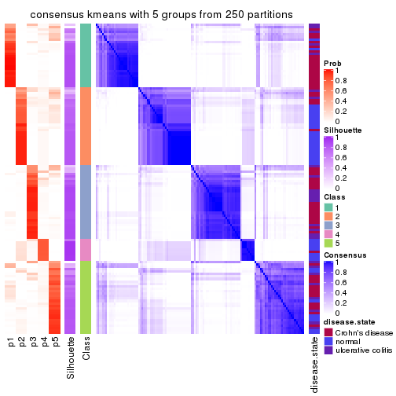</p>

</div>
<div id='tab-CV-kmeans-consensus-heatmap-5'>
<pre><code class="r">consensus_heatmap(res, k = 6)
</code></pre>

<p></p>

</div>
</div>

Heatmaps for the membership of samples in all partitions to see how consistent they are:


<script>
$( function() {
	$( '#tabs-CV-kmeans-membership-heatmap' ).tabs();
} );
</script>
<div id='tabs-CV-kmeans-membership-heatmap'>
<ul>
<li><a href='#tab-CV-kmeans-membership-heatmap-1'>k = 2</a></li>
<li><a href='#tab-CV-kmeans-membership-heatmap-2'>k = 3</a></li>
<li><a href='#tab-CV-kmeans-membership-heatmap-3'>k = 4</a></li>
<li><a href='#tab-CV-kmeans-membership-heatmap-4'>k = 5</a></li>
<li><a href='#tab-CV-kmeans-membership-heatmap-5'>k = 6</a></li>
</ul>
<div id='tab-CV-kmeans-membership-heatmap-1'>
<pre><code class="r">membership_heatmap(res, k = 2)
</code></pre>

<p></p>

</div>
<div id='tab-CV-kmeans-membership-heatmap-2'>
<pre><code class="r">membership_heatmap(res, k = 3)
</code></pre>

<p></p>

</div>
<div id='tab-CV-kmeans-membership-heatmap-3'>
<pre><code class="r">membership_heatmap(res, k = 4)
</code></pre>

<p></p>

</div>
<div id='tab-CV-kmeans-membership-heatmap-4'>
<pre><code class="r">membership_heatmap(res, k = 5)
</code></pre>

<p></p>

</div>
<div id='tab-CV-kmeans-membership-heatmap-5'>
<pre><code class="r">membership_heatmap(res, k = 6)
</code></pre>

<p></p>

</div>
</div>

As soon as we have had the classes for columns, we can look for signatures
which are significantly different between classes which can be candidate marks
for certain classes. Following are the heatmaps for signatures.


Signature heatmaps where rows are scaled:


<script>
$( function() {
	$( '#tabs-CV-kmeans-get-signatures' ).tabs();
} );
</script>
<div id='tabs-CV-kmeans-get-signatures'>
<ul>
<li><a href='#tab-CV-kmeans-get-signatures-1'>k = 2</a></li>
<li><a href='#tab-CV-kmeans-get-signatures-2'>k = 3</a></li>
<li><a href='#tab-CV-kmeans-get-signatures-3'>k = 4</a></li>
<li><a href='#tab-CV-kmeans-get-signatures-4'>k = 5</a></li>
<li><a href='#tab-CV-kmeans-get-signatures-5'>k = 6</a></li>
</ul>
<div id='tab-CV-kmeans-get-signatures-1'>
<pre><code class="r">get_signatures(res, k = 2)
</code></pre>

<p></p>

</div>
<div id='tab-CV-kmeans-get-signatures-2'>
<pre><code class="r">get_signatures(res, k = 3)
</code></pre>

<p></p>

</div>
<div id='tab-CV-kmeans-get-signatures-3'>
<pre><code class="r">get_signatures(res, k = 4)
</code></pre>

<p></p>

</div>
<div id='tab-CV-kmeans-get-signatures-4'>
<pre><code class="r">get_signatures(res, k = 5)
</code></pre>

<p></p>

</div>
<div id='tab-CV-kmeans-get-signatures-5'>
<pre><code class="r">get_signatures(res, k = 6)
</code></pre>

<p></p>

</div>
</div>


Signature heatmaps where rows are not scaled:


<script>
$( function() {
	$( '#tabs-CV-kmeans-get-signatures-no-scale' ).tabs();
} );
</script>
<div id='tabs-CV-kmeans-get-signatures-no-scale'>
<ul>
<li><a href='#tab-CV-kmeans-get-signatures-no-scale-1'>k = 2</a></li>
<li><a href='#tab-CV-kmeans-get-signatures-no-scale-2'>k = 3</a></li>
<li><a href='#tab-CV-kmeans-get-signatures-no-scale-3'>k = 4</a></li>
<li><a href='#tab-CV-kmeans-get-signatures-no-scale-4'>k = 5</a></li>
<li><a href='#tab-CV-kmeans-get-signatures-no-scale-5'>k = 6</a></li>
</ul>
<div id='tab-CV-kmeans-get-signatures-no-scale-1'>
<pre><code class="r">get_signatures(res, k = 2, scale_rows = FALSE)
</code></pre>

<p></p>

</div>
<div id='tab-CV-kmeans-get-signatures-no-scale-2'>
<pre><code class="r">get_signatures(res, k = 3, scale_rows = FALSE)
</code></pre>

<p></p>

</div>
<div id='tab-CV-kmeans-get-signatures-no-scale-3'>
<pre><code class="r">get_signatures(res, k = 4, scale_rows = FALSE)
</code></pre>

<p></p>

</div>
<div id='tab-CV-kmeans-get-signatures-no-scale-4'>
<pre><code class="r">get_signatures(res, k = 5, scale_rows = FALSE)
</code></pre>

<p></p>

</div>
<div id='tab-CV-kmeans-get-signatures-no-scale-5'>
<pre><code class="r">get_signatures(res, k = 6, scale_rows = FALSE)
</code></pre>

<p></p>

</div>
</div>


Compare the overlap of signatures from different k:

```r
compare_signatures(res)
```


`get_signature()` returns a data frame invisibly. TO get the list of signatures, the function
call should be assigned to a variable explicitly. In following code, if `plot` argument is set
to `FALSE`, no heatmap is plotted while only the differential analysis is performed.

```r
# code only for demonstration
tb = get_signature(res, k = ..., plot = FALSE)
```

An example of the output of `tb` is:

```
#>   which_row         fdr    mean_1    mean_2 scaled_mean_1 scaled_mean_2 km
#> 1        38 0.042760348  8.373488  9.131774    -0.5533452     0.5164555  1
#> 2        40 0.018707592  7.106213  8.469186    -0.6173731     0.5762149  1
#> 3        55 0.019134737 10.221463 11.207825    -0.6159697     0.5749050  1
#> 4        59 0.006059896  5.921854  7.869574    -0.6899429     0.6439467  1
#> 5        60 0.018055526  8.928898 10.211722    -0.6204761     0.5791110  1
#> 6        98 0.009384629 15.714769 14.887706     0.6635654    -0.6193277  2
...
```

The columns in `tb` are:

1. `which_row`: row indices corresponding to the input matrix.
2. `fdr`: FDR for the differential test. 
3. `mean_x`: The mean value in group x.
4. `scaled_mean_x`: The mean value in group x after rows are scaled.
5. `km`: Row groups if k-means clustering is applied to rows.


UMAP plot which shows how samples are separated.


<script>
$( function() {
	$( '#tabs-CV-kmeans-dimension-reduction' ).tabs();
} );
</script>
<div id='tabs-CV-kmeans-dimension-reduction'>
<ul>
<li><a href='#tab-CV-kmeans-dimension-reduction-1'>k = 2</a></li>
<li><a href='#tab-CV-kmeans-dimension-reduction-2'>k = 3</a></li>
<li><a href='#tab-CV-kmeans-dimension-reduction-3'>k = 4</a></li>
<li><a href='#tab-CV-kmeans-dimension-reduction-4'>k = 5</a></li>
<li><a href='#tab-CV-kmeans-dimension-reduction-5'>k = 6</a></li>
</ul>
<div id='tab-CV-kmeans-dimension-reduction-1'>
<pre><code class="r">dimension_reduction(res, k = 2, method = &quot;UMAP&quot;)
</code></pre>

<p></p>

</div>
<div id='tab-CV-kmeans-dimension-reduction-2'>
<pre><code class="r">dimension_reduction(res, k = 3, method = &quot;UMAP&quot;)
</code></pre>

<p></p>

</div>
<div id='tab-CV-kmeans-dimension-reduction-3'>
<pre><code class="r">dimension_reduction(res, k = 4, method = &quot;UMAP&quot;)
</code></pre>

<p></p>

</div>
<div id='tab-CV-kmeans-dimension-reduction-4'>
<pre><code class="r">dimension_reduction(res, k = 5, method = &quot;UMAP&quot;)
</code></pre>

<p></p>

</div>
<div id='tab-CV-kmeans-dimension-reduction-5'>
<pre><code class="r">dimension_reduction(res, k = 6, method = &quot;UMAP&quot;)
</code></pre>

<p></p>

</div>
</div>


Following heatmap shows how subgroups are split when increasing `k`:

```r
collect_classes(res)
```


Test correlation between subgroups and known annotations. If the known
annotation is numeric, one-way ANOVA test is applied, and if the known
annotation is discrete, chi-squared contingency table test is applied.

```r
test_to_known_factors(res)
```

```
#>             n disease.state(p) k
#> CV:kmeans 124         2.95e-07 2
#> CV:kmeans 106         1.58e-12 3
#> CV:kmeans  95         4.43e-11 4
#> CV:kmeans 115         2.35e-11 5
#> CV:kmeans  87         1.62e-11 6
```


If matrix rows can be associated to genes, consider to use `functional_enrichment(res,
...)` to perform function enrichment for the signature genes. See [this vignette](http://bioconductor.org/packages/devel/bioc/vignettes/cola/inst/doc/functional_enrichment.html) for more detailed explanations.


 

---------------------------------------------------


### CV:skmeans


The object with results only for a single top-value method and a single partition method 
can be extracted as:

```r
res = res_list["CV", "skmeans"]
# you can also extract it by
# res = res_list["CV:skmeans"]
```

A summary of `res` and all the functions that can be applied to it:

```r
res
```

```
#> A 'ConsensusPartition' object with k = 2, 3, 4, 5, 6.
#>   On a matrix with 21168 rows and 127 columns.
#>   Top rows (1000, 2000, 3000, 4000, 5000) are extracted by 'CV' method.
#>   Subgroups are detected by 'skmeans' method.
#>   Performed in total 1250 partitions by row resampling.
#>   Best k for subgroups seems to be 2.
#> 
#> Following methods can be applied to this 'ConsensusPartition' object:
#>  [1] "cola_report"             "collect_classes"         "collect_plots"          
#>  [4] "collect_stats"           "colnames"                "compare_signatures"     
#>  [7] "consensus_heatmap"       "dimension_reduction"     "functional_enrichment"  
#> [10] "get_anno_col"            "get_anno"                "get_classes"            
#> [13] "get_consensus"           "get_matrix"              "get_membership"         
#> [16] "get_param"               "get_signatures"          "get_stats"              
#> [19] "is_best_k"               "is_stable_k"             "membership_heatmap"     
#> [22] "ncol"                    "nrow"                    "plot_ecdf"              
#> [25] "rownames"                "select_partition_number" "show"                   
#> [28] "suggest_best_k"          "test_to_known_factors"
```

`collect_plots()` function collects all the plots made from `res` for all `k` (number of partitions)
into one single page to provide an easy and fast comparison between different `k`.

```r
collect_plots(res)
```


The plots are:

- The first row: a plot of the ECDF (empirical cumulative distribution
  function) curves of the consensus matrix for each `k` and the heatmap of
  predicted classes for each `k`.
- The second row: heatmaps of the consensus matrix for each `k`.
- The third row: heatmaps of the membership matrix for each `k`.
- The fouth row: heatmaps of the signatures for each `k`.

All the plots in panels can be made by individual functions and they are
plotted later in this section.

`select_partition_number()` produces several plots showing different
statistics for choosing "optimized" `k`. There are following statistics:

- ECDF curves of the consensus matrix for each `k`;
- 1-PAC. [The PAC
  score](https://en.wikipedia.org/wiki/Consensus_clustering#Over-interpretation_potential_of_consensus_clustering)
  measures the proportion of the ambiguous subgrouping.
- Mean silhouette score.
- Concordance. The mean probability of fiting the consensus class ids in all
  partitions.
- Area increased. Denote $A_k$ as the area under the ECDF curve for current
  `k`, the area increased is defined as $A_k - A_{k-1}$.
- Rand index. The percent of pairs of samples that are both in a same cluster
  or both are not in a same cluster in the partition of k and k-1.
- Jaccard index. The ratio of pairs of samples are both in a same cluster in
  the partition of k and k-1 and the pairs of samples are both in a same
  cluster in the partition k or k-1.

The detailed explanations of these statistics can be found in [the _cola_
vignette](http://bioconductor.org/packages/devel/bioc/vignettes/cola/inst/doc/cola.html#toc_13).

Generally speaking, lower PAC score, higher mean silhouette score or higher
concordance corresponds to better partition. Rand index and Jaccard index
measure how similar the current partition is compared to partition with `k-1`.
If they are too similar, we won't accept `k` is better than `k-1`.

```r
select_partition_number(res)
```


The numeric values for all these statistics can be obtained by `get_stats()`.

```r
get_stats(res)
```

```
#>   k 1-PAC mean_silhouette concordance area_increased  Rand Jaccard
#> 2 2 0.736           0.886       0.948         0.5037 0.496   0.496
#> 3 3 0.684           0.813       0.908         0.3189 0.780   0.583
#> 4 4 0.521           0.555       0.751         0.1209 0.878   0.659
#> 5 5 0.534           0.532       0.699         0.0662 0.909   0.675
#> 6 6 0.561           0.413       0.655         0.0411 0.959   0.815
```

`suggest_best_k()` suggests the best $k$ based on these statistics. The rules are as follows:

- All $k$ with Jaccard index larger than 0.95 are removed because increasing
  $k$ does not provide enough extra information. If all $k$ are removed, it is
  marked as no subgroup is detected.
- For all $k$ with 1-PAC score larger than 0.9, the maximal $k$ is taken as
  the best $k$, and other $k$ are marked as optional $k$.
- If it does not fit the second rule. The $k$ with the maximal vote of the
  highest 1-PAC score, highest mean silhouette, and highest concordance is
  taken as the best $k$.

```r
suggest_best_k(res)
```

```
#> [1] 2
```


Following shows the table of the partitions (You need to click the **show/hide
code output** link to see it). The membership matrix (columns with name `p*`)
is inferred by
[`clue::cl_consensus()`](https://www.rdocumentation.org/link/cl_consensus?package=clue)
function with the `SE` method. Basically the value in the membership matrix
represents the probability to belong to a certain group. The finall class
label for an item is determined with the group with highest probability it
belongs to.

In `get_classes()` function, the entropy is calculated from the membership
matrix and the silhouette score is calculated from the consensus matrix.


<script>
$( function() {
	$( '#tabs-CV-skmeans-get-classes' ).tabs();
} );
</script>
<div id='tabs-CV-skmeans-get-classes'>
<ul>
<li><a href='#tab-CV-skmeans-get-classes-1'>k = 2</a></li>
<li><a href='#tab-CV-skmeans-get-classes-2'>k = 3</a></li>
<li><a href='#tab-CV-skmeans-get-classes-3'>k = 4</a></li>
<li><a href='#tab-CV-skmeans-get-classes-4'>k = 5</a></li>
<li><a href='#tab-CV-skmeans-get-classes-5'>k = 6</a></li>
</ul>

<div id='tab-CV-skmeans-get-classes-1'>
<p><a id='tab-CV-skmeans-get-classes-1-a' style='color:#0366d6' href='#'>show/hide code output</a></p>
<pre><code class="r">cbind(get_classes(res, k = 2), get_membership(res, k = 2))
</code></pre>

<pre><code>#&gt;          class entropy silhouette    p1    p2
#&gt; GSM76115     2  0.0000    0.94532 0.000 1.000
#&gt; GSM76116     2  0.7056    0.75443 0.192 0.808
#&gt; GSM76117     1  0.7674    0.73722 0.776 0.224
#&gt; GSM76118     1  0.7528    0.74615 0.784 0.216
#&gt; GSM76119     2  0.0000    0.94532 0.000 1.000
#&gt; GSM76120     2  0.0000    0.94532 0.000 1.000
#&gt; GSM76121     1  0.5519    0.84658 0.872 0.128
#&gt; GSM76122     1  0.8144    0.69707 0.748 0.252
#&gt; GSM76123     2  0.0000    0.94532 0.000 1.000
#&gt; GSM76124     1  0.5629    0.84068 0.868 0.132
#&gt; GSM76125     2  0.0000    0.94532 0.000 1.000
#&gt; GSM76126     2  0.0000    0.94532 0.000 1.000
#&gt; GSM76127     2  0.0000    0.94532 0.000 1.000
#&gt; GSM76128     2  0.8499    0.65819 0.276 0.724
#&gt; GSM76129     2  0.0000    0.94532 0.000 1.000
#&gt; GSM76130     2  0.0000    0.94532 0.000 1.000
#&gt; GSM76131     2  0.0000    0.94532 0.000 1.000
#&gt; GSM76132     2  0.0000    0.94532 0.000 1.000
#&gt; GSM76133     2  0.0000    0.94532 0.000 1.000
#&gt; GSM76134     2  0.0000    0.94532 0.000 1.000
#&gt; GSM76135     2  0.0000    0.94532 0.000 1.000
#&gt; GSM76136     2  0.0000    0.94532 0.000 1.000
#&gt; GSM76137     2  0.0000    0.94532 0.000 1.000
#&gt; GSM76138     2  0.0000    0.94532 0.000 1.000
#&gt; GSM76139     2  0.0000    0.94532 0.000 1.000
#&gt; GSM76140     1  0.0000    0.94247 1.000 0.000
#&gt; GSM76141     2  0.0000    0.94532 0.000 1.000
#&gt; GSM76142     2  0.0000    0.94532 0.000 1.000
#&gt; GSM76143     2  0.0000    0.94532 0.000 1.000
#&gt; GSM76144     2  0.0000    0.94532 0.000 1.000
#&gt; GSM76145     2  0.0000    0.94532 0.000 1.000
#&gt; GSM76146     2  0.0000    0.94532 0.000 1.000
#&gt; GSM76147     2  0.0000    0.94532 0.000 1.000
#&gt; GSM76148     2  0.0000    0.94532 0.000 1.000
#&gt; GSM76149     2  0.0000    0.94532 0.000 1.000
#&gt; GSM76150     2  0.0000    0.94532 0.000 1.000
#&gt; GSM76151     2  0.0000    0.94532 0.000 1.000
#&gt; GSM76152     1  0.0000    0.94247 1.000 0.000
#&gt; GSM76153     2  0.0000    0.94532 0.000 1.000
#&gt; GSM76154     2  0.0000    0.94532 0.000 1.000
#&gt; GSM76155     2  0.0000    0.94532 0.000 1.000
#&gt; GSM76156     2  0.0000    0.94532 0.000 1.000
#&gt; GSM76030     2  0.0000    0.94532 0.000 1.000
#&gt; GSM76031     1  0.0000    0.94247 1.000 0.000
#&gt; GSM76032     1  0.0000    0.94247 1.000 0.000
#&gt; GSM76033     1  0.9988   -0.00187 0.520 0.480
#&gt; GSM76034     2  0.0000    0.94532 0.000 1.000
#&gt; GSM76035     1  0.7299    0.73391 0.796 0.204
#&gt; GSM76036     2  0.2043    0.92488 0.032 0.968
#&gt; GSM76037     2  0.0938    0.93771 0.012 0.988
#&gt; GSM76038     1  0.0000    0.94247 1.000 0.000
#&gt; GSM76039     1  0.0000    0.94247 1.000 0.000
#&gt; GSM76040     2  0.2778    0.91335 0.048 0.952
#&gt; GSM76041     1  0.0000    0.94247 1.000 0.000
#&gt; GSM76042     1  0.0000    0.94247 1.000 0.000
#&gt; GSM76043     1  0.0000    0.94247 1.000 0.000
#&gt; GSM76044     1  0.0000    0.94247 1.000 0.000
#&gt; GSM76045     1  0.0000    0.94247 1.000 0.000
#&gt; GSM76046     2  0.8555    0.65174 0.280 0.720
#&gt; GSM76047     1  0.0000    0.94247 1.000 0.000
#&gt; GSM76048     1  0.4562    0.86932 0.904 0.096
#&gt; GSM76049     1  0.8555    0.62563 0.720 0.280
#&gt; GSM76050     1  0.0000    0.94247 1.000 0.000
#&gt; GSM76051     2  0.5294    0.85237 0.120 0.880
#&gt; GSM76052     2  0.8813    0.61767 0.300 0.700
#&gt; GSM76053     2  0.9833    0.31827 0.424 0.576
#&gt; GSM76054     2  0.2948    0.91059 0.052 0.948
#&gt; GSM76055     1  0.8861    0.59291 0.696 0.304
#&gt; GSM76056     1  0.0000    0.94247 1.000 0.000
#&gt; GSM76057     1  0.4161    0.88726 0.916 0.084
#&gt; GSM76058     1  0.0000    0.94247 1.000 0.000
#&gt; GSM76059     1  0.0000    0.94247 1.000 0.000
#&gt; GSM76060     1  0.4022    0.88541 0.920 0.080
#&gt; GSM76061     2  0.3114    0.90471 0.056 0.944
#&gt; GSM76062     1  0.0000    0.94247 1.000 0.000
#&gt; GSM76063     2  0.0000    0.94532 0.000 1.000
#&gt; GSM76064     1  0.0000    0.94247 1.000 0.000
#&gt; GSM76065     2  0.0672    0.94033 0.008 0.992
#&gt; GSM76066     1  0.0000    0.94247 1.000 0.000
#&gt; GSM76067     1  0.0000    0.94247 1.000 0.000
#&gt; GSM76068     2  0.7219    0.76687 0.200 0.800
#&gt; GSM76069     1  0.0000    0.94247 1.000 0.000
#&gt; GSM76070     2  0.0000    0.94532 0.000 1.000
#&gt; GSM76071     1  0.0000    0.94247 1.000 0.000
#&gt; GSM76072     1  0.0000    0.94247 1.000 0.000
#&gt; GSM76073     1  0.0000    0.94247 1.000 0.000
#&gt; GSM76074     1  0.0000    0.94247 1.000 0.000
#&gt; GSM76075     1  0.1184    0.93288 0.984 0.016
#&gt; GSM76076     2  0.8207    0.68971 0.256 0.744
#&gt; GSM76077     1  0.0000    0.94247 1.000 0.000
#&gt; GSM76078     1  0.0000    0.94247 1.000 0.000
#&gt; GSM76079     1  0.0000    0.94247 1.000 0.000
#&gt; GSM76080     2  0.0000    0.94532 0.000 1.000
#&gt; GSM76081     2  0.0000    0.94532 0.000 1.000
#&gt; GSM76082     1  0.9491    0.40964 0.632 0.368
#&gt; GSM76083     2  0.5059    0.85933 0.112 0.888
#&gt; GSM76084     2  0.0000    0.94532 0.000 1.000
#&gt; GSM76085     2  0.9248    0.53803 0.340 0.660
#&gt; GSM76086     1  0.0000    0.94247 1.000 0.000
#&gt; GSM76087     2  0.0000    0.94532 0.000 1.000
#&gt; GSM76088     1  0.0000    0.94247 1.000 0.000
#&gt; GSM76089     2  0.0000    0.94532 0.000 1.000
#&gt; GSM76090     1  0.0000    0.94247 1.000 0.000
#&gt; GSM76091     1  0.0000    0.94247 1.000 0.000
#&gt; GSM76092     1  0.0000    0.94247 1.000 0.000
#&gt; GSM76093     1  0.0000    0.94247 1.000 0.000
#&gt; GSM76094     1  0.8661    0.63702 0.712 0.288
#&gt; GSM76095     1  0.0000    0.94247 1.000 0.000
#&gt; GSM76096     1  0.1633    0.92845 0.976 0.024
#&gt; GSM76097     1  0.2948    0.90943 0.948 0.052
#&gt; GSM76098     2  0.0000    0.94532 0.000 1.000
#&gt; GSM76099     1  0.0000    0.94247 1.000 0.000
#&gt; GSM76100     1  0.0000    0.94247 1.000 0.000
#&gt; GSM76101     1  0.0000    0.94247 1.000 0.000
#&gt; GSM76102     1  0.2948    0.91117 0.948 0.052
#&gt; GSM76103     1  0.0000    0.94247 1.000 0.000
#&gt; GSM76104     2  0.6801    0.79142 0.180 0.820
#&gt; GSM76105     1  0.5178    0.85990 0.884 0.116
#&gt; GSM76106     2  0.0000    0.94532 0.000 1.000
#&gt; GSM76107     2  0.0000    0.94532 0.000 1.000
#&gt; GSM76108     1  0.0376    0.94022 0.996 0.004
#&gt; GSM76109     1  0.0000    0.94247 1.000 0.000
#&gt; GSM76110     1  0.0000    0.94247 1.000 0.000
#&gt; GSM76111     1  0.0000    0.94247 1.000 0.000
#&gt; GSM76112     1  0.0000    0.94247 1.000 0.000
#&gt; GSM76113     2  0.9209    0.51066 0.336 0.664
#&gt; GSM76114     1  0.0000    0.94247 1.000 0.000
</code></pre>

<script>
$('#tab-CV-skmeans-get-classes-1-a').parent().next().next().hide();
$('#tab-CV-skmeans-get-classes-1-a').click(function(){
  $('#tab-CV-skmeans-get-classes-1-a').parent().next().next().toggle();
  return(false);
});
</script>
</div>

<div id='tab-CV-skmeans-get-classes-2'>
<p><a id='tab-CV-skmeans-get-classes-2-a' style='color:#0366d6' href='#'>show/hide code output</a></p>
<pre><code class="r">cbind(get_classes(res, k = 3), get_membership(res, k = 3))
</code></pre>

<pre><code>#&gt;          class entropy silhouette    p1    p2    p3
#&gt; GSM76115     2  0.0000      0.917 0.000 1.000 0.000
#&gt; GSM76116     2  0.3193      0.831 0.100 0.896 0.004
#&gt; GSM76117     1  0.4974      0.703 0.764 0.236 0.000
#&gt; GSM76118     1  0.5785      0.606 0.696 0.300 0.004
#&gt; GSM76119     2  0.4974      0.742 0.000 0.764 0.236
#&gt; GSM76120     2  0.5650      0.632 0.000 0.688 0.312
#&gt; GSM76121     1  0.1964      0.859 0.944 0.056 0.000
#&gt; GSM76122     1  0.6416      0.450 0.616 0.376 0.008
#&gt; GSM76123     2  0.5327      0.696 0.000 0.728 0.272
#&gt; GSM76124     1  0.3500      0.816 0.880 0.116 0.004
#&gt; GSM76125     2  0.5098      0.727 0.000 0.752 0.248
#&gt; GSM76126     2  0.5327      0.697 0.000 0.728 0.272
#&gt; GSM76127     2  0.5397      0.685 0.000 0.720 0.280
#&gt; GSM76128     3  0.0892      0.886 0.020 0.000 0.980
#&gt; GSM76129     2  0.0000      0.917 0.000 1.000 0.000
#&gt; GSM76130     2  0.4654      0.771 0.000 0.792 0.208
#&gt; GSM76131     2  0.0000      0.917 0.000 1.000 0.000
#&gt; GSM76132     2  0.0000      0.917 0.000 1.000 0.000
#&gt; GSM76133     2  0.0000      0.917 0.000 1.000 0.000
#&gt; GSM76134     2  0.0000      0.917 0.000 1.000 0.000
#&gt; GSM76135     2  0.0000      0.917 0.000 1.000 0.000
#&gt; GSM76136     2  0.0000      0.917 0.000 1.000 0.000
#&gt; GSM76137     2  0.2066      0.890 0.000 0.940 0.060
#&gt; GSM76138     2  0.0000      0.917 0.000 1.000 0.000
#&gt; GSM76139     2  0.0000      0.917 0.000 1.000 0.000
#&gt; GSM76140     1  0.0000      0.887 1.000 0.000 0.000
#&gt; GSM76141     2  0.0000      0.917 0.000 1.000 0.000
#&gt; GSM76142     2  0.0000      0.917 0.000 1.000 0.000
#&gt; GSM76143     2  0.0000      0.917 0.000 1.000 0.000
#&gt; GSM76144     2  0.0000      0.917 0.000 1.000 0.000
#&gt; GSM76145     2  0.1289      0.905 0.000 0.968 0.032
#&gt; GSM76146     2  0.0000      0.917 0.000 1.000 0.000
#&gt; GSM76147     2  0.0000      0.917 0.000 1.000 0.000
#&gt; GSM76148     2  0.0000      0.917 0.000 1.000 0.000
#&gt; GSM76149     2  0.0000      0.917 0.000 1.000 0.000
#&gt; GSM76150     2  0.0000      0.917 0.000 1.000 0.000
#&gt; GSM76151     2  0.0424      0.915 0.000 0.992 0.008
#&gt; GSM76152     1  0.0000      0.887 1.000 0.000 0.000
#&gt; GSM76153     2  0.0000      0.917 0.000 1.000 0.000
#&gt; GSM76154     2  0.0000      0.917 0.000 1.000 0.000
#&gt; GSM76155     2  0.0000      0.917 0.000 1.000 0.000
#&gt; GSM76156     2  0.0000      0.917 0.000 1.000 0.000
#&gt; GSM76030     2  0.4399      0.772 0.000 0.812 0.188
#&gt; GSM76031     1  0.0000      0.887 1.000 0.000 0.000
#&gt; GSM76032     3  0.1860      0.873 0.052 0.000 0.948
#&gt; GSM76033     3  0.0000      0.887 0.000 0.000 1.000
#&gt; GSM76034     2  0.5098      0.728 0.000 0.752 0.248
#&gt; GSM76035     3  0.2261      0.866 0.068 0.000 0.932
#&gt; GSM76036     3  0.0237      0.886 0.000 0.004 0.996
#&gt; GSM76037     2  0.1129      0.904 0.020 0.976 0.004
#&gt; GSM76038     1  0.0000      0.887 1.000 0.000 0.000
#&gt; GSM76039     1  0.0000      0.887 1.000 0.000 0.000
#&gt; GSM76040     3  0.0237      0.887 0.004 0.000 0.996
#&gt; GSM76041     1  0.4702      0.697 0.788 0.000 0.212
#&gt; GSM76042     1  0.0237      0.886 0.996 0.000 0.004
#&gt; GSM76043     3  0.6095      0.360 0.392 0.000 0.608
#&gt; GSM76044     1  0.0475      0.885 0.992 0.004 0.004
#&gt; GSM76045     1  0.2066      0.853 0.940 0.000 0.060
#&gt; GSM76046     3  0.0000      0.887 0.000 0.000 1.000
#&gt; GSM76047     1  0.6140      0.307 0.596 0.000 0.404
#&gt; GSM76048     3  0.0592      0.887 0.012 0.000 0.988
#&gt; GSM76049     1  0.8742      0.149 0.456 0.436 0.108
#&gt; GSM76050     1  0.3412      0.799 0.876 0.000 0.124
#&gt; GSM76051     3  0.0237      0.887 0.004 0.000 0.996
#&gt; GSM76052     3  0.0000      0.887 0.000 0.000 1.000
#&gt; GSM76053     3  0.6151      0.744 0.160 0.068 0.772
#&gt; GSM76054     3  0.0237      0.887 0.004 0.000 0.996
#&gt; GSM76055     1  0.6386      0.373 0.584 0.412 0.004
#&gt; GSM76056     1  0.0000      0.887 1.000 0.000 0.000
#&gt; GSM76057     1  0.8278      0.546 0.620 0.248 0.132
#&gt; GSM76058     3  0.1529      0.879 0.040 0.000 0.960
#&gt; GSM76059     1  0.0000      0.887 1.000 0.000 0.000
#&gt; GSM76060     3  0.9081      0.452 0.236 0.212 0.552
#&gt; GSM76061     2  0.2947      0.864 0.060 0.920 0.020
#&gt; GSM76062     1  0.0000      0.887 1.000 0.000 0.000
#&gt; GSM76063     2  0.4291      0.801 0.000 0.820 0.180
#&gt; GSM76064     1  0.6154      0.283 0.592 0.000 0.408
#&gt; GSM76065     2  0.1129      0.904 0.020 0.976 0.004
#&gt; GSM76066     1  0.5216      0.620 0.740 0.000 0.260
#&gt; GSM76067     3  0.4974      0.684 0.236 0.000 0.764
#&gt; GSM76068     3  0.0237      0.887 0.004 0.000 0.996
#&gt; GSM76069     1  0.0237      0.886 0.996 0.000 0.004
#&gt; GSM76070     2  0.1529      0.902 0.000 0.960 0.040
#&gt; GSM76071     1  0.0000      0.887 1.000 0.000 0.000
#&gt; GSM76072     1  0.0000      0.887 1.000 0.000 0.000
#&gt; GSM76073     1  0.0000      0.887 1.000 0.000 0.000
#&gt; GSM76074     1  0.0000      0.887 1.000 0.000 0.000
#&gt; GSM76075     3  0.0237      0.888 0.004 0.000 0.996
#&gt; GSM76076     3  0.0237      0.887 0.004 0.000 0.996
#&gt; GSM76077     1  0.3973      0.823 0.880 0.032 0.088
#&gt; GSM76078     3  0.6159      0.707 0.196 0.048 0.756
#&gt; GSM76079     1  0.0000      0.887 1.000 0.000 0.000
#&gt; GSM76080     3  0.4178      0.732 0.000 0.172 0.828
#&gt; GSM76081     3  0.3192      0.808 0.000 0.112 0.888
#&gt; GSM76082     3  0.0424      0.887 0.008 0.000 0.992
#&gt; GSM76083     3  0.0237      0.886 0.000 0.004 0.996
#&gt; GSM76084     2  0.5465      0.663 0.000 0.712 0.288
#&gt; GSM76085     3  0.0000      0.887 0.000 0.000 1.000
#&gt; GSM76086     3  0.5058      0.672 0.244 0.000 0.756
#&gt; GSM76087     2  0.0000      0.917 0.000 1.000 0.000
#&gt; GSM76088     1  0.8405      0.473 0.604 0.132 0.264
#&gt; GSM76089     2  0.0237      0.916 0.000 0.996 0.004
#&gt; GSM76090     3  0.1964      0.870 0.056 0.000 0.944
#&gt; GSM76091     1  0.0747      0.880 0.984 0.000 0.016
#&gt; GSM76092     1  0.0000      0.887 1.000 0.000 0.000
#&gt; GSM76093     1  0.0000      0.887 1.000 0.000 0.000
#&gt; GSM76094     1  0.5956      0.567 0.672 0.324 0.004
#&gt; GSM76095     1  0.0237      0.886 0.996 0.000 0.004
#&gt; GSM76096     1  0.0237      0.886 0.996 0.000 0.004
#&gt; GSM76097     1  0.0237      0.886 0.996 0.004 0.000
#&gt; GSM76098     3  0.2878      0.825 0.000 0.096 0.904
#&gt; GSM76099     1  0.0237      0.886 0.996 0.000 0.004
#&gt; GSM76100     1  0.0000      0.887 1.000 0.000 0.000
#&gt; GSM76101     1  0.0000      0.887 1.000 0.000 0.000
#&gt; GSM76102     1  0.2165      0.853 0.936 0.064 0.000
#&gt; GSM76103     3  0.4178      0.770 0.172 0.000 0.828
#&gt; GSM76104     3  0.1525      0.873 0.004 0.032 0.964
#&gt; GSM76105     1  0.3043      0.837 0.908 0.084 0.008
#&gt; GSM76106     3  0.5948      0.337 0.000 0.360 0.640
#&gt; GSM76107     2  0.5098      0.728 0.000 0.752 0.248
#&gt; GSM76108     1  0.0237      0.886 0.996 0.000 0.004
#&gt; GSM76109     1  0.0000      0.887 1.000 0.000 0.000
#&gt; GSM76110     1  0.0000      0.887 1.000 0.000 0.000
#&gt; GSM76111     1  0.0000      0.887 1.000 0.000 0.000
#&gt; GSM76112     1  0.0237      0.886 0.996 0.000 0.004
#&gt; GSM76113     3  0.6222      0.762 0.092 0.132 0.776
#&gt; GSM76114     1  0.1860      0.862 0.948 0.000 0.052
</code></pre>

<script>
$('#tab-CV-skmeans-get-classes-2-a').parent().next().next().hide();
$('#tab-CV-skmeans-get-classes-2-a').click(function(){
  $('#tab-CV-skmeans-get-classes-2-a').parent().next().next().toggle();
  return(false);
});
</script>
</div>

<div id='tab-CV-skmeans-get-classes-3'>
<p><a id='tab-CV-skmeans-get-classes-3-a' style='color:#0366d6' href='#'>show/hide code output</a></p>
<pre><code class="r">cbind(get_classes(res, k = 4), get_membership(res, k = 4))
</code></pre>

<pre><code>#&gt;          class entropy silhouette    p1    p2    p3    p4
#&gt; GSM76115     2  0.5549     0.4639 0.004 0.584 0.016 0.396
#&gt; GSM76116     4  0.5483    -0.1464 0.016 0.448 0.000 0.536
#&gt; GSM76117     4  0.7868     0.0863 0.404 0.176 0.012 0.408
#&gt; GSM76118     4  0.7685     0.3014 0.256 0.224 0.008 0.512
#&gt; GSM76119     4  0.7226     0.2187 0.000 0.388 0.144 0.468
#&gt; GSM76120     4  0.7512     0.2627 0.000 0.348 0.192 0.460
#&gt; GSM76121     1  0.6122     0.3964 0.576 0.032 0.012 0.380
#&gt; GSM76122     4  0.6261     0.3318 0.204 0.120 0.004 0.672
#&gt; GSM76123     4  0.7460     0.2605 0.000 0.348 0.184 0.468
#&gt; GSM76124     4  0.7232    -0.0108 0.360 0.132 0.004 0.504
#&gt; GSM76125     4  0.7243     0.2005 0.000 0.404 0.144 0.452
#&gt; GSM76126     4  0.7332     0.2141 0.000 0.396 0.156 0.448
#&gt; GSM76127     4  0.7441     0.2586 0.000 0.352 0.180 0.468
#&gt; GSM76128     3  0.6436     0.3073 0.048 0.008 0.492 0.452
#&gt; GSM76129     2  0.3649     0.6973 0.000 0.796 0.000 0.204
#&gt; GSM76130     4  0.7007     0.1488 0.000 0.432 0.116 0.452
#&gt; GSM76131     2  0.0000     0.7742 0.000 1.000 0.000 0.000
#&gt; GSM76132     2  0.0336     0.7737 0.000 0.992 0.000 0.008
#&gt; GSM76133     2  0.0000     0.7742 0.000 1.000 0.000 0.000
#&gt; GSM76134     2  0.3444     0.7266 0.000 0.816 0.000 0.184
#&gt; GSM76135     2  0.0000     0.7742 0.000 1.000 0.000 0.000
#&gt; GSM76136     2  0.0000     0.7742 0.000 1.000 0.000 0.000
#&gt; GSM76137     2  0.5878     0.4236 0.000 0.632 0.056 0.312
#&gt; GSM76138     2  0.5088     0.3720 0.000 0.572 0.004 0.424
#&gt; GSM76139     2  0.2271     0.7368 0.000 0.916 0.008 0.076
#&gt; GSM76140     1  0.3024     0.7727 0.852 0.000 0.000 0.148
#&gt; GSM76141     2  0.0000     0.7742 0.000 1.000 0.000 0.000
#&gt; GSM76142     2  0.0000     0.7742 0.000 1.000 0.000 0.000
#&gt; GSM76143     2  0.0000     0.7742 0.000 1.000 0.000 0.000
#&gt; GSM76144     2  0.0000     0.7742 0.000 1.000 0.000 0.000
#&gt; GSM76145     2  0.6054     0.5787 0.000 0.656 0.088 0.256
#&gt; GSM76146     2  0.0336     0.7737 0.000 0.992 0.000 0.008
#&gt; GSM76147     2  0.2011     0.7527 0.000 0.920 0.000 0.080
#&gt; GSM76148     2  0.0469     0.7707 0.000 0.988 0.000 0.012
#&gt; GSM76149     2  0.3266     0.7334 0.000 0.832 0.000 0.168
#&gt; GSM76150     2  0.3219     0.7336 0.000 0.836 0.000 0.164
#&gt; GSM76151     2  0.4387     0.6812 0.000 0.752 0.012 0.236
#&gt; GSM76152     1  0.0817     0.8172 0.976 0.000 0.000 0.024
#&gt; GSM76153     2  0.0000     0.7742 0.000 1.000 0.000 0.000
#&gt; GSM76154     2  0.3400     0.7214 0.000 0.820 0.000 0.180
#&gt; GSM76155     2  0.3569     0.7115 0.000 0.804 0.000 0.196
#&gt; GSM76156     2  0.0921     0.7687 0.000 0.972 0.000 0.028
#&gt; GSM76030     2  0.6463     0.4984 0.000 0.644 0.160 0.196
#&gt; GSM76031     1  0.1767     0.8167 0.944 0.000 0.012 0.044
#&gt; GSM76032     3  0.4039     0.6932 0.080 0.000 0.836 0.084
#&gt; GSM76033     3  0.2469     0.7138 0.000 0.000 0.892 0.108
#&gt; GSM76034     2  0.7803    -0.0662 0.008 0.460 0.196 0.336
#&gt; GSM76035     3  0.6208     0.6064 0.144 0.004 0.684 0.168
#&gt; GSM76036     3  0.2704     0.7008 0.000 0.000 0.876 0.124
#&gt; GSM76037     4  0.5404    -0.2177 0.012 0.476 0.000 0.512
#&gt; GSM76038     1  0.2408     0.8125 0.920 0.000 0.036 0.044
#&gt; GSM76039     1  0.2704     0.7889 0.876 0.000 0.000 0.124
#&gt; GSM76040     3  0.2704     0.7064 0.000 0.000 0.876 0.124
#&gt; GSM76041     1  0.5697     0.5363 0.664 0.000 0.280 0.056
#&gt; GSM76042     1  0.4690     0.7070 0.724 0.000 0.016 0.260
#&gt; GSM76043     3  0.7261     0.2402 0.340 0.000 0.500 0.160
#&gt; GSM76044     1  0.5271     0.6054 0.640 0.000 0.020 0.340
#&gt; GSM76045     1  0.4688     0.7368 0.792 0.000 0.128 0.080
#&gt; GSM76046     3  0.4522     0.5759 0.000 0.000 0.680 0.320
#&gt; GSM76047     1  0.7534     0.1447 0.448 0.000 0.360 0.192
#&gt; GSM76048     3  0.3308     0.7234 0.036 0.000 0.872 0.092
#&gt; GSM76049     4  0.9238     0.2513 0.232 0.296 0.088 0.384
#&gt; GSM76050     1  0.3196     0.7418 0.856 0.000 0.136 0.008
#&gt; GSM76051     3  0.1792     0.7184 0.000 0.000 0.932 0.068
#&gt; GSM76052     3  0.2530     0.7144 0.000 0.000 0.888 0.112
#&gt; GSM76053     4  0.7445    -0.0604 0.084 0.040 0.328 0.548
#&gt; GSM76054     3  0.1867     0.7194 0.000 0.000 0.928 0.072
#&gt; GSM76055     4  0.7189     0.1926 0.300 0.168 0.000 0.532
#&gt; GSM76056     1  0.2773     0.7969 0.880 0.004 0.000 0.116
#&gt; GSM76057     4  0.9735     0.1772 0.280 0.284 0.140 0.296
#&gt; GSM76058     3  0.2845     0.6960 0.076 0.000 0.896 0.028
#&gt; GSM76059     1  0.0000     0.8146 1.000 0.000 0.000 0.000
#&gt; GSM76060     3  0.9395     0.1187 0.128 0.252 0.412 0.208
#&gt; GSM76061     2  0.5098     0.5916 0.028 0.764 0.024 0.184
#&gt; GSM76062     1  0.1004     0.8158 0.972 0.000 0.004 0.024
#&gt; GSM76063     2  0.5582     0.5059 0.000 0.728 0.136 0.136
#&gt; GSM76064     3  0.6887     0.0164 0.440 0.000 0.456 0.104
#&gt; GSM76065     2  0.4761     0.4234 0.004 0.664 0.000 0.332
#&gt; GSM76066     1  0.5252     0.4343 0.644 0.000 0.336 0.020
#&gt; GSM76067     3  0.4776     0.5622 0.272 0.000 0.712 0.016
#&gt; GSM76068     3  0.1743     0.7239 0.004 0.000 0.940 0.056
#&gt; GSM76069     1  0.4220     0.7118 0.748 0.000 0.004 0.248
#&gt; GSM76070     2  0.3485     0.6932 0.000 0.856 0.028 0.116
#&gt; GSM76071     1  0.1059     0.8159 0.972 0.000 0.012 0.016
#&gt; GSM76072     1  0.0779     0.8169 0.980 0.000 0.004 0.016
#&gt; GSM76073     1  0.0188     0.8152 0.996 0.000 0.000 0.004
#&gt; GSM76074     1  0.0336     0.8150 0.992 0.000 0.000 0.008
#&gt; GSM76075     3  0.2329     0.7095 0.012 0.000 0.916 0.072
#&gt; GSM76076     3  0.0817     0.7222 0.000 0.000 0.976 0.024
#&gt; GSM76077     1  0.8756     0.1943 0.380 0.056 0.192 0.372
#&gt; GSM76078     3  0.6506     0.5870 0.132 0.040 0.704 0.124
#&gt; GSM76079     1  0.1398     0.8168 0.956 0.000 0.004 0.040
#&gt; GSM76080     3  0.6773     0.3312 0.000 0.108 0.544 0.348
#&gt; GSM76081     3  0.5664     0.5421 0.000 0.076 0.696 0.228
#&gt; GSM76082     3  0.1488     0.7243 0.012 0.000 0.956 0.032
#&gt; GSM76083     3  0.1118     0.7229 0.000 0.000 0.964 0.036
#&gt; GSM76084     2  0.7717    -0.0163 0.000 0.444 0.252 0.304
#&gt; GSM76085     3  0.1211     0.7242 0.000 0.000 0.960 0.040
#&gt; GSM76086     3  0.4995     0.5771 0.248 0.000 0.720 0.032
#&gt; GSM76087     2  0.3351     0.6680 0.000 0.844 0.008 0.148
#&gt; GSM76088     1  0.9754     0.0126 0.328 0.152 0.268 0.252
#&gt; GSM76089     2  0.4401     0.6415 0.000 0.724 0.004 0.272
#&gt; GSM76090     3  0.3320     0.6916 0.068 0.000 0.876 0.056
#&gt; GSM76091     1  0.2282     0.8103 0.924 0.000 0.024 0.052
#&gt; GSM76092     1  0.0000     0.8146 1.000 0.000 0.000 0.000
#&gt; GSM76093     1  0.0000     0.8146 1.000 0.000 0.000 0.000
#&gt; GSM76094     4  0.7575     0.1327 0.356 0.200 0.000 0.444
#&gt; GSM76095     1  0.4910     0.6946 0.704 0.000 0.020 0.276
#&gt; GSM76096     1  0.3649     0.7487 0.796 0.000 0.000 0.204
#&gt; GSM76097     1  0.4896     0.6571 0.704 0.012 0.004 0.280
#&gt; GSM76098     3  0.6831     0.3067 0.000 0.112 0.536 0.352
#&gt; GSM76099     1  0.3088     0.7949 0.864 0.000 0.008 0.128
#&gt; GSM76100     1  0.1022     0.8153 0.968 0.000 0.000 0.032
#&gt; GSM76101     1  0.0000     0.8146 1.000 0.000 0.000 0.000
#&gt; GSM76102     1  0.5186     0.6286 0.752 0.084 0.000 0.164
#&gt; GSM76103     3  0.5312     0.5747 0.236 0.000 0.712 0.052
#&gt; GSM76104     3  0.6657     0.4687 0.016 0.076 0.612 0.296
#&gt; GSM76105     4  0.5933    -0.1134 0.408 0.040 0.000 0.552
#&gt; GSM76106     4  0.7408     0.0237 0.000 0.172 0.364 0.464
#&gt; GSM76107     4  0.7052     0.2394 0.000 0.372 0.128 0.500
#&gt; GSM76108     1  0.4624     0.6110 0.660 0.000 0.000 0.340
#&gt; GSM76109     1  0.0188     0.8149 0.996 0.000 0.000 0.004
#&gt; GSM76110     1  0.0469     0.8152 0.988 0.000 0.000 0.012
#&gt; GSM76111     1  0.1867     0.8162 0.928 0.000 0.000 0.072
#&gt; GSM76112     1  0.1489     0.8076 0.952 0.000 0.044 0.004
#&gt; GSM76113     3  0.8900     0.2497 0.124 0.128 0.468 0.280
#&gt; GSM76114     1  0.5314     0.7246 0.740 0.000 0.084 0.176
</code></pre>

<script>
$('#tab-CV-skmeans-get-classes-3-a').parent().next().next().hide();
$('#tab-CV-skmeans-get-classes-3-a').click(function(){
  $('#tab-CV-skmeans-get-classes-3-a').parent().next().next().toggle();
  return(false);
});
</script>
</div>

<div id='tab-CV-skmeans-get-classes-4'>
<p><a id='tab-CV-skmeans-get-classes-4-a' style='color:#0366d6' href='#'>show/hide code output</a></p>
<pre><code class="r">cbind(get_classes(res, k = 5), get_membership(res, k = 5))
</code></pre>

<pre><code>#&gt;          class entropy silhouette    p1    p2    p3    p4    p5
#&gt; GSM76115     5  0.7186   -0.00686 0.000 0.324 0.016 0.284 0.376
#&gt; GSM76116     5  0.5713    0.42102 0.004 0.200 0.000 0.156 0.640
#&gt; GSM76117     5  0.7837    0.40946 0.292 0.100 0.012 0.128 0.468
#&gt; GSM76118     5  0.7348    0.55457 0.132 0.132 0.008 0.156 0.572
#&gt; GSM76119     4  0.4211    0.70484 0.000 0.148 0.032 0.792 0.028
#&gt; GSM76120     4  0.3485    0.71447 0.000 0.124 0.048 0.828 0.000
#&gt; GSM76121     1  0.7817   -0.07608 0.428 0.028 0.028 0.224 0.292
#&gt; GSM76122     5  0.6797    0.45211 0.092 0.052 0.012 0.264 0.580
#&gt; GSM76123     4  0.3489    0.71641 0.000 0.144 0.036 0.820 0.000
#&gt; GSM76124     5  0.5997    0.51148 0.176 0.036 0.016 0.088 0.684
#&gt; GSM76125     4  0.3985    0.69936 0.000 0.196 0.028 0.772 0.004
#&gt; GSM76126     4  0.4096    0.69455 0.000 0.192 0.024 0.772 0.012
#&gt; GSM76127     4  0.3413    0.71664 0.000 0.124 0.044 0.832 0.000
#&gt; GSM76128     4  0.3796    0.61300 0.020 0.008 0.152 0.812 0.008
#&gt; GSM76129     2  0.5211    0.60935 0.000 0.676 0.000 0.212 0.112
#&gt; GSM76130     4  0.3805    0.68922 0.000 0.192 0.016 0.784 0.008
#&gt; GSM76131     2  0.0451    0.76265 0.000 0.988 0.000 0.008 0.004
#&gt; GSM76132     2  0.0807    0.76145 0.000 0.976 0.000 0.012 0.012
#&gt; GSM76133     2  0.0162    0.76229 0.000 0.996 0.000 0.004 0.000
#&gt; GSM76134     2  0.5864    0.60028 0.000 0.632 0.008 0.200 0.160
#&gt; GSM76135     2  0.0510    0.76283 0.000 0.984 0.000 0.016 0.000
#&gt; GSM76136     2  0.0324    0.76240 0.000 0.992 0.000 0.004 0.004
#&gt; GSM76137     2  0.6153    0.25207 0.000 0.484 0.016 0.416 0.084
#&gt; GSM76138     5  0.6988    0.06224 0.004 0.340 0.016 0.184 0.456
#&gt; GSM76139     2  0.2753    0.70262 0.000 0.856 0.000 0.136 0.008
#&gt; GSM76140     1  0.4211    0.60469 0.752 0.000 0.016 0.016 0.216
#&gt; GSM76141     2  0.0290    0.76160 0.000 0.992 0.000 0.008 0.000
#&gt; GSM76142     2  0.0162    0.76229 0.000 0.996 0.000 0.004 0.000
#&gt; GSM76143     2  0.0290    0.76160 0.000 0.992 0.000 0.008 0.000
#&gt; GSM76144     2  0.0290    0.76160 0.000 0.992 0.000 0.008 0.000
#&gt; GSM76145     2  0.7125    0.47634 0.000 0.532 0.060 0.240 0.168
#&gt; GSM76146     2  0.1168    0.75704 0.000 0.960 0.000 0.008 0.032
#&gt; GSM76147     2  0.2036    0.74397 0.000 0.920 0.000 0.024 0.056
#&gt; GSM76148     2  0.1041    0.76054 0.000 0.964 0.000 0.032 0.004
#&gt; GSM76149     2  0.5744    0.61499 0.000 0.664 0.016 0.160 0.160
#&gt; GSM76150     2  0.5817    0.56393 0.000 0.612 0.000 0.184 0.204
#&gt; GSM76151     2  0.6315    0.52109 0.000 0.560 0.008 0.260 0.172
#&gt; GSM76152     1  0.2325    0.72514 0.904 0.000 0.028 0.000 0.068
#&gt; GSM76153     2  0.0162    0.76229 0.000 0.996 0.000 0.004 0.000
#&gt; GSM76154     2  0.5758    0.58905 0.000 0.644 0.008 0.148 0.200
#&gt; GSM76155     2  0.5973    0.53666 0.000 0.616 0.012 0.132 0.240
#&gt; GSM76156     2  0.0865    0.75845 0.000 0.972 0.000 0.004 0.024
#&gt; GSM76030     2  0.7781    0.32121 0.000 0.480 0.132 0.168 0.220
#&gt; GSM76031     1  0.2264    0.72239 0.912 0.000 0.024 0.004 0.060
#&gt; GSM76032     3  0.4478    0.68040 0.108 0.000 0.792 0.064 0.036
#&gt; GSM76033     3  0.4780    0.55891 0.000 0.000 0.692 0.248 0.060
#&gt; GSM76034     4  0.7776    0.21278 0.004 0.368 0.092 0.396 0.140
#&gt; GSM76035     3  0.7822    0.37892 0.192 0.004 0.460 0.256 0.088
#&gt; GSM76036     3  0.3700    0.58432 0.000 0.000 0.752 0.240 0.008
#&gt; GSM76037     5  0.6422    0.30798 0.008 0.300 0.000 0.164 0.528
#&gt; GSM76038     1  0.3640    0.70360 0.840 0.000 0.052 0.016 0.092
#&gt; GSM76039     1  0.4033    0.61997 0.744 0.000 0.004 0.016 0.236
#&gt; GSM76040     3  0.4658    0.61306 0.000 0.008 0.720 0.228 0.044
#&gt; GSM76041     1  0.5977    0.47281 0.624 0.000 0.244 0.020 0.112
#&gt; GSM76042     1  0.6503    0.20372 0.472 0.000 0.044 0.072 0.412
#&gt; GSM76043     3  0.7583    0.23745 0.252 0.000 0.460 0.068 0.220
#&gt; GSM76044     5  0.5958   -0.07975 0.448 0.000 0.028 0.048 0.476
#&gt; GSM76045     1  0.4939    0.64544 0.744 0.000 0.116 0.016 0.124
#&gt; GSM76046     4  0.6274   -0.07275 0.000 0.000 0.424 0.428 0.148
#&gt; GSM76047     1  0.7886    0.09418 0.404 0.000 0.296 0.088 0.212
#&gt; GSM76048     3  0.5330    0.63934 0.064 0.000 0.720 0.168 0.048
#&gt; GSM76049     5  0.7566    0.47503 0.088 0.216 0.060 0.068 0.568
#&gt; GSM76050     1  0.4287    0.65674 0.792 0.000 0.128 0.016 0.064
#&gt; GSM76051     3  0.2886    0.66619 0.000 0.000 0.844 0.148 0.008
#&gt; GSM76052     3  0.5602    0.48115 0.004 0.000 0.612 0.292 0.092
#&gt; GSM76053     4  0.7932    0.23206 0.052 0.020 0.196 0.428 0.304
#&gt; GSM76054     3  0.3495    0.66585 0.000 0.000 0.816 0.152 0.032
#&gt; GSM76055     5  0.5079    0.56295 0.108 0.068 0.000 0.068 0.756
#&gt; GSM76056     1  0.4568    0.59157 0.716 0.008 0.024 0.004 0.248
#&gt; GSM76057     5  0.8785    0.34225 0.252 0.228 0.164 0.016 0.340
#&gt; GSM76058     3  0.2666    0.69049 0.076 0.000 0.892 0.012 0.020
#&gt; GSM76059     1  0.1267    0.72548 0.960 0.000 0.012 0.004 0.024
#&gt; GSM76060     3  0.8795   -0.17023 0.100 0.284 0.312 0.032 0.272
#&gt; GSM76061     2  0.5538    0.52463 0.036 0.696 0.032 0.020 0.216
#&gt; GSM76062     1  0.1753    0.72623 0.936 0.000 0.032 0.000 0.032
#&gt; GSM76063     2  0.5893    0.50581 0.000 0.660 0.100 0.204 0.036
#&gt; GSM76064     1  0.7332    0.07985 0.404 0.000 0.372 0.044 0.180
#&gt; GSM76065     2  0.4968    0.35616 0.012 0.612 0.000 0.020 0.356
#&gt; GSM76066     1  0.4938    0.45394 0.636 0.000 0.324 0.004 0.036
#&gt; GSM76067     3  0.3848    0.63626 0.196 0.000 0.780 0.012 0.012
#&gt; GSM76068     3  0.3497    0.67437 0.020 0.000 0.828 0.140 0.012
#&gt; GSM76069     1  0.5554    0.31735 0.540 0.000 0.040 0.016 0.404
#&gt; GSM76070     2  0.4523    0.67077 0.000 0.776 0.036 0.148 0.040
#&gt; GSM76071     1  0.1653    0.72689 0.944 0.000 0.028 0.004 0.024
#&gt; GSM76072     1  0.2152    0.72595 0.924 0.000 0.032 0.012 0.032
#&gt; GSM76073     1  0.1836    0.72585 0.936 0.000 0.016 0.008 0.040
#&gt; GSM76074     1  0.1960    0.72463 0.928 0.000 0.020 0.004 0.048
#&gt; GSM76075     3  0.3086    0.68938 0.020 0.000 0.876 0.036 0.068
#&gt; GSM76076     3  0.1544    0.68668 0.000 0.000 0.932 0.068 0.000
#&gt; GSM76077     5  0.6815    0.27420 0.276 0.012 0.168 0.012 0.532
#&gt; GSM76078     3  0.5648    0.61278 0.092 0.032 0.724 0.020 0.132
#&gt; GSM76079     1  0.2206    0.72153 0.912 0.000 0.016 0.004 0.068
#&gt; GSM76080     4  0.6014    0.42397 0.000 0.060 0.304 0.596 0.040
#&gt; GSM76081     3  0.5980    0.11312 0.000 0.052 0.512 0.408 0.028
#&gt; GSM76082     3  0.2935    0.69217 0.024 0.000 0.876 0.088 0.012
#&gt; GSM76083     3  0.2179    0.68304 0.000 0.000 0.896 0.100 0.004
#&gt; GSM76084     4  0.8085    0.07530 0.000 0.320 0.156 0.380 0.144
#&gt; GSM76085     3  0.3278    0.66372 0.000 0.000 0.824 0.156 0.020
#&gt; GSM76086     3  0.4329    0.59938 0.224 0.000 0.740 0.008 0.028
#&gt; GSM76087     2  0.4268    0.53187 0.000 0.708 0.000 0.268 0.024
#&gt; GSM76088     5  0.8722    0.19298 0.304 0.124 0.208 0.024 0.340
#&gt; GSM76089     2  0.6669    0.49038 0.000 0.568 0.036 0.156 0.240
#&gt; GSM76090     3  0.2283    0.69092 0.040 0.000 0.916 0.008 0.036
#&gt; GSM76091     1  0.3765    0.68849 0.820 0.000 0.064 0.004 0.112
#&gt; GSM76092     1  0.1121    0.72662 0.956 0.000 0.000 0.000 0.044
#&gt; GSM76093     1  0.0609    0.72498 0.980 0.000 0.000 0.000 0.020
#&gt; GSM76094     5  0.8114    0.49058 0.236 0.116 0.008 0.192 0.448
#&gt; GSM76095     1  0.5281    0.40042 0.580 0.000 0.028 0.016 0.376
#&gt; GSM76096     1  0.5900    0.33853 0.560 0.000 0.008 0.092 0.340
#&gt; GSM76097     1  0.6666    0.17529 0.492 0.020 0.012 0.096 0.380
#&gt; GSM76098     4  0.5342    0.45332 0.000 0.040 0.308 0.632 0.020
#&gt; GSM76099     1  0.4851    0.55103 0.680 0.000 0.032 0.012 0.276
#&gt; GSM76100     1  0.2727    0.70125 0.868 0.000 0.000 0.016 0.116
#&gt; GSM76101     1  0.0510    0.72396 0.984 0.000 0.000 0.000 0.016
#&gt; GSM76102     1  0.7031    0.39366 0.596 0.060 0.016 0.192 0.136
#&gt; GSM76103     3  0.5638    0.56414 0.232 0.000 0.668 0.044 0.056
#&gt; GSM76104     4  0.6360    0.33894 0.004 0.044 0.324 0.564 0.064
#&gt; GSM76105     5  0.5546    0.48951 0.200 0.020 0.000 0.100 0.680
#&gt; GSM76106     4  0.4057    0.66561 0.000 0.056 0.128 0.804 0.012
#&gt; GSM76107     4  0.4196    0.69342 0.000 0.168 0.012 0.780 0.040
#&gt; GSM76108     5  0.5691   -0.05006 0.428 0.000 0.008 0.060 0.504
#&gt; GSM76109     1  0.0771    0.72402 0.976 0.000 0.004 0.000 0.020
#&gt; GSM76110     1  0.1483    0.72729 0.952 0.000 0.012 0.008 0.028
#&gt; GSM76111     1  0.3489    0.69950 0.824 0.000 0.016 0.012 0.148
#&gt; GSM76112     1  0.2284    0.71945 0.912 0.000 0.056 0.004 0.028
#&gt; GSM76113     3  0.9378    0.10769 0.096 0.132 0.356 0.236 0.180
#&gt; GSM76114     1  0.6227    0.43666 0.568 0.000 0.120 0.016 0.296
</code></pre>

<script>
$('#tab-CV-skmeans-get-classes-4-a').parent().next().next().hide();
$('#tab-CV-skmeans-get-classes-4-a').click(function(){
  $('#tab-CV-skmeans-get-classes-4-a').parent().next().next().toggle();
  return(false);
});
</script>
</div>

<div id='tab-CV-skmeans-get-classes-5'>
<p><a id='tab-CV-skmeans-get-classes-5-a' style='color:#0366d6' href='#'>show/hide code output</a></p>
<pre><code class="r">cbind(get_classes(res, k = 6), get_membership(res, k = 6))
</code></pre>

<pre><code>#&gt;          class entropy silhouette    p1    p2    p3    p4    p5    p6
#&gt; GSM76115     5  0.6308     0.4112 0.004 0.176 0.000 0.180 0.576 0.064
#&gt; GSM76116     5  0.5073     0.4196 0.004 0.108 0.000 0.044 0.712 0.132
#&gt; GSM76117     5  0.7080     0.1895 0.236 0.032 0.012 0.064 0.536 0.120
#&gt; GSM76118     5  0.7136     0.3172 0.128 0.072 0.012 0.060 0.576 0.152
#&gt; GSM76119     4  0.2811     0.6499 0.000 0.084 0.000 0.868 0.036 0.012
#&gt; GSM76120     4  0.2417     0.6585 0.000 0.088 0.008 0.888 0.012 0.004
#&gt; GSM76121     1  0.8220    -0.1356 0.380 0.036 0.008 0.196 0.216 0.164
#&gt; GSM76122     5  0.7718     0.1900 0.088 0.032 0.004 0.180 0.396 0.300
#&gt; GSM76123     4  0.1588     0.6575 0.000 0.072 0.000 0.924 0.004 0.000
#&gt; GSM76124     5  0.7353     0.1405 0.116 0.032 0.016 0.056 0.432 0.348
#&gt; GSM76125     4  0.2442     0.6443 0.000 0.144 0.000 0.852 0.004 0.000
#&gt; GSM76126     4  0.4314     0.5937 0.000 0.220 0.016 0.728 0.024 0.012
#&gt; GSM76127     4  0.1757     0.6571 0.000 0.076 0.000 0.916 0.008 0.000
#&gt; GSM76128     4  0.3205     0.6147 0.008 0.008 0.092 0.856 0.016 0.020
#&gt; GSM76129     2  0.5745     0.3800 0.000 0.568 0.000 0.200 0.220 0.012
#&gt; GSM76130     4  0.2909     0.6369 0.000 0.136 0.000 0.836 0.028 0.000
#&gt; GSM76131     2  0.0291     0.7033 0.000 0.992 0.000 0.004 0.000 0.004
#&gt; GSM76132     2  0.1003     0.6988 0.000 0.964 0.000 0.004 0.028 0.004
#&gt; GSM76133     2  0.0146     0.7034 0.000 0.996 0.000 0.004 0.000 0.000
#&gt; GSM76134     2  0.6340     0.2326 0.000 0.452 0.004 0.240 0.292 0.012
#&gt; GSM76135     2  0.0405     0.7026 0.000 0.988 0.000 0.000 0.008 0.004
#&gt; GSM76136     2  0.1059     0.7007 0.000 0.964 0.000 0.004 0.016 0.016
#&gt; GSM76137     4  0.6962     0.0977 0.000 0.320 0.028 0.428 0.196 0.028
#&gt; GSM76138     5  0.6097     0.4032 0.000 0.200 0.004 0.072 0.604 0.120
#&gt; GSM76139     2  0.2504     0.6453 0.000 0.856 0.004 0.136 0.000 0.004
#&gt; GSM76140     1  0.5413     0.4560 0.628 0.000 0.008 0.004 0.188 0.172
#&gt; GSM76141     2  0.0146     0.7034 0.000 0.996 0.000 0.004 0.000 0.000
#&gt; GSM76142     2  0.0146     0.7034 0.000 0.996 0.000 0.004 0.000 0.000
#&gt; GSM76143     2  0.0291     0.7033 0.000 0.992 0.000 0.004 0.000 0.004
#&gt; GSM76144     2  0.0291     0.7033 0.000 0.992 0.000 0.004 0.000 0.004
#&gt; GSM76145     5  0.8086     0.0623 0.000 0.316 0.080 0.188 0.336 0.080
#&gt; GSM76146     2  0.1806     0.6896 0.000 0.928 0.000 0.008 0.044 0.020
#&gt; GSM76147     2  0.2243     0.6666 0.000 0.880 0.000 0.004 0.112 0.004
#&gt; GSM76148     2  0.0603     0.7018 0.000 0.980 0.000 0.016 0.004 0.000
#&gt; GSM76149     2  0.6076     0.2512 0.000 0.468 0.012 0.188 0.332 0.000
#&gt; GSM76150     2  0.6375     0.1594 0.000 0.420 0.004 0.200 0.360 0.016
#&gt; GSM76151     2  0.6454     0.1426 0.000 0.404 0.008 0.252 0.328 0.008
#&gt; GSM76152     1  0.3890     0.5971 0.752 0.000 0.008 0.000 0.036 0.204
#&gt; GSM76153     2  0.0000     0.7029 0.000 1.000 0.000 0.000 0.000 0.000
#&gt; GSM76154     2  0.5915     0.1325 0.000 0.432 0.004 0.124 0.428 0.012
#&gt; GSM76155     2  0.6280     0.1507 0.000 0.460 0.004 0.072 0.392 0.072
#&gt; GSM76156     2  0.0405     0.7027 0.000 0.988 0.000 0.000 0.008 0.004
#&gt; GSM76030     2  0.8694    -0.0999 0.004 0.332 0.144 0.144 0.244 0.132
#&gt; GSM76031     1  0.4116     0.5925 0.764 0.000 0.008 0.012 0.044 0.172
#&gt; GSM76032     3  0.5914     0.5470 0.060 0.000 0.632 0.084 0.016 0.208
#&gt; GSM76033     3  0.6318     0.4909 0.004 0.000 0.528 0.260 0.036 0.172
#&gt; GSM76034     4  0.8761     0.1987 0.004 0.236 0.132 0.320 0.168 0.140
#&gt; GSM76035     3  0.8634     0.1788 0.196 0.008 0.364 0.200 0.108 0.124
#&gt; GSM76036     3  0.4350     0.5763 0.000 0.000 0.696 0.256 0.020 0.028
#&gt; GSM76037     5  0.6532     0.3939 0.012 0.184 0.004 0.052 0.568 0.180
#&gt; GSM76038     1  0.5682     0.4991 0.648 0.000 0.056 0.012 0.076 0.208
#&gt; GSM76039     1  0.4456     0.5606 0.728 0.000 0.000 0.008 0.104 0.160
#&gt; GSM76040     3  0.5528     0.5787 0.000 0.000 0.640 0.220 0.076 0.064
#&gt; GSM76041     1  0.6843     0.0964 0.484 0.000 0.280 0.012 0.060 0.164
#&gt; GSM76042     6  0.6809     0.1684 0.360 0.000 0.016 0.028 0.196 0.400
#&gt; GSM76043     6  0.7823     0.0700 0.132 0.000 0.312 0.052 0.116 0.388
#&gt; GSM76044     6  0.7103     0.2251 0.268 0.000 0.020 0.036 0.276 0.400
#&gt; GSM76045     1  0.6367     0.3740 0.564 0.000 0.136 0.008 0.060 0.232
#&gt; GSM76046     4  0.7217    -0.0994 0.000 0.000 0.284 0.356 0.088 0.272
#&gt; GSM76047     6  0.8198     0.2750 0.272 0.000 0.196 0.084 0.092 0.356
#&gt; GSM76048     3  0.6383     0.5643 0.060 0.000 0.628 0.116 0.052 0.144
#&gt; GSM76049     5  0.7889     0.1039 0.072 0.084 0.064 0.032 0.420 0.328
#&gt; GSM76050     1  0.4330     0.5641 0.772 0.000 0.120 0.004 0.032 0.072
#&gt; GSM76051     3  0.3277     0.6505 0.000 0.000 0.812 0.156 0.024 0.008
#&gt; GSM76052     3  0.7237     0.3713 0.004 0.000 0.440 0.256 0.124 0.176
#&gt; GSM76053     4  0.8008     0.0175 0.028 0.008 0.112 0.364 0.208 0.280
#&gt; GSM76054     3  0.4916     0.6300 0.000 0.000 0.716 0.156 0.064 0.064
#&gt; GSM76055     5  0.6553     0.1283 0.100 0.020 0.000 0.048 0.480 0.352
#&gt; GSM76056     1  0.5120     0.4702 0.660 0.020 0.004 0.000 0.080 0.236
#&gt; GSM76057     6  0.8821     0.0748 0.156 0.240 0.096 0.008 0.204 0.296
#&gt; GSM76058     3  0.3443     0.6341 0.068 0.000 0.840 0.016 0.008 0.068
#&gt; GSM76059     1  0.0862     0.6487 0.972 0.000 0.004 0.000 0.008 0.016
#&gt; GSM76060     6  0.8847     0.1098 0.080 0.236 0.180 0.020 0.156 0.328
#&gt; GSM76061     2  0.7280     0.2443 0.036 0.528 0.056 0.016 0.176 0.188
#&gt; GSM76062     1  0.2651     0.6501 0.880 0.000 0.016 0.004 0.016 0.084
#&gt; GSM76063     2  0.6938     0.3402 0.000 0.536 0.076 0.252 0.068 0.068
#&gt; GSM76064     1  0.7532    -0.1860 0.356 0.000 0.356 0.024 0.096 0.168
#&gt; GSM76065     2  0.6232     0.0736 0.008 0.500 0.000 0.012 0.280 0.200
#&gt; GSM76066     1  0.5151     0.3343 0.616 0.000 0.284 0.000 0.012 0.088
#&gt; GSM76067     3  0.4203     0.4691 0.216 0.000 0.716 0.000 0.000 0.068
#&gt; GSM76068     3  0.3057     0.6593 0.008 0.000 0.852 0.108 0.016 0.016
#&gt; GSM76069     1  0.6430    -0.1219 0.412 0.000 0.016 0.008 0.188 0.376
#&gt; GSM76070     2  0.6020     0.4788 0.000 0.636 0.016 0.180 0.088 0.080
#&gt; GSM76071     1  0.2528     0.6515 0.892 0.000 0.024 0.000 0.028 0.056
#&gt; GSM76072     1  0.2715     0.6446 0.872 0.000 0.012 0.000 0.028 0.088
#&gt; GSM76073     1  0.1629     0.6529 0.940 0.000 0.004 0.004 0.028 0.024
#&gt; GSM76074     1  0.1116     0.6493 0.960 0.000 0.004 0.000 0.008 0.028
#&gt; GSM76075     3  0.4485     0.5915 0.004 0.000 0.716 0.036 0.024 0.220
#&gt; GSM76076     3  0.1952     0.6600 0.000 0.000 0.920 0.052 0.012 0.016
#&gt; GSM76077     6  0.7601     0.1757 0.124 0.020 0.100 0.020 0.284 0.452
#&gt; GSM76078     3  0.6827     0.3737 0.048 0.060 0.552 0.012 0.064 0.264
#&gt; GSM76079     1  0.2784     0.6400 0.848 0.000 0.012 0.000 0.008 0.132
#&gt; GSM76080     4  0.6009     0.4012 0.000 0.040 0.248 0.604 0.084 0.024
#&gt; GSM76081     3  0.6461     0.1027 0.000 0.044 0.456 0.400 0.064 0.036
#&gt; GSM76082     3  0.2460     0.6620 0.020 0.000 0.896 0.064 0.004 0.016
#&gt; GSM76083     3  0.2001     0.6618 0.000 0.000 0.900 0.092 0.004 0.004
#&gt; GSM76084     4  0.8035     0.1741 0.000 0.236 0.096 0.396 0.204 0.068
#&gt; GSM76085     3  0.4626     0.6402 0.000 0.000 0.724 0.144 0.016 0.116
#&gt; GSM76086     3  0.4962     0.4649 0.192 0.000 0.676 0.000 0.012 0.120
#&gt; GSM76087     2  0.4225     0.4932 0.000 0.696 0.000 0.264 0.028 0.012
#&gt; GSM76088     6  0.8555     0.2293 0.160 0.196 0.132 0.004 0.128 0.380
#&gt; GSM76089     5  0.7294     0.1294 0.000 0.312 0.056 0.120 0.452 0.060
#&gt; GSM76090     3  0.2679     0.6362 0.012 0.000 0.872 0.008 0.008 0.100
#&gt; GSM76091     1  0.4459     0.5499 0.712 0.000 0.036 0.004 0.020 0.228
#&gt; GSM76092     1  0.1707     0.6523 0.928 0.000 0.004 0.000 0.012 0.056
#&gt; GSM76093     1  0.1155     0.6506 0.956 0.000 0.004 0.000 0.004 0.036
#&gt; GSM76094     5  0.8798     0.1340 0.184 0.140 0.004 0.124 0.288 0.260
#&gt; GSM76095     1  0.6453    -0.0357 0.424 0.000 0.028 0.008 0.152 0.388
#&gt; GSM76096     1  0.6532     0.2172 0.524 0.000 0.004 0.072 0.132 0.268
#&gt; GSM76097     1  0.7568     0.0766 0.464 0.024 0.008 0.096 0.184 0.224
#&gt; GSM76098     4  0.5871     0.4016 0.000 0.052 0.264 0.604 0.016 0.064
#&gt; GSM76099     1  0.5921     0.3596 0.588 0.000 0.028 0.012 0.112 0.260
#&gt; GSM76100     1  0.3232     0.6277 0.844 0.000 0.004 0.008 0.056 0.088
#&gt; GSM76101     1  0.0837     0.6498 0.972 0.000 0.004 0.000 0.004 0.020
#&gt; GSM76102     1  0.7182     0.2124 0.528 0.048 0.012 0.212 0.040 0.160
#&gt; GSM76103     3  0.6151     0.3300 0.232 0.000 0.556 0.024 0.008 0.180
#&gt; GSM76104     4  0.6865     0.2875 0.004 0.020 0.236 0.524 0.052 0.164
#&gt; GSM76105     5  0.6954     0.1141 0.164 0.000 0.004 0.084 0.452 0.296
#&gt; GSM76106     4  0.4080     0.6026 0.000 0.028 0.120 0.796 0.040 0.016
#&gt; GSM76107     4  0.4116     0.6221 0.000 0.140 0.000 0.776 0.048 0.036
#&gt; GSM76108     6  0.6981     0.1611 0.340 0.004 0.004 0.036 0.268 0.348
#&gt; GSM76109     1  0.0777     0.6490 0.972 0.000 0.000 0.000 0.004 0.024
#&gt; GSM76110     1  0.1881     0.6522 0.924 0.000 0.004 0.004 0.016 0.052
#&gt; GSM76111     1  0.4509     0.6035 0.744 0.000 0.020 0.012 0.052 0.172
#&gt; GSM76112     1  0.2429     0.6428 0.896 0.000 0.064 0.008 0.004 0.028
#&gt; GSM76113     3  0.9398    -0.0849 0.068 0.080 0.264 0.192 0.152 0.244
#&gt; GSM76114     1  0.6293     0.0254 0.440 0.000 0.072 0.004 0.072 0.412
</code></pre>

<script>
$('#tab-CV-skmeans-get-classes-5-a').parent().next().next().hide();
$('#tab-CV-skmeans-get-classes-5-a').click(function(){
  $('#tab-CV-skmeans-get-classes-5-a').parent().next().next().toggle();
  return(false);
});
</script>
</div>
</div>

Heatmaps for the consensus matrix. It visualizes the probability of two
samples to be in a same group.


<script>
$( function() {
	$( '#tabs-CV-skmeans-consensus-heatmap' ).tabs();
} );
</script>
<div id='tabs-CV-skmeans-consensus-heatmap'>
<ul>
<li><a href='#tab-CV-skmeans-consensus-heatmap-1'>k = 2</a></li>
<li><a href='#tab-CV-skmeans-consensus-heatmap-2'>k = 3</a></li>
<li><a href='#tab-CV-skmeans-consensus-heatmap-3'>k = 4</a></li>
<li><a href='#tab-CV-skmeans-consensus-heatmap-4'>k = 5</a></li>
<li><a href='#tab-CV-skmeans-consensus-heatmap-5'>k = 6</a></li>
</ul>
<div id='tab-CV-skmeans-consensus-heatmap-1'>
<pre><code class="r">consensus_heatmap(res, k = 2)
</code></pre>

<p></p>

</div>
<div id='tab-CV-skmeans-consensus-heatmap-2'>
<pre><code class="r">consensus_heatmap(res, k = 3)
</code></pre>

<p></p>

</div>
<div id='tab-CV-skmeans-consensus-heatmap-3'>
<pre><code class="r">consensus_heatmap(res, k = 4)
</code></pre>

<p></p>

</div>
<div id='tab-CV-skmeans-consensus-heatmap-4'>
<pre><code class="r">consensus_heatmap(res, k = 5)
</code></pre>

<p></p>

</div>
<div id='tab-CV-skmeans-consensus-heatmap-5'>
<pre><code class="r">consensus_heatmap(res, k = 6)
</code></pre>

<p></p>

</div>
</div>

Heatmaps for the membership of samples in all partitions to see how consistent they are:


<script>
$( function() {
	$( '#tabs-CV-skmeans-membership-heatmap' ).tabs();
} );
</script>
<div id='tabs-CV-skmeans-membership-heatmap'>
<ul>
<li><a href='#tab-CV-skmeans-membership-heatmap-1'>k = 2</a></li>
<li><a href='#tab-CV-skmeans-membership-heatmap-2'>k = 3</a></li>
<li><a href='#tab-CV-skmeans-membership-heatmap-3'>k = 4</a></li>
<li><a href='#tab-CV-skmeans-membership-heatmap-4'>k = 5</a></li>
<li><a href='#tab-CV-skmeans-membership-heatmap-5'>k = 6</a></li>
</ul>
<div id='tab-CV-skmeans-membership-heatmap-1'>
<pre><code class="r">membership_heatmap(res, k = 2)
</code></pre>

<p></p>

</div>
<div id='tab-CV-skmeans-membership-heatmap-2'>
<pre><code class="r">membership_heatmap(res, k = 3)
</code></pre>

<p></p>

</div>
<div id='tab-CV-skmeans-membership-heatmap-3'>
<pre><code class="r">membership_heatmap(res, k = 4)
</code></pre>

<p></p>

</div>
<div id='tab-CV-skmeans-membership-heatmap-4'>
<pre><code class="r">membership_heatmap(res, k = 5)
</code></pre>

<p></p>

</div>
<div id='tab-CV-skmeans-membership-heatmap-5'>
<pre><code class="r">membership_heatmap(res, k = 6)
</code></pre>

<p></p>

</div>
</div>

As soon as we have had the classes for columns, we can look for signatures
which are significantly different between classes which can be candidate marks
for certain classes. Following are the heatmaps for signatures.


Signature heatmaps where rows are scaled:


<script>
$( function() {
	$( '#tabs-CV-skmeans-get-signatures' ).tabs();
} );
</script>
<div id='tabs-CV-skmeans-get-signatures'>
<ul>
<li><a href='#tab-CV-skmeans-get-signatures-1'>k = 2</a></li>
<li><a href='#tab-CV-skmeans-get-signatures-2'>k = 3</a></li>
<li><a href='#tab-CV-skmeans-get-signatures-3'>k = 4</a></li>
<li><a href='#tab-CV-skmeans-get-signatures-4'>k = 5</a></li>
<li><a href='#tab-CV-skmeans-get-signatures-5'>k = 6</a></li>
</ul>
<div id='tab-CV-skmeans-get-signatures-1'>
<pre><code class="r">get_signatures(res, k = 2)
</code></pre>

<p></p>

</div>
<div id='tab-CV-skmeans-get-signatures-2'>
<pre><code class="r">get_signatures(res, k = 3)
</code></pre>

<p></p>

</div>
<div id='tab-CV-skmeans-get-signatures-3'>
<pre><code class="r">get_signatures(res, k = 4)
</code></pre>

<p></p>

</div>
<div id='tab-CV-skmeans-get-signatures-4'>
<pre><code class="r">get_signatures(res, k = 5)
</code></pre>

<p></p>

</div>
<div id='tab-CV-skmeans-get-signatures-5'>
<pre><code class="r">get_signatures(res, k = 6)
</code></pre>

<p></p>

</div>
</div>


Signature heatmaps where rows are not scaled:


<script>
$( function() {
	$( '#tabs-CV-skmeans-get-signatures-no-scale' ).tabs();
} );
</script>
<div id='tabs-CV-skmeans-get-signatures-no-scale'>
<ul>
<li><a href='#tab-CV-skmeans-get-signatures-no-scale-1'>k = 2</a></li>
<li><a href='#tab-CV-skmeans-get-signatures-no-scale-2'>k = 3</a></li>
<li><a href='#tab-CV-skmeans-get-signatures-no-scale-3'>k = 4</a></li>
<li><a href='#tab-CV-skmeans-get-signatures-no-scale-4'>k = 5</a></li>
<li><a href='#tab-CV-skmeans-get-signatures-no-scale-5'>k = 6</a></li>
</ul>
<div id='tab-CV-skmeans-get-signatures-no-scale-1'>
<pre><code class="r">get_signatures(res, k = 2, scale_rows = FALSE)
</code></pre>

<p></p>

</div>
<div id='tab-CV-skmeans-get-signatures-no-scale-2'>
<pre><code class="r">get_signatures(res, k = 3, scale_rows = FALSE)
</code></pre>

<p></p>

</div>
<div id='tab-CV-skmeans-get-signatures-no-scale-3'>
<pre><code class="r">get_signatures(res, k = 4, scale_rows = FALSE)
</code></pre>

<p></p>

</div>
<div id='tab-CV-skmeans-get-signatures-no-scale-4'>
<pre><code class="r">get_signatures(res, k = 5, scale_rows = FALSE)
</code></pre>

<p></p>

</div>
<div id='tab-CV-skmeans-get-signatures-no-scale-5'>
<pre><code class="r">get_signatures(res, k = 6, scale_rows = FALSE)
</code></pre>

<p></p>

</div>
</div>


Compare the overlap of signatures from different k:

```r
compare_signatures(res)
```


`get_signature()` returns a data frame invisibly. TO get the list of signatures, the function
call should be assigned to a variable explicitly. In following code, if `plot` argument is set
to `FALSE`, no heatmap is plotted while only the differential analysis is performed.

```r
# code only for demonstration
tb = get_signature(res, k = ..., plot = FALSE)
```

An example of the output of `tb` is:

```
#>   which_row         fdr    mean_1    mean_2 scaled_mean_1 scaled_mean_2 km
#> 1        38 0.042760348  8.373488  9.131774    -0.5533452     0.5164555  1
#> 2        40 0.018707592  7.106213  8.469186    -0.6173731     0.5762149  1
#> 3        55 0.019134737 10.221463 11.207825    -0.6159697     0.5749050  1
#> 4        59 0.006059896  5.921854  7.869574    -0.6899429     0.6439467  1
#> 5        60 0.018055526  8.928898 10.211722    -0.6204761     0.5791110  1
#> 6        98 0.009384629 15.714769 14.887706     0.6635654    -0.6193277  2
...
```

The columns in `tb` are:

1. `which_row`: row indices corresponding to the input matrix.
2. `fdr`: FDR for the differential test. 
3. `mean_x`: The mean value in group x.
4. `scaled_mean_x`: The mean value in group x after rows are scaled.
5. `km`: Row groups if k-means clustering is applied to rows.


UMAP plot which shows how samples are separated.


<script>
$( function() {
	$( '#tabs-CV-skmeans-dimension-reduction' ).tabs();
} );
</script>
<div id='tabs-CV-skmeans-dimension-reduction'>
<ul>
<li><a href='#tab-CV-skmeans-dimension-reduction-1'>k = 2</a></li>
<li><a href='#tab-CV-skmeans-dimension-reduction-2'>k = 3</a></li>
<li><a href='#tab-CV-skmeans-dimension-reduction-3'>k = 4</a></li>
<li><a href='#tab-CV-skmeans-dimension-reduction-4'>k = 5</a></li>
<li><a href='#tab-CV-skmeans-dimension-reduction-5'>k = 6</a></li>
</ul>
<div id='tab-CV-skmeans-dimension-reduction-1'>
<pre><code class="r">dimension_reduction(res, k = 2, method = &quot;UMAP&quot;)
</code></pre>

<p></p>

</div>
<div id='tab-CV-skmeans-dimension-reduction-2'>
<pre><code class="r">dimension_reduction(res, k = 3, method = &quot;UMAP&quot;)
</code></pre>

<p></p>

</div>
<div id='tab-CV-skmeans-dimension-reduction-3'>
<pre><code class="r">dimension_reduction(res, k = 4, method = &quot;UMAP&quot;)
</code></pre>

<p></p>

</div>
<div id='tab-CV-skmeans-dimension-reduction-4'>
<pre><code class="r">dimension_reduction(res, k = 5, method = &quot;UMAP&quot;)
</code></pre>

<p></p>

</div>
<div id='tab-CV-skmeans-dimension-reduction-5'>
<pre><code class="r">dimension_reduction(res, k = 6, method = &quot;UMAP&quot;)
</code></pre>

<p></p>

</div>
</div>


Following heatmap shows how subgroups are split when increasing `k`:

```r
collect_classes(res)
```


Test correlation between subgroups and known annotations. If the known
annotation is numeric, one-way ANOVA test is applied, and if the known
annotation is discrete, chi-squared contingency table test is applied.

```r
test_to_known_factors(res)
```

```
#>              n disease.state(p) k
#> CV:skmeans 124         6.44e-07 2
#> CV:skmeans 118         7.79e-12 3
#> CV:skmeans  86         1.71e-12 4
#> CV:skmeans  83         2.37e-09 5
#> CV:skmeans  59         7.85e-10 6
```


If matrix rows can be associated to genes, consider to use `functional_enrichment(res,
...)` to perform function enrichment for the signature genes. See [this vignette](http://bioconductor.org/packages/devel/bioc/vignettes/cola/inst/doc/functional_enrichment.html) for more detailed explanations.


 

---------------------------------------------------


### CV:pam


The object with results only for a single top-value method and a single partition method 
can be extracted as:

```r
res = res_list["CV", "pam"]
# you can also extract it by
# res = res_list["CV:pam"]
```

A summary of `res` and all the functions that can be applied to it:

```r
res
```

```
#> A 'ConsensusPartition' object with k = 2, 3, 4, 5, 6.
#>   On a matrix with 21168 rows and 127 columns.
#>   Top rows (1000, 2000, 3000, 4000, 5000) are extracted by 'CV' method.
#>   Subgroups are detected by 'pam' method.
#>   Performed in total 1250 partitions by row resampling.
#>   Best k for subgroups seems to be 4.
#> 
#> Following methods can be applied to this 'ConsensusPartition' object:
#>  [1] "cola_report"             "collect_classes"         "collect_plots"          
#>  [4] "collect_stats"           "colnames"                "compare_signatures"     
#>  [7] "consensus_heatmap"       "dimension_reduction"     "functional_enrichment"  
#> [10] "get_anno_col"            "get_anno"                "get_classes"            
#> [13] "get_consensus"           "get_matrix"              "get_membership"         
#> [16] "get_param"               "get_signatures"          "get_stats"              
#> [19] "is_best_k"               "is_stable_k"             "membership_heatmap"     
#> [22] "ncol"                    "nrow"                    "plot_ecdf"              
#> [25] "rownames"                "select_partition_number" "show"                   
#> [28] "suggest_best_k"          "test_to_known_factors"
```

`collect_plots()` function collects all the plots made from `res` for all `k` (number of partitions)
into one single page to provide an easy and fast comparison between different `k`.

```r
collect_plots(res)
```


The plots are:

- The first row: a plot of the ECDF (empirical cumulative distribution
  function) curves of the consensus matrix for each `k` and the heatmap of
  predicted classes for each `k`.
- The second row: heatmaps of the consensus matrix for each `k`.
- The third row: heatmaps of the membership matrix for each `k`.
- The fouth row: heatmaps of the signatures for each `k`.

All the plots in panels can be made by individual functions and they are
plotted later in this section.

`select_partition_number()` produces several plots showing different
statistics for choosing "optimized" `k`. There are following statistics:

- ECDF curves of the consensus matrix for each `k`;
- 1-PAC. [The PAC
  score](https://en.wikipedia.org/wiki/Consensus_clustering#Over-interpretation_potential_of_consensus_clustering)
  measures the proportion of the ambiguous subgrouping.
- Mean silhouette score.
- Concordance. The mean probability of fiting the consensus class ids in all
  partitions.
- Area increased. Denote $A_k$ as the area under the ECDF curve for current
  `k`, the area increased is defined as $A_k - A_{k-1}$.
- Rand index. The percent of pairs of samples that are both in a same cluster
  or both are not in a same cluster in the partition of k and k-1.
- Jaccard index. The ratio of pairs of samples are both in a same cluster in
  the partition of k and k-1 and the pairs of samples are both in a same
  cluster in the partition k or k-1.

The detailed explanations of these statistics can be found in [the _cola_
vignette](http://bioconductor.org/packages/devel/bioc/vignettes/cola/inst/doc/cola.html#toc_13).

Generally speaking, lower PAC score, higher mean silhouette score or higher
concordance corresponds to better partition. Rand index and Jaccard index
measure how similar the current partition is compared to partition with `k-1`.
If they are too similar, we won't accept `k` is better than `k-1`.

```r
select_partition_number(res)
```


The numeric values for all these statistics can be obtained by `get_stats()`.

```r
get_stats(res)
```

```
#>   k  1-PAC mean_silhouette concordance area_increased  Rand Jaccard
#> 2 2 0.0791           0.392       0.685         0.4821 0.503   0.503
#> 3 3 0.2556           0.452       0.721         0.3493 0.651   0.413
#> 4 4 0.4231           0.554       0.736         0.1383 0.801   0.496
#> 5 5 0.4807           0.428       0.655         0.0594 0.951   0.814
#> 6 6 0.5803           0.525       0.690         0.0435 0.904   0.610
```

`suggest_best_k()` suggests the best $k$ based on these statistics. The rules are as follows:

- All $k$ with Jaccard index larger than 0.95 are removed because increasing
  $k$ does not provide enough extra information. If all $k$ are removed, it is
  marked as no subgroup is detected.
- For all $k$ with 1-PAC score larger than 0.9, the maximal $k$ is taken as
  the best $k$, and other $k$ are marked as optional $k$.
- If it does not fit the second rule. The $k$ with the maximal vote of the
  highest 1-PAC score, highest mean silhouette, and highest concordance is
  taken as the best $k$.

```r
suggest_best_k(res)
```

```
#> [1] 4
```


Following shows the table of the partitions (You need to click the **show/hide
code output** link to see it). The membership matrix (columns with name `p*`)
is inferred by
[`clue::cl_consensus()`](https://www.rdocumentation.org/link/cl_consensus?package=clue)
function with the `SE` method. Basically the value in the membership matrix
represents the probability to belong to a certain group. The finall class
label for an item is determined with the group with highest probability it
belongs to.

In `get_classes()` function, the entropy is calculated from the membership
matrix and the silhouette score is calculated from the consensus matrix.


<script>
$( function() {
	$( '#tabs-CV-pam-get-classes' ).tabs();
} );
</script>
<div id='tabs-CV-pam-get-classes'>
<ul>
<li><a href='#tab-CV-pam-get-classes-1'>k = 2</a></li>
<li><a href='#tab-CV-pam-get-classes-2'>k = 3</a></li>
<li><a href='#tab-CV-pam-get-classes-3'>k = 4</a></li>
<li><a href='#tab-CV-pam-get-classes-4'>k = 5</a></li>
<li><a href='#tab-CV-pam-get-classes-5'>k = 6</a></li>
</ul>

<div id='tab-CV-pam-get-classes-1'>
<p><a id='tab-CV-pam-get-classes-1-a' style='color:#0366d6' href='#'>show/hide code output</a></p>
<pre><code class="r">cbind(get_classes(res, k = 2), get_membership(res, k = 2))
</code></pre>

<pre><code>#&gt;          class entropy silhouette    p1    p2
#&gt; GSM76115     2  0.9954     0.3307 0.460 0.540
#&gt; GSM76116     1  0.9909    -0.1939 0.556 0.444
#&gt; GSM76117     2  1.0000     0.2819 0.496 0.504
#&gt; GSM76118     2  0.9909     0.3042 0.444 0.556
#&gt; GSM76119     2  0.9393     0.2856 0.356 0.644
#&gt; GSM76120     2  0.7056     0.4961 0.192 0.808
#&gt; GSM76121     1  0.3114     0.6294 0.944 0.056
#&gt; GSM76122     1  0.9393     0.0324 0.644 0.356
#&gt; GSM76123     2  0.4562     0.5213 0.096 0.904
#&gt; GSM76124     1  0.8267     0.2485 0.740 0.260
#&gt; GSM76125     2  0.2423     0.5338 0.040 0.960
#&gt; GSM76126     2  0.7815     0.5072 0.232 0.768
#&gt; GSM76127     2  0.4022     0.5232 0.080 0.920
#&gt; GSM76128     1  0.9988     0.1270 0.520 0.480
#&gt; GSM76129     2  0.9954     0.3192 0.460 0.540
#&gt; GSM76130     2  0.9775     0.2851 0.412 0.588
#&gt; GSM76131     2  0.8207     0.5002 0.256 0.744
#&gt; GSM76132     2  0.8813     0.4911 0.300 0.700
#&gt; GSM76133     2  0.9427     0.4096 0.360 0.640
#&gt; GSM76134     2  0.5629     0.5544 0.132 0.868
#&gt; GSM76135     2  0.9552     0.4006 0.376 0.624
#&gt; GSM76136     2  0.3274     0.5497 0.060 0.940
#&gt; GSM76137     2  0.4431     0.5504 0.092 0.908
#&gt; GSM76138     1  0.9866    -0.1684 0.568 0.432
#&gt; GSM76139     2  0.4022     0.5504 0.080 0.920
#&gt; GSM76140     1  0.2423     0.6296 0.960 0.040
#&gt; GSM76141     2  0.9866     0.3529 0.432 0.568
#&gt; GSM76142     2  0.9754     0.3974 0.408 0.592
#&gt; GSM76143     2  0.9393     0.4116 0.356 0.644
#&gt; GSM76144     2  0.5737     0.5506 0.136 0.864
#&gt; GSM76145     2  0.8608     0.5104 0.284 0.716
#&gt; GSM76146     1  1.0000    -0.2994 0.500 0.500
#&gt; GSM76147     2  0.9954     0.3205 0.460 0.540
#&gt; GSM76148     2  0.7056     0.5390 0.192 0.808
#&gt; GSM76149     2  0.7219     0.5411 0.200 0.800
#&gt; GSM76150     2  0.9909     0.3512 0.444 0.556
#&gt; GSM76151     2  0.9833     0.3941 0.424 0.576
#&gt; GSM76152     1  0.0938     0.6425 0.988 0.012
#&gt; GSM76153     2  0.4431     0.5491 0.092 0.908
#&gt; GSM76154     2  0.7674     0.5310 0.224 0.776
#&gt; GSM76155     2  0.9909     0.3507 0.444 0.556
#&gt; GSM76156     2  0.9608     0.3949 0.384 0.616
#&gt; GSM76030     2  0.8081     0.5187 0.248 0.752
#&gt; GSM76031     1  0.4815     0.6067 0.896 0.104
#&gt; GSM76032     1  0.9170     0.3138 0.668 0.332
#&gt; GSM76033     1  0.9427     0.2867 0.640 0.360
#&gt; GSM76034     1  0.9988    -0.2769 0.520 0.480
#&gt; GSM76035     2  0.9358     0.1729 0.352 0.648
#&gt; GSM76036     2  0.5294     0.4907 0.120 0.880
#&gt; GSM76037     2  0.9993     0.2954 0.484 0.516
#&gt; GSM76038     1  0.4431     0.6157 0.908 0.092
#&gt; GSM76039     1  0.7745     0.4698 0.772 0.228
#&gt; GSM76040     2  0.6343     0.4581 0.160 0.840
#&gt; GSM76041     2  0.9795     0.0417 0.416 0.584
#&gt; GSM76042     1  0.3584     0.6375 0.932 0.068
#&gt; GSM76043     1  0.4161     0.6401 0.916 0.084
#&gt; GSM76044     1  0.5946     0.6140 0.856 0.144
#&gt; GSM76045     1  0.9552     0.3707 0.624 0.376
#&gt; GSM76046     2  0.9993    -0.1018 0.484 0.516
#&gt; GSM76047     1  0.9000     0.4561 0.684 0.316
#&gt; GSM76048     2  0.8443     0.3983 0.272 0.728
#&gt; GSM76049     1  0.9522     0.2836 0.628 0.372
#&gt; GSM76050     1  0.7602     0.5481 0.780 0.220
#&gt; GSM76051     2  0.8081     0.3362 0.248 0.752
#&gt; GSM76052     2  0.9044     0.2634 0.320 0.680
#&gt; GSM76053     2  0.9661     0.1211 0.392 0.608
#&gt; GSM76054     2  0.9358     0.1508 0.352 0.648
#&gt; GSM76055     2  0.9815     0.3674 0.420 0.580
#&gt; GSM76056     1  0.9209     0.2419 0.664 0.336
#&gt; GSM76057     1  0.9580     0.2426 0.620 0.380
#&gt; GSM76058     1  0.9933     0.1774 0.548 0.452
#&gt; GSM76059     1  0.5519     0.6012 0.872 0.128
#&gt; GSM76060     1  0.9710     0.1724 0.600 0.400
#&gt; GSM76061     2  0.9850     0.3619 0.428 0.572
#&gt; GSM76062     1  0.2236     0.6444 0.964 0.036
#&gt; GSM76063     2  0.2948     0.5236 0.052 0.948
#&gt; GSM76064     1  0.9087     0.4443 0.676 0.324
#&gt; GSM76065     2  0.9988     0.2906 0.480 0.520
#&gt; GSM76066     1  0.9775     0.2347 0.588 0.412
#&gt; GSM76067     2  0.9358     0.1413 0.352 0.648
#&gt; GSM76068     2  0.5408     0.5214 0.124 0.876
#&gt; GSM76069     1  0.8499     0.4265 0.724 0.276
#&gt; GSM76070     2  0.3733     0.5499 0.072 0.928
#&gt; GSM76071     1  0.3274     0.6420 0.940 0.060
#&gt; GSM76072     1  0.0672     0.6424 0.992 0.008
#&gt; GSM76073     1  0.6247     0.6006 0.844 0.156
#&gt; GSM76074     1  0.1414     0.6408 0.980 0.020
#&gt; GSM76075     2  0.9963    -0.0216 0.464 0.536
#&gt; GSM76076     2  0.9170     0.1727 0.332 0.668
#&gt; GSM76077     1  0.9209     0.3643 0.664 0.336
#&gt; GSM76078     1  0.9170     0.3627 0.668 0.332
#&gt; GSM76079     1  0.4022     0.6344 0.920 0.080
#&gt; GSM76080     2  0.3431     0.5383 0.064 0.936
#&gt; GSM76081     2  0.2778     0.5221 0.048 0.952
#&gt; GSM76082     2  0.9522     0.1587 0.372 0.628
#&gt; GSM76083     2  0.9044     0.1797 0.320 0.680
#&gt; GSM76084     2  0.3584     0.5401 0.068 0.932
#&gt; GSM76085     2  0.8443     0.3144 0.272 0.728
#&gt; GSM76086     1  0.9732     0.2399 0.596 0.404
#&gt; GSM76087     2  0.9815     0.3804 0.420 0.580
#&gt; GSM76088     1  0.9552     0.3454 0.624 0.376
#&gt; GSM76089     2  0.9635     0.3940 0.388 0.612
#&gt; GSM76090     2  0.9491     0.1146 0.368 0.632
#&gt; GSM76091     1  0.6623     0.5478 0.828 0.172
#&gt; GSM76092     1  0.3431     0.6381 0.936 0.064
#&gt; GSM76093     1  0.4431     0.6262 0.908 0.092
#&gt; GSM76094     2  0.9998     0.2789 0.492 0.508
#&gt; GSM76095     1  0.0000     0.6416 1.000 0.000
#&gt; GSM76096     1  0.1633     0.6368 0.976 0.024
#&gt; GSM76097     1  0.9909     0.0378 0.556 0.444
#&gt; GSM76098     2  0.6247     0.5254 0.156 0.844
#&gt; GSM76099     1  0.6712     0.5484 0.824 0.176
#&gt; GSM76100     1  0.0376     0.6421 0.996 0.004
#&gt; GSM76101     1  0.1843     0.6421 0.972 0.028
#&gt; GSM76102     1  0.8813     0.1457 0.700 0.300
#&gt; GSM76103     2  0.9983    -0.0623 0.476 0.524
#&gt; GSM76104     2  0.9954     0.0290 0.460 0.540
#&gt; GSM76105     2  0.9996     0.2866 0.488 0.512
#&gt; GSM76106     2  0.6973     0.5504 0.188 0.812
#&gt; GSM76107     2  0.9977     0.2864 0.472 0.528
#&gt; GSM76108     1  0.7219     0.4978 0.800 0.200
#&gt; GSM76109     1  0.0672     0.6425 0.992 0.008
#&gt; GSM76110     1  0.0938     0.6427 0.988 0.012
#&gt; GSM76111     1  0.0376     0.6420 0.996 0.004
#&gt; GSM76112     1  0.4431     0.6310 0.908 0.092
#&gt; GSM76113     2  0.8555     0.5166 0.280 0.720
#&gt; GSM76114     1  0.4815     0.6102 0.896 0.104
</code></pre>

<script>
$('#tab-CV-pam-get-classes-1-a').parent().next().next().hide();
$('#tab-CV-pam-get-classes-1-a').click(function(){
  $('#tab-CV-pam-get-classes-1-a').parent().next().next().toggle();
  return(false);
});
</script>
</div>

<div id='tab-CV-pam-get-classes-2'>
<p><a id='tab-CV-pam-get-classes-2-a' style='color:#0366d6' href='#'>show/hide code output</a></p>
<pre><code class="r">cbind(get_classes(res, k = 3), get_membership(res, k = 3))
</code></pre>

<pre><code>#&gt;          class entropy silhouette    p1    p2    p3
#&gt; GSM76115     3  0.9840   -0.04318 0.336 0.256 0.408
#&gt; GSM76116     1  0.9136    0.13845 0.456 0.144 0.400
#&gt; GSM76117     1  0.9738   -0.03808 0.444 0.252 0.304
#&gt; GSM76118     1  0.9301    0.18963 0.472 0.168 0.360
#&gt; GSM76119     3  0.7916    0.22905 0.088 0.292 0.620
#&gt; GSM76120     3  0.5356    0.46127 0.020 0.196 0.784
#&gt; GSM76121     1  0.3434    0.63836 0.904 0.032 0.064
#&gt; GSM76122     1  0.9207    0.16020 0.508 0.172 0.320
#&gt; GSM76123     3  0.2434    0.58096 0.024 0.036 0.940
#&gt; GSM76124     1  0.7944    0.31873 0.616 0.088 0.296
#&gt; GSM76125     3  0.6274   -0.05595 0.000 0.456 0.544
#&gt; GSM76126     2  0.8043    0.38746 0.072 0.556 0.372
#&gt; GSM76127     3  0.4995    0.51788 0.032 0.144 0.824
#&gt; GSM76128     3  0.5541    0.52659 0.252 0.008 0.740
#&gt; GSM76129     2  0.8853    0.55480 0.264 0.568 0.168
#&gt; GSM76130     3  0.8257    0.00968 0.084 0.372 0.544
#&gt; GSM76131     2  0.1860    0.69109 0.000 0.948 0.052
#&gt; GSM76132     2  0.2806    0.71038 0.032 0.928 0.040
#&gt; GSM76133     2  0.0237    0.70519 0.004 0.996 0.000
#&gt; GSM76134     2  0.5591    0.57143 0.000 0.696 0.304
#&gt; GSM76135     2  0.0747    0.70798 0.016 0.984 0.000
#&gt; GSM76136     2  0.0000    0.70411 0.000 1.000 0.000
#&gt; GSM76137     2  0.6180    0.38648 0.000 0.584 0.416
#&gt; GSM76138     3  0.9464   -0.08028 0.408 0.180 0.412
#&gt; GSM76139     2  0.1860    0.68783 0.000 0.948 0.052
#&gt; GSM76140     1  0.1337    0.64680 0.972 0.012 0.016
#&gt; GSM76141     2  0.2356    0.70658 0.072 0.928 0.000
#&gt; GSM76142     2  0.2165    0.70027 0.064 0.936 0.000
#&gt; GSM76143     2  0.0000    0.70411 0.000 1.000 0.000
#&gt; GSM76144     2  0.0747    0.70623 0.016 0.984 0.000
#&gt; GSM76145     3  0.9569   -0.04339 0.240 0.280 0.480
#&gt; GSM76146     2  0.2902    0.69580 0.064 0.920 0.016
#&gt; GSM76147     2  0.7607    0.58691 0.280 0.644 0.076
#&gt; GSM76148     2  0.0000    0.70411 0.000 1.000 0.000
#&gt; GSM76149     2  0.5737    0.60602 0.012 0.732 0.256
#&gt; GSM76150     2  0.9305    0.47885 0.188 0.504 0.308
#&gt; GSM76151     2  0.9536    0.47415 0.260 0.488 0.252
#&gt; GSM76152     1  0.0000    0.64717 1.000 0.000 0.000
#&gt; GSM76153     2  0.0000    0.70411 0.000 1.000 0.000
#&gt; GSM76154     2  0.7549    0.32184 0.040 0.524 0.436
#&gt; GSM76155     2  0.8543    0.53825 0.128 0.580 0.292
#&gt; GSM76156     2  0.0237    0.70434 0.004 0.996 0.000
#&gt; GSM76030     2  0.7782    0.49315 0.096 0.648 0.256
#&gt; GSM76031     1  0.5882    0.33765 0.652 0.000 0.348
#&gt; GSM76032     3  0.6095    0.36978 0.392 0.000 0.608
#&gt; GSM76033     3  0.5529    0.45955 0.296 0.000 0.704
#&gt; GSM76034     2  0.9566    0.34986 0.360 0.440 0.200
#&gt; GSM76035     3  0.7718    0.36984 0.320 0.068 0.612
#&gt; GSM76036     3  0.0237    0.58624 0.004 0.000 0.996
#&gt; GSM76037     1  0.9863   -0.13353 0.416 0.284 0.300
#&gt; GSM76038     1  0.5178    0.46845 0.744 0.000 0.256
#&gt; GSM76039     1  0.3832    0.62444 0.888 0.036 0.076
#&gt; GSM76040     3  0.3764    0.59819 0.068 0.040 0.892
#&gt; GSM76041     1  0.8046    0.15684 0.536 0.068 0.396
#&gt; GSM76042     1  0.4062    0.58905 0.836 0.000 0.164
#&gt; GSM76043     1  0.4978    0.55008 0.780 0.004 0.216
#&gt; GSM76044     1  0.5760    0.40596 0.672 0.000 0.328
#&gt; GSM76045     1  0.7283    0.44825 0.672 0.068 0.260
#&gt; GSM76046     3  0.5706    0.43441 0.320 0.000 0.680
#&gt; GSM76047     1  0.7796    0.24958 0.552 0.056 0.392
#&gt; GSM76048     3  0.2261    0.59101 0.068 0.000 0.932
#&gt; GSM76049     1  0.7821    0.47489 0.660 0.224 0.116
#&gt; GSM76050     1  0.7153    0.37403 0.652 0.048 0.300
#&gt; GSM76051     3  0.4505    0.59033 0.092 0.048 0.860
#&gt; GSM76052     3  0.5774    0.50217 0.232 0.020 0.748
#&gt; GSM76053     3  0.5656    0.49413 0.264 0.008 0.728
#&gt; GSM76054     3  0.5220    0.52350 0.208 0.012 0.780
#&gt; GSM76055     1  0.9852   -0.06006 0.420 0.292 0.288
#&gt; GSM76056     1  0.8186    0.26897 0.604 0.292 0.104
#&gt; GSM76057     2  0.8619    0.30333 0.368 0.524 0.108
#&gt; GSM76058     3  0.5397    0.47077 0.280 0.000 0.720
#&gt; GSM76059     1  0.2947    0.63743 0.920 0.060 0.020
#&gt; GSM76060     3  0.9849    0.13582 0.260 0.332 0.408
#&gt; GSM76061     2  0.7622    0.55661 0.272 0.648 0.080
#&gt; GSM76062     1  0.2261    0.63996 0.932 0.000 0.068
#&gt; GSM76063     3  0.5988    0.34969 0.000 0.368 0.632
#&gt; GSM76064     3  0.7187   -0.06637 0.480 0.024 0.496
#&gt; GSM76065     2  0.5864    0.58685 0.288 0.704 0.008
#&gt; GSM76066     1  0.6422    0.33983 0.660 0.016 0.324
#&gt; GSM76067     3  0.7990    0.18256 0.404 0.064 0.532
#&gt; GSM76068     3  0.6398    0.46730 0.060 0.192 0.748
#&gt; GSM76069     1  0.6062    0.56973 0.776 0.064 0.160
#&gt; GSM76070     2  0.3973    0.66689 0.032 0.880 0.088
#&gt; GSM76071     1  0.3752    0.60419 0.856 0.000 0.144
#&gt; GSM76072     1  0.1753    0.64494 0.952 0.000 0.048
#&gt; GSM76073     1  0.5042    0.59962 0.836 0.060 0.104
#&gt; GSM76074     1  0.0000    0.64717 1.000 0.000 0.000
#&gt; GSM76075     3  0.4654    0.51695 0.208 0.000 0.792
#&gt; GSM76076     3  0.6341    0.49348 0.032 0.252 0.716
#&gt; GSM76077     1  0.8261    0.43677 0.616 0.124 0.260
#&gt; GSM76078     3  0.7600    0.39840 0.328 0.060 0.612
#&gt; GSM76079     1  0.4047    0.58722 0.848 0.004 0.148
#&gt; GSM76080     3  0.4609    0.55970 0.052 0.092 0.856
#&gt; GSM76081     3  0.5465    0.37650 0.000 0.288 0.712
#&gt; GSM76082     3  0.7901    0.43701 0.312 0.080 0.608
#&gt; GSM76083     3  0.8505    0.51214 0.144 0.256 0.600
#&gt; GSM76084     3  0.4836    0.55958 0.072 0.080 0.848
#&gt; GSM76085     3  0.3644    0.58211 0.124 0.004 0.872
#&gt; GSM76086     3  0.6305    0.08112 0.484 0.000 0.516
#&gt; GSM76087     2  0.4379    0.69826 0.072 0.868 0.060
#&gt; GSM76088     1  0.9749    0.13257 0.444 0.260 0.296
#&gt; GSM76089     2  0.9852    0.35745 0.292 0.420 0.288
#&gt; GSM76090     3  0.8574    0.12986 0.432 0.096 0.472
#&gt; GSM76091     1  0.4978    0.57052 0.780 0.004 0.216
#&gt; GSM76092     1  0.1620    0.64893 0.964 0.024 0.012
#&gt; GSM76093     1  0.2926    0.64193 0.924 0.040 0.036
#&gt; GSM76094     1  0.9880   -0.28321 0.384 0.356 0.260
#&gt; GSM76095     1  0.1031    0.64703 0.976 0.000 0.024
#&gt; GSM76096     1  0.0424    0.64807 0.992 0.000 0.008
#&gt; GSM76097     2  0.7742    0.48869 0.288 0.632 0.080
#&gt; GSM76098     3  0.6129    0.38477 0.016 0.284 0.700
#&gt; GSM76099     1  0.4539    0.60338 0.836 0.016 0.148
#&gt; GSM76100     1  0.0237    0.64777 0.996 0.000 0.004
#&gt; GSM76101     1  0.1170    0.64812 0.976 0.008 0.016
#&gt; GSM76102     1  0.9073    0.18135 0.544 0.184 0.272
#&gt; GSM76103     3  0.7012    0.47260 0.308 0.040 0.652
#&gt; GSM76104     3  0.4099    0.57168 0.140 0.008 0.852
#&gt; GSM76105     1  0.9372    0.13528 0.500 0.200 0.300
#&gt; GSM76106     3  0.8176    0.33666 0.224 0.140 0.636
#&gt; GSM76107     2  0.9783    0.39330 0.264 0.436 0.300
#&gt; GSM76108     1  0.4370    0.61971 0.868 0.076 0.056
#&gt; GSM76109     1  0.0747    0.64677 0.984 0.000 0.016
#&gt; GSM76110     1  0.1031    0.64759 0.976 0.000 0.024
#&gt; GSM76111     1  0.0237    0.64777 0.996 0.000 0.004
#&gt; GSM76112     1  0.4931    0.53068 0.784 0.004 0.212
#&gt; GSM76113     3  0.6482    0.41104 0.244 0.040 0.716
#&gt; GSM76114     1  0.5948    0.31735 0.640 0.000 0.360
</code></pre>

<script>
$('#tab-CV-pam-get-classes-2-a').parent().next().next().hide();
$('#tab-CV-pam-get-classes-2-a').click(function(){
  $('#tab-CV-pam-get-classes-2-a').parent().next().next().toggle();
  return(false);
});
</script>
</div>

<div id='tab-CV-pam-get-classes-3'>
<p><a id='tab-CV-pam-get-classes-3-a' style='color:#0366d6' href='#'>show/hide code output</a></p>
<pre><code class="r">cbind(get_classes(res, k = 4), get_membership(res, k = 4))
</code></pre>

<pre><code>#&gt;          class entropy silhouette    p1    p2    p3    p4
#&gt; GSM76115     4  0.3392     0.6484 0.016 0.080 0.024 0.880
#&gt; GSM76116     4  0.2570     0.6500 0.028 0.004 0.052 0.916
#&gt; GSM76117     4  0.2076     0.6458 0.008 0.056 0.004 0.932
#&gt; GSM76118     4  0.3734     0.6228 0.116 0.012 0.020 0.852
#&gt; GSM76119     4  0.7182     0.0867 0.012 0.096 0.412 0.480
#&gt; GSM76120     3  0.4237     0.7105 0.000 0.152 0.808 0.040
#&gt; GSM76121     4  0.6920    -0.4394 0.456 0.028 0.048 0.468
#&gt; GSM76122     4  0.2870     0.6437 0.036 0.012 0.044 0.908
#&gt; GSM76123     3  0.3351     0.7237 0.000 0.008 0.844 0.148
#&gt; GSM76124     4  0.3383     0.6158 0.076 0.000 0.052 0.872
#&gt; GSM76125     3  0.6567     0.4761 0.000 0.308 0.588 0.104
#&gt; GSM76126     2  0.8386    -0.0522 0.024 0.412 0.240 0.324
#&gt; GSM76127     3  0.6203     0.0881 0.024 0.016 0.492 0.468
#&gt; GSM76128     3  0.2142     0.7518 0.056 0.000 0.928 0.016
#&gt; GSM76129     4  0.4991     0.3208 0.004 0.388 0.000 0.608
#&gt; GSM76130     4  0.7729     0.2607 0.016 0.156 0.336 0.492
#&gt; GSM76131     2  0.2164     0.7254 0.004 0.924 0.004 0.068
#&gt; GSM76132     2  0.2868     0.6609 0.000 0.864 0.000 0.136
#&gt; GSM76133     2  0.0000     0.7567 0.000 1.000 0.000 0.000
#&gt; GSM76134     4  0.6323     0.2526 0.048 0.384 0.008 0.560
#&gt; GSM76135     2  0.0188     0.7567 0.000 0.996 0.000 0.004
#&gt; GSM76136     2  0.0000     0.7567 0.000 1.000 0.000 0.000
#&gt; GSM76137     4  0.7540     0.3150 0.032 0.304 0.112 0.552
#&gt; GSM76138     4  0.2186     0.6519 0.012 0.008 0.048 0.932
#&gt; GSM76139     2  0.1863     0.7371 0.012 0.944 0.004 0.040
#&gt; GSM76140     1  0.4428     0.6462 0.720 0.000 0.004 0.276
#&gt; GSM76141     2  0.1118     0.7466 0.000 0.964 0.000 0.036
#&gt; GSM76142     2  0.0336     0.7542 0.000 0.992 0.000 0.008
#&gt; GSM76143     2  0.0000     0.7567 0.000 1.000 0.000 0.000
#&gt; GSM76144     2  0.0188     0.7555 0.000 0.996 0.000 0.004
#&gt; GSM76145     4  0.4751     0.6191 0.020 0.064 0.104 0.812
#&gt; GSM76146     2  0.1004     0.7522 0.000 0.972 0.004 0.024
#&gt; GSM76147     2  0.5161     0.0719 0.004 0.520 0.000 0.476
#&gt; GSM76148     2  0.0000     0.7567 0.000 1.000 0.000 0.000
#&gt; GSM76149     4  0.6200     0.1594 0.020 0.452 0.020 0.508
#&gt; GSM76150     4  0.4374     0.5496 0.008 0.228 0.004 0.760
#&gt; GSM76151     4  0.5298     0.5051 0.008 0.272 0.024 0.696
#&gt; GSM76152     1  0.4250     0.6574 0.724 0.000 0.000 0.276
#&gt; GSM76153     2  0.0000     0.7567 0.000 1.000 0.000 0.000
#&gt; GSM76154     4  0.7449     0.4137 0.044 0.236 0.116 0.604
#&gt; GSM76155     4  0.5648     0.4152 0.004 0.324 0.032 0.640
#&gt; GSM76156     2  0.0000     0.7567 0.000 1.000 0.000 0.000
#&gt; GSM76030     2  0.7912     0.0362 0.156 0.440 0.020 0.384
#&gt; GSM76031     1  0.5252     0.5412 0.644 0.000 0.336 0.020
#&gt; GSM76032     3  0.4017     0.7031 0.128 0.000 0.828 0.044
#&gt; GSM76033     3  0.2676     0.7336 0.092 0.000 0.896 0.012
#&gt; GSM76034     4  0.6587     0.3576 0.016 0.320 0.064 0.600
#&gt; GSM76035     1  0.7736     0.0284 0.424 0.012 0.408 0.156
#&gt; GSM76036     3  0.1284     0.7583 0.012 0.000 0.964 0.024
#&gt; GSM76037     4  0.1247     0.6470 0.012 0.016 0.004 0.968
#&gt; GSM76038     1  0.4775     0.7028 0.784 0.000 0.140 0.076
#&gt; GSM76039     4  0.5330    -0.4529 0.476 0.004 0.004 0.516
#&gt; GSM76040     3  0.1843     0.7623 0.028 0.008 0.948 0.016
#&gt; GSM76041     1  0.5277     0.6746 0.768 0.008 0.108 0.116
#&gt; GSM76042     1  0.7285     0.5905 0.516 0.000 0.176 0.308
#&gt; GSM76043     1  0.7730     0.5296 0.444 0.000 0.264 0.292
#&gt; GSM76044     1  0.5512     0.6979 0.728 0.000 0.172 0.100
#&gt; GSM76045     1  0.3473     0.6939 0.876 0.008 0.044 0.072
#&gt; GSM76046     3  0.4387     0.6677 0.144 0.000 0.804 0.052
#&gt; GSM76047     1  0.7833     0.5385 0.484 0.008 0.260 0.248
#&gt; GSM76048     3  0.1798     0.7621 0.016 0.000 0.944 0.040
#&gt; GSM76049     1  0.6293     0.4864 0.584 0.044 0.012 0.360
#&gt; GSM76050     1  0.3743     0.6816 0.824 0.000 0.160 0.016
#&gt; GSM76051     3  0.2716     0.7559 0.028 0.008 0.912 0.052
#&gt; GSM76052     3  0.7210     0.2574 0.276 0.000 0.540 0.184
#&gt; GSM76053     3  0.4992     0.6613 0.132 0.000 0.772 0.096
#&gt; GSM76054     3  0.1471     0.7596 0.012 0.004 0.960 0.024
#&gt; GSM76055     4  0.2742     0.6402 0.076 0.024 0.000 0.900
#&gt; GSM76056     4  0.7682    -0.0663 0.328 0.200 0.004 0.468
#&gt; GSM76057     2  0.7577     0.1470 0.108 0.476 0.024 0.392
#&gt; GSM76058     3  0.2255     0.7522 0.068 0.000 0.920 0.012
#&gt; GSM76059     1  0.2987     0.7087 0.880 0.000 0.016 0.104
#&gt; GSM76060     2  0.9046     0.0947 0.064 0.384 0.276 0.276
#&gt; GSM76061     2  0.5580     0.3338 0.016 0.572 0.004 0.408
#&gt; GSM76062     1  0.2466     0.7011 0.916 0.000 0.028 0.056
#&gt; GSM76063     3  0.5199     0.6363 0.004 0.240 0.720 0.036
#&gt; GSM76064     1  0.7697     0.5132 0.476 0.004 0.308 0.212
#&gt; GSM76065     2  0.5250     0.4219 0.024 0.660 0.000 0.316
#&gt; GSM76066     1  0.4793     0.6640 0.756 0.000 0.204 0.040
#&gt; GSM76067     1  0.6220     0.5516 0.672 0.008 0.228 0.092
#&gt; GSM76068     3  0.7527     0.5950 0.172 0.044 0.612 0.172
#&gt; GSM76069     1  0.6072     0.5918 0.624 0.004 0.056 0.316
#&gt; GSM76070     2  0.4582     0.6774 0.060 0.832 0.064 0.044
#&gt; GSM76071     1  0.4740     0.7212 0.788 0.000 0.080 0.132
#&gt; GSM76072     1  0.5697     0.6228 0.656 0.000 0.052 0.292
#&gt; GSM76073     1  0.3803     0.7184 0.836 0.000 0.032 0.132
#&gt; GSM76074     1  0.4304     0.6360 0.716 0.000 0.000 0.284
#&gt; GSM76075     3  0.1109     0.7548 0.028 0.000 0.968 0.004
#&gt; GSM76076     3  0.4530     0.7351 0.068 0.092 0.824 0.016
#&gt; GSM76077     1  0.6514     0.4475 0.528 0.008 0.056 0.408
#&gt; GSM76078     3  0.5776     0.5451 0.208 0.016 0.716 0.060
#&gt; GSM76079     1  0.3991     0.7176 0.832 0.000 0.048 0.120
#&gt; GSM76080     3  0.5607     0.6444 0.040 0.012 0.700 0.248
#&gt; GSM76081     3  0.7337     0.5884 0.044 0.164 0.632 0.160
#&gt; GSM76082     3  0.6744     0.4864 0.312 0.012 0.592 0.084
#&gt; GSM76083     3  0.7019     0.6375 0.204 0.072 0.656 0.068
#&gt; GSM76084     3  0.5858     0.5956 0.044 0.008 0.656 0.292
#&gt; GSM76085     3  0.1411     0.7549 0.020 0.000 0.960 0.020
#&gt; GSM76086     1  0.5203     0.3984 0.576 0.000 0.416 0.008
#&gt; GSM76087     2  0.3024     0.6608 0.000 0.852 0.000 0.148
#&gt; GSM76088     1  0.8523     0.3842 0.500 0.224 0.060 0.216
#&gt; GSM76089     4  0.3787     0.6130 0.036 0.124 0.000 0.840
#&gt; GSM76090     1  0.6345     0.5352 0.664 0.012 0.236 0.088
#&gt; GSM76091     1  0.7133     0.6135 0.548 0.000 0.172 0.280
#&gt; GSM76092     1  0.2589     0.7105 0.884 0.000 0.000 0.116
#&gt; GSM76093     1  0.2563     0.7060 0.908 0.000 0.020 0.072
#&gt; GSM76094     4  0.3547     0.5983 0.016 0.144 0.000 0.840
#&gt; GSM76095     1  0.6042     0.5454 0.560 0.000 0.048 0.392
#&gt; GSM76096     1  0.5333     0.5772 0.624 0.008 0.008 0.360
#&gt; GSM76097     2  0.6371     0.3934 0.072 0.600 0.004 0.324
#&gt; GSM76098     3  0.6158     0.6505 0.008 0.128 0.696 0.168
#&gt; GSM76099     1  0.6007     0.6043 0.604 0.000 0.056 0.340
#&gt; GSM76100     1  0.5039     0.5356 0.592 0.000 0.004 0.404
#&gt; GSM76101     1  0.2345     0.7066 0.900 0.000 0.000 0.100
#&gt; GSM76102     4  0.7139     0.4746 0.148 0.104 0.080 0.668
#&gt; GSM76103     3  0.4100     0.7462 0.092 0.000 0.832 0.076
#&gt; GSM76104     3  0.3109     0.7284 0.100 0.004 0.880 0.016
#&gt; GSM76105     4  0.1575     0.6485 0.028 0.004 0.012 0.956
#&gt; GSM76106     3  0.6566     0.3534 0.044 0.016 0.508 0.432
#&gt; GSM76107     4  0.7188     0.4629 0.032 0.264 0.100 0.604
#&gt; GSM76108     1  0.5228     0.6346 0.664 0.024 0.000 0.312
#&gt; GSM76109     1  0.3501     0.7006 0.848 0.000 0.020 0.132
#&gt; GSM76110     1  0.2149     0.7070 0.912 0.000 0.000 0.088
#&gt; GSM76111     1  0.4741     0.6021 0.668 0.000 0.004 0.328
#&gt; GSM76112     1  0.3758     0.7048 0.848 0.000 0.104 0.048
#&gt; GSM76113     3  0.5669     0.3094 0.016 0.004 0.516 0.464
#&gt; GSM76114     1  0.6097     0.4991 0.580 0.000 0.364 0.056
</code></pre>

<script>
$('#tab-CV-pam-get-classes-3-a').parent().next().next().hide();
$('#tab-CV-pam-get-classes-3-a').click(function(){
  $('#tab-CV-pam-get-classes-3-a').parent().next().next().toggle();
  return(false);
});
</script>
</div>

<div id='tab-CV-pam-get-classes-4'>
<p><a id='tab-CV-pam-get-classes-4-a' style='color:#0366d6' href='#'>show/hide code output</a></p>
<pre><code class="r">cbind(get_classes(res, k = 5), get_membership(res, k = 5))
</code></pre>

<pre><code>#&gt;          class entropy silhouette    p1    p2    p3    p4    p5
#&gt; GSM76115     5  0.3474     0.5328 0.008 0.064 0.024 0.040 0.864
#&gt; GSM76116     5  0.2512     0.5280 0.008 0.004 0.048 0.032 0.908
#&gt; GSM76117     5  0.4001     0.5012 0.004 0.040 0.008 0.144 0.804
#&gt; GSM76118     5  0.5246     0.4733 0.056 0.008 0.016 0.216 0.704
#&gt; GSM76119     4  0.6993     0.1810 0.000 0.032 0.152 0.440 0.376
#&gt; GSM76120     3  0.6349     0.2022 0.004 0.108 0.468 0.412 0.008
#&gt; GSM76121     5  0.8110    -0.1247 0.280 0.024 0.044 0.272 0.380
#&gt; GSM76122     5  0.4054     0.4912 0.016 0.008 0.024 0.148 0.804
#&gt; GSM76123     3  0.5308     0.2543 0.000 0.000 0.532 0.416 0.052
#&gt; GSM76124     5  0.5715     0.3874 0.052 0.000 0.056 0.224 0.668
#&gt; GSM76125     4  0.6938    -0.2601 0.000 0.132 0.416 0.416 0.036
#&gt; GSM76126     2  0.8318    -0.0644 0.004 0.344 0.156 0.336 0.160
#&gt; GSM76127     4  0.6466     0.2120 0.000 0.000 0.204 0.480 0.316
#&gt; GSM76128     3  0.4705     0.2982 0.008 0.000 0.504 0.484 0.004
#&gt; GSM76129     5  0.4288     0.4132 0.000 0.324 0.000 0.012 0.664
#&gt; GSM76130     4  0.6812     0.2008 0.000 0.028 0.140 0.476 0.356
#&gt; GSM76131     2  0.1830     0.7427 0.000 0.924 0.000 0.008 0.068
#&gt; GSM76132     2  0.2690     0.6605 0.000 0.844 0.000 0.000 0.156
#&gt; GSM76133     2  0.0000     0.7735 0.000 1.000 0.000 0.000 0.000
#&gt; GSM76134     5  0.5776     0.3819 0.012 0.260 0.008 0.080 0.640
#&gt; GSM76135     2  0.0162     0.7731 0.000 0.996 0.000 0.000 0.004
#&gt; GSM76136     2  0.0000     0.7735 0.000 1.000 0.000 0.000 0.000
#&gt; GSM76137     5  0.6071     0.3709 0.004 0.240 0.044 0.072 0.640
#&gt; GSM76138     5  0.2043     0.5234 0.008 0.004 0.048 0.012 0.928
#&gt; GSM76139     2  0.1830     0.7484 0.000 0.932 0.000 0.028 0.040
#&gt; GSM76140     1  0.6446     0.4217 0.544 0.000 0.008 0.248 0.200
#&gt; GSM76141     2  0.0703     0.7669 0.000 0.976 0.000 0.000 0.024
#&gt; GSM76142     2  0.0000     0.7735 0.000 1.000 0.000 0.000 0.000
#&gt; GSM76143     2  0.0162     0.7733 0.000 0.996 0.000 0.000 0.004
#&gt; GSM76144     2  0.0162     0.7731 0.000 0.996 0.000 0.000 0.004
#&gt; GSM76145     5  0.4241     0.4967 0.000 0.028 0.080 0.084 0.808
#&gt; GSM76146     2  0.1285     0.7639 0.000 0.956 0.004 0.004 0.036
#&gt; GSM76147     5  0.4980    -0.0489 0.000 0.484 0.000 0.028 0.488
#&gt; GSM76148     2  0.0000     0.7735 0.000 1.000 0.000 0.000 0.000
#&gt; GSM76149     5  0.5418     0.3378 0.004 0.328 0.016 0.036 0.616
#&gt; GSM76150     5  0.3484     0.5143 0.000 0.152 0.004 0.024 0.820
#&gt; GSM76151     5  0.3705     0.4908 0.000 0.192 0.012 0.008 0.788
#&gt; GSM76152     1  0.6349     0.4140 0.524 0.000 0.000 0.244 0.232
#&gt; GSM76153     2  0.0000     0.7735 0.000 1.000 0.000 0.000 0.000
#&gt; GSM76154     5  0.6103     0.3999 0.008 0.164 0.068 0.080 0.680
#&gt; GSM76155     5  0.4380     0.4326 0.000 0.256 0.020 0.008 0.716
#&gt; GSM76156     2  0.0000     0.7735 0.000 1.000 0.000 0.000 0.000
#&gt; GSM76030     2  0.7629     0.0626 0.088 0.444 0.016 0.092 0.360
#&gt; GSM76031     1  0.6773     0.3359 0.380 0.000 0.344 0.276 0.000
#&gt; GSM76032     3  0.4532     0.6172 0.088 0.000 0.792 0.080 0.040
#&gt; GSM76033     3  0.2793     0.6332 0.036 0.000 0.876 0.088 0.000
#&gt; GSM76034     5  0.7304     0.3132 0.000 0.244 0.068 0.176 0.512
#&gt; GSM76035     3  0.8056     0.0109 0.356 0.004 0.360 0.180 0.100
#&gt; GSM76036     3  0.0579     0.6567 0.008 0.000 0.984 0.000 0.008
#&gt; GSM76037     5  0.1121     0.5353 0.000 0.000 0.000 0.044 0.956
#&gt; GSM76038     1  0.6420     0.5001 0.584 0.000 0.124 0.260 0.032
#&gt; GSM76039     5  0.6814    -0.1117 0.244 0.000 0.004 0.332 0.420
#&gt; GSM76040     3  0.1168     0.6611 0.008 0.000 0.960 0.032 0.000
#&gt; GSM76041     1  0.5716     0.5227 0.700 0.000 0.084 0.152 0.064
#&gt; GSM76042     4  0.8202    -0.2477 0.232 0.000 0.140 0.396 0.232
#&gt; GSM76043     1  0.8387     0.2096 0.352 0.000 0.216 0.168 0.264
#&gt; GSM76044     1  0.6726     0.4970 0.588 0.000 0.192 0.168 0.052
#&gt; GSM76045     1  0.3800     0.5421 0.836 0.000 0.028 0.084 0.052
#&gt; GSM76046     3  0.4848     0.5666 0.092 0.000 0.736 0.164 0.008
#&gt; GSM76047     1  0.8130     0.3661 0.400 0.000 0.232 0.244 0.124
#&gt; GSM76048     3  0.2006     0.6618 0.020 0.000 0.932 0.024 0.024
#&gt; GSM76049     1  0.6643     0.4094 0.564 0.028 0.008 0.116 0.284
#&gt; GSM76050     1  0.4763     0.5253 0.740 0.000 0.152 0.104 0.004
#&gt; GSM76051     3  0.2196     0.6567 0.004 0.000 0.916 0.056 0.024
#&gt; GSM76052     3  0.7564     0.2588 0.200 0.000 0.516 0.136 0.148
#&gt; GSM76053     3  0.5497     0.5043 0.068 0.000 0.676 0.228 0.028
#&gt; GSM76054     3  0.1121     0.6592 0.004 0.004 0.968 0.008 0.016
#&gt; GSM76055     5  0.3877     0.5016 0.024 0.000 0.000 0.212 0.764
#&gt; GSM76056     5  0.7913     0.0391 0.308 0.128 0.000 0.148 0.416
#&gt; GSM76057     2  0.8319    -0.0541 0.080 0.384 0.028 0.172 0.336
#&gt; GSM76058     3  0.3586     0.6468 0.076 0.000 0.828 0.096 0.000
#&gt; GSM76059     1  0.4141     0.5046 0.736 0.000 0.000 0.236 0.028
#&gt; GSM76060     2  0.8884     0.0327 0.048 0.348 0.304 0.104 0.196
#&gt; GSM76061     2  0.4886     0.3795 0.000 0.596 0.000 0.032 0.372
#&gt; GSM76062     1  0.1806     0.5487 0.940 0.000 0.016 0.028 0.016
#&gt; GSM76063     3  0.4348     0.5544 0.000 0.216 0.744 0.008 0.032
#&gt; GSM76064     1  0.7350     0.3948 0.496 0.000 0.292 0.108 0.104
#&gt; GSM76065     2  0.5449     0.3992 0.008 0.644 0.000 0.080 0.268
#&gt; GSM76066     1  0.5189     0.5094 0.724 0.000 0.176 0.064 0.036
#&gt; GSM76067     1  0.5920     0.4682 0.680 0.000 0.168 0.084 0.068
#&gt; GSM76068     3  0.7416     0.4987 0.124 0.040 0.592 0.076 0.168
#&gt; GSM76069     1  0.6660     0.4312 0.556 0.000 0.028 0.168 0.248
#&gt; GSM76070     2  0.3943     0.6983 0.012 0.832 0.044 0.096 0.016
#&gt; GSM76071     1  0.6490     0.5168 0.612 0.000 0.072 0.224 0.092
#&gt; GSM76072     1  0.7464     0.1951 0.388 0.000 0.044 0.356 0.212
#&gt; GSM76073     1  0.5792     0.5146 0.616 0.000 0.036 0.296 0.052
#&gt; GSM76074     1  0.6365     0.3600 0.516 0.000 0.000 0.272 0.212
#&gt; GSM76075     3  0.1877     0.6487 0.012 0.000 0.924 0.064 0.000
#&gt; GSM76076     3  0.4502     0.6259 0.096 0.076 0.796 0.004 0.028
#&gt; GSM76077     1  0.7661     0.3016 0.408 0.000 0.056 0.268 0.268
#&gt; GSM76078     3  0.6386     0.4104 0.116 0.016 0.596 0.260 0.012
#&gt; GSM76079     1  0.4829     0.5427 0.732 0.000 0.044 0.200 0.024
#&gt; GSM76080     3  0.5433     0.5443 0.004 0.008 0.676 0.088 0.224
#&gt; GSM76081     3  0.6675     0.5074 0.012 0.116 0.640 0.076 0.156
#&gt; GSM76082     3  0.6673     0.4346 0.300 0.000 0.552 0.068 0.080
#&gt; GSM76083     3  0.7121     0.5268 0.180 0.060 0.620 0.068 0.072
#&gt; GSM76084     3  0.5455     0.4773 0.000 0.004 0.624 0.080 0.292
#&gt; GSM76085     3  0.1942     0.6454 0.012 0.000 0.920 0.068 0.000
#&gt; GSM76086     1  0.5811     0.3092 0.552 0.000 0.340 0.108 0.000
#&gt; GSM76087     2  0.2773     0.6671 0.000 0.836 0.000 0.000 0.164
#&gt; GSM76088     1  0.8653     0.3271 0.464 0.192 0.056 0.144 0.144
#&gt; GSM76089     5  0.3449     0.5322 0.004 0.088 0.000 0.064 0.844
#&gt; GSM76090     1  0.6037     0.4590 0.680 0.004 0.164 0.084 0.068
#&gt; GSM76091     1  0.7760     0.3012 0.456 0.000 0.136 0.128 0.280
#&gt; GSM76092     1  0.2616     0.5536 0.888 0.000 0.000 0.076 0.036
#&gt; GSM76093     1  0.3527     0.5353 0.804 0.000 0.000 0.172 0.024
#&gt; GSM76094     5  0.5063     0.4591 0.000 0.120 0.004 0.164 0.712
#&gt; GSM76095     4  0.7554    -0.1777 0.268 0.000 0.040 0.356 0.336
#&gt; GSM76096     4  0.7108    -0.2559 0.344 0.004 0.008 0.388 0.256
#&gt; GSM76097     2  0.6523     0.4251 0.032 0.588 0.000 0.164 0.216
#&gt; GSM76098     3  0.5773     0.5510 0.020 0.116 0.692 0.012 0.160
#&gt; GSM76099     1  0.6648     0.3306 0.540 0.000 0.020 0.180 0.260
#&gt; GSM76100     1  0.6808     0.1346 0.360 0.000 0.000 0.300 0.340
#&gt; GSM76101     1  0.3550     0.5378 0.796 0.000 0.000 0.184 0.020
#&gt; GSM76102     5  0.8138     0.0447 0.088 0.064 0.072 0.348 0.428
#&gt; GSM76103     3  0.4208     0.6507 0.048 0.000 0.812 0.096 0.044
#&gt; GSM76104     3  0.3663     0.6102 0.044 0.004 0.820 0.132 0.000
#&gt; GSM76105     5  0.2773     0.5072 0.000 0.000 0.000 0.164 0.836
#&gt; GSM76106     3  0.6685     0.3543 0.004 0.008 0.496 0.172 0.320
#&gt; GSM76107     4  0.7815    -0.0551 0.020 0.176 0.052 0.452 0.300
#&gt; GSM76108     1  0.6410     0.3916 0.556 0.016 0.000 0.148 0.280
#&gt; GSM76109     1  0.4513     0.5072 0.744 0.000 0.008 0.200 0.048
#&gt; GSM76110     1  0.2608     0.5575 0.888 0.000 0.004 0.088 0.020
#&gt; GSM76111     1  0.6729     0.1992 0.408 0.000 0.000 0.328 0.264
#&gt; GSM76112     1  0.4616     0.5108 0.752 0.000 0.052 0.180 0.016
#&gt; GSM76113     3  0.5687     0.2723 0.000 0.000 0.484 0.080 0.436
#&gt; GSM76114     1  0.6484     0.3015 0.484 0.000 0.368 0.136 0.012
</code></pre>

<script>
$('#tab-CV-pam-get-classes-4-a').parent().next().next().hide();
$('#tab-CV-pam-get-classes-4-a').click(function(){
  $('#tab-CV-pam-get-classes-4-a').parent().next().next().toggle();
  return(false);
});
</script>
</div>

<div id='tab-CV-pam-get-classes-5'>
<p><a id='tab-CV-pam-get-classes-5-a' style='color:#0366d6' href='#'>show/hide code output</a></p>
<pre><code class="r">cbind(get_classes(res, k = 6), get_membership(res, k = 6))
</code></pre>

<pre><code>#&gt;          class entropy silhouette    p1    p2    p3    p4    p5    p6
#&gt; GSM76115     5  0.3460     0.6748 0.012 0.044 0.012 0.024 0.856 0.052
#&gt; GSM76116     5  0.2507     0.6522 0.072 0.000 0.016 0.008 0.892 0.012
#&gt; GSM76117     5  0.3665     0.5755 0.168 0.008 0.004 0.004 0.792 0.024
#&gt; GSM76118     5  0.6287     0.5434 0.224 0.004 0.008 0.028 0.560 0.176
#&gt; GSM76119     4  0.2771     0.8492 0.016 0.024 0.048 0.888 0.024 0.000
#&gt; GSM76120     4  0.2575     0.8380 0.004 0.072 0.044 0.880 0.000 0.000
#&gt; GSM76121     1  0.6665     0.0639 0.348 0.008 0.008 0.004 0.328 0.304
#&gt; GSM76122     5  0.3295     0.5732 0.184 0.000 0.004 0.004 0.796 0.012
#&gt; GSM76123     4  0.2003     0.8344 0.000 0.000 0.116 0.884 0.000 0.000
#&gt; GSM76124     5  0.4637     0.4268 0.316 0.000 0.012 0.008 0.640 0.024
#&gt; GSM76125     4  0.2602     0.8291 0.000 0.072 0.020 0.884 0.024 0.000
#&gt; GSM76126     4  0.8159     0.3883 0.052 0.268 0.092 0.444 0.056 0.088
#&gt; GSM76127     4  0.2345     0.8429 0.012 0.000 0.052 0.904 0.028 0.004
#&gt; GSM76128     4  0.1958     0.8370 0.004 0.000 0.100 0.896 0.000 0.000
#&gt; GSM76129     5  0.4214     0.5210 0.044 0.276 0.000 0.000 0.680 0.000
#&gt; GSM76130     4  0.2405     0.8458 0.000 0.016 0.080 0.892 0.008 0.004
#&gt; GSM76131     2  0.1697     0.7766 0.004 0.936 0.000 0.004 0.020 0.036
#&gt; GSM76132     2  0.2871     0.6412 0.000 0.804 0.000 0.004 0.192 0.000
#&gt; GSM76133     2  0.0000     0.7946 0.000 1.000 0.000 0.000 0.000 0.000
#&gt; GSM76134     5  0.5659     0.5415 0.004 0.160 0.004 0.040 0.656 0.136
#&gt; GSM76135     2  0.0146     0.7946 0.000 0.996 0.000 0.000 0.004 0.000
#&gt; GSM76136     2  0.0000     0.7946 0.000 1.000 0.000 0.000 0.000 0.000
#&gt; GSM76137     5  0.6042     0.5408 0.004 0.152 0.036 0.032 0.648 0.128
#&gt; GSM76138     5  0.1419     0.6614 0.016 0.000 0.004 0.016 0.952 0.012
#&gt; GSM76139     2  0.1596     0.7800 0.004 0.944 0.004 0.008 0.008 0.032
#&gt; GSM76140     1  0.4830     0.5566 0.680 0.000 0.000 0.004 0.176 0.140
#&gt; GSM76141     2  0.0603     0.7915 0.004 0.980 0.000 0.000 0.016 0.000
#&gt; GSM76142     2  0.0000     0.7946 0.000 1.000 0.000 0.000 0.000 0.000
#&gt; GSM76143     2  0.0146     0.7947 0.000 0.996 0.000 0.000 0.004 0.000
#&gt; GSM76144     2  0.0146     0.7945 0.000 0.996 0.000 0.000 0.004 0.000
#&gt; GSM76145     5  0.4509     0.6496 0.040 0.004 0.060 0.008 0.772 0.116
#&gt; GSM76146     2  0.1340     0.7849 0.008 0.948 0.004 0.000 0.040 0.000
#&gt; GSM76147     5  0.4763     0.0604 0.040 0.440 0.000 0.004 0.516 0.000
#&gt; GSM76148     2  0.0000     0.7946 0.000 1.000 0.000 0.000 0.000 0.000
#&gt; GSM76149     5  0.4889     0.5039 0.000 0.248 0.008 0.024 0.676 0.044
#&gt; GSM76150     5  0.3874     0.6589 0.008 0.112 0.000 0.016 0.804 0.060
#&gt; GSM76151     5  0.2592     0.6649 0.004 0.116 0.000 0.016 0.864 0.000
#&gt; GSM76152     1  0.5223     0.5546 0.624 0.000 0.000 0.004 0.220 0.152
#&gt; GSM76153     2  0.0000     0.7946 0.000 1.000 0.000 0.000 0.000 0.000
#&gt; GSM76154     5  0.5887     0.5650 0.004 0.116 0.036 0.040 0.672 0.132
#&gt; GSM76155     5  0.4070     0.5775 0.000 0.208 0.012 0.016 0.748 0.016
#&gt; GSM76156     2  0.0000     0.7946 0.000 1.000 0.000 0.000 0.000 0.000
#&gt; GSM76030     2  0.7089     0.0113 0.012 0.416 0.012 0.028 0.304 0.228
#&gt; GSM76031     1  0.6011     0.2299 0.496 0.000 0.304 0.012 0.000 0.188
#&gt; GSM76032     3  0.4283     0.6512 0.052 0.000 0.788 0.012 0.044 0.104
#&gt; GSM76033     3  0.2790     0.6700 0.032 0.000 0.868 0.012 0.000 0.088
#&gt; GSM76034     5  0.7220     0.3905 0.196 0.196 0.052 0.008 0.512 0.036
#&gt; GSM76035     6  0.5841     0.2018 0.044 0.004 0.308 0.028 0.032 0.584
#&gt; GSM76036     3  0.0363     0.7016 0.000 0.000 0.988 0.000 0.000 0.012
#&gt; GSM76037     5  0.2563     0.6520 0.068 0.000 0.000 0.008 0.884 0.040
#&gt; GSM76038     1  0.5464     0.4101 0.632 0.000 0.140 0.000 0.024 0.204
#&gt; GSM76039     1  0.5923     0.3316 0.500 0.000 0.000 0.012 0.324 0.164
#&gt; GSM76040     3  0.0964     0.7063 0.004 0.000 0.968 0.012 0.000 0.016
#&gt; GSM76041     6  0.3999     0.5619 0.112 0.000 0.056 0.020 0.012 0.800
#&gt; GSM76042     1  0.6760     0.3207 0.556 0.000 0.116 0.012 0.144 0.172
#&gt; GSM76043     6  0.7405     0.2261 0.192 0.000 0.140 0.004 0.252 0.412
#&gt; GSM76044     6  0.5940     0.4737 0.196 0.000 0.168 0.008 0.028 0.600
#&gt; GSM76045     6  0.4158     0.5208 0.148 0.000 0.024 0.024 0.024 0.780
#&gt; GSM76046     3  0.4953     0.5181 0.100 0.000 0.692 0.016 0.004 0.188
#&gt; GSM76047     6  0.6477     0.4541 0.144 0.000 0.244 0.024 0.036 0.552
#&gt; GSM76048     3  0.2370     0.7029 0.008 0.000 0.896 0.008 0.012 0.076
#&gt; GSM76049     6  0.4657     0.5113 0.048 0.016 0.008 0.028 0.140 0.760
#&gt; GSM76050     6  0.3998     0.5380 0.084 0.000 0.132 0.004 0.004 0.776
#&gt; GSM76051     3  0.2034     0.6986 0.004 0.000 0.912 0.024 0.000 0.060
#&gt; GSM76052     3  0.6886     0.1796 0.080 0.000 0.504 0.016 0.132 0.268
#&gt; GSM76053     3  0.5713     0.4806 0.200 0.000 0.632 0.016 0.020 0.132
#&gt; GSM76054     3  0.0881     0.7058 0.000 0.000 0.972 0.008 0.012 0.008
#&gt; GSM76055     5  0.5781     0.5749 0.208 0.004 0.004 0.020 0.612 0.152
#&gt; GSM76056     5  0.7794    -0.1125 0.248 0.132 0.000 0.016 0.344 0.260
#&gt; GSM76057     2  0.8340    -0.0126 0.132 0.360 0.024 0.028 0.260 0.196
#&gt; GSM76058     3  0.3607     0.6675 0.012 0.000 0.768 0.016 0.000 0.204
#&gt; GSM76059     1  0.4293     0.4668 0.740 0.000 0.000 0.060 0.016 0.184
#&gt; GSM76060     2  0.8346     0.1453 0.064 0.364 0.264 0.008 0.184 0.116
#&gt; GSM76061     2  0.5318     0.4759 0.016 0.624 0.000 0.016 0.284 0.060
#&gt; GSM76062     6  0.4077     0.3681 0.280 0.000 0.000 0.016 0.012 0.692
#&gt; GSM76063     3  0.4080     0.6079 0.004 0.208 0.740 0.004 0.000 0.044
#&gt; GSM76064     6  0.4691     0.5102 0.012 0.000 0.268 0.008 0.040 0.672
#&gt; GSM76065     2  0.5324     0.4359 0.100 0.636 0.000 0.008 0.244 0.012
#&gt; GSM76066     6  0.4144     0.5388 0.064 0.000 0.124 0.008 0.020 0.784
#&gt; GSM76067     6  0.2315     0.5562 0.016 0.000 0.084 0.008 0.000 0.892
#&gt; GSM76068     3  0.5330     0.5316 0.000 0.000 0.588 0.016 0.088 0.308
#&gt; GSM76069     6  0.4549     0.4961 0.096 0.000 0.004 0.016 0.144 0.740
#&gt; GSM76070     2  0.4453     0.6994 0.064 0.800 0.040 0.028 0.012 0.056
#&gt; GSM76071     1  0.6134     0.4805 0.588 0.000 0.052 0.016 0.092 0.252
#&gt; GSM76072     1  0.3552     0.5623 0.800 0.000 0.012 0.004 0.160 0.024
#&gt; GSM76073     1  0.5195     0.4739 0.696 0.000 0.028 0.056 0.028 0.192
#&gt; GSM76074     1  0.4218     0.5671 0.736 0.000 0.000 0.000 0.156 0.108
#&gt; GSM76075     3  0.2056     0.6899 0.004 0.000 0.904 0.012 0.000 0.080
#&gt; GSM76076     3  0.4063     0.6494 0.000 0.080 0.768 0.004 0.004 0.144
#&gt; GSM76077     6  0.5773     0.4191 0.228 0.000 0.024 0.016 0.112 0.620
#&gt; GSM76078     3  0.6146     0.3841 0.228 0.012 0.552 0.016 0.000 0.192
#&gt; GSM76079     1  0.5242     0.3186 0.604 0.000 0.020 0.052 0.008 0.316
#&gt; GSM76080     3  0.5878     0.5737 0.012 0.004 0.644 0.040 0.172 0.128
#&gt; GSM76081     3  0.6401     0.5614 0.004 0.072 0.632 0.036 0.120 0.136
#&gt; GSM76082     6  0.4313    -0.2908 0.000 0.000 0.480 0.012 0.004 0.504
#&gt; GSM76083     3  0.4624     0.4937 0.000 0.024 0.592 0.008 0.004 0.372
#&gt; GSM76084     3  0.6026     0.4947 0.008 0.000 0.584 0.036 0.244 0.128
#&gt; GSM76085     3  0.1787     0.6891 0.008 0.000 0.920 0.004 0.000 0.068
#&gt; GSM76086     6  0.5036     0.4386 0.060 0.000 0.284 0.016 0.004 0.636
#&gt; GSM76087     2  0.3043     0.6418 0.008 0.792 0.000 0.000 0.200 0.000
#&gt; GSM76088     6  0.5983     0.4559 0.076 0.172 0.024 0.016 0.048 0.664
#&gt; GSM76089     5  0.4192     0.6632 0.024 0.044 0.000 0.016 0.784 0.132
#&gt; GSM76090     6  0.3016     0.5487 0.048 0.000 0.092 0.008 0.000 0.852
#&gt; GSM76091     6  0.6802     0.3189 0.156 0.000 0.084 0.008 0.236 0.516
#&gt; GSM76092     6  0.4964     0.3310 0.336 0.000 0.000 0.056 0.012 0.596
#&gt; GSM76093     1  0.4667     0.3467 0.632 0.000 0.000 0.056 0.004 0.308
#&gt; GSM76094     5  0.4912     0.5306 0.192 0.080 0.000 0.004 0.700 0.024
#&gt; GSM76095     1  0.3859     0.4870 0.692 0.000 0.008 0.000 0.292 0.008
#&gt; GSM76096     1  0.3376     0.5427 0.792 0.000 0.000 0.004 0.180 0.024
#&gt; GSM76097     2  0.6712     0.5220 0.120 0.604 0.004 0.048 0.072 0.152
#&gt; GSM76098     3  0.5980     0.5965 0.004 0.124 0.656 0.012 0.124 0.080
#&gt; GSM76099     6  0.6380     0.2031 0.324 0.000 0.008 0.012 0.208 0.448
#&gt; GSM76100     1  0.5623     0.4102 0.532 0.000 0.000 0.004 0.312 0.152
#&gt; GSM76101     1  0.4870     0.1813 0.568 0.000 0.000 0.056 0.004 0.372
#&gt; GSM76102     1  0.5705     0.3743 0.576 0.028 0.024 0.008 0.332 0.032
#&gt; GSM76103     3  0.3917     0.6881 0.020 0.000 0.812 0.016 0.060 0.092
#&gt; GSM76104     3  0.3909     0.6434 0.088 0.004 0.804 0.012 0.004 0.088
#&gt; GSM76105     5  0.3683     0.5762 0.192 0.000 0.000 0.000 0.764 0.044
#&gt; GSM76106     3  0.7420     0.4763 0.036 0.004 0.516 0.140 0.168 0.136
#&gt; GSM76107     4  0.6779     0.5684 0.144 0.104 0.036 0.608 0.096 0.012
#&gt; GSM76108     6  0.5759     0.2942 0.220 0.000 0.000 0.004 0.240 0.536
#&gt; GSM76109     1  0.4280     0.4460 0.708 0.000 0.000 0.056 0.004 0.232
#&gt; GSM76110     6  0.4296     0.2189 0.440 0.000 0.000 0.008 0.008 0.544
#&gt; GSM76111     1  0.3653     0.5475 0.748 0.000 0.000 0.004 0.228 0.020
#&gt; GSM76112     1  0.4397     0.4224 0.672 0.000 0.032 0.012 0.000 0.284
#&gt; GSM76113     3  0.6913     0.2675 0.056 0.000 0.444 0.020 0.344 0.136
#&gt; GSM76114     6  0.5639     0.3711 0.100 0.000 0.356 0.012 0.004 0.528
</code></pre>

<script>
$('#tab-CV-pam-get-classes-5-a').parent().next().next().hide();
$('#tab-CV-pam-get-classes-5-a').click(function(){
  $('#tab-CV-pam-get-classes-5-a').parent().next().next().toggle();
  return(false);
});
</script>
</div>
</div>

Heatmaps for the consensus matrix. It visualizes the probability of two
samples to be in a same group.


<script>
$( function() {
	$( '#tabs-CV-pam-consensus-heatmap' ).tabs();
} );
</script>
<div id='tabs-CV-pam-consensus-heatmap'>
<ul>
<li><a href='#tab-CV-pam-consensus-heatmap-1'>k = 2</a></li>
<li><a href='#tab-CV-pam-consensus-heatmap-2'>k = 3</a></li>
<li><a href='#tab-CV-pam-consensus-heatmap-3'>k = 4</a></li>
<li><a href='#tab-CV-pam-consensus-heatmap-4'>k = 5</a></li>
<li><a href='#tab-CV-pam-consensus-heatmap-5'>k = 6</a></li>
</ul>
<div id='tab-CV-pam-consensus-heatmap-1'>
<pre><code class="r">consensus_heatmap(res, k = 2)
</code></pre>

<p></p>

</div>
<div id='tab-CV-pam-consensus-heatmap-2'>
<pre><code class="r">consensus_heatmap(res, k = 3)
</code></pre>

<p></p>

</div>
<div id='tab-CV-pam-consensus-heatmap-3'>
<pre><code class="r">consensus_heatmap(res, k = 4)
</code></pre>

<p></p>

</div>
<div id='tab-CV-pam-consensus-heatmap-4'>
<pre><code class="r">consensus_heatmap(res, k = 5)
</code></pre>

<p></p>

</div>
<div id='tab-CV-pam-consensus-heatmap-5'>
<pre><code class="r">consensus_heatmap(res, k = 6)
</code></pre>

<p></p>

</div>
</div>

Heatmaps for the membership of samples in all partitions to see how consistent they are:


<script>
$( function() {
	$( '#tabs-CV-pam-membership-heatmap' ).tabs();
} );
</script>
<div id='tabs-CV-pam-membership-heatmap'>
<ul>
<li><a href='#tab-CV-pam-membership-heatmap-1'>k = 2</a></li>
<li><a href='#tab-CV-pam-membership-heatmap-2'>k = 3</a></li>
<li><a href='#tab-CV-pam-membership-heatmap-3'>k = 4</a></li>
<li><a href='#tab-CV-pam-membership-heatmap-4'>k = 5</a></li>
<li><a href='#tab-CV-pam-membership-heatmap-5'>k = 6</a></li>
</ul>
<div id='tab-CV-pam-membership-heatmap-1'>
<pre><code class="r">membership_heatmap(res, k = 2)
</code></pre>

<p></p>

</div>
<div id='tab-CV-pam-membership-heatmap-2'>
<pre><code class="r">membership_heatmap(res, k = 3)
</code></pre>

<p></p>

</div>
<div id='tab-CV-pam-membership-heatmap-3'>
<pre><code class="r">membership_heatmap(res, k = 4)
</code></pre>

<p></p>

</div>
<div id='tab-CV-pam-membership-heatmap-4'>
<pre><code class="r">membership_heatmap(res, k = 5)
</code></pre>

<p></p>

</div>
<div id='tab-CV-pam-membership-heatmap-5'>
<pre><code class="r">membership_heatmap(res, k = 6)
</code></pre>

<p></p>

</div>
</div>

As soon as we have had the classes for columns, we can look for signatures
which are significantly different between classes which can be candidate marks
for certain classes. Following are the heatmaps for signatures.


Signature heatmaps where rows are scaled:


<script>
$( function() {
	$( '#tabs-CV-pam-get-signatures' ).tabs();
} );
</script>
<div id='tabs-CV-pam-get-signatures'>
<ul>
<li><a href='#tab-CV-pam-get-signatures-1'>k = 2</a></li>
<li><a href='#tab-CV-pam-get-signatures-2'>k = 3</a></li>
<li><a href='#tab-CV-pam-get-signatures-3'>k = 4</a></li>
<li><a href='#tab-CV-pam-get-signatures-4'>k = 5</a></li>
<li><a href='#tab-CV-pam-get-signatures-5'>k = 6</a></li>
</ul>
<div id='tab-CV-pam-get-signatures-1'>
<pre><code class="r">get_signatures(res, k = 2)
</code></pre>

<p></p>

</div>
<div id='tab-CV-pam-get-signatures-2'>
<pre><code class="r">get_signatures(res, k = 3)
</code></pre>

<p></p>

</div>
<div id='tab-CV-pam-get-signatures-3'>
<pre><code class="r">get_signatures(res, k = 4)
</code></pre>

<p></p>

</div>
<div id='tab-CV-pam-get-signatures-4'>
<pre><code class="r">get_signatures(res, k = 5)
</code></pre>

<p></p>

</div>
<div id='tab-CV-pam-get-signatures-5'>
<pre><code class="r">get_signatures(res, k = 6)
</code></pre>

<p></p>

</div>
</div>


Signature heatmaps where rows are not scaled:


<script>
$( function() {
	$( '#tabs-CV-pam-get-signatures-no-scale' ).tabs();
} );
</script>
<div id='tabs-CV-pam-get-signatures-no-scale'>
<ul>
<li><a href='#tab-CV-pam-get-signatures-no-scale-1'>k = 2</a></li>
<li><a href='#tab-CV-pam-get-signatures-no-scale-2'>k = 3</a></li>
<li><a href='#tab-CV-pam-get-signatures-no-scale-3'>k = 4</a></li>
<li><a href='#tab-CV-pam-get-signatures-no-scale-4'>k = 5</a></li>
<li><a href='#tab-CV-pam-get-signatures-no-scale-5'>k = 6</a></li>
</ul>
<div id='tab-CV-pam-get-signatures-no-scale-1'>
<pre><code class="r">get_signatures(res, k = 2, scale_rows = FALSE)
</code></pre>

<p>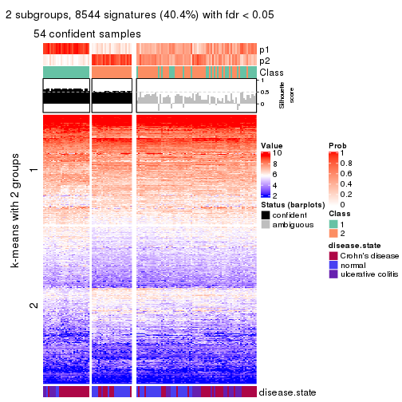</p>

</div>
<div id='tab-CV-pam-get-signatures-no-scale-2'>
<pre><code class="r">get_signatures(res, k = 3, scale_rows = FALSE)
</code></pre>

<p></p>

</div>
<div id='tab-CV-pam-get-signatures-no-scale-3'>
<pre><code class="r">get_signatures(res, k = 4, scale_rows = FALSE)
</code></pre>

<p></p>

</div>
<div id='tab-CV-pam-get-signatures-no-scale-4'>
<pre><code class="r">get_signatures(res, k = 5, scale_rows = FALSE)
</code></pre>

<p>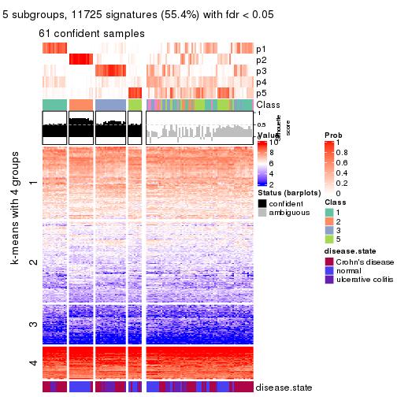</p>

</div>
<div id='tab-CV-pam-get-signatures-no-scale-5'>
<pre><code class="r">get_signatures(res, k = 6, scale_rows = FALSE)
</code></pre>

<p></p>

</div>
</div>


Compare the overlap of signatures from different k:

```r
compare_signatures(res)
```


`get_signature()` returns a data frame invisibly. TO get the list of signatures, the function
call should be assigned to a variable explicitly. In following code, if `plot` argument is set
to `FALSE`, no heatmap is plotted while only the differential analysis is performed.

```r
# code only for demonstration
tb = get_signature(res, k = ..., plot = FALSE)
```

An example of the output of `tb` is:

```
#>   which_row         fdr    mean_1    mean_2 scaled_mean_1 scaled_mean_2 km
#> 1        38 0.042760348  8.373488  9.131774    -0.5533452     0.5164555  1
#> 2        40 0.018707592  7.106213  8.469186    -0.6173731     0.5762149  1
#> 3        55 0.019134737 10.221463 11.207825    -0.6159697     0.5749050  1
#> 4        59 0.006059896  5.921854  7.869574    -0.6899429     0.6439467  1
#> 5        60 0.018055526  8.928898 10.211722    -0.6204761     0.5791110  1
#> 6        98 0.009384629 15.714769 14.887706     0.6635654    -0.6193277  2
...
```

The columns in `tb` are:

1. `which_row`: row indices corresponding to the input matrix.
2. `fdr`: FDR for the differential test. 
3. `mean_x`: The mean value in group x.
4. `scaled_mean_x`: The mean value in group x after rows are scaled.
5. `km`: Row groups if k-means clustering is applied to rows.


UMAP plot which shows how samples are separated.


<script>
$( function() {
	$( '#tabs-CV-pam-dimension-reduction' ).tabs();
} );
</script>
<div id='tabs-CV-pam-dimension-reduction'>
<ul>
<li><a href='#tab-CV-pam-dimension-reduction-1'>k = 2</a></li>
<li><a href='#tab-CV-pam-dimension-reduction-2'>k = 3</a></li>
<li><a href='#tab-CV-pam-dimension-reduction-3'>k = 4</a></li>
<li><a href='#tab-CV-pam-dimension-reduction-4'>k = 5</a></li>
<li><a href='#tab-CV-pam-dimension-reduction-5'>k = 6</a></li>
</ul>
<div id='tab-CV-pam-dimension-reduction-1'>
<pre><code class="r">dimension_reduction(res, k = 2, method = &quot;UMAP&quot;)
</code></pre>

<p></p>

</div>
<div id='tab-CV-pam-dimension-reduction-2'>
<pre><code class="r">dimension_reduction(res, k = 3, method = &quot;UMAP&quot;)
</code></pre>

<p></p>

</div>
<div id='tab-CV-pam-dimension-reduction-3'>
<pre><code class="r">dimension_reduction(res, k = 4, method = &quot;UMAP&quot;)
</code></pre>

<p></p>

</div>
<div id='tab-CV-pam-dimension-reduction-4'>
<pre><code class="r">dimension_reduction(res, k = 5, method = &quot;UMAP&quot;)
</code></pre>

<p></p>

</div>
<div id='tab-CV-pam-dimension-reduction-5'>
<pre><code class="r">dimension_reduction(res, k = 6, method = &quot;UMAP&quot;)
</code></pre>

<p></p>

</div>
</div>


Following heatmap shows how subgroups are split when increasing `k`:

```r
collect_classes(res)
```


Test correlation between subgroups and known annotations. If the known
annotation is numeric, one-way ANOVA test is applied, and if the known
annotation is discrete, chi-squared contingency table test is applied.

```r
test_to_known_factors(res)
```

```
#>         n disease.state(p) k
#> CV:pam 54         4.24e-04 2
#> CV:pam 65         7.98e-08 3
#> CV:pam 93         5.29e-09 4
#> CV:pam 61         4.35e-08 5
#> CV:pam 78         2.51e-07 6
```


If matrix rows can be associated to genes, consider to use `functional_enrichment(res,
...)` to perform function enrichment for the signature genes. See [this vignette](http://bioconductor.org/packages/devel/bioc/vignettes/cola/inst/doc/functional_enrichment.html) for more detailed explanations.


 

---------------------------------------------------


### CV:mclust


The object with results only for a single top-value method and a single partition method 
can be extracted as:

```r
res = res_list["CV", "mclust"]
# you can also extract it by
# res = res_list["CV:mclust"]
```

A summary of `res` and all the functions that can be applied to it:

```r
res
```

```
#> A 'ConsensusPartition' object with k = 2, 3, 4, 5, 6.
#>   On a matrix with 21168 rows and 127 columns.
#>   Top rows (1000, 2000, 3000, 4000, 5000) are extracted by 'CV' method.
#>   Subgroups are detected by 'mclust' method.
#>   Performed in total 1250 partitions by row resampling.
#>   Best k for subgroups seems to be 4.
#> 
#> Following methods can be applied to this 'ConsensusPartition' object:
#>  [1] "cola_report"             "collect_classes"         "collect_plots"          
#>  [4] "collect_stats"           "colnames"                "compare_signatures"     
#>  [7] "consensus_heatmap"       "dimension_reduction"     "functional_enrichment"  
#> [10] "get_anno_col"            "get_anno"                "get_classes"            
#> [13] "get_consensus"           "get_matrix"              "get_membership"         
#> [16] "get_param"               "get_signatures"          "get_stats"              
#> [19] "is_best_k"               "is_stable_k"             "membership_heatmap"     
#> [22] "ncol"                    "nrow"                    "plot_ecdf"              
#> [25] "rownames"                "select_partition_number" "show"                   
#> [28] "suggest_best_k"          "test_to_known_factors"
```

`collect_plots()` function collects all the plots made from `res` for all `k` (number of partitions)
into one single page to provide an easy and fast comparison between different `k`.

```r
collect_plots(res)
```


The plots are:

- The first row: a plot of the ECDF (empirical cumulative distribution
  function) curves of the consensus matrix for each `k` and the heatmap of
  predicted classes for each `k`.
- The second row: heatmaps of the consensus matrix for each `k`.
- The third row: heatmaps of the membership matrix for each `k`.
- The fouth row: heatmaps of the signatures for each `k`.

All the plots in panels can be made by individual functions and they are
plotted later in this section.

`select_partition_number()` produces several plots showing different
statistics for choosing "optimized" `k`. There are following statistics:

- ECDF curves of the consensus matrix for each `k`;
- 1-PAC. [The PAC
  score](https://en.wikipedia.org/wiki/Consensus_clustering#Over-interpretation_potential_of_consensus_clustering)
  measures the proportion of the ambiguous subgrouping.
- Mean silhouette score.
- Concordance. The mean probability of fiting the consensus class ids in all
  partitions.
- Area increased. Denote $A_k$ as the area under the ECDF curve for current
  `k`, the area increased is defined as $A_k - A_{k-1}$.
- Rand index. The percent of pairs of samples that are both in a same cluster
  or both are not in a same cluster in the partition of k and k-1.
- Jaccard index. The ratio of pairs of samples are both in a same cluster in
  the partition of k and k-1 and the pairs of samples are both in a same
  cluster in the partition k or k-1.

The detailed explanations of these statistics can be found in [the _cola_
vignette](http://bioconductor.org/packages/devel/bioc/vignettes/cola/inst/doc/cola.html#toc_13).

Generally speaking, lower PAC score, higher mean silhouette score or higher
concordance corresponds to better partition. Rand index and Jaccard index
measure how similar the current partition is compared to partition with `k-1`.
If they are too similar, we won't accept `k` is better than `k-1`.

```r
select_partition_number(res)
```

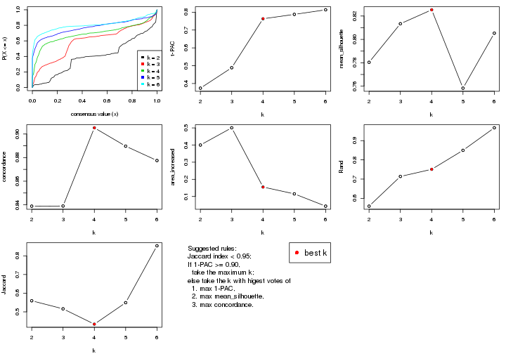

The numeric values for all these statistics can be obtained by `get_stats()`.

```r
get_stats(res)
```

```
#>   k 1-PAC mean_silhouette concordance area_increased  Rand Jaccard
#> 2 2 0.374           0.780       0.839         0.4002 0.559   0.559
#> 3 3 0.489           0.813       0.839         0.5006 0.714   0.516
#> 4 4 0.763           0.825       0.905         0.1551 0.751   0.434
#> 5 5 0.788           0.758       0.890         0.1151 0.850   0.549
#> 6 6 0.814           0.805       0.878         0.0435 0.967   0.854
```

`suggest_best_k()` suggests the best $k$ based on these statistics. The rules are as follows:

- All $k$ with Jaccard index larger than 0.95 are removed because increasing
  $k$ does not provide enough extra information. If all $k$ are removed, it is
  marked as no subgroup is detected.
- For all $k$ with 1-PAC score larger than 0.9, the maximal $k$ is taken as
  the best $k$, and other $k$ are marked as optional $k$.
- If it does not fit the second rule. The $k$ with the maximal vote of the
  highest 1-PAC score, highest mean silhouette, and highest concordance is
  taken as the best $k$.

```r
suggest_best_k(res)
```

```
#> [1] 4
```


Following shows the table of the partitions (You need to click the **show/hide
code output** link to see it). The membership matrix (columns with name `p*`)
is inferred by
[`clue::cl_consensus()`](https://www.rdocumentation.org/link/cl_consensus?package=clue)
function with the `SE` method. Basically the value in the membership matrix
represents the probability to belong to a certain group. The finall class
label for an item is determined with the group with highest probability it
belongs to.

In `get_classes()` function, the entropy is calculated from the membership
matrix and the silhouette score is calculated from the consensus matrix.


<script>
$( function() {
	$( '#tabs-CV-mclust-get-classes' ).tabs();
} );
</script>
<div id='tabs-CV-mclust-get-classes'>
<ul>
<li><a href='#tab-CV-mclust-get-classes-1'>k = 2</a></li>
<li><a href='#tab-CV-mclust-get-classes-2'>k = 3</a></li>
<li><a href='#tab-CV-mclust-get-classes-3'>k = 4</a></li>
<li><a href='#tab-CV-mclust-get-classes-4'>k = 5</a></li>
<li><a href='#tab-CV-mclust-get-classes-5'>k = 6</a></li>
</ul>

<div id='tab-CV-mclust-get-classes-1'>
<p><a id='tab-CV-mclust-get-classes-1-a' style='color:#0366d6' href='#'>show/hide code output</a></p>
<pre><code class="r">cbind(get_classes(res, k = 2), get_membership(res, k = 2))
</code></pre>

<pre><code>#&gt;          class entropy silhouette    p1    p2
#&gt; GSM76115     1  0.6438     0.7936 0.836 0.164
#&gt; GSM76116     1  0.8661     0.8690 0.712 0.288
#&gt; GSM76117     1  0.8955     0.8743 0.688 0.312
#&gt; GSM76118     1  0.8955     0.8743 0.688 0.312
#&gt; GSM76119     2  0.6712     0.7749 0.176 0.824
#&gt; GSM76120     2  0.6531     0.7761 0.168 0.832
#&gt; GSM76121     1  0.8955     0.8743 0.688 0.312
#&gt; GSM76122     1  0.8813     0.8732 0.700 0.300
#&gt; GSM76123     2  0.6531     0.7761 0.168 0.832
#&gt; GSM76124     1  0.8955     0.8743 0.688 0.312
#&gt; GSM76125     2  0.6531     0.7761 0.168 0.832
#&gt; GSM76126     2  0.6712     0.7745 0.176 0.824
#&gt; GSM76127     2  0.6531     0.7761 0.168 0.832
#&gt; GSM76128     2  0.6531     0.7761 0.168 0.832
#&gt; GSM76129     1  0.5946     0.7840 0.856 0.144
#&gt; GSM76130     2  0.6623     0.7757 0.172 0.828
#&gt; GSM76131     1  0.0376     0.6829 0.996 0.004
#&gt; GSM76132     1  0.0376     0.6829 0.996 0.004
#&gt; GSM76133     1  0.0376     0.6829 0.996 0.004
#&gt; GSM76134     1  0.5059     0.7622 0.888 0.112
#&gt; GSM76135     1  0.0376     0.6829 0.996 0.004
#&gt; GSM76136     1  0.0376     0.6829 0.996 0.004
#&gt; GSM76137     2  0.9522     0.5498 0.372 0.628
#&gt; GSM76138     1  0.7528     0.8353 0.784 0.216
#&gt; GSM76139     1  0.3879     0.7401 0.924 0.076
#&gt; GSM76140     1  0.8909     0.8748 0.692 0.308
#&gt; GSM76141     1  0.0376     0.6829 0.996 0.004
#&gt; GSM76142     1  0.0376     0.6829 0.996 0.004
#&gt; GSM76143     1  0.0376     0.6829 0.996 0.004
#&gt; GSM76144     1  0.0376     0.6829 0.996 0.004
#&gt; GSM76145     1  0.8555     0.8676 0.720 0.280
#&gt; GSM76146     1  0.0376     0.6829 0.996 0.004
#&gt; GSM76147     1  0.0938     0.6899 0.988 0.012
#&gt; GSM76148     1  0.0376     0.6829 0.996 0.004
#&gt; GSM76149     1  0.3733     0.7377 0.928 0.072
#&gt; GSM76150     1  0.4161     0.7459 0.916 0.084
#&gt; GSM76151     1  0.5946     0.7785 0.856 0.144
#&gt; GSM76152     1  0.8909     0.8748 0.692 0.308
#&gt; GSM76153     1  0.0376     0.6829 0.996 0.004
#&gt; GSM76154     1  0.2948     0.7238 0.948 0.052
#&gt; GSM76155     1  0.4431     0.7526 0.908 0.092
#&gt; GSM76156     1  0.1184     0.6934 0.984 0.016
#&gt; GSM76030     1  0.8861     0.8736 0.696 0.304
#&gt; GSM76031     1  0.8955     0.8743 0.688 0.312
#&gt; GSM76032     2  0.0000     0.8480 0.000 1.000
#&gt; GSM76033     2  0.1414     0.8433 0.020 0.980
#&gt; GSM76034     1  0.8861     0.8649 0.696 0.304
#&gt; GSM76035     2  0.0000     0.8480 0.000 1.000
#&gt; GSM76036     2  0.0000     0.8480 0.000 1.000
#&gt; GSM76037     1  0.8608     0.8670 0.716 0.284
#&gt; GSM76038     1  0.8909     0.8748 0.692 0.308
#&gt; GSM76039     1  0.8909     0.8748 0.692 0.308
#&gt; GSM76040     2  0.0000     0.8480 0.000 1.000
#&gt; GSM76041     1  0.9286     0.8437 0.656 0.344
#&gt; GSM76042     1  0.8909     0.8748 0.692 0.308
#&gt; GSM76043     1  0.9248     0.8484 0.660 0.340
#&gt; GSM76044     1  0.8955     0.8743 0.688 0.312
#&gt; GSM76045     1  0.8955     0.8743 0.688 0.312
#&gt; GSM76046     2  0.5629     0.8033 0.132 0.868
#&gt; GSM76047     1  0.9608     0.7846 0.616 0.384
#&gt; GSM76048     2  0.0000     0.8480 0.000 1.000
#&gt; GSM76049     1  0.8955     0.8743 0.688 0.312
#&gt; GSM76050     2  0.9775    -0.2499 0.412 0.588
#&gt; GSM76051     2  0.0000     0.8480 0.000 1.000
#&gt; GSM76052     2  0.0000     0.8480 0.000 1.000
#&gt; GSM76053     2  0.9732    -0.2179 0.404 0.596
#&gt; GSM76054     2  0.0000     0.8480 0.000 1.000
#&gt; GSM76055     1  0.8955     0.8743 0.688 0.312
#&gt; GSM76056     1  0.8955     0.8743 0.688 0.312
#&gt; GSM76057     1  0.8207     0.8528 0.744 0.256
#&gt; GSM76058     2  0.0000     0.8480 0.000 1.000
#&gt; GSM76059     1  0.8909     0.8748 0.692 0.308
#&gt; GSM76060     1  0.8661     0.8681 0.712 0.288
#&gt; GSM76061     1  0.7376     0.8238 0.792 0.208
#&gt; GSM76062     1  0.8909     0.8748 0.692 0.308
#&gt; GSM76063     1  0.9000     0.8501 0.684 0.316
#&gt; GSM76064     2  0.9775    -0.2301 0.412 0.588
#&gt; GSM76065     1  0.8081     0.8516 0.752 0.248
#&gt; GSM76066     2  0.9922    -0.3862 0.448 0.552
#&gt; GSM76067     2  0.0000     0.8480 0.000 1.000
#&gt; GSM76068     2  0.0000     0.8480 0.000 1.000
#&gt; GSM76069     1  0.8909     0.8748 0.692 0.308
#&gt; GSM76070     1  0.5294     0.7652 0.880 0.120
#&gt; GSM76071     1  0.8909     0.8748 0.692 0.308
#&gt; GSM76072     1  0.8909     0.8748 0.692 0.308
#&gt; GSM76073     1  0.8909     0.8748 0.692 0.308
#&gt; GSM76074     1  0.8909     0.8748 0.692 0.308
#&gt; GSM76075     2  0.0000     0.8480 0.000 1.000
#&gt; GSM76076     2  0.0000     0.8480 0.000 1.000
#&gt; GSM76077     1  0.8955     0.8743 0.688 0.312
#&gt; GSM76078     1  0.9358     0.8337 0.648 0.352
#&gt; GSM76079     1  0.8909     0.8748 0.692 0.308
#&gt; GSM76080     2  0.0672     0.8463 0.008 0.992
#&gt; GSM76081     2  0.0000     0.8480 0.000 1.000
#&gt; GSM76082     2  0.0000     0.8480 0.000 1.000
#&gt; GSM76083     2  0.0000     0.8480 0.000 1.000
#&gt; GSM76084     2  0.9775    -0.0383 0.412 0.588
#&gt; GSM76085     2  0.0000     0.8480 0.000 1.000
#&gt; GSM76086     2  0.0000     0.8480 0.000 1.000
#&gt; GSM76087     1  0.3274     0.7290 0.940 0.060
#&gt; GSM76088     1  0.8861     0.8738 0.696 0.304
#&gt; GSM76089     1  0.7376     0.8232 0.792 0.208
#&gt; GSM76090     2  0.0000     0.8480 0.000 1.000
#&gt; GSM76091     1  0.8909     0.8748 0.692 0.308
#&gt; GSM76092     1  0.8909     0.8748 0.692 0.308
#&gt; GSM76093     1  0.8909     0.8748 0.692 0.308
#&gt; GSM76094     1  0.8955     0.8743 0.688 0.312
#&gt; GSM76095     1  0.8909     0.8748 0.692 0.308
#&gt; GSM76096     1  0.8955     0.8743 0.688 0.312
#&gt; GSM76097     1  0.8955     0.8743 0.688 0.312
#&gt; GSM76098     2  0.3584     0.8271 0.068 0.932
#&gt; GSM76099     1  0.8909     0.8748 0.692 0.308
#&gt; GSM76100     1  0.8909     0.8748 0.692 0.308
#&gt; GSM76101     1  0.8909     0.8748 0.692 0.308
#&gt; GSM76102     1  0.8955     0.8743 0.688 0.312
#&gt; GSM76103     2  0.0000     0.8480 0.000 1.000
#&gt; GSM76104     2  0.3733     0.8255 0.072 0.928
#&gt; GSM76105     1  0.8955     0.8743 0.688 0.312
#&gt; GSM76106     2  0.5629     0.7970 0.132 0.868
#&gt; GSM76107     2  0.6623     0.7757 0.172 0.828
#&gt; GSM76108     1  0.8955     0.8743 0.688 0.312
#&gt; GSM76109     1  0.8909     0.8748 0.692 0.308
#&gt; GSM76110     1  0.8909     0.8748 0.692 0.308
#&gt; GSM76111     1  0.8909     0.8748 0.692 0.308
#&gt; GSM76112     1  0.8909     0.8748 0.692 0.308
#&gt; GSM76113     1  0.8955     0.8743 0.688 0.312
#&gt; GSM76114     1  0.8909     0.8748 0.692 0.308
</code></pre>

<script>
$('#tab-CV-mclust-get-classes-1-a').parent().next().next().hide();
$('#tab-CV-mclust-get-classes-1-a').click(function(){
  $('#tab-CV-mclust-get-classes-1-a').parent().next().next().toggle();
  return(false);
});
</script>
</div>

<div id='tab-CV-mclust-get-classes-2'>
<p><a id='tab-CV-mclust-get-classes-2-a' style='color:#0366d6' href='#'>show/hide code output</a></p>
<pre><code class="r">cbind(get_classes(res, k = 3), get_membership(res, k = 3))
</code></pre>

<pre><code>#&gt;          class entropy silhouette    p1    p2    p3
#&gt; GSM76115     2  0.1453      0.816 0.024 0.968 0.008
#&gt; GSM76116     2  0.1411      0.819 0.036 0.964 0.000
#&gt; GSM76117     2  0.1643      0.817 0.044 0.956 0.000
#&gt; GSM76118     2  0.1529      0.818 0.040 0.960 0.000
#&gt; GSM76119     3  0.6482      0.959 0.024 0.296 0.680
#&gt; GSM76120     3  0.6507      0.970 0.028 0.284 0.688
#&gt; GSM76121     2  0.1964      0.813 0.056 0.944 0.000
#&gt; GSM76122     2  0.1529      0.818 0.040 0.960 0.000
#&gt; GSM76123     3  0.6507      0.970 0.028 0.284 0.688
#&gt; GSM76124     2  0.1529      0.818 0.040 0.960 0.000
#&gt; GSM76125     3  0.6507      0.970 0.028 0.284 0.688
#&gt; GSM76126     3  0.6570      0.963 0.028 0.292 0.680
#&gt; GSM76127     3  0.6507      0.970 0.028 0.284 0.688
#&gt; GSM76128     3  0.6388      0.972 0.024 0.284 0.692
#&gt; GSM76129     2  0.1170      0.820 0.016 0.976 0.008
#&gt; GSM76130     3  0.6507      0.970 0.028 0.284 0.688
#&gt; GSM76131     2  0.5553      0.696 0.004 0.724 0.272
#&gt; GSM76132     2  0.5553      0.696 0.004 0.724 0.272
#&gt; GSM76133     2  0.5553      0.696 0.004 0.724 0.272
#&gt; GSM76134     2  0.2116      0.819 0.012 0.948 0.040
#&gt; GSM76135     2  0.5775      0.705 0.012 0.728 0.260
#&gt; GSM76136     2  0.5553      0.696 0.004 0.724 0.272
#&gt; GSM76137     2  0.6129      0.280 0.016 0.700 0.284
#&gt; GSM76138     2  0.1163      0.819 0.028 0.972 0.000
#&gt; GSM76139     2  0.4963      0.744 0.008 0.792 0.200
#&gt; GSM76140     1  0.6111      0.401 0.604 0.396 0.000
#&gt; GSM76141     2  0.5517      0.699 0.004 0.728 0.268
#&gt; GSM76142     2  0.5553      0.696 0.004 0.724 0.272
#&gt; GSM76143     2  0.5553      0.696 0.004 0.724 0.272
#&gt; GSM76144     2  0.5553      0.696 0.004 0.724 0.272
#&gt; GSM76145     2  0.1774      0.809 0.016 0.960 0.024
#&gt; GSM76146     2  0.5578      0.719 0.012 0.748 0.240
#&gt; GSM76147     2  0.4261      0.779 0.012 0.848 0.140
#&gt; GSM76148     2  0.5553      0.696 0.004 0.724 0.272
#&gt; GSM76149     2  0.2939      0.813 0.012 0.916 0.072
#&gt; GSM76150     2  0.3031      0.811 0.012 0.912 0.076
#&gt; GSM76151     2  0.1337      0.817 0.016 0.972 0.012
#&gt; GSM76152     1  0.1411      0.815 0.964 0.036 0.000
#&gt; GSM76153     2  0.5517      0.699 0.004 0.728 0.268
#&gt; GSM76154     2  0.3129      0.805 0.008 0.904 0.088
#&gt; GSM76155     2  0.1636      0.822 0.016 0.964 0.020
#&gt; GSM76156     2  0.5220      0.740 0.012 0.780 0.208
#&gt; GSM76030     2  0.3888      0.747 0.064 0.888 0.048
#&gt; GSM76031     1  0.3752      0.810 0.856 0.144 0.000
#&gt; GSM76032     3  0.6062      0.976 0.016 0.276 0.708
#&gt; GSM76033     3  0.5588      0.981 0.004 0.276 0.720
#&gt; GSM76034     2  0.1905      0.801 0.016 0.956 0.028
#&gt; GSM76035     3  0.6062      0.978 0.016 0.276 0.708
#&gt; GSM76036     3  0.5553      0.979 0.004 0.272 0.724
#&gt; GSM76037     2  0.1411      0.819 0.036 0.964 0.000
#&gt; GSM76038     1  0.4346      0.798 0.816 0.184 0.000
#&gt; GSM76039     2  0.4235      0.740 0.176 0.824 0.000
#&gt; GSM76040     3  0.5763      0.980 0.008 0.276 0.716
#&gt; GSM76041     1  0.6143      0.750 0.720 0.256 0.024
#&gt; GSM76042     2  0.5397      0.503 0.280 0.720 0.000
#&gt; GSM76043     1  0.6570      0.711 0.680 0.292 0.028
#&gt; GSM76044     2  0.1753      0.815 0.048 0.952 0.000
#&gt; GSM76045     1  0.5254      0.760 0.736 0.264 0.000
#&gt; GSM76046     3  0.5690      0.976 0.004 0.288 0.708
#&gt; GSM76047     1  0.6420      0.716 0.688 0.288 0.024
#&gt; GSM76048     3  0.5588      0.981 0.004 0.276 0.720
#&gt; GSM76049     1  0.6111      0.608 0.604 0.396 0.000
#&gt; GSM76050     1  0.7003      0.718 0.692 0.248 0.060
#&gt; GSM76051     3  0.5553      0.979 0.004 0.272 0.724
#&gt; GSM76052     3  0.5588      0.981 0.004 0.276 0.720
#&gt; GSM76053     2  0.5899      0.401 0.020 0.736 0.244
#&gt; GSM76054     3  0.5553      0.979 0.004 0.272 0.724
#&gt; GSM76055     2  0.1643      0.819 0.044 0.956 0.000
#&gt; GSM76056     1  0.5431      0.751 0.716 0.284 0.000
#&gt; GSM76057     1  0.5902      0.723 0.680 0.316 0.004
#&gt; GSM76058     3  0.5553      0.979 0.004 0.272 0.724
#&gt; GSM76059     1  0.0747      0.806 0.984 0.016 0.000
#&gt; GSM76060     1  0.5902      0.723 0.680 0.316 0.004
#&gt; GSM76061     1  0.6008      0.711 0.664 0.332 0.004
#&gt; GSM76062     1  0.1129      0.809 0.976 0.020 0.004
#&gt; GSM76063     2  0.3995      0.688 0.016 0.868 0.116
#&gt; GSM76064     1  0.6976      0.723 0.700 0.236 0.064
#&gt; GSM76065     2  0.1647      0.821 0.036 0.960 0.004
#&gt; GSM76066     1  0.6578      0.746 0.724 0.224 0.052
#&gt; GSM76067     3  0.5728      0.979 0.008 0.272 0.720
#&gt; GSM76068     3  0.5553      0.979 0.004 0.272 0.724
#&gt; GSM76069     1  0.2625      0.816 0.916 0.084 0.000
#&gt; GSM76070     2  0.2599      0.818 0.016 0.932 0.052
#&gt; GSM76071     1  0.1129      0.809 0.976 0.020 0.004
#&gt; GSM76072     1  0.1267      0.811 0.972 0.024 0.004
#&gt; GSM76073     1  0.1031      0.808 0.976 0.024 0.000
#&gt; GSM76074     1  0.2448      0.812 0.924 0.076 0.000
#&gt; GSM76075     3  0.5763      0.980 0.008 0.276 0.716
#&gt; GSM76076     3  0.5553      0.979 0.004 0.272 0.724
#&gt; GSM76077     1  0.5497      0.744 0.708 0.292 0.000
#&gt; GSM76078     1  0.6541      0.707 0.672 0.304 0.024
#&gt; GSM76079     1  0.0747      0.806 0.984 0.016 0.000
#&gt; GSM76080     3  0.5588      0.980 0.004 0.276 0.720
#&gt; GSM76081     3  0.5553      0.979 0.004 0.272 0.724
#&gt; GSM76082     3  0.5553      0.979 0.004 0.272 0.724
#&gt; GSM76083     3  0.5553      0.979 0.004 0.272 0.724
#&gt; GSM76084     2  0.5881      0.357 0.016 0.728 0.256
#&gt; GSM76085     3  0.5588      0.981 0.004 0.276 0.720
#&gt; GSM76086     3  0.5728      0.979 0.008 0.272 0.720
#&gt; GSM76087     2  0.3120      0.813 0.012 0.908 0.080
#&gt; GSM76088     1  0.5815      0.725 0.692 0.304 0.004
#&gt; GSM76089     2  0.0892      0.818 0.020 0.980 0.000
#&gt; GSM76090     3  0.5728      0.981 0.008 0.272 0.720
#&gt; GSM76091     1  0.1031      0.811 0.976 0.024 0.000
#&gt; GSM76092     1  0.0892      0.806 0.980 0.020 0.000
#&gt; GSM76093     1  0.0747      0.806 0.984 0.016 0.000
#&gt; GSM76094     2  0.1529      0.818 0.040 0.960 0.000
#&gt; GSM76095     1  0.4974      0.783 0.764 0.236 0.000
#&gt; GSM76096     2  0.1753      0.816 0.048 0.952 0.000
#&gt; GSM76097     2  0.1643      0.818 0.044 0.956 0.000
#&gt; GSM76098     3  0.6096      0.974 0.016 0.280 0.704
#&gt; GSM76099     1  0.2066      0.817 0.940 0.060 0.000
#&gt; GSM76100     1  0.3340      0.804 0.880 0.120 0.000
#&gt; GSM76101     1  0.0892      0.806 0.980 0.020 0.000
#&gt; GSM76102     2  0.1964      0.813 0.056 0.944 0.000
#&gt; GSM76103     3  0.6665      0.961 0.036 0.276 0.688
#&gt; GSM76104     3  0.6062      0.975 0.016 0.276 0.708
#&gt; GSM76105     2  0.1529      0.818 0.040 0.960 0.000
#&gt; GSM76106     3  0.6129      0.973 0.016 0.284 0.700
#&gt; GSM76107     3  0.6507      0.970 0.028 0.284 0.688
#&gt; GSM76108     2  0.1529      0.818 0.040 0.960 0.000
#&gt; GSM76109     1  0.0892      0.806 0.980 0.020 0.000
#&gt; GSM76110     1  0.1163      0.810 0.972 0.028 0.000
#&gt; GSM76111     1  0.3340      0.817 0.880 0.120 0.000
#&gt; GSM76112     1  0.1774      0.805 0.960 0.016 0.024
#&gt; GSM76113     1  0.7534      0.506 0.532 0.428 0.040
#&gt; GSM76114     1  0.2165      0.819 0.936 0.064 0.000
</code></pre>

<script>
$('#tab-CV-mclust-get-classes-2-a').parent().next().next().hide();
$('#tab-CV-mclust-get-classes-2-a').click(function(){
  $('#tab-CV-mclust-get-classes-2-a').parent().next().next().toggle();
  return(false);
});
</script>
</div>

<div id='tab-CV-mclust-get-classes-3'>
<p><a id='tab-CV-mclust-get-classes-3-a' style='color:#0366d6' href='#'>show/hide code output</a></p>
<pre><code class="r">cbind(get_classes(res, k = 4), get_membership(res, k = 4))
</code></pre>

<pre><code>#&gt;          class entropy silhouette    p1    p2    p3    p4
#&gt; GSM76115     2  0.3442      0.860 0.084 0.876 0.028 0.012
#&gt; GSM76116     2  0.4359      0.787 0.164 0.804 0.016 0.016
#&gt; GSM76117     1  0.2718      0.851 0.912 0.056 0.020 0.012
#&gt; GSM76118     1  0.5355      0.608 0.692 0.276 0.016 0.016
#&gt; GSM76119     4  0.1936      0.984 0.000 0.032 0.028 0.940
#&gt; GSM76120     4  0.2036      0.985 0.000 0.032 0.032 0.936
#&gt; GSM76121     1  0.2188      0.864 0.936 0.032 0.012 0.020
#&gt; GSM76122     1  0.5292      0.645 0.712 0.252 0.016 0.020
#&gt; GSM76123     4  0.2036      0.985 0.000 0.032 0.032 0.936
#&gt; GSM76124     1  0.5953      0.241 0.548 0.420 0.012 0.020
#&gt; GSM76125     4  0.2123      0.982 0.004 0.032 0.028 0.936
#&gt; GSM76126     4  0.4175      0.905 0.016 0.084 0.056 0.844
#&gt; GSM76127     4  0.2036      0.985 0.000 0.032 0.032 0.936
#&gt; GSM76128     4  0.2036      0.985 0.000 0.032 0.032 0.936
#&gt; GSM76129     2  0.1820      0.886 0.036 0.944 0.020 0.000
#&gt; GSM76130     4  0.1936      0.984 0.000 0.032 0.028 0.940
#&gt; GSM76131     2  0.1022      0.871 0.000 0.968 0.000 0.032
#&gt; GSM76132     2  0.1022      0.871 0.000 0.968 0.000 0.032
#&gt; GSM76133     2  0.1022      0.871 0.000 0.968 0.000 0.032
#&gt; GSM76134     2  0.1631      0.886 0.016 0.956 0.020 0.008
#&gt; GSM76135     2  0.1022      0.871 0.000 0.968 0.000 0.032
#&gt; GSM76136     2  0.1022      0.871 0.000 0.968 0.000 0.032
#&gt; GSM76137     2  0.2384      0.881 0.016 0.928 0.040 0.016
#&gt; GSM76138     2  0.2364      0.883 0.036 0.928 0.028 0.008
#&gt; GSM76139     2  0.1022      0.871 0.000 0.968 0.000 0.032
#&gt; GSM76140     1  0.0712      0.880 0.984 0.004 0.004 0.008
#&gt; GSM76141     2  0.1022      0.871 0.000 0.968 0.000 0.032
#&gt; GSM76142     2  0.1022      0.871 0.000 0.968 0.000 0.032
#&gt; GSM76143     2  0.1022      0.871 0.000 0.968 0.000 0.032
#&gt; GSM76144     2  0.1022      0.871 0.000 0.968 0.000 0.032
#&gt; GSM76145     2  0.3556      0.843 0.020 0.864 0.104 0.012
#&gt; GSM76146     2  0.1256      0.876 0.000 0.964 0.008 0.028
#&gt; GSM76147     2  0.0524      0.880 0.000 0.988 0.008 0.004
#&gt; GSM76148     2  0.1022      0.871 0.000 0.968 0.000 0.032
#&gt; GSM76149     2  0.1516      0.887 0.016 0.960 0.016 0.008
#&gt; GSM76150     2  0.1516      0.887 0.016 0.960 0.016 0.008
#&gt; GSM76151     2  0.1516      0.887 0.016 0.960 0.016 0.008
#&gt; GSM76152     1  0.0000      0.881 1.000 0.000 0.000 0.000
#&gt; GSM76153     2  0.1022      0.871 0.000 0.968 0.000 0.032
#&gt; GSM76154     2  0.1631      0.886 0.016 0.956 0.020 0.008
#&gt; GSM76155     2  0.1631      0.886 0.016 0.956 0.020 0.008
#&gt; GSM76156     2  0.0707      0.875 0.000 0.980 0.000 0.020
#&gt; GSM76030     2  0.2781      0.868 0.016 0.904 0.072 0.008
#&gt; GSM76031     1  0.1174      0.875 0.968 0.012 0.020 0.000
#&gt; GSM76032     3  0.1114      0.899 0.016 0.008 0.972 0.004
#&gt; GSM76033     3  0.1796      0.888 0.016 0.032 0.948 0.004
#&gt; GSM76034     2  0.4464      0.827 0.100 0.824 0.064 0.012
#&gt; GSM76035     3  0.1598      0.895 0.020 0.020 0.956 0.004
#&gt; GSM76036     3  0.0524      0.893 0.008 0.000 0.988 0.004
#&gt; GSM76037     2  0.3933      0.820 0.132 0.836 0.024 0.008
#&gt; GSM76038     1  0.1362      0.873 0.964 0.012 0.020 0.004
#&gt; GSM76039     1  0.0657      0.879 0.984 0.004 0.000 0.012
#&gt; GSM76040     3  0.0804      0.900 0.012 0.008 0.980 0.000
#&gt; GSM76041     1  0.4008      0.644 0.756 0.000 0.244 0.000
#&gt; GSM76042     1  0.1114      0.877 0.972 0.008 0.016 0.004
#&gt; GSM76043     1  0.5593      0.654 0.708 0.080 0.212 0.000
#&gt; GSM76044     1  0.2874      0.848 0.904 0.064 0.012 0.020
#&gt; GSM76045     1  0.0657      0.879 0.984 0.004 0.012 0.000
#&gt; GSM76046     3  0.3544      0.843 0.016 0.036 0.876 0.072
#&gt; GSM76047     1  0.4933      0.573 0.688 0.016 0.296 0.000
#&gt; GSM76048     3  0.1369      0.897 0.016 0.016 0.964 0.004
#&gt; GSM76049     2  0.4376      0.791 0.172 0.796 0.028 0.004
#&gt; GSM76050     3  0.4941      0.253 0.436 0.000 0.564 0.000
#&gt; GSM76051     3  0.0469      0.881 0.000 0.000 0.988 0.012
#&gt; GSM76052     3  0.1484      0.896 0.016 0.020 0.960 0.004
#&gt; GSM76053     1  0.7679      0.336 0.504 0.172 0.312 0.012
#&gt; GSM76054     3  0.0376      0.890 0.004 0.000 0.992 0.004
#&gt; GSM76055     2  0.5882      0.208 0.436 0.536 0.012 0.016
#&gt; GSM76056     1  0.5386      0.436 0.632 0.344 0.024 0.000
#&gt; GSM76057     2  0.2958      0.869 0.072 0.896 0.028 0.004
#&gt; GSM76058     3  0.0592      0.900 0.016 0.000 0.984 0.000
#&gt; GSM76059     1  0.0000      0.881 1.000 0.000 0.000 0.000
#&gt; GSM76060     2  0.3544      0.859 0.076 0.872 0.044 0.008
#&gt; GSM76061     2  0.2546      0.880 0.044 0.920 0.028 0.008
#&gt; GSM76062     1  0.0000      0.881 1.000 0.000 0.000 0.000
#&gt; GSM76063     2  0.4821      0.693 0.016 0.740 0.236 0.008
#&gt; GSM76064     3  0.4372      0.608 0.268 0.004 0.728 0.000
#&gt; GSM76065     2  0.3663      0.833 0.120 0.852 0.020 0.008
#&gt; GSM76066     3  0.2530      0.824 0.112 0.000 0.888 0.000
#&gt; GSM76067     3  0.0592      0.900 0.016 0.000 0.984 0.000
#&gt; GSM76068     3  0.0469      0.881 0.000 0.000 0.988 0.012
#&gt; GSM76069     1  0.0188      0.880 0.996 0.004 0.000 0.000
#&gt; GSM76070     2  0.3144      0.863 0.016 0.892 0.072 0.020
#&gt; GSM76071     1  0.0000      0.881 1.000 0.000 0.000 0.000
#&gt; GSM76072     1  0.0000      0.881 1.000 0.000 0.000 0.000
#&gt; GSM76073     1  0.0000      0.881 1.000 0.000 0.000 0.000
#&gt; GSM76074     1  0.0000      0.881 1.000 0.000 0.000 0.000
#&gt; GSM76075     3  0.0779      0.900 0.016 0.004 0.980 0.000
#&gt; GSM76076     3  0.0469      0.881 0.000 0.000 0.988 0.012
#&gt; GSM76077     2  0.5403      0.504 0.348 0.628 0.024 0.000
#&gt; GSM76078     3  0.5245      0.441 0.016 0.320 0.660 0.004
#&gt; GSM76079     1  0.0000      0.881 1.000 0.000 0.000 0.000
#&gt; GSM76080     3  0.1943      0.886 0.016 0.032 0.944 0.008
#&gt; GSM76081     3  0.1151      0.897 0.008 0.024 0.968 0.000
#&gt; GSM76082     3  0.0469      0.881 0.000 0.000 0.988 0.012
#&gt; GSM76083     3  0.0469      0.881 0.000 0.000 0.988 0.012
#&gt; GSM76084     3  0.6034      0.216 0.016 0.408 0.556 0.020
#&gt; GSM76085     3  0.0927      0.900 0.016 0.008 0.976 0.000
#&gt; GSM76086     3  0.0592      0.900 0.016 0.000 0.984 0.000
#&gt; GSM76087     2  0.1762      0.886 0.016 0.952 0.020 0.012
#&gt; GSM76088     2  0.4462      0.786 0.180 0.788 0.028 0.004
#&gt; GSM76089     2  0.2039      0.883 0.016 0.940 0.036 0.008
#&gt; GSM76090     3  0.0592      0.900 0.016 0.000 0.984 0.000
#&gt; GSM76091     1  0.0000      0.881 1.000 0.000 0.000 0.000
#&gt; GSM76092     1  0.0000      0.881 1.000 0.000 0.000 0.000
#&gt; GSM76093     1  0.0000      0.881 1.000 0.000 0.000 0.000
#&gt; GSM76094     1  0.5473      0.570 0.672 0.296 0.012 0.020
#&gt; GSM76095     1  0.4923      0.620 0.716 0.264 0.008 0.012
#&gt; GSM76096     1  0.2284      0.861 0.932 0.036 0.020 0.012
#&gt; GSM76097     1  0.2074      0.867 0.940 0.032 0.012 0.016
#&gt; GSM76098     3  0.2074      0.885 0.016 0.032 0.940 0.012
#&gt; GSM76099     1  0.0000      0.881 1.000 0.000 0.000 0.000
#&gt; GSM76100     1  0.0564      0.880 0.988 0.004 0.004 0.004
#&gt; GSM76101     1  0.0000      0.881 1.000 0.000 0.000 0.000
#&gt; GSM76102     1  0.2188      0.864 0.936 0.032 0.012 0.020
#&gt; GSM76103     3  0.0592      0.900 0.016 0.000 0.984 0.000
#&gt; GSM76104     3  0.2981      0.865 0.016 0.032 0.904 0.048
#&gt; GSM76105     1  0.2684      0.853 0.912 0.060 0.012 0.016
#&gt; GSM76106     3  0.2895      0.868 0.016 0.032 0.908 0.044
#&gt; GSM76107     4  0.2123      0.982 0.004 0.032 0.028 0.936
#&gt; GSM76108     1  0.2761      0.850 0.908 0.064 0.012 0.016
#&gt; GSM76109     1  0.0000      0.881 1.000 0.000 0.000 0.000
#&gt; GSM76110     1  0.0000      0.881 1.000 0.000 0.000 0.000
#&gt; GSM76111     1  0.0000      0.881 1.000 0.000 0.000 0.000
#&gt; GSM76112     1  0.3528      0.718 0.808 0.000 0.192 0.000
#&gt; GSM76113     2  0.6962      0.577 0.180 0.616 0.196 0.008
#&gt; GSM76114     1  0.0000      0.881 1.000 0.000 0.000 0.000
</code></pre>

<script>
$('#tab-CV-mclust-get-classes-3-a').parent().next().next().hide();
$('#tab-CV-mclust-get-classes-3-a').click(function(){
  $('#tab-CV-mclust-get-classes-3-a').parent().next().next().toggle();
  return(false);
});
</script>
</div>

<div id='tab-CV-mclust-get-classes-4'>
<p><a id='tab-CV-mclust-get-classes-4-a' style='color:#0366d6' href='#'>show/hide code output</a></p>
<pre><code class="r">cbind(get_classes(res, k = 5), get_membership(res, k = 5))
</code></pre>

<pre><code>#&gt;          class entropy silhouette    p1    p2    p3    p4    p5
#&gt; GSM76115     5  0.5318     0.4259 0.000 0.316 0.032 0.024 0.628
#&gt; GSM76116     5  0.4452    -0.1651 0.000 0.496 0.004 0.000 0.500
#&gt; GSM76117     5  0.1725     0.7878 0.044 0.000 0.020 0.000 0.936
#&gt; GSM76118     5  0.1393     0.7925 0.024 0.012 0.008 0.000 0.956
#&gt; GSM76119     4  0.0000     0.9747 0.000 0.000 0.000 1.000 0.000
#&gt; GSM76120     4  0.0000     0.9747 0.000 0.000 0.000 1.000 0.000
#&gt; GSM76121     5  0.0794     0.7974 0.028 0.000 0.000 0.000 0.972
#&gt; GSM76122     5  0.1243     0.7949 0.028 0.000 0.004 0.008 0.960
#&gt; GSM76123     4  0.0000     0.9747 0.000 0.000 0.000 1.000 0.000
#&gt; GSM76124     5  0.1211     0.7857 0.016 0.024 0.000 0.000 0.960
#&gt; GSM76125     4  0.0000     0.9747 0.000 0.000 0.000 1.000 0.000
#&gt; GSM76126     4  0.2854     0.8736 0.000 0.084 0.028 0.880 0.008
#&gt; GSM76127     4  0.0000     0.9747 0.000 0.000 0.000 1.000 0.000
#&gt; GSM76128     4  0.1270     0.9219 0.000 0.000 0.052 0.948 0.000
#&gt; GSM76129     5  0.4538     0.2111 0.000 0.452 0.000 0.008 0.540
#&gt; GSM76130     4  0.0000     0.9747 0.000 0.000 0.000 1.000 0.000
#&gt; GSM76131     2  0.0000     0.8692 0.000 1.000 0.000 0.000 0.000
#&gt; GSM76132     2  0.0000     0.8692 0.000 1.000 0.000 0.000 0.000
#&gt; GSM76133     2  0.0000     0.8692 0.000 1.000 0.000 0.000 0.000
#&gt; GSM76134     2  0.1074     0.8664 0.000 0.968 0.012 0.016 0.004
#&gt; GSM76135     2  0.0000     0.8692 0.000 1.000 0.000 0.000 0.000
#&gt; GSM76136     2  0.0000     0.8692 0.000 1.000 0.000 0.000 0.000
#&gt; GSM76137     2  0.1471     0.8618 0.000 0.952 0.024 0.020 0.004
#&gt; GSM76138     2  0.4323     0.6859 0.000 0.744 0.024 0.012 0.220
#&gt; GSM76139     2  0.0000     0.8692 0.000 1.000 0.000 0.000 0.000
#&gt; GSM76140     5  0.3452     0.6212 0.244 0.000 0.000 0.000 0.756
#&gt; GSM76141     2  0.0000     0.8692 0.000 1.000 0.000 0.000 0.000
#&gt; GSM76142     2  0.0000     0.8692 0.000 1.000 0.000 0.000 0.000
#&gt; GSM76143     2  0.0000     0.8692 0.000 1.000 0.000 0.000 0.000
#&gt; GSM76144     2  0.0000     0.8692 0.000 1.000 0.000 0.000 0.000
#&gt; GSM76145     2  0.3552     0.7657 0.000 0.812 0.164 0.012 0.012
#&gt; GSM76146     2  0.0000     0.8692 0.000 1.000 0.000 0.000 0.000
#&gt; GSM76147     2  0.0000     0.8692 0.000 1.000 0.000 0.000 0.000
#&gt; GSM76148     2  0.0000     0.8692 0.000 1.000 0.000 0.000 0.000
#&gt; GSM76149     2  0.1018     0.8662 0.000 0.968 0.016 0.016 0.000
#&gt; GSM76150     2  0.1278     0.8647 0.000 0.960 0.016 0.020 0.004
#&gt; GSM76151     2  0.1074     0.8664 0.000 0.968 0.012 0.016 0.004
#&gt; GSM76152     1  0.0404     0.8821 0.988 0.000 0.000 0.000 0.012
#&gt; GSM76153     2  0.0000     0.8692 0.000 1.000 0.000 0.000 0.000
#&gt; GSM76154     2  0.1267     0.8643 0.000 0.960 0.024 0.012 0.004
#&gt; GSM76155     2  0.1306     0.8653 0.000 0.960 0.016 0.016 0.008
#&gt; GSM76156     2  0.0000     0.8692 0.000 1.000 0.000 0.000 0.000
#&gt; GSM76030     2  0.3333     0.7322 0.000 0.788 0.208 0.000 0.004
#&gt; GSM76031     1  0.2625     0.8073 0.876 0.000 0.016 0.000 0.108
#&gt; GSM76032     3  0.0000     0.9026 0.000 0.000 1.000 0.000 0.000
#&gt; GSM76033     3  0.0000     0.9026 0.000 0.000 1.000 0.000 0.000
#&gt; GSM76034     2  0.4985     0.7160 0.000 0.740 0.068 0.028 0.164
#&gt; GSM76035     3  0.0162     0.9002 0.004 0.000 0.996 0.000 0.000
#&gt; GSM76036     3  0.0000     0.9026 0.000 0.000 1.000 0.000 0.000
#&gt; GSM76037     2  0.4138     0.4321 0.000 0.616 0.000 0.000 0.384
#&gt; GSM76038     1  0.3085     0.7970 0.852 0.000 0.032 0.000 0.116
#&gt; GSM76039     5  0.1732     0.7787 0.080 0.000 0.000 0.000 0.920
#&gt; GSM76040     3  0.0000     0.9026 0.000 0.000 1.000 0.000 0.000
#&gt; GSM76041     1  0.2124     0.8132 0.900 0.000 0.096 0.000 0.004
#&gt; GSM76042     5  0.3274     0.6489 0.220 0.000 0.000 0.000 0.780
#&gt; GSM76043     3  0.5233     0.5936 0.192 0.000 0.680 0.000 0.128
#&gt; GSM76044     5  0.0880     0.7973 0.032 0.000 0.000 0.000 0.968
#&gt; GSM76045     1  0.4481     0.6299 0.720 0.000 0.048 0.000 0.232
#&gt; GSM76046     3  0.1697     0.8620 0.000 0.000 0.932 0.060 0.008
#&gt; GSM76047     3  0.6037     0.0999 0.392 0.000 0.488 0.000 0.120
#&gt; GSM76048     3  0.0000     0.9026 0.000 0.000 1.000 0.000 0.000
#&gt; GSM76049     2  0.7955    -0.0535 0.164 0.384 0.116 0.000 0.336
#&gt; GSM76050     1  0.2230     0.7999 0.884 0.000 0.116 0.000 0.000
#&gt; GSM76051     3  0.0000     0.9026 0.000 0.000 1.000 0.000 0.000
#&gt; GSM76052     3  0.0000     0.9026 0.000 0.000 1.000 0.000 0.000
#&gt; GSM76053     3  0.5806     0.2731 0.036 0.016 0.552 0.012 0.384
#&gt; GSM76054     3  0.0000     0.9026 0.000 0.000 1.000 0.000 0.000
#&gt; GSM76055     5  0.0992     0.7846 0.008 0.024 0.000 0.000 0.968
#&gt; GSM76056     5  0.5707     0.0677 0.444 0.028 0.032 0.000 0.496
#&gt; GSM76057     2  0.6733     0.3119 0.076 0.536 0.072 0.000 0.316
#&gt; GSM76058     3  0.0000     0.9026 0.000 0.000 1.000 0.000 0.000
#&gt; GSM76059     1  0.0404     0.8827 0.988 0.000 0.000 0.000 0.012
#&gt; GSM76060     3  0.6179     0.3748 0.052 0.312 0.580 0.000 0.056
#&gt; GSM76061     2  0.2740     0.8310 0.004 0.888 0.044 0.000 0.064
#&gt; GSM76062     1  0.0000     0.8785 1.000 0.000 0.000 0.000 0.000
#&gt; GSM76063     2  0.3462     0.7404 0.000 0.792 0.196 0.012 0.000
#&gt; GSM76064     3  0.3491     0.6722 0.228 0.000 0.768 0.000 0.004
#&gt; GSM76065     2  0.3109     0.7312 0.000 0.800 0.000 0.000 0.200
#&gt; GSM76066     1  0.2891     0.7331 0.824 0.000 0.176 0.000 0.000
#&gt; GSM76067     3  0.0000     0.9026 0.000 0.000 1.000 0.000 0.000
#&gt; GSM76068     3  0.0000     0.9026 0.000 0.000 1.000 0.000 0.000
#&gt; GSM76069     1  0.4045     0.3980 0.644 0.000 0.000 0.000 0.356
#&gt; GSM76070     2  0.2521     0.8370 0.000 0.900 0.068 0.024 0.008
#&gt; GSM76071     1  0.0404     0.8827 0.988 0.000 0.000 0.000 0.012
#&gt; GSM76072     1  0.0510     0.8820 0.984 0.000 0.000 0.000 0.016
#&gt; GSM76073     1  0.0404     0.8827 0.988 0.000 0.000 0.000 0.012
#&gt; GSM76074     1  0.0510     0.8820 0.984 0.000 0.000 0.000 0.016
#&gt; GSM76075     3  0.0000     0.9026 0.000 0.000 1.000 0.000 0.000
#&gt; GSM76076     3  0.0000     0.9026 0.000 0.000 1.000 0.000 0.000
#&gt; GSM76077     5  0.7271     0.1015 0.364 0.192 0.036 0.000 0.408
#&gt; GSM76078     3  0.2906     0.8072 0.012 0.080 0.880 0.000 0.028
#&gt; GSM76079     1  0.0290     0.8745 0.992 0.000 0.000 0.000 0.008
#&gt; GSM76080     3  0.0290     0.8980 0.000 0.000 0.992 0.008 0.000
#&gt; GSM76081     3  0.0000     0.9026 0.000 0.000 1.000 0.000 0.000
#&gt; GSM76082     3  0.0000     0.9026 0.000 0.000 1.000 0.000 0.000
#&gt; GSM76083     3  0.0000     0.9026 0.000 0.000 1.000 0.000 0.000
#&gt; GSM76084     2  0.4981     0.3344 0.000 0.560 0.412 0.024 0.004
#&gt; GSM76085     3  0.0000     0.9026 0.000 0.000 1.000 0.000 0.000
#&gt; GSM76086     3  0.0000     0.9026 0.000 0.000 1.000 0.000 0.000
#&gt; GSM76087     2  0.0865     0.8657 0.000 0.972 0.004 0.024 0.000
#&gt; GSM76088     2  0.8514    -0.1472 0.280 0.292 0.180 0.000 0.248
#&gt; GSM76089     2  0.1774     0.8516 0.000 0.932 0.052 0.000 0.016
#&gt; GSM76090     3  0.0000     0.9026 0.000 0.000 1.000 0.000 0.000
#&gt; GSM76091     1  0.0162     0.8767 0.996 0.000 0.000 0.000 0.004
#&gt; GSM76092     1  0.0404     0.8827 0.988 0.000 0.000 0.000 0.012
#&gt; GSM76093     1  0.0404     0.8827 0.988 0.000 0.000 0.000 0.012
#&gt; GSM76094     5  0.0955     0.7971 0.028 0.000 0.004 0.000 0.968
#&gt; GSM76095     5  0.3508     0.5994 0.252 0.000 0.000 0.000 0.748
#&gt; GSM76096     5  0.0794     0.7974 0.028 0.000 0.000 0.000 0.972
#&gt; GSM76097     5  0.0794     0.7974 0.028 0.000 0.000 0.000 0.972
#&gt; GSM76098     3  0.0794     0.8856 0.000 0.000 0.972 0.028 0.000
#&gt; GSM76099     1  0.3876     0.4920 0.684 0.000 0.000 0.000 0.316
#&gt; GSM76100     5  0.4249     0.2065 0.432 0.000 0.000 0.000 0.568
#&gt; GSM76101     1  0.0404     0.8827 0.988 0.000 0.000 0.000 0.012
#&gt; GSM76102     5  0.0794     0.7974 0.028 0.000 0.000 0.000 0.972
#&gt; GSM76103     3  0.0000     0.9026 0.000 0.000 1.000 0.000 0.000
#&gt; GSM76104     3  0.1915     0.8595 0.000 0.000 0.928 0.032 0.040
#&gt; GSM76105     5  0.0794     0.7974 0.028 0.000 0.000 0.000 0.972
#&gt; GSM76106     3  0.3550     0.6656 0.000 0.000 0.760 0.236 0.004
#&gt; GSM76107     4  0.0162     0.9719 0.000 0.000 0.000 0.996 0.004
#&gt; GSM76108     5  0.0794     0.7974 0.028 0.000 0.000 0.000 0.972
#&gt; GSM76109     1  0.0404     0.8827 0.988 0.000 0.000 0.000 0.012
#&gt; GSM76110     1  0.0510     0.8820 0.984 0.000 0.000 0.000 0.016
#&gt; GSM76111     1  0.4510     0.2013 0.560 0.000 0.008 0.000 0.432
#&gt; GSM76112     1  0.0566     0.8820 0.984 0.000 0.004 0.000 0.012
#&gt; GSM76113     3  0.5636     0.5906 0.020 0.188 0.676 0.000 0.116
#&gt; GSM76114     1  0.3039     0.7175 0.808 0.000 0.000 0.000 0.192
</code></pre>

<script>
$('#tab-CV-mclust-get-classes-4-a').parent().next().next().hide();
$('#tab-CV-mclust-get-classes-4-a').click(function(){
  $('#tab-CV-mclust-get-classes-4-a').parent().next().next().toggle();
  return(false);
});
</script>
</div>

<div id='tab-CV-mclust-get-classes-5'>
<p><a id='tab-CV-mclust-get-classes-5-a' style='color:#0366d6' href='#'>show/hide code output</a></p>
<pre><code class="r">cbind(get_classes(res, k = 6), get_membership(res, k = 6))
</code></pre>

<pre><code>#&gt;          class entropy silhouette    p1    p2    p3    p4    p5    p6
#&gt; GSM76115     5  0.4344    0.63377 0.000 0.148 0.016 0.004 0.756 0.076
#&gt; GSM76116     5  0.3930    0.14641 0.004 0.420 0.000 0.000 0.576 0.000
#&gt; GSM76117     5  0.1951    0.81822 0.060 0.000 0.004 0.000 0.916 0.020
#&gt; GSM76118     5  0.0291    0.87429 0.004 0.000 0.000 0.000 0.992 0.004
#&gt; GSM76119     4  0.0000    0.96019 0.000 0.000 0.000 1.000 0.000 0.000
#&gt; GSM76120     4  0.0000    0.96019 0.000 0.000 0.000 1.000 0.000 0.000
#&gt; GSM76121     5  0.0146    0.87615 0.004 0.000 0.000 0.000 0.996 0.000
#&gt; GSM76122     5  0.0291    0.87334 0.004 0.000 0.000 0.004 0.992 0.000
#&gt; GSM76123     4  0.0000    0.96019 0.000 0.000 0.000 1.000 0.000 0.000
#&gt; GSM76124     5  0.0146    0.87615 0.004 0.000 0.000 0.000 0.996 0.000
#&gt; GSM76125     4  0.1075    0.92611 0.000 0.000 0.048 0.952 0.000 0.000
#&gt; GSM76126     4  0.3718    0.80371 0.000 0.012 0.088 0.824 0.020 0.056
#&gt; GSM76127     4  0.0000    0.96019 0.000 0.000 0.000 1.000 0.000 0.000
#&gt; GSM76128     4  0.0935    0.93429 0.000 0.000 0.032 0.964 0.000 0.004
#&gt; GSM76129     5  0.3265    0.60659 0.000 0.248 0.000 0.000 0.748 0.004
#&gt; GSM76130     4  0.0000    0.96019 0.000 0.000 0.000 1.000 0.000 0.000
#&gt; GSM76131     2  0.0000    0.88144 0.000 1.000 0.000 0.000 0.000 0.000
#&gt; GSM76132     2  0.0000    0.88144 0.000 1.000 0.000 0.000 0.000 0.000
#&gt; GSM76133     2  0.0000    0.88144 0.000 1.000 0.000 0.000 0.000 0.000
#&gt; GSM76134     2  0.1788    0.86818 0.000 0.916 0.004 0.004 0.000 0.076
#&gt; GSM76135     2  0.0000    0.88144 0.000 1.000 0.000 0.000 0.000 0.000
#&gt; GSM76136     2  0.0000    0.88144 0.000 1.000 0.000 0.000 0.000 0.000
#&gt; GSM76137     2  0.3161    0.83322 0.000 0.840 0.080 0.004 0.000 0.076
#&gt; GSM76138     2  0.4705    0.63770 0.000 0.680 0.004 0.004 0.236 0.076
#&gt; GSM76139     2  0.0000    0.88144 0.000 1.000 0.000 0.000 0.000 0.000
#&gt; GSM76140     5  0.2597    0.70178 0.176 0.000 0.000 0.000 0.824 0.000
#&gt; GSM76141     2  0.0000    0.88144 0.000 1.000 0.000 0.000 0.000 0.000
#&gt; GSM76142     2  0.0000    0.88144 0.000 1.000 0.000 0.000 0.000 0.000
#&gt; GSM76143     2  0.0000    0.88144 0.000 1.000 0.000 0.000 0.000 0.000
#&gt; GSM76144     2  0.0000    0.88144 0.000 1.000 0.000 0.000 0.000 0.000
#&gt; GSM76145     2  0.3710    0.78366 0.000 0.788 0.144 0.004 0.000 0.064
#&gt; GSM76146     2  0.0146    0.88073 0.000 0.996 0.000 0.000 0.000 0.004
#&gt; GSM76147     2  0.0000    0.88144 0.000 1.000 0.000 0.000 0.000 0.000
#&gt; GSM76148     2  0.0000    0.88144 0.000 1.000 0.000 0.000 0.000 0.000
#&gt; GSM76149     2  0.1845    0.86818 0.000 0.916 0.008 0.004 0.000 0.072
#&gt; GSM76150     2  0.1901    0.86759 0.000 0.912 0.008 0.004 0.000 0.076
#&gt; GSM76151     2  0.1788    0.86818 0.000 0.916 0.004 0.004 0.000 0.076
#&gt; GSM76152     1  0.0260    0.87555 0.992 0.000 0.000 0.000 0.008 0.000
#&gt; GSM76153     2  0.0000    0.88144 0.000 1.000 0.000 0.000 0.000 0.000
#&gt; GSM76154     2  0.1845    0.86806 0.000 0.916 0.008 0.004 0.000 0.072
#&gt; GSM76155     2  0.1932    0.86782 0.000 0.912 0.004 0.004 0.004 0.076
#&gt; GSM76156     2  0.0000    0.88144 0.000 1.000 0.000 0.000 0.000 0.000
#&gt; GSM76030     2  0.3176    0.81814 0.000 0.832 0.084 0.000 0.000 0.084
#&gt; GSM76031     1  0.2623    0.76742 0.852 0.000 0.016 0.000 0.132 0.000
#&gt; GSM76032     3  0.0458    0.87612 0.000 0.000 0.984 0.000 0.000 0.016
#&gt; GSM76033     3  0.0260    0.87278 0.000 0.000 0.992 0.000 0.000 0.008
#&gt; GSM76034     2  0.5593    0.63500 0.000 0.648 0.208 0.004 0.072 0.068
#&gt; GSM76035     3  0.0363    0.87196 0.000 0.000 0.988 0.000 0.000 0.012
#&gt; GSM76036     3  0.2442    0.87428 0.000 0.000 0.852 0.000 0.004 0.144
#&gt; GSM76037     2  0.3971    0.25406 0.004 0.548 0.000 0.000 0.448 0.000
#&gt; GSM76038     1  0.1320    0.85610 0.948 0.000 0.016 0.000 0.036 0.000
#&gt; GSM76039     5  0.0547    0.86610 0.020 0.000 0.000 0.000 0.980 0.000
#&gt; GSM76040     3  0.1644    0.88182 0.000 0.000 0.920 0.000 0.004 0.076
#&gt; GSM76041     1  0.1492    0.84424 0.940 0.000 0.036 0.000 0.000 0.024
#&gt; GSM76042     5  0.1957    0.78145 0.112 0.000 0.000 0.000 0.888 0.000
#&gt; GSM76043     3  0.2982    0.79332 0.032 0.000 0.856 0.000 0.016 0.096
#&gt; GSM76044     5  0.0146    0.87615 0.004 0.000 0.000 0.000 0.996 0.000
#&gt; GSM76045     1  0.4246    0.37766 0.636 0.000 0.012 0.000 0.012 0.340
#&gt; GSM76046     3  0.1713    0.85534 0.000 0.000 0.928 0.044 0.000 0.028
#&gt; GSM76047     3  0.4330    0.57369 0.236 0.000 0.708 0.000 0.044 0.012
#&gt; GSM76048     3  0.0260    0.87221 0.000 0.000 0.992 0.000 0.000 0.008
#&gt; GSM76049     6  0.5665    0.78645 0.148 0.112 0.016 0.000 0.052 0.672
#&gt; GSM76050     1  0.1556    0.82116 0.920 0.000 0.080 0.000 0.000 0.000
#&gt; GSM76051     3  0.2482    0.87065 0.000 0.000 0.848 0.000 0.004 0.148
#&gt; GSM76052     3  0.0458    0.87053 0.000 0.000 0.984 0.000 0.000 0.016
#&gt; GSM76053     3  0.3833    0.56188 0.000 0.000 0.708 0.004 0.272 0.016
#&gt; GSM76054     3  0.2402    0.87441 0.000 0.000 0.856 0.000 0.004 0.140
#&gt; GSM76055     5  0.0146    0.87615 0.004 0.000 0.000 0.000 0.996 0.000
#&gt; GSM76056     6  0.5162    0.75365 0.208 0.012 0.012 0.000 0.096 0.672
#&gt; GSM76057     6  0.3763    0.75751 0.036 0.128 0.016 0.000 0.012 0.808
#&gt; GSM76058     3  0.2595    0.86795 0.000 0.000 0.836 0.000 0.004 0.160
#&gt; GSM76059     1  0.0000    0.87778 1.000 0.000 0.000 0.000 0.000 0.000
#&gt; GSM76060     6  0.3630    0.78148 0.064 0.100 0.020 0.000 0.000 0.816
#&gt; GSM76061     2  0.4654    0.14173 0.016 0.504 0.016 0.000 0.000 0.464
#&gt; GSM76062     1  0.0000    0.87778 1.000 0.000 0.000 0.000 0.000 0.000
#&gt; GSM76063     2  0.3633    0.78473 0.000 0.792 0.148 0.004 0.000 0.056
#&gt; GSM76064     3  0.3311    0.69599 0.204 0.000 0.780 0.000 0.004 0.012
#&gt; GSM76065     2  0.3043    0.73692 0.004 0.796 0.000 0.000 0.196 0.004
#&gt; GSM76066     1  0.1829    0.82632 0.920 0.000 0.024 0.000 0.000 0.056
#&gt; GSM76067     3  0.2595    0.86795 0.000 0.000 0.836 0.000 0.004 0.160
#&gt; GSM76068     3  0.2558    0.86899 0.000 0.000 0.840 0.000 0.004 0.156
#&gt; GSM76069     1  0.4977    0.48149 0.648 0.000 0.000 0.000 0.164 0.188
#&gt; GSM76070     2  0.3253    0.82341 0.000 0.832 0.096 0.004 0.000 0.068
#&gt; GSM76071     1  0.0000    0.87778 1.000 0.000 0.000 0.000 0.000 0.000
#&gt; GSM76072     1  0.0146    0.87671 0.996 0.000 0.000 0.000 0.004 0.000
#&gt; GSM76073     1  0.0000    0.87778 1.000 0.000 0.000 0.000 0.000 0.000
#&gt; GSM76074     1  0.1957    0.79676 0.888 0.000 0.000 0.000 0.112 0.000
#&gt; GSM76075     3  0.1387    0.88092 0.000 0.000 0.932 0.000 0.000 0.068
#&gt; GSM76076     3  0.2558    0.86899 0.000 0.000 0.840 0.000 0.004 0.156
#&gt; GSM76077     6  0.4332    0.79499 0.200 0.020 0.012 0.000 0.028 0.740
#&gt; GSM76078     6  0.2520    0.64070 0.012 0.008 0.108 0.000 0.000 0.872
#&gt; GSM76079     1  0.0000    0.87778 1.000 0.000 0.000 0.000 0.000 0.000
#&gt; GSM76080     3  0.0858    0.86432 0.000 0.000 0.968 0.004 0.000 0.028
#&gt; GSM76081     3  0.2442    0.87549 0.000 0.000 0.852 0.000 0.004 0.144
#&gt; GSM76082     3  0.2558    0.86899 0.000 0.000 0.840 0.000 0.004 0.156
#&gt; GSM76083     3  0.2558    0.86899 0.000 0.000 0.840 0.000 0.004 0.156
#&gt; GSM76084     2  0.4651    0.57004 0.000 0.636 0.304 0.004 0.000 0.056
#&gt; GSM76085     3  0.0713    0.87883 0.000 0.000 0.972 0.000 0.000 0.028
#&gt; GSM76086     3  0.2340    0.87336 0.000 0.000 0.852 0.000 0.000 0.148
#&gt; GSM76087     2  0.1570    0.86975 0.000 0.944 0.004 0.016 0.028 0.008
#&gt; GSM76088     6  0.4069    0.80688 0.188 0.028 0.012 0.000 0.012 0.760
#&gt; GSM76089     2  0.2039    0.86447 0.000 0.908 0.016 0.004 0.000 0.072
#&gt; GSM76090     3  0.2595    0.86795 0.000 0.000 0.836 0.000 0.004 0.160
#&gt; GSM76091     1  0.0000    0.87778 1.000 0.000 0.000 0.000 0.000 0.000
#&gt; GSM76092     1  0.0000    0.87778 1.000 0.000 0.000 0.000 0.000 0.000
#&gt; GSM76093     1  0.0000    0.87778 1.000 0.000 0.000 0.000 0.000 0.000
#&gt; GSM76094     5  0.0146    0.87615 0.004 0.000 0.000 0.000 0.996 0.000
#&gt; GSM76095     5  0.5527   -0.00783 0.136 0.000 0.000 0.000 0.484 0.380
#&gt; GSM76096     5  0.0146    0.87615 0.004 0.000 0.000 0.000 0.996 0.000
#&gt; GSM76097     5  0.0146    0.87615 0.004 0.000 0.000 0.000 0.996 0.000
#&gt; GSM76098     3  0.1265    0.85495 0.000 0.000 0.948 0.008 0.000 0.044
#&gt; GSM76099     1  0.4321    0.59126 0.712 0.000 0.000 0.000 0.204 0.084
#&gt; GSM76100     1  0.3409    0.56821 0.700 0.000 0.000 0.000 0.300 0.000
#&gt; GSM76101     1  0.0000    0.87778 1.000 0.000 0.000 0.000 0.000 0.000
#&gt; GSM76102     5  0.0146    0.87615 0.004 0.000 0.000 0.000 0.996 0.000
#&gt; GSM76103     3  0.1714    0.88156 0.000 0.000 0.908 0.000 0.000 0.092
#&gt; GSM76104     3  0.1364    0.85255 0.000 0.000 0.944 0.004 0.004 0.048
#&gt; GSM76105     5  0.0146    0.87615 0.004 0.000 0.000 0.000 0.996 0.000
#&gt; GSM76106     3  0.3555    0.69475 0.000 0.000 0.776 0.184 0.000 0.040
#&gt; GSM76107     4  0.0146    0.95753 0.000 0.000 0.000 0.996 0.004 0.000
#&gt; GSM76108     5  0.0146    0.87615 0.004 0.000 0.000 0.000 0.996 0.000
#&gt; GSM76109     1  0.0000    0.87778 1.000 0.000 0.000 0.000 0.000 0.000
#&gt; GSM76110     1  0.0260    0.87594 0.992 0.000 0.000 0.000 0.008 0.000
#&gt; GSM76111     1  0.4094    0.56888 0.700 0.000 0.004 0.000 0.264 0.032
#&gt; GSM76112     1  0.0000    0.87778 1.000 0.000 0.000 0.000 0.000 0.000
#&gt; GSM76113     3  0.2296    0.82838 0.004 0.000 0.900 0.004 0.024 0.068
#&gt; GSM76114     1  0.3884    0.59946 0.724 0.000 0.000 0.000 0.036 0.240
</code></pre>

<script>
$('#tab-CV-mclust-get-classes-5-a').parent().next().next().hide();
$('#tab-CV-mclust-get-classes-5-a').click(function(){
  $('#tab-CV-mclust-get-classes-5-a').parent().next().next().toggle();
  return(false);
});
</script>
</div>
</div>

Heatmaps for the consensus matrix. It visualizes the probability of two
samples to be in a same group.


<script>
$( function() {
	$( '#tabs-CV-mclust-consensus-heatmap' ).tabs();
} );
</script>
<div id='tabs-CV-mclust-consensus-heatmap'>
<ul>
<li><a href='#tab-CV-mclust-consensus-heatmap-1'>k = 2</a></li>
<li><a href='#tab-CV-mclust-consensus-heatmap-2'>k = 3</a></li>
<li><a href='#tab-CV-mclust-consensus-heatmap-3'>k = 4</a></li>
<li><a href='#tab-CV-mclust-consensus-heatmap-4'>k = 5</a></li>
<li><a href='#tab-CV-mclust-consensus-heatmap-5'>k = 6</a></li>
</ul>
<div id='tab-CV-mclust-consensus-heatmap-1'>
<pre><code class="r">consensus_heatmap(res, k = 2)
</code></pre>

<p></p>

</div>
<div id='tab-CV-mclust-consensus-heatmap-2'>
<pre><code class="r">consensus_heatmap(res, k = 3)
</code></pre>

<p></p>

</div>
<div id='tab-CV-mclust-consensus-heatmap-3'>
<pre><code class="r">consensus_heatmap(res, k = 4)
</code></pre>

<p></p>

</div>
<div id='tab-CV-mclust-consensus-heatmap-4'>
<pre><code class="r">consensus_heatmap(res, k = 5)
</code></pre>

<p></p>

</div>
<div id='tab-CV-mclust-consensus-heatmap-5'>
<pre><code class="r">consensus_heatmap(res, k = 6)
</code></pre>

<p></p>

</div>
</div>

Heatmaps for the membership of samples in all partitions to see how consistent they are:


<script>
$( function() {
	$( '#tabs-CV-mclust-membership-heatmap' ).tabs();
} );
</script>
<div id='tabs-CV-mclust-membership-heatmap'>
<ul>
<li><a href='#tab-CV-mclust-membership-heatmap-1'>k = 2</a></li>
<li><a href='#tab-CV-mclust-membership-heatmap-2'>k = 3</a></li>
<li><a href='#tab-CV-mclust-membership-heatmap-3'>k = 4</a></li>
<li><a href='#tab-CV-mclust-membership-heatmap-4'>k = 5</a></li>
<li><a href='#tab-CV-mclust-membership-heatmap-5'>k = 6</a></li>
</ul>
<div id='tab-CV-mclust-membership-heatmap-1'>
<pre><code class="r">membership_heatmap(res, k = 2)
</code></pre>

<p></p>

</div>
<div id='tab-CV-mclust-membership-heatmap-2'>
<pre><code class="r">membership_heatmap(res, k = 3)
</code></pre>

<p></p>

</div>
<div id='tab-CV-mclust-membership-heatmap-3'>
<pre><code class="r">membership_heatmap(res, k = 4)
</code></pre>

<p></p>

</div>
<div id='tab-CV-mclust-membership-heatmap-4'>
<pre><code class="r">membership_heatmap(res, k = 5)
</code></pre>

<p></p>

</div>
<div id='tab-CV-mclust-membership-heatmap-5'>
<pre><code class="r">membership_heatmap(res, k = 6)
</code></pre>

<p></p>

</div>
</div>

As soon as we have had the classes for columns, we can look for signatures
which are significantly different between classes which can be candidate marks
for certain classes. Following are the heatmaps for signatures.


Signature heatmaps where rows are scaled:


<script>
$( function() {
	$( '#tabs-CV-mclust-get-signatures' ).tabs();
} );
</script>
<div id='tabs-CV-mclust-get-signatures'>
<ul>
<li><a href='#tab-CV-mclust-get-signatures-1'>k = 2</a></li>
<li><a href='#tab-CV-mclust-get-signatures-2'>k = 3</a></li>
<li><a href='#tab-CV-mclust-get-signatures-3'>k = 4</a></li>
<li><a href='#tab-CV-mclust-get-signatures-4'>k = 5</a></li>
<li><a href='#tab-CV-mclust-get-signatures-5'>k = 6</a></li>
</ul>
<div id='tab-CV-mclust-get-signatures-1'>
<pre><code class="r">get_signatures(res, k = 2)
</code></pre>

<p></p>

</div>
<div id='tab-CV-mclust-get-signatures-2'>
<pre><code class="r">get_signatures(res, k = 3)
</code></pre>

<p></p>

</div>
<div id='tab-CV-mclust-get-signatures-3'>
<pre><code class="r">get_signatures(res, k = 4)
</code></pre>

<p></p>

</div>
<div id='tab-CV-mclust-get-signatures-4'>
<pre><code class="r">get_signatures(res, k = 5)
</code></pre>

<p></p>

</div>
<div id='tab-CV-mclust-get-signatures-5'>
<pre><code class="r">get_signatures(res, k = 6)
</code></pre>

<p></p>

</div>
</div>


Signature heatmaps where rows are not scaled:


<script>
$( function() {
	$( '#tabs-CV-mclust-get-signatures-no-scale' ).tabs();
} );
</script>
<div id='tabs-CV-mclust-get-signatures-no-scale'>
<ul>
<li><a href='#tab-CV-mclust-get-signatures-no-scale-1'>k = 2</a></li>
<li><a href='#tab-CV-mclust-get-signatures-no-scale-2'>k = 3</a></li>
<li><a href='#tab-CV-mclust-get-signatures-no-scale-3'>k = 4</a></li>
<li><a href='#tab-CV-mclust-get-signatures-no-scale-4'>k = 5</a></li>
<li><a href='#tab-CV-mclust-get-signatures-no-scale-5'>k = 6</a></li>
</ul>
<div id='tab-CV-mclust-get-signatures-no-scale-1'>
<pre><code class="r">get_signatures(res, k = 2, scale_rows = FALSE)
</code></pre>

<p></p>

</div>
<div id='tab-CV-mclust-get-signatures-no-scale-2'>
<pre><code class="r">get_signatures(res, k = 3, scale_rows = FALSE)
</code></pre>

<p></p>

</div>
<div id='tab-CV-mclust-get-signatures-no-scale-3'>
<pre><code class="r">get_signatures(res, k = 4, scale_rows = FALSE)
</code></pre>

<p></p>

</div>
<div id='tab-CV-mclust-get-signatures-no-scale-4'>
<pre><code class="r">get_signatures(res, k = 5, scale_rows = FALSE)
</code></pre>

<p></p>

</div>
<div id='tab-CV-mclust-get-signatures-no-scale-5'>
<pre><code class="r">get_signatures(res, k = 6, scale_rows = FALSE)
</code></pre>

<p></p>

</div>
</div>


Compare the overlap of signatures from different k:

```r
compare_signatures(res)
```


`get_signature()` returns a data frame invisibly. TO get the list of signatures, the function
call should be assigned to a variable explicitly. In following code, if `plot` argument is set
to `FALSE`, no heatmap is plotted while only the differential analysis is performed.

```r
# code only for demonstration
tb = get_signature(res, k = ..., plot = FALSE)
```

An example of the output of `tb` is:

```
#>   which_row         fdr    mean_1    mean_2 scaled_mean_1 scaled_mean_2 km
#> 1        38 0.042760348  8.373488  9.131774    -0.5533452     0.5164555  1
#> 2        40 0.018707592  7.106213  8.469186    -0.6173731     0.5762149  1
#> 3        55 0.019134737 10.221463 11.207825    -0.6159697     0.5749050  1
#> 4        59 0.006059896  5.921854  7.869574    -0.6899429     0.6439467  1
#> 5        60 0.018055526  8.928898 10.211722    -0.6204761     0.5791110  1
#> 6        98 0.009384629 15.714769 14.887706     0.6635654    -0.6193277  2
...
```

The columns in `tb` are:

1. `which_row`: row indices corresponding to the input matrix.
2. `fdr`: FDR for the differential test. 
3. `mean_x`: The mean value in group x.
4. `scaled_mean_x`: The mean value in group x after rows are scaled.
5. `km`: Row groups if k-means clustering is applied to rows.


UMAP plot which shows how samples are separated.


<script>
$( function() {
	$( '#tabs-CV-mclust-dimension-reduction' ).tabs();
} );
</script>
<div id='tabs-CV-mclust-dimension-reduction'>
<ul>
<li><a href='#tab-CV-mclust-dimension-reduction-1'>k = 2</a></li>
<li><a href='#tab-CV-mclust-dimension-reduction-2'>k = 3</a></li>
<li><a href='#tab-CV-mclust-dimension-reduction-3'>k = 4</a></li>
<li><a href='#tab-CV-mclust-dimension-reduction-4'>k = 5</a></li>
<li><a href='#tab-CV-mclust-dimension-reduction-5'>k = 6</a></li>
</ul>
<div id='tab-CV-mclust-dimension-reduction-1'>
<pre><code class="r">dimension_reduction(res, k = 2, method = &quot;UMAP&quot;)
</code></pre>

<p></p>

</div>
<div id='tab-CV-mclust-dimension-reduction-2'>
<pre><code class="r">dimension_reduction(res, k = 3, method = &quot;UMAP&quot;)
</code></pre>

<p></p>

</div>
<div id='tab-CV-mclust-dimension-reduction-3'>
<pre><code class="r">dimension_reduction(res, k = 4, method = &quot;UMAP&quot;)
</code></pre>

<p></p>

</div>
<div id='tab-CV-mclust-dimension-reduction-4'>
<pre><code class="r">dimension_reduction(res, k = 5, method = &quot;UMAP&quot;)
</code></pre>

<p></p>

</div>
<div id='tab-CV-mclust-dimension-reduction-5'>
<pre><code class="r">dimension_reduction(res, k = 6, method = &quot;UMAP&quot;)
</code></pre>

<p></p>

</div>
</div>


Following heatmap shows how subgroups are split when increasing `k`:

```r
collect_classes(res)
```


Test correlation between subgroups and known annotations. If the known
annotation is numeric, one-way ANOVA test is applied, and if the known
annotation is discrete, chi-squared contingency table test is applied.

```r
test_to_known_factors(res)
```

```
#>             n disease.state(p) k
#> CV:mclust 122         2.18e-01 2
#> CV:mclust 123         1.88e-08 3
#> CV:mclust 120         2.19e-09 4
#> CV:mclust 110         3.74e-10 5
#> CV:mclust 121         8.94e-12 6
```


If matrix rows can be associated to genes, consider to use `functional_enrichment(res,
...)` to perform function enrichment for the signature genes. See [this vignette](http://bioconductor.org/packages/devel/bioc/vignettes/cola/inst/doc/functional_enrichment.html) for more detailed explanations.


 

---------------------------------------------------


### CV:NMF


The object with results only for a single top-value method and a single partition method 
can be extracted as:

```r
res = res_list["CV", "NMF"]
# you can also extract it by
# res = res_list["CV:NMF"]
```

A summary of `res` and all the functions that can be applied to it:

```r
res
```

```
#> A 'ConsensusPartition' object with k = 2, 3, 4, 5, 6.
#>   On a matrix with 21168 rows and 127 columns.
#>   Top rows (1000, 2000, 3000, 4000, 5000) are extracted by 'CV' method.
#>   Subgroups are detected by 'NMF' method.
#>   Performed in total 1250 partitions by row resampling.
#>   Best k for subgroups seems to be 2.
#> 
#> Following methods can be applied to this 'ConsensusPartition' object:
#>  [1] "cola_report"             "collect_classes"         "collect_plots"          
#>  [4] "collect_stats"           "colnames"                "compare_signatures"     
#>  [7] "consensus_heatmap"       "dimension_reduction"     "functional_enrichment"  
#> [10] "get_anno_col"            "get_anno"                "get_classes"            
#> [13] "get_consensus"           "get_matrix"              "get_membership"         
#> [16] "get_param"               "get_signatures"          "get_stats"              
#> [19] "is_best_k"               "is_stable_k"             "membership_heatmap"     
#> [22] "ncol"                    "nrow"                    "plot_ecdf"              
#> [25] "rownames"                "select_partition_number" "show"                   
#> [28] "suggest_best_k"          "test_to_known_factors"
```

`collect_plots()` function collects all the plots made from `res` for all `k` (number of partitions)
into one single page to provide an easy and fast comparison between different `k`.

```r
collect_plots(res)
```


The plots are:

- The first row: a plot of the ECDF (empirical cumulative distribution
  function) curves of the consensus matrix for each `k` and the heatmap of
  predicted classes for each `k`.
- The second row: heatmaps of the consensus matrix for each `k`.
- The third row: heatmaps of the membership matrix for each `k`.
- The fouth row: heatmaps of the signatures for each `k`.

All the plots in panels can be made by individual functions and they are
plotted later in this section.

`select_partition_number()` produces several plots showing different
statistics for choosing "optimized" `k`. There are following statistics:

- ECDF curves of the consensus matrix for each `k`;
- 1-PAC. [The PAC
  score](https://en.wikipedia.org/wiki/Consensus_clustering#Over-interpretation_potential_of_consensus_clustering)
  measures the proportion of the ambiguous subgrouping.
- Mean silhouette score.
- Concordance. The mean probability of fiting the consensus class ids in all
  partitions.
- Area increased. Denote $A_k$ as the area under the ECDF curve for current
  `k`, the area increased is defined as $A_k - A_{k-1}$.
- Rand index. The percent of pairs of samples that are both in a same cluster
  or both are not in a same cluster in the partition of k and k-1.
- Jaccard index. The ratio of pairs of samples are both in a same cluster in
  the partition of k and k-1 and the pairs of samples are both in a same
  cluster in the partition k or k-1.

The detailed explanations of these statistics can be found in [the _cola_
vignette](http://bioconductor.org/packages/devel/bioc/vignettes/cola/inst/doc/cola.html#toc_13).

Generally speaking, lower PAC score, higher mean silhouette score or higher
concordance corresponds to better partition. Rand index and Jaccard index
measure how similar the current partition is compared to partition with `k-1`.
If they are too similar, we won't accept `k` is better than `k-1`.

```r
select_partition_number(res)
```


The numeric values for all these statistics can be obtained by `get_stats()`.

```r
get_stats(res)
```

```
#>   k 1-PAC mean_silhouette concordance area_increased  Rand Jaccard
#> 2 2 0.823           0.895       0.956         0.5017 0.498   0.498
#> 3 3 0.516           0.682       0.842         0.3149 0.753   0.543
#> 4 4 0.487           0.586       0.760         0.1197 0.854   0.613
#> 5 5 0.595           0.603       0.774         0.0773 0.844   0.504
#> 6 6 0.609           0.476       0.685         0.0444 0.946   0.748
```

`suggest_best_k()` suggests the best $k$ based on these statistics. The rules are as follows:

- All $k$ with Jaccard index larger than 0.95 are removed because increasing
  $k$ does not provide enough extra information. If all $k$ are removed, it is
  marked as no subgroup is detected.
- For all $k$ with 1-PAC score larger than 0.9, the maximal $k$ is taken as
  the best $k$, and other $k$ are marked as optional $k$.
- If it does not fit the second rule. The $k$ with the maximal vote of the
  highest 1-PAC score, highest mean silhouette, and highest concordance is
  taken as the best $k$.

```r
suggest_best_k(res)
```

```
#> [1] 2
```


Following shows the table of the partitions (You need to click the **show/hide
code output** link to see it). The membership matrix (columns with name `p*`)
is inferred by
[`clue::cl_consensus()`](https://www.rdocumentation.org/link/cl_consensus?package=clue)
function with the `SE` method. Basically the value in the membership matrix
represents the probability to belong to a certain group. The finall class
label for an item is determined with the group with highest probability it
belongs to.

In `get_classes()` function, the entropy is calculated from the membership
matrix and the silhouette score is calculated from the consensus matrix.


<script>
$( function() {
	$( '#tabs-CV-NMF-get-classes' ).tabs();
} );
</script>
<div id='tabs-CV-NMF-get-classes'>
<ul>
<li><a href='#tab-CV-NMF-get-classes-1'>k = 2</a></li>
<li><a href='#tab-CV-NMF-get-classes-2'>k = 3</a></li>
<li><a href='#tab-CV-NMF-get-classes-3'>k = 4</a></li>
<li><a href='#tab-CV-NMF-get-classes-4'>k = 5</a></li>
<li><a href='#tab-CV-NMF-get-classes-5'>k = 6</a></li>
</ul>

<div id='tab-CV-NMF-get-classes-1'>
<p><a id='tab-CV-NMF-get-classes-1-a' style='color:#0366d6' href='#'>show/hide code output</a></p>
<pre><code class="r">cbind(get_classes(res, k = 2), get_membership(res, k = 2))
</code></pre>

<pre><code>#&gt;          class entropy silhouette    p1    p2
#&gt; GSM76115     2  0.0000      0.942 0.000 1.000
#&gt; GSM76116     2  0.0376      0.940 0.004 0.996
#&gt; GSM76117     1  0.7602      0.717 0.780 0.220
#&gt; GSM76118     2  0.9963      0.152 0.464 0.536
#&gt; GSM76119     2  0.0000      0.942 0.000 1.000
#&gt; GSM76120     2  0.0000      0.942 0.000 1.000
#&gt; GSM76121     1  0.4022      0.895 0.920 0.080
#&gt; GSM76122     2  0.9358      0.475 0.352 0.648
#&gt; GSM76123     2  0.0000      0.942 0.000 1.000
#&gt; GSM76124     1  0.7950      0.686 0.760 0.240
#&gt; GSM76125     2  0.0000      0.942 0.000 1.000
#&gt; GSM76126     2  0.0000      0.942 0.000 1.000
#&gt; GSM76127     2  0.0000      0.942 0.000 1.000
#&gt; GSM76128     2  0.9661      0.400 0.392 0.608
#&gt; GSM76129     2  0.0000      0.942 0.000 1.000
#&gt; GSM76130     2  0.0000      0.942 0.000 1.000
#&gt; GSM76131     2  0.0000      0.942 0.000 1.000
#&gt; GSM76132     2  0.0000      0.942 0.000 1.000
#&gt; GSM76133     2  0.0000      0.942 0.000 1.000
#&gt; GSM76134     2  0.0000      0.942 0.000 1.000
#&gt; GSM76135     2  0.0000      0.942 0.000 1.000
#&gt; GSM76136     2  0.0000      0.942 0.000 1.000
#&gt; GSM76137     2  0.0000      0.942 0.000 1.000
#&gt; GSM76138     2  0.0000      0.942 0.000 1.000
#&gt; GSM76139     2  0.0000      0.942 0.000 1.000
#&gt; GSM76140     1  0.0000      0.963 1.000 0.000
#&gt; GSM76141     2  0.0000      0.942 0.000 1.000
#&gt; GSM76142     2  0.0000      0.942 0.000 1.000
#&gt; GSM76143     2  0.0000      0.942 0.000 1.000
#&gt; GSM76144     2  0.0000      0.942 0.000 1.000
#&gt; GSM76145     2  0.0000      0.942 0.000 1.000
#&gt; GSM76146     2  0.0000      0.942 0.000 1.000
#&gt; GSM76147     2  0.0000      0.942 0.000 1.000
#&gt; GSM76148     2  0.0000      0.942 0.000 1.000
#&gt; GSM76149     2  0.0000      0.942 0.000 1.000
#&gt; GSM76150     2  0.0000      0.942 0.000 1.000
#&gt; GSM76151     2  0.0000      0.942 0.000 1.000
#&gt; GSM76152     1  0.0000      0.963 1.000 0.000
#&gt; GSM76153     2  0.0000      0.942 0.000 1.000
#&gt; GSM76154     2  0.0000      0.942 0.000 1.000
#&gt; GSM76155     2  0.0000      0.942 0.000 1.000
#&gt; GSM76156     2  0.0000      0.942 0.000 1.000
#&gt; GSM76030     2  0.0000      0.942 0.000 1.000
#&gt; GSM76031     1  0.0000      0.963 1.000 0.000
#&gt; GSM76032     1  0.0000      0.963 1.000 0.000
#&gt; GSM76033     1  0.8861      0.552 0.696 0.304
#&gt; GSM76034     2  0.0000      0.942 0.000 1.000
#&gt; GSM76035     1  0.2423      0.932 0.960 0.040
#&gt; GSM76036     2  0.0000      0.942 0.000 1.000
#&gt; GSM76037     2  0.0000      0.942 0.000 1.000
#&gt; GSM76038     1  0.0000      0.963 1.000 0.000
#&gt; GSM76039     1  0.0000      0.963 1.000 0.000
#&gt; GSM76040     2  0.0376      0.940 0.004 0.996
#&gt; GSM76041     1  0.0000      0.963 1.000 0.000
#&gt; GSM76042     1  0.0000      0.963 1.000 0.000
#&gt; GSM76043     1  0.0000      0.963 1.000 0.000
#&gt; GSM76044     1  0.0000      0.963 1.000 0.000
#&gt; GSM76045     1  0.0000      0.963 1.000 0.000
#&gt; GSM76046     2  0.4022      0.879 0.080 0.920
#&gt; GSM76047     1  0.0000      0.963 1.000 0.000
#&gt; GSM76048     1  0.0938      0.956 0.988 0.012
#&gt; GSM76049     1  0.9732      0.284 0.596 0.404
#&gt; GSM76050     1  0.0000      0.963 1.000 0.000
#&gt; GSM76051     2  0.1184      0.931 0.016 0.984
#&gt; GSM76052     2  0.6887      0.769 0.184 0.816
#&gt; GSM76053     2  0.9286      0.509 0.344 0.656
#&gt; GSM76054     2  0.0000      0.942 0.000 1.000
#&gt; GSM76055     2  0.9833      0.308 0.424 0.576
#&gt; GSM76056     1  0.0000      0.963 1.000 0.000
#&gt; GSM76057     1  0.1414      0.950 0.980 0.020
#&gt; GSM76058     1  0.0000      0.963 1.000 0.000
#&gt; GSM76059     1  0.0000      0.963 1.000 0.000
#&gt; GSM76060     1  0.6048      0.815 0.852 0.148
#&gt; GSM76061     2  0.0000      0.942 0.000 1.000
#&gt; GSM76062     1  0.0000      0.963 1.000 0.000
#&gt; GSM76063     2  0.0000      0.942 0.000 1.000
#&gt; GSM76064     1  0.0000      0.963 1.000 0.000
#&gt; GSM76065     2  0.0000      0.942 0.000 1.000
#&gt; GSM76066     1  0.0000      0.963 1.000 0.000
#&gt; GSM76067     1  0.0000      0.963 1.000 0.000
#&gt; GSM76068     2  0.9866      0.280 0.432 0.568
#&gt; GSM76069     1  0.0000      0.963 1.000 0.000
#&gt; GSM76070     2  0.0000      0.942 0.000 1.000
#&gt; GSM76071     1  0.0000      0.963 1.000 0.000
#&gt; GSM76072     1  0.0000      0.963 1.000 0.000
#&gt; GSM76073     1  0.0000      0.963 1.000 0.000
#&gt; GSM76074     1  0.0000      0.963 1.000 0.000
#&gt; GSM76075     1  0.1184      0.952 0.984 0.016
#&gt; GSM76076     2  0.8555      0.630 0.280 0.720
#&gt; GSM76077     1  0.0000      0.963 1.000 0.000
#&gt; GSM76078     1  0.0672      0.958 0.992 0.008
#&gt; GSM76079     1  0.0000      0.963 1.000 0.000
#&gt; GSM76080     2  0.0000      0.942 0.000 1.000
#&gt; GSM76081     2  0.0000      0.942 0.000 1.000
#&gt; GSM76082     1  0.3274      0.915 0.940 0.060
#&gt; GSM76083     2  0.0000      0.942 0.000 1.000
#&gt; GSM76084     2  0.0000      0.942 0.000 1.000
#&gt; GSM76085     2  0.8661      0.617 0.288 0.712
#&gt; GSM76086     1  0.0000      0.963 1.000 0.000
#&gt; GSM76087     2  0.0000      0.942 0.000 1.000
#&gt; GSM76088     1  0.0000      0.963 1.000 0.000
#&gt; GSM76089     2  0.0000      0.942 0.000 1.000
#&gt; GSM76090     1  0.0000      0.963 1.000 0.000
#&gt; GSM76091     1  0.0000      0.963 1.000 0.000
#&gt; GSM76092     1  0.0000      0.963 1.000 0.000
#&gt; GSM76093     1  0.0000      0.963 1.000 0.000
#&gt; GSM76094     2  0.6247      0.802 0.156 0.844
#&gt; GSM76095     1  0.0000      0.963 1.000 0.000
#&gt; GSM76096     1  0.0000      0.963 1.000 0.000
#&gt; GSM76097     1  0.0000      0.963 1.000 0.000
#&gt; GSM76098     2  0.0000      0.942 0.000 1.000
#&gt; GSM76099     1  0.0000      0.963 1.000 0.000
#&gt; GSM76100     1  0.0000      0.963 1.000 0.000
#&gt; GSM76101     1  0.0000      0.963 1.000 0.000
#&gt; GSM76102     1  0.5946      0.821 0.856 0.144
#&gt; GSM76103     1  0.0000      0.963 1.000 0.000
#&gt; GSM76104     2  0.3431      0.893 0.064 0.936
#&gt; GSM76105     1  0.8813      0.557 0.700 0.300
#&gt; GSM76106     2  0.0000      0.942 0.000 1.000
#&gt; GSM76107     2  0.0000      0.942 0.000 1.000
#&gt; GSM76108     1  0.0000      0.963 1.000 0.000
#&gt; GSM76109     1  0.0000      0.963 1.000 0.000
#&gt; GSM76110     1  0.0000      0.963 1.000 0.000
#&gt; GSM76111     1  0.0000      0.963 1.000 0.000
#&gt; GSM76112     1  0.0000      0.963 1.000 0.000
#&gt; GSM76113     2  0.6148      0.806 0.152 0.848
#&gt; GSM76114     1  0.0000      0.963 1.000 0.000
</code></pre>

<script>
$('#tab-CV-NMF-get-classes-1-a').parent().next().next().hide();
$('#tab-CV-NMF-get-classes-1-a').click(function(){
  $('#tab-CV-NMF-get-classes-1-a').parent().next().next().toggle();
  return(false);
});
</script>
</div>

<div id='tab-CV-NMF-get-classes-2'>
<p><a id='tab-CV-NMF-get-classes-2-a' style='color:#0366d6' href='#'>show/hide code output</a></p>
<pre><code class="r">cbind(get_classes(res, k = 3), get_membership(res, k = 3))
</code></pre>

<pre><code>#&gt;          class entropy silhouette    p1    p2    p3
#&gt; GSM76115     2  0.0983     0.8392 0.016 0.980 0.004
#&gt; GSM76116     2  0.1289     0.8308 0.032 0.968 0.000
#&gt; GSM76117     2  0.5948     0.3528 0.360 0.640 0.000
#&gt; GSM76118     2  0.4291     0.7056 0.180 0.820 0.000
#&gt; GSM76119     2  0.3879     0.7757 0.000 0.848 0.152
#&gt; GSM76120     3  0.5835     0.4615 0.000 0.340 0.660
#&gt; GSM76121     1  0.6169     0.4947 0.636 0.360 0.004
#&gt; GSM76122     2  0.3686     0.7477 0.140 0.860 0.000
#&gt; GSM76123     3  0.6062     0.3568 0.000 0.384 0.616
#&gt; GSM76124     2  0.4702     0.6591 0.212 0.788 0.000
#&gt; GSM76125     3  0.6111     0.3209 0.000 0.396 0.604
#&gt; GSM76126     3  0.6299     0.0888 0.000 0.476 0.524
#&gt; GSM76127     3  0.5905     0.4359 0.000 0.352 0.648
#&gt; GSM76128     3  0.4915     0.6870 0.184 0.012 0.804
#&gt; GSM76129     2  0.1482     0.8430 0.012 0.968 0.020
#&gt; GSM76130     2  0.4605     0.7130 0.000 0.796 0.204
#&gt; GSM76131     2  0.3038     0.8184 0.000 0.896 0.104
#&gt; GSM76132     2  0.1411     0.8431 0.000 0.964 0.036
#&gt; GSM76133     2  0.1529     0.8424 0.000 0.960 0.040
#&gt; GSM76134     2  0.3192     0.8087 0.000 0.888 0.112
#&gt; GSM76135     2  0.0592     0.8395 0.012 0.988 0.000
#&gt; GSM76136     2  0.1753     0.8415 0.000 0.952 0.048
#&gt; GSM76137     2  0.6180     0.2696 0.000 0.584 0.416
#&gt; GSM76138     2  0.0892     0.8367 0.020 0.980 0.000
#&gt; GSM76139     2  0.4178     0.7561 0.000 0.828 0.172
#&gt; GSM76140     1  0.3551     0.7764 0.868 0.132 0.000
#&gt; GSM76141     2  0.1163     0.8439 0.000 0.972 0.028
#&gt; GSM76142     2  0.1289     0.8432 0.000 0.968 0.032
#&gt; GSM76143     2  0.2261     0.8337 0.000 0.932 0.068
#&gt; GSM76144     2  0.1163     0.8435 0.000 0.972 0.028
#&gt; GSM76145     2  0.4291     0.7557 0.000 0.820 0.180
#&gt; GSM76146     2  0.0592     0.8395 0.012 0.988 0.000
#&gt; GSM76147     2  0.0592     0.8395 0.012 0.988 0.000
#&gt; GSM76148     2  0.2066     0.8376 0.000 0.940 0.060
#&gt; GSM76149     2  0.4291     0.7533 0.000 0.820 0.180
#&gt; GSM76150     2  0.1753     0.8413 0.000 0.952 0.048
#&gt; GSM76151     2  0.3619     0.7899 0.000 0.864 0.136
#&gt; GSM76152     1  0.0661     0.8156 0.988 0.008 0.004
#&gt; GSM76153     2  0.4235     0.7602 0.000 0.824 0.176
#&gt; GSM76154     2  0.2066     0.8395 0.000 0.940 0.060
#&gt; GSM76155     2  0.0592     0.8395 0.012 0.988 0.000
#&gt; GSM76156     2  0.0592     0.8395 0.012 0.988 0.000
#&gt; GSM76030     3  0.5650     0.4953 0.000 0.312 0.688
#&gt; GSM76031     1  0.0237     0.8147 0.996 0.000 0.004
#&gt; GSM76032     1  0.5926     0.3934 0.644 0.000 0.356
#&gt; GSM76033     3  0.3941     0.6912 0.156 0.000 0.844
#&gt; GSM76034     2  0.5529     0.5700 0.000 0.704 0.296
#&gt; GSM76035     3  0.5905     0.4397 0.352 0.000 0.648
#&gt; GSM76036     3  0.0747     0.7602 0.000 0.016 0.984
#&gt; GSM76037     2  0.1031     0.8351 0.024 0.976 0.000
#&gt; GSM76038     1  0.0424     0.8155 0.992 0.008 0.000
#&gt; GSM76039     1  0.3038     0.7919 0.896 0.104 0.000
#&gt; GSM76040     3  0.1015     0.7638 0.012 0.008 0.980
#&gt; GSM76041     1  0.1964     0.7960 0.944 0.000 0.056
#&gt; GSM76042     1  0.2711     0.7982 0.912 0.088 0.000
#&gt; GSM76043     1  0.3295     0.7725 0.896 0.008 0.096
#&gt; GSM76044     1  0.6154     0.4007 0.592 0.408 0.000
#&gt; GSM76045     1  0.1337     0.8150 0.972 0.012 0.016
#&gt; GSM76046     3  0.3375     0.7614 0.044 0.048 0.908
#&gt; GSM76047     1  0.2796     0.7717 0.908 0.000 0.092
#&gt; GSM76048     3  0.5363     0.5544 0.276 0.000 0.724
#&gt; GSM76049     2  0.6819    -0.1151 0.476 0.512 0.012
#&gt; GSM76050     1  0.3551     0.7336 0.868 0.000 0.132
#&gt; GSM76051     3  0.1289     0.7591 0.032 0.000 0.968
#&gt; GSM76052     3  0.1832     0.7643 0.036 0.008 0.956
#&gt; GSM76053     3  0.9546     0.3849 0.312 0.216 0.472
#&gt; GSM76054     3  0.0892     0.7606 0.000 0.020 0.980
#&gt; GSM76055     2  0.5016     0.6121 0.240 0.760 0.000
#&gt; GSM76056     1  0.4931     0.7229 0.784 0.212 0.004
#&gt; GSM76057     1  0.7059     0.2499 0.520 0.460 0.020
#&gt; GSM76058     3  0.5982     0.4630 0.328 0.004 0.668
#&gt; GSM76059     1  0.0747     0.8126 0.984 0.000 0.016
#&gt; GSM76060     1  0.7153     0.6925 0.708 0.200 0.092
#&gt; GSM76061     2  0.1620     0.8351 0.012 0.964 0.024
#&gt; GSM76062     1  0.0747     0.8126 0.984 0.000 0.016
#&gt; GSM76063     3  0.5529     0.5267 0.000 0.296 0.704
#&gt; GSM76064     1  0.4654     0.6489 0.792 0.000 0.208
#&gt; GSM76065     2  0.1163     0.8331 0.028 0.972 0.000
#&gt; GSM76066     1  0.3340     0.7472 0.880 0.000 0.120
#&gt; GSM76067     1  0.6095     0.3045 0.608 0.000 0.392
#&gt; GSM76068     3  0.2261     0.7461 0.068 0.000 0.932
#&gt; GSM76069     1  0.2682     0.8029 0.920 0.076 0.004
#&gt; GSM76070     2  0.5291     0.6374 0.000 0.732 0.268
#&gt; GSM76071     1  0.0892     0.8113 0.980 0.000 0.020
#&gt; GSM76072     1  0.0747     0.8126 0.984 0.000 0.016
#&gt; GSM76073     1  0.0592     0.8133 0.988 0.000 0.012
#&gt; GSM76074     1  0.0424     0.8142 0.992 0.000 0.008
#&gt; GSM76075     3  0.6771     0.2008 0.440 0.012 0.548
#&gt; GSM76076     3  0.2063     0.7555 0.044 0.008 0.948
#&gt; GSM76077     1  0.5938     0.6866 0.732 0.248 0.020
#&gt; GSM76078     1  0.6962     0.4799 0.648 0.036 0.316
#&gt; GSM76079     1  0.0829     0.8154 0.984 0.012 0.004
#&gt; GSM76080     3  0.1289     0.7570 0.000 0.032 0.968
#&gt; GSM76081     3  0.1411     0.7558 0.000 0.036 0.964
#&gt; GSM76082     3  0.3412     0.7117 0.124 0.000 0.876
#&gt; GSM76083     3  0.1015     0.7643 0.012 0.008 0.980
#&gt; GSM76084     3  0.4931     0.6126 0.000 0.232 0.768
#&gt; GSM76085     3  0.2280     0.7545 0.052 0.008 0.940
#&gt; GSM76086     1  0.5785     0.4451 0.668 0.000 0.332
#&gt; GSM76087     2  0.2066     0.8380 0.000 0.940 0.060
#&gt; GSM76088     1  0.5635     0.7410 0.784 0.180 0.036
#&gt; GSM76089     2  0.1964     0.8412 0.000 0.944 0.056
#&gt; GSM76090     3  0.6587     0.2503 0.424 0.008 0.568
#&gt; GSM76091     1  0.0892     0.8124 0.980 0.000 0.020
#&gt; GSM76092     1  0.0424     0.8155 0.992 0.008 0.000
#&gt; GSM76093     1  0.0592     0.8138 0.988 0.000 0.012
#&gt; GSM76094     2  0.3619     0.7496 0.136 0.864 0.000
#&gt; GSM76095     1  0.5497     0.6253 0.708 0.292 0.000
#&gt; GSM76096     1  0.6008     0.4818 0.628 0.372 0.000
#&gt; GSM76097     1  0.6045     0.4651 0.620 0.380 0.000
#&gt; GSM76098     3  0.1289     0.7570 0.000 0.032 0.968
#&gt; GSM76099     1  0.2301     0.8073 0.936 0.060 0.004
#&gt; GSM76100     1  0.2711     0.7987 0.912 0.088 0.000
#&gt; GSM76101     1  0.0592     0.8133 0.988 0.000 0.012
#&gt; GSM76102     1  0.5656     0.6155 0.712 0.284 0.004
#&gt; GSM76103     1  0.5785     0.4458 0.668 0.000 0.332
#&gt; GSM76104     3  0.4790     0.7409 0.056 0.096 0.848
#&gt; GSM76105     2  0.5560     0.5002 0.300 0.700 0.000
#&gt; GSM76106     3  0.2625     0.7318 0.000 0.084 0.916
#&gt; GSM76107     2  0.5785     0.5533 0.004 0.696 0.300
#&gt; GSM76108     1  0.6274     0.2689 0.544 0.456 0.000
#&gt; GSM76109     1  0.0592     0.8133 0.988 0.000 0.012
#&gt; GSM76110     1  0.1411     0.8113 0.964 0.036 0.000
#&gt; GSM76111     1  0.3038     0.7916 0.896 0.104 0.000
#&gt; GSM76112     1  0.1643     0.8011 0.956 0.000 0.044
#&gt; GSM76113     3  0.9817     0.3329 0.272 0.300 0.428
#&gt; GSM76114     1  0.2031     0.8141 0.952 0.032 0.016
</code></pre>

<script>
$('#tab-CV-NMF-get-classes-2-a').parent().next().next().hide();
$('#tab-CV-NMF-get-classes-2-a').click(function(){
  $('#tab-CV-NMF-get-classes-2-a').parent().next().next().toggle();
  return(false);
});
</script>
</div>

<div id='tab-CV-NMF-get-classes-3'>
<p><a id='tab-CV-NMF-get-classes-3-a' style='color:#0366d6' href='#'>show/hide code output</a></p>
<pre><code class="r">cbind(get_classes(res, k = 4), get_membership(res, k = 4))
</code></pre>

<pre><code>#&gt;          class entropy silhouette    p1    p2    p3    p4
#&gt; GSM76115     2  0.5384     0.5360 0.028 0.648 0.000 0.324
#&gt; GSM76116     2  0.5998     0.5990 0.088 0.664 0.000 0.248
#&gt; GSM76117     1  0.7048     0.3702 0.556 0.284 0.000 0.160
#&gt; GSM76118     2  0.6538     0.5383 0.232 0.628 0.000 0.140
#&gt; GSM76119     4  0.3810     0.6684 0.000 0.188 0.008 0.804
#&gt; GSM76120     4  0.4114     0.7535 0.000 0.060 0.112 0.828
#&gt; GSM76121     1  0.6023     0.4534 0.612 0.060 0.000 0.328
#&gt; GSM76122     2  0.7448     0.2774 0.176 0.452 0.000 0.372
#&gt; GSM76123     4  0.4389     0.7546 0.000 0.072 0.116 0.812
#&gt; GSM76124     2  0.7202     0.4694 0.152 0.548 0.004 0.296
#&gt; GSM76125     4  0.5018     0.7353 0.000 0.088 0.144 0.768
#&gt; GSM76126     4  0.3726     0.7554 0.008 0.092 0.040 0.860
#&gt; GSM76127     4  0.3996     0.7552 0.000 0.060 0.104 0.836
#&gt; GSM76128     4  0.4856     0.6490 0.084 0.000 0.136 0.780
#&gt; GSM76129     2  0.5472     0.5539 0.044 0.676 0.000 0.280
#&gt; GSM76130     4  0.3718     0.7039 0.000 0.168 0.012 0.820
#&gt; GSM76131     2  0.2483     0.7545 0.000 0.916 0.052 0.032
#&gt; GSM76132     2  0.1624     0.7621 0.000 0.952 0.020 0.028
#&gt; GSM76133     2  0.1820     0.7602 0.000 0.944 0.036 0.020
#&gt; GSM76134     2  0.3583     0.6846 0.000 0.816 0.004 0.180
#&gt; GSM76135     2  0.0859     0.7636 0.008 0.980 0.004 0.008
#&gt; GSM76136     2  0.1833     0.7602 0.000 0.944 0.032 0.024
#&gt; GSM76137     4  0.5791     0.5999 0.000 0.284 0.060 0.656
#&gt; GSM76138     2  0.4015     0.7207 0.052 0.832 0.000 0.116
#&gt; GSM76139     2  0.4139     0.6907 0.000 0.816 0.040 0.144
#&gt; GSM76140     1  0.4071     0.7196 0.832 0.064 0.000 0.104
#&gt; GSM76141     2  0.1940     0.7515 0.000 0.924 0.000 0.076
#&gt; GSM76142     2  0.1388     0.7610 0.000 0.960 0.012 0.028
#&gt; GSM76143     2  0.2376     0.7495 0.000 0.916 0.016 0.068
#&gt; GSM76144     2  0.1610     0.7608 0.000 0.952 0.016 0.032
#&gt; GSM76145     2  0.6310     0.6029 0.004 0.672 0.188 0.136
#&gt; GSM76146     2  0.2161     0.7591 0.016 0.932 0.004 0.048
#&gt; GSM76147     2  0.1406     0.7591 0.024 0.960 0.000 0.016
#&gt; GSM76148     2  0.2610     0.7452 0.000 0.900 0.012 0.088
#&gt; GSM76149     2  0.3215     0.7309 0.000 0.876 0.032 0.092
#&gt; GSM76150     2  0.3400     0.6981 0.000 0.820 0.000 0.180
#&gt; GSM76151     2  0.4360     0.5989 0.000 0.744 0.008 0.248
#&gt; GSM76152     1  0.2981     0.7455 0.904 0.016 0.048 0.032
#&gt; GSM76153     2  0.3128     0.7371 0.000 0.884 0.076 0.040
#&gt; GSM76154     2  0.2002     0.7626 0.000 0.936 0.020 0.044
#&gt; GSM76155     2  0.2197     0.7576 0.024 0.928 0.000 0.048
#&gt; GSM76156     2  0.1745     0.7579 0.020 0.952 0.008 0.020
#&gt; GSM76030     3  0.7220     0.0942 0.000 0.384 0.472 0.144
#&gt; GSM76031     1  0.2553     0.7486 0.916 0.008 0.016 0.060
#&gt; GSM76032     3  0.5716     0.5322 0.272 0.000 0.668 0.060
#&gt; GSM76033     3  0.4446     0.5748 0.028 0.000 0.776 0.196
#&gt; GSM76034     4  0.6023     0.4423 0.000 0.328 0.060 0.612
#&gt; GSM76035     3  0.7823     0.2648 0.272 0.000 0.408 0.320
#&gt; GSM76036     3  0.3978     0.5283 0.000 0.012 0.796 0.192
#&gt; GSM76037     2  0.5471     0.6106 0.048 0.684 0.000 0.268
#&gt; GSM76038     1  0.3280     0.7460 0.892 0.020 0.048 0.040
#&gt; GSM76039     1  0.3525     0.7180 0.860 0.040 0.000 0.100
#&gt; GSM76040     3  0.2310     0.6257 0.004 0.008 0.920 0.068
#&gt; GSM76041     1  0.5204     0.5602 0.712 0.004 0.252 0.032
#&gt; GSM76042     1  0.6051     0.6501 0.692 0.068 0.016 0.224
#&gt; GSM76043     1  0.7392     0.0401 0.452 0.020 0.432 0.096
#&gt; GSM76044     1  0.7687     0.3716 0.492 0.256 0.004 0.248
#&gt; GSM76045     1  0.5725     0.6619 0.748 0.048 0.160 0.044
#&gt; GSM76046     3  0.5482     0.2663 0.004 0.012 0.572 0.412
#&gt; GSM76047     1  0.6530     0.5055 0.632 0.008 0.264 0.096
#&gt; GSM76048     3  0.5751     0.6040 0.164 0.000 0.712 0.124
#&gt; GSM76049     2  0.7202     0.5005 0.224 0.632 0.092 0.052
#&gt; GSM76050     1  0.3404     0.6981 0.864 0.000 0.104 0.032
#&gt; GSM76051     3  0.3355     0.5654 0.000 0.004 0.836 0.160
#&gt; GSM76052     3  0.3108     0.6222 0.016 0.000 0.872 0.112
#&gt; GSM76053     4  0.5052     0.6434 0.028 0.060 0.116 0.796
#&gt; GSM76054     3  0.1938     0.6237 0.000 0.012 0.936 0.052
#&gt; GSM76055     2  0.6834     0.5194 0.224 0.600 0.000 0.176
#&gt; GSM76056     1  0.6023     0.5324 0.644 0.304 0.024 0.028
#&gt; GSM76057     2  0.8304     0.3396 0.184 0.532 0.224 0.060
#&gt; GSM76058     3  0.2814     0.6416 0.132 0.000 0.868 0.000
#&gt; GSM76059     1  0.1837     0.7370 0.944 0.000 0.028 0.028
#&gt; GSM76060     3  0.8637     0.3419 0.160 0.296 0.472 0.072
#&gt; GSM76061     2  0.5479     0.6131 0.016 0.740 0.192 0.052
#&gt; GSM76062     1  0.2334     0.7298 0.908 0.000 0.088 0.004
#&gt; GSM76063     3  0.5662     0.4481 0.000 0.236 0.692 0.072
#&gt; GSM76064     1  0.5650     0.1403 0.544 0.000 0.432 0.024
#&gt; GSM76065     2  0.4123     0.7168 0.044 0.820 0.000 0.136
#&gt; GSM76066     1  0.4744     0.5626 0.736 0.000 0.240 0.024
#&gt; GSM76067     3  0.5339     0.3550 0.384 0.000 0.600 0.016
#&gt; GSM76068     3  0.4139     0.5614 0.024 0.000 0.800 0.176
#&gt; GSM76069     1  0.5876     0.6925 0.760 0.084 0.080 0.076
#&gt; GSM76070     2  0.7357     0.2845 0.000 0.500 0.320 0.180
#&gt; GSM76071     1  0.2142     0.7341 0.928 0.000 0.056 0.016
#&gt; GSM76072     1  0.2300     0.7323 0.920 0.000 0.064 0.016
#&gt; GSM76073     1  0.1610     0.7393 0.952 0.000 0.016 0.032
#&gt; GSM76074     1  0.1661     0.7386 0.944 0.000 0.004 0.052
#&gt; GSM76075     3  0.5186     0.6278 0.128 0.016 0.780 0.076
#&gt; GSM76076     3  0.1388     0.6395 0.012 0.000 0.960 0.028
#&gt; GSM76077     1  0.9259     0.1449 0.368 0.296 0.252 0.084
#&gt; GSM76078     3  0.7124     0.5568 0.156 0.116 0.664 0.064
#&gt; GSM76079     1  0.4172     0.7243 0.844 0.028 0.096 0.032
#&gt; GSM76080     3  0.4985    -0.0598 0.000 0.000 0.532 0.468
#&gt; GSM76081     3  0.5062     0.3535 0.000 0.020 0.680 0.300
#&gt; GSM76082     3  0.3876     0.6108 0.040 0.000 0.836 0.124
#&gt; GSM76083     3  0.2271     0.6189 0.000 0.008 0.916 0.076
#&gt; GSM76084     3  0.6164     0.3613 0.000 0.092 0.644 0.264
#&gt; GSM76085     3  0.1890     0.6343 0.008 0.000 0.936 0.056
#&gt; GSM76086     3  0.4957     0.4679 0.320 0.000 0.668 0.012
#&gt; GSM76087     2  0.4643     0.5276 0.000 0.656 0.000 0.344
#&gt; GSM76088     3  0.8836     0.1978 0.280 0.228 0.432 0.060
#&gt; GSM76089     2  0.1624     0.7647 0.000 0.952 0.020 0.028
#&gt; GSM76090     3  0.4732     0.6159 0.200 0.020 0.768 0.012
#&gt; GSM76091     1  0.3680     0.7166 0.852 0.012 0.120 0.016
#&gt; GSM76092     1  0.1059     0.7439 0.972 0.000 0.012 0.016
#&gt; GSM76093     1  0.1471     0.7438 0.960 0.004 0.024 0.012
#&gt; GSM76094     2  0.6390     0.5452 0.224 0.644 0.000 0.132
#&gt; GSM76095     1  0.8237     0.4249 0.520 0.292 0.080 0.108
#&gt; GSM76096     1  0.6301     0.5439 0.636 0.104 0.000 0.260
#&gt; GSM76097     1  0.5066     0.6640 0.764 0.088 0.000 0.148
#&gt; GSM76098     4  0.5060     0.3086 0.000 0.004 0.412 0.584
#&gt; GSM76099     1  0.3841     0.7365 0.868 0.052 0.048 0.032
#&gt; GSM76100     1  0.2500     0.7387 0.916 0.044 0.000 0.040
#&gt; GSM76101     1  0.1520     0.7416 0.956 0.000 0.020 0.024
#&gt; GSM76102     1  0.5193     0.4945 0.656 0.020 0.000 0.324
#&gt; GSM76103     3  0.4720     0.4656 0.324 0.000 0.672 0.004
#&gt; GSM76104     4  0.5384     0.2100 0.008 0.004 0.420 0.568
#&gt; GSM76105     1  0.7786     0.0890 0.388 0.244 0.000 0.368
#&gt; GSM76106     4  0.4963     0.5747 0.000 0.020 0.284 0.696
#&gt; GSM76107     4  0.4392     0.7297 0.040 0.120 0.016 0.824
#&gt; GSM76108     1  0.7346     0.3755 0.520 0.280 0.000 0.200
#&gt; GSM76109     1  0.1724     0.7382 0.948 0.000 0.020 0.032
#&gt; GSM76110     1  0.0844     0.7474 0.980 0.012 0.004 0.004
#&gt; GSM76111     1  0.3902     0.7339 0.860 0.080 0.024 0.036
#&gt; GSM76112     1  0.3143     0.7091 0.876 0.000 0.100 0.024
#&gt; GSM76113     3  0.8261     0.4917 0.160 0.096 0.568 0.176
#&gt; GSM76114     1  0.6676     0.5902 0.676 0.052 0.204 0.068
</code></pre>

<script>
$('#tab-CV-NMF-get-classes-3-a').parent().next().next().hide();
$('#tab-CV-NMF-get-classes-3-a').click(function(){
  $('#tab-CV-NMF-get-classes-3-a').parent().next().next().toggle();
  return(false);
});
</script>
</div>

<div id='tab-CV-NMF-get-classes-4'>
<p><a id='tab-CV-NMF-get-classes-4-a' style='color:#0366d6' href='#'>show/hide code output</a></p>
<pre><code class="r">cbind(get_classes(res, k = 5), get_membership(res, k = 5))
</code></pre>

<pre><code>#&gt;          class entropy silhouette    p1    p2    p3    p4    p5
#&gt; GSM76115     5  0.5618     0.4713 0.004 0.152 0.000 0.192 0.652
#&gt; GSM76116     5  0.3244     0.6646 0.008 0.084 0.000 0.048 0.860
#&gt; GSM76117     1  0.6433     0.4354 0.600 0.156 0.000 0.032 0.212
#&gt; GSM76118     5  0.5111     0.6244 0.044 0.152 0.000 0.064 0.740
#&gt; GSM76119     4  0.3183     0.6974 0.000 0.016 0.000 0.828 0.156
#&gt; GSM76120     4  0.2153     0.7829 0.000 0.000 0.044 0.916 0.040
#&gt; GSM76121     1  0.5684     0.5122 0.644 0.004 0.000 0.156 0.196
#&gt; GSM76122     5  0.4251     0.6314 0.016 0.044 0.000 0.156 0.784
#&gt; GSM76123     4  0.2589     0.7831 0.000 0.008 0.048 0.900 0.044
#&gt; GSM76124     5  0.3001     0.6790 0.012 0.044 0.004 0.056 0.884
#&gt; GSM76125     4  0.1568     0.7758 0.000 0.020 0.036 0.944 0.000
#&gt; GSM76126     4  0.1405     0.7792 0.016 0.020 0.000 0.956 0.008
#&gt; GSM76127     4  0.1630     0.7831 0.000 0.004 0.036 0.944 0.016
#&gt; GSM76128     4  0.3143     0.7594 0.044 0.000 0.068 0.872 0.016
#&gt; GSM76129     2  0.5222     0.6229 0.024 0.676 0.000 0.256 0.044
#&gt; GSM76130     4  0.2727     0.7356 0.000 0.016 0.000 0.868 0.116
#&gt; GSM76131     2  0.0898     0.8340 0.000 0.972 0.020 0.008 0.000
#&gt; GSM76132     2  0.0833     0.8376 0.000 0.976 0.004 0.004 0.016
#&gt; GSM76133     2  0.0671     0.8346 0.000 0.980 0.016 0.004 0.000
#&gt; GSM76134     2  0.3395     0.7986 0.000 0.844 0.004 0.104 0.048
#&gt; GSM76135     2  0.1597     0.8344 0.000 0.940 0.000 0.048 0.012
#&gt; GSM76136     2  0.1869     0.8396 0.000 0.936 0.008 0.028 0.028
#&gt; GSM76137     4  0.4393     0.6335 0.000 0.208 0.012 0.748 0.032
#&gt; GSM76138     5  0.3165     0.6564 0.000 0.116 0.000 0.036 0.848
#&gt; GSM76139     2  0.2110     0.8233 0.000 0.912 0.016 0.072 0.000
#&gt; GSM76140     5  0.4292     0.5793 0.216 0.012 0.000 0.024 0.748
#&gt; GSM76141     2  0.1697     0.8329 0.000 0.932 0.000 0.060 0.008
#&gt; GSM76142     2  0.0807     0.8385 0.000 0.976 0.000 0.012 0.012
#&gt; GSM76143     2  0.1281     0.8333 0.000 0.956 0.012 0.032 0.000
#&gt; GSM76144     2  0.1267     0.8374 0.000 0.960 0.004 0.024 0.012
#&gt; GSM76145     5  0.5329     0.5566 0.000 0.116 0.144 0.024 0.716
#&gt; GSM76146     2  0.4087     0.7287 0.000 0.756 0.000 0.036 0.208
#&gt; GSM76147     2  0.1732     0.8319 0.000 0.920 0.000 0.000 0.080
#&gt; GSM76148     2  0.2361     0.8194 0.000 0.892 0.000 0.096 0.012
#&gt; GSM76149     2  0.2149     0.8309 0.000 0.924 0.012 0.036 0.028
#&gt; GSM76150     2  0.4194     0.7703 0.000 0.788 0.004 0.128 0.080
#&gt; GSM76151     2  0.4969     0.6112 0.000 0.676 0.004 0.264 0.056
#&gt; GSM76152     1  0.4930     0.2172 0.548 0.000 0.028 0.000 0.424
#&gt; GSM76153     2  0.1012     0.8342 0.000 0.968 0.020 0.012 0.000
#&gt; GSM76154     2  0.3151     0.8010 0.000 0.836 0.000 0.020 0.144
#&gt; GSM76155     2  0.4193     0.6906 0.000 0.720 0.000 0.024 0.256
#&gt; GSM76156     2  0.2124     0.8353 0.000 0.916 0.000 0.028 0.056
#&gt; GSM76030     2  0.4991     0.6577 0.000 0.724 0.200 0.044 0.032
#&gt; GSM76031     5  0.5270     0.2176 0.404 0.000 0.024 0.016 0.556
#&gt; GSM76032     3  0.5110     0.5162 0.016 0.000 0.644 0.032 0.308
#&gt; GSM76033     3  0.5770     0.5490 0.004 0.000 0.608 0.116 0.272
#&gt; GSM76034     4  0.4282     0.7401 0.000 0.108 0.036 0.804 0.052
#&gt; GSM76035     1  0.7179    -0.1123 0.380 0.000 0.324 0.280 0.016
#&gt; GSM76036     3  0.2929     0.6588 0.000 0.000 0.840 0.152 0.008
#&gt; GSM76037     5  0.4205     0.6337 0.004 0.124 0.000 0.084 0.788
#&gt; GSM76038     5  0.5133     0.2528 0.388 0.000 0.044 0.000 0.568
#&gt; GSM76039     1  0.2177     0.7569 0.908 0.004 0.000 0.008 0.080
#&gt; GSM76040     3  0.2053     0.7233 0.000 0.004 0.924 0.048 0.024
#&gt; GSM76041     1  0.6015     0.2181 0.516 0.000 0.360 0.000 0.124
#&gt; GSM76042     5  0.2917     0.6795 0.052 0.000 0.012 0.052 0.884
#&gt; GSM76043     5  0.5101     0.3937 0.040 0.000 0.296 0.012 0.652
#&gt; GSM76044     5  0.2631     0.6815 0.036 0.012 0.004 0.044 0.904
#&gt; GSM76045     5  0.6934     0.1193 0.368 0.004 0.228 0.004 0.396
#&gt; GSM76046     5  0.5053     0.4790 0.000 0.000 0.216 0.096 0.688
#&gt; GSM76047     5  0.5639     0.3684 0.060 0.000 0.304 0.020 0.616
#&gt; GSM76048     3  0.3319     0.7021 0.016 0.000 0.848 0.116 0.020
#&gt; GSM76049     2  0.6253     0.5383 0.036 0.628 0.104 0.004 0.228
#&gt; GSM76050     1  0.2141     0.7575 0.916 0.000 0.064 0.004 0.016
#&gt; GSM76051     3  0.2672     0.6752 0.008 0.004 0.872 0.116 0.000
#&gt; GSM76052     3  0.5473     0.5577 0.004 0.000 0.620 0.080 0.296
#&gt; GSM76053     5  0.4766     0.5462 0.000 0.000 0.072 0.220 0.708
#&gt; GSM76054     3  0.2178     0.7237 0.000 0.008 0.920 0.048 0.024
#&gt; GSM76055     5  0.5427     0.6091 0.044 0.180 0.000 0.068 0.708
#&gt; GSM76056     1  0.5332     0.4889 0.648 0.268 0.000 0.004 0.080
#&gt; GSM76057     5  0.7238     0.3198 0.028 0.288 0.212 0.004 0.468
#&gt; GSM76058     3  0.1997     0.7324 0.036 0.000 0.924 0.000 0.040
#&gt; GSM76059     1  0.0566     0.7770 0.984 0.000 0.012 0.000 0.004
#&gt; GSM76060     3  0.5725     0.4645 0.000 0.108 0.608 0.004 0.280
#&gt; GSM76061     2  0.2664     0.8139 0.000 0.892 0.064 0.004 0.040
#&gt; GSM76062     1  0.2867     0.7526 0.880 0.000 0.044 0.004 0.072
#&gt; GSM76063     3  0.4500     0.6071 0.000 0.180 0.760 0.040 0.020
#&gt; GSM76064     3  0.5929     0.4687 0.260 0.000 0.584 0.000 0.156
#&gt; GSM76065     2  0.4838     0.5261 0.004 0.632 0.000 0.028 0.336
#&gt; GSM76066     1  0.3439     0.6746 0.800 0.000 0.188 0.004 0.008
#&gt; GSM76067     3  0.4380     0.3608 0.376 0.000 0.616 0.000 0.008
#&gt; GSM76068     3  0.5231     0.6005 0.100 0.036 0.744 0.116 0.004
#&gt; GSM76069     5  0.5283     0.5363 0.232 0.008 0.084 0.000 0.676
#&gt; GSM76070     2  0.6968     0.3690 0.000 0.520 0.296 0.132 0.052
#&gt; GSM76071     1  0.1403     0.7779 0.952 0.000 0.024 0.000 0.024
#&gt; GSM76072     1  0.1267     0.7777 0.960 0.000 0.024 0.004 0.012
#&gt; GSM76073     1  0.0671     0.7767 0.980 0.000 0.000 0.004 0.016
#&gt; GSM76074     1  0.0671     0.7764 0.980 0.000 0.000 0.004 0.016
#&gt; GSM76075     3  0.4387     0.4930 0.004 0.000 0.652 0.008 0.336
#&gt; GSM76076     3  0.1121     0.7241 0.004 0.008 0.968 0.016 0.004
#&gt; GSM76077     5  0.4524     0.5840 0.040 0.028 0.164 0.000 0.768
#&gt; GSM76078     3  0.5099     0.4206 0.020 0.016 0.596 0.000 0.368
#&gt; GSM76079     1  0.5685     0.1556 0.520 0.000 0.084 0.000 0.396
#&gt; GSM76080     4  0.4227     0.2498 0.000 0.000 0.420 0.580 0.000
#&gt; GSM76081     3  0.4686     0.3571 0.000 0.016 0.644 0.332 0.008
#&gt; GSM76082     3  0.3793     0.6652 0.068 0.004 0.832 0.088 0.008
#&gt; GSM76083     3  0.2165     0.7072 0.004 0.016 0.920 0.056 0.004
#&gt; GSM76084     3  0.6366     0.3812 0.000 0.020 0.556 0.300 0.124
#&gt; GSM76085     3  0.2843     0.7246 0.000 0.000 0.876 0.048 0.076
#&gt; GSM76086     3  0.3683     0.7000 0.096 0.000 0.828 0.004 0.072
#&gt; GSM76087     4  0.5718    -0.0101 0.000 0.420 0.000 0.496 0.084
#&gt; GSM76088     3  0.6948     0.0708 0.048 0.096 0.452 0.004 0.400
#&gt; GSM76089     2  0.2054     0.8296 0.000 0.916 0.008 0.004 0.072
#&gt; GSM76090     3  0.3018     0.7205 0.036 0.008 0.872 0.000 0.084
#&gt; GSM76091     1  0.4513     0.6685 0.764 0.000 0.104 0.004 0.128
#&gt; GSM76092     1  0.0771     0.7786 0.976 0.000 0.004 0.000 0.020
#&gt; GSM76093     1  0.0579     0.7780 0.984 0.000 0.008 0.000 0.008
#&gt; GSM76094     2  0.8003    -0.0258 0.184 0.388 0.000 0.112 0.316
#&gt; GSM76095     5  0.3649     0.6616 0.056 0.020 0.056 0.012 0.856
#&gt; GSM76096     5  0.6907     0.2918 0.332 0.028 0.000 0.160 0.480
#&gt; GSM76097     1  0.2815     0.7529 0.892 0.028 0.000 0.024 0.056
#&gt; GSM76098     4  0.3737     0.6352 0.008 0.004 0.224 0.764 0.000
#&gt; GSM76099     1  0.5472     0.4190 0.616 0.016 0.040 0.004 0.324
#&gt; GSM76100     1  0.1205     0.7717 0.956 0.004 0.000 0.000 0.040
#&gt; GSM76101     1  0.0693     0.7780 0.980 0.000 0.008 0.000 0.012
#&gt; GSM76102     1  0.5295     0.6180 0.716 0.024 0.000 0.160 0.100
#&gt; GSM76103     3  0.3180     0.7171 0.068 0.000 0.856 0.000 0.076
#&gt; GSM76104     4  0.6613     0.1112 0.008 0.000 0.352 0.468 0.172
#&gt; GSM76105     5  0.7804     0.2945 0.208 0.084 0.000 0.284 0.424
#&gt; GSM76106     4  0.3093     0.6940 0.000 0.000 0.168 0.824 0.008
#&gt; GSM76107     4  0.2374     0.7632 0.016 0.020 0.000 0.912 0.052
#&gt; GSM76108     5  0.5870     0.5828 0.196 0.060 0.000 0.072 0.672
#&gt; GSM76109     1  0.0566     0.7782 0.984 0.000 0.004 0.000 0.012
#&gt; GSM76110     1  0.0963     0.7746 0.964 0.000 0.000 0.000 0.036
#&gt; GSM76111     1  0.5140     0.1856 0.540 0.012 0.020 0.000 0.428
#&gt; GSM76112     1  0.1670     0.7663 0.936 0.000 0.052 0.000 0.012
#&gt; GSM76113     5  0.5850    -0.0897 0.008 0.004 0.448 0.060 0.480
#&gt; GSM76114     5  0.4604     0.5698 0.080 0.004 0.168 0.000 0.748
</code></pre>

<script>
$('#tab-CV-NMF-get-classes-4-a').parent().next().next().hide();
$('#tab-CV-NMF-get-classes-4-a').click(function(){
  $('#tab-CV-NMF-get-classes-4-a').parent().next().next().toggle();
  return(false);
});
</script>
</div>

<div id='tab-CV-NMF-get-classes-5'>
<p><a id='tab-CV-NMF-get-classes-5-a' style='color:#0366d6' href='#'>show/hide code output</a></p>
<pre><code class="r">cbind(get_classes(res, k = 6), get_membership(res, k = 6))
</code></pre>

<pre><code>#&gt;          class entropy silhouette    p1    p2    p3    p4    p5    p6
#&gt; GSM76115     5  0.4370    0.44269 0.012 0.084 0.004 0.052 0.792 0.056
#&gt; GSM76116     5  0.3155    0.50143 0.000 0.044 0.004 0.028 0.860 0.064
#&gt; GSM76117     5  0.6682    0.14362 0.312 0.100 0.000 0.004 0.484 0.100
#&gt; GSM76118     5  0.2828    0.49613 0.004 0.068 0.000 0.016 0.876 0.036
#&gt; GSM76119     4  0.4006    0.68256 0.000 0.008 0.000 0.772 0.084 0.136
#&gt; GSM76120     4  0.1959    0.75146 0.000 0.000 0.020 0.924 0.024 0.032
#&gt; GSM76121     1  0.5653    0.42719 0.624 0.012 0.000 0.072 0.252 0.040
#&gt; GSM76122     5  0.6385    0.13663 0.012 0.020 0.000 0.160 0.476 0.332
#&gt; GSM76123     4  0.1620    0.75277 0.000 0.000 0.024 0.940 0.012 0.024
#&gt; GSM76124     5  0.5103    0.28418 0.004 0.004 0.012 0.044 0.588 0.348
#&gt; GSM76125     4  0.1536    0.75048 0.000 0.012 0.024 0.944 0.000 0.020
#&gt; GSM76126     4  0.2928    0.73082 0.012 0.024 0.000 0.860 0.004 0.100
#&gt; GSM76127     4  0.1605    0.74675 0.000 0.000 0.016 0.940 0.032 0.012
#&gt; GSM76128     4  0.2574    0.72659 0.020 0.000 0.048 0.896 0.008 0.028
#&gt; GSM76129     2  0.5037    0.68897 0.004 0.720 0.000 0.108 0.116 0.052
#&gt; GSM76130     4  0.4116    0.69070 0.000 0.020 0.000 0.776 0.084 0.120
#&gt; GSM76131     2  0.1262    0.75388 0.000 0.956 0.016 0.000 0.008 0.020
#&gt; GSM76132     2  0.1485    0.75655 0.000 0.944 0.000 0.004 0.024 0.028
#&gt; GSM76133     2  0.1059    0.75422 0.000 0.964 0.016 0.004 0.000 0.016
#&gt; GSM76134     2  0.5312    0.63709 0.000 0.644 0.004 0.028 0.244 0.080
#&gt; GSM76135     2  0.2265    0.74925 0.000 0.904 0.000 0.028 0.012 0.056
#&gt; GSM76136     2  0.2969    0.72694 0.000 0.852 0.008 0.024 0.004 0.112
#&gt; GSM76137     4  0.7206    0.17324 0.000 0.292 0.036 0.468 0.132 0.072
#&gt; GSM76138     5  0.2645    0.50287 0.000 0.056 0.008 0.000 0.880 0.056
#&gt; GSM76139     2  0.2653    0.73182 0.000 0.876 0.004 0.064 0.000 0.056
#&gt; GSM76140     5  0.3184    0.49163 0.088 0.004 0.004 0.008 0.852 0.044
#&gt; GSM76141     2  0.2036    0.74803 0.000 0.916 0.000 0.028 0.008 0.048
#&gt; GSM76142     2  0.2295    0.74627 0.000 0.900 0.004 0.016 0.008 0.072
#&gt; GSM76143     2  0.0622    0.75419 0.000 0.980 0.000 0.008 0.000 0.012
#&gt; GSM76144     2  0.1116    0.75411 0.000 0.960 0.000 0.008 0.004 0.028
#&gt; GSM76145     5  0.4726    0.48456 0.000 0.068 0.092 0.012 0.760 0.068
#&gt; GSM76146     2  0.4882    0.66411 0.000 0.712 0.000 0.044 0.076 0.168
#&gt; GSM76147     2  0.2179    0.75426 0.000 0.900 0.000 0.000 0.064 0.036
#&gt; GSM76148     2  0.3739    0.69426 0.000 0.800 0.004 0.080 0.004 0.112
#&gt; GSM76149     2  0.4572    0.70181 0.000 0.756 0.024 0.012 0.128 0.080
#&gt; GSM76150     2  0.5132    0.64618 0.000 0.656 0.000 0.044 0.244 0.056
#&gt; GSM76151     2  0.5772    0.61034 0.000 0.604 0.004 0.056 0.260 0.076
#&gt; GSM76152     5  0.5972    0.13473 0.416 0.000 0.032 0.000 0.448 0.104
#&gt; GSM76153     2  0.1320    0.75415 0.000 0.948 0.016 0.000 0.000 0.036
#&gt; GSM76154     2  0.5242    0.57277 0.000 0.596 0.008 0.008 0.316 0.072
#&gt; GSM76155     2  0.4593    0.56736 0.000 0.604 0.000 0.004 0.352 0.040
#&gt; GSM76156     2  0.2674    0.74028 0.000 0.868 0.008 0.008 0.008 0.108
#&gt; GSM76030     2  0.6891    0.56672 0.008 0.564 0.084 0.020 0.184 0.140
#&gt; GSM76031     5  0.6065    0.33108 0.268 0.000 0.036 0.004 0.560 0.132
#&gt; GSM76032     3  0.5229    0.47849 0.008 0.000 0.656 0.008 0.124 0.204
#&gt; GSM76033     3  0.6434    0.37339 0.004 0.000 0.536 0.080 0.272 0.108
#&gt; GSM76034     4  0.5439    0.68388 0.000 0.104 0.044 0.704 0.028 0.120
#&gt; GSM76035     1  0.7754    0.17944 0.432 0.000 0.180 0.248 0.068 0.072
#&gt; GSM76036     3  0.3301    0.59377 0.000 0.000 0.788 0.188 0.000 0.024
#&gt; GSM76037     5  0.5547    0.35991 0.004 0.052 0.000 0.072 0.636 0.236
#&gt; GSM76038     5  0.5246    0.38740 0.228 0.000 0.032 0.000 0.652 0.088
#&gt; GSM76039     1  0.4031    0.56763 0.748 0.004 0.000 0.000 0.188 0.060
#&gt; GSM76040     3  0.4647    0.64236 0.000 0.004 0.756 0.064 0.108 0.068
#&gt; GSM76041     1  0.7118    0.06052 0.384 0.000 0.268 0.000 0.268 0.080
#&gt; GSM76042     5  0.4395    0.41089 0.028 0.000 0.004 0.020 0.708 0.240
#&gt; GSM76043     5  0.6211    0.21387 0.012 0.000 0.268 0.008 0.508 0.204
#&gt; GSM76044     5  0.2660    0.50116 0.016 0.004 0.000 0.008 0.872 0.100
#&gt; GSM76045     5  0.7231    0.07209 0.328 0.000 0.192 0.000 0.368 0.112
#&gt; GSM76046     5  0.6466    0.28440 0.000 0.000 0.164 0.080 0.544 0.212
#&gt; GSM76047     6  0.6840    0.04423 0.016 0.000 0.296 0.016 0.332 0.340
#&gt; GSM76048     3  0.3824    0.64048 0.012 0.000 0.796 0.148 0.020 0.024
#&gt; GSM76049     2  0.6648    0.26589 0.012 0.400 0.024 0.000 0.376 0.188
#&gt; GSM76050     1  0.3620    0.63731 0.824 0.000 0.036 0.000 0.084 0.056
#&gt; GSM76051     3  0.3905    0.59291 0.004 0.008 0.776 0.164 0.000 0.048
#&gt; GSM76052     5  0.5952    0.15403 0.008 0.000 0.352 0.036 0.524 0.080
#&gt; GSM76053     5  0.6139    0.34896 0.000 0.000 0.056 0.204 0.576 0.164
#&gt; GSM76054     3  0.5110    0.62409 0.000 0.016 0.732 0.068 0.100 0.084
#&gt; GSM76055     5  0.6857   -0.04903 0.036 0.064 0.000 0.080 0.420 0.400
#&gt; GSM76056     1  0.6612   -0.10424 0.408 0.132 0.016 0.000 0.036 0.408
#&gt; GSM76057     6  0.6877    0.36372 0.028 0.100 0.176 0.000 0.136 0.560
#&gt; GSM76058     3  0.1933    0.65459 0.032 0.000 0.924 0.000 0.012 0.032
#&gt; GSM76059     1  0.1194    0.68542 0.956 0.000 0.008 0.000 0.004 0.032
#&gt; GSM76060     3  0.5838    0.39459 0.000 0.064 0.600 0.000 0.092 0.244
#&gt; GSM76061     2  0.3854    0.69973 0.000 0.780 0.044 0.000 0.016 0.160
#&gt; GSM76062     1  0.4162    0.45973 0.700 0.000 0.020 0.000 0.016 0.264
#&gt; GSM76063     3  0.4753    0.60658 0.000 0.108 0.752 0.072 0.008 0.060
#&gt; GSM76064     3  0.6800    0.35881 0.252 0.000 0.508 0.008 0.152 0.080
#&gt; GSM76065     2  0.6309    0.24816 0.008 0.456 0.000 0.012 0.188 0.336
#&gt; GSM76066     1  0.4062    0.55170 0.744 0.000 0.192 0.000 0.004 0.060
#&gt; GSM76067     3  0.6072    0.08089 0.404 0.000 0.460 0.000 0.060 0.076
#&gt; GSM76068     3  0.6414    0.51684 0.128 0.044 0.628 0.120 0.000 0.080
#&gt; GSM76069     6  0.6076    0.40972 0.152 0.000 0.048 0.000 0.228 0.572
#&gt; GSM76070     2  0.7617    0.16257 0.000 0.392 0.228 0.160 0.008 0.212
#&gt; GSM76071     1  0.2152    0.68230 0.912 0.000 0.012 0.000 0.040 0.036
#&gt; GSM76072     1  0.2371    0.67740 0.900 0.000 0.016 0.000 0.052 0.032
#&gt; GSM76073     1  0.2189    0.67138 0.904 0.000 0.004 0.000 0.060 0.032
#&gt; GSM76074     1  0.1498    0.68212 0.940 0.000 0.000 0.000 0.032 0.028
#&gt; GSM76075     3  0.5054    0.46089 0.000 0.000 0.640 0.004 0.124 0.232
#&gt; GSM76076     3  0.2508    0.65725 0.012 0.016 0.900 0.048 0.000 0.024
#&gt; GSM76077     6  0.6012    0.06383 0.008 0.004 0.156 0.000 0.380 0.452
#&gt; GSM76078     3  0.5528    0.40646 0.004 0.004 0.596 0.000 0.172 0.224
#&gt; GSM76079     6  0.6587    0.31540 0.376 0.000 0.092 0.000 0.100 0.432
#&gt; GSM76080     4  0.4945    0.33287 0.000 0.000 0.324 0.612 0.032 0.032
#&gt; GSM76081     3  0.5063    0.26458 0.000 0.004 0.556 0.376 0.004 0.060
#&gt; GSM76082     3  0.5504    0.56773 0.128 0.008 0.696 0.084 0.004 0.080
#&gt; GSM76083     3  0.2973    0.64039 0.004 0.016 0.864 0.084 0.000 0.032
#&gt; GSM76084     3  0.6616    0.17639 0.000 0.008 0.464 0.348 0.120 0.060
#&gt; GSM76085     3  0.3017    0.65426 0.000 0.000 0.860 0.064 0.016 0.060
#&gt; GSM76086     3  0.3895    0.61683 0.060 0.000 0.800 0.000 0.032 0.108
#&gt; GSM76087     4  0.5821    0.45569 0.000 0.240 0.000 0.576 0.024 0.160
#&gt; GSM76088     3  0.6215   -0.03428 0.008 0.024 0.448 0.000 0.124 0.396
#&gt; GSM76089     2  0.5419    0.56615 0.000 0.588 0.008 0.008 0.304 0.092
#&gt; GSM76090     3  0.2831    0.64196 0.016 0.000 0.872 0.000 0.048 0.064
#&gt; GSM76091     6  0.5645    0.16879 0.396 0.000 0.108 0.000 0.012 0.484
#&gt; GSM76092     1  0.1913    0.67763 0.908 0.000 0.000 0.000 0.012 0.080
#&gt; GSM76093     1  0.1858    0.66604 0.904 0.000 0.004 0.000 0.000 0.092
#&gt; GSM76094     2  0.8244    0.07061 0.132 0.340 0.000 0.072 0.296 0.160
#&gt; GSM76095     5  0.5298    0.24536 0.020 0.000 0.060 0.004 0.584 0.332
#&gt; GSM76096     6  0.6725    0.33570 0.172 0.048 0.000 0.144 0.056 0.580
#&gt; GSM76097     1  0.5235    0.31605 0.588 0.032 0.000 0.032 0.008 0.340
#&gt; GSM76098     4  0.4348    0.61123 0.028 0.000 0.200 0.732 0.000 0.040
#&gt; GSM76099     6  0.5301    0.27474 0.368 0.000 0.028 0.000 0.052 0.552
#&gt; GSM76100     1  0.3014    0.59920 0.804 0.000 0.000 0.000 0.012 0.184
#&gt; GSM76101     1  0.1387    0.67526 0.932 0.000 0.000 0.000 0.000 0.068
#&gt; GSM76102     1  0.7154    0.05608 0.376 0.056 0.000 0.220 0.012 0.336
#&gt; GSM76103     3  0.3841    0.62782 0.068 0.000 0.812 0.020 0.008 0.092
#&gt; GSM76104     4  0.7184    0.15175 0.004 0.000 0.296 0.428 0.124 0.148
#&gt; GSM76105     6  0.7845    0.14705 0.148 0.016 0.000 0.220 0.284 0.332
#&gt; GSM76106     4  0.3648    0.65769 0.000 0.000 0.128 0.808 0.040 0.024
#&gt; GSM76107     4  0.3643    0.70408 0.012 0.020 0.000 0.800 0.012 0.156
#&gt; GSM76108     6  0.6776    0.35990 0.128 0.032 0.000 0.076 0.200 0.564
#&gt; GSM76109     1  0.1858    0.66469 0.904 0.000 0.004 0.000 0.000 0.092
#&gt; GSM76110     1  0.1745    0.68024 0.924 0.000 0.000 0.000 0.056 0.020
#&gt; GSM76111     1  0.6388   -0.19183 0.412 0.004 0.012 0.000 0.344 0.228
#&gt; GSM76112     1  0.2119    0.68157 0.904 0.000 0.036 0.000 0.000 0.060
#&gt; GSM76113     3  0.6834   -0.00168 0.012 0.004 0.408 0.020 0.320 0.236
#&gt; GSM76114     6  0.6387    0.17673 0.028 0.000 0.204 0.000 0.308 0.460
</code></pre>

<script>
$('#tab-CV-NMF-get-classes-5-a').parent().next().next().hide();
$('#tab-CV-NMF-get-classes-5-a').click(function(){
  $('#tab-CV-NMF-get-classes-5-a').parent().next().next().toggle();
  return(false);
});
</script>
</div>
</div>

Heatmaps for the consensus matrix. It visualizes the probability of two
samples to be in a same group.


<script>
$( function() {
	$( '#tabs-CV-NMF-consensus-heatmap' ).tabs();
} );
</script>
<div id='tabs-CV-NMF-consensus-heatmap'>
<ul>
<li><a href='#tab-CV-NMF-consensus-heatmap-1'>k = 2</a></li>
<li><a href='#tab-CV-NMF-consensus-heatmap-2'>k = 3</a></li>
<li><a href='#tab-CV-NMF-consensus-heatmap-3'>k = 4</a></li>
<li><a href='#tab-CV-NMF-consensus-heatmap-4'>k = 5</a></li>
<li><a href='#tab-CV-NMF-consensus-heatmap-5'>k = 6</a></li>
</ul>
<div id='tab-CV-NMF-consensus-heatmap-1'>
<pre><code class="r">consensus_heatmap(res, k = 2)
</code></pre>

<p></p>

</div>
<div id='tab-CV-NMF-consensus-heatmap-2'>
<pre><code class="r">consensus_heatmap(res, k = 3)
</code></pre>

<p></p>

</div>
<div id='tab-CV-NMF-consensus-heatmap-3'>
<pre><code class="r">consensus_heatmap(res, k = 4)
</code></pre>

<p></p>

</div>
<div id='tab-CV-NMF-consensus-heatmap-4'>
<pre><code class="r">consensus_heatmap(res, k = 5)
</code></pre>

<p></p>

</div>
<div id='tab-CV-NMF-consensus-heatmap-5'>
<pre><code class="r">consensus_heatmap(res, k = 6)
</code></pre>

<p></p>

</div>
</div>

Heatmaps for the membership of samples in all partitions to see how consistent they are:


<script>
$( function() {
	$( '#tabs-CV-NMF-membership-heatmap' ).tabs();
} );
</script>
<div id='tabs-CV-NMF-membership-heatmap'>
<ul>
<li><a href='#tab-CV-NMF-membership-heatmap-1'>k = 2</a></li>
<li><a href='#tab-CV-NMF-membership-heatmap-2'>k = 3</a></li>
<li><a href='#tab-CV-NMF-membership-heatmap-3'>k = 4</a></li>
<li><a href='#tab-CV-NMF-membership-heatmap-4'>k = 5</a></li>
<li><a href='#tab-CV-NMF-membership-heatmap-5'>k = 6</a></li>
</ul>
<div id='tab-CV-NMF-membership-heatmap-1'>
<pre><code class="r">membership_heatmap(res, k = 2)
</code></pre>

<p></p>

</div>
<div id='tab-CV-NMF-membership-heatmap-2'>
<pre><code class="r">membership_heatmap(res, k = 3)
</code></pre>

<p></p>

</div>
<div id='tab-CV-NMF-membership-heatmap-3'>
<pre><code class="r">membership_heatmap(res, k = 4)
</code></pre>

<p></p>

</div>
<div id='tab-CV-NMF-membership-heatmap-4'>
<pre><code class="r">membership_heatmap(res, k = 5)
</code></pre>

<p></p>

</div>
<div id='tab-CV-NMF-membership-heatmap-5'>
<pre><code class="r">membership_heatmap(res, k = 6)
</code></pre>

<p></p>

</div>
</div>

As soon as we have had the classes for columns, we can look for signatures
which are significantly different between classes which can be candidate marks
for certain classes. Following are the heatmaps for signatures.


Signature heatmaps where rows are scaled:


<script>
$( function() {
	$( '#tabs-CV-NMF-get-signatures' ).tabs();
} );
</script>
<div id='tabs-CV-NMF-get-signatures'>
<ul>
<li><a href='#tab-CV-NMF-get-signatures-1'>k = 2</a></li>
<li><a href='#tab-CV-NMF-get-signatures-2'>k = 3</a></li>
<li><a href='#tab-CV-NMF-get-signatures-3'>k = 4</a></li>
<li><a href='#tab-CV-NMF-get-signatures-4'>k = 5</a></li>
<li><a href='#tab-CV-NMF-get-signatures-5'>k = 6</a></li>
</ul>
<div id='tab-CV-NMF-get-signatures-1'>
<pre><code class="r">get_signatures(res, k = 2)
</code></pre>

<p></p>

</div>
<div id='tab-CV-NMF-get-signatures-2'>
<pre><code class="r">get_signatures(res, k = 3)
</code></pre>

<p></p>

</div>
<div id='tab-CV-NMF-get-signatures-3'>
<pre><code class="r">get_signatures(res, k = 4)
</code></pre>

<p></p>

</div>
<div id='tab-CV-NMF-get-signatures-4'>
<pre><code class="r">get_signatures(res, k = 5)
</code></pre>

<p></p>

</div>
<div id='tab-CV-NMF-get-signatures-5'>
<pre><code class="r">get_signatures(res, k = 6)
</code></pre>

<p></p>

</div>
</div>


Signature heatmaps where rows are not scaled:


<script>
$( function() {
	$( '#tabs-CV-NMF-get-signatures-no-scale' ).tabs();
} );
</script>
<div id='tabs-CV-NMF-get-signatures-no-scale'>
<ul>
<li><a href='#tab-CV-NMF-get-signatures-no-scale-1'>k = 2</a></li>
<li><a href='#tab-CV-NMF-get-signatures-no-scale-2'>k = 3</a></li>
<li><a href='#tab-CV-NMF-get-signatures-no-scale-3'>k = 4</a></li>
<li><a href='#tab-CV-NMF-get-signatures-no-scale-4'>k = 5</a></li>
<li><a href='#tab-CV-NMF-get-signatures-no-scale-5'>k = 6</a></li>
</ul>
<div id='tab-CV-NMF-get-signatures-no-scale-1'>
<pre><code class="r">get_signatures(res, k = 2, scale_rows = FALSE)
</code></pre>

<p></p>

</div>
<div id='tab-CV-NMF-get-signatures-no-scale-2'>
<pre><code class="r">get_signatures(res, k = 3, scale_rows = FALSE)
</code></pre>

<p></p>

</div>
<div id='tab-CV-NMF-get-signatures-no-scale-3'>
<pre><code class="r">get_signatures(res, k = 4, scale_rows = FALSE)
</code></pre>

<p></p>

</div>
<div id='tab-CV-NMF-get-signatures-no-scale-4'>
<pre><code class="r">get_signatures(res, k = 5, scale_rows = FALSE)
</code></pre>

<p></p>

</div>
<div id='tab-CV-NMF-get-signatures-no-scale-5'>
<pre><code class="r">get_signatures(res, k = 6, scale_rows = FALSE)
</code></pre>

<p></p>

</div>
</div>


Compare the overlap of signatures from different k:

```r
compare_signatures(res)
```


`get_signature()` returns a data frame invisibly. TO get the list of signatures, the function
call should be assigned to a variable explicitly. In following code, if `plot` argument is set
to `FALSE`, no heatmap is plotted while only the differential analysis is performed.

```r
# code only for demonstration
tb = get_signature(res, k = ..., plot = FALSE)
```

An example of the output of `tb` is:

```
#>   which_row         fdr    mean_1    mean_2 scaled_mean_1 scaled_mean_2 km
#> 1        38 0.042760348  8.373488  9.131774    -0.5533452     0.5164555  1
#> 2        40 0.018707592  7.106213  8.469186    -0.6173731     0.5762149  1
#> 3        55 0.019134737 10.221463 11.207825    -0.6159697     0.5749050  1
#> 4        59 0.006059896  5.921854  7.869574    -0.6899429     0.6439467  1
#> 5        60 0.018055526  8.928898 10.211722    -0.6204761     0.5791110  1
#> 6        98 0.009384629 15.714769 14.887706     0.6635654    -0.6193277  2
...
```

The columns in `tb` are:

1. `which_row`: row indices corresponding to the input matrix.
2. `fdr`: FDR for the differential test. 
3. `mean_x`: The mean value in group x.
4. `scaled_mean_x`: The mean value in group x after rows are scaled.
5. `km`: Row groups if k-means clustering is applied to rows.


UMAP plot which shows how samples are separated.


<script>
$( function() {
	$( '#tabs-CV-NMF-dimension-reduction' ).tabs();
} );
</script>
<div id='tabs-CV-NMF-dimension-reduction'>
<ul>
<li><a href='#tab-CV-NMF-dimension-reduction-1'>k = 2</a></li>
<li><a href='#tab-CV-NMF-dimension-reduction-2'>k = 3</a></li>
<li><a href='#tab-CV-NMF-dimension-reduction-3'>k = 4</a></li>
<li><a href='#tab-CV-NMF-dimension-reduction-4'>k = 5</a></li>
<li><a href='#tab-CV-NMF-dimension-reduction-5'>k = 6</a></li>
</ul>
<div id='tab-CV-NMF-dimension-reduction-1'>
<pre><code class="r">dimension_reduction(res, k = 2, method = &quot;UMAP&quot;)
</code></pre>

<p></p>

</div>
<div id='tab-CV-NMF-dimension-reduction-2'>
<pre><code class="r">dimension_reduction(res, k = 3, method = &quot;UMAP&quot;)
</code></pre>

<p></p>

</div>
<div id='tab-CV-NMF-dimension-reduction-3'>
<pre><code class="r">dimension_reduction(res, k = 4, method = &quot;UMAP&quot;)
</code></pre>

<p></p>

</div>
<div id='tab-CV-NMF-dimension-reduction-4'>
<pre><code class="r">dimension_reduction(res, k = 5, method = &quot;UMAP&quot;)
</code></pre>

<p></p>

</div>
<div id='tab-CV-NMF-dimension-reduction-5'>
<pre><code class="r">dimension_reduction(res, k = 6, method = &quot;UMAP&quot;)
</code></pre>

<p></p>

</div>
</div>


Following heatmap shows how subgroups are split when increasing `k`:

```r
collect_classes(res)
```


Test correlation between subgroups and known annotations. If the known
annotation is numeric, one-way ANOVA test is applied, and if the known
annotation is discrete, chi-squared contingency table test is applied.

```r
test_to_known_factors(res)
```

```
#>          n disease.state(p) k
#> CV:NMF 121         2.36e-07 2
#> CV:NMF 101         5.53e-11 3
#> CV:NMF  97         1.55e-10 4
#> CV:NMF  95         2.81e-09 5
#> CV:NMF  70         2.90e-08 6
```


If matrix rows can be associated to genes, consider to use `functional_enrichment(res,
...)` to perform function enrichment for the signature genes. See [this vignette](http://bioconductor.org/packages/devel/bioc/vignettes/cola/inst/doc/functional_enrichment.html) for more detailed explanations.


 

---------------------------------------------------


### MAD:hclust


The object with results only for a single top-value method and a single partition method 
can be extracted as:

```r
res = res_list["MAD", "hclust"]
# you can also extract it by
# res = res_list["MAD:hclust"]
```

A summary of `res` and all the functions that can be applied to it:

```r
res
```

```
#> A 'ConsensusPartition' object with k = 2, 3, 4, 5, 6.
#>   On a matrix with 21168 rows and 127 columns.
#>   Top rows (1000, 2000, 3000, 4000, 5000) are extracted by 'MAD' method.
#>   Subgroups are detected by 'hclust' method.
#>   Performed in total 1250 partitions by row resampling.
#>   Best k for subgroups seems to be 2.
#> 
#> Following methods can be applied to this 'ConsensusPartition' object:
#>  [1] "cola_report"             "collect_classes"         "collect_plots"          
#>  [4] "collect_stats"           "colnames"                "compare_signatures"     
#>  [7] "consensus_heatmap"       "dimension_reduction"     "functional_enrichment"  
#> [10] "get_anno_col"            "get_anno"                "get_classes"            
#> [13] "get_consensus"           "get_matrix"              "get_membership"         
#> [16] "get_param"               "get_signatures"          "get_stats"              
#> [19] "is_best_k"               "is_stable_k"             "membership_heatmap"     
#> [22] "ncol"                    "nrow"                    "plot_ecdf"              
#> [25] "rownames"                "select_partition_number" "show"                   
#> [28] "suggest_best_k"          "test_to_known_factors"
```

`collect_plots()` function collects all the plots made from `res` for all `k` (number of partitions)
into one single page to provide an easy and fast comparison between different `k`.

```r
collect_plots(res)
```


The plots are:

- The first row: a plot of the ECDF (empirical cumulative distribution
  function) curves of the consensus matrix for each `k` and the heatmap of
  predicted classes for each `k`.
- The second row: heatmaps of the consensus matrix for each `k`.
- The third row: heatmaps of the membership matrix for each `k`.
- The fouth row: heatmaps of the signatures for each `k`.

All the plots in panels can be made by individual functions and they are
plotted later in this section.

`select_partition_number()` produces several plots showing different
statistics for choosing "optimized" `k`. There are following statistics:

- ECDF curves of the consensus matrix for each `k`;
- 1-PAC. [The PAC
  score](https://en.wikipedia.org/wiki/Consensus_clustering#Over-interpretation_potential_of_consensus_clustering)
  measures the proportion of the ambiguous subgrouping.
- Mean silhouette score.
- Concordance. The mean probability of fiting the consensus class ids in all
  partitions.
- Area increased. Denote $A_k$ as the area under the ECDF curve for current
  `k`, the area increased is defined as $A_k - A_{k-1}$.
- Rand index. The percent of pairs of samples that are both in a same cluster
  or both are not in a same cluster in the partition of k and k-1.
- Jaccard index. The ratio of pairs of samples are both in a same cluster in
  the partition of k and k-1 and the pairs of samples are both in a same
  cluster in the partition k or k-1.

The detailed explanations of these statistics can be found in [the _cola_
vignette](http://bioconductor.org/packages/devel/bioc/vignettes/cola/inst/doc/cola.html#toc_13).

Generally speaking, lower PAC score, higher mean silhouette score or higher
concordance corresponds to better partition. Rand index and Jaccard index
measure how similar the current partition is compared to partition with `k-1`.
If they are too similar, we won't accept `k` is better than `k-1`.

```r
select_partition_number(res)
```

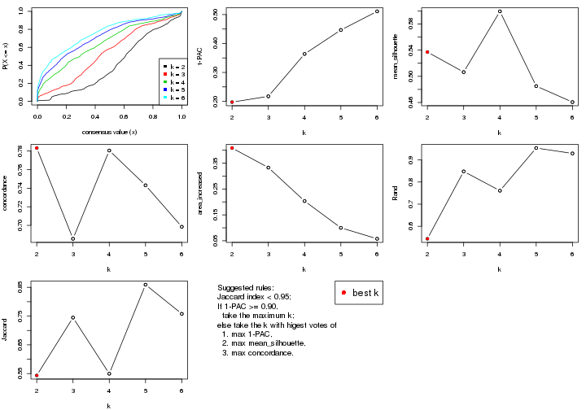

The numeric values for all these statistics can be obtained by `get_stats()`.

```r
get_stats(res)
```

```
#>   k 1-PAC mean_silhouette concordance area_increased  Rand Jaccard
#> 2 2 0.197           0.537       0.783         0.4084 0.544   0.544
#> 3 3 0.217           0.506       0.686         0.3328 0.848   0.745
#> 4 4 0.364           0.599       0.781         0.2033 0.761   0.550
#> 5 5 0.447           0.485       0.743         0.0998 0.954   0.859
#> 6 6 0.511           0.461       0.698         0.0576 0.929   0.758
```

`suggest_best_k()` suggests the best $k$ based on these statistics. The rules are as follows:

- All $k$ with Jaccard index larger than 0.95 are removed because increasing
  $k$ does not provide enough extra information. If all $k$ are removed, it is
  marked as no subgroup is detected.
- For all $k$ with 1-PAC score larger than 0.9, the maximal $k$ is taken as
  the best $k$, and other $k$ are marked as optional $k$.
- If it does not fit the second rule. The $k$ with the maximal vote of the
  highest 1-PAC score, highest mean silhouette, and highest concordance is
  taken as the best $k$.

```r
suggest_best_k(res)
```

```
#> [1] 2
```


Following shows the table of the partitions (You need to click the **show/hide
code output** link to see it). The membership matrix (columns with name `p*`)
is inferred by
[`clue::cl_consensus()`](https://www.rdocumentation.org/link/cl_consensus?package=clue)
function with the `SE` method. Basically the value in the membership matrix
represents the probability to belong to a certain group. The finall class
label for an item is determined with the group with highest probability it
belongs to.

In `get_classes()` function, the entropy is calculated from the membership
matrix and the silhouette score is calculated from the consensus matrix.


<script>
$( function() {
	$( '#tabs-MAD-hclust-get-classes' ).tabs();
} );
</script>
<div id='tabs-MAD-hclust-get-classes'>
<ul>
<li><a href='#tab-MAD-hclust-get-classes-1'>k = 2</a></li>
<li><a href='#tab-MAD-hclust-get-classes-2'>k = 3</a></li>
<li><a href='#tab-MAD-hclust-get-classes-3'>k = 4</a></li>
<li><a href='#tab-MAD-hclust-get-classes-4'>k = 5</a></li>
<li><a href='#tab-MAD-hclust-get-classes-5'>k = 6</a></li>
</ul>

<div id='tab-MAD-hclust-get-classes-1'>
<p><a id='tab-MAD-hclust-get-classes-1-a' style='color:#0366d6' href='#'>show/hide code output</a></p>
<pre><code class="r">cbind(get_classes(res, k = 2), get_membership(res, k = 2))
</code></pre>

<pre><code>#&gt;          class entropy silhouette    p1    p2
#&gt; GSM76115     2  0.0938     0.7412 0.012 0.988
#&gt; GSM76116     2  0.2043     0.7365 0.032 0.968
#&gt; GSM76117     2  0.8207     0.5333 0.256 0.744
#&gt; GSM76118     2  0.3114     0.7289 0.056 0.944
#&gt; GSM76119     2  0.4161     0.6711 0.084 0.916
#&gt; GSM76120     2  0.4161     0.6711 0.084 0.916
#&gt; GSM76121     2  0.8443     0.5162 0.272 0.728
#&gt; GSM76122     2  0.0672     0.7408 0.008 0.992
#&gt; GSM76123     2  0.4161     0.6711 0.084 0.916
#&gt; GSM76124     2  0.2043     0.7375 0.032 0.968
#&gt; GSM76125     2  0.4161     0.6711 0.084 0.916
#&gt; GSM76126     2  0.3114     0.7259 0.056 0.944
#&gt; GSM76127     2  0.4161     0.6711 0.084 0.916
#&gt; GSM76128     2  0.4298     0.6714 0.088 0.912
#&gt; GSM76129     2  0.0938     0.7410 0.012 0.988
#&gt; GSM76130     2  0.4161     0.6711 0.084 0.916
#&gt; GSM76131     2  0.0376     0.7406 0.004 0.996
#&gt; GSM76132     2  0.0376     0.7406 0.004 0.996
#&gt; GSM76133     2  0.0376     0.7406 0.004 0.996
#&gt; GSM76134     2  0.0672     0.7412 0.008 0.992
#&gt; GSM76135     2  0.0376     0.7406 0.004 0.996
#&gt; GSM76136     2  0.0376     0.7406 0.004 0.996
#&gt; GSM76137     2  0.1184     0.7413 0.016 0.984
#&gt; GSM76138     2  0.0938     0.7412 0.012 0.988
#&gt; GSM76139     2  0.0376     0.7406 0.004 0.996
#&gt; GSM76140     1  0.9850     0.4850 0.572 0.428
#&gt; GSM76141     2  0.0376     0.7406 0.004 0.996
#&gt; GSM76142     2  0.0376     0.7406 0.004 0.996
#&gt; GSM76143     2  0.0376     0.7406 0.004 0.996
#&gt; GSM76144     2  0.0376     0.7406 0.004 0.996
#&gt; GSM76145     2  0.0376     0.7403 0.004 0.996
#&gt; GSM76146     2  0.0376     0.7406 0.004 0.996
#&gt; GSM76147     2  0.0376     0.7406 0.004 0.996
#&gt; GSM76148     2  0.0376     0.7406 0.004 0.996
#&gt; GSM76149     2  0.0672     0.7412 0.008 0.992
#&gt; GSM76150     2  0.0672     0.7412 0.008 0.992
#&gt; GSM76151     2  0.0938     0.7413 0.012 0.988
#&gt; GSM76152     1  0.9815     0.4967 0.580 0.420
#&gt; GSM76153     2  0.0376     0.7406 0.004 0.996
#&gt; GSM76154     2  0.0672     0.7412 0.008 0.992
#&gt; GSM76155     2  0.0376     0.7403 0.004 0.996
#&gt; GSM76156     2  0.0376     0.7406 0.004 0.996
#&gt; GSM76030     2  0.6623     0.6544 0.172 0.828
#&gt; GSM76031     1  0.9795     0.5097 0.584 0.416
#&gt; GSM76032     1  0.9170     0.6199 0.668 0.332
#&gt; GSM76033     2  0.9983    -0.1844 0.476 0.524
#&gt; GSM76034     2  0.8909     0.4320 0.308 0.692
#&gt; GSM76035     2  0.9393     0.3232 0.356 0.644
#&gt; GSM76036     2  0.9977    -0.1594 0.472 0.528
#&gt; GSM76037     2  0.1633     0.7389 0.024 0.976
#&gt; GSM76038     1  0.9795     0.5097 0.584 0.416
#&gt; GSM76039     2  0.9963    -0.1342 0.464 0.536
#&gt; GSM76040     2  0.9954    -0.1079 0.460 0.540
#&gt; GSM76041     1  0.7674     0.7087 0.776 0.224
#&gt; GSM76042     2  0.9000     0.4157 0.316 0.684
#&gt; GSM76043     1  1.0000     0.2881 0.504 0.496
#&gt; GSM76044     2  0.9000     0.4157 0.316 0.684
#&gt; GSM76045     1  0.9963     0.3977 0.536 0.464
#&gt; GSM76046     2  0.9963    -0.1388 0.464 0.536
#&gt; GSM76047     1  0.9866     0.4658 0.568 0.432
#&gt; GSM76048     1  0.9954     0.3759 0.540 0.460
#&gt; GSM76049     2  0.8207     0.5502 0.256 0.744
#&gt; GSM76050     1  0.5519     0.7111 0.872 0.128
#&gt; GSM76051     2  0.9988    -0.1905 0.480 0.520
#&gt; GSM76052     2  0.9983    -0.1844 0.476 0.524
#&gt; GSM76053     2  0.8909     0.4270 0.308 0.692
#&gt; GSM76054     2  0.9954    -0.1079 0.460 0.540
#&gt; GSM76055     2  0.5294     0.7012 0.120 0.880
#&gt; GSM76056     2  0.9944    -0.0904 0.456 0.544
#&gt; GSM76057     2  0.9933    -0.0723 0.452 0.548
#&gt; GSM76058     1  0.9686     0.5260 0.604 0.396
#&gt; GSM76059     1  0.4161     0.6984 0.916 0.084
#&gt; GSM76060     2  0.9686     0.1576 0.396 0.604
#&gt; GSM76061     2  0.9635     0.1896 0.388 0.612
#&gt; GSM76062     1  0.4298     0.7010 0.912 0.088
#&gt; GSM76063     2  0.7056     0.6221 0.192 0.808
#&gt; GSM76064     1  0.9170     0.6404 0.668 0.332
#&gt; GSM76065     2  0.3733     0.7252 0.072 0.928
#&gt; GSM76066     1  0.5737     0.7126 0.864 0.136
#&gt; GSM76067     1  0.7745     0.7016 0.772 0.228
#&gt; GSM76068     1  0.9993     0.3028 0.516 0.484
#&gt; GSM76069     1  0.8813     0.6559 0.700 0.300
#&gt; GSM76070     2  0.6531     0.6517 0.168 0.832
#&gt; GSM76071     1  0.4431     0.7029 0.908 0.092
#&gt; GSM76072     1  0.4562     0.7044 0.904 0.096
#&gt; GSM76073     1  0.4298     0.7011 0.912 0.088
#&gt; GSM76074     1  0.4298     0.7011 0.912 0.088
#&gt; GSM76075     1  0.9661     0.5332 0.608 0.392
#&gt; GSM76076     1  0.9661     0.5341 0.608 0.392
#&gt; GSM76077     2  0.9866     0.0176 0.432 0.568
#&gt; GSM76078     2  0.9983    -0.2040 0.476 0.524
#&gt; GSM76079     1  0.4161     0.6984 0.916 0.084
#&gt; GSM76080     2  0.8016     0.5591 0.244 0.756
#&gt; GSM76081     2  0.9815     0.0580 0.420 0.580
#&gt; GSM76082     1  0.9993     0.3028 0.516 0.484
#&gt; GSM76083     1  0.9795     0.4894 0.584 0.416
#&gt; GSM76084     2  0.7528     0.5919 0.216 0.784
#&gt; GSM76085     1  0.9988     0.3094 0.520 0.480
#&gt; GSM76086     1  0.7453     0.7064 0.788 0.212
#&gt; GSM76087     2  0.0376     0.7406 0.004 0.996
#&gt; GSM76088     2  0.9775     0.1017 0.412 0.588
#&gt; GSM76089     2  0.5519     0.6913 0.128 0.872
#&gt; GSM76090     1  0.9754     0.5057 0.592 0.408
#&gt; GSM76091     1  0.6343     0.7054 0.840 0.160
#&gt; GSM76092     1  0.4431     0.7015 0.908 0.092
#&gt; GSM76093     1  0.4161     0.6984 0.916 0.084
#&gt; GSM76094     2  0.8499     0.4955 0.276 0.724
#&gt; GSM76095     1  0.9977     0.3783 0.528 0.472
#&gt; GSM76096     2  0.9635     0.2100 0.388 0.612
#&gt; GSM76097     2  0.7674     0.5990 0.224 0.776
#&gt; GSM76098     2  0.8443     0.5285 0.272 0.728
#&gt; GSM76099     1  0.9044     0.6266 0.680 0.320
#&gt; GSM76100     1  0.6973     0.6991 0.812 0.188
#&gt; GSM76101     1  0.4161     0.6984 0.916 0.084
#&gt; GSM76102     2  0.5842     0.6855 0.140 0.860
#&gt; GSM76103     1  0.7602     0.7054 0.780 0.220
#&gt; GSM76104     2  0.9970    -0.1391 0.468 0.532
#&gt; GSM76105     2  0.3431     0.7273 0.064 0.936
#&gt; GSM76106     2  0.8016     0.5591 0.244 0.756
#&gt; GSM76107     2  0.2778     0.7312 0.048 0.952
#&gt; GSM76108     2  0.5294     0.7012 0.120 0.880
#&gt; GSM76109     1  0.4161     0.6984 0.916 0.084
#&gt; GSM76110     1  0.9393     0.5967 0.644 0.356
#&gt; GSM76111     1  0.9775     0.5135 0.588 0.412
#&gt; GSM76112     1  0.4815     0.7066 0.896 0.104
#&gt; GSM76113     2  0.8813     0.4593 0.300 0.700
#&gt; GSM76114     1  0.8909     0.6591 0.692 0.308
</code></pre>

<script>
$('#tab-MAD-hclust-get-classes-1-a').parent().next().next().hide();
$('#tab-MAD-hclust-get-classes-1-a').click(function(){
  $('#tab-MAD-hclust-get-classes-1-a').parent().next().next().toggle();
  return(false);
});
</script>
</div>

<div id='tab-MAD-hclust-get-classes-2'>
<p><a id='tab-MAD-hclust-get-classes-2-a' style='color:#0366d6' href='#'>show/hide code output</a></p>
<pre><code class="r">cbind(get_classes(res, k = 3), get_membership(res, k = 3))
</code></pre>

<pre><code>#&gt;          class entropy silhouette    p1    p2    p3
#&gt; GSM76115     2  0.1129    0.66188 0.004 0.976 0.020
#&gt; GSM76116     2  0.2187    0.66729 0.024 0.948 0.028
#&gt; GSM76117     2  0.7222    0.50501 0.244 0.684 0.072
#&gt; GSM76118     2  0.3263    0.66631 0.048 0.912 0.040
#&gt; GSM76119     3  0.5178    0.99570 0.000 0.256 0.744
#&gt; GSM76120     3  0.5178    0.99570 0.000 0.256 0.744
#&gt; GSM76121     2  0.7746    0.48274 0.244 0.656 0.100
#&gt; GSM76122     2  0.2860    0.63164 0.004 0.912 0.084
#&gt; GSM76123     3  0.5178    0.99570 0.000 0.256 0.744
#&gt; GSM76124     2  0.3276    0.64515 0.024 0.908 0.068
#&gt; GSM76125     3  0.5178    0.99570 0.000 0.256 0.744
#&gt; GSM76126     2  0.6724   -0.02788 0.012 0.568 0.420
#&gt; GSM76127     3  0.5178    0.99570 0.000 0.256 0.744
#&gt; GSM76128     3  0.4974    0.97432 0.000 0.236 0.764
#&gt; GSM76129     2  0.2749    0.64457 0.012 0.924 0.064
#&gt; GSM76130     3  0.5178    0.99570 0.000 0.256 0.744
#&gt; GSM76131     2  0.0424    0.66568 0.000 0.992 0.008
#&gt; GSM76132     2  0.0424    0.66568 0.000 0.992 0.008
#&gt; GSM76133     2  0.0424    0.66568 0.000 0.992 0.008
#&gt; GSM76134     2  0.0237    0.66778 0.004 0.996 0.000
#&gt; GSM76135     2  0.0424    0.66568 0.000 0.992 0.008
#&gt; GSM76136     2  0.0424    0.66568 0.000 0.992 0.008
#&gt; GSM76137     2  0.2173    0.66273 0.008 0.944 0.048
#&gt; GSM76138     2  0.1129    0.66188 0.004 0.976 0.020
#&gt; GSM76139     2  0.0424    0.66568 0.000 0.992 0.008
#&gt; GSM76140     1  0.7491    0.43735 0.620 0.324 0.056
#&gt; GSM76141     2  0.0424    0.66568 0.000 0.992 0.008
#&gt; GSM76142     2  0.0424    0.66568 0.000 0.992 0.008
#&gt; GSM76143     2  0.0424    0.66568 0.000 0.992 0.008
#&gt; GSM76144     2  0.0424    0.66568 0.000 0.992 0.008
#&gt; GSM76145     2  0.1129    0.66078 0.004 0.976 0.020
#&gt; GSM76146     2  0.0424    0.66568 0.000 0.992 0.008
#&gt; GSM76147     2  0.0424    0.66568 0.000 0.992 0.008
#&gt; GSM76148     2  0.0424    0.66568 0.000 0.992 0.008
#&gt; GSM76149     2  0.0237    0.66778 0.004 0.996 0.000
#&gt; GSM76150     2  0.0237    0.66778 0.004 0.996 0.000
#&gt; GSM76151     2  0.0475    0.66909 0.004 0.992 0.004
#&gt; GSM76152     1  0.7378    0.44755 0.628 0.320 0.052
#&gt; GSM76153     2  0.0424    0.66568 0.000 0.992 0.008
#&gt; GSM76154     2  0.0237    0.66778 0.004 0.996 0.000
#&gt; GSM76155     2  0.1129    0.66078 0.004 0.976 0.020
#&gt; GSM76156     2  0.0424    0.66568 0.000 0.992 0.008
#&gt; GSM76030     2  0.5744    0.63718 0.128 0.800 0.072
#&gt; GSM76031     1  0.7417    0.45683 0.632 0.312 0.056
#&gt; GSM76032     1  0.9536    0.37332 0.488 0.260 0.252
#&gt; GSM76033     2  0.9804    0.11748 0.296 0.432 0.272
#&gt; GSM76034     2  0.8331    0.48472 0.208 0.628 0.164
#&gt; GSM76035     2  0.8835    0.41462 0.244 0.576 0.180
#&gt; GSM76036     2  0.9806    0.10789 0.292 0.432 0.276
#&gt; GSM76037     2  0.2998    0.64328 0.016 0.916 0.068
#&gt; GSM76038     1  0.7417    0.45683 0.632 0.312 0.056
#&gt; GSM76039     1  0.8273    0.08051 0.476 0.448 0.076
#&gt; GSM76040     2  0.9759    0.13962 0.284 0.444 0.272
#&gt; GSM76041     1  0.7666    0.60077 0.684 0.168 0.148
#&gt; GSM76042     2  0.8168    0.42127 0.280 0.612 0.108
#&gt; GSM76043     2  0.9300   -0.07651 0.412 0.428 0.160
#&gt; GSM76044     2  0.8168    0.42127 0.280 0.612 0.108
#&gt; GSM76045     1  0.9177    0.15674 0.452 0.400 0.148
#&gt; GSM76046     2  0.9790    0.13534 0.292 0.436 0.272
#&gt; GSM76047     1  0.9753    0.11786 0.400 0.372 0.228
#&gt; GSM76048     2  0.9914   -0.06523 0.348 0.380 0.272
#&gt; GSM76049     2  0.7047    0.56842 0.204 0.712 0.084
#&gt; GSM76050     1  0.3589    0.65676 0.900 0.048 0.052
#&gt; GSM76051     2  0.9833    0.08602 0.300 0.424 0.276
#&gt; GSM76052     2  0.9804    0.11748 0.296 0.432 0.272
#&gt; GSM76053     2  0.8410    0.47828 0.216 0.620 0.164
#&gt; GSM76054     2  0.9759    0.13962 0.284 0.444 0.272
#&gt; GSM76055     2  0.5377    0.63655 0.112 0.820 0.068
#&gt; GSM76056     2  0.8752    0.26860 0.320 0.548 0.132
#&gt; GSM76057     2  0.8793    0.28678 0.308 0.552 0.140
#&gt; GSM76058     1  0.9842    0.21003 0.412 0.328 0.260
#&gt; GSM76059     1  0.0237    0.63303 0.996 0.000 0.004
#&gt; GSM76060     2  0.8838    0.39128 0.220 0.580 0.200
#&gt; GSM76061     2  0.8728    0.41344 0.208 0.592 0.200
#&gt; GSM76062     1  0.1765    0.64164 0.956 0.004 0.040
#&gt; GSM76063     2  0.6500    0.60990 0.100 0.760 0.140
#&gt; GSM76064     1  0.8460    0.49246 0.600 0.264 0.136
#&gt; GSM76065     2  0.4316    0.65768 0.044 0.868 0.088
#&gt; GSM76066     1  0.5467    0.65377 0.816 0.072 0.112
#&gt; GSM76067     1  0.8026    0.56729 0.656 0.164 0.180
#&gt; GSM76068     2  0.9804    0.01946 0.336 0.416 0.248
#&gt; GSM76069     1  0.6715    0.58862 0.716 0.228 0.056
#&gt; GSM76070     2  0.5449    0.64110 0.068 0.816 0.116
#&gt; GSM76071     1  0.0829    0.63830 0.984 0.004 0.012
#&gt; GSM76072     1  0.1170    0.64184 0.976 0.008 0.016
#&gt; GSM76073     1  0.0424    0.63395 0.992 0.000 0.008
#&gt; GSM76074     1  0.0424    0.63395 0.992 0.000 0.008
#&gt; GSM76075     1  0.9842    0.24705 0.420 0.308 0.272
#&gt; GSM76076     1  0.9830    0.23942 0.420 0.316 0.264
#&gt; GSM76077     2  0.9033    0.32743 0.272 0.548 0.180
#&gt; GSM76078     2  0.9624    0.15077 0.292 0.468 0.240
#&gt; GSM76079     1  0.0424    0.63629 0.992 0.000 0.008
#&gt; GSM76080     2  0.7562    0.55322 0.148 0.692 0.160
#&gt; GSM76081     2  0.9536    0.22598 0.260 0.488 0.252
#&gt; GSM76082     2  0.9804    0.01946 0.336 0.416 0.248
#&gt; GSM76083     1  0.9892    0.17209 0.392 0.340 0.268
#&gt; GSM76084     2  0.7097    0.58323 0.128 0.724 0.148
#&gt; GSM76085     2  0.9913   -0.02044 0.336 0.388 0.276
#&gt; GSM76086     1  0.8085    0.56530 0.648 0.148 0.204
#&gt; GSM76087     2  0.0424    0.66568 0.000 0.992 0.008
#&gt; GSM76088     2  0.8907    0.36695 0.248 0.568 0.184
#&gt; GSM76089     2  0.4845    0.65863 0.104 0.844 0.052
#&gt; GSM76090     1  0.9873    0.20631 0.404 0.328 0.268
#&gt; GSM76091     1  0.5263    0.65845 0.828 0.088 0.084
#&gt; GSM76092     1  0.0829    0.63582 0.984 0.004 0.012
#&gt; GSM76093     1  0.0424    0.63297 0.992 0.000 0.008
#&gt; GSM76094     2  0.7523    0.47081 0.260 0.660 0.080
#&gt; GSM76095     1  0.8270    0.31790 0.540 0.376 0.084
#&gt; GSM76096     2  0.9054    0.00236 0.404 0.460 0.136
#&gt; GSM76097     2  0.7821    0.48307 0.224 0.660 0.116
#&gt; GSM76098     2  0.8556    0.45063 0.232 0.604 0.164
#&gt; GSM76099     1  0.6335    0.56989 0.724 0.240 0.036
#&gt; GSM76100     1  0.3805    0.63145 0.884 0.092 0.024
#&gt; GSM76101     1  0.0237    0.63303 0.996 0.000 0.004
#&gt; GSM76102     2  0.7844    0.44025 0.120 0.660 0.220
#&gt; GSM76103     1  0.8148    0.56172 0.644 0.156 0.200
#&gt; GSM76104     2  0.9776    0.13943 0.284 0.440 0.276
#&gt; GSM76105     2  0.4179    0.65136 0.052 0.876 0.072
#&gt; GSM76106     2  0.7562    0.55322 0.148 0.692 0.160
#&gt; GSM76107     2  0.6307    0.28817 0.012 0.660 0.328
#&gt; GSM76108     2  0.5377    0.63655 0.112 0.820 0.068
#&gt; GSM76109     1  0.0237    0.63303 0.996 0.000 0.004
#&gt; GSM76110     1  0.6723    0.53640 0.704 0.248 0.048
#&gt; GSM76111     1  0.7504    0.45888 0.628 0.312 0.060
#&gt; GSM76112     1  0.1919    0.64747 0.956 0.020 0.024
#&gt; GSM76113     2  0.8030    0.51494 0.204 0.652 0.144
#&gt; GSM76114     1  0.7972    0.56306 0.644 0.240 0.116
</code></pre>

<script>
$('#tab-MAD-hclust-get-classes-2-a').parent().next().next().hide();
$('#tab-MAD-hclust-get-classes-2-a').click(function(){
  $('#tab-MAD-hclust-get-classes-2-a').parent().next().next().toggle();
  return(false);
});
</script>
</div>

<div id='tab-MAD-hclust-get-classes-3'>
<p><a id='tab-MAD-hclust-get-classes-3-a' style='color:#0366d6' href='#'>show/hide code output</a></p>
<pre><code class="r">cbind(get_classes(res, k = 4), get_membership(res, k = 4))
</code></pre>

<pre><code>#&gt;          class entropy silhouette    p1    p2    p3    p4
#&gt; GSM76115     2  0.0672    0.77180 0.000 0.984 0.008 0.008
#&gt; GSM76116     2  0.1786    0.76623 0.008 0.948 0.036 0.008
#&gt; GSM76117     2  0.6679    0.52958 0.204 0.656 0.124 0.016
#&gt; GSM76118     2  0.2945    0.75160 0.024 0.904 0.056 0.016
#&gt; GSM76119     4  0.1022    0.99452 0.000 0.032 0.000 0.968
#&gt; GSM76120     4  0.1022    0.99452 0.000 0.032 0.000 0.968
#&gt; GSM76121     2  0.7314    0.49679 0.208 0.620 0.136 0.036
#&gt; GSM76122     2  0.2772    0.75211 0.004 0.908 0.048 0.040
#&gt; GSM76123     4  0.1022    0.99452 0.000 0.032 0.000 0.968
#&gt; GSM76124     2  0.3030    0.74845 0.020 0.900 0.060 0.020
#&gt; GSM76125     4  0.1022    0.99452 0.000 0.032 0.000 0.968
#&gt; GSM76126     2  0.7147    0.19404 0.012 0.472 0.092 0.424
#&gt; GSM76127     4  0.1022    0.99452 0.000 0.032 0.000 0.968
#&gt; GSM76128     4  0.0524    0.96701 0.000 0.008 0.004 0.988
#&gt; GSM76129     2  0.2699    0.75258 0.000 0.904 0.028 0.068
#&gt; GSM76130     4  0.1022    0.99452 0.000 0.032 0.000 0.968
#&gt; GSM76131     2  0.0921    0.77516 0.000 0.972 0.028 0.000
#&gt; GSM76132     2  0.0921    0.77516 0.000 0.972 0.028 0.000
#&gt; GSM76133     2  0.0921    0.77516 0.000 0.972 0.028 0.000
#&gt; GSM76134     2  0.1305    0.77308 0.000 0.960 0.036 0.004
#&gt; GSM76135     2  0.0921    0.77516 0.000 0.972 0.028 0.000
#&gt; GSM76136     2  0.0921    0.77516 0.000 0.972 0.028 0.000
#&gt; GSM76137     2  0.2908    0.74867 0.000 0.896 0.064 0.040
#&gt; GSM76138     2  0.0524    0.77190 0.000 0.988 0.008 0.004
#&gt; GSM76139     2  0.0921    0.77516 0.000 0.972 0.028 0.000
#&gt; GSM76140     1  0.6214    0.51649 0.604 0.332 0.060 0.004
#&gt; GSM76141     2  0.0921    0.77516 0.000 0.972 0.028 0.000
#&gt; GSM76142     2  0.0921    0.77516 0.000 0.972 0.028 0.000
#&gt; GSM76143     2  0.0921    0.77516 0.000 0.972 0.028 0.000
#&gt; GSM76144     2  0.0921    0.77516 0.000 0.972 0.028 0.000
#&gt; GSM76145     2  0.1042    0.77289 0.000 0.972 0.020 0.008
#&gt; GSM76146     2  0.0921    0.77516 0.000 0.972 0.028 0.000
#&gt; GSM76147     2  0.0921    0.77516 0.000 0.972 0.028 0.000
#&gt; GSM76148     2  0.0921    0.77516 0.000 0.972 0.028 0.000
#&gt; GSM76149     2  0.1305    0.77308 0.000 0.960 0.036 0.004
#&gt; GSM76150     2  0.1305    0.77308 0.000 0.960 0.036 0.004
#&gt; GSM76151     2  0.1398    0.77266 0.000 0.956 0.040 0.004
#&gt; GSM76152     1  0.6023    0.52708 0.612 0.328 0.060 0.000
#&gt; GSM76153     2  0.0921    0.77516 0.000 0.972 0.028 0.000
#&gt; GSM76154     2  0.1305    0.77308 0.000 0.960 0.036 0.004
#&gt; GSM76155     2  0.0927    0.77250 0.000 0.976 0.016 0.008
#&gt; GSM76156     2  0.0921    0.77516 0.000 0.972 0.028 0.000
#&gt; GSM76030     2  0.5458    0.57339 0.052 0.712 0.232 0.004
#&gt; GSM76031     1  0.6160    0.53717 0.616 0.320 0.060 0.004
#&gt; GSM76032     3  0.3587    0.63934 0.104 0.032 0.860 0.004
#&gt; GSM76033     3  0.4244    0.72985 0.000 0.168 0.800 0.032
#&gt; GSM76034     3  0.6695    0.24768 0.040 0.448 0.488 0.024
#&gt; GSM76035     3  0.7057    0.35472 0.072 0.400 0.508 0.020
#&gt; GSM76036     3  0.4466    0.73139 0.004 0.156 0.800 0.040
#&gt; GSM76037     2  0.2761    0.75006 0.012 0.908 0.064 0.016
#&gt; GSM76038     1  0.6160    0.53717 0.616 0.320 0.060 0.004
#&gt; GSM76039     1  0.7241    0.13950 0.460 0.428 0.100 0.012
#&gt; GSM76040     3  0.4648    0.72744 0.004 0.172 0.784 0.040
#&gt; GSM76041     3  0.6411    0.14328 0.424 0.056 0.516 0.004
#&gt; GSM76042     2  0.7312    0.37933 0.208 0.572 0.212 0.008
#&gt; GSM76043     3  0.7756    0.24136 0.248 0.328 0.424 0.000
#&gt; GSM76044     2  0.7312    0.38094 0.212 0.572 0.208 0.008
#&gt; GSM76045     3  0.7907    0.06079 0.328 0.308 0.364 0.000
#&gt; GSM76046     3  0.4549    0.71923 0.000 0.188 0.776 0.036
#&gt; GSM76047     3  0.5751    0.67212 0.124 0.164 0.712 0.000
#&gt; GSM76048     3  0.3556    0.72110 0.012 0.104 0.864 0.020
#&gt; GSM76049     2  0.6476    0.43248 0.112 0.616 0.272 0.000
#&gt; GSM76050     1  0.4448    0.60764 0.784 0.024 0.188 0.004
#&gt; GSM76051     3  0.4370    0.73079 0.004 0.148 0.808 0.040
#&gt; GSM76052     3  0.4244    0.72985 0.000 0.168 0.800 0.032
#&gt; GSM76053     3  0.6528    0.30641 0.032 0.432 0.512 0.024
#&gt; GSM76054     3  0.4648    0.72744 0.004 0.172 0.784 0.040
#&gt; GSM76055     2  0.4814    0.69927 0.096 0.804 0.088 0.012
#&gt; GSM76056     2  0.7733    0.12520 0.228 0.476 0.292 0.004
#&gt; GSM76057     2  0.7694    0.12557 0.216 0.480 0.300 0.004
#&gt; GSM76058     3  0.3383    0.70274 0.052 0.076 0.872 0.000
#&gt; GSM76059     1  0.0188    0.70278 0.996 0.000 0.004 0.000
#&gt; GSM76060     3  0.6498    0.27756 0.072 0.440 0.488 0.000
#&gt; GSM76061     3  0.6506    0.23014 0.072 0.456 0.472 0.000
#&gt; GSM76062     1  0.3402    0.66236 0.832 0.000 0.164 0.004
#&gt; GSM76063     2  0.5573    0.24752 0.000 0.604 0.368 0.028
#&gt; GSM76064     3  0.7473    0.27122 0.360 0.132 0.496 0.012
#&gt; GSM76065     2  0.3734    0.73731 0.020 0.852 0.116 0.012
#&gt; GSM76066     1  0.5182    0.35901 0.632 0.008 0.356 0.004
#&gt; GSM76067     3  0.5266    0.38066 0.324 0.016 0.656 0.004
#&gt; GSM76068     3  0.3612    0.73264 0.012 0.144 0.840 0.004
#&gt; GSM76069     1  0.6675    0.58585 0.644 0.204 0.144 0.008
#&gt; GSM76070     2  0.4560    0.46699 0.000 0.700 0.296 0.004
#&gt; GSM76071     1  0.1022    0.70597 0.968 0.000 0.032 0.000
#&gt; GSM76072     1  0.1576    0.70779 0.948 0.004 0.048 0.000
#&gt; GSM76073     1  0.0188    0.70363 0.996 0.000 0.004 0.000
#&gt; GSM76074     1  0.0336    0.70590 0.992 0.000 0.008 0.000
#&gt; GSM76075     3  0.2400    0.68025 0.028 0.044 0.924 0.004
#&gt; GSM76076     3  0.2385    0.68566 0.028 0.052 0.920 0.000
#&gt; GSM76077     3  0.6580    0.29593 0.080 0.416 0.504 0.000
#&gt; GSM76078     3  0.5446    0.61630 0.044 0.276 0.680 0.000
#&gt; GSM76079     1  0.1489    0.70503 0.952 0.000 0.044 0.004
#&gt; GSM76080     2  0.6243    0.06929 0.008 0.540 0.412 0.040
#&gt; GSM76081     3  0.4922    0.69072 0.000 0.228 0.736 0.036
#&gt; GSM76082     3  0.3612    0.73264 0.012 0.144 0.840 0.004
#&gt; GSM76083     3  0.2522    0.70363 0.016 0.076 0.908 0.000
#&gt; GSM76084     2  0.5883    0.15849 0.000 0.572 0.388 0.040
#&gt; GSM76085     3  0.4374    0.73221 0.016 0.132 0.820 0.032
#&gt; GSM76086     3  0.4283    0.45262 0.256 0.000 0.740 0.004
#&gt; GSM76087     2  0.0921    0.77516 0.000 0.972 0.028 0.000
#&gt; GSM76088     3  0.6926    0.26283 0.108 0.432 0.460 0.000
#&gt; GSM76089     2  0.4759    0.63465 0.032 0.764 0.200 0.004
#&gt; GSM76090     3  0.2742    0.70223 0.024 0.076 0.900 0.000
#&gt; GSM76091     1  0.5796    0.55082 0.672 0.056 0.268 0.004
#&gt; GSM76092     1  0.0895    0.70794 0.976 0.004 0.020 0.000
#&gt; GSM76093     1  0.0376    0.70247 0.992 0.000 0.004 0.004
#&gt; GSM76094     2  0.6868    0.50122 0.228 0.632 0.124 0.016
#&gt; GSM76095     1  0.7097    0.36507 0.508 0.372 0.116 0.004
#&gt; GSM76096     2  0.8480   -0.13288 0.388 0.424 0.096 0.092
#&gt; GSM76097     2  0.7243    0.48653 0.216 0.636 0.076 0.072
#&gt; GSM76098     2  0.8469    0.33512 0.168 0.528 0.224 0.080
#&gt; GSM76099     1  0.6181    0.61431 0.680 0.216 0.096 0.008
#&gt; GSM76100     1  0.3333    0.70171 0.876 0.088 0.032 0.004
#&gt; GSM76101     1  0.0188    0.70278 0.996 0.000 0.004 0.000
#&gt; GSM76102     2  0.7954    0.48596 0.100 0.600 0.128 0.172
#&gt; GSM76103     3  0.4746    0.44156 0.276 0.008 0.712 0.004
#&gt; GSM76104     3  0.4734    0.72551 0.004 0.180 0.776 0.040
#&gt; GSM76105     2  0.3684    0.73892 0.036 0.868 0.080 0.016
#&gt; GSM76106     2  0.6243    0.06929 0.008 0.540 0.412 0.040
#&gt; GSM76107     2  0.6921    0.44722 0.012 0.584 0.100 0.304
#&gt; GSM76108     2  0.4877    0.69817 0.096 0.800 0.092 0.012
#&gt; GSM76109     1  0.0188    0.70278 0.996 0.000 0.004 0.000
#&gt; GSM76110     1  0.5200    0.61039 0.700 0.264 0.036 0.000
#&gt; GSM76111     1  0.6071    0.53279 0.612 0.324 0.064 0.000
#&gt; GSM76112     1  0.3216    0.68081 0.864 0.004 0.124 0.008
#&gt; GSM76113     2  0.6457    0.00928 0.044 0.516 0.428 0.012
#&gt; GSM76114     1  0.7393    0.28144 0.492 0.152 0.352 0.004
</code></pre>

<script>
$('#tab-MAD-hclust-get-classes-3-a').parent().next().next().hide();
$('#tab-MAD-hclust-get-classes-3-a').click(function(){
  $('#tab-MAD-hclust-get-classes-3-a').parent().next().next().toggle();
  return(false);
});
</script>
</div>

<div id='tab-MAD-hclust-get-classes-4'>
<p><a id='tab-MAD-hclust-get-classes-4-a' style='color:#0366d6' href='#'>show/hide code output</a></p>
<pre><code class="r">cbind(get_classes(res, k = 5), get_membership(res, k = 5))
</code></pre>

<pre><code>#&gt;          class entropy silhouette    p1    p2    p3    p4    p5
#&gt; GSM76115     2  0.1731    0.64434 0.000 0.932 0.004 0.004 0.060
#&gt; GSM76116     2  0.3016    0.59740 0.000 0.848 0.020 0.000 0.132
#&gt; GSM76117     2  0.7801    0.07546 0.176 0.496 0.100 0.008 0.220
#&gt; GSM76118     2  0.4290    0.56368 0.016 0.796 0.040 0.008 0.140
#&gt; GSM76119     4  0.0609    0.87938 0.000 0.020 0.000 0.980 0.000
#&gt; GSM76120     4  0.0609    0.87938 0.000 0.020 0.000 0.980 0.000
#&gt; GSM76121     2  0.8242   -0.05908 0.184 0.440 0.108 0.016 0.252
#&gt; GSM76122     2  0.4326    0.39672 0.000 0.708 0.000 0.028 0.264
#&gt; GSM76123     4  0.0609    0.87938 0.000 0.020 0.000 0.980 0.000
#&gt; GSM76124     2  0.4487    0.31973 0.004 0.660 0.004 0.008 0.324
#&gt; GSM76125     4  0.0609    0.87938 0.000 0.020 0.000 0.980 0.000
#&gt; GSM76126     4  0.7797   -0.40789 0.008 0.300 0.040 0.364 0.288
#&gt; GSM76127     4  0.0609    0.87938 0.000 0.020 0.000 0.980 0.000
#&gt; GSM76128     4  0.0404    0.84723 0.000 0.000 0.000 0.988 0.012
#&gt; GSM76129     2  0.3634    0.59425 0.000 0.844 0.020 0.056 0.080
#&gt; GSM76130     4  0.0609    0.87938 0.000 0.020 0.000 0.980 0.000
#&gt; GSM76131     2  0.1153    0.66940 0.000 0.964 0.024 0.004 0.008
#&gt; GSM76132     2  0.0992    0.66936 0.000 0.968 0.024 0.000 0.008
#&gt; GSM76133     2  0.1153    0.66940 0.000 0.964 0.024 0.004 0.008
#&gt; GSM76134     2  0.1646    0.66617 0.000 0.944 0.032 0.004 0.020
#&gt; GSM76135     2  0.1153    0.66940 0.000 0.964 0.024 0.004 0.008
#&gt; GSM76136     2  0.1153    0.66940 0.000 0.964 0.024 0.004 0.008
#&gt; GSM76137     2  0.2822    0.63360 0.000 0.888 0.064 0.036 0.012
#&gt; GSM76138     2  0.1662    0.64628 0.000 0.936 0.004 0.004 0.056
#&gt; GSM76139     2  0.1153    0.66940 0.000 0.964 0.024 0.004 0.008
#&gt; GSM76140     1  0.6472    0.41896 0.576 0.192 0.020 0.000 0.212
#&gt; GSM76141     2  0.1153    0.66940 0.000 0.964 0.024 0.004 0.008
#&gt; GSM76142     2  0.1153    0.66940 0.000 0.964 0.024 0.004 0.008
#&gt; GSM76143     2  0.1153    0.66940 0.000 0.964 0.024 0.004 0.008
#&gt; GSM76144     2  0.1153    0.66940 0.000 0.964 0.024 0.004 0.008
#&gt; GSM76145     2  0.1960    0.65241 0.000 0.928 0.020 0.004 0.048
#&gt; GSM76146     2  0.1153    0.66940 0.000 0.964 0.024 0.004 0.008
#&gt; GSM76147     2  0.0992    0.66936 0.000 0.968 0.024 0.000 0.008
#&gt; GSM76148     2  0.1153    0.66940 0.000 0.964 0.024 0.004 0.008
#&gt; GSM76149     2  0.1646    0.66617 0.000 0.944 0.032 0.004 0.020
#&gt; GSM76150     2  0.1646    0.66617 0.000 0.944 0.032 0.004 0.020
#&gt; GSM76151     2  0.1728    0.66607 0.000 0.940 0.036 0.004 0.020
#&gt; GSM76152     1  0.6421    0.42810 0.584 0.192 0.020 0.000 0.204
#&gt; GSM76153     2  0.1153    0.66940 0.000 0.964 0.024 0.004 0.008
#&gt; GSM76154     2  0.1739    0.66556 0.000 0.940 0.032 0.004 0.024
#&gt; GSM76155     2  0.1862    0.65234 0.000 0.932 0.016 0.004 0.048
#&gt; GSM76156     2  0.1153    0.66940 0.000 0.964 0.024 0.004 0.008
#&gt; GSM76030     2  0.6880    0.30744 0.044 0.556 0.208 0.000 0.192
#&gt; GSM76031     1  0.6412    0.43506 0.584 0.180 0.020 0.000 0.216
#&gt; GSM76032     3  0.3265    0.64268 0.092 0.016 0.860 0.000 0.032
#&gt; GSM76033     3  0.3801    0.69118 0.000 0.112 0.828 0.028 0.032
#&gt; GSM76034     3  0.6924    0.30763 0.036 0.364 0.500 0.020 0.080
#&gt; GSM76035     3  0.7106    0.39111 0.068 0.324 0.520 0.016 0.072
#&gt; GSM76036     3  0.3556    0.68804 0.000 0.116 0.836 0.036 0.012
#&gt; GSM76037     2  0.4135    0.32869 0.000 0.656 0.004 0.000 0.340
#&gt; GSM76038     1  0.6412    0.43506 0.584 0.180 0.020 0.000 0.216
#&gt; GSM76039     1  0.7861    0.00596 0.436 0.284 0.068 0.008 0.204
#&gt; GSM76040     3  0.3590    0.68487 0.000 0.128 0.828 0.036 0.008
#&gt; GSM76041     3  0.5896    0.16418 0.396 0.008 0.516 0.000 0.080
#&gt; GSM76042     2  0.8296   -0.11017 0.184 0.380 0.176 0.000 0.260
#&gt; GSM76043     3  0.8266    0.05629 0.232 0.172 0.396 0.000 0.200
#&gt; GSM76044     2  0.8284   -0.10503 0.188 0.384 0.172 0.000 0.256
#&gt; GSM76045     3  0.8350   -0.08243 0.308 0.160 0.332 0.000 0.200
#&gt; GSM76046     3  0.4184    0.67980 0.000 0.112 0.808 0.032 0.048
#&gt; GSM76047     3  0.5670    0.62290 0.116 0.076 0.712 0.000 0.096
#&gt; GSM76048     3  0.2199    0.69068 0.000 0.060 0.916 0.016 0.008
#&gt; GSM76049     2  0.7744    0.12593 0.096 0.464 0.236 0.000 0.204
#&gt; GSM76050     1  0.4221    0.58130 0.764 0.004 0.188 0.000 0.044
#&gt; GSM76051     3  0.3456    0.68902 0.000 0.108 0.844 0.036 0.012
#&gt; GSM76052     3  0.3801    0.69118 0.000 0.112 0.828 0.028 0.032
#&gt; GSM76053     3  0.6713    0.35770 0.028 0.352 0.524 0.020 0.076
#&gt; GSM76054     3  0.3590    0.68487 0.000 0.128 0.828 0.036 0.008
#&gt; GSM76055     5  0.5756    0.01857 0.044 0.464 0.020 0.000 0.472
#&gt; GSM76056     2  0.8233   -0.06662 0.152 0.392 0.252 0.000 0.204
#&gt; GSM76057     2  0.8181   -0.05556 0.140 0.396 0.260 0.000 0.204
#&gt; GSM76058     3  0.2529    0.68270 0.032 0.036 0.908 0.000 0.024
#&gt; GSM76059     1  0.0000    0.68626 1.000 0.000 0.000 0.000 0.000
#&gt; GSM76060     3  0.6867    0.28462 0.056 0.392 0.460 0.000 0.092
#&gt; GSM76061     3  0.6879    0.24233 0.056 0.408 0.444 0.000 0.092
#&gt; GSM76062     1  0.3780    0.62792 0.808 0.000 0.132 0.000 0.060
#&gt; GSM76063     2  0.5301    0.19555 0.000 0.576 0.380 0.024 0.020
#&gt; GSM76064     3  0.7130    0.27580 0.324 0.052 0.496 0.004 0.124
#&gt; GSM76065     2  0.5231    0.32216 0.004 0.624 0.056 0.000 0.316
#&gt; GSM76066     1  0.4682    0.36390 0.620 0.000 0.356 0.000 0.024
#&gt; GSM76067     3  0.4642    0.40639 0.308 0.000 0.660 0.000 0.032
#&gt; GSM76068     3  0.2339    0.69383 0.000 0.100 0.892 0.004 0.004
#&gt; GSM76069     1  0.6389    0.46948 0.584 0.036 0.108 0.000 0.272
#&gt; GSM76070     2  0.4339    0.42113 0.000 0.684 0.296 0.000 0.020
#&gt; GSM76071     1  0.1195    0.68666 0.960 0.000 0.028 0.000 0.012
#&gt; GSM76072     1  0.1907    0.68409 0.928 0.000 0.044 0.000 0.028
#&gt; GSM76073     1  0.0510    0.68534 0.984 0.000 0.000 0.000 0.016
#&gt; GSM76074     1  0.0771    0.68736 0.976 0.000 0.004 0.000 0.020
#&gt; GSM76075     3  0.2061    0.67185 0.004 0.024 0.928 0.004 0.040
#&gt; GSM76076     3  0.2036    0.67474 0.008 0.028 0.928 0.000 0.036
#&gt; GSM76077     3  0.7017    0.31112 0.064 0.368 0.468 0.000 0.100
#&gt; GSM76078     3  0.5452    0.55519 0.024 0.252 0.664 0.000 0.060
#&gt; GSM76079     1  0.1668    0.68522 0.940 0.000 0.028 0.000 0.032
#&gt; GSM76080     2  0.5838    0.00211 0.004 0.508 0.428 0.032 0.028
#&gt; GSM76081     3  0.4039    0.65390 0.000 0.184 0.776 0.036 0.004
#&gt; GSM76082     3  0.2339    0.69383 0.000 0.100 0.892 0.004 0.004
#&gt; GSM76083     3  0.1800    0.68591 0.000 0.048 0.932 0.000 0.020
#&gt; GSM76084     2  0.5565    0.10872 0.000 0.544 0.400 0.036 0.020
#&gt; GSM76085     3  0.3538    0.69768 0.008 0.084 0.856 0.028 0.024
#&gt; GSM76086     3  0.4646    0.50087 0.228 0.000 0.712 0.000 0.060
#&gt; GSM76087     2  0.1026    0.66941 0.000 0.968 0.024 0.004 0.004
#&gt; GSM76088     3  0.7260    0.27238 0.084 0.384 0.432 0.000 0.100
#&gt; GSM76089     2  0.6230    0.40081 0.028 0.624 0.180 0.000 0.168
#&gt; GSM76090     3  0.2308    0.68322 0.004 0.048 0.912 0.000 0.036
#&gt; GSM76091     1  0.5958    0.47597 0.592 0.000 0.204 0.000 0.204
#&gt; GSM76092     1  0.0912    0.68899 0.972 0.000 0.012 0.000 0.016
#&gt; GSM76093     1  0.0162    0.68618 0.996 0.000 0.000 0.000 0.004
#&gt; GSM76094     2  0.7939    0.00637 0.204 0.464 0.092 0.008 0.232
#&gt; GSM76095     1  0.7539    0.27525 0.484 0.220 0.076 0.000 0.220
#&gt; GSM76096     5  0.6226    0.06058 0.304 0.048 0.016 0.036 0.596
#&gt; GSM76097     5  0.6267    0.43489 0.076 0.192 0.048 0.020 0.664
#&gt; GSM76098     5  0.7222    0.37737 0.028 0.184 0.204 0.028 0.556
#&gt; GSM76099     1  0.5742    0.45239 0.584 0.024 0.052 0.000 0.340
#&gt; GSM76100     1  0.2994    0.65545 0.864 0.004 0.016 0.004 0.112
#&gt; GSM76101     1  0.0000    0.68626 1.000 0.000 0.000 0.000 0.000
#&gt; GSM76102     5  0.8293    0.49584 0.080 0.316 0.056 0.112 0.436
#&gt; GSM76103     3  0.4768    0.48337 0.252 0.004 0.696 0.000 0.048
#&gt; GSM76104     3  0.4025    0.68720 0.000 0.124 0.812 0.036 0.028
#&gt; GSM76105     2  0.5326    0.23394 0.024 0.592 0.024 0.000 0.360
#&gt; GSM76106     2  0.5838    0.00211 0.004 0.508 0.428 0.032 0.028
#&gt; GSM76107     5  0.7731    0.37713 0.008 0.324 0.040 0.244 0.384
#&gt; GSM76108     2  0.5832   -0.19040 0.044 0.468 0.024 0.000 0.464
#&gt; GSM76109     1  0.0000    0.68626 1.000 0.000 0.000 0.000 0.000
#&gt; GSM76110     1  0.5263    0.50469 0.680 0.144 0.000 0.000 0.176
#&gt; GSM76111     1  0.6475    0.43231 0.584 0.188 0.024 0.000 0.204
#&gt; GSM76112     1  0.3122    0.65239 0.852 0.000 0.120 0.004 0.024
#&gt; GSM76113     2  0.6890   -0.04519 0.036 0.440 0.420 0.008 0.096
#&gt; GSM76114     1  0.6802    0.29138 0.436 0.004 0.304 0.000 0.256
</code></pre>

<script>
$('#tab-MAD-hclust-get-classes-4-a').parent().next().next().hide();
$('#tab-MAD-hclust-get-classes-4-a').click(function(){
  $('#tab-MAD-hclust-get-classes-4-a').parent().next().next().toggle();
  return(false);
});
</script>
</div>

<div id='tab-MAD-hclust-get-classes-5'>
<p><a id='tab-MAD-hclust-get-classes-5-a' style='color:#0366d6' href='#'>show/hide code output</a></p>
<pre><code class="r">cbind(get_classes(res, k = 6), get_membership(res, k = 6))
</code></pre>

<pre><code>#&gt;          class entropy silhouette    p1    p2    p3    p4    p5    p6
#&gt; GSM76115     2  0.3570     0.5455 0.000 0.768 0.004 0.004 0.208 0.016
#&gt; GSM76116     2  0.4222     0.4099 0.000 0.676 0.016 0.000 0.292 0.016
#&gt; GSM76117     5  0.7859     0.4647 0.152 0.320 0.088 0.004 0.384 0.052
#&gt; GSM76118     2  0.5200     0.3012 0.008 0.616 0.036 0.004 0.312 0.024
#&gt; GSM76119     4  0.0547     0.8684 0.000 0.020 0.000 0.980 0.000 0.000
#&gt; GSM76120     4  0.0547     0.8684 0.000 0.020 0.000 0.980 0.000 0.000
#&gt; GSM76121     5  0.8168     0.4509 0.156 0.288 0.092 0.008 0.384 0.072
#&gt; GSM76122     2  0.4974    -0.1186 0.000 0.528 0.000 0.024 0.420 0.028
#&gt; GSM76123     4  0.0547     0.8684 0.000 0.020 0.000 0.980 0.000 0.000
#&gt; GSM76124     5  0.4664     0.2129 0.000 0.476 0.000 0.004 0.488 0.032
#&gt; GSM76125     4  0.0547     0.8684 0.000 0.020 0.000 0.980 0.000 0.000
#&gt; GSM76126     4  0.8039    -0.4273 0.000 0.244 0.024 0.336 0.212 0.184
#&gt; GSM76127     4  0.0547     0.8684 0.000 0.020 0.000 0.980 0.000 0.000
#&gt; GSM76128     4  0.0692     0.8305 0.000 0.000 0.000 0.976 0.004 0.020
#&gt; GSM76129     2  0.5377     0.4316 0.000 0.668 0.020 0.052 0.220 0.040
#&gt; GSM76130     4  0.0547     0.8684 0.000 0.020 0.000 0.980 0.000 0.000
#&gt; GSM76131     2  0.0146     0.6632 0.000 0.996 0.000 0.004 0.000 0.000
#&gt; GSM76132     2  0.0000     0.6625 0.000 1.000 0.000 0.000 0.000 0.000
#&gt; GSM76133     2  0.0146     0.6632 0.000 0.996 0.000 0.004 0.000 0.000
#&gt; GSM76134     2  0.2983     0.6177 0.000 0.844 0.012 0.004 0.128 0.012
#&gt; GSM76135     2  0.0146     0.6632 0.000 0.996 0.000 0.004 0.000 0.000
#&gt; GSM76136     2  0.0146     0.6632 0.000 0.996 0.000 0.004 0.000 0.000
#&gt; GSM76137     2  0.3966     0.5995 0.000 0.808 0.036 0.028 0.108 0.020
#&gt; GSM76138     2  0.3451     0.5531 0.000 0.776 0.004 0.004 0.204 0.012
#&gt; GSM76139     2  0.0146     0.6632 0.000 0.996 0.000 0.004 0.000 0.000
#&gt; GSM76140     1  0.5674     0.3939 0.552 0.068 0.008 0.000 0.344 0.028
#&gt; GSM76141     2  0.0146     0.6632 0.000 0.996 0.000 0.004 0.000 0.000
#&gt; GSM76142     2  0.0146     0.6632 0.000 0.996 0.000 0.004 0.000 0.000
#&gt; GSM76143     2  0.0146     0.6632 0.000 0.996 0.000 0.004 0.000 0.000
#&gt; GSM76144     2  0.0146     0.6632 0.000 0.996 0.000 0.004 0.000 0.000
#&gt; GSM76145     2  0.3559     0.5735 0.000 0.788 0.016 0.004 0.180 0.012
#&gt; GSM76146     2  0.0146     0.6632 0.000 0.996 0.000 0.004 0.000 0.000
#&gt; GSM76147     2  0.0000     0.6625 0.000 1.000 0.000 0.000 0.000 0.000
#&gt; GSM76148     2  0.0146     0.6632 0.000 0.996 0.000 0.004 0.000 0.000
#&gt; GSM76149     2  0.3025     0.6155 0.000 0.840 0.012 0.004 0.132 0.012
#&gt; GSM76150     2  0.3025     0.6155 0.000 0.840 0.012 0.004 0.132 0.012
#&gt; GSM76151     2  0.3116     0.6141 0.000 0.836 0.016 0.004 0.132 0.012
#&gt; GSM76152     1  0.5717     0.4066 0.556 0.068 0.008 0.000 0.336 0.032
#&gt; GSM76153     2  0.0146     0.6632 0.000 0.996 0.000 0.004 0.000 0.000
#&gt; GSM76154     2  0.3066     0.6128 0.000 0.836 0.012 0.004 0.136 0.012
#&gt; GSM76155     2  0.3469     0.5748 0.000 0.792 0.012 0.004 0.180 0.012
#&gt; GSM76156     2  0.0146     0.6632 0.000 0.996 0.000 0.004 0.000 0.000
#&gt; GSM76030     2  0.6997    -0.2120 0.036 0.408 0.184 0.000 0.348 0.024
#&gt; GSM76031     1  0.5616     0.4111 0.560 0.064 0.008 0.000 0.340 0.028
#&gt; GSM76032     3  0.3885     0.6147 0.064 0.008 0.800 0.000 0.116 0.012
#&gt; GSM76033     3  0.3865     0.6708 0.000 0.064 0.816 0.024 0.084 0.012
#&gt; GSM76034     3  0.7038     0.2638 0.028 0.284 0.476 0.016 0.176 0.020
#&gt; GSM76035     3  0.7103     0.3113 0.056 0.248 0.500 0.012 0.168 0.016
#&gt; GSM76036     3  0.3710     0.6630 0.000 0.076 0.832 0.028 0.044 0.020
#&gt; GSM76037     5  0.4751     0.2320 0.000 0.452 0.000 0.000 0.500 0.048
#&gt; GSM76038     1  0.5616     0.4111 0.560 0.064 0.008 0.000 0.340 0.028
#&gt; GSM76039     1  0.7505    -0.1469 0.400 0.148 0.060 0.004 0.344 0.044
#&gt; GSM76040     3  0.3707     0.6620 0.000 0.092 0.828 0.028 0.032 0.020
#&gt; GSM76041     3  0.6238     0.1612 0.340 0.004 0.452 0.000 0.192 0.012
#&gt; GSM76042     5  0.7570     0.4571 0.148 0.236 0.148 0.000 0.444 0.024
#&gt; GSM76043     5  0.7676     0.1523 0.184 0.092 0.336 0.000 0.356 0.032
#&gt; GSM76044     5  0.7583     0.4591 0.152 0.240 0.144 0.000 0.440 0.024
#&gt; GSM76045     5  0.7698     0.0930 0.264 0.088 0.284 0.000 0.340 0.024
#&gt; GSM76046     3  0.4213     0.6578 0.000 0.060 0.788 0.028 0.112 0.012
#&gt; GSM76047     3  0.5391     0.6002 0.092 0.048 0.672 0.000 0.184 0.004
#&gt; GSM76048     3  0.2288     0.6691 0.000 0.028 0.912 0.012 0.036 0.012
#&gt; GSM76049     2  0.7629    -0.3304 0.068 0.348 0.216 0.000 0.332 0.036
#&gt; GSM76050     1  0.4660     0.5571 0.716 0.004 0.168 0.000 0.104 0.008
#&gt; GSM76051     3  0.3503     0.6666 0.000 0.072 0.844 0.028 0.040 0.016
#&gt; GSM76052     3  0.3865     0.6708 0.000 0.064 0.816 0.024 0.084 0.012
#&gt; GSM76053     3  0.6870     0.2979 0.028 0.284 0.496 0.016 0.160 0.016
#&gt; GSM76054     3  0.3707     0.6620 0.000 0.092 0.828 0.028 0.032 0.020
#&gt; GSM76055     5  0.6403     0.3660 0.020 0.292 0.012 0.000 0.496 0.180
#&gt; GSM76056     2  0.8304    -0.1450 0.064 0.372 0.180 0.008 0.264 0.112
#&gt; GSM76057     2  0.8279    -0.1355 0.060 0.376 0.188 0.008 0.256 0.112
#&gt; GSM76058     3  0.2658     0.6619 0.024 0.016 0.884 0.000 0.072 0.004
#&gt; GSM76059     1  0.0405     0.6720 0.988 0.000 0.000 0.000 0.008 0.004
#&gt; GSM76060     3  0.6920     0.2557 0.032 0.364 0.412 0.000 0.164 0.028
#&gt; GSM76061     3  0.6908     0.2289 0.032 0.380 0.400 0.000 0.160 0.028
#&gt; GSM76062     1  0.4827     0.5825 0.724 0.000 0.076 0.008 0.164 0.028
#&gt; GSM76063     2  0.5693     0.2166 0.000 0.556 0.336 0.020 0.076 0.012
#&gt; GSM76064     3  0.6658     0.2703 0.272 0.012 0.460 0.000 0.232 0.024
#&gt; GSM76065     2  0.5858    -0.2738 0.004 0.456 0.052 0.000 0.436 0.052
#&gt; GSM76066     1  0.5435     0.3608 0.572 0.000 0.300 0.000 0.120 0.008
#&gt; GSM76067     3  0.5290     0.3956 0.272 0.000 0.596 0.000 0.128 0.004
#&gt; GSM76068     3  0.2395     0.6740 0.000 0.072 0.896 0.004 0.012 0.016
#&gt; GSM76069     1  0.7053     0.4107 0.476 0.004 0.092 0.004 0.260 0.164
#&gt; GSM76070     2  0.4204     0.3521 0.000 0.696 0.260 0.000 0.040 0.004
#&gt; GSM76071     1  0.1599     0.6717 0.940 0.000 0.024 0.000 0.028 0.008
#&gt; GSM76072     1  0.2328     0.6707 0.904 0.000 0.032 0.000 0.044 0.020
#&gt; GSM76073     1  0.0993     0.6717 0.964 0.000 0.000 0.000 0.024 0.012
#&gt; GSM76074     1  0.1168     0.6729 0.956 0.000 0.000 0.000 0.028 0.016
#&gt; GSM76075     3  0.2821     0.6420 0.000 0.004 0.856 0.004 0.116 0.020
#&gt; GSM76076     3  0.2238     0.6492 0.004 0.008 0.904 0.000 0.068 0.016
#&gt; GSM76077     3  0.7300     0.2522 0.032 0.316 0.404 0.000 0.200 0.048
#&gt; GSM76078     3  0.5679     0.5297 0.016 0.220 0.612 0.000 0.144 0.008
#&gt; GSM76079     1  0.3113     0.6530 0.844 0.000 0.024 0.004 0.116 0.012
#&gt; GSM76080     2  0.6418    -0.0055 0.004 0.444 0.400 0.024 0.112 0.016
#&gt; GSM76081     3  0.4193     0.6319 0.000 0.144 0.780 0.028 0.028 0.020
#&gt; GSM76082     3  0.2395     0.6740 0.000 0.072 0.896 0.004 0.012 0.016
#&gt; GSM76083     3  0.1861     0.6635 0.000 0.020 0.928 0.000 0.036 0.016
#&gt; GSM76084     2  0.6295     0.0925 0.000 0.476 0.372 0.028 0.108 0.016
#&gt; GSM76085     3  0.3264     0.6791 0.000 0.048 0.860 0.024 0.052 0.016
#&gt; GSM76086     3  0.5586     0.4706 0.172 0.000 0.612 0.000 0.196 0.020
#&gt; GSM76087     2  0.0405     0.6621 0.000 0.988 0.000 0.004 0.008 0.000
#&gt; GSM76088     3  0.7235     0.2311 0.056 0.360 0.388 0.000 0.168 0.028
#&gt; GSM76089     2  0.6571    -0.0489 0.024 0.480 0.160 0.000 0.316 0.020
#&gt; GSM76090     3  0.2449     0.6560 0.000 0.020 0.888 0.000 0.080 0.012
#&gt; GSM76091     1  0.7037     0.3831 0.460 0.000 0.140 0.008 0.292 0.100
#&gt; GSM76092     1  0.1555     0.6720 0.940 0.000 0.008 0.000 0.040 0.012
#&gt; GSM76093     1  0.0520     0.6719 0.984 0.000 0.000 0.000 0.008 0.008
#&gt; GSM76094     5  0.7774     0.4758 0.176 0.292 0.080 0.004 0.404 0.044
#&gt; GSM76095     1  0.6636     0.2191 0.452 0.104 0.044 0.000 0.376 0.024
#&gt; GSM76096     5  0.6452    -0.2913 0.240 0.000 0.000 0.020 0.384 0.356
#&gt; GSM76097     6  0.2863     0.3893 0.024 0.012 0.012 0.004 0.068 0.880
#&gt; GSM76098     6  0.4579     0.3743 0.004 0.016 0.160 0.012 0.060 0.748
#&gt; GSM76099     1  0.6627     0.3707 0.460 0.000 0.036 0.004 0.284 0.216
#&gt; GSM76100     1  0.3241     0.6453 0.836 0.000 0.012 0.000 0.108 0.044
#&gt; GSM76101     1  0.0405     0.6716 0.988 0.000 0.000 0.000 0.004 0.008
#&gt; GSM76102     6  0.8730     0.2471 0.064 0.248 0.036 0.084 0.276 0.292
#&gt; GSM76103     3  0.5360     0.4713 0.200 0.000 0.628 0.000 0.160 0.012
#&gt; GSM76104     3  0.4020     0.6708 0.000 0.080 0.808 0.032 0.068 0.012
#&gt; GSM76105     5  0.5272     0.3515 0.012 0.396 0.012 0.000 0.536 0.044
#&gt; GSM76106     2  0.6418    -0.0055 0.004 0.444 0.400 0.024 0.112 0.016
#&gt; GSM76107     6  0.8150     0.3038 0.000 0.252 0.024 0.212 0.228 0.284
#&gt; GSM76108     5  0.6460     0.3701 0.020 0.292 0.016 0.000 0.496 0.176
#&gt; GSM76109     1  0.0405     0.6716 0.988 0.000 0.000 0.000 0.004 0.008
#&gt; GSM76110     1  0.4850     0.4904 0.660 0.052 0.000 0.000 0.264 0.024
#&gt; GSM76111     1  0.5742     0.4090 0.556 0.068 0.012 0.000 0.336 0.028
#&gt; GSM76112     1  0.3831     0.6372 0.804 0.000 0.092 0.000 0.080 0.024
#&gt; GSM76113     3  0.6819    -0.0334 0.020 0.324 0.384 0.004 0.260 0.008
#&gt; GSM76114     1  0.7408     0.2284 0.332 0.000 0.232 0.000 0.312 0.124
</code></pre>

<script>
$('#tab-MAD-hclust-get-classes-5-a').parent().next().next().hide();
$('#tab-MAD-hclust-get-classes-5-a').click(function(){
  $('#tab-MAD-hclust-get-classes-5-a').parent().next().next().toggle();
  return(false);
});
</script>
</div>
</div>

Heatmaps for the consensus matrix. It visualizes the probability of two
samples to be in a same group.


<script>
$( function() {
	$( '#tabs-MAD-hclust-consensus-heatmap' ).tabs();
} );
</script>
<div id='tabs-MAD-hclust-consensus-heatmap'>
<ul>
<li><a href='#tab-MAD-hclust-consensus-heatmap-1'>k = 2</a></li>
<li><a href='#tab-MAD-hclust-consensus-heatmap-2'>k = 3</a></li>
<li><a href='#tab-MAD-hclust-consensus-heatmap-3'>k = 4</a></li>
<li><a href='#tab-MAD-hclust-consensus-heatmap-4'>k = 5</a></li>
<li><a href='#tab-MAD-hclust-consensus-heatmap-5'>k = 6</a></li>
</ul>
<div id='tab-MAD-hclust-consensus-heatmap-1'>
<pre><code class="r">consensus_heatmap(res, k = 2)
</code></pre>

<p></p>

</div>
<div id='tab-MAD-hclust-consensus-heatmap-2'>
<pre><code class="r">consensus_heatmap(res, k = 3)
</code></pre>

<p></p>

</div>
<div id='tab-MAD-hclust-consensus-heatmap-3'>
<pre><code class="r">consensus_heatmap(res, k = 4)
</code></pre>

<p></p>

</div>
<div id='tab-MAD-hclust-consensus-heatmap-4'>
<pre><code class="r">consensus_heatmap(res, k = 5)
</code></pre>

<p></p>

</div>
<div id='tab-MAD-hclust-consensus-heatmap-5'>
<pre><code class="r">consensus_heatmap(res, k = 6)
</code></pre>

<p></p>

</div>
</div>

Heatmaps for the membership of samples in all partitions to see how consistent they are:


<script>
$( function() {
	$( '#tabs-MAD-hclust-membership-heatmap' ).tabs();
} );
</script>
<div id='tabs-MAD-hclust-membership-heatmap'>
<ul>
<li><a href='#tab-MAD-hclust-membership-heatmap-1'>k = 2</a></li>
<li><a href='#tab-MAD-hclust-membership-heatmap-2'>k = 3</a></li>
<li><a href='#tab-MAD-hclust-membership-heatmap-3'>k = 4</a></li>
<li><a href='#tab-MAD-hclust-membership-heatmap-4'>k = 5</a></li>
<li><a href='#tab-MAD-hclust-membership-heatmap-5'>k = 6</a></li>
</ul>
<div id='tab-MAD-hclust-membership-heatmap-1'>
<pre><code class="r">membership_heatmap(res, k = 2)
</code></pre>

<p></p>

</div>
<div id='tab-MAD-hclust-membership-heatmap-2'>
<pre><code class="r">membership_heatmap(res, k = 3)
</code></pre>

<p></p>

</div>
<div id='tab-MAD-hclust-membership-heatmap-3'>
<pre><code class="r">membership_heatmap(res, k = 4)
</code></pre>

<p></p>

</div>
<div id='tab-MAD-hclust-membership-heatmap-4'>
<pre><code class="r">membership_heatmap(res, k = 5)
</code></pre>

<p></p>

</div>
<div id='tab-MAD-hclust-membership-heatmap-5'>
<pre><code class="r">membership_heatmap(res, k = 6)
</code></pre>

<p></p>

</div>
</div>

As soon as we have had the classes for columns, we can look for signatures
which are significantly different between classes which can be candidate marks
for certain classes. Following are the heatmaps for signatures.


Signature heatmaps where rows are scaled:


<script>
$( function() {
	$( '#tabs-MAD-hclust-get-signatures' ).tabs();
} );
</script>
<div id='tabs-MAD-hclust-get-signatures'>
<ul>
<li><a href='#tab-MAD-hclust-get-signatures-1'>k = 2</a></li>
<li><a href='#tab-MAD-hclust-get-signatures-2'>k = 3</a></li>
<li><a href='#tab-MAD-hclust-get-signatures-3'>k = 4</a></li>
<li><a href='#tab-MAD-hclust-get-signatures-4'>k = 5</a></li>
<li><a href='#tab-MAD-hclust-get-signatures-5'>k = 6</a></li>
</ul>
<div id='tab-MAD-hclust-get-signatures-1'>
<pre><code class="r">get_signatures(res, k = 2)
</code></pre>

<p></p>

</div>
<div id='tab-MAD-hclust-get-signatures-2'>
<pre><code class="r">get_signatures(res, k = 3)
</code></pre>

<p></p>

</div>
<div id='tab-MAD-hclust-get-signatures-3'>
<pre><code class="r">get_signatures(res, k = 4)
</code></pre>

<p></p>

</div>
<div id='tab-MAD-hclust-get-signatures-4'>
<pre><code class="r">get_signatures(res, k = 5)
</code></pre>

<p></p>

</div>
<div id='tab-MAD-hclust-get-signatures-5'>
<pre><code class="r">get_signatures(res, k = 6)
</code></pre>

<p></p>

</div>
</div>


Signature heatmaps where rows are not scaled:


<script>
$( function() {
	$( '#tabs-MAD-hclust-get-signatures-no-scale' ).tabs();
} );
</script>
<div id='tabs-MAD-hclust-get-signatures-no-scale'>
<ul>
<li><a href='#tab-MAD-hclust-get-signatures-no-scale-1'>k = 2</a></li>
<li><a href='#tab-MAD-hclust-get-signatures-no-scale-2'>k = 3</a></li>
<li><a href='#tab-MAD-hclust-get-signatures-no-scale-3'>k = 4</a></li>
<li><a href='#tab-MAD-hclust-get-signatures-no-scale-4'>k = 5</a></li>
<li><a href='#tab-MAD-hclust-get-signatures-no-scale-5'>k = 6</a></li>
</ul>
<div id='tab-MAD-hclust-get-signatures-no-scale-1'>
<pre><code class="r">get_signatures(res, k = 2, scale_rows = FALSE)
</code></pre>

<p></p>

</div>
<div id='tab-MAD-hclust-get-signatures-no-scale-2'>
<pre><code class="r">get_signatures(res, k = 3, scale_rows = FALSE)
</code></pre>

<p></p>

</div>
<div id='tab-MAD-hclust-get-signatures-no-scale-3'>
<pre><code class="r">get_signatures(res, k = 4, scale_rows = FALSE)
</code></pre>

<p></p>

</div>
<div id='tab-MAD-hclust-get-signatures-no-scale-4'>
<pre><code class="r">get_signatures(res, k = 5, scale_rows = FALSE)
</code></pre>

<p></p>

</div>
<div id='tab-MAD-hclust-get-signatures-no-scale-5'>
<pre><code class="r">get_signatures(res, k = 6, scale_rows = FALSE)
</code></pre>

<p></p>

</div>
</div>


Compare the overlap of signatures from different k:

```r
compare_signatures(res)
```


`get_signature()` returns a data frame invisibly. TO get the list of signatures, the function
call should be assigned to a variable explicitly. In following code, if `plot` argument is set
to `FALSE`, no heatmap is plotted while only the differential analysis is performed.

```r
# code only for demonstration
tb = get_signature(res, k = ..., plot = FALSE)
```

An example of the output of `tb` is:

```
#>   which_row         fdr    mean_1    mean_2 scaled_mean_1 scaled_mean_2 km
#> 1        38 0.042760348  8.373488  9.131774    -0.5533452     0.5164555  1
#> 2        40 0.018707592  7.106213  8.469186    -0.6173731     0.5762149  1
#> 3        55 0.019134737 10.221463 11.207825    -0.6159697     0.5749050  1
#> 4        59 0.006059896  5.921854  7.869574    -0.6899429     0.6439467  1
#> 5        60 0.018055526  8.928898 10.211722    -0.6204761     0.5791110  1
#> 6        98 0.009384629 15.714769 14.887706     0.6635654    -0.6193277  2
...
```

The columns in `tb` are:

1. `which_row`: row indices corresponding to the input matrix.
2. `fdr`: FDR for the differential test. 
3. `mean_x`: The mean value in group x.
4. `scaled_mean_x`: The mean value in group x after rows are scaled.
5. `km`: Row groups if k-means clustering is applied to rows.


UMAP plot which shows how samples are separated.


<script>
$( function() {
	$( '#tabs-MAD-hclust-dimension-reduction' ).tabs();
} );
</script>
<div id='tabs-MAD-hclust-dimension-reduction'>
<ul>
<li><a href='#tab-MAD-hclust-dimension-reduction-1'>k = 2</a></li>
<li><a href='#tab-MAD-hclust-dimension-reduction-2'>k = 3</a></li>
<li><a href='#tab-MAD-hclust-dimension-reduction-3'>k = 4</a></li>
<li><a href='#tab-MAD-hclust-dimension-reduction-4'>k = 5</a></li>
<li><a href='#tab-MAD-hclust-dimension-reduction-5'>k = 6</a></li>
</ul>
<div id='tab-MAD-hclust-dimension-reduction-1'>
<pre><code class="r">dimension_reduction(res, k = 2, method = &quot;UMAP&quot;)
</code></pre>

<p></p>

</div>
<div id='tab-MAD-hclust-dimension-reduction-2'>
<pre><code class="r">dimension_reduction(res, k = 3, method = &quot;UMAP&quot;)
</code></pre>

<p></p>

</div>
<div id='tab-MAD-hclust-dimension-reduction-3'>
<pre><code class="r">dimension_reduction(res, k = 4, method = &quot;UMAP&quot;)
</code></pre>

<p></p>

</div>
<div id='tab-MAD-hclust-dimension-reduction-4'>
<pre><code class="r">dimension_reduction(res, k = 5, method = &quot;UMAP&quot;)
</code></pre>

<p></p>

</div>
<div id='tab-MAD-hclust-dimension-reduction-5'>
<pre><code class="r">dimension_reduction(res, k = 6, method = &quot;UMAP&quot;)
</code></pre>

<p></p>

</div>
</div>


Following heatmap shows how subgroups are split when increasing `k`:

```r
collect_classes(res)
```


Test correlation between subgroups and known annotations. If the known
annotation is numeric, one-way ANOVA test is applied, and if the known
annotation is discrete, chi-squared contingency table test is applied.

```r
test_to_known_factors(res)
```

```
#>             n disease.state(p) k
#> MAD:hclust 91         1.25e-09 2
#> MAD:hclust 77         6.00e-08 3
#> MAD:hclust 91         5.42e-12 4
#> MAD:hclust 73         1.58e-15 5
#> MAD:hclust 68         1.93e-14 6
```


If matrix rows can be associated to genes, consider to use `functional_enrichment(res,
...)` to perform function enrichment for the signature genes. See [this vignette](http://bioconductor.org/packages/devel/bioc/vignettes/cola/inst/doc/functional_enrichment.html) for more detailed explanations.


 

---------------------------------------------------


### MAD:kmeans**


The object with results only for a single top-value method and a single partition method 
can be extracted as:

```r
res = res_list["MAD", "kmeans"]
# you can also extract it by
# res = res_list["MAD:kmeans"]
```

A summary of `res` and all the functions that can be applied to it:

```r
res
```

```
#> A 'ConsensusPartition' object with k = 2, 3, 4, 5, 6.
#>   On a matrix with 21168 rows and 127 columns.
#>   Top rows (1000, 2000, 3000, 4000, 5000) are extracted by 'MAD' method.
#>   Subgroups are detected by 'kmeans' method.
#>   Performed in total 1250 partitions by row resampling.
#>   Best k for subgroups seems to be 2.
#> 
#> Following methods can be applied to this 'ConsensusPartition' object:
#>  [1] "cola_report"             "collect_classes"         "collect_plots"          
#>  [4] "collect_stats"           "colnames"                "compare_signatures"     
#>  [7] "consensus_heatmap"       "dimension_reduction"     "functional_enrichment"  
#> [10] "get_anno_col"            "get_anno"                "get_classes"            
#> [13] "get_consensus"           "get_matrix"              "get_membership"         
#> [16] "get_param"               "get_signatures"          "get_stats"              
#> [19] "is_best_k"               "is_stable_k"             "membership_heatmap"     
#> [22] "ncol"                    "nrow"                    "plot_ecdf"              
#> [25] "rownames"                "select_partition_number" "show"                   
#> [28] "suggest_best_k"          "test_to_known_factors"
```

`collect_plots()` function collects all the plots made from `res` for all `k` (number of partitions)
into one single page to provide an easy and fast comparison between different `k`.

```r
collect_plots(res)
```


The plots are:

- The first row: a plot of the ECDF (empirical cumulative distribution
  function) curves of the consensus matrix for each `k` and the heatmap of
  predicted classes for each `k`.
- The second row: heatmaps of the consensus matrix for each `k`.
- The third row: heatmaps of the membership matrix for each `k`.
- The fouth row: heatmaps of the signatures for each `k`.

All the plots in panels can be made by individual functions and they are
plotted later in this section.

`select_partition_number()` produces several plots showing different
statistics for choosing "optimized" `k`. There are following statistics:

- ECDF curves of the consensus matrix for each `k`;
- 1-PAC. [The PAC
  score](https://en.wikipedia.org/wiki/Consensus_clustering#Over-interpretation_potential_of_consensus_clustering)
  measures the proportion of the ambiguous subgrouping.
- Mean silhouette score.
- Concordance. The mean probability of fiting the consensus class ids in all
  partitions.
- Area increased. Denote $A_k$ as the area under the ECDF curve for current
  `k`, the area increased is defined as $A_k - A_{k-1}$.
- Rand index. The percent of pairs of samples that are both in a same cluster
  or both are not in a same cluster in the partition of k and k-1.
- Jaccard index. The ratio of pairs of samples are both in a same cluster in
  the partition of k and k-1 and the pairs of samples are both in a same
  cluster in the partition k or k-1.

The detailed explanations of these statistics can be found in [the _cola_
vignette](http://bioconductor.org/packages/devel/bioc/vignettes/cola/inst/doc/cola.html#toc_13).

Generally speaking, lower PAC score, higher mean silhouette score or higher
concordance corresponds to better partition. Rand index and Jaccard index
measure how similar the current partition is compared to partition with `k-1`.
If they are too similar, we won't accept `k` is better than `k-1`.

```r
select_partition_number(res)
```


The numeric values for all these statistics can be obtained by `get_stats()`.

```r
get_stats(res)
```

```
#>   k 1-PAC mean_silhouette concordance area_increased  Rand Jaccard
#> 2 2 0.983           0.947       0.975         0.5019 0.496   0.496
#> 3 3 0.532           0.726       0.832         0.3043 0.770   0.568
#> 4 4 0.618           0.631       0.789         0.1204 0.852   0.596
#> 5 5 0.748           0.785       0.864         0.0684 0.905   0.658
#> 6 6 0.730           0.669       0.805         0.0452 0.955   0.800
```

`suggest_best_k()` suggests the best $k$ based on these statistics. The rules are as follows:

- All $k$ with Jaccard index larger than 0.95 are removed because increasing
  $k$ does not provide enough extra information. If all $k$ are removed, it is
  marked as no subgroup is detected.
- For all $k$ with 1-PAC score larger than 0.9, the maximal $k$ is taken as
  the best $k$, and other $k$ are marked as optional $k$.
- If it does not fit the second rule. The $k$ with the maximal vote of the
  highest 1-PAC score, highest mean silhouette, and highest concordance is
  taken as the best $k$.

```r
suggest_best_k(res)
```

```
#> [1] 2
```


Following shows the table of the partitions (You need to click the **show/hide
code output** link to see it). The membership matrix (columns with name `p*`)
is inferred by
[`clue::cl_consensus()`](https://www.rdocumentation.org/link/cl_consensus?package=clue)
function with the `SE` method. Basically the value in the membership matrix
represents the probability to belong to a certain group. The finall class
label for an item is determined with the group with highest probability it
belongs to.

In `get_classes()` function, the entropy is calculated from the membership
matrix and the silhouette score is calculated from the consensus matrix.


<script>
$( function() {
	$( '#tabs-MAD-kmeans-get-classes' ).tabs();
} );
</script>
<div id='tabs-MAD-kmeans-get-classes'>
<ul>
<li><a href='#tab-MAD-kmeans-get-classes-1'>k = 2</a></li>
<li><a href='#tab-MAD-kmeans-get-classes-2'>k = 3</a></li>
<li><a href='#tab-MAD-kmeans-get-classes-3'>k = 4</a></li>
<li><a href='#tab-MAD-kmeans-get-classes-4'>k = 5</a></li>
<li><a href='#tab-MAD-kmeans-get-classes-5'>k = 6</a></li>
</ul>

<div id='tab-MAD-kmeans-get-classes-1'>
<p><a id='tab-MAD-kmeans-get-classes-1-a' style='color:#0366d6' href='#'>show/hide code output</a></p>
<pre><code class="r">cbind(get_classes(res, k = 2), get_membership(res, k = 2))
</code></pre>

<pre><code>#&gt;          class entropy silhouette    p1    p2
#&gt; GSM76115     2  0.0672      0.975 0.008 0.992
#&gt; GSM76116     2  0.0672      0.975 0.008 0.992
#&gt; GSM76117     2  0.3584      0.932 0.068 0.932
#&gt; GSM76118     2  0.2236      0.959 0.036 0.964
#&gt; GSM76119     2  0.0000      0.972 0.000 1.000
#&gt; GSM76120     2  0.0000      0.972 0.000 1.000
#&gt; GSM76121     1  0.4939      0.868 0.892 0.108
#&gt; GSM76122     2  0.0672      0.975 0.008 0.992
#&gt; GSM76123     2  0.0000      0.972 0.000 1.000
#&gt; GSM76124     2  0.1184      0.972 0.016 0.984
#&gt; GSM76125     2  0.0000      0.972 0.000 1.000
#&gt; GSM76126     2  0.0000      0.972 0.000 1.000
#&gt; GSM76127     2  0.0000      0.972 0.000 1.000
#&gt; GSM76128     2  0.9732      0.311 0.404 0.596
#&gt; GSM76129     2  0.0672      0.975 0.008 0.992
#&gt; GSM76130     2  0.0000      0.972 0.000 1.000
#&gt; GSM76131     2  0.0672      0.975 0.008 0.992
#&gt; GSM76132     2  0.0672      0.975 0.008 0.992
#&gt; GSM76133     2  0.0672      0.975 0.008 0.992
#&gt; GSM76134     2  0.0672      0.975 0.008 0.992
#&gt; GSM76135     2  0.0672      0.975 0.008 0.992
#&gt; GSM76136     2  0.0672      0.975 0.008 0.992
#&gt; GSM76137     2  0.0376      0.974 0.004 0.996
#&gt; GSM76138     2  0.0672      0.975 0.008 0.992
#&gt; GSM76139     2  0.0672      0.975 0.008 0.992
#&gt; GSM76140     1  0.0000      0.977 1.000 0.000
#&gt; GSM76141     2  0.0672      0.975 0.008 0.992
#&gt; GSM76142     2  0.0672      0.975 0.008 0.992
#&gt; GSM76143     2  0.0672      0.975 0.008 0.992
#&gt; GSM76144     2  0.0672      0.975 0.008 0.992
#&gt; GSM76145     2  0.0376      0.974 0.004 0.996
#&gt; GSM76146     2  0.0672      0.975 0.008 0.992
#&gt; GSM76147     2  0.0672      0.975 0.008 0.992
#&gt; GSM76148     2  0.0672      0.975 0.008 0.992
#&gt; GSM76149     2  0.0376      0.974 0.004 0.996
#&gt; GSM76150     2  0.0672      0.975 0.008 0.992
#&gt; GSM76151     2  0.0376      0.974 0.004 0.996
#&gt; GSM76152     1  0.0000      0.977 1.000 0.000
#&gt; GSM76153     2  0.0672      0.975 0.008 0.992
#&gt; GSM76154     2  0.0672      0.975 0.008 0.992
#&gt; GSM76155     2  0.0672      0.975 0.008 0.992
#&gt; GSM76156     2  0.0672      0.975 0.008 0.992
#&gt; GSM76030     2  0.2043      0.963 0.032 0.968
#&gt; GSM76031     1  0.0000      0.977 1.000 0.000
#&gt; GSM76032     1  0.0376      0.976 0.996 0.004
#&gt; GSM76033     1  0.3733      0.914 0.928 0.072
#&gt; GSM76034     2  0.1184      0.970 0.016 0.984
#&gt; GSM76035     1  0.0376      0.976 0.996 0.004
#&gt; GSM76036     2  0.1414      0.968 0.020 0.980
#&gt; GSM76037     2  0.0672      0.975 0.008 0.992
#&gt; GSM76038     1  0.0000      0.977 1.000 0.000
#&gt; GSM76039     1  0.0000      0.977 1.000 0.000
#&gt; GSM76040     2  0.1414      0.968 0.020 0.980
#&gt; GSM76041     1  0.0000      0.977 1.000 0.000
#&gt; GSM76042     1  0.0000      0.977 1.000 0.000
#&gt; GSM76043     1  0.0000      0.977 1.000 0.000
#&gt; GSM76044     1  0.9775      0.262 0.588 0.412
#&gt; GSM76045     1  0.0000      0.977 1.000 0.000
#&gt; GSM76046     2  0.2043      0.960 0.032 0.968
#&gt; GSM76047     1  0.0376      0.976 0.996 0.004
#&gt; GSM76048     1  0.0376      0.976 0.996 0.004
#&gt; GSM76049     2  0.9323      0.499 0.348 0.652
#&gt; GSM76050     1  0.0000      0.977 1.000 0.000
#&gt; GSM76051     1  0.5294      0.859 0.880 0.120
#&gt; GSM76052     2  0.2948      0.944 0.052 0.948
#&gt; GSM76053     2  0.3114      0.941 0.056 0.944
#&gt; GSM76054     2  0.1414      0.968 0.020 0.980
#&gt; GSM76055     2  0.2236      0.959 0.036 0.964
#&gt; GSM76056     1  0.0000      0.977 1.000 0.000
#&gt; GSM76057     1  0.0376      0.975 0.996 0.004
#&gt; GSM76058     1  0.0376      0.976 0.996 0.004
#&gt; GSM76059     1  0.0000      0.977 1.000 0.000
#&gt; GSM76060     1  0.0000      0.977 1.000 0.000
#&gt; GSM76061     2  0.4562      0.904 0.096 0.904
#&gt; GSM76062     1  0.0000      0.977 1.000 0.000
#&gt; GSM76063     2  0.0376      0.974 0.004 0.996
#&gt; GSM76064     1  0.0376      0.976 0.996 0.004
#&gt; GSM76065     2  0.0672      0.975 0.008 0.992
#&gt; GSM76066     1  0.0000      0.977 1.000 0.000
#&gt; GSM76067     1  0.0376      0.976 0.996 0.004
#&gt; GSM76068     1  0.0376      0.976 0.996 0.004
#&gt; GSM76069     1  0.0000      0.977 1.000 0.000
#&gt; GSM76070     2  0.0376      0.974 0.004 0.996
#&gt; GSM76071     1  0.0000      0.977 1.000 0.000
#&gt; GSM76072     1  0.0000      0.977 1.000 0.000
#&gt; GSM76073     1  0.0000      0.977 1.000 0.000
#&gt; GSM76074     1  0.0000      0.977 1.000 0.000
#&gt; GSM76075     1  0.0376      0.976 0.996 0.004
#&gt; GSM76076     1  0.0376      0.976 0.996 0.004
#&gt; GSM76077     1  0.0000      0.977 1.000 0.000
#&gt; GSM76078     1  0.0000      0.977 1.000 0.000
#&gt; GSM76079     1  0.0000      0.977 1.000 0.000
#&gt; GSM76080     2  0.1184      0.970 0.016 0.984
#&gt; GSM76081     2  0.0376      0.974 0.004 0.996
#&gt; GSM76082     1  0.0376      0.976 0.996 0.004
#&gt; GSM76083     1  0.1843      0.957 0.972 0.028
#&gt; GSM76084     2  0.0376      0.974 0.004 0.996
#&gt; GSM76085     1  0.0376      0.976 0.996 0.004
#&gt; GSM76086     1  0.0376      0.976 0.996 0.004
#&gt; GSM76087     2  0.0672      0.975 0.008 0.992
#&gt; GSM76088     1  0.0000      0.977 1.000 0.000
#&gt; GSM76089     2  0.0672      0.975 0.008 0.992
#&gt; GSM76090     1  0.0376      0.976 0.996 0.004
#&gt; GSM76091     1  0.0000      0.977 1.000 0.000
#&gt; GSM76092     1  0.0000      0.977 1.000 0.000
#&gt; GSM76093     1  0.0000      0.977 1.000 0.000
#&gt; GSM76094     2  0.2948      0.947 0.052 0.948
#&gt; GSM76095     1  0.0000      0.977 1.000 0.000
#&gt; GSM76096     1  0.0000      0.977 1.000 0.000
#&gt; GSM76097     1  0.0000      0.977 1.000 0.000
#&gt; GSM76098     2  0.1414      0.968 0.020 0.980
#&gt; GSM76099     1  0.0000      0.977 1.000 0.000
#&gt; GSM76100     1  0.0000      0.977 1.000 0.000
#&gt; GSM76101     1  0.0000      0.977 1.000 0.000
#&gt; GSM76102     1  0.0000      0.977 1.000 0.000
#&gt; GSM76103     1  0.0376      0.976 0.996 0.004
#&gt; GSM76104     1  0.9993      0.044 0.516 0.484
#&gt; GSM76105     2  0.5946      0.849 0.144 0.856
#&gt; GSM76106     2  0.0376      0.974 0.004 0.996
#&gt; GSM76107     2  0.0000      0.972 0.000 1.000
#&gt; GSM76108     1  0.2423      0.942 0.960 0.040
#&gt; GSM76109     1  0.0000      0.977 1.000 0.000
#&gt; GSM76110     1  0.0000      0.977 1.000 0.000
#&gt; GSM76111     1  0.0000      0.977 1.000 0.000
#&gt; GSM76112     1  0.0000      0.977 1.000 0.000
#&gt; GSM76113     2  0.4815      0.891 0.104 0.896
#&gt; GSM76114     1  0.0000      0.977 1.000 0.000
</code></pre>

<script>
$('#tab-MAD-kmeans-get-classes-1-a').parent().next().next().hide();
$('#tab-MAD-kmeans-get-classes-1-a').click(function(){
  $('#tab-MAD-kmeans-get-classes-1-a').parent().next().next().toggle();
  return(false);
});
</script>
</div>

<div id='tab-MAD-kmeans-get-classes-2'>
<p><a id='tab-MAD-kmeans-get-classes-2-a' style='color:#0366d6' href='#'>show/hide code output</a></p>
<pre><code class="r">cbind(get_classes(res, k = 3), get_membership(res, k = 3))
</code></pre>

<pre><code>#&gt;          class entropy silhouette    p1    p2    p3
#&gt; GSM76115     2  0.3272      0.826 0.016 0.904 0.080
#&gt; GSM76116     2  0.6107      0.769 0.116 0.784 0.100
#&gt; GSM76117     2  0.8372      0.529 0.336 0.564 0.100
#&gt; GSM76118     2  0.7916      0.631 0.264 0.636 0.100
#&gt; GSM76119     2  0.5926      0.629 0.000 0.644 0.356
#&gt; GSM76120     2  0.5988      0.607 0.000 0.632 0.368
#&gt; GSM76121     1  0.3459      0.758 0.892 0.012 0.096
#&gt; GSM76122     2  0.6107      0.769 0.116 0.784 0.100
#&gt; GSM76123     2  0.5988      0.607 0.000 0.632 0.368
#&gt; GSM76124     2  0.7634      0.668 0.232 0.668 0.100
#&gt; GSM76125     2  0.5948      0.618 0.000 0.640 0.360
#&gt; GSM76126     2  0.6045      0.601 0.000 0.620 0.380
#&gt; GSM76127     2  0.6026      0.603 0.000 0.624 0.376
#&gt; GSM76128     3  0.1411      0.717 0.000 0.036 0.964
#&gt; GSM76129     2  0.2356      0.829 0.000 0.928 0.072
#&gt; GSM76130     2  0.5882      0.638 0.000 0.652 0.348
#&gt; GSM76131     2  0.0237      0.833 0.000 0.996 0.004
#&gt; GSM76132     2  0.0237      0.833 0.000 0.996 0.004
#&gt; GSM76133     2  0.0000      0.833 0.000 1.000 0.000
#&gt; GSM76134     2  0.2066      0.830 0.000 0.940 0.060
#&gt; GSM76135     2  0.0000      0.833 0.000 1.000 0.000
#&gt; GSM76136     2  0.0237      0.833 0.000 0.996 0.004
#&gt; GSM76137     2  0.2356      0.828 0.000 0.928 0.072
#&gt; GSM76138     2  0.3141      0.828 0.020 0.912 0.068
#&gt; GSM76139     2  0.0237      0.833 0.000 0.996 0.004
#&gt; GSM76140     1  0.1647      0.824 0.960 0.004 0.036
#&gt; GSM76141     2  0.0000      0.833 0.000 1.000 0.000
#&gt; GSM76142     2  0.0237      0.833 0.000 0.996 0.004
#&gt; GSM76143     2  0.0237      0.833 0.000 0.996 0.004
#&gt; GSM76144     2  0.0237      0.833 0.000 0.996 0.004
#&gt; GSM76145     2  0.2165      0.830 0.000 0.936 0.064
#&gt; GSM76146     2  0.0000      0.833 0.000 1.000 0.000
#&gt; GSM76147     2  0.0000      0.833 0.000 1.000 0.000
#&gt; GSM76148     2  0.0237      0.833 0.000 0.996 0.004
#&gt; GSM76149     2  0.2165      0.830 0.000 0.936 0.064
#&gt; GSM76150     2  0.2165      0.830 0.000 0.936 0.064
#&gt; GSM76151     2  0.2165      0.830 0.000 0.936 0.064
#&gt; GSM76152     1  0.3267      0.864 0.884 0.000 0.116
#&gt; GSM76153     2  0.0237      0.833 0.000 0.996 0.004
#&gt; GSM76154     2  0.2165      0.830 0.000 0.936 0.064
#&gt; GSM76155     2  0.1964      0.831 0.000 0.944 0.056
#&gt; GSM76156     2  0.0000      0.833 0.000 1.000 0.000
#&gt; GSM76030     2  0.8517      0.510 0.128 0.584 0.288
#&gt; GSM76031     1  0.3340      0.863 0.880 0.000 0.120
#&gt; GSM76032     3  0.4452      0.727 0.192 0.000 0.808
#&gt; GSM76033     3  0.3349      0.756 0.108 0.004 0.888
#&gt; GSM76034     2  0.7192      0.460 0.028 0.560 0.412
#&gt; GSM76035     3  0.3784      0.756 0.132 0.004 0.864
#&gt; GSM76036     3  0.5455      0.646 0.020 0.204 0.776
#&gt; GSM76037     2  0.5538      0.776 0.116 0.812 0.072
#&gt; GSM76038     1  0.3267      0.864 0.884 0.000 0.116
#&gt; GSM76039     1  0.1647      0.824 0.960 0.004 0.036
#&gt; GSM76040     3  0.5219      0.653 0.016 0.196 0.788
#&gt; GSM76041     1  0.3340      0.861 0.880 0.000 0.120
#&gt; GSM76042     1  0.1289      0.830 0.968 0.000 0.032
#&gt; GSM76043     3  0.6244      0.366 0.440 0.000 0.560
#&gt; GSM76044     1  0.4087      0.742 0.880 0.068 0.052
#&gt; GSM76045     1  0.3267      0.864 0.884 0.000 0.116
#&gt; GSM76046     3  0.5473      0.665 0.052 0.140 0.808
#&gt; GSM76047     3  0.6045      0.493 0.380 0.000 0.620
#&gt; GSM76048     3  0.3983      0.753 0.144 0.004 0.852
#&gt; GSM76049     2  0.8967      0.334 0.380 0.488 0.132
#&gt; GSM76050     1  0.3267      0.864 0.884 0.000 0.116
#&gt; GSM76051     3  0.3682      0.757 0.116 0.008 0.876
#&gt; GSM76052     3  0.4931      0.680 0.032 0.140 0.828
#&gt; GSM76053     3  0.7671      0.290 0.072 0.300 0.628
#&gt; GSM76054     3  0.5356      0.655 0.020 0.196 0.784
#&gt; GSM76055     2  0.7569      0.664 0.240 0.668 0.092
#&gt; GSM76056     1  0.0475      0.840 0.992 0.004 0.004
#&gt; GSM76057     1  0.6239      0.611 0.768 0.160 0.072
#&gt; GSM76058     3  0.4555      0.720 0.200 0.000 0.800
#&gt; GSM76059     1  0.3267      0.864 0.884 0.000 0.116
#&gt; GSM76060     1  0.8341     -0.342 0.468 0.080 0.452
#&gt; GSM76061     2  0.6544      0.692 0.164 0.752 0.084
#&gt; GSM76062     1  0.3267      0.864 0.884 0.000 0.116
#&gt; GSM76063     2  0.5397      0.647 0.000 0.720 0.280
#&gt; GSM76064     3  0.6062      0.466 0.384 0.000 0.616
#&gt; GSM76065     2  0.4136      0.771 0.116 0.864 0.020
#&gt; GSM76066     1  0.3551      0.850 0.868 0.000 0.132
#&gt; GSM76067     3  0.6026      0.478 0.376 0.000 0.624
#&gt; GSM76068     3  0.4409      0.740 0.172 0.004 0.824
#&gt; GSM76069     1  0.0424      0.840 0.992 0.000 0.008
#&gt; GSM76070     2  0.0237      0.833 0.000 0.996 0.004
#&gt; GSM76071     1  0.3267      0.864 0.884 0.000 0.116
#&gt; GSM76072     1  0.3267      0.864 0.884 0.000 0.116
#&gt; GSM76073     1  0.3267      0.864 0.884 0.000 0.116
#&gt; GSM76074     1  0.3340      0.863 0.880 0.000 0.120
#&gt; GSM76075     3  0.4575      0.742 0.184 0.004 0.812
#&gt; GSM76076     3  0.4465      0.738 0.176 0.004 0.820
#&gt; GSM76077     1  0.5915      0.644 0.792 0.080 0.128
#&gt; GSM76078     3  0.6282      0.486 0.384 0.004 0.612
#&gt; GSM76079     1  0.3267      0.864 0.884 0.000 0.116
#&gt; GSM76080     3  0.4452      0.631 0.000 0.192 0.808
#&gt; GSM76081     3  0.4887      0.608 0.000 0.228 0.772
#&gt; GSM76082     3  0.4291      0.735 0.180 0.000 0.820
#&gt; GSM76083     3  0.4033      0.756 0.136 0.008 0.856
#&gt; GSM76084     2  0.5497      0.651 0.000 0.708 0.292
#&gt; GSM76085     3  0.4110      0.752 0.152 0.004 0.844
#&gt; GSM76086     3  0.6026      0.478 0.376 0.000 0.624
#&gt; GSM76087     2  0.0237      0.833 0.000 0.996 0.004
#&gt; GSM76088     1  0.5166      0.687 0.828 0.056 0.116
#&gt; GSM76089     2  0.4179      0.816 0.052 0.876 0.072
#&gt; GSM76090     3  0.5785      0.611 0.300 0.004 0.696
#&gt; GSM76091     1  0.3116      0.863 0.892 0.000 0.108
#&gt; GSM76092     1  0.3267      0.864 0.884 0.000 0.116
#&gt; GSM76093     1  0.3267      0.864 0.884 0.000 0.116
#&gt; GSM76094     2  0.8312      0.552 0.324 0.576 0.100
#&gt; GSM76095     1  0.1129      0.833 0.976 0.004 0.020
#&gt; GSM76096     1  0.1765      0.822 0.956 0.004 0.040
#&gt; GSM76097     1  0.1765      0.822 0.956 0.004 0.040
#&gt; GSM76098     3  0.4733      0.632 0.004 0.196 0.800
#&gt; GSM76099     1  0.0592      0.842 0.988 0.000 0.012
#&gt; GSM76100     1  0.0747      0.845 0.984 0.000 0.016
#&gt; GSM76101     1  0.3267      0.864 0.884 0.000 0.116
#&gt; GSM76102     1  0.3112      0.852 0.900 0.004 0.096
#&gt; GSM76103     3  0.5988      0.494 0.368 0.000 0.632
#&gt; GSM76104     3  0.4725      0.743 0.088 0.060 0.852
#&gt; GSM76105     1  0.8602     -0.151 0.492 0.408 0.100
#&gt; GSM76106     3  0.4399      0.628 0.000 0.188 0.812
#&gt; GSM76107     2  0.6095      0.595 0.000 0.608 0.392
#&gt; GSM76108     1  0.2339      0.808 0.940 0.012 0.048
#&gt; GSM76109     1  0.3267      0.864 0.884 0.000 0.116
#&gt; GSM76110     1  0.3038      0.864 0.896 0.000 0.104
#&gt; GSM76111     1  0.1163      0.852 0.972 0.000 0.028
#&gt; GSM76112     1  0.3267      0.864 0.884 0.000 0.116
#&gt; GSM76113     3  0.6393      0.640 0.088 0.148 0.764
#&gt; GSM76114     1  0.2261      0.860 0.932 0.000 0.068
</code></pre>

<script>
$('#tab-MAD-kmeans-get-classes-2-a').parent().next().next().hide();
$('#tab-MAD-kmeans-get-classes-2-a').click(function(){
  $('#tab-MAD-kmeans-get-classes-2-a').parent().next().next().toggle();
  return(false);
});
</script>
</div>

<div id='tab-MAD-kmeans-get-classes-3'>
<p><a id='tab-MAD-kmeans-get-classes-3-a' style='color:#0366d6' href='#'>show/hide code output</a></p>
<pre><code class="r">cbind(get_classes(res, k = 4), get_membership(res, k = 4))
</code></pre>

<pre><code>#&gt;          class entropy silhouette    p1    p2    p3    p4
#&gt; GSM76115     2  0.4608     0.5340 0.000 0.692 0.004 0.304
#&gt; GSM76116     4  0.5007     0.3756 0.000 0.356 0.008 0.636
#&gt; GSM76117     4  0.6171     0.4606 0.064 0.284 0.008 0.644
#&gt; GSM76118     4  0.5980     0.4493 0.048 0.300 0.008 0.644
#&gt; GSM76119     4  0.7206    -0.0864 0.000 0.400 0.140 0.460
#&gt; GSM76120     4  0.7349    -0.0650 0.000 0.384 0.160 0.456
#&gt; GSM76121     4  0.5040     0.0361 0.364 0.000 0.008 0.628
#&gt; GSM76122     4  0.5583     0.4231 0.024 0.320 0.008 0.648
#&gt; GSM76123     4  0.7349    -0.0650 0.000 0.384 0.160 0.456
#&gt; GSM76124     4  0.5925     0.4453 0.044 0.304 0.008 0.644
#&gt; GSM76125     4  0.7240    -0.0868 0.000 0.400 0.144 0.456
#&gt; GSM76126     4  0.7344    -0.0588 0.000 0.380 0.160 0.460
#&gt; GSM76127     4  0.7319    -0.0643 0.000 0.384 0.156 0.460
#&gt; GSM76128     3  0.4972     0.3562 0.000 0.000 0.544 0.456
#&gt; GSM76129     2  0.3355     0.7707 0.000 0.836 0.004 0.160
#&gt; GSM76130     4  0.7206    -0.0864 0.000 0.400 0.140 0.460
#&gt; GSM76131     2  0.0000     0.8634 0.000 1.000 0.000 0.000
#&gt; GSM76132     2  0.0000     0.8634 0.000 1.000 0.000 0.000
#&gt; GSM76133     2  0.0000     0.8634 0.000 1.000 0.000 0.000
#&gt; GSM76134     2  0.2654     0.8176 0.000 0.888 0.004 0.108
#&gt; GSM76135     2  0.0000     0.8634 0.000 1.000 0.000 0.000
#&gt; GSM76136     2  0.0000     0.8634 0.000 1.000 0.000 0.000
#&gt; GSM76137     2  0.3142     0.7992 0.000 0.860 0.008 0.132
#&gt; GSM76138     2  0.4584     0.5322 0.000 0.696 0.004 0.300
#&gt; GSM76139     2  0.0000     0.8634 0.000 1.000 0.000 0.000
#&gt; GSM76140     1  0.5250     0.3697 0.552 0.000 0.008 0.440
#&gt; GSM76141     2  0.0000     0.8634 0.000 1.000 0.000 0.000
#&gt; GSM76142     2  0.0000     0.8634 0.000 1.000 0.000 0.000
#&gt; GSM76143     2  0.0000     0.8634 0.000 1.000 0.000 0.000
#&gt; GSM76144     2  0.0000     0.8634 0.000 1.000 0.000 0.000
#&gt; GSM76145     2  0.2859     0.8146 0.000 0.880 0.008 0.112
#&gt; GSM76146     2  0.0000     0.8634 0.000 1.000 0.000 0.000
#&gt; GSM76147     2  0.0188     0.8615 0.000 0.996 0.000 0.004
#&gt; GSM76148     2  0.0000     0.8634 0.000 1.000 0.000 0.000
#&gt; GSM76149     2  0.2714     0.8166 0.000 0.884 0.004 0.112
#&gt; GSM76150     2  0.2831     0.8105 0.000 0.876 0.004 0.120
#&gt; GSM76151     2  0.2976     0.8081 0.000 0.872 0.008 0.120
#&gt; GSM76152     1  0.0188     0.8462 0.996 0.000 0.000 0.004
#&gt; GSM76153     2  0.0000     0.8634 0.000 1.000 0.000 0.000
#&gt; GSM76154     2  0.2714     0.8166 0.000 0.884 0.004 0.112
#&gt; GSM76155     2  0.2714     0.8166 0.000 0.884 0.004 0.112
#&gt; GSM76156     2  0.0000     0.8634 0.000 1.000 0.000 0.000
#&gt; GSM76030     4  0.6760     0.3862 0.004 0.352 0.092 0.552
#&gt; GSM76031     1  0.0188     0.8462 0.996 0.000 0.000 0.004
#&gt; GSM76032     3  0.1716     0.8917 0.064 0.000 0.936 0.000
#&gt; GSM76033     3  0.1151     0.8958 0.024 0.000 0.968 0.008
#&gt; GSM76034     4  0.7899     0.1859 0.000 0.324 0.304 0.372
#&gt; GSM76035     3  0.1022     0.8977 0.032 0.000 0.968 0.000
#&gt; GSM76036     3  0.1191     0.8868 0.004 0.024 0.968 0.004
#&gt; GSM76037     4  0.4889     0.3746 0.000 0.360 0.004 0.636
#&gt; GSM76038     1  0.0188     0.8462 0.996 0.000 0.000 0.004
#&gt; GSM76039     1  0.5158     0.3195 0.524 0.000 0.004 0.472
#&gt; GSM76040     3  0.1191     0.8868 0.004 0.024 0.968 0.004
#&gt; GSM76041     1  0.0524     0.8407 0.988 0.000 0.008 0.004
#&gt; GSM76042     4  0.5155    -0.2471 0.468 0.000 0.004 0.528
#&gt; GSM76043     3  0.5066     0.7623 0.120 0.000 0.768 0.112
#&gt; GSM76044     4  0.6382     0.0151 0.380 0.052 0.008 0.560
#&gt; GSM76045     1  0.1489     0.8290 0.952 0.000 0.004 0.044
#&gt; GSM76046     3  0.1022     0.8844 0.000 0.000 0.968 0.032
#&gt; GSM76047     3  0.4359     0.8213 0.100 0.000 0.816 0.084
#&gt; GSM76048     3  0.1118     0.8969 0.036 0.000 0.964 0.000
#&gt; GSM76049     4  0.7575     0.4649 0.100 0.292 0.044 0.564
#&gt; GSM76050     1  0.0376     0.8440 0.992 0.000 0.004 0.004
#&gt; GSM76051     3  0.1022     0.8968 0.032 0.000 0.968 0.000
#&gt; GSM76052     3  0.1114     0.8939 0.016 0.004 0.972 0.008
#&gt; GSM76053     3  0.6340     0.2959 0.000 0.076 0.580 0.344
#&gt; GSM76054     3  0.1004     0.8878 0.004 0.024 0.972 0.000
#&gt; GSM76055     4  0.6101     0.4499 0.060 0.308 0.004 0.628
#&gt; GSM76056     1  0.4994     0.3094 0.520 0.000 0.000 0.480
#&gt; GSM76057     4  0.7671     0.4225 0.132 0.360 0.020 0.488
#&gt; GSM76058     3  0.2589     0.8658 0.116 0.000 0.884 0.000
#&gt; GSM76059     1  0.0188     0.8462 0.996 0.000 0.000 0.004
#&gt; GSM76060     4  0.8646     0.1154 0.084 0.124 0.368 0.424
#&gt; GSM76061     2  0.5508    -0.2758 0.000 0.508 0.016 0.476
#&gt; GSM76062     1  0.0000     0.8461 1.000 0.000 0.000 0.000
#&gt; GSM76063     2  0.4188     0.5399 0.000 0.752 0.244 0.004
#&gt; GSM76064     3  0.4547     0.8132 0.104 0.000 0.804 0.092
#&gt; GSM76065     4  0.5158     0.2982 0.000 0.472 0.004 0.524
#&gt; GSM76066     1  0.0707     0.8344 0.980 0.000 0.020 0.000
#&gt; GSM76067     3  0.3448     0.8267 0.168 0.000 0.828 0.004
#&gt; GSM76068     3  0.1716     0.8917 0.064 0.000 0.936 0.000
#&gt; GSM76069     1  0.4855     0.4699 0.600 0.000 0.000 0.400
#&gt; GSM76070     2  0.0000     0.8634 0.000 1.000 0.000 0.000
#&gt; GSM76071     1  0.0188     0.8462 0.996 0.000 0.000 0.004
#&gt; GSM76072     1  0.0188     0.8462 0.996 0.000 0.000 0.004
#&gt; GSM76073     1  0.0188     0.8462 0.996 0.000 0.000 0.004
#&gt; GSM76074     1  0.0188     0.8462 0.996 0.000 0.000 0.004
#&gt; GSM76075     3  0.1388     0.8974 0.028 0.000 0.960 0.012
#&gt; GSM76076     3  0.1302     0.8963 0.044 0.000 0.956 0.000
#&gt; GSM76077     4  0.8630     0.4299 0.164 0.188 0.116 0.532
#&gt; GSM76078     3  0.4022     0.8369 0.096 0.000 0.836 0.068
#&gt; GSM76079     1  0.0000     0.8461 1.000 0.000 0.000 0.000
#&gt; GSM76080     3  0.1151     0.8841 0.000 0.024 0.968 0.008
#&gt; GSM76081     3  0.1256     0.8825 0.000 0.028 0.964 0.008
#&gt; GSM76082     3  0.1716     0.8917 0.064 0.000 0.936 0.000
#&gt; GSM76083     3  0.1022     0.8968 0.032 0.000 0.968 0.000
#&gt; GSM76084     2  0.6083     0.5232 0.000 0.672 0.216 0.112
#&gt; GSM76085     3  0.0921     0.8967 0.028 0.000 0.972 0.000
#&gt; GSM76086     3  0.3306     0.8362 0.156 0.000 0.840 0.004
#&gt; GSM76087     2  0.0336     0.8613 0.000 0.992 0.000 0.008
#&gt; GSM76088     4  0.8927     0.3282 0.248 0.192 0.092 0.468
#&gt; GSM76089     4  0.5168     0.0723 0.000 0.496 0.004 0.500
#&gt; GSM76090     3  0.3099     0.8650 0.104 0.000 0.876 0.020
#&gt; GSM76091     1  0.2266     0.8088 0.912 0.000 0.004 0.084
#&gt; GSM76092     1  0.0000     0.8461 1.000 0.000 0.000 0.000
#&gt; GSM76093     1  0.0000     0.8461 1.000 0.000 0.000 0.000
#&gt; GSM76094     4  0.6127     0.4583 0.060 0.288 0.008 0.644
#&gt; GSM76095     1  0.4998     0.2950 0.512 0.000 0.000 0.488
#&gt; GSM76096     1  0.4741     0.5811 0.668 0.000 0.004 0.328
#&gt; GSM76097     4  0.5158    -0.2476 0.472 0.000 0.004 0.524
#&gt; GSM76098     3  0.1059     0.8851 0.000 0.016 0.972 0.012
#&gt; GSM76099     1  0.4564     0.5850 0.672 0.000 0.000 0.328
#&gt; GSM76100     1  0.2081     0.8069 0.916 0.000 0.000 0.084
#&gt; GSM76101     1  0.0000     0.8461 1.000 0.000 0.000 0.000
#&gt; GSM76102     1  0.4283     0.6702 0.740 0.000 0.004 0.256
#&gt; GSM76103     3  0.3306     0.8362 0.156 0.000 0.840 0.004
#&gt; GSM76104     3  0.1284     0.8951 0.024 0.000 0.964 0.012
#&gt; GSM76105     4  0.6685     0.4877 0.148 0.200 0.008 0.644
#&gt; GSM76106     3  0.3529     0.7491 0.000 0.012 0.836 0.152
#&gt; GSM76107     4  0.7310    -0.0364 0.000 0.360 0.160 0.480
#&gt; GSM76108     4  0.5151    -0.2297 0.464 0.000 0.004 0.532
#&gt; GSM76109     1  0.0000     0.8461 1.000 0.000 0.000 0.000
#&gt; GSM76110     1  0.0000     0.8461 1.000 0.000 0.000 0.000
#&gt; GSM76111     1  0.3356     0.7416 0.824 0.000 0.000 0.176
#&gt; GSM76112     1  0.0376     0.8440 0.992 0.000 0.004 0.004
#&gt; GSM76113     3  0.4630     0.7026 0.000 0.036 0.768 0.196
#&gt; GSM76114     1  0.4252     0.6729 0.744 0.000 0.004 0.252
</code></pre>

<script>
$('#tab-MAD-kmeans-get-classes-3-a').parent().next().next().hide();
$('#tab-MAD-kmeans-get-classes-3-a').click(function(){
  $('#tab-MAD-kmeans-get-classes-3-a').parent().next().next().toggle();
  return(false);
});
</script>
</div>

<div id='tab-MAD-kmeans-get-classes-4'>
<p><a id='tab-MAD-kmeans-get-classes-4-a' style='color:#0366d6' href='#'>show/hide code output</a></p>
<pre><code class="r">cbind(get_classes(res, k = 5), get_membership(res, k = 5))
</code></pre>

<pre><code>#&gt;          class entropy silhouette    p1    p2    p3    p4    p5
#&gt; GSM76115     2  0.6017      0.340 0.000 0.480 0.000 0.116 0.404
#&gt; GSM76116     5  0.2645      0.736 0.000 0.068 0.000 0.044 0.888
#&gt; GSM76117     5  0.2507      0.764 0.028 0.020 0.000 0.044 0.908
#&gt; GSM76118     5  0.2338      0.760 0.016 0.032 0.000 0.036 0.916
#&gt; GSM76119     4  0.3456      0.925 0.000 0.184 0.016 0.800 0.000
#&gt; GSM76120     4  0.3602      0.929 0.000 0.180 0.024 0.796 0.000
#&gt; GSM76121     5  0.3215      0.759 0.092 0.000 0.000 0.056 0.852
#&gt; GSM76122     5  0.2234      0.755 0.004 0.044 0.000 0.036 0.916
#&gt; GSM76123     4  0.3602      0.929 0.000 0.180 0.024 0.796 0.000
#&gt; GSM76124     5  0.1904      0.765 0.020 0.028 0.000 0.016 0.936
#&gt; GSM76125     4  0.3550      0.927 0.000 0.184 0.020 0.796 0.000
#&gt; GSM76126     4  0.4044      0.910 0.000 0.148 0.028 0.800 0.024
#&gt; GSM76127     4  0.3602      0.929 0.000 0.180 0.024 0.796 0.000
#&gt; GSM76128     4  0.3074      0.717 0.000 0.000 0.196 0.804 0.000
#&gt; GSM76129     2  0.5091      0.660 0.000 0.692 0.000 0.112 0.196
#&gt; GSM76130     4  0.3456      0.925 0.000 0.184 0.016 0.800 0.000
#&gt; GSM76131     2  0.0000      0.829 0.000 1.000 0.000 0.000 0.000
#&gt; GSM76132     2  0.0000      0.829 0.000 1.000 0.000 0.000 0.000
#&gt; GSM76133     2  0.0000      0.829 0.000 1.000 0.000 0.000 0.000
#&gt; GSM76134     2  0.4316      0.750 0.000 0.772 0.000 0.120 0.108
#&gt; GSM76135     2  0.0000      0.829 0.000 1.000 0.000 0.000 0.000
#&gt; GSM76136     2  0.0000      0.829 0.000 1.000 0.000 0.000 0.000
#&gt; GSM76137     2  0.4600      0.736 0.000 0.756 0.004 0.136 0.104
#&gt; GSM76138     2  0.5630      0.465 0.000 0.560 0.000 0.088 0.352
#&gt; GSM76139     2  0.0000      0.829 0.000 1.000 0.000 0.000 0.000
#&gt; GSM76140     5  0.4691      0.610 0.276 0.000 0.000 0.044 0.680
#&gt; GSM76141     2  0.0000      0.829 0.000 1.000 0.000 0.000 0.000
#&gt; GSM76142     2  0.0000      0.829 0.000 1.000 0.000 0.000 0.000
#&gt; GSM76143     2  0.0000      0.829 0.000 1.000 0.000 0.000 0.000
#&gt; GSM76144     2  0.0000      0.829 0.000 1.000 0.000 0.000 0.000
#&gt; GSM76145     2  0.4473      0.749 0.000 0.768 0.004 0.112 0.116
#&gt; GSM76146     2  0.0000      0.829 0.000 1.000 0.000 0.000 0.000
#&gt; GSM76147     2  0.0798      0.824 0.000 0.976 0.000 0.016 0.008
#&gt; GSM76148     2  0.0000      0.829 0.000 1.000 0.000 0.000 0.000
#&gt; GSM76149     2  0.4316      0.750 0.000 0.772 0.000 0.120 0.108
#&gt; GSM76150     2  0.4316      0.750 0.000 0.772 0.000 0.120 0.108
#&gt; GSM76151     2  0.4316      0.750 0.000 0.772 0.000 0.120 0.108
#&gt; GSM76152     1  0.0771      0.931 0.976 0.000 0.000 0.020 0.004
#&gt; GSM76153     2  0.0000      0.829 0.000 1.000 0.000 0.000 0.000
#&gt; GSM76154     2  0.4317      0.749 0.000 0.772 0.000 0.116 0.112
#&gt; GSM76155     2  0.3946      0.763 0.000 0.800 0.000 0.080 0.120
#&gt; GSM76156     2  0.0000      0.829 0.000 1.000 0.000 0.000 0.000
#&gt; GSM76030     5  0.3138      0.751 0.000 0.032 0.032 0.060 0.876
#&gt; GSM76031     1  0.1012      0.928 0.968 0.000 0.000 0.020 0.012
#&gt; GSM76032     3  0.0854      0.930 0.008 0.000 0.976 0.004 0.012
#&gt; GSM76033     3  0.1117      0.926 0.000 0.000 0.964 0.020 0.016
#&gt; GSM76034     5  0.5549      0.530 0.000 0.032 0.252 0.056 0.660
#&gt; GSM76035     3  0.1507      0.928 0.012 0.000 0.952 0.012 0.024
#&gt; GSM76036     3  0.0798      0.929 0.000 0.000 0.976 0.016 0.008
#&gt; GSM76037     5  0.2291      0.747 0.000 0.056 0.000 0.036 0.908
#&gt; GSM76038     1  0.1012      0.928 0.968 0.000 0.000 0.020 0.012
#&gt; GSM76039     5  0.4292      0.636 0.272 0.000 0.000 0.024 0.704
#&gt; GSM76040     3  0.1018      0.928 0.000 0.000 0.968 0.016 0.016
#&gt; GSM76041     1  0.2760      0.885 0.892 0.000 0.016 0.064 0.028
#&gt; GSM76042     5  0.3495      0.740 0.152 0.000 0.000 0.032 0.816
#&gt; GSM76043     3  0.4582      0.778 0.016 0.000 0.768 0.072 0.144
#&gt; GSM76044     5  0.2110      0.771 0.072 0.000 0.000 0.016 0.912
#&gt; GSM76045     1  0.3599      0.812 0.832 0.000 0.004 0.060 0.104
#&gt; GSM76046     3  0.1818      0.914 0.000 0.000 0.932 0.044 0.024
#&gt; GSM76047     3  0.4181      0.802 0.016 0.000 0.796 0.052 0.136
#&gt; GSM76048     3  0.0290      0.931 0.008 0.000 0.992 0.000 0.000
#&gt; GSM76049     5  0.2741      0.757 0.004 0.024 0.004 0.080 0.888
#&gt; GSM76050     1  0.0566      0.933 0.984 0.000 0.000 0.012 0.004
#&gt; GSM76051     3  0.0566      0.930 0.004 0.000 0.984 0.012 0.000
#&gt; GSM76052     3  0.1300      0.924 0.000 0.000 0.956 0.028 0.016
#&gt; GSM76053     5  0.4990      0.371 0.000 0.000 0.360 0.040 0.600
#&gt; GSM76054     3  0.0912      0.929 0.000 0.000 0.972 0.012 0.016
#&gt; GSM76055     5  0.1854      0.764 0.008 0.036 0.000 0.020 0.936
#&gt; GSM76056     5  0.4832      0.694 0.176 0.000 0.000 0.104 0.720
#&gt; GSM76057     5  0.4196      0.732 0.008 0.056 0.012 0.116 0.808
#&gt; GSM76058     3  0.0968      0.929 0.012 0.000 0.972 0.004 0.012
#&gt; GSM76059     1  0.0566      0.934 0.984 0.000 0.000 0.012 0.004
#&gt; GSM76060     5  0.6394      0.322 0.004 0.012 0.340 0.116 0.528
#&gt; GSM76061     5  0.4473      0.715 0.000 0.112 0.004 0.116 0.768
#&gt; GSM76062     1  0.0566      0.933 0.984 0.000 0.000 0.004 0.012
#&gt; GSM76063     2  0.5344      0.377 0.000 0.636 0.304 0.028 0.032
#&gt; GSM76064     3  0.4297      0.814 0.020 0.000 0.792 0.056 0.132
#&gt; GSM76065     5  0.2782      0.752 0.000 0.072 0.000 0.048 0.880
#&gt; GSM76066     1  0.2130      0.890 0.924 0.000 0.044 0.016 0.016
#&gt; GSM76067     3  0.1787      0.916 0.032 0.000 0.940 0.016 0.012
#&gt; GSM76068     3  0.0867      0.930 0.008 0.000 0.976 0.008 0.008
#&gt; GSM76069     5  0.5575      0.561 0.280 0.000 0.000 0.108 0.612
#&gt; GSM76070     2  0.1579      0.800 0.000 0.944 0.000 0.024 0.032
#&gt; GSM76071     1  0.0693      0.933 0.980 0.000 0.000 0.012 0.008
#&gt; GSM76072     1  0.0566      0.933 0.984 0.000 0.000 0.012 0.004
#&gt; GSM76073     1  0.0451      0.934 0.988 0.000 0.000 0.008 0.004
#&gt; GSM76074     1  0.0566      0.933 0.984 0.000 0.000 0.012 0.004
#&gt; GSM76075     3  0.1074      0.929 0.004 0.000 0.968 0.012 0.016
#&gt; GSM76076     3  0.0981      0.929 0.008 0.000 0.972 0.008 0.012
#&gt; GSM76077     5  0.3195      0.746 0.004 0.004 0.032 0.100 0.860
#&gt; GSM76078     3  0.3243      0.863 0.012 0.000 0.860 0.092 0.036
#&gt; GSM76079     1  0.0807      0.932 0.976 0.000 0.000 0.012 0.012
#&gt; GSM76080     3  0.1579      0.920 0.000 0.000 0.944 0.032 0.024
#&gt; GSM76081     3  0.1211      0.926 0.000 0.000 0.960 0.024 0.016
#&gt; GSM76082     3  0.0981      0.929 0.008 0.000 0.972 0.008 0.012
#&gt; GSM76083     3  0.0854      0.930 0.004 0.000 0.976 0.008 0.012
#&gt; GSM76084     2  0.7442      0.342 0.000 0.516 0.236 0.140 0.108
#&gt; GSM76085     3  0.0324      0.931 0.004 0.000 0.992 0.004 0.000
#&gt; GSM76086     3  0.1612      0.919 0.024 0.000 0.948 0.012 0.016
#&gt; GSM76087     2  0.0703      0.821 0.000 0.976 0.000 0.024 0.000
#&gt; GSM76088     5  0.4616      0.735 0.044 0.016 0.028 0.120 0.792
#&gt; GSM76089     5  0.5058      0.115 0.000 0.384 0.000 0.040 0.576
#&gt; GSM76090     3  0.1518      0.924 0.012 0.000 0.952 0.020 0.016
#&gt; GSM76091     1  0.5169      0.627 0.700 0.000 0.004 0.120 0.176
#&gt; GSM76092     1  0.0693      0.932 0.980 0.000 0.000 0.008 0.012
#&gt; GSM76093     1  0.0579      0.933 0.984 0.000 0.000 0.008 0.008
#&gt; GSM76094     5  0.2184      0.767 0.028 0.020 0.000 0.028 0.924
#&gt; GSM76095     5  0.3922      0.722 0.180 0.000 0.000 0.040 0.780
#&gt; GSM76096     5  0.5345      0.335 0.404 0.000 0.000 0.056 0.540
#&gt; GSM76097     5  0.3691      0.732 0.156 0.000 0.000 0.040 0.804
#&gt; GSM76098     3  0.1310      0.927 0.000 0.000 0.956 0.024 0.020
#&gt; GSM76099     5  0.5953      0.343 0.384 0.000 0.000 0.112 0.504
#&gt; GSM76100     1  0.2300      0.889 0.908 0.000 0.000 0.040 0.052
#&gt; GSM76101     1  0.0579      0.933 0.984 0.000 0.000 0.008 0.008
#&gt; GSM76102     5  0.5652      0.175 0.460 0.000 0.004 0.064 0.472
#&gt; GSM76103     3  0.1507      0.921 0.024 0.000 0.952 0.012 0.012
#&gt; GSM76104     3  0.1469      0.920 0.000 0.000 0.948 0.036 0.016
#&gt; GSM76105     5  0.1891      0.768 0.032 0.016 0.000 0.016 0.936
#&gt; GSM76106     3  0.4264      0.700 0.000 0.000 0.744 0.212 0.044
#&gt; GSM76107     4  0.4026      0.837 0.000 0.080 0.016 0.816 0.088
#&gt; GSM76108     5  0.2722      0.764 0.108 0.000 0.000 0.020 0.872
#&gt; GSM76109     1  0.0579      0.933 0.984 0.000 0.000 0.008 0.008
#&gt; GSM76110     1  0.0771      0.931 0.976 0.000 0.000 0.020 0.004
#&gt; GSM76111     1  0.5037      0.319 0.616 0.000 0.000 0.048 0.336
#&gt; GSM76112     1  0.1179      0.929 0.964 0.000 0.004 0.016 0.016
#&gt; GSM76113     3  0.4445      0.570 0.000 0.000 0.676 0.024 0.300
#&gt; GSM76114     5  0.6428      0.239 0.400 0.000 0.008 0.136 0.456
</code></pre>

<script>
$('#tab-MAD-kmeans-get-classes-4-a').parent().next().next().hide();
$('#tab-MAD-kmeans-get-classes-4-a').click(function(){
  $('#tab-MAD-kmeans-get-classes-4-a').parent().next().next().toggle();
  return(false);
});
</script>
</div>

<div id='tab-MAD-kmeans-get-classes-5'>
<p><a id='tab-MAD-kmeans-get-classes-5-a' style='color:#0366d6' href='#'>show/hide code output</a></p>
<pre><code class="r">cbind(get_classes(res, k = 6), get_membership(res, k = 6))
</code></pre>

<pre><code>#&gt;          class entropy silhouette    p1    p2    p3    p4    p5    p6
#&gt; GSM76115     5  0.4899    0.36652 0.000 0.220 0.000 0.088 0.676 0.016
#&gt; GSM76116     5  0.1901    0.55964 0.000 0.028 0.000 0.008 0.924 0.040
#&gt; GSM76117     5  0.1053    0.57819 0.004 0.000 0.000 0.012 0.964 0.020
#&gt; GSM76118     5  0.0458    0.58205 0.000 0.000 0.000 0.000 0.984 0.016
#&gt; GSM76119     4  0.1910    0.95118 0.000 0.108 0.000 0.892 0.000 0.000
#&gt; GSM76120     4  0.1910    0.95118 0.000 0.108 0.000 0.892 0.000 0.000
#&gt; GSM76121     5  0.3317    0.54206 0.036 0.000 0.000 0.024 0.836 0.104
#&gt; GSM76122     5  0.0508    0.58158 0.000 0.000 0.000 0.004 0.984 0.012
#&gt; GSM76123     4  0.1910    0.95118 0.000 0.108 0.000 0.892 0.000 0.000
#&gt; GSM76124     5  0.1267    0.57576 0.000 0.000 0.000 0.000 0.940 0.060
#&gt; GSM76125     4  0.1910    0.95118 0.000 0.108 0.000 0.892 0.000 0.000
#&gt; GSM76126     4  0.3421    0.91471 0.000 0.084 0.008 0.840 0.016 0.052
#&gt; GSM76127     4  0.1910    0.95118 0.000 0.108 0.000 0.892 0.000 0.000
#&gt; GSM76128     4  0.2432    0.82261 0.000 0.000 0.080 0.888 0.008 0.024
#&gt; GSM76129     2  0.5961    0.30735 0.000 0.476 0.000 0.080 0.396 0.048
#&gt; GSM76130     4  0.1910    0.95118 0.000 0.108 0.000 0.892 0.000 0.000
#&gt; GSM76131     2  0.0000    0.81491 0.000 1.000 0.000 0.000 0.000 0.000
#&gt; GSM76132     2  0.0000    0.81491 0.000 1.000 0.000 0.000 0.000 0.000
#&gt; GSM76133     2  0.0000    0.81491 0.000 1.000 0.000 0.000 0.000 0.000
#&gt; GSM76134     2  0.4829    0.68779 0.000 0.692 0.000 0.096 0.196 0.016
#&gt; GSM76135     2  0.0000    0.81491 0.000 1.000 0.000 0.000 0.000 0.000
#&gt; GSM76136     2  0.0000    0.81491 0.000 1.000 0.000 0.000 0.000 0.000
#&gt; GSM76137     2  0.4911    0.68620 0.000 0.688 0.000 0.096 0.196 0.020
#&gt; GSM76138     5  0.5381   -0.00679 0.000 0.372 0.000 0.076 0.536 0.016
#&gt; GSM76139     2  0.0000    0.81491 0.000 1.000 0.000 0.000 0.000 0.000
#&gt; GSM76140     5  0.4323    0.45469 0.180 0.000 0.000 0.028 0.744 0.048
#&gt; GSM76141     2  0.0000    0.81491 0.000 1.000 0.000 0.000 0.000 0.000
#&gt; GSM76142     2  0.0000    0.81491 0.000 1.000 0.000 0.000 0.000 0.000
#&gt; GSM76143     2  0.0000    0.81491 0.000 1.000 0.000 0.000 0.000 0.000
#&gt; GSM76144     2  0.0000    0.81491 0.000 1.000 0.000 0.000 0.000 0.000
#&gt; GSM76145     2  0.5578    0.66278 0.000 0.656 0.024 0.092 0.204 0.024
#&gt; GSM76146     2  0.0000    0.81491 0.000 1.000 0.000 0.000 0.000 0.000
#&gt; GSM76147     2  0.0508    0.81103 0.000 0.984 0.000 0.004 0.012 0.000
#&gt; GSM76148     2  0.0000    0.81491 0.000 1.000 0.000 0.000 0.000 0.000
#&gt; GSM76149     2  0.4857    0.68581 0.000 0.688 0.000 0.096 0.200 0.016
#&gt; GSM76150     2  0.4829    0.68779 0.000 0.692 0.000 0.096 0.196 0.016
#&gt; GSM76151     2  0.4829    0.68779 0.000 0.692 0.000 0.096 0.196 0.016
#&gt; GSM76152     1  0.3273    0.80902 0.848 0.000 0.000 0.036 0.044 0.072
#&gt; GSM76153     2  0.0000    0.81491 0.000 1.000 0.000 0.000 0.000 0.000
#&gt; GSM76154     2  0.4857    0.68581 0.000 0.688 0.000 0.096 0.200 0.016
#&gt; GSM76155     2  0.4802    0.68627 0.000 0.688 0.000 0.084 0.212 0.016
#&gt; GSM76156     2  0.0000    0.81491 0.000 1.000 0.000 0.000 0.000 0.000
#&gt; GSM76030     5  0.5092    0.19229 0.000 0.016 0.044 0.008 0.604 0.328
#&gt; GSM76031     1  0.3217    0.81046 0.852 0.000 0.000 0.036 0.044 0.068
#&gt; GSM76032     3  0.2146    0.86083 0.000 0.000 0.880 0.004 0.000 0.116
#&gt; GSM76033     3  0.1615    0.86195 0.000 0.000 0.928 0.004 0.004 0.064
#&gt; GSM76034     5  0.6225    0.18154 0.000 0.016 0.328 0.012 0.496 0.148
#&gt; GSM76035     3  0.3083    0.84158 0.008 0.000 0.856 0.016 0.024 0.096
#&gt; GSM76036     3  0.0363    0.86747 0.000 0.000 0.988 0.012 0.000 0.000
#&gt; GSM76037     5  0.2052    0.56547 0.000 0.028 0.000 0.004 0.912 0.056
#&gt; GSM76038     1  0.3329    0.80865 0.844 0.000 0.000 0.040 0.040 0.076
#&gt; GSM76039     5  0.5187    0.38740 0.184 0.000 0.000 0.024 0.668 0.124
#&gt; GSM76040     3  0.0951    0.86486 0.000 0.000 0.968 0.008 0.004 0.020
#&gt; GSM76041     1  0.5203    0.29447 0.516 0.000 0.008 0.032 0.020 0.424
#&gt; GSM76042     5  0.4754    0.35656 0.044 0.000 0.000 0.024 0.664 0.268
#&gt; GSM76043     3  0.5199    0.35378 0.004 0.000 0.516 0.016 0.044 0.420
#&gt; GSM76044     5  0.3536    0.50064 0.012 0.000 0.000 0.020 0.784 0.184
#&gt; GSM76045     1  0.5189    0.36449 0.540 0.000 0.000 0.036 0.032 0.392
#&gt; GSM76046     3  0.2255    0.85044 0.000 0.000 0.892 0.004 0.016 0.088
#&gt; GSM76047     3  0.4903    0.61751 0.008 0.000 0.620 0.020 0.028 0.324
#&gt; GSM76048     3  0.1327    0.86735 0.000 0.000 0.936 0.000 0.000 0.064
#&gt; GSM76049     5  0.3954    0.10698 0.004 0.000 0.000 0.004 0.620 0.372
#&gt; GSM76050     1  0.1926    0.83152 0.912 0.000 0.000 0.020 0.000 0.068
#&gt; GSM76051     3  0.0909    0.86814 0.000 0.000 0.968 0.012 0.000 0.020
#&gt; GSM76052     3  0.2149    0.85315 0.000 0.000 0.900 0.004 0.016 0.080
#&gt; GSM76053     5  0.5603    0.19374 0.000 0.000 0.336 0.004 0.520 0.140
#&gt; GSM76054     3  0.1053    0.86510 0.000 0.000 0.964 0.012 0.004 0.020
#&gt; GSM76055     5  0.3136    0.44769 0.004 0.000 0.000 0.000 0.768 0.228
#&gt; GSM76056     6  0.4897    0.66785 0.064 0.000 0.000 0.016 0.272 0.648
#&gt; GSM76057     6  0.4613    0.63787 0.008 0.016 0.000 0.016 0.328 0.632
#&gt; GSM76058     3  0.2113    0.86223 0.004 0.000 0.896 0.008 0.000 0.092
#&gt; GSM76059     1  0.0858    0.84902 0.968 0.000 0.000 0.004 0.000 0.028
#&gt; GSM76060     6  0.5342    0.58387 0.004 0.008 0.096 0.016 0.216 0.660
#&gt; GSM76061     6  0.5234    0.52478 0.004 0.052 0.000 0.016 0.376 0.552
#&gt; GSM76062     1  0.0865    0.85177 0.964 0.000 0.000 0.000 0.000 0.036
#&gt; GSM76063     2  0.6224    0.13591 0.000 0.468 0.392 0.020 0.024 0.096
#&gt; GSM76064     3  0.5463    0.60349 0.016 0.000 0.604 0.020 0.060 0.300
#&gt; GSM76065     5  0.4569    0.20384 0.000 0.028 0.000 0.016 0.636 0.320
#&gt; GSM76066     1  0.2917    0.77867 0.840 0.000 0.008 0.016 0.000 0.136
#&gt; GSM76067     3  0.3668    0.81808 0.032 0.000 0.800 0.024 0.000 0.144
#&gt; GSM76068     3  0.1913    0.86273 0.000 0.000 0.908 0.012 0.000 0.080
#&gt; GSM76069     6  0.5117    0.65171 0.096 0.000 0.000 0.020 0.228 0.656
#&gt; GSM76070     2  0.3051    0.72780 0.000 0.860 0.016 0.020 0.012 0.092
#&gt; GSM76071     1  0.1297    0.84327 0.948 0.000 0.000 0.012 0.000 0.040
#&gt; GSM76072     1  0.1296    0.84510 0.952 0.000 0.000 0.012 0.004 0.032
#&gt; GSM76073     1  0.0862    0.84878 0.972 0.000 0.000 0.008 0.004 0.016
#&gt; GSM76074     1  0.0881    0.84855 0.972 0.000 0.000 0.008 0.008 0.012
#&gt; GSM76075     3  0.2362    0.85468 0.000 0.000 0.860 0.004 0.000 0.136
#&gt; GSM76076     3  0.1745    0.86313 0.000 0.000 0.920 0.012 0.000 0.068
#&gt; GSM76077     6  0.4326    0.59284 0.008 0.000 0.000 0.016 0.368 0.608
#&gt; GSM76078     3  0.4468    0.36453 0.004 0.000 0.488 0.020 0.000 0.488
#&gt; GSM76079     1  0.2301    0.82674 0.884 0.000 0.000 0.020 0.000 0.096
#&gt; GSM76080     3  0.2136    0.84984 0.000 0.000 0.908 0.012 0.016 0.064
#&gt; GSM76081     3  0.1138    0.86464 0.000 0.000 0.960 0.012 0.004 0.024
#&gt; GSM76082     3  0.1913    0.86273 0.000 0.000 0.908 0.012 0.000 0.080
#&gt; GSM76083     3  0.1686    0.86334 0.000 0.000 0.924 0.012 0.000 0.064
#&gt; GSM76084     2  0.7908    0.25661 0.000 0.380 0.300 0.092 0.168 0.060
#&gt; GSM76085     3  0.1387    0.86946 0.000 0.000 0.932 0.000 0.000 0.068
#&gt; GSM76086     3  0.3183    0.83029 0.008 0.000 0.812 0.016 0.000 0.164
#&gt; GSM76087     2  0.0603    0.80825 0.000 0.980 0.000 0.016 0.004 0.000
#&gt; GSM76088     6  0.4551    0.65716 0.012 0.004 0.008 0.016 0.300 0.660
#&gt; GSM76089     5  0.4628    0.34396 0.000 0.268 0.000 0.012 0.668 0.052
#&gt; GSM76090     3  0.2734    0.83987 0.004 0.000 0.840 0.008 0.000 0.148
#&gt; GSM76091     6  0.5227    0.35461 0.316 0.000 0.004 0.028 0.048 0.604
#&gt; GSM76092     1  0.2126    0.83429 0.904 0.000 0.000 0.020 0.004 0.072
#&gt; GSM76093     1  0.2069    0.83548 0.908 0.000 0.000 0.020 0.004 0.068
#&gt; GSM76094     5  0.0858    0.58017 0.000 0.000 0.000 0.004 0.968 0.028
#&gt; GSM76095     5  0.5461    0.27219 0.100 0.000 0.000 0.024 0.604 0.272
#&gt; GSM76096     5  0.6652   -0.03923 0.220 0.000 0.000 0.040 0.416 0.324
#&gt; GSM76097     5  0.5184    0.26369 0.048 0.000 0.000 0.028 0.580 0.344
#&gt; GSM76098     3  0.1829    0.86094 0.000 0.000 0.920 0.012 0.004 0.064
#&gt; GSM76099     6  0.5586    0.57374 0.152 0.000 0.000 0.024 0.208 0.616
#&gt; GSM76100     1  0.3888    0.73991 0.776 0.000 0.000 0.028 0.028 0.168
#&gt; GSM76101     1  0.2069    0.83548 0.908 0.000 0.000 0.020 0.004 0.068
#&gt; GSM76102     5  0.6657   -0.05269 0.268 0.000 0.000 0.032 0.392 0.308
#&gt; GSM76103     3  0.3147    0.83641 0.008 0.000 0.816 0.016 0.000 0.160
#&gt; GSM76104     3  0.2405    0.84793 0.000 0.000 0.880 0.004 0.016 0.100
#&gt; GSM76105     5  0.1444    0.56924 0.000 0.000 0.000 0.000 0.928 0.072
#&gt; GSM76106     3  0.4519    0.73599 0.000 0.000 0.760 0.100 0.060 0.080
#&gt; GSM76107     4  0.3368    0.86898 0.000 0.044 0.000 0.844 0.056 0.056
#&gt; GSM76108     5  0.4284    0.37376 0.020 0.000 0.000 0.016 0.676 0.288
#&gt; GSM76109     1  0.2069    0.83548 0.908 0.000 0.000 0.020 0.004 0.068
#&gt; GSM76110     1  0.2883    0.83010 0.868 0.000 0.000 0.036 0.020 0.076
#&gt; GSM76111     1  0.6508    0.19899 0.476 0.000 0.000 0.040 0.268 0.216
#&gt; GSM76112     1  0.1196    0.85143 0.952 0.000 0.000 0.008 0.000 0.040
#&gt; GSM76113     3  0.4884    0.63623 0.000 0.000 0.676 0.008 0.200 0.116
#&gt; GSM76114     6  0.4892    0.59130 0.144 0.000 0.008 0.028 0.096 0.724
</code></pre>

<script>
$('#tab-MAD-kmeans-get-classes-5-a').parent().next().next().hide();
$('#tab-MAD-kmeans-get-classes-5-a').click(function(){
  $('#tab-MAD-kmeans-get-classes-5-a').parent().next().next().toggle();
  return(false);
});
</script>
</div>
</div>

Heatmaps for the consensus matrix. It visualizes the probability of two
samples to be in a same group.


<script>
$( function() {
	$( '#tabs-MAD-kmeans-consensus-heatmap' ).tabs();
} );
</script>
<div id='tabs-MAD-kmeans-consensus-heatmap'>
<ul>
<li><a href='#tab-MAD-kmeans-consensus-heatmap-1'>k = 2</a></li>
<li><a href='#tab-MAD-kmeans-consensus-heatmap-2'>k = 3</a></li>
<li><a href='#tab-MAD-kmeans-consensus-heatmap-3'>k = 4</a></li>
<li><a href='#tab-MAD-kmeans-consensus-heatmap-4'>k = 5</a></li>
<li><a href='#tab-MAD-kmeans-consensus-heatmap-5'>k = 6</a></li>
</ul>
<div id='tab-MAD-kmeans-consensus-heatmap-1'>
<pre><code class="r">consensus_heatmap(res, k = 2)
</code></pre>

<p></p>

</div>
<div id='tab-MAD-kmeans-consensus-heatmap-2'>
<pre><code class="r">consensus_heatmap(res, k = 3)
</code></pre>

<p></p>

</div>
<div id='tab-MAD-kmeans-consensus-heatmap-3'>
<pre><code class="r">consensus_heatmap(res, k = 4)
</code></pre>

<p></p>

</div>
<div id='tab-MAD-kmeans-consensus-heatmap-4'>
<pre><code class="r">consensus_heatmap(res, k = 5)
</code></pre>

<p>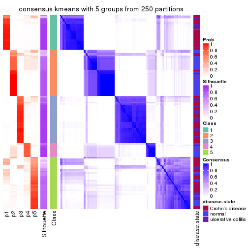</p>

</div>
<div id='tab-MAD-kmeans-consensus-heatmap-5'>
<pre><code class="r">consensus_heatmap(res, k = 6)
</code></pre>

<p></p>

</div>
</div>

Heatmaps for the membership of samples in all partitions to see how consistent they are:


<script>
$( function() {
	$( '#tabs-MAD-kmeans-membership-heatmap' ).tabs();
} );
</script>
<div id='tabs-MAD-kmeans-membership-heatmap'>
<ul>
<li><a href='#tab-MAD-kmeans-membership-heatmap-1'>k = 2</a></li>
<li><a href='#tab-MAD-kmeans-membership-heatmap-2'>k = 3</a></li>
<li><a href='#tab-MAD-kmeans-membership-heatmap-3'>k = 4</a></li>
<li><a href='#tab-MAD-kmeans-membership-heatmap-4'>k = 5</a></li>
<li><a href='#tab-MAD-kmeans-membership-heatmap-5'>k = 6</a></li>
</ul>
<div id='tab-MAD-kmeans-membership-heatmap-1'>
<pre><code class="r">membership_heatmap(res, k = 2)
</code></pre>

<p></p>

</div>
<div id='tab-MAD-kmeans-membership-heatmap-2'>
<pre><code class="r">membership_heatmap(res, k = 3)
</code></pre>

<p></p>

</div>
<div id='tab-MAD-kmeans-membership-heatmap-3'>
<pre><code class="r">membership_heatmap(res, k = 4)
</code></pre>

<p></p>

</div>
<div id='tab-MAD-kmeans-membership-heatmap-4'>
<pre><code class="r">membership_heatmap(res, k = 5)
</code></pre>

<p>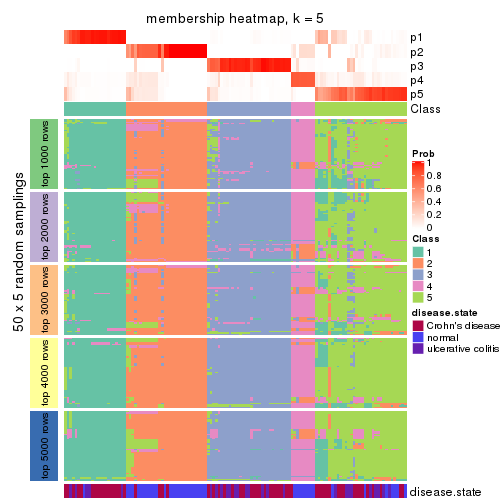</p>

</div>
<div id='tab-MAD-kmeans-membership-heatmap-5'>
<pre><code class="r">membership_heatmap(res, k = 6)
</code></pre>

<p></p>

</div>
</div>

As soon as we have had the classes for columns, we can look for signatures
which are significantly different between classes which can be candidate marks
for certain classes. Following are the heatmaps for signatures.


Signature heatmaps where rows are scaled:


<script>
$( function() {
	$( '#tabs-MAD-kmeans-get-signatures' ).tabs();
} );
</script>
<div id='tabs-MAD-kmeans-get-signatures'>
<ul>
<li><a href='#tab-MAD-kmeans-get-signatures-1'>k = 2</a></li>
<li><a href='#tab-MAD-kmeans-get-signatures-2'>k = 3</a></li>
<li><a href='#tab-MAD-kmeans-get-signatures-3'>k = 4</a></li>
<li><a href='#tab-MAD-kmeans-get-signatures-4'>k = 5</a></li>
<li><a href='#tab-MAD-kmeans-get-signatures-5'>k = 6</a></li>
</ul>
<div id='tab-MAD-kmeans-get-signatures-1'>
<pre><code class="r">get_signatures(res, k = 2)
</code></pre>

<p>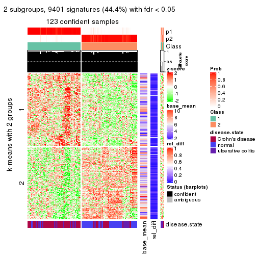</p>

</div>
<div id='tab-MAD-kmeans-get-signatures-2'>
<pre><code class="r">get_signatures(res, k = 3)
</code></pre>

<p></p>

</div>
<div id='tab-MAD-kmeans-get-signatures-3'>
<pre><code class="r">get_signatures(res, k = 4)
</code></pre>

<p></p>

</div>
<div id='tab-MAD-kmeans-get-signatures-4'>
<pre><code class="r">get_signatures(res, k = 5)
</code></pre>

<p></p>

</div>
<div id='tab-MAD-kmeans-get-signatures-5'>
<pre><code class="r">get_signatures(res, k = 6)
</code></pre>

<p></p>

</div>
</div>


Signature heatmaps where rows are not scaled:


<script>
$( function() {
	$( '#tabs-MAD-kmeans-get-signatures-no-scale' ).tabs();
} );
</script>
<div id='tabs-MAD-kmeans-get-signatures-no-scale'>
<ul>
<li><a href='#tab-MAD-kmeans-get-signatures-no-scale-1'>k = 2</a></li>
<li><a href='#tab-MAD-kmeans-get-signatures-no-scale-2'>k = 3</a></li>
<li><a href='#tab-MAD-kmeans-get-signatures-no-scale-3'>k = 4</a></li>
<li><a href='#tab-MAD-kmeans-get-signatures-no-scale-4'>k = 5</a></li>
<li><a href='#tab-MAD-kmeans-get-signatures-no-scale-5'>k = 6</a></li>
</ul>
<div id='tab-MAD-kmeans-get-signatures-no-scale-1'>
<pre><code class="r">get_signatures(res, k = 2, scale_rows = FALSE)
</code></pre>

<p></p>

</div>
<div id='tab-MAD-kmeans-get-signatures-no-scale-2'>
<pre><code class="r">get_signatures(res, k = 3, scale_rows = FALSE)
</code></pre>

<p></p>

</div>
<div id='tab-MAD-kmeans-get-signatures-no-scale-3'>
<pre><code class="r">get_signatures(res, k = 4, scale_rows = FALSE)
</code></pre>

<p></p>

</div>
<div id='tab-MAD-kmeans-get-signatures-no-scale-4'>
<pre><code class="r">get_signatures(res, k = 5, scale_rows = FALSE)
</code></pre>

<p></p>

</div>
<div id='tab-MAD-kmeans-get-signatures-no-scale-5'>
<pre><code class="r">get_signatures(res, k = 6, scale_rows = FALSE)
</code></pre>

<p></p>

</div>
</div>


Compare the overlap of signatures from different k:

```r
compare_signatures(res)
```


`get_signature()` returns a data frame invisibly. TO get the list of signatures, the function
call should be assigned to a variable explicitly. In following code, if `plot` argument is set
to `FALSE`, no heatmap is plotted while only the differential analysis is performed.

```r
# code only for demonstration
tb = get_signature(res, k = ..., plot = FALSE)
```

An example of the output of `tb` is:

```
#>   which_row         fdr    mean_1    mean_2 scaled_mean_1 scaled_mean_2 km
#> 1        38 0.042760348  8.373488  9.131774    -0.5533452     0.5164555  1
#> 2        40 0.018707592  7.106213  8.469186    -0.6173731     0.5762149  1
#> 3        55 0.019134737 10.221463 11.207825    -0.6159697     0.5749050  1
#> 4        59 0.006059896  5.921854  7.869574    -0.6899429     0.6439467  1
#> 5        60 0.018055526  8.928898 10.211722    -0.6204761     0.5791110  1
#> 6        98 0.009384629 15.714769 14.887706     0.6635654    -0.6193277  2
...
```

The columns in `tb` are:

1. `which_row`: row indices corresponding to the input matrix.
2. `fdr`: FDR for the differential test. 
3. `mean_x`: The mean value in group x.
4. `scaled_mean_x`: The mean value in group x after rows are scaled.
5. `km`: Row groups if k-means clustering is applied to rows.


UMAP plot which shows how samples are separated.


<script>
$( function() {
	$( '#tabs-MAD-kmeans-dimension-reduction' ).tabs();
} );
</script>
<div id='tabs-MAD-kmeans-dimension-reduction'>
<ul>
<li><a href='#tab-MAD-kmeans-dimension-reduction-1'>k = 2</a></li>
<li><a href='#tab-MAD-kmeans-dimension-reduction-2'>k = 3</a></li>
<li><a href='#tab-MAD-kmeans-dimension-reduction-3'>k = 4</a></li>
<li><a href='#tab-MAD-kmeans-dimension-reduction-4'>k = 5</a></li>
<li><a href='#tab-MAD-kmeans-dimension-reduction-5'>k = 6</a></li>
</ul>
<div id='tab-MAD-kmeans-dimension-reduction-1'>
<pre><code class="r">dimension_reduction(res, k = 2, method = &quot;UMAP&quot;)
</code></pre>

<p></p>

</div>
<div id='tab-MAD-kmeans-dimension-reduction-2'>
<pre><code class="r">dimension_reduction(res, k = 3, method = &quot;UMAP&quot;)
</code></pre>

<p></p>

</div>
<div id='tab-MAD-kmeans-dimension-reduction-3'>
<pre><code class="r">dimension_reduction(res, k = 4, method = &quot;UMAP&quot;)
</code></pre>

<p></p>

</div>
<div id='tab-MAD-kmeans-dimension-reduction-4'>
<pre><code class="r">dimension_reduction(res, k = 5, method = &quot;UMAP&quot;)
</code></pre>

<p></p>

</div>
<div id='tab-MAD-kmeans-dimension-reduction-5'>
<pre><code class="r">dimension_reduction(res, k = 6, method = &quot;UMAP&quot;)
</code></pre>

<p></p>

</div>
</div>


Following heatmap shows how subgroups are split when increasing `k`:

```r
collect_classes(res)
```


Test correlation between subgroups and known annotations. If the known
annotation is numeric, one-way ANOVA test is applied, and if the known
annotation is discrete, chi-squared contingency table test is applied.

```r
test_to_known_factors(res)
```

```
#>              n disease.state(p) k
#> MAD:kmeans 123         2.77e-10 2
#> MAD:kmeans 115         4.44e-13 3
#> MAD:kmeans  88         1.14e-14 4
#> MAD:kmeans 115         1.02e-13 5
#> MAD:kmeans 101         3.40e-14 6
```


If matrix rows can be associated to genes, consider to use `functional_enrichment(res,
...)` to perform function enrichment for the signature genes. See [this vignette](http://bioconductor.org/packages/devel/bioc/vignettes/cola/inst/doc/functional_enrichment.html) for more detailed explanations.


 

---------------------------------------------------


### MAD:skmeans**


The object with results only for a single top-value method and a single partition method 
can be extracted as:

```r
res = res_list["MAD", "skmeans"]
# you can also extract it by
# res = res_list["MAD:skmeans"]
```

A summary of `res` and all the functions that can be applied to it:

```r
res
```

```
#> A 'ConsensusPartition' object with k = 2, 3, 4, 5, 6.
#>   On a matrix with 21168 rows and 127 columns.
#>   Top rows (1000, 2000, 3000, 4000, 5000) are extracted by 'MAD' method.
#>   Subgroups are detected by 'skmeans' method.
#>   Performed in total 1250 partitions by row resampling.
#>   Best k for subgroups seems to be 2.
#> 
#> Following methods can be applied to this 'ConsensusPartition' object:
#>  [1] "cola_report"             "collect_classes"         "collect_plots"          
#>  [4] "collect_stats"           "colnames"                "compare_signatures"     
#>  [7] "consensus_heatmap"       "dimension_reduction"     "functional_enrichment"  
#> [10] "get_anno_col"            "get_anno"                "get_classes"            
#> [13] "get_consensus"           "get_matrix"              "get_membership"         
#> [16] "get_param"               "get_signatures"          "get_stats"              
#> [19] "is_best_k"               "is_stable_k"             "membership_heatmap"     
#> [22] "ncol"                    "nrow"                    "plot_ecdf"              
#> [25] "rownames"                "select_partition_number" "show"                   
#> [28] "suggest_best_k"          "test_to_known_factors"
```

`collect_plots()` function collects all the plots made from `res` for all `k` (number of partitions)
into one single page to provide an easy and fast comparison between different `k`.

```r
collect_plots(res)
```


The plots are:

- The first row: a plot of the ECDF (empirical cumulative distribution
  function) curves of the consensus matrix for each `k` and the heatmap of
  predicted classes for each `k`.
- The second row: heatmaps of the consensus matrix for each `k`.
- The third row: heatmaps of the membership matrix for each `k`.
- The fouth row: heatmaps of the signatures for each `k`.

All the plots in panels can be made by individual functions and they are
plotted later in this section.

`select_partition_number()` produces several plots showing different
statistics for choosing "optimized" `k`. There are following statistics:

- ECDF curves of the consensus matrix for each `k`;
- 1-PAC. [The PAC
  score](https://en.wikipedia.org/wiki/Consensus_clustering#Over-interpretation_potential_of_consensus_clustering)
  measures the proportion of the ambiguous subgrouping.
- Mean silhouette score.
- Concordance. The mean probability of fiting the consensus class ids in all
  partitions.
- Area increased. Denote $A_k$ as the area under the ECDF curve for current
  `k`, the area increased is defined as $A_k - A_{k-1}$.
- Rand index. The percent of pairs of samples that are both in a same cluster
  or both are not in a same cluster in the partition of k and k-1.
- Jaccard index. The ratio of pairs of samples are both in a same cluster in
  the partition of k and k-1 and the pairs of samples are both in a same
  cluster in the partition k or k-1.

The detailed explanations of these statistics can be found in [the _cola_
vignette](http://bioconductor.org/packages/devel/bioc/vignettes/cola/inst/doc/cola.html#toc_13).

Generally speaking, lower PAC score, higher mean silhouette score or higher
concordance corresponds to better partition. Rand index and Jaccard index
measure how similar the current partition is compared to partition with `k-1`.
If they are too similar, we won't accept `k` is better than `k-1`.

```r
select_partition_number(res)
```


The numeric values for all these statistics can be obtained by `get_stats()`.

```r
get_stats(res)
```

```
#>   k 1-PAC mean_silhouette concordance area_increased  Rand Jaccard
#> 2 2 1.000           0.967       0.985         0.5043 0.496   0.496
#> 3 3 0.842           0.884       0.947         0.3172 0.726   0.503
#> 4 4 0.644           0.655       0.822         0.1208 0.880   0.662
#> 5 5 0.677           0.618       0.799         0.0673 0.925   0.726
#> 6 6 0.673           0.526       0.747         0.0395 0.967   0.852
```

`suggest_best_k()` suggests the best $k$ based on these statistics. The rules are as follows:

- All $k$ with Jaccard index larger than 0.95 are removed because increasing
  $k$ does not provide enough extra information. If all $k$ are removed, it is
  marked as no subgroup is detected.
- For all $k$ with 1-PAC score larger than 0.9, the maximal $k$ is taken as
  the best $k$, and other $k$ are marked as optional $k$.
- If it does not fit the second rule. The $k$ with the maximal vote of the
  highest 1-PAC score, highest mean silhouette, and highest concordance is
  taken as the best $k$.

```r
suggest_best_k(res)
```

```
#> [1] 2
```


Following shows the table of the partitions (You need to click the **show/hide
code output** link to see it). The membership matrix (columns with name `p*`)
is inferred by
[`clue::cl_consensus()`](https://www.rdocumentation.org/link/cl_consensus?package=clue)
function with the `SE` method. Basically the value in the membership matrix
represents the probability to belong to a certain group. The finall class
label for an item is determined with the group with highest probability it
belongs to.

In `get_classes()` function, the entropy is calculated from the membership
matrix and the silhouette score is calculated from the consensus matrix.


<script>
$( function() {
	$( '#tabs-MAD-skmeans-get-classes' ).tabs();
} );
</script>
<div id='tabs-MAD-skmeans-get-classes'>
<ul>
<li><a href='#tab-MAD-skmeans-get-classes-1'>k = 2</a></li>
<li><a href='#tab-MAD-skmeans-get-classes-2'>k = 3</a></li>
<li><a href='#tab-MAD-skmeans-get-classes-3'>k = 4</a></li>
<li><a href='#tab-MAD-skmeans-get-classes-4'>k = 5</a></li>
<li><a href='#tab-MAD-skmeans-get-classes-5'>k = 6</a></li>
</ul>

<div id='tab-MAD-skmeans-get-classes-1'>
<p><a id='tab-MAD-skmeans-get-classes-1-a' style='color:#0366d6' href='#'>show/hide code output</a></p>
<pre><code class="r">cbind(get_classes(res, k = 2), get_membership(res, k = 2))
</code></pre>

<pre><code>#&gt;          class entropy silhouette    p1    p2
#&gt; GSM76115     2  0.0000      0.987 0.000 1.000
#&gt; GSM76116     2  0.0000      0.987 0.000 1.000
#&gt; GSM76117     2  0.1843      0.965 0.028 0.972
#&gt; GSM76118     2  0.0376      0.984 0.004 0.996
#&gt; GSM76119     2  0.0000      0.987 0.000 1.000
#&gt; GSM76120     2  0.0000      0.987 0.000 1.000
#&gt; GSM76121     1  0.1633      0.963 0.976 0.024
#&gt; GSM76122     2  0.0000      0.987 0.000 1.000
#&gt; GSM76123     2  0.0000      0.987 0.000 1.000
#&gt; GSM76124     2  0.0000      0.987 0.000 1.000
#&gt; GSM76125     2  0.0000      0.987 0.000 1.000
#&gt; GSM76126     2  0.0000      0.987 0.000 1.000
#&gt; GSM76127     2  0.0000      0.987 0.000 1.000
#&gt; GSM76128     1  0.8955      0.559 0.688 0.312
#&gt; GSM76129     2  0.0000      0.987 0.000 1.000
#&gt; GSM76130     2  0.0000      0.987 0.000 1.000
#&gt; GSM76131     2  0.0000      0.987 0.000 1.000
#&gt; GSM76132     2  0.0000      0.987 0.000 1.000
#&gt; GSM76133     2  0.0000      0.987 0.000 1.000
#&gt; GSM76134     2  0.0000      0.987 0.000 1.000
#&gt; GSM76135     2  0.0000      0.987 0.000 1.000
#&gt; GSM76136     2  0.0000      0.987 0.000 1.000
#&gt; GSM76137     2  0.0000      0.987 0.000 1.000
#&gt; GSM76138     2  0.0000      0.987 0.000 1.000
#&gt; GSM76139     2  0.0000      0.987 0.000 1.000
#&gt; GSM76140     1  0.0000      0.982 1.000 0.000
#&gt; GSM76141     2  0.0000      0.987 0.000 1.000
#&gt; GSM76142     2  0.0000      0.987 0.000 1.000
#&gt; GSM76143     2  0.0000      0.987 0.000 1.000
#&gt; GSM76144     2  0.0000      0.987 0.000 1.000
#&gt; GSM76145     2  0.0000      0.987 0.000 1.000
#&gt; GSM76146     2  0.0000      0.987 0.000 1.000
#&gt; GSM76147     2  0.0000      0.987 0.000 1.000
#&gt; GSM76148     2  0.0000      0.987 0.000 1.000
#&gt; GSM76149     2  0.0000      0.987 0.000 1.000
#&gt; GSM76150     2  0.0000      0.987 0.000 1.000
#&gt; GSM76151     2  0.0000      0.987 0.000 1.000
#&gt; GSM76152     1  0.0000      0.982 1.000 0.000
#&gt; GSM76153     2  0.0000      0.987 0.000 1.000
#&gt; GSM76154     2  0.0000      0.987 0.000 1.000
#&gt; GSM76155     2  0.0000      0.987 0.000 1.000
#&gt; GSM76156     2  0.0000      0.987 0.000 1.000
#&gt; GSM76030     2  0.0938      0.978 0.012 0.988
#&gt; GSM76031     1  0.0000      0.982 1.000 0.000
#&gt; GSM76032     1  0.0000      0.982 1.000 0.000
#&gt; GSM76033     1  0.1414      0.967 0.980 0.020
#&gt; GSM76034     2  0.0000      0.987 0.000 1.000
#&gt; GSM76035     1  0.0000      0.982 1.000 0.000
#&gt; GSM76036     2  0.0000      0.987 0.000 1.000
#&gt; GSM76037     2  0.0000      0.987 0.000 1.000
#&gt; GSM76038     1  0.0000      0.982 1.000 0.000
#&gt; GSM76039     1  0.0000      0.982 1.000 0.000
#&gt; GSM76040     2  0.0000      0.987 0.000 1.000
#&gt; GSM76041     1  0.0000      0.982 1.000 0.000
#&gt; GSM76042     1  0.0000      0.982 1.000 0.000
#&gt; GSM76043     1  0.0000      0.982 1.000 0.000
#&gt; GSM76044     1  0.9170      0.497 0.668 0.332
#&gt; GSM76045     1  0.0000      0.982 1.000 0.000
#&gt; GSM76046     2  0.0938      0.978 0.012 0.988
#&gt; GSM76047     1  0.0000      0.982 1.000 0.000
#&gt; GSM76048     1  0.0000      0.982 1.000 0.000
#&gt; GSM76049     2  0.8909      0.563 0.308 0.692
#&gt; GSM76050     1  0.0000      0.982 1.000 0.000
#&gt; GSM76051     1  0.2948      0.936 0.948 0.052
#&gt; GSM76052     2  0.3879      0.918 0.076 0.924
#&gt; GSM76053     2  0.3733      0.923 0.072 0.928
#&gt; GSM76054     2  0.0000      0.987 0.000 1.000
#&gt; GSM76055     2  0.0672      0.981 0.008 0.992
#&gt; GSM76056     1  0.0000      0.982 1.000 0.000
#&gt; GSM76057     1  0.0938      0.973 0.988 0.012
#&gt; GSM76058     1  0.0000      0.982 1.000 0.000
#&gt; GSM76059     1  0.0000      0.982 1.000 0.000
#&gt; GSM76060     1  0.0000      0.982 1.000 0.000
#&gt; GSM76061     2  0.4022      0.914 0.080 0.920
#&gt; GSM76062     1  0.0000      0.982 1.000 0.000
#&gt; GSM76063     2  0.0000      0.987 0.000 1.000
#&gt; GSM76064     1  0.0000      0.982 1.000 0.000
#&gt; GSM76065     2  0.0000      0.987 0.000 1.000
#&gt; GSM76066     1  0.0000      0.982 1.000 0.000
#&gt; GSM76067     1  0.0000      0.982 1.000 0.000
#&gt; GSM76068     1  0.0000      0.982 1.000 0.000
#&gt; GSM76069     1  0.0000      0.982 1.000 0.000
#&gt; GSM76070     2  0.0000      0.987 0.000 1.000
#&gt; GSM76071     1  0.0000      0.982 1.000 0.000
#&gt; GSM76072     1  0.0000      0.982 1.000 0.000
#&gt; GSM76073     1  0.0000      0.982 1.000 0.000
#&gt; GSM76074     1  0.0000      0.982 1.000 0.000
#&gt; GSM76075     1  0.0000      0.982 1.000 0.000
#&gt; GSM76076     1  0.0000      0.982 1.000 0.000
#&gt; GSM76077     1  0.0376      0.979 0.996 0.004
#&gt; GSM76078     1  0.0000      0.982 1.000 0.000
#&gt; GSM76079     1  0.0000      0.982 1.000 0.000
#&gt; GSM76080     2  0.0000      0.987 0.000 1.000
#&gt; GSM76081     2  0.0000      0.987 0.000 1.000
#&gt; GSM76082     1  0.0000      0.982 1.000 0.000
#&gt; GSM76083     1  0.1414      0.967 0.980 0.020
#&gt; GSM76084     2  0.0000      0.987 0.000 1.000
#&gt; GSM76085     1  0.0000      0.982 1.000 0.000
#&gt; GSM76086     1  0.0000      0.982 1.000 0.000
#&gt; GSM76087     2  0.0000      0.987 0.000 1.000
#&gt; GSM76088     1  0.0000      0.982 1.000 0.000
#&gt; GSM76089     2  0.0000      0.987 0.000 1.000
#&gt; GSM76090     1  0.0000      0.982 1.000 0.000
#&gt; GSM76091     1  0.0000      0.982 1.000 0.000
#&gt; GSM76092     1  0.0000      0.982 1.000 0.000
#&gt; GSM76093     1  0.0000      0.982 1.000 0.000
#&gt; GSM76094     2  0.1414      0.972 0.020 0.980
#&gt; GSM76095     1  0.0000      0.982 1.000 0.000
#&gt; GSM76096     1  0.0000      0.982 1.000 0.000
#&gt; GSM76097     1  0.0000      0.982 1.000 0.000
#&gt; GSM76098     2  0.0000      0.987 0.000 1.000
#&gt; GSM76099     1  0.0000      0.982 1.000 0.000
#&gt; GSM76100     1  0.0000      0.982 1.000 0.000
#&gt; GSM76101     1  0.0000      0.982 1.000 0.000
#&gt; GSM76102     1  0.0000      0.982 1.000 0.000
#&gt; GSM76103     1  0.0000      0.982 1.000 0.000
#&gt; GSM76104     1  0.8327      0.650 0.736 0.264
#&gt; GSM76105     2  0.5059      0.878 0.112 0.888
#&gt; GSM76106     2  0.0000      0.987 0.000 1.000
#&gt; GSM76107     2  0.0000      0.987 0.000 1.000
#&gt; GSM76108     1  0.1843      0.959 0.972 0.028
#&gt; GSM76109     1  0.0000      0.982 1.000 0.000
#&gt; GSM76110     1  0.0000      0.982 1.000 0.000
#&gt; GSM76111     1  0.0000      0.982 1.000 0.000
#&gt; GSM76112     1  0.0000      0.982 1.000 0.000
#&gt; GSM76113     2  0.4562      0.895 0.096 0.904
#&gt; GSM76114     1  0.0000      0.982 1.000 0.000
</code></pre>

<script>
$('#tab-MAD-skmeans-get-classes-1-a').parent().next().next().hide();
$('#tab-MAD-skmeans-get-classes-1-a').click(function(){
  $('#tab-MAD-skmeans-get-classes-1-a').parent().next().next().toggle();
  return(false);
});
</script>
</div>

<div id='tab-MAD-skmeans-get-classes-2'>
<p><a id='tab-MAD-skmeans-get-classes-2-a' style='color:#0366d6' href='#'>show/hide code output</a></p>
<pre><code class="r">cbind(get_classes(res, k = 3), get_membership(res, k = 3))
</code></pre>

<pre><code>#&gt;          class entropy silhouette    p1    p2    p3
#&gt; GSM76115     2  0.0000      0.944 0.000 1.000 0.000
#&gt; GSM76116     2  0.0000      0.944 0.000 1.000 0.000
#&gt; GSM76117     1  0.6095      0.385 0.608 0.392 0.000
#&gt; GSM76118     1  0.6244      0.246 0.560 0.440 0.000
#&gt; GSM76119     2  0.2711      0.897 0.000 0.912 0.088
#&gt; GSM76120     2  0.2959      0.888 0.000 0.900 0.100
#&gt; GSM76121     1  0.0237      0.944 0.996 0.000 0.004
#&gt; GSM76122     2  0.2261      0.895 0.068 0.932 0.000
#&gt; GSM76123     2  0.2959      0.888 0.000 0.900 0.100
#&gt; GSM76124     2  0.6180      0.248 0.416 0.584 0.000
#&gt; GSM76125     2  0.2796      0.894 0.000 0.908 0.092
#&gt; GSM76126     2  0.4346      0.802 0.000 0.816 0.184
#&gt; GSM76127     2  0.2959      0.888 0.000 0.900 0.100
#&gt; GSM76128     3  0.0000      0.931 0.000 0.000 1.000
#&gt; GSM76129     2  0.0000      0.944 0.000 1.000 0.000
#&gt; GSM76130     2  0.2625      0.899 0.000 0.916 0.084
#&gt; GSM76131     2  0.0000      0.944 0.000 1.000 0.000
#&gt; GSM76132     2  0.0000      0.944 0.000 1.000 0.000
#&gt; GSM76133     2  0.0000      0.944 0.000 1.000 0.000
#&gt; GSM76134     2  0.0000      0.944 0.000 1.000 0.000
#&gt; GSM76135     2  0.0000      0.944 0.000 1.000 0.000
#&gt; GSM76136     2  0.0000      0.944 0.000 1.000 0.000
#&gt; GSM76137     2  0.0592      0.939 0.000 0.988 0.012
#&gt; GSM76138     2  0.0000      0.944 0.000 1.000 0.000
#&gt; GSM76139     2  0.0000      0.944 0.000 1.000 0.000
#&gt; GSM76140     1  0.0000      0.947 1.000 0.000 0.000
#&gt; GSM76141     2  0.0000      0.944 0.000 1.000 0.000
#&gt; GSM76142     2  0.0000      0.944 0.000 1.000 0.000
#&gt; GSM76143     2  0.0000      0.944 0.000 1.000 0.000
#&gt; GSM76144     2  0.0000      0.944 0.000 1.000 0.000
#&gt; GSM76145     2  0.0237      0.943 0.000 0.996 0.004
#&gt; GSM76146     2  0.0000      0.944 0.000 1.000 0.000
#&gt; GSM76147     2  0.0000      0.944 0.000 1.000 0.000
#&gt; GSM76148     2  0.0000      0.944 0.000 1.000 0.000
#&gt; GSM76149     2  0.0000      0.944 0.000 1.000 0.000
#&gt; GSM76150     2  0.0000      0.944 0.000 1.000 0.000
#&gt; GSM76151     2  0.0237      0.943 0.000 0.996 0.004
#&gt; GSM76152     1  0.0000      0.947 1.000 0.000 0.000
#&gt; GSM76153     2  0.0000      0.944 0.000 1.000 0.000
#&gt; GSM76154     2  0.0000      0.944 0.000 1.000 0.000
#&gt; GSM76155     2  0.0000      0.944 0.000 1.000 0.000
#&gt; GSM76156     2  0.0000      0.944 0.000 1.000 0.000
#&gt; GSM76030     2  0.5147      0.760 0.020 0.800 0.180
#&gt; GSM76031     1  0.0000      0.947 1.000 0.000 0.000
#&gt; GSM76032     3  0.0592      0.928 0.012 0.000 0.988
#&gt; GSM76033     3  0.0000      0.931 0.000 0.000 1.000
#&gt; GSM76034     2  0.5178      0.689 0.000 0.744 0.256
#&gt; GSM76035     3  0.0424      0.930 0.008 0.000 0.992
#&gt; GSM76036     3  0.0000      0.931 0.000 0.000 1.000
#&gt; GSM76037     2  0.0000      0.944 0.000 1.000 0.000
#&gt; GSM76038     1  0.0000      0.947 1.000 0.000 0.000
#&gt; GSM76039     1  0.0000      0.947 1.000 0.000 0.000
#&gt; GSM76040     3  0.0000      0.931 0.000 0.000 1.000
#&gt; GSM76041     1  0.0237      0.944 0.996 0.000 0.004
#&gt; GSM76042     1  0.0000      0.947 1.000 0.000 0.000
#&gt; GSM76043     3  0.6204      0.335 0.424 0.000 0.576
#&gt; GSM76044     1  0.0592      0.938 0.988 0.012 0.000
#&gt; GSM76045     1  0.0000      0.947 1.000 0.000 0.000
#&gt; GSM76046     3  0.0000      0.931 0.000 0.000 1.000
#&gt; GSM76047     3  0.4750      0.751 0.216 0.000 0.784
#&gt; GSM76048     3  0.0000      0.931 0.000 0.000 1.000
#&gt; GSM76049     1  0.7091      0.284 0.560 0.416 0.024
#&gt; GSM76050     1  0.0592      0.938 0.988 0.000 0.012
#&gt; GSM76051     3  0.0000      0.931 0.000 0.000 1.000
#&gt; GSM76052     3  0.0000      0.931 0.000 0.000 1.000
#&gt; GSM76053     3  0.5254      0.604 0.000 0.264 0.736
#&gt; GSM76054     3  0.0000      0.931 0.000 0.000 1.000
#&gt; GSM76055     2  0.5465      0.578 0.288 0.712 0.000
#&gt; GSM76056     1  0.0000      0.947 1.000 0.000 0.000
#&gt; GSM76057     1  0.2682      0.883 0.920 0.076 0.004
#&gt; GSM76058     3  0.0892      0.925 0.020 0.000 0.980
#&gt; GSM76059     1  0.0000      0.947 1.000 0.000 0.000
#&gt; GSM76060     3  0.6956      0.576 0.300 0.040 0.660
#&gt; GSM76061     2  0.3752      0.858 0.096 0.884 0.020
#&gt; GSM76062     1  0.0000      0.947 1.000 0.000 0.000
#&gt; GSM76063     2  0.4346      0.795 0.000 0.816 0.184
#&gt; GSM76064     3  0.5098      0.705 0.248 0.000 0.752
#&gt; GSM76065     2  0.0000      0.944 0.000 1.000 0.000
#&gt; GSM76066     1  0.2165      0.890 0.936 0.000 0.064
#&gt; GSM76067     3  0.2878      0.876 0.096 0.000 0.904
#&gt; GSM76068     3  0.0000      0.931 0.000 0.000 1.000
#&gt; GSM76069     1  0.0000      0.947 1.000 0.000 0.000
#&gt; GSM76070     2  0.0000      0.944 0.000 1.000 0.000
#&gt; GSM76071     1  0.0000      0.947 1.000 0.000 0.000
#&gt; GSM76072     1  0.0000      0.947 1.000 0.000 0.000
#&gt; GSM76073     1  0.0000      0.947 1.000 0.000 0.000
#&gt; GSM76074     1  0.0000      0.947 1.000 0.000 0.000
#&gt; GSM76075     3  0.0237      0.931 0.004 0.000 0.996
#&gt; GSM76076     3  0.0000      0.931 0.000 0.000 1.000
#&gt; GSM76077     1  0.2434      0.906 0.940 0.024 0.036
#&gt; GSM76078     3  0.2537      0.888 0.080 0.000 0.920
#&gt; GSM76079     1  0.0000      0.947 1.000 0.000 0.000
#&gt; GSM76080     3  0.0237      0.929 0.000 0.004 0.996
#&gt; GSM76081     3  0.0000      0.931 0.000 0.000 1.000
#&gt; GSM76082     3  0.0000      0.931 0.000 0.000 1.000
#&gt; GSM76083     3  0.0000      0.931 0.000 0.000 1.000
#&gt; GSM76084     2  0.3038      0.887 0.000 0.896 0.104
#&gt; GSM76085     3  0.0000      0.931 0.000 0.000 1.000
#&gt; GSM76086     3  0.2711      0.882 0.088 0.000 0.912
#&gt; GSM76087     2  0.0000      0.944 0.000 1.000 0.000
#&gt; GSM76088     1  0.2939      0.876 0.916 0.012 0.072
#&gt; GSM76089     2  0.0000      0.944 0.000 1.000 0.000
#&gt; GSM76090     3  0.1643      0.912 0.044 0.000 0.956
#&gt; GSM76091     1  0.0000      0.947 1.000 0.000 0.000
#&gt; GSM76092     1  0.0000      0.947 1.000 0.000 0.000
#&gt; GSM76093     1  0.0000      0.947 1.000 0.000 0.000
#&gt; GSM76094     1  0.6008      0.432 0.628 0.372 0.000
#&gt; GSM76095     1  0.0000      0.947 1.000 0.000 0.000
#&gt; GSM76096     1  0.0000      0.947 1.000 0.000 0.000
#&gt; GSM76097     1  0.0000      0.947 1.000 0.000 0.000
#&gt; GSM76098     3  0.0000      0.931 0.000 0.000 1.000
#&gt; GSM76099     1  0.0000      0.947 1.000 0.000 0.000
#&gt; GSM76100     1  0.0000      0.947 1.000 0.000 0.000
#&gt; GSM76101     1  0.0000      0.947 1.000 0.000 0.000
#&gt; GSM76102     1  0.0000      0.947 1.000 0.000 0.000
#&gt; GSM76103     3  0.2711      0.882 0.088 0.000 0.912
#&gt; GSM76104     3  0.0000      0.931 0.000 0.000 1.000
#&gt; GSM76105     1  0.3412      0.835 0.876 0.124 0.000
#&gt; GSM76106     3  0.3686      0.803 0.000 0.140 0.860
#&gt; GSM76107     2  0.3116      0.882 0.000 0.892 0.108
#&gt; GSM76108     1  0.0237      0.944 0.996 0.004 0.000
#&gt; GSM76109     1  0.0000      0.947 1.000 0.000 0.000
#&gt; GSM76110     1  0.0000      0.947 1.000 0.000 0.000
#&gt; GSM76111     1  0.0000      0.947 1.000 0.000 0.000
#&gt; GSM76112     1  0.0000      0.947 1.000 0.000 0.000
#&gt; GSM76113     3  0.3425      0.841 0.004 0.112 0.884
#&gt; GSM76114     1  0.0000      0.947 1.000 0.000 0.000
</code></pre>

<script>
$('#tab-MAD-skmeans-get-classes-2-a').parent().next().next().hide();
$('#tab-MAD-skmeans-get-classes-2-a').click(function(){
  $('#tab-MAD-skmeans-get-classes-2-a').parent().next().next().toggle();
  return(false);
});
</script>
</div>

<div id='tab-MAD-skmeans-get-classes-3'>
<p><a id='tab-MAD-skmeans-get-classes-3-a' style='color:#0366d6' href='#'>show/hide code output</a></p>
<pre><code class="r">cbind(get_classes(res, k = 4), get_membership(res, k = 4))
</code></pre>

<pre><code>#&gt;          class entropy silhouette    p1    p2    p3    p4
#&gt; GSM76115     4  0.5000    -0.2569 0.000 0.496 0.000 0.504
#&gt; GSM76116     2  0.4955     0.4397 0.000 0.556 0.000 0.444
#&gt; GSM76117     4  0.7398     0.2748 0.376 0.168 0.000 0.456
#&gt; GSM76118     4  0.7389     0.2873 0.272 0.212 0.000 0.516
#&gt; GSM76119     4  0.3895     0.6468 0.000 0.132 0.036 0.832
#&gt; GSM76120     4  0.3931     0.6487 0.000 0.128 0.040 0.832
#&gt; GSM76121     1  0.4746     0.3804 0.632 0.000 0.000 0.368
#&gt; GSM76122     4  0.5910     0.3376 0.088 0.236 0.000 0.676
#&gt; GSM76123     4  0.3931     0.6487 0.000 0.128 0.040 0.832
#&gt; GSM76124     4  0.7421     0.2708 0.268 0.220 0.000 0.512
#&gt; GSM76125     4  0.3895     0.6468 0.000 0.132 0.036 0.832
#&gt; GSM76126     4  0.3991     0.6486 0.000 0.120 0.048 0.832
#&gt; GSM76127     4  0.3931     0.6487 0.000 0.128 0.040 0.832
#&gt; GSM76128     4  0.4444     0.4914 0.020 0.008 0.184 0.788
#&gt; GSM76129     2  0.4916     0.3276 0.000 0.576 0.000 0.424
#&gt; GSM76130     4  0.3803     0.6454 0.000 0.132 0.032 0.836
#&gt; GSM76131     2  0.0000     0.7713 0.000 1.000 0.000 0.000
#&gt; GSM76132     2  0.0000     0.7713 0.000 1.000 0.000 0.000
#&gt; GSM76133     2  0.0000     0.7713 0.000 1.000 0.000 0.000
#&gt; GSM76134     2  0.4103     0.6134 0.000 0.744 0.000 0.256
#&gt; GSM76135     2  0.0000     0.7713 0.000 1.000 0.000 0.000
#&gt; GSM76136     2  0.0000     0.7713 0.000 1.000 0.000 0.000
#&gt; GSM76137     2  0.4981     0.2019 0.000 0.536 0.000 0.464
#&gt; GSM76138     2  0.4585     0.5692 0.000 0.668 0.000 0.332
#&gt; GSM76139     2  0.0469     0.7671 0.000 0.988 0.000 0.012
#&gt; GSM76140     1  0.2011     0.8579 0.920 0.000 0.000 0.080
#&gt; GSM76141     2  0.0000     0.7713 0.000 1.000 0.000 0.000
#&gt; GSM76142     2  0.0000     0.7713 0.000 1.000 0.000 0.000
#&gt; GSM76143     2  0.0000     0.7713 0.000 1.000 0.000 0.000
#&gt; GSM76144     2  0.0000     0.7713 0.000 1.000 0.000 0.000
#&gt; GSM76145     2  0.4522     0.5315 0.000 0.680 0.000 0.320
#&gt; GSM76146     2  0.0000     0.7713 0.000 1.000 0.000 0.000
#&gt; GSM76147     2  0.0469     0.7675 0.000 0.988 0.000 0.012
#&gt; GSM76148     2  0.0000     0.7713 0.000 1.000 0.000 0.000
#&gt; GSM76149     2  0.4250     0.5897 0.000 0.724 0.000 0.276
#&gt; GSM76150     2  0.4331     0.5746 0.000 0.712 0.000 0.288
#&gt; GSM76151     2  0.4790     0.4221 0.000 0.620 0.000 0.380
#&gt; GSM76152     1  0.0188     0.8914 0.996 0.000 0.004 0.000
#&gt; GSM76153     2  0.0000     0.7713 0.000 1.000 0.000 0.000
#&gt; GSM76154     2  0.4040     0.6273 0.000 0.752 0.000 0.248
#&gt; GSM76155     2  0.3726     0.6664 0.000 0.788 0.000 0.212
#&gt; GSM76156     2  0.0000     0.7713 0.000 1.000 0.000 0.000
#&gt; GSM76030     2  0.4410     0.6656 0.000 0.808 0.064 0.128
#&gt; GSM76031     1  0.0188     0.8914 0.996 0.000 0.004 0.000
#&gt; GSM76032     3  0.0817     0.7842 0.024 0.000 0.976 0.000
#&gt; GSM76033     3  0.3726     0.6992 0.000 0.000 0.788 0.212
#&gt; GSM76034     4  0.6300     0.5161 0.000 0.252 0.108 0.640
#&gt; GSM76035     3  0.4285     0.7308 0.040 0.000 0.804 0.156
#&gt; GSM76036     3  0.3123     0.7312 0.000 0.000 0.844 0.156
#&gt; GSM76037     2  0.4920     0.5499 0.004 0.628 0.000 0.368
#&gt; GSM76038     1  0.0336     0.8911 0.992 0.000 0.008 0.000
#&gt; GSM76039     1  0.1940     0.8619 0.924 0.000 0.000 0.076
#&gt; GSM76040     3  0.3873     0.6829 0.000 0.000 0.772 0.228
#&gt; GSM76041     1  0.3688     0.7447 0.792 0.000 0.208 0.000
#&gt; GSM76042     1  0.1637     0.8739 0.940 0.000 0.000 0.060
#&gt; GSM76043     3  0.4936     0.3330 0.372 0.000 0.624 0.004
#&gt; GSM76044     1  0.3895     0.7599 0.804 0.012 0.000 0.184
#&gt; GSM76045     1  0.2944     0.8247 0.868 0.000 0.128 0.004
#&gt; GSM76046     3  0.4981     0.3757 0.000 0.000 0.536 0.464
#&gt; GSM76047     3  0.5558     0.4490 0.324 0.000 0.640 0.036
#&gt; GSM76048     3  0.0817     0.7852 0.000 0.000 0.976 0.024
#&gt; GSM76049     2  0.7521     0.4205 0.184 0.612 0.044 0.160
#&gt; GSM76050     1  0.1940     0.8641 0.924 0.000 0.076 0.000
#&gt; GSM76051     3  0.0592     0.7866 0.000 0.000 0.984 0.016
#&gt; GSM76052     3  0.4222     0.6452 0.000 0.000 0.728 0.272
#&gt; GSM76053     4  0.4391     0.3207 0.000 0.008 0.252 0.740
#&gt; GSM76054     3  0.2589     0.7527 0.000 0.000 0.884 0.116
#&gt; GSM76055     2  0.7475     0.1931 0.180 0.448 0.000 0.372
#&gt; GSM76056     1  0.2275     0.8733 0.928 0.020 0.004 0.048
#&gt; GSM76057     2  0.8407     0.2256 0.244 0.524 0.160 0.072
#&gt; GSM76058     3  0.0817     0.7842 0.024 0.000 0.976 0.000
#&gt; GSM76059     1  0.0188     0.8914 0.996 0.000 0.004 0.000
#&gt; GSM76060     3  0.7227     0.3811 0.092 0.308 0.572 0.028
#&gt; GSM76061     2  0.3190     0.7098 0.008 0.880 0.016 0.096
#&gt; GSM76062     1  0.1022     0.8842 0.968 0.000 0.032 0.000
#&gt; GSM76063     2  0.4706     0.5724 0.000 0.788 0.072 0.140
#&gt; GSM76064     3  0.4139     0.6638 0.176 0.000 0.800 0.024
#&gt; GSM76065     2  0.2921     0.6906 0.000 0.860 0.000 0.140
#&gt; GSM76066     1  0.4585     0.5426 0.668 0.000 0.332 0.000
#&gt; GSM76067     3  0.1474     0.7741 0.052 0.000 0.948 0.000
#&gt; GSM76068     3  0.0336     0.7871 0.008 0.000 0.992 0.000
#&gt; GSM76069     1  0.2197     0.8797 0.928 0.000 0.024 0.048
#&gt; GSM76070     2  0.1211     0.7567 0.000 0.960 0.000 0.040
#&gt; GSM76071     1  0.1211     0.8811 0.960 0.000 0.040 0.000
#&gt; GSM76072     1  0.0592     0.8893 0.984 0.000 0.016 0.000
#&gt; GSM76073     1  0.0188     0.8914 0.996 0.000 0.004 0.000
#&gt; GSM76074     1  0.0188     0.8914 0.996 0.000 0.004 0.000
#&gt; GSM76075     3  0.0000     0.7870 0.000 0.000 1.000 0.000
#&gt; GSM76076     3  0.0000     0.7870 0.000 0.000 1.000 0.000
#&gt; GSM76077     1  0.9048     0.3406 0.476 0.172 0.224 0.128
#&gt; GSM76078     3  0.2467     0.7618 0.052 0.024 0.920 0.004
#&gt; GSM76079     1  0.0188     0.8914 0.996 0.000 0.004 0.000
#&gt; GSM76080     3  0.5399     0.3390 0.000 0.012 0.520 0.468
#&gt; GSM76081     3  0.4697     0.6087 0.000 0.008 0.696 0.296
#&gt; GSM76082     3  0.0336     0.7871 0.008 0.000 0.992 0.000
#&gt; GSM76083     3  0.0000     0.7870 0.000 0.000 1.000 0.000
#&gt; GSM76084     4  0.6337     0.0284 0.000 0.468 0.060 0.472
#&gt; GSM76085     3  0.0592     0.7868 0.000 0.000 0.984 0.016
#&gt; GSM76086     3  0.1389     0.7752 0.048 0.000 0.952 0.000
#&gt; GSM76087     2  0.3311     0.6897 0.000 0.828 0.000 0.172
#&gt; GSM76088     1  0.8897     0.1275 0.388 0.268 0.292 0.052
#&gt; GSM76089     2  0.3801     0.6914 0.000 0.780 0.000 0.220
#&gt; GSM76090     3  0.1118     0.7798 0.036 0.000 0.964 0.000
#&gt; GSM76091     1  0.2760     0.8275 0.872 0.000 0.128 0.000
#&gt; GSM76092     1  0.0188     0.8914 0.996 0.000 0.004 0.000
#&gt; GSM76093     1  0.0188     0.8914 0.996 0.000 0.004 0.000
#&gt; GSM76094     4  0.7081     0.1378 0.424 0.124 0.000 0.452
#&gt; GSM76095     1  0.2149     0.8582 0.912 0.000 0.000 0.088
#&gt; GSM76096     1  0.1389     0.8796 0.952 0.000 0.000 0.048
#&gt; GSM76097     1  0.1940     0.8671 0.924 0.000 0.000 0.076
#&gt; GSM76098     3  0.5476     0.4583 0.000 0.020 0.584 0.396
#&gt; GSM76099     1  0.0921     0.8851 0.972 0.000 0.000 0.028
#&gt; GSM76100     1  0.0188     0.8898 0.996 0.000 0.000 0.004
#&gt; GSM76101     1  0.0188     0.8914 0.996 0.000 0.004 0.000
#&gt; GSM76102     1  0.2412     0.8501 0.908 0.000 0.008 0.084
#&gt; GSM76103     3  0.1389     0.7755 0.048 0.000 0.952 0.000
#&gt; GSM76104     3  0.5163     0.3370 0.000 0.004 0.516 0.480
#&gt; GSM76105     4  0.5912     0.0837 0.440 0.036 0.000 0.524
#&gt; GSM76106     4  0.4508     0.5099 0.000 0.036 0.184 0.780
#&gt; GSM76107     4  0.3616     0.6483 0.000 0.112 0.036 0.852
#&gt; GSM76108     1  0.3074     0.8058 0.848 0.000 0.000 0.152
#&gt; GSM76109     1  0.0188     0.8914 0.996 0.000 0.004 0.000
#&gt; GSM76110     1  0.0000     0.8905 1.000 0.000 0.000 0.000
#&gt; GSM76111     1  0.0000     0.8905 1.000 0.000 0.000 0.000
#&gt; GSM76112     1  0.2973     0.8129 0.856 0.000 0.144 0.000
#&gt; GSM76113     3  0.8334     0.1575 0.028 0.236 0.456 0.280
#&gt; GSM76114     1  0.3718     0.7827 0.820 0.000 0.168 0.012
</code></pre>

<script>
$('#tab-MAD-skmeans-get-classes-3-a').parent().next().next().hide();
$('#tab-MAD-skmeans-get-classes-3-a').click(function(){
  $('#tab-MAD-skmeans-get-classes-3-a').parent().next().next().toggle();
  return(false);
});
</script>
</div>

<div id='tab-MAD-skmeans-get-classes-4'>
<p><a id='tab-MAD-skmeans-get-classes-4-a' style='color:#0366d6' href='#'>show/hide code output</a></p>
<pre><code class="r">cbind(get_classes(res, k = 5), get_membership(res, k = 5))
</code></pre>

<pre><code>#&gt;          class entropy silhouette    p1    p2    p3    p4    p5
#&gt; GSM76115     5  0.6765     0.0661 0.000 0.304 0.000 0.296 0.400
#&gt; GSM76116     5  0.4737     0.5075 0.000 0.224 0.000 0.068 0.708
#&gt; GSM76117     5  0.5471     0.6811 0.176 0.036 0.000 0.084 0.704
#&gt; GSM76118     5  0.4506     0.7145 0.076 0.048 0.000 0.080 0.796
#&gt; GSM76119     4  0.1364     0.7750 0.000 0.036 0.000 0.952 0.012
#&gt; GSM76120     4  0.1251     0.7773 0.000 0.036 0.000 0.956 0.008
#&gt; GSM76121     1  0.6675     0.0755 0.476 0.004 0.000 0.240 0.280
#&gt; GSM76122     5  0.6046     0.5309 0.036 0.080 0.000 0.268 0.616
#&gt; GSM76123     4  0.1251     0.7773 0.000 0.036 0.000 0.956 0.008
#&gt; GSM76124     5  0.3229     0.7162 0.040 0.032 0.000 0.056 0.872
#&gt; GSM76125     4  0.1251     0.7773 0.000 0.036 0.000 0.956 0.008
#&gt; GSM76126     4  0.1195     0.7753 0.000 0.028 0.000 0.960 0.012
#&gt; GSM76127     4  0.1251     0.7773 0.000 0.036 0.000 0.956 0.008
#&gt; GSM76128     4  0.1285     0.7659 0.004 0.000 0.036 0.956 0.004
#&gt; GSM76129     2  0.6578     0.2813 0.000 0.468 0.000 0.284 0.248
#&gt; GSM76130     4  0.1281     0.7753 0.000 0.032 0.000 0.956 0.012
#&gt; GSM76131     2  0.0162     0.7537 0.000 0.996 0.000 0.004 0.000
#&gt; GSM76132     2  0.0000     0.7528 0.000 1.000 0.000 0.000 0.000
#&gt; GSM76133     2  0.0162     0.7537 0.000 0.996 0.000 0.004 0.000
#&gt; GSM76134     2  0.5631     0.5357 0.000 0.636 0.000 0.164 0.200
#&gt; GSM76135     2  0.0000     0.7528 0.000 1.000 0.000 0.000 0.000
#&gt; GSM76136     2  0.0162     0.7537 0.000 0.996 0.000 0.004 0.000
#&gt; GSM76137     4  0.6118    -0.0977 0.000 0.404 0.000 0.468 0.128
#&gt; GSM76138     2  0.6266     0.2335 0.000 0.472 0.000 0.152 0.376
#&gt; GSM76139     2  0.0609     0.7491 0.000 0.980 0.000 0.020 0.000
#&gt; GSM76140     1  0.4182     0.4308 0.644 0.000 0.000 0.004 0.352
#&gt; GSM76141     2  0.0162     0.7537 0.000 0.996 0.000 0.004 0.000
#&gt; GSM76142     2  0.0162     0.7537 0.000 0.996 0.000 0.004 0.000
#&gt; GSM76143     2  0.0162     0.7537 0.000 0.996 0.000 0.004 0.000
#&gt; GSM76144     2  0.0162     0.7537 0.000 0.996 0.000 0.004 0.000
#&gt; GSM76145     2  0.6231     0.4699 0.000 0.560 0.004 0.260 0.176
#&gt; GSM76146     2  0.0324     0.7528 0.000 0.992 0.000 0.004 0.004
#&gt; GSM76147     2  0.1041     0.7412 0.000 0.964 0.000 0.004 0.032
#&gt; GSM76148     2  0.0162     0.7537 0.000 0.996 0.000 0.004 0.000
#&gt; GSM76149     2  0.6035     0.4801 0.000 0.580 0.000 0.204 0.216
#&gt; GSM76150     2  0.5867     0.5021 0.000 0.604 0.000 0.180 0.216
#&gt; GSM76151     2  0.6352     0.3887 0.000 0.504 0.000 0.308 0.188
#&gt; GSM76152     1  0.1202     0.8170 0.960 0.000 0.004 0.004 0.032
#&gt; GSM76153     2  0.0162     0.7537 0.000 0.996 0.000 0.004 0.000
#&gt; GSM76154     2  0.5759     0.5123 0.000 0.616 0.000 0.160 0.224
#&gt; GSM76155     2  0.5379     0.5327 0.000 0.648 0.000 0.108 0.244
#&gt; GSM76156     2  0.0000     0.7528 0.000 1.000 0.000 0.000 0.000
#&gt; GSM76030     2  0.6282     0.2604 0.000 0.536 0.072 0.036 0.356
#&gt; GSM76031     1  0.0955     0.8166 0.968 0.000 0.000 0.004 0.028
#&gt; GSM76032     3  0.0771     0.7735 0.004 0.000 0.976 0.000 0.020
#&gt; GSM76033     3  0.4213     0.5149 0.000 0.000 0.680 0.308 0.012
#&gt; GSM76034     4  0.5941     0.6106 0.000 0.164 0.072 0.680 0.084
#&gt; GSM76035     3  0.5813     0.5716 0.116 0.000 0.660 0.200 0.024
#&gt; GSM76036     3  0.3492     0.6722 0.000 0.000 0.796 0.188 0.016
#&gt; GSM76037     5  0.4201     0.5734 0.000 0.204 0.000 0.044 0.752
#&gt; GSM76038     1  0.1547     0.8177 0.948 0.000 0.016 0.004 0.032
#&gt; GSM76039     1  0.3550     0.6720 0.760 0.000 0.000 0.004 0.236
#&gt; GSM76040     3  0.4184     0.5603 0.000 0.000 0.700 0.284 0.016
#&gt; GSM76041     1  0.4426     0.6801 0.748 0.000 0.196 0.004 0.052
#&gt; GSM76042     1  0.4194     0.6283 0.708 0.000 0.004 0.012 0.276
#&gt; GSM76043     3  0.5656     0.3715 0.316 0.000 0.592 0.004 0.088
#&gt; GSM76044     5  0.4029     0.4039 0.316 0.000 0.000 0.004 0.680
#&gt; GSM76045     1  0.3058     0.7820 0.860 0.000 0.096 0.000 0.044
#&gt; GSM76046     4  0.5162     0.4394 0.000 0.000 0.308 0.628 0.064
#&gt; GSM76047     3  0.6790     0.3543 0.288 0.000 0.536 0.040 0.136
#&gt; GSM76048     3  0.2177     0.7579 0.004 0.000 0.908 0.080 0.008
#&gt; GSM76049     5  0.5014     0.6130 0.048 0.168 0.020 0.016 0.748
#&gt; GSM76050     1  0.2130     0.8001 0.908 0.000 0.080 0.000 0.012
#&gt; GSM76051     3  0.2172     0.7530 0.000 0.000 0.908 0.076 0.016
#&gt; GSM76052     3  0.4767     0.2577 0.000 0.000 0.560 0.420 0.020
#&gt; GSM76053     4  0.5226     0.6233 0.004 0.008 0.088 0.704 0.196
#&gt; GSM76054     3  0.3304     0.6900 0.000 0.000 0.816 0.168 0.016
#&gt; GSM76055     5  0.2993     0.6984 0.040 0.060 0.004 0.012 0.884
#&gt; GSM76056     1  0.4314     0.7199 0.776 0.028 0.012 0.008 0.176
#&gt; GSM76057     2  0.8190    -0.0493 0.192 0.424 0.100 0.012 0.272
#&gt; GSM76058     3  0.0451     0.7736 0.004 0.000 0.988 0.000 0.008
#&gt; GSM76059     1  0.0451     0.8180 0.988 0.000 0.004 0.000 0.008
#&gt; GSM76060     3  0.7538     0.2932 0.088 0.288 0.496 0.008 0.120
#&gt; GSM76061     2  0.4598     0.5480 0.004 0.740 0.028 0.016 0.212
#&gt; GSM76062     1  0.1211     0.8175 0.960 0.000 0.024 0.000 0.016
#&gt; GSM76063     2  0.5105     0.5400 0.000 0.716 0.080 0.188 0.016
#&gt; GSM76064     3  0.5997     0.4554 0.272 0.000 0.608 0.020 0.100
#&gt; GSM76065     2  0.4367     0.2330 0.000 0.580 0.000 0.004 0.416
#&gt; GSM76066     1  0.4597     0.5629 0.672 0.000 0.300 0.004 0.024
#&gt; GSM76067     3  0.1725     0.7614 0.044 0.000 0.936 0.000 0.020
#&gt; GSM76068     3  0.1329     0.7723 0.004 0.000 0.956 0.032 0.008
#&gt; GSM76069     1  0.4919     0.5850 0.656 0.000 0.028 0.012 0.304
#&gt; GSM76070     2  0.1117     0.7410 0.000 0.964 0.000 0.020 0.016
#&gt; GSM76071     1  0.1661     0.8149 0.940 0.000 0.036 0.000 0.024
#&gt; GSM76072     1  0.1117     0.8191 0.964 0.000 0.016 0.000 0.020
#&gt; GSM76073     1  0.0451     0.8180 0.988 0.000 0.004 0.000 0.008
#&gt; GSM76074     1  0.0771     0.8177 0.976 0.000 0.000 0.004 0.020
#&gt; GSM76075     3  0.1041     0.7736 0.000 0.000 0.964 0.004 0.032
#&gt; GSM76076     3  0.0451     0.7736 0.000 0.000 0.988 0.008 0.004
#&gt; GSM76077     5  0.6981     0.4347 0.188 0.060 0.144 0.012 0.596
#&gt; GSM76078     3  0.2491     0.7507 0.016 0.004 0.904 0.008 0.068
#&gt; GSM76079     1  0.1243     0.8184 0.960 0.000 0.008 0.004 0.028
#&gt; GSM76080     4  0.4290     0.4698 0.000 0.000 0.304 0.680 0.016
#&gt; GSM76081     3  0.5098     0.2786 0.000 0.012 0.564 0.404 0.020
#&gt; GSM76082     3  0.1280     0.7731 0.008 0.000 0.960 0.024 0.008
#&gt; GSM76083     3  0.1082     0.7712 0.000 0.000 0.964 0.028 0.008
#&gt; GSM76084     4  0.6617     0.2703 0.000 0.320 0.052 0.540 0.088
#&gt; GSM76085     3  0.1281     0.7704 0.000 0.000 0.956 0.032 0.012
#&gt; GSM76086     3  0.1012     0.7707 0.012 0.000 0.968 0.000 0.020
#&gt; GSM76087     2  0.2377     0.7011 0.000 0.872 0.000 0.128 0.000
#&gt; GSM76088     1  0.8748    -0.1233 0.312 0.192 0.188 0.012 0.296
#&gt; GSM76089     2  0.5289     0.2053 0.000 0.500 0.000 0.048 0.452
#&gt; GSM76090     3  0.0609     0.7717 0.000 0.000 0.980 0.000 0.020
#&gt; GSM76091     1  0.4185     0.7470 0.796 0.000 0.112 0.008 0.084
#&gt; GSM76092     1  0.0324     0.8181 0.992 0.000 0.004 0.000 0.004
#&gt; GSM76093     1  0.0324     0.8181 0.992 0.000 0.004 0.000 0.004
#&gt; GSM76094     5  0.5210     0.6877 0.164 0.028 0.000 0.084 0.724
#&gt; GSM76095     1  0.4618     0.5105 0.636 0.000 0.004 0.016 0.344
#&gt; GSM76096     1  0.3462     0.7270 0.792 0.000 0.000 0.012 0.196
#&gt; GSM76097     1  0.4201     0.5287 0.664 0.000 0.000 0.008 0.328
#&gt; GSM76098     4  0.4801     0.2525 0.000 0.008 0.396 0.584 0.012
#&gt; GSM76099     1  0.4235     0.7003 0.748 0.000 0.020 0.012 0.220
#&gt; GSM76100     1  0.1124     0.8171 0.960 0.000 0.004 0.000 0.036
#&gt; GSM76101     1  0.0324     0.8181 0.992 0.000 0.004 0.000 0.004
#&gt; GSM76102     1  0.3796     0.7539 0.820 0.000 0.004 0.100 0.076
#&gt; GSM76103     3  0.1626     0.7652 0.044 0.000 0.940 0.000 0.016
#&gt; GSM76104     4  0.4161     0.5075 0.000 0.000 0.280 0.704 0.016
#&gt; GSM76105     5  0.3019     0.7126 0.088 0.000 0.000 0.048 0.864
#&gt; GSM76106     4  0.2037     0.7607 0.000 0.012 0.064 0.920 0.004
#&gt; GSM76107     4  0.1668     0.7670 0.000 0.028 0.000 0.940 0.032
#&gt; GSM76108     5  0.4375     0.2803 0.364 0.000 0.004 0.004 0.628
#&gt; GSM76109     1  0.0324     0.8181 0.992 0.000 0.004 0.000 0.004
#&gt; GSM76110     1  0.0510     0.8187 0.984 0.000 0.000 0.000 0.016
#&gt; GSM76111     1  0.1991     0.8073 0.916 0.000 0.004 0.004 0.076
#&gt; GSM76112     1  0.2233     0.7984 0.904 0.000 0.080 0.000 0.016
#&gt; GSM76113     3  0.9212    -0.0639 0.052 0.180 0.324 0.276 0.168
#&gt; GSM76114     1  0.5263     0.6838 0.708 0.000 0.128 0.012 0.152
</code></pre>

<script>
$('#tab-MAD-skmeans-get-classes-4-a').parent().next().next().hide();
$('#tab-MAD-skmeans-get-classes-4-a').click(function(){
  $('#tab-MAD-skmeans-get-classes-4-a').parent().next().next().toggle();
  return(false);
});
</script>
</div>

<div id='tab-MAD-skmeans-get-classes-5'>
<p><a id='tab-MAD-skmeans-get-classes-5-a' style='color:#0366d6' href='#'>show/hide code output</a></p>
<pre><code class="r">cbind(get_classes(res, k = 6), get_membership(res, k = 6))
</code></pre>

<pre><code>#&gt;          class entropy silhouette    p1    p2    p3    p4    p5    p6
#&gt; GSM76115     5  0.5896    0.40413 0.000 0.160 0.000 0.228 0.580 0.032
#&gt; GSM76116     5  0.3449    0.52949 0.000 0.080 0.000 0.044 0.836 0.040
#&gt; GSM76117     5  0.5087    0.48816 0.112 0.020 0.000 0.048 0.732 0.088
#&gt; GSM76118     5  0.3365    0.53825 0.016 0.016 0.000 0.040 0.848 0.080
#&gt; GSM76119     4  0.0603    0.74394 0.000 0.004 0.000 0.980 0.016 0.000
#&gt; GSM76120     4  0.0405    0.74505 0.000 0.004 0.000 0.988 0.008 0.000
#&gt; GSM76121     1  0.7351    0.08306 0.396 0.000 0.004 0.168 0.300 0.132
#&gt; GSM76122     5  0.5773    0.46584 0.012 0.044 0.000 0.168 0.648 0.128
#&gt; GSM76123     4  0.0508    0.74490 0.000 0.004 0.000 0.984 0.012 0.000
#&gt; GSM76124     5  0.3551    0.52092 0.012 0.024 0.000 0.008 0.808 0.148
#&gt; GSM76125     4  0.0508    0.74490 0.000 0.004 0.000 0.984 0.012 0.000
#&gt; GSM76126     4  0.1225    0.73647 0.000 0.000 0.000 0.952 0.012 0.036
#&gt; GSM76127     4  0.0291    0.74478 0.000 0.004 0.000 0.992 0.004 0.000
#&gt; GSM76128     4  0.1176    0.73868 0.000 0.000 0.020 0.956 0.000 0.024
#&gt; GSM76129     2  0.6624   -0.10708 0.000 0.356 0.000 0.264 0.352 0.028
#&gt; GSM76130     4  0.0603    0.74394 0.000 0.004 0.000 0.980 0.016 0.000
#&gt; GSM76131     2  0.0146    0.71197 0.000 0.996 0.000 0.000 0.000 0.004
#&gt; GSM76132     2  0.0000    0.71270 0.000 1.000 0.000 0.000 0.000 0.000
#&gt; GSM76133     2  0.0146    0.71197 0.000 0.996 0.000 0.000 0.000 0.004
#&gt; GSM76134     2  0.5819    0.17557 0.000 0.476 0.000 0.148 0.368 0.008
#&gt; GSM76135     2  0.0291    0.71090 0.000 0.992 0.000 0.000 0.004 0.004
#&gt; GSM76136     2  0.0146    0.71197 0.000 0.996 0.000 0.000 0.000 0.004
#&gt; GSM76137     4  0.6257    0.06510 0.000 0.284 0.004 0.476 0.224 0.012
#&gt; GSM76138     5  0.5819    0.17997 0.000 0.320 0.000 0.112 0.540 0.028
#&gt; GSM76139     2  0.0291    0.71182 0.000 0.992 0.000 0.000 0.004 0.004
#&gt; GSM76140     1  0.5312    0.34452 0.524 0.000 0.000 0.000 0.364 0.112
#&gt; GSM76141     2  0.0146    0.71250 0.000 0.996 0.000 0.000 0.000 0.004
#&gt; GSM76142     2  0.0000    0.71270 0.000 1.000 0.000 0.000 0.000 0.000
#&gt; GSM76143     2  0.0291    0.71161 0.000 0.992 0.000 0.000 0.004 0.004
#&gt; GSM76144     2  0.0146    0.71250 0.000 0.996 0.000 0.000 0.000 0.004
#&gt; GSM76145     2  0.6958    0.13228 0.000 0.420 0.004 0.240 0.280 0.056
#&gt; GSM76146     2  0.0000    0.71270 0.000 1.000 0.000 0.000 0.000 0.000
#&gt; GSM76147     2  0.1297    0.69524 0.000 0.948 0.000 0.000 0.040 0.012
#&gt; GSM76148     2  0.0146    0.71250 0.000 0.996 0.000 0.000 0.000 0.004
#&gt; GSM76149     2  0.5936    0.10403 0.000 0.440 0.000 0.148 0.400 0.012
#&gt; GSM76150     2  0.5894    0.11035 0.000 0.444 0.000 0.156 0.392 0.008
#&gt; GSM76151     5  0.6388   -0.02905 0.000 0.348 0.000 0.280 0.360 0.012
#&gt; GSM76152     1  0.2651    0.75152 0.872 0.000 0.004 0.000 0.036 0.088
#&gt; GSM76153     2  0.0000    0.71270 0.000 1.000 0.000 0.000 0.000 0.000
#&gt; GSM76154     2  0.5820    0.15564 0.000 0.468 0.000 0.120 0.396 0.016
#&gt; GSM76155     2  0.5442    0.17572 0.000 0.496 0.000 0.076 0.412 0.016
#&gt; GSM76156     2  0.0291    0.71090 0.000 0.992 0.000 0.000 0.004 0.004
#&gt; GSM76030     2  0.7614   -0.23336 0.008 0.368 0.056 0.024 0.252 0.292
#&gt; GSM76031     1  0.2404    0.75021 0.884 0.000 0.000 0.000 0.036 0.080
#&gt; GSM76032     3  0.1814    0.74601 0.000 0.000 0.900 0.000 0.000 0.100
#&gt; GSM76033     3  0.4948    0.53064 0.000 0.000 0.648 0.252 0.008 0.092
#&gt; GSM76034     4  0.7424    0.38799 0.000 0.124 0.068 0.516 0.100 0.192
#&gt; GSM76035     3  0.6822    0.36297 0.172 0.000 0.532 0.148 0.004 0.144
#&gt; GSM76036     3  0.2812    0.70712 0.000 0.000 0.856 0.096 0.000 0.048
#&gt; GSM76037     5  0.4278    0.52254 0.000 0.088 0.000 0.028 0.768 0.116
#&gt; GSM76038     1  0.2611    0.75159 0.880 0.000 0.012 0.000 0.028 0.080
#&gt; GSM76039     1  0.4392    0.65550 0.720 0.000 0.000 0.000 0.144 0.136
#&gt; GSM76040     3  0.5085    0.53992 0.000 0.000 0.664 0.228 0.028 0.080
#&gt; GSM76041     1  0.5162    0.56971 0.668 0.000 0.136 0.000 0.020 0.176
#&gt; GSM76042     1  0.5761    0.48743 0.572 0.000 0.004 0.008 0.192 0.224
#&gt; GSM76043     3  0.6767    0.00889 0.272 0.000 0.424 0.000 0.048 0.256
#&gt; GSM76044     5  0.6028    0.17189 0.200 0.000 0.000 0.012 0.500 0.288
#&gt; GSM76045     1  0.4493    0.64939 0.728 0.000 0.080 0.000 0.016 0.176
#&gt; GSM76046     4  0.6073    0.44756 0.000 0.000 0.224 0.560 0.036 0.180
#&gt; GSM76047     3  0.7378   -0.06213 0.220 0.000 0.376 0.032 0.048 0.324
#&gt; GSM76048     3  0.2034    0.74850 0.000 0.000 0.912 0.024 0.004 0.060
#&gt; GSM76049     5  0.5735    0.17225 0.020 0.064 0.008 0.004 0.500 0.404
#&gt; GSM76050     1  0.2866    0.73687 0.860 0.000 0.052 0.000 0.004 0.084
#&gt; GSM76051     3  0.1124    0.74340 0.000 0.000 0.956 0.008 0.000 0.036
#&gt; GSM76052     3  0.5389    0.31161 0.000 0.000 0.548 0.344 0.008 0.100
#&gt; GSM76053     4  0.6260    0.46151 0.000 0.008 0.060 0.584 0.136 0.212
#&gt; GSM76054     3  0.3216    0.71036 0.000 0.000 0.848 0.072 0.020 0.060
#&gt; GSM76055     5  0.4421    0.40948 0.020 0.016 0.000 0.004 0.672 0.288
#&gt; GSM76056     1  0.5178    0.39264 0.556 0.004 0.004 0.000 0.072 0.364
#&gt; GSM76057     6  0.7132    0.45628 0.096 0.280 0.028 0.000 0.112 0.484
#&gt; GSM76058     3  0.1588    0.74447 0.004 0.000 0.924 0.000 0.000 0.072
#&gt; GSM76059     1  0.0692    0.75949 0.976 0.000 0.000 0.000 0.004 0.020
#&gt; GSM76060     6  0.7394    0.48235 0.084 0.188 0.228 0.000 0.032 0.468
#&gt; GSM76061     2  0.5688    0.07247 0.008 0.552 0.008 0.000 0.116 0.316
#&gt; GSM76062     1  0.1686    0.75713 0.924 0.000 0.012 0.000 0.000 0.064
#&gt; GSM76063     2  0.6427    0.29486 0.000 0.600 0.088 0.156 0.016 0.140
#&gt; GSM76064     3  0.7282   -0.03208 0.280 0.000 0.404 0.020 0.056 0.240
#&gt; GSM76065     2  0.5737    0.03951 0.000 0.500 0.000 0.000 0.304 0.196
#&gt; GSM76066     1  0.4393    0.58051 0.716 0.000 0.172 0.000 0.000 0.112
#&gt; GSM76067     3  0.3013    0.68658 0.088 0.000 0.844 0.000 0.000 0.068
#&gt; GSM76068     3  0.1074    0.74804 0.012 0.000 0.960 0.000 0.000 0.028
#&gt; GSM76069     1  0.5372    0.23226 0.488 0.000 0.004 0.000 0.096 0.412
#&gt; GSM76070     2  0.2745    0.61794 0.000 0.860 0.000 0.020 0.008 0.112
#&gt; GSM76071     1  0.1606    0.75656 0.932 0.000 0.008 0.000 0.004 0.056
#&gt; GSM76072     1  0.1483    0.75827 0.944 0.000 0.012 0.000 0.008 0.036
#&gt; GSM76073     1  0.1010    0.76017 0.960 0.000 0.000 0.000 0.004 0.036
#&gt; GSM76074     1  0.1225    0.75950 0.952 0.000 0.000 0.000 0.012 0.036
#&gt; GSM76075     3  0.2191    0.73670 0.000 0.000 0.876 0.000 0.004 0.120
#&gt; GSM76076     3  0.0632    0.74649 0.000 0.000 0.976 0.000 0.000 0.024
#&gt; GSM76077     6  0.6208    0.35298 0.088 0.036 0.052 0.000 0.208 0.616
#&gt; GSM76078     3  0.3969    0.57623 0.012 0.008 0.708 0.000 0.004 0.268
#&gt; GSM76079     1  0.1753    0.75477 0.912 0.000 0.000 0.000 0.004 0.084
#&gt; GSM76080     4  0.4969    0.50400 0.000 0.000 0.284 0.628 0.008 0.080
#&gt; GSM76081     3  0.4593    0.52391 0.000 0.000 0.680 0.256 0.016 0.048
#&gt; GSM76082     3  0.0858    0.74755 0.004 0.000 0.968 0.000 0.000 0.028
#&gt; GSM76083     3  0.0692    0.74696 0.000 0.000 0.976 0.004 0.000 0.020
#&gt; GSM76084     4  0.7532    0.28366 0.000 0.220 0.100 0.488 0.132 0.060
#&gt; GSM76085     3  0.1531    0.74862 0.000 0.000 0.928 0.004 0.000 0.068
#&gt; GSM76086     3  0.2752    0.71354 0.036 0.000 0.856 0.000 0.000 0.108
#&gt; GSM76087     2  0.3071    0.58363 0.000 0.804 0.000 0.180 0.000 0.016
#&gt; GSM76088     6  0.6870    0.50536 0.176 0.088 0.064 0.000 0.092 0.580
#&gt; GSM76089     5  0.5693    0.17352 0.000 0.344 0.000 0.048 0.544 0.064
#&gt; GSM76090     3  0.1663    0.73620 0.000 0.000 0.912 0.000 0.000 0.088
#&gt; GSM76091     1  0.4220    0.63326 0.708 0.000 0.040 0.000 0.008 0.244
#&gt; GSM76092     1  0.0692    0.76056 0.976 0.000 0.000 0.000 0.004 0.020
#&gt; GSM76093     1  0.0260    0.75888 0.992 0.000 0.000 0.000 0.000 0.008
#&gt; GSM76094     5  0.5670    0.44431 0.096 0.028 0.000 0.048 0.680 0.148
#&gt; GSM76095     1  0.5771    0.37392 0.508 0.000 0.000 0.000 0.244 0.248
#&gt; GSM76096     1  0.5433    0.53201 0.608 0.000 0.000 0.008 0.208 0.176
#&gt; GSM76097     1  0.6019    0.44016 0.548 0.000 0.000 0.024 0.204 0.224
#&gt; GSM76098     4  0.4819    0.18815 0.000 0.004 0.424 0.532 0.004 0.036
#&gt; GSM76099     1  0.4904    0.52082 0.600 0.000 0.000 0.000 0.084 0.316
#&gt; GSM76100     1  0.2060    0.75227 0.900 0.000 0.000 0.000 0.016 0.084
#&gt; GSM76101     1  0.0458    0.75855 0.984 0.000 0.000 0.000 0.000 0.016
#&gt; GSM76102     1  0.6050    0.54051 0.616 0.000 0.004 0.104 0.088 0.188
#&gt; GSM76103     3  0.3411    0.70288 0.060 0.000 0.816 0.000 0.004 0.120
#&gt; GSM76104     4  0.4932    0.54412 0.000 0.000 0.240 0.660 0.012 0.088
#&gt; GSM76105     5  0.3626    0.49736 0.028 0.000 0.000 0.012 0.784 0.176
#&gt; GSM76106     4  0.2556    0.71710 0.000 0.000 0.076 0.884 0.012 0.028
#&gt; GSM76107     4  0.2003    0.71975 0.000 0.000 0.000 0.912 0.044 0.044
#&gt; GSM76108     5  0.6016    0.02802 0.248 0.000 0.000 0.000 0.412 0.340
#&gt; GSM76109     1  0.0146    0.75851 0.996 0.000 0.000 0.000 0.000 0.004
#&gt; GSM76110     1  0.1408    0.75855 0.944 0.000 0.000 0.000 0.020 0.036
#&gt; GSM76111     1  0.3394    0.73066 0.804 0.000 0.000 0.000 0.052 0.144
#&gt; GSM76112     1  0.2201    0.74283 0.900 0.000 0.048 0.000 0.000 0.052
#&gt; GSM76113     6  0.9420    0.13897 0.036 0.140 0.232 0.176 0.176 0.240
#&gt; GSM76114     1  0.5344    0.43670 0.576 0.000 0.076 0.000 0.020 0.328
</code></pre>

<script>
$('#tab-MAD-skmeans-get-classes-5-a').parent().next().next().hide();
$('#tab-MAD-skmeans-get-classes-5-a').click(function(){
  $('#tab-MAD-skmeans-get-classes-5-a').parent().next().next().toggle();
  return(false);
});
</script>
</div>
</div>

Heatmaps for the consensus matrix. It visualizes the probability of two
samples to be in a same group.


<script>
$( function() {
	$( '#tabs-MAD-skmeans-consensus-heatmap' ).tabs();
} );
</script>
<div id='tabs-MAD-skmeans-consensus-heatmap'>
<ul>
<li><a href='#tab-MAD-skmeans-consensus-heatmap-1'>k = 2</a></li>
<li><a href='#tab-MAD-skmeans-consensus-heatmap-2'>k = 3</a></li>
<li><a href='#tab-MAD-skmeans-consensus-heatmap-3'>k = 4</a></li>
<li><a href='#tab-MAD-skmeans-consensus-heatmap-4'>k = 5</a></li>
<li><a href='#tab-MAD-skmeans-consensus-heatmap-5'>k = 6</a></li>
</ul>
<div id='tab-MAD-skmeans-consensus-heatmap-1'>
<pre><code class="r">consensus_heatmap(res, k = 2)
</code></pre>

<p>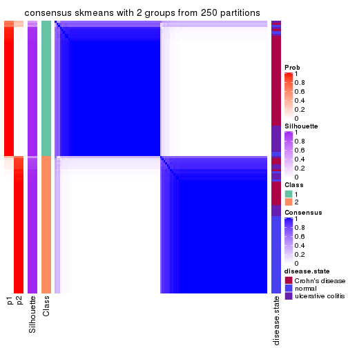</p>

</div>
<div id='tab-MAD-skmeans-consensus-heatmap-2'>
<pre><code class="r">consensus_heatmap(res, k = 3)
</code></pre>

<p></p>

</div>
<div id='tab-MAD-skmeans-consensus-heatmap-3'>
<pre><code class="r">consensus_heatmap(res, k = 4)
</code></pre>

<p></p>

</div>
<div id='tab-MAD-skmeans-consensus-heatmap-4'>
<pre><code class="r">consensus_heatmap(res, k = 5)
</code></pre>

<p></p>

</div>
<div id='tab-MAD-skmeans-consensus-heatmap-5'>
<pre><code class="r">consensus_heatmap(res, k = 6)
</code></pre>

<p></p>

</div>
</div>

Heatmaps for the membership of samples in all partitions to see how consistent they are:


<script>
$( function() {
	$( '#tabs-MAD-skmeans-membership-heatmap' ).tabs();
} );
</script>
<div id='tabs-MAD-skmeans-membership-heatmap'>
<ul>
<li><a href='#tab-MAD-skmeans-membership-heatmap-1'>k = 2</a></li>
<li><a href='#tab-MAD-skmeans-membership-heatmap-2'>k = 3</a></li>
<li><a href='#tab-MAD-skmeans-membership-heatmap-3'>k = 4</a></li>
<li><a href='#tab-MAD-skmeans-membership-heatmap-4'>k = 5</a></li>
<li><a href='#tab-MAD-skmeans-membership-heatmap-5'>k = 6</a></li>
</ul>
<div id='tab-MAD-skmeans-membership-heatmap-1'>
<pre><code class="r">membership_heatmap(res, k = 2)
</code></pre>

<p></p>

</div>
<div id='tab-MAD-skmeans-membership-heatmap-2'>
<pre><code class="r">membership_heatmap(res, k = 3)
</code></pre>

<p>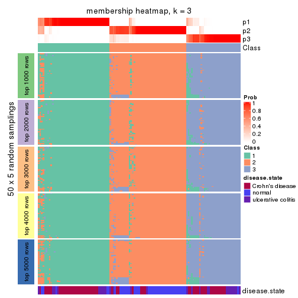</p>

</div>
<div id='tab-MAD-skmeans-membership-heatmap-3'>
<pre><code class="r">membership_heatmap(res, k = 4)
</code></pre>

<p></p>

</div>
<div id='tab-MAD-skmeans-membership-heatmap-4'>
<pre><code class="r">membership_heatmap(res, k = 5)
</code></pre>

<p></p>

</div>
<div id='tab-MAD-skmeans-membership-heatmap-5'>
<pre><code class="r">membership_heatmap(res, k = 6)
</code></pre>

<p></p>

</div>
</div>

As soon as we have had the classes for columns, we can look for signatures
which are significantly different between classes which can be candidate marks
for certain classes. Following are the heatmaps for signatures.


Signature heatmaps where rows are scaled:


<script>
$( function() {
	$( '#tabs-MAD-skmeans-get-signatures' ).tabs();
} );
</script>
<div id='tabs-MAD-skmeans-get-signatures'>
<ul>
<li><a href='#tab-MAD-skmeans-get-signatures-1'>k = 2</a></li>
<li><a href='#tab-MAD-skmeans-get-signatures-2'>k = 3</a></li>
<li><a href='#tab-MAD-skmeans-get-signatures-3'>k = 4</a></li>
<li><a href='#tab-MAD-skmeans-get-signatures-4'>k = 5</a></li>
<li><a href='#tab-MAD-skmeans-get-signatures-5'>k = 6</a></li>
</ul>
<div id='tab-MAD-skmeans-get-signatures-1'>
<pre><code class="r">get_signatures(res, k = 2)
</code></pre>

<p></p>

</div>
<div id='tab-MAD-skmeans-get-signatures-2'>
<pre><code class="r">get_signatures(res, k = 3)
</code></pre>

<p></p>

</div>
<div id='tab-MAD-skmeans-get-signatures-3'>
<pre><code class="r">get_signatures(res, k = 4)
</code></pre>

<p></p>

</div>
<div id='tab-MAD-skmeans-get-signatures-4'>
<pre><code class="r">get_signatures(res, k = 5)
</code></pre>

<p></p>

</div>
<div id='tab-MAD-skmeans-get-signatures-5'>
<pre><code class="r">get_signatures(res, k = 6)
</code></pre>

<p></p>

</div>
</div>


Signature heatmaps where rows are not scaled:


<script>
$( function() {
	$( '#tabs-MAD-skmeans-get-signatures-no-scale' ).tabs();
} );
</script>
<div id='tabs-MAD-skmeans-get-signatures-no-scale'>
<ul>
<li><a href='#tab-MAD-skmeans-get-signatures-no-scale-1'>k = 2</a></li>
<li><a href='#tab-MAD-skmeans-get-signatures-no-scale-2'>k = 3</a></li>
<li><a href='#tab-MAD-skmeans-get-signatures-no-scale-3'>k = 4</a></li>
<li><a href='#tab-MAD-skmeans-get-signatures-no-scale-4'>k = 5</a></li>
<li><a href='#tab-MAD-skmeans-get-signatures-no-scale-5'>k = 6</a></li>
</ul>
<div id='tab-MAD-skmeans-get-signatures-no-scale-1'>
<pre><code class="r">get_signatures(res, k = 2, scale_rows = FALSE)
</code></pre>

<p></p>

</div>
<div id='tab-MAD-skmeans-get-signatures-no-scale-2'>
<pre><code class="r">get_signatures(res, k = 3, scale_rows = FALSE)
</code></pre>

<p></p>

</div>
<div id='tab-MAD-skmeans-get-signatures-no-scale-3'>
<pre><code class="r">get_signatures(res, k = 4, scale_rows = FALSE)
</code></pre>

<p></p>

</div>
<div id='tab-MAD-skmeans-get-signatures-no-scale-4'>
<pre><code class="r">get_signatures(res, k = 5, scale_rows = FALSE)
</code></pre>

<p></p>

</div>
<div id='tab-MAD-skmeans-get-signatures-no-scale-5'>
<pre><code class="r">get_signatures(res, k = 6, scale_rows = FALSE)
</code></pre>

<p></p>

</div>
</div>


Compare the overlap of signatures from different k:

```r
compare_signatures(res)
```


`get_signature()` returns a data frame invisibly. TO get the list of signatures, the function
call should be assigned to a variable explicitly. In following code, if `plot` argument is set
to `FALSE`, no heatmap is plotted while only the differential analysis is performed.

```r
# code only for demonstration
tb = get_signature(res, k = ..., plot = FALSE)
```

An example of the output of `tb` is:

```
#>   which_row         fdr    mean_1    mean_2 scaled_mean_1 scaled_mean_2 km
#> 1        38 0.042760348  8.373488  9.131774    -0.5533452     0.5164555  1
#> 2        40 0.018707592  7.106213  8.469186    -0.6173731     0.5762149  1
#> 3        55 0.019134737 10.221463 11.207825    -0.6159697     0.5749050  1
#> 4        59 0.006059896  5.921854  7.869574    -0.6899429     0.6439467  1
#> 5        60 0.018055526  8.928898 10.211722    -0.6204761     0.5791110  1
#> 6        98 0.009384629 15.714769 14.887706     0.6635654    -0.6193277  2
...
```

The columns in `tb` are:

1. `which_row`: row indices corresponding to the input matrix.
2. `fdr`: FDR for the differential test. 
3. `mean_x`: The mean value in group x.
4. `scaled_mean_x`: The mean value in group x after rows are scaled.
5. `km`: Row groups if k-means clustering is applied to rows.


UMAP plot which shows how samples are separated.


<script>
$( function() {
	$( '#tabs-MAD-skmeans-dimension-reduction' ).tabs();
} );
</script>
<div id='tabs-MAD-skmeans-dimension-reduction'>
<ul>
<li><a href='#tab-MAD-skmeans-dimension-reduction-1'>k = 2</a></li>
<li><a href='#tab-MAD-skmeans-dimension-reduction-2'>k = 3</a></li>
<li><a href='#tab-MAD-skmeans-dimension-reduction-3'>k = 4</a></li>
<li><a href='#tab-MAD-skmeans-dimension-reduction-4'>k = 5</a></li>
<li><a href='#tab-MAD-skmeans-dimension-reduction-5'>k = 6</a></li>
</ul>
<div id='tab-MAD-skmeans-dimension-reduction-1'>
<pre><code class="r">dimension_reduction(res, k = 2, method = &quot;UMAP&quot;)
</code></pre>

<p></p>

</div>
<div id='tab-MAD-skmeans-dimension-reduction-2'>
<pre><code class="r">dimension_reduction(res, k = 3, method = &quot;UMAP&quot;)
</code></pre>

<p></p>

</div>
<div id='tab-MAD-skmeans-dimension-reduction-3'>
<pre><code class="r">dimension_reduction(res, k = 4, method = &quot;UMAP&quot;)
</code></pre>

<p>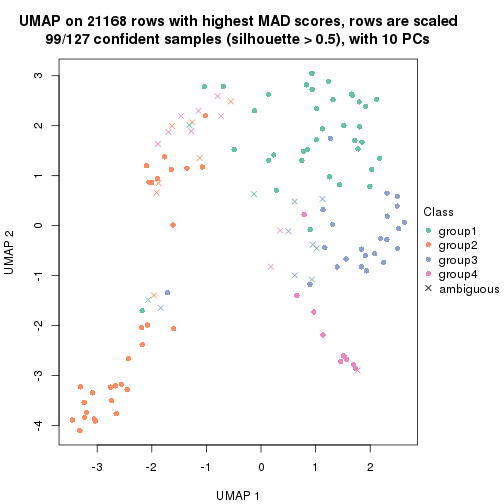</p>

</div>
<div id='tab-MAD-skmeans-dimension-reduction-4'>
<pre><code class="r">dimension_reduction(res, k = 5, method = &quot;UMAP&quot;)
</code></pre>

<p></p>

</div>
<div id='tab-MAD-skmeans-dimension-reduction-5'>
<pre><code class="r">dimension_reduction(res, k = 6, method = &quot;UMAP&quot;)
</code></pre>

<p></p>

</div>
</div>


Following heatmap shows how subgroups are split when increasing `k`:

```r
collect_classes(res)
```


Test correlation between subgroups and known annotations. If the known
annotation is numeric, one-way ANOVA test is applied, and if the known
annotation is discrete, chi-squared contingency table test is applied.

```r
test_to_known_factors(res)
```

```
#>               n disease.state(p) k
#> MAD:skmeans 126         7.15e-10 2
#> MAD:skmeans 121         1.47e-13 3
#> MAD:skmeans  99         3.64e-10 4
#> MAD:skmeans  99         5.29e-10 5
#> MAD:skmeans  81         1.21e-08 6
```


If matrix rows can be associated to genes, consider to use `functional_enrichment(res,
...)` to perform function enrichment for the signature genes. See [this vignette](http://bioconductor.org/packages/devel/bioc/vignettes/cola/inst/doc/functional_enrichment.html) for more detailed explanations.


 

---------------------------------------------------


### MAD:pam


The object with results only for a single top-value method and a single partition method 
can be extracted as:

```r
res = res_list["MAD", "pam"]
# you can also extract it by
# res = res_list["MAD:pam"]
```

A summary of `res` and all the functions that can be applied to it:

```r
res
```

```
#> A 'ConsensusPartition' object with k = 2, 3, 4, 5, 6.
#>   On a matrix with 21168 rows and 127 columns.
#>   Top rows (1000, 2000, 3000, 4000, 5000) are extracted by 'MAD' method.
#>   Subgroups are detected by 'pam' method.
#>   Performed in total 1250 partitions by row resampling.
#>   Best k for subgroups seems to be 6.
#> 
#> Following methods can be applied to this 'ConsensusPartition' object:
#>  [1] "cola_report"             "collect_classes"         "collect_plots"          
#>  [4] "collect_stats"           "colnames"                "compare_signatures"     
#>  [7] "consensus_heatmap"       "dimension_reduction"     "functional_enrichment"  
#> [10] "get_anno_col"            "get_anno"                "get_classes"            
#> [13] "get_consensus"           "get_matrix"              "get_membership"         
#> [16] "get_param"               "get_signatures"          "get_stats"              
#> [19] "is_best_k"               "is_stable_k"             "membership_heatmap"     
#> [22] "ncol"                    "nrow"                    "plot_ecdf"              
#> [25] "rownames"                "select_partition_number" "show"                   
#> [28] "suggest_best_k"          "test_to_known_factors"
```

`collect_plots()` function collects all the plots made from `res` for all `k` (number of partitions)
into one single page to provide an easy and fast comparison between different `k`.

```r
collect_plots(res)
```


The plots are:

- The first row: a plot of the ECDF (empirical cumulative distribution
  function) curves of the consensus matrix for each `k` and the heatmap of
  predicted classes for each `k`.
- The second row: heatmaps of the consensus matrix for each `k`.
- The third row: heatmaps of the membership matrix for each `k`.
- The fouth row: heatmaps of the signatures for each `k`.

All the plots in panels can be made by individual functions and they are
plotted later in this section.

`select_partition_number()` produces several plots showing different
statistics for choosing "optimized" `k`. There are following statistics:

- ECDF curves of the consensus matrix for each `k`;
- 1-PAC. [The PAC
  score](https://en.wikipedia.org/wiki/Consensus_clustering#Over-interpretation_potential_of_consensus_clustering)
  measures the proportion of the ambiguous subgrouping.
- Mean silhouette score.
- Concordance. The mean probability of fiting the consensus class ids in all
  partitions.
- Area increased. Denote $A_k$ as the area under the ECDF curve for current
  `k`, the area increased is defined as $A_k - A_{k-1}$.
- Rand index. The percent of pairs of samples that are both in a same cluster
  or both are not in a same cluster in the partition of k and k-1.
- Jaccard index. The ratio of pairs of samples are both in a same cluster in
  the partition of k and k-1 and the pairs of samples are both in a same
  cluster in the partition k or k-1.

The detailed explanations of these statistics can be found in [the _cola_
vignette](http://bioconductor.org/packages/devel/bioc/vignettes/cola/inst/doc/cola.html#toc_13).

Generally speaking, lower PAC score, higher mean silhouette score or higher
concordance corresponds to better partition. Rand index and Jaccard index
measure how similar the current partition is compared to partition with `k-1`.
If they are too similar, we won't accept `k` is better than `k-1`.

```r
select_partition_number(res)
```


The numeric values for all these statistics can be obtained by `get_stats()`.

```r
get_stats(res)
```

```
#>   k 1-PAC mean_silhouette concordance area_increased  Rand Jaccard
#> 2 2 0.261           0.771       0.843         0.4880 0.501   0.501
#> 3 3 0.455           0.626       0.820         0.3434 0.685   0.452
#> 4 4 0.646           0.638       0.829         0.1367 0.825   0.539
#> 5 5 0.711           0.732       0.845         0.0507 0.892   0.622
#> 6 6 0.826           0.844       0.902         0.0477 0.955   0.796
```

`suggest_best_k()` suggests the best $k$ based on these statistics. The rules are as follows:

- All $k$ with Jaccard index larger than 0.95 are removed because increasing
  $k$ does not provide enough extra information. If all $k$ are removed, it is
  marked as no subgroup is detected.
- For all $k$ with 1-PAC score larger than 0.9, the maximal $k$ is taken as
  the best $k$, and other $k$ are marked as optional $k$.
- If it does not fit the second rule. The $k$ with the maximal vote of the
  highest 1-PAC score, highest mean silhouette, and highest concordance is
  taken as the best $k$.

```r
suggest_best_k(res)
```

```
#> [1] 6
```


Following shows the table of the partitions (You need to click the **show/hide
code output** link to see it). The membership matrix (columns with name `p*`)
is inferred by
[`clue::cl_consensus()`](https://www.rdocumentation.org/link/cl_consensus?package=clue)
function with the `SE` method. Basically the value in the membership matrix
represents the probability to belong to a certain group. The finall class
label for an item is determined with the group with highest probability it
belongs to.

In `get_classes()` function, the entropy is calculated from the membership
matrix and the silhouette score is calculated from the consensus matrix.


<script>
$( function() {
	$( '#tabs-MAD-pam-get-classes' ).tabs();
} );
</script>
<div id='tabs-MAD-pam-get-classes'>
<ul>
<li><a href='#tab-MAD-pam-get-classes-1'>k = 2</a></li>
<li><a href='#tab-MAD-pam-get-classes-2'>k = 3</a></li>
<li><a href='#tab-MAD-pam-get-classes-3'>k = 4</a></li>
<li><a href='#tab-MAD-pam-get-classes-4'>k = 5</a></li>
<li><a href='#tab-MAD-pam-get-classes-5'>k = 6</a></li>
</ul>

<div id='tab-MAD-pam-get-classes-1'>
<p><a id='tab-MAD-pam-get-classes-1-a' style='color:#0366d6' href='#'>show/hide code output</a></p>
<pre><code class="r">cbind(get_classes(res, k = 2), get_membership(res, k = 2))
</code></pre>

<pre><code>#&gt;          class entropy silhouette    p1    p2
#&gt; GSM76115     1  0.8081     0.8072 0.752 0.248
#&gt; GSM76116     1  0.8016     0.8093 0.756 0.244
#&gt; GSM76117     1  0.7376     0.8230 0.792 0.208
#&gt; GSM76118     1  0.7376     0.8223 0.792 0.208
#&gt; GSM76119     2  0.3114     0.8187 0.056 0.944
#&gt; GSM76120     2  0.0000     0.8254 0.000 1.000
#&gt; GSM76121     1  0.4815     0.8255 0.896 0.104
#&gt; GSM76122     1  0.7139     0.8248 0.804 0.196
#&gt; GSM76123     2  0.0000     0.8254 0.000 1.000
#&gt; GSM76124     1  0.7453     0.8268 0.788 0.212
#&gt; GSM76125     2  0.0000     0.8254 0.000 1.000
#&gt; GSM76126     1  0.9209     0.7541 0.664 0.336
#&gt; GSM76127     2  0.0000     0.8254 0.000 1.000
#&gt; GSM76128     2  0.5519     0.8066 0.128 0.872
#&gt; GSM76129     1  0.7528     0.8209 0.784 0.216
#&gt; GSM76130     2  0.9552     0.1218 0.376 0.624
#&gt; GSM76131     2  0.7056     0.7060 0.192 0.808
#&gt; GSM76132     1  0.8608     0.7745 0.716 0.284
#&gt; GSM76133     1  0.8144     0.8046 0.748 0.252
#&gt; GSM76134     2  0.9087     0.4145 0.324 0.676
#&gt; GSM76135     1  0.8016     0.8093 0.756 0.244
#&gt; GSM76136     2  0.5059     0.7951 0.112 0.888
#&gt; GSM76137     2  0.5294     0.7889 0.120 0.880
#&gt; GSM76138     1  0.7815     0.8156 0.768 0.232
#&gt; GSM76139     2  0.2948     0.8194 0.052 0.948
#&gt; GSM76140     1  0.5178     0.8251 0.884 0.116
#&gt; GSM76141     1  0.8016     0.8093 0.756 0.244
#&gt; GSM76142     1  0.9833     0.5175 0.576 0.424
#&gt; GSM76143     1  0.8144     0.8046 0.748 0.252
#&gt; GSM76144     2  0.7528     0.6668 0.216 0.784
#&gt; GSM76145     2  0.6343     0.7508 0.160 0.840
#&gt; GSM76146     1  0.8081     0.8072 0.752 0.248
#&gt; GSM76147     1  0.8081     0.8072 0.752 0.248
#&gt; GSM76148     2  0.9815     0.0456 0.420 0.580
#&gt; GSM76149     2  0.5842     0.7715 0.140 0.860
#&gt; GSM76150     1  0.8144     0.8046 0.748 0.252
#&gt; GSM76151     2  0.6438     0.7467 0.164 0.836
#&gt; GSM76152     1  0.0000     0.8204 1.000 0.000
#&gt; GSM76153     2  0.2948     0.8196 0.052 0.948
#&gt; GSM76154     2  0.5842     0.7722 0.140 0.860
#&gt; GSM76155     1  0.8144     0.8046 0.748 0.252
#&gt; GSM76156     1  0.8144     0.8057 0.748 0.252
#&gt; GSM76030     2  0.9775     0.4318 0.412 0.588
#&gt; GSM76031     1  0.2778     0.7985 0.952 0.048
#&gt; GSM76032     2  0.7376     0.7704 0.208 0.792
#&gt; GSM76033     2  0.6623     0.7974 0.172 0.828
#&gt; GSM76034     1  0.8608     0.7984 0.716 0.284
#&gt; GSM76035     2  0.5059     0.8309 0.112 0.888
#&gt; GSM76036     2  0.2603     0.8360 0.044 0.956
#&gt; GSM76037     1  0.7376     0.8223 0.792 0.208
#&gt; GSM76038     1  0.3274     0.7971 0.940 0.060
#&gt; GSM76039     1  0.2603     0.8336 0.956 0.044
#&gt; GSM76040     2  0.0938     0.8268 0.012 0.988
#&gt; GSM76041     2  0.9087     0.7039 0.324 0.676
#&gt; GSM76042     1  0.1184     0.8171 0.984 0.016
#&gt; GSM76043     2  0.9635     0.5630 0.388 0.612
#&gt; GSM76044     1  0.2603     0.8293 0.956 0.044
#&gt; GSM76045     2  0.9209     0.7027 0.336 0.664
#&gt; GSM76046     2  0.5294     0.8284 0.120 0.880
#&gt; GSM76047     2  0.9358     0.5895 0.352 0.648
#&gt; GSM76048     2  0.5519     0.8264 0.128 0.872
#&gt; GSM76049     1  0.4690     0.8173 0.900 0.100
#&gt; GSM76050     1  0.9909    -0.1949 0.556 0.444
#&gt; GSM76051     2  0.4161     0.8346 0.084 0.916
#&gt; GSM76052     2  0.2948     0.8217 0.052 0.948
#&gt; GSM76053     2  0.5059     0.8354 0.112 0.888
#&gt; GSM76054     2  0.4298     0.8379 0.088 0.912
#&gt; GSM76055     1  0.6887     0.8300 0.816 0.184
#&gt; GSM76056     1  0.3584     0.8338 0.932 0.068
#&gt; GSM76057     1  0.6048     0.8252 0.852 0.148
#&gt; GSM76058     2  0.6343     0.8067 0.160 0.840
#&gt; GSM76059     1  0.1414     0.8150 0.980 0.020
#&gt; GSM76060     1  0.6973     0.8000 0.812 0.188
#&gt; GSM76061     1  0.8081     0.8072 0.752 0.248
#&gt; GSM76062     1  0.5629     0.7002 0.868 0.132
#&gt; GSM76063     2  0.0000     0.8254 0.000 1.000
#&gt; GSM76064     1  0.7219     0.8057 0.800 0.200
#&gt; GSM76065     1  0.8081     0.8072 0.752 0.248
#&gt; GSM76066     2  0.8763     0.7358 0.296 0.704
#&gt; GSM76067     2  0.7950     0.7731 0.240 0.760
#&gt; GSM76068     2  0.6148     0.8299 0.152 0.848
#&gt; GSM76069     1  0.3733     0.8310 0.928 0.072
#&gt; GSM76070     2  0.3114     0.8188 0.056 0.944
#&gt; GSM76071     1  0.1633     0.8131 0.976 0.024
#&gt; GSM76072     1  0.3114     0.8102 0.944 0.056
#&gt; GSM76073     1  0.0000     0.8204 1.000 0.000
#&gt; GSM76074     1  0.0672     0.8188 0.992 0.008
#&gt; GSM76075     2  0.6048     0.8134 0.148 0.852
#&gt; GSM76076     2  0.5408     0.8227 0.124 0.876
#&gt; GSM76077     1  0.5178     0.8319 0.884 0.116
#&gt; GSM76078     2  0.6343     0.8130 0.160 0.840
#&gt; GSM76079     1  0.1843     0.8116 0.972 0.028
#&gt; GSM76080     2  0.2603     0.8206 0.044 0.956
#&gt; GSM76081     2  0.2778     0.8193 0.048 0.952
#&gt; GSM76082     2  0.7219     0.8121 0.200 0.800
#&gt; GSM76083     2  0.5842     0.8189 0.140 0.860
#&gt; GSM76084     2  0.2778     0.8193 0.048 0.952
#&gt; GSM76085     2  0.5519     0.8245 0.128 0.872
#&gt; GSM76086     2  0.7056     0.7829 0.192 0.808
#&gt; GSM76087     1  0.8207     0.8049 0.744 0.256
#&gt; GSM76088     1  0.9661     0.2192 0.608 0.392
#&gt; GSM76089     1  0.8081     0.8072 0.752 0.248
#&gt; GSM76090     2  0.7139     0.8141 0.196 0.804
#&gt; GSM76091     1  0.4690     0.8038 0.900 0.100
#&gt; GSM76092     1  0.0000     0.8204 1.000 0.000
#&gt; GSM76093     1  0.1184     0.8166 0.984 0.016
#&gt; GSM76094     1  0.7299     0.8234 0.796 0.204
#&gt; GSM76095     1  0.3879     0.8142 0.924 0.076
#&gt; GSM76096     1  0.3114     0.8042 0.944 0.056
#&gt; GSM76097     1  0.3584     0.8340 0.932 0.068
#&gt; GSM76098     2  0.2603     0.8206 0.044 0.956
#&gt; GSM76099     1  0.3114     0.8311 0.944 0.056
#&gt; GSM76100     1  0.0376     0.8224 0.996 0.004
#&gt; GSM76101     1  0.0376     0.8197 0.996 0.004
#&gt; GSM76102     1  0.7453     0.8127 0.788 0.212
#&gt; GSM76103     2  0.5946     0.8137 0.144 0.856
#&gt; GSM76104     2  0.4161     0.8253 0.084 0.916
#&gt; GSM76105     1  0.7219     0.8254 0.800 0.200
#&gt; GSM76106     2  0.5946     0.7708 0.144 0.856
#&gt; GSM76107     1  0.8661     0.7988 0.712 0.288
#&gt; GSM76108     1  0.3584     0.8340 0.932 0.068
#&gt; GSM76109     1  0.0000     0.8204 1.000 0.000
#&gt; GSM76110     1  0.0000     0.8204 1.000 0.000
#&gt; GSM76111     1  0.0672     0.8240 0.992 0.008
#&gt; GSM76112     1  0.3114     0.7995 0.944 0.056
#&gt; GSM76113     2  0.4298     0.8171 0.088 0.912
#&gt; GSM76114     1  0.3114     0.8016 0.944 0.056
</code></pre>

<script>
$('#tab-MAD-pam-get-classes-1-a').parent().next().next().hide();
$('#tab-MAD-pam-get-classes-1-a').click(function(){
  $('#tab-MAD-pam-get-classes-1-a').parent().next().next().toggle();
  return(false);
});
</script>
</div>

<div id='tab-MAD-pam-get-classes-2'>
<p><a id='tab-MAD-pam-get-classes-2-a' style='color:#0366d6' href='#'>show/hide code output</a></p>
<pre><code class="r">cbind(get_classes(res, k = 3), get_membership(res, k = 3))
</code></pre>

<pre><code>#&gt;          class entropy silhouette    p1    p2    p3
#&gt; GSM76115     2  0.9494    0.16713 0.404 0.412 0.184
#&gt; GSM76116     2  0.7498    0.27460 0.412 0.548 0.040
#&gt; GSM76117     1  0.7624    0.22116 0.580 0.368 0.052
#&gt; GSM76118     1  0.8215    0.09904 0.540 0.380 0.080
#&gt; GSM76119     3  0.5901    0.70918 0.048 0.176 0.776
#&gt; GSM76120     3  0.2448    0.83682 0.000 0.076 0.924
#&gt; GSM76121     1  0.5507    0.63237 0.808 0.136 0.056
#&gt; GSM76122     2  0.8138    0.14208 0.452 0.480 0.068
#&gt; GSM76123     3  0.3192    0.81533 0.000 0.112 0.888
#&gt; GSM76124     1  0.7271    0.29047 0.608 0.352 0.040
#&gt; GSM76125     3  0.4504    0.76658 0.000 0.196 0.804
#&gt; GSM76126     2  0.9745    0.25034 0.348 0.420 0.232
#&gt; GSM76127     3  0.4002    0.78402 0.000 0.160 0.840
#&gt; GSM76128     3  0.4489    0.82963 0.108 0.036 0.856
#&gt; GSM76129     2  0.5036    0.66300 0.172 0.808 0.020
#&gt; GSM76130     2  0.8349    0.46854 0.108 0.584 0.308
#&gt; GSM76131     2  0.2356    0.75237 0.000 0.928 0.072
#&gt; GSM76132     2  0.1031    0.74796 0.000 0.976 0.024
#&gt; GSM76133     2  0.2261    0.75314 0.000 0.932 0.068
#&gt; GSM76134     2  0.1529    0.74303 0.000 0.960 0.040
#&gt; GSM76135     2  0.0000    0.74648 0.000 1.000 0.000
#&gt; GSM76136     2  0.2356    0.75237 0.000 0.928 0.072
#&gt; GSM76137     2  0.6527    0.26641 0.008 0.588 0.404
#&gt; GSM76138     2  0.8322    0.19704 0.428 0.492 0.080
#&gt; GSM76139     2  0.2261    0.75245 0.000 0.932 0.068
#&gt; GSM76140     1  0.5058    0.63841 0.820 0.148 0.032
#&gt; GSM76141     2  0.0000    0.74648 0.000 1.000 0.000
#&gt; GSM76142     2  0.1411    0.75422 0.000 0.964 0.036
#&gt; GSM76143     2  0.1860    0.75484 0.000 0.948 0.052
#&gt; GSM76144     2  0.2165    0.75475 0.000 0.936 0.064
#&gt; GSM76145     2  0.7208    0.44588 0.040 0.620 0.340
#&gt; GSM76146     2  0.2356    0.75237 0.000 0.928 0.072
#&gt; GSM76147     2  0.1964    0.75538 0.000 0.944 0.056
#&gt; GSM76148     2  0.1411    0.75396 0.000 0.964 0.036
#&gt; GSM76149     2  0.5443    0.57847 0.004 0.736 0.260
#&gt; GSM76150     2  0.2269    0.74206 0.016 0.944 0.040
#&gt; GSM76151     3  0.8191    0.20283 0.076 0.396 0.528
#&gt; GSM76152     1  0.0000    0.76714 1.000 0.000 0.000
#&gt; GSM76153     2  0.2261    0.75405 0.000 0.932 0.068
#&gt; GSM76154     2  0.5216    0.56787 0.000 0.740 0.260
#&gt; GSM76155     2  0.5689    0.64647 0.184 0.780 0.036
#&gt; GSM76156     2  0.0424    0.74872 0.000 0.992 0.008
#&gt; GSM76030     2  0.7026    0.62531 0.152 0.728 0.120
#&gt; GSM76031     1  0.0747    0.76572 0.984 0.000 0.016
#&gt; GSM76032     3  0.3412    0.83453 0.124 0.000 0.876
#&gt; GSM76033     3  0.1643    0.86059 0.044 0.000 0.956
#&gt; GSM76034     2  0.8887    0.35991 0.368 0.504 0.128
#&gt; GSM76035     3  0.2998    0.86681 0.068 0.016 0.916
#&gt; GSM76036     3  0.1015    0.86199 0.008 0.012 0.980
#&gt; GSM76037     2  0.7575    0.16005 0.456 0.504 0.040
#&gt; GSM76038     1  0.0424    0.76652 0.992 0.000 0.008
#&gt; GSM76039     1  0.2680    0.74373 0.924 0.068 0.008
#&gt; GSM76040     3  0.0592    0.85894 0.000 0.012 0.988
#&gt; GSM76041     1  0.7279    0.19777 0.588 0.036 0.376
#&gt; GSM76042     1  0.0237    0.76699 0.996 0.000 0.004
#&gt; GSM76043     3  0.6497    0.54062 0.336 0.016 0.648
#&gt; GSM76044     1  0.2200    0.75280 0.940 0.056 0.004
#&gt; GSM76045     1  0.8085    0.26502 0.584 0.084 0.332
#&gt; GSM76046     3  0.2356    0.86238 0.072 0.000 0.928
#&gt; GSM76047     1  0.6818    0.36045 0.628 0.024 0.348
#&gt; GSM76048     3  0.3669    0.86505 0.064 0.040 0.896
#&gt; GSM76049     1  0.6490    0.36971 0.628 0.360 0.012
#&gt; GSM76050     1  0.4750    0.56754 0.784 0.000 0.216
#&gt; GSM76051     3  0.1482    0.86436 0.020 0.012 0.968
#&gt; GSM76052     3  0.1182    0.86257 0.012 0.012 0.976
#&gt; GSM76053     3  0.4357    0.84290 0.052 0.080 0.868
#&gt; GSM76054     3  0.2229    0.86336 0.012 0.044 0.944
#&gt; GSM76055     1  0.7561   -0.00787 0.516 0.444 0.040
#&gt; GSM76056     1  0.6255    0.45641 0.684 0.300 0.016
#&gt; GSM76057     2  0.7213    0.62081 0.212 0.700 0.088
#&gt; GSM76058     3  0.2796    0.85172 0.092 0.000 0.908
#&gt; GSM76059     1  0.0000    0.76714 1.000 0.000 0.000
#&gt; GSM76060     2  0.9072    0.42449 0.300 0.532 0.168
#&gt; GSM76061     2  0.6728    0.66158 0.184 0.736 0.080
#&gt; GSM76062     1  0.2860    0.72258 0.912 0.004 0.084
#&gt; GSM76063     3  0.2448    0.85129 0.000 0.076 0.924
#&gt; GSM76064     1  0.5119    0.69158 0.812 0.028 0.160
#&gt; GSM76065     2  0.4469    0.74268 0.060 0.864 0.076
#&gt; GSM76066     1  0.6225    0.00455 0.568 0.000 0.432
#&gt; GSM76067     1  0.6309   -0.18825 0.500 0.000 0.500
#&gt; GSM76068     3  0.3356    0.86025 0.036 0.056 0.908
#&gt; GSM76069     1  0.2703    0.74772 0.928 0.056 0.016
#&gt; GSM76070     2  0.2959    0.75007 0.000 0.900 0.100
#&gt; GSM76071     1  0.0000    0.76714 1.000 0.000 0.000
#&gt; GSM76072     1  0.1482    0.76136 0.968 0.020 0.012
#&gt; GSM76073     1  0.0000    0.76714 1.000 0.000 0.000
#&gt; GSM76074     1  0.0000    0.76714 1.000 0.000 0.000
#&gt; GSM76075     3  0.2448    0.85763 0.076 0.000 0.924
#&gt; GSM76076     3  0.2096    0.86000 0.052 0.004 0.944
#&gt; GSM76077     1  0.5449    0.67809 0.816 0.116 0.068
#&gt; GSM76078     3  0.6063    0.76856 0.132 0.084 0.784
#&gt; GSM76079     1  0.0000    0.76714 1.000 0.000 0.000
#&gt; GSM76080     3  0.2261    0.84810 0.000 0.068 0.932
#&gt; GSM76081     3  0.2537    0.84871 0.000 0.080 0.920
#&gt; GSM76082     3  0.5067    0.83603 0.116 0.052 0.832
#&gt; GSM76083     3  0.2682    0.85970 0.076 0.004 0.920
#&gt; GSM76084     3  0.2066    0.85024 0.000 0.060 0.940
#&gt; GSM76085     3  0.1905    0.86463 0.028 0.016 0.956
#&gt; GSM76086     3  0.6180    0.34076 0.416 0.000 0.584
#&gt; GSM76087     2  0.2448    0.75192 0.000 0.924 0.076
#&gt; GSM76088     1  0.7072    0.07428 0.504 0.476 0.020
#&gt; GSM76089     2  0.7250    0.51820 0.288 0.656 0.056
#&gt; GSM76090     3  0.7838    0.18433 0.460 0.052 0.488
#&gt; GSM76091     1  0.2261    0.75060 0.932 0.000 0.068
#&gt; GSM76092     1  0.0000    0.76714 1.000 0.000 0.000
#&gt; GSM76093     1  0.0000    0.76714 1.000 0.000 0.000
#&gt; GSM76094     2  0.7672    0.11601 0.468 0.488 0.044
#&gt; GSM76095     1  0.2339    0.74837 0.940 0.012 0.048
#&gt; GSM76096     1  0.0000    0.76714 1.000 0.000 0.000
#&gt; GSM76097     1  0.6527    0.20360 0.588 0.404 0.008
#&gt; GSM76098     3  0.2959    0.85007 0.000 0.100 0.900
#&gt; GSM76099     1  0.2496    0.74218 0.928 0.068 0.004
#&gt; GSM76100     1  0.0237    0.76686 0.996 0.000 0.004
#&gt; GSM76101     1  0.0000    0.76714 1.000 0.000 0.000
#&gt; GSM76102     1  0.8619   -0.00103 0.524 0.368 0.108
#&gt; GSM76103     3  0.3272    0.84448 0.104 0.004 0.892
#&gt; GSM76104     3  0.2318    0.85821 0.028 0.028 0.944
#&gt; GSM76105     1  0.7584   -0.09621 0.488 0.472 0.040
#&gt; GSM76106     3  0.4475    0.80192 0.064 0.072 0.864
#&gt; GSM76107     1  0.9767   -0.09695 0.432 0.320 0.248
#&gt; GSM76108     1  0.3607    0.71312 0.880 0.112 0.008
#&gt; GSM76109     1  0.0000    0.76714 1.000 0.000 0.000
#&gt; GSM76110     1  0.0000    0.76714 1.000 0.000 0.000
#&gt; GSM76111     1  0.1129    0.76316 0.976 0.020 0.004
#&gt; GSM76112     1  0.0892    0.76250 0.980 0.000 0.020
#&gt; GSM76113     3  0.4277    0.81681 0.016 0.132 0.852
#&gt; GSM76114     1  0.1529    0.75978 0.960 0.000 0.040
</code></pre>

<script>
$('#tab-MAD-pam-get-classes-2-a').parent().next().next().hide();
$('#tab-MAD-pam-get-classes-2-a').click(function(){
  $('#tab-MAD-pam-get-classes-2-a').parent().next().next().toggle();
  return(false);
});
</script>
</div>

<div id='tab-MAD-pam-get-classes-3'>
<p><a id='tab-MAD-pam-get-classes-3-a' style='color:#0366d6' href='#'>show/hide code output</a></p>
<pre><code class="r">cbind(get_classes(res, k = 4), get_membership(res, k = 4))
</code></pre>

<pre><code>#&gt;          class entropy silhouette    p1    p2    p3    p4
#&gt; GSM76115     4  0.1471    0.61150 0.004 0.024 0.012 0.960
#&gt; GSM76116     4  0.0524    0.61711 0.008 0.004 0.000 0.988
#&gt; GSM76117     4  0.1339    0.62071 0.024 0.004 0.008 0.964
#&gt; GSM76118     4  0.1004    0.62070 0.024 0.000 0.004 0.972
#&gt; GSM76119     3  0.5925    0.18597 0.000 0.036 0.512 0.452
#&gt; GSM76120     3  0.2376    0.85537 0.000 0.016 0.916 0.068
#&gt; GSM76121     4  0.6334    0.10414 0.416 0.024 0.024 0.536
#&gt; GSM76122     4  0.0859    0.61798 0.008 0.008 0.004 0.980
#&gt; GSM76123     3  0.3647    0.78440 0.000 0.016 0.832 0.152
#&gt; GSM76124     4  0.0592    0.61975 0.016 0.000 0.000 0.984
#&gt; GSM76125     3  0.5594    0.67648 0.000 0.192 0.716 0.092
#&gt; GSM76126     4  0.6595    0.38882 0.000 0.268 0.124 0.608
#&gt; GSM76127     3  0.5459    0.30204 0.000 0.016 0.552 0.432
#&gt; GSM76128     3  0.2604    0.85814 0.056 0.012 0.916 0.016
#&gt; GSM76129     2  0.4907    0.25778 0.000 0.580 0.000 0.420
#&gt; GSM76130     4  0.7292    0.09599 0.000 0.388 0.152 0.460
#&gt; GSM76131     2  0.0592    0.85627 0.000 0.984 0.016 0.000
#&gt; GSM76132     2  0.3217    0.75503 0.000 0.860 0.012 0.128
#&gt; GSM76133     2  0.0657    0.85803 0.000 0.984 0.012 0.004
#&gt; GSM76134     4  0.4998   -0.05580 0.000 0.488 0.000 0.512
#&gt; GSM76135     2  0.1022    0.84816 0.000 0.968 0.000 0.032
#&gt; GSM76136     2  0.0592    0.85627 0.000 0.984 0.016 0.000
#&gt; GSM76137     4  0.7253    0.18961 0.000 0.172 0.308 0.520
#&gt; GSM76138     4  0.0524    0.61542 0.004 0.008 0.000 0.988
#&gt; GSM76139     2  0.0895    0.85593 0.000 0.976 0.004 0.020
#&gt; GSM76140     4  0.2868    0.59000 0.136 0.000 0.000 0.864
#&gt; GSM76141     2  0.0921    0.85126 0.000 0.972 0.000 0.028
#&gt; GSM76142     2  0.0672    0.85815 0.000 0.984 0.008 0.008
#&gt; GSM76143     2  0.0779    0.85743 0.000 0.980 0.004 0.016
#&gt; GSM76144     2  0.0657    0.85803 0.000 0.984 0.012 0.004
#&gt; GSM76145     4  0.7179    0.24720 0.000 0.276 0.180 0.544
#&gt; GSM76146     2  0.0592    0.85627 0.000 0.984 0.016 0.000
#&gt; GSM76147     2  0.0804    0.85847 0.000 0.980 0.008 0.012
#&gt; GSM76148     2  0.0524    0.85769 0.000 0.988 0.008 0.004
#&gt; GSM76149     4  0.7235    0.13969 0.000 0.356 0.152 0.492
#&gt; GSM76150     4  0.5285   -0.01576 0.000 0.468 0.008 0.524
#&gt; GSM76151     4  0.6430    0.23106 0.000 0.092 0.312 0.596
#&gt; GSM76152     1  0.0707    0.83499 0.980 0.000 0.000 0.020
#&gt; GSM76153     2  0.0592    0.85627 0.000 0.984 0.016 0.000
#&gt; GSM76154     4  0.7158    0.16387 0.000 0.340 0.148 0.512
#&gt; GSM76155     4  0.4193    0.39432 0.000 0.268 0.000 0.732
#&gt; GSM76156     2  0.0707    0.85466 0.000 0.980 0.000 0.020
#&gt; GSM76030     2  0.7383    0.48286 0.220 0.616 0.044 0.120
#&gt; GSM76031     1  0.3557    0.76350 0.856 0.000 0.036 0.108
#&gt; GSM76032     3  0.1557    0.87527 0.056 0.000 0.944 0.000
#&gt; GSM76033     3  0.0895    0.88496 0.004 0.020 0.976 0.000
#&gt; GSM76034     4  0.6961    0.01349 0.012 0.452 0.076 0.460
#&gt; GSM76035     3  0.3174    0.85787 0.076 0.008 0.888 0.028
#&gt; GSM76036     3  0.1174    0.88669 0.000 0.020 0.968 0.012
#&gt; GSM76037     4  0.0657    0.61955 0.012 0.004 0.000 0.984
#&gt; GSM76038     1  0.0779    0.83702 0.980 0.000 0.004 0.016
#&gt; GSM76039     4  0.4955    0.00162 0.444 0.000 0.000 0.556
#&gt; GSM76040     3  0.1284    0.88733 0.000 0.024 0.964 0.012
#&gt; GSM76041     1  0.2227    0.82122 0.928 0.000 0.036 0.036
#&gt; GSM76042     1  0.5290    0.11793 0.516 0.000 0.008 0.476
#&gt; GSM76043     3  0.6607    0.51428 0.236 0.004 0.632 0.128
#&gt; GSM76044     1  0.1824    0.82482 0.936 0.000 0.004 0.060
#&gt; GSM76045     1  0.2197    0.80579 0.916 0.000 0.004 0.080
#&gt; GSM76046     3  0.1843    0.88611 0.028 0.016 0.948 0.008
#&gt; GSM76047     1  0.3684    0.78509 0.868 0.016 0.080 0.036
#&gt; GSM76048     3  0.1994    0.88596 0.008 0.004 0.936 0.052
#&gt; GSM76049     1  0.2466    0.79287 0.900 0.000 0.004 0.096
#&gt; GSM76050     1  0.0336    0.83681 0.992 0.000 0.008 0.000
#&gt; GSM76051     3  0.1229    0.88665 0.004 0.020 0.968 0.008
#&gt; GSM76052     3  0.1042    0.88642 0.000 0.020 0.972 0.008
#&gt; GSM76053     3  0.3135    0.86300 0.012 0.012 0.884 0.092
#&gt; GSM76054     3  0.1724    0.88784 0.000 0.020 0.948 0.032
#&gt; GSM76055     4  0.0921    0.62074 0.028 0.000 0.000 0.972
#&gt; GSM76056     4  0.7348    0.35925 0.232 0.240 0.000 0.528
#&gt; GSM76057     2  0.6141    0.49567 0.040 0.656 0.024 0.280
#&gt; GSM76058     3  0.1297    0.88583 0.020 0.016 0.964 0.000
#&gt; GSM76059     1  0.0707    0.83486 0.980 0.000 0.000 0.020
#&gt; GSM76060     2  0.7867    0.42401 0.104 0.592 0.088 0.216
#&gt; GSM76061     2  0.5386    0.32117 0.000 0.612 0.020 0.368
#&gt; GSM76062     1  0.0188    0.83685 0.996 0.000 0.000 0.004
#&gt; GSM76063     3  0.2313    0.88463 0.000 0.044 0.924 0.032
#&gt; GSM76064     1  0.5854    0.68622 0.736 0.020 0.096 0.148
#&gt; GSM76065     2  0.4100    0.74147 0.012 0.820 0.016 0.152
#&gt; GSM76066     1  0.0469    0.83461 0.988 0.000 0.012 0.000
#&gt; GSM76067     1  0.1867    0.80795 0.928 0.000 0.072 0.000
#&gt; GSM76068     3  0.2838    0.87936 0.016 0.020 0.908 0.056
#&gt; GSM76069     1  0.2402    0.80676 0.912 0.000 0.012 0.076
#&gt; GSM76070     2  0.3080    0.79276 0.000 0.880 0.024 0.096
#&gt; GSM76071     1  0.0524    0.83732 0.988 0.000 0.004 0.008
#&gt; GSM76072     4  0.5935   -0.05476 0.468 0.000 0.036 0.496
#&gt; GSM76073     1  0.1940    0.80192 0.924 0.000 0.000 0.076
#&gt; GSM76074     1  0.4994    0.11669 0.520 0.000 0.000 0.480
#&gt; GSM76075     3  0.1406    0.88558 0.024 0.016 0.960 0.000
#&gt; GSM76076     3  0.1520    0.88669 0.024 0.020 0.956 0.000
#&gt; GSM76077     1  0.5199    0.63300 0.724 0.020 0.016 0.240
#&gt; GSM76078     3  0.5838    0.71126 0.128 0.112 0.740 0.020
#&gt; GSM76079     1  0.0000    0.83621 1.000 0.000 0.000 0.000
#&gt; GSM76080     3  0.2522    0.87515 0.000 0.016 0.908 0.076
#&gt; GSM76081     3  0.2596    0.87654 0.000 0.024 0.908 0.068
#&gt; GSM76082     3  0.3245    0.85940 0.064 0.000 0.880 0.056
#&gt; GSM76083     3  0.1610    0.88527 0.032 0.016 0.952 0.000
#&gt; GSM76084     3  0.2775    0.87147 0.000 0.020 0.896 0.084
#&gt; GSM76085     3  0.1174    0.88669 0.000 0.020 0.968 0.012
#&gt; GSM76086     1  0.4594    0.58792 0.712 0.008 0.280 0.000
#&gt; GSM76087     2  0.1807    0.83185 0.000 0.940 0.008 0.052
#&gt; GSM76088     1  0.3419    0.79433 0.884 0.044 0.016 0.056
#&gt; GSM76089     4  0.3855    0.52096 0.004 0.164 0.012 0.820
#&gt; GSM76090     1  0.3245    0.79042 0.880 0.000 0.056 0.064
#&gt; GSM76091     1  0.3091    0.81210 0.896 0.008 0.048 0.048
#&gt; GSM76092     1  0.0188    0.83707 0.996 0.000 0.000 0.004
#&gt; GSM76093     1  0.0000    0.83621 1.000 0.000 0.000 0.000
#&gt; GSM76094     4  0.2111    0.60858 0.024 0.044 0.000 0.932
#&gt; GSM76095     4  0.6382   -0.04779 0.464 0.020 0.028 0.488
#&gt; GSM76096     1  0.5292    0.10348 0.512 0.000 0.008 0.480
#&gt; GSM76097     4  0.6457    0.20446 0.064 0.384 0.004 0.548
#&gt; GSM76098     3  0.2521    0.87961 0.000 0.024 0.912 0.064
#&gt; GSM76099     4  0.5167   -0.13678 0.488 0.000 0.004 0.508
#&gt; GSM76100     1  0.4994    0.11669 0.520 0.000 0.000 0.480
#&gt; GSM76101     1  0.0000    0.83621 1.000 0.000 0.000 0.000
#&gt; GSM76102     4  0.7756    0.27111 0.116 0.328 0.036 0.520
#&gt; GSM76103     3  0.1822    0.88155 0.044 0.008 0.944 0.004
#&gt; GSM76104     3  0.1724    0.88231 0.032 0.020 0.948 0.000
#&gt; GSM76105     4  0.1151    0.62072 0.024 0.000 0.008 0.968
#&gt; GSM76106     3  0.3569    0.76083 0.000 0.000 0.804 0.196
#&gt; GSM76107     4  0.6628    0.48110 0.012 0.132 0.200 0.656
#&gt; GSM76108     4  0.5119   -0.00851 0.440 0.004 0.000 0.556
#&gt; GSM76109     1  0.0000    0.83621 1.000 0.000 0.000 0.000
#&gt; GSM76110     1  0.0188    0.83620 0.996 0.000 0.000 0.004
#&gt; GSM76111     1  0.4999    0.08240 0.508 0.000 0.000 0.492
#&gt; GSM76112     1  0.0376    0.83705 0.992 0.000 0.004 0.004
#&gt; GSM76113     3  0.3636    0.80905 0.000 0.008 0.820 0.172
#&gt; GSM76114     1  0.1211    0.82804 0.960 0.000 0.040 0.000
</code></pre>

<script>
$('#tab-MAD-pam-get-classes-3-a').parent().next().next().hide();
$('#tab-MAD-pam-get-classes-3-a').click(function(){
  $('#tab-MAD-pam-get-classes-3-a').parent().next().next().toggle();
  return(false);
});
</script>
</div>

<div id='tab-MAD-pam-get-classes-4'>
<p><a id='tab-MAD-pam-get-classes-4-a' style='color:#0366d6' href='#'>show/hide code output</a></p>
<pre><code class="r">cbind(get_classes(res, k = 5), get_membership(res, k = 5))
</code></pre>

<pre><code>#&gt;          class entropy silhouette    p1    p2    p3    p4    p5
#&gt; GSM76115     5  0.2660      0.673 0.000 0.000 0.008 0.128 0.864
#&gt; GSM76116     5  0.2488      0.677 0.000 0.000 0.004 0.124 0.872
#&gt; GSM76117     5  0.1883      0.713 0.012 0.000 0.008 0.048 0.932
#&gt; GSM76118     5  0.1644      0.712 0.008 0.000 0.004 0.048 0.940
#&gt; GSM76119     4  0.0000      0.912 0.000 0.000 0.000 1.000 0.000
#&gt; GSM76120     4  0.1671      0.915 0.000 0.000 0.076 0.924 0.000
#&gt; GSM76121     5  0.4288      0.667 0.240 0.012 0.016 0.000 0.732
#&gt; GSM76122     5  0.2508      0.703 0.012 0.004 0.004 0.084 0.896
#&gt; GSM76123     4  0.1410      0.921 0.000 0.000 0.060 0.940 0.000
#&gt; GSM76124     5  0.1800      0.715 0.020 0.000 0.000 0.048 0.932
#&gt; GSM76125     4  0.1892      0.911 0.000 0.004 0.080 0.916 0.000
#&gt; GSM76126     4  0.2520      0.891 0.000 0.048 0.000 0.896 0.056
#&gt; GSM76127     4  0.0000      0.912 0.000 0.000 0.000 1.000 0.000
#&gt; GSM76128     4  0.2793      0.888 0.000 0.000 0.088 0.876 0.036
#&gt; GSM76129     2  0.5338      0.429 0.000 0.604 0.000 0.072 0.324
#&gt; GSM76130     4  0.0000      0.912 0.000 0.000 0.000 1.000 0.000
#&gt; GSM76131     2  0.0000      0.806 0.000 1.000 0.000 0.000 0.000
#&gt; GSM76132     2  0.2291      0.768 0.000 0.908 0.000 0.056 0.036
#&gt; GSM76133     2  0.0000      0.806 0.000 1.000 0.000 0.000 0.000
#&gt; GSM76134     2  0.5923      0.488 0.000 0.572 0.000 0.140 0.288
#&gt; GSM76135     2  0.0000      0.806 0.000 1.000 0.000 0.000 0.000
#&gt; GSM76136     2  0.0000      0.806 0.000 1.000 0.000 0.000 0.000
#&gt; GSM76137     3  0.8463     -0.133 0.000 0.248 0.296 0.164 0.292
#&gt; GSM76138     5  0.2488      0.677 0.000 0.004 0.000 0.124 0.872
#&gt; GSM76139     2  0.0000      0.806 0.000 1.000 0.000 0.000 0.000
#&gt; GSM76140     5  0.2674      0.697 0.140 0.000 0.000 0.004 0.856
#&gt; GSM76141     2  0.0000      0.806 0.000 1.000 0.000 0.000 0.000
#&gt; GSM76142     2  0.0000      0.806 0.000 1.000 0.000 0.000 0.000
#&gt; GSM76143     2  0.0000      0.806 0.000 1.000 0.000 0.000 0.000
#&gt; GSM76144     2  0.0000      0.806 0.000 1.000 0.000 0.000 0.000
#&gt; GSM76145     5  0.8152     -0.229 0.000 0.336 0.204 0.120 0.340
#&gt; GSM76146     2  0.0000      0.806 0.000 1.000 0.000 0.000 0.000
#&gt; GSM76147     2  0.0000      0.806 0.000 1.000 0.000 0.000 0.000
#&gt; GSM76148     2  0.0000      0.806 0.000 1.000 0.000 0.000 0.000
#&gt; GSM76149     2  0.8133      0.292 0.000 0.392 0.212 0.124 0.272
#&gt; GSM76150     2  0.6021      0.460 0.000 0.552 0.000 0.144 0.304
#&gt; GSM76151     3  0.7459      0.107 0.000 0.084 0.404 0.124 0.388
#&gt; GSM76152     1  0.1908      0.860 0.908 0.000 0.000 0.000 0.092
#&gt; GSM76153     2  0.0000      0.806 0.000 1.000 0.000 0.000 0.000
#&gt; GSM76154     2  0.8178      0.261 0.000 0.372 0.216 0.124 0.288
#&gt; GSM76155     5  0.6287     -0.046 0.000 0.368 0.008 0.124 0.500
#&gt; GSM76156     2  0.0000      0.806 0.000 1.000 0.000 0.000 0.000
#&gt; GSM76030     2  0.6426      0.528 0.216 0.604 0.036 0.000 0.144
#&gt; GSM76031     1  0.3732      0.761 0.792 0.000 0.032 0.000 0.176
#&gt; GSM76032     3  0.0510      0.871 0.016 0.000 0.984 0.000 0.000
#&gt; GSM76033     3  0.0324      0.873 0.004 0.000 0.992 0.000 0.004
#&gt; GSM76034     5  0.5214      0.468 0.000 0.300 0.052 0.008 0.640
#&gt; GSM76035     3  0.2209      0.840 0.056 0.000 0.912 0.000 0.032
#&gt; GSM76036     3  0.0162      0.874 0.000 0.000 0.996 0.000 0.004
#&gt; GSM76037     5  0.2233      0.689 0.000 0.004 0.000 0.104 0.892
#&gt; GSM76038     1  0.1894      0.873 0.920 0.000 0.008 0.000 0.072
#&gt; GSM76039     5  0.3274      0.683 0.220 0.000 0.000 0.000 0.780
#&gt; GSM76040     3  0.0162      0.873 0.004 0.000 0.996 0.000 0.000
#&gt; GSM76041     1  0.2482      0.854 0.892 0.000 0.084 0.000 0.024
#&gt; GSM76042     5  0.4046      0.634 0.296 0.000 0.008 0.000 0.696
#&gt; GSM76043     3  0.5635      0.510 0.196 0.000 0.636 0.000 0.168
#&gt; GSM76044     1  0.2248      0.871 0.900 0.000 0.012 0.000 0.088
#&gt; GSM76045     1  0.2358      0.841 0.888 0.000 0.008 0.000 0.104
#&gt; GSM76046     3  0.1095      0.870 0.008 0.000 0.968 0.012 0.012
#&gt; GSM76047     1  0.3215      0.836 0.852 0.000 0.056 0.000 0.092
#&gt; GSM76048     3  0.0865      0.874 0.004 0.000 0.972 0.000 0.024
#&gt; GSM76049     1  0.2516      0.815 0.860 0.000 0.000 0.000 0.140
#&gt; GSM76050     1  0.1012      0.886 0.968 0.000 0.012 0.000 0.020
#&gt; GSM76051     3  0.0000      0.873 0.000 0.000 1.000 0.000 0.000
#&gt; GSM76052     3  0.0324      0.874 0.004 0.000 0.992 0.000 0.004
#&gt; GSM76053     3  0.2179      0.826 0.000 0.000 0.888 0.000 0.112
#&gt; GSM76054     3  0.0404      0.875 0.000 0.000 0.988 0.000 0.012
#&gt; GSM76055     5  0.1877      0.708 0.012 0.000 0.000 0.064 0.924
#&gt; GSM76056     5  0.5423      0.632 0.168 0.152 0.004 0.000 0.676
#&gt; GSM76057     2  0.5133      0.452 0.032 0.620 0.012 0.000 0.336
#&gt; GSM76058     3  0.0000      0.873 0.000 0.000 1.000 0.000 0.000
#&gt; GSM76059     1  0.1671      0.868 0.924 0.000 0.000 0.000 0.076
#&gt; GSM76060     2  0.6653      0.492 0.104 0.604 0.080 0.000 0.212
#&gt; GSM76061     2  0.4403      0.298 0.000 0.608 0.008 0.000 0.384
#&gt; GSM76062     1  0.0451      0.885 0.988 0.000 0.004 0.000 0.008
#&gt; GSM76063     3  0.2139      0.850 0.000 0.052 0.916 0.000 0.032
#&gt; GSM76064     1  0.4737      0.692 0.708 0.000 0.068 0.000 0.224
#&gt; GSM76065     2  0.3242      0.722 0.000 0.816 0.012 0.000 0.172
#&gt; GSM76066     1  0.0510      0.884 0.984 0.000 0.016 0.000 0.000
#&gt; GSM76067     1  0.2329      0.831 0.876 0.000 0.124 0.000 0.000
#&gt; GSM76068     3  0.1282      0.866 0.004 0.000 0.952 0.000 0.044
#&gt; GSM76069     1  0.2416      0.843 0.888 0.000 0.012 0.000 0.100
#&gt; GSM76070     2  0.3018      0.750 0.000 0.860 0.012 0.012 0.116
#&gt; GSM76071     1  0.1478      0.873 0.936 0.000 0.000 0.000 0.064
#&gt; GSM76072     5  0.3910      0.646 0.272 0.000 0.008 0.000 0.720
#&gt; GSM76073     1  0.2020      0.843 0.900 0.000 0.000 0.000 0.100
#&gt; GSM76074     5  0.3752      0.632 0.292 0.000 0.000 0.000 0.708
#&gt; GSM76075     3  0.0290      0.873 0.008 0.000 0.992 0.000 0.000
#&gt; GSM76076     3  0.0162      0.874 0.004 0.000 0.996 0.000 0.000
#&gt; GSM76077     1  0.4769      0.555 0.656 0.008 0.016 0.004 0.316
#&gt; GSM76078     3  0.5549      0.642 0.140 0.100 0.712 0.000 0.048
#&gt; GSM76079     1  0.0451      0.885 0.988 0.000 0.004 0.000 0.008
#&gt; GSM76080     3  0.2068      0.838 0.000 0.000 0.904 0.004 0.092
#&gt; GSM76081     3  0.1430      0.863 0.000 0.000 0.944 0.004 0.052
#&gt; GSM76082     3  0.1753      0.863 0.032 0.000 0.936 0.000 0.032
#&gt; GSM76083     3  0.0290      0.874 0.008 0.000 0.992 0.000 0.000
#&gt; GSM76084     3  0.1410      0.861 0.000 0.000 0.940 0.000 0.060
#&gt; GSM76085     3  0.0162      0.873 0.004 0.000 0.996 0.000 0.000
#&gt; GSM76086     1  0.3730      0.651 0.712 0.000 0.288 0.000 0.000
#&gt; GSM76087     2  0.2153      0.777 0.000 0.916 0.000 0.040 0.044
#&gt; GSM76088     1  0.3161      0.832 0.860 0.044 0.004 0.000 0.092
#&gt; GSM76089     5  0.5559      0.387 0.000 0.228 0.012 0.100 0.660
#&gt; GSM76090     1  0.3159      0.832 0.856 0.000 0.088 0.000 0.056
#&gt; GSM76091     1  0.2149      0.871 0.916 0.000 0.036 0.000 0.048
#&gt; GSM76092     1  0.0451      0.885 0.988 0.000 0.004 0.000 0.008
#&gt; GSM76093     1  0.1270      0.875 0.948 0.000 0.000 0.000 0.052
#&gt; GSM76094     5  0.2492      0.717 0.016 0.028 0.004 0.040 0.912
#&gt; GSM76095     5  0.4311      0.645 0.264 0.004 0.020 0.000 0.712
#&gt; GSM76096     5  0.3861      0.636 0.284 0.000 0.004 0.000 0.712
#&gt; GSM76097     5  0.4774      0.543 0.044 0.264 0.004 0.000 0.688
#&gt; GSM76098     3  0.1934      0.863 0.000 0.008 0.932 0.020 0.040
#&gt; GSM76099     5  0.4335      0.551 0.324 0.004 0.008 0.000 0.664
#&gt; GSM76100     5  0.3796      0.632 0.300 0.000 0.000 0.000 0.700
#&gt; GSM76101     1  0.1121      0.877 0.956 0.000 0.000 0.000 0.044
#&gt; GSM76102     5  0.5417      0.642 0.124 0.144 0.024 0.000 0.708
#&gt; GSM76103     3  0.0794      0.867 0.028 0.000 0.972 0.000 0.000
#&gt; GSM76104     3  0.2650      0.810 0.068 0.004 0.892 0.000 0.036
#&gt; GSM76105     5  0.1331      0.710 0.000 0.000 0.008 0.040 0.952
#&gt; GSM76106     3  0.5245      0.477 0.000 0.000 0.640 0.280 0.080
#&gt; GSM76107     4  0.3463      0.840 0.000 0.032 0.008 0.836 0.124
#&gt; GSM76108     5  0.3607      0.650 0.244 0.004 0.000 0.000 0.752
#&gt; GSM76109     1  0.1270      0.875 0.948 0.000 0.000 0.000 0.052
#&gt; GSM76110     1  0.0510      0.886 0.984 0.000 0.000 0.000 0.016
#&gt; GSM76111     5  0.3636      0.651 0.272 0.000 0.000 0.000 0.728
#&gt; GSM76112     1  0.1341      0.875 0.944 0.000 0.000 0.000 0.056
#&gt; GSM76113     3  0.3391      0.742 0.000 0.000 0.800 0.012 0.188
#&gt; GSM76114     1  0.1041      0.883 0.964 0.000 0.032 0.000 0.004
</code></pre>

<script>
$('#tab-MAD-pam-get-classes-4-a').parent().next().next().hide();
$('#tab-MAD-pam-get-classes-4-a').click(function(){
  $('#tab-MAD-pam-get-classes-4-a').parent().next().next().toggle();
  return(false);
});
</script>
</div>

<div id='tab-MAD-pam-get-classes-5'>
<p><a id='tab-MAD-pam-get-classes-5-a' style='color:#0366d6' href='#'>show/hide code output</a></p>
<pre><code class="r">cbind(get_classes(res, k = 6), get_membership(res, k = 6))
</code></pre>

<pre><code>#&gt;          class entropy silhouette    p1    p2    p3    p4    p5    p6
#&gt; GSM76115     6  0.0146      0.965 0.000 0.000 0.004 0.000 0.000 0.996
#&gt; GSM76116     6  0.0000      0.968 0.000 0.000 0.000 0.000 0.000 1.000
#&gt; GSM76117     5  0.2969      0.763 0.000 0.000 0.000 0.000 0.776 0.224
#&gt; GSM76118     5  0.2854      0.776 0.000 0.000 0.000 0.000 0.792 0.208
#&gt; GSM76119     4  0.0000      0.988 0.000 0.000 0.000 1.000 0.000 0.000
#&gt; GSM76120     4  0.0000      0.988 0.000 0.000 0.000 1.000 0.000 0.000
#&gt; GSM76121     5  0.0717      0.834 0.016 0.000 0.000 0.000 0.976 0.008
#&gt; GSM76122     5  0.3797      0.461 0.000 0.000 0.000 0.000 0.580 0.420
#&gt; GSM76123     4  0.0000      0.988 0.000 0.000 0.000 1.000 0.000 0.000
#&gt; GSM76124     5  0.2823      0.777 0.000 0.000 0.000 0.000 0.796 0.204
#&gt; GSM76125     4  0.0000      0.988 0.000 0.000 0.000 1.000 0.000 0.000
#&gt; GSM76126     4  0.0291      0.982 0.000 0.004 0.000 0.992 0.004 0.000
#&gt; GSM76127     4  0.0000      0.988 0.000 0.000 0.000 1.000 0.000 0.000
#&gt; GSM76128     4  0.0000      0.988 0.000 0.000 0.000 1.000 0.000 0.000
#&gt; GSM76129     2  0.5704      0.236 0.000 0.504 0.000 0.024 0.092 0.380
#&gt; GSM76130     4  0.0000      0.988 0.000 0.000 0.000 1.000 0.000 0.000
#&gt; GSM76131     2  0.0000      0.892 0.000 1.000 0.000 0.000 0.000 0.000
#&gt; GSM76132     2  0.2562      0.771 0.000 0.828 0.000 0.000 0.000 0.172
#&gt; GSM76133     2  0.0000      0.892 0.000 1.000 0.000 0.000 0.000 0.000
#&gt; GSM76134     6  0.0000      0.968 0.000 0.000 0.000 0.000 0.000 1.000
#&gt; GSM76135     2  0.0000      0.892 0.000 1.000 0.000 0.000 0.000 0.000
#&gt; GSM76136     2  0.0000      0.892 0.000 1.000 0.000 0.000 0.000 0.000
#&gt; GSM76137     6  0.0000      0.968 0.000 0.000 0.000 0.000 0.000 1.000
#&gt; GSM76138     6  0.0632      0.951 0.000 0.000 0.000 0.000 0.024 0.976
#&gt; GSM76139     2  0.0000      0.892 0.000 1.000 0.000 0.000 0.000 0.000
#&gt; GSM76140     5  0.1049      0.833 0.008 0.000 0.000 0.000 0.960 0.032
#&gt; GSM76141     2  0.0000      0.892 0.000 1.000 0.000 0.000 0.000 0.000
#&gt; GSM76142     2  0.0000      0.892 0.000 1.000 0.000 0.000 0.000 0.000
#&gt; GSM76143     2  0.0000      0.892 0.000 1.000 0.000 0.000 0.000 0.000
#&gt; GSM76144     2  0.0000      0.892 0.000 1.000 0.000 0.000 0.000 0.000
#&gt; GSM76145     6  0.0000      0.968 0.000 0.000 0.000 0.000 0.000 1.000
#&gt; GSM76146     2  0.0000      0.892 0.000 1.000 0.000 0.000 0.000 0.000
#&gt; GSM76147     2  0.0713      0.881 0.000 0.972 0.000 0.000 0.000 0.028
#&gt; GSM76148     2  0.0000      0.892 0.000 1.000 0.000 0.000 0.000 0.000
#&gt; GSM76149     6  0.0405      0.959 0.000 0.004 0.008 0.000 0.000 0.988
#&gt; GSM76150     6  0.0000      0.968 0.000 0.000 0.000 0.000 0.000 1.000
#&gt; GSM76151     6  0.0146      0.966 0.000 0.004 0.000 0.000 0.000 0.996
#&gt; GSM76152     1  0.3050      0.822 0.764 0.000 0.000 0.000 0.236 0.000
#&gt; GSM76153     2  0.0000      0.892 0.000 1.000 0.000 0.000 0.000 0.000
#&gt; GSM76154     6  0.0000      0.968 0.000 0.000 0.000 0.000 0.000 1.000
#&gt; GSM76155     6  0.0146      0.966 0.000 0.004 0.000 0.000 0.000 0.996
#&gt; GSM76156     2  0.0000      0.892 0.000 1.000 0.000 0.000 0.000 0.000
#&gt; GSM76030     2  0.5560      0.612 0.204 0.644 0.028 0.000 0.008 0.116
#&gt; GSM76031     1  0.3819      0.722 0.672 0.000 0.012 0.000 0.316 0.000
#&gt; GSM76032     3  0.0146      0.910 0.004 0.000 0.996 0.000 0.000 0.000
#&gt; GSM76033     3  0.0146      0.910 0.000 0.000 0.996 0.000 0.004 0.000
#&gt; GSM76034     5  0.4089      0.768 0.000 0.132 0.032 0.000 0.780 0.056
#&gt; GSM76035     3  0.3278      0.821 0.088 0.000 0.824 0.000 0.000 0.088
#&gt; GSM76036     3  0.0000      0.910 0.000 0.000 1.000 0.000 0.000 0.000
#&gt; GSM76037     6  0.3052      0.655 0.000 0.004 0.000 0.000 0.216 0.780
#&gt; GSM76038     1  0.2883      0.838 0.788 0.000 0.000 0.000 0.212 0.000
#&gt; GSM76039     5  0.1890      0.833 0.024 0.000 0.000 0.000 0.916 0.060
#&gt; GSM76040     3  0.0000      0.910 0.000 0.000 1.000 0.000 0.000 0.000
#&gt; GSM76041     1  0.0260      0.883 0.992 0.000 0.000 0.000 0.008 0.000
#&gt; GSM76042     5  0.1204      0.830 0.056 0.000 0.000 0.000 0.944 0.000
#&gt; GSM76043     3  0.5569      0.407 0.280 0.000 0.540 0.000 0.180 0.000
#&gt; GSM76044     1  0.2152      0.885 0.904 0.000 0.004 0.000 0.068 0.024
#&gt; GSM76045     1  0.0260      0.883 0.992 0.000 0.000 0.000 0.008 0.000
#&gt; GSM76046     3  0.1448      0.900 0.012 0.000 0.948 0.016 0.024 0.000
#&gt; GSM76047     1  0.1218      0.883 0.956 0.000 0.028 0.000 0.012 0.004
#&gt; GSM76048     3  0.0508      0.911 0.004 0.000 0.984 0.000 0.000 0.012
#&gt; GSM76049     1  0.1196      0.877 0.952 0.000 0.000 0.000 0.008 0.040
#&gt; GSM76050     1  0.1663      0.887 0.912 0.000 0.000 0.000 0.088 0.000
#&gt; GSM76051     3  0.0000      0.910 0.000 0.000 1.000 0.000 0.000 0.000
#&gt; GSM76052     3  0.0363      0.910 0.000 0.000 0.988 0.000 0.012 0.000
#&gt; GSM76053     3  0.2230      0.867 0.000 0.000 0.892 0.000 0.024 0.084
#&gt; GSM76054     3  0.0363      0.911 0.000 0.000 0.988 0.000 0.000 0.012
#&gt; GSM76055     5  0.3819      0.647 0.012 0.000 0.000 0.000 0.672 0.316
#&gt; GSM76056     5  0.5856      0.681 0.156 0.132 0.000 0.000 0.632 0.080
#&gt; GSM76057     2  0.4526      0.726 0.028 0.756 0.008 0.000 0.136 0.072
#&gt; GSM76058     3  0.0363      0.910 0.012 0.000 0.988 0.000 0.000 0.000
#&gt; GSM76059     1  0.2996      0.832 0.772 0.000 0.000 0.000 0.228 0.000
#&gt; GSM76060     2  0.5552      0.611 0.200 0.640 0.044 0.000 0.116 0.000
#&gt; GSM76061     2  0.3627      0.668 0.000 0.752 0.004 0.000 0.224 0.020
#&gt; GSM76062     1  0.0146      0.884 0.996 0.000 0.000 0.000 0.004 0.000
#&gt; GSM76063     3  0.1908      0.881 0.000 0.056 0.916 0.000 0.000 0.028
#&gt; GSM76064     1  0.3748      0.806 0.816 0.000 0.040 0.000 0.084 0.060
#&gt; GSM76065     2  0.2803      0.822 0.000 0.864 0.004 0.000 0.048 0.084
#&gt; GSM76066     1  0.0405      0.883 0.988 0.000 0.008 0.000 0.004 0.000
#&gt; GSM76067     1  0.0363      0.882 0.988 0.000 0.012 0.000 0.000 0.000
#&gt; GSM76068     3  0.0909      0.909 0.020 0.000 0.968 0.000 0.000 0.012
#&gt; GSM76069     1  0.0951      0.884 0.968 0.000 0.004 0.000 0.020 0.008
#&gt; GSM76070     2  0.1753      0.848 0.000 0.912 0.004 0.000 0.000 0.084
#&gt; GSM76071     1  0.2793      0.843 0.800 0.000 0.000 0.000 0.200 0.000
#&gt; GSM76072     5  0.0260      0.831 0.008 0.000 0.000 0.000 0.992 0.000
#&gt; GSM76073     1  0.2996      0.819 0.772 0.000 0.000 0.000 0.228 0.000
#&gt; GSM76074     5  0.0260      0.829 0.008 0.000 0.000 0.000 0.992 0.000
#&gt; GSM76075     3  0.0000      0.910 0.000 0.000 1.000 0.000 0.000 0.000
#&gt; GSM76076     3  0.0547      0.910 0.020 0.000 0.980 0.000 0.000 0.000
#&gt; GSM76077     1  0.4855      0.586 0.672 0.004 0.000 0.000 0.200 0.124
#&gt; GSM76078     3  0.5820      0.619 0.124 0.128 0.664 0.000 0.068 0.016
#&gt; GSM76079     1  0.1556      0.888 0.920 0.000 0.000 0.000 0.080 0.000
#&gt; GSM76080     3  0.1858      0.875 0.000 0.000 0.904 0.004 0.000 0.092
#&gt; GSM76081     3  0.1010      0.903 0.000 0.000 0.960 0.004 0.000 0.036
#&gt; GSM76082     3  0.0937      0.905 0.040 0.000 0.960 0.000 0.000 0.000
#&gt; GSM76083     3  0.0547      0.910 0.020 0.000 0.980 0.000 0.000 0.000
#&gt; GSM76084     3  0.1714      0.877 0.000 0.000 0.908 0.000 0.000 0.092
#&gt; GSM76085     3  0.0000      0.910 0.000 0.000 1.000 0.000 0.000 0.000
#&gt; GSM76086     1  0.2664      0.742 0.816 0.000 0.184 0.000 0.000 0.000
#&gt; GSM76087     2  0.2912      0.803 0.000 0.844 0.000 0.040 0.000 0.116
#&gt; GSM76088     1  0.0976      0.882 0.968 0.008 0.000 0.000 0.008 0.016
#&gt; GSM76089     6  0.1401      0.933 0.004 0.028 0.000 0.000 0.020 0.948
#&gt; GSM76090     1  0.0603      0.882 0.980 0.000 0.016 0.000 0.000 0.004
#&gt; GSM76091     1  0.1802      0.869 0.916 0.000 0.012 0.000 0.072 0.000
#&gt; GSM76092     1  0.1075      0.887 0.952 0.000 0.000 0.000 0.048 0.000
#&gt; GSM76093     1  0.2697      0.855 0.812 0.000 0.000 0.000 0.188 0.000
#&gt; GSM76094     5  0.3011      0.784 0.004 0.004 0.000 0.000 0.800 0.192
#&gt; GSM76095     5  0.0603      0.833 0.016 0.000 0.004 0.000 0.980 0.000
#&gt; GSM76096     5  0.0146      0.830 0.004 0.000 0.000 0.000 0.996 0.000
#&gt; GSM76097     5  0.5078      0.706 0.064 0.176 0.000 0.000 0.696 0.064
#&gt; GSM76098     3  0.1555      0.900 0.000 0.008 0.940 0.012 0.000 0.040
#&gt; GSM76099     5  0.3835      0.646 0.300 0.000 0.000 0.000 0.684 0.016
#&gt; GSM76100     5  0.0713      0.833 0.028 0.000 0.000 0.000 0.972 0.000
#&gt; GSM76101     1  0.2762      0.851 0.804 0.000 0.000 0.000 0.196 0.000
#&gt; GSM76102     5  0.0692      0.832 0.000 0.020 0.004 0.000 0.976 0.000
#&gt; GSM76103     3  0.1327      0.891 0.064 0.000 0.936 0.000 0.000 0.000
#&gt; GSM76104     3  0.2320      0.824 0.000 0.004 0.864 0.000 0.132 0.000
#&gt; GSM76105     5  0.2964      0.777 0.004 0.000 0.000 0.000 0.792 0.204
#&gt; GSM76106     3  0.5343      0.413 0.000 0.000 0.572 0.324 0.092 0.012
#&gt; GSM76107     4  0.1501      0.909 0.000 0.000 0.000 0.924 0.076 0.000
#&gt; GSM76108     5  0.4191      0.753 0.180 0.000 0.000 0.000 0.732 0.088
#&gt; GSM76109     1  0.2762      0.851 0.804 0.000 0.000 0.000 0.196 0.000
#&gt; GSM76110     1  0.1663      0.888 0.912 0.000 0.000 0.000 0.088 0.000
#&gt; GSM76111     5  0.0713      0.832 0.028 0.000 0.000 0.000 0.972 0.000
#&gt; GSM76112     1  0.2854      0.844 0.792 0.000 0.000 0.000 0.208 0.000
#&gt; GSM76113     3  0.3586      0.725 0.000 0.000 0.756 0.000 0.028 0.216
#&gt; GSM76114     1  0.1003      0.884 0.964 0.000 0.020 0.000 0.016 0.000
</code></pre>

<script>
$('#tab-MAD-pam-get-classes-5-a').parent().next().next().hide();
$('#tab-MAD-pam-get-classes-5-a').click(function(){
  $('#tab-MAD-pam-get-classes-5-a').parent().next().next().toggle();
  return(false);
});
</script>
</div>
</div>

Heatmaps for the consensus matrix. It visualizes the probability of two
samples to be in a same group.


<script>
$( function() {
	$( '#tabs-MAD-pam-consensus-heatmap' ).tabs();
} );
</script>
<div id='tabs-MAD-pam-consensus-heatmap'>
<ul>
<li><a href='#tab-MAD-pam-consensus-heatmap-1'>k = 2</a></li>
<li><a href='#tab-MAD-pam-consensus-heatmap-2'>k = 3</a></li>
<li><a href='#tab-MAD-pam-consensus-heatmap-3'>k = 4</a></li>
<li><a href='#tab-MAD-pam-consensus-heatmap-4'>k = 5</a></li>
<li><a href='#tab-MAD-pam-consensus-heatmap-5'>k = 6</a></li>
</ul>
<div id='tab-MAD-pam-consensus-heatmap-1'>
<pre><code class="r">consensus_heatmap(res, k = 2)
</code></pre>

<p></p>

</div>
<div id='tab-MAD-pam-consensus-heatmap-2'>
<pre><code class="r">consensus_heatmap(res, k = 3)
</code></pre>

<p></p>

</div>
<div id='tab-MAD-pam-consensus-heatmap-3'>
<pre><code class="r">consensus_heatmap(res, k = 4)
</code></pre>

<p></p>

</div>
<div id='tab-MAD-pam-consensus-heatmap-4'>
<pre><code class="r">consensus_heatmap(res, k = 5)
</code></pre>

<p></p>

</div>
<div id='tab-MAD-pam-consensus-heatmap-5'>
<pre><code class="r">consensus_heatmap(res, k = 6)
</code></pre>

<p></p>

</div>
</div>

Heatmaps for the membership of samples in all partitions to see how consistent they are:


<script>
$( function() {
	$( '#tabs-MAD-pam-membership-heatmap' ).tabs();
} );
</script>
<div id='tabs-MAD-pam-membership-heatmap'>
<ul>
<li><a href='#tab-MAD-pam-membership-heatmap-1'>k = 2</a></li>
<li><a href='#tab-MAD-pam-membership-heatmap-2'>k = 3</a></li>
<li><a href='#tab-MAD-pam-membership-heatmap-3'>k = 4</a></li>
<li><a href='#tab-MAD-pam-membership-heatmap-4'>k = 5</a></li>
<li><a href='#tab-MAD-pam-membership-heatmap-5'>k = 6</a></li>
</ul>
<div id='tab-MAD-pam-membership-heatmap-1'>
<pre><code class="r">membership_heatmap(res, k = 2)
</code></pre>

<p></p>

</div>
<div id='tab-MAD-pam-membership-heatmap-2'>
<pre><code class="r">membership_heatmap(res, k = 3)
</code></pre>

<p></p>

</div>
<div id='tab-MAD-pam-membership-heatmap-3'>
<pre><code class="r">membership_heatmap(res, k = 4)
</code></pre>

<p></p>

</div>
<div id='tab-MAD-pam-membership-heatmap-4'>
<pre><code class="r">membership_heatmap(res, k = 5)
</code></pre>

<p></p>

</div>
<div id='tab-MAD-pam-membership-heatmap-5'>
<pre><code class="r">membership_heatmap(res, k = 6)
</code></pre>

<p></p>

</div>
</div>

As soon as we have had the classes for columns, we can look for signatures
which are significantly different between classes which can be candidate marks
for certain classes. Following are the heatmaps for signatures.


Signature heatmaps where rows are scaled:


<script>
$( function() {
	$( '#tabs-MAD-pam-get-signatures' ).tabs();
} );
</script>
<div id='tabs-MAD-pam-get-signatures'>
<ul>
<li><a href='#tab-MAD-pam-get-signatures-1'>k = 2</a></li>
<li><a href='#tab-MAD-pam-get-signatures-2'>k = 3</a></li>
<li><a href='#tab-MAD-pam-get-signatures-3'>k = 4</a></li>
<li><a href='#tab-MAD-pam-get-signatures-4'>k = 5</a></li>
<li><a href='#tab-MAD-pam-get-signatures-5'>k = 6</a></li>
</ul>
<div id='tab-MAD-pam-get-signatures-1'>
<pre><code class="r">get_signatures(res, k = 2)
</code></pre>

<p></p>

</div>
<div id='tab-MAD-pam-get-signatures-2'>
<pre><code class="r">get_signatures(res, k = 3)
</code></pre>

<p></p>

</div>
<div id='tab-MAD-pam-get-signatures-3'>
<pre><code class="r">get_signatures(res, k = 4)
</code></pre>

<p></p>

</div>
<div id='tab-MAD-pam-get-signatures-4'>
<pre><code class="r">get_signatures(res, k = 5)
</code></pre>

<p></p>

</div>
<div id='tab-MAD-pam-get-signatures-5'>
<pre><code class="r">get_signatures(res, k = 6)
</code></pre>

<p></p>

</div>
</div>


Signature heatmaps where rows are not scaled:


<script>
$( function() {
	$( '#tabs-MAD-pam-get-signatures-no-scale' ).tabs();
} );
</script>
<div id='tabs-MAD-pam-get-signatures-no-scale'>
<ul>
<li><a href='#tab-MAD-pam-get-signatures-no-scale-1'>k = 2</a></li>
<li><a href='#tab-MAD-pam-get-signatures-no-scale-2'>k = 3</a></li>
<li><a href='#tab-MAD-pam-get-signatures-no-scale-3'>k = 4</a></li>
<li><a href='#tab-MAD-pam-get-signatures-no-scale-4'>k = 5</a></li>
<li><a href='#tab-MAD-pam-get-signatures-no-scale-5'>k = 6</a></li>
</ul>
<div id='tab-MAD-pam-get-signatures-no-scale-1'>
<pre><code class="r">get_signatures(res, k = 2, scale_rows = FALSE)
</code></pre>

<p></p>

</div>
<div id='tab-MAD-pam-get-signatures-no-scale-2'>
<pre><code class="r">get_signatures(res, k = 3, scale_rows = FALSE)
</code></pre>

<p></p>

</div>
<div id='tab-MAD-pam-get-signatures-no-scale-3'>
<pre><code class="r">get_signatures(res, k = 4, scale_rows = FALSE)
</code></pre>

<p></p>

</div>
<div id='tab-MAD-pam-get-signatures-no-scale-4'>
<pre><code class="r">get_signatures(res, k = 5, scale_rows = FALSE)
</code></pre>

<p></p>

</div>
<div id='tab-MAD-pam-get-signatures-no-scale-5'>
<pre><code class="r">get_signatures(res, k = 6, scale_rows = FALSE)
</code></pre>

<p></p>

</div>
</div>


Compare the overlap of signatures from different k:

```r
compare_signatures(res)
```


`get_signature()` returns a data frame invisibly. TO get the list of signatures, the function
call should be assigned to a variable explicitly. In following code, if `plot` argument is set
to `FALSE`, no heatmap is plotted while only the differential analysis is performed.

```r
# code only for demonstration
tb = get_signature(res, k = ..., plot = FALSE)
```

An example of the output of `tb` is:

```
#>   which_row         fdr    mean_1    mean_2 scaled_mean_1 scaled_mean_2 km
#> 1        38 0.042760348  8.373488  9.131774    -0.5533452     0.5164555  1
#> 2        40 0.018707592  7.106213  8.469186    -0.6173731     0.5762149  1
#> 3        55 0.019134737 10.221463 11.207825    -0.6159697     0.5749050  1
#> 4        59 0.006059896  5.921854  7.869574    -0.6899429     0.6439467  1
#> 5        60 0.018055526  8.928898 10.211722    -0.6204761     0.5791110  1
#> 6        98 0.009384629 15.714769 14.887706     0.6635654    -0.6193277  2
...
```

The columns in `tb` are:

1. `which_row`: row indices corresponding to the input matrix.
2. `fdr`: FDR for the differential test. 
3. `mean_x`: The mean value in group x.
4. `scaled_mean_x`: The mean value in group x after rows are scaled.
5. `km`: Row groups if k-means clustering is applied to rows.


UMAP plot which shows how samples are separated.


<script>
$( function() {
	$( '#tabs-MAD-pam-dimension-reduction' ).tabs();
} );
</script>
<div id='tabs-MAD-pam-dimension-reduction'>
<ul>
<li><a href='#tab-MAD-pam-dimension-reduction-1'>k = 2</a></li>
<li><a href='#tab-MAD-pam-dimension-reduction-2'>k = 3</a></li>
<li><a href='#tab-MAD-pam-dimension-reduction-3'>k = 4</a></li>
<li><a href='#tab-MAD-pam-dimension-reduction-4'>k = 5</a></li>
<li><a href='#tab-MAD-pam-dimension-reduction-5'>k = 6</a></li>
</ul>
<div id='tab-MAD-pam-dimension-reduction-1'>
<pre><code class="r">dimension_reduction(res, k = 2, method = &quot;UMAP&quot;)
</code></pre>

<p></p>

</div>
<div id='tab-MAD-pam-dimension-reduction-2'>
<pre><code class="r">dimension_reduction(res, k = 3, method = &quot;UMAP&quot;)
</code></pre>

<p></p>

</div>
<div id='tab-MAD-pam-dimension-reduction-3'>
<pre><code class="r">dimension_reduction(res, k = 4, method = &quot;UMAP&quot;)
</code></pre>

<p></p>

</div>
<div id='tab-MAD-pam-dimension-reduction-4'>
<pre><code class="r">dimension_reduction(res, k = 5, method = &quot;UMAP&quot;)
</code></pre>

<p></p>

</div>
<div id='tab-MAD-pam-dimension-reduction-5'>
<pre><code class="r">dimension_reduction(res, k = 6, method = &quot;UMAP&quot;)
</code></pre>

<p></p>

</div>
</div>


Following heatmap shows how subgroups are split when increasing `k`:

```r
collect_classes(res)
```

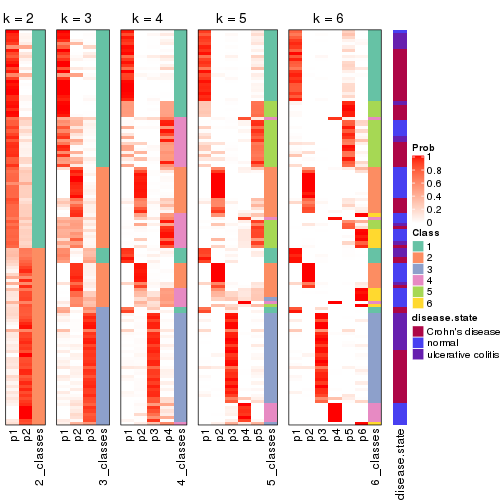


Test correlation between subgroups and known annotations. If the known
annotation is numeric, one-way ANOVA test is applied, and if the known
annotation is discrete, chi-squared contingency table test is applied.

```r
test_to_known_factors(res)
```

```
#>           n disease.state(p) k
#> MAD:pam 121         1.14e-01 2
#> MAD:pam  96         3.96e-08 3
#> MAD:pam  94         1.20e-08 4
#> MAD:pam 112         1.34e-10 5
#> MAD:pam 123         3.25e-11 6
```


If matrix rows can be associated to genes, consider to use `functional_enrichment(res,
...)` to perform function enrichment for the signature genes. See [this vignette](http://bioconductor.org/packages/devel/bioc/vignettes/cola/inst/doc/functional_enrichment.html) for more detailed explanations.


 

---------------------------------------------------


### MAD:mclust*


The object with results only for a single top-value method and a single partition method 
can be extracted as:

```r
res = res_list["MAD", "mclust"]
# you can also extract it by
# res = res_list["MAD:mclust"]
```

A summary of `res` and all the functions that can be applied to it:

```r
res
```

```
#> A 'ConsensusPartition' object with k = 2, 3, 4, 5, 6.
#>   On a matrix with 21168 rows and 127 columns.
#>   Top rows (1000, 2000, 3000, 4000, 5000) are extracted by 'MAD' method.
#>   Subgroups are detected by 'mclust' method.
#>   Performed in total 1250 partitions by row resampling.
#>   Best k for subgroups seems to be 4.
#> 
#> Following methods can be applied to this 'ConsensusPartition' object:
#>  [1] "cola_report"             "collect_classes"         "collect_plots"          
#>  [4] "collect_stats"           "colnames"                "compare_signatures"     
#>  [7] "consensus_heatmap"       "dimension_reduction"     "functional_enrichment"  
#> [10] "get_anno_col"            "get_anno"                "get_classes"            
#> [13] "get_consensus"           "get_matrix"              "get_membership"         
#> [16] "get_param"               "get_signatures"          "get_stats"              
#> [19] "is_best_k"               "is_stable_k"             "membership_heatmap"     
#> [22] "ncol"                    "nrow"                    "plot_ecdf"              
#> [25] "rownames"                "select_partition_number" "show"                   
#> [28] "suggest_best_k"          "test_to_known_factors"
```

`collect_plots()` function collects all the plots made from `res` for all `k` (number of partitions)
into one single page to provide an easy and fast comparison between different `k`.

```r
collect_plots(res)
```


The plots are:

- The first row: a plot of the ECDF (empirical cumulative distribution
  function) curves of the consensus matrix for each `k` and the heatmap of
  predicted classes for each `k`.
- The second row: heatmaps of the consensus matrix for each `k`.
- The third row: heatmaps of the membership matrix for each `k`.
- The fouth row: heatmaps of the signatures for each `k`.

All the plots in panels can be made by individual functions and they are
plotted later in this section.

`select_partition_number()` produces several plots showing different
statistics for choosing "optimized" `k`. There are following statistics:

- ECDF curves of the consensus matrix for each `k`;
- 1-PAC. [The PAC
  score](https://en.wikipedia.org/wiki/Consensus_clustering#Over-interpretation_potential_of_consensus_clustering)
  measures the proportion of the ambiguous subgrouping.
- Mean silhouette score.
- Concordance. The mean probability of fiting the consensus class ids in all
  partitions.
- Area increased. Denote $A_k$ as the area under the ECDF curve for current
  `k`, the area increased is defined as $A_k - A_{k-1}$.
- Rand index. The percent of pairs of samples that are both in a same cluster
  or both are not in a same cluster in the partition of k and k-1.
- Jaccard index. The ratio of pairs of samples are both in a same cluster in
  the partition of k and k-1 and the pairs of samples are both in a same
  cluster in the partition k or k-1.

The detailed explanations of these statistics can be found in [the _cola_
vignette](http://bioconductor.org/packages/devel/bioc/vignettes/cola/inst/doc/cola.html#toc_13).

Generally speaking, lower PAC score, higher mean silhouette score or higher
concordance corresponds to better partition. Rand index and Jaccard index
measure how similar the current partition is compared to partition with `k-1`.
If they are too similar, we won't accept `k` is better than `k-1`.

```r
select_partition_number(res)
```


The numeric values for all these statistics can be obtained by `get_stats()`.

```r
get_stats(res)
```

```
#>   k 1-PAC mean_silhouette concordance area_increased  Rand Jaccard
#> 2 2 0.475           0.830       0.844         0.3890 0.554   0.554
#> 3 3 0.823           0.912       0.932         0.6538 0.711   0.512
#> 4 4 0.923           0.913       0.957         0.0947 0.731   0.402
#> 5 5 0.861           0.848       0.933         0.0887 0.908   0.699
#> 6 6 0.831           0.832       0.894         0.0481 0.924   0.698
```

`suggest_best_k()` suggests the best $k$ based on these statistics. The rules are as follows:

- All $k$ with Jaccard index larger than 0.95 are removed because increasing
  $k$ does not provide enough extra information. If all $k$ are removed, it is
  marked as no subgroup is detected.
- For all $k$ with 1-PAC score larger than 0.9, the maximal $k$ is taken as
  the best $k$, and other $k$ are marked as optional $k$.
- If it does not fit the second rule. The $k$ with the maximal vote of the
  highest 1-PAC score, highest mean silhouette, and highest concordance is
  taken as the best $k$.

```r
suggest_best_k(res)
```

```
#> [1] 4
```


Following shows the table of the partitions (You need to click the **show/hide
code output** link to see it). The membership matrix (columns with name `p*`)
is inferred by
[`clue::cl_consensus()`](https://www.rdocumentation.org/link/cl_consensus?package=clue)
function with the `SE` method. Basically the value in the membership matrix
represents the probability to belong to a certain group. The finall class
label for an item is determined with the group with highest probability it
belongs to.

In `get_classes()` function, the entropy is calculated from the membership
matrix and the silhouette score is calculated from the consensus matrix.


<script>
$( function() {
	$( '#tabs-MAD-mclust-get-classes' ).tabs();
} );
</script>
<div id='tabs-MAD-mclust-get-classes'>
<ul>
<li><a href='#tab-MAD-mclust-get-classes-1'>k = 2</a></li>
<li><a href='#tab-MAD-mclust-get-classes-2'>k = 3</a></li>
<li><a href='#tab-MAD-mclust-get-classes-3'>k = 4</a></li>
<li><a href='#tab-MAD-mclust-get-classes-4'>k = 5</a></li>
<li><a href='#tab-MAD-mclust-get-classes-5'>k = 6</a></li>
</ul>

<div id='tab-MAD-mclust-get-classes-1'>
<p><a id='tab-MAD-mclust-get-classes-1-a' style='color:#0366d6' href='#'>show/hide code output</a></p>
<pre><code class="r">cbind(get_classes(res, k = 2), get_membership(res, k = 2))
</code></pre>

<pre><code>#&gt;          class entropy silhouette    p1    p2
#&gt; GSM76115     1  0.8386     0.8819 0.732 0.268
#&gt; GSM76116     1  0.7950     0.8719 0.760 0.240
#&gt; GSM76117     1  0.8608     0.8897 0.716 0.284
#&gt; GSM76118     1  0.8608     0.8897 0.716 0.284
#&gt; GSM76119     2  0.1414     0.9114 0.020 0.980
#&gt; GSM76120     2  0.1414     0.9114 0.020 0.980
#&gt; GSM76121     1  0.8608     0.8897 0.716 0.284
#&gt; GSM76122     1  0.8499     0.8880 0.724 0.276
#&gt; GSM76123     2  0.1414     0.9114 0.020 0.980
#&gt; GSM76124     1  0.8555     0.8890 0.720 0.280
#&gt; GSM76125     2  0.1414     0.9114 0.020 0.980
#&gt; GSM76126     2  0.1414     0.9114 0.020 0.980
#&gt; GSM76127     2  0.1414     0.9114 0.020 0.980
#&gt; GSM76128     2  0.1414     0.9114 0.020 0.980
#&gt; GSM76129     1  0.8386     0.8850 0.732 0.268
#&gt; GSM76130     2  0.1414     0.9114 0.020 0.980
#&gt; GSM76131     1  0.0000     0.7004 1.000 0.000
#&gt; GSM76132     1  0.0000     0.7004 1.000 0.000
#&gt; GSM76133     1  0.0000     0.7004 1.000 0.000
#&gt; GSM76134     1  0.4161     0.7687 0.916 0.084
#&gt; GSM76135     1  0.0376     0.7037 0.996 0.004
#&gt; GSM76136     1  0.0000     0.7004 1.000 0.000
#&gt; GSM76137     2  0.9323     0.2521 0.348 0.652
#&gt; GSM76138     1  0.7139     0.8437 0.804 0.196
#&gt; GSM76139     1  0.3274     0.7497 0.940 0.060
#&gt; GSM76140     1  0.8608     0.8897 0.716 0.284
#&gt; GSM76141     1  0.0000     0.7004 1.000 0.000
#&gt; GSM76142     1  0.0000     0.7004 1.000 0.000
#&gt; GSM76143     1  0.0000     0.7004 1.000 0.000
#&gt; GSM76144     1  0.0000     0.7004 1.000 0.000
#&gt; GSM76145     1  0.8327     0.8841 0.736 0.264
#&gt; GSM76146     1  0.0000     0.7004 1.000 0.000
#&gt; GSM76147     1  0.0000     0.7004 1.000 0.000
#&gt; GSM76148     1  0.0000     0.7004 1.000 0.000
#&gt; GSM76149     1  0.4161     0.7687 0.916 0.084
#&gt; GSM76150     1  0.4161     0.7687 0.916 0.084
#&gt; GSM76151     1  0.9000     0.8304 0.684 0.316
#&gt; GSM76152     1  0.8608     0.8897 0.716 0.284
#&gt; GSM76153     1  0.0000     0.7004 1.000 0.000
#&gt; GSM76154     1  0.4022     0.7657 0.920 0.080
#&gt; GSM76155     1  0.4022     0.7657 0.920 0.080
#&gt; GSM76156     1  0.0000     0.7004 1.000 0.000
#&gt; GSM76030     1  0.8499     0.8880 0.724 0.276
#&gt; GSM76031     1  0.8608     0.8897 0.716 0.284
#&gt; GSM76032     2  0.0000     0.9221 0.000 1.000
#&gt; GSM76033     2  0.0000     0.9221 0.000 1.000
#&gt; GSM76034     1  0.8608     0.8873 0.716 0.284
#&gt; GSM76035     2  0.0000     0.9221 0.000 1.000
#&gt; GSM76036     2  0.0000     0.9221 0.000 1.000
#&gt; GSM76037     1  0.8144     0.8788 0.748 0.252
#&gt; GSM76038     1  0.8608     0.8897 0.716 0.284
#&gt; GSM76039     1  0.8608     0.8897 0.716 0.284
#&gt; GSM76040     2  0.0000     0.9221 0.000 1.000
#&gt; GSM76041     1  0.8608     0.8897 0.716 0.284
#&gt; GSM76042     1  0.8608     0.8897 0.716 0.284
#&gt; GSM76043     1  0.9522     0.7688 0.628 0.372
#&gt; GSM76044     1  0.8608     0.8897 0.716 0.284
#&gt; GSM76045     1  0.8608     0.8897 0.716 0.284
#&gt; GSM76046     2  0.0000     0.9221 0.000 1.000
#&gt; GSM76047     2  0.9710    -0.0842 0.400 0.600
#&gt; GSM76048     2  0.0000     0.9221 0.000 1.000
#&gt; GSM76049     1  0.8499     0.8880 0.724 0.276
#&gt; GSM76050     1  0.9710     0.7144 0.600 0.400
#&gt; GSM76051     2  0.0000     0.9221 0.000 1.000
#&gt; GSM76052     2  0.0000     0.9221 0.000 1.000
#&gt; GSM76053     2  0.8813     0.3550 0.300 0.700
#&gt; GSM76054     2  0.0000     0.9221 0.000 1.000
#&gt; GSM76055     1  0.8499     0.8880 0.724 0.276
#&gt; GSM76056     1  0.8555     0.8890 0.720 0.280
#&gt; GSM76057     1  0.8443     0.8867 0.728 0.272
#&gt; GSM76058     2  0.0000     0.9221 0.000 1.000
#&gt; GSM76059     1  0.8608     0.8897 0.716 0.284
#&gt; GSM76060     1  0.8499     0.8880 0.724 0.276
#&gt; GSM76061     1  0.8386     0.8849 0.732 0.268
#&gt; GSM76062     1  0.8608     0.8897 0.716 0.284
#&gt; GSM76063     2  0.9044     0.3126 0.320 0.680
#&gt; GSM76064     2  0.2236     0.8866 0.036 0.964
#&gt; GSM76065     1  0.8267     0.8818 0.740 0.260
#&gt; GSM76066     2  0.9988    -0.4148 0.480 0.520
#&gt; GSM76067     2  0.0000     0.9221 0.000 1.000
#&gt; GSM76068     2  0.0000     0.9221 0.000 1.000
#&gt; GSM76069     1  0.8608     0.8897 0.716 0.284
#&gt; GSM76070     1  0.4431     0.7747 0.908 0.092
#&gt; GSM76071     1  0.8608     0.8897 0.716 0.284
#&gt; GSM76072     1  0.8608     0.8897 0.716 0.284
#&gt; GSM76073     1  0.8608     0.8897 0.716 0.284
#&gt; GSM76074     1  0.8608     0.8897 0.716 0.284
#&gt; GSM76075     2  0.0000     0.9221 0.000 1.000
#&gt; GSM76076     2  0.0000     0.9221 0.000 1.000
#&gt; GSM76077     1  0.8608     0.8897 0.716 0.284
#&gt; GSM76078     1  0.9460     0.7848 0.636 0.364
#&gt; GSM76079     1  0.8608     0.8897 0.716 0.284
#&gt; GSM76080     2  0.0000     0.9221 0.000 1.000
#&gt; GSM76081     2  0.0000     0.9221 0.000 1.000
#&gt; GSM76082     2  0.0000     0.9221 0.000 1.000
#&gt; GSM76083     2  0.0000     0.9221 0.000 1.000
#&gt; GSM76084     2  0.8016     0.5468 0.244 0.756
#&gt; GSM76085     2  0.0000     0.9221 0.000 1.000
#&gt; GSM76086     2  0.0000     0.9221 0.000 1.000
#&gt; GSM76087     1  0.4161     0.7687 0.916 0.084
#&gt; GSM76088     1  0.8443     0.8867 0.728 0.272
#&gt; GSM76089     1  0.8207     0.8810 0.744 0.256
#&gt; GSM76090     2  0.0000     0.9221 0.000 1.000
#&gt; GSM76091     1  0.8608     0.8897 0.716 0.284
#&gt; GSM76092     1  0.8608     0.8897 0.716 0.284
#&gt; GSM76093     1  0.8608     0.8897 0.716 0.284
#&gt; GSM76094     1  0.8555     0.8890 0.720 0.280
#&gt; GSM76095     1  0.8608     0.8897 0.716 0.284
#&gt; GSM76096     1  0.8608     0.8897 0.716 0.284
#&gt; GSM76097     1  0.8608     0.8897 0.716 0.284
#&gt; GSM76098     2  0.0000     0.9221 0.000 1.000
#&gt; GSM76099     1  0.8608     0.8897 0.716 0.284
#&gt; GSM76100     1  0.8608     0.8897 0.716 0.284
#&gt; GSM76101     1  0.8608     0.8897 0.716 0.284
#&gt; GSM76102     1  0.8608     0.8897 0.716 0.284
#&gt; GSM76103     2  0.0000     0.9221 0.000 1.000
#&gt; GSM76104     2  0.0000     0.9221 0.000 1.000
#&gt; GSM76105     1  0.8608     0.8897 0.716 0.284
#&gt; GSM76106     2  0.0938     0.9160 0.012 0.988
#&gt; GSM76107     2  0.1414     0.9114 0.020 0.980
#&gt; GSM76108     1  0.8608     0.8897 0.716 0.284
#&gt; GSM76109     1  0.8608     0.8897 0.716 0.284
#&gt; GSM76110     1  0.8608     0.8897 0.716 0.284
#&gt; GSM76111     1  0.8608     0.8897 0.716 0.284
#&gt; GSM76112     1  0.8861     0.8695 0.696 0.304
#&gt; GSM76113     1  0.8608     0.8897 0.716 0.284
#&gt; GSM76114     1  0.8608     0.8897 0.716 0.284
</code></pre>

<script>
$('#tab-MAD-mclust-get-classes-1-a').parent().next().next().hide();
$('#tab-MAD-mclust-get-classes-1-a').click(function(){
  $('#tab-MAD-mclust-get-classes-1-a').parent().next().next().toggle();
  return(false);
});
</script>
</div>

<div id='tab-MAD-mclust-get-classes-2'>
<p><a id='tab-MAD-mclust-get-classes-2-a' style='color:#0366d6' href='#'>show/hide code output</a></p>
<pre><code class="r">cbind(get_classes(res, k = 3), get_membership(res, k = 3))
</code></pre>

<pre><code>#&gt;          class entropy silhouette    p1    p2    p3
#&gt; GSM76115     2  0.3276      0.922 0.068 0.908 0.024
#&gt; GSM76116     2  0.3637      0.922 0.084 0.892 0.024
#&gt; GSM76117     2  0.4045      0.919 0.104 0.872 0.024
#&gt; GSM76118     2  0.4045      0.919 0.104 0.872 0.024
#&gt; GSM76119     3  0.3045      0.938 0.064 0.020 0.916
#&gt; GSM76120     3  0.3045      0.938 0.064 0.020 0.916
#&gt; GSM76121     2  0.4045      0.919 0.104 0.872 0.024
#&gt; GSM76122     2  0.4045      0.919 0.104 0.872 0.024
#&gt; GSM76123     3  0.3045      0.938 0.064 0.020 0.916
#&gt; GSM76124     2  0.4045      0.919 0.104 0.872 0.024
#&gt; GSM76125     3  0.3045      0.938 0.064 0.020 0.916
#&gt; GSM76126     3  0.3045      0.938 0.064 0.020 0.916
#&gt; GSM76127     3  0.3045      0.938 0.064 0.020 0.916
#&gt; GSM76128     3  0.3045      0.938 0.064 0.020 0.916
#&gt; GSM76129     2  0.3722      0.922 0.088 0.888 0.024
#&gt; GSM76130     3  0.3045      0.938 0.064 0.020 0.916
#&gt; GSM76131     2  0.0237      0.892 0.004 0.996 0.000
#&gt; GSM76132     2  0.0000      0.890 0.000 1.000 0.000
#&gt; GSM76133     2  0.0237      0.892 0.004 0.996 0.000
#&gt; GSM76134     2  0.3276      0.922 0.068 0.908 0.024
#&gt; GSM76135     2  0.0424      0.893 0.008 0.992 0.000
#&gt; GSM76136     2  0.0237      0.892 0.004 0.996 0.000
#&gt; GSM76137     2  0.5970      0.819 0.060 0.780 0.160
#&gt; GSM76138     2  0.3550      0.922 0.080 0.896 0.024
#&gt; GSM76139     2  0.2486      0.919 0.060 0.932 0.008
#&gt; GSM76140     2  0.4270      0.913 0.116 0.860 0.024
#&gt; GSM76141     2  0.0000      0.890 0.000 1.000 0.000
#&gt; GSM76142     2  0.0000      0.890 0.000 1.000 0.000
#&gt; GSM76143     2  0.0000      0.890 0.000 1.000 0.000
#&gt; GSM76144     2  0.0237      0.892 0.004 0.996 0.000
#&gt; GSM76145     2  0.3337      0.920 0.060 0.908 0.032
#&gt; GSM76146     2  0.0000      0.890 0.000 1.000 0.000
#&gt; GSM76147     2  0.0592      0.896 0.012 0.988 0.000
#&gt; GSM76148     2  0.0000      0.890 0.000 1.000 0.000
#&gt; GSM76149     2  0.3276      0.922 0.068 0.908 0.024
#&gt; GSM76150     2  0.3181      0.922 0.064 0.912 0.024
#&gt; GSM76151     2  0.3406      0.922 0.068 0.904 0.028
#&gt; GSM76152     1  0.0237      0.961 0.996 0.004 0.000
#&gt; GSM76153     2  0.0237      0.892 0.004 0.996 0.000
#&gt; GSM76154     2  0.2947      0.921 0.060 0.920 0.020
#&gt; GSM76155     2  0.2846      0.920 0.056 0.924 0.020
#&gt; GSM76156     2  0.0424      0.895 0.008 0.992 0.000
#&gt; GSM76030     2  0.7188      0.160 0.488 0.488 0.024
#&gt; GSM76031     1  0.0424      0.960 0.992 0.008 0.000
#&gt; GSM76032     3  0.0000      0.964 0.000 0.000 1.000
#&gt; GSM76033     3  0.0237      0.963 0.004 0.000 0.996
#&gt; GSM76034     2  0.4357      0.915 0.080 0.868 0.052
#&gt; GSM76035     3  0.2400      0.938 0.064 0.004 0.932
#&gt; GSM76036     3  0.0000      0.964 0.000 0.000 1.000
#&gt; GSM76037     2  0.3637      0.922 0.084 0.892 0.024
#&gt; GSM76038     1  0.0237      0.961 0.996 0.004 0.000
#&gt; GSM76039     2  0.4291      0.890 0.152 0.840 0.008
#&gt; GSM76040     3  0.0000      0.964 0.000 0.000 1.000
#&gt; GSM76041     1  0.0592      0.957 0.988 0.000 0.012
#&gt; GSM76042     2  0.6587      0.428 0.424 0.568 0.008
#&gt; GSM76043     1  0.1860      0.939 0.948 0.000 0.052
#&gt; GSM76044     2  0.4121      0.917 0.108 0.868 0.024
#&gt; GSM76045     1  0.0237      0.961 0.996 0.004 0.000
#&gt; GSM76046     3  0.1399      0.957 0.028 0.004 0.968
#&gt; GSM76047     1  0.2356      0.921 0.928 0.000 0.072
#&gt; GSM76048     3  0.0000      0.964 0.000 0.000 1.000
#&gt; GSM76049     1  0.5536      0.710 0.776 0.200 0.024
#&gt; GSM76050     1  0.1529      0.947 0.960 0.000 0.040
#&gt; GSM76051     3  0.0000      0.964 0.000 0.000 1.000
#&gt; GSM76052     3  0.0000      0.964 0.000 0.000 1.000
#&gt; GSM76053     2  0.5970      0.828 0.060 0.780 0.160
#&gt; GSM76054     3  0.0000      0.964 0.000 0.000 1.000
#&gt; GSM76055     2  0.4045      0.919 0.104 0.872 0.024
#&gt; GSM76056     1  0.1129      0.953 0.976 0.004 0.020
#&gt; GSM76057     1  0.2187      0.942 0.948 0.028 0.024
#&gt; GSM76058     3  0.0000      0.964 0.000 0.000 1.000
#&gt; GSM76059     1  0.0237      0.961 0.996 0.004 0.000
#&gt; GSM76060     1  0.2318      0.940 0.944 0.028 0.028
#&gt; GSM76061     1  0.2187      0.942 0.948 0.028 0.024
#&gt; GSM76062     1  0.0661      0.959 0.988 0.004 0.008
#&gt; GSM76063     2  0.6887      0.722 0.060 0.704 0.236
#&gt; GSM76064     1  0.5815      0.566 0.692 0.004 0.304
#&gt; GSM76065     2  0.3550      0.922 0.080 0.896 0.024
#&gt; GSM76066     1  0.1411      0.946 0.964 0.000 0.036
#&gt; GSM76067     3  0.0000      0.964 0.000 0.000 1.000
#&gt; GSM76068     3  0.0000      0.964 0.000 0.000 1.000
#&gt; GSM76069     1  0.0237      0.961 0.996 0.004 0.000
#&gt; GSM76070     2  0.3325      0.923 0.076 0.904 0.020
#&gt; GSM76071     1  0.0747      0.955 0.984 0.000 0.016
#&gt; GSM76072     1  0.0661      0.959 0.988 0.004 0.008
#&gt; GSM76073     1  0.0237      0.961 0.996 0.004 0.000
#&gt; GSM76074     1  0.0237      0.961 0.996 0.004 0.000
#&gt; GSM76075     3  0.0000      0.964 0.000 0.000 1.000
#&gt; GSM76076     3  0.0000      0.964 0.000 0.000 1.000
#&gt; GSM76077     1  0.2056      0.944 0.952 0.024 0.024
#&gt; GSM76078     1  0.2527      0.936 0.936 0.020 0.044
#&gt; GSM76079     1  0.0237      0.961 0.996 0.004 0.000
#&gt; GSM76080     3  0.1525      0.956 0.032 0.004 0.964
#&gt; GSM76081     3  0.0237      0.963 0.000 0.004 0.996
#&gt; GSM76082     3  0.0000      0.964 0.000 0.000 1.000
#&gt; GSM76083     3  0.0000      0.964 0.000 0.000 1.000
#&gt; GSM76084     2  0.7451      0.604 0.060 0.636 0.304
#&gt; GSM76085     3  0.0000      0.964 0.000 0.000 1.000
#&gt; GSM76086     3  0.0000      0.964 0.000 0.000 1.000
#&gt; GSM76087     2  0.3083      0.922 0.060 0.916 0.024
#&gt; GSM76088     1  0.2187      0.942 0.948 0.028 0.024
#&gt; GSM76089     2  0.3461      0.922 0.076 0.900 0.024
#&gt; GSM76090     3  0.0592      0.962 0.012 0.000 0.988
#&gt; GSM76091     1  0.0592      0.957 0.988 0.000 0.012
#&gt; GSM76092     1  0.0237      0.961 0.996 0.004 0.000
#&gt; GSM76093     1  0.0237      0.961 0.996 0.004 0.000
#&gt; GSM76094     2  0.4045      0.919 0.104 0.872 0.024
#&gt; GSM76095     1  0.5220      0.684 0.780 0.208 0.012
#&gt; GSM76096     2  0.4121      0.917 0.108 0.868 0.024
#&gt; GSM76097     2  0.4277      0.904 0.132 0.852 0.016
#&gt; GSM76098     3  0.1399      0.957 0.028 0.004 0.968
#&gt; GSM76099     1  0.0237      0.961 0.996 0.004 0.000
#&gt; GSM76100     1  0.0237      0.961 0.996 0.004 0.000
#&gt; GSM76101     1  0.0237      0.961 0.996 0.004 0.000
#&gt; GSM76102     2  0.4121      0.917 0.108 0.868 0.024
#&gt; GSM76103     3  0.0000      0.964 0.000 0.000 1.000
#&gt; GSM76104     3  0.2301      0.940 0.060 0.004 0.936
#&gt; GSM76105     2  0.4045      0.919 0.104 0.872 0.024
#&gt; GSM76106     3  0.2651      0.939 0.060 0.012 0.928
#&gt; GSM76107     3  0.4179      0.900 0.072 0.052 0.876
#&gt; GSM76108     2  0.4270      0.913 0.116 0.860 0.024
#&gt; GSM76109     1  0.0237      0.961 0.996 0.004 0.000
#&gt; GSM76110     1  0.0237      0.961 0.996 0.004 0.000
#&gt; GSM76111     1  0.0661      0.959 0.988 0.004 0.008
#&gt; GSM76112     1  0.0892      0.952 0.980 0.000 0.020
#&gt; GSM76113     2  0.6183      0.766 0.236 0.732 0.032
#&gt; GSM76114     1  0.0237      0.961 0.996 0.004 0.000
</code></pre>

<script>
$('#tab-MAD-mclust-get-classes-2-a').parent().next().next().hide();
$('#tab-MAD-mclust-get-classes-2-a').click(function(){
  $('#tab-MAD-mclust-get-classes-2-a').parent().next().next().toggle();
  return(false);
});
</script>
</div>

<div id='tab-MAD-mclust-get-classes-3'>
<p><a id='tab-MAD-mclust-get-classes-3-a' style='color:#0366d6' href='#'>show/hide code output</a></p>
<pre><code class="r">cbind(get_classes(res, k = 4), get_membership(res, k = 4))
</code></pre>

<pre><code>#&gt;          class entropy silhouette    p1    p2    p3    p4
#&gt; GSM76115     2  0.1677      0.934 0.040 0.948 0.012 0.000
#&gt; GSM76116     2  0.1022      0.940 0.032 0.968 0.000 0.000
#&gt; GSM76117     1  0.0469      0.952 0.988 0.000 0.000 0.012
#&gt; GSM76118     1  0.1488      0.925 0.956 0.032 0.000 0.012
#&gt; GSM76119     4  0.0469      0.990 0.000 0.000 0.012 0.988
#&gt; GSM76120     4  0.0469      0.990 0.000 0.000 0.012 0.988
#&gt; GSM76121     1  0.0469      0.948 0.988 0.000 0.012 0.000
#&gt; GSM76122     1  0.2473      0.871 0.908 0.080 0.000 0.012
#&gt; GSM76123     4  0.0469      0.990 0.000 0.000 0.012 0.988
#&gt; GSM76124     1  0.4606      0.601 0.724 0.264 0.000 0.012
#&gt; GSM76125     4  0.0469      0.990 0.000 0.000 0.012 0.988
#&gt; GSM76126     4  0.1471      0.965 0.024 0.004 0.012 0.960
#&gt; GSM76127     4  0.0469      0.990 0.000 0.000 0.012 0.988
#&gt; GSM76128     4  0.0469      0.990 0.000 0.000 0.012 0.988
#&gt; GSM76129     2  0.3625      0.809 0.160 0.828 0.012 0.000
#&gt; GSM76130     4  0.0469      0.990 0.000 0.000 0.012 0.988
#&gt; GSM76131     2  0.0000      0.930 0.000 1.000 0.000 0.000
#&gt; GSM76132     2  0.0000      0.930 0.000 1.000 0.000 0.000
#&gt; GSM76133     2  0.0000      0.930 0.000 1.000 0.000 0.000
#&gt; GSM76134     2  0.1022      0.940 0.032 0.968 0.000 0.000
#&gt; GSM76135     2  0.0000      0.930 0.000 1.000 0.000 0.000
#&gt; GSM76136     2  0.0000      0.930 0.000 1.000 0.000 0.000
#&gt; GSM76137     2  0.2644      0.917 0.032 0.916 0.008 0.044
#&gt; GSM76138     2  0.1022      0.940 0.032 0.968 0.000 0.000
#&gt; GSM76139     2  0.1022      0.940 0.032 0.968 0.000 0.000
#&gt; GSM76140     1  0.0469      0.952 0.988 0.000 0.000 0.012
#&gt; GSM76141     2  0.0000      0.930 0.000 1.000 0.000 0.000
#&gt; GSM76142     2  0.0000      0.930 0.000 1.000 0.000 0.000
#&gt; GSM76143     2  0.0000      0.930 0.000 1.000 0.000 0.000
#&gt; GSM76144     2  0.0000      0.930 0.000 1.000 0.000 0.000
#&gt; GSM76145     2  0.1488      0.936 0.032 0.956 0.012 0.000
#&gt; GSM76146     2  0.0000      0.930 0.000 1.000 0.000 0.000
#&gt; GSM76147     2  0.0000      0.930 0.000 1.000 0.000 0.000
#&gt; GSM76148     2  0.0000      0.930 0.000 1.000 0.000 0.000
#&gt; GSM76149     2  0.1022      0.940 0.032 0.968 0.000 0.000
#&gt; GSM76150     2  0.1022      0.940 0.032 0.968 0.000 0.000
#&gt; GSM76151     2  0.1488      0.936 0.032 0.956 0.012 0.000
#&gt; GSM76152     1  0.0000      0.955 1.000 0.000 0.000 0.000
#&gt; GSM76153     2  0.0000      0.930 0.000 1.000 0.000 0.000
#&gt; GSM76154     2  0.1022      0.940 0.032 0.968 0.000 0.000
#&gt; GSM76155     2  0.1022      0.940 0.032 0.968 0.000 0.000
#&gt; GSM76156     2  0.0000      0.930 0.000 1.000 0.000 0.000
#&gt; GSM76030     2  0.1488      0.936 0.032 0.956 0.012 0.000
#&gt; GSM76031     1  0.0000      0.955 1.000 0.000 0.000 0.000
#&gt; GSM76032     3  0.0000      0.951 0.000 0.000 1.000 0.000
#&gt; GSM76033     3  0.0000      0.951 0.000 0.000 1.000 0.000
#&gt; GSM76034     2  0.3279      0.876 0.096 0.872 0.032 0.000
#&gt; GSM76035     3  0.0921      0.931 0.028 0.000 0.972 0.000
#&gt; GSM76036     3  0.0000      0.951 0.000 0.000 1.000 0.000
#&gt; GSM76037     2  0.1584      0.935 0.036 0.952 0.012 0.000
#&gt; GSM76038     1  0.0000      0.955 1.000 0.000 0.000 0.000
#&gt; GSM76039     1  0.0469      0.952 0.988 0.000 0.000 0.012
#&gt; GSM76040     3  0.0000      0.951 0.000 0.000 1.000 0.000
#&gt; GSM76041     1  0.2921      0.805 0.860 0.000 0.140 0.000
#&gt; GSM76042     1  0.0469      0.948 0.988 0.000 0.012 0.000
#&gt; GSM76043     3  0.3074      0.795 0.152 0.000 0.848 0.000
#&gt; GSM76044     1  0.0469      0.952 0.988 0.000 0.000 0.012
#&gt; GSM76045     1  0.0000      0.955 1.000 0.000 0.000 0.000
#&gt; GSM76046     3  0.0336      0.946 0.008 0.000 0.992 0.000
#&gt; GSM76047     3  0.1792      0.901 0.068 0.000 0.932 0.000
#&gt; GSM76048     3  0.0000      0.951 0.000 0.000 1.000 0.000
#&gt; GSM76049     2  0.2179      0.917 0.064 0.924 0.012 0.000
#&gt; GSM76050     1  0.3123      0.784 0.844 0.000 0.156 0.000
#&gt; GSM76051     3  0.0000      0.951 0.000 0.000 1.000 0.000
#&gt; GSM76052     3  0.0000      0.951 0.000 0.000 1.000 0.000
#&gt; GSM76053     1  0.7006      0.295 0.528 0.132 0.340 0.000
#&gt; GSM76054     3  0.0000      0.951 0.000 0.000 1.000 0.000
#&gt; GSM76055     2  0.4891      0.592 0.308 0.680 0.000 0.012
#&gt; GSM76056     2  0.5360      0.287 0.436 0.552 0.012 0.000
#&gt; GSM76057     2  0.1488      0.936 0.032 0.956 0.012 0.000
#&gt; GSM76058     3  0.0000      0.951 0.000 0.000 1.000 0.000
#&gt; GSM76059     1  0.0000      0.955 1.000 0.000 0.000 0.000
#&gt; GSM76060     2  0.2197      0.923 0.048 0.928 0.024 0.000
#&gt; GSM76061     2  0.1488      0.936 0.032 0.956 0.012 0.000
#&gt; GSM76062     1  0.0000      0.955 1.000 0.000 0.000 0.000
#&gt; GSM76063     3  0.1733      0.918 0.028 0.024 0.948 0.000
#&gt; GSM76064     3  0.1940      0.892 0.076 0.000 0.924 0.000
#&gt; GSM76065     2  0.1022      0.940 0.032 0.968 0.000 0.000
#&gt; GSM76066     3  0.2281      0.874 0.096 0.000 0.904 0.000
#&gt; GSM76067     3  0.0000      0.951 0.000 0.000 1.000 0.000
#&gt; GSM76068     3  0.0000      0.951 0.000 0.000 1.000 0.000
#&gt; GSM76069     1  0.0000      0.955 1.000 0.000 0.000 0.000
#&gt; GSM76070     2  0.1022      0.940 0.032 0.968 0.000 0.000
#&gt; GSM76071     1  0.0000      0.955 1.000 0.000 0.000 0.000
#&gt; GSM76072     1  0.0000      0.955 1.000 0.000 0.000 0.000
#&gt; GSM76073     1  0.0000      0.955 1.000 0.000 0.000 0.000
#&gt; GSM76074     1  0.0000      0.955 1.000 0.000 0.000 0.000
#&gt; GSM76075     3  0.0000      0.951 0.000 0.000 1.000 0.000
#&gt; GSM76076     3  0.0000      0.951 0.000 0.000 1.000 0.000
#&gt; GSM76077     2  0.4098      0.757 0.204 0.784 0.012 0.000
#&gt; GSM76078     3  0.1724      0.916 0.032 0.020 0.948 0.000
#&gt; GSM76079     1  0.0000      0.955 1.000 0.000 0.000 0.000
#&gt; GSM76080     3  0.0000      0.951 0.000 0.000 1.000 0.000
#&gt; GSM76081     3  0.0000      0.951 0.000 0.000 1.000 0.000
#&gt; GSM76082     3  0.0000      0.951 0.000 0.000 1.000 0.000
#&gt; GSM76083     3  0.0000      0.951 0.000 0.000 1.000 0.000
#&gt; GSM76084     3  0.4057      0.741 0.032 0.152 0.816 0.000
#&gt; GSM76085     3  0.0000      0.951 0.000 0.000 1.000 0.000
#&gt; GSM76086     3  0.0000      0.951 0.000 0.000 1.000 0.000
#&gt; GSM76087     2  0.1022      0.940 0.032 0.968 0.000 0.000
#&gt; GSM76088     2  0.3217      0.855 0.128 0.860 0.012 0.000
#&gt; GSM76089     2  0.1022      0.940 0.032 0.968 0.000 0.000
#&gt; GSM76090     3  0.0000      0.951 0.000 0.000 1.000 0.000
#&gt; GSM76091     1  0.3444      0.741 0.816 0.000 0.184 0.000
#&gt; GSM76092     1  0.0000      0.955 1.000 0.000 0.000 0.000
#&gt; GSM76093     1  0.0000      0.955 1.000 0.000 0.000 0.000
#&gt; GSM76094     1  0.0937      0.944 0.976 0.012 0.000 0.012
#&gt; GSM76095     1  0.0469      0.948 0.988 0.000 0.012 0.000
#&gt; GSM76096     1  0.0000      0.955 1.000 0.000 0.000 0.000
#&gt; GSM76097     1  0.0469      0.952 0.988 0.000 0.000 0.012
#&gt; GSM76098     3  0.0000      0.951 0.000 0.000 1.000 0.000
#&gt; GSM76099     1  0.0000      0.955 1.000 0.000 0.000 0.000
#&gt; GSM76100     1  0.0000      0.955 1.000 0.000 0.000 0.000
#&gt; GSM76101     1  0.0000      0.955 1.000 0.000 0.000 0.000
#&gt; GSM76102     1  0.0469      0.948 0.988 0.000 0.012 0.000
#&gt; GSM76103     3  0.0000      0.951 0.000 0.000 1.000 0.000
#&gt; GSM76104     3  0.1022      0.928 0.032 0.000 0.968 0.000
#&gt; GSM76105     1  0.0469      0.952 0.988 0.000 0.000 0.012
#&gt; GSM76106     3  0.2483      0.900 0.032 0.000 0.916 0.052
#&gt; GSM76107     4  0.1388      0.962 0.028 0.000 0.012 0.960
#&gt; GSM76108     1  0.0469      0.952 0.988 0.000 0.000 0.012
#&gt; GSM76109     1  0.0000      0.955 1.000 0.000 0.000 0.000
#&gt; GSM76110     1  0.0000      0.955 1.000 0.000 0.000 0.000
#&gt; GSM76111     1  0.0000      0.955 1.000 0.000 0.000 0.000
#&gt; GSM76112     3  0.4888      0.325 0.412 0.000 0.588 0.000
#&gt; GSM76113     2  0.3697      0.858 0.100 0.852 0.048 0.000
#&gt; GSM76114     1  0.0000      0.955 1.000 0.000 0.000 0.000
</code></pre>

<script>
$('#tab-MAD-mclust-get-classes-3-a').parent().next().next().hide();
$('#tab-MAD-mclust-get-classes-3-a').click(function(){
  $('#tab-MAD-mclust-get-classes-3-a').parent().next().next().toggle();
  return(false);
});
</script>
</div>

<div id='tab-MAD-mclust-get-classes-4'>
<p><a id='tab-MAD-mclust-get-classes-4-a' style='color:#0366d6' href='#'>show/hide code output</a></p>
<pre><code class="r">cbind(get_classes(res, k = 5), get_membership(res, k = 5))
</code></pre>

<pre><code>#&gt;          class entropy silhouette    p1    p2    p3    p4    p5
#&gt; GSM76115     2  0.3906     0.5357 0.004 0.704 0.000 0.000 0.292
#&gt; GSM76116     2  0.1331     0.8677 0.008 0.952 0.000 0.000 0.040
#&gt; GSM76117     5  0.0404     0.8790 0.012 0.000 0.000 0.000 0.988
#&gt; GSM76118     5  0.0404     0.8790 0.012 0.000 0.000 0.000 0.988
#&gt; GSM76119     4  0.0000     0.9979 0.000 0.000 0.000 1.000 0.000
#&gt; GSM76120     4  0.0000     0.9979 0.000 0.000 0.000 1.000 0.000
#&gt; GSM76121     5  0.3573     0.7084 0.036 0.000 0.152 0.000 0.812
#&gt; GSM76122     5  0.0404     0.8790 0.012 0.000 0.000 0.000 0.988
#&gt; GSM76123     4  0.0000     0.9979 0.000 0.000 0.000 1.000 0.000
#&gt; GSM76124     5  0.0404     0.8790 0.012 0.000 0.000 0.000 0.988
#&gt; GSM76125     4  0.0000     0.9979 0.000 0.000 0.000 1.000 0.000
#&gt; GSM76126     4  0.0451     0.9830 0.004 0.000 0.008 0.988 0.000
#&gt; GSM76127     4  0.0000     0.9979 0.000 0.000 0.000 1.000 0.000
#&gt; GSM76128     4  0.0000     0.9979 0.000 0.000 0.000 1.000 0.000
#&gt; GSM76129     5  0.4473     0.2960 0.008 0.412 0.000 0.000 0.580
#&gt; GSM76130     4  0.0000     0.9979 0.000 0.000 0.000 1.000 0.000
#&gt; GSM76131     2  0.0000     0.8914 0.000 1.000 0.000 0.000 0.000
#&gt; GSM76132     2  0.0000     0.8914 0.000 1.000 0.000 0.000 0.000
#&gt; GSM76133     2  0.0000     0.8914 0.000 1.000 0.000 0.000 0.000
#&gt; GSM76134     2  0.0324     0.8915 0.004 0.992 0.000 0.000 0.004
#&gt; GSM76135     2  0.0000     0.8914 0.000 1.000 0.000 0.000 0.000
#&gt; GSM76136     2  0.0000     0.8914 0.000 1.000 0.000 0.000 0.000
#&gt; GSM76137     2  0.1026     0.8798 0.004 0.968 0.000 0.024 0.004
#&gt; GSM76138     2  0.0324     0.8915 0.004 0.992 0.000 0.000 0.004
#&gt; GSM76139     2  0.0324     0.8915 0.004 0.992 0.000 0.000 0.004
#&gt; GSM76140     5  0.0404     0.8790 0.012 0.000 0.000 0.000 0.988
#&gt; GSM76141     2  0.0000     0.8914 0.000 1.000 0.000 0.000 0.000
#&gt; GSM76142     2  0.0000     0.8914 0.000 1.000 0.000 0.000 0.000
#&gt; GSM76143     2  0.0000     0.8914 0.000 1.000 0.000 0.000 0.000
#&gt; GSM76144     2  0.0000     0.8914 0.000 1.000 0.000 0.000 0.000
#&gt; GSM76145     2  0.0324     0.8915 0.004 0.992 0.000 0.000 0.004
#&gt; GSM76146     2  0.0000     0.8914 0.000 1.000 0.000 0.000 0.000
#&gt; GSM76147     2  0.0000     0.8914 0.000 1.000 0.000 0.000 0.000
#&gt; GSM76148     2  0.0000     0.8914 0.000 1.000 0.000 0.000 0.000
#&gt; GSM76149     2  0.0324     0.8915 0.004 0.992 0.000 0.000 0.004
#&gt; GSM76150     2  0.0324     0.8915 0.004 0.992 0.000 0.000 0.004
#&gt; GSM76151     2  0.0324     0.8915 0.004 0.992 0.000 0.000 0.004
#&gt; GSM76152     1  0.0290     0.9367 0.992 0.000 0.000 0.000 0.008
#&gt; GSM76153     2  0.0000     0.8914 0.000 1.000 0.000 0.000 0.000
#&gt; GSM76154     2  0.0324     0.8915 0.004 0.992 0.000 0.000 0.004
#&gt; GSM76155     2  0.0324     0.8915 0.004 0.992 0.000 0.000 0.004
#&gt; GSM76156     2  0.0000     0.8914 0.000 1.000 0.000 0.000 0.000
#&gt; GSM76030     2  0.3967     0.7148 0.008 0.772 0.200 0.000 0.020
#&gt; GSM76031     1  0.0404     0.9361 0.988 0.000 0.000 0.000 0.012
#&gt; GSM76032     3  0.0000     0.9466 0.000 0.000 1.000 0.000 0.000
#&gt; GSM76033     3  0.0000     0.9466 0.000 0.000 1.000 0.000 0.000
#&gt; GSM76034     2  0.6398     0.4775 0.016 0.576 0.228 0.000 0.180
#&gt; GSM76035     3  0.0162     0.9436 0.004 0.000 0.996 0.000 0.000
#&gt; GSM76036     3  0.0000     0.9466 0.000 0.000 1.000 0.000 0.000
#&gt; GSM76037     2  0.3728     0.6140 0.008 0.748 0.000 0.000 0.244
#&gt; GSM76038     1  0.0000     0.9364 1.000 0.000 0.000 0.000 0.000
#&gt; GSM76039     5  0.0404     0.8790 0.012 0.000 0.000 0.000 0.988
#&gt; GSM76040     3  0.0000     0.9466 0.000 0.000 1.000 0.000 0.000
#&gt; GSM76041     1  0.0609     0.9206 0.980 0.000 0.020 0.000 0.000
#&gt; GSM76042     1  0.4126     0.3402 0.620 0.000 0.000 0.000 0.380
#&gt; GSM76043     3  0.1792     0.8715 0.084 0.000 0.916 0.000 0.000
#&gt; GSM76044     5  0.0404     0.8790 0.012 0.000 0.000 0.000 0.988
#&gt; GSM76045     1  0.0162     0.9347 0.996 0.000 0.004 0.000 0.000
#&gt; GSM76046     3  0.0162     0.9453 0.000 0.000 0.996 0.000 0.004
#&gt; GSM76047     3  0.2074     0.8482 0.104 0.000 0.896 0.000 0.000
#&gt; GSM76048     3  0.0000     0.9466 0.000 0.000 1.000 0.000 0.000
#&gt; GSM76049     2  0.4458     0.7557 0.036 0.796 0.084 0.000 0.084
#&gt; GSM76050     1  0.0290     0.9326 0.992 0.000 0.008 0.000 0.000
#&gt; GSM76051     3  0.0000     0.9466 0.000 0.000 1.000 0.000 0.000
#&gt; GSM76052     3  0.0162     0.9453 0.000 0.000 0.996 0.000 0.004
#&gt; GSM76053     3  0.6519     0.3170 0.032 0.300 0.552 0.000 0.116
#&gt; GSM76054     3  0.0000     0.9466 0.000 0.000 1.000 0.000 0.000
#&gt; GSM76055     5  0.0992     0.8561 0.008 0.024 0.000 0.000 0.968
#&gt; GSM76056     1  0.6882     0.0779 0.440 0.304 0.008 0.000 0.248
#&gt; GSM76057     2  0.4208     0.7363 0.024 0.788 0.156 0.000 0.032
#&gt; GSM76058     3  0.0000     0.9466 0.000 0.000 1.000 0.000 0.000
#&gt; GSM76059     1  0.0290     0.9366 0.992 0.000 0.000 0.000 0.008
#&gt; GSM76060     2  0.5557     0.2515 0.044 0.520 0.424 0.000 0.012
#&gt; GSM76061     2  0.3379     0.7658 0.008 0.828 0.148 0.000 0.016
#&gt; GSM76062     1  0.0000     0.9364 1.000 0.000 0.000 0.000 0.000
#&gt; GSM76063     3  0.3766     0.6038 0.004 0.268 0.728 0.000 0.000
#&gt; GSM76064     3  0.0510     0.9354 0.016 0.000 0.984 0.000 0.000
#&gt; GSM76065     2  0.0451     0.8888 0.008 0.988 0.000 0.000 0.004
#&gt; GSM76066     1  0.2852     0.7265 0.828 0.000 0.172 0.000 0.000
#&gt; GSM76067     3  0.0000     0.9466 0.000 0.000 1.000 0.000 0.000
#&gt; GSM76068     3  0.0000     0.9466 0.000 0.000 1.000 0.000 0.000
#&gt; GSM76069     1  0.0000     0.9364 1.000 0.000 0.000 0.000 0.000
#&gt; GSM76070     2  0.0324     0.8915 0.004 0.992 0.000 0.000 0.004
#&gt; GSM76071     1  0.0000     0.9364 1.000 0.000 0.000 0.000 0.000
#&gt; GSM76072     1  0.0000     0.9364 1.000 0.000 0.000 0.000 0.000
#&gt; GSM76073     1  0.0404     0.9361 0.988 0.000 0.000 0.000 0.012
#&gt; GSM76074     1  0.0404     0.9361 0.988 0.000 0.000 0.000 0.012
#&gt; GSM76075     3  0.0000     0.9466 0.000 0.000 1.000 0.000 0.000
#&gt; GSM76076     3  0.0000     0.9466 0.000 0.000 1.000 0.000 0.000
#&gt; GSM76077     2  0.7365     0.4107 0.208 0.512 0.208 0.000 0.072
#&gt; GSM76078     3  0.1074     0.9242 0.012 0.016 0.968 0.000 0.004
#&gt; GSM76079     1  0.0000     0.9364 1.000 0.000 0.000 0.000 0.000
#&gt; GSM76080     3  0.0162     0.9453 0.000 0.000 0.996 0.000 0.004
#&gt; GSM76081     3  0.0000     0.9466 0.000 0.000 1.000 0.000 0.000
#&gt; GSM76082     3  0.0000     0.9466 0.000 0.000 1.000 0.000 0.000
#&gt; GSM76083     3  0.0000     0.9466 0.000 0.000 1.000 0.000 0.000
#&gt; GSM76084     3  0.4331     0.2890 0.004 0.400 0.596 0.000 0.000
#&gt; GSM76085     3  0.0000     0.9466 0.000 0.000 1.000 0.000 0.000
#&gt; GSM76086     3  0.0000     0.9466 0.000 0.000 1.000 0.000 0.000
#&gt; GSM76087     2  0.0324     0.8915 0.004 0.992 0.000 0.000 0.004
#&gt; GSM76088     2  0.6987     0.4330 0.216 0.524 0.224 0.000 0.036
#&gt; GSM76089     2  0.0579     0.8869 0.008 0.984 0.000 0.000 0.008
#&gt; GSM76090     3  0.0000     0.9466 0.000 0.000 1.000 0.000 0.000
#&gt; GSM76091     1  0.0000     0.9364 1.000 0.000 0.000 0.000 0.000
#&gt; GSM76092     1  0.0404     0.9361 0.988 0.000 0.000 0.000 0.012
#&gt; GSM76093     1  0.0404     0.9361 0.988 0.000 0.000 0.000 0.012
#&gt; GSM76094     5  0.0404     0.8790 0.012 0.000 0.000 0.000 0.988
#&gt; GSM76095     5  0.3774     0.5841 0.296 0.000 0.000 0.000 0.704
#&gt; GSM76096     5  0.3039     0.7328 0.192 0.000 0.000 0.000 0.808
#&gt; GSM76097     5  0.0404     0.8790 0.012 0.000 0.000 0.000 0.988
#&gt; GSM76098     3  0.0000     0.9466 0.000 0.000 1.000 0.000 0.000
#&gt; GSM76099     1  0.0703     0.9291 0.976 0.000 0.000 0.000 0.024
#&gt; GSM76100     1  0.1792     0.8761 0.916 0.000 0.000 0.000 0.084
#&gt; GSM76101     1  0.0404     0.9361 0.988 0.000 0.000 0.000 0.012
#&gt; GSM76102     5  0.5785     0.4246 0.320 0.000 0.112 0.000 0.568
#&gt; GSM76103     3  0.0000     0.9466 0.000 0.000 1.000 0.000 0.000
#&gt; GSM76104     3  0.0162     0.9436 0.004 0.000 0.996 0.000 0.000
#&gt; GSM76105     5  0.0404     0.8790 0.012 0.000 0.000 0.000 0.988
#&gt; GSM76106     3  0.1410     0.8999 0.000 0.000 0.940 0.060 0.000
#&gt; GSM76107     4  0.0000     0.9979 0.000 0.000 0.000 1.000 0.000
#&gt; GSM76108     5  0.0404     0.8790 0.012 0.000 0.000 0.000 0.988
#&gt; GSM76109     1  0.0404     0.9361 0.988 0.000 0.000 0.000 0.012
#&gt; GSM76110     1  0.0794     0.9270 0.972 0.000 0.000 0.000 0.028
#&gt; GSM76111     1  0.2561     0.8063 0.856 0.000 0.000 0.000 0.144
#&gt; GSM76112     1  0.0000     0.9364 1.000 0.000 0.000 0.000 0.000
#&gt; GSM76113     2  0.5624     0.2941 0.016 0.532 0.408 0.000 0.044
#&gt; GSM76114     1  0.0000     0.9364 1.000 0.000 0.000 0.000 0.000
</code></pre>

<script>
$('#tab-MAD-mclust-get-classes-4-a').parent().next().next().hide();
$('#tab-MAD-mclust-get-classes-4-a').click(function(){
  $('#tab-MAD-mclust-get-classes-4-a').parent().next().next().toggle();
  return(false);
});
</script>
</div>

<div id='tab-MAD-mclust-get-classes-5'>
<p><a id='tab-MAD-mclust-get-classes-5-a' style='color:#0366d6' href='#'>show/hide code output</a></p>
<pre><code class="r">cbind(get_classes(res, k = 6), get_membership(res, k = 6))
</code></pre>

<pre><code>#&gt;          class entropy silhouette    p1    p2    p3    p4    p5    p6
#&gt; GSM76115     2  0.5531     0.3821 0.000 0.528 0.000 0.000 0.316 0.156
#&gt; GSM76116     2  0.3413     0.7955 0.000 0.812 0.000 0.000 0.108 0.080
#&gt; GSM76117     5  0.0000     0.8734 0.000 0.000 0.000 0.000 1.000 0.000
#&gt; GSM76118     5  0.0000     0.8734 0.000 0.000 0.000 0.000 1.000 0.000
#&gt; GSM76119     4  0.0000     0.9870 0.000 0.000 0.000 1.000 0.000 0.000
#&gt; GSM76120     4  0.0000     0.9870 0.000 0.000 0.000 1.000 0.000 0.000
#&gt; GSM76121     5  0.1806     0.8216 0.088 0.000 0.004 0.000 0.908 0.000
#&gt; GSM76122     5  0.0000     0.8734 0.000 0.000 0.000 0.000 1.000 0.000
#&gt; GSM76123     4  0.0000     0.9870 0.000 0.000 0.000 1.000 0.000 0.000
#&gt; GSM76124     5  0.0000     0.8734 0.000 0.000 0.000 0.000 1.000 0.000
#&gt; GSM76125     4  0.0000     0.9870 0.000 0.000 0.000 1.000 0.000 0.000
#&gt; GSM76126     4  0.1820     0.9155 0.000 0.000 0.012 0.924 0.008 0.056
#&gt; GSM76127     4  0.0000     0.9870 0.000 0.000 0.000 1.000 0.000 0.000
#&gt; GSM76128     4  0.0146     0.9838 0.000 0.000 0.000 0.996 0.004 0.000
#&gt; GSM76129     5  0.4305     0.5174 0.000 0.216 0.000 0.000 0.708 0.076
#&gt; GSM76130     4  0.0000     0.9870 0.000 0.000 0.000 1.000 0.000 0.000
#&gt; GSM76131     2  0.0146     0.8605 0.000 0.996 0.000 0.000 0.000 0.004
#&gt; GSM76132     2  0.0146     0.8605 0.000 0.996 0.000 0.000 0.000 0.004
#&gt; GSM76133     2  0.0146     0.8605 0.000 0.996 0.000 0.000 0.000 0.004
#&gt; GSM76134     2  0.2668     0.8248 0.000 0.828 0.000 0.000 0.004 0.168
#&gt; GSM76135     2  0.0146     0.8607 0.000 0.996 0.000 0.000 0.004 0.000
#&gt; GSM76136     2  0.0146     0.8605 0.000 0.996 0.000 0.000 0.000 0.004
#&gt; GSM76137     2  0.3459     0.7819 0.000 0.768 0.000 0.016 0.004 0.212
#&gt; GSM76138     2  0.3094     0.8234 0.000 0.824 0.000 0.000 0.036 0.140
#&gt; GSM76139     2  0.1588     0.8532 0.000 0.924 0.000 0.000 0.004 0.072
#&gt; GSM76140     5  0.0146     0.8717 0.004 0.000 0.000 0.000 0.996 0.000
#&gt; GSM76141     2  0.0146     0.8605 0.000 0.996 0.000 0.000 0.000 0.004
#&gt; GSM76142     2  0.0146     0.8605 0.000 0.996 0.000 0.000 0.000 0.004
#&gt; GSM76143     2  0.0146     0.8605 0.000 0.996 0.000 0.000 0.000 0.004
#&gt; GSM76144     2  0.0146     0.8605 0.000 0.996 0.000 0.000 0.000 0.004
#&gt; GSM76145     2  0.3018     0.8196 0.000 0.816 0.004 0.000 0.012 0.168
#&gt; GSM76146     2  0.0146     0.8605 0.000 0.996 0.000 0.000 0.000 0.004
#&gt; GSM76147     2  0.0260     0.8602 0.000 0.992 0.000 0.000 0.008 0.000
#&gt; GSM76148     2  0.0146     0.8605 0.000 0.996 0.000 0.000 0.000 0.004
#&gt; GSM76149     2  0.2668     0.8248 0.000 0.828 0.000 0.000 0.004 0.168
#&gt; GSM76150     2  0.2668     0.8248 0.000 0.828 0.000 0.000 0.004 0.168
#&gt; GSM76151     2  0.2871     0.8096 0.000 0.804 0.000 0.000 0.004 0.192
#&gt; GSM76152     1  0.0000     0.9679 1.000 0.000 0.000 0.000 0.000 0.000
#&gt; GSM76153     2  0.0146     0.8605 0.000 0.996 0.000 0.000 0.000 0.004
#&gt; GSM76154     2  0.2402     0.8371 0.000 0.856 0.000 0.000 0.004 0.140
#&gt; GSM76155     2  0.1531     0.8550 0.000 0.928 0.000 0.000 0.004 0.068
#&gt; GSM76156     2  0.0291     0.8604 0.000 0.992 0.000 0.000 0.004 0.004
#&gt; GSM76030     2  0.5592     0.0993 0.008 0.552 0.080 0.000 0.016 0.344
#&gt; GSM76031     1  0.0458     0.9588 0.984 0.000 0.000 0.000 0.016 0.000
#&gt; GSM76032     3  0.1765     0.8694 0.000 0.000 0.904 0.000 0.000 0.096
#&gt; GSM76033     3  0.0865     0.8703 0.000 0.000 0.964 0.000 0.000 0.036
#&gt; GSM76034     3  0.7665    -0.0683 0.004 0.212 0.364 0.000 0.224 0.196
#&gt; GSM76035     3  0.2046     0.8561 0.032 0.000 0.916 0.000 0.008 0.044
#&gt; GSM76036     3  0.0363     0.8758 0.000 0.000 0.988 0.000 0.000 0.012
#&gt; GSM76037     2  0.3104     0.7311 0.000 0.800 0.000 0.000 0.184 0.016
#&gt; GSM76038     1  0.0000     0.9679 1.000 0.000 0.000 0.000 0.000 0.000
#&gt; GSM76039     5  0.0363     0.8701 0.012 0.000 0.000 0.000 0.988 0.000
#&gt; GSM76040     3  0.2048     0.8479 0.000 0.000 0.880 0.000 0.000 0.120
#&gt; GSM76041     1  0.0146     0.9661 0.996 0.000 0.000 0.000 0.000 0.004
#&gt; GSM76042     5  0.3151     0.6442 0.252 0.000 0.000 0.000 0.748 0.000
#&gt; GSM76043     3  0.3801     0.7725 0.132 0.000 0.792 0.000 0.012 0.064
#&gt; GSM76044     5  0.0000     0.8734 0.000 0.000 0.000 0.000 1.000 0.000
#&gt; GSM76045     1  0.1765     0.8901 0.904 0.000 0.000 0.000 0.000 0.096
#&gt; GSM76046     3  0.2135     0.8443 0.000 0.000 0.872 0.000 0.000 0.128
#&gt; GSM76047     3  0.3449     0.8004 0.116 0.000 0.808 0.000 0.000 0.076
#&gt; GSM76048     3  0.0937     0.8694 0.000 0.000 0.960 0.000 0.000 0.040
#&gt; GSM76049     6  0.6067     0.7631 0.084 0.268 0.016 0.000 0.048 0.584
#&gt; GSM76050     1  0.0260     0.9628 0.992 0.000 0.008 0.000 0.000 0.000
#&gt; GSM76051     3  0.1204     0.8751 0.000 0.000 0.944 0.000 0.000 0.056
#&gt; GSM76052     3  0.2092     0.8462 0.000 0.000 0.876 0.000 0.000 0.124
#&gt; GSM76053     5  0.6912     0.1354 0.044 0.032 0.380 0.000 0.420 0.124
#&gt; GSM76054     3  0.0363     0.8742 0.000 0.000 0.988 0.000 0.000 0.012
#&gt; GSM76055     5  0.0458     0.8623 0.000 0.016 0.000 0.000 0.984 0.000
#&gt; GSM76056     6  0.5767     0.6361 0.276 0.132 0.000 0.000 0.024 0.568
#&gt; GSM76057     6  0.4984     0.7037 0.028 0.344 0.012 0.000 0.016 0.600
#&gt; GSM76058     3  0.1814     0.8684 0.000 0.000 0.900 0.000 0.000 0.100
#&gt; GSM76059     1  0.0000     0.9679 1.000 0.000 0.000 0.000 0.000 0.000
#&gt; GSM76060     6  0.5606     0.7364 0.052 0.192 0.076 0.000 0.016 0.664
#&gt; GSM76061     6  0.4820     0.6795 0.016 0.364 0.012 0.000 0.016 0.592
#&gt; GSM76062     1  0.0000     0.9679 1.000 0.000 0.000 0.000 0.000 0.000
#&gt; GSM76063     2  0.4880     0.5165 0.000 0.652 0.256 0.000 0.008 0.084
#&gt; GSM76064     3  0.2452     0.8447 0.056 0.000 0.892 0.000 0.008 0.044
#&gt; GSM76065     2  0.0632     0.8566 0.000 0.976 0.000 0.000 0.024 0.000
#&gt; GSM76066     1  0.1297     0.9198 0.948 0.000 0.040 0.000 0.000 0.012
#&gt; GSM76067     3  0.1814     0.8684 0.000 0.000 0.900 0.000 0.000 0.100
#&gt; GSM76068     3  0.1814     0.8684 0.000 0.000 0.900 0.000 0.000 0.100
#&gt; GSM76069     1  0.1204     0.9307 0.944 0.000 0.000 0.000 0.000 0.056
#&gt; GSM76070     2  0.0653     0.8583 0.000 0.980 0.004 0.000 0.012 0.004
#&gt; GSM76071     1  0.0000     0.9679 1.000 0.000 0.000 0.000 0.000 0.000
#&gt; GSM76072     1  0.0000     0.9679 1.000 0.000 0.000 0.000 0.000 0.000
#&gt; GSM76073     1  0.0000     0.9679 1.000 0.000 0.000 0.000 0.000 0.000
#&gt; GSM76074     1  0.0260     0.9640 0.992 0.000 0.000 0.000 0.008 0.000
#&gt; GSM76075     3  0.1814     0.8684 0.000 0.000 0.900 0.000 0.000 0.100
#&gt; GSM76076     3  0.1814     0.8684 0.000 0.000 0.900 0.000 0.000 0.100
#&gt; GSM76077     6  0.5866     0.7598 0.176 0.184 0.012 0.000 0.020 0.608
#&gt; GSM76078     6  0.4339     0.3711 0.000 0.032 0.316 0.000 0.004 0.648
#&gt; GSM76079     1  0.0000     0.9679 1.000 0.000 0.000 0.000 0.000 0.000
#&gt; GSM76080     3  0.2135     0.8443 0.000 0.000 0.872 0.000 0.000 0.128
#&gt; GSM76081     3  0.0000     0.8753 0.000 0.000 1.000 0.000 0.000 0.000
#&gt; GSM76082     3  0.1814     0.8684 0.000 0.000 0.900 0.000 0.000 0.100
#&gt; GSM76083     3  0.1765     0.8693 0.000 0.000 0.904 0.000 0.000 0.096
#&gt; GSM76084     2  0.5124     0.5892 0.000 0.652 0.188 0.000 0.008 0.152
#&gt; GSM76085     3  0.1007     0.8762 0.000 0.000 0.956 0.000 0.000 0.044
#&gt; GSM76086     3  0.1814     0.8684 0.000 0.000 0.900 0.000 0.000 0.100
#&gt; GSM76087     2  0.2595     0.8288 0.000 0.836 0.000 0.000 0.004 0.160
#&gt; GSM76088     6  0.5757     0.7638 0.168 0.188 0.012 0.000 0.016 0.616
#&gt; GSM76089     2  0.1838     0.8511 0.000 0.916 0.000 0.000 0.016 0.068
#&gt; GSM76090     3  0.1814     0.8684 0.000 0.000 0.900 0.000 0.000 0.100
#&gt; GSM76091     1  0.0000     0.9679 1.000 0.000 0.000 0.000 0.000 0.000
#&gt; GSM76092     1  0.0000     0.9679 1.000 0.000 0.000 0.000 0.000 0.000
#&gt; GSM76093     1  0.0000     0.9679 1.000 0.000 0.000 0.000 0.000 0.000
#&gt; GSM76094     5  0.0000     0.8734 0.000 0.000 0.000 0.000 1.000 0.000
#&gt; GSM76095     5  0.4721     0.5625 0.212 0.000 0.000 0.000 0.672 0.116
#&gt; GSM76096     5  0.2092     0.7955 0.124 0.000 0.000 0.000 0.876 0.000
#&gt; GSM76097     5  0.0146     0.8729 0.004 0.000 0.000 0.000 0.996 0.000
#&gt; GSM76098     3  0.2135     0.8443 0.000 0.000 0.872 0.000 0.000 0.128
#&gt; GSM76099     1  0.1411     0.9248 0.936 0.000 0.000 0.000 0.004 0.060
#&gt; GSM76100     1  0.1267     0.9177 0.940 0.000 0.000 0.000 0.060 0.000
#&gt; GSM76101     1  0.0000     0.9679 1.000 0.000 0.000 0.000 0.000 0.000
#&gt; GSM76102     5  0.2300     0.7777 0.144 0.000 0.000 0.000 0.856 0.000
#&gt; GSM76103     3  0.1814     0.8684 0.000 0.000 0.900 0.000 0.000 0.100
#&gt; GSM76104     3  0.1970     0.8540 0.000 0.000 0.900 0.000 0.008 0.092
#&gt; GSM76105     5  0.0000     0.8734 0.000 0.000 0.000 0.000 1.000 0.000
#&gt; GSM76106     3  0.3604     0.7735 0.000 0.000 0.788 0.036 0.008 0.168
#&gt; GSM76107     4  0.0260     0.9792 0.000 0.000 0.000 0.992 0.008 0.000
#&gt; GSM76108     5  0.0146     0.8732 0.004 0.000 0.000 0.000 0.996 0.000
#&gt; GSM76109     1  0.0000     0.9679 1.000 0.000 0.000 0.000 0.000 0.000
#&gt; GSM76110     1  0.0632     0.9530 0.976 0.000 0.000 0.000 0.024 0.000
#&gt; GSM76111     1  0.3874     0.6812 0.760 0.000 0.000 0.000 0.172 0.068
#&gt; GSM76112     1  0.0000     0.9679 1.000 0.000 0.000 0.000 0.000 0.000
#&gt; GSM76113     3  0.5175     0.6048 0.008 0.088 0.696 0.000 0.036 0.172
#&gt; GSM76114     1  0.1267     0.9279 0.940 0.000 0.000 0.000 0.000 0.060
</code></pre>

<script>
$('#tab-MAD-mclust-get-classes-5-a').parent().next().next().hide();
$('#tab-MAD-mclust-get-classes-5-a').click(function(){
  $('#tab-MAD-mclust-get-classes-5-a').parent().next().next().toggle();
  return(false);
});
</script>
</div>
</div>

Heatmaps for the consensus matrix. It visualizes the probability of two
samples to be in a same group.


<script>
$( function() {
	$( '#tabs-MAD-mclust-consensus-heatmap' ).tabs();
} );
</script>
<div id='tabs-MAD-mclust-consensus-heatmap'>
<ul>
<li><a href='#tab-MAD-mclust-consensus-heatmap-1'>k = 2</a></li>
<li><a href='#tab-MAD-mclust-consensus-heatmap-2'>k = 3</a></li>
<li><a href='#tab-MAD-mclust-consensus-heatmap-3'>k = 4</a></li>
<li><a href='#tab-MAD-mclust-consensus-heatmap-4'>k = 5</a></li>
<li><a href='#tab-MAD-mclust-consensus-heatmap-5'>k = 6</a></li>
</ul>
<div id='tab-MAD-mclust-consensus-heatmap-1'>
<pre><code class="r">consensus_heatmap(res, k = 2)
</code></pre>

<p></p>

</div>
<div id='tab-MAD-mclust-consensus-heatmap-2'>
<pre><code class="r">consensus_heatmap(res, k = 3)
</code></pre>

<p></p>

</div>
<div id='tab-MAD-mclust-consensus-heatmap-3'>
<pre><code class="r">consensus_heatmap(res, k = 4)
</code></pre>

<p></p>

</div>
<div id='tab-MAD-mclust-consensus-heatmap-4'>
<pre><code class="r">consensus_heatmap(res, k = 5)
</code></pre>

<p></p>

</div>
<div id='tab-MAD-mclust-consensus-heatmap-5'>
<pre><code class="r">consensus_heatmap(res, k = 6)
</code></pre>

<p></p>

</div>
</div>

Heatmaps for the membership of samples in all partitions to see how consistent they are:


<script>
$( function() {
	$( '#tabs-MAD-mclust-membership-heatmap' ).tabs();
} );
</script>
<div id='tabs-MAD-mclust-membership-heatmap'>
<ul>
<li><a href='#tab-MAD-mclust-membership-heatmap-1'>k = 2</a></li>
<li><a href='#tab-MAD-mclust-membership-heatmap-2'>k = 3</a></li>
<li><a href='#tab-MAD-mclust-membership-heatmap-3'>k = 4</a></li>
<li><a href='#tab-MAD-mclust-membership-heatmap-4'>k = 5</a></li>
<li><a href='#tab-MAD-mclust-membership-heatmap-5'>k = 6</a></li>
</ul>
<div id='tab-MAD-mclust-membership-heatmap-1'>
<pre><code class="r">membership_heatmap(res, k = 2)
</code></pre>

<p></p>

</div>
<div id='tab-MAD-mclust-membership-heatmap-2'>
<pre><code class="r">membership_heatmap(res, k = 3)
</code></pre>

<p></p>

</div>
<div id='tab-MAD-mclust-membership-heatmap-3'>
<pre><code class="r">membership_heatmap(res, k = 4)
</code></pre>

<p></p>

</div>
<div id='tab-MAD-mclust-membership-heatmap-4'>
<pre><code class="r">membership_heatmap(res, k = 5)
</code></pre>

<p></p>

</div>
<div id='tab-MAD-mclust-membership-heatmap-5'>
<pre><code class="r">membership_heatmap(res, k = 6)
</code></pre>

<p></p>

</div>
</div>

As soon as we have had the classes for columns, we can look for signatures
which are significantly different between classes which can be candidate marks
for certain classes. Following are the heatmaps for signatures.


Signature heatmaps where rows are scaled:


<script>
$( function() {
	$( '#tabs-MAD-mclust-get-signatures' ).tabs();
} );
</script>
<div id='tabs-MAD-mclust-get-signatures'>
<ul>
<li><a href='#tab-MAD-mclust-get-signatures-1'>k = 2</a></li>
<li><a href='#tab-MAD-mclust-get-signatures-2'>k = 3</a></li>
<li><a href='#tab-MAD-mclust-get-signatures-3'>k = 4</a></li>
<li><a href='#tab-MAD-mclust-get-signatures-4'>k = 5</a></li>
<li><a href='#tab-MAD-mclust-get-signatures-5'>k = 6</a></li>
</ul>
<div id='tab-MAD-mclust-get-signatures-1'>
<pre><code class="r">get_signatures(res, k = 2)
</code></pre>

<p></p>

</div>
<div id='tab-MAD-mclust-get-signatures-2'>
<pre><code class="r">get_signatures(res, k = 3)
</code></pre>

<p></p>

</div>
<div id='tab-MAD-mclust-get-signatures-3'>
<pre><code class="r">get_signatures(res, k = 4)
</code></pre>

<p></p>

</div>
<div id='tab-MAD-mclust-get-signatures-4'>
<pre><code class="r">get_signatures(res, k = 5)
</code></pre>

<p></p>

</div>
<div id='tab-MAD-mclust-get-signatures-5'>
<pre><code class="r">get_signatures(res, k = 6)
</code></pre>

<p></p>

</div>
</div>


Signature heatmaps where rows are not scaled:


<script>
$( function() {
	$( '#tabs-MAD-mclust-get-signatures-no-scale' ).tabs();
} );
</script>
<div id='tabs-MAD-mclust-get-signatures-no-scale'>
<ul>
<li><a href='#tab-MAD-mclust-get-signatures-no-scale-1'>k = 2</a></li>
<li><a href='#tab-MAD-mclust-get-signatures-no-scale-2'>k = 3</a></li>
<li><a href='#tab-MAD-mclust-get-signatures-no-scale-3'>k = 4</a></li>
<li><a href='#tab-MAD-mclust-get-signatures-no-scale-4'>k = 5</a></li>
<li><a href='#tab-MAD-mclust-get-signatures-no-scale-5'>k = 6</a></li>
</ul>
<div id='tab-MAD-mclust-get-signatures-no-scale-1'>
<pre><code class="r">get_signatures(res, k = 2, scale_rows = FALSE)
</code></pre>

<p></p>

</div>
<div id='tab-MAD-mclust-get-signatures-no-scale-2'>
<pre><code class="r">get_signatures(res, k = 3, scale_rows = FALSE)
</code></pre>

<p></p>

</div>
<div id='tab-MAD-mclust-get-signatures-no-scale-3'>
<pre><code class="r">get_signatures(res, k = 4, scale_rows = FALSE)
</code></pre>

<p></p>

</div>
<div id='tab-MAD-mclust-get-signatures-no-scale-4'>
<pre><code class="r">get_signatures(res, k = 5, scale_rows = FALSE)
</code></pre>

<p></p>

</div>
<div id='tab-MAD-mclust-get-signatures-no-scale-5'>
<pre><code class="r">get_signatures(res, k = 6, scale_rows = FALSE)
</code></pre>

<p></p>

</div>
</div>


Compare the overlap of signatures from different k:

```r
compare_signatures(res)
```


`get_signature()` returns a data frame invisibly. TO get the list of signatures, the function
call should be assigned to a variable explicitly. In following code, if `plot` argument is set
to `FALSE`, no heatmap is plotted while only the differential analysis is performed.

```r
# code only for demonstration
tb = get_signature(res, k = ..., plot = FALSE)
```

An example of the output of `tb` is:

```
#>   which_row         fdr    mean_1    mean_2 scaled_mean_1 scaled_mean_2 km
#> 1        38 0.042760348  8.373488  9.131774    -0.5533452     0.5164555  1
#> 2        40 0.018707592  7.106213  8.469186    -0.6173731     0.5762149  1
#> 3        55 0.019134737 10.221463 11.207825    -0.6159697     0.5749050  1
#> 4        59 0.006059896  5.921854  7.869574    -0.6899429     0.6439467  1
#> 5        60 0.018055526  8.928898 10.211722    -0.6204761     0.5791110  1
#> 6        98 0.009384629 15.714769 14.887706     0.6635654    -0.6193277  2
...
```

The columns in `tb` are:

1. `which_row`: row indices corresponding to the input matrix.
2. `fdr`: FDR for the differential test. 
3. `mean_x`: The mean value in group x.
4. `scaled_mean_x`: The mean value in group x after rows are scaled.
5. `km`: Row groups if k-means clustering is applied to rows.


UMAP plot which shows how samples are separated.


<script>
$( function() {
	$( '#tabs-MAD-mclust-dimension-reduction' ).tabs();
} );
</script>
<div id='tabs-MAD-mclust-dimension-reduction'>
<ul>
<li><a href='#tab-MAD-mclust-dimension-reduction-1'>k = 2</a></li>
<li><a href='#tab-MAD-mclust-dimension-reduction-2'>k = 3</a></li>
<li><a href='#tab-MAD-mclust-dimension-reduction-3'>k = 4</a></li>
<li><a href='#tab-MAD-mclust-dimension-reduction-4'>k = 5</a></li>
<li><a href='#tab-MAD-mclust-dimension-reduction-5'>k = 6</a></li>
</ul>
<div id='tab-MAD-mclust-dimension-reduction-1'>
<pre><code class="r">dimension_reduction(res, k = 2, method = &quot;UMAP&quot;)
</code></pre>

<p></p>

</div>
<div id='tab-MAD-mclust-dimension-reduction-2'>
<pre><code class="r">dimension_reduction(res, k = 3, method = &quot;UMAP&quot;)
</code></pre>

<p></p>

</div>
<div id='tab-MAD-mclust-dimension-reduction-3'>
<pre><code class="r">dimension_reduction(res, k = 4, method = &quot;UMAP&quot;)
</code></pre>

<p></p>

</div>
<div id='tab-MAD-mclust-dimension-reduction-4'>
<pre><code class="r">dimension_reduction(res, k = 5, method = &quot;UMAP&quot;)
</code></pre>

<p></p>

</div>
<div id='tab-MAD-mclust-dimension-reduction-5'>
<pre><code class="r">dimension_reduction(res, k = 6, method = &quot;UMAP&quot;)
</code></pre>

<p></p>

</div>
</div>


Following heatmap shows how subgroups are split when increasing `k`:

```r
collect_classes(res)
```


Test correlation between subgroups and known annotations. If the known
annotation is numeric, one-way ANOVA test is applied, and if the known
annotation is discrete, chi-squared contingency table test is applied.

```r
test_to_known_factors(res)
```

```
#>              n disease.state(p) k
#> MAD:mclust 122         1.37e-01 2
#> MAD:mclust 125         2.25e-08 3
#> MAD:mclust 124         1.24e-09 4
#> MAD:mclust 116         2.48e-11 5
#> MAD:mclust 122         3.16e-12 6
```


If matrix rows can be associated to genes, consider to use `functional_enrichment(res,
...)` to perform function enrichment for the signature genes. See [this vignette](http://bioconductor.org/packages/devel/bioc/vignettes/cola/inst/doc/functional_enrichment.html) for more detailed explanations.


 

---------------------------------------------------


### MAD:NMF**


The object with results only for a single top-value method and a single partition method 
can be extracted as:

```r
res = res_list["MAD", "NMF"]
# you can also extract it by
# res = res_list["MAD:NMF"]
```

A summary of `res` and all the functions that can be applied to it:

```r
res
```

```
#> A 'ConsensusPartition' object with k = 2, 3, 4, 5, 6.
#>   On a matrix with 21168 rows and 127 columns.
#>   Top rows (1000, 2000, 3000, 4000, 5000) are extracted by 'MAD' method.
#>   Subgroups are detected by 'NMF' method.
#>   Performed in total 1250 partitions by row resampling.
#>   Best k for subgroups seems to be 2.
#> 
#> Following methods can be applied to this 'ConsensusPartition' object:
#>  [1] "cola_report"             "collect_classes"         "collect_plots"          
#>  [4] "collect_stats"           "colnames"                "compare_signatures"     
#>  [7] "consensus_heatmap"       "dimension_reduction"     "functional_enrichment"  
#> [10] "get_anno_col"            "get_anno"                "get_classes"            
#> [13] "get_consensus"           "get_matrix"              "get_membership"         
#> [16] "get_param"               "get_signatures"          "get_stats"              
#> [19] "is_best_k"               "is_stable_k"             "membership_heatmap"     
#> [22] "ncol"                    "nrow"                    "plot_ecdf"              
#> [25] "rownames"                "select_partition_number" "show"                   
#> [28] "suggest_best_k"          "test_to_known_factors"
```

`collect_plots()` function collects all the plots made from `res` for all `k` (number of partitions)
into one single page to provide an easy and fast comparison between different `k`.

```r
collect_plots(res)
```


The plots are:

- The first row: a plot of the ECDF (empirical cumulative distribution
  function) curves of the consensus matrix for each `k` and the heatmap of
  predicted classes for each `k`.
- The second row: heatmaps of the consensus matrix for each `k`.
- The third row: heatmaps of the membership matrix for each `k`.
- The fouth row: heatmaps of the signatures for each `k`.

All the plots in panels can be made by individual functions and they are
plotted later in this section.

`select_partition_number()` produces several plots showing different
statistics for choosing "optimized" `k`. There are following statistics:

- ECDF curves of the consensus matrix for each `k`;
- 1-PAC. [The PAC
  score](https://en.wikipedia.org/wiki/Consensus_clustering#Over-interpretation_potential_of_consensus_clustering)
  measures the proportion of the ambiguous subgrouping.
- Mean silhouette score.
- Concordance. The mean probability of fiting the consensus class ids in all
  partitions.
- Area increased. Denote $A_k$ as the area under the ECDF curve for current
  `k`, the area increased is defined as $A_k - A_{k-1}$.
- Rand index. The percent of pairs of samples that are both in a same cluster
  or both are not in a same cluster in the partition of k and k-1.
- Jaccard index. The ratio of pairs of samples are both in a same cluster in
  the partition of k and k-1 and the pairs of samples are both in a same
  cluster in the partition k or k-1.

The detailed explanations of these statistics can be found in [the _cola_
vignette](http://bioconductor.org/packages/devel/bioc/vignettes/cola/inst/doc/cola.html#toc_13).

Generally speaking, lower PAC score, higher mean silhouette score or higher
concordance corresponds to better partition. Rand index and Jaccard index
measure how similar the current partition is compared to partition with `k-1`.
If they are too similar, we won't accept `k` is better than `k-1`.

```r
select_partition_number(res)
```


The numeric values for all these statistics can be obtained by `get_stats()`.

```r
get_stats(res)
```

```
#>   k 1-PAC mean_silhouette concordance area_increased  Rand Jaccard
#> 2 2 0.950           0.943       0.976         0.5016 0.498   0.498
#> 3 3 0.580           0.693       0.854         0.3254 0.716   0.492
#> 4 4 0.654           0.674       0.842         0.1178 0.813   0.525
#> 5 5 0.606           0.609       0.778         0.0719 0.864   0.546
#> 6 6 0.610           0.524       0.717         0.0413 0.931   0.686
```

`suggest_best_k()` suggests the best $k$ based on these statistics. The rules are as follows:

- All $k$ with Jaccard index larger than 0.95 are removed because increasing
  $k$ does not provide enough extra information. If all $k$ are removed, it is
  marked as no subgroup is detected.
- For all $k$ with 1-PAC score larger than 0.9, the maximal $k$ is taken as
  the best $k$, and other $k$ are marked as optional $k$.
- If it does not fit the second rule. The $k$ with the maximal vote of the
  highest 1-PAC score, highest mean silhouette, and highest concordance is
  taken as the best $k$.

```r
suggest_best_k(res)
```

```
#> [1] 2
```


Following shows the table of the partitions (You need to click the **show/hide
code output** link to see it). The membership matrix (columns with name `p*`)
is inferred by
[`clue::cl_consensus()`](https://www.rdocumentation.org/link/cl_consensus?package=clue)
function with the `SE` method. Basically the value in the membership matrix
represents the probability to belong to a certain group. The finall class
label for an item is determined with the group with highest probability it
belongs to.

In `get_classes()` function, the entropy is calculated from the membership
matrix and the silhouette score is calculated from the consensus matrix.


<script>
$( function() {
	$( '#tabs-MAD-NMF-get-classes' ).tabs();
} );
</script>
<div id='tabs-MAD-NMF-get-classes'>
<ul>
<li><a href='#tab-MAD-NMF-get-classes-1'>k = 2</a></li>
<li><a href='#tab-MAD-NMF-get-classes-2'>k = 3</a></li>
<li><a href='#tab-MAD-NMF-get-classes-3'>k = 4</a></li>
<li><a href='#tab-MAD-NMF-get-classes-4'>k = 5</a></li>
<li><a href='#tab-MAD-NMF-get-classes-5'>k = 6</a></li>
</ul>

<div id='tab-MAD-NMF-get-classes-1'>
<p><a id='tab-MAD-NMF-get-classes-1-a' style='color:#0366d6' href='#'>show/hide code output</a></p>
<pre><code class="r">cbind(get_classes(res, k = 2), get_membership(res, k = 2))
</code></pre>

<pre><code>#&gt;          class entropy silhouette    p1    p2
#&gt; GSM76115     2  0.0000      0.979 0.000 1.000
#&gt; GSM76116     2  0.0000      0.979 0.000 1.000
#&gt; GSM76117     2  0.7056      0.763 0.192 0.808
#&gt; GSM76118     2  0.1414      0.963 0.020 0.980
#&gt; GSM76119     2  0.0000      0.979 0.000 1.000
#&gt; GSM76120     2  0.0000      0.979 0.000 1.000
#&gt; GSM76121     1  0.7219      0.752 0.800 0.200
#&gt; GSM76122     2  0.0000      0.979 0.000 1.000
#&gt; GSM76123     2  0.0000      0.979 0.000 1.000
#&gt; GSM76124     2  0.0000      0.979 0.000 1.000
#&gt; GSM76125     2  0.0000      0.979 0.000 1.000
#&gt; GSM76126     2  0.0000      0.979 0.000 1.000
#&gt; GSM76127     2  0.0000      0.979 0.000 1.000
#&gt; GSM76128     2  0.7299      0.744 0.204 0.796
#&gt; GSM76129     2  0.0000      0.979 0.000 1.000
#&gt; GSM76130     2  0.0000      0.979 0.000 1.000
#&gt; GSM76131     2  0.0000      0.979 0.000 1.000
#&gt; GSM76132     2  0.0000      0.979 0.000 1.000
#&gt; GSM76133     2  0.0000      0.979 0.000 1.000
#&gt; GSM76134     2  0.0000      0.979 0.000 1.000
#&gt; GSM76135     2  0.0000      0.979 0.000 1.000
#&gt; GSM76136     2  0.0000      0.979 0.000 1.000
#&gt; GSM76137     2  0.0000      0.979 0.000 1.000
#&gt; GSM76138     2  0.0000      0.979 0.000 1.000
#&gt; GSM76139     2  0.0000      0.979 0.000 1.000
#&gt; GSM76140     1  0.0000      0.970 1.000 0.000
#&gt; GSM76141     2  0.0000      0.979 0.000 1.000
#&gt; GSM76142     2  0.0000      0.979 0.000 1.000
#&gt; GSM76143     2  0.0000      0.979 0.000 1.000
#&gt; GSM76144     2  0.0000      0.979 0.000 1.000
#&gt; GSM76145     2  0.0000      0.979 0.000 1.000
#&gt; GSM76146     2  0.0000      0.979 0.000 1.000
#&gt; GSM76147     2  0.0000      0.979 0.000 1.000
#&gt; GSM76148     2  0.0000      0.979 0.000 1.000
#&gt; GSM76149     2  0.0000      0.979 0.000 1.000
#&gt; GSM76150     2  0.0000      0.979 0.000 1.000
#&gt; GSM76151     2  0.0000      0.979 0.000 1.000
#&gt; GSM76152     1  0.0000      0.970 1.000 0.000
#&gt; GSM76153     2  0.0000      0.979 0.000 1.000
#&gt; GSM76154     2  0.0000      0.979 0.000 1.000
#&gt; GSM76155     2  0.0000      0.979 0.000 1.000
#&gt; GSM76156     2  0.0000      0.979 0.000 1.000
#&gt; GSM76030     2  0.0376      0.976 0.004 0.996
#&gt; GSM76031     1  0.0000      0.970 1.000 0.000
#&gt; GSM76032     1  0.0000      0.970 1.000 0.000
#&gt; GSM76033     1  0.9909      0.212 0.556 0.444
#&gt; GSM76034     2  0.0000      0.979 0.000 1.000
#&gt; GSM76035     1  0.1633      0.952 0.976 0.024
#&gt; GSM76036     2  0.0000      0.979 0.000 1.000
#&gt; GSM76037     2  0.0000      0.979 0.000 1.000
#&gt; GSM76038     1  0.0000      0.970 1.000 0.000
#&gt; GSM76039     1  0.0000      0.970 1.000 0.000
#&gt; GSM76040     2  0.0000      0.979 0.000 1.000
#&gt; GSM76041     1  0.0000      0.970 1.000 0.000
#&gt; GSM76042     1  0.0000      0.970 1.000 0.000
#&gt; GSM76043     1  0.0000      0.970 1.000 0.000
#&gt; GSM76044     1  0.9129      0.517 0.672 0.328
#&gt; GSM76045     1  0.0000      0.970 1.000 0.000
#&gt; GSM76046     2  0.0000      0.979 0.000 1.000
#&gt; GSM76047     1  0.0000      0.970 1.000 0.000
#&gt; GSM76048     1  0.0000      0.970 1.000 0.000
#&gt; GSM76049     2  0.9552      0.396 0.376 0.624
#&gt; GSM76050     1  0.0000      0.970 1.000 0.000
#&gt; GSM76051     1  0.9608      0.390 0.616 0.384
#&gt; GSM76052     2  0.0000      0.979 0.000 1.000
#&gt; GSM76053     2  0.0376      0.976 0.004 0.996
#&gt; GSM76054     2  0.0000      0.979 0.000 1.000
#&gt; GSM76055     2  0.0938      0.970 0.012 0.988
#&gt; GSM76056     1  0.0000      0.970 1.000 0.000
#&gt; GSM76057     1  0.6712      0.784 0.824 0.176
#&gt; GSM76058     1  0.0000      0.970 1.000 0.000
#&gt; GSM76059     1  0.0000      0.970 1.000 0.000
#&gt; GSM76060     1  0.3114      0.923 0.944 0.056
#&gt; GSM76061     2  0.0938      0.970 0.012 0.988
#&gt; GSM76062     1  0.0000      0.970 1.000 0.000
#&gt; GSM76063     2  0.0000      0.979 0.000 1.000
#&gt; GSM76064     1  0.0000      0.970 1.000 0.000
#&gt; GSM76065     2  0.0000      0.979 0.000 1.000
#&gt; GSM76066     1  0.0000      0.970 1.000 0.000
#&gt; GSM76067     1  0.0000      0.970 1.000 0.000
#&gt; GSM76068     1  0.0000      0.970 1.000 0.000
#&gt; GSM76069     1  0.0000      0.970 1.000 0.000
#&gt; GSM76070     2  0.0000      0.979 0.000 1.000
#&gt; GSM76071     1  0.0000      0.970 1.000 0.000
#&gt; GSM76072     1  0.0000      0.970 1.000 0.000
#&gt; GSM76073     1  0.0000      0.970 1.000 0.000
#&gt; GSM76074     1  0.0000      0.970 1.000 0.000
#&gt; GSM76075     1  0.0376      0.967 0.996 0.004
#&gt; GSM76076     1  0.0000      0.970 1.000 0.000
#&gt; GSM76077     1  0.2423      0.938 0.960 0.040
#&gt; GSM76078     1  0.0000      0.970 1.000 0.000
#&gt; GSM76079     1  0.0000      0.970 1.000 0.000
#&gt; GSM76080     2  0.0000      0.979 0.000 1.000
#&gt; GSM76081     2  0.0000      0.979 0.000 1.000
#&gt; GSM76082     1  0.0000      0.970 1.000 0.000
#&gt; GSM76083     2  0.6048      0.824 0.148 0.852
#&gt; GSM76084     2  0.0000      0.979 0.000 1.000
#&gt; GSM76085     1  0.2948      0.927 0.948 0.052
#&gt; GSM76086     1  0.0000      0.970 1.000 0.000
#&gt; GSM76087     2  0.0000      0.979 0.000 1.000
#&gt; GSM76088     1  0.0000      0.970 1.000 0.000
#&gt; GSM76089     2  0.0000      0.979 0.000 1.000
#&gt; GSM76090     1  0.0000      0.970 1.000 0.000
#&gt; GSM76091     1  0.0000      0.970 1.000 0.000
#&gt; GSM76092     1  0.0000      0.970 1.000 0.000
#&gt; GSM76093     1  0.0000      0.970 1.000 0.000
#&gt; GSM76094     2  0.1843      0.956 0.028 0.972
#&gt; GSM76095     1  0.0000      0.970 1.000 0.000
#&gt; GSM76096     1  0.0000      0.970 1.000 0.000
#&gt; GSM76097     1  0.0000      0.970 1.000 0.000
#&gt; GSM76098     2  0.0000      0.979 0.000 1.000
#&gt; GSM76099     1  0.0000      0.970 1.000 0.000
#&gt; GSM76100     1  0.0000      0.970 1.000 0.000
#&gt; GSM76101     1  0.0000      0.970 1.000 0.000
#&gt; GSM76102     1  0.0000      0.970 1.000 0.000
#&gt; GSM76103     1  0.0000      0.970 1.000 0.000
#&gt; GSM76104     2  0.2423      0.945 0.040 0.960
#&gt; GSM76105     2  0.8608      0.606 0.284 0.716
#&gt; GSM76106     2  0.0000      0.979 0.000 1.000
#&gt; GSM76107     2  0.0000      0.979 0.000 1.000
#&gt; GSM76108     1  0.1414      0.955 0.980 0.020
#&gt; GSM76109     1  0.0000      0.970 1.000 0.000
#&gt; GSM76110     1  0.0000      0.970 1.000 0.000
#&gt; GSM76111     1  0.0000      0.970 1.000 0.000
#&gt; GSM76112     1  0.0000      0.970 1.000 0.000
#&gt; GSM76113     2  0.0376      0.976 0.004 0.996
#&gt; GSM76114     1  0.0000      0.970 1.000 0.000
</code></pre>

<script>
$('#tab-MAD-NMF-get-classes-1-a').parent().next().next().hide();
$('#tab-MAD-NMF-get-classes-1-a').click(function(){
  $('#tab-MAD-NMF-get-classes-1-a').parent().next().next().toggle();
  return(false);
});
</script>
</div>

<div id='tab-MAD-NMF-get-classes-2'>
<p><a id='tab-MAD-NMF-get-classes-2-a' style='color:#0366d6' href='#'>show/hide code output</a></p>
<pre><code class="r">cbind(get_classes(res, k = 3), get_membership(res, k = 3))
</code></pre>

<pre><code>#&gt;          class entropy silhouette    p1    p2    p3
#&gt; GSM76115     2  0.1525     0.8206 0.004 0.964 0.032
#&gt; GSM76116     2  0.0892     0.8236 0.020 0.980 0.000
#&gt; GSM76117     2  0.4605     0.7024 0.204 0.796 0.000
#&gt; GSM76118     2  0.3941     0.7481 0.156 0.844 0.000
#&gt; GSM76119     2  0.6095     0.2972 0.000 0.608 0.392
#&gt; GSM76120     3  0.5291     0.6134 0.000 0.268 0.732
#&gt; GSM76121     1  0.5706     0.4880 0.680 0.320 0.000
#&gt; GSM76122     2  0.1860     0.8130 0.052 0.948 0.000
#&gt; GSM76123     3  0.5397     0.5973 0.000 0.280 0.720
#&gt; GSM76124     2  0.3412     0.7726 0.124 0.876 0.000
#&gt; GSM76125     3  0.5835     0.4946 0.000 0.340 0.660
#&gt; GSM76126     3  0.5733     0.5257 0.000 0.324 0.676
#&gt; GSM76127     3  0.5465     0.5849 0.000 0.288 0.712
#&gt; GSM76128     3  0.0848     0.8079 0.008 0.008 0.984
#&gt; GSM76129     2  0.0747     0.8246 0.016 0.984 0.000
#&gt; GSM76130     2  0.6045     0.3317 0.000 0.620 0.380
#&gt; GSM76131     2  0.1031     0.8207 0.000 0.976 0.024
#&gt; GSM76132     2  0.1163     0.8197 0.000 0.972 0.028
#&gt; GSM76133     2  0.0237     0.8249 0.000 0.996 0.004
#&gt; GSM76134     2  0.3752     0.7342 0.000 0.856 0.144
#&gt; GSM76135     2  0.0747     0.8244 0.016 0.984 0.000
#&gt; GSM76136     2  0.1163     0.8194 0.000 0.972 0.028
#&gt; GSM76137     2  0.6235     0.1650 0.000 0.564 0.436
#&gt; GSM76138     2  0.0592     0.8248 0.012 0.988 0.000
#&gt; GSM76139     2  0.1643     0.8122 0.000 0.956 0.044
#&gt; GSM76140     1  0.5363     0.5691 0.724 0.276 0.000
#&gt; GSM76141     2  0.0237     0.8249 0.000 0.996 0.004
#&gt; GSM76142     2  0.0424     0.8244 0.000 0.992 0.008
#&gt; GSM76143     2  0.0592     0.8237 0.000 0.988 0.012
#&gt; GSM76144     2  0.0237     0.8249 0.000 0.996 0.004
#&gt; GSM76145     2  0.6305    -0.0212 0.000 0.516 0.484
#&gt; GSM76146     2  0.0237     0.8249 0.000 0.996 0.004
#&gt; GSM76147     2  0.0747     0.8244 0.016 0.984 0.000
#&gt; GSM76148     2  0.1163     0.8196 0.000 0.972 0.028
#&gt; GSM76149     2  0.4887     0.6292 0.000 0.772 0.228
#&gt; GSM76150     2  0.2711     0.7849 0.000 0.912 0.088
#&gt; GSM76151     2  0.5678     0.4775 0.000 0.684 0.316
#&gt; GSM76152     1  0.0475     0.8471 0.992 0.004 0.004
#&gt; GSM76153     2  0.1289     0.8178 0.000 0.968 0.032
#&gt; GSM76154     2  0.3116     0.7689 0.000 0.892 0.108
#&gt; GSM76155     2  0.0661     0.8252 0.008 0.988 0.004
#&gt; GSM76156     2  0.0747     0.8244 0.016 0.984 0.000
#&gt; GSM76030     2  0.5667     0.7222 0.060 0.800 0.140
#&gt; GSM76031     1  0.0747     0.8466 0.984 0.000 0.016
#&gt; GSM76032     3  0.6026     0.2480 0.376 0.000 0.624
#&gt; GSM76033     3  0.0592     0.8040 0.012 0.000 0.988
#&gt; GSM76034     3  0.6302     0.1085 0.000 0.480 0.520
#&gt; GSM76035     3  0.4452     0.6328 0.192 0.000 0.808
#&gt; GSM76036     3  0.0747     0.8102 0.000 0.016 0.984
#&gt; GSM76037     2  0.1163     0.8216 0.028 0.972 0.000
#&gt; GSM76038     1  0.1031     0.8454 0.976 0.000 0.024
#&gt; GSM76039     1  0.4842     0.6583 0.776 0.224 0.000
#&gt; GSM76040     3  0.0747     0.8102 0.000 0.016 0.984
#&gt; GSM76041     1  0.1860     0.8367 0.948 0.000 0.052
#&gt; GSM76042     1  0.0892     0.8427 0.980 0.020 0.000
#&gt; GSM76043     1  0.4796     0.7051 0.780 0.000 0.220
#&gt; GSM76044     2  0.5363     0.5975 0.276 0.724 0.000
#&gt; GSM76045     1  0.0424     0.8480 0.992 0.000 0.008
#&gt; GSM76046     3  0.1289     0.8096 0.000 0.032 0.968
#&gt; GSM76047     1  0.5016     0.6806 0.760 0.000 0.240
#&gt; GSM76048     3  0.2066     0.7785 0.060 0.000 0.940
#&gt; GSM76049     2  0.4702     0.6935 0.212 0.788 0.000
#&gt; GSM76050     1  0.3482     0.7900 0.872 0.000 0.128
#&gt; GSM76051     3  0.0592     0.8038 0.012 0.000 0.988
#&gt; GSM76052     3  0.0592     0.8101 0.000 0.012 0.988
#&gt; GSM76053     3  0.6244     0.2376 0.000 0.440 0.560
#&gt; GSM76054     3  0.0892     0.8103 0.000 0.020 0.980
#&gt; GSM76055     2  0.2711     0.7945 0.088 0.912 0.000
#&gt; GSM76056     1  0.5988     0.3799 0.632 0.368 0.000
#&gt; GSM76057     2  0.6451     0.2301 0.436 0.560 0.004
#&gt; GSM76058     3  0.5678     0.4004 0.316 0.000 0.684
#&gt; GSM76059     1  0.0747     0.8466 0.984 0.000 0.016
#&gt; GSM76060     1  0.5901     0.7438 0.776 0.048 0.176
#&gt; GSM76061     2  0.1765     0.8188 0.040 0.956 0.004
#&gt; GSM76062     1  0.1163     0.8443 0.972 0.000 0.028
#&gt; GSM76063     3  0.3192     0.7663 0.000 0.112 0.888
#&gt; GSM76064     1  0.6008     0.4802 0.628 0.000 0.372
#&gt; GSM76065     2  0.1643     0.8163 0.044 0.956 0.000
#&gt; GSM76066     1  0.4178     0.7524 0.828 0.000 0.172
#&gt; GSM76067     1  0.5926     0.5120 0.644 0.000 0.356
#&gt; GSM76068     3  0.2448     0.7663 0.076 0.000 0.924
#&gt; GSM76069     1  0.0592     0.8447 0.988 0.012 0.000
#&gt; GSM76070     2  0.4291     0.6962 0.000 0.820 0.180
#&gt; GSM76071     1  0.2165     0.8312 0.936 0.000 0.064
#&gt; GSM76072     1  0.1753     0.8380 0.952 0.000 0.048
#&gt; GSM76073     1  0.0829     0.8480 0.984 0.004 0.012
#&gt; GSM76074     1  0.0661     0.8476 0.988 0.004 0.008
#&gt; GSM76075     3  0.2448     0.7673 0.076 0.000 0.924
#&gt; GSM76076     3  0.2356     0.7700 0.072 0.000 0.928
#&gt; GSM76077     1  0.6082     0.5349 0.692 0.296 0.012
#&gt; GSM76078     1  0.6192     0.3788 0.580 0.000 0.420
#&gt; GSM76079     1  0.0424     0.8476 0.992 0.000 0.008
#&gt; GSM76080     3  0.1289     0.8095 0.000 0.032 0.968
#&gt; GSM76081     3  0.1860     0.8024 0.000 0.052 0.948
#&gt; GSM76082     3  0.3816     0.6932 0.148 0.000 0.852
#&gt; GSM76083     3  0.0424     0.8052 0.008 0.000 0.992
#&gt; GSM76084     3  0.4796     0.6696 0.000 0.220 0.780
#&gt; GSM76085     3  0.1289     0.7946 0.032 0.000 0.968
#&gt; GSM76086     1  0.5926     0.5094 0.644 0.000 0.356
#&gt; GSM76087     2  0.1753     0.8101 0.000 0.952 0.048
#&gt; GSM76088     1  0.3851     0.7675 0.860 0.136 0.004
#&gt; GSM76089     2  0.0983     0.8250 0.004 0.980 0.016
#&gt; GSM76090     3  0.6180     0.1149 0.416 0.000 0.584
#&gt; GSM76091     1  0.2261     0.8293 0.932 0.000 0.068
#&gt; GSM76092     1  0.0424     0.8453 0.992 0.008 0.000
#&gt; GSM76093     1  0.0000     0.8470 1.000 0.000 0.000
#&gt; GSM76094     2  0.4062     0.7404 0.164 0.836 0.000
#&gt; GSM76095     2  0.6302     0.0900 0.480 0.520 0.000
#&gt; GSM76096     1  0.5591     0.5285 0.696 0.304 0.000
#&gt; GSM76097     2  0.6308     0.0488 0.492 0.508 0.000
#&gt; GSM76098     3  0.1753     0.8042 0.000 0.048 0.952
#&gt; GSM76099     1  0.1411     0.8365 0.964 0.036 0.000
#&gt; GSM76100     1  0.1860     0.8287 0.948 0.052 0.000
#&gt; GSM76101     1  0.0237     0.8462 0.996 0.004 0.000
#&gt; GSM76102     1  0.2301     0.8275 0.936 0.060 0.004
#&gt; GSM76103     1  0.6045     0.4629 0.620 0.000 0.380
#&gt; GSM76104     3  0.0237     0.8063 0.004 0.000 0.996
#&gt; GSM76105     2  0.4452     0.7142 0.192 0.808 0.000
#&gt; GSM76106     3  0.2448     0.7904 0.000 0.076 0.924
#&gt; GSM76107     2  0.5882     0.4095 0.000 0.652 0.348
#&gt; GSM76108     2  0.5785     0.4887 0.332 0.668 0.000
#&gt; GSM76109     1  0.0237     0.8476 0.996 0.000 0.004
#&gt; GSM76110     1  0.1163     0.8396 0.972 0.028 0.000
#&gt; GSM76111     1  0.3038     0.7966 0.896 0.104 0.000
#&gt; GSM76112     1  0.2959     0.8097 0.900 0.000 0.100
#&gt; GSM76113     3  0.8073     0.4269 0.080 0.344 0.576
#&gt; GSM76114     1  0.1031     0.8456 0.976 0.000 0.024
</code></pre>

<script>
$('#tab-MAD-NMF-get-classes-2-a').parent().next().next().hide();
$('#tab-MAD-NMF-get-classes-2-a').click(function(){
  $('#tab-MAD-NMF-get-classes-2-a').parent().next().next().toggle();
  return(false);
});
</script>
</div>

<div id='tab-MAD-NMF-get-classes-3'>
<p><a id='tab-MAD-NMF-get-classes-3-a' style='color:#0366d6' href='#'>show/hide code output</a></p>
<pre><code class="r">cbind(get_classes(res, k = 4), get_membership(res, k = 4))
</code></pre>

<pre><code>#&gt;          class entropy silhouette    p1    p2    p3    p4
#&gt; GSM76115     4  0.5276   -0.01776 0.004 0.432 0.004 0.560
#&gt; GSM76116     2  0.2727    0.80561 0.012 0.900 0.004 0.084
#&gt; GSM76117     1  0.7559    0.07956 0.468 0.356 0.004 0.172
#&gt; GSM76118     2  0.6051    0.64115 0.192 0.692 0.004 0.112
#&gt; GSM76119     4  0.1489    0.78797 0.000 0.044 0.004 0.952
#&gt; GSM76120     4  0.1022    0.80010 0.000 0.000 0.032 0.968
#&gt; GSM76121     1  0.5833    0.20945 0.532 0.024 0.004 0.440
#&gt; GSM76122     2  0.6634    0.31725 0.072 0.512 0.004 0.412
#&gt; GSM76123     4  0.1398    0.79911 0.000 0.004 0.040 0.956
#&gt; GSM76124     2  0.4816    0.73937 0.080 0.792 0.004 0.124
#&gt; GSM76125     4  0.1798    0.80164 0.000 0.016 0.040 0.944
#&gt; GSM76126     4  0.0188    0.80011 0.000 0.000 0.004 0.996
#&gt; GSM76127     4  0.0592    0.80165 0.000 0.000 0.016 0.984
#&gt; GSM76128     4  0.1109    0.79830 0.004 0.000 0.028 0.968
#&gt; GSM76129     2  0.5545    0.49337 0.020 0.612 0.004 0.364
#&gt; GSM76130     4  0.1302    0.78638 0.000 0.044 0.000 0.956
#&gt; GSM76131     2  0.0817    0.82613 0.000 0.976 0.024 0.000
#&gt; GSM76132     2  0.0188    0.83245 0.000 0.996 0.000 0.004
#&gt; GSM76133     2  0.0817    0.82613 0.000 0.976 0.024 0.000
#&gt; GSM76134     2  0.4564    0.56069 0.000 0.672 0.000 0.328
#&gt; GSM76135     2  0.0000    0.83206 0.000 1.000 0.000 0.000
#&gt; GSM76136     2  0.0921    0.82490 0.000 0.972 0.028 0.000
#&gt; GSM76137     4  0.2924    0.75547 0.000 0.100 0.016 0.884
#&gt; GSM76138     2  0.2441    0.81317 0.012 0.916 0.004 0.068
#&gt; GSM76139     2  0.0817    0.83080 0.000 0.976 0.000 0.024
#&gt; GSM76140     1  0.3875    0.75613 0.852 0.076 0.004 0.068
#&gt; GSM76141     2  0.0188    0.83245 0.000 0.996 0.000 0.004
#&gt; GSM76142     2  0.0000    0.83206 0.000 1.000 0.000 0.000
#&gt; GSM76143     2  0.0336    0.83262 0.000 0.992 0.000 0.008
#&gt; GSM76144     2  0.0188    0.83245 0.000 0.996 0.000 0.004
#&gt; GSM76145     2  0.7584    0.16197 0.000 0.448 0.348 0.204
#&gt; GSM76146     2  0.0336    0.83262 0.000 0.992 0.000 0.008
#&gt; GSM76147     2  0.0376    0.83264 0.004 0.992 0.000 0.004
#&gt; GSM76148     2  0.0469    0.83239 0.000 0.988 0.000 0.012
#&gt; GSM76149     2  0.3751    0.71190 0.000 0.800 0.004 0.196
#&gt; GSM76150     2  0.4804    0.46240 0.000 0.616 0.000 0.384
#&gt; GSM76151     4  0.3972    0.63051 0.000 0.204 0.008 0.788
#&gt; GSM76152     1  0.0000    0.83770 1.000 0.000 0.000 0.000
#&gt; GSM76153     2  0.0707    0.82736 0.000 0.980 0.020 0.000
#&gt; GSM76154     2  0.1022    0.82953 0.000 0.968 0.000 0.032
#&gt; GSM76155     2  0.1118    0.82797 0.000 0.964 0.000 0.036
#&gt; GSM76156     2  0.0000    0.83206 0.000 1.000 0.000 0.000
#&gt; GSM76030     2  0.4158    0.66504 0.008 0.768 0.224 0.000
#&gt; GSM76031     1  0.0657    0.83635 0.984 0.000 0.004 0.012
#&gt; GSM76032     3  0.5142    0.68146 0.192 0.000 0.744 0.064
#&gt; GSM76033     4  0.4933    0.19156 0.000 0.000 0.432 0.568
#&gt; GSM76034     4  0.3004    0.78839 0.000 0.060 0.048 0.892
#&gt; GSM76035     4  0.7681    0.05853 0.252 0.000 0.292 0.456
#&gt; GSM76036     3  0.3306    0.71733 0.000 0.004 0.840 0.156
#&gt; GSM76037     2  0.2515    0.81133 0.012 0.912 0.004 0.072
#&gt; GSM76038     1  0.0707    0.83582 0.980 0.000 0.020 0.000
#&gt; GSM76039     1  0.2549    0.80283 0.916 0.024 0.004 0.056
#&gt; GSM76040     3  0.4072    0.61640 0.000 0.000 0.748 0.252
#&gt; GSM76041     1  0.2760    0.77594 0.872 0.000 0.128 0.000
#&gt; GSM76042     1  0.1398    0.82519 0.956 0.000 0.004 0.040
#&gt; GSM76043     1  0.4855    0.33027 0.600 0.000 0.400 0.000
#&gt; GSM76044     1  0.6932    0.20338 0.532 0.360 0.004 0.104
#&gt; GSM76045     1  0.2081    0.81043 0.916 0.000 0.084 0.000
#&gt; GSM76046     4  0.3356    0.70465 0.000 0.000 0.176 0.824
#&gt; GSM76047     1  0.5384    0.45384 0.648 0.000 0.324 0.028
#&gt; GSM76048     3  0.5131    0.56736 0.028 0.000 0.692 0.280
#&gt; GSM76049     2  0.2399    0.81333 0.032 0.920 0.048 0.000
#&gt; GSM76050     1  0.1722    0.82399 0.944 0.000 0.048 0.008
#&gt; GSM76051     3  0.2408    0.75365 0.000 0.000 0.896 0.104
#&gt; GSM76052     3  0.5000   -0.00864 0.000 0.000 0.504 0.496
#&gt; GSM76053     4  0.0804    0.80043 0.000 0.012 0.008 0.980
#&gt; GSM76054     3  0.2530    0.75297 0.000 0.004 0.896 0.100
#&gt; GSM76055     2  0.3353    0.79617 0.060 0.880 0.004 0.056
#&gt; GSM76056     2  0.5228    0.51417 0.312 0.664 0.024 0.000
#&gt; GSM76057     2  0.4428    0.58708 0.004 0.720 0.276 0.000
#&gt; GSM76058     3  0.1807    0.76987 0.052 0.000 0.940 0.008
#&gt; GSM76059     1  0.0592    0.83664 0.984 0.000 0.016 0.000
#&gt; GSM76060     3  0.4485    0.58983 0.012 0.248 0.740 0.000
#&gt; GSM76061     2  0.2868    0.76066 0.000 0.864 0.136 0.000
#&gt; GSM76062     1  0.1792    0.81804 0.932 0.000 0.068 0.000
#&gt; GSM76063     3  0.3037    0.72408 0.000 0.100 0.880 0.020
#&gt; GSM76064     1  0.6261    0.03142 0.504 0.000 0.440 0.056
#&gt; GSM76065     2  0.0779    0.83095 0.016 0.980 0.000 0.004
#&gt; GSM76066     1  0.4454    0.52572 0.692 0.000 0.308 0.000
#&gt; GSM76067     3  0.4155    0.63324 0.240 0.000 0.756 0.004
#&gt; GSM76068     3  0.2060    0.77394 0.016 0.000 0.932 0.052
#&gt; GSM76069     1  0.0707    0.83679 0.980 0.000 0.020 0.000
#&gt; GSM76070     2  0.4222    0.59874 0.000 0.728 0.272 0.000
#&gt; GSM76071     1  0.1637    0.82092 0.940 0.000 0.060 0.000
#&gt; GSM76072     1  0.1022    0.83247 0.968 0.000 0.032 0.000
#&gt; GSM76073     1  0.0376    0.83772 0.992 0.000 0.004 0.004
#&gt; GSM76074     1  0.0524    0.83729 0.988 0.000 0.004 0.008
#&gt; GSM76075     3  0.1004    0.77355 0.024 0.000 0.972 0.004
#&gt; GSM76076     3  0.0927    0.77356 0.008 0.000 0.976 0.016
#&gt; GSM76077     2  0.6759    0.32084 0.108 0.548 0.344 0.000
#&gt; GSM76078     3  0.2722    0.74974 0.032 0.064 0.904 0.000
#&gt; GSM76079     1  0.1022    0.83353 0.968 0.000 0.032 0.000
#&gt; GSM76080     4  0.4477    0.50919 0.000 0.000 0.312 0.688
#&gt; GSM76081     3  0.4248    0.64591 0.000 0.012 0.768 0.220
#&gt; GSM76082     3  0.3164    0.77050 0.052 0.000 0.884 0.064
#&gt; GSM76083     3  0.1209    0.77170 0.000 0.004 0.964 0.032
#&gt; GSM76084     3  0.6222    0.16266 0.000 0.056 0.532 0.412
#&gt; GSM76085     3  0.2197    0.76479 0.004 0.000 0.916 0.080
#&gt; GSM76086     3  0.3791    0.68244 0.200 0.000 0.796 0.004
#&gt; GSM76087     2  0.3907    0.69555 0.000 0.768 0.000 0.232
#&gt; GSM76088     3  0.5668    0.11263 0.024 0.444 0.532 0.000
#&gt; GSM76089     2  0.0524    0.83254 0.004 0.988 0.000 0.008
#&gt; GSM76090     3  0.1452    0.76930 0.036 0.008 0.956 0.000
#&gt; GSM76091     1  0.3266    0.73666 0.832 0.000 0.168 0.000
#&gt; GSM76092     1  0.0000    0.83770 1.000 0.000 0.000 0.000
#&gt; GSM76093     1  0.0336    0.83769 0.992 0.000 0.008 0.000
#&gt; GSM76094     2  0.7032    0.51285 0.256 0.584 0.004 0.156
#&gt; GSM76095     2  0.5770    0.34187 0.392 0.580 0.020 0.008
#&gt; GSM76096     1  0.2778    0.79316 0.900 0.016 0.004 0.080
#&gt; GSM76097     1  0.3496    0.77238 0.872 0.072 0.004 0.052
#&gt; GSM76098     4  0.4382    0.53885 0.000 0.000 0.296 0.704
#&gt; GSM76099     1  0.0592    0.83738 0.984 0.000 0.016 0.000
#&gt; GSM76100     1  0.0188    0.83715 0.996 0.000 0.000 0.004
#&gt; GSM76101     1  0.0000    0.83770 1.000 0.000 0.000 0.000
#&gt; GSM76102     1  0.2048    0.81364 0.928 0.000 0.008 0.064
#&gt; GSM76103     3  0.4635    0.59204 0.268 0.000 0.720 0.012
#&gt; GSM76104     4  0.3528    0.68603 0.000 0.000 0.192 0.808
#&gt; GSM76105     1  0.7804    0.18308 0.456 0.232 0.004 0.308
#&gt; GSM76106     4  0.2469    0.76025 0.000 0.000 0.108 0.892
#&gt; GSM76107     4  0.1697    0.78220 0.028 0.016 0.004 0.952
#&gt; GSM76108     1  0.6314   -0.04588 0.484 0.464 0.004 0.048
#&gt; GSM76109     1  0.0376    0.83772 0.992 0.000 0.004 0.004
#&gt; GSM76110     1  0.0376    0.83630 0.992 0.000 0.004 0.004
#&gt; GSM76111     1  0.0524    0.83753 0.988 0.008 0.004 0.000
#&gt; GSM76112     1  0.2281    0.79861 0.904 0.000 0.096 0.000
#&gt; GSM76113     3  0.5486    0.68139 0.052 0.140 0.768 0.040
#&gt; GSM76114     1  0.2814    0.77560 0.868 0.000 0.132 0.000
</code></pre>

<script>
$('#tab-MAD-NMF-get-classes-3-a').parent().next().next().hide();
$('#tab-MAD-NMF-get-classes-3-a').click(function(){
  $('#tab-MAD-NMF-get-classes-3-a').parent().next().next().toggle();
  return(false);
});
</script>
</div>

<div id='tab-MAD-NMF-get-classes-4'>
<p><a id='tab-MAD-NMF-get-classes-4-a' style='color:#0366d6' href='#'>show/hide code output</a></p>
<pre><code class="r">cbind(get_classes(res, k = 5), get_membership(res, k = 5))
</code></pre>

<pre><code>#&gt;          class entropy silhouette    p1    p2    p3    p4    p5
#&gt; GSM76115     4  0.6185     0.2756 0.000 0.124 0.004 0.500 0.372
#&gt; GSM76116     5  0.4989     0.5134 0.000 0.168 0.000 0.124 0.708
#&gt; GSM76117     1  0.5482     0.5651 0.728 0.132 0.004 0.052 0.084
#&gt; GSM76118     5  0.6816     0.4774 0.084 0.236 0.004 0.088 0.588
#&gt; GSM76119     4  0.3109     0.7104 0.000 0.000 0.000 0.800 0.200
#&gt; GSM76120     4  0.1894     0.7975 0.000 0.000 0.008 0.920 0.072
#&gt; GSM76121     1  0.5183     0.5258 0.692 0.004 0.004 0.220 0.080
#&gt; GSM76122     5  0.6046     0.1068 0.016 0.068 0.004 0.376 0.536
#&gt; GSM76123     4  0.1697     0.8005 0.000 0.000 0.008 0.932 0.060
#&gt; GSM76124     5  0.3279     0.5937 0.012 0.052 0.004 0.064 0.868
#&gt; GSM76125     4  0.0290     0.7932 0.000 0.000 0.008 0.992 0.000
#&gt; GSM76126     4  0.1041     0.8010 0.000 0.004 0.000 0.964 0.032
#&gt; GSM76127     4  0.1124     0.8016 0.000 0.000 0.004 0.960 0.036
#&gt; GSM76128     4  0.0960     0.7948 0.004 0.000 0.008 0.972 0.016
#&gt; GSM76129     2  0.5259     0.6030 0.004 0.688 0.004 0.216 0.088
#&gt; GSM76130     4  0.2970     0.7330 0.000 0.000 0.004 0.828 0.168
#&gt; GSM76131     2  0.0671     0.8286 0.000 0.980 0.016 0.000 0.004
#&gt; GSM76132     2  0.0898     0.8310 0.000 0.972 0.008 0.000 0.020
#&gt; GSM76133     2  0.0451     0.8295 0.000 0.988 0.008 0.000 0.004
#&gt; GSM76134     2  0.3477     0.7540 0.000 0.824 0.000 0.136 0.040
#&gt; GSM76135     2  0.0404     0.8306 0.000 0.988 0.000 0.000 0.012
#&gt; GSM76136     2  0.1403     0.8294 0.000 0.952 0.024 0.000 0.024
#&gt; GSM76137     4  0.2789     0.7535 0.000 0.092 0.008 0.880 0.020
#&gt; GSM76138     2  0.5876     0.1190 0.000 0.472 0.004 0.084 0.440
#&gt; GSM76139     2  0.0727     0.8303 0.000 0.980 0.004 0.012 0.004
#&gt; GSM76140     5  0.5144     0.3119 0.340 0.012 0.004 0.024 0.620
#&gt; GSM76141     2  0.0566     0.8311 0.000 0.984 0.000 0.004 0.012
#&gt; GSM76142     2  0.1282     0.8295 0.000 0.952 0.004 0.000 0.044
#&gt; GSM76143     2  0.0451     0.8284 0.000 0.988 0.008 0.000 0.004
#&gt; GSM76144     2  0.0510     0.8309 0.000 0.984 0.000 0.000 0.016
#&gt; GSM76145     5  0.8390     0.0674 0.000 0.152 0.260 0.252 0.336
#&gt; GSM76146     2  0.2890     0.7657 0.000 0.836 0.004 0.000 0.160
#&gt; GSM76147     2  0.1571     0.8231 0.000 0.936 0.004 0.000 0.060
#&gt; GSM76148     2  0.0955     0.8313 0.000 0.968 0.000 0.004 0.028
#&gt; GSM76149     2  0.3344     0.7783 0.000 0.848 0.012 0.112 0.028
#&gt; GSM76150     2  0.5252     0.4779 0.000 0.616 0.000 0.316 0.068
#&gt; GSM76151     4  0.4613     0.5977 0.000 0.200 0.000 0.728 0.072
#&gt; GSM76152     1  0.4086     0.6040 0.704 0.000 0.012 0.000 0.284
#&gt; GSM76153     2  0.0510     0.8278 0.000 0.984 0.016 0.000 0.000
#&gt; GSM76154     2  0.2632     0.8140 0.000 0.892 0.004 0.032 0.072
#&gt; GSM76155     2  0.3670     0.7344 0.000 0.796 0.004 0.020 0.180
#&gt; GSM76156     2  0.2011     0.8113 0.000 0.908 0.004 0.000 0.088
#&gt; GSM76030     2  0.4075     0.7279 0.004 0.800 0.100 0.000 0.096
#&gt; GSM76031     1  0.2852     0.7259 0.828 0.000 0.000 0.000 0.172
#&gt; GSM76032     3  0.3601     0.7132 0.032 0.000 0.824 0.008 0.136
#&gt; GSM76033     3  0.5740     0.5615 0.000 0.000 0.616 0.232 0.152
#&gt; GSM76034     4  0.2396     0.8001 0.000 0.004 0.024 0.904 0.068
#&gt; GSM76035     1  0.6441     0.2080 0.500 0.000 0.172 0.324 0.004
#&gt; GSM76036     3  0.2848     0.7211 0.000 0.000 0.840 0.156 0.004
#&gt; GSM76037     5  0.4317     0.5600 0.000 0.160 0.000 0.076 0.764
#&gt; GSM76038     1  0.2519     0.7631 0.884 0.000 0.016 0.000 0.100
#&gt; GSM76039     1  0.2971     0.7408 0.836 0.000 0.000 0.008 0.156
#&gt; GSM76040     3  0.4013     0.6674 0.004 0.008 0.756 0.224 0.008
#&gt; GSM76041     1  0.6474     0.2595 0.472 0.000 0.328 0.000 0.200
#&gt; GSM76042     5  0.3694     0.5898 0.076 0.000 0.012 0.076 0.836
#&gt; GSM76043     3  0.5157     0.2644 0.040 0.000 0.520 0.000 0.440
#&gt; GSM76044     5  0.3240     0.5952 0.036 0.024 0.000 0.072 0.868
#&gt; GSM76045     1  0.6561     0.1892 0.452 0.000 0.216 0.000 0.332
#&gt; GSM76046     5  0.6478     0.1630 0.000 0.000 0.220 0.292 0.488
#&gt; GSM76047     3  0.5384     0.3626 0.052 0.000 0.564 0.004 0.380
#&gt; GSM76048     3  0.3918     0.7335 0.044 0.000 0.804 0.144 0.008
#&gt; GSM76049     2  0.4329     0.5409 0.000 0.672 0.016 0.000 0.312
#&gt; GSM76050     1  0.0898     0.7710 0.972 0.000 0.008 0.000 0.020
#&gt; GSM76051     3  0.3620     0.7114 0.008 0.004 0.816 0.156 0.016
#&gt; GSM76052     3  0.4930     0.6362 0.000 0.000 0.696 0.220 0.084
#&gt; GSM76053     4  0.4746     0.4600 0.000 0.000 0.024 0.600 0.376
#&gt; GSM76054     3  0.3018     0.7366 0.000 0.012 0.860 0.116 0.012
#&gt; GSM76055     5  0.4453     0.5807 0.008 0.164 0.000 0.064 0.764
#&gt; GSM76056     2  0.6188     0.3170 0.116 0.572 0.016 0.000 0.296
#&gt; GSM76057     5  0.6673     0.2251 0.000 0.332 0.244 0.000 0.424
#&gt; GSM76058     3  0.1588     0.7488 0.028 0.000 0.948 0.016 0.008
#&gt; GSM76059     1  0.0162     0.7746 0.996 0.000 0.004 0.000 0.000
#&gt; GSM76060     3  0.4406     0.6421 0.000 0.128 0.764 0.000 0.108
#&gt; GSM76061     2  0.1741     0.8232 0.000 0.936 0.040 0.000 0.024
#&gt; GSM76062     1  0.4078     0.7091 0.784 0.000 0.068 0.000 0.148
#&gt; GSM76063     3  0.3154     0.7102 0.000 0.104 0.860 0.024 0.012
#&gt; GSM76064     3  0.5620     0.5771 0.244 0.000 0.660 0.032 0.064
#&gt; GSM76065     2  0.4114     0.4632 0.000 0.624 0.000 0.000 0.376
#&gt; GSM76066     1  0.3961     0.5738 0.736 0.000 0.248 0.000 0.016
#&gt; GSM76067     3  0.3759     0.6480 0.220 0.000 0.764 0.000 0.016
#&gt; GSM76068     3  0.6116     0.6271 0.116 0.036 0.680 0.152 0.016
#&gt; GSM76069     5  0.5588     0.2737 0.292 0.000 0.104 0.000 0.604
#&gt; GSM76070     2  0.3760     0.6914 0.000 0.784 0.188 0.000 0.028
#&gt; GSM76071     1  0.0898     0.7784 0.972 0.000 0.008 0.000 0.020
#&gt; GSM76072     1  0.0451     0.7753 0.988 0.000 0.004 0.000 0.008
#&gt; GSM76073     1  0.0290     0.7728 0.992 0.000 0.000 0.000 0.008
#&gt; GSM76074     1  0.0290     0.7745 0.992 0.000 0.000 0.000 0.008
#&gt; GSM76075     3  0.3665     0.6777 0.008 0.000 0.784 0.008 0.200
#&gt; GSM76076     3  0.1393     0.7477 0.008 0.012 0.956 0.024 0.000
#&gt; GSM76077     5  0.4549     0.4110 0.008 0.032 0.244 0.000 0.716
#&gt; GSM76078     3  0.3437     0.6874 0.004 0.012 0.808 0.000 0.176
#&gt; GSM76079     1  0.5818     0.1594 0.464 0.000 0.092 0.000 0.444
#&gt; GSM76080     4  0.3491     0.5804 0.000 0.000 0.228 0.768 0.004
#&gt; GSM76081     3  0.4313     0.5898 0.000 0.012 0.704 0.276 0.008
#&gt; GSM76082     3  0.4960     0.6908 0.100 0.000 0.740 0.144 0.016
#&gt; GSM76083     3  0.1924     0.7442 0.000 0.004 0.924 0.064 0.008
#&gt; GSM76084     3  0.5451     0.2582 0.000 0.012 0.508 0.444 0.036
#&gt; GSM76085     3  0.1753     0.7476 0.000 0.000 0.936 0.032 0.032
#&gt; GSM76086     3  0.2927     0.7263 0.060 0.000 0.872 0.000 0.068
#&gt; GSM76087     2  0.6138     0.1082 0.000 0.464 0.004 0.420 0.112
#&gt; GSM76088     5  0.5791    -0.0827 0.004 0.076 0.448 0.000 0.472
#&gt; GSM76089     2  0.1628     0.8273 0.000 0.936 0.000 0.008 0.056
#&gt; GSM76090     3  0.2116     0.7328 0.008 0.004 0.912 0.000 0.076
#&gt; GSM76091     3  0.6515     0.0306 0.192 0.000 0.420 0.000 0.388
#&gt; GSM76092     1  0.2011     0.7719 0.908 0.000 0.004 0.000 0.088
#&gt; GSM76093     1  0.1341     0.7807 0.944 0.000 0.000 0.000 0.056
#&gt; GSM76094     5  0.8432     0.3266 0.248 0.268 0.000 0.160 0.324
#&gt; GSM76095     5  0.3331     0.5964 0.024 0.044 0.068 0.000 0.864
#&gt; GSM76096     5  0.5947     0.4260 0.252 0.020 0.004 0.092 0.632
#&gt; GSM76097     1  0.3883     0.7131 0.800 0.028 0.000 0.012 0.160
#&gt; GSM76098     4  0.3989     0.5267 0.000 0.008 0.260 0.728 0.004
#&gt; GSM76099     5  0.5645     0.0830 0.376 0.000 0.084 0.000 0.540
#&gt; GSM76100     1  0.2020     0.7712 0.900 0.000 0.000 0.000 0.100
#&gt; GSM76101     1  0.1270     0.7801 0.948 0.000 0.000 0.000 0.052
#&gt; GSM76102     1  0.4156     0.6943 0.784 0.004 0.004 0.044 0.164
#&gt; GSM76103     3  0.2871     0.7252 0.088 0.000 0.872 0.000 0.040
#&gt; GSM76104     4  0.4739     0.6265 0.008 0.000 0.212 0.724 0.056
#&gt; GSM76105     5  0.7095     0.3786 0.172 0.044 0.000 0.280 0.504
#&gt; GSM76106     4  0.1892     0.7508 0.000 0.000 0.080 0.916 0.004
#&gt; GSM76107     4  0.2853     0.7590 0.004 0.004 0.004 0.860 0.128
#&gt; GSM76108     5  0.5002     0.5864 0.104 0.112 0.000 0.032 0.752
#&gt; GSM76109     1  0.1410     0.7801 0.940 0.000 0.000 0.000 0.060
#&gt; GSM76110     1  0.1608     0.7798 0.928 0.000 0.000 0.000 0.072
#&gt; GSM76111     1  0.5549     0.2258 0.512 0.032 0.020 0.000 0.436
#&gt; GSM76112     1  0.1168     0.7743 0.960 0.000 0.032 0.000 0.008
#&gt; GSM76113     3  0.5444     0.6136 0.008 0.044 0.692 0.032 0.224
#&gt; GSM76114     5  0.5426     0.2488 0.084 0.000 0.308 0.000 0.608
</code></pre>

<script>
$('#tab-MAD-NMF-get-classes-4-a').parent().next().next().hide();
$('#tab-MAD-NMF-get-classes-4-a').click(function(){
  $('#tab-MAD-NMF-get-classes-4-a').parent().next().next().toggle();
  return(false);
});
</script>
</div>

<div id='tab-MAD-NMF-get-classes-5'>
<p><a id='tab-MAD-NMF-get-classes-5-a' style='color:#0366d6' href='#'>show/hide code output</a></p>
<pre><code class="r">cbind(get_classes(res, k = 6), get_membership(res, k = 6))
</code></pre>

<pre><code>#&gt;          class entropy silhouette    p1    p2    p3    p4    p5    p6
#&gt; GSM76115     5  0.5580     0.4744 0.020 0.148 0.000 0.152 0.660 0.020
#&gt; GSM76116     5  0.5624     0.4045 0.000 0.096 0.000 0.032 0.584 0.288
#&gt; GSM76117     1  0.6986     0.1093 0.460 0.116 0.000 0.024 0.328 0.072
#&gt; GSM76118     5  0.6157     0.4685 0.024 0.160 0.000 0.040 0.616 0.160
#&gt; GSM76119     4  0.4050     0.6037 0.000 0.000 0.000 0.716 0.236 0.048
#&gt; GSM76120     4  0.1701     0.7348 0.000 0.000 0.000 0.920 0.072 0.008
#&gt; GSM76121     1  0.3885     0.6358 0.780 0.000 0.000 0.100 0.116 0.004
#&gt; GSM76122     5  0.5265     0.4750 0.004 0.052 0.000 0.160 0.692 0.092
#&gt; GSM76123     4  0.1226     0.7406 0.000 0.000 0.004 0.952 0.040 0.004
#&gt; GSM76124     5  0.4795     0.4172 0.000 0.032 0.004 0.024 0.652 0.288
#&gt; GSM76125     4  0.0717     0.7404 0.000 0.008 0.000 0.976 0.016 0.000
#&gt; GSM76126     4  0.3219     0.7212 0.004 0.016 0.004 0.856 0.076 0.044
#&gt; GSM76127     4  0.1340     0.7385 0.000 0.000 0.004 0.948 0.040 0.008
#&gt; GSM76128     4  0.1710     0.7385 0.020 0.000 0.008 0.940 0.020 0.012
#&gt; GSM76129     2  0.4952     0.6892 0.000 0.724 0.000 0.108 0.100 0.068
#&gt; GSM76130     4  0.3679     0.6406 0.000 0.000 0.000 0.760 0.200 0.040
#&gt; GSM76131     2  0.0603     0.7751 0.000 0.980 0.000 0.000 0.004 0.016
#&gt; GSM76132     2  0.1829     0.7696 0.000 0.920 0.004 0.000 0.064 0.012
#&gt; GSM76133     2  0.0909     0.7751 0.000 0.968 0.000 0.000 0.012 0.020
#&gt; GSM76134     2  0.4637     0.6732 0.000 0.728 0.004 0.040 0.184 0.044
#&gt; GSM76135     2  0.1572     0.7737 0.000 0.936 0.000 0.000 0.036 0.028
#&gt; GSM76136     2  0.2350     0.7659 0.000 0.900 0.008 0.008 0.016 0.068
#&gt; GSM76137     4  0.5665     0.4741 0.000 0.164 0.008 0.648 0.144 0.036
#&gt; GSM76138     5  0.4964     0.2846 0.000 0.312 0.000 0.016 0.616 0.056
#&gt; GSM76139     2  0.2259     0.7710 0.000 0.912 0.004 0.024 0.024 0.036
#&gt; GSM76140     5  0.4936     0.3067 0.300 0.012 0.000 0.000 0.624 0.064
#&gt; GSM76141     2  0.1410     0.7740 0.000 0.944 0.000 0.004 0.008 0.044
#&gt; GSM76142     2  0.3162     0.7434 0.000 0.844 0.000 0.008 0.068 0.080
#&gt; GSM76143     2  0.0862     0.7753 0.000 0.972 0.000 0.004 0.008 0.016
#&gt; GSM76144     2  0.1478     0.7735 0.000 0.944 0.000 0.004 0.020 0.032
#&gt; GSM76145     5  0.5772     0.4420 0.000 0.112 0.164 0.040 0.660 0.024
#&gt; GSM76146     2  0.5117     0.5951 0.000 0.660 0.000 0.016 0.208 0.116
#&gt; GSM76147     2  0.2449     0.7656 0.000 0.884 0.004 0.004 0.092 0.016
#&gt; GSM76148     2  0.2838     0.7578 0.000 0.872 0.000 0.024 0.032 0.072
#&gt; GSM76149     2  0.5499     0.6386 0.000 0.672 0.012 0.056 0.188 0.072
#&gt; GSM76150     2  0.5400     0.5944 0.000 0.632 0.000 0.096 0.240 0.032
#&gt; GSM76151     2  0.6747     0.2870 0.000 0.452 0.004 0.276 0.224 0.044
#&gt; GSM76152     1  0.5654     0.4082 0.580 0.004 0.028 0.004 0.312 0.072
#&gt; GSM76153     2  0.1147     0.7758 0.000 0.960 0.004 0.004 0.004 0.028
#&gt; GSM76154     2  0.4909     0.6099 0.000 0.668 0.004 0.016 0.248 0.064
#&gt; GSM76155     2  0.4656     0.3967 0.000 0.544 0.000 0.008 0.420 0.028
#&gt; GSM76156     2  0.3274     0.7383 0.000 0.824 0.000 0.000 0.080 0.096
#&gt; GSM76030     2  0.5960     0.4633 0.000 0.548 0.024 0.004 0.132 0.292
#&gt; GSM76031     1  0.4912     0.4547 0.612 0.000 0.008 0.004 0.324 0.052
#&gt; GSM76032     3  0.2998     0.7147 0.000 0.000 0.852 0.004 0.068 0.076
#&gt; GSM76033     3  0.5745     0.6284 0.000 0.000 0.632 0.140 0.172 0.056
#&gt; GSM76034     4  0.3361     0.7154 0.000 0.004 0.016 0.836 0.040 0.104
#&gt; GSM76035     1  0.6420     0.1247 0.472 0.000 0.100 0.372 0.036 0.020
#&gt; GSM76036     3  0.2845     0.7076 0.000 0.000 0.820 0.172 0.004 0.004
#&gt; GSM76037     5  0.5715     0.2056 0.000 0.088 0.000 0.024 0.456 0.432
#&gt; GSM76038     1  0.4628     0.5262 0.676 0.004 0.016 0.004 0.272 0.028
#&gt; GSM76039     1  0.4305     0.5466 0.700 0.000 0.000 0.000 0.068 0.232
#&gt; GSM76040     3  0.6705     0.5581 0.032 0.008 0.568 0.200 0.156 0.036
#&gt; GSM76041     1  0.7087    -0.0753 0.352 0.000 0.312 0.004 0.056 0.276
#&gt; GSM76042     6  0.5203    -0.0802 0.020 0.000 0.008 0.032 0.424 0.516
#&gt; GSM76043     3  0.4857     0.5257 0.000 0.000 0.668 0.004 0.116 0.212
#&gt; GSM76044     5  0.4888     0.4212 0.012 0.012 0.004 0.032 0.652 0.288
#&gt; GSM76045     1  0.7010     0.3547 0.504 0.000 0.176 0.004 0.152 0.164
#&gt; GSM76046     5  0.7277     0.2208 0.000 0.000 0.216 0.228 0.420 0.136
#&gt; GSM76047     3  0.5491     0.1477 0.008 0.000 0.512 0.012 0.068 0.400
#&gt; GSM76048     3  0.4292     0.7247 0.060 0.000 0.768 0.140 0.028 0.004
#&gt; GSM76049     2  0.5862     0.1836 0.000 0.440 0.004 0.000 0.168 0.388
#&gt; GSM76050     1  0.1882     0.6945 0.920 0.000 0.000 0.008 0.060 0.012
#&gt; GSM76051     3  0.4220     0.6760 0.020 0.012 0.760 0.184 0.008 0.016
#&gt; GSM76052     3  0.5870     0.5491 0.000 0.000 0.564 0.232 0.184 0.020
#&gt; GSM76053     4  0.5732     0.1473 0.000 0.000 0.032 0.496 0.392 0.080
#&gt; GSM76054     3  0.6152     0.6119 0.008 0.036 0.636 0.196 0.084 0.040
#&gt; GSM76055     6  0.4859     0.2806 0.004 0.084 0.000 0.008 0.228 0.676
#&gt; GSM76056     6  0.5171     0.3649 0.080 0.300 0.008 0.000 0.004 0.608
#&gt; GSM76057     6  0.6057     0.3762 0.000 0.168 0.284 0.000 0.024 0.524
#&gt; GSM76058     3  0.1015     0.7422 0.012 0.000 0.968 0.012 0.004 0.004
#&gt; GSM76059     1  0.1267     0.6979 0.940 0.000 0.000 0.000 0.000 0.060
#&gt; GSM76060     3  0.4471     0.6614 0.000 0.124 0.756 0.000 0.040 0.080
#&gt; GSM76061     2  0.4073     0.7084 0.000 0.776 0.028 0.000 0.052 0.144
#&gt; GSM76062     1  0.4110     0.6631 0.792 0.000 0.080 0.000 0.052 0.076
#&gt; GSM76063     3  0.3964     0.6876 0.000 0.128 0.796 0.044 0.008 0.024
#&gt; GSM76064     3  0.6795     0.3291 0.088 0.000 0.528 0.032 0.080 0.272
#&gt; GSM76065     6  0.4887     0.2492 0.000 0.324 0.000 0.000 0.080 0.596
#&gt; GSM76066     1  0.3385     0.6185 0.796 0.000 0.172 0.000 0.004 0.028
#&gt; GSM76067     3  0.4174     0.6293 0.224 0.000 0.732 0.012 0.012 0.020
#&gt; GSM76068     3  0.6956     0.5156 0.200 0.036 0.564 0.132 0.012 0.056
#&gt; GSM76069     6  0.4284     0.4712 0.064 0.004 0.096 0.000 0.052 0.784
#&gt; GSM76070     2  0.4527     0.6020 0.000 0.712 0.192 0.000 0.008 0.088
#&gt; GSM76071     1  0.1630     0.7043 0.940 0.000 0.016 0.000 0.024 0.020
#&gt; GSM76072     1  0.0865     0.7000 0.964 0.000 0.000 0.000 0.036 0.000
#&gt; GSM76073     1  0.0993     0.7024 0.964 0.000 0.000 0.000 0.012 0.024
#&gt; GSM76074     1  0.1074     0.7020 0.960 0.000 0.000 0.000 0.012 0.028
#&gt; GSM76075     3  0.3252     0.6937 0.000 0.000 0.824 0.000 0.068 0.108
#&gt; GSM76076     3  0.1905     0.7421 0.008 0.008 0.932 0.032 0.004 0.016
#&gt; GSM76077     6  0.6127     0.1380 0.000 0.008 0.240 0.000 0.292 0.460
#&gt; GSM76078     3  0.3468     0.6978 0.000 0.004 0.816 0.000 0.092 0.088
#&gt; GSM76079     6  0.5989     0.3158 0.288 0.000 0.088 0.000 0.064 0.560
#&gt; GSM76080     4  0.3073     0.6525 0.000 0.000 0.152 0.824 0.016 0.008
#&gt; GSM76081     3  0.4642     0.4232 0.000 0.008 0.596 0.368 0.008 0.020
#&gt; GSM76082     3  0.5036     0.6525 0.168 0.004 0.708 0.088 0.004 0.028
#&gt; GSM76083     3  0.1872     0.7395 0.008 0.004 0.920 0.064 0.004 0.000
#&gt; GSM76084     4  0.5901    -0.1581 0.000 0.000 0.428 0.452 0.072 0.048
#&gt; GSM76085     3  0.2216     0.7455 0.000 0.000 0.908 0.052 0.016 0.024
#&gt; GSM76086     3  0.2220     0.7295 0.012 0.000 0.908 0.000 0.036 0.044
#&gt; GSM76087     4  0.6881     0.0152 0.000 0.368 0.000 0.400 0.128 0.104
#&gt; GSM76088     6  0.5354     0.2070 0.000 0.028 0.396 0.000 0.052 0.524
#&gt; GSM76089     2  0.5274     0.6017 0.000 0.644 0.004 0.008 0.200 0.144
#&gt; GSM76090     3  0.1697     0.7353 0.004 0.004 0.936 0.000 0.020 0.036
#&gt; GSM76091     6  0.5378     0.3012 0.072 0.004 0.368 0.000 0.012 0.544
#&gt; GSM76092     1  0.3819     0.4124 0.624 0.000 0.000 0.000 0.004 0.372
#&gt; GSM76093     1  0.2738     0.6537 0.820 0.000 0.004 0.000 0.000 0.176
#&gt; GSM76094     6  0.8161     0.0726 0.124 0.216 0.000 0.064 0.212 0.384
#&gt; GSM76095     5  0.5539     0.2788 0.004 0.032 0.068 0.000 0.584 0.312
#&gt; GSM76096     6  0.6589     0.2354 0.148 0.016 0.004 0.044 0.240 0.548
#&gt; GSM76097     6  0.5371     0.0691 0.384 0.060 0.000 0.008 0.012 0.536
#&gt; GSM76098     4  0.3527     0.6764 0.008 0.012 0.136 0.820 0.012 0.012
#&gt; GSM76099     6  0.4280     0.4830 0.112 0.020 0.084 0.000 0.008 0.776
#&gt; GSM76100     1  0.3890     0.5410 0.692 0.004 0.004 0.000 0.008 0.292
#&gt; GSM76101     1  0.2632     0.6603 0.832 0.000 0.000 0.000 0.004 0.164
#&gt; GSM76102     1  0.7723     0.0568 0.352 0.044 0.004 0.052 0.232 0.316
#&gt; GSM76103     3  0.2265     0.7276 0.024 0.000 0.896 0.000 0.004 0.076
#&gt; GSM76104     4  0.5778     0.4285 0.004 0.000 0.260 0.576 0.144 0.016
#&gt; GSM76105     6  0.6331     0.2983 0.048 0.064 0.000 0.080 0.188 0.620
#&gt; GSM76106     4  0.1777     0.7244 0.000 0.000 0.044 0.928 0.024 0.004
#&gt; GSM76107     4  0.3654     0.6901 0.004 0.004 0.000 0.808 0.100 0.084
#&gt; GSM76108     6  0.4678     0.4245 0.048 0.108 0.000 0.008 0.080 0.756
#&gt; GSM76109     1  0.2595     0.6660 0.836 0.000 0.000 0.000 0.004 0.160
#&gt; GSM76110     1  0.2333     0.7007 0.896 0.004 0.000 0.000 0.060 0.040
#&gt; GSM76111     5  0.7226    -0.1463 0.368 0.044 0.032 0.000 0.372 0.184
#&gt; GSM76112     1  0.2696     0.6805 0.856 0.000 0.028 0.000 0.000 0.116
#&gt; GSM76113     3  0.5594     0.6356 0.000 0.036 0.688 0.040 0.088 0.148
#&gt; GSM76114     6  0.5291     0.3625 0.016 0.000 0.336 0.000 0.076 0.572
</code></pre>

<script>
$('#tab-MAD-NMF-get-classes-5-a').parent().next().next().hide();
$('#tab-MAD-NMF-get-classes-5-a').click(function(){
  $('#tab-MAD-NMF-get-classes-5-a').parent().next().next().toggle();
  return(false);
});
</script>
</div>
</div>

Heatmaps for the consensus matrix. It visualizes the probability of two
samples to be in a same group.


<script>
$( function() {
	$( '#tabs-MAD-NMF-consensus-heatmap' ).tabs();
} );
</script>
<div id='tabs-MAD-NMF-consensus-heatmap'>
<ul>
<li><a href='#tab-MAD-NMF-consensus-heatmap-1'>k = 2</a></li>
<li><a href='#tab-MAD-NMF-consensus-heatmap-2'>k = 3</a></li>
<li><a href='#tab-MAD-NMF-consensus-heatmap-3'>k = 4</a></li>
<li><a href='#tab-MAD-NMF-consensus-heatmap-4'>k = 5</a></li>
<li><a href='#tab-MAD-NMF-consensus-heatmap-5'>k = 6</a></li>
</ul>
<div id='tab-MAD-NMF-consensus-heatmap-1'>
<pre><code class="r">consensus_heatmap(res, k = 2)
</code></pre>

<p></p>

</div>
<div id='tab-MAD-NMF-consensus-heatmap-2'>
<pre><code class="r">consensus_heatmap(res, k = 3)
</code></pre>

<p></p>

</div>
<div id='tab-MAD-NMF-consensus-heatmap-3'>
<pre><code class="r">consensus_heatmap(res, k = 4)
</code></pre>

<p></p>

</div>
<div id='tab-MAD-NMF-consensus-heatmap-4'>
<pre><code class="r">consensus_heatmap(res, k = 5)
</code></pre>

<p></p>

</div>
<div id='tab-MAD-NMF-consensus-heatmap-5'>
<pre><code class="r">consensus_heatmap(res, k = 6)
</code></pre>

<p></p>

</div>
</div>

Heatmaps for the membership of samples in all partitions to see how consistent they are:


<script>
$( function() {
	$( '#tabs-MAD-NMF-membership-heatmap' ).tabs();
} );
</script>
<div id='tabs-MAD-NMF-membership-heatmap'>
<ul>
<li><a href='#tab-MAD-NMF-membership-heatmap-1'>k = 2</a></li>
<li><a href='#tab-MAD-NMF-membership-heatmap-2'>k = 3</a></li>
<li><a href='#tab-MAD-NMF-membership-heatmap-3'>k = 4</a></li>
<li><a href='#tab-MAD-NMF-membership-heatmap-4'>k = 5</a></li>
<li><a href='#tab-MAD-NMF-membership-heatmap-5'>k = 6</a></li>
</ul>
<div id='tab-MAD-NMF-membership-heatmap-1'>
<pre><code class="r">membership_heatmap(res, k = 2)
</code></pre>

<p></p>

</div>
<div id='tab-MAD-NMF-membership-heatmap-2'>
<pre><code class="r">membership_heatmap(res, k = 3)
</code></pre>

<p></p>

</div>
<div id='tab-MAD-NMF-membership-heatmap-3'>
<pre><code class="r">membership_heatmap(res, k = 4)
</code></pre>

<p></p>

</div>
<div id='tab-MAD-NMF-membership-heatmap-4'>
<pre><code class="r">membership_heatmap(res, k = 5)
</code></pre>

<p></p>

</div>
<div id='tab-MAD-NMF-membership-heatmap-5'>
<pre><code class="r">membership_heatmap(res, k = 6)
</code></pre>

<p></p>

</div>
</div>

As soon as we have had the classes for columns, we can look for signatures
which are significantly different between classes which can be candidate marks
for certain classes. Following are the heatmaps for signatures.


Signature heatmaps where rows are scaled:


<script>
$( function() {
	$( '#tabs-MAD-NMF-get-signatures' ).tabs();
} );
</script>
<div id='tabs-MAD-NMF-get-signatures'>
<ul>
<li><a href='#tab-MAD-NMF-get-signatures-1'>k = 2</a></li>
<li><a href='#tab-MAD-NMF-get-signatures-2'>k = 3</a></li>
<li><a href='#tab-MAD-NMF-get-signatures-3'>k = 4</a></li>
<li><a href='#tab-MAD-NMF-get-signatures-4'>k = 5</a></li>
<li><a href='#tab-MAD-NMF-get-signatures-5'>k = 6</a></li>
</ul>
<div id='tab-MAD-NMF-get-signatures-1'>
<pre><code class="r">get_signatures(res, k = 2)
</code></pre>

<p></p>

</div>
<div id='tab-MAD-NMF-get-signatures-2'>
<pre><code class="r">get_signatures(res, k = 3)
</code></pre>

<p></p>

</div>
<div id='tab-MAD-NMF-get-signatures-3'>
<pre><code class="r">get_signatures(res, k = 4)
</code></pre>

<p></p>

</div>
<div id='tab-MAD-NMF-get-signatures-4'>
<pre><code class="r">get_signatures(res, k = 5)
</code></pre>

<p></p>

</div>
<div id='tab-MAD-NMF-get-signatures-5'>
<pre><code class="r">get_signatures(res, k = 6)
</code></pre>

<p></p>

</div>
</div>


Signature heatmaps where rows are not scaled:


<script>
$( function() {
	$( '#tabs-MAD-NMF-get-signatures-no-scale' ).tabs();
} );
</script>
<div id='tabs-MAD-NMF-get-signatures-no-scale'>
<ul>
<li><a href='#tab-MAD-NMF-get-signatures-no-scale-1'>k = 2</a></li>
<li><a href='#tab-MAD-NMF-get-signatures-no-scale-2'>k = 3</a></li>
<li><a href='#tab-MAD-NMF-get-signatures-no-scale-3'>k = 4</a></li>
<li><a href='#tab-MAD-NMF-get-signatures-no-scale-4'>k = 5</a></li>
<li><a href='#tab-MAD-NMF-get-signatures-no-scale-5'>k = 6</a></li>
</ul>
<div id='tab-MAD-NMF-get-signatures-no-scale-1'>
<pre><code class="r">get_signatures(res, k = 2, scale_rows = FALSE)
</code></pre>

<p></p>

</div>
<div id='tab-MAD-NMF-get-signatures-no-scale-2'>
<pre><code class="r">get_signatures(res, k = 3, scale_rows = FALSE)
</code></pre>

<p></p>

</div>
<div id='tab-MAD-NMF-get-signatures-no-scale-3'>
<pre><code class="r">get_signatures(res, k = 4, scale_rows = FALSE)
</code></pre>

<p></p>

</div>
<div id='tab-MAD-NMF-get-signatures-no-scale-4'>
<pre><code class="r">get_signatures(res, k = 5, scale_rows = FALSE)
</code></pre>

<p></p>

</div>
<div id='tab-MAD-NMF-get-signatures-no-scale-5'>
<pre><code class="r">get_signatures(res, k = 6, scale_rows = FALSE)
</code></pre>

<p></p>

</div>
</div>


Compare the overlap of signatures from different k:

```r
compare_signatures(res)
```


`get_signature()` returns a data frame invisibly. TO get the list of signatures, the function
call should be assigned to a variable explicitly. In following code, if `plot` argument is set
to `FALSE`, no heatmap is plotted while only the differential analysis is performed.

```r
# code only for demonstration
tb = get_signature(res, k = ..., plot = FALSE)
```

An example of the output of `tb` is:

```
#>   which_row         fdr    mean_1    mean_2 scaled_mean_1 scaled_mean_2 km
#> 1        38 0.042760348  8.373488  9.131774    -0.5533452     0.5164555  1
#> 2        40 0.018707592  7.106213  8.469186    -0.6173731     0.5762149  1
#> 3        55 0.019134737 10.221463 11.207825    -0.6159697     0.5749050  1
#> 4        59 0.006059896  5.921854  7.869574    -0.6899429     0.6439467  1
#> 5        60 0.018055526  8.928898 10.211722    -0.6204761     0.5791110  1
#> 6        98 0.009384629 15.714769 14.887706     0.6635654    -0.6193277  2
...
```

The columns in `tb` are:

1. `which_row`: row indices corresponding to the input matrix.
2. `fdr`: FDR for the differential test. 
3. `mean_x`: The mean value in group x.
4. `scaled_mean_x`: The mean value in group x after rows are scaled.
5. `km`: Row groups if k-means clustering is applied to rows.


UMAP plot which shows how samples are separated.


<script>
$( function() {
	$( '#tabs-MAD-NMF-dimension-reduction' ).tabs();
} );
</script>
<div id='tabs-MAD-NMF-dimension-reduction'>
<ul>
<li><a href='#tab-MAD-NMF-dimension-reduction-1'>k = 2</a></li>
<li><a href='#tab-MAD-NMF-dimension-reduction-2'>k = 3</a></li>
<li><a href='#tab-MAD-NMF-dimension-reduction-3'>k = 4</a></li>
<li><a href='#tab-MAD-NMF-dimension-reduction-4'>k = 5</a></li>
<li><a href='#tab-MAD-NMF-dimension-reduction-5'>k = 6</a></li>
</ul>
<div id='tab-MAD-NMF-dimension-reduction-1'>
<pre><code class="r">dimension_reduction(res, k = 2, method = &quot;UMAP&quot;)
</code></pre>

<p></p>

</div>
<div id='tab-MAD-NMF-dimension-reduction-2'>
<pre><code class="r">dimension_reduction(res, k = 3, method = &quot;UMAP&quot;)
</code></pre>

<p></p>

</div>
<div id='tab-MAD-NMF-dimension-reduction-3'>
<pre><code class="r">dimension_reduction(res, k = 4, method = &quot;UMAP&quot;)
</code></pre>

<p></p>

</div>
<div id='tab-MAD-NMF-dimension-reduction-4'>
<pre><code class="r">dimension_reduction(res, k = 5, method = &quot;UMAP&quot;)
</code></pre>

<p></p>

</div>
<div id='tab-MAD-NMF-dimension-reduction-5'>
<pre><code class="r">dimension_reduction(res, k = 6, method = &quot;UMAP&quot;)
</code></pre>

<p></p>

</div>
</div>


Following heatmap shows how subgroups are split when increasing `k`:

```r
collect_classes(res)
```


Test correlation between subgroups and known annotations. If the known
annotation is numeric, one-way ANOVA test is applied, and if the known
annotation is discrete, chi-squared contingency table test is applied.

```r
test_to_known_factors(res)
```

```
#>           n disease.state(p) k
#> MAD:NMF 124         9.74e-10 2
#> MAD:NMF 105         1.16e-08 3
#> MAD:NMF 107         1.05e-07 4
#> MAD:NMF  97         1.88e-08 5
#> MAD:NMF  77         1.82e-09 6
```


If matrix rows can be associated to genes, consider to use `functional_enrichment(res,
...)` to perform function enrichment for the signature genes. See [this vignette](http://bioconductor.org/packages/devel/bioc/vignettes/cola/inst/doc/functional_enrichment.html) for more detailed explanations.


 

---------------------------------------------------


### ATC:hclust


The object with results only for a single top-value method and a single partition method 
can be extracted as:

```r
res = res_list["ATC", "hclust"]
# you can also extract it by
# res = res_list["ATC:hclust"]
```

A summary of `res` and all the functions that can be applied to it:

```r
res
```

```
#> A 'ConsensusPartition' object with k = 2, 3, 4, 5, 6.
#>   On a matrix with 21168 rows and 127 columns.
#>   Top rows (1000, 2000, 3000, 4000, 5000) are extracted by 'ATC' method.
#>   Subgroups are detected by 'hclust' method.
#>   Performed in total 1250 partitions by row resampling.
#>   Best k for subgroups seems to be 3.
#> 
#> Following methods can be applied to this 'ConsensusPartition' object:
#>  [1] "cola_report"             "collect_classes"         "collect_plots"          
#>  [4] "collect_stats"           "colnames"                "compare_signatures"     
#>  [7] "consensus_heatmap"       "dimension_reduction"     "functional_enrichment"  
#> [10] "get_anno_col"            "get_anno"                "get_classes"            
#> [13] "get_consensus"           "get_matrix"              "get_membership"         
#> [16] "get_param"               "get_signatures"          "get_stats"              
#> [19] "is_best_k"               "is_stable_k"             "membership_heatmap"     
#> [22] "ncol"                    "nrow"                    "plot_ecdf"              
#> [25] "rownames"                "select_partition_number" "show"                   
#> [28] "suggest_best_k"          "test_to_known_factors"
```

`collect_plots()` function collects all the plots made from `res` for all `k` (number of partitions)
into one single page to provide an easy and fast comparison between different `k`.

```r
collect_plots(res)
```


The plots are:

- The first row: a plot of the ECDF (empirical cumulative distribution
  function) curves of the consensus matrix for each `k` and the heatmap of
  predicted classes for each `k`.
- The second row: heatmaps of the consensus matrix for each `k`.
- The third row: heatmaps of the membership matrix for each `k`.
- The fouth row: heatmaps of the signatures for each `k`.

All the plots in panels can be made by individual functions and they are
plotted later in this section.

`select_partition_number()` produces several plots showing different
statistics for choosing "optimized" `k`. There are following statistics:

- ECDF curves of the consensus matrix for each `k`;
- 1-PAC. [The PAC
  score](https://en.wikipedia.org/wiki/Consensus_clustering#Over-interpretation_potential_of_consensus_clustering)
  measures the proportion of the ambiguous subgrouping.
- Mean silhouette score.
- Concordance. The mean probability of fiting the consensus class ids in all
  partitions.
- Area increased. Denote $A_k$ as the area under the ECDF curve for current
  `k`, the area increased is defined as $A_k - A_{k-1}$.
- Rand index. The percent of pairs of samples that are both in a same cluster
  or both are not in a same cluster in the partition of k and k-1.
- Jaccard index. The ratio of pairs of samples are both in a same cluster in
  the partition of k and k-1 and the pairs of samples are both in a same
  cluster in the partition k or k-1.

The detailed explanations of these statistics can be found in [the _cola_
vignette](http://bioconductor.org/packages/devel/bioc/vignettes/cola/inst/doc/cola.html#toc_13).

Generally speaking, lower PAC score, higher mean silhouette score or higher
concordance corresponds to better partition. Rand index and Jaccard index
measure how similar the current partition is compared to partition with `k-1`.
If they are too similar, we won't accept `k` is better than `k-1`.

```r
select_partition_number(res)
```


The numeric values for all these statistics can be obtained by `get_stats()`.

```r
get_stats(res)
```

```
#>   k 1-PAC mean_silhouette concordance area_increased  Rand Jaccard
#> 2 2 0.401           0.806       0.891         0.3717 0.645   0.645
#> 3 3 0.534           0.729       0.846         0.6362 0.707   0.548
#> 4 4 0.526           0.670       0.789         0.0973 0.931   0.815
#> 5 5 0.565           0.597       0.719         0.0970 0.924   0.771
#> 6 6 0.606           0.529       0.670         0.0778 0.870   0.556
```

`suggest_best_k()` suggests the best $k$ based on these statistics. The rules are as follows:

- All $k$ with Jaccard index larger than 0.95 are removed because increasing
  $k$ does not provide enough extra information. If all $k$ are removed, it is
  marked as no subgroup is detected.
- For all $k$ with 1-PAC score larger than 0.9, the maximal $k$ is taken as
  the best $k$, and other $k$ are marked as optional $k$.
- If it does not fit the second rule. The $k$ with the maximal vote of the
  highest 1-PAC score, highest mean silhouette, and highest concordance is
  taken as the best $k$.

```r
suggest_best_k(res)
```

```
#> [1] 3
```


Following shows the table of the partitions (You need to click the **show/hide
code output** link to see it). The membership matrix (columns with name `p*`)
is inferred by
[`clue::cl_consensus()`](https://www.rdocumentation.org/link/cl_consensus?package=clue)
function with the `SE` method. Basically the value in the membership matrix
represents the probability to belong to a certain group. The finall class
label for an item is determined with the group with highest probability it
belongs to.

In `get_classes()` function, the entropy is calculated from the membership
matrix and the silhouette score is calculated from the consensus matrix.


<script>
$( function() {
	$( '#tabs-ATC-hclust-get-classes' ).tabs();
} );
</script>
<div id='tabs-ATC-hclust-get-classes'>
<ul>
<li><a href='#tab-ATC-hclust-get-classes-1'>k = 2</a></li>
<li><a href='#tab-ATC-hclust-get-classes-2'>k = 3</a></li>
<li><a href='#tab-ATC-hclust-get-classes-3'>k = 4</a></li>
<li><a href='#tab-ATC-hclust-get-classes-4'>k = 5</a></li>
<li><a href='#tab-ATC-hclust-get-classes-5'>k = 6</a></li>
</ul>

<div id='tab-ATC-hclust-get-classes-1'>
<p><a id='tab-ATC-hclust-get-classes-1-a' style='color:#0366d6' href='#'>show/hide code output</a></p>
<pre><code class="r">cbind(get_classes(res, k = 2), get_membership(res, k = 2))
</code></pre>

<pre><code>#&gt;          class entropy silhouette    p1    p2
#&gt; GSM76115     2  0.0000      0.885 0.000 1.000
#&gt; GSM76116     2  0.1633      0.882 0.024 0.976
#&gt; GSM76117     2  0.1633      0.882 0.024 0.976
#&gt; GSM76118     2  0.1633      0.882 0.024 0.976
#&gt; GSM76119     2  0.0000      0.885 0.000 1.000
#&gt; GSM76120     2  0.0000      0.885 0.000 1.000
#&gt; GSM76121     2  0.4939      0.858 0.108 0.892
#&gt; GSM76122     2  0.1633      0.882 0.024 0.976
#&gt; GSM76123     2  0.0000      0.885 0.000 1.000
#&gt; GSM76124     2  0.3584      0.865 0.068 0.932
#&gt; GSM76125     2  0.0000      0.885 0.000 1.000
#&gt; GSM76126     2  0.4939      0.858 0.108 0.892
#&gt; GSM76127     2  0.0000      0.885 0.000 1.000
#&gt; GSM76128     2  0.1633      0.884 0.024 0.976
#&gt; GSM76129     2  0.1633      0.882 0.024 0.976
#&gt; GSM76130     2  0.0000      0.885 0.000 1.000
#&gt; GSM76131     2  0.0000      0.885 0.000 1.000
#&gt; GSM76132     2  0.0000      0.885 0.000 1.000
#&gt; GSM76133     2  0.0000      0.885 0.000 1.000
#&gt; GSM76134     2  0.0000      0.885 0.000 1.000
#&gt; GSM76135     2  0.0000      0.885 0.000 1.000
#&gt; GSM76136     2  0.0000      0.885 0.000 1.000
#&gt; GSM76137     2  0.0000      0.885 0.000 1.000
#&gt; GSM76138     2  0.0000      0.885 0.000 1.000
#&gt; GSM76139     2  0.0000      0.885 0.000 1.000
#&gt; GSM76140     2  0.4161      0.860 0.084 0.916
#&gt; GSM76141     2  0.0000      0.885 0.000 1.000
#&gt; GSM76142     2  0.0000      0.885 0.000 1.000
#&gt; GSM76143     2  0.0000      0.885 0.000 1.000
#&gt; GSM76144     2  0.0000      0.885 0.000 1.000
#&gt; GSM76145     2  0.0000      0.885 0.000 1.000
#&gt; GSM76146     2  0.0000      0.885 0.000 1.000
#&gt; GSM76147     2  0.0000      0.885 0.000 1.000
#&gt; GSM76148     2  0.0000      0.885 0.000 1.000
#&gt; GSM76149     2  0.0000      0.885 0.000 1.000
#&gt; GSM76150     2  0.0000      0.885 0.000 1.000
#&gt; GSM76151     2  0.0000      0.885 0.000 1.000
#&gt; GSM76152     1  0.9993      0.206 0.516 0.484
#&gt; GSM76153     2  0.0000      0.885 0.000 1.000
#&gt; GSM76154     2  0.0000      0.885 0.000 1.000
#&gt; GSM76155     2  0.0000      0.885 0.000 1.000
#&gt; GSM76156     2  0.0000      0.885 0.000 1.000
#&gt; GSM76030     2  0.0672      0.884 0.008 0.992
#&gt; GSM76031     1  0.9522      0.545 0.628 0.372
#&gt; GSM76032     2  0.8499      0.679 0.276 0.724
#&gt; GSM76033     2  0.8443      0.684 0.272 0.728
#&gt; GSM76034     2  0.7745      0.749 0.228 0.772
#&gt; GSM76035     2  0.7745      0.749 0.228 0.772
#&gt; GSM76036     2  0.7528      0.751 0.216 0.784
#&gt; GSM76037     2  0.0938      0.884 0.012 0.988
#&gt; GSM76038     1  0.9522      0.545 0.628 0.372
#&gt; GSM76039     2  0.6148      0.796 0.152 0.848
#&gt; GSM76040     2  0.7528      0.751 0.216 0.784
#&gt; GSM76041     1  0.5842      0.819 0.860 0.140
#&gt; GSM76042     2  0.7299      0.750 0.204 0.796
#&gt; GSM76043     2  0.8608      0.665 0.284 0.716
#&gt; GSM76044     2  0.3114      0.870 0.056 0.944
#&gt; GSM76045     1  0.8443      0.741 0.728 0.272
#&gt; GSM76046     2  0.4939      0.851 0.108 0.892
#&gt; GSM76047     2  0.7745      0.749 0.228 0.772
#&gt; GSM76048     2  0.8016      0.719 0.244 0.756
#&gt; GSM76049     2  0.0672      0.884 0.008 0.992
#&gt; GSM76050     1  0.6623      0.800 0.828 0.172
#&gt; GSM76051     2  0.8443      0.684 0.272 0.728
#&gt; GSM76052     2  0.4939      0.851 0.108 0.892
#&gt; GSM76053     2  0.2423      0.882 0.040 0.960
#&gt; GSM76054     2  0.7674      0.746 0.224 0.776
#&gt; GSM76055     2  0.3431      0.867 0.064 0.936
#&gt; GSM76056     2  0.6438      0.783 0.164 0.836
#&gt; GSM76057     2  0.8144      0.697 0.252 0.748
#&gt; GSM76058     2  0.8443      0.684 0.272 0.728
#&gt; GSM76059     1  0.0000      0.823 1.000 0.000
#&gt; GSM76060     2  0.3114      0.875 0.056 0.944
#&gt; GSM76061     2  0.3114      0.875 0.056 0.944
#&gt; GSM76062     1  0.0000      0.823 1.000 0.000
#&gt; GSM76063     2  0.0000      0.885 0.000 1.000
#&gt; GSM76064     1  0.5842      0.819 0.860 0.140
#&gt; GSM76065     2  0.0938      0.884 0.012 0.988
#&gt; GSM76066     1  0.5842      0.819 0.860 0.140
#&gt; GSM76067     2  0.8813      0.639 0.300 0.700
#&gt; GSM76068     2  0.7674      0.743 0.224 0.776
#&gt; GSM76069     1  0.2423      0.830 0.960 0.040
#&gt; GSM76070     2  0.0000      0.885 0.000 1.000
#&gt; GSM76071     1  0.7815      0.778 0.768 0.232
#&gt; GSM76072     1  0.7815      0.778 0.768 0.232
#&gt; GSM76073     1  0.8499      0.736 0.724 0.276
#&gt; GSM76074     1  0.7674      0.782 0.776 0.224
#&gt; GSM76075     2  0.8499      0.679 0.276 0.724
#&gt; GSM76076     2  0.8499      0.679 0.276 0.724
#&gt; GSM76077     2  0.2948      0.875 0.052 0.948
#&gt; GSM76078     2  0.8081      0.720 0.248 0.752
#&gt; GSM76079     1  0.0000      0.823 1.000 0.000
#&gt; GSM76080     2  0.2948      0.872 0.052 0.948
#&gt; GSM76081     2  0.2948      0.872 0.052 0.948
#&gt; GSM76082     2  0.8443      0.683 0.272 0.728
#&gt; GSM76083     2  0.8499      0.679 0.276 0.724
#&gt; GSM76084     2  0.2948      0.872 0.052 0.948
#&gt; GSM76085     2  0.8443      0.684 0.272 0.728
#&gt; GSM76086     1  0.2948      0.827 0.948 0.052
#&gt; GSM76087     2  0.0000      0.885 0.000 1.000
#&gt; GSM76088     2  0.8207      0.690 0.256 0.744
#&gt; GSM76089     2  0.0672      0.884 0.008 0.992
#&gt; GSM76090     2  0.8813      0.639 0.300 0.700
#&gt; GSM76091     1  0.0000      0.823 1.000 0.000
#&gt; GSM76092     1  0.2423      0.830 0.960 0.040
#&gt; GSM76093     1  0.0000      0.823 1.000 0.000
#&gt; GSM76094     2  0.1633      0.882 0.024 0.976
#&gt; GSM76095     2  0.4161      0.860 0.084 0.916
#&gt; GSM76096     1  0.6887      0.788 0.816 0.184
#&gt; GSM76097     2  0.6801      0.767 0.180 0.820
#&gt; GSM76098     2  0.7376      0.760 0.208 0.792
#&gt; GSM76099     1  0.0000      0.823 1.000 0.000
#&gt; GSM76100     1  0.8499      0.736 0.724 0.276
#&gt; GSM76101     1  0.0000      0.823 1.000 0.000
#&gt; GSM76102     2  0.9775      0.322 0.412 0.588
#&gt; GSM76103     2  0.9954      0.160 0.460 0.540
#&gt; GSM76104     2  0.4939      0.851 0.108 0.892
#&gt; GSM76105     2  0.1633      0.882 0.024 0.976
#&gt; GSM76106     2  0.2948      0.872 0.052 0.948
#&gt; GSM76107     2  0.4690      0.862 0.100 0.900
#&gt; GSM76108     2  0.3584      0.866 0.068 0.932
#&gt; GSM76109     1  0.0000      0.823 1.000 0.000
#&gt; GSM76110     1  0.8443      0.741 0.728 0.272
#&gt; GSM76111     1  0.8443      0.741 0.728 0.272
#&gt; GSM76112     1  0.0000      0.823 1.000 0.000
#&gt; GSM76113     2  0.4298      0.861 0.088 0.912
#&gt; GSM76114     1  0.5059      0.823 0.888 0.112
</code></pre>

<script>
$('#tab-ATC-hclust-get-classes-1-a').parent().next().next().hide();
$('#tab-ATC-hclust-get-classes-1-a').click(function(){
  $('#tab-ATC-hclust-get-classes-1-a').parent().next().next().toggle();
  return(false);
});
</script>
</div>

<div id='tab-ATC-hclust-get-classes-2'>
<p><a id='tab-ATC-hclust-get-classes-2-a' style='color:#0366d6' href='#'>show/hide code output</a></p>
<pre><code class="r">cbind(get_classes(res, k = 3), get_membership(res, k = 3))
</code></pre>

<pre><code>#&gt;          class entropy silhouette    p1    p2    p3
#&gt; GSM76115     2  0.0829     0.8992 0.004 0.984 0.012
#&gt; GSM76116     2  0.1315     0.8904 0.020 0.972 0.008
#&gt; GSM76117     2  0.1315     0.8904 0.020 0.972 0.008
#&gt; GSM76118     2  0.1315     0.8904 0.020 0.972 0.008
#&gt; GSM76119     3  0.2165     0.7226 0.000 0.064 0.936
#&gt; GSM76120     3  0.2165     0.7226 0.000 0.064 0.936
#&gt; GSM76121     3  0.6518     0.6879 0.080 0.168 0.752
#&gt; GSM76122     2  0.1315     0.8904 0.020 0.972 0.008
#&gt; GSM76123     3  0.2165     0.7226 0.000 0.064 0.936
#&gt; GSM76124     2  0.3083     0.8599 0.060 0.916 0.024
#&gt; GSM76125     3  0.2165     0.7226 0.000 0.064 0.936
#&gt; GSM76126     3  0.6380     0.6925 0.076 0.164 0.760
#&gt; GSM76127     3  0.2165     0.7226 0.000 0.064 0.936
#&gt; GSM76128     3  0.1529     0.7201 0.000 0.040 0.960
#&gt; GSM76129     2  0.1315     0.8904 0.020 0.972 0.008
#&gt; GSM76130     3  0.2165     0.7226 0.000 0.064 0.936
#&gt; GSM76131     2  0.0592     0.8997 0.000 0.988 0.012
#&gt; GSM76132     2  0.0592     0.8997 0.000 0.988 0.012
#&gt; GSM76133     2  0.0592     0.8997 0.000 0.988 0.012
#&gt; GSM76134     2  0.0592     0.8997 0.000 0.988 0.012
#&gt; GSM76135     2  0.0592     0.8997 0.000 0.988 0.012
#&gt; GSM76136     2  0.0892     0.8963 0.000 0.980 0.020
#&gt; GSM76137     2  0.0592     0.8997 0.000 0.988 0.012
#&gt; GSM76138     2  0.0592     0.8997 0.000 0.988 0.012
#&gt; GSM76139     2  0.0592     0.8997 0.000 0.988 0.012
#&gt; GSM76140     2  0.3031     0.8529 0.076 0.912 0.012
#&gt; GSM76141     2  0.0592     0.8997 0.000 0.988 0.012
#&gt; GSM76142     2  0.0592     0.8997 0.000 0.988 0.012
#&gt; GSM76143     2  0.0592     0.8997 0.000 0.988 0.012
#&gt; GSM76144     2  0.0592     0.8997 0.000 0.988 0.012
#&gt; GSM76145     2  0.1163     0.8922 0.000 0.972 0.028
#&gt; GSM76146     2  0.0592     0.8997 0.000 0.988 0.012
#&gt; GSM76147     2  0.0592     0.8997 0.000 0.988 0.012
#&gt; GSM76148     2  0.0592     0.8997 0.000 0.988 0.012
#&gt; GSM76149     2  0.0592     0.8997 0.000 0.988 0.012
#&gt; GSM76150     2  0.0592     0.8997 0.000 0.988 0.012
#&gt; GSM76151     2  0.1031     0.8948 0.000 0.976 0.024
#&gt; GSM76152     1  0.6678     0.2484 0.512 0.480 0.008
#&gt; GSM76153     2  0.0592     0.8997 0.000 0.988 0.012
#&gt; GSM76154     2  0.0592     0.8997 0.000 0.988 0.012
#&gt; GSM76155     2  0.0592     0.8997 0.000 0.988 0.012
#&gt; GSM76156     2  0.0592     0.8997 0.000 0.988 0.012
#&gt; GSM76030     2  0.0661     0.8969 0.004 0.988 0.008
#&gt; GSM76031     1  0.7670     0.6117 0.620 0.312 0.068
#&gt; GSM76032     3  0.4702     0.7188 0.212 0.000 0.788
#&gt; GSM76033     3  0.4654     0.7205 0.208 0.000 0.792
#&gt; GSM76034     2  0.9383    -0.0988 0.176 0.460 0.364
#&gt; GSM76035     2  0.9383    -0.0988 0.176 0.460 0.364
#&gt; GSM76036     3  0.4999     0.7420 0.152 0.028 0.820
#&gt; GSM76037     2  0.0475     0.8952 0.004 0.992 0.004
#&gt; GSM76038     1  0.7670     0.6117 0.620 0.312 0.068
#&gt; GSM76039     2  0.4326     0.7779 0.144 0.844 0.012
#&gt; GSM76040     3  0.4999     0.7420 0.152 0.028 0.820
#&gt; GSM76041     1  0.5492     0.7259 0.816 0.080 0.104
#&gt; GSM76042     2  0.7205     0.5908 0.192 0.708 0.100
#&gt; GSM76043     3  0.9793     0.2131 0.236 0.376 0.388
#&gt; GSM76044     2  0.2339     0.8721 0.048 0.940 0.012
#&gt; GSM76045     1  0.5692     0.6998 0.724 0.268 0.008
#&gt; GSM76046     3  0.7507     0.5907 0.068 0.288 0.644
#&gt; GSM76047     2  0.9383    -0.0988 0.176 0.460 0.364
#&gt; GSM76048     3  0.5277     0.7321 0.180 0.024 0.796
#&gt; GSM76049     2  0.0424     0.8977 0.000 0.992 0.008
#&gt; GSM76050     1  0.5931     0.7026 0.792 0.084 0.124
#&gt; GSM76051     3  0.4654     0.7205 0.208 0.000 0.792
#&gt; GSM76052     3  0.7507     0.5907 0.068 0.288 0.644
#&gt; GSM76053     2  0.6819     0.4523 0.028 0.644 0.328
#&gt; GSM76054     3  0.7180     0.7042 0.168 0.116 0.716
#&gt; GSM76055     2  0.2550     0.8663 0.056 0.932 0.012
#&gt; GSM76056     2  0.4353     0.7655 0.156 0.836 0.008
#&gt; GSM76057     2  0.8021     0.4425 0.232 0.644 0.124
#&gt; GSM76058     3  0.4654     0.7205 0.208 0.000 0.792
#&gt; GSM76059     1  0.0424     0.7485 0.992 0.000 0.008
#&gt; GSM76060     2  0.2339     0.8750 0.048 0.940 0.012
#&gt; GSM76061     2  0.2339     0.8750 0.048 0.940 0.012
#&gt; GSM76062     1  0.0424     0.7485 0.992 0.000 0.008
#&gt; GSM76063     2  0.2796     0.8434 0.000 0.908 0.092
#&gt; GSM76064     1  0.5492     0.7259 0.816 0.080 0.104
#&gt; GSM76065     2  0.0475     0.8952 0.004 0.992 0.004
#&gt; GSM76066     1  0.5492     0.7259 0.816 0.080 0.104
#&gt; GSM76067     3  0.4974     0.6989 0.236 0.000 0.764
#&gt; GSM76068     3  0.5239     0.7390 0.160 0.032 0.808
#&gt; GSM76069     1  0.1765     0.7593 0.956 0.040 0.004
#&gt; GSM76070     2  0.0592     0.8997 0.000 0.988 0.012
#&gt; GSM76071     1  0.5493     0.7223 0.756 0.232 0.012
#&gt; GSM76072     1  0.5493     0.7223 0.756 0.232 0.012
#&gt; GSM76073     1  0.5728     0.6963 0.720 0.272 0.008
#&gt; GSM76074     1  0.5406     0.7242 0.764 0.224 0.012
#&gt; GSM76075     3  0.4702     0.7188 0.212 0.000 0.788
#&gt; GSM76076     3  0.4702     0.7188 0.212 0.000 0.788
#&gt; GSM76077     2  0.2116     0.8784 0.040 0.948 0.012
#&gt; GSM76078     2  0.9423     0.0361 0.204 0.492 0.304
#&gt; GSM76079     1  0.0424     0.7485 0.992 0.000 0.008
#&gt; GSM76080     3  0.6224     0.6165 0.016 0.296 0.688
#&gt; GSM76081     3  0.6255     0.6126 0.016 0.300 0.684
#&gt; GSM76082     3  0.5503     0.7198 0.208 0.020 0.772
#&gt; GSM76083     3  0.4702     0.7188 0.212 0.000 0.788
#&gt; GSM76084     3  0.6284     0.6095 0.016 0.304 0.680
#&gt; GSM76085     3  0.4654     0.7205 0.208 0.000 0.792
#&gt; GSM76086     1  0.2878     0.7064 0.904 0.000 0.096
#&gt; GSM76087     2  0.0592     0.8997 0.000 0.988 0.012
#&gt; GSM76088     2  0.8058     0.4325 0.236 0.640 0.124
#&gt; GSM76089     2  0.0424     0.8977 0.000 0.992 0.008
#&gt; GSM76090     3  0.4974     0.6989 0.236 0.000 0.764
#&gt; GSM76091     1  0.1163     0.7453 0.972 0.000 0.028
#&gt; GSM76092     1  0.1765     0.7593 0.956 0.040 0.004
#&gt; GSM76093     1  0.0424     0.7485 0.992 0.000 0.008
#&gt; GSM76094     2  0.1315     0.8904 0.020 0.972 0.008
#&gt; GSM76095     2  0.3031     0.8529 0.076 0.912 0.012
#&gt; GSM76096     1  0.5331     0.6213 0.792 0.024 0.184
#&gt; GSM76097     2  0.4749     0.7405 0.172 0.816 0.012
#&gt; GSM76098     3  0.5111     0.7431 0.144 0.036 0.820
#&gt; GSM76099     1  0.0424     0.7485 0.992 0.000 0.008
#&gt; GSM76100     1  0.5728     0.6963 0.720 0.272 0.008
#&gt; GSM76101     1  0.0424     0.7485 0.992 0.000 0.008
#&gt; GSM76102     1  0.9962     0.0270 0.364 0.292 0.344
#&gt; GSM76103     3  0.8261     0.3111 0.396 0.080 0.524
#&gt; GSM76104     3  0.7507     0.5907 0.068 0.288 0.644
#&gt; GSM76105     2  0.1315     0.8904 0.020 0.972 0.008
#&gt; GSM76106     3  0.6224     0.6165 0.016 0.296 0.688
#&gt; GSM76107     3  0.6062     0.6942 0.064 0.160 0.776
#&gt; GSM76108     2  0.2651     0.8638 0.060 0.928 0.012
#&gt; GSM76109     1  0.0424     0.7485 0.992 0.000 0.008
#&gt; GSM76110     1  0.5692     0.6998 0.724 0.268 0.008
#&gt; GSM76111     1  0.5692     0.6998 0.724 0.268 0.008
#&gt; GSM76112     1  0.1529     0.7409 0.960 0.000 0.040
#&gt; GSM76113     3  0.7533     0.5345 0.052 0.348 0.600
#&gt; GSM76114     1  0.4920     0.7197 0.840 0.052 0.108
</code></pre>

<script>
$('#tab-ATC-hclust-get-classes-2-a').parent().next().next().hide();
$('#tab-ATC-hclust-get-classes-2-a').click(function(){
  $('#tab-ATC-hclust-get-classes-2-a').parent().next().next().toggle();
  return(false);
});
</script>
</div>

<div id='tab-ATC-hclust-get-classes-3'>
<p><a id='tab-ATC-hclust-get-classes-3-a' style='color:#0366d6' href='#'>show/hide code output</a></p>
<pre><code class="r">cbind(get_classes(res, k = 4), get_membership(res, k = 4))
</code></pre>

<pre><code>#&gt;          class entropy silhouette    p1    p2    p3    p4
#&gt; GSM76115     2  0.0592     0.8435 0.000 0.984 0.000 0.016
#&gt; GSM76116     2  0.2255     0.8287 0.012 0.920 0.000 0.068
#&gt; GSM76117     2  0.2329     0.8278 0.012 0.916 0.000 0.072
#&gt; GSM76118     2  0.2329     0.8278 0.012 0.916 0.000 0.072
#&gt; GSM76119     4  0.4245     0.5976 0.000 0.020 0.196 0.784
#&gt; GSM76120     4  0.4245     0.5976 0.000 0.020 0.196 0.784
#&gt; GSM76121     4  0.7596     0.5691 0.020 0.132 0.332 0.516
#&gt; GSM76122     2  0.2402     0.8263 0.012 0.912 0.000 0.076
#&gt; GSM76123     4  0.4245     0.5976 0.000 0.020 0.196 0.784
#&gt; GSM76124     2  0.3575     0.7974 0.020 0.852 0.004 0.124
#&gt; GSM76125     4  0.4245     0.5976 0.000 0.020 0.196 0.784
#&gt; GSM76126     4  0.7569     0.5667 0.020 0.128 0.336 0.516
#&gt; GSM76127     4  0.4245     0.5976 0.000 0.020 0.196 0.784
#&gt; GSM76128     4  0.3801     0.5664 0.000 0.000 0.220 0.780
#&gt; GSM76129     2  0.2329     0.8278 0.012 0.916 0.000 0.072
#&gt; GSM76130     4  0.4245     0.5976 0.000 0.020 0.196 0.784
#&gt; GSM76131     2  0.0817     0.8403 0.000 0.976 0.000 0.024
#&gt; GSM76132     2  0.0817     0.8403 0.000 0.976 0.000 0.024
#&gt; GSM76133     2  0.0817     0.8403 0.000 0.976 0.000 0.024
#&gt; GSM76134     2  0.0000     0.8429 0.000 1.000 0.000 0.000
#&gt; GSM76135     2  0.0817     0.8403 0.000 0.976 0.000 0.024
#&gt; GSM76136     2  0.1209     0.8357 0.000 0.964 0.004 0.032
#&gt; GSM76137     2  0.0000     0.8429 0.000 1.000 0.000 0.000
#&gt; GSM76138     2  0.0000     0.8429 0.000 1.000 0.000 0.000
#&gt; GSM76139     2  0.0817     0.8403 0.000 0.976 0.000 0.024
#&gt; GSM76140     2  0.3781     0.7909 0.028 0.844 0.004 0.124
#&gt; GSM76141     2  0.0817     0.8403 0.000 0.976 0.000 0.024
#&gt; GSM76142     2  0.0817     0.8403 0.000 0.976 0.000 0.024
#&gt; GSM76143     2  0.0817     0.8403 0.000 0.976 0.000 0.024
#&gt; GSM76144     2  0.0817     0.8403 0.000 0.976 0.000 0.024
#&gt; GSM76145     2  0.1452     0.8329 0.000 0.956 0.008 0.036
#&gt; GSM76146     2  0.0817     0.8403 0.000 0.976 0.000 0.024
#&gt; GSM76147     2  0.0817     0.8403 0.000 0.976 0.000 0.024
#&gt; GSM76148     2  0.0817     0.8403 0.000 0.976 0.000 0.024
#&gt; GSM76149     2  0.0000     0.8429 0.000 1.000 0.000 0.000
#&gt; GSM76150     2  0.0000     0.8429 0.000 1.000 0.000 0.000
#&gt; GSM76151     2  0.1209     0.8371 0.000 0.964 0.004 0.032
#&gt; GSM76152     2  0.8970    -0.2505 0.356 0.400 0.100 0.144
#&gt; GSM76153     2  0.0817     0.8403 0.000 0.976 0.000 0.024
#&gt; GSM76154     2  0.0000     0.8429 0.000 1.000 0.000 0.000
#&gt; GSM76155     2  0.0000     0.8429 0.000 1.000 0.000 0.000
#&gt; GSM76156     2  0.0817     0.8403 0.000 0.976 0.000 0.024
#&gt; GSM76030     2  0.0895     0.8427 0.004 0.976 0.000 0.020
#&gt; GSM76031     1  0.9316     0.5190 0.440 0.236 0.168 0.156
#&gt; GSM76032     3  0.0376     0.8225 0.004 0.000 0.992 0.004
#&gt; GSM76033     3  0.0524     0.8232 0.004 0.000 0.988 0.008
#&gt; GSM76034     2  0.8650    -0.1478 0.044 0.388 0.360 0.208
#&gt; GSM76035     2  0.8650    -0.1478 0.044 0.388 0.360 0.208
#&gt; GSM76036     3  0.2124     0.7916 0.000 0.028 0.932 0.040
#&gt; GSM76037     2  0.1256     0.8404 0.008 0.964 0.000 0.028
#&gt; GSM76038     1  0.9316     0.5190 0.440 0.236 0.168 0.156
#&gt; GSM76039     2  0.5170     0.7201 0.064 0.764 0.008 0.164
#&gt; GSM76040     3  0.2124     0.7916 0.000 0.028 0.932 0.040
#&gt; GSM76041     1  0.6742     0.6383 0.664 0.052 0.220 0.064
#&gt; GSM76042     2  0.7545     0.5463 0.080 0.624 0.100 0.196
#&gt; GSM76043     3  0.9179    -0.0826 0.088 0.308 0.392 0.212
#&gt; GSM76044     2  0.2662     0.8214 0.016 0.900 0.000 0.084
#&gt; GSM76045     1  0.8444     0.6340 0.548 0.188 0.100 0.164
#&gt; GSM76046     4  0.7969     0.4534 0.004 0.252 0.360 0.384
#&gt; GSM76047     2  0.8650    -0.1478 0.044 0.388 0.360 0.208
#&gt; GSM76048     3  0.1707     0.8068 0.004 0.024 0.952 0.020
#&gt; GSM76049     2  0.0895     0.8422 0.004 0.976 0.000 0.020
#&gt; GSM76050     1  0.7448     0.5932 0.600 0.052 0.252 0.096
#&gt; GSM76051     3  0.0524     0.8232 0.004 0.000 0.988 0.008
#&gt; GSM76052     4  0.7969     0.4534 0.004 0.252 0.360 0.384
#&gt; GSM76053     2  0.6656     0.3426 0.008 0.616 0.100 0.276
#&gt; GSM76054     3  0.4599     0.6050 0.008 0.108 0.812 0.072
#&gt; GSM76055     2  0.3166     0.8036 0.016 0.868 0.000 0.116
#&gt; GSM76056     2  0.5309     0.7115 0.072 0.756 0.008 0.164
#&gt; GSM76057     2  0.8068     0.4261 0.060 0.560 0.224 0.156
#&gt; GSM76058     3  0.0524     0.8232 0.004 0.000 0.988 0.008
#&gt; GSM76059     1  0.0817     0.7046 0.976 0.000 0.024 0.000
#&gt; GSM76060     2  0.3472     0.8098 0.024 0.868 0.008 0.100
#&gt; GSM76061     2  0.3472     0.8098 0.024 0.868 0.008 0.100
#&gt; GSM76062     1  0.0817     0.7046 0.976 0.000 0.024 0.000
#&gt; GSM76063     2  0.2796     0.7844 0.000 0.892 0.016 0.092
#&gt; GSM76064     1  0.6674     0.6382 0.668 0.052 0.220 0.060
#&gt; GSM76065     2  0.1256     0.8404 0.008 0.964 0.000 0.028
#&gt; GSM76066     1  0.6742     0.6383 0.664 0.052 0.220 0.064
#&gt; GSM76067     3  0.0921     0.8097 0.028 0.000 0.972 0.000
#&gt; GSM76068     3  0.2486     0.7884 0.004 0.028 0.920 0.048
#&gt; GSM76069     1  0.3136     0.7189 0.900 0.032 0.036 0.032
#&gt; GSM76070     2  0.0817     0.8403 0.000 0.976 0.000 0.024
#&gt; GSM76071     1  0.8131     0.6585 0.584 0.152 0.100 0.164
#&gt; GSM76072     1  0.8131     0.6585 0.584 0.152 0.100 0.164
#&gt; GSM76073     1  0.8474     0.6306 0.544 0.192 0.100 0.164
#&gt; GSM76074     1  0.8051     0.6596 0.592 0.144 0.100 0.164
#&gt; GSM76075     3  0.0376     0.8225 0.004 0.000 0.992 0.004
#&gt; GSM76076     3  0.0376     0.8225 0.004 0.000 0.992 0.004
#&gt; GSM76077     2  0.3253     0.8121 0.016 0.876 0.008 0.100
#&gt; GSM76078     2  0.7951    -0.0198 0.024 0.424 0.404 0.148
#&gt; GSM76079     1  0.0817     0.7046 0.976 0.000 0.024 0.000
#&gt; GSM76080     4  0.7851     0.5676 0.000 0.288 0.312 0.400
#&gt; GSM76081     4  0.7860     0.5645 0.000 0.292 0.312 0.396
#&gt; GSM76082     3  0.1985     0.8112 0.024 0.020 0.944 0.012
#&gt; GSM76083     3  0.0376     0.8225 0.004 0.000 0.992 0.004
#&gt; GSM76084     4  0.7869     0.5602 0.000 0.296 0.312 0.392
#&gt; GSM76085     3  0.0524     0.8232 0.004 0.000 0.988 0.008
#&gt; GSM76086     1  0.3528     0.6235 0.808 0.000 0.192 0.000
#&gt; GSM76087     2  0.0817     0.8403 0.000 0.976 0.000 0.024
#&gt; GSM76088     2  0.8131     0.4200 0.064 0.556 0.224 0.156
#&gt; GSM76089     2  0.0895     0.8422 0.004 0.976 0.000 0.020
#&gt; GSM76090     3  0.0921     0.8097 0.028 0.000 0.972 0.000
#&gt; GSM76091     1  0.2149     0.6925 0.912 0.000 0.088 0.000
#&gt; GSM76092     1  0.2841     0.7170 0.912 0.032 0.024 0.032
#&gt; GSM76093     1  0.0817     0.7046 0.976 0.000 0.024 0.000
#&gt; GSM76094     2  0.2329     0.8278 0.012 0.916 0.000 0.072
#&gt; GSM76095     2  0.3781     0.7909 0.028 0.844 0.004 0.124
#&gt; GSM76096     1  0.5180     0.5862 0.740 0.000 0.196 0.064
#&gt; GSM76097     2  0.5673     0.6908 0.084 0.736 0.012 0.168
#&gt; GSM76098     3  0.2565     0.7758 0.000 0.032 0.912 0.056
#&gt; GSM76099     1  0.0921     0.7054 0.972 0.000 0.028 0.000
#&gt; GSM76100     1  0.8508     0.6285 0.540 0.192 0.100 0.168
#&gt; GSM76101     1  0.0817     0.7046 0.976 0.000 0.024 0.000
#&gt; GSM76102     3  0.9148     0.1134 0.184 0.220 0.464 0.132
#&gt; GSM76103     3  0.6564     0.5024 0.196 0.040 0.684 0.080
#&gt; GSM76104     4  0.7969     0.4534 0.004 0.252 0.360 0.384
#&gt; GSM76105     2  0.2329     0.8278 0.012 0.916 0.000 0.072
#&gt; GSM76106     4  0.7851     0.5676 0.000 0.288 0.312 0.400
#&gt; GSM76107     4  0.7500     0.5844 0.020 0.128 0.316 0.536
#&gt; GSM76108     2  0.3350     0.8016 0.016 0.864 0.004 0.116
#&gt; GSM76109     1  0.0817     0.7046 0.976 0.000 0.024 0.000
#&gt; GSM76110     1  0.8444     0.6340 0.548 0.188 0.100 0.164
#&gt; GSM76111     1  0.8444     0.6340 0.548 0.188 0.100 0.164
#&gt; GSM76112     1  0.2408     0.6859 0.896 0.000 0.104 0.000
#&gt; GSM76113     2  0.8295    -0.6019 0.012 0.340 0.316 0.332
#&gt; GSM76114     1  0.6273     0.6235 0.672 0.024 0.244 0.060
</code></pre>

<script>
$('#tab-ATC-hclust-get-classes-3-a').parent().next().next().hide();
$('#tab-ATC-hclust-get-classes-3-a').click(function(){
  $('#tab-ATC-hclust-get-classes-3-a').parent().next().next().toggle();
  return(false);
});
</script>
</div>

<div id='tab-ATC-hclust-get-classes-4'>
<p><a id='tab-ATC-hclust-get-classes-4-a' style='color:#0366d6' href='#'>show/hide code output</a></p>
<pre><code class="r">cbind(get_classes(res, k = 5), get_membership(res, k = 5))
</code></pre>

<pre><code>#&gt;          class entropy silhouette    p1    p2    p3    p4    p5
#&gt; GSM76115     2  0.1270     0.7364 0.000 0.948 0.000 0.000 0.052
#&gt; GSM76116     2  0.3039     0.6692 0.000 0.808 0.000 0.000 0.192
#&gt; GSM76117     2  0.3074     0.6670 0.000 0.804 0.000 0.000 0.196
#&gt; GSM76118     2  0.3074     0.6670 0.000 0.804 0.000 0.000 0.196
#&gt; GSM76119     4  0.0290     0.6579 0.000 0.008 0.000 0.992 0.000
#&gt; GSM76120     4  0.0290     0.6579 0.000 0.008 0.000 0.992 0.000
#&gt; GSM76121     4  0.6691     0.6067 0.000 0.076 0.072 0.548 0.304
#&gt; GSM76122     2  0.3109     0.6630 0.000 0.800 0.000 0.000 0.200
#&gt; GSM76123     4  0.0290     0.6579 0.000 0.008 0.000 0.992 0.000
#&gt; GSM76124     2  0.3636     0.5933 0.000 0.728 0.000 0.000 0.272
#&gt; GSM76125     4  0.0290     0.6579 0.000 0.008 0.000 0.992 0.000
#&gt; GSM76126     4  0.6626     0.6094 0.000 0.072 0.072 0.556 0.300
#&gt; GSM76127     4  0.0290     0.6579 0.000 0.008 0.000 0.992 0.000
#&gt; GSM76128     4  0.0693     0.6467 0.000 0.000 0.012 0.980 0.008
#&gt; GSM76129     2  0.3074     0.6670 0.000 0.804 0.000 0.000 0.196
#&gt; GSM76130     4  0.0290     0.6579 0.000 0.008 0.000 0.992 0.000
#&gt; GSM76131     2  0.2929     0.7096 0.000 0.820 0.000 0.000 0.180
#&gt; GSM76132     2  0.2929     0.7096 0.000 0.820 0.000 0.000 0.180
#&gt; GSM76133     2  0.2929     0.7096 0.000 0.820 0.000 0.000 0.180
#&gt; GSM76134     2  0.0000     0.7410 0.000 1.000 0.000 0.000 0.000
#&gt; GSM76135     2  0.2929     0.7096 0.000 0.820 0.000 0.000 0.180
#&gt; GSM76136     2  0.3962     0.6477 0.000 0.744 0.004 0.012 0.240
#&gt; GSM76137     2  0.0000     0.7410 0.000 1.000 0.000 0.000 0.000
#&gt; GSM76138     2  0.0000     0.7410 0.000 1.000 0.000 0.000 0.000
#&gt; GSM76139     2  0.2929     0.7096 0.000 0.820 0.000 0.000 0.180
#&gt; GSM76140     2  0.3730     0.5646 0.000 0.712 0.000 0.000 0.288
#&gt; GSM76141     2  0.2929     0.7096 0.000 0.820 0.000 0.000 0.180
#&gt; GSM76142     2  0.2929     0.7096 0.000 0.820 0.000 0.000 0.180
#&gt; GSM76143     2  0.2929     0.7096 0.000 0.820 0.000 0.000 0.180
#&gt; GSM76144     2  0.2929     0.7096 0.000 0.820 0.000 0.000 0.180
#&gt; GSM76145     2  0.4096     0.6501 0.000 0.744 0.004 0.020 0.232
#&gt; GSM76146     2  0.2929     0.7096 0.000 0.820 0.000 0.000 0.180
#&gt; GSM76147     2  0.2929     0.7096 0.000 0.820 0.000 0.000 0.180
#&gt; GSM76148     2  0.2929     0.7096 0.000 0.820 0.000 0.000 0.180
#&gt; GSM76149     2  0.0000     0.7410 0.000 1.000 0.000 0.000 0.000
#&gt; GSM76150     2  0.0000     0.7410 0.000 1.000 0.000 0.000 0.000
#&gt; GSM76151     2  0.3106     0.6988 0.000 0.840 0.000 0.020 0.140
#&gt; GSM76152     5  0.6685     0.2577 0.244 0.340 0.000 0.000 0.416
#&gt; GSM76153     2  0.2929     0.7096 0.000 0.820 0.000 0.000 0.180
#&gt; GSM76154     2  0.0000     0.7410 0.000 1.000 0.000 0.000 0.000
#&gt; GSM76155     2  0.0000     0.7410 0.000 1.000 0.000 0.000 0.000
#&gt; GSM76156     2  0.2929     0.7096 0.000 0.820 0.000 0.000 0.180
#&gt; GSM76030     2  0.1270     0.7360 0.000 0.948 0.000 0.000 0.052
#&gt; GSM76031     5  0.7287     0.0336 0.316 0.176 0.048 0.000 0.460
#&gt; GSM76032     3  0.0000     0.9055 0.000 0.000 1.000 0.000 0.000
#&gt; GSM76033     3  0.0324     0.9059 0.000 0.000 0.992 0.004 0.004
#&gt; GSM76034     5  0.8002     0.4024 0.000 0.264 0.224 0.104 0.408
#&gt; GSM76035     5  0.8002     0.4024 0.000 0.264 0.224 0.104 0.408
#&gt; GSM76036     3  0.2585     0.8699 0.000 0.024 0.904 0.048 0.024
#&gt; GSM76037     2  0.2280     0.7102 0.000 0.880 0.000 0.000 0.120
#&gt; GSM76038     5  0.7287     0.0336 0.316 0.176 0.048 0.000 0.460
#&gt; GSM76039     2  0.4196     0.4181 0.004 0.640 0.000 0.000 0.356
#&gt; GSM76040     3  0.2585     0.8699 0.000 0.024 0.904 0.048 0.024
#&gt; GSM76041     1  0.6015     0.5236 0.612 0.032 0.080 0.000 0.276
#&gt; GSM76042     2  0.5870    -0.0182 0.016 0.516 0.012 0.036 0.420
#&gt; GSM76043     5  0.8505     0.3184 0.032 0.188 0.248 0.104 0.428
#&gt; GSM76044     2  0.3210     0.6617 0.000 0.788 0.000 0.000 0.212
#&gt; GSM76045     1  0.6373     0.1682 0.424 0.164 0.000 0.000 0.412
#&gt; GSM76046     4  0.8285     0.4162 0.000 0.164 0.236 0.388 0.212
#&gt; GSM76047     5  0.8002     0.4024 0.000 0.264 0.224 0.104 0.408
#&gt; GSM76048     3  0.2150     0.8845 0.004 0.020 0.928 0.032 0.016
#&gt; GSM76049     2  0.1851     0.7270 0.000 0.912 0.000 0.000 0.088
#&gt; GSM76050     1  0.6469     0.4296 0.524 0.032 0.096 0.000 0.348
#&gt; GSM76051     3  0.0162     0.9062 0.000 0.000 0.996 0.004 0.000
#&gt; GSM76052     4  0.8285     0.4162 0.000 0.164 0.236 0.388 0.212
#&gt; GSM76053     2  0.7134    -0.0712 0.000 0.488 0.036 0.272 0.204
#&gt; GSM76054     3  0.5311     0.6569 0.000 0.056 0.728 0.064 0.152
#&gt; GSM76055     2  0.3534     0.6068 0.000 0.744 0.000 0.000 0.256
#&gt; GSM76056     2  0.4264     0.4106 0.004 0.620 0.000 0.000 0.376
#&gt; GSM76057     5  0.5579     0.2568 0.000 0.420 0.072 0.000 0.508
#&gt; GSM76058     3  0.0162     0.9062 0.000 0.000 0.996 0.004 0.000
#&gt; GSM76059     1  0.0000     0.6690 1.000 0.000 0.000 0.000 0.000
#&gt; GSM76060     2  0.3480     0.6478 0.000 0.752 0.000 0.000 0.248
#&gt; GSM76061     2  0.3480     0.6478 0.000 0.752 0.000 0.000 0.248
#&gt; GSM76062     1  0.0000     0.6690 1.000 0.000 0.000 0.000 0.000
#&gt; GSM76063     2  0.5283     0.5625 0.000 0.672 0.008 0.080 0.240
#&gt; GSM76064     1  0.5974     0.5286 0.620 0.032 0.080 0.000 0.268
#&gt; GSM76065     2  0.2377     0.7209 0.000 0.872 0.000 0.000 0.128
#&gt; GSM76066     1  0.6015     0.5236 0.612 0.032 0.080 0.000 0.276
#&gt; GSM76067     3  0.0771     0.8932 0.020 0.000 0.976 0.000 0.004
#&gt; GSM76068     3  0.2966     0.8622 0.004 0.020 0.888 0.056 0.032
#&gt; GSM76069     1  0.2570     0.6568 0.888 0.028 0.000 0.000 0.084
#&gt; GSM76070     2  0.2929     0.7096 0.000 0.820 0.000 0.000 0.180
#&gt; GSM76071     1  0.6118     0.2745 0.468 0.128 0.000 0.000 0.404
#&gt; GSM76072     1  0.6118     0.2745 0.468 0.128 0.000 0.000 0.404
#&gt; GSM76073     1  0.6396     0.1544 0.420 0.168 0.000 0.000 0.412
#&gt; GSM76074     1  0.6081     0.2811 0.476 0.124 0.000 0.000 0.400
#&gt; GSM76075     3  0.0000     0.9055 0.000 0.000 1.000 0.000 0.000
#&gt; GSM76076     3  0.0000     0.9055 0.000 0.000 1.000 0.000 0.000
#&gt; GSM76077     2  0.3395     0.6560 0.000 0.764 0.000 0.000 0.236
#&gt; GSM76078     5  0.7154     0.4445 0.000 0.280 0.248 0.024 0.448
#&gt; GSM76079     1  0.0000     0.6690 1.000 0.000 0.000 0.000 0.000
#&gt; GSM76080     4  0.7531     0.5823 0.000 0.192 0.180 0.516 0.112
#&gt; GSM76081     4  0.7556     0.5784 0.000 0.196 0.180 0.512 0.112
#&gt; GSM76082     3  0.2008     0.8915 0.020 0.020 0.936 0.016 0.008
#&gt; GSM76083     3  0.0000     0.9055 0.000 0.000 1.000 0.000 0.000
#&gt; GSM76084     4  0.7579     0.5733 0.000 0.200 0.180 0.508 0.112
#&gt; GSM76085     3  0.0162     0.9062 0.000 0.000 0.996 0.004 0.000
#&gt; GSM76086     1  0.3282     0.5747 0.804 0.000 0.188 0.000 0.008
#&gt; GSM76087     2  0.2929     0.7096 0.000 0.820 0.000 0.000 0.180
#&gt; GSM76088     5  0.5574     0.2680 0.000 0.416 0.072 0.000 0.512
#&gt; GSM76089     2  0.1732     0.7295 0.000 0.920 0.000 0.000 0.080
#&gt; GSM76090     3  0.0771     0.8932 0.020 0.000 0.976 0.000 0.004
#&gt; GSM76091     1  0.1768     0.6528 0.924 0.000 0.072 0.000 0.004
#&gt; GSM76092     1  0.2325     0.6582 0.904 0.028 0.000 0.000 0.068
#&gt; GSM76093     1  0.0000     0.6690 1.000 0.000 0.000 0.000 0.000
#&gt; GSM76094     2  0.3074     0.6670 0.000 0.804 0.000 0.000 0.196
#&gt; GSM76095     2  0.3730     0.5646 0.000 0.712 0.000 0.000 0.288
#&gt; GSM76096     1  0.4555     0.5509 0.720 0.000 0.056 0.000 0.224
#&gt; GSM76097     2  0.4482     0.3565 0.012 0.612 0.000 0.000 0.376
#&gt; GSM76098     3  0.3097     0.8482 0.000 0.024 0.876 0.068 0.032
#&gt; GSM76099     1  0.0290     0.6696 0.992 0.000 0.000 0.000 0.008
#&gt; GSM76100     5  0.6396    -0.2478 0.416 0.168 0.000 0.000 0.416
#&gt; GSM76101     1  0.0000     0.6690 1.000 0.000 0.000 0.000 0.000
#&gt; GSM76102     5  0.8293     0.3917 0.120 0.152 0.304 0.016 0.408
#&gt; GSM76103     3  0.6916     0.2087 0.140 0.024 0.532 0.012 0.292
#&gt; GSM76104     4  0.8285     0.4162 0.000 0.164 0.236 0.388 0.212
#&gt; GSM76105     2  0.3074     0.6670 0.000 0.804 0.000 0.000 0.196
#&gt; GSM76106     4  0.7531     0.5823 0.000 0.192 0.180 0.516 0.112
#&gt; GSM76107     4  0.6309     0.6206 0.000 0.068 0.060 0.596 0.276
#&gt; GSM76108     2  0.3561     0.6015 0.000 0.740 0.000 0.000 0.260
#&gt; GSM76109     1  0.0000     0.6690 1.000 0.000 0.000 0.000 0.000
#&gt; GSM76110     1  0.6373     0.1682 0.424 0.164 0.000 0.000 0.412
#&gt; GSM76111     1  0.6373     0.1682 0.424 0.164 0.000 0.000 0.412
#&gt; GSM76112     1  0.2193     0.6455 0.900 0.000 0.092 0.000 0.008
#&gt; GSM76113     4  0.8142     0.4572 0.000 0.224 0.180 0.424 0.172
#&gt; GSM76114     1  0.5797     0.5393 0.624 0.012 0.104 0.000 0.260
</code></pre>

<script>
$('#tab-ATC-hclust-get-classes-4-a').parent().next().next().hide();
$('#tab-ATC-hclust-get-classes-4-a').click(function(){
  $('#tab-ATC-hclust-get-classes-4-a').parent().next().next().toggle();
  return(false);
});
</script>
</div>

<div id='tab-ATC-hclust-get-classes-5'>
<p><a id='tab-ATC-hclust-get-classes-5-a' style='color:#0366d6' href='#'>show/hide code output</a></p>
<pre><code class="r">cbind(get_classes(res, k = 6), get_membership(res, k = 6))
</code></pre>

<pre><code>#&gt;          class entropy silhouette    p1    p2    p3    p4    p5    p6
#&gt; GSM76115     5  0.3531     0.5355 0.000 0.328 0.000 0.000 0.672 0.000
#&gt; GSM76116     5  0.2092     0.6755 0.000 0.124 0.000 0.000 0.876 0.000
#&gt; GSM76117     5  0.1957     0.6778 0.000 0.112 0.000 0.000 0.888 0.000
#&gt; GSM76118     5  0.1957     0.6778 0.000 0.112 0.000 0.000 0.888 0.000
#&gt; GSM76119     4  0.0000     0.4652 0.000 0.000 0.000 1.000 0.000 0.000
#&gt; GSM76120     4  0.0000     0.4652 0.000 0.000 0.000 1.000 0.000 0.000
#&gt; GSM76121     6  0.6283    -0.0556 0.016 0.096 0.004 0.324 0.032 0.528
#&gt; GSM76122     5  0.1910     0.6776 0.000 0.108 0.000 0.000 0.892 0.000
#&gt; GSM76123     4  0.0000     0.4652 0.000 0.000 0.000 1.000 0.000 0.000
#&gt; GSM76124     5  0.1074     0.6557 0.000 0.028 0.000 0.000 0.960 0.012
#&gt; GSM76125     4  0.0000     0.4652 0.000 0.000 0.000 1.000 0.000 0.000
#&gt; GSM76126     6  0.6162    -0.0589 0.016 0.096 0.004 0.328 0.024 0.532
#&gt; GSM76127     4  0.0000     0.4652 0.000 0.000 0.000 1.000 0.000 0.000
#&gt; GSM76128     4  0.0951     0.4444 0.000 0.004 0.008 0.968 0.000 0.020
#&gt; GSM76129     5  0.1957     0.6778 0.000 0.112 0.000 0.000 0.888 0.000
#&gt; GSM76130     4  0.0000     0.4652 0.000 0.000 0.000 1.000 0.000 0.000
#&gt; GSM76131     2  0.2340     0.8786 0.000 0.852 0.000 0.000 0.148 0.000
#&gt; GSM76132     2  0.2340     0.8786 0.000 0.852 0.000 0.000 0.148 0.000
#&gt; GSM76133     2  0.2340     0.8786 0.000 0.852 0.000 0.000 0.148 0.000
#&gt; GSM76134     5  0.3857     0.3070 0.000 0.468 0.000 0.000 0.532 0.000
#&gt; GSM76135     2  0.2340     0.8786 0.000 0.852 0.000 0.000 0.148 0.000
#&gt; GSM76136     2  0.4391     0.7125 0.000 0.756 0.004 0.020 0.144 0.076
#&gt; GSM76137     5  0.3857     0.3070 0.000 0.468 0.000 0.000 0.532 0.000
#&gt; GSM76138     5  0.3857     0.3070 0.000 0.468 0.000 0.000 0.532 0.000
#&gt; GSM76139     2  0.2340     0.8786 0.000 0.852 0.000 0.000 0.148 0.000
#&gt; GSM76140     5  0.1938     0.6492 0.052 0.020 0.000 0.000 0.920 0.008
#&gt; GSM76141     2  0.2340     0.8786 0.000 0.852 0.000 0.000 0.148 0.000
#&gt; GSM76142     2  0.2340     0.8786 0.000 0.852 0.000 0.000 0.148 0.000
#&gt; GSM76143     2  0.2340     0.8786 0.000 0.852 0.000 0.000 0.148 0.000
#&gt; GSM76144     2  0.2340     0.8786 0.000 0.852 0.000 0.000 0.148 0.000
#&gt; GSM76145     2  0.4322     0.7277 0.000 0.760 0.004 0.020 0.148 0.068
#&gt; GSM76146     2  0.2340     0.8786 0.000 0.852 0.000 0.000 0.148 0.000
#&gt; GSM76147     2  0.2340     0.8786 0.000 0.852 0.000 0.000 0.148 0.000
#&gt; GSM76148     2  0.2340     0.8786 0.000 0.852 0.000 0.000 0.148 0.000
#&gt; GSM76149     5  0.3857     0.3070 0.000 0.468 0.000 0.000 0.532 0.000
#&gt; GSM76150     5  0.3857     0.3070 0.000 0.468 0.000 0.000 0.532 0.000
#&gt; GSM76151     2  0.5224     0.4369 0.000 0.592 0.000 0.020 0.320 0.068
#&gt; GSM76152     1  0.4300     0.2025 0.540 0.008 0.000 0.000 0.444 0.008
#&gt; GSM76153     2  0.2340     0.8786 0.000 0.852 0.000 0.000 0.148 0.000
#&gt; GSM76154     5  0.3857     0.3070 0.000 0.468 0.000 0.000 0.532 0.000
#&gt; GSM76155     5  0.3857     0.3070 0.000 0.468 0.000 0.000 0.532 0.000
#&gt; GSM76156     2  0.2340     0.8786 0.000 0.852 0.000 0.000 0.148 0.000
#&gt; GSM76030     5  0.3684     0.4844 0.000 0.372 0.000 0.000 0.628 0.000
#&gt; GSM76031     1  0.5258     0.4096 0.636 0.008 0.028 0.000 0.272 0.056
#&gt; GSM76032     3  0.0146     0.8961 0.000 0.004 0.996 0.000 0.000 0.000
#&gt; GSM76033     3  0.0291     0.8977 0.000 0.000 0.992 0.004 0.000 0.004
#&gt; GSM76034     6  0.9515     0.2687 0.200 0.196 0.184 0.036 0.176 0.208
#&gt; GSM76035     6  0.9515     0.2687 0.200 0.196 0.184 0.036 0.176 0.208
#&gt; GSM76036     3  0.2554     0.8587 0.000 0.044 0.892 0.040 0.000 0.024
#&gt; GSM76037     5  0.2969     0.6313 0.000 0.224 0.000 0.000 0.776 0.000
#&gt; GSM76038     1  0.5258     0.4096 0.636 0.008 0.028 0.000 0.272 0.056
#&gt; GSM76039     5  0.2100     0.5995 0.112 0.004 0.000 0.000 0.884 0.000
#&gt; GSM76040     3  0.2554     0.8587 0.000 0.044 0.892 0.040 0.000 0.024
#&gt; GSM76041     1  0.4970     0.5159 0.708 0.020 0.056 0.000 0.024 0.192
#&gt; GSM76042     5  0.6141     0.3665 0.184 0.108 0.000 0.020 0.624 0.064
#&gt; GSM76043     1  0.9609    -0.4445 0.236 0.164 0.212 0.060 0.132 0.196
#&gt; GSM76044     5  0.2502     0.6700 0.020 0.084 0.000 0.000 0.884 0.012
#&gt; GSM76045     1  0.3175     0.5055 0.744 0.000 0.000 0.000 0.256 0.000
#&gt; GSM76046     4  0.9292     0.1328 0.056 0.192 0.212 0.256 0.064 0.220
#&gt; GSM76047     6  0.9515     0.2687 0.200 0.196 0.184 0.036 0.176 0.208
#&gt; GSM76048     3  0.2247     0.8726 0.004 0.040 0.912 0.024 0.000 0.020
#&gt; GSM76049     5  0.3266     0.5967 0.000 0.272 0.000 0.000 0.728 0.000
#&gt; GSM76050     1  0.5477     0.4840 0.684 0.020 0.060 0.000 0.060 0.176
#&gt; GSM76051     3  0.0146     0.8978 0.000 0.000 0.996 0.004 0.000 0.000
#&gt; GSM76052     4  0.9292     0.1328 0.056 0.192 0.212 0.256 0.064 0.220
#&gt; GSM76053     5  0.8603    -0.0912 0.044 0.200 0.028 0.184 0.372 0.172
#&gt; GSM76054     3  0.5964     0.6233 0.056 0.068 0.700 0.036 0.036 0.104
#&gt; GSM76055     5  0.0777     0.6593 0.004 0.024 0.000 0.000 0.972 0.000
#&gt; GSM76056     5  0.3539     0.5750 0.136 0.044 0.000 0.000 0.808 0.012
#&gt; GSM76057     5  0.7639     0.1275 0.240 0.208 0.024 0.000 0.416 0.112
#&gt; GSM76058     3  0.0146     0.8978 0.000 0.000 0.996 0.004 0.000 0.000
#&gt; GSM76059     1  0.3620     0.5308 0.648 0.000 0.000 0.000 0.000 0.352
#&gt; GSM76060     5  0.5704     0.4085 0.092 0.380 0.000 0.000 0.504 0.024
#&gt; GSM76061     5  0.5704     0.4085 0.092 0.380 0.000 0.000 0.504 0.024
#&gt; GSM76062     1  0.3620     0.5308 0.648 0.000 0.000 0.000 0.000 0.352
#&gt; GSM76063     2  0.5131     0.6198 0.000 0.720 0.008 0.064 0.120 0.088
#&gt; GSM76064     1  0.4892     0.5166 0.712 0.020 0.056 0.000 0.020 0.192
#&gt; GSM76065     5  0.3151     0.6147 0.000 0.252 0.000 0.000 0.748 0.000
#&gt; GSM76066     1  0.4941     0.5158 0.712 0.020 0.056 0.000 0.024 0.188
#&gt; GSM76067     3  0.0837     0.8829 0.020 0.004 0.972 0.000 0.000 0.004
#&gt; GSM76068     3  0.3067     0.8499 0.004 0.044 0.872 0.040 0.004 0.036
#&gt; GSM76069     1  0.4151     0.5518 0.692 0.000 0.000 0.000 0.044 0.264
#&gt; GSM76070     2  0.2340     0.8786 0.000 0.852 0.000 0.000 0.148 0.000
#&gt; GSM76071     1  0.3658     0.5226 0.752 0.000 0.000 0.000 0.216 0.032
#&gt; GSM76072     1  0.3658     0.5226 0.752 0.000 0.000 0.000 0.216 0.032
#&gt; GSM76073     1  0.3198     0.5024 0.740 0.000 0.000 0.000 0.260 0.000
#&gt; GSM76074     1  0.3460     0.5237 0.760 0.000 0.000 0.000 0.220 0.020
#&gt; GSM76075     3  0.0146     0.8961 0.000 0.004 0.996 0.000 0.000 0.000
#&gt; GSM76076     3  0.0146     0.8961 0.000 0.004 0.996 0.000 0.000 0.000
#&gt; GSM76077     5  0.5638     0.4012 0.084 0.388 0.000 0.000 0.504 0.024
#&gt; GSM76078     2  0.9121    -0.4536 0.212 0.240 0.200 0.008 0.168 0.172
#&gt; GSM76079     1  0.3620     0.5299 0.648 0.000 0.000 0.000 0.000 0.352
#&gt; GSM76080     4  0.8208     0.2912 0.000 0.212 0.164 0.344 0.044 0.236
#&gt; GSM76081     4  0.8242     0.2908 0.000 0.208 0.164 0.344 0.048 0.236
#&gt; GSM76082     3  0.2205     0.8822 0.020 0.036 0.916 0.008 0.000 0.020
#&gt; GSM76083     3  0.0146     0.8961 0.000 0.004 0.996 0.000 0.000 0.000
#&gt; GSM76084     4  0.8273     0.2885 0.000 0.204 0.164 0.344 0.052 0.236
#&gt; GSM76085     3  0.0146     0.8978 0.000 0.000 0.996 0.004 0.000 0.000
#&gt; GSM76086     1  0.5854     0.4364 0.488 0.004 0.184 0.000 0.000 0.324
#&gt; GSM76087     2  0.2340     0.8786 0.000 0.852 0.000 0.000 0.148 0.000
#&gt; GSM76088     5  0.7651     0.1178 0.244 0.208 0.024 0.000 0.412 0.112
#&gt; GSM76089     5  0.3428     0.5708 0.000 0.304 0.000 0.000 0.696 0.000
#&gt; GSM76090     3  0.0837     0.8829 0.020 0.004 0.972 0.000 0.000 0.004
#&gt; GSM76091     1  0.4859     0.5124 0.584 0.000 0.072 0.000 0.000 0.344
#&gt; GSM76092     1  0.4291     0.5469 0.664 0.000 0.000 0.000 0.044 0.292
#&gt; GSM76093     1  0.3620     0.5308 0.648 0.000 0.000 0.000 0.000 0.352
#&gt; GSM76094     5  0.1957     0.6778 0.000 0.112 0.000 0.000 0.888 0.000
#&gt; GSM76095     5  0.1938     0.6492 0.052 0.020 0.000 0.000 0.920 0.008
#&gt; GSM76096     6  0.4338    -0.4545 0.420 0.016 0.000 0.000 0.004 0.560
#&gt; GSM76097     5  0.2378     0.5570 0.152 0.000 0.000 0.000 0.848 0.000
#&gt; GSM76098     3  0.3169     0.8377 0.000 0.044 0.864 0.048 0.008 0.036
#&gt; GSM76099     1  0.3547     0.5353 0.668 0.000 0.000 0.000 0.000 0.332
#&gt; GSM76100     1  0.3221     0.4999 0.736 0.000 0.000 0.000 0.264 0.000
#&gt; GSM76101     1  0.3620     0.5308 0.648 0.000 0.000 0.000 0.000 0.352
#&gt; GSM76102     1  0.8478    -0.1387 0.348 0.076 0.252 0.004 0.160 0.160
#&gt; GSM76103     3  0.6730     0.1981 0.308 0.056 0.496 0.004 0.012 0.124
#&gt; GSM76104     4  0.9292     0.1328 0.056 0.192 0.212 0.256 0.064 0.220
#&gt; GSM76105     5  0.1957     0.6778 0.000 0.112 0.000 0.000 0.888 0.000
#&gt; GSM76106     4  0.8208     0.2912 0.000 0.212 0.164 0.344 0.044 0.236
#&gt; GSM76107     6  0.5707    -0.1022 0.004 0.096 0.000 0.368 0.016 0.516
#&gt; GSM76108     5  0.0891     0.6593 0.008 0.024 0.000 0.000 0.968 0.000
#&gt; GSM76109     1  0.3620     0.5308 0.648 0.000 0.000 0.000 0.000 0.352
#&gt; GSM76110     1  0.3175     0.5055 0.744 0.000 0.000 0.000 0.256 0.000
#&gt; GSM76111     1  0.3175     0.5055 0.744 0.000 0.000 0.000 0.256 0.000
#&gt; GSM76112     1  0.5168     0.5070 0.564 0.004 0.088 0.000 0.000 0.344
#&gt; GSM76113     4  0.9261     0.1845 0.060 0.208 0.164 0.280 0.064 0.224
#&gt; GSM76114     1  0.4942     0.5115 0.700 0.020 0.080 0.000 0.008 0.192
</code></pre>

<script>
$('#tab-ATC-hclust-get-classes-5-a').parent().next().next().hide();
$('#tab-ATC-hclust-get-classes-5-a').click(function(){
  $('#tab-ATC-hclust-get-classes-5-a').parent().next().next().toggle();
  return(false);
});
</script>
</div>
</div>

Heatmaps for the consensus matrix. It visualizes the probability of two
samples to be in a same group.


<script>
$( function() {
	$( '#tabs-ATC-hclust-consensus-heatmap' ).tabs();
} );
</script>
<div id='tabs-ATC-hclust-consensus-heatmap'>
<ul>
<li><a href='#tab-ATC-hclust-consensus-heatmap-1'>k = 2</a></li>
<li><a href='#tab-ATC-hclust-consensus-heatmap-2'>k = 3</a></li>
<li><a href='#tab-ATC-hclust-consensus-heatmap-3'>k = 4</a></li>
<li><a href='#tab-ATC-hclust-consensus-heatmap-4'>k = 5</a></li>
<li><a href='#tab-ATC-hclust-consensus-heatmap-5'>k = 6</a></li>
</ul>
<div id='tab-ATC-hclust-consensus-heatmap-1'>
<pre><code class="r">consensus_heatmap(res, k = 2)
</code></pre>

<p></p>

</div>
<div id='tab-ATC-hclust-consensus-heatmap-2'>
<pre><code class="r">consensus_heatmap(res, k = 3)
</code></pre>

<p></p>

</div>
<div id='tab-ATC-hclust-consensus-heatmap-3'>
<pre><code class="r">consensus_heatmap(res, k = 4)
</code></pre>

<p></p>

</div>
<div id='tab-ATC-hclust-consensus-heatmap-4'>
<pre><code class="r">consensus_heatmap(res, k = 5)
</code></pre>

<p></p>

</div>
<div id='tab-ATC-hclust-consensus-heatmap-5'>
<pre><code class="r">consensus_heatmap(res, k = 6)
</code></pre>

<p></p>

</div>
</div>

Heatmaps for the membership of samples in all partitions to see how consistent they are:


<script>
$( function() {
	$( '#tabs-ATC-hclust-membership-heatmap' ).tabs();
} );
</script>
<div id='tabs-ATC-hclust-membership-heatmap'>
<ul>
<li><a href='#tab-ATC-hclust-membership-heatmap-1'>k = 2</a></li>
<li><a href='#tab-ATC-hclust-membership-heatmap-2'>k = 3</a></li>
<li><a href='#tab-ATC-hclust-membership-heatmap-3'>k = 4</a></li>
<li><a href='#tab-ATC-hclust-membership-heatmap-4'>k = 5</a></li>
<li><a href='#tab-ATC-hclust-membership-heatmap-5'>k = 6</a></li>
</ul>
<div id='tab-ATC-hclust-membership-heatmap-1'>
<pre><code class="r">membership_heatmap(res, k = 2)
</code></pre>

<p></p>

</div>
<div id='tab-ATC-hclust-membership-heatmap-2'>
<pre><code class="r">membership_heatmap(res, k = 3)
</code></pre>

<p></p>

</div>
<div id='tab-ATC-hclust-membership-heatmap-3'>
<pre><code class="r">membership_heatmap(res, k = 4)
</code></pre>

<p>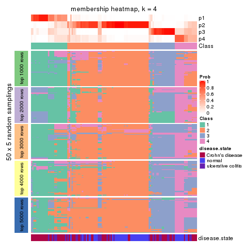</p>

</div>
<div id='tab-ATC-hclust-membership-heatmap-4'>
<pre><code class="r">membership_heatmap(res, k = 5)
</code></pre>

<p></p>

</div>
<div id='tab-ATC-hclust-membership-heatmap-5'>
<pre><code class="r">membership_heatmap(res, k = 6)
</code></pre>

<p></p>

</div>
</div>

As soon as we have had the classes for columns, we can look for signatures
which are significantly different between classes which can be candidate marks
for certain classes. Following are the heatmaps for signatures.


Signature heatmaps where rows are scaled:


<script>
$( function() {
	$( '#tabs-ATC-hclust-get-signatures' ).tabs();
} );
</script>
<div id='tabs-ATC-hclust-get-signatures'>
<ul>
<li><a href='#tab-ATC-hclust-get-signatures-1'>k = 2</a></li>
<li><a href='#tab-ATC-hclust-get-signatures-2'>k = 3</a></li>
<li><a href='#tab-ATC-hclust-get-signatures-3'>k = 4</a></li>
<li><a href='#tab-ATC-hclust-get-signatures-4'>k = 5</a></li>
<li><a href='#tab-ATC-hclust-get-signatures-5'>k = 6</a></li>
</ul>
<div id='tab-ATC-hclust-get-signatures-1'>
<pre><code class="r">get_signatures(res, k = 2)
</code></pre>

<p></p>

</div>
<div id='tab-ATC-hclust-get-signatures-2'>
<pre><code class="r">get_signatures(res, k = 3)
</code></pre>

<p></p>

</div>
<div id='tab-ATC-hclust-get-signatures-3'>
<pre><code class="r">get_signatures(res, k = 4)
</code></pre>

<p></p>

</div>
<div id='tab-ATC-hclust-get-signatures-4'>
<pre><code class="r">get_signatures(res, k = 5)
</code></pre>

<p></p>

</div>
<div id='tab-ATC-hclust-get-signatures-5'>
<pre><code class="r">get_signatures(res, k = 6)
</code></pre>

<p></p>

</div>
</div>


Signature heatmaps where rows are not scaled:


<script>
$( function() {
	$( '#tabs-ATC-hclust-get-signatures-no-scale' ).tabs();
} );
</script>
<div id='tabs-ATC-hclust-get-signatures-no-scale'>
<ul>
<li><a href='#tab-ATC-hclust-get-signatures-no-scale-1'>k = 2</a></li>
<li><a href='#tab-ATC-hclust-get-signatures-no-scale-2'>k = 3</a></li>
<li><a href='#tab-ATC-hclust-get-signatures-no-scale-3'>k = 4</a></li>
<li><a href='#tab-ATC-hclust-get-signatures-no-scale-4'>k = 5</a></li>
<li><a href='#tab-ATC-hclust-get-signatures-no-scale-5'>k = 6</a></li>
</ul>
<div id='tab-ATC-hclust-get-signatures-no-scale-1'>
<pre><code class="r">get_signatures(res, k = 2, scale_rows = FALSE)
</code></pre>

<p></p>

</div>
<div id='tab-ATC-hclust-get-signatures-no-scale-2'>
<pre><code class="r">get_signatures(res, k = 3, scale_rows = FALSE)
</code></pre>

<p></p>

</div>
<div id='tab-ATC-hclust-get-signatures-no-scale-3'>
<pre><code class="r">get_signatures(res, k = 4, scale_rows = FALSE)
</code></pre>

<p></p>

</div>
<div id='tab-ATC-hclust-get-signatures-no-scale-4'>
<pre><code class="r">get_signatures(res, k = 5, scale_rows = FALSE)
</code></pre>

<p></p>

</div>
<div id='tab-ATC-hclust-get-signatures-no-scale-5'>
<pre><code class="r">get_signatures(res, k = 6, scale_rows = FALSE)
</code></pre>

<p></p>

</div>
</div>


Compare the overlap of signatures from different k:

```r
compare_signatures(res)
```


`get_signature()` returns a data frame invisibly. TO get the list of signatures, the function
call should be assigned to a variable explicitly. In following code, if `plot` argument is set
to `FALSE`, no heatmap is plotted while only the differential analysis is performed.

```r
# code only for demonstration
tb = get_signature(res, k = ..., plot = FALSE)
```

An example of the output of `tb` is:

```
#>   which_row         fdr    mean_1    mean_2 scaled_mean_1 scaled_mean_2 km
#> 1        38 0.042760348  8.373488  9.131774    -0.5533452     0.5164555  1
#> 2        40 0.018707592  7.106213  8.469186    -0.6173731     0.5762149  1
#> 3        55 0.019134737 10.221463 11.207825    -0.6159697     0.5749050  1
#> 4        59 0.006059896  5.921854  7.869574    -0.6899429     0.6439467  1
#> 5        60 0.018055526  8.928898 10.211722    -0.6204761     0.5791110  1
#> 6        98 0.009384629 15.714769 14.887706     0.6635654    -0.6193277  2
...
```

The columns in `tb` are:

1. `which_row`: row indices corresponding to the input matrix.
2. `fdr`: FDR for the differential test. 
3. `mean_x`: The mean value in group x.
4. `scaled_mean_x`: The mean value in group x after rows are scaled.
5. `km`: Row groups if k-means clustering is applied to rows.


UMAP plot which shows how samples are separated.


<script>
$( function() {
	$( '#tabs-ATC-hclust-dimension-reduction' ).tabs();
} );
</script>
<div id='tabs-ATC-hclust-dimension-reduction'>
<ul>
<li><a href='#tab-ATC-hclust-dimension-reduction-1'>k = 2</a></li>
<li><a href='#tab-ATC-hclust-dimension-reduction-2'>k = 3</a></li>
<li><a href='#tab-ATC-hclust-dimension-reduction-3'>k = 4</a></li>
<li><a href='#tab-ATC-hclust-dimension-reduction-4'>k = 5</a></li>
<li><a href='#tab-ATC-hclust-dimension-reduction-5'>k = 6</a></li>
</ul>
<div id='tab-ATC-hclust-dimension-reduction-1'>
<pre><code class="r">dimension_reduction(res, k = 2, method = &quot;UMAP&quot;)
</code></pre>

<p></p>

</div>
<div id='tab-ATC-hclust-dimension-reduction-2'>
<pre><code class="r">dimension_reduction(res, k = 3, method = &quot;UMAP&quot;)
</code></pre>

<p></p>

</div>
<div id='tab-ATC-hclust-dimension-reduction-3'>
<pre><code class="r">dimension_reduction(res, k = 4, method = &quot;UMAP&quot;)
</code></pre>

<p></p>

</div>
<div id='tab-ATC-hclust-dimension-reduction-4'>
<pre><code class="r">dimension_reduction(res, k = 5, method = &quot;UMAP&quot;)
</code></pre>

<p></p>

</div>
<div id='tab-ATC-hclust-dimension-reduction-5'>
<pre><code class="r">dimension_reduction(res, k = 6, method = &quot;UMAP&quot;)
</code></pre>

<p></p>

</div>
</div>


Following heatmap shows how subgroups are split when increasing `k`:

```r
collect_classes(res)
```


Test correlation between subgroups and known annotations. If the known
annotation is numeric, one-way ANOVA test is applied, and if the known
annotation is discrete, chi-squared contingency table test is applied.

```r
test_to_known_factors(res)
```

```
#>              n disease.state(p) k
#> ATC:hclust 124         1.35e-05 2
#> ATC:hclust 116         6.47e-07 3
#> ATC:hclust 113         5.92e-09 4
#> ATC:hclust  97         5.21e-09 5
#> ATC:hclust  79         1.45e-09 6
```


If matrix rows can be associated to genes, consider to use `functional_enrichment(res,
...)` to perform function enrichment for the signature genes. See [this vignette](http://bioconductor.org/packages/devel/bioc/vignettes/cola/inst/doc/functional_enrichment.html) for more detailed explanations.


 

---------------------------------------------------


### ATC:kmeans**


The object with results only for a single top-value method and a single partition method 
can be extracted as:

```r
res = res_list["ATC", "kmeans"]
# you can also extract it by
# res = res_list["ATC:kmeans"]
```

A summary of `res` and all the functions that can be applied to it:

```r
res
```

```
#> A 'ConsensusPartition' object with k = 2, 3, 4, 5, 6.
#>   On a matrix with 21168 rows and 127 columns.
#>   Top rows (1000, 2000, 3000, 4000, 5000) are extracted by 'ATC' method.
#>   Subgroups are detected by 'kmeans' method.
#>   Performed in total 1250 partitions by row resampling.
#>   Best k for subgroups seems to be 2.
#> 
#> Following methods can be applied to this 'ConsensusPartition' object:
#>  [1] "cola_report"             "collect_classes"         "collect_plots"          
#>  [4] "collect_stats"           "colnames"                "compare_signatures"     
#>  [7] "consensus_heatmap"       "dimension_reduction"     "functional_enrichment"  
#> [10] "get_anno_col"            "get_anno"                "get_classes"            
#> [13] "get_consensus"           "get_matrix"              "get_membership"         
#> [16] "get_param"               "get_signatures"          "get_stats"              
#> [19] "is_best_k"               "is_stable_k"             "membership_heatmap"     
#> [22] "ncol"                    "nrow"                    "plot_ecdf"              
#> [25] "rownames"                "select_partition_number" "show"                   
#> [28] "suggest_best_k"          "test_to_known_factors"
```

`collect_plots()` function collects all the plots made from `res` for all `k` (number of partitions)
into one single page to provide an easy and fast comparison between different `k`.

```r
collect_plots(res)
```


The plots are:

- The first row: a plot of the ECDF (empirical cumulative distribution
  function) curves of the consensus matrix for each `k` and the heatmap of
  predicted classes for each `k`.
- The second row: heatmaps of the consensus matrix for each `k`.
- The third row: heatmaps of the membership matrix for each `k`.
- The fouth row: heatmaps of the signatures for each `k`.

All the plots in panels can be made by individual functions and they are
plotted later in this section.

`select_partition_number()` produces several plots showing different
statistics for choosing "optimized" `k`. There are following statistics:

- ECDF curves of the consensus matrix for each `k`;
- 1-PAC. [The PAC
  score](https://en.wikipedia.org/wiki/Consensus_clustering#Over-interpretation_potential_of_consensus_clustering)
  measures the proportion of the ambiguous subgrouping.
- Mean silhouette score.
- Concordance. The mean probability of fiting the consensus class ids in all
  partitions.
- Area increased. Denote $A_k$ as the area under the ECDF curve for current
  `k`, the area increased is defined as $A_k - A_{k-1}$.
- Rand index. The percent of pairs of samples that are both in a same cluster
  or both are not in a same cluster in the partition of k and k-1.
- Jaccard index. The ratio of pairs of samples are both in a same cluster in
  the partition of k and k-1 and the pairs of samples are both in a same
  cluster in the partition k or k-1.

The detailed explanations of these statistics can be found in [the _cola_
vignette](http://bioconductor.org/packages/devel/bioc/vignettes/cola/inst/doc/cola.html#toc_13).

Generally speaking, lower PAC score, higher mean silhouette score or higher
concordance corresponds to better partition. Rand index and Jaccard index
measure how similar the current partition is compared to partition with `k-1`.
If they are too similar, we won't accept `k` is better than `k-1`.

```r
select_partition_number(res)
```


The numeric values for all these statistics can be obtained by `get_stats()`.

```r
get_stats(res)
```

```
#>   k 1-PAC mean_silhouette concordance area_increased  Rand Jaccard
#> 2 2 1.000           0.956       0.980         0.4994 0.500   0.500
#> 3 3 0.748           0.919       0.935         0.3241 0.735   0.520
#> 4 4 0.741           0.648       0.793         0.1067 0.916   0.758
#> 5 5 0.755           0.801       0.865         0.0751 0.859   0.545
#> 6 6 0.806           0.658       0.810         0.0460 0.932   0.695
```

`suggest_best_k()` suggests the best $k$ based on these statistics. The rules are as follows:

- All $k$ with Jaccard index larger than 0.95 are removed because increasing
  $k$ does not provide enough extra information. If all $k$ are removed, it is
  marked as no subgroup is detected.
- For all $k$ with 1-PAC score larger than 0.9, the maximal $k$ is taken as
  the best $k$, and other $k$ are marked as optional $k$.
- If it does not fit the second rule. The $k$ with the maximal vote of the
  highest 1-PAC score, highest mean silhouette, and highest concordance is
  taken as the best $k$.

```r
suggest_best_k(res)
```

```
#> [1] 2
```


Following shows the table of the partitions (You need to click the **show/hide
code output** link to see it). The membership matrix (columns with name `p*`)
is inferred by
[`clue::cl_consensus()`](https://www.rdocumentation.org/link/cl_consensus?package=clue)
function with the `SE` method. Basically the value in the membership matrix
represents the probability to belong to a certain group. The finall class
label for an item is determined with the group with highest probability it
belongs to.

In `get_classes()` function, the entropy is calculated from the membership
matrix and the silhouette score is calculated from the consensus matrix.


<script>
$( function() {
	$( '#tabs-ATC-kmeans-get-classes' ).tabs();
} );
</script>
<div id='tabs-ATC-kmeans-get-classes'>
<ul>
<li><a href='#tab-ATC-kmeans-get-classes-1'>k = 2</a></li>
<li><a href='#tab-ATC-kmeans-get-classes-2'>k = 3</a></li>
<li><a href='#tab-ATC-kmeans-get-classes-3'>k = 4</a></li>
<li><a href='#tab-ATC-kmeans-get-classes-4'>k = 5</a></li>
<li><a href='#tab-ATC-kmeans-get-classes-5'>k = 6</a></li>
</ul>

<div id='tab-ATC-kmeans-get-classes-1'>
<p><a id='tab-ATC-kmeans-get-classes-1-a' style='color:#0366d6' href='#'>show/hide code output</a></p>
<pre><code class="r">cbind(get_classes(res, k = 2), get_membership(res, k = 2))
</code></pre>

<pre><code>#&gt;          class entropy silhouette    p1    p2
#&gt; GSM76115     2  0.0000      0.983 0.000 1.000
#&gt; GSM76116     2  0.0000      0.983 0.000 1.000
#&gt; GSM76117     2  0.0000      0.983 0.000 1.000
#&gt; GSM76118     2  0.0000      0.983 0.000 1.000
#&gt; GSM76119     2  0.0938      0.976 0.012 0.988
#&gt; GSM76120     2  0.0938      0.976 0.012 0.988
#&gt; GSM76121     1  0.0938      0.975 0.988 0.012
#&gt; GSM76122     2  0.0000      0.983 0.000 1.000
#&gt; GSM76123     2  0.0938      0.976 0.012 0.988
#&gt; GSM76124     2  0.0000      0.983 0.000 1.000
#&gt; GSM76125     2  0.0938      0.976 0.012 0.988
#&gt; GSM76126     1  0.0000      0.974 1.000 0.000
#&gt; GSM76127     2  0.0938      0.976 0.012 0.988
#&gt; GSM76128     1  0.0000      0.974 1.000 0.000
#&gt; GSM76129     2  0.0000      0.983 0.000 1.000
#&gt; GSM76130     2  0.0938      0.976 0.012 0.988
#&gt; GSM76131     2  0.0000      0.983 0.000 1.000
#&gt; GSM76132     2  0.0000      0.983 0.000 1.000
#&gt; GSM76133     2  0.0000      0.983 0.000 1.000
#&gt; GSM76134     2  0.0000      0.983 0.000 1.000
#&gt; GSM76135     2  0.0000      0.983 0.000 1.000
#&gt; GSM76136     2  0.0000      0.983 0.000 1.000
#&gt; GSM76137     2  0.0000      0.983 0.000 1.000
#&gt; GSM76138     2  0.0000      0.983 0.000 1.000
#&gt; GSM76139     2  0.0000      0.983 0.000 1.000
#&gt; GSM76140     2  0.0000      0.983 0.000 1.000
#&gt; GSM76141     2  0.0000      0.983 0.000 1.000
#&gt; GSM76142     2  0.0000      0.983 0.000 1.000
#&gt; GSM76143     2  0.0000      0.983 0.000 1.000
#&gt; GSM76144     2  0.0000      0.983 0.000 1.000
#&gt; GSM76145     2  0.0000      0.983 0.000 1.000
#&gt; GSM76146     2  0.0000      0.983 0.000 1.000
#&gt; GSM76147     2  0.0000      0.983 0.000 1.000
#&gt; GSM76148     2  0.0000      0.983 0.000 1.000
#&gt; GSM76149     2  0.0000      0.983 0.000 1.000
#&gt; GSM76150     2  0.0000      0.983 0.000 1.000
#&gt; GSM76151     2  0.0000      0.983 0.000 1.000
#&gt; GSM76152     1  0.0938      0.975 0.988 0.012
#&gt; GSM76153     2  0.0000      0.983 0.000 1.000
#&gt; GSM76154     2  0.0000      0.983 0.000 1.000
#&gt; GSM76155     2  0.0000      0.983 0.000 1.000
#&gt; GSM76156     2  0.0000      0.983 0.000 1.000
#&gt; GSM76030     2  0.0000      0.983 0.000 1.000
#&gt; GSM76031     1  0.0938      0.975 0.988 0.012
#&gt; GSM76032     1  0.0000      0.974 1.000 0.000
#&gt; GSM76033     1  0.0000      0.974 1.000 0.000
#&gt; GSM76034     2  0.0000      0.983 0.000 1.000
#&gt; GSM76035     1  0.0376      0.974 0.996 0.004
#&gt; GSM76036     1  0.0000      0.974 1.000 0.000
#&gt; GSM76037     2  0.0000      0.983 0.000 1.000
#&gt; GSM76038     1  0.0938      0.975 0.988 0.012
#&gt; GSM76039     2  0.1184      0.970 0.016 0.984
#&gt; GSM76040     1  0.0000      0.974 1.000 0.000
#&gt; GSM76041     1  0.0938      0.975 0.988 0.012
#&gt; GSM76042     2  0.9170      0.495 0.332 0.668
#&gt; GSM76043     1  0.0000      0.974 1.000 0.000
#&gt; GSM76044     2  0.0000      0.983 0.000 1.000
#&gt; GSM76045     1  0.0938      0.975 0.988 0.012
#&gt; GSM76046     2  0.5059      0.875 0.112 0.888
#&gt; GSM76047     1  0.0938      0.975 0.988 0.012
#&gt; GSM76048     1  0.0000      0.974 1.000 0.000
#&gt; GSM76049     2  0.0000      0.983 0.000 1.000
#&gt; GSM76050     1  0.0938      0.975 0.988 0.012
#&gt; GSM76051     1  0.0000      0.974 1.000 0.000
#&gt; GSM76052     1  0.9552      0.398 0.624 0.376
#&gt; GSM76053     2  0.0000      0.983 0.000 1.000
#&gt; GSM76054     1  0.9393      0.447 0.644 0.356
#&gt; GSM76055     2  0.0000      0.983 0.000 1.000
#&gt; GSM76056     2  0.0000      0.983 0.000 1.000
#&gt; GSM76057     2  0.8813      0.560 0.300 0.700
#&gt; GSM76058     1  0.0000      0.974 1.000 0.000
#&gt; GSM76059     1  0.0938      0.975 0.988 0.012
#&gt; GSM76060     2  0.0000      0.983 0.000 1.000
#&gt; GSM76061     2  0.0000      0.983 0.000 1.000
#&gt; GSM76062     1  0.0938      0.975 0.988 0.012
#&gt; GSM76063     2  0.0672      0.979 0.008 0.992
#&gt; GSM76064     1  0.0938      0.975 0.988 0.012
#&gt; GSM76065     2  0.0000      0.983 0.000 1.000
#&gt; GSM76066     1  0.0938      0.975 0.988 0.012
#&gt; GSM76067     1  0.0000      0.974 1.000 0.000
#&gt; GSM76068     1  0.0000      0.974 1.000 0.000
#&gt; GSM76069     1  0.0938      0.975 0.988 0.012
#&gt; GSM76070     2  0.0000      0.983 0.000 1.000
#&gt; GSM76071     1  0.0938      0.975 0.988 0.012
#&gt; GSM76072     1  0.0938      0.975 0.988 0.012
#&gt; GSM76073     1  0.0938      0.975 0.988 0.012
#&gt; GSM76074     1  0.0938      0.975 0.988 0.012
#&gt; GSM76075     1  0.0000      0.974 1.000 0.000
#&gt; GSM76076     1  0.0000      0.974 1.000 0.000
#&gt; GSM76077     2  0.0000      0.983 0.000 1.000
#&gt; GSM76078     1  0.9393      0.454 0.644 0.356
#&gt; GSM76079     1  0.0938      0.975 0.988 0.012
#&gt; GSM76080     2  0.0938      0.976 0.012 0.988
#&gt; GSM76081     2  0.0938      0.976 0.012 0.988
#&gt; GSM76082     1  0.0000      0.974 1.000 0.000
#&gt; GSM76083     1  0.0000      0.974 1.000 0.000
#&gt; GSM76084     2  0.0938      0.976 0.012 0.988
#&gt; GSM76085     1  0.0000      0.974 1.000 0.000
#&gt; GSM76086     1  0.0000      0.974 1.000 0.000
#&gt; GSM76087     2  0.0000      0.983 0.000 1.000
#&gt; GSM76088     1  0.0938      0.975 0.988 0.012
#&gt; GSM76089     2  0.0000      0.983 0.000 1.000
#&gt; GSM76090     1  0.0000      0.974 1.000 0.000
#&gt; GSM76091     1  0.0000      0.974 1.000 0.000
#&gt; GSM76092     1  0.0938      0.975 0.988 0.012
#&gt; GSM76093     1  0.0938      0.975 0.988 0.012
#&gt; GSM76094     2  0.0000      0.983 0.000 1.000
#&gt; GSM76095     2  0.0000      0.983 0.000 1.000
#&gt; GSM76096     1  0.0938      0.975 0.988 0.012
#&gt; GSM76097     2  0.7139      0.749 0.196 0.804
#&gt; GSM76098     1  0.0000      0.974 1.000 0.000
#&gt; GSM76099     1  0.0938      0.975 0.988 0.012
#&gt; GSM76100     1  0.0938      0.975 0.988 0.012
#&gt; GSM76101     1  0.0938      0.975 0.988 0.012
#&gt; GSM76102     1  0.0376      0.974 0.996 0.004
#&gt; GSM76103     1  0.0000      0.974 1.000 0.000
#&gt; GSM76104     1  0.0000      0.974 1.000 0.000
#&gt; GSM76105     2  0.0000      0.983 0.000 1.000
#&gt; GSM76106     2  0.0938      0.976 0.012 0.988
#&gt; GSM76107     2  0.0938      0.976 0.012 0.988
#&gt; GSM76108     2  0.0000      0.983 0.000 1.000
#&gt; GSM76109     1  0.0938      0.975 0.988 0.012
#&gt; GSM76110     1  0.0938      0.975 0.988 0.012
#&gt; GSM76111     1  0.0938      0.975 0.988 0.012
#&gt; GSM76112     1  0.0000      0.974 1.000 0.000
#&gt; GSM76113     2  0.0672      0.979 0.008 0.992
#&gt; GSM76114     1  0.0938      0.975 0.988 0.012
</code></pre>

<script>
$('#tab-ATC-kmeans-get-classes-1-a').parent().next().next().hide();
$('#tab-ATC-kmeans-get-classes-1-a').click(function(){
  $('#tab-ATC-kmeans-get-classes-1-a').parent().next().next().toggle();
  return(false);
});
</script>
</div>

<div id='tab-ATC-kmeans-get-classes-2'>
<p><a id='tab-ATC-kmeans-get-classes-2-a' style='color:#0366d6' href='#'>show/hide code output</a></p>
<pre><code class="r">cbind(get_classes(res, k = 3), get_membership(res, k = 3))
</code></pre>

<pre><code>#&gt;          class entropy silhouette    p1    p2    p3
#&gt; GSM76115     2  0.2878      0.947 0.000 0.904 0.096
#&gt; GSM76116     2  0.0424      0.930 0.008 0.992 0.000
#&gt; GSM76117     2  0.0424      0.930 0.008 0.992 0.000
#&gt; GSM76118     2  0.0424      0.930 0.008 0.992 0.000
#&gt; GSM76119     3  0.0592      0.906 0.000 0.012 0.988
#&gt; GSM76120     3  0.0592      0.906 0.000 0.012 0.988
#&gt; GSM76121     1  0.5393      0.849 0.820 0.108 0.072
#&gt; GSM76122     2  0.0424      0.930 0.008 0.992 0.000
#&gt; GSM76123     3  0.0592      0.906 0.000 0.012 0.988
#&gt; GSM76124     2  0.0829      0.926 0.012 0.984 0.004
#&gt; GSM76125     3  0.0592      0.906 0.000 0.012 0.988
#&gt; GSM76126     3  0.3116      0.928 0.108 0.000 0.892
#&gt; GSM76127     3  0.0592      0.906 0.000 0.012 0.988
#&gt; GSM76128     3  0.3116      0.928 0.108 0.000 0.892
#&gt; GSM76129     2  0.0424      0.930 0.008 0.992 0.000
#&gt; GSM76130     3  0.0592      0.906 0.000 0.012 0.988
#&gt; GSM76131     2  0.3116      0.947 0.000 0.892 0.108
#&gt; GSM76132     2  0.3116      0.947 0.000 0.892 0.108
#&gt; GSM76133     2  0.3116      0.947 0.000 0.892 0.108
#&gt; GSM76134     2  0.3116      0.947 0.000 0.892 0.108
#&gt; GSM76135     2  0.3116      0.947 0.000 0.892 0.108
#&gt; GSM76136     2  0.3116      0.947 0.000 0.892 0.108
#&gt; GSM76137     2  0.3116      0.947 0.000 0.892 0.108
#&gt; GSM76138     2  0.2878      0.947 0.000 0.904 0.096
#&gt; GSM76139     2  0.3116      0.947 0.000 0.892 0.108
#&gt; GSM76140     2  0.0661      0.928 0.008 0.988 0.004
#&gt; GSM76141     2  0.3116      0.947 0.000 0.892 0.108
#&gt; GSM76142     2  0.3116      0.947 0.000 0.892 0.108
#&gt; GSM76143     2  0.3116      0.947 0.000 0.892 0.108
#&gt; GSM76144     2  0.3116      0.947 0.000 0.892 0.108
#&gt; GSM76145     2  0.3116      0.947 0.000 0.892 0.108
#&gt; GSM76146     2  0.3116      0.947 0.000 0.892 0.108
#&gt; GSM76147     2  0.3038      0.947 0.000 0.896 0.104
#&gt; GSM76148     2  0.3116      0.947 0.000 0.892 0.108
#&gt; GSM76149     2  0.3116      0.947 0.000 0.892 0.108
#&gt; GSM76150     2  0.3116      0.947 0.000 0.892 0.108
#&gt; GSM76151     2  0.3116      0.947 0.000 0.892 0.108
#&gt; GSM76152     1  0.3349      0.878 0.888 0.108 0.004
#&gt; GSM76153     2  0.3116      0.947 0.000 0.892 0.108
#&gt; GSM76154     2  0.3116      0.947 0.000 0.892 0.108
#&gt; GSM76155     2  0.3116      0.947 0.000 0.892 0.108
#&gt; GSM76156     2  0.3038      0.947 0.000 0.896 0.104
#&gt; GSM76030     2  0.1860      0.943 0.000 0.948 0.052
#&gt; GSM76031     1  0.0592      0.940 0.988 0.000 0.012
#&gt; GSM76032     3  0.3192      0.928 0.112 0.000 0.888
#&gt; GSM76033     3  0.3192      0.928 0.112 0.000 0.888
#&gt; GSM76034     2  0.1411      0.939 0.000 0.964 0.036
#&gt; GSM76035     3  0.3340      0.921 0.120 0.000 0.880
#&gt; GSM76036     3  0.2711      0.927 0.088 0.000 0.912
#&gt; GSM76037     2  0.0424      0.930 0.008 0.992 0.000
#&gt; GSM76038     1  0.0592      0.940 0.988 0.000 0.012
#&gt; GSM76039     1  0.5722      0.665 0.704 0.292 0.004
#&gt; GSM76040     3  0.3116      0.928 0.108 0.000 0.892
#&gt; GSM76041     1  0.0424      0.941 0.992 0.000 0.008
#&gt; GSM76042     1  0.6455      0.800 0.764 0.128 0.108
#&gt; GSM76043     3  0.3116      0.928 0.108 0.000 0.892
#&gt; GSM76044     2  0.0424      0.930 0.008 0.992 0.000
#&gt; GSM76045     1  0.0237      0.939 0.996 0.000 0.004
#&gt; GSM76046     3  0.0592      0.907 0.000 0.012 0.988
#&gt; GSM76047     1  0.6572      0.757 0.748 0.080 0.172
#&gt; GSM76048     3  0.3116      0.928 0.108 0.000 0.892
#&gt; GSM76049     2  0.0424      0.930 0.008 0.992 0.000
#&gt; GSM76050     1  0.0592      0.940 0.988 0.000 0.012
#&gt; GSM76051     3  0.3192      0.928 0.112 0.000 0.888
#&gt; GSM76052     3  0.0661      0.912 0.008 0.004 0.988
#&gt; GSM76053     2  0.5327      0.753 0.000 0.728 0.272
#&gt; GSM76054     3  0.1525      0.919 0.032 0.004 0.964
#&gt; GSM76055     2  0.0424      0.930 0.008 0.992 0.000
#&gt; GSM76056     2  0.0829      0.926 0.012 0.984 0.004
#&gt; GSM76057     2  0.0829      0.926 0.012 0.984 0.004
#&gt; GSM76058     3  0.3340      0.923 0.120 0.000 0.880
#&gt; GSM76059     1  0.0424      0.941 0.992 0.000 0.008
#&gt; GSM76060     2  0.0237      0.932 0.000 0.996 0.004
#&gt; GSM76061     2  0.0000      0.932 0.000 1.000 0.000
#&gt; GSM76062     1  0.0424      0.941 0.992 0.000 0.008
#&gt; GSM76063     2  0.3116      0.947 0.000 0.892 0.108
#&gt; GSM76064     1  0.0424      0.941 0.992 0.000 0.008
#&gt; GSM76065     2  0.0424      0.934 0.000 0.992 0.008
#&gt; GSM76066     1  0.0424      0.941 0.992 0.000 0.008
#&gt; GSM76067     1  0.5650      0.472 0.688 0.000 0.312
#&gt; GSM76068     3  0.3116      0.928 0.108 0.000 0.892
#&gt; GSM76069     1  0.1163      0.930 0.972 0.028 0.000
#&gt; GSM76070     2  0.3116      0.947 0.000 0.892 0.108
#&gt; GSM76071     1  0.0424      0.941 0.992 0.000 0.008
#&gt; GSM76072     1  0.0000      0.940 1.000 0.000 0.000
#&gt; GSM76073     1  0.2496      0.908 0.928 0.068 0.004
#&gt; GSM76074     1  0.1163      0.930 0.972 0.028 0.000
#&gt; GSM76075     3  0.3192      0.928 0.112 0.000 0.888
#&gt; GSM76076     3  0.3192      0.928 0.112 0.000 0.888
#&gt; GSM76077     2  0.0661      0.928 0.008 0.988 0.004
#&gt; GSM76078     3  0.1832      0.920 0.036 0.008 0.956
#&gt; GSM76079     1  0.0424      0.941 0.992 0.000 0.008
#&gt; GSM76080     3  0.0592      0.906 0.000 0.012 0.988
#&gt; GSM76081     3  0.0592      0.906 0.000 0.012 0.988
#&gt; GSM76082     3  0.3340      0.923 0.120 0.000 0.880
#&gt; GSM76083     3  0.3192      0.928 0.112 0.000 0.888
#&gt; GSM76084     3  0.2796      0.827 0.000 0.092 0.908
#&gt; GSM76085     3  0.3192      0.928 0.112 0.000 0.888
#&gt; GSM76086     1  0.0747      0.936 0.984 0.000 0.016
#&gt; GSM76087     2  0.3116      0.947 0.000 0.892 0.108
#&gt; GSM76088     1  0.3349      0.878 0.888 0.108 0.004
#&gt; GSM76089     2  0.2165      0.944 0.000 0.936 0.064
#&gt; GSM76090     3  0.3340      0.923 0.120 0.000 0.880
#&gt; GSM76091     1  0.0424      0.941 0.992 0.000 0.008
#&gt; GSM76092     1  0.0000      0.940 1.000 0.000 0.000
#&gt; GSM76093     1  0.0424      0.941 0.992 0.000 0.008
#&gt; GSM76094     2  0.0661      0.928 0.008 0.988 0.004
#&gt; GSM76095     2  0.0829      0.926 0.012 0.984 0.004
#&gt; GSM76096     1  0.0237      0.940 0.996 0.000 0.004
#&gt; GSM76097     1  0.3573      0.870 0.876 0.120 0.004
#&gt; GSM76098     3  0.3116      0.928 0.108 0.000 0.892
#&gt; GSM76099     1  0.0424      0.941 0.992 0.000 0.008
#&gt; GSM76100     1  0.2496      0.908 0.928 0.068 0.004
#&gt; GSM76101     1  0.0000      0.940 1.000 0.000 0.000
#&gt; GSM76102     1  0.1289      0.928 0.968 0.000 0.032
#&gt; GSM76103     3  0.4750      0.819 0.216 0.000 0.784
#&gt; GSM76104     3  0.3116      0.928 0.108 0.000 0.892
#&gt; GSM76105     2  0.0424      0.930 0.008 0.992 0.000
#&gt; GSM76106     3  0.0592      0.906 0.000 0.012 0.988
#&gt; GSM76107     3  0.0592      0.906 0.000 0.012 0.988
#&gt; GSM76108     2  0.0661      0.928 0.008 0.988 0.004
#&gt; GSM76109     1  0.0424      0.941 0.992 0.000 0.008
#&gt; GSM76110     1  0.2200      0.915 0.940 0.056 0.004
#&gt; GSM76111     1  0.2096      0.917 0.944 0.052 0.004
#&gt; GSM76112     1  0.0424      0.941 0.992 0.000 0.008
#&gt; GSM76113     3  0.0592      0.907 0.000 0.012 0.988
#&gt; GSM76114     1  0.0424      0.941 0.992 0.000 0.008
</code></pre>

<script>
$('#tab-ATC-kmeans-get-classes-2-a').parent().next().next().hide();
$('#tab-ATC-kmeans-get-classes-2-a').click(function(){
  $('#tab-ATC-kmeans-get-classes-2-a').parent().next().next().toggle();
  return(false);
});
</script>
</div>

<div id='tab-ATC-kmeans-get-classes-3'>
<p><a id='tab-ATC-kmeans-get-classes-3-a' style='color:#0366d6' href='#'>show/hide code output</a></p>
<pre><code class="r">cbind(get_classes(res, k = 4), get_membership(res, k = 4))
</code></pre>

<pre><code>#&gt;          class entropy silhouette    p1    p2    p3    p4
#&gt; GSM76115     2  0.4955     0.0446 0.000 0.556 0.000 0.444
#&gt; GSM76116     2  0.4985    -0.0311 0.000 0.532 0.000 0.468
#&gt; GSM76117     2  0.4998    -0.0983 0.000 0.512 0.000 0.488
#&gt; GSM76118     4  0.4996     0.1294 0.000 0.484 0.000 0.516
#&gt; GSM76119     3  0.0895     0.7516 0.000 0.020 0.976 0.004
#&gt; GSM76120     3  0.0657     0.7552 0.000 0.012 0.984 0.004
#&gt; GSM76121     4  0.4697     0.3747 0.356 0.000 0.000 0.644
#&gt; GSM76122     2  0.5000    -0.1230 0.000 0.504 0.000 0.496
#&gt; GSM76123     3  0.0657     0.7552 0.000 0.012 0.984 0.004
#&gt; GSM76124     4  0.4978     0.4674 0.004 0.384 0.000 0.612
#&gt; GSM76125     3  0.0895     0.7516 0.000 0.020 0.976 0.004
#&gt; GSM76126     3  0.4277     0.8318 0.000 0.000 0.720 0.280
#&gt; GSM76127     3  0.1209     0.7446 0.000 0.032 0.964 0.004
#&gt; GSM76128     3  0.1716     0.7802 0.000 0.000 0.936 0.064
#&gt; GSM76129     2  0.5000    -0.1243 0.000 0.504 0.000 0.496
#&gt; GSM76130     3  0.1209     0.7446 0.000 0.032 0.964 0.004
#&gt; GSM76131     2  0.0000     0.7822 0.000 1.000 0.000 0.000
#&gt; GSM76132     2  0.0000     0.7822 0.000 1.000 0.000 0.000
#&gt; GSM76133     2  0.0000     0.7822 0.000 1.000 0.000 0.000
#&gt; GSM76134     2  0.0000     0.7822 0.000 1.000 0.000 0.000
#&gt; GSM76135     2  0.0000     0.7822 0.000 1.000 0.000 0.000
#&gt; GSM76136     2  0.0000     0.7822 0.000 1.000 0.000 0.000
#&gt; GSM76137     2  0.0000     0.7822 0.000 1.000 0.000 0.000
#&gt; GSM76138     2  0.0000     0.7822 0.000 1.000 0.000 0.000
#&gt; GSM76139     2  0.0000     0.7822 0.000 1.000 0.000 0.000
#&gt; GSM76140     4  0.4817     0.4590 0.000 0.388 0.000 0.612
#&gt; GSM76141     2  0.0000     0.7822 0.000 1.000 0.000 0.000
#&gt; GSM76142     2  0.0000     0.7822 0.000 1.000 0.000 0.000
#&gt; GSM76143     2  0.0000     0.7822 0.000 1.000 0.000 0.000
#&gt; GSM76144     2  0.0000     0.7822 0.000 1.000 0.000 0.000
#&gt; GSM76145     2  0.0000     0.7822 0.000 1.000 0.000 0.000
#&gt; GSM76146     2  0.0000     0.7822 0.000 1.000 0.000 0.000
#&gt; GSM76147     2  0.0000     0.7822 0.000 1.000 0.000 0.000
#&gt; GSM76148     2  0.0000     0.7822 0.000 1.000 0.000 0.000
#&gt; GSM76149     2  0.0000     0.7822 0.000 1.000 0.000 0.000
#&gt; GSM76150     2  0.0000     0.7822 0.000 1.000 0.000 0.000
#&gt; GSM76151     2  0.0188     0.7790 0.000 0.996 0.000 0.004
#&gt; GSM76152     4  0.4877     0.2582 0.408 0.000 0.000 0.592
#&gt; GSM76153     2  0.0000     0.7822 0.000 1.000 0.000 0.000
#&gt; GSM76154     2  0.0000     0.7822 0.000 1.000 0.000 0.000
#&gt; GSM76155     2  0.0000     0.7822 0.000 1.000 0.000 0.000
#&gt; GSM76156     2  0.0000     0.7822 0.000 1.000 0.000 0.000
#&gt; GSM76030     2  0.4605     0.3335 0.000 0.664 0.000 0.336
#&gt; GSM76031     1  0.2921     0.8595 0.860 0.000 0.000 0.140
#&gt; GSM76032     3  0.6136     0.8117 0.060 0.000 0.584 0.356
#&gt; GSM76033     3  0.4697     0.8314 0.000 0.000 0.644 0.356
#&gt; GSM76034     2  0.4855     0.1722 0.000 0.600 0.000 0.400
#&gt; GSM76035     3  0.5168     0.7495 0.004 0.000 0.500 0.496
#&gt; GSM76036     3  0.4500     0.8342 0.000 0.000 0.684 0.316
#&gt; GSM76037     2  0.4972     0.0098 0.000 0.544 0.000 0.456
#&gt; GSM76038     1  0.2921     0.8595 0.860 0.000 0.000 0.140
#&gt; GSM76039     4  0.5467     0.4054 0.364 0.024 0.000 0.612
#&gt; GSM76040     3  0.4697     0.8314 0.000 0.000 0.644 0.356
#&gt; GSM76041     1  0.2011     0.8735 0.920 0.000 0.000 0.080
#&gt; GSM76042     4  0.5250     0.3939 0.344 0.004 0.012 0.640
#&gt; GSM76043     3  0.5137     0.7889 0.004 0.000 0.544 0.452
#&gt; GSM76044     2  0.5000    -0.1388 0.000 0.500 0.000 0.500
#&gt; GSM76045     1  0.2921     0.8595 0.860 0.000 0.000 0.140
#&gt; GSM76046     3  0.1716     0.7786 0.000 0.000 0.936 0.064
#&gt; GSM76047     4  0.4955     0.2497 0.344 0.000 0.008 0.648
#&gt; GSM76048     3  0.4713     0.8313 0.000 0.000 0.640 0.360
#&gt; GSM76049     2  0.4998    -0.0983 0.000 0.512 0.000 0.488
#&gt; GSM76050     1  0.2921     0.8595 0.860 0.000 0.000 0.140
#&gt; GSM76051     3  0.4872     0.8309 0.004 0.000 0.640 0.356
#&gt; GSM76052     3  0.4222     0.8279 0.000 0.000 0.728 0.272
#&gt; GSM76053     3  0.7517    -0.1031 0.000 0.212 0.484 0.304
#&gt; GSM76054     3  0.4564     0.8338 0.000 0.000 0.672 0.328
#&gt; GSM76055     2  0.5000    -0.1388 0.000 0.500 0.000 0.500
#&gt; GSM76056     4  0.4978     0.4674 0.004 0.384 0.000 0.612
#&gt; GSM76057     2  0.5161    -0.1153 0.004 0.520 0.000 0.476
#&gt; GSM76058     3  0.6233     0.7999 0.060 0.000 0.552 0.388
#&gt; GSM76059     1  0.0000     0.8698 1.000 0.000 0.000 0.000
#&gt; GSM76060     2  0.4382     0.4172 0.000 0.704 0.000 0.296
#&gt; GSM76061     2  0.1302     0.7487 0.000 0.956 0.000 0.044
#&gt; GSM76062     1  0.0000     0.8698 1.000 0.000 0.000 0.000
#&gt; GSM76063     2  0.2542     0.6752 0.000 0.904 0.084 0.012
#&gt; GSM76064     1  0.2081     0.8732 0.916 0.000 0.000 0.084
#&gt; GSM76065     2  0.1637     0.7378 0.000 0.940 0.000 0.060
#&gt; GSM76066     1  0.2081     0.8732 0.916 0.000 0.000 0.084
#&gt; GSM76067     1  0.7260     0.0356 0.464 0.000 0.148 0.388
#&gt; GSM76068     3  0.4713     0.8314 0.000 0.000 0.640 0.360
#&gt; GSM76069     1  0.2345     0.8685 0.900 0.000 0.000 0.100
#&gt; GSM76070     2  0.0000     0.7822 0.000 1.000 0.000 0.000
#&gt; GSM76071     1  0.2868     0.8614 0.864 0.000 0.000 0.136
#&gt; GSM76072     1  0.2647     0.8648 0.880 0.000 0.000 0.120
#&gt; GSM76073     1  0.2704     0.8593 0.876 0.000 0.000 0.124
#&gt; GSM76074     1  0.2589     0.8635 0.884 0.000 0.000 0.116
#&gt; GSM76075     3  0.5778     0.8214 0.040 0.000 0.604 0.356
#&gt; GSM76076     3  0.5929     0.8180 0.048 0.000 0.596 0.356
#&gt; GSM76077     4  0.4925     0.3506 0.000 0.428 0.000 0.572
#&gt; GSM76078     3  0.4964     0.8268 0.004 0.000 0.616 0.380
#&gt; GSM76079     1  0.0000     0.8698 1.000 0.000 0.000 0.000
#&gt; GSM76080     3  0.2399     0.7618 0.000 0.032 0.920 0.048
#&gt; GSM76081     3  0.2399     0.7618 0.000 0.032 0.920 0.048
#&gt; GSM76082     3  0.6233     0.7999 0.060 0.000 0.552 0.388
#&gt; GSM76083     3  0.5855     0.8198 0.044 0.000 0.600 0.356
#&gt; GSM76084     3  0.4212     0.5948 0.000 0.216 0.772 0.012
#&gt; GSM76085     3  0.4697     0.8314 0.000 0.000 0.644 0.356
#&gt; GSM76086     1  0.5099     0.4021 0.612 0.000 0.008 0.380
#&gt; GSM76087     2  0.0000     0.7822 0.000 1.000 0.000 0.000
#&gt; GSM76088     1  0.4972     0.1619 0.544 0.000 0.000 0.456
#&gt; GSM76089     2  0.0000     0.7822 0.000 1.000 0.000 0.000
#&gt; GSM76090     3  0.6233     0.7999 0.060 0.000 0.552 0.388
#&gt; GSM76091     1  0.0336     0.8684 0.992 0.000 0.000 0.008
#&gt; GSM76092     1  0.0188     0.8692 0.996 0.000 0.000 0.004
#&gt; GSM76093     1  0.0000     0.8698 1.000 0.000 0.000 0.000
#&gt; GSM76094     4  0.4877     0.4100 0.000 0.408 0.000 0.592
#&gt; GSM76095     4  0.4978     0.4674 0.004 0.384 0.000 0.612
#&gt; GSM76096     1  0.0188     0.8692 0.996 0.000 0.000 0.004
#&gt; GSM76097     4  0.5189     0.3799 0.372 0.012 0.000 0.616
#&gt; GSM76098     3  0.4697     0.8320 0.000 0.000 0.644 0.356
#&gt; GSM76099     1  0.0000     0.8698 1.000 0.000 0.000 0.000
#&gt; GSM76100     1  0.2704     0.8593 0.876 0.000 0.000 0.124
#&gt; GSM76101     1  0.0188     0.8692 0.996 0.000 0.000 0.004
#&gt; GSM76102     1  0.5052     0.7415 0.720 0.000 0.036 0.244
#&gt; GSM76103     3  0.6735     0.7705 0.096 0.000 0.516 0.388
#&gt; GSM76104     3  0.4454     0.8339 0.000 0.000 0.692 0.308
#&gt; GSM76105     2  0.5000    -0.1230 0.000 0.504 0.000 0.496
#&gt; GSM76106     3  0.1488     0.7453 0.000 0.032 0.956 0.012
#&gt; GSM76107     3  0.1488     0.7453 0.000 0.032 0.956 0.012
#&gt; GSM76108     4  0.4978     0.4674 0.004 0.384 0.000 0.612
#&gt; GSM76109     1  0.0000     0.8698 1.000 0.000 0.000 0.000
#&gt; GSM76110     1  0.2647     0.8617 0.880 0.000 0.000 0.120
#&gt; GSM76111     1  0.3024     0.8552 0.852 0.000 0.000 0.148
#&gt; GSM76112     1  0.0592     0.8686 0.984 0.000 0.000 0.016
#&gt; GSM76113     3  0.5740     0.6473 0.000 0.208 0.700 0.092
#&gt; GSM76114     1  0.0817     0.8685 0.976 0.000 0.000 0.024
</code></pre>

<script>
$('#tab-ATC-kmeans-get-classes-3-a').parent().next().next().hide();
$('#tab-ATC-kmeans-get-classes-3-a').click(function(){
  $('#tab-ATC-kmeans-get-classes-3-a').parent().next().next().toggle();
  return(false);
});
</script>
</div>

<div id='tab-ATC-kmeans-get-classes-4'>
<p><a id='tab-ATC-kmeans-get-classes-4-a' style='color:#0366d6' href='#'>show/hide code output</a></p>
<pre><code class="r">cbind(get_classes(res, k = 5), get_membership(res, k = 5))
</code></pre>

<pre><code>#&gt;          class entropy silhouette    p1    p2    p3    p4    p5
#&gt; GSM76115     5  0.4197     0.7425 0.000 0.244 0.000 0.028 0.728
#&gt; GSM76116     5  0.3819     0.7604 0.000 0.228 0.000 0.016 0.756
#&gt; GSM76117     5  0.3562     0.7879 0.000 0.196 0.000 0.016 0.788
#&gt; GSM76118     5  0.3053     0.8064 0.000 0.164 0.000 0.008 0.828
#&gt; GSM76119     4  0.2597     0.8839 0.000 0.024 0.092 0.884 0.000
#&gt; GSM76120     4  0.2519     0.8811 0.000 0.016 0.100 0.884 0.000
#&gt; GSM76121     5  0.3585     0.6757 0.088 0.000 0.052 0.016 0.844
#&gt; GSM76122     5  0.3427     0.7944 0.000 0.192 0.000 0.012 0.796
#&gt; GSM76123     4  0.2519     0.8811 0.000 0.016 0.100 0.884 0.000
#&gt; GSM76124     5  0.1557     0.7982 0.000 0.052 0.000 0.008 0.940
#&gt; GSM76125     4  0.2597     0.8839 0.000 0.024 0.092 0.884 0.000
#&gt; GSM76126     3  0.4863     0.5319 0.000 0.000 0.656 0.296 0.048
#&gt; GSM76127     4  0.2628     0.8831 0.000 0.028 0.088 0.884 0.000
#&gt; GSM76128     4  0.3661     0.6702 0.000 0.000 0.276 0.724 0.000
#&gt; GSM76129     5  0.3427     0.7925 0.000 0.192 0.000 0.012 0.796
#&gt; GSM76130     4  0.2628     0.8831 0.000 0.028 0.088 0.884 0.000
#&gt; GSM76131     2  0.0000     0.9564 0.000 1.000 0.000 0.000 0.000
#&gt; GSM76132     2  0.0000     0.9564 0.000 1.000 0.000 0.000 0.000
#&gt; GSM76133     2  0.0000     0.9564 0.000 1.000 0.000 0.000 0.000
#&gt; GSM76134     2  0.0703     0.9506 0.000 0.976 0.000 0.024 0.000
#&gt; GSM76135     2  0.0000     0.9564 0.000 1.000 0.000 0.000 0.000
#&gt; GSM76136     2  0.0162     0.9540 0.000 0.996 0.000 0.000 0.004
#&gt; GSM76137     2  0.0703     0.9506 0.000 0.976 0.000 0.024 0.000
#&gt; GSM76138     2  0.1403     0.9356 0.000 0.952 0.000 0.024 0.024
#&gt; GSM76139     2  0.0000     0.9564 0.000 1.000 0.000 0.000 0.000
#&gt; GSM76140     5  0.1571     0.8019 0.000 0.060 0.000 0.004 0.936
#&gt; GSM76141     2  0.0000     0.9564 0.000 1.000 0.000 0.000 0.000
#&gt; GSM76142     2  0.0000     0.9564 0.000 1.000 0.000 0.000 0.000
#&gt; GSM76143     2  0.0000     0.9564 0.000 1.000 0.000 0.000 0.000
#&gt; GSM76144     2  0.0000     0.9564 0.000 1.000 0.000 0.000 0.000
#&gt; GSM76145     2  0.1012     0.9452 0.000 0.968 0.000 0.020 0.012
#&gt; GSM76146     2  0.0000     0.9564 0.000 1.000 0.000 0.000 0.000
#&gt; GSM76147     2  0.0162     0.9550 0.000 0.996 0.000 0.000 0.004
#&gt; GSM76148     2  0.0000     0.9564 0.000 1.000 0.000 0.000 0.000
#&gt; GSM76149     2  0.0992     0.9475 0.000 0.968 0.000 0.024 0.008
#&gt; GSM76150     2  0.0703     0.9506 0.000 0.976 0.000 0.024 0.000
#&gt; GSM76151     2  0.1211     0.9444 0.000 0.960 0.000 0.024 0.016
#&gt; GSM76152     5  0.4575     0.5666 0.212 0.000 0.040 0.012 0.736
#&gt; GSM76153     2  0.0000     0.9564 0.000 1.000 0.000 0.000 0.000
#&gt; GSM76154     2  0.0703     0.9506 0.000 0.976 0.000 0.024 0.000
#&gt; GSM76155     2  0.0992     0.9475 0.000 0.968 0.000 0.024 0.008
#&gt; GSM76156     2  0.0162     0.9550 0.000 0.996 0.000 0.000 0.004
#&gt; GSM76030     5  0.4897     0.3283 0.000 0.460 0.000 0.024 0.516
#&gt; GSM76031     1  0.3946     0.8596 0.804 0.000 0.048 0.008 0.140
#&gt; GSM76032     3  0.1270     0.8129 0.000 0.000 0.948 0.052 0.000
#&gt; GSM76033     3  0.1478     0.8118 0.000 0.000 0.936 0.064 0.000
#&gt; GSM76034     5  0.6243     0.5387 0.032 0.296 0.036 0.032 0.604
#&gt; GSM76035     3  0.4951     0.6622 0.092 0.000 0.744 0.020 0.144
#&gt; GSM76036     3  0.2929     0.7373 0.000 0.000 0.820 0.180 0.000
#&gt; GSM76037     5  0.4065     0.7201 0.000 0.264 0.000 0.016 0.720
#&gt; GSM76038     1  0.3667     0.8637 0.812 0.000 0.048 0.000 0.140
#&gt; GSM76039     5  0.1717     0.7643 0.052 0.008 0.000 0.004 0.936
#&gt; GSM76040     3  0.1544     0.8108 0.000 0.000 0.932 0.068 0.000
#&gt; GSM76041     1  0.3622     0.8722 0.820 0.000 0.056 0.000 0.124
#&gt; GSM76042     5  0.0912     0.7535 0.016 0.000 0.000 0.012 0.972
#&gt; GSM76043     3  0.4640     0.6811 0.076 0.000 0.764 0.016 0.144
#&gt; GSM76044     5  0.3123     0.7996 0.000 0.184 0.000 0.004 0.812
#&gt; GSM76045     1  0.3710     0.8625 0.808 0.000 0.048 0.000 0.144
#&gt; GSM76046     4  0.4302     0.7492 0.000 0.000 0.208 0.744 0.048
#&gt; GSM76047     5  0.4469     0.6061 0.148 0.000 0.056 0.020 0.776
#&gt; GSM76048     3  0.1478     0.8118 0.000 0.000 0.936 0.064 0.000
#&gt; GSM76049     5  0.3353     0.7910 0.000 0.196 0.000 0.008 0.796
#&gt; GSM76050     1  0.3667     0.8637 0.812 0.000 0.048 0.000 0.140
#&gt; GSM76051     3  0.1478     0.8118 0.000 0.000 0.936 0.064 0.000
#&gt; GSM76052     3  0.4883     0.5292 0.000 0.000 0.652 0.300 0.048
#&gt; GSM76053     4  0.5748     0.6444 0.000 0.032 0.068 0.644 0.256
#&gt; GSM76054     3  0.4237     0.6862 0.000 0.000 0.752 0.200 0.048
#&gt; GSM76055     5  0.3246     0.8001 0.000 0.184 0.000 0.008 0.808
#&gt; GSM76056     5  0.1341     0.8005 0.000 0.056 0.000 0.000 0.944
#&gt; GSM76057     5  0.6190     0.6032 0.060 0.216 0.052 0.016 0.656
#&gt; GSM76058     3  0.0000     0.8044 0.000 0.000 1.000 0.000 0.000
#&gt; GSM76059     1  0.2166     0.8476 0.912 0.000 0.012 0.072 0.004
#&gt; GSM76060     2  0.4670    -0.0628 0.000 0.548 0.004 0.008 0.440
#&gt; GSM76061     2  0.2017     0.8818 0.000 0.912 0.000 0.008 0.080
#&gt; GSM76062     1  0.2006     0.8480 0.916 0.000 0.012 0.072 0.000
#&gt; GSM76063     2  0.2830     0.8296 0.000 0.876 0.000 0.080 0.044
#&gt; GSM76064     1  0.3641     0.8718 0.820 0.000 0.060 0.000 0.120
#&gt; GSM76065     2  0.2813     0.7580 0.000 0.832 0.000 0.000 0.168
#&gt; GSM76066     1  0.3688     0.8708 0.816 0.000 0.060 0.000 0.124
#&gt; GSM76067     3  0.2011     0.7550 0.088 0.000 0.908 0.000 0.004
#&gt; GSM76068     3  0.1845     0.8115 0.000 0.000 0.928 0.056 0.016
#&gt; GSM76069     1  0.2377     0.8782 0.872 0.000 0.000 0.000 0.128
#&gt; GSM76070     2  0.0000     0.9564 0.000 1.000 0.000 0.000 0.000
#&gt; GSM76071     1  0.3578     0.8674 0.820 0.000 0.048 0.000 0.132
#&gt; GSM76072     1  0.2966     0.8750 0.848 0.000 0.016 0.000 0.136
#&gt; GSM76073     1  0.2648     0.8718 0.848 0.000 0.000 0.000 0.152
#&gt; GSM76074     1  0.2516     0.8758 0.860 0.000 0.000 0.000 0.140
#&gt; GSM76075     3  0.1270     0.8129 0.000 0.000 0.948 0.052 0.000
#&gt; GSM76076     3  0.1270     0.8129 0.000 0.000 0.948 0.052 0.000
#&gt; GSM76077     5  0.2416     0.8103 0.000 0.100 0.000 0.012 0.888
#&gt; GSM76078     3  0.4389     0.7301 0.044 0.000 0.796 0.044 0.116
#&gt; GSM76079     1  0.2166     0.8476 0.912 0.000 0.012 0.072 0.004
#&gt; GSM76080     4  0.4174     0.8552 0.000 0.028 0.124 0.804 0.044
#&gt; GSM76081     4  0.4220     0.8561 0.000 0.028 0.128 0.800 0.044
#&gt; GSM76082     3  0.0794     0.7944 0.028 0.000 0.972 0.000 0.000
#&gt; GSM76083     3  0.1270     0.8129 0.000 0.000 0.948 0.052 0.000
#&gt; GSM76084     4  0.6290     0.5774 0.000 0.288 0.076 0.588 0.048
#&gt; GSM76085     3  0.1478     0.8118 0.000 0.000 0.936 0.064 0.000
#&gt; GSM76086     3  0.3213     0.7203 0.064 0.000 0.860 0.072 0.004
#&gt; GSM76087     2  0.0000     0.9564 0.000 1.000 0.000 0.000 0.000
#&gt; GSM76088     5  0.5466     0.1769 0.368 0.000 0.052 0.008 0.572
#&gt; GSM76089     2  0.1403     0.9358 0.000 0.952 0.000 0.024 0.024
#&gt; GSM76090     3  0.1357     0.7828 0.048 0.000 0.948 0.000 0.004
#&gt; GSM76091     1  0.2166     0.8474 0.912 0.000 0.012 0.072 0.004
#&gt; GSM76092     1  0.2054     0.8487 0.916 0.000 0.008 0.072 0.004
#&gt; GSM76093     1  0.2166     0.8476 0.912 0.000 0.012 0.072 0.004
#&gt; GSM76094     5  0.1965     0.8092 0.000 0.096 0.000 0.000 0.904
#&gt; GSM76095     5  0.1430     0.7989 0.000 0.052 0.000 0.004 0.944
#&gt; GSM76096     1  0.2228     0.8456 0.908 0.000 0.012 0.076 0.004
#&gt; GSM76097     5  0.1704     0.7533 0.068 0.000 0.000 0.004 0.928
#&gt; GSM76098     3  0.2921     0.7735 0.000 0.000 0.856 0.124 0.020
#&gt; GSM76099     1  0.2166     0.8476 0.912 0.000 0.012 0.072 0.004
#&gt; GSM76100     1  0.2605     0.8734 0.852 0.000 0.000 0.000 0.148
#&gt; GSM76101     1  0.2166     0.8476 0.912 0.000 0.012 0.072 0.004
#&gt; GSM76102     3  0.6434     0.3868 0.264 0.000 0.552 0.012 0.172
#&gt; GSM76103     3  0.1662     0.7772 0.056 0.000 0.936 0.004 0.004
#&gt; GSM76104     3  0.4665     0.6083 0.000 0.000 0.692 0.260 0.048
#&gt; GSM76105     5  0.3282     0.7984 0.000 0.188 0.000 0.008 0.804
#&gt; GSM76106     4  0.3658     0.8729 0.000 0.028 0.084 0.844 0.044
#&gt; GSM76107     4  0.2490     0.8813 0.000 0.020 0.080 0.896 0.004
#&gt; GSM76108     5  0.1430     0.7984 0.000 0.052 0.000 0.004 0.944
#&gt; GSM76109     1  0.2166     0.8476 0.912 0.000 0.012 0.072 0.004
#&gt; GSM76110     1  0.2648     0.8718 0.848 0.000 0.000 0.000 0.152
#&gt; GSM76111     1  0.3867     0.8603 0.804 0.000 0.048 0.004 0.144
#&gt; GSM76112     1  0.2792     0.8477 0.884 0.000 0.040 0.072 0.004
#&gt; GSM76113     3  0.8070    -0.1310 0.000 0.096 0.348 0.316 0.240
#&gt; GSM76114     1  0.2278     0.8667 0.908 0.000 0.060 0.000 0.032
</code></pre>

<script>
$('#tab-ATC-kmeans-get-classes-4-a').parent().next().next().hide();
$('#tab-ATC-kmeans-get-classes-4-a').click(function(){
  $('#tab-ATC-kmeans-get-classes-4-a').parent().next().next().toggle();
  return(false);
});
</script>
</div>

<div id='tab-ATC-kmeans-get-classes-5'>
<p><a id='tab-ATC-kmeans-get-classes-5-a' style='color:#0366d6' href='#'>show/hide code output</a></p>
<pre><code class="r">cbind(get_classes(res, k = 6), get_membership(res, k = 6))
</code></pre>

<pre><code>#&gt;          class entropy silhouette    p1    p2    p3    p4    p5    p6
#&gt; GSM76115     5  0.3418     0.8390 0.000 0.068 0.004 0.020 0.840 0.068
#&gt; GSM76116     5  0.1882     0.9075 0.000 0.060 0.000 0.008 0.920 0.012
#&gt; GSM76117     5  0.1483     0.9259 0.000 0.036 0.000 0.008 0.944 0.012
#&gt; GSM76118     5  0.0777     0.9354 0.000 0.024 0.004 0.000 0.972 0.000
#&gt; GSM76119     4  0.0713     0.7842 0.000 0.000 0.028 0.972 0.000 0.000
#&gt; GSM76120     4  0.0713     0.7842 0.000 0.000 0.028 0.972 0.000 0.000
#&gt; GSM76121     6  0.3620     0.3441 0.000 0.000 0.000 0.000 0.352 0.648
#&gt; GSM76122     5  0.1080     0.9331 0.000 0.032 0.004 0.004 0.960 0.000
#&gt; GSM76123     4  0.0713     0.7842 0.000 0.000 0.028 0.972 0.000 0.000
#&gt; GSM76124     5  0.0653     0.9318 0.000 0.004 0.004 0.000 0.980 0.012
#&gt; GSM76125     4  0.0713     0.7842 0.000 0.000 0.028 0.972 0.000 0.000
#&gt; GSM76126     6  0.6123    -0.3359 0.000 0.000 0.344 0.308 0.000 0.348
#&gt; GSM76127     4  0.0713     0.7842 0.000 0.000 0.028 0.972 0.000 0.000
#&gt; GSM76128     4  0.2980     0.6510 0.000 0.000 0.180 0.808 0.000 0.012
#&gt; GSM76129     5  0.1268     0.9296 0.000 0.036 0.000 0.008 0.952 0.004
#&gt; GSM76130     4  0.0713     0.7842 0.000 0.000 0.028 0.972 0.000 0.000
#&gt; GSM76131     2  0.0000     0.8981 0.000 1.000 0.000 0.000 0.000 0.000
#&gt; GSM76132     2  0.0000     0.8981 0.000 1.000 0.000 0.000 0.000 0.000
#&gt; GSM76133     2  0.0000     0.8981 0.000 1.000 0.000 0.000 0.000 0.000
#&gt; GSM76134     2  0.2224     0.8747 0.000 0.904 0.000 0.020 0.012 0.064
#&gt; GSM76135     2  0.0000     0.8981 0.000 1.000 0.000 0.000 0.000 0.000
#&gt; GSM76136     2  0.0146     0.8964 0.000 0.996 0.000 0.000 0.004 0.000
#&gt; GSM76137     2  0.2224     0.8747 0.000 0.904 0.000 0.020 0.012 0.064
#&gt; GSM76138     2  0.2772     0.8647 0.000 0.876 0.000 0.020 0.036 0.068
#&gt; GSM76139     2  0.0000     0.8981 0.000 1.000 0.000 0.000 0.000 0.000
#&gt; GSM76140     5  0.0653     0.9318 0.000 0.004 0.004 0.000 0.980 0.012
#&gt; GSM76141     2  0.0000     0.8981 0.000 1.000 0.000 0.000 0.000 0.000
#&gt; GSM76142     2  0.0000     0.8981 0.000 1.000 0.000 0.000 0.000 0.000
#&gt; GSM76143     2  0.0000     0.8981 0.000 1.000 0.000 0.000 0.000 0.000
#&gt; GSM76144     2  0.0000     0.8981 0.000 1.000 0.000 0.000 0.000 0.000
#&gt; GSM76145     2  0.3068     0.8363 0.000 0.840 0.000 0.020 0.016 0.124
#&gt; GSM76146     2  0.0000     0.8981 0.000 1.000 0.000 0.000 0.000 0.000
#&gt; GSM76147     2  0.0146     0.8974 0.000 0.996 0.000 0.000 0.000 0.004
#&gt; GSM76148     2  0.0000     0.8981 0.000 1.000 0.000 0.000 0.000 0.000
#&gt; GSM76149     2  0.2282     0.8735 0.000 0.900 0.000 0.020 0.012 0.068
#&gt; GSM76150     2  0.2224     0.8747 0.000 0.904 0.000 0.020 0.012 0.064
#&gt; GSM76151     2  0.3438     0.8156 0.000 0.812 0.000 0.020 0.024 0.144
#&gt; GSM76152     6  0.5380     0.2354 0.104 0.000 0.004 0.000 0.368 0.524
#&gt; GSM76153     2  0.0000     0.8981 0.000 1.000 0.000 0.000 0.000 0.000
#&gt; GSM76154     2  0.2224     0.8747 0.000 0.904 0.000 0.020 0.012 0.064
#&gt; GSM76155     2  0.2624     0.8679 0.000 0.884 0.000 0.020 0.028 0.068
#&gt; GSM76156     2  0.0000     0.8981 0.000 1.000 0.000 0.000 0.000 0.000
#&gt; GSM76030     2  0.5820     0.0607 0.000 0.444 0.000 0.024 0.432 0.100
#&gt; GSM76031     6  0.4588    -0.3189 0.448 0.000 0.004 0.000 0.028 0.520
#&gt; GSM76032     3  0.0665     0.8655 0.008 0.000 0.980 0.008 0.004 0.000
#&gt; GSM76033     3  0.0458     0.8650 0.000 0.000 0.984 0.016 0.000 0.000
#&gt; GSM76034     6  0.4654     0.2449 0.000 0.088 0.004 0.024 0.148 0.736
#&gt; GSM76035     6  0.2300     0.4325 0.000 0.000 0.144 0.000 0.000 0.856
#&gt; GSM76036     3  0.3377     0.7276 0.000 0.000 0.808 0.136 0.000 0.056
#&gt; GSM76037     5  0.1882     0.9075 0.000 0.060 0.000 0.008 0.920 0.012
#&gt; GSM76038     6  0.4588    -0.3189 0.448 0.000 0.004 0.000 0.028 0.520
#&gt; GSM76039     5  0.1843     0.9068 0.004 0.000 0.004 0.000 0.912 0.080
#&gt; GSM76040     3  0.1528     0.8449 0.000 0.000 0.936 0.016 0.000 0.048
#&gt; GSM76041     1  0.4504     0.4850 0.540 0.000 0.004 0.000 0.024 0.432
#&gt; GSM76042     5  0.2697     0.7897 0.000 0.000 0.000 0.000 0.812 0.188
#&gt; GSM76043     6  0.2823     0.3886 0.000 0.000 0.204 0.000 0.000 0.796
#&gt; GSM76044     5  0.1713     0.9337 0.000 0.028 0.000 0.000 0.928 0.044
#&gt; GSM76045     6  0.4588    -0.3189 0.448 0.000 0.004 0.000 0.028 0.520
#&gt; GSM76046     4  0.5184     0.6108 0.000 0.000 0.112 0.572 0.000 0.316
#&gt; GSM76047     6  0.1836     0.4334 0.012 0.000 0.008 0.004 0.048 0.928
#&gt; GSM76048     3  0.0622     0.8639 0.000 0.000 0.980 0.012 0.000 0.008
#&gt; GSM76049     5  0.2119     0.9263 0.000 0.036 0.000 0.008 0.912 0.044
#&gt; GSM76050     6  0.4588    -0.3189 0.448 0.000 0.004 0.000 0.028 0.520
#&gt; GSM76051     3  0.0458     0.8650 0.000 0.000 0.984 0.016 0.000 0.000
#&gt; GSM76052     6  0.6052    -0.2482 0.000 0.000 0.364 0.256 0.000 0.380
#&gt; GSM76053     4  0.4930     0.5748 0.000 0.000 0.008 0.540 0.048 0.404
#&gt; GSM76054     3  0.5719     0.1819 0.000 0.000 0.460 0.168 0.000 0.372
#&gt; GSM76055     5  0.1644     0.9340 0.000 0.028 0.000 0.000 0.932 0.040
#&gt; GSM76056     5  0.2256     0.9000 0.000 0.004 0.004 0.008 0.892 0.092
#&gt; GSM76057     6  0.5313     0.3510 0.000 0.100 0.008 0.008 0.260 0.624
#&gt; GSM76058     3  0.0622     0.8646 0.008 0.000 0.980 0.000 0.000 0.012
#&gt; GSM76059     1  0.0000     0.6849 1.000 0.000 0.000 0.000 0.000 0.000
#&gt; GSM76060     2  0.6296     0.1065 0.000 0.408 0.000 0.012 0.240 0.340
#&gt; GSM76061     2  0.3419     0.7850 0.000 0.820 0.000 0.008 0.116 0.056
#&gt; GSM76062     1  0.0000     0.6849 1.000 0.000 0.000 0.000 0.000 0.000
#&gt; GSM76063     2  0.4390     0.5506 0.000 0.676 0.000 0.048 0.004 0.272
#&gt; GSM76064     1  0.4563     0.4309 0.504 0.000 0.008 0.000 0.020 0.468
#&gt; GSM76065     2  0.4101     0.5003 0.000 0.664 0.000 0.000 0.308 0.028
#&gt; GSM76066     1  0.4542     0.4670 0.532 0.000 0.008 0.000 0.020 0.440
#&gt; GSM76067     3  0.1194     0.8526 0.008 0.000 0.956 0.000 0.004 0.032
#&gt; GSM76068     3  0.3190     0.6872 0.000 0.000 0.772 0.008 0.000 0.220
#&gt; GSM76069     1  0.4353     0.5631 0.612 0.000 0.004 0.000 0.024 0.360
#&gt; GSM76070     2  0.0146     0.8964 0.000 0.996 0.000 0.000 0.004 0.000
#&gt; GSM76071     1  0.4576     0.4651 0.532 0.000 0.004 0.000 0.028 0.436
#&gt; GSM76072     1  0.4439     0.4757 0.540 0.000 0.000 0.000 0.028 0.432
#&gt; GSM76073     1  0.4654     0.4240 0.512 0.000 0.004 0.000 0.032 0.452
#&gt; GSM76074     1  0.4210     0.5748 0.636 0.000 0.000 0.000 0.028 0.336
#&gt; GSM76075     3  0.0653     0.8656 0.004 0.000 0.980 0.012 0.004 0.000
#&gt; GSM76076     3  0.0551     0.8660 0.008 0.000 0.984 0.004 0.004 0.000
#&gt; GSM76077     5  0.2255     0.9098 0.000 0.004 0.000 0.016 0.892 0.088
#&gt; GSM76078     6  0.4609     0.0488 0.000 0.000 0.344 0.036 0.008 0.612
#&gt; GSM76079     1  0.0146     0.6838 0.996 0.000 0.000 0.000 0.000 0.004
#&gt; GSM76080     4  0.4601     0.6718 0.000 0.000 0.060 0.628 0.000 0.312
#&gt; GSM76081     4  0.4637     0.6756 0.000 0.000 0.064 0.628 0.000 0.308
#&gt; GSM76082     3  0.0806     0.8610 0.008 0.000 0.972 0.000 0.000 0.020
#&gt; GSM76083     3  0.0551     0.8660 0.008 0.000 0.984 0.004 0.004 0.000
#&gt; GSM76084     4  0.5992     0.4757 0.000 0.164 0.012 0.464 0.000 0.360
#&gt; GSM76085     3  0.0458     0.8650 0.000 0.000 0.984 0.016 0.000 0.000
#&gt; GSM76086     3  0.1888     0.8215 0.068 0.000 0.916 0.000 0.004 0.012
#&gt; GSM76087     2  0.0000     0.8981 0.000 1.000 0.000 0.000 0.000 0.000
#&gt; GSM76088     6  0.5428     0.2295 0.160 0.000 0.008 0.008 0.188 0.636
#&gt; GSM76089     2  0.3103     0.8510 0.000 0.856 0.000 0.020 0.064 0.060
#&gt; GSM76090     3  0.1036     0.8576 0.008 0.000 0.964 0.000 0.004 0.024
#&gt; GSM76091     1  0.0405     0.6794 0.988 0.000 0.000 0.000 0.004 0.008
#&gt; GSM76092     1  0.0000     0.6849 1.000 0.000 0.000 0.000 0.000 0.000
#&gt; GSM76093     1  0.0000     0.6849 1.000 0.000 0.000 0.000 0.000 0.000
#&gt; GSM76094     5  0.0508     0.9322 0.000 0.004 0.000 0.000 0.984 0.012
#&gt; GSM76095     5  0.0748     0.9315 0.000 0.004 0.004 0.000 0.976 0.016
#&gt; GSM76096     1  0.0146     0.6838 0.996 0.000 0.000 0.000 0.000 0.004
#&gt; GSM76097     5  0.1843     0.9068 0.004 0.000 0.004 0.000 0.912 0.080
#&gt; GSM76098     3  0.4525     0.5729 0.000 0.000 0.684 0.088 0.000 0.228
#&gt; GSM76099     1  0.0260     0.6821 0.992 0.000 0.000 0.000 0.000 0.008
#&gt; GSM76100     1  0.4385     0.5751 0.636 0.000 0.004 0.000 0.032 0.328
#&gt; GSM76101     1  0.0000     0.6849 1.000 0.000 0.000 0.000 0.000 0.000
#&gt; GSM76102     6  0.2651     0.4330 0.028 0.000 0.112 0.000 0.000 0.860
#&gt; GSM76103     3  0.0935     0.8540 0.004 0.000 0.964 0.000 0.000 0.032
#&gt; GSM76104     3  0.6112    -0.1567 0.000 0.000 0.368 0.300 0.000 0.332
#&gt; GSM76105     5  0.0713     0.9350 0.000 0.028 0.000 0.000 0.972 0.000
#&gt; GSM76106     4  0.4101     0.6885 0.000 0.000 0.028 0.664 0.000 0.308
#&gt; GSM76107     4  0.1334     0.7822 0.000 0.000 0.032 0.948 0.000 0.020
#&gt; GSM76108     5  0.1296     0.9268 0.000 0.004 0.004 0.000 0.948 0.044
#&gt; GSM76109     1  0.0000     0.6849 1.000 0.000 0.000 0.000 0.000 0.000
#&gt; GSM76110     1  0.4441     0.5620 0.620 0.000 0.004 0.000 0.032 0.344
#&gt; GSM76111     6  0.4584    -0.3123 0.444 0.000 0.004 0.000 0.028 0.524
#&gt; GSM76112     1  0.0891     0.6764 0.968 0.000 0.008 0.000 0.000 0.024
#&gt; GSM76113     6  0.6554    -0.2508 0.000 0.052 0.108 0.280 0.024 0.536
#&gt; GSM76114     1  0.4045     0.5080 0.564 0.000 0.008 0.000 0.000 0.428
</code></pre>

<script>
$('#tab-ATC-kmeans-get-classes-5-a').parent().next().next().hide();
$('#tab-ATC-kmeans-get-classes-5-a').click(function(){
  $('#tab-ATC-kmeans-get-classes-5-a').parent().next().next().toggle();
  return(false);
});
</script>
</div>
</div>

Heatmaps for the consensus matrix. It visualizes the probability of two
samples to be in a same group.


<script>
$( function() {
	$( '#tabs-ATC-kmeans-consensus-heatmap' ).tabs();
} );
</script>
<div id='tabs-ATC-kmeans-consensus-heatmap'>
<ul>
<li><a href='#tab-ATC-kmeans-consensus-heatmap-1'>k = 2</a></li>
<li><a href='#tab-ATC-kmeans-consensus-heatmap-2'>k = 3</a></li>
<li><a href='#tab-ATC-kmeans-consensus-heatmap-3'>k = 4</a></li>
<li><a href='#tab-ATC-kmeans-consensus-heatmap-4'>k = 5</a></li>
<li><a href='#tab-ATC-kmeans-consensus-heatmap-5'>k = 6</a></li>
</ul>
<div id='tab-ATC-kmeans-consensus-heatmap-1'>
<pre><code class="r">consensus_heatmap(res, k = 2)
</code></pre>

<p></p>

</div>
<div id='tab-ATC-kmeans-consensus-heatmap-2'>
<pre><code class="r">consensus_heatmap(res, k = 3)
</code></pre>

<p></p>

</div>
<div id='tab-ATC-kmeans-consensus-heatmap-3'>
<pre><code class="r">consensus_heatmap(res, k = 4)
</code></pre>

<p></p>

</div>
<div id='tab-ATC-kmeans-consensus-heatmap-4'>
<pre><code class="r">consensus_heatmap(res, k = 5)
</code></pre>

<p></p>

</div>
<div id='tab-ATC-kmeans-consensus-heatmap-5'>
<pre><code class="r">consensus_heatmap(res, k = 6)
</code></pre>

<p></p>

</div>
</div>

Heatmaps for the membership of samples in all partitions to see how consistent they are:


<script>
$( function() {
	$( '#tabs-ATC-kmeans-membership-heatmap' ).tabs();
} );
</script>
<div id='tabs-ATC-kmeans-membership-heatmap'>
<ul>
<li><a href='#tab-ATC-kmeans-membership-heatmap-1'>k = 2</a></li>
<li><a href='#tab-ATC-kmeans-membership-heatmap-2'>k = 3</a></li>
<li><a href='#tab-ATC-kmeans-membership-heatmap-3'>k = 4</a></li>
<li><a href='#tab-ATC-kmeans-membership-heatmap-4'>k = 5</a></li>
<li><a href='#tab-ATC-kmeans-membership-heatmap-5'>k = 6</a></li>
</ul>
<div id='tab-ATC-kmeans-membership-heatmap-1'>
<pre><code class="r">membership_heatmap(res, k = 2)
</code></pre>

<p></p>

</div>
<div id='tab-ATC-kmeans-membership-heatmap-2'>
<pre><code class="r">membership_heatmap(res, k = 3)
</code></pre>

<p></p>

</div>
<div id='tab-ATC-kmeans-membership-heatmap-3'>
<pre><code class="r">membership_heatmap(res, k = 4)
</code></pre>

<p></p>

</div>
<div id='tab-ATC-kmeans-membership-heatmap-4'>
<pre><code class="r">membership_heatmap(res, k = 5)
</code></pre>

<p></p>

</div>
<div id='tab-ATC-kmeans-membership-heatmap-5'>
<pre><code class="r">membership_heatmap(res, k = 6)
</code></pre>

<p></p>

</div>
</div>

As soon as we have had the classes for columns, we can look for signatures
which are significantly different between classes which can be candidate marks
for certain classes. Following are the heatmaps for signatures.


Signature heatmaps where rows are scaled:


<script>
$( function() {
	$( '#tabs-ATC-kmeans-get-signatures' ).tabs();
} );
</script>
<div id='tabs-ATC-kmeans-get-signatures'>
<ul>
<li><a href='#tab-ATC-kmeans-get-signatures-1'>k = 2</a></li>
<li><a href='#tab-ATC-kmeans-get-signatures-2'>k = 3</a></li>
<li><a href='#tab-ATC-kmeans-get-signatures-3'>k = 4</a></li>
<li><a href='#tab-ATC-kmeans-get-signatures-4'>k = 5</a></li>
<li><a href='#tab-ATC-kmeans-get-signatures-5'>k = 6</a></li>
</ul>
<div id='tab-ATC-kmeans-get-signatures-1'>
<pre><code class="r">get_signatures(res, k = 2)
</code></pre>

<p></p>

</div>
<div id='tab-ATC-kmeans-get-signatures-2'>
<pre><code class="r">get_signatures(res, k = 3)
</code></pre>

<p></p>

</div>
<div id='tab-ATC-kmeans-get-signatures-3'>
<pre><code class="r">get_signatures(res, k = 4)
</code></pre>

<p></p>

</div>
<div id='tab-ATC-kmeans-get-signatures-4'>
<pre><code class="r">get_signatures(res, k = 5)
</code></pre>

<p></p>

</div>
<div id='tab-ATC-kmeans-get-signatures-5'>
<pre><code class="r">get_signatures(res, k = 6)
</code></pre>

<p></p>

</div>
</div>


Signature heatmaps where rows are not scaled:


<script>
$( function() {
	$( '#tabs-ATC-kmeans-get-signatures-no-scale' ).tabs();
} );
</script>
<div id='tabs-ATC-kmeans-get-signatures-no-scale'>
<ul>
<li><a href='#tab-ATC-kmeans-get-signatures-no-scale-1'>k = 2</a></li>
<li><a href='#tab-ATC-kmeans-get-signatures-no-scale-2'>k = 3</a></li>
<li><a href='#tab-ATC-kmeans-get-signatures-no-scale-3'>k = 4</a></li>
<li><a href='#tab-ATC-kmeans-get-signatures-no-scale-4'>k = 5</a></li>
<li><a href='#tab-ATC-kmeans-get-signatures-no-scale-5'>k = 6</a></li>
</ul>
<div id='tab-ATC-kmeans-get-signatures-no-scale-1'>
<pre><code class="r">get_signatures(res, k = 2, scale_rows = FALSE)
</code></pre>

<p></p>

</div>
<div id='tab-ATC-kmeans-get-signatures-no-scale-2'>
<pre><code class="r">get_signatures(res, k = 3, scale_rows = FALSE)
</code></pre>

<p></p>

</div>
<div id='tab-ATC-kmeans-get-signatures-no-scale-3'>
<pre><code class="r">get_signatures(res, k = 4, scale_rows = FALSE)
</code></pre>

<p></p>

</div>
<div id='tab-ATC-kmeans-get-signatures-no-scale-4'>
<pre><code class="r">get_signatures(res, k = 5, scale_rows = FALSE)
</code></pre>

<p></p>

</div>
<div id='tab-ATC-kmeans-get-signatures-no-scale-5'>
<pre><code class="r">get_signatures(res, k = 6, scale_rows = FALSE)
</code></pre>

<p></p>

</div>
</div>


Compare the overlap of signatures from different k:

```r
compare_signatures(res)
```


`get_signature()` returns a data frame invisibly. TO get the list of signatures, the function
call should be assigned to a variable explicitly. In following code, if `plot` argument is set
to `FALSE`, no heatmap is plotted while only the differential analysis is performed.

```r
# code only for demonstration
tb = get_signature(res, k = ..., plot = FALSE)
```

An example of the output of `tb` is:

```
#>   which_row         fdr    mean_1    mean_2 scaled_mean_1 scaled_mean_2 km
#> 1        38 0.042760348  8.373488  9.131774    -0.5533452     0.5164555  1
#> 2        40 0.018707592  7.106213  8.469186    -0.6173731     0.5762149  1
#> 3        55 0.019134737 10.221463 11.207825    -0.6159697     0.5749050  1
#> 4        59 0.006059896  5.921854  7.869574    -0.6899429     0.6439467  1
#> 5        60 0.018055526  8.928898 10.211722    -0.6204761     0.5791110  1
#> 6        98 0.009384629 15.714769 14.887706     0.6635654    -0.6193277  2
...
```

The columns in `tb` are:

1. `which_row`: row indices corresponding to the input matrix.
2. `fdr`: FDR for the differential test. 
3. `mean_x`: The mean value in group x.
4. `scaled_mean_x`: The mean value in group x after rows are scaled.
5. `km`: Row groups if k-means clustering is applied to rows.


UMAP plot which shows how samples are separated.


<script>
$( function() {
	$( '#tabs-ATC-kmeans-dimension-reduction' ).tabs();
} );
</script>
<div id='tabs-ATC-kmeans-dimension-reduction'>
<ul>
<li><a href='#tab-ATC-kmeans-dimension-reduction-1'>k = 2</a></li>
<li><a href='#tab-ATC-kmeans-dimension-reduction-2'>k = 3</a></li>
<li><a href='#tab-ATC-kmeans-dimension-reduction-3'>k = 4</a></li>
<li><a href='#tab-ATC-kmeans-dimension-reduction-4'>k = 5</a></li>
<li><a href='#tab-ATC-kmeans-dimension-reduction-5'>k = 6</a></li>
</ul>
<div id='tab-ATC-kmeans-dimension-reduction-1'>
<pre><code class="r">dimension_reduction(res, k = 2, method = &quot;UMAP&quot;)
</code></pre>

<p></p>

</div>
<div id='tab-ATC-kmeans-dimension-reduction-2'>
<pre><code class="r">dimension_reduction(res, k = 3, method = &quot;UMAP&quot;)
</code></pre>

<p></p>

</div>
<div id='tab-ATC-kmeans-dimension-reduction-3'>
<pre><code class="r">dimension_reduction(res, k = 4, method = &quot;UMAP&quot;)
</code></pre>

<p></p>

</div>
<div id='tab-ATC-kmeans-dimension-reduction-4'>
<pre><code class="r">dimension_reduction(res, k = 5, method = &quot;UMAP&quot;)
</code></pre>

<p></p>

</div>
<div id='tab-ATC-kmeans-dimension-reduction-5'>
<pre><code class="r">dimension_reduction(res, k = 6, method = &quot;UMAP&quot;)
</code></pre>

<p></p>

</div>
</div>


Following heatmap shows how subgroups are split when increasing `k`:

```r
collect_classes(res)
```


Test correlation between subgroups and known annotations. If the known
annotation is numeric, one-way ANOVA test is applied, and if the known
annotation is discrete, chi-squared contingency table test is applied.

```r
test_to_known_factors(res)
```

```
#>              n disease.state(p) k
#> ATC:kmeans 123         1.12e-07 2
#> ATC:kmeans 126         6.53e-07 3
#> ATC:kmeans  95         3.33e-10 4
#> ATC:kmeans 122         1.97e-10 5
#> ATC:kmeans  98         1.06e-09 6
```


If matrix rows can be associated to genes, consider to use `functional_enrichment(res,
...)` to perform function enrichment for the signature genes. See [this vignette](http://bioconductor.org/packages/devel/bioc/vignettes/cola/inst/doc/functional_enrichment.html) for more detailed explanations.


 

---------------------------------------------------


### ATC:skmeans**


The object with results only for a single top-value method and a single partition method 
can be extracted as:

```r
res = res_list["ATC", "skmeans"]
# you can also extract it by
# res = res_list["ATC:skmeans"]
```

A summary of `res` and all the functions that can be applied to it:

```r
res
```

```
#> A 'ConsensusPartition' object with k = 2, 3, 4, 5, 6.
#>   On a matrix with 21168 rows and 127 columns.
#>   Top rows (1000, 2000, 3000, 4000, 5000) are extracted by 'ATC' method.
#>   Subgroups are detected by 'skmeans' method.
#>   Performed in total 1250 partitions by row resampling.
#>   Best k for subgroups seems to be 6.
#> 
#> Following methods can be applied to this 'ConsensusPartition' object:
#>  [1] "cola_report"             "collect_classes"         "collect_plots"          
#>  [4] "collect_stats"           "colnames"                "compare_signatures"     
#>  [7] "consensus_heatmap"       "dimension_reduction"     "functional_enrichment"  
#> [10] "get_anno_col"            "get_anno"                "get_classes"            
#> [13] "get_consensus"           "get_matrix"              "get_membership"         
#> [16] "get_param"               "get_signatures"          "get_stats"              
#> [19] "is_best_k"               "is_stable_k"             "membership_heatmap"     
#> [22] "ncol"                    "nrow"                    "plot_ecdf"              
#> [25] "rownames"                "select_partition_number" "show"                   
#> [28] "suggest_best_k"          "test_to_known_factors"
```

`collect_plots()` function collects all the plots made from `res` for all `k` (number of partitions)
into one single page to provide an easy and fast comparison between different `k`.

```r
collect_plots(res)
```


The plots are:

- The first row: a plot of the ECDF (empirical cumulative distribution
  function) curves of the consensus matrix for each `k` and the heatmap of
  predicted classes for each `k`.
- The second row: heatmaps of the consensus matrix for each `k`.
- The third row: heatmaps of the membership matrix for each `k`.
- The fouth row: heatmaps of the signatures for each `k`.

All the plots in panels can be made by individual functions and they are
plotted later in this section.

`select_partition_number()` produces several plots showing different
statistics for choosing "optimized" `k`. There are following statistics:

- ECDF curves of the consensus matrix for each `k`;
- 1-PAC. [The PAC
  score](https://en.wikipedia.org/wiki/Consensus_clustering#Over-interpretation_potential_of_consensus_clustering)
  measures the proportion of the ambiguous subgrouping.
- Mean silhouette score.
- Concordance. The mean probability of fiting the consensus class ids in all
  partitions.
- Area increased. Denote $A_k$ as the area under the ECDF curve for current
  `k`, the area increased is defined as $A_k - A_{k-1}$.
- Rand index. The percent of pairs of samples that are both in a same cluster
  or both are not in a same cluster in the partition of k and k-1.
- Jaccard index. The ratio of pairs of samples are both in a same cluster in
  the partition of k and k-1 and the pairs of samples are both in a same
  cluster in the partition k or k-1.

The detailed explanations of these statistics can be found in [the _cola_
vignette](http://bioconductor.org/packages/devel/bioc/vignettes/cola/inst/doc/cola.html#toc_13).

Generally speaking, lower PAC score, higher mean silhouette score or higher
concordance corresponds to better partition. Rand index and Jaccard index
measure how similar the current partition is compared to partition with `k-1`.
If they are too similar, we won't accept `k` is better than `k-1`.

```r
select_partition_number(res)
```


The numeric values for all these statistics can be obtained by `get_stats()`.

```r
get_stats(res)
```

```
#>   k 1-PAC mean_silhouette concordance area_increased  Rand Jaccard
#> 2 2 1.000           0.971       0.989         0.5034 0.497   0.497
#> 3 3 0.915           0.917       0.967         0.3199 0.739   0.522
#> 4 4 0.850           0.829       0.871         0.1076 0.882   0.664
#> 5 5 1.000           0.932       0.975         0.0777 0.931   0.738
#> 6 6 0.957           0.867       0.937         0.0261 0.968   0.850
```

`suggest_best_k()` suggests the best $k$ based on these statistics. The rules are as follows:

- All $k$ with Jaccard index larger than 0.95 are removed because increasing
  $k$ does not provide enough extra information. If all $k$ are removed, it is
  marked as no subgroup is detected.
- For all $k$ with 1-PAC score larger than 0.9, the maximal $k$ is taken as
  the best $k$, and other $k$ are marked as optional $k$.
- If it does not fit the second rule. The $k$ with the maximal vote of the
  highest 1-PAC score, highest mean silhouette, and highest concordance is
  taken as the best $k$.

```r
suggest_best_k(res)
```

```
#> [1] 6
#> attr(,"optional")
#> [1] 2 3 5
```

There is also optional best $k$ = 2 3 5 that is worth to check.

Following shows the table of the partitions (You need to click the **show/hide
code output** link to see it). The membership matrix (columns with name `p*`)
is inferred by
[`clue::cl_consensus()`](https://www.rdocumentation.org/link/cl_consensus?package=clue)
function with the `SE` method. Basically the value in the membership matrix
represents the probability to belong to a certain group. The finall class
label for an item is determined with the group with highest probability it
belongs to.

In `get_classes()` function, the entropy is calculated from the membership
matrix and the silhouette score is calculated from the consensus matrix.


<script>
$( function() {
	$( '#tabs-ATC-skmeans-get-classes' ).tabs();
} );
</script>
<div id='tabs-ATC-skmeans-get-classes'>
<ul>
<li><a href='#tab-ATC-skmeans-get-classes-1'>k = 2</a></li>
<li><a href='#tab-ATC-skmeans-get-classes-2'>k = 3</a></li>
<li><a href='#tab-ATC-skmeans-get-classes-3'>k = 4</a></li>
<li><a href='#tab-ATC-skmeans-get-classes-4'>k = 5</a></li>
<li><a href='#tab-ATC-skmeans-get-classes-5'>k = 6</a></li>
</ul>

<div id='tab-ATC-skmeans-get-classes-1'>
<p><a id='tab-ATC-skmeans-get-classes-1-a' style='color:#0366d6' href='#'>show/hide code output</a></p>
<pre><code class="r">cbind(get_classes(res, k = 2), get_membership(res, k = 2))
</code></pre>

<pre><code>#&gt;          class entropy silhouette    p1    p2
#&gt; GSM76115     2   0.000      0.992 0.000 1.000
#&gt; GSM76116     2   0.000      0.992 0.000 1.000
#&gt; GSM76117     2   0.000      0.992 0.000 1.000
#&gt; GSM76118     2   0.000      0.992 0.000 1.000
#&gt; GSM76119     2   0.000      0.992 0.000 1.000
#&gt; GSM76120     2   0.000      0.992 0.000 1.000
#&gt; GSM76121     1   0.000      0.984 1.000 0.000
#&gt; GSM76122     2   0.000      0.992 0.000 1.000
#&gt; GSM76123     2   0.000      0.992 0.000 1.000
#&gt; GSM76124     2   0.000      0.992 0.000 1.000
#&gt; GSM76125     2   0.000      0.992 0.000 1.000
#&gt; GSM76126     1   0.000      0.984 1.000 0.000
#&gt; GSM76127     2   0.000      0.992 0.000 1.000
#&gt; GSM76128     1   0.000      0.984 1.000 0.000
#&gt; GSM76129     2   0.000      0.992 0.000 1.000
#&gt; GSM76130     2   0.000      0.992 0.000 1.000
#&gt; GSM76131     2   0.000      0.992 0.000 1.000
#&gt; GSM76132     2   0.000      0.992 0.000 1.000
#&gt; GSM76133     2   0.000      0.992 0.000 1.000
#&gt; GSM76134     2   0.000      0.992 0.000 1.000
#&gt; GSM76135     2   0.000      0.992 0.000 1.000
#&gt; GSM76136     2   0.000      0.992 0.000 1.000
#&gt; GSM76137     2   0.000      0.992 0.000 1.000
#&gt; GSM76138     2   0.000      0.992 0.000 1.000
#&gt; GSM76139     2   0.000      0.992 0.000 1.000
#&gt; GSM76140     2   0.000      0.992 0.000 1.000
#&gt; GSM76141     2   0.000      0.992 0.000 1.000
#&gt; GSM76142     2   0.000      0.992 0.000 1.000
#&gt; GSM76143     2   0.000      0.992 0.000 1.000
#&gt; GSM76144     2   0.000      0.992 0.000 1.000
#&gt; GSM76145     2   0.000      0.992 0.000 1.000
#&gt; GSM76146     2   0.000      0.992 0.000 1.000
#&gt; GSM76147     2   0.000      0.992 0.000 1.000
#&gt; GSM76148     2   0.000      0.992 0.000 1.000
#&gt; GSM76149     2   0.000      0.992 0.000 1.000
#&gt; GSM76150     2   0.000      0.992 0.000 1.000
#&gt; GSM76151     2   0.000      0.992 0.000 1.000
#&gt; GSM76152     1   0.000      0.984 1.000 0.000
#&gt; GSM76153     2   0.000      0.992 0.000 1.000
#&gt; GSM76154     2   0.000      0.992 0.000 1.000
#&gt; GSM76155     2   0.000      0.992 0.000 1.000
#&gt; GSM76156     2   0.000      0.992 0.000 1.000
#&gt; GSM76030     2   0.000      0.992 0.000 1.000
#&gt; GSM76031     1   0.000      0.984 1.000 0.000
#&gt; GSM76032     1   0.000      0.984 1.000 0.000
#&gt; GSM76033     1   0.000      0.984 1.000 0.000
#&gt; GSM76034     2   0.000      0.992 0.000 1.000
#&gt; GSM76035     1   0.000      0.984 1.000 0.000
#&gt; GSM76036     1   0.000      0.984 1.000 0.000
#&gt; GSM76037     2   0.000      0.992 0.000 1.000
#&gt; GSM76038     1   0.000      0.984 1.000 0.000
#&gt; GSM76039     2   0.634      0.805 0.160 0.840
#&gt; GSM76040     1   0.000      0.984 1.000 0.000
#&gt; GSM76041     1   0.000      0.984 1.000 0.000
#&gt; GSM76042     1   0.000      0.984 1.000 0.000
#&gt; GSM76043     1   0.000      0.984 1.000 0.000
#&gt; GSM76044     2   0.000      0.992 0.000 1.000
#&gt; GSM76045     1   0.000      0.984 1.000 0.000
#&gt; GSM76046     1   0.936      0.461 0.648 0.352
#&gt; GSM76047     1   0.000      0.984 1.000 0.000
#&gt; GSM76048     1   0.000      0.984 1.000 0.000
#&gt; GSM76049     2   0.000      0.992 0.000 1.000
#&gt; GSM76050     1   0.000      0.984 1.000 0.000
#&gt; GSM76051     1   0.000      0.984 1.000 0.000
#&gt; GSM76052     1   0.242      0.946 0.960 0.040
#&gt; GSM76053     2   0.000      0.992 0.000 1.000
#&gt; GSM76054     1   0.000      0.984 1.000 0.000
#&gt; GSM76055     2   0.000      0.992 0.000 1.000
#&gt; GSM76056     2   0.000      0.992 0.000 1.000
#&gt; GSM76057     1   1.000      0.045 0.508 0.492
#&gt; GSM76058     1   0.000      0.984 1.000 0.000
#&gt; GSM76059     1   0.000      0.984 1.000 0.000
#&gt; GSM76060     2   0.000      0.992 0.000 1.000
#&gt; GSM76061     2   0.000      0.992 0.000 1.000
#&gt; GSM76062     1   0.000      0.984 1.000 0.000
#&gt; GSM76063     2   0.000      0.992 0.000 1.000
#&gt; GSM76064     1   0.000      0.984 1.000 0.000
#&gt; GSM76065     2   0.000      0.992 0.000 1.000
#&gt; GSM76066     1   0.000      0.984 1.000 0.000
#&gt; GSM76067     1   0.000      0.984 1.000 0.000
#&gt; GSM76068     1   0.000      0.984 1.000 0.000
#&gt; GSM76069     1   0.000      0.984 1.000 0.000
#&gt; GSM76070     2   0.000      0.992 0.000 1.000
#&gt; GSM76071     1   0.000      0.984 1.000 0.000
#&gt; GSM76072     1   0.000      0.984 1.000 0.000
#&gt; GSM76073     1   0.000      0.984 1.000 0.000
#&gt; GSM76074     1   0.000      0.984 1.000 0.000
#&gt; GSM76075     1   0.000      0.984 1.000 0.000
#&gt; GSM76076     1   0.000      0.984 1.000 0.000
#&gt; GSM76077     2   0.000      0.992 0.000 1.000
#&gt; GSM76078     1   0.224      0.950 0.964 0.036
#&gt; GSM76079     1   0.000      0.984 1.000 0.000
#&gt; GSM76080     2   0.000      0.992 0.000 1.000
#&gt; GSM76081     2   0.000      0.992 0.000 1.000
#&gt; GSM76082     1   0.000      0.984 1.000 0.000
#&gt; GSM76083     1   0.000      0.984 1.000 0.000
#&gt; GSM76084     2   0.000      0.992 0.000 1.000
#&gt; GSM76085     1   0.000      0.984 1.000 0.000
#&gt; GSM76086     1   0.000      0.984 1.000 0.000
#&gt; GSM76087     2   0.000      0.992 0.000 1.000
#&gt; GSM76088     1   0.000      0.984 1.000 0.000
#&gt; GSM76089     2   0.000      0.992 0.000 1.000
#&gt; GSM76090     1   0.000      0.984 1.000 0.000
#&gt; GSM76091     1   0.000      0.984 1.000 0.000
#&gt; GSM76092     1   0.000      0.984 1.000 0.000
#&gt; GSM76093     1   0.000      0.984 1.000 0.000
#&gt; GSM76094     2   0.000      0.992 0.000 1.000
#&gt; GSM76095     2   0.000      0.992 0.000 1.000
#&gt; GSM76096     1   0.000      0.984 1.000 0.000
#&gt; GSM76097     2   0.917      0.498 0.332 0.668
#&gt; GSM76098     1   0.000      0.984 1.000 0.000
#&gt; GSM76099     1   0.000      0.984 1.000 0.000
#&gt; GSM76100     1   0.000      0.984 1.000 0.000
#&gt; GSM76101     1   0.000      0.984 1.000 0.000
#&gt; GSM76102     1   0.000      0.984 1.000 0.000
#&gt; GSM76103     1   0.000      0.984 1.000 0.000
#&gt; GSM76104     1   0.000      0.984 1.000 0.000
#&gt; GSM76105     2   0.000      0.992 0.000 1.000
#&gt; GSM76106     2   0.000      0.992 0.000 1.000
#&gt; GSM76107     2   0.000      0.992 0.000 1.000
#&gt; GSM76108     2   0.000      0.992 0.000 1.000
#&gt; GSM76109     1   0.000      0.984 1.000 0.000
#&gt; GSM76110     1   0.000      0.984 1.000 0.000
#&gt; GSM76111     1   0.000      0.984 1.000 0.000
#&gt; GSM76112     1   0.000      0.984 1.000 0.000
#&gt; GSM76113     2   0.000      0.992 0.000 1.000
#&gt; GSM76114     1   0.000      0.984 1.000 0.000
</code></pre>

<script>
$('#tab-ATC-skmeans-get-classes-1-a').parent().next().next().hide();
$('#tab-ATC-skmeans-get-classes-1-a').click(function(){
  $('#tab-ATC-skmeans-get-classes-1-a').parent().next().next().toggle();
  return(false);
});
</script>
</div>

<div id='tab-ATC-skmeans-get-classes-2'>
<p><a id='tab-ATC-skmeans-get-classes-2-a' style='color:#0366d6' href='#'>show/hide code output</a></p>
<pre><code class="r">cbind(get_classes(res, k = 3), get_membership(res, k = 3))
</code></pre>

<pre><code>#&gt;          class entropy silhouette    p1    p2    p3
#&gt; GSM76115     2  0.0000     0.9784 0.000 1.000 0.000
#&gt; GSM76116     2  0.0000     0.9784 0.000 1.000 0.000
#&gt; GSM76117     2  0.0000     0.9784 0.000 1.000 0.000
#&gt; GSM76118     2  0.0000     0.9784 0.000 1.000 0.000
#&gt; GSM76119     3  0.0000     0.9421 0.000 0.000 1.000
#&gt; GSM76120     3  0.0000     0.9421 0.000 0.000 1.000
#&gt; GSM76121     1  0.0000     0.9633 1.000 0.000 0.000
#&gt; GSM76122     2  0.0000     0.9784 0.000 1.000 0.000
#&gt; GSM76123     3  0.0000     0.9421 0.000 0.000 1.000
#&gt; GSM76124     2  0.5016     0.6980 0.240 0.760 0.000
#&gt; GSM76125     3  0.0000     0.9421 0.000 0.000 1.000
#&gt; GSM76126     3  0.0000     0.9421 0.000 0.000 1.000
#&gt; GSM76127     3  0.0000     0.9421 0.000 0.000 1.000
#&gt; GSM76128     3  0.0000     0.9421 0.000 0.000 1.000
#&gt; GSM76129     2  0.0000     0.9784 0.000 1.000 0.000
#&gt; GSM76130     3  0.0000     0.9421 0.000 0.000 1.000
#&gt; GSM76131     2  0.0000     0.9784 0.000 1.000 0.000
#&gt; GSM76132     2  0.0000     0.9784 0.000 1.000 0.000
#&gt; GSM76133     2  0.0000     0.9784 0.000 1.000 0.000
#&gt; GSM76134     2  0.0000     0.9784 0.000 1.000 0.000
#&gt; GSM76135     2  0.0000     0.9784 0.000 1.000 0.000
#&gt; GSM76136     2  0.0000     0.9784 0.000 1.000 0.000
#&gt; GSM76137     2  0.0000     0.9784 0.000 1.000 0.000
#&gt; GSM76138     2  0.0000     0.9784 0.000 1.000 0.000
#&gt; GSM76139     2  0.0000     0.9784 0.000 1.000 0.000
#&gt; GSM76140     2  0.0000     0.9784 0.000 1.000 0.000
#&gt; GSM76141     2  0.0000     0.9784 0.000 1.000 0.000
#&gt; GSM76142     2  0.0000     0.9784 0.000 1.000 0.000
#&gt; GSM76143     2  0.0000     0.9784 0.000 1.000 0.000
#&gt; GSM76144     2  0.0000     0.9784 0.000 1.000 0.000
#&gt; GSM76145     2  0.0000     0.9784 0.000 1.000 0.000
#&gt; GSM76146     2  0.0000     0.9784 0.000 1.000 0.000
#&gt; GSM76147     2  0.0000     0.9784 0.000 1.000 0.000
#&gt; GSM76148     2  0.0000     0.9784 0.000 1.000 0.000
#&gt; GSM76149     2  0.0000     0.9784 0.000 1.000 0.000
#&gt; GSM76150     2  0.0000     0.9784 0.000 1.000 0.000
#&gt; GSM76151     2  0.0000     0.9784 0.000 1.000 0.000
#&gt; GSM76152     1  0.0000     0.9633 1.000 0.000 0.000
#&gt; GSM76153     2  0.0000     0.9784 0.000 1.000 0.000
#&gt; GSM76154     2  0.0000     0.9784 0.000 1.000 0.000
#&gt; GSM76155     2  0.0000     0.9784 0.000 1.000 0.000
#&gt; GSM76156     2  0.0000     0.9784 0.000 1.000 0.000
#&gt; GSM76030     2  0.0000     0.9784 0.000 1.000 0.000
#&gt; GSM76031     1  0.0000     0.9633 1.000 0.000 0.000
#&gt; GSM76032     3  0.0424     0.9365 0.008 0.000 0.992
#&gt; GSM76033     3  0.0000     0.9421 0.000 0.000 1.000
#&gt; GSM76034     2  0.0000     0.9784 0.000 1.000 0.000
#&gt; GSM76035     3  0.6235     0.2847 0.436 0.000 0.564
#&gt; GSM76036     3  0.0000     0.9421 0.000 0.000 1.000
#&gt; GSM76037     2  0.0000     0.9784 0.000 1.000 0.000
#&gt; GSM76038     1  0.0000     0.9633 1.000 0.000 0.000
#&gt; GSM76039     1  0.0000     0.9633 1.000 0.000 0.000
#&gt; GSM76040     3  0.0000     0.9421 0.000 0.000 1.000
#&gt; GSM76041     1  0.0000     0.9633 1.000 0.000 0.000
#&gt; GSM76042     1  0.0000     0.9633 1.000 0.000 0.000
#&gt; GSM76043     3  0.5760     0.5457 0.328 0.000 0.672
#&gt; GSM76044     2  0.0000     0.9784 0.000 1.000 0.000
#&gt; GSM76045     1  0.0000     0.9633 1.000 0.000 0.000
#&gt; GSM76046     3  0.0000     0.9421 0.000 0.000 1.000
#&gt; GSM76047     1  0.0000     0.9633 1.000 0.000 0.000
#&gt; GSM76048     3  0.0000     0.9421 0.000 0.000 1.000
#&gt; GSM76049     2  0.0000     0.9784 0.000 1.000 0.000
#&gt; GSM76050     1  0.0000     0.9633 1.000 0.000 0.000
#&gt; GSM76051     3  0.0000     0.9421 0.000 0.000 1.000
#&gt; GSM76052     3  0.0000     0.9421 0.000 0.000 1.000
#&gt; GSM76053     3  0.5497     0.5718 0.000 0.292 0.708
#&gt; GSM76054     3  0.0000     0.9421 0.000 0.000 1.000
#&gt; GSM76055     2  0.0000     0.9784 0.000 1.000 0.000
#&gt; GSM76056     2  0.5465     0.6148 0.288 0.712 0.000
#&gt; GSM76057     1  0.6286     0.0629 0.536 0.464 0.000
#&gt; GSM76058     3  0.4452     0.7617 0.192 0.000 0.808
#&gt; GSM76059     1  0.0000     0.9633 1.000 0.000 0.000
#&gt; GSM76060     2  0.0000     0.9784 0.000 1.000 0.000
#&gt; GSM76061     2  0.0000     0.9784 0.000 1.000 0.000
#&gt; GSM76062     1  0.0000     0.9633 1.000 0.000 0.000
#&gt; GSM76063     2  0.3340     0.8491 0.000 0.880 0.120
#&gt; GSM76064     1  0.0000     0.9633 1.000 0.000 0.000
#&gt; GSM76065     2  0.0000     0.9784 0.000 1.000 0.000
#&gt; GSM76066     1  0.0000     0.9633 1.000 0.000 0.000
#&gt; GSM76067     1  0.6260     0.0890 0.552 0.000 0.448
#&gt; GSM76068     3  0.0000     0.9421 0.000 0.000 1.000
#&gt; GSM76069     1  0.0000     0.9633 1.000 0.000 0.000
#&gt; GSM76070     2  0.0000     0.9784 0.000 1.000 0.000
#&gt; GSM76071     1  0.0000     0.9633 1.000 0.000 0.000
#&gt; GSM76072     1  0.0000     0.9633 1.000 0.000 0.000
#&gt; GSM76073     1  0.0000     0.9633 1.000 0.000 0.000
#&gt; GSM76074     1  0.0000     0.9633 1.000 0.000 0.000
#&gt; GSM76075     3  0.0000     0.9421 0.000 0.000 1.000
#&gt; GSM76076     3  0.0000     0.9421 0.000 0.000 1.000
#&gt; GSM76077     2  0.0000     0.9784 0.000 1.000 0.000
#&gt; GSM76078     3  0.0000     0.9421 0.000 0.000 1.000
#&gt; GSM76079     1  0.0000     0.9633 1.000 0.000 0.000
#&gt; GSM76080     3  0.0000     0.9421 0.000 0.000 1.000
#&gt; GSM76081     3  0.0000     0.9421 0.000 0.000 1.000
#&gt; GSM76082     3  0.4504     0.7569 0.196 0.000 0.804
#&gt; GSM76083     3  0.0000     0.9421 0.000 0.000 1.000
#&gt; GSM76084     3  0.0592     0.9322 0.000 0.012 0.988
#&gt; GSM76085     3  0.0000     0.9421 0.000 0.000 1.000
#&gt; GSM76086     1  0.5363     0.5614 0.724 0.000 0.276
#&gt; GSM76087     2  0.0000     0.9784 0.000 1.000 0.000
#&gt; GSM76088     1  0.0000     0.9633 1.000 0.000 0.000
#&gt; GSM76089     2  0.0000     0.9784 0.000 1.000 0.000
#&gt; GSM76090     3  0.4452     0.7617 0.192 0.000 0.808
#&gt; GSM76091     1  0.0000     0.9633 1.000 0.000 0.000
#&gt; GSM76092     1  0.0000     0.9633 1.000 0.000 0.000
#&gt; GSM76093     1  0.0000     0.9633 1.000 0.000 0.000
#&gt; GSM76094     2  0.0000     0.9784 0.000 1.000 0.000
#&gt; GSM76095     2  0.5016     0.6980 0.240 0.760 0.000
#&gt; GSM76096     1  0.0000     0.9633 1.000 0.000 0.000
#&gt; GSM76097     1  0.0000     0.9633 1.000 0.000 0.000
#&gt; GSM76098     3  0.0000     0.9421 0.000 0.000 1.000
#&gt; GSM76099     1  0.0000     0.9633 1.000 0.000 0.000
#&gt; GSM76100     1  0.0000     0.9633 1.000 0.000 0.000
#&gt; GSM76101     1  0.0000     0.9633 1.000 0.000 0.000
#&gt; GSM76102     1  0.0000     0.9633 1.000 0.000 0.000
#&gt; GSM76103     3  0.5968     0.4711 0.364 0.000 0.636
#&gt; GSM76104     3  0.0000     0.9421 0.000 0.000 1.000
#&gt; GSM76105     2  0.0000     0.9784 0.000 1.000 0.000
#&gt; GSM76106     3  0.0000     0.9421 0.000 0.000 1.000
#&gt; GSM76107     3  0.0000     0.9421 0.000 0.000 1.000
#&gt; GSM76108     2  0.3941     0.8157 0.156 0.844 0.000
#&gt; GSM76109     1  0.0000     0.9633 1.000 0.000 0.000
#&gt; GSM76110     1  0.0000     0.9633 1.000 0.000 0.000
#&gt; GSM76111     1  0.0000     0.9633 1.000 0.000 0.000
#&gt; GSM76112     1  0.0000     0.9633 1.000 0.000 0.000
#&gt; GSM76113     3  0.0000     0.9421 0.000 0.000 1.000
#&gt; GSM76114     1  0.0000     0.9633 1.000 0.000 0.000
</code></pre>

<script>
$('#tab-ATC-skmeans-get-classes-2-a').parent().next().next().hide();
$('#tab-ATC-skmeans-get-classes-2-a').click(function(){
  $('#tab-ATC-skmeans-get-classes-2-a').parent().next().next().toggle();
  return(false);
});
</script>
</div>

<div id='tab-ATC-skmeans-get-classes-3'>
<p><a id='tab-ATC-skmeans-get-classes-3-a' style='color:#0366d6' href='#'>show/hide code output</a></p>
<pre><code class="r">cbind(get_classes(res, k = 4), get_membership(res, k = 4))
</code></pre>

<pre><code>#&gt;          class entropy silhouette    p1    p2    p3    p4
#&gt; GSM76115     2  0.4989     -0.499 0.000 0.528 0.000 0.472
#&gt; GSM76116     4  0.4713      0.835 0.000 0.360 0.000 0.640
#&gt; GSM76117     4  0.4713      0.835 0.000 0.360 0.000 0.640
#&gt; GSM76118     4  0.4713      0.835 0.000 0.360 0.000 0.640
#&gt; GSM76119     3  0.4889      0.769 0.000 0.004 0.636 0.360
#&gt; GSM76120     3  0.4713      0.770 0.000 0.000 0.640 0.360
#&gt; GSM76121     1  0.0000      0.971 1.000 0.000 0.000 0.000
#&gt; GSM76122     4  0.4713      0.835 0.000 0.360 0.000 0.640
#&gt; GSM76123     3  0.4713      0.770 0.000 0.000 0.640 0.360
#&gt; GSM76124     4  0.5093      0.827 0.012 0.348 0.000 0.640
#&gt; GSM76125     3  0.4889      0.769 0.000 0.004 0.636 0.360
#&gt; GSM76126     3  0.0921      0.859 0.000 0.000 0.972 0.028
#&gt; GSM76127     3  0.5024      0.767 0.000 0.008 0.632 0.360
#&gt; GSM76128     3  0.0921      0.859 0.000 0.000 0.972 0.028
#&gt; GSM76129     4  0.4713      0.835 0.000 0.360 0.000 0.640
#&gt; GSM76130     3  0.5024      0.767 0.000 0.008 0.632 0.360
#&gt; GSM76131     2  0.0000      0.915 0.000 1.000 0.000 0.000
#&gt; GSM76132     2  0.0000      0.915 0.000 1.000 0.000 0.000
#&gt; GSM76133     2  0.0000      0.915 0.000 1.000 0.000 0.000
#&gt; GSM76134     2  0.0000      0.915 0.000 1.000 0.000 0.000
#&gt; GSM76135     2  0.0000      0.915 0.000 1.000 0.000 0.000
#&gt; GSM76136     2  0.0000      0.915 0.000 1.000 0.000 0.000
#&gt; GSM76137     2  0.0000      0.915 0.000 1.000 0.000 0.000
#&gt; GSM76138     2  0.0000      0.915 0.000 1.000 0.000 0.000
#&gt; GSM76139     2  0.0000      0.915 0.000 1.000 0.000 0.000
#&gt; GSM76140     4  0.4713      0.835 0.000 0.360 0.000 0.640
#&gt; GSM76141     2  0.0000      0.915 0.000 1.000 0.000 0.000
#&gt; GSM76142     2  0.0000      0.915 0.000 1.000 0.000 0.000
#&gt; GSM76143     2  0.0000      0.915 0.000 1.000 0.000 0.000
#&gt; GSM76144     2  0.0000      0.915 0.000 1.000 0.000 0.000
#&gt; GSM76145     2  0.0000      0.915 0.000 1.000 0.000 0.000
#&gt; GSM76146     2  0.0000      0.915 0.000 1.000 0.000 0.000
#&gt; GSM76147     2  0.0000      0.915 0.000 1.000 0.000 0.000
#&gt; GSM76148     2  0.0000      0.915 0.000 1.000 0.000 0.000
#&gt; GSM76149     2  0.0000      0.915 0.000 1.000 0.000 0.000
#&gt; GSM76150     2  0.0000      0.915 0.000 1.000 0.000 0.000
#&gt; GSM76151     2  0.0000      0.915 0.000 1.000 0.000 0.000
#&gt; GSM76152     1  0.0000      0.971 1.000 0.000 0.000 0.000
#&gt; GSM76153     2  0.0000      0.915 0.000 1.000 0.000 0.000
#&gt; GSM76154     2  0.0000      0.915 0.000 1.000 0.000 0.000
#&gt; GSM76155     2  0.0000      0.915 0.000 1.000 0.000 0.000
#&gt; GSM76156     2  0.0000      0.915 0.000 1.000 0.000 0.000
#&gt; GSM76030     2  0.0000      0.915 0.000 1.000 0.000 0.000
#&gt; GSM76031     1  0.0000      0.971 1.000 0.000 0.000 0.000
#&gt; GSM76032     3  0.0000      0.861 0.000 0.000 1.000 0.000
#&gt; GSM76033     3  0.0000      0.861 0.000 0.000 1.000 0.000
#&gt; GSM76034     2  0.0000      0.915 0.000 1.000 0.000 0.000
#&gt; GSM76035     3  0.4103      0.563 0.256 0.000 0.744 0.000
#&gt; GSM76036     3  0.0188      0.861 0.000 0.000 0.996 0.004
#&gt; GSM76037     4  0.4713      0.835 0.000 0.360 0.000 0.640
#&gt; GSM76038     1  0.0000      0.971 1.000 0.000 0.000 0.000
#&gt; GSM76039     4  0.4713      0.354 0.360 0.000 0.000 0.640
#&gt; GSM76040     3  0.0000      0.861 0.000 0.000 1.000 0.000
#&gt; GSM76041     1  0.0000      0.971 1.000 0.000 0.000 0.000
#&gt; GSM76042     4  0.4713      0.354 0.360 0.000 0.000 0.640
#&gt; GSM76043     3  0.1389      0.832 0.048 0.000 0.952 0.000
#&gt; GSM76044     4  0.4713      0.835 0.000 0.360 0.000 0.640
#&gt; GSM76045     1  0.0000      0.971 1.000 0.000 0.000 0.000
#&gt; GSM76046     3  0.4713      0.770 0.000 0.000 0.640 0.360
#&gt; GSM76047     1  0.0817      0.950 0.976 0.000 0.024 0.000
#&gt; GSM76048     3  0.0000      0.861 0.000 0.000 1.000 0.000
#&gt; GSM76049     4  0.4713      0.835 0.000 0.360 0.000 0.640
#&gt; GSM76050     1  0.0000      0.971 1.000 0.000 0.000 0.000
#&gt; GSM76051     3  0.0000      0.861 0.000 0.000 1.000 0.000
#&gt; GSM76052     3  0.4624      0.775 0.000 0.000 0.660 0.340
#&gt; GSM76053     4  0.7900     -0.345 0.000 0.344 0.296 0.360
#&gt; GSM76054     3  0.0817      0.860 0.000 0.000 0.976 0.024
#&gt; GSM76055     4  0.4713      0.835 0.000 0.360 0.000 0.640
#&gt; GSM76056     4  0.5492      0.805 0.032 0.328 0.000 0.640
#&gt; GSM76057     2  0.5355      0.254 0.360 0.620 0.000 0.020
#&gt; GSM76058     3  0.0469      0.856 0.012 0.000 0.988 0.000
#&gt; GSM76059     1  0.0000      0.971 1.000 0.000 0.000 0.000
#&gt; GSM76060     2  0.0188      0.910 0.000 0.996 0.000 0.004
#&gt; GSM76061     2  0.0188      0.910 0.000 0.996 0.000 0.004
#&gt; GSM76062     1  0.0000      0.971 1.000 0.000 0.000 0.000
#&gt; GSM76063     2  0.4713      0.413 0.000 0.640 0.000 0.360
#&gt; GSM76064     1  0.0000      0.971 1.000 0.000 0.000 0.000
#&gt; GSM76065     4  0.4761      0.818 0.000 0.372 0.000 0.628
#&gt; GSM76066     1  0.0000      0.971 1.000 0.000 0.000 0.000
#&gt; GSM76067     1  0.4898      0.372 0.584 0.000 0.416 0.000
#&gt; GSM76068     3  0.0000      0.861 0.000 0.000 1.000 0.000
#&gt; GSM76069     1  0.0000      0.971 1.000 0.000 0.000 0.000
#&gt; GSM76070     2  0.0000      0.915 0.000 1.000 0.000 0.000
#&gt; GSM76071     1  0.0000      0.971 1.000 0.000 0.000 0.000
#&gt; GSM76072     1  0.0000      0.971 1.000 0.000 0.000 0.000
#&gt; GSM76073     1  0.0000      0.971 1.000 0.000 0.000 0.000
#&gt; GSM76074     1  0.0000      0.971 1.000 0.000 0.000 0.000
#&gt; GSM76075     3  0.0000      0.861 0.000 0.000 1.000 0.000
#&gt; GSM76076     3  0.0000      0.861 0.000 0.000 1.000 0.000
#&gt; GSM76077     4  0.4713      0.835 0.000 0.360 0.000 0.640
#&gt; GSM76078     3  0.0000      0.861 0.000 0.000 1.000 0.000
#&gt; GSM76079     1  0.0000      0.971 1.000 0.000 0.000 0.000
#&gt; GSM76080     3  0.5024      0.767 0.000 0.008 0.632 0.360
#&gt; GSM76081     3  0.5024      0.767 0.000 0.008 0.632 0.360
#&gt; GSM76082     3  0.0469      0.856 0.012 0.000 0.988 0.000
#&gt; GSM76083     3  0.0000      0.861 0.000 0.000 1.000 0.000
#&gt; GSM76084     2  0.7820     -0.159 0.000 0.384 0.256 0.360
#&gt; GSM76085     3  0.0000      0.861 0.000 0.000 1.000 0.000
#&gt; GSM76086     1  0.4730      0.489 0.636 0.000 0.364 0.000
#&gt; GSM76087     2  0.0000      0.915 0.000 1.000 0.000 0.000
#&gt; GSM76088     1  0.0000      0.971 1.000 0.000 0.000 0.000
#&gt; GSM76089     2  0.0188      0.910 0.000 0.996 0.000 0.004
#&gt; GSM76090     3  0.0469      0.856 0.012 0.000 0.988 0.000
#&gt; GSM76091     1  0.0000      0.971 1.000 0.000 0.000 0.000
#&gt; GSM76092     1  0.0000      0.971 1.000 0.000 0.000 0.000
#&gt; GSM76093     1  0.0000      0.971 1.000 0.000 0.000 0.000
#&gt; GSM76094     4  0.4713      0.835 0.000 0.360 0.000 0.640
#&gt; GSM76095     4  0.5093      0.827 0.012 0.348 0.000 0.640
#&gt; GSM76096     1  0.0000      0.971 1.000 0.000 0.000 0.000
#&gt; GSM76097     4  0.4713      0.354 0.360 0.000 0.000 0.640
#&gt; GSM76098     3  0.0000      0.861 0.000 0.000 1.000 0.000
#&gt; GSM76099     1  0.0000      0.971 1.000 0.000 0.000 0.000
#&gt; GSM76100     1  0.0000      0.971 1.000 0.000 0.000 0.000
#&gt; GSM76101     1  0.0000      0.971 1.000 0.000 0.000 0.000
#&gt; GSM76102     1  0.1867      0.903 0.928 0.000 0.072 0.000
#&gt; GSM76103     3  0.1637      0.823 0.060 0.000 0.940 0.000
#&gt; GSM76104     3  0.1557      0.855 0.000 0.000 0.944 0.056
#&gt; GSM76105     4  0.4713      0.835 0.000 0.360 0.000 0.640
#&gt; GSM76106     3  0.5024      0.767 0.000 0.008 0.632 0.360
#&gt; GSM76107     3  0.5024      0.767 0.000 0.008 0.632 0.360
#&gt; GSM76108     4  0.4713      0.835 0.000 0.360 0.000 0.640
#&gt; GSM76109     1  0.0000      0.971 1.000 0.000 0.000 0.000
#&gt; GSM76110     1  0.0000      0.971 1.000 0.000 0.000 0.000
#&gt; GSM76111     1  0.0000      0.971 1.000 0.000 0.000 0.000
#&gt; GSM76112     1  0.0000      0.971 1.000 0.000 0.000 0.000
#&gt; GSM76113     3  0.5024      0.767 0.000 0.008 0.632 0.360
#&gt; GSM76114     1  0.0000      0.971 1.000 0.000 0.000 0.000
</code></pre>

<script>
$('#tab-ATC-skmeans-get-classes-3-a').parent().next().next().hide();
$('#tab-ATC-skmeans-get-classes-3-a').click(function(){
  $('#tab-ATC-skmeans-get-classes-3-a').parent().next().next().toggle();
  return(false);
});
</script>
</div>

<div id='tab-ATC-skmeans-get-classes-4'>
<p><a id='tab-ATC-skmeans-get-classes-4-a' style='color:#0366d6' href='#'>show/hide code output</a></p>
<pre><code class="r">cbind(get_classes(res, k = 5), get_membership(res, k = 5))
</code></pre>

<pre><code>#&gt;          class entropy silhouette    p1    p2    p3    p4    p5
#&gt; GSM76115     5  0.4304     0.0941 0.000 0.484 0.000 0.000 0.516
#&gt; GSM76116     5  0.0000     0.9504 0.000 0.000 0.000 0.000 1.000
#&gt; GSM76117     5  0.0000     0.9504 0.000 0.000 0.000 0.000 1.000
#&gt; GSM76118     5  0.0000     0.9504 0.000 0.000 0.000 0.000 1.000
#&gt; GSM76119     4  0.0162     0.9482 0.000 0.000 0.004 0.996 0.000
#&gt; GSM76120     4  0.0162     0.9482 0.000 0.000 0.004 0.996 0.000
#&gt; GSM76121     1  0.0000     0.9974 1.000 0.000 0.000 0.000 0.000
#&gt; GSM76122     5  0.0000     0.9504 0.000 0.000 0.000 0.000 1.000
#&gt; GSM76123     4  0.0162     0.9482 0.000 0.000 0.004 0.996 0.000
#&gt; GSM76124     5  0.0000     0.9504 0.000 0.000 0.000 0.000 1.000
#&gt; GSM76125     4  0.0162     0.9482 0.000 0.000 0.004 0.996 0.000
#&gt; GSM76126     3  0.4304    -0.0332 0.000 0.000 0.516 0.484 0.000
#&gt; GSM76127     4  0.0162     0.9482 0.000 0.000 0.004 0.996 0.000
#&gt; GSM76128     4  0.3895     0.5260 0.000 0.000 0.320 0.680 0.000
#&gt; GSM76129     5  0.0000     0.9504 0.000 0.000 0.000 0.000 1.000
#&gt; GSM76130     4  0.0162     0.9482 0.000 0.000 0.004 0.996 0.000
#&gt; GSM76131     2  0.0000     0.9858 0.000 1.000 0.000 0.000 0.000
#&gt; GSM76132     2  0.0000     0.9858 0.000 1.000 0.000 0.000 0.000
#&gt; GSM76133     2  0.0000     0.9858 0.000 1.000 0.000 0.000 0.000
#&gt; GSM76134     2  0.0000     0.9858 0.000 1.000 0.000 0.000 0.000
#&gt; GSM76135     2  0.0000     0.9858 0.000 1.000 0.000 0.000 0.000
#&gt; GSM76136     2  0.0000     0.9858 0.000 1.000 0.000 0.000 0.000
#&gt; GSM76137     2  0.0000     0.9858 0.000 1.000 0.000 0.000 0.000
#&gt; GSM76138     2  0.0000     0.9858 0.000 1.000 0.000 0.000 0.000
#&gt; GSM76139     2  0.0000     0.9858 0.000 1.000 0.000 0.000 0.000
#&gt; GSM76140     5  0.0000     0.9504 0.000 0.000 0.000 0.000 1.000
#&gt; GSM76141     2  0.0000     0.9858 0.000 1.000 0.000 0.000 0.000
#&gt; GSM76142     2  0.0000     0.9858 0.000 1.000 0.000 0.000 0.000
#&gt; GSM76143     2  0.0000     0.9858 0.000 1.000 0.000 0.000 0.000
#&gt; GSM76144     2  0.0000     0.9858 0.000 1.000 0.000 0.000 0.000
#&gt; GSM76145     2  0.0000     0.9858 0.000 1.000 0.000 0.000 0.000
#&gt; GSM76146     2  0.0000     0.9858 0.000 1.000 0.000 0.000 0.000
#&gt; GSM76147     2  0.0000     0.9858 0.000 1.000 0.000 0.000 0.000
#&gt; GSM76148     2  0.0000     0.9858 0.000 1.000 0.000 0.000 0.000
#&gt; GSM76149     2  0.0000     0.9858 0.000 1.000 0.000 0.000 0.000
#&gt; GSM76150     2  0.0000     0.9858 0.000 1.000 0.000 0.000 0.000
#&gt; GSM76151     2  0.0000     0.9858 0.000 1.000 0.000 0.000 0.000
#&gt; GSM76152     1  0.0000     0.9974 1.000 0.000 0.000 0.000 0.000
#&gt; GSM76153     2  0.0000     0.9858 0.000 1.000 0.000 0.000 0.000
#&gt; GSM76154     2  0.0000     0.9858 0.000 1.000 0.000 0.000 0.000
#&gt; GSM76155     2  0.0000     0.9858 0.000 1.000 0.000 0.000 0.000
#&gt; GSM76156     2  0.0000     0.9858 0.000 1.000 0.000 0.000 0.000
#&gt; GSM76030     2  0.0000     0.9858 0.000 1.000 0.000 0.000 0.000
#&gt; GSM76031     1  0.0000     0.9974 1.000 0.000 0.000 0.000 0.000
#&gt; GSM76032     3  0.0000     0.9509 0.000 0.000 1.000 0.000 0.000
#&gt; GSM76033     3  0.0000     0.9509 0.000 0.000 1.000 0.000 0.000
#&gt; GSM76034     2  0.0000     0.9858 0.000 1.000 0.000 0.000 0.000
#&gt; GSM76035     3  0.0162     0.9477 0.004 0.000 0.996 0.000 0.000
#&gt; GSM76036     3  0.0609     0.9350 0.000 0.000 0.980 0.020 0.000
#&gt; GSM76037     5  0.0000     0.9504 0.000 0.000 0.000 0.000 1.000
#&gt; GSM76038     1  0.0000     0.9974 1.000 0.000 0.000 0.000 0.000
#&gt; GSM76039     5  0.0000     0.9504 0.000 0.000 0.000 0.000 1.000
#&gt; GSM76040     3  0.0000     0.9509 0.000 0.000 1.000 0.000 0.000
#&gt; GSM76041     1  0.0000     0.9974 1.000 0.000 0.000 0.000 0.000
#&gt; GSM76042     5  0.0000     0.9504 0.000 0.000 0.000 0.000 1.000
#&gt; GSM76043     3  0.0000     0.9509 0.000 0.000 1.000 0.000 0.000
#&gt; GSM76044     5  0.0000     0.9504 0.000 0.000 0.000 0.000 1.000
#&gt; GSM76045     1  0.0000     0.9974 1.000 0.000 0.000 0.000 0.000
#&gt; GSM76046     4  0.0162     0.9482 0.000 0.000 0.004 0.996 0.000
#&gt; GSM76047     1  0.0963     0.9615 0.964 0.000 0.036 0.000 0.000
#&gt; GSM76048     3  0.0000     0.9509 0.000 0.000 1.000 0.000 0.000
#&gt; GSM76049     5  0.0000     0.9504 0.000 0.000 0.000 0.000 1.000
#&gt; GSM76050     1  0.0000     0.9974 1.000 0.000 0.000 0.000 0.000
#&gt; GSM76051     3  0.0000     0.9509 0.000 0.000 1.000 0.000 0.000
#&gt; GSM76052     3  0.4294     0.1025 0.000 0.000 0.532 0.468 0.000
#&gt; GSM76053     4  0.0162     0.9443 0.000 0.004 0.000 0.996 0.000
#&gt; GSM76054     3  0.1197     0.9083 0.000 0.000 0.952 0.048 0.000
#&gt; GSM76055     5  0.0000     0.9504 0.000 0.000 0.000 0.000 1.000
#&gt; GSM76056     5  0.0162     0.9478 0.000 0.000 0.000 0.004 0.996
#&gt; GSM76057     2  0.6275     0.3749 0.252 0.556 0.000 0.004 0.188
#&gt; GSM76058     3  0.0000     0.9509 0.000 0.000 1.000 0.000 0.000
#&gt; GSM76059     1  0.0000     0.9974 1.000 0.000 0.000 0.000 0.000
#&gt; GSM76060     2  0.0162     0.9827 0.000 0.996 0.000 0.004 0.000
#&gt; GSM76061     2  0.0162     0.9827 0.000 0.996 0.000 0.004 0.000
#&gt; GSM76062     1  0.0000     0.9974 1.000 0.000 0.000 0.000 0.000
#&gt; GSM76063     2  0.0162     0.9822 0.000 0.996 0.000 0.004 0.000
#&gt; GSM76064     1  0.0000     0.9974 1.000 0.000 0.000 0.000 0.000
#&gt; GSM76065     5  0.4060     0.4487 0.000 0.360 0.000 0.000 0.640
#&gt; GSM76066     1  0.0000     0.9974 1.000 0.000 0.000 0.000 0.000
#&gt; GSM76067     3  0.0162     0.9477 0.004 0.000 0.996 0.000 0.000
#&gt; GSM76068     3  0.0000     0.9509 0.000 0.000 1.000 0.000 0.000
#&gt; GSM76069     1  0.0000     0.9974 1.000 0.000 0.000 0.000 0.000
#&gt; GSM76070     2  0.0000     0.9858 0.000 1.000 0.000 0.000 0.000
#&gt; GSM76071     1  0.0000     0.9974 1.000 0.000 0.000 0.000 0.000
#&gt; GSM76072     1  0.0000     0.9974 1.000 0.000 0.000 0.000 0.000
#&gt; GSM76073     1  0.0000     0.9974 1.000 0.000 0.000 0.000 0.000
#&gt; GSM76074     1  0.0000     0.9974 1.000 0.000 0.000 0.000 0.000
#&gt; GSM76075     3  0.0000     0.9509 0.000 0.000 1.000 0.000 0.000
#&gt; GSM76076     3  0.0000     0.9509 0.000 0.000 1.000 0.000 0.000
#&gt; GSM76077     5  0.0162     0.9478 0.000 0.000 0.000 0.004 0.996
#&gt; GSM76078     3  0.0162     0.9483 0.000 0.000 0.996 0.004 0.000
#&gt; GSM76079     1  0.0000     0.9974 1.000 0.000 0.000 0.000 0.000
#&gt; GSM76080     4  0.0162     0.9482 0.000 0.000 0.004 0.996 0.000
#&gt; GSM76081     4  0.0162     0.9482 0.000 0.000 0.004 0.996 0.000
#&gt; GSM76082     3  0.0000     0.9509 0.000 0.000 1.000 0.000 0.000
#&gt; GSM76083     3  0.0000     0.9509 0.000 0.000 1.000 0.000 0.000
#&gt; GSM76084     4  0.0162     0.9443 0.000 0.004 0.000 0.996 0.000
#&gt; GSM76085     3  0.0000     0.9509 0.000 0.000 1.000 0.000 0.000
#&gt; GSM76086     3  0.0162     0.9477 0.004 0.000 0.996 0.000 0.000
#&gt; GSM76087     2  0.0000     0.9858 0.000 1.000 0.000 0.000 0.000
#&gt; GSM76088     1  0.0162     0.9941 0.996 0.000 0.000 0.004 0.000
#&gt; GSM76089     2  0.0000     0.9858 0.000 1.000 0.000 0.000 0.000
#&gt; GSM76090     3  0.0000     0.9509 0.000 0.000 1.000 0.000 0.000
#&gt; GSM76091     1  0.0000     0.9974 1.000 0.000 0.000 0.000 0.000
#&gt; GSM76092     1  0.0000     0.9974 1.000 0.000 0.000 0.000 0.000
#&gt; GSM76093     1  0.0000     0.9974 1.000 0.000 0.000 0.000 0.000
#&gt; GSM76094     5  0.0000     0.9504 0.000 0.000 0.000 0.000 1.000
#&gt; GSM76095     5  0.0000     0.9504 0.000 0.000 0.000 0.000 1.000
#&gt; GSM76096     1  0.0000     0.9974 1.000 0.000 0.000 0.000 0.000
#&gt; GSM76097     5  0.0000     0.9504 0.000 0.000 0.000 0.000 1.000
#&gt; GSM76098     3  0.0162     0.9483 0.000 0.000 0.996 0.004 0.000
#&gt; GSM76099     1  0.0000     0.9974 1.000 0.000 0.000 0.000 0.000
#&gt; GSM76100     1  0.0000     0.9974 1.000 0.000 0.000 0.000 0.000
#&gt; GSM76101     1  0.0000     0.9974 1.000 0.000 0.000 0.000 0.000
#&gt; GSM76102     1  0.0963     0.9615 0.964 0.000 0.036 0.000 0.000
#&gt; GSM76103     3  0.0000     0.9509 0.000 0.000 1.000 0.000 0.000
#&gt; GSM76104     4  0.4171     0.3467 0.000 0.000 0.396 0.604 0.000
#&gt; GSM76105     5  0.0000     0.9504 0.000 0.000 0.000 0.000 1.000
#&gt; GSM76106     4  0.0162     0.9482 0.000 0.000 0.004 0.996 0.000
#&gt; GSM76107     4  0.0162     0.9482 0.000 0.000 0.004 0.996 0.000
#&gt; GSM76108     5  0.0000     0.9504 0.000 0.000 0.000 0.000 1.000
#&gt; GSM76109     1  0.0000     0.9974 1.000 0.000 0.000 0.000 0.000
#&gt; GSM76110     1  0.0000     0.9974 1.000 0.000 0.000 0.000 0.000
#&gt; GSM76111     1  0.0000     0.9974 1.000 0.000 0.000 0.000 0.000
#&gt; GSM76112     1  0.0000     0.9974 1.000 0.000 0.000 0.000 0.000
#&gt; GSM76113     4  0.0162     0.9482 0.000 0.000 0.004 0.996 0.000
#&gt; GSM76114     1  0.0000     0.9974 1.000 0.000 0.000 0.000 0.000
</code></pre>

<script>
$('#tab-ATC-skmeans-get-classes-4-a').parent().next().next().hide();
$('#tab-ATC-skmeans-get-classes-4-a').click(function(){
  $('#tab-ATC-skmeans-get-classes-4-a').parent().next().next().toggle();
  return(false);
});
</script>
</div>

<div id='tab-ATC-skmeans-get-classes-5'>
<p><a id='tab-ATC-skmeans-get-classes-5-a' style='color:#0366d6' href='#'>show/hide code output</a></p>
<pre><code class="r">cbind(get_classes(res, k = 6), get_membership(res, k = 6))
</code></pre>

<pre><code>#&gt;          class entropy silhouette    p1    p2    p3    p4    p5    p6
#&gt; GSM76115     2  0.5361     0.0260 0.000 0.448 0.000 0.000 0.444 0.108
#&gt; GSM76116     5  0.0865     0.9235 0.000 0.000 0.000 0.000 0.964 0.036
#&gt; GSM76117     5  0.0865     0.9235 0.000 0.000 0.000 0.000 0.964 0.036
#&gt; GSM76118     5  0.0632     0.9280 0.000 0.000 0.000 0.000 0.976 0.024
#&gt; GSM76119     4  0.0000     0.8966 0.000 0.000 0.000 1.000 0.000 0.000
#&gt; GSM76120     4  0.0000     0.8966 0.000 0.000 0.000 1.000 0.000 0.000
#&gt; GSM76121     1  0.2888     0.8532 0.852 0.000 0.000 0.000 0.056 0.092
#&gt; GSM76122     5  0.0865     0.9239 0.000 0.000 0.000 0.000 0.964 0.036
#&gt; GSM76123     4  0.0000     0.8966 0.000 0.000 0.000 1.000 0.000 0.000
#&gt; GSM76124     5  0.0632     0.9276 0.000 0.000 0.000 0.000 0.976 0.024
#&gt; GSM76125     4  0.0000     0.8966 0.000 0.000 0.000 1.000 0.000 0.000
#&gt; GSM76126     3  0.4685     0.0320 0.000 0.000 0.520 0.436 0.000 0.044
#&gt; GSM76127     4  0.0000     0.8966 0.000 0.000 0.000 1.000 0.000 0.000
#&gt; GSM76128     4  0.3684     0.5003 0.000 0.000 0.332 0.664 0.000 0.004
#&gt; GSM76129     5  0.0937     0.9206 0.000 0.000 0.000 0.000 0.960 0.040
#&gt; GSM76130     4  0.0000     0.8966 0.000 0.000 0.000 1.000 0.000 0.000
#&gt; GSM76131     2  0.0000     0.9259 0.000 1.000 0.000 0.000 0.000 0.000
#&gt; GSM76132     2  0.0000     0.9259 0.000 1.000 0.000 0.000 0.000 0.000
#&gt; GSM76133     2  0.0000     0.9259 0.000 1.000 0.000 0.000 0.000 0.000
#&gt; GSM76134     2  0.1610     0.9036 0.000 0.916 0.000 0.000 0.000 0.084
#&gt; GSM76135     2  0.0000     0.9259 0.000 1.000 0.000 0.000 0.000 0.000
#&gt; GSM76136     2  0.0000     0.9259 0.000 1.000 0.000 0.000 0.000 0.000
#&gt; GSM76137     2  0.1610     0.9036 0.000 0.916 0.000 0.000 0.000 0.084
#&gt; GSM76138     2  0.1663     0.9011 0.000 0.912 0.000 0.000 0.000 0.088
#&gt; GSM76139     2  0.0000     0.9259 0.000 1.000 0.000 0.000 0.000 0.000
#&gt; GSM76140     5  0.0865     0.9239 0.000 0.000 0.000 0.000 0.964 0.036
#&gt; GSM76141     2  0.0000     0.9259 0.000 1.000 0.000 0.000 0.000 0.000
#&gt; GSM76142     2  0.0000     0.9259 0.000 1.000 0.000 0.000 0.000 0.000
#&gt; GSM76143     2  0.0000     0.9259 0.000 1.000 0.000 0.000 0.000 0.000
#&gt; GSM76144     2  0.0000     0.9259 0.000 1.000 0.000 0.000 0.000 0.000
#&gt; GSM76145     2  0.1267     0.9110 0.000 0.940 0.000 0.000 0.000 0.060
#&gt; GSM76146     2  0.0000     0.9259 0.000 1.000 0.000 0.000 0.000 0.000
#&gt; GSM76147     2  0.0000     0.9259 0.000 1.000 0.000 0.000 0.000 0.000
#&gt; GSM76148     2  0.0000     0.9259 0.000 1.000 0.000 0.000 0.000 0.000
#&gt; GSM76149     2  0.1610     0.9036 0.000 0.916 0.000 0.000 0.000 0.084
#&gt; GSM76150     2  0.1610     0.9036 0.000 0.916 0.000 0.000 0.000 0.084
#&gt; GSM76151     2  0.1610     0.9036 0.000 0.916 0.000 0.000 0.000 0.084
#&gt; GSM76152     1  0.0865     0.9598 0.964 0.000 0.000 0.000 0.000 0.036
#&gt; GSM76153     2  0.0000     0.9259 0.000 1.000 0.000 0.000 0.000 0.000
#&gt; GSM76154     2  0.1610     0.9036 0.000 0.916 0.000 0.000 0.000 0.084
#&gt; GSM76155     2  0.1610     0.9036 0.000 0.916 0.000 0.000 0.000 0.084
#&gt; GSM76156     2  0.0000     0.9259 0.000 1.000 0.000 0.000 0.000 0.000
#&gt; GSM76030     2  0.1387     0.9097 0.000 0.932 0.000 0.000 0.000 0.068
#&gt; GSM76031     1  0.0547     0.9685 0.980 0.000 0.000 0.000 0.000 0.020
#&gt; GSM76032     3  0.0000     0.9563 0.000 0.000 1.000 0.000 0.000 0.000
#&gt; GSM76033     3  0.0000     0.9563 0.000 0.000 1.000 0.000 0.000 0.000
#&gt; GSM76034     2  0.3351     0.6668 0.000 0.712 0.000 0.000 0.000 0.288
#&gt; GSM76035     3  0.2178     0.8342 0.000 0.000 0.868 0.000 0.000 0.132
#&gt; GSM76036     3  0.0972     0.9304 0.000 0.000 0.964 0.028 0.000 0.008
#&gt; GSM76037     5  0.0146     0.9316 0.000 0.000 0.000 0.000 0.996 0.004
#&gt; GSM76038     1  0.0458     0.9697 0.984 0.000 0.000 0.000 0.000 0.016
#&gt; GSM76039     5  0.0865     0.9188 0.000 0.000 0.000 0.000 0.964 0.036
#&gt; GSM76040     3  0.0260     0.9527 0.000 0.000 0.992 0.000 0.000 0.008
#&gt; GSM76041     1  0.0547     0.9676 0.980 0.000 0.000 0.000 0.000 0.020
#&gt; GSM76042     5  0.0790     0.9222 0.000 0.000 0.000 0.000 0.968 0.032
#&gt; GSM76043     3  0.0146     0.9537 0.000 0.000 0.996 0.000 0.000 0.004
#&gt; GSM76044     5  0.0363     0.9294 0.000 0.000 0.000 0.000 0.988 0.012
#&gt; GSM76045     1  0.0146     0.9719 0.996 0.000 0.000 0.000 0.000 0.004
#&gt; GSM76046     4  0.0790     0.8740 0.000 0.000 0.000 0.968 0.000 0.032
#&gt; GSM76047     1  0.3122     0.7976 0.804 0.000 0.020 0.000 0.000 0.176
#&gt; GSM76048     3  0.0146     0.9545 0.000 0.000 0.996 0.000 0.000 0.004
#&gt; GSM76049     5  0.0547     0.9294 0.000 0.000 0.000 0.000 0.980 0.020
#&gt; GSM76050     1  0.0458     0.9700 0.984 0.000 0.000 0.000 0.000 0.016
#&gt; GSM76051     3  0.0000     0.9563 0.000 0.000 1.000 0.000 0.000 0.000
#&gt; GSM76052     4  0.5022     0.1375 0.000 0.000 0.432 0.496 0.000 0.072
#&gt; GSM76053     4  0.0000     0.8966 0.000 0.000 0.000 1.000 0.000 0.000
#&gt; GSM76054     3  0.1757     0.8765 0.000 0.000 0.916 0.076 0.000 0.008
#&gt; GSM76055     5  0.0363     0.9294 0.000 0.000 0.000 0.000 0.988 0.012
#&gt; GSM76056     6  0.3428     0.5114 0.000 0.000 0.000 0.000 0.304 0.696
#&gt; GSM76057     6  0.4478     0.6515 0.080 0.164 0.000 0.000 0.020 0.736
#&gt; GSM76058     3  0.0000     0.9563 0.000 0.000 1.000 0.000 0.000 0.000
#&gt; GSM76059     1  0.0000     0.9720 1.000 0.000 0.000 0.000 0.000 0.000
#&gt; GSM76060     6  0.3446     0.5077 0.000 0.308 0.000 0.000 0.000 0.692
#&gt; GSM76061     2  0.3756     0.2435 0.000 0.600 0.000 0.000 0.000 0.400
#&gt; GSM76062     1  0.0000     0.9720 1.000 0.000 0.000 0.000 0.000 0.000
#&gt; GSM76063     2  0.0291     0.9217 0.000 0.992 0.000 0.004 0.000 0.004
#&gt; GSM76064     1  0.0713     0.9645 0.972 0.000 0.000 0.000 0.000 0.028
#&gt; GSM76065     5  0.4264    -0.0462 0.000 0.492 0.000 0.000 0.492 0.016
#&gt; GSM76066     1  0.0363     0.9720 0.988 0.000 0.000 0.000 0.000 0.012
#&gt; GSM76067     3  0.0000     0.9563 0.000 0.000 1.000 0.000 0.000 0.000
#&gt; GSM76068     3  0.0260     0.9527 0.000 0.000 0.992 0.000 0.000 0.008
#&gt; GSM76069     1  0.0790     0.9618 0.968 0.000 0.000 0.000 0.000 0.032
#&gt; GSM76070     2  0.0000     0.9259 0.000 1.000 0.000 0.000 0.000 0.000
#&gt; GSM76071     1  0.0458     0.9705 0.984 0.000 0.000 0.000 0.000 0.016
#&gt; GSM76072     1  0.0363     0.9707 0.988 0.000 0.000 0.000 0.000 0.012
#&gt; GSM76073     1  0.0713     0.9664 0.972 0.000 0.000 0.000 0.000 0.028
#&gt; GSM76074     1  0.0547     0.9685 0.980 0.000 0.000 0.000 0.000 0.020
#&gt; GSM76075     3  0.0000     0.9563 0.000 0.000 1.000 0.000 0.000 0.000
#&gt; GSM76076     3  0.0000     0.9563 0.000 0.000 1.000 0.000 0.000 0.000
#&gt; GSM76077     6  0.3684     0.4019 0.000 0.000 0.000 0.000 0.372 0.628
#&gt; GSM76078     6  0.3620     0.3420 0.000 0.000 0.352 0.000 0.000 0.648
#&gt; GSM76079     1  0.0363     0.9703 0.988 0.000 0.000 0.000 0.000 0.012
#&gt; GSM76080     4  0.0000     0.8966 0.000 0.000 0.000 1.000 0.000 0.000
#&gt; GSM76081     4  0.0146     0.8945 0.000 0.000 0.000 0.996 0.000 0.004
#&gt; GSM76082     3  0.0000     0.9563 0.000 0.000 1.000 0.000 0.000 0.000
#&gt; GSM76083     3  0.0000     0.9563 0.000 0.000 1.000 0.000 0.000 0.000
#&gt; GSM76084     4  0.0000     0.8966 0.000 0.000 0.000 1.000 0.000 0.000
#&gt; GSM76085     3  0.0000     0.9563 0.000 0.000 1.000 0.000 0.000 0.000
#&gt; GSM76086     3  0.0000     0.9563 0.000 0.000 1.000 0.000 0.000 0.000
#&gt; GSM76087     2  0.0000     0.9259 0.000 1.000 0.000 0.000 0.000 0.000
#&gt; GSM76088     6  0.3198     0.5439 0.260 0.000 0.000 0.000 0.000 0.740
#&gt; GSM76089     2  0.1610     0.9036 0.000 0.916 0.000 0.000 0.000 0.084
#&gt; GSM76090     3  0.0000     0.9563 0.000 0.000 1.000 0.000 0.000 0.000
#&gt; GSM76091     1  0.0547     0.9676 0.980 0.000 0.000 0.000 0.000 0.020
#&gt; GSM76092     1  0.0146     0.9718 0.996 0.000 0.000 0.000 0.000 0.004
#&gt; GSM76093     1  0.0000     0.9720 1.000 0.000 0.000 0.000 0.000 0.000
#&gt; GSM76094     5  0.0000     0.9315 0.000 0.000 0.000 0.000 1.000 0.000
#&gt; GSM76095     5  0.0363     0.9311 0.000 0.000 0.000 0.000 0.988 0.012
#&gt; GSM76096     1  0.0363     0.9718 0.988 0.000 0.000 0.000 0.000 0.012
#&gt; GSM76097     5  0.0865     0.9188 0.000 0.000 0.000 0.000 0.964 0.036
#&gt; GSM76098     3  0.0891     0.9343 0.000 0.000 0.968 0.024 0.000 0.008
#&gt; GSM76099     1  0.0547     0.9676 0.980 0.000 0.000 0.000 0.000 0.020
#&gt; GSM76100     1  0.0458     0.9697 0.984 0.000 0.000 0.000 0.000 0.016
#&gt; GSM76101     1  0.0000     0.9720 1.000 0.000 0.000 0.000 0.000 0.000
#&gt; GSM76102     1  0.3065     0.8166 0.820 0.000 0.028 0.000 0.000 0.152
#&gt; GSM76103     3  0.0000     0.9563 0.000 0.000 1.000 0.000 0.000 0.000
#&gt; GSM76104     4  0.4815     0.3306 0.000 0.000 0.384 0.556 0.000 0.060
#&gt; GSM76105     5  0.0000     0.9315 0.000 0.000 0.000 0.000 1.000 0.000
#&gt; GSM76106     4  0.0000     0.8966 0.000 0.000 0.000 1.000 0.000 0.000
#&gt; GSM76107     4  0.0000     0.8966 0.000 0.000 0.000 1.000 0.000 0.000
#&gt; GSM76108     5  0.0458     0.9281 0.000 0.000 0.000 0.000 0.984 0.016
#&gt; GSM76109     1  0.0000     0.9720 1.000 0.000 0.000 0.000 0.000 0.000
#&gt; GSM76110     1  0.0363     0.9712 0.988 0.000 0.000 0.000 0.000 0.012
#&gt; GSM76111     1  0.0260     0.9717 0.992 0.000 0.000 0.000 0.000 0.008
#&gt; GSM76112     1  0.0363     0.9710 0.988 0.000 0.000 0.000 0.000 0.012
#&gt; GSM76113     4  0.0146     0.8945 0.000 0.000 0.000 0.996 0.000 0.004
#&gt; GSM76114     1  0.0547     0.9682 0.980 0.000 0.000 0.000 0.000 0.020
</code></pre>

<script>
$('#tab-ATC-skmeans-get-classes-5-a').parent().next().next().hide();
$('#tab-ATC-skmeans-get-classes-5-a').click(function(){
  $('#tab-ATC-skmeans-get-classes-5-a').parent().next().next().toggle();
  return(false);
});
</script>
</div>
</div>

Heatmaps for the consensus matrix. It visualizes the probability of two
samples to be in a same group.


<script>
$( function() {
	$( '#tabs-ATC-skmeans-consensus-heatmap' ).tabs();
} );
</script>
<div id='tabs-ATC-skmeans-consensus-heatmap'>
<ul>
<li><a href='#tab-ATC-skmeans-consensus-heatmap-1'>k = 2</a></li>
<li><a href='#tab-ATC-skmeans-consensus-heatmap-2'>k = 3</a></li>
<li><a href='#tab-ATC-skmeans-consensus-heatmap-3'>k = 4</a></li>
<li><a href='#tab-ATC-skmeans-consensus-heatmap-4'>k = 5</a></li>
<li><a href='#tab-ATC-skmeans-consensus-heatmap-5'>k = 6</a></li>
</ul>
<div id='tab-ATC-skmeans-consensus-heatmap-1'>
<pre><code class="r">consensus_heatmap(res, k = 2)
</code></pre>

<p></p>

</div>
<div id='tab-ATC-skmeans-consensus-heatmap-2'>
<pre><code class="r">consensus_heatmap(res, k = 3)
</code></pre>

<p></p>

</div>
<div id='tab-ATC-skmeans-consensus-heatmap-3'>
<pre><code class="r">consensus_heatmap(res, k = 4)
</code></pre>

<p>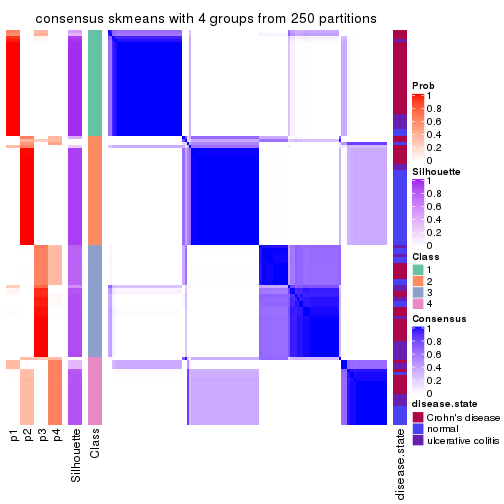</p>

</div>
<div id='tab-ATC-skmeans-consensus-heatmap-4'>
<pre><code class="r">consensus_heatmap(res, k = 5)
</code></pre>

<p></p>

</div>
<div id='tab-ATC-skmeans-consensus-heatmap-5'>
<pre><code class="r">consensus_heatmap(res, k = 6)
</code></pre>

<p></p>

</div>
</div>

Heatmaps for the membership of samples in all partitions to see how consistent they are:


<script>
$( function() {
	$( '#tabs-ATC-skmeans-membership-heatmap' ).tabs();
} );
</script>
<div id='tabs-ATC-skmeans-membership-heatmap'>
<ul>
<li><a href='#tab-ATC-skmeans-membership-heatmap-1'>k = 2</a></li>
<li><a href='#tab-ATC-skmeans-membership-heatmap-2'>k = 3</a></li>
<li><a href='#tab-ATC-skmeans-membership-heatmap-3'>k = 4</a></li>
<li><a href='#tab-ATC-skmeans-membership-heatmap-4'>k = 5</a></li>
<li><a href='#tab-ATC-skmeans-membership-heatmap-5'>k = 6</a></li>
</ul>
<div id='tab-ATC-skmeans-membership-heatmap-1'>
<pre><code class="r">membership_heatmap(res, k = 2)
</code></pre>

<p></p>

</div>
<div id='tab-ATC-skmeans-membership-heatmap-2'>
<pre><code class="r">membership_heatmap(res, k = 3)
</code></pre>

<p></p>

</div>
<div id='tab-ATC-skmeans-membership-heatmap-3'>
<pre><code class="r">membership_heatmap(res, k = 4)
</code></pre>

<p></p>

</div>
<div id='tab-ATC-skmeans-membership-heatmap-4'>
<pre><code class="r">membership_heatmap(res, k = 5)
</code></pre>

<p></p>

</div>
<div id='tab-ATC-skmeans-membership-heatmap-5'>
<pre><code class="r">membership_heatmap(res, k = 6)
</code></pre>

<p></p>

</div>
</div>

As soon as we have had the classes for columns, we can look for signatures
which are significantly different between classes which can be candidate marks
for certain classes. Following are the heatmaps for signatures.


Signature heatmaps where rows are scaled:


<script>
$( function() {
	$( '#tabs-ATC-skmeans-get-signatures' ).tabs();
} );
</script>
<div id='tabs-ATC-skmeans-get-signatures'>
<ul>
<li><a href='#tab-ATC-skmeans-get-signatures-1'>k = 2</a></li>
<li><a href='#tab-ATC-skmeans-get-signatures-2'>k = 3</a></li>
<li><a href='#tab-ATC-skmeans-get-signatures-3'>k = 4</a></li>
<li><a href='#tab-ATC-skmeans-get-signatures-4'>k = 5</a></li>
<li><a href='#tab-ATC-skmeans-get-signatures-5'>k = 6</a></li>
</ul>
<div id='tab-ATC-skmeans-get-signatures-1'>
<pre><code class="r">get_signatures(res, k = 2)
</code></pre>

<p></p>

</div>
<div id='tab-ATC-skmeans-get-signatures-2'>
<pre><code class="r">get_signatures(res, k = 3)
</code></pre>

<p></p>

</div>
<div id='tab-ATC-skmeans-get-signatures-3'>
<pre><code class="r">get_signatures(res, k = 4)
</code></pre>

<p></p>

</div>
<div id='tab-ATC-skmeans-get-signatures-4'>
<pre><code class="r">get_signatures(res, k = 5)
</code></pre>

<p></p>

</div>
<div id='tab-ATC-skmeans-get-signatures-5'>
<pre><code class="r">get_signatures(res, k = 6)
</code></pre>

<p></p>

</div>
</div>


Signature heatmaps where rows are not scaled:


<script>
$( function() {
	$( '#tabs-ATC-skmeans-get-signatures-no-scale' ).tabs();
} );
</script>
<div id='tabs-ATC-skmeans-get-signatures-no-scale'>
<ul>
<li><a href='#tab-ATC-skmeans-get-signatures-no-scale-1'>k = 2</a></li>
<li><a href='#tab-ATC-skmeans-get-signatures-no-scale-2'>k = 3</a></li>
<li><a href='#tab-ATC-skmeans-get-signatures-no-scale-3'>k = 4</a></li>
<li><a href='#tab-ATC-skmeans-get-signatures-no-scale-4'>k = 5</a></li>
<li><a href='#tab-ATC-skmeans-get-signatures-no-scale-5'>k = 6</a></li>
</ul>
<div id='tab-ATC-skmeans-get-signatures-no-scale-1'>
<pre><code class="r">get_signatures(res, k = 2, scale_rows = FALSE)
</code></pre>

<p></p>

</div>
<div id='tab-ATC-skmeans-get-signatures-no-scale-2'>
<pre><code class="r">get_signatures(res, k = 3, scale_rows = FALSE)
</code></pre>

<p></p>

</div>
<div id='tab-ATC-skmeans-get-signatures-no-scale-3'>
<pre><code class="r">get_signatures(res, k = 4, scale_rows = FALSE)
</code></pre>

<p></p>

</div>
<div id='tab-ATC-skmeans-get-signatures-no-scale-4'>
<pre><code class="r">get_signatures(res, k = 5, scale_rows = FALSE)
</code></pre>

<p></p>

</div>
<div id='tab-ATC-skmeans-get-signatures-no-scale-5'>
<pre><code class="r">get_signatures(res, k = 6, scale_rows = FALSE)
</code></pre>

<p></p>

</div>
</div>


Compare the overlap of signatures from different k:

```r
compare_signatures(res)
```


`get_signature()` returns a data frame invisibly. TO get the list of signatures, the function
call should be assigned to a variable explicitly. In following code, if `plot` argument is set
to `FALSE`, no heatmap is plotted while only the differential analysis is performed.

```r
# code only for demonstration
tb = get_signature(res, k = ..., plot = FALSE)
```

An example of the output of `tb` is:

```
#>   which_row         fdr    mean_1    mean_2 scaled_mean_1 scaled_mean_2 km
#> 1        38 0.042760348  8.373488  9.131774    -0.5533452     0.5164555  1
#> 2        40 0.018707592  7.106213  8.469186    -0.6173731     0.5762149  1
#> 3        55 0.019134737 10.221463 11.207825    -0.6159697     0.5749050  1
#> 4        59 0.006059896  5.921854  7.869574    -0.6899429     0.6439467  1
#> 5        60 0.018055526  8.928898 10.211722    -0.6204761     0.5791110  1
#> 6        98 0.009384629 15.714769 14.887706     0.6635654    -0.6193277  2
...
```

The columns in `tb` are:

1. `which_row`: row indices corresponding to the input matrix.
2. `fdr`: FDR for the differential test. 
3. `mean_x`: The mean value in group x.
4. `scaled_mean_x`: The mean value in group x after rows are scaled.
5. `km`: Row groups if k-means clustering is applied to rows.


UMAP plot which shows how samples are separated.


<script>
$( function() {
	$( '#tabs-ATC-skmeans-dimension-reduction' ).tabs();
} );
</script>
<div id='tabs-ATC-skmeans-dimension-reduction'>
<ul>
<li><a href='#tab-ATC-skmeans-dimension-reduction-1'>k = 2</a></li>
<li><a href='#tab-ATC-skmeans-dimension-reduction-2'>k = 3</a></li>
<li><a href='#tab-ATC-skmeans-dimension-reduction-3'>k = 4</a></li>
<li><a href='#tab-ATC-skmeans-dimension-reduction-4'>k = 5</a></li>
<li><a href='#tab-ATC-skmeans-dimension-reduction-5'>k = 6</a></li>
</ul>
<div id='tab-ATC-skmeans-dimension-reduction-1'>
<pre><code class="r">dimension_reduction(res, k = 2, method = &quot;UMAP&quot;)
</code></pre>

<p></p>

</div>
<div id='tab-ATC-skmeans-dimension-reduction-2'>
<pre><code class="r">dimension_reduction(res, k = 3, method = &quot;UMAP&quot;)
</code></pre>

<p></p>

</div>
<div id='tab-ATC-skmeans-dimension-reduction-3'>
<pre><code class="r">dimension_reduction(res, k = 4, method = &quot;UMAP&quot;)
</code></pre>

<p></p>

</div>
<div id='tab-ATC-skmeans-dimension-reduction-4'>
<pre><code class="r">dimension_reduction(res, k = 5, method = &quot;UMAP&quot;)
</code></pre>

<p></p>

</div>
<div id='tab-ATC-skmeans-dimension-reduction-5'>
<pre><code class="r">dimension_reduction(res, k = 6, method = &quot;UMAP&quot;)
</code></pre>

<p></p>

</div>
</div>


Following heatmap shows how subgroups are split when increasing `k`:

```r
collect_classes(res)
```


Test correlation between subgroups and known annotations. If the known
annotation is numeric, one-way ANOVA test is applied, and if the known
annotation is discrete, chi-squared contingency table test is applied.

```r
test_to_known_factors(res)
```

```
#>               n disease.state(p) k
#> ATC:skmeans 124         9.74e-09 2
#> ATC:skmeans 123         2.58e-07 3
#> ATC:skmeans 117         1.49e-07 4
#> ATC:skmeans 121         9.04e-09 5
#> ATC:skmeans 119         1.12e-09 6
```


If matrix rows can be associated to genes, consider to use `functional_enrichment(res,
...)` to perform function enrichment for the signature genes. See [this vignette](http://bioconductor.org/packages/devel/bioc/vignettes/cola/inst/doc/functional_enrichment.html) for more detailed explanations.


 

---------------------------------------------------


### ATC:pam


The object with results only for a single top-value method and a single partition method 
can be extracted as:

```r
res = res_list["ATC", "pam"]
# you can also extract it by
# res = res_list["ATC:pam"]
```

A summary of `res` and all the functions that can be applied to it:

```r
res
```

```
#> A 'ConsensusPartition' object with k = 2, 3, 4, 5, 6.
#>   On a matrix with 21168 rows and 127 columns.
#>   Top rows (1000, 2000, 3000, 4000, 5000) are extracted by 'ATC' method.
#>   Subgroups are detected by 'pam' method.
#>   Performed in total 1250 partitions by row resampling.
#>   Best k for subgroups seems to be 4.
#> 
#> Following methods can be applied to this 'ConsensusPartition' object:
#>  [1] "cola_report"             "collect_classes"         "collect_plots"          
#>  [4] "collect_stats"           "colnames"                "compare_signatures"     
#>  [7] "consensus_heatmap"       "dimension_reduction"     "functional_enrichment"  
#> [10] "get_anno_col"            "get_anno"                "get_classes"            
#> [13] "get_consensus"           "get_matrix"              "get_membership"         
#> [16] "get_param"               "get_signatures"          "get_stats"              
#> [19] "is_best_k"               "is_stable_k"             "membership_heatmap"     
#> [22] "ncol"                    "nrow"                    "plot_ecdf"              
#> [25] "rownames"                "select_partition_number" "show"                   
#> [28] "suggest_best_k"          "test_to_known_factors"
```

`collect_plots()` function collects all the plots made from `res` for all `k` (number of partitions)
into one single page to provide an easy and fast comparison between different `k`.

```r
collect_plots(res)
```


The plots are:

- The first row: a plot of the ECDF (empirical cumulative distribution
  function) curves of the consensus matrix for each `k` and the heatmap of
  predicted classes for each `k`.
- The second row: heatmaps of the consensus matrix for each `k`.
- The third row: heatmaps of the membership matrix for each `k`.
- The fouth row: heatmaps of the signatures for each `k`.

All the plots in panels can be made by individual functions and they are
plotted later in this section.

`select_partition_number()` produces several plots showing different
statistics for choosing "optimized" `k`. There are following statistics:

- ECDF curves of the consensus matrix for each `k`;
- 1-PAC. [The PAC
  score](https://en.wikipedia.org/wiki/Consensus_clustering#Over-interpretation_potential_of_consensus_clustering)
  measures the proportion of the ambiguous subgrouping.
- Mean silhouette score.
- Concordance. The mean probability of fiting the consensus class ids in all
  partitions.
- Area increased. Denote $A_k$ as the area under the ECDF curve for current
  `k`, the area increased is defined as $A_k - A_{k-1}$.
- Rand index. The percent of pairs of samples that are both in a same cluster
  or both are not in a same cluster in the partition of k and k-1.
- Jaccard index. The ratio of pairs of samples are both in a same cluster in
  the partition of k and k-1 and the pairs of samples are both in a same
  cluster in the partition k or k-1.

The detailed explanations of these statistics can be found in [the _cola_
vignette](http://bioconductor.org/packages/devel/bioc/vignettes/cola/inst/doc/cola.html#toc_13).

Generally speaking, lower PAC score, higher mean silhouette score or higher
concordance corresponds to better partition. Rand index and Jaccard index
measure how similar the current partition is compared to partition with `k-1`.
If they are too similar, we won't accept `k` is better than `k-1`.

```r
select_partition_number(res)
```


The numeric values for all these statistics can be obtained by `get_stats()`.

```r
get_stats(res)
```

```
#>   k 1-PAC mean_silhouette concordance area_increased  Rand Jaccard
#> 2 2 0.674           0.832       0.917         0.4780 0.519   0.519
#> 3 3 0.554           0.769       0.811         0.3408 0.710   0.496
#> 4 4 0.894           0.844       0.937         0.1746 0.844   0.579
#> 5 5 0.686           0.612       0.792         0.0488 0.913   0.676
#> 6 6 0.732           0.632       0.798         0.0378 0.905   0.603
```

`suggest_best_k()` suggests the best $k$ based on these statistics. The rules are as follows:

- All $k$ with Jaccard index larger than 0.95 are removed because increasing
  $k$ does not provide enough extra information. If all $k$ are removed, it is
  marked as no subgroup is detected.
- For all $k$ with 1-PAC score larger than 0.9, the maximal $k$ is taken as
  the best $k$, and other $k$ are marked as optional $k$.
- If it does not fit the second rule. The $k$ with the maximal vote of the
  highest 1-PAC score, highest mean silhouette, and highest concordance is
  taken as the best $k$.

```r
suggest_best_k(res)
```

```
#> [1] 4
```


Following shows the table of the partitions (You need to click the **show/hide
code output** link to see it). The membership matrix (columns with name `p*`)
is inferred by
[`clue::cl_consensus()`](https://www.rdocumentation.org/link/cl_consensus?package=clue)
function with the `SE` method. Basically the value in the membership matrix
represents the probability to belong to a certain group. The finall class
label for an item is determined with the group with highest probability it
belongs to.

In `get_classes()` function, the entropy is calculated from the membership
matrix and the silhouette score is calculated from the consensus matrix.


<script>
$( function() {
	$( '#tabs-ATC-pam-get-classes' ).tabs();
} );
</script>
<div id='tabs-ATC-pam-get-classes'>
<ul>
<li><a href='#tab-ATC-pam-get-classes-1'>k = 2</a></li>
<li><a href='#tab-ATC-pam-get-classes-2'>k = 3</a></li>
<li><a href='#tab-ATC-pam-get-classes-3'>k = 4</a></li>
<li><a href='#tab-ATC-pam-get-classes-4'>k = 5</a></li>
<li><a href='#tab-ATC-pam-get-classes-5'>k = 6</a></li>
</ul>

<div id='tab-ATC-pam-get-classes-1'>
<p><a id='tab-ATC-pam-get-classes-1-a' style='color:#0366d6' href='#'>show/hide code output</a></p>
<pre><code class="r">cbind(get_classes(res, k = 2), get_membership(res, k = 2))
</code></pre>

<pre><code>#&gt;          class entropy silhouette    p1    p2
#&gt; GSM76115     2  0.0000      0.867 0.000 1.000
#&gt; GSM76116     2  0.0000      0.867 0.000 1.000
#&gt; GSM76117     2  0.0000      0.867 0.000 1.000
#&gt; GSM76118     2  0.0000      0.867 0.000 1.000
#&gt; GSM76119     2  0.9129      0.637 0.328 0.672
#&gt; GSM76120     2  0.9129      0.637 0.328 0.672
#&gt; GSM76121     2  0.9129      0.637 0.328 0.672
#&gt; GSM76122     2  0.0000      0.867 0.000 1.000
#&gt; GSM76123     2  0.9129      0.637 0.328 0.672
#&gt; GSM76124     2  0.9129      0.637 0.328 0.672
#&gt; GSM76125     2  0.9129      0.637 0.328 0.672
#&gt; GSM76126     1  0.8555      0.552 0.720 0.280
#&gt; GSM76127     2  0.9129      0.637 0.328 0.672
#&gt; GSM76128     1  0.8713      0.524 0.708 0.292
#&gt; GSM76129     2  0.0000      0.867 0.000 1.000
#&gt; GSM76130     2  0.8386      0.693 0.268 0.732
#&gt; GSM76131     2  0.0000      0.867 0.000 1.000
#&gt; GSM76132     2  0.0000      0.867 0.000 1.000
#&gt; GSM76133     2  0.0000      0.867 0.000 1.000
#&gt; GSM76134     2  0.0000      0.867 0.000 1.000
#&gt; GSM76135     2  0.0000      0.867 0.000 1.000
#&gt; GSM76136     2  0.0000      0.867 0.000 1.000
#&gt; GSM76137     2  0.0000      0.867 0.000 1.000
#&gt; GSM76138     2  0.0000      0.867 0.000 1.000
#&gt; GSM76139     2  0.0000      0.867 0.000 1.000
#&gt; GSM76140     2  0.0000      0.867 0.000 1.000
#&gt; GSM76141     2  0.0000      0.867 0.000 1.000
#&gt; GSM76142     2  0.0000      0.867 0.000 1.000
#&gt; GSM76143     2  0.0000      0.867 0.000 1.000
#&gt; GSM76144     2  0.0000      0.867 0.000 1.000
#&gt; GSM76145     2  0.0000      0.867 0.000 1.000
#&gt; GSM76146     2  0.0000      0.867 0.000 1.000
#&gt; GSM76147     2  0.0000      0.867 0.000 1.000
#&gt; GSM76148     2  0.0000      0.867 0.000 1.000
#&gt; GSM76149     2  0.0000      0.867 0.000 1.000
#&gt; GSM76150     2  0.0000      0.867 0.000 1.000
#&gt; GSM76151     2  0.0000      0.867 0.000 1.000
#&gt; GSM76152     1  0.0672      0.951 0.992 0.008
#&gt; GSM76153     2  0.0000      0.867 0.000 1.000
#&gt; GSM76154     2  0.0000      0.867 0.000 1.000
#&gt; GSM76155     2  0.0000      0.867 0.000 1.000
#&gt; GSM76156     2  0.0000      0.867 0.000 1.000
#&gt; GSM76030     2  0.0000      0.867 0.000 1.000
#&gt; GSM76031     1  0.0000      0.957 1.000 0.000
#&gt; GSM76032     1  0.0000      0.957 1.000 0.000
#&gt; GSM76033     1  0.4022      0.883 0.920 0.080
#&gt; GSM76034     2  0.0000      0.867 0.000 1.000
#&gt; GSM76035     1  0.2043      0.930 0.968 0.032
#&gt; GSM76036     2  0.9129      0.637 0.328 0.672
#&gt; GSM76037     2  0.0000      0.867 0.000 1.000
#&gt; GSM76038     1  0.0000      0.957 1.000 0.000
#&gt; GSM76039     2  0.9170      0.631 0.332 0.668
#&gt; GSM76040     2  0.9129      0.637 0.328 0.672
#&gt; GSM76041     1  0.0000      0.957 1.000 0.000
#&gt; GSM76042     2  0.9754      0.496 0.408 0.592
#&gt; GSM76043     1  0.5408      0.821 0.876 0.124
#&gt; GSM76044     2  0.0000      0.867 0.000 1.000
#&gt; GSM76045     1  0.0000      0.957 1.000 0.000
#&gt; GSM76046     2  0.9129      0.637 0.328 0.672
#&gt; GSM76047     2  0.9996      0.280 0.488 0.512
#&gt; GSM76048     1  0.4022      0.883 0.920 0.080
#&gt; GSM76049     2  0.0000      0.867 0.000 1.000
#&gt; GSM76050     1  0.0000      0.957 1.000 0.000
#&gt; GSM76051     1  0.4022      0.883 0.920 0.080
#&gt; GSM76052     2  0.9129      0.637 0.328 0.672
#&gt; GSM76053     2  0.0000      0.867 0.000 1.000
#&gt; GSM76054     2  0.9129      0.637 0.328 0.672
#&gt; GSM76055     2  0.0000      0.867 0.000 1.000
#&gt; GSM76056     2  0.4022      0.806 0.080 0.920
#&gt; GSM76057     2  0.9686      0.520 0.396 0.604
#&gt; GSM76058     1  0.0000      0.957 1.000 0.000
#&gt; GSM76059     1  0.0000      0.957 1.000 0.000
#&gt; GSM76060     2  0.0000      0.867 0.000 1.000
#&gt; GSM76061     2  0.0000      0.867 0.000 1.000
#&gt; GSM76062     1  0.0000      0.957 1.000 0.000
#&gt; GSM76063     2  0.0000      0.867 0.000 1.000
#&gt; GSM76064     1  0.0000      0.957 1.000 0.000
#&gt; GSM76065     2  0.0000      0.867 0.000 1.000
#&gt; GSM76066     1  0.0000      0.957 1.000 0.000
#&gt; GSM76067     1  0.0000      0.957 1.000 0.000
#&gt; GSM76068     1  0.9248      0.393 0.660 0.340
#&gt; GSM76069     1  0.0000      0.957 1.000 0.000
#&gt; GSM76070     2  0.0000      0.867 0.000 1.000
#&gt; GSM76071     1  0.0000      0.957 1.000 0.000
#&gt; GSM76072     1  0.0000      0.957 1.000 0.000
#&gt; GSM76073     1  0.0000      0.957 1.000 0.000
#&gt; GSM76074     1  0.0000      0.957 1.000 0.000
#&gt; GSM76075     1  0.0000      0.957 1.000 0.000
#&gt; GSM76076     1  0.0000      0.957 1.000 0.000
#&gt; GSM76077     2  0.0000      0.867 0.000 1.000
#&gt; GSM76078     2  0.9129      0.637 0.328 0.672
#&gt; GSM76079     1  0.0000      0.957 1.000 0.000
#&gt; GSM76080     2  0.9044      0.645 0.320 0.680
#&gt; GSM76081     2  0.9129      0.637 0.328 0.672
#&gt; GSM76082     1  0.0000      0.957 1.000 0.000
#&gt; GSM76083     1  0.4022      0.883 0.920 0.080
#&gt; GSM76084     2  0.0000      0.867 0.000 1.000
#&gt; GSM76085     1  0.0000      0.957 1.000 0.000
#&gt; GSM76086     1  0.0000      0.957 1.000 0.000
#&gt; GSM76087     2  0.0000      0.867 0.000 1.000
#&gt; GSM76088     1  0.0000      0.957 1.000 0.000
#&gt; GSM76089     2  0.0000      0.867 0.000 1.000
#&gt; GSM76090     1  0.0000      0.957 1.000 0.000
#&gt; GSM76091     1  0.0000      0.957 1.000 0.000
#&gt; GSM76092     1  0.0000      0.957 1.000 0.000
#&gt; GSM76093     1  0.0000      0.957 1.000 0.000
#&gt; GSM76094     2  0.0376      0.865 0.004 0.996
#&gt; GSM76095     2  0.8081      0.710 0.248 0.752
#&gt; GSM76096     1  0.0000      0.957 1.000 0.000
#&gt; GSM76097     1  0.9129      0.402 0.672 0.328
#&gt; GSM76098     2  0.9129      0.637 0.328 0.672
#&gt; GSM76099     1  0.0000      0.957 1.000 0.000
#&gt; GSM76100     1  0.0000      0.957 1.000 0.000
#&gt; GSM76101     1  0.0000      0.957 1.000 0.000
#&gt; GSM76102     1  0.0000      0.957 1.000 0.000
#&gt; GSM76103     1  0.0000      0.957 1.000 0.000
#&gt; GSM76104     2  0.9129      0.637 0.328 0.672
#&gt; GSM76105     2  0.0000      0.867 0.000 1.000
#&gt; GSM76106     2  0.9129      0.637 0.328 0.672
#&gt; GSM76107     2  0.9129      0.637 0.328 0.672
#&gt; GSM76108     2  0.0000      0.867 0.000 1.000
#&gt; GSM76109     1  0.0000      0.957 1.000 0.000
#&gt; GSM76110     1  0.0000      0.957 1.000 0.000
#&gt; GSM76111     1  0.0000      0.957 1.000 0.000
#&gt; GSM76112     1  0.0000      0.957 1.000 0.000
#&gt; GSM76113     2  0.9129      0.637 0.328 0.672
#&gt; GSM76114     1  0.0000      0.957 1.000 0.000
</code></pre>

<script>
$('#tab-ATC-pam-get-classes-1-a').parent().next().next().hide();
$('#tab-ATC-pam-get-classes-1-a').click(function(){
  $('#tab-ATC-pam-get-classes-1-a').parent().next().next().toggle();
  return(false);
});
</script>
</div>

<div id='tab-ATC-pam-get-classes-2'>
<p><a id='tab-ATC-pam-get-classes-2-a' style='color:#0366d6' href='#'>show/hide code output</a></p>
<pre><code class="r">cbind(get_classes(res, k = 3), get_membership(res, k = 3))
</code></pre>

<pre><code>#&gt;          class entropy silhouette    p1    p2    p3
#&gt; GSM76115     2  0.7542      0.806 0.120 0.688 0.192
#&gt; GSM76116     2  0.6788      0.821 0.120 0.744 0.136
#&gt; GSM76117     2  0.7542      0.806 0.120 0.688 0.192
#&gt; GSM76118     2  0.7542      0.806 0.120 0.688 0.192
#&gt; GSM76119     3  0.0000      0.720 0.000 0.000 1.000
#&gt; GSM76120     3  0.0000      0.720 0.000 0.000 1.000
#&gt; GSM76121     1  0.4605      0.523 0.796 0.000 0.204
#&gt; GSM76122     2  0.7542      0.806 0.120 0.688 0.192
#&gt; GSM76123     3  0.0000      0.720 0.000 0.000 1.000
#&gt; GSM76124     2  0.8722      0.702 0.216 0.592 0.192
#&gt; GSM76125     3  0.0000      0.720 0.000 0.000 1.000
#&gt; GSM76126     3  0.5785      0.638 0.332 0.000 0.668
#&gt; GSM76127     3  0.0237      0.717 0.004 0.000 0.996
#&gt; GSM76128     3  0.4452      0.667 0.192 0.000 0.808
#&gt; GSM76129     2  0.7542      0.806 0.120 0.688 0.192
#&gt; GSM76130     3  0.1964      0.678 0.056 0.000 0.944
#&gt; GSM76131     2  0.0000      0.831 0.000 1.000 0.000
#&gt; GSM76132     2  0.0000      0.831 0.000 1.000 0.000
#&gt; GSM76133     2  0.0000      0.831 0.000 1.000 0.000
#&gt; GSM76134     2  0.1031      0.832 0.000 0.976 0.024
#&gt; GSM76135     2  0.0000      0.831 0.000 1.000 0.000
#&gt; GSM76136     2  0.4002      0.829 0.000 0.840 0.160
#&gt; GSM76137     2  0.4452      0.826 0.000 0.808 0.192
#&gt; GSM76138     2  0.7133      0.813 0.096 0.712 0.192
#&gt; GSM76139     2  0.0000      0.831 0.000 1.000 0.000
#&gt; GSM76140     2  0.7542      0.806 0.120 0.688 0.192
#&gt; GSM76141     2  0.0000      0.831 0.000 1.000 0.000
#&gt; GSM76142     2  0.0000      0.831 0.000 1.000 0.000
#&gt; GSM76143     2  0.0000      0.831 0.000 1.000 0.000
#&gt; GSM76144     2  0.0000      0.831 0.000 1.000 0.000
#&gt; GSM76145     2  0.4452      0.826 0.000 0.808 0.192
#&gt; GSM76146     2  0.0000      0.831 0.000 1.000 0.000
#&gt; GSM76147     2  0.0000      0.831 0.000 1.000 0.000
#&gt; GSM76148     2  0.0000      0.831 0.000 1.000 0.000
#&gt; GSM76149     2  0.4452      0.826 0.000 0.808 0.192
#&gt; GSM76150     2  0.1031      0.832 0.000 0.976 0.024
#&gt; GSM76151     2  0.7542      0.806 0.120 0.688 0.192
#&gt; GSM76152     1  0.1031      0.783 0.976 0.000 0.024
#&gt; GSM76153     2  0.0000      0.831 0.000 1.000 0.000
#&gt; GSM76154     2  0.1031      0.832 0.000 0.976 0.024
#&gt; GSM76155     2  0.7542      0.806 0.120 0.688 0.192
#&gt; GSM76156     2  0.0000      0.831 0.000 1.000 0.000
#&gt; GSM76030     2  0.4452      0.826 0.000 0.808 0.192
#&gt; GSM76031     1  0.3340      0.905 0.880 0.000 0.120
#&gt; GSM76032     3  0.5835      0.630 0.340 0.000 0.660
#&gt; GSM76033     3  0.5785      0.639 0.332 0.000 0.668
#&gt; GSM76034     2  0.8168      0.687 0.108 0.612 0.280
#&gt; GSM76035     1  0.3752      0.883 0.856 0.000 0.144
#&gt; GSM76036     3  0.1031      0.725 0.024 0.000 0.976
#&gt; GSM76037     2  0.3918      0.818 0.120 0.868 0.012
#&gt; GSM76038     1  0.3340      0.905 0.880 0.000 0.120
#&gt; GSM76039     1  0.6902      0.415 0.732 0.100 0.168
#&gt; GSM76040     3  0.4002      0.726 0.160 0.000 0.840
#&gt; GSM76041     1  0.3340      0.905 0.880 0.000 0.120
#&gt; GSM76042     1  0.4504      0.543 0.804 0.000 0.196
#&gt; GSM76043     1  0.3941      0.875 0.844 0.000 0.156
#&gt; GSM76044     2  0.7245      0.812 0.120 0.712 0.168
#&gt; GSM76045     1  0.3340      0.905 0.880 0.000 0.120
#&gt; GSM76046     3  0.4002      0.726 0.160 0.000 0.840
#&gt; GSM76047     1  0.5431      0.687 0.716 0.000 0.284
#&gt; GSM76048     3  0.5785      0.639 0.332 0.000 0.668
#&gt; GSM76049     2  0.0000      0.831 0.000 1.000 0.000
#&gt; GSM76050     1  0.3340      0.905 0.880 0.000 0.120
#&gt; GSM76051     3  0.5785      0.639 0.332 0.000 0.668
#&gt; GSM76052     3  0.3686      0.727 0.140 0.000 0.860
#&gt; GSM76053     2  0.7796      0.783 0.112 0.660 0.228
#&gt; GSM76054     3  0.3619      0.726 0.136 0.000 0.864
#&gt; GSM76055     2  0.7542      0.806 0.120 0.688 0.192
#&gt; GSM76056     2  0.9301      0.505 0.360 0.472 0.168
#&gt; GSM76057     1  0.5397      0.661 0.720 0.000 0.280
#&gt; GSM76058     3  0.5835      0.630 0.340 0.000 0.660
#&gt; GSM76059     1  0.3340      0.905 0.880 0.000 0.120
#&gt; GSM76060     2  0.5791      0.806 0.048 0.784 0.168
#&gt; GSM76061     2  0.0000      0.831 0.000 1.000 0.000
#&gt; GSM76062     1  0.3340      0.905 0.880 0.000 0.120
#&gt; GSM76063     2  0.4504      0.825 0.000 0.804 0.196
#&gt; GSM76064     1  0.3340      0.905 0.880 0.000 0.120
#&gt; GSM76065     2  0.0000      0.831 0.000 1.000 0.000
#&gt; GSM76066     1  0.3340      0.905 0.880 0.000 0.120
#&gt; GSM76067     1  0.3619      0.890 0.864 0.000 0.136
#&gt; GSM76068     3  0.5591      0.660 0.304 0.000 0.696
#&gt; GSM76069     1  0.3267      0.903 0.884 0.000 0.116
#&gt; GSM76070     2  0.0000      0.831 0.000 1.000 0.000
#&gt; GSM76071     1  0.3340      0.905 0.880 0.000 0.120
#&gt; GSM76072     1  0.3340      0.905 0.880 0.000 0.120
#&gt; GSM76073     1  0.0237      0.809 0.996 0.000 0.004
#&gt; GSM76074     1  0.0000      0.805 1.000 0.000 0.000
#&gt; GSM76075     3  0.5785      0.639 0.332 0.000 0.668
#&gt; GSM76076     3  0.5835      0.630 0.340 0.000 0.660
#&gt; GSM76077     2  0.7542      0.806 0.120 0.688 0.192
#&gt; GSM76078     3  0.4002      0.726 0.160 0.000 0.840
#&gt; GSM76079     1  0.3340      0.905 0.880 0.000 0.120
#&gt; GSM76080     3  0.1529      0.729 0.040 0.000 0.960
#&gt; GSM76081     3  0.0000      0.720 0.000 0.000 1.000
#&gt; GSM76082     3  0.5859      0.623 0.344 0.000 0.656
#&gt; GSM76083     3  0.5835      0.630 0.340 0.000 0.660
#&gt; GSM76084     2  0.6291      0.456 0.000 0.532 0.468
#&gt; GSM76085     3  0.5785      0.639 0.332 0.000 0.668
#&gt; GSM76086     1  0.3340      0.905 0.880 0.000 0.120
#&gt; GSM76087     2  0.0000      0.831 0.000 1.000 0.000
#&gt; GSM76088     1  0.3340      0.905 0.880 0.000 0.120
#&gt; GSM76089     2  0.0000      0.831 0.000 1.000 0.000
#&gt; GSM76090     3  0.5882      0.616 0.348 0.000 0.652
#&gt; GSM76091     1  0.3340      0.905 0.880 0.000 0.120
#&gt; GSM76092     1  0.3267      0.903 0.884 0.000 0.116
#&gt; GSM76093     1  0.3340      0.905 0.880 0.000 0.120
#&gt; GSM76094     2  0.7605      0.804 0.124 0.684 0.192
#&gt; GSM76095     2  0.8399      0.744 0.188 0.624 0.188
#&gt; GSM76096     1  0.3267      0.903 0.884 0.000 0.116
#&gt; GSM76097     1  0.1289      0.778 0.968 0.000 0.032
#&gt; GSM76098     3  0.1753      0.730 0.048 0.000 0.952
#&gt; GSM76099     1  0.3340      0.905 0.880 0.000 0.120
#&gt; GSM76100     1  0.0000      0.805 1.000 0.000 0.000
#&gt; GSM76101     1  0.3267      0.903 0.884 0.000 0.116
#&gt; GSM76102     1  0.3752      0.883 0.856 0.000 0.144
#&gt; GSM76103     1  0.3482      0.898 0.872 0.000 0.128
#&gt; GSM76104     3  0.4002      0.726 0.160 0.000 0.840
#&gt; GSM76105     2  0.7542      0.806 0.120 0.688 0.192
#&gt; GSM76106     3  0.8684     -0.384 0.108 0.392 0.500
#&gt; GSM76107     3  0.3340      0.607 0.120 0.000 0.880
#&gt; GSM76108     2  0.7535      0.805 0.132 0.692 0.176
#&gt; GSM76109     1  0.3340      0.905 0.880 0.000 0.120
#&gt; GSM76110     1  0.0000      0.805 1.000 0.000 0.000
#&gt; GSM76111     1  0.0237      0.809 0.996 0.000 0.004
#&gt; GSM76112     1  0.3340      0.905 0.880 0.000 0.120
#&gt; GSM76113     3  0.9062     -0.121 0.136 0.412 0.452
#&gt; GSM76114     1  0.3340      0.905 0.880 0.000 0.120
</code></pre>

<script>
$('#tab-ATC-pam-get-classes-2-a').parent().next().next().hide();
$('#tab-ATC-pam-get-classes-2-a').click(function(){
  $('#tab-ATC-pam-get-classes-2-a').parent().next().next().toggle();
  return(false);
});
</script>
</div>

<div id='tab-ATC-pam-get-classes-3'>
<p><a id='tab-ATC-pam-get-classes-3-a' style='color:#0366d6' href='#'>show/hide code output</a></p>
<pre><code class="r">cbind(get_classes(res, k = 4), get_membership(res, k = 4))
</code></pre>

<pre><code>#&gt;          class entropy silhouette    p1    p2    p3    p4
#&gt; GSM76115     4  0.4907     0.2707 0.000 0.420 0.000 0.580
#&gt; GSM76116     4  0.5000     0.0120 0.000 0.500 0.000 0.500
#&gt; GSM76117     4  0.0000     0.8978 0.000 0.000 0.000 1.000
#&gt; GSM76118     4  0.0000     0.8978 0.000 0.000 0.000 1.000
#&gt; GSM76119     3  0.1022     0.9308 0.000 0.000 0.968 0.032
#&gt; GSM76120     3  0.0707     0.9350 0.000 0.000 0.980 0.020
#&gt; GSM76121     4  0.0000     0.8978 0.000 0.000 0.000 1.000
#&gt; GSM76122     4  0.0000     0.8978 0.000 0.000 0.000 1.000
#&gt; GSM76123     3  0.0707     0.9350 0.000 0.000 0.980 0.020
#&gt; GSM76124     4  0.0000     0.8978 0.000 0.000 0.000 1.000
#&gt; GSM76125     3  0.1022     0.9308 0.000 0.000 0.968 0.032
#&gt; GSM76126     3  0.7253     0.2047 0.152 0.000 0.484 0.364
#&gt; GSM76127     3  0.1022     0.9308 0.000 0.000 0.968 0.032
#&gt; GSM76128     3  0.0000     0.9376 0.000 0.000 1.000 0.000
#&gt; GSM76129     4  0.0000     0.8978 0.000 0.000 0.000 1.000
#&gt; GSM76130     3  0.1022     0.9308 0.000 0.000 0.968 0.032
#&gt; GSM76131     2  0.0000     0.9300 0.000 1.000 0.000 0.000
#&gt; GSM76132     2  0.0000     0.9300 0.000 1.000 0.000 0.000
#&gt; GSM76133     2  0.0000     0.9300 0.000 1.000 0.000 0.000
#&gt; GSM76134     2  0.0592     0.9245 0.000 0.984 0.000 0.016
#&gt; GSM76135     2  0.0000     0.9300 0.000 1.000 0.000 0.000
#&gt; GSM76136     2  0.0707     0.9226 0.000 0.980 0.000 0.020
#&gt; GSM76137     2  0.1022     0.9158 0.000 0.968 0.000 0.032
#&gt; GSM76138     2  0.4222     0.5873 0.000 0.728 0.000 0.272
#&gt; GSM76139     2  0.0000     0.9300 0.000 1.000 0.000 0.000
#&gt; GSM76140     4  0.0000     0.8978 0.000 0.000 0.000 1.000
#&gt; GSM76141     2  0.0000     0.9300 0.000 1.000 0.000 0.000
#&gt; GSM76142     2  0.0000     0.9300 0.000 1.000 0.000 0.000
#&gt; GSM76143     2  0.0000     0.9300 0.000 1.000 0.000 0.000
#&gt; GSM76144     2  0.0000     0.9300 0.000 1.000 0.000 0.000
#&gt; GSM76145     2  0.1022     0.9158 0.000 0.968 0.000 0.032
#&gt; GSM76146     2  0.0000     0.9300 0.000 1.000 0.000 0.000
#&gt; GSM76147     2  0.0000     0.9300 0.000 1.000 0.000 0.000
#&gt; GSM76148     2  0.0000     0.9300 0.000 1.000 0.000 0.000
#&gt; GSM76149     2  0.1022     0.9158 0.000 0.968 0.000 0.032
#&gt; GSM76150     2  0.0592     0.9245 0.000 0.984 0.000 0.016
#&gt; GSM76151     4  0.5000     0.0226 0.000 0.496 0.000 0.504
#&gt; GSM76152     4  0.4830     0.3165 0.392 0.000 0.000 0.608
#&gt; GSM76153     2  0.0000     0.9300 0.000 1.000 0.000 0.000
#&gt; GSM76154     2  0.0469     0.9262 0.000 0.988 0.000 0.012
#&gt; GSM76155     2  0.4998    -0.0259 0.000 0.512 0.000 0.488
#&gt; GSM76156     2  0.0000     0.9300 0.000 1.000 0.000 0.000
#&gt; GSM76030     2  0.1022     0.9158 0.000 0.968 0.000 0.032
#&gt; GSM76031     1  0.0188     0.9464 0.996 0.000 0.004 0.000
#&gt; GSM76032     3  0.0000     0.9376 0.000 0.000 1.000 0.000
#&gt; GSM76033     3  0.0000     0.9376 0.000 0.000 1.000 0.000
#&gt; GSM76034     4  0.2814     0.7985 0.000 0.132 0.000 0.868
#&gt; GSM76035     1  0.0895     0.9359 0.976 0.000 0.020 0.004
#&gt; GSM76036     3  0.0000     0.9376 0.000 0.000 1.000 0.000
#&gt; GSM76037     2  0.4985     0.0135 0.000 0.532 0.000 0.468
#&gt; GSM76038     1  0.0188     0.9464 0.996 0.000 0.004 0.000
#&gt; GSM76039     4  0.0707     0.8886 0.020 0.000 0.000 0.980
#&gt; GSM76040     3  0.0000     0.9376 0.000 0.000 1.000 0.000
#&gt; GSM76041     1  0.0000     0.9471 1.000 0.000 0.000 0.000
#&gt; GSM76042     4  0.0921     0.8833 0.028 0.000 0.000 0.972
#&gt; GSM76043     4  0.3485     0.7893 0.116 0.000 0.028 0.856
#&gt; GSM76044     4  0.0592     0.8915 0.000 0.016 0.000 0.984
#&gt; GSM76045     1  0.0000     0.9471 1.000 0.000 0.000 0.000
#&gt; GSM76046     3  0.0817     0.9339 0.000 0.000 0.976 0.024
#&gt; GSM76047     1  0.1940     0.8852 0.924 0.000 0.000 0.076
#&gt; GSM76048     3  0.0000     0.9376 0.000 0.000 1.000 0.000
#&gt; GSM76049     2  0.0592     0.9222 0.000 0.984 0.000 0.016
#&gt; GSM76050     1  0.0000     0.9471 1.000 0.000 0.000 0.000
#&gt; GSM76051     3  0.0000     0.9376 0.000 0.000 1.000 0.000
#&gt; GSM76052     3  0.0817     0.9339 0.000 0.000 0.976 0.024
#&gt; GSM76053     4  0.3356     0.7489 0.000 0.176 0.000 0.824
#&gt; GSM76054     3  0.1022     0.9308 0.000 0.000 0.968 0.032
#&gt; GSM76055     4  0.0000     0.8978 0.000 0.000 0.000 1.000
#&gt; GSM76056     4  0.0592     0.8915 0.000 0.016 0.000 0.984
#&gt; GSM76057     4  0.1388     0.8821 0.012 0.028 0.000 0.960
#&gt; GSM76058     3  0.3123     0.7966 0.156 0.000 0.844 0.000
#&gt; GSM76059     1  0.0000     0.9471 1.000 0.000 0.000 0.000
#&gt; GSM76060     2  0.4933     0.1923 0.000 0.568 0.000 0.432
#&gt; GSM76061     2  0.0188     0.9284 0.000 0.996 0.000 0.004
#&gt; GSM76062     1  0.0000     0.9471 1.000 0.000 0.000 0.000
#&gt; GSM76063     2  0.1022     0.9158 0.000 0.968 0.000 0.032
#&gt; GSM76064     1  0.0188     0.9464 0.996 0.000 0.004 0.000
#&gt; GSM76065     2  0.1474     0.8864 0.000 0.948 0.000 0.052
#&gt; GSM76066     1  0.0188     0.9464 0.996 0.000 0.004 0.000
#&gt; GSM76067     1  0.2081     0.8844 0.916 0.000 0.084 0.000
#&gt; GSM76068     3  0.0188     0.9371 0.000 0.000 0.996 0.004
#&gt; GSM76069     1  0.0000     0.9471 1.000 0.000 0.000 0.000
#&gt; GSM76070     2  0.0000     0.9300 0.000 1.000 0.000 0.000
#&gt; GSM76071     1  0.0000     0.9471 1.000 0.000 0.000 0.000
#&gt; GSM76072     1  0.0000     0.9471 1.000 0.000 0.000 0.000
#&gt; GSM76073     1  0.0000     0.9471 1.000 0.000 0.000 0.000
#&gt; GSM76074     1  0.0000     0.9471 1.000 0.000 0.000 0.000
#&gt; GSM76075     3  0.0000     0.9376 0.000 0.000 1.000 0.000
#&gt; GSM76076     3  0.0000     0.9376 0.000 0.000 1.000 0.000
#&gt; GSM76077     4  0.2216     0.8362 0.000 0.092 0.000 0.908
#&gt; GSM76078     3  0.0592     0.9356 0.000 0.000 0.984 0.016
#&gt; GSM76079     1  0.0000     0.9471 1.000 0.000 0.000 0.000
#&gt; GSM76080     3  0.1022     0.9308 0.000 0.000 0.968 0.032
#&gt; GSM76081     3  0.1022     0.9308 0.000 0.000 0.968 0.032
#&gt; GSM76082     3  0.3444     0.7603 0.184 0.000 0.816 0.000
#&gt; GSM76083     3  0.0000     0.9376 0.000 0.000 1.000 0.000
#&gt; GSM76084     3  0.5800     0.2057 0.000 0.420 0.548 0.032
#&gt; GSM76085     3  0.0000     0.9376 0.000 0.000 1.000 0.000
#&gt; GSM76086     1  0.1022     0.9295 0.968 0.000 0.032 0.000
#&gt; GSM76087     2  0.0000     0.9300 0.000 1.000 0.000 0.000
#&gt; GSM76088     1  0.4456     0.6033 0.716 0.004 0.000 0.280
#&gt; GSM76089     2  0.0000     0.9300 0.000 1.000 0.000 0.000
#&gt; GSM76090     3  0.3074     0.8013 0.152 0.000 0.848 0.000
#&gt; GSM76091     1  0.0592     0.9392 0.984 0.000 0.016 0.000
#&gt; GSM76092     1  0.0000     0.9471 1.000 0.000 0.000 0.000
#&gt; GSM76093     1  0.0000     0.9471 1.000 0.000 0.000 0.000
#&gt; GSM76094     4  0.0000     0.8978 0.000 0.000 0.000 1.000
#&gt; GSM76095     4  0.0000     0.8978 0.000 0.000 0.000 1.000
#&gt; GSM76096     1  0.4817     0.3662 0.612 0.000 0.000 0.388
#&gt; GSM76097     4  0.1022     0.8808 0.032 0.000 0.000 0.968
#&gt; GSM76098     3  0.0000     0.9376 0.000 0.000 1.000 0.000
#&gt; GSM76099     1  0.0000     0.9471 1.000 0.000 0.000 0.000
#&gt; GSM76100     1  0.3569     0.7388 0.804 0.000 0.000 0.196
#&gt; GSM76101     1  0.0000     0.9471 1.000 0.000 0.000 0.000
#&gt; GSM76102     1  0.0188     0.9464 0.996 0.000 0.004 0.000
#&gt; GSM76103     1  0.1022     0.9295 0.968 0.000 0.032 0.000
#&gt; GSM76104     3  0.0000     0.9376 0.000 0.000 1.000 0.000
#&gt; GSM76105     4  0.0000     0.8978 0.000 0.000 0.000 1.000
#&gt; GSM76106     4  0.0000     0.8978 0.000 0.000 0.000 1.000
#&gt; GSM76107     4  0.0000     0.8978 0.000 0.000 0.000 1.000
#&gt; GSM76108     4  0.0188     0.8964 0.004 0.000 0.000 0.996
#&gt; GSM76109     1  0.0000     0.9471 1.000 0.000 0.000 0.000
#&gt; GSM76110     1  0.4998     0.0603 0.512 0.000 0.000 0.488
#&gt; GSM76111     1  0.0188     0.9452 0.996 0.000 0.000 0.004
#&gt; GSM76112     1  0.0188     0.9464 0.996 0.000 0.004 0.000
#&gt; GSM76113     4  0.1867     0.8527 0.000 0.072 0.000 0.928
#&gt; GSM76114     1  0.0188     0.9464 0.996 0.000 0.004 0.000
</code></pre>

<script>
$('#tab-ATC-pam-get-classes-3-a').parent().next().next().hide();
$('#tab-ATC-pam-get-classes-3-a').click(function(){
  $('#tab-ATC-pam-get-classes-3-a').parent().next().next().toggle();
  return(false);
});
</script>
</div>

<div id='tab-ATC-pam-get-classes-4'>
<p><a id='tab-ATC-pam-get-classes-4-a' style='color:#0366d6' href='#'>show/hide code output</a></p>
<pre><code class="r">cbind(get_classes(res, k = 5), get_membership(res, k = 5))
</code></pre>

<pre><code>#&gt;          class entropy silhouette    p1    p2    p3    p4    p5
#&gt; GSM76115     5  0.6732    0.04550 0.000 0.316 0.000 0.272 0.412
#&gt; GSM76116     5  0.4150    0.31599 0.000 0.388 0.000 0.000 0.612
#&gt; GSM76117     5  0.1043    0.78635 0.000 0.040 0.000 0.000 0.960
#&gt; GSM76118     5  0.1043    0.78635 0.000 0.040 0.000 0.000 0.960
#&gt; GSM76119     4  0.4114    0.28494 0.000 0.000 0.376 0.624 0.000
#&gt; GSM76120     4  0.4114    0.28494 0.000 0.000 0.376 0.624 0.000
#&gt; GSM76121     5  0.0794    0.74693 0.000 0.000 0.000 0.028 0.972
#&gt; GSM76122     5  0.1043    0.78635 0.000 0.040 0.000 0.000 0.960
#&gt; GSM76123     4  0.4114    0.28494 0.000 0.000 0.376 0.624 0.000
#&gt; GSM76124     5  0.1205    0.78608 0.004 0.040 0.000 0.000 0.956
#&gt; GSM76125     4  0.4114    0.28494 0.000 0.000 0.376 0.624 0.000
#&gt; GSM76126     4  0.6459    0.19635 0.020 0.000 0.296 0.548 0.136
#&gt; GSM76127     4  0.4114    0.28494 0.000 0.000 0.376 0.624 0.000
#&gt; GSM76128     3  0.4278    0.00576 0.000 0.000 0.548 0.452 0.000
#&gt; GSM76129     5  0.4129    0.58527 0.000 0.040 0.000 0.204 0.756
#&gt; GSM76130     4  0.2074    0.45182 0.000 0.000 0.104 0.896 0.000
#&gt; GSM76131     2  0.0000    0.82873 0.000 1.000 0.000 0.000 0.000
#&gt; GSM76132     2  0.0000    0.82873 0.000 1.000 0.000 0.000 0.000
#&gt; GSM76133     2  0.0000    0.82873 0.000 1.000 0.000 0.000 0.000
#&gt; GSM76134     2  0.4164    0.69980 0.000 0.784 0.000 0.120 0.096
#&gt; GSM76135     2  0.0000    0.82873 0.000 1.000 0.000 0.000 0.000
#&gt; GSM76136     2  0.3662    0.66455 0.000 0.744 0.000 0.252 0.004
#&gt; GSM76137     2  0.5400    0.56095 0.000 0.632 0.000 0.272 0.096
#&gt; GSM76138     2  0.6271    0.43051 0.000 0.532 0.000 0.272 0.196
#&gt; GSM76139     2  0.0000    0.82873 0.000 1.000 0.000 0.000 0.000
#&gt; GSM76140     5  0.1043    0.78635 0.000 0.040 0.000 0.000 0.960
#&gt; GSM76141     2  0.0000    0.82873 0.000 1.000 0.000 0.000 0.000
#&gt; GSM76142     2  0.0000    0.82873 0.000 1.000 0.000 0.000 0.000
#&gt; GSM76143     2  0.0000    0.82873 0.000 1.000 0.000 0.000 0.000
#&gt; GSM76144     2  0.0000    0.82873 0.000 1.000 0.000 0.000 0.000
#&gt; GSM76145     2  0.5551    0.51499 0.000 0.600 0.000 0.304 0.096
#&gt; GSM76146     2  0.0000    0.82873 0.000 1.000 0.000 0.000 0.000
#&gt; GSM76147     2  0.0000    0.82873 0.000 1.000 0.000 0.000 0.000
#&gt; GSM76148     2  0.0000    0.82873 0.000 1.000 0.000 0.000 0.000
#&gt; GSM76149     2  0.5400    0.56095 0.000 0.632 0.000 0.272 0.096
#&gt; GSM76150     2  0.4869    0.64279 0.000 0.712 0.000 0.192 0.096
#&gt; GSM76151     2  0.6791    0.14875 0.000 0.384 0.000 0.304 0.312
#&gt; GSM76152     5  0.3837    0.40926 0.308 0.000 0.000 0.000 0.692
#&gt; GSM76153     2  0.0000    0.82873 0.000 1.000 0.000 0.000 0.000
#&gt; GSM76154     2  0.2740    0.75519 0.000 0.876 0.000 0.028 0.096
#&gt; GSM76155     2  0.6710    0.22400 0.000 0.424 0.000 0.272 0.304
#&gt; GSM76156     2  0.0000    0.82873 0.000 1.000 0.000 0.000 0.000
#&gt; GSM76030     2  0.5353    0.56565 0.000 0.636 0.000 0.272 0.092
#&gt; GSM76031     1  0.5013    0.76198 0.760 0.000 0.096 0.092 0.052
#&gt; GSM76032     3  0.0000    0.71299 0.000 0.000 1.000 0.000 0.000
#&gt; GSM76033     3  0.0000    0.71299 0.000 0.000 1.000 0.000 0.000
#&gt; GSM76034     5  0.6094    0.10512 0.000 0.128 0.000 0.384 0.488
#&gt; GSM76035     1  0.6775    0.45811 0.540 0.000 0.284 0.136 0.040
#&gt; GSM76036     3  0.3039    0.51464 0.000 0.000 0.808 0.192 0.000
#&gt; GSM76037     5  0.4278    0.20024 0.000 0.452 0.000 0.000 0.548
#&gt; GSM76038     1  0.4945    0.76398 0.764 0.000 0.096 0.092 0.048
#&gt; GSM76039     5  0.2471    0.70707 0.136 0.000 0.000 0.000 0.864
#&gt; GSM76040     3  0.0000    0.71299 0.000 0.000 1.000 0.000 0.000
#&gt; GSM76041     1  0.0000    0.84169 1.000 0.000 0.000 0.000 0.000
#&gt; GSM76042     5  0.0290    0.76017 0.008 0.000 0.000 0.000 0.992
#&gt; GSM76043     3  0.7065    0.29410 0.080 0.000 0.492 0.092 0.336
#&gt; GSM76044     5  0.2471    0.73045 0.000 0.136 0.000 0.000 0.864
#&gt; GSM76045     1  0.3086    0.81425 0.864 0.000 0.004 0.092 0.040
#&gt; GSM76046     3  0.5761    0.15789 0.000 0.000 0.492 0.420 0.088
#&gt; GSM76047     1  0.6220    0.44592 0.540 0.000 0.000 0.272 0.188
#&gt; GSM76048     3  0.0000    0.71299 0.000 0.000 1.000 0.000 0.000
#&gt; GSM76049     2  0.1197    0.79829 0.000 0.952 0.000 0.000 0.048
#&gt; GSM76050     1  0.3210    0.81311 0.860 0.000 0.008 0.092 0.040
#&gt; GSM76051     3  0.0000    0.71299 0.000 0.000 1.000 0.000 0.000
#&gt; GSM76052     4  0.5952    0.21227 0.000 0.000 0.304 0.560 0.136
#&gt; GSM76053     4  0.6072    0.03607 0.000 0.124 0.000 0.484 0.392
#&gt; GSM76054     3  0.6069    0.03181 0.000 0.000 0.524 0.340 0.136
#&gt; GSM76055     5  0.1043    0.78635 0.000 0.040 0.000 0.000 0.960
#&gt; GSM76056     5  0.3019    0.72614 0.048 0.088 0.000 0.000 0.864
#&gt; GSM76057     5  0.3265    0.69285 0.008 0.096 0.000 0.040 0.856
#&gt; GSM76058     3  0.2505    0.67785 0.020 0.000 0.888 0.092 0.000
#&gt; GSM76059     1  0.0404    0.84113 0.988 0.000 0.000 0.012 0.000
#&gt; GSM76060     2  0.6476    0.24405 0.000 0.480 0.000 0.208 0.312
#&gt; GSM76061     2  0.0162    0.82652 0.000 0.996 0.000 0.000 0.004
#&gt; GSM76062     1  0.0000    0.84169 1.000 0.000 0.000 0.000 0.000
#&gt; GSM76063     4  0.5854   -0.19152 0.000 0.436 0.000 0.468 0.096
#&gt; GSM76064     1  0.4953    0.75716 0.760 0.000 0.108 0.092 0.040
#&gt; GSM76065     2  0.0404    0.82017 0.000 0.988 0.000 0.000 0.012
#&gt; GSM76066     1  0.4953    0.75716 0.760 0.000 0.108 0.092 0.040
#&gt; GSM76067     3  0.6319    0.37868 0.280 0.000 0.588 0.092 0.040
#&gt; GSM76068     3  0.2504    0.68400 0.000 0.000 0.896 0.064 0.040
#&gt; GSM76069     1  0.0404    0.84113 0.988 0.000 0.000 0.012 0.000
#&gt; GSM76070     2  0.0000    0.82873 0.000 1.000 0.000 0.000 0.000
#&gt; GSM76071     1  0.2927    0.81516 0.868 0.000 0.000 0.092 0.040
#&gt; GSM76072     1  0.0000    0.84169 1.000 0.000 0.000 0.000 0.000
#&gt; GSM76073     1  0.0404    0.84113 0.988 0.000 0.000 0.012 0.000
#&gt; GSM76074     1  0.0000    0.84169 1.000 0.000 0.000 0.000 0.000
#&gt; GSM76075     3  0.0000    0.71299 0.000 0.000 1.000 0.000 0.000
#&gt; GSM76076     3  0.0000    0.71299 0.000 0.000 1.000 0.000 0.000
#&gt; GSM76077     5  0.3141    0.69140 0.000 0.152 0.000 0.016 0.832
#&gt; GSM76078     4  0.5125   -0.05671 0.000 0.000 0.416 0.544 0.040
#&gt; GSM76079     1  0.0404    0.84113 0.988 0.000 0.000 0.012 0.000
#&gt; GSM76080     4  0.4455    0.47576 0.000 0.004 0.096 0.768 0.132
#&gt; GSM76081     4  0.5770    0.31124 0.000 0.000 0.372 0.532 0.096
#&gt; GSM76082     3  0.3696    0.65442 0.028 0.000 0.840 0.092 0.040
#&gt; GSM76083     3  0.0000    0.71299 0.000 0.000 1.000 0.000 0.000
#&gt; GSM76084     4  0.6539    0.35135 0.000 0.216 0.076 0.612 0.096
#&gt; GSM76085     3  0.0000    0.71299 0.000 0.000 1.000 0.000 0.000
#&gt; GSM76086     3  0.5452    0.38844 0.292 0.000 0.616 0.092 0.000
#&gt; GSM76087     2  0.0000    0.82873 0.000 1.000 0.000 0.000 0.000
#&gt; GSM76088     1  0.7019    0.45121 0.520 0.084 0.000 0.092 0.304
#&gt; GSM76089     2  0.0162    0.82740 0.000 0.996 0.000 0.004 0.000
#&gt; GSM76090     3  0.2505    0.67785 0.020 0.000 0.888 0.092 0.000
#&gt; GSM76091     1  0.2953    0.74494 0.844 0.000 0.144 0.012 0.000
#&gt; GSM76092     1  0.0404    0.84113 0.988 0.000 0.000 0.012 0.000
#&gt; GSM76093     1  0.0404    0.84113 0.988 0.000 0.000 0.012 0.000
#&gt; GSM76094     5  0.1043    0.78635 0.000 0.040 0.000 0.000 0.960
#&gt; GSM76095     5  0.1331    0.78531 0.008 0.040 0.000 0.000 0.952
#&gt; GSM76096     1  0.3659    0.62950 0.768 0.000 0.000 0.012 0.220
#&gt; GSM76097     5  0.2471    0.70707 0.136 0.000 0.000 0.000 0.864
#&gt; GSM76098     3  0.4062    0.49573 0.000 0.000 0.764 0.196 0.040
#&gt; GSM76099     1  0.0404    0.84113 0.988 0.000 0.000 0.012 0.000
#&gt; GSM76100     1  0.1281    0.82685 0.956 0.000 0.000 0.012 0.032
#&gt; GSM76101     1  0.0404    0.84113 0.988 0.000 0.000 0.012 0.000
#&gt; GSM76102     1  0.5001    0.75460 0.756 0.000 0.112 0.092 0.040
#&gt; GSM76103     3  0.6337    0.36586 0.284 0.000 0.584 0.092 0.040
#&gt; GSM76104     3  0.3684    0.53449 0.000 0.000 0.720 0.280 0.000
#&gt; GSM76105     5  0.1043    0.78635 0.000 0.040 0.000 0.000 0.960
#&gt; GSM76106     4  0.4015    0.25352 0.000 0.000 0.000 0.652 0.348
#&gt; GSM76107     5  0.3452    0.52811 0.000 0.000 0.000 0.244 0.756
#&gt; GSM76108     5  0.2471    0.70707 0.136 0.000 0.000 0.000 0.864
#&gt; GSM76109     1  0.0404    0.84113 0.988 0.000 0.000 0.012 0.000
#&gt; GSM76110     1  0.3876    0.45245 0.684 0.000 0.000 0.000 0.316
#&gt; GSM76111     1  0.4277    0.75355 0.768 0.000 0.000 0.076 0.156
#&gt; GSM76112     1  0.4094    0.78679 0.816 0.000 0.104 0.040 0.040
#&gt; GSM76113     4  0.5095    0.15228 0.000 0.040 0.000 0.560 0.400
#&gt; GSM76114     1  0.4854    0.76390 0.768 0.000 0.100 0.092 0.040
</code></pre>

<script>
$('#tab-ATC-pam-get-classes-4-a').parent().next().next().hide();
$('#tab-ATC-pam-get-classes-4-a').click(function(){
  $('#tab-ATC-pam-get-classes-4-a').parent().next().next().toggle();
  return(false);
});
</script>
</div>

<div id='tab-ATC-pam-get-classes-5'>
<p><a id='tab-ATC-pam-get-classes-5-a' style='color:#0366d6' href='#'>show/hide code output</a></p>
<pre><code class="r">cbind(get_classes(res, k = 6), get_membership(res, k = 6))
</code></pre>

<pre><code>#&gt;          class entropy silhouette    p1    p2    p3    p4    p5    p6
#&gt; GSM76115     2  0.7314     0.2868 0.000 0.376 0.000 0.112 0.252 0.260
#&gt; GSM76116     5  0.4062     0.1044 0.000 0.440 0.000 0.000 0.552 0.008
#&gt; GSM76117     5  0.0000     0.8656 0.000 0.000 0.000 0.000 1.000 0.000
#&gt; GSM76118     5  0.0000     0.8656 0.000 0.000 0.000 0.000 1.000 0.000
#&gt; GSM76119     4  0.1957     0.6828 0.000 0.000 0.112 0.888 0.000 0.000
#&gt; GSM76120     4  0.1957     0.6828 0.000 0.000 0.112 0.888 0.000 0.000
#&gt; GSM76121     5  0.1444     0.8081 0.000 0.000 0.000 0.000 0.928 0.072
#&gt; GSM76122     5  0.0000     0.8656 0.000 0.000 0.000 0.000 1.000 0.000
#&gt; GSM76123     4  0.1957     0.6828 0.000 0.000 0.112 0.888 0.000 0.000
#&gt; GSM76124     5  0.0000     0.8656 0.000 0.000 0.000 0.000 1.000 0.000
#&gt; GSM76125     4  0.1957     0.6828 0.000 0.000 0.112 0.888 0.000 0.000
#&gt; GSM76126     6  0.3062     0.3922 0.000 0.000 0.024 0.160 0.000 0.816
#&gt; GSM76127     4  0.1957     0.6828 0.000 0.000 0.112 0.888 0.000 0.000
#&gt; GSM76128     4  0.3330     0.4474 0.000 0.000 0.284 0.716 0.000 0.000
#&gt; GSM76129     5  0.4247     0.5143 0.000 0.000 0.000 0.060 0.700 0.240
#&gt; GSM76130     4  0.0000     0.6485 0.000 0.000 0.000 1.000 0.000 0.000
#&gt; GSM76131     2  0.0000     0.7944 0.000 1.000 0.000 0.000 0.000 0.000
#&gt; GSM76132     2  0.0000     0.7944 0.000 1.000 0.000 0.000 0.000 0.000
#&gt; GSM76133     2  0.0000     0.7944 0.000 1.000 0.000 0.000 0.000 0.000
#&gt; GSM76134     2  0.3215     0.6936 0.000 0.756 0.000 0.004 0.000 0.240
#&gt; GSM76135     2  0.0000     0.7944 0.000 1.000 0.000 0.000 0.000 0.000
#&gt; GSM76136     2  0.4261     0.6813 0.000 0.732 0.000 0.112 0.000 0.156
#&gt; GSM76137     2  0.4954     0.6097 0.000 0.628 0.000 0.112 0.000 0.260
#&gt; GSM76138     2  0.5900     0.5690 0.000 0.580 0.000 0.112 0.048 0.260
#&gt; GSM76139     2  0.0000     0.7944 0.000 1.000 0.000 0.000 0.000 0.000
#&gt; GSM76140     5  0.0000     0.8656 0.000 0.000 0.000 0.000 1.000 0.000
#&gt; GSM76141     2  0.0000     0.7944 0.000 1.000 0.000 0.000 0.000 0.000
#&gt; GSM76142     2  0.0000     0.7944 0.000 1.000 0.000 0.000 0.000 0.000
#&gt; GSM76143     2  0.0000     0.7944 0.000 1.000 0.000 0.000 0.000 0.000
#&gt; GSM76144     2  0.0000     0.7944 0.000 1.000 0.000 0.000 0.000 0.000
#&gt; GSM76145     2  0.5283     0.5653 0.000 0.588 0.000 0.148 0.000 0.264
#&gt; GSM76146     2  0.0000     0.7944 0.000 1.000 0.000 0.000 0.000 0.000
#&gt; GSM76147     2  0.0000     0.7944 0.000 1.000 0.000 0.000 0.000 0.000
#&gt; GSM76148     2  0.0000     0.7944 0.000 1.000 0.000 0.000 0.000 0.000
#&gt; GSM76149     2  0.4954     0.6097 0.000 0.628 0.000 0.112 0.000 0.260
#&gt; GSM76150     2  0.4247     0.6625 0.000 0.700 0.000 0.060 0.000 0.240
#&gt; GSM76151     2  0.7159     0.3754 0.000 0.436 0.000 0.148 0.152 0.264
#&gt; GSM76152     5  0.4023     0.6096 0.144 0.000 0.000 0.000 0.756 0.100
#&gt; GSM76153     2  0.0000     0.7944 0.000 1.000 0.000 0.000 0.000 0.000
#&gt; GSM76154     2  0.2996     0.7022 0.000 0.772 0.000 0.000 0.000 0.228
#&gt; GSM76155     2  0.6893     0.4391 0.000 0.476 0.000 0.112 0.152 0.260
#&gt; GSM76156     2  0.0000     0.7944 0.000 1.000 0.000 0.000 0.000 0.000
#&gt; GSM76030     2  0.4954     0.6097 0.000 0.628 0.000 0.112 0.000 0.260
#&gt; GSM76031     6  0.3884     0.5288 0.240 0.000 0.000 0.000 0.036 0.724
#&gt; GSM76032     3  0.0000     0.8774 0.000 0.000 1.000 0.000 0.000 0.000
#&gt; GSM76033     3  0.0000     0.8774 0.000 0.000 1.000 0.000 0.000 0.000
#&gt; GSM76034     6  0.4402     0.2881 0.000 0.000 0.000 0.116 0.168 0.716
#&gt; GSM76035     6  0.4206     0.5468 0.092 0.000 0.176 0.000 0.000 0.732
#&gt; GSM76036     3  0.2969     0.5984 0.000 0.000 0.776 0.224 0.000 0.000
#&gt; GSM76037     5  0.3851     0.0571 0.000 0.460 0.000 0.000 0.540 0.000
#&gt; GSM76038     6  0.4012     0.5413 0.240 0.000 0.024 0.000 0.012 0.724
#&gt; GSM76039     5  0.0000     0.8656 0.000 0.000 0.000 0.000 1.000 0.000
#&gt; GSM76040     3  0.0000     0.8774 0.000 0.000 1.000 0.000 0.000 0.000
#&gt; GSM76041     1  0.3266     0.6834 0.728 0.000 0.000 0.000 0.000 0.272
#&gt; GSM76042     5  0.0000     0.8656 0.000 0.000 0.000 0.000 1.000 0.000
#&gt; GSM76043     6  0.5711     0.3754 0.008 0.000 0.276 0.000 0.168 0.548
#&gt; GSM76044     5  0.0000     0.8656 0.000 0.000 0.000 0.000 1.000 0.000
#&gt; GSM76045     6  0.3288     0.5084 0.276 0.000 0.000 0.000 0.000 0.724
#&gt; GSM76046     6  0.5718     0.3529 0.000 0.000 0.284 0.204 0.000 0.512
#&gt; GSM76047     6  0.5286     0.5196 0.216 0.000 0.000 0.120 0.020 0.644
#&gt; GSM76048     3  0.0000     0.8774 0.000 0.000 1.000 0.000 0.000 0.000
#&gt; GSM76049     2  0.1910     0.7345 0.000 0.892 0.000 0.000 0.108 0.000
#&gt; GSM76050     6  0.3288     0.5084 0.276 0.000 0.000 0.000 0.000 0.724
#&gt; GSM76051     3  0.0000     0.8774 0.000 0.000 1.000 0.000 0.000 0.000
#&gt; GSM76052     6  0.5461     0.3666 0.000 0.000 0.168 0.272 0.000 0.560
#&gt; GSM76053     6  0.7403    -0.2371 0.000 0.136 0.000 0.272 0.220 0.372
#&gt; GSM76054     6  0.4095     0.2612 0.000 0.000 0.064 0.208 0.000 0.728
#&gt; GSM76055     5  0.0000     0.8656 0.000 0.000 0.000 0.000 1.000 0.000
#&gt; GSM76056     5  0.0000     0.8656 0.000 0.000 0.000 0.000 1.000 0.000
#&gt; GSM76057     5  0.2809     0.6856 0.004 0.004 0.000 0.000 0.824 0.168
#&gt; GSM76058     3  0.0363     0.8699 0.000 0.000 0.988 0.000 0.000 0.012
#&gt; GSM76059     1  0.0000     0.8515 1.000 0.000 0.000 0.000 0.000 0.000
#&gt; GSM76060     2  0.7233     0.0150 0.000 0.388 0.000 0.108 0.292 0.212
#&gt; GSM76061     2  0.0260     0.7913 0.000 0.992 0.000 0.000 0.008 0.000
#&gt; GSM76062     1  0.2491     0.7523 0.836 0.000 0.000 0.000 0.000 0.164
#&gt; GSM76063     2  0.5963     0.3129 0.000 0.452 0.000 0.272 0.000 0.276
#&gt; GSM76064     6  0.3884     0.5434 0.240 0.000 0.036 0.000 0.000 0.724
#&gt; GSM76065     2  0.1714     0.7164 0.000 0.908 0.000 0.000 0.092 0.000
#&gt; GSM76066     6  0.3884     0.5434 0.240 0.000 0.036 0.000 0.000 0.724
#&gt; GSM76067     6  0.3862     0.1082 0.000 0.000 0.476 0.000 0.000 0.524
#&gt; GSM76068     6  0.4897     0.1906 0.000 0.000 0.448 0.060 0.000 0.492
#&gt; GSM76069     1  0.1444     0.8439 0.928 0.000 0.000 0.000 0.000 0.072
#&gt; GSM76070     2  0.0000     0.7944 0.000 1.000 0.000 0.000 0.000 0.000
#&gt; GSM76071     6  0.3288     0.5084 0.276 0.000 0.000 0.000 0.000 0.724
#&gt; GSM76072     1  0.2883     0.7551 0.788 0.000 0.000 0.000 0.000 0.212
#&gt; GSM76073     1  0.1444     0.8439 0.928 0.000 0.000 0.000 0.000 0.072
#&gt; GSM76074     1  0.2527     0.7921 0.832 0.000 0.000 0.000 0.000 0.168
#&gt; GSM76075     3  0.0000     0.8774 0.000 0.000 1.000 0.000 0.000 0.000
#&gt; GSM76076     3  0.0000     0.8774 0.000 0.000 1.000 0.000 0.000 0.000
#&gt; GSM76077     5  0.4733     0.5363 0.000 0.120 0.000 0.004 0.688 0.188
#&gt; GSM76078     6  0.5887     0.3906 0.000 0.000 0.252 0.272 0.000 0.476
#&gt; GSM76079     1  0.0000     0.8515 1.000 0.000 0.000 0.000 0.000 0.000
#&gt; GSM76080     4  0.3868     0.1554 0.000 0.000 0.000 0.504 0.000 0.496
#&gt; GSM76081     4  0.5265     0.5626 0.000 0.000 0.148 0.592 0.000 0.260
#&gt; GSM76082     6  0.3854     0.1421 0.000 0.000 0.464 0.000 0.000 0.536
#&gt; GSM76083     3  0.0000     0.8774 0.000 0.000 1.000 0.000 0.000 0.000
#&gt; GSM76084     4  0.6675    -0.0474 0.000 0.304 0.032 0.384 0.000 0.280
#&gt; GSM76085     3  0.0000     0.8774 0.000 0.000 1.000 0.000 0.000 0.000
#&gt; GSM76086     3  0.2527     0.7149 0.000 0.000 0.832 0.000 0.000 0.168
#&gt; GSM76087     2  0.0000     0.7944 0.000 1.000 0.000 0.000 0.000 0.000
#&gt; GSM76088     6  0.4252     0.5345 0.220 0.040 0.000 0.000 0.016 0.724
#&gt; GSM76089     2  0.1082     0.7826 0.000 0.956 0.000 0.000 0.004 0.040
#&gt; GSM76090     3  0.1957     0.7750 0.000 0.000 0.888 0.000 0.000 0.112
#&gt; GSM76091     1  0.1141     0.8221 0.948 0.000 0.052 0.000 0.000 0.000
#&gt; GSM76092     1  0.0000     0.8515 1.000 0.000 0.000 0.000 0.000 0.000
#&gt; GSM76093     1  0.0000     0.8515 1.000 0.000 0.000 0.000 0.000 0.000
#&gt; GSM76094     5  0.0000     0.8656 0.000 0.000 0.000 0.000 1.000 0.000
#&gt; GSM76095     5  0.0000     0.8656 0.000 0.000 0.000 0.000 1.000 0.000
#&gt; GSM76096     1  0.3978     0.6700 0.744 0.000 0.000 0.000 0.192 0.064
#&gt; GSM76097     5  0.0000     0.8656 0.000 0.000 0.000 0.000 1.000 0.000
#&gt; GSM76098     6  0.5673     0.2640 0.000 0.000 0.372 0.160 0.000 0.468
#&gt; GSM76099     1  0.1444     0.8439 0.928 0.000 0.000 0.000 0.000 0.072
#&gt; GSM76100     1  0.2365     0.8333 0.888 0.000 0.000 0.000 0.040 0.072
#&gt; GSM76101     1  0.0000     0.8515 1.000 0.000 0.000 0.000 0.000 0.000
#&gt; GSM76102     6  0.4134     0.5448 0.240 0.000 0.052 0.000 0.000 0.708
#&gt; GSM76103     3  0.3774     0.1577 0.000 0.000 0.592 0.000 0.000 0.408
#&gt; GSM76104     3  0.4906     0.4431 0.000 0.000 0.652 0.136 0.000 0.212
#&gt; GSM76105     5  0.0000     0.8656 0.000 0.000 0.000 0.000 1.000 0.000
#&gt; GSM76106     4  0.6050     0.2264 0.000 0.000 0.000 0.412 0.312 0.276
#&gt; GSM76107     5  0.3354     0.6457 0.000 0.000 0.000 0.168 0.796 0.036
#&gt; GSM76108     5  0.0000     0.8656 0.000 0.000 0.000 0.000 1.000 0.000
#&gt; GSM76109     1  0.0000     0.8515 1.000 0.000 0.000 0.000 0.000 0.000
#&gt; GSM76110     1  0.5062     0.6428 0.636 0.000 0.000 0.000 0.196 0.168
#&gt; GSM76111     6  0.5398     0.3731 0.240 0.000 0.000 0.000 0.180 0.580
#&gt; GSM76112     1  0.5357     0.1322 0.536 0.000 0.124 0.000 0.000 0.340
#&gt; GSM76113     6  0.3266     0.2521 0.000 0.000 0.000 0.272 0.000 0.728
#&gt; GSM76114     6  0.3884     0.5434 0.240 0.000 0.036 0.000 0.000 0.724
</code></pre>

<script>
$('#tab-ATC-pam-get-classes-5-a').parent().next().next().hide();
$('#tab-ATC-pam-get-classes-5-a').click(function(){
  $('#tab-ATC-pam-get-classes-5-a').parent().next().next().toggle();
  return(false);
});
</script>
</div>
</div>

Heatmaps for the consensus matrix. It visualizes the probability of two
samples to be in a same group.


<script>
$( function() {
	$( '#tabs-ATC-pam-consensus-heatmap' ).tabs();
} );
</script>
<div id='tabs-ATC-pam-consensus-heatmap'>
<ul>
<li><a href='#tab-ATC-pam-consensus-heatmap-1'>k = 2</a></li>
<li><a href='#tab-ATC-pam-consensus-heatmap-2'>k = 3</a></li>
<li><a href='#tab-ATC-pam-consensus-heatmap-3'>k = 4</a></li>
<li><a href='#tab-ATC-pam-consensus-heatmap-4'>k = 5</a></li>
<li><a href='#tab-ATC-pam-consensus-heatmap-5'>k = 6</a></li>
</ul>
<div id='tab-ATC-pam-consensus-heatmap-1'>
<pre><code class="r">consensus_heatmap(res, k = 2)
</code></pre>

<p></p>

</div>
<div id='tab-ATC-pam-consensus-heatmap-2'>
<pre><code class="r">consensus_heatmap(res, k = 3)
</code></pre>

<p></p>

</div>
<div id='tab-ATC-pam-consensus-heatmap-3'>
<pre><code class="r">consensus_heatmap(res, k = 4)
</code></pre>

<p></p>

</div>
<div id='tab-ATC-pam-consensus-heatmap-4'>
<pre><code class="r">consensus_heatmap(res, k = 5)
</code></pre>

<p></p>

</div>
<div id='tab-ATC-pam-consensus-heatmap-5'>
<pre><code class="r">consensus_heatmap(res, k = 6)
</code></pre>

<p></p>

</div>
</div>

Heatmaps for the membership of samples in all partitions to see how consistent they are:


<script>
$( function() {
	$( '#tabs-ATC-pam-membership-heatmap' ).tabs();
} );
</script>
<div id='tabs-ATC-pam-membership-heatmap'>
<ul>
<li><a href='#tab-ATC-pam-membership-heatmap-1'>k = 2</a></li>
<li><a href='#tab-ATC-pam-membership-heatmap-2'>k = 3</a></li>
<li><a href='#tab-ATC-pam-membership-heatmap-3'>k = 4</a></li>
<li><a href='#tab-ATC-pam-membership-heatmap-4'>k = 5</a></li>
<li><a href='#tab-ATC-pam-membership-heatmap-5'>k = 6</a></li>
</ul>
<div id='tab-ATC-pam-membership-heatmap-1'>
<pre><code class="r">membership_heatmap(res, k = 2)
</code></pre>

<p></p>

</div>
<div id='tab-ATC-pam-membership-heatmap-2'>
<pre><code class="r">membership_heatmap(res, k = 3)
</code></pre>

<p></p>

</div>
<div id='tab-ATC-pam-membership-heatmap-3'>
<pre><code class="r">membership_heatmap(res, k = 4)
</code></pre>

<p></p>

</div>
<div id='tab-ATC-pam-membership-heatmap-4'>
<pre><code class="r">membership_heatmap(res, k = 5)
</code></pre>

<p></p>

</div>
<div id='tab-ATC-pam-membership-heatmap-5'>
<pre><code class="r">membership_heatmap(res, k = 6)
</code></pre>

<p>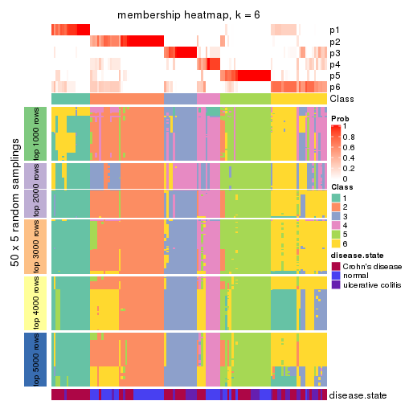</p>

</div>
</div>

As soon as we have had the classes for columns, we can look for signatures
which are significantly different between classes which can be candidate marks
for certain classes. Following are the heatmaps for signatures.


Signature heatmaps where rows are scaled:


<script>
$( function() {
	$( '#tabs-ATC-pam-get-signatures' ).tabs();
} );
</script>
<div id='tabs-ATC-pam-get-signatures'>
<ul>
<li><a href='#tab-ATC-pam-get-signatures-1'>k = 2</a></li>
<li><a href='#tab-ATC-pam-get-signatures-2'>k = 3</a></li>
<li><a href='#tab-ATC-pam-get-signatures-3'>k = 4</a></li>
<li><a href='#tab-ATC-pam-get-signatures-4'>k = 5</a></li>
<li><a href='#tab-ATC-pam-get-signatures-5'>k = 6</a></li>
</ul>
<div id='tab-ATC-pam-get-signatures-1'>
<pre><code class="r">get_signatures(res, k = 2)
</code></pre>

<p></p>

</div>
<div id='tab-ATC-pam-get-signatures-2'>
<pre><code class="r">get_signatures(res, k = 3)
</code></pre>

<p></p>

</div>
<div id='tab-ATC-pam-get-signatures-3'>
<pre><code class="r">get_signatures(res, k = 4)
</code></pre>

<p></p>

</div>
<div id='tab-ATC-pam-get-signatures-4'>
<pre><code class="r">get_signatures(res, k = 5)
</code></pre>

<p></p>

</div>
<div id='tab-ATC-pam-get-signatures-5'>
<pre><code class="r">get_signatures(res, k = 6)
</code></pre>

<p></p>

</div>
</div>


Signature heatmaps where rows are not scaled:


<script>
$( function() {
	$( '#tabs-ATC-pam-get-signatures-no-scale' ).tabs();
} );
</script>
<div id='tabs-ATC-pam-get-signatures-no-scale'>
<ul>
<li><a href='#tab-ATC-pam-get-signatures-no-scale-1'>k = 2</a></li>
<li><a href='#tab-ATC-pam-get-signatures-no-scale-2'>k = 3</a></li>
<li><a href='#tab-ATC-pam-get-signatures-no-scale-3'>k = 4</a></li>
<li><a href='#tab-ATC-pam-get-signatures-no-scale-4'>k = 5</a></li>
<li><a href='#tab-ATC-pam-get-signatures-no-scale-5'>k = 6</a></li>
</ul>
<div id='tab-ATC-pam-get-signatures-no-scale-1'>
<pre><code class="r">get_signatures(res, k = 2, scale_rows = FALSE)
</code></pre>

<p>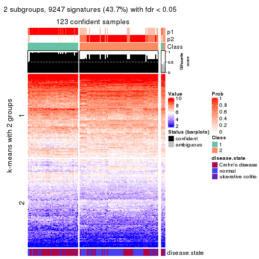</p>

</div>
<div id='tab-ATC-pam-get-signatures-no-scale-2'>
<pre><code class="r">get_signatures(res, k = 3, scale_rows = FALSE)
</code></pre>

<p></p>

</div>
<div id='tab-ATC-pam-get-signatures-no-scale-3'>
<pre><code class="r">get_signatures(res, k = 4, scale_rows = FALSE)
</code></pre>

<p>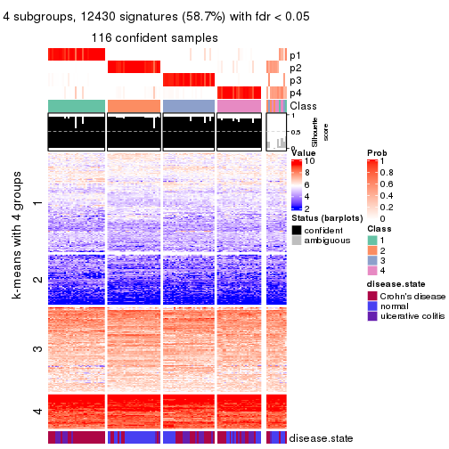</p>

</div>
<div id='tab-ATC-pam-get-signatures-no-scale-4'>
<pre><code class="r">get_signatures(res, k = 5, scale_rows = FALSE)
</code></pre>

<p></p>

</div>
<div id='tab-ATC-pam-get-signatures-no-scale-5'>
<pre><code class="r">get_signatures(res, k = 6, scale_rows = FALSE)
</code></pre>

<p></p>

</div>
</div>


Compare the overlap of signatures from different k:

```r
compare_signatures(res)
```


`get_signature()` returns a data frame invisibly. TO get the list of signatures, the function
call should be assigned to a variable explicitly. In following code, if `plot` argument is set
to `FALSE`, no heatmap is plotted while only the differential analysis is performed.

```r
# code only for demonstration
tb = get_signature(res, k = ..., plot = FALSE)
```

An example of the output of `tb` is:

```
#>   which_row         fdr    mean_1    mean_2 scaled_mean_1 scaled_mean_2 km
#> 1        38 0.042760348  8.373488  9.131774    -0.5533452     0.5164555  1
#> 2        40 0.018707592  7.106213  8.469186    -0.6173731     0.5762149  1
#> 3        55 0.019134737 10.221463 11.207825    -0.6159697     0.5749050  1
#> 4        59 0.006059896  5.921854  7.869574    -0.6899429     0.6439467  1
#> 5        60 0.018055526  8.928898 10.211722    -0.6204761     0.5791110  1
#> 6        98 0.009384629 15.714769 14.887706     0.6635654    -0.6193277  2
...
```

The columns in `tb` are:

1. `which_row`: row indices corresponding to the input matrix.
2. `fdr`: FDR for the differential test. 
3. `mean_x`: The mean value in group x.
4. `scaled_mean_x`: The mean value in group x after rows are scaled.
5. `km`: Row groups if k-means clustering is applied to rows.


UMAP plot which shows how samples are separated.


<script>
$( function() {
	$( '#tabs-ATC-pam-dimension-reduction' ).tabs();
} );
</script>
<div id='tabs-ATC-pam-dimension-reduction'>
<ul>
<li><a href='#tab-ATC-pam-dimension-reduction-1'>k = 2</a></li>
<li><a href='#tab-ATC-pam-dimension-reduction-2'>k = 3</a></li>
<li><a href='#tab-ATC-pam-dimension-reduction-3'>k = 4</a></li>
<li><a href='#tab-ATC-pam-dimension-reduction-4'>k = 5</a></li>
<li><a href='#tab-ATC-pam-dimension-reduction-5'>k = 6</a></li>
</ul>
<div id='tab-ATC-pam-dimension-reduction-1'>
<pre><code class="r">dimension_reduction(res, k = 2, method = &quot;UMAP&quot;)
</code></pre>

<p></p>

</div>
<div id='tab-ATC-pam-dimension-reduction-2'>
<pre><code class="r">dimension_reduction(res, k = 3, method = &quot;UMAP&quot;)
</code></pre>

<p></p>

</div>
<div id='tab-ATC-pam-dimension-reduction-3'>
<pre><code class="r">dimension_reduction(res, k = 4, method = &quot;UMAP&quot;)
</code></pre>

<p></p>

</div>
<div id='tab-ATC-pam-dimension-reduction-4'>
<pre><code class="r">dimension_reduction(res, k = 5, method = &quot;UMAP&quot;)
</code></pre>

<p></p>

</div>
<div id='tab-ATC-pam-dimension-reduction-5'>
<pre><code class="r">dimension_reduction(res, k = 6, method = &quot;UMAP&quot;)
</code></pre>

<p></p>

</div>
</div>


Following heatmap shows how subgroups are split when increasing `k`:

```r
collect_classes(res)
```


Test correlation between subgroups and known annotations. If the known
annotation is numeric, one-way ANOVA test is applied, and if the known
annotation is discrete, chi-squared contingency table test is applied.

```r
test_to_known_factors(res)
```

```
#>           n disease.state(p) k
#> ATC:pam 123         6.17e-07 2
#> ATC:pam 123         3.38e-07 3
#> ATC:pam 116         8.30e-08 4
#> ATC:pam  90         1.40e-08 5
#> ATC:pam  99         4.99e-10 6
```


If matrix rows can be associated to genes, consider to use `functional_enrichment(res,
...)` to perform function enrichment for the signature genes. See [this vignette](http://bioconductor.org/packages/devel/bioc/vignettes/cola/inst/doc/functional_enrichment.html) for more detailed explanations.


 

---------------------------------------------------


### ATC:mclust*


The object with results only for a single top-value method and a single partition method 
can be extracted as:

```r
res = res_list["ATC", "mclust"]
# you can also extract it by
# res = res_list["ATC:mclust"]
```

A summary of `res` and all the functions that can be applied to it:

```r
res
```

```
#> A 'ConsensusPartition' object with k = 2, 3, 4, 5, 6.
#>   On a matrix with 21168 rows and 127 columns.
#>   Top rows (1000, 2000, 3000, 4000, 5000) are extracted by 'ATC' method.
#>   Subgroups are detected by 'mclust' method.
#>   Performed in total 1250 partitions by row resampling.
#>   Best k for subgroups seems to be 6.
#> 
#> Following methods can be applied to this 'ConsensusPartition' object:
#>  [1] "cola_report"             "collect_classes"         "collect_plots"          
#>  [4] "collect_stats"           "colnames"                "compare_signatures"     
#>  [7] "consensus_heatmap"       "dimension_reduction"     "functional_enrichment"  
#> [10] "get_anno_col"            "get_anno"                "get_classes"            
#> [13] "get_consensus"           "get_matrix"              "get_membership"         
#> [16] "get_param"               "get_signatures"          "get_stats"              
#> [19] "is_best_k"               "is_stable_k"             "membership_heatmap"     
#> [22] "ncol"                    "nrow"                    "plot_ecdf"              
#> [25] "rownames"                "select_partition_number" "show"                   
#> [28] "suggest_best_k"          "test_to_known_factors"
```

`collect_plots()` function collects all the plots made from `res` for all `k` (number of partitions)
into one single page to provide an easy and fast comparison between different `k`.

```r
collect_plots(res)
```


The plots are:

- The first row: a plot of the ECDF (empirical cumulative distribution
  function) curves of the consensus matrix for each `k` and the heatmap of
  predicted classes for each `k`.
- The second row: heatmaps of the consensus matrix for each `k`.
- The third row: heatmaps of the membership matrix for each `k`.
- The fouth row: heatmaps of the signatures for each `k`.

All the plots in panels can be made by individual functions and they are
plotted later in this section.

`select_partition_number()` produces several plots showing different
statistics for choosing "optimized" `k`. There are following statistics:

- ECDF curves of the consensus matrix for each `k`;
- 1-PAC. [The PAC
  score](https://en.wikipedia.org/wiki/Consensus_clustering#Over-interpretation_potential_of_consensus_clustering)
  measures the proportion of the ambiguous subgrouping.
- Mean silhouette score.
- Concordance. The mean probability of fiting the consensus class ids in all
  partitions.
- Area increased. Denote $A_k$ as the area under the ECDF curve for current
  `k`, the area increased is defined as $A_k - A_{k-1}$.
- Rand index. The percent of pairs of samples that are both in a same cluster
  or both are not in a same cluster in the partition of k and k-1.
- Jaccard index. The ratio of pairs of samples are both in a same cluster in
  the partition of k and k-1 and the pairs of samples are both in a same
  cluster in the partition k or k-1.

The detailed explanations of these statistics can be found in [the _cola_
vignette](http://bioconductor.org/packages/devel/bioc/vignettes/cola/inst/doc/cola.html#toc_13).

Generally speaking, lower PAC score, higher mean silhouette score or higher
concordance corresponds to better partition. Rand index and Jaccard index
measure how similar the current partition is compared to partition with `k-1`.
If they are too similar, we won't accept `k` is better than `k-1`.

```r
select_partition_number(res)
```


The numeric values for all these statistics can be obtained by `get_stats()`.

```r
get_stats(res)
```

```
#>   k 1-PAC mean_silhouette concordance area_increased  Rand Jaccard
#> 2 2 0.570           0.914       0.940         0.4180 0.591   0.591
#> 3 3 0.692           0.721       0.880         0.5703 0.709   0.522
#> 4 4 0.811           0.791       0.861         0.0845 0.863   0.645
#> 5 5 0.975           0.939       0.975         0.0817 0.903   0.692
#> 6 6 0.919           0.885       0.921         0.0490 0.939   0.748
```

`suggest_best_k()` suggests the best $k$ based on these statistics. The rules are as follows:

- All $k$ with Jaccard index larger than 0.95 are removed because increasing
  $k$ does not provide enough extra information. If all $k$ are removed, it is
  marked as no subgroup is detected.
- For all $k$ with 1-PAC score larger than 0.9, the maximal $k$ is taken as
  the best $k$, and other $k$ are marked as optional $k$.
- If it does not fit the second rule. The $k$ with the maximal vote of the
  highest 1-PAC score, highest mean silhouette, and highest concordance is
  taken as the best $k$.

```r
suggest_best_k(res)
```

```
#> [1] 6
#> attr(,"optional")
#> [1] 5
```

There is also optional best $k$ = 5 that is worth to check.

Following shows the table of the partitions (You need to click the **show/hide
code output** link to see it). The membership matrix (columns with name `p*`)
is inferred by
[`clue::cl_consensus()`](https://www.rdocumentation.org/link/cl_consensus?package=clue)
function with the `SE` method. Basically the value in the membership matrix
represents the probability to belong to a certain group. The finall class
label for an item is determined with the group with highest probability it
belongs to.

In `get_classes()` function, the entropy is calculated from the membership
matrix and the silhouette score is calculated from the consensus matrix.


<script>
$( function() {
	$( '#tabs-ATC-mclust-get-classes' ).tabs();
} );
</script>
<div id='tabs-ATC-mclust-get-classes'>
<ul>
<li><a href='#tab-ATC-mclust-get-classes-1'>k = 2</a></li>
<li><a href='#tab-ATC-mclust-get-classes-2'>k = 3</a></li>
<li><a href='#tab-ATC-mclust-get-classes-3'>k = 4</a></li>
<li><a href='#tab-ATC-mclust-get-classes-4'>k = 5</a></li>
<li><a href='#tab-ATC-mclust-get-classes-5'>k = 6</a></li>
</ul>

<div id='tab-ATC-mclust-get-classes-1'>
<p><a id='tab-ATC-mclust-get-classes-1-a' style='color:#0366d6' href='#'>show/hide code output</a></p>
<pre><code class="r">cbind(get_classes(res, k = 2), get_membership(res, k = 2))
</code></pre>

<pre><code>#&gt;          class entropy silhouette    p1    p2
#&gt; GSM76115     1   0.000      0.913 1.000 0.000
#&gt; GSM76116     1   0.000      0.913 1.000 0.000
#&gt; GSM76117     1   0.000      0.913 1.000 0.000
#&gt; GSM76118     1   0.000      0.913 1.000 0.000
#&gt; GSM76119     2   0.000      0.982 0.000 1.000
#&gt; GSM76120     2   0.000      0.982 0.000 1.000
#&gt; GSM76121     1   0.653      0.888 0.832 0.168
#&gt; GSM76122     1   0.000      0.913 1.000 0.000
#&gt; GSM76123     2   0.000      0.982 0.000 1.000
#&gt; GSM76124     1   0.000      0.913 1.000 0.000
#&gt; GSM76125     2   0.000      0.982 0.000 1.000
#&gt; GSM76126     2   0.000      0.982 0.000 1.000
#&gt; GSM76127     2   0.000      0.982 0.000 1.000
#&gt; GSM76128     2   0.000      0.982 0.000 1.000
#&gt; GSM76129     1   0.000      0.913 1.000 0.000
#&gt; GSM76130     2   0.000      0.982 0.000 1.000
#&gt; GSM76131     1   0.000      0.913 1.000 0.000
#&gt; GSM76132     1   0.000      0.913 1.000 0.000
#&gt; GSM76133     1   0.000      0.913 1.000 0.000
#&gt; GSM76134     1   0.000      0.913 1.000 0.000
#&gt; GSM76135     1   0.000      0.913 1.000 0.000
#&gt; GSM76136     1   0.000      0.913 1.000 0.000
#&gt; GSM76137     1   0.000      0.913 1.000 0.000
#&gt; GSM76138     1   0.000      0.913 1.000 0.000
#&gt; GSM76139     1   0.000      0.913 1.000 0.000
#&gt; GSM76140     1   0.000      0.913 1.000 0.000
#&gt; GSM76141     1   0.000      0.913 1.000 0.000
#&gt; GSM76142     1   0.000      0.913 1.000 0.000
#&gt; GSM76143     1   0.000      0.913 1.000 0.000
#&gt; GSM76144     1   0.000      0.913 1.000 0.000
#&gt; GSM76145     1   0.000      0.913 1.000 0.000
#&gt; GSM76146     1   0.000      0.913 1.000 0.000
#&gt; GSM76147     1   0.000      0.913 1.000 0.000
#&gt; GSM76148     1   0.000      0.913 1.000 0.000
#&gt; GSM76149     1   0.000      0.913 1.000 0.000
#&gt; GSM76150     1   0.000      0.913 1.000 0.000
#&gt; GSM76151     1   0.373      0.904 0.928 0.072
#&gt; GSM76152     1   0.653      0.888 0.832 0.168
#&gt; GSM76153     1   0.000      0.913 1.000 0.000
#&gt; GSM76154     1   0.000      0.913 1.000 0.000
#&gt; GSM76155     1   0.000      0.913 1.000 0.000
#&gt; GSM76156     1   0.000      0.913 1.000 0.000
#&gt; GSM76030     1   0.000      0.913 1.000 0.000
#&gt; GSM76031     1   0.653      0.888 0.832 0.168
#&gt; GSM76032     2   0.000      0.982 0.000 1.000
#&gt; GSM76033     2   0.000      0.982 0.000 1.000
#&gt; GSM76034     1   0.653      0.888 0.832 0.168
#&gt; GSM76035     1   0.653      0.888 0.832 0.168
#&gt; GSM76036     2   0.000      0.982 0.000 1.000
#&gt; GSM76037     1   0.000      0.913 1.000 0.000
#&gt; GSM76038     1   0.653      0.888 0.832 0.168
#&gt; GSM76039     1   0.118      0.911 0.984 0.016
#&gt; GSM76040     2   0.000      0.982 0.000 1.000
#&gt; GSM76041     1   0.653      0.888 0.832 0.168
#&gt; GSM76042     1   0.653      0.888 0.832 0.168
#&gt; GSM76043     1   0.680      0.877 0.820 0.180
#&gt; GSM76044     1   0.000      0.913 1.000 0.000
#&gt; GSM76045     1   0.653      0.888 0.832 0.168
#&gt; GSM76046     2   0.000      0.982 0.000 1.000
#&gt; GSM76047     1   0.653      0.888 0.832 0.168
#&gt; GSM76048     2   0.000      0.982 0.000 1.000
#&gt; GSM76049     1   0.000      0.913 1.000 0.000
#&gt; GSM76050     1   0.653      0.888 0.832 0.168
#&gt; GSM76051     2   0.000      0.982 0.000 1.000
#&gt; GSM76052     2   0.000      0.982 0.000 1.000
#&gt; GSM76053     2   1.000     -0.198 0.488 0.512
#&gt; GSM76054     2   0.000      0.982 0.000 1.000
#&gt; GSM76055     1   0.000      0.913 1.000 0.000
#&gt; GSM76056     1   0.625      0.890 0.844 0.156
#&gt; GSM76057     1   0.653      0.888 0.832 0.168
#&gt; GSM76058     2   0.000      0.982 0.000 1.000
#&gt; GSM76059     1   0.653      0.888 0.832 0.168
#&gt; GSM76060     1   0.118      0.911 0.984 0.016
#&gt; GSM76061     1   0.000      0.913 1.000 0.000
#&gt; GSM76062     1   0.653      0.888 0.832 0.168
#&gt; GSM76063     1   0.605      0.892 0.852 0.148
#&gt; GSM76064     1   0.653      0.888 0.832 0.168
#&gt; GSM76065     1   0.000      0.913 1.000 0.000
#&gt; GSM76066     1   0.653      0.888 0.832 0.168
#&gt; GSM76067     2   0.000      0.982 0.000 1.000
#&gt; GSM76068     2   0.000      0.982 0.000 1.000
#&gt; GSM76069     1   0.653      0.888 0.832 0.168
#&gt; GSM76070     1   0.000      0.913 1.000 0.000
#&gt; GSM76071     1   0.653      0.888 0.832 0.168
#&gt; GSM76072     1   0.653      0.888 0.832 0.168
#&gt; GSM76073     1   0.653      0.888 0.832 0.168
#&gt; GSM76074     1   0.653      0.888 0.832 0.168
#&gt; GSM76075     2   0.000      0.982 0.000 1.000
#&gt; GSM76076     2   0.000      0.982 0.000 1.000
#&gt; GSM76077     1   0.141      0.911 0.980 0.020
#&gt; GSM76078     1   0.653      0.888 0.832 0.168
#&gt; GSM76079     1   0.653      0.888 0.832 0.168
#&gt; GSM76080     2   0.000      0.982 0.000 1.000
#&gt; GSM76081     2   0.000      0.982 0.000 1.000
#&gt; GSM76082     2   0.000      0.982 0.000 1.000
#&gt; GSM76083     2   0.000      0.982 0.000 1.000
#&gt; GSM76084     2   0.327      0.913 0.060 0.940
#&gt; GSM76085     2   0.000      0.982 0.000 1.000
#&gt; GSM76086     2   0.000      0.982 0.000 1.000
#&gt; GSM76087     1   0.000      0.913 1.000 0.000
#&gt; GSM76088     1   0.653      0.888 0.832 0.168
#&gt; GSM76089     1   0.000      0.913 1.000 0.000
#&gt; GSM76090     2   0.000      0.982 0.000 1.000
#&gt; GSM76091     1   0.653      0.888 0.832 0.168
#&gt; GSM76092     1   0.653      0.888 0.832 0.168
#&gt; GSM76093     1   0.653      0.888 0.832 0.168
#&gt; GSM76094     1   0.000      0.913 1.000 0.000
#&gt; GSM76095     1   0.000      0.913 1.000 0.000
#&gt; GSM76096     1   0.653      0.888 0.832 0.168
#&gt; GSM76097     1   0.260      0.908 0.956 0.044
#&gt; GSM76098     2   0.000      0.982 0.000 1.000
#&gt; GSM76099     1   0.653      0.888 0.832 0.168
#&gt; GSM76100     1   0.653      0.888 0.832 0.168
#&gt; GSM76101     1   0.653      0.888 0.832 0.168
#&gt; GSM76102     1   0.653      0.888 0.832 0.168
#&gt; GSM76103     2   0.000      0.982 0.000 1.000
#&gt; GSM76104     2   0.000      0.982 0.000 1.000
#&gt; GSM76105     1   0.000      0.913 1.000 0.000
#&gt; GSM76106     2   0.000      0.982 0.000 1.000
#&gt; GSM76107     2   0.000      0.982 0.000 1.000
#&gt; GSM76108     1   0.000      0.913 1.000 0.000
#&gt; GSM76109     1   0.653      0.888 0.832 0.168
#&gt; GSM76110     1   0.653      0.888 0.832 0.168
#&gt; GSM76111     1   0.653      0.888 0.832 0.168
#&gt; GSM76112     1   0.653      0.888 0.832 0.168
#&gt; GSM76113     1   0.730      0.852 0.796 0.204
#&gt; GSM76114     1   0.653      0.888 0.832 0.168
</code></pre>

<script>
$('#tab-ATC-mclust-get-classes-1-a').parent().next().next().hide();
$('#tab-ATC-mclust-get-classes-1-a').click(function(){
  $('#tab-ATC-mclust-get-classes-1-a').parent().next().next().toggle();
  return(false);
});
</script>
</div>

<div id='tab-ATC-mclust-get-classes-2'>
<p><a id='tab-ATC-mclust-get-classes-2-a' style='color:#0366d6' href='#'>show/hide code output</a></p>
<pre><code class="r">cbind(get_classes(res, k = 3), get_membership(res, k = 3))
</code></pre>

<pre><code>#&gt;          class entropy silhouette    p1    p2    p3
#&gt; GSM76115     2  0.6339     0.3236 0.360 0.632 0.008
#&gt; GSM76116     2  0.6169     0.3283 0.360 0.636 0.004
#&gt; GSM76117     2  0.6228     0.2959 0.372 0.624 0.004
#&gt; GSM76118     1  0.6468     0.2879 0.552 0.444 0.004
#&gt; GSM76119     3  0.1031     0.9283 0.024 0.000 0.976
#&gt; GSM76120     3  0.1031     0.9283 0.024 0.000 0.976
#&gt; GSM76121     1  0.1878     0.7634 0.952 0.044 0.004
#&gt; GSM76122     1  0.6476     0.2776 0.548 0.448 0.004
#&gt; GSM76123     3  0.1031     0.9283 0.024 0.000 0.976
#&gt; GSM76124     1  0.6373     0.3644 0.588 0.408 0.004
#&gt; GSM76125     3  0.1031     0.9283 0.024 0.000 0.976
#&gt; GSM76126     3  0.1620     0.9313 0.024 0.012 0.964
#&gt; GSM76127     3  0.1031     0.9283 0.024 0.000 0.976
#&gt; GSM76128     3  0.1163     0.9277 0.028 0.000 0.972
#&gt; GSM76129     1  0.6518     0.1706 0.512 0.484 0.004
#&gt; GSM76130     3  0.1031     0.9283 0.024 0.000 0.976
#&gt; GSM76131     2  0.0000     0.8615 0.000 1.000 0.000
#&gt; GSM76132     2  0.0000     0.8615 0.000 1.000 0.000
#&gt; GSM76133     2  0.0000     0.8615 0.000 1.000 0.000
#&gt; GSM76134     2  0.0000     0.8615 0.000 1.000 0.000
#&gt; GSM76135     2  0.0000     0.8615 0.000 1.000 0.000
#&gt; GSM76136     2  0.3966     0.7425 0.100 0.876 0.024
#&gt; GSM76137     2  0.0000     0.8615 0.000 1.000 0.000
#&gt; GSM76138     2  0.0747     0.8515 0.016 0.984 0.000
#&gt; GSM76139     2  0.0000     0.8615 0.000 1.000 0.000
#&gt; GSM76140     1  0.6398     0.3488 0.580 0.416 0.004
#&gt; GSM76141     2  0.0000     0.8615 0.000 1.000 0.000
#&gt; GSM76142     2  0.0000     0.8615 0.000 1.000 0.000
#&gt; GSM76143     2  0.0000     0.8615 0.000 1.000 0.000
#&gt; GSM76144     2  0.0000     0.8615 0.000 1.000 0.000
#&gt; GSM76145     2  0.8372     0.3011 0.100 0.564 0.336
#&gt; GSM76146     2  0.0000     0.8615 0.000 1.000 0.000
#&gt; GSM76147     2  0.0000     0.8615 0.000 1.000 0.000
#&gt; GSM76148     2  0.0000     0.8615 0.000 1.000 0.000
#&gt; GSM76149     2  0.0000     0.8615 0.000 1.000 0.000
#&gt; GSM76150     2  0.0000     0.8615 0.000 1.000 0.000
#&gt; GSM76151     2  0.8573     0.2016 0.104 0.524 0.372
#&gt; GSM76152     1  0.0237     0.7856 0.996 0.000 0.004
#&gt; GSM76153     2  0.0000     0.8615 0.000 1.000 0.000
#&gt; GSM76154     2  0.0000     0.8615 0.000 1.000 0.000
#&gt; GSM76155     2  0.0592     0.8535 0.012 0.988 0.000
#&gt; GSM76156     2  0.0237     0.8591 0.004 0.996 0.000
#&gt; GSM76030     2  0.1399     0.8422 0.028 0.968 0.004
#&gt; GSM76031     1  0.0000     0.7877 1.000 0.000 0.000
#&gt; GSM76032     3  0.0829     0.9375 0.004 0.012 0.984
#&gt; GSM76033     3  0.0829     0.9375 0.004 0.012 0.984
#&gt; GSM76034     2  0.9920     0.0421 0.272 0.368 0.360
#&gt; GSM76035     1  0.6724     0.0879 0.568 0.012 0.420
#&gt; GSM76036     3  0.0829     0.9375 0.004 0.012 0.984
#&gt; GSM76037     2  0.6209     0.3075 0.368 0.628 0.004
#&gt; GSM76038     1  0.0000     0.7877 1.000 0.000 0.000
#&gt; GSM76039     1  0.6264     0.4133 0.616 0.380 0.004
#&gt; GSM76040     3  0.0829     0.9375 0.004 0.012 0.984
#&gt; GSM76041     1  0.0000     0.7877 1.000 0.000 0.000
#&gt; GSM76042     1  0.5517     0.5663 0.728 0.268 0.004
#&gt; GSM76043     3  0.6735     0.3788 0.424 0.012 0.564
#&gt; GSM76044     1  0.6489     0.2562 0.540 0.456 0.004
#&gt; GSM76045     1  0.0000     0.7877 1.000 0.000 0.000
#&gt; GSM76046     3  0.1620     0.9313 0.024 0.012 0.964
#&gt; GSM76047     1  0.2261     0.7403 0.932 0.000 0.068
#&gt; GSM76048     3  0.0829     0.9375 0.004 0.012 0.984
#&gt; GSM76049     2  0.6209     0.3075 0.368 0.628 0.004
#&gt; GSM76050     1  0.0000     0.7877 1.000 0.000 0.000
#&gt; GSM76051     3  0.0829     0.9375 0.004 0.012 0.984
#&gt; GSM76052     3  0.0829     0.9363 0.004 0.012 0.984
#&gt; GSM76053     3  0.8129     0.5215 0.124 0.244 0.632
#&gt; GSM76054     3  0.0829     0.9363 0.004 0.012 0.984
#&gt; GSM76055     1  0.6468     0.2879 0.552 0.444 0.004
#&gt; GSM76056     1  0.6159     0.6269 0.756 0.196 0.048
#&gt; GSM76057     1  0.7271     0.2839 0.608 0.040 0.352
#&gt; GSM76058     3  0.0829     0.9375 0.004 0.012 0.984
#&gt; GSM76059     1  0.0000     0.7877 1.000 0.000 0.000
#&gt; GSM76060     1  0.9684     0.1276 0.428 0.220 0.352
#&gt; GSM76061     2  0.2066     0.8150 0.060 0.940 0.000
#&gt; GSM76062     1  0.0000     0.7877 1.000 0.000 0.000
#&gt; GSM76063     3  0.8404     0.4107 0.120 0.288 0.592
#&gt; GSM76064     1  0.0000     0.7877 1.000 0.000 0.000
#&gt; GSM76065     2  0.4931     0.5884 0.232 0.768 0.000
#&gt; GSM76066     1  0.0000     0.7877 1.000 0.000 0.000
#&gt; GSM76067     3  0.0829     0.9375 0.004 0.012 0.984
#&gt; GSM76068     3  0.0829     0.9375 0.004 0.012 0.984
#&gt; GSM76069     1  0.0000     0.7877 1.000 0.000 0.000
#&gt; GSM76070     2  0.0000     0.8615 0.000 1.000 0.000
#&gt; GSM76071     1  0.0000     0.7877 1.000 0.000 0.000
#&gt; GSM76072     1  0.0000     0.7877 1.000 0.000 0.000
#&gt; GSM76073     1  0.0000     0.7877 1.000 0.000 0.000
#&gt; GSM76074     1  0.0000     0.7877 1.000 0.000 0.000
#&gt; GSM76075     3  0.0829     0.9375 0.004 0.012 0.984
#&gt; GSM76076     3  0.0829     0.9375 0.004 0.012 0.984
#&gt; GSM76077     1  0.6369     0.5012 0.668 0.316 0.016
#&gt; GSM76078     3  0.6721     0.4576 0.380 0.016 0.604
#&gt; GSM76079     1  0.0000     0.7877 1.000 0.000 0.000
#&gt; GSM76080     3  0.0829     0.9363 0.004 0.012 0.984
#&gt; GSM76081     3  0.0829     0.9363 0.004 0.012 0.984
#&gt; GSM76082     3  0.0829     0.9375 0.004 0.012 0.984
#&gt; GSM76083     3  0.0829     0.9375 0.004 0.012 0.984
#&gt; GSM76084     3  0.6902     0.6764 0.100 0.168 0.732
#&gt; GSM76085     3  0.0829     0.9375 0.004 0.012 0.984
#&gt; GSM76086     3  0.0829     0.9375 0.004 0.012 0.984
#&gt; GSM76087     2  0.0000     0.8615 0.000 1.000 0.000
#&gt; GSM76088     1  0.6404     0.3189 0.644 0.012 0.344
#&gt; GSM76089     2  0.0592     0.8535 0.012 0.988 0.000
#&gt; GSM76090     3  0.0829     0.9375 0.004 0.012 0.984
#&gt; GSM76091     1  0.0000     0.7877 1.000 0.000 0.000
#&gt; GSM76092     1  0.0000     0.7877 1.000 0.000 0.000
#&gt; GSM76093     1  0.0000     0.7877 1.000 0.000 0.000
#&gt; GSM76094     1  0.6442     0.3152 0.564 0.432 0.004
#&gt; GSM76095     1  0.6373     0.3644 0.588 0.408 0.004
#&gt; GSM76096     1  0.1337     0.7777 0.972 0.016 0.012
#&gt; GSM76097     1  0.5956     0.4965 0.672 0.324 0.004
#&gt; GSM76098     3  0.0592     0.9357 0.000 0.012 0.988
#&gt; GSM76099     1  0.0000     0.7877 1.000 0.000 0.000
#&gt; GSM76100     1  0.0000     0.7877 1.000 0.000 0.000
#&gt; GSM76101     1  0.0000     0.7877 1.000 0.000 0.000
#&gt; GSM76102     1  0.5431     0.4570 0.716 0.000 0.284
#&gt; GSM76103     3  0.0829     0.9375 0.004 0.012 0.984
#&gt; GSM76104     3  0.0829     0.9364 0.004 0.012 0.984
#&gt; GSM76105     1  0.6468     0.2879 0.552 0.444 0.004
#&gt; GSM76106     3  0.1620     0.9313 0.024 0.012 0.964
#&gt; GSM76107     3  0.1031     0.9283 0.024 0.000 0.976
#&gt; GSM76108     1  0.6386     0.3569 0.584 0.412 0.004
#&gt; GSM76109     1  0.0000     0.7877 1.000 0.000 0.000
#&gt; GSM76110     1  0.0000     0.7877 1.000 0.000 0.000
#&gt; GSM76111     1  0.0000     0.7877 1.000 0.000 0.000
#&gt; GSM76112     1  0.0000     0.7877 1.000 0.000 0.000
#&gt; GSM76113     3  0.4865     0.8083 0.136 0.032 0.832
#&gt; GSM76114     1  0.0000     0.7877 1.000 0.000 0.000
</code></pre>

<script>
$('#tab-ATC-mclust-get-classes-2-a').parent().next().next().hide();
$('#tab-ATC-mclust-get-classes-2-a').click(function(){
  $('#tab-ATC-mclust-get-classes-2-a').parent().next().next().toggle();
  return(false);
});
</script>
</div>

<div id='tab-ATC-mclust-get-classes-3'>
<p><a id='tab-ATC-mclust-get-classes-3-a' style='color:#0366d6' href='#'>show/hide code output</a></p>
<pre><code class="r">cbind(get_classes(res, k = 4), get_membership(res, k = 4))
</code></pre>

<pre><code>#&gt;          class entropy silhouette    p1    p2    p3    p4
#&gt; GSM76115     1  0.4898     0.2727 0.584 0.416 0.000 0.000
#&gt; GSM76116     1  0.3486     0.4849 0.812 0.188 0.000 0.000
#&gt; GSM76117     1  0.2011     0.5929 0.920 0.080 0.000 0.000
#&gt; GSM76118     1  0.1940     0.5964 0.924 0.076 0.000 0.000
#&gt; GSM76119     4  0.4941     1.0000 0.000 0.000 0.436 0.564
#&gt; GSM76120     4  0.4941     1.0000 0.000 0.000 0.436 0.564
#&gt; GSM76121     1  0.7490     0.7142 0.528 0.024 0.112 0.336
#&gt; GSM76122     1  0.1940     0.5964 0.924 0.076 0.000 0.000
#&gt; GSM76123     4  0.4941     1.0000 0.000 0.000 0.436 0.564
#&gt; GSM76124     1  0.1867     0.5978 0.928 0.072 0.000 0.000
#&gt; GSM76125     4  0.4941     1.0000 0.000 0.000 0.436 0.564
#&gt; GSM76126     3  0.1022     0.8983 0.000 0.000 0.968 0.032
#&gt; GSM76127     4  0.4941     1.0000 0.000 0.000 0.436 0.564
#&gt; GSM76128     4  0.4941     1.0000 0.000 0.000 0.436 0.564
#&gt; GSM76129     1  0.1940     0.5964 0.924 0.076 0.000 0.000
#&gt; GSM76130     4  0.4941     1.0000 0.000 0.000 0.436 0.564
#&gt; GSM76131     2  0.0000     0.9030 0.000 1.000 0.000 0.000
#&gt; GSM76132     2  0.0000     0.9030 0.000 1.000 0.000 0.000
#&gt; GSM76133     2  0.0000     0.9030 0.000 1.000 0.000 0.000
#&gt; GSM76134     2  0.0000     0.9030 0.000 1.000 0.000 0.000
#&gt; GSM76135     2  0.0000     0.9030 0.000 1.000 0.000 0.000
#&gt; GSM76136     2  0.0336     0.8984 0.000 0.992 0.008 0.000
#&gt; GSM76137     2  0.0000     0.9030 0.000 1.000 0.000 0.000
#&gt; GSM76138     2  0.0000     0.9030 0.000 1.000 0.000 0.000
#&gt; GSM76139     2  0.0000     0.9030 0.000 1.000 0.000 0.000
#&gt; GSM76140     1  0.1940     0.5964 0.924 0.076 0.000 0.000
#&gt; GSM76141     2  0.0000     0.9030 0.000 1.000 0.000 0.000
#&gt; GSM76142     2  0.0000     0.9030 0.000 1.000 0.000 0.000
#&gt; GSM76143     2  0.0000     0.9030 0.000 1.000 0.000 0.000
#&gt; GSM76144     2  0.0000     0.9030 0.000 1.000 0.000 0.000
#&gt; GSM76145     2  0.1302     0.8738 0.000 0.956 0.044 0.000
#&gt; GSM76146     2  0.0000     0.9030 0.000 1.000 0.000 0.000
#&gt; GSM76147     2  0.0000     0.9030 0.000 1.000 0.000 0.000
#&gt; GSM76148     2  0.0000     0.9030 0.000 1.000 0.000 0.000
#&gt; GSM76149     2  0.0000     0.9030 0.000 1.000 0.000 0.000
#&gt; GSM76150     2  0.0000     0.9030 0.000 1.000 0.000 0.000
#&gt; GSM76151     2  0.1867     0.8503 0.000 0.928 0.072 0.000
#&gt; GSM76152     1  0.4941     0.7823 0.564 0.000 0.000 0.436
#&gt; GSM76153     2  0.0000     0.9030 0.000 1.000 0.000 0.000
#&gt; GSM76154     2  0.0000     0.9030 0.000 1.000 0.000 0.000
#&gt; GSM76155     2  0.0000     0.9030 0.000 1.000 0.000 0.000
#&gt; GSM76156     2  0.0000     0.9030 0.000 1.000 0.000 0.000
#&gt; GSM76030     2  0.1576     0.8706 0.048 0.948 0.004 0.000
#&gt; GSM76031     1  0.5657     0.7740 0.540 0.000 0.024 0.436
#&gt; GSM76032     3  0.0336     0.9344 0.000 0.000 0.992 0.008
#&gt; GSM76033     3  0.0000     0.9426 0.000 0.000 1.000 0.000
#&gt; GSM76034     2  0.3400     0.7206 0.000 0.820 0.180 0.000
#&gt; GSM76035     3  0.0921     0.8928 0.028 0.000 0.972 0.000
#&gt; GSM76036     3  0.0000     0.9426 0.000 0.000 1.000 0.000
#&gt; GSM76037     1  0.3907     0.4014 0.768 0.232 0.000 0.000
#&gt; GSM76038     1  0.6055     0.7631 0.520 0.000 0.044 0.436
#&gt; GSM76039     1  0.1716     0.6002 0.936 0.064 0.000 0.000
#&gt; GSM76040     3  0.0000     0.9426 0.000 0.000 1.000 0.000
#&gt; GSM76041     1  0.5827     0.7700 0.532 0.000 0.032 0.436
#&gt; GSM76042     1  0.8001     0.7081 0.508 0.060 0.100 0.332
#&gt; GSM76043     3  0.0188     0.9370 0.004 0.000 0.996 0.000
#&gt; GSM76044     1  0.1940     0.5964 0.924 0.076 0.000 0.000
#&gt; GSM76045     1  0.5360     0.7789 0.552 0.000 0.012 0.436
#&gt; GSM76046     3  0.0000     0.9426 0.000 0.000 1.000 0.000
#&gt; GSM76047     1  0.8613     0.6212 0.428 0.048 0.196 0.328
#&gt; GSM76048     3  0.0000     0.9426 0.000 0.000 1.000 0.000
#&gt; GSM76049     2  0.4222     0.6751 0.272 0.728 0.000 0.000
#&gt; GSM76050     1  0.5466     0.7775 0.548 0.000 0.016 0.436
#&gt; GSM76051     3  0.0000     0.9426 0.000 0.000 1.000 0.000
#&gt; GSM76052     3  0.0000     0.9426 0.000 0.000 1.000 0.000
#&gt; GSM76053     3  0.1722     0.8441 0.008 0.048 0.944 0.000
#&gt; GSM76054     3  0.0000     0.9426 0.000 0.000 1.000 0.000
#&gt; GSM76055     1  0.1940     0.5964 0.924 0.076 0.000 0.000
#&gt; GSM76056     2  0.7219     0.1244 0.100 0.484 0.012 0.404
#&gt; GSM76057     2  0.8463     0.2340 0.084 0.484 0.116 0.316
#&gt; GSM76058     3  0.0000     0.9426 0.000 0.000 1.000 0.000
#&gt; GSM76059     1  0.4941     0.7823 0.564 0.000 0.000 0.436
#&gt; GSM76060     2  0.4387     0.7338 0.052 0.804 0.144 0.000
#&gt; GSM76061     2  0.1302     0.8747 0.044 0.956 0.000 0.000
#&gt; GSM76062     1  0.4941     0.7823 0.564 0.000 0.000 0.436
#&gt; GSM76063     2  0.4999    -0.0673 0.000 0.508 0.492 0.000
#&gt; GSM76064     1  0.6702     0.7295 0.476 0.000 0.088 0.436
#&gt; GSM76065     2  0.1867     0.8523 0.072 0.928 0.000 0.000
#&gt; GSM76066     1  0.6602     0.7366 0.484 0.000 0.080 0.436
#&gt; GSM76067     3  0.0000     0.9426 0.000 0.000 1.000 0.000
#&gt; GSM76068     3  0.0000     0.9426 0.000 0.000 1.000 0.000
#&gt; GSM76069     1  0.4941     0.7823 0.564 0.000 0.000 0.436
#&gt; GSM76070     2  0.0000     0.9030 0.000 1.000 0.000 0.000
#&gt; GSM76071     1  0.5360     0.7789 0.552 0.000 0.012 0.436
#&gt; GSM76072     1  0.4941     0.7823 0.564 0.000 0.000 0.436
#&gt; GSM76073     1  0.4941     0.7823 0.564 0.000 0.000 0.436
#&gt; GSM76074     1  0.4941     0.7823 0.564 0.000 0.000 0.436
#&gt; GSM76075     3  0.0000     0.9426 0.000 0.000 1.000 0.000
#&gt; GSM76076     3  0.0000     0.9426 0.000 0.000 1.000 0.000
#&gt; GSM76077     2  0.3966     0.7823 0.072 0.840 0.088 0.000
#&gt; GSM76078     3  0.4916    -0.0619 0.000 0.424 0.576 0.000
#&gt; GSM76079     1  0.4941     0.7823 0.564 0.000 0.000 0.436
#&gt; GSM76080     3  0.1022     0.8885 0.000 0.032 0.968 0.000
#&gt; GSM76081     3  0.0592     0.9254 0.000 0.000 0.984 0.016
#&gt; GSM76082     3  0.0000     0.9426 0.000 0.000 1.000 0.000
#&gt; GSM76083     3  0.0000     0.9426 0.000 0.000 1.000 0.000
#&gt; GSM76084     3  0.1389     0.8605 0.000 0.048 0.952 0.000
#&gt; GSM76085     3  0.0000     0.9426 0.000 0.000 1.000 0.000
#&gt; GSM76086     3  0.0000     0.9426 0.000 0.000 1.000 0.000
#&gt; GSM76087     2  0.0000     0.9030 0.000 1.000 0.000 0.000
#&gt; GSM76088     2  0.7903     0.0597 0.124 0.448 0.032 0.396
#&gt; GSM76089     2  0.0000     0.9030 0.000 1.000 0.000 0.000
#&gt; GSM76090     3  0.0000     0.9426 0.000 0.000 1.000 0.000
#&gt; GSM76091     1  0.6750     0.7254 0.472 0.000 0.092 0.436
#&gt; GSM76092     1  0.4941     0.7823 0.564 0.000 0.000 0.436
#&gt; GSM76093     1  0.4941     0.7823 0.564 0.000 0.000 0.436
#&gt; GSM76094     1  0.1940     0.5964 0.924 0.076 0.000 0.000
#&gt; GSM76095     1  0.1940     0.5964 0.924 0.076 0.000 0.000
#&gt; GSM76096     1  0.4955     0.7796 0.556 0.000 0.000 0.444
#&gt; GSM76097     1  0.3081     0.6357 0.888 0.048 0.000 0.064
#&gt; GSM76098     3  0.0000     0.9426 0.000 0.000 1.000 0.000
#&gt; GSM76099     1  0.5564     0.7761 0.544 0.000 0.020 0.436
#&gt; GSM76100     1  0.4941     0.7823 0.564 0.000 0.000 0.436
#&gt; GSM76101     1  0.4941     0.7823 0.564 0.000 0.000 0.436
#&gt; GSM76102     1  0.7687     0.4655 0.448 0.000 0.312 0.240
#&gt; GSM76103     3  0.0000     0.9426 0.000 0.000 1.000 0.000
#&gt; GSM76104     3  0.0000     0.9426 0.000 0.000 1.000 0.000
#&gt; GSM76105     1  0.1940     0.5964 0.924 0.076 0.000 0.000
#&gt; GSM76106     3  0.2032     0.8486 0.000 0.036 0.936 0.028
#&gt; GSM76107     4  0.4941     1.0000 0.000 0.000 0.436 0.564
#&gt; GSM76108     1  0.1940     0.5964 0.924 0.076 0.000 0.000
#&gt; GSM76109     1  0.4941     0.7823 0.564 0.000 0.000 0.436
#&gt; GSM76110     1  0.4941     0.7823 0.564 0.000 0.000 0.436
#&gt; GSM76111     1  0.4941     0.7823 0.564 0.000 0.000 0.436
#&gt; GSM76112     1  0.6653     0.7332 0.480 0.000 0.084 0.436
#&gt; GSM76113     3  0.1302     0.8643 0.000 0.044 0.956 0.000
#&gt; GSM76114     1  0.6380     0.7493 0.500 0.000 0.064 0.436
</code></pre>

<script>
$('#tab-ATC-mclust-get-classes-3-a').parent().next().next().hide();
$('#tab-ATC-mclust-get-classes-3-a').click(function(){
  $('#tab-ATC-mclust-get-classes-3-a').parent().next().next().toggle();
  return(false);
});
</script>
</div>

<div id='tab-ATC-mclust-get-classes-4'>
<p><a id='tab-ATC-mclust-get-classes-4-a' style='color:#0366d6' href='#'>show/hide code output</a></p>
<pre><code class="r">cbind(get_classes(res, k = 5), get_membership(res, k = 5))
</code></pre>

<pre><code>#&gt;          class entropy silhouette    p1    p2    p3    p4    p5
#&gt; GSM76115     5  0.0000      0.960 0.000 0.000 0.000 0.000 1.000
#&gt; GSM76116     5  0.0000      0.960 0.000 0.000 0.000 0.000 1.000
#&gt; GSM76117     5  0.0000      0.960 0.000 0.000 0.000 0.000 1.000
#&gt; GSM76118     5  0.0000      0.960 0.000 0.000 0.000 0.000 1.000
#&gt; GSM76119     4  0.0000      0.973 0.000 0.000 0.000 1.000 0.000
#&gt; GSM76120     4  0.0000      0.973 0.000 0.000 0.000 1.000 0.000
#&gt; GSM76121     5  0.1981      0.882 0.028 0.000 0.048 0.000 0.924
#&gt; GSM76122     5  0.0000      0.960 0.000 0.000 0.000 0.000 1.000
#&gt; GSM76123     4  0.0000      0.973 0.000 0.000 0.000 1.000 0.000
#&gt; GSM76124     5  0.0000      0.960 0.000 0.000 0.000 0.000 1.000
#&gt; GSM76125     4  0.0000      0.973 0.000 0.000 0.000 1.000 0.000
#&gt; GSM76126     3  0.0609      0.956 0.000 0.000 0.980 0.020 0.000
#&gt; GSM76127     4  0.0000      0.973 0.000 0.000 0.000 1.000 0.000
#&gt; GSM76128     4  0.1608      0.917 0.000 0.000 0.072 0.928 0.000
#&gt; GSM76129     5  0.0000      0.960 0.000 0.000 0.000 0.000 1.000
#&gt; GSM76130     4  0.0000      0.973 0.000 0.000 0.000 1.000 0.000
#&gt; GSM76131     2  0.0000      0.964 0.000 1.000 0.000 0.000 0.000
#&gt; GSM76132     2  0.0000      0.964 0.000 1.000 0.000 0.000 0.000
#&gt; GSM76133     2  0.0000      0.964 0.000 1.000 0.000 0.000 0.000
#&gt; GSM76134     2  0.0000      0.964 0.000 1.000 0.000 0.000 0.000
#&gt; GSM76135     2  0.0000      0.964 0.000 1.000 0.000 0.000 0.000
#&gt; GSM76136     2  0.0000      0.964 0.000 1.000 0.000 0.000 0.000
#&gt; GSM76137     2  0.0000      0.964 0.000 1.000 0.000 0.000 0.000
#&gt; GSM76138     2  0.0000      0.964 0.000 1.000 0.000 0.000 0.000
#&gt; GSM76139     2  0.0000      0.964 0.000 1.000 0.000 0.000 0.000
#&gt; GSM76140     5  0.0000      0.960 0.000 0.000 0.000 0.000 1.000
#&gt; GSM76141     2  0.0000      0.964 0.000 1.000 0.000 0.000 0.000
#&gt; GSM76142     2  0.0000      0.964 0.000 1.000 0.000 0.000 0.000
#&gt; GSM76143     2  0.0000      0.964 0.000 1.000 0.000 0.000 0.000
#&gt; GSM76144     2  0.0000      0.964 0.000 1.000 0.000 0.000 0.000
#&gt; GSM76145     2  0.0000      0.964 0.000 1.000 0.000 0.000 0.000
#&gt; GSM76146     2  0.0000      0.964 0.000 1.000 0.000 0.000 0.000
#&gt; GSM76147     2  0.0000      0.964 0.000 1.000 0.000 0.000 0.000
#&gt; GSM76148     2  0.0000      0.964 0.000 1.000 0.000 0.000 0.000
#&gt; GSM76149     2  0.0000      0.964 0.000 1.000 0.000 0.000 0.000
#&gt; GSM76150     2  0.0000      0.964 0.000 1.000 0.000 0.000 0.000
#&gt; GSM76151     2  0.0000      0.964 0.000 1.000 0.000 0.000 0.000
#&gt; GSM76152     5  0.4287      0.106 0.460 0.000 0.000 0.000 0.540
#&gt; GSM76153     2  0.0000      0.964 0.000 1.000 0.000 0.000 0.000
#&gt; GSM76154     2  0.0000      0.964 0.000 1.000 0.000 0.000 0.000
#&gt; GSM76155     2  0.0000      0.964 0.000 1.000 0.000 0.000 0.000
#&gt; GSM76156     2  0.0000      0.964 0.000 1.000 0.000 0.000 0.000
#&gt; GSM76030     2  0.0000      0.964 0.000 1.000 0.000 0.000 0.000
#&gt; GSM76031     1  0.1965      0.888 0.904 0.000 0.000 0.000 0.096
#&gt; GSM76032     3  0.0000      0.972 0.000 0.000 1.000 0.000 0.000
#&gt; GSM76033     3  0.0000      0.972 0.000 0.000 1.000 0.000 0.000
#&gt; GSM76034     2  0.1608      0.903 0.000 0.928 0.072 0.000 0.000
#&gt; GSM76035     3  0.0000      0.972 0.000 0.000 1.000 0.000 0.000
#&gt; GSM76036     3  0.0000      0.972 0.000 0.000 1.000 0.000 0.000
#&gt; GSM76037     5  0.0000      0.960 0.000 0.000 0.000 0.000 1.000
#&gt; GSM76038     1  0.0000      0.978 1.000 0.000 0.000 0.000 0.000
#&gt; GSM76039     5  0.0000      0.960 0.000 0.000 0.000 0.000 1.000
#&gt; GSM76040     3  0.0000      0.972 0.000 0.000 1.000 0.000 0.000
#&gt; GSM76041     1  0.0000      0.978 1.000 0.000 0.000 0.000 0.000
#&gt; GSM76042     5  0.1579      0.907 0.032 0.000 0.024 0.000 0.944
#&gt; GSM76043     3  0.0000      0.972 0.000 0.000 1.000 0.000 0.000
#&gt; GSM76044     5  0.0000      0.960 0.000 0.000 0.000 0.000 1.000
#&gt; GSM76045     1  0.0000      0.978 1.000 0.000 0.000 0.000 0.000
#&gt; GSM76046     3  0.0000      0.972 0.000 0.000 1.000 0.000 0.000
#&gt; GSM76047     2  0.5422      0.388 0.348 0.580 0.072 0.000 0.000
#&gt; GSM76048     3  0.0000      0.972 0.000 0.000 1.000 0.000 0.000
#&gt; GSM76049     2  0.3177      0.728 0.000 0.792 0.000 0.000 0.208
#&gt; GSM76050     1  0.0000      0.978 1.000 0.000 0.000 0.000 0.000
#&gt; GSM76051     3  0.0000      0.972 0.000 0.000 1.000 0.000 0.000
#&gt; GSM76052     3  0.0000      0.972 0.000 0.000 1.000 0.000 0.000
#&gt; GSM76053     2  0.1608      0.903 0.000 0.928 0.072 0.000 0.000
#&gt; GSM76054     3  0.0000      0.972 0.000 0.000 1.000 0.000 0.000
#&gt; GSM76055     5  0.0000      0.960 0.000 0.000 0.000 0.000 1.000
#&gt; GSM76056     2  0.1831      0.895 0.076 0.920 0.004 0.000 0.000
#&gt; GSM76057     2  0.1608      0.903 0.000 0.928 0.072 0.000 0.000
#&gt; GSM76058     3  0.0000      0.972 0.000 0.000 1.000 0.000 0.000
#&gt; GSM76059     1  0.0000      0.978 1.000 0.000 0.000 0.000 0.000
#&gt; GSM76060     2  0.1608      0.903 0.000 0.928 0.072 0.000 0.000
#&gt; GSM76061     2  0.0000      0.964 0.000 1.000 0.000 0.000 0.000
#&gt; GSM76062     1  0.0000      0.978 1.000 0.000 0.000 0.000 0.000
#&gt; GSM76063     2  0.1608      0.903 0.000 0.928 0.072 0.000 0.000
#&gt; GSM76064     1  0.0000      0.978 1.000 0.000 0.000 0.000 0.000
#&gt; GSM76065     2  0.0000      0.964 0.000 1.000 0.000 0.000 0.000
#&gt; GSM76066     1  0.0000      0.978 1.000 0.000 0.000 0.000 0.000
#&gt; GSM76067     3  0.0000      0.972 0.000 0.000 1.000 0.000 0.000
#&gt; GSM76068     3  0.0000      0.972 0.000 0.000 1.000 0.000 0.000
#&gt; GSM76069     1  0.0000      0.978 1.000 0.000 0.000 0.000 0.000
#&gt; GSM76070     2  0.0000      0.964 0.000 1.000 0.000 0.000 0.000
#&gt; GSM76071     1  0.0000      0.978 1.000 0.000 0.000 0.000 0.000
#&gt; GSM76072     1  0.0000      0.978 1.000 0.000 0.000 0.000 0.000
#&gt; GSM76073     1  0.0000      0.978 1.000 0.000 0.000 0.000 0.000
#&gt; GSM76074     1  0.2230      0.866 0.884 0.000 0.000 0.000 0.116
#&gt; GSM76075     3  0.0000      0.972 0.000 0.000 1.000 0.000 0.000
#&gt; GSM76076     3  0.0000      0.972 0.000 0.000 1.000 0.000 0.000
#&gt; GSM76077     2  0.0703      0.945 0.000 0.976 0.024 0.000 0.000
#&gt; GSM76078     3  0.2690      0.771 0.000 0.156 0.844 0.000 0.000
#&gt; GSM76079     1  0.0000      0.978 1.000 0.000 0.000 0.000 0.000
#&gt; GSM76080     3  0.0000      0.972 0.000 0.000 1.000 0.000 0.000
#&gt; GSM76081     3  0.0000      0.972 0.000 0.000 1.000 0.000 0.000
#&gt; GSM76082     3  0.0000      0.972 0.000 0.000 1.000 0.000 0.000
#&gt; GSM76083     3  0.0000      0.972 0.000 0.000 1.000 0.000 0.000
#&gt; GSM76084     3  0.1043      0.929 0.000 0.040 0.960 0.000 0.000
#&gt; GSM76085     3  0.0000      0.972 0.000 0.000 1.000 0.000 0.000
#&gt; GSM76086     3  0.0000      0.972 0.000 0.000 1.000 0.000 0.000
#&gt; GSM76087     2  0.0000      0.964 0.000 1.000 0.000 0.000 0.000
#&gt; GSM76088     2  0.2773      0.843 0.112 0.868 0.020 0.000 0.000
#&gt; GSM76089     2  0.0000      0.964 0.000 1.000 0.000 0.000 0.000
#&gt; GSM76090     3  0.0000      0.972 0.000 0.000 1.000 0.000 0.000
#&gt; GSM76091     1  0.0000      0.978 1.000 0.000 0.000 0.000 0.000
#&gt; GSM76092     1  0.0000      0.978 1.000 0.000 0.000 0.000 0.000
#&gt; GSM76093     1  0.0000      0.978 1.000 0.000 0.000 0.000 0.000
#&gt; GSM76094     5  0.0000      0.960 0.000 0.000 0.000 0.000 1.000
#&gt; GSM76095     5  0.0000      0.960 0.000 0.000 0.000 0.000 1.000
#&gt; GSM76096     1  0.3242      0.736 0.784 0.000 0.000 0.000 0.216
#&gt; GSM76097     5  0.0000      0.960 0.000 0.000 0.000 0.000 1.000
#&gt; GSM76098     3  0.0000      0.972 0.000 0.000 1.000 0.000 0.000
#&gt; GSM76099     1  0.0000      0.978 1.000 0.000 0.000 0.000 0.000
#&gt; GSM76100     1  0.0000      0.978 1.000 0.000 0.000 0.000 0.000
#&gt; GSM76101     1  0.0000      0.978 1.000 0.000 0.000 0.000 0.000
#&gt; GSM76102     3  0.2561      0.794 0.144 0.000 0.856 0.000 0.000
#&gt; GSM76103     3  0.0000      0.972 0.000 0.000 1.000 0.000 0.000
#&gt; GSM76104     3  0.0000      0.972 0.000 0.000 1.000 0.000 0.000
#&gt; GSM76105     5  0.0000      0.960 0.000 0.000 0.000 0.000 1.000
#&gt; GSM76106     3  0.3210      0.732 0.000 0.000 0.788 0.212 0.000
#&gt; GSM76107     4  0.1608      0.917 0.000 0.000 0.072 0.928 0.000
#&gt; GSM76108     5  0.0000      0.960 0.000 0.000 0.000 0.000 1.000
#&gt; GSM76109     1  0.0000      0.978 1.000 0.000 0.000 0.000 0.000
#&gt; GSM76110     1  0.1732      0.905 0.920 0.000 0.000 0.000 0.080
#&gt; GSM76111     1  0.0000      0.978 1.000 0.000 0.000 0.000 0.000
#&gt; GSM76112     1  0.0000      0.978 1.000 0.000 0.000 0.000 0.000
#&gt; GSM76113     3  0.2471      0.802 0.000 0.136 0.864 0.000 0.000
#&gt; GSM76114     1  0.0000      0.978 1.000 0.000 0.000 0.000 0.000
</code></pre>

<script>
$('#tab-ATC-mclust-get-classes-4-a').parent().next().next().hide();
$('#tab-ATC-mclust-get-classes-4-a').click(function(){
  $('#tab-ATC-mclust-get-classes-4-a').parent().next().next().toggle();
  return(false);
});
</script>
</div>

<div id='tab-ATC-mclust-get-classes-5'>
<p><a id='tab-ATC-mclust-get-classes-5-a' style='color:#0366d6' href='#'>show/hide code output</a></p>
<pre><code class="r">cbind(get_classes(res, k = 6), get_membership(res, k = 6))
</code></pre>

<pre><code>#&gt;          class entropy silhouette    p1    p2    p3    p4    p5    p6
#&gt; GSM76115     5  0.0622     0.9379 0.000 0.000 0.012 0.000 0.980 0.008
#&gt; GSM76116     5  0.0260     0.9455 0.000 0.000 0.000 0.000 0.992 0.008
#&gt; GSM76117     5  0.0260     0.9455 0.000 0.000 0.000 0.000 0.992 0.008
#&gt; GSM76118     5  0.0000     0.9481 0.000 0.000 0.000 0.000 1.000 0.000
#&gt; GSM76119     4  0.0000     0.9960 0.000 0.000 0.000 1.000 0.000 0.000
#&gt; GSM76120     4  0.0000     0.9960 0.000 0.000 0.000 1.000 0.000 0.000
#&gt; GSM76121     5  0.1682     0.8852 0.052 0.000 0.020 0.000 0.928 0.000
#&gt; GSM76122     5  0.0000     0.9481 0.000 0.000 0.000 0.000 1.000 0.000
#&gt; GSM76123     4  0.0000     0.9960 0.000 0.000 0.000 1.000 0.000 0.000
#&gt; GSM76124     5  0.0000     0.9481 0.000 0.000 0.000 0.000 1.000 0.000
#&gt; GSM76125     4  0.0000     0.9960 0.000 0.000 0.000 1.000 0.000 0.000
#&gt; GSM76126     3  0.0790     0.8698 0.000 0.000 0.968 0.032 0.000 0.000
#&gt; GSM76127     4  0.0000     0.9960 0.000 0.000 0.000 1.000 0.000 0.000
#&gt; GSM76128     4  0.0260     0.9891 0.000 0.000 0.008 0.992 0.000 0.000
#&gt; GSM76129     5  0.0260     0.9455 0.000 0.000 0.000 0.000 0.992 0.008
#&gt; GSM76130     4  0.0000     0.9960 0.000 0.000 0.000 1.000 0.000 0.000
#&gt; GSM76131     2  0.0000     0.9337 0.000 1.000 0.000 0.000 0.000 0.000
#&gt; GSM76132     2  0.0000     0.9337 0.000 1.000 0.000 0.000 0.000 0.000
#&gt; GSM76133     2  0.0000     0.9337 0.000 1.000 0.000 0.000 0.000 0.000
#&gt; GSM76134     2  0.0363     0.9307 0.000 0.988 0.000 0.000 0.000 0.012
#&gt; GSM76135     2  0.0000     0.9337 0.000 1.000 0.000 0.000 0.000 0.000
#&gt; GSM76136     2  0.0000     0.9337 0.000 1.000 0.000 0.000 0.000 0.000
#&gt; GSM76137     2  0.0363     0.9307 0.000 0.988 0.000 0.000 0.000 0.012
#&gt; GSM76138     2  0.0547     0.9285 0.000 0.980 0.000 0.000 0.000 0.020
#&gt; GSM76139     2  0.0000     0.9337 0.000 1.000 0.000 0.000 0.000 0.000
#&gt; GSM76140     5  0.0000     0.9481 0.000 0.000 0.000 0.000 1.000 0.000
#&gt; GSM76141     2  0.0000     0.9337 0.000 1.000 0.000 0.000 0.000 0.000
#&gt; GSM76142     2  0.0000     0.9337 0.000 1.000 0.000 0.000 0.000 0.000
#&gt; GSM76143     2  0.0000     0.9337 0.000 1.000 0.000 0.000 0.000 0.000
#&gt; GSM76144     2  0.0000     0.9337 0.000 1.000 0.000 0.000 0.000 0.000
#&gt; GSM76145     2  0.0260     0.9298 0.000 0.992 0.008 0.000 0.000 0.000
#&gt; GSM76146     2  0.0260     0.9322 0.000 0.992 0.000 0.000 0.000 0.008
#&gt; GSM76147     2  0.0000     0.9337 0.000 1.000 0.000 0.000 0.000 0.000
#&gt; GSM76148     2  0.0146     0.9331 0.000 0.996 0.000 0.000 0.000 0.004
#&gt; GSM76149     2  0.0146     0.9331 0.000 0.996 0.000 0.000 0.000 0.004
#&gt; GSM76150     2  0.0363     0.9307 0.000 0.988 0.000 0.000 0.000 0.012
#&gt; GSM76151     2  0.0820     0.9229 0.000 0.972 0.016 0.000 0.000 0.012
#&gt; GSM76152     5  0.3717     0.3219 0.384 0.000 0.000 0.000 0.616 0.000
#&gt; GSM76153     2  0.0000     0.9337 0.000 1.000 0.000 0.000 0.000 0.000
#&gt; GSM76154     2  0.0146     0.9331 0.000 0.996 0.000 0.000 0.000 0.004
#&gt; GSM76155     2  0.0547     0.9285 0.000 0.980 0.000 0.000 0.000 0.020
#&gt; GSM76156     2  0.0000     0.9337 0.000 1.000 0.000 0.000 0.000 0.000
#&gt; GSM76030     2  0.0363     0.9312 0.000 0.988 0.000 0.000 0.000 0.012
#&gt; GSM76031     1  0.1531     0.8871 0.928 0.000 0.004 0.000 0.068 0.000
#&gt; GSM76032     6  0.3101     0.9793 0.000 0.000 0.244 0.000 0.000 0.756
#&gt; GSM76033     6  0.3101     0.9793 0.000 0.000 0.244 0.000 0.000 0.756
#&gt; GSM76034     2  0.3634     0.4357 0.000 0.644 0.356 0.000 0.000 0.000
#&gt; GSM76035     3  0.1501     0.8388 0.076 0.000 0.924 0.000 0.000 0.000
#&gt; GSM76036     6  0.3727     0.7623 0.000 0.000 0.388 0.000 0.000 0.612
#&gt; GSM76037     5  0.0405     0.9430 0.000 0.004 0.000 0.000 0.988 0.008
#&gt; GSM76038     1  0.0000     0.9331 1.000 0.000 0.000 0.000 0.000 0.000
#&gt; GSM76039     5  0.0000     0.9481 0.000 0.000 0.000 0.000 1.000 0.000
#&gt; GSM76040     3  0.3050     0.4747 0.000 0.000 0.764 0.000 0.000 0.236
#&gt; GSM76041     1  0.0000     0.9331 1.000 0.000 0.000 0.000 0.000 0.000
#&gt; GSM76042     5  0.0547     0.9323 0.000 0.000 0.020 0.000 0.980 0.000
#&gt; GSM76043     3  0.0865     0.8675 0.036 0.000 0.964 0.000 0.000 0.000
#&gt; GSM76044     5  0.0000     0.9481 0.000 0.000 0.000 0.000 1.000 0.000
#&gt; GSM76045     1  0.0000     0.9331 1.000 0.000 0.000 0.000 0.000 0.000
#&gt; GSM76046     3  0.0000     0.8777 0.000 0.000 1.000 0.000 0.000 0.000
#&gt; GSM76047     3  0.4100     0.6823 0.176 0.064 0.752 0.000 0.000 0.008
#&gt; GSM76048     6  0.3464     0.8985 0.000 0.000 0.312 0.000 0.000 0.688
#&gt; GSM76049     5  0.3541     0.5747 0.000 0.260 0.000 0.000 0.728 0.012
#&gt; GSM76050     1  0.0000     0.9331 1.000 0.000 0.000 0.000 0.000 0.000
#&gt; GSM76051     6  0.3101     0.9793 0.000 0.000 0.244 0.000 0.000 0.756
#&gt; GSM76052     3  0.0000     0.8777 0.000 0.000 1.000 0.000 0.000 0.000
#&gt; GSM76053     3  0.3314     0.6314 0.000 0.224 0.764 0.000 0.000 0.012
#&gt; GSM76054     3  0.0000     0.8777 0.000 0.000 1.000 0.000 0.000 0.000
#&gt; GSM76055     5  0.0000     0.9481 0.000 0.000 0.000 0.000 1.000 0.000
#&gt; GSM76056     2  0.6952     0.0344 0.064 0.416 0.020 0.000 0.376 0.124
#&gt; GSM76057     2  0.4514     0.7313 0.060 0.768 0.028 0.000 0.020 0.124
#&gt; GSM76058     6  0.3101     0.9793 0.000 0.000 0.244 0.000 0.000 0.756
#&gt; GSM76059     1  0.1765     0.9151 0.904 0.000 0.000 0.000 0.000 0.096
#&gt; GSM76060     2  0.1480     0.8973 0.000 0.940 0.020 0.000 0.000 0.040
#&gt; GSM76061     2  0.0000     0.9337 0.000 1.000 0.000 0.000 0.000 0.000
#&gt; GSM76062     1  0.0865     0.9283 0.964 0.000 0.000 0.000 0.000 0.036
#&gt; GSM76063     2  0.3706     0.3704 0.000 0.620 0.380 0.000 0.000 0.000
#&gt; GSM76064     1  0.0000     0.9331 1.000 0.000 0.000 0.000 0.000 0.000
#&gt; GSM76065     2  0.1333     0.8925 0.000 0.944 0.000 0.000 0.048 0.008
#&gt; GSM76066     1  0.0000     0.9331 1.000 0.000 0.000 0.000 0.000 0.000
#&gt; GSM76067     6  0.3101     0.9793 0.000 0.000 0.244 0.000 0.000 0.756
#&gt; GSM76068     3  0.0000     0.8777 0.000 0.000 1.000 0.000 0.000 0.000
#&gt; GSM76069     1  0.0000     0.9331 1.000 0.000 0.000 0.000 0.000 0.000
#&gt; GSM76070     2  0.0000     0.9337 0.000 1.000 0.000 0.000 0.000 0.000
#&gt; GSM76071     1  0.0000     0.9331 1.000 0.000 0.000 0.000 0.000 0.000
#&gt; GSM76072     1  0.0000     0.9331 1.000 0.000 0.000 0.000 0.000 0.000
#&gt; GSM76073     1  0.1765     0.9151 0.904 0.000 0.000 0.000 0.000 0.096
#&gt; GSM76074     1  0.3277     0.8583 0.824 0.000 0.000 0.000 0.084 0.092
#&gt; GSM76075     6  0.3101     0.9793 0.000 0.000 0.244 0.000 0.000 0.756
#&gt; GSM76076     6  0.3101     0.9793 0.000 0.000 0.244 0.000 0.000 0.756
#&gt; GSM76077     2  0.4211     0.4065 0.000 0.616 0.016 0.000 0.364 0.004
#&gt; GSM76078     3  0.2669     0.7142 0.000 0.156 0.836 0.000 0.000 0.008
#&gt; GSM76079     1  0.1714     0.9160 0.908 0.000 0.000 0.000 0.000 0.092
#&gt; GSM76080     3  0.0000     0.8777 0.000 0.000 1.000 0.000 0.000 0.000
#&gt; GSM76081     3  0.0000     0.8777 0.000 0.000 1.000 0.000 0.000 0.000
#&gt; GSM76082     6  0.3101     0.9793 0.000 0.000 0.244 0.000 0.000 0.756
#&gt; GSM76083     6  0.3101     0.9793 0.000 0.000 0.244 0.000 0.000 0.756
#&gt; GSM76084     3  0.1327     0.8428 0.000 0.064 0.936 0.000 0.000 0.000
#&gt; GSM76085     6  0.3101     0.9793 0.000 0.000 0.244 0.000 0.000 0.756
#&gt; GSM76086     6  0.3101     0.9793 0.000 0.000 0.244 0.000 0.000 0.756
#&gt; GSM76087     2  0.0260     0.9322 0.000 0.992 0.000 0.000 0.000 0.008
#&gt; GSM76088     1  0.5793     0.2945 0.532 0.324 0.020 0.000 0.000 0.124
#&gt; GSM76089     2  0.0547     0.9285 0.000 0.980 0.000 0.000 0.000 0.020
#&gt; GSM76090     6  0.3101     0.9793 0.000 0.000 0.244 0.000 0.000 0.756
#&gt; GSM76091     1  0.0000     0.9331 1.000 0.000 0.000 0.000 0.000 0.000
#&gt; GSM76092     1  0.1765     0.9151 0.904 0.000 0.000 0.000 0.000 0.096
#&gt; GSM76093     1  0.1765     0.9151 0.904 0.000 0.000 0.000 0.000 0.096
#&gt; GSM76094     5  0.0000     0.9481 0.000 0.000 0.000 0.000 1.000 0.000
#&gt; GSM76095     5  0.0000     0.9481 0.000 0.000 0.000 0.000 1.000 0.000
#&gt; GSM76096     1  0.3277     0.8583 0.824 0.000 0.000 0.000 0.084 0.092
#&gt; GSM76097     5  0.0000     0.9481 0.000 0.000 0.000 0.000 1.000 0.000
#&gt; GSM76098     3  0.0363     0.8692 0.000 0.000 0.988 0.000 0.000 0.012
#&gt; GSM76099     1  0.0000     0.9331 1.000 0.000 0.000 0.000 0.000 0.000
#&gt; GSM76100     1  0.1765     0.9151 0.904 0.000 0.000 0.000 0.000 0.096
#&gt; GSM76101     1  0.1765     0.9151 0.904 0.000 0.000 0.000 0.000 0.096
#&gt; GSM76102     3  0.2219     0.7861 0.136 0.000 0.864 0.000 0.000 0.000
#&gt; GSM76103     6  0.3101     0.9793 0.000 0.000 0.244 0.000 0.000 0.756
#&gt; GSM76104     3  0.0000     0.8777 0.000 0.000 1.000 0.000 0.000 0.000
#&gt; GSM76105     5  0.0000     0.9481 0.000 0.000 0.000 0.000 1.000 0.000
#&gt; GSM76106     3  0.1910     0.8158 0.000 0.000 0.892 0.108 0.000 0.000
#&gt; GSM76107     4  0.0363     0.9854 0.000 0.000 0.012 0.988 0.000 0.000
#&gt; GSM76108     5  0.0000     0.9481 0.000 0.000 0.000 0.000 1.000 0.000
#&gt; GSM76109     1  0.1765     0.9151 0.904 0.000 0.000 0.000 0.000 0.096
#&gt; GSM76110     1  0.2629     0.8953 0.868 0.000 0.000 0.000 0.040 0.092
#&gt; GSM76111     1  0.0000     0.9331 1.000 0.000 0.000 0.000 0.000 0.000
#&gt; GSM76112     1  0.0000     0.9331 1.000 0.000 0.000 0.000 0.000 0.000
#&gt; GSM76113     3  0.0865     0.8660 0.000 0.036 0.964 0.000 0.000 0.000
#&gt; GSM76114     1  0.0000     0.9331 1.000 0.000 0.000 0.000 0.000 0.000
</code></pre>

<script>
$('#tab-ATC-mclust-get-classes-5-a').parent().next().next().hide();
$('#tab-ATC-mclust-get-classes-5-a').click(function(){
  $('#tab-ATC-mclust-get-classes-5-a').parent().next().next().toggle();
  return(false);
});
</script>
</div>
</div>

Heatmaps for the consensus matrix. It visualizes the probability of two
samples to be in a same group.


<script>
$( function() {
	$( '#tabs-ATC-mclust-consensus-heatmap' ).tabs();
} );
</script>
<div id='tabs-ATC-mclust-consensus-heatmap'>
<ul>
<li><a href='#tab-ATC-mclust-consensus-heatmap-1'>k = 2</a></li>
<li><a href='#tab-ATC-mclust-consensus-heatmap-2'>k = 3</a></li>
<li><a href='#tab-ATC-mclust-consensus-heatmap-3'>k = 4</a></li>
<li><a href='#tab-ATC-mclust-consensus-heatmap-4'>k = 5</a></li>
<li><a href='#tab-ATC-mclust-consensus-heatmap-5'>k = 6</a></li>
</ul>
<div id='tab-ATC-mclust-consensus-heatmap-1'>
<pre><code class="r">consensus_heatmap(res, k = 2)
</code></pre>

<p></p>

</div>
<div id='tab-ATC-mclust-consensus-heatmap-2'>
<pre><code class="r">consensus_heatmap(res, k = 3)
</code></pre>

<p></p>

</div>
<div id='tab-ATC-mclust-consensus-heatmap-3'>
<pre><code class="r">consensus_heatmap(res, k = 4)
</code></pre>

<p></p>

</div>
<div id='tab-ATC-mclust-consensus-heatmap-4'>
<pre><code class="r">consensus_heatmap(res, k = 5)
</code></pre>

<p></p>

</div>
<div id='tab-ATC-mclust-consensus-heatmap-5'>
<pre><code class="r">consensus_heatmap(res, k = 6)
</code></pre>

<p></p>

</div>
</div>

Heatmaps for the membership of samples in all partitions to see how consistent they are:


<script>
$( function() {
	$( '#tabs-ATC-mclust-membership-heatmap' ).tabs();
} );
</script>
<div id='tabs-ATC-mclust-membership-heatmap'>
<ul>
<li><a href='#tab-ATC-mclust-membership-heatmap-1'>k = 2</a></li>
<li><a href='#tab-ATC-mclust-membership-heatmap-2'>k = 3</a></li>
<li><a href='#tab-ATC-mclust-membership-heatmap-3'>k = 4</a></li>
<li><a href='#tab-ATC-mclust-membership-heatmap-4'>k = 5</a></li>
<li><a href='#tab-ATC-mclust-membership-heatmap-5'>k = 6</a></li>
</ul>
<div id='tab-ATC-mclust-membership-heatmap-1'>
<pre><code class="r">membership_heatmap(res, k = 2)
</code></pre>

<p></p>

</div>
<div id='tab-ATC-mclust-membership-heatmap-2'>
<pre><code class="r">membership_heatmap(res, k = 3)
</code></pre>

<p></p>

</div>
<div id='tab-ATC-mclust-membership-heatmap-3'>
<pre><code class="r">membership_heatmap(res, k = 4)
</code></pre>

<p></p>

</div>
<div id='tab-ATC-mclust-membership-heatmap-4'>
<pre><code class="r">membership_heatmap(res, k = 5)
</code></pre>

<p></p>

</div>
<div id='tab-ATC-mclust-membership-heatmap-5'>
<pre><code class="r">membership_heatmap(res, k = 6)
</code></pre>

<p></p>

</div>
</div>

As soon as we have had the classes for columns, we can look for signatures
which are significantly different between classes which can be candidate marks
for certain classes. Following are the heatmaps for signatures.


Signature heatmaps where rows are scaled:


<script>
$( function() {
	$( '#tabs-ATC-mclust-get-signatures' ).tabs();
} );
</script>
<div id='tabs-ATC-mclust-get-signatures'>
<ul>
<li><a href='#tab-ATC-mclust-get-signatures-1'>k = 2</a></li>
<li><a href='#tab-ATC-mclust-get-signatures-2'>k = 3</a></li>
<li><a href='#tab-ATC-mclust-get-signatures-3'>k = 4</a></li>
<li><a href='#tab-ATC-mclust-get-signatures-4'>k = 5</a></li>
<li><a href='#tab-ATC-mclust-get-signatures-5'>k = 6</a></li>
</ul>
<div id='tab-ATC-mclust-get-signatures-1'>
<pre><code class="r">get_signatures(res, k = 2)
</code></pre>

<p></p>

</div>
<div id='tab-ATC-mclust-get-signatures-2'>
<pre><code class="r">get_signatures(res, k = 3)
</code></pre>

<p></p>

</div>
<div id='tab-ATC-mclust-get-signatures-3'>
<pre><code class="r">get_signatures(res, k = 4)
</code></pre>

<p></p>

</div>
<div id='tab-ATC-mclust-get-signatures-4'>
<pre><code class="r">get_signatures(res, k = 5)
</code></pre>

<p></p>

</div>
<div id='tab-ATC-mclust-get-signatures-5'>
<pre><code class="r">get_signatures(res, k = 6)
</code></pre>

<p>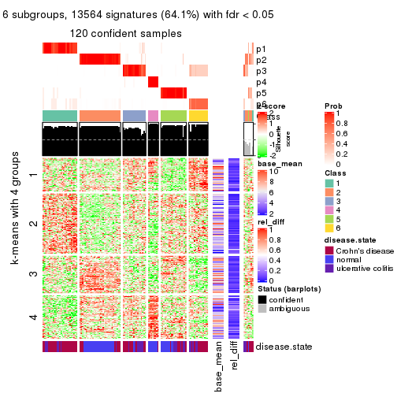</p>

</div>
</div>


Signature heatmaps where rows are not scaled:


<script>
$( function() {
	$( '#tabs-ATC-mclust-get-signatures-no-scale' ).tabs();
} );
</script>
<div id='tabs-ATC-mclust-get-signatures-no-scale'>
<ul>
<li><a href='#tab-ATC-mclust-get-signatures-no-scale-1'>k = 2</a></li>
<li><a href='#tab-ATC-mclust-get-signatures-no-scale-2'>k = 3</a></li>
<li><a href='#tab-ATC-mclust-get-signatures-no-scale-3'>k = 4</a></li>
<li><a href='#tab-ATC-mclust-get-signatures-no-scale-4'>k = 5</a></li>
<li><a href='#tab-ATC-mclust-get-signatures-no-scale-5'>k = 6</a></li>
</ul>
<div id='tab-ATC-mclust-get-signatures-no-scale-1'>
<pre><code class="r">get_signatures(res, k = 2, scale_rows = FALSE)
</code></pre>

<p></p>

</div>
<div id='tab-ATC-mclust-get-signatures-no-scale-2'>
<pre><code class="r">get_signatures(res, k = 3, scale_rows = FALSE)
</code></pre>

<p></p>

</div>
<div id='tab-ATC-mclust-get-signatures-no-scale-3'>
<pre><code class="r">get_signatures(res, k = 4, scale_rows = FALSE)
</code></pre>

<p></p>

</div>
<div id='tab-ATC-mclust-get-signatures-no-scale-4'>
<pre><code class="r">get_signatures(res, k = 5, scale_rows = FALSE)
</code></pre>

<p></p>

</div>
<div id='tab-ATC-mclust-get-signatures-no-scale-5'>
<pre><code class="r">get_signatures(res, k = 6, scale_rows = FALSE)
</code></pre>

<p></p>

</div>
</div>


Compare the overlap of signatures from different k:

```r
compare_signatures(res)
```


`get_signature()` returns a data frame invisibly. TO get the list of signatures, the function
call should be assigned to a variable explicitly. In following code, if `plot` argument is set
to `FALSE`, no heatmap is plotted while only the differential analysis is performed.

```r
# code only for demonstration
tb = get_signature(res, k = ..., plot = FALSE)
```

An example of the output of `tb` is:

```
#>   which_row         fdr    mean_1    mean_2 scaled_mean_1 scaled_mean_2 km
#> 1        38 0.042760348  8.373488  9.131774    -0.5533452     0.5164555  1
#> 2        40 0.018707592  7.106213  8.469186    -0.6173731     0.5762149  1
#> 3        55 0.019134737 10.221463 11.207825    -0.6159697     0.5749050  1
#> 4        59 0.006059896  5.921854  7.869574    -0.6899429     0.6439467  1
#> 5        60 0.018055526  8.928898 10.211722    -0.6204761     0.5791110  1
#> 6        98 0.009384629 15.714769 14.887706     0.6635654    -0.6193277  2
...
```

The columns in `tb` are:

1. `which_row`: row indices corresponding to the input matrix.
2. `fdr`: FDR for the differential test. 
3. `mean_x`: The mean value in group x.
4. `scaled_mean_x`: The mean value in group x after rows are scaled.
5. `km`: Row groups if k-means clustering is applied to rows.


UMAP plot which shows how samples are separated.


<script>
$( function() {
	$( '#tabs-ATC-mclust-dimension-reduction' ).tabs();
} );
</script>
<div id='tabs-ATC-mclust-dimension-reduction'>
<ul>
<li><a href='#tab-ATC-mclust-dimension-reduction-1'>k = 2</a></li>
<li><a href='#tab-ATC-mclust-dimension-reduction-2'>k = 3</a></li>
<li><a href='#tab-ATC-mclust-dimension-reduction-3'>k = 4</a></li>
<li><a href='#tab-ATC-mclust-dimension-reduction-4'>k = 5</a></li>
<li><a href='#tab-ATC-mclust-dimension-reduction-5'>k = 6</a></li>
</ul>
<div id='tab-ATC-mclust-dimension-reduction-1'>
<pre><code class="r">dimension_reduction(res, k = 2, method = &quot;UMAP&quot;)
</code></pre>

<p></p>

</div>
<div id='tab-ATC-mclust-dimension-reduction-2'>
<pre><code class="r">dimension_reduction(res, k = 3, method = &quot;UMAP&quot;)
</code></pre>

<p></p>

</div>
<div id='tab-ATC-mclust-dimension-reduction-3'>
<pre><code class="r">dimension_reduction(res, k = 4, method = &quot;UMAP&quot;)
</code></pre>

<p></p>

</div>
<div id='tab-ATC-mclust-dimension-reduction-4'>
<pre><code class="r">dimension_reduction(res, k = 5, method = &quot;UMAP&quot;)
</code></pre>

<p></p>

</div>
<div id='tab-ATC-mclust-dimension-reduction-5'>
<pre><code class="r">dimension_reduction(res, k = 6, method = &quot;UMAP&quot;)
</code></pre>

<p></p>

</div>
</div>


Following heatmap shows how subgroups are split when increasing `k`:

```r
collect_classes(res)
```


Test correlation between subgroups and known annotations. If the known
annotation is numeric, one-way ANOVA test is applied, and if the known
annotation is discrete, chi-squared contingency table test is applied.

```r
test_to_known_factors(res)
```

```
#>              n disease.state(p) k
#> ATC:mclust 126         2.65e-01 2
#> ATC:mclust  98         2.72e-08 3
#> ATC:mclust 118         3.21e-09 4
#> ATC:mclust 125         1.12e-09 5
#> ATC:mclust 120         3.59e-11 6
```


If matrix rows can be associated to genes, consider to use `functional_enrichment(res,
...)` to perform function enrichment for the signature genes. See [this vignette](http://bioconductor.org/packages/devel/bioc/vignettes/cola/inst/doc/functional_enrichment.html) for more detailed explanations.


 

---------------------------------------------------


### ATC:NMF**


The object with results only for a single top-value method and a single partition method 
can be extracted as:

```r
res = res_list["ATC", "NMF"]
# you can also extract it by
# res = res_list["ATC:NMF"]
```

A summary of `res` and all the functions that can be applied to it:

```r
res
```

```
#> A 'ConsensusPartition' object with k = 2, 3, 4, 5, 6.
#>   On a matrix with 21168 rows and 127 columns.
#>   Top rows (1000, 2000, 3000, 4000, 5000) are extracted by 'ATC' method.
#>   Subgroups are detected by 'NMF' method.
#>   Performed in total 1250 partitions by row resampling.
#>   Best k for subgroups seems to be 3.
#> 
#> Following methods can be applied to this 'ConsensusPartition' object:
#>  [1] "cola_report"             "collect_classes"         "collect_plots"          
#>  [4] "collect_stats"           "colnames"                "compare_signatures"     
#>  [7] "consensus_heatmap"       "dimension_reduction"     "functional_enrichment"  
#> [10] "get_anno_col"            "get_anno"                "get_classes"            
#> [13] "get_consensus"           "get_matrix"              "get_membership"         
#> [16] "get_param"               "get_signatures"          "get_stats"              
#> [19] "is_best_k"               "is_stable_k"             "membership_heatmap"     
#> [22] "ncol"                    "nrow"                    "plot_ecdf"              
#> [25] "rownames"                "select_partition_number" "show"                   
#> [28] "suggest_best_k"          "test_to_known_factors"
```

`collect_plots()` function collects all the plots made from `res` for all `k` (number of partitions)
into one single page to provide an easy and fast comparison between different `k`.

```r
collect_plots(res)
```


The plots are:

- The first row: a plot of the ECDF (empirical cumulative distribution
  function) curves of the consensus matrix for each `k` and the heatmap of
  predicted classes for each `k`.
- The second row: heatmaps of the consensus matrix for each `k`.
- The third row: heatmaps of the membership matrix for each `k`.
- The fouth row: heatmaps of the signatures for each `k`.

All the plots in panels can be made by individual functions and they are
plotted later in this section.

`select_partition_number()` produces several plots showing different
statistics for choosing "optimized" `k`. There are following statistics:

- ECDF curves of the consensus matrix for each `k`;
- 1-PAC. [The PAC
  score](https://en.wikipedia.org/wiki/Consensus_clustering#Over-interpretation_potential_of_consensus_clustering)
  measures the proportion of the ambiguous subgrouping.
- Mean silhouette score.
- Concordance. The mean probability of fiting the consensus class ids in all
  partitions.
- Area increased. Denote $A_k$ as the area under the ECDF curve for current
  `k`, the area increased is defined as $A_k - A_{k-1}$.
- Rand index. The percent of pairs of samples that are both in a same cluster
  or both are not in a same cluster in the partition of k and k-1.
- Jaccard index. The ratio of pairs of samples are both in a same cluster in
  the partition of k and k-1 and the pairs of samples are both in a same
  cluster in the partition k or k-1.

The detailed explanations of these statistics can be found in [the _cola_
vignette](http://bioconductor.org/packages/devel/bioc/vignettes/cola/inst/doc/cola.html#toc_13).

Generally speaking, lower PAC score, higher mean silhouette score or higher
concordance corresponds to better partition. Rand index and Jaccard index
measure how similar the current partition is compared to partition with `k-1`.
If they are too similar, we won't accept `k` is better than `k-1`.

```r
select_partition_number(res)
```


The numeric values for all these statistics can be obtained by `get_stats()`.

```r
get_stats(res)
```

```
#>   k 1-PAC mean_silhouette concordance area_increased  Rand Jaccard
#> 2 2 0.999           0.947       0.979         0.4968 0.505   0.505
#> 3 3 0.960           0.938       0.973         0.3059 0.717   0.504
#> 4 4 0.733           0.748       0.863         0.1110 0.855   0.631
#> 5 5 0.674           0.580       0.787         0.0796 0.894   0.658
#> 6 6 0.697           0.644       0.803         0.0478 0.905   0.620
```

`suggest_best_k()` suggests the best $k$ based on these statistics. The rules are as follows:

- All $k$ with Jaccard index larger than 0.95 are removed because increasing
  $k$ does not provide enough extra information. If all $k$ are removed, it is
  marked as no subgroup is detected.
- For all $k$ with 1-PAC score larger than 0.9, the maximal $k$ is taken as
  the best $k$, and other $k$ are marked as optional $k$.
- If it does not fit the second rule. The $k$ with the maximal vote of the
  highest 1-PAC score, highest mean silhouette, and highest concordance is
  taken as the best $k$.

```r
suggest_best_k(res)
```

```
#> [1] 3
#> attr(,"optional")
#> [1] 2
```

There is also optional best $k$ = 2 that is worth to check.

Following shows the table of the partitions (You need to click the **show/hide
code output** link to see it). The membership matrix (columns with name `p*`)
is inferred by
[`clue::cl_consensus()`](https://www.rdocumentation.org/link/cl_consensus?package=clue)
function with the `SE` method. Basically the value in the membership matrix
represents the probability to belong to a certain group. The finall class
label for an item is determined with the group with highest probability it
belongs to.

In `get_classes()` function, the entropy is calculated from the membership
matrix and the silhouette score is calculated from the consensus matrix.


<script>
$( function() {
	$( '#tabs-ATC-NMF-get-classes' ).tabs();
} );
</script>
<div id='tabs-ATC-NMF-get-classes'>
<ul>
<li><a href='#tab-ATC-NMF-get-classes-1'>k = 2</a></li>
<li><a href='#tab-ATC-NMF-get-classes-2'>k = 3</a></li>
<li><a href='#tab-ATC-NMF-get-classes-3'>k = 4</a></li>
<li><a href='#tab-ATC-NMF-get-classes-4'>k = 5</a></li>
<li><a href='#tab-ATC-NMF-get-classes-5'>k = 6</a></li>
</ul>

<div id='tab-ATC-NMF-get-classes-1'>
<p><a id='tab-ATC-NMF-get-classes-1-a' style='color:#0366d6' href='#'>show/hide code output</a></p>
<pre><code class="r">cbind(get_classes(res, k = 2), get_membership(res, k = 2))
</code></pre>

<pre><code>#&gt;          class entropy silhouette    p1    p2
#&gt; GSM76115     2  0.0000     0.9716 0.000 1.000
#&gt; GSM76116     2  0.0000     0.9716 0.000 1.000
#&gt; GSM76117     2  0.0000     0.9716 0.000 1.000
#&gt; GSM76118     2  0.0000     0.9716 0.000 1.000
#&gt; GSM76119     2  0.0000     0.9716 0.000 1.000
#&gt; GSM76120     2  0.0000     0.9716 0.000 1.000
#&gt; GSM76121     1  0.8016     0.6755 0.756 0.244
#&gt; GSM76122     2  0.0000     0.9716 0.000 1.000
#&gt; GSM76123     2  0.0000     0.9716 0.000 1.000
#&gt; GSM76124     2  0.0000     0.9716 0.000 1.000
#&gt; GSM76125     2  0.0000     0.9716 0.000 1.000
#&gt; GSM76126     1  0.0000     0.9860 1.000 0.000
#&gt; GSM76127     2  0.0000     0.9716 0.000 1.000
#&gt; GSM76128     1  0.0000     0.9860 1.000 0.000
#&gt; GSM76129     2  0.0000     0.9716 0.000 1.000
#&gt; GSM76130     2  0.0000     0.9716 0.000 1.000
#&gt; GSM76131     2  0.0000     0.9716 0.000 1.000
#&gt; GSM76132     2  0.0000     0.9716 0.000 1.000
#&gt; GSM76133     2  0.0000     0.9716 0.000 1.000
#&gt; GSM76134     2  0.0000     0.9716 0.000 1.000
#&gt; GSM76135     2  0.0000     0.9716 0.000 1.000
#&gt; GSM76136     2  0.0000     0.9716 0.000 1.000
#&gt; GSM76137     2  0.0000     0.9716 0.000 1.000
#&gt; GSM76138     2  0.0000     0.9716 0.000 1.000
#&gt; GSM76139     2  0.0000     0.9716 0.000 1.000
#&gt; GSM76140     2  0.0000     0.9716 0.000 1.000
#&gt; GSM76141     2  0.0000     0.9716 0.000 1.000
#&gt; GSM76142     2  0.0000     0.9716 0.000 1.000
#&gt; GSM76143     2  0.0000     0.9716 0.000 1.000
#&gt; GSM76144     2  0.0000     0.9716 0.000 1.000
#&gt; GSM76145     2  0.0000     0.9716 0.000 1.000
#&gt; GSM76146     2  0.0000     0.9716 0.000 1.000
#&gt; GSM76147     2  0.0000     0.9716 0.000 1.000
#&gt; GSM76148     2  0.0000     0.9716 0.000 1.000
#&gt; GSM76149     2  0.0000     0.9716 0.000 1.000
#&gt; GSM76150     2  0.0000     0.9716 0.000 1.000
#&gt; GSM76151     2  0.0000     0.9716 0.000 1.000
#&gt; GSM76152     1  0.0938     0.9762 0.988 0.012
#&gt; GSM76153     2  0.0000     0.9716 0.000 1.000
#&gt; GSM76154     2  0.0000     0.9716 0.000 1.000
#&gt; GSM76155     2  0.0000     0.9716 0.000 1.000
#&gt; GSM76156     2  0.0000     0.9716 0.000 1.000
#&gt; GSM76030     2  0.0000     0.9716 0.000 1.000
#&gt; GSM76031     1  0.0000     0.9860 1.000 0.000
#&gt; GSM76032     1  0.0000     0.9860 1.000 0.000
#&gt; GSM76033     1  0.0000     0.9860 1.000 0.000
#&gt; GSM76034     2  0.0000     0.9716 0.000 1.000
#&gt; GSM76035     1  0.0000     0.9860 1.000 0.000
#&gt; GSM76036     1  0.4431     0.8957 0.908 0.092
#&gt; GSM76037     2  0.0000     0.9716 0.000 1.000
#&gt; GSM76038     1  0.0000     0.9860 1.000 0.000
#&gt; GSM76039     2  0.0938     0.9611 0.012 0.988
#&gt; GSM76040     1  0.0000     0.9860 1.000 0.000
#&gt; GSM76041     1  0.0000     0.9860 1.000 0.000
#&gt; GSM76042     2  0.8955     0.5488 0.312 0.688
#&gt; GSM76043     1  0.0000     0.9860 1.000 0.000
#&gt; GSM76044     2  0.0000     0.9716 0.000 1.000
#&gt; GSM76045     1  0.0000     0.9860 1.000 0.000
#&gt; GSM76046     2  0.6247     0.8018 0.156 0.844
#&gt; GSM76047     1  0.4022     0.9088 0.920 0.080
#&gt; GSM76048     1  0.0000     0.9860 1.000 0.000
#&gt; GSM76049     2  0.0000     0.9716 0.000 1.000
#&gt; GSM76050     1  0.0000     0.9860 1.000 0.000
#&gt; GSM76051     1  0.0000     0.9860 1.000 0.000
#&gt; GSM76052     2  0.9881     0.2347 0.436 0.564
#&gt; GSM76053     2  0.0000     0.9716 0.000 1.000
#&gt; GSM76054     2  0.9993     0.0719 0.484 0.516
#&gt; GSM76055     2  0.0000     0.9716 0.000 1.000
#&gt; GSM76056     2  0.0000     0.9716 0.000 1.000
#&gt; GSM76057     2  0.0672     0.9647 0.008 0.992
#&gt; GSM76058     1  0.0000     0.9860 1.000 0.000
#&gt; GSM76059     1  0.0000     0.9860 1.000 0.000
#&gt; GSM76060     2  0.0000     0.9716 0.000 1.000
#&gt; GSM76061     2  0.0000     0.9716 0.000 1.000
#&gt; GSM76062     1  0.0000     0.9860 1.000 0.000
#&gt; GSM76063     2  0.0000     0.9716 0.000 1.000
#&gt; GSM76064     1  0.0000     0.9860 1.000 0.000
#&gt; GSM76065     2  0.0000     0.9716 0.000 1.000
#&gt; GSM76066     1  0.0000     0.9860 1.000 0.000
#&gt; GSM76067     1  0.0000     0.9860 1.000 0.000
#&gt; GSM76068     1  0.0000     0.9860 1.000 0.000
#&gt; GSM76069     1  0.0000     0.9860 1.000 0.000
#&gt; GSM76070     2  0.0000     0.9716 0.000 1.000
#&gt; GSM76071     1  0.0000     0.9860 1.000 0.000
#&gt; GSM76072     1  0.0000     0.9860 1.000 0.000
#&gt; GSM76073     1  0.0000     0.9860 1.000 0.000
#&gt; GSM76074     1  0.0000     0.9860 1.000 0.000
#&gt; GSM76075     1  0.0000     0.9860 1.000 0.000
#&gt; GSM76076     1  0.0000     0.9860 1.000 0.000
#&gt; GSM76077     2  0.0000     0.9716 0.000 1.000
#&gt; GSM76078     2  0.9954     0.1573 0.460 0.540
#&gt; GSM76079     1  0.0000     0.9860 1.000 0.000
#&gt; GSM76080     2  0.0000     0.9716 0.000 1.000
#&gt; GSM76081     2  0.0000     0.9716 0.000 1.000
#&gt; GSM76082     1  0.0000     0.9860 1.000 0.000
#&gt; GSM76083     1  0.0000     0.9860 1.000 0.000
#&gt; GSM76084     2  0.0000     0.9716 0.000 1.000
#&gt; GSM76085     1  0.0000     0.9860 1.000 0.000
#&gt; GSM76086     1  0.0000     0.9860 1.000 0.000
#&gt; GSM76087     2  0.0000     0.9716 0.000 1.000
#&gt; GSM76088     1  0.7883     0.6895 0.764 0.236
#&gt; GSM76089     2  0.0000     0.9716 0.000 1.000
#&gt; GSM76090     1  0.0000     0.9860 1.000 0.000
#&gt; GSM76091     1  0.0000     0.9860 1.000 0.000
#&gt; GSM76092     1  0.0000     0.9860 1.000 0.000
#&gt; GSM76093     1  0.0000     0.9860 1.000 0.000
#&gt; GSM76094     2  0.0000     0.9716 0.000 1.000
#&gt; GSM76095     2  0.0000     0.9716 0.000 1.000
#&gt; GSM76096     1  0.0000     0.9860 1.000 0.000
#&gt; GSM76097     2  0.4161     0.8893 0.084 0.916
#&gt; GSM76098     1  0.2043     0.9582 0.968 0.032
#&gt; GSM76099     1  0.0000     0.9860 1.000 0.000
#&gt; GSM76100     1  0.0000     0.9860 1.000 0.000
#&gt; GSM76101     1  0.0000     0.9860 1.000 0.000
#&gt; GSM76102     1  0.0000     0.9860 1.000 0.000
#&gt; GSM76103     1  0.0000     0.9860 1.000 0.000
#&gt; GSM76104     1  0.1843     0.9619 0.972 0.028
#&gt; GSM76105     2  0.0000     0.9716 0.000 1.000
#&gt; GSM76106     2  0.0000     0.9716 0.000 1.000
#&gt; GSM76107     2  0.0000     0.9716 0.000 1.000
#&gt; GSM76108     2  0.0000     0.9716 0.000 1.000
#&gt; GSM76109     1  0.0000     0.9860 1.000 0.000
#&gt; GSM76110     1  0.0000     0.9860 1.000 0.000
#&gt; GSM76111     1  0.0000     0.9860 1.000 0.000
#&gt; GSM76112     1  0.0000     0.9860 1.000 0.000
#&gt; GSM76113     2  0.0000     0.9716 0.000 1.000
#&gt; GSM76114     1  0.0000     0.9860 1.000 0.000
</code></pre>

<script>
$('#tab-ATC-NMF-get-classes-1-a').parent().next().next().hide();
$('#tab-ATC-NMF-get-classes-1-a').click(function(){
  $('#tab-ATC-NMF-get-classes-1-a').parent().next().next().toggle();
  return(false);
});
</script>
</div>

<div id='tab-ATC-NMF-get-classes-2'>
<p><a id='tab-ATC-NMF-get-classes-2-a' style='color:#0366d6' href='#'>show/hide code output</a></p>
<pre><code class="r">cbind(get_classes(res, k = 3), get_membership(res, k = 3))
</code></pre>

<pre><code>#&gt;          class entropy silhouette    p1    p2    p3
#&gt; GSM76115     2  0.0000      0.977 0.000 1.000 0.000
#&gt; GSM76116     2  0.0000      0.977 0.000 1.000 0.000
#&gt; GSM76117     2  0.0000      0.977 0.000 1.000 0.000
#&gt; GSM76118     2  0.0000      0.977 0.000 1.000 0.000
#&gt; GSM76119     3  0.0000      0.959 0.000 0.000 1.000
#&gt; GSM76120     3  0.0000      0.959 0.000 0.000 1.000
#&gt; GSM76121     2  0.4605      0.744 0.204 0.796 0.000
#&gt; GSM76122     2  0.0000      0.977 0.000 1.000 0.000
#&gt; GSM76123     3  0.0000      0.959 0.000 0.000 1.000
#&gt; GSM76124     2  0.0000      0.977 0.000 1.000 0.000
#&gt; GSM76125     3  0.0000      0.959 0.000 0.000 1.000
#&gt; GSM76126     3  0.0000      0.959 0.000 0.000 1.000
#&gt; GSM76127     3  0.0000      0.959 0.000 0.000 1.000
#&gt; GSM76128     3  0.0000      0.959 0.000 0.000 1.000
#&gt; GSM76129     2  0.0000      0.977 0.000 1.000 0.000
#&gt; GSM76130     3  0.0000      0.959 0.000 0.000 1.000
#&gt; GSM76131     2  0.0000      0.977 0.000 1.000 0.000
#&gt; GSM76132     2  0.0000      0.977 0.000 1.000 0.000
#&gt; GSM76133     2  0.0000      0.977 0.000 1.000 0.000
#&gt; GSM76134     2  0.0000      0.977 0.000 1.000 0.000
#&gt; GSM76135     2  0.0000      0.977 0.000 1.000 0.000
#&gt; GSM76136     2  0.1753      0.938 0.000 0.952 0.048
#&gt; GSM76137     2  0.0237      0.975 0.000 0.996 0.004
#&gt; GSM76138     2  0.0000      0.977 0.000 1.000 0.000
#&gt; GSM76139     2  0.0237      0.975 0.000 0.996 0.004
#&gt; GSM76140     2  0.0000      0.977 0.000 1.000 0.000
#&gt; GSM76141     2  0.0000      0.977 0.000 1.000 0.000
#&gt; GSM76142     2  0.0237      0.975 0.000 0.996 0.004
#&gt; GSM76143     2  0.0000      0.977 0.000 1.000 0.000
#&gt; GSM76144     2  0.0000      0.977 0.000 1.000 0.000
#&gt; GSM76145     2  0.1643      0.942 0.000 0.956 0.044
#&gt; GSM76146     2  0.0237      0.975 0.000 0.996 0.004
#&gt; GSM76147     2  0.0000      0.977 0.000 1.000 0.000
#&gt; GSM76148     2  0.0000      0.977 0.000 1.000 0.000
#&gt; GSM76149     2  0.0000      0.977 0.000 1.000 0.000
#&gt; GSM76150     2  0.0000      0.977 0.000 1.000 0.000
#&gt; GSM76151     2  0.0747      0.966 0.000 0.984 0.016
#&gt; GSM76152     1  0.5397      0.597 0.720 0.280 0.000
#&gt; GSM76153     2  0.0000      0.977 0.000 1.000 0.000
#&gt; GSM76154     2  0.0000      0.977 0.000 1.000 0.000
#&gt; GSM76155     2  0.0000      0.977 0.000 1.000 0.000
#&gt; GSM76156     2  0.0000      0.977 0.000 1.000 0.000
#&gt; GSM76030     2  0.0000      0.977 0.000 1.000 0.000
#&gt; GSM76031     1  0.0000      0.972 1.000 0.000 0.000
#&gt; GSM76032     3  0.1031      0.946 0.024 0.000 0.976
#&gt; GSM76033     3  0.0000      0.959 0.000 0.000 1.000
#&gt; GSM76034     2  0.0000      0.977 0.000 1.000 0.000
#&gt; GSM76035     3  0.5968      0.453 0.364 0.000 0.636
#&gt; GSM76036     3  0.0000      0.959 0.000 0.000 1.000
#&gt; GSM76037     2  0.0000      0.977 0.000 1.000 0.000
#&gt; GSM76038     1  0.0000      0.972 1.000 0.000 0.000
#&gt; GSM76039     2  0.0747      0.966 0.016 0.984 0.000
#&gt; GSM76040     3  0.0000      0.959 0.000 0.000 1.000
#&gt; GSM76041     1  0.0000      0.972 1.000 0.000 0.000
#&gt; GSM76042     2  0.1529      0.945 0.040 0.960 0.000
#&gt; GSM76043     3  0.4235      0.789 0.176 0.000 0.824
#&gt; GSM76044     2  0.0000      0.977 0.000 1.000 0.000
#&gt; GSM76045     1  0.0000      0.972 1.000 0.000 0.000
#&gt; GSM76046     3  0.0000      0.959 0.000 0.000 1.000
#&gt; GSM76047     2  0.6192      0.288 0.420 0.580 0.000
#&gt; GSM76048     3  0.0000      0.959 0.000 0.000 1.000
#&gt; GSM76049     2  0.0000      0.977 0.000 1.000 0.000
#&gt; GSM76050     1  0.0000      0.972 1.000 0.000 0.000
#&gt; GSM76051     3  0.0237      0.957 0.004 0.000 0.996
#&gt; GSM76052     3  0.0000      0.959 0.000 0.000 1.000
#&gt; GSM76053     2  0.3038      0.878 0.000 0.896 0.104
#&gt; GSM76054     3  0.0000      0.959 0.000 0.000 1.000
#&gt; GSM76055     2  0.0000      0.977 0.000 1.000 0.000
#&gt; GSM76056     2  0.0747      0.966 0.016 0.984 0.000
#&gt; GSM76057     2  0.0237      0.975 0.004 0.996 0.000
#&gt; GSM76058     3  0.1289      0.940 0.032 0.000 0.968
#&gt; GSM76059     1  0.0000      0.972 1.000 0.000 0.000
#&gt; GSM76060     2  0.0000      0.977 0.000 1.000 0.000
#&gt; GSM76061     2  0.0000      0.977 0.000 1.000 0.000
#&gt; GSM76062     1  0.0000      0.972 1.000 0.000 0.000
#&gt; GSM76063     3  0.5058      0.681 0.000 0.244 0.756
#&gt; GSM76064     1  0.0000      0.972 1.000 0.000 0.000
#&gt; GSM76065     2  0.0000      0.977 0.000 1.000 0.000
#&gt; GSM76066     1  0.0000      0.972 1.000 0.000 0.000
#&gt; GSM76067     1  0.5859      0.452 0.656 0.000 0.344
#&gt; GSM76068     3  0.0000      0.959 0.000 0.000 1.000
#&gt; GSM76069     1  0.0000      0.972 1.000 0.000 0.000
#&gt; GSM76070     2  0.0237      0.975 0.000 0.996 0.004
#&gt; GSM76071     1  0.0000      0.972 1.000 0.000 0.000
#&gt; GSM76072     1  0.0000      0.972 1.000 0.000 0.000
#&gt; GSM76073     1  0.0892      0.956 0.980 0.020 0.000
#&gt; GSM76074     1  0.0000      0.972 1.000 0.000 0.000
#&gt; GSM76075     3  0.0237      0.957 0.004 0.000 0.996
#&gt; GSM76076     3  0.0892      0.948 0.020 0.000 0.980
#&gt; GSM76077     2  0.0000      0.977 0.000 1.000 0.000
#&gt; GSM76078     3  0.1643      0.922 0.000 0.044 0.956
#&gt; GSM76079     1  0.0000      0.972 1.000 0.000 0.000
#&gt; GSM76080     3  0.0000      0.959 0.000 0.000 1.000
#&gt; GSM76081     3  0.0000      0.959 0.000 0.000 1.000
#&gt; GSM76082     3  0.1529      0.934 0.040 0.000 0.960
#&gt; GSM76083     3  0.0237      0.957 0.004 0.000 0.996
#&gt; GSM76084     3  0.1031      0.942 0.000 0.024 0.976
#&gt; GSM76085     3  0.0000      0.959 0.000 0.000 1.000
#&gt; GSM76086     1  0.1529      0.937 0.960 0.000 0.040
#&gt; GSM76087     2  0.0237      0.975 0.000 0.996 0.004
#&gt; GSM76088     2  0.5621      0.562 0.308 0.692 0.000
#&gt; GSM76089     2  0.0000      0.977 0.000 1.000 0.000
#&gt; GSM76090     3  0.2165      0.914 0.064 0.000 0.936
#&gt; GSM76091     1  0.0000      0.972 1.000 0.000 0.000
#&gt; GSM76092     1  0.0000      0.972 1.000 0.000 0.000
#&gt; GSM76093     1  0.0000      0.972 1.000 0.000 0.000
#&gt; GSM76094     2  0.0000      0.977 0.000 1.000 0.000
#&gt; GSM76095     2  0.0237      0.975 0.004 0.996 0.000
#&gt; GSM76096     1  0.0000      0.972 1.000 0.000 0.000
#&gt; GSM76097     2  0.1031      0.959 0.024 0.976 0.000
#&gt; GSM76098     3  0.0000      0.959 0.000 0.000 1.000
#&gt; GSM76099     1  0.0000      0.972 1.000 0.000 0.000
#&gt; GSM76100     1  0.0892      0.956 0.980 0.020 0.000
#&gt; GSM76101     1  0.0000      0.972 1.000 0.000 0.000
#&gt; GSM76102     1  0.0892      0.956 0.980 0.000 0.020
#&gt; GSM76103     3  0.3551      0.846 0.132 0.000 0.868
#&gt; GSM76104     3  0.0000      0.959 0.000 0.000 1.000
#&gt; GSM76105     2  0.0000      0.977 0.000 1.000 0.000
#&gt; GSM76106     3  0.0592      0.951 0.000 0.012 0.988
#&gt; GSM76107     3  0.0424      0.954 0.000 0.008 0.992
#&gt; GSM76108     2  0.0237      0.975 0.004 0.996 0.000
#&gt; GSM76109     1  0.0000      0.972 1.000 0.000 0.000
#&gt; GSM76110     1  0.0747      0.960 0.984 0.016 0.000
#&gt; GSM76111     1  0.0592      0.963 0.988 0.012 0.000
#&gt; GSM76112     1  0.0000      0.972 1.000 0.000 0.000
#&gt; GSM76113     3  0.4654      0.731 0.000 0.208 0.792
#&gt; GSM76114     1  0.0000      0.972 1.000 0.000 0.000
</code></pre>

<script>
$('#tab-ATC-NMF-get-classes-2-a').parent().next().next().hide();
$('#tab-ATC-NMF-get-classes-2-a').click(function(){
  $('#tab-ATC-NMF-get-classes-2-a').parent().next().next().toggle();
  return(false);
});
</script>
</div>

<div id='tab-ATC-NMF-get-classes-3'>
<p><a id='tab-ATC-NMF-get-classes-3-a' style='color:#0366d6' href='#'>show/hide code output</a></p>
<pre><code class="r">cbind(get_classes(res, k = 4), get_membership(res, k = 4))
</code></pre>

<pre><code>#&gt;          class entropy silhouette    p1    p2    p3    p4
#&gt; GSM76115     2  0.4509      0.684 0.004 0.708 0.000 0.288
#&gt; GSM76116     2  0.1022      0.895 0.000 0.968 0.000 0.032
#&gt; GSM76117     2  0.0817      0.899 0.000 0.976 0.000 0.024
#&gt; GSM76118     2  0.5432      0.700 0.068 0.716 0.000 0.216
#&gt; GSM76119     4  0.3649      0.832 0.000 0.000 0.204 0.796
#&gt; GSM76120     4  0.4164      0.833 0.000 0.000 0.264 0.736
#&gt; GSM76121     1  0.4635      0.718 0.756 0.028 0.000 0.216
#&gt; GSM76122     2  0.5496      0.625 0.036 0.652 0.000 0.312
#&gt; GSM76123     4  0.4277      0.828 0.000 0.000 0.280 0.720
#&gt; GSM76124     1  0.7158      0.437 0.512 0.148 0.000 0.340
#&gt; GSM76125     4  0.4277      0.828 0.000 0.000 0.280 0.720
#&gt; GSM76126     4  0.3610      0.832 0.000 0.000 0.200 0.800
#&gt; GSM76127     4  0.3024      0.804 0.000 0.000 0.148 0.852
#&gt; GSM76128     4  0.4008      0.836 0.000 0.000 0.244 0.756
#&gt; GSM76129     2  0.0707      0.901 0.000 0.980 0.000 0.020
#&gt; GSM76130     4  0.2647      0.783 0.000 0.000 0.120 0.880
#&gt; GSM76131     2  0.0188      0.907 0.000 0.996 0.004 0.000
#&gt; GSM76132     2  0.0000      0.908 0.000 1.000 0.000 0.000
#&gt; GSM76133     2  0.0000      0.908 0.000 1.000 0.000 0.000
#&gt; GSM76134     2  0.0188      0.908 0.000 0.996 0.000 0.004
#&gt; GSM76135     2  0.0000      0.908 0.000 1.000 0.000 0.000
#&gt; GSM76136     2  0.0592      0.900 0.000 0.984 0.016 0.000
#&gt; GSM76137     2  0.0336      0.907 0.000 0.992 0.000 0.008
#&gt; GSM76138     2  0.0188      0.908 0.000 0.996 0.000 0.004
#&gt; GSM76139     2  0.0000      0.908 0.000 1.000 0.000 0.000
#&gt; GSM76140     2  0.5962      0.646 0.180 0.692 0.000 0.128
#&gt; GSM76141     2  0.0000      0.908 0.000 1.000 0.000 0.000
#&gt; GSM76142     2  0.0188      0.907 0.000 0.996 0.004 0.000
#&gt; GSM76143     2  0.0000      0.908 0.000 1.000 0.000 0.000
#&gt; GSM76144     2  0.0000      0.908 0.000 1.000 0.000 0.000
#&gt; GSM76145     2  0.0188      0.907 0.000 0.996 0.004 0.000
#&gt; GSM76146     2  0.0000      0.908 0.000 1.000 0.000 0.000
#&gt; GSM76147     2  0.0000      0.908 0.000 1.000 0.000 0.000
#&gt; GSM76148     2  0.0000      0.908 0.000 1.000 0.000 0.000
#&gt; GSM76149     2  0.0000      0.908 0.000 1.000 0.000 0.000
#&gt; GSM76150     2  0.0188      0.908 0.000 0.996 0.000 0.004
#&gt; GSM76151     2  0.0000      0.908 0.000 1.000 0.000 0.000
#&gt; GSM76152     1  0.2796      0.810 0.892 0.016 0.000 0.092
#&gt; GSM76153     2  0.0188      0.907 0.000 0.996 0.004 0.000
#&gt; GSM76154     2  0.0000      0.908 0.000 1.000 0.000 0.000
#&gt; GSM76155     2  0.0188      0.908 0.000 0.996 0.000 0.004
#&gt; GSM76156     2  0.0000      0.908 0.000 1.000 0.000 0.000
#&gt; GSM76030     2  0.0000      0.908 0.000 1.000 0.000 0.000
#&gt; GSM76031     1  0.0592      0.848 0.984 0.000 0.000 0.016
#&gt; GSM76032     3  0.1792      0.695 0.000 0.000 0.932 0.068
#&gt; GSM76033     3  0.2345      0.658 0.000 0.000 0.900 0.100
#&gt; GSM76034     2  0.0188      0.907 0.000 0.996 0.004 0.000
#&gt; GSM76035     3  0.3355      0.709 0.160 0.004 0.836 0.000
#&gt; GSM76036     3  0.4304      0.250 0.000 0.000 0.716 0.284
#&gt; GSM76037     2  0.1302      0.888 0.000 0.956 0.000 0.044
#&gt; GSM76038     1  0.1637      0.821 0.940 0.000 0.060 0.000
#&gt; GSM76039     1  0.6452      0.527 0.624 0.260 0.000 0.116
#&gt; GSM76040     3  0.3764      0.458 0.000 0.000 0.784 0.216
#&gt; GSM76041     1  0.3024      0.720 0.852 0.000 0.148 0.000
#&gt; GSM76042     1  0.5088      0.494 0.572 0.004 0.000 0.424
#&gt; GSM76043     3  0.4831      0.676 0.208 0.000 0.752 0.040
#&gt; GSM76044     2  0.1389      0.886 0.000 0.952 0.000 0.048
#&gt; GSM76045     1  0.1022      0.842 0.968 0.000 0.032 0.000
#&gt; GSM76046     4  0.4477      0.807 0.000 0.000 0.312 0.688
#&gt; GSM76047     2  0.7453      0.248 0.260 0.508 0.232 0.000
#&gt; GSM76048     3  0.3266      0.561 0.000 0.000 0.832 0.168
#&gt; GSM76049     2  0.0188      0.908 0.000 0.996 0.000 0.004
#&gt; GSM76050     1  0.0707      0.848 0.980 0.000 0.020 0.000
#&gt; GSM76051     3  0.0707      0.721 0.000 0.000 0.980 0.020
#&gt; GSM76052     3  0.1474      0.704 0.000 0.000 0.948 0.052
#&gt; GSM76053     4  0.3734      0.770 0.000 0.044 0.108 0.848
#&gt; GSM76054     3  0.1474      0.705 0.000 0.000 0.948 0.052
#&gt; GSM76055     2  0.5916      0.635 0.072 0.656 0.000 0.272
#&gt; GSM76056     2  0.0000      0.908 0.000 1.000 0.000 0.000
#&gt; GSM76057     2  0.2011      0.854 0.000 0.920 0.080 0.000
#&gt; GSM76058     3  0.1940      0.735 0.076 0.000 0.924 0.000
#&gt; GSM76059     1  0.0707      0.848 0.980 0.000 0.020 0.000
#&gt; GSM76060     2  0.0817      0.895 0.000 0.976 0.024 0.000
#&gt; GSM76061     2  0.0000      0.908 0.000 1.000 0.000 0.000
#&gt; GSM76062     1  0.1211      0.836 0.960 0.000 0.040 0.000
#&gt; GSM76063     2  0.4720      0.515 0.000 0.672 0.324 0.004
#&gt; GSM76064     3  0.4804      0.450 0.384 0.000 0.616 0.000
#&gt; GSM76065     2  0.0188      0.908 0.000 0.996 0.000 0.004
#&gt; GSM76066     3  0.4855      0.421 0.400 0.000 0.600 0.000
#&gt; GSM76067     3  0.3569      0.691 0.196 0.000 0.804 0.000
#&gt; GSM76068     3  0.1118      0.716 0.000 0.000 0.964 0.036
#&gt; GSM76069     1  0.0707      0.848 0.980 0.000 0.020 0.000
#&gt; GSM76070     2  0.0188      0.907 0.000 0.996 0.004 0.000
#&gt; GSM76071     1  0.1716      0.818 0.936 0.000 0.064 0.000
#&gt; GSM76072     1  0.0707      0.848 0.980 0.000 0.020 0.000
#&gt; GSM76073     1  0.0779      0.848 0.980 0.004 0.000 0.016
#&gt; GSM76074     1  0.2149      0.819 0.912 0.000 0.000 0.088
#&gt; GSM76075     3  0.1118      0.716 0.000 0.000 0.964 0.036
#&gt; GSM76076     3  0.0469      0.730 0.012 0.000 0.988 0.000
#&gt; GSM76077     2  0.0000      0.908 0.000 1.000 0.000 0.000
#&gt; GSM76078     3  0.3718      0.600 0.012 0.168 0.820 0.000
#&gt; GSM76079     1  0.0707      0.848 0.980 0.000 0.020 0.000
#&gt; GSM76080     4  0.4624      0.783 0.000 0.000 0.340 0.660
#&gt; GSM76081     4  0.4866      0.698 0.000 0.000 0.404 0.596
#&gt; GSM76082     3  0.2345      0.733 0.100 0.000 0.900 0.000
#&gt; GSM76083     3  0.0188      0.726 0.000 0.000 0.996 0.004
#&gt; GSM76084     4  0.7162      0.576 0.000 0.136 0.392 0.472
#&gt; GSM76085     3  0.1022      0.717 0.000 0.000 0.968 0.032
#&gt; GSM76086     3  0.4331      0.604 0.288 0.000 0.712 0.000
#&gt; GSM76087     2  0.0188      0.908 0.000 0.996 0.000 0.004
#&gt; GSM76088     2  0.4454      0.556 0.000 0.692 0.308 0.000
#&gt; GSM76089     2  0.0188      0.908 0.000 0.996 0.000 0.004
#&gt; GSM76090     3  0.2149      0.735 0.088 0.000 0.912 0.000
#&gt; GSM76091     1  0.4994     -0.150 0.520 0.000 0.480 0.000
#&gt; GSM76092     1  0.0000      0.850 1.000 0.000 0.000 0.000
#&gt; GSM76093     1  0.0707      0.848 0.980 0.000 0.020 0.000
#&gt; GSM76094     2  0.5775      0.678 0.092 0.696 0.000 0.212
#&gt; GSM76095     2  0.7172      0.169 0.376 0.484 0.000 0.140
#&gt; GSM76096     1  0.4040      0.712 0.752 0.000 0.000 0.248
#&gt; GSM76097     1  0.6194      0.597 0.668 0.200 0.000 0.132
#&gt; GSM76098     3  0.3837      0.435 0.000 0.000 0.776 0.224
#&gt; GSM76099     1  0.0336      0.849 0.992 0.000 0.000 0.008
#&gt; GSM76100     1  0.1661      0.835 0.944 0.004 0.000 0.052
#&gt; GSM76101     1  0.0469      0.849 0.988 0.000 0.000 0.012
#&gt; GSM76102     3  0.4948      0.339 0.440 0.000 0.560 0.000
#&gt; GSM76103     3  0.2868      0.721 0.136 0.000 0.864 0.000
#&gt; GSM76104     4  0.4713      0.761 0.000 0.000 0.360 0.640
#&gt; GSM76105     2  0.5994      0.610 0.068 0.636 0.000 0.296
#&gt; GSM76106     4  0.3569      0.830 0.000 0.000 0.196 0.804
#&gt; GSM76107     4  0.0188      0.669 0.000 0.000 0.004 0.996
#&gt; GSM76108     2  0.7506      0.258 0.308 0.484 0.000 0.208
#&gt; GSM76109     1  0.0000      0.850 1.000 0.000 0.000 0.000
#&gt; GSM76110     1  0.2011      0.823 0.920 0.000 0.000 0.080
#&gt; GSM76111     1  0.0592      0.849 0.984 0.000 0.016 0.000
#&gt; GSM76112     3  0.4989      0.250 0.472 0.000 0.528 0.000
#&gt; GSM76113     4  0.7734      0.480 0.000 0.236 0.344 0.420
#&gt; GSM76114     1  0.4406      0.442 0.700 0.000 0.300 0.000
</code></pre>

<script>
$('#tab-ATC-NMF-get-classes-3-a').parent().next().next().hide();
$('#tab-ATC-NMF-get-classes-3-a').click(function(){
  $('#tab-ATC-NMF-get-classes-3-a').parent().next().next().toggle();
  return(false);
});
</script>
</div>

<div id='tab-ATC-NMF-get-classes-4'>
<p><a id='tab-ATC-NMF-get-classes-4-a' style='color:#0366d6' href='#'>show/hide code output</a></p>
<pre><code class="r">cbind(get_classes(res, k = 5), get_membership(res, k = 5))
</code></pre>

<pre><code>#&gt;          class entropy silhouette    p1    p2    p3    p4    p5
#&gt; GSM76115     5  0.5635    0.32891 0.000 0.428 0.000 0.076 0.496
#&gt; GSM76116     5  0.4973    0.40999 0.000 0.408 0.004 0.024 0.564
#&gt; GSM76117     2  0.4425    0.16768 0.000 0.600 0.000 0.008 0.392
#&gt; GSM76118     5  0.4763    0.62130 0.008 0.192 0.000 0.068 0.732
#&gt; GSM76119     4  0.0963    0.82033 0.000 0.000 0.036 0.964 0.000
#&gt; GSM76120     4  0.1544    0.82027 0.000 0.000 0.068 0.932 0.000
#&gt; GSM76121     5  0.6319    0.22486 0.320 0.084 0.000 0.036 0.560
#&gt; GSM76122     5  0.5105    0.58150 0.000 0.264 0.000 0.076 0.660
#&gt; GSM76123     4  0.1608    0.81948 0.000 0.000 0.072 0.928 0.000
#&gt; GSM76124     5  0.3423    0.39460 0.060 0.016 0.000 0.068 0.856
#&gt; GSM76125     4  0.1608    0.81948 0.000 0.000 0.072 0.928 0.000
#&gt; GSM76126     4  0.4638    0.50430 0.000 0.000 0.028 0.648 0.324
#&gt; GSM76127     4  0.0771    0.81672 0.000 0.000 0.020 0.976 0.004
#&gt; GSM76128     4  0.1911    0.81552 0.004 0.000 0.036 0.932 0.028
#&gt; GSM76129     2  0.4745    0.00226 0.000 0.560 0.004 0.012 0.424
#&gt; GSM76130     4  0.0880    0.79384 0.000 0.000 0.000 0.968 0.032
#&gt; GSM76131     2  0.0162    0.79440 0.000 0.996 0.000 0.000 0.004
#&gt; GSM76132     2  0.0290    0.79427 0.000 0.992 0.000 0.000 0.008
#&gt; GSM76133     2  0.0703    0.79260 0.000 0.976 0.000 0.000 0.024
#&gt; GSM76134     2  0.2011    0.74684 0.000 0.908 0.004 0.000 0.088
#&gt; GSM76135     2  0.0000    0.79479 0.000 1.000 0.000 0.000 0.000
#&gt; GSM76136     2  0.0162    0.79440 0.000 0.996 0.000 0.000 0.004
#&gt; GSM76137     2  0.2787    0.69176 0.000 0.856 0.004 0.004 0.136
#&gt; GSM76138     2  0.3861    0.44462 0.000 0.712 0.004 0.000 0.284
#&gt; GSM76139     2  0.0693    0.79194 0.000 0.980 0.008 0.000 0.012
#&gt; GSM76140     2  0.5991   -0.21974 0.064 0.484 0.004 0.012 0.436
#&gt; GSM76141     2  0.0290    0.79504 0.000 0.992 0.000 0.000 0.008
#&gt; GSM76142     2  0.0162    0.79440 0.000 0.996 0.000 0.000 0.004
#&gt; GSM76143     2  0.0162    0.79491 0.000 0.996 0.000 0.000 0.004
#&gt; GSM76144     2  0.0162    0.79495 0.000 0.996 0.000 0.000 0.004
#&gt; GSM76145     2  0.1661    0.78038 0.000 0.940 0.024 0.000 0.036
#&gt; GSM76146     2  0.0510    0.79374 0.000 0.984 0.000 0.000 0.016
#&gt; GSM76147     2  0.0162    0.79495 0.000 0.996 0.000 0.000 0.004
#&gt; GSM76148     2  0.0162    0.79495 0.000 0.996 0.000 0.000 0.004
#&gt; GSM76149     2  0.2970    0.66254 0.000 0.828 0.004 0.000 0.168
#&gt; GSM76150     2  0.2179    0.73131 0.000 0.888 0.000 0.000 0.112
#&gt; GSM76151     2  0.4025    0.42307 0.000 0.700 0.008 0.000 0.292
#&gt; GSM76152     1  0.5681    0.09879 0.500 0.048 0.008 0.004 0.440
#&gt; GSM76153     2  0.0404    0.79428 0.000 0.988 0.000 0.000 0.012
#&gt; GSM76154     2  0.1892    0.75793 0.000 0.916 0.004 0.000 0.080
#&gt; GSM76155     2  0.4029    0.36792 0.000 0.680 0.004 0.000 0.316
#&gt; GSM76156     2  0.0703    0.79361 0.000 0.976 0.000 0.000 0.024
#&gt; GSM76030     2  0.1357    0.78358 0.000 0.948 0.004 0.000 0.048
#&gt; GSM76031     1  0.2850    0.65496 0.872 0.000 0.036 0.000 0.092
#&gt; GSM76032     3  0.3106    0.72120 0.000 0.000 0.840 0.140 0.020
#&gt; GSM76033     3  0.4410    0.09277 0.000 0.000 0.556 0.440 0.004
#&gt; GSM76034     2  0.1830    0.77696 0.000 0.932 0.040 0.000 0.028
#&gt; GSM76035     3  0.5256    0.65848 0.168 0.076 0.728 0.016 0.012
#&gt; GSM76036     4  0.4135    0.50702 0.000 0.000 0.340 0.656 0.004
#&gt; GSM76037     5  0.4994    0.22723 0.000 0.464 0.016 0.008 0.512
#&gt; GSM76038     1  0.4850    0.46490 0.700 0.000 0.224 0.000 0.076
#&gt; GSM76039     1  0.6272    0.35705 0.508 0.092 0.020 0.000 0.380
#&gt; GSM76040     4  0.4747    0.02999 0.000 0.000 0.488 0.496 0.016
#&gt; GSM76041     1  0.6563    0.45041 0.456 0.000 0.220 0.000 0.324
#&gt; GSM76042     1  0.6640    0.33090 0.444 0.004 0.004 0.164 0.384
#&gt; GSM76043     3  0.3340    0.73429 0.044 0.000 0.852 0.096 0.008
#&gt; GSM76044     2  0.5357    0.16756 0.032 0.600 0.020 0.000 0.348
#&gt; GSM76045     1  0.5447    0.50722 0.660 0.000 0.168 0.000 0.172
#&gt; GSM76046     4  0.2561    0.78226 0.000 0.000 0.144 0.856 0.000
#&gt; GSM76047     3  0.6536    0.03545 0.116 0.408 0.456 0.000 0.020
#&gt; GSM76048     3  0.4988    0.18320 0.004 0.000 0.556 0.416 0.024
#&gt; GSM76049     2  0.4430    0.44483 0.008 0.708 0.020 0.000 0.264
#&gt; GSM76050     1  0.0992    0.68673 0.968 0.000 0.024 0.000 0.008
#&gt; GSM76051     3  0.2074    0.74049 0.000 0.000 0.896 0.104 0.000
#&gt; GSM76052     3  0.3496    0.65913 0.000 0.000 0.788 0.200 0.012
#&gt; GSM76053     4  0.1403    0.79621 0.000 0.024 0.000 0.952 0.024
#&gt; GSM76054     3  0.2674    0.71923 0.000 0.000 0.856 0.140 0.004
#&gt; GSM76055     5  0.6305    0.36376 0.104 0.272 0.020 0.008 0.596
#&gt; GSM76056     2  0.5392    0.34079 0.060 0.664 0.020 0.000 0.256
#&gt; GSM76057     2  0.2012    0.75147 0.000 0.920 0.060 0.000 0.020
#&gt; GSM76058     3  0.1430    0.75761 0.004 0.000 0.944 0.052 0.000
#&gt; GSM76059     1  0.0865    0.68711 0.972 0.000 0.024 0.000 0.004
#&gt; GSM76060     2  0.0865    0.79167 0.000 0.972 0.004 0.000 0.024
#&gt; GSM76061     2  0.1408    0.78056 0.000 0.948 0.008 0.000 0.044
#&gt; GSM76062     1  0.1914    0.69030 0.924 0.000 0.060 0.000 0.016
#&gt; GSM76063     2  0.3095    0.68080 0.000 0.868 0.092 0.024 0.016
#&gt; GSM76064     3  0.3875    0.65738 0.072 0.000 0.804 0.000 0.124
#&gt; GSM76065     2  0.4235    0.54131 0.020 0.764 0.020 0.000 0.196
#&gt; GSM76066     3  0.4599    0.36796 0.384 0.000 0.600 0.000 0.016
#&gt; GSM76067     3  0.2124    0.73401 0.096 0.000 0.900 0.004 0.000
#&gt; GSM76068     3  0.5072    0.54277 0.024 0.012 0.688 0.260 0.016
#&gt; GSM76069     1  0.5869    0.42826 0.484 0.004 0.084 0.000 0.428
#&gt; GSM76070     2  0.0566    0.79310 0.000 0.984 0.004 0.000 0.012
#&gt; GSM76071     1  0.2813    0.64851 0.868 0.000 0.108 0.000 0.024
#&gt; GSM76072     1  0.0955    0.68745 0.968 0.000 0.028 0.000 0.004
#&gt; GSM76073     1  0.1740    0.68676 0.932 0.000 0.012 0.000 0.056
#&gt; GSM76074     1  0.2953    0.62463 0.844 0.000 0.012 0.000 0.144
#&gt; GSM76075     3  0.2068    0.74526 0.000 0.000 0.904 0.092 0.004
#&gt; GSM76076     3  0.1638    0.75337 0.000 0.000 0.932 0.064 0.004
#&gt; GSM76077     2  0.1768    0.77216 0.000 0.924 0.004 0.000 0.072
#&gt; GSM76078     3  0.2533    0.71624 0.000 0.096 0.888 0.008 0.008
#&gt; GSM76079     1  0.3731    0.66906 0.800 0.000 0.040 0.000 0.160
#&gt; GSM76080     4  0.2325    0.81435 0.000 0.028 0.068 0.904 0.000
#&gt; GSM76081     4  0.2488    0.79458 0.000 0.004 0.124 0.872 0.000
#&gt; GSM76082     3  0.2788    0.75714 0.064 0.000 0.888 0.040 0.008
#&gt; GSM76083     3  0.1831    0.74980 0.000 0.000 0.920 0.076 0.004
#&gt; GSM76084     4  0.5165    0.54534 0.000 0.240 0.064 0.684 0.012
#&gt; GSM76085     3  0.2583    0.72562 0.000 0.000 0.864 0.132 0.004
#&gt; GSM76086     3  0.2304    0.72687 0.100 0.000 0.892 0.000 0.008
#&gt; GSM76087     2  0.1442    0.78299 0.000 0.952 0.012 0.004 0.032
#&gt; GSM76088     2  0.6891   -0.02300 0.020 0.492 0.204 0.000 0.284
#&gt; GSM76089     2  0.1410    0.78333 0.000 0.940 0.000 0.000 0.060
#&gt; GSM76090     3  0.1278    0.75787 0.020 0.000 0.960 0.016 0.004
#&gt; GSM76091     1  0.5289    0.17654 0.500 0.000 0.452 0.000 0.048
#&gt; GSM76092     1  0.4484    0.58527 0.668 0.000 0.024 0.000 0.308
#&gt; GSM76093     1  0.2230    0.69361 0.912 0.000 0.044 0.000 0.044
#&gt; GSM76094     5  0.5540    0.55307 0.012 0.324 0.000 0.060 0.604
#&gt; GSM76095     5  0.5921    0.28438 0.056 0.452 0.000 0.020 0.472
#&gt; GSM76096     1  0.5547    0.46438 0.532 0.000 0.004 0.060 0.404
#&gt; GSM76097     1  0.5729    0.35767 0.484 0.048 0.016 0.000 0.452
#&gt; GSM76098     4  0.4256    0.28483 0.000 0.000 0.436 0.564 0.000
#&gt; GSM76099     1  0.5730    0.54383 0.576 0.000 0.108 0.000 0.316
#&gt; GSM76100     1  0.4599    0.53629 0.624 0.000 0.020 0.000 0.356
#&gt; GSM76101     1  0.2046    0.69193 0.916 0.000 0.016 0.000 0.068
#&gt; GSM76102     1  0.5257    0.32781 0.640 0.008 0.296 0.000 0.056
#&gt; GSM76103     3  0.4342    0.67819 0.188 0.000 0.764 0.024 0.024
#&gt; GSM76104     4  0.2249    0.81145 0.000 0.000 0.096 0.896 0.008
#&gt; GSM76105     5  0.4055    0.51893 0.028 0.088 0.000 0.064 0.820
#&gt; GSM76106     4  0.0693    0.81516 0.000 0.000 0.012 0.980 0.008
#&gt; GSM76107     4  0.3305    0.62618 0.000 0.000 0.000 0.776 0.224
#&gt; GSM76108     5  0.6230    0.06809 0.264 0.120 0.016 0.004 0.596
#&gt; GSM76109     1  0.1907    0.69348 0.928 0.000 0.028 0.000 0.044
#&gt; GSM76110     1  0.2930    0.66824 0.832 0.000 0.004 0.000 0.164
#&gt; GSM76111     1  0.5983    0.26492 0.556 0.028 0.060 0.000 0.356
#&gt; GSM76112     3  0.4682    0.25170 0.420 0.000 0.564 0.000 0.016
#&gt; GSM76113     2  0.7849   -0.21341 0.004 0.432 0.088 0.172 0.304
#&gt; GSM76114     3  0.5329    0.49955 0.184 0.000 0.672 0.000 0.144
</code></pre>

<script>
$('#tab-ATC-NMF-get-classes-4-a').parent().next().next().hide();
$('#tab-ATC-NMF-get-classes-4-a').click(function(){
  $('#tab-ATC-NMF-get-classes-4-a').parent().next().next().toggle();
  return(false);
});
</script>
</div>

<div id='tab-ATC-NMF-get-classes-5'>
<p><a id='tab-ATC-NMF-get-classes-5-a' style='color:#0366d6' href='#'>show/hide code output</a></p>
<pre><code class="r">cbind(get_classes(res, k = 6), get_membership(res, k = 6))
</code></pre>

<pre><code>#&gt;          class entropy silhouette    p1    p2    p3    p4    p5    p6
#&gt; GSM76115     5  0.2631     0.6873 0.004 0.128 0.000 0.000 0.856 0.012
#&gt; GSM76116     5  0.3977     0.6798 0.000 0.144 0.000 0.000 0.760 0.096
#&gt; GSM76117     5  0.4518     0.5167 0.000 0.348 0.004 0.000 0.612 0.036
#&gt; GSM76118     5  0.2999     0.6740 0.004 0.072 0.000 0.000 0.852 0.072
#&gt; GSM76119     4  0.0632     0.8516 0.000 0.000 0.000 0.976 0.024 0.000
#&gt; GSM76120     4  0.0363     0.8537 0.000 0.000 0.000 0.988 0.012 0.000
#&gt; GSM76121     5  0.3039     0.6624 0.052 0.068 0.000 0.000 0.860 0.020
#&gt; GSM76122     5  0.2274     0.6842 0.008 0.088 0.000 0.000 0.892 0.012
#&gt; GSM76123     4  0.0405     0.8554 0.000 0.000 0.008 0.988 0.004 0.000
#&gt; GSM76124     5  0.2695     0.5792 0.004 0.008 0.000 0.000 0.844 0.144
#&gt; GSM76125     4  0.0291     0.8548 0.000 0.000 0.004 0.992 0.004 0.000
#&gt; GSM76126     5  0.5140     0.3925 0.008 0.000 0.040 0.244 0.664 0.044
#&gt; GSM76127     4  0.1074     0.8479 0.000 0.000 0.000 0.960 0.028 0.012
#&gt; GSM76128     4  0.1419     0.8531 0.004 0.000 0.012 0.952 0.016 0.016
#&gt; GSM76129     5  0.3911     0.6589 0.000 0.256 0.000 0.000 0.712 0.032
#&gt; GSM76130     4  0.1124     0.8462 0.000 0.000 0.000 0.956 0.036 0.008
#&gt; GSM76131     2  0.1080     0.8304 0.000 0.960 0.000 0.004 0.004 0.032
#&gt; GSM76132     2  0.0551     0.8320 0.000 0.984 0.000 0.004 0.008 0.004
#&gt; GSM76133     2  0.2020     0.8180 0.000 0.896 0.000 0.000 0.008 0.096
#&gt; GSM76134     2  0.2653     0.7760 0.000 0.868 0.004 0.000 0.100 0.028
#&gt; GSM76135     2  0.0551     0.8330 0.000 0.984 0.000 0.004 0.004 0.008
#&gt; GSM76136     2  0.1167     0.8351 0.000 0.960 0.008 0.000 0.012 0.020
#&gt; GSM76137     2  0.3094     0.7341 0.000 0.824 0.000 0.000 0.140 0.036
#&gt; GSM76138     2  0.4459     0.4645 0.008 0.668 0.004 0.000 0.288 0.032
#&gt; GSM76139     2  0.1874     0.8180 0.000 0.928 0.000 0.028 0.016 0.028
#&gt; GSM76140     5  0.5399     0.4007 0.048 0.380 0.000 0.000 0.536 0.036
#&gt; GSM76141     2  0.1806     0.8194 0.000 0.908 0.000 0.004 0.000 0.088
#&gt; GSM76142     2  0.0881     0.8327 0.000 0.972 0.000 0.008 0.012 0.008
#&gt; GSM76143     2  0.1788     0.8235 0.000 0.916 0.000 0.004 0.004 0.076
#&gt; GSM76144     2  0.0862     0.8323 0.000 0.972 0.000 0.004 0.016 0.008
#&gt; GSM76145     2  0.2666     0.7856 0.000 0.872 0.008 0.000 0.092 0.028
#&gt; GSM76146     2  0.1806     0.8180 0.000 0.928 0.000 0.008 0.044 0.020
#&gt; GSM76147     2  0.0632     0.8293 0.000 0.976 0.000 0.000 0.024 0.000
#&gt; GSM76148     2  0.1275     0.8340 0.000 0.956 0.000 0.016 0.012 0.016
#&gt; GSM76149     2  0.3834     0.5783 0.000 0.728 0.004 0.000 0.244 0.024
#&gt; GSM76150     2  0.2794     0.7444 0.000 0.840 0.004 0.000 0.144 0.012
#&gt; GSM76151     2  0.4720     0.4014 0.004 0.640 0.008 0.000 0.304 0.044
#&gt; GSM76152     1  0.6073     0.2483 0.528 0.096 0.000 0.000 0.320 0.056
#&gt; GSM76153     2  0.2006     0.8140 0.000 0.892 0.000 0.004 0.000 0.104
#&gt; GSM76154     2  0.2547     0.7724 0.000 0.868 0.004 0.000 0.112 0.016
#&gt; GSM76155     5  0.4407     0.1647 0.000 0.480 0.000 0.000 0.496 0.024
#&gt; GSM76156     2  0.1391     0.8289 0.000 0.944 0.000 0.000 0.040 0.016
#&gt; GSM76030     2  0.2956     0.8049 0.000 0.840 0.000 0.000 0.040 0.120
#&gt; GSM76031     1  0.0520     0.7802 0.984 0.000 0.000 0.000 0.008 0.008
#&gt; GSM76032     3  0.2871     0.7018 0.000 0.000 0.804 0.192 0.004 0.000
#&gt; GSM76033     4  0.3817     0.2727 0.000 0.000 0.432 0.568 0.000 0.000
#&gt; GSM76034     2  0.4879     0.6998 0.008 0.752 0.088 0.004 0.072 0.076
#&gt; GSM76035     3  0.5079     0.7274 0.104 0.064 0.752 0.024 0.016 0.040
#&gt; GSM76036     4  0.2340     0.7870 0.000 0.000 0.148 0.852 0.000 0.000
#&gt; GSM76037     5  0.5237     0.5722 0.000 0.212 0.004 0.000 0.624 0.160
#&gt; GSM76038     1  0.2255     0.7544 0.908 0.000 0.024 0.000 0.044 0.024
#&gt; GSM76039     6  0.4033     0.5600 0.156 0.080 0.000 0.000 0.004 0.760
#&gt; GSM76040     4  0.2597     0.7619 0.000 0.000 0.176 0.824 0.000 0.000
#&gt; GSM76041     6  0.4687     0.3414 0.068 0.000 0.308 0.000 0.000 0.624
#&gt; GSM76042     6  0.6123     0.4507 0.136 0.000 0.000 0.068 0.212 0.584
#&gt; GSM76043     3  0.2390     0.8055 0.008 0.000 0.896 0.052 0.000 0.044
#&gt; GSM76044     6  0.4443     0.4465 0.008 0.300 0.000 0.000 0.036 0.656
#&gt; GSM76045     1  0.5018     0.6039 0.708 0.012 0.068 0.000 0.180 0.032
#&gt; GSM76046     4  0.1801     0.8469 0.000 0.004 0.040 0.932 0.012 0.012
#&gt; GSM76047     3  0.6991     0.2519 0.120 0.308 0.480 0.000 0.048 0.044
#&gt; GSM76048     4  0.4490     0.2761 0.008 0.000 0.420 0.556 0.004 0.012
#&gt; GSM76049     6  0.5022     0.0563 0.000 0.432 0.000 0.000 0.072 0.496
#&gt; GSM76050     1  0.1285     0.7840 0.944 0.000 0.004 0.000 0.000 0.052
#&gt; GSM76051     3  0.1267     0.8020 0.000 0.000 0.940 0.060 0.000 0.000
#&gt; GSM76052     3  0.4393     0.6155 0.000 0.008 0.704 0.248 0.024 0.016
#&gt; GSM76053     4  0.0622     0.8516 0.000 0.000 0.000 0.980 0.008 0.012
#&gt; GSM76054     3  0.2513     0.7583 0.000 0.000 0.852 0.140 0.000 0.008
#&gt; GSM76055     6  0.3969     0.4770 0.004 0.044 0.000 0.000 0.212 0.740
#&gt; GSM76056     6  0.4564     0.0459 0.008 0.472 0.000 0.000 0.020 0.500
#&gt; GSM76057     2  0.2739     0.8105 0.000 0.876 0.024 0.000 0.024 0.076
#&gt; GSM76058     3  0.0935     0.8108 0.000 0.000 0.964 0.032 0.004 0.000
#&gt; GSM76059     1  0.0972     0.7853 0.964 0.000 0.008 0.000 0.000 0.028
#&gt; GSM76060     2  0.2526     0.8113 0.000 0.876 0.004 0.000 0.024 0.096
#&gt; GSM76061     2  0.3479     0.7431 0.000 0.796 0.008 0.004 0.020 0.172
#&gt; GSM76062     1  0.2176     0.7724 0.896 0.000 0.024 0.000 0.000 0.080
#&gt; GSM76063     2  0.3226     0.7827 0.000 0.864 0.020 0.052 0.036 0.028
#&gt; GSM76064     3  0.2886     0.7401 0.016 0.000 0.836 0.000 0.004 0.144
#&gt; GSM76065     2  0.4517     0.0987 0.000 0.524 0.000 0.000 0.032 0.444
#&gt; GSM76066     3  0.3903     0.5622 0.304 0.000 0.680 0.000 0.004 0.012
#&gt; GSM76067     3  0.0260     0.8087 0.008 0.000 0.992 0.000 0.000 0.000
#&gt; GSM76068     3  0.5666     0.2388 0.024 0.028 0.548 0.368 0.008 0.024
#&gt; GSM76069     6  0.3287     0.5523 0.148 0.008 0.008 0.000 0.016 0.820
#&gt; GSM76070     2  0.3496     0.7746 0.000 0.824 0.004 0.016 0.040 0.116
#&gt; GSM76071     1  0.0767     0.7802 0.976 0.000 0.004 0.000 0.008 0.012
#&gt; GSM76072     1  0.1049     0.7851 0.960 0.000 0.000 0.000 0.008 0.032
#&gt; GSM76073     1  0.2163     0.7680 0.892 0.004 0.000 0.000 0.008 0.096
#&gt; GSM76074     1  0.1951     0.7555 0.908 0.000 0.000 0.000 0.076 0.016
#&gt; GSM76075     3  0.1075     0.8070 0.000 0.000 0.952 0.048 0.000 0.000
#&gt; GSM76076     3  0.1074     0.8114 0.000 0.000 0.960 0.028 0.000 0.012
#&gt; GSM76077     2  0.2771     0.8159 0.000 0.868 0.004 0.000 0.068 0.060
#&gt; GSM76078     3  0.3078     0.7377 0.000 0.112 0.848 0.004 0.020 0.016
#&gt; GSM76079     1  0.4241     0.3769 0.608 0.000 0.024 0.000 0.000 0.368
#&gt; GSM76080     4  0.0717     0.8557 0.000 0.000 0.016 0.976 0.000 0.008
#&gt; GSM76081     4  0.1845     0.8369 0.000 0.008 0.072 0.916 0.004 0.000
#&gt; GSM76082     3  0.0692     0.8116 0.004 0.000 0.976 0.020 0.000 0.000
#&gt; GSM76083     3  0.1003     0.8115 0.000 0.000 0.964 0.020 0.000 0.016
#&gt; GSM76084     4  0.3909     0.6311 0.000 0.204 0.004 0.756 0.024 0.012
#&gt; GSM76085     3  0.2219     0.7603 0.000 0.000 0.864 0.136 0.000 0.000
#&gt; GSM76086     3  0.0692     0.8077 0.020 0.000 0.976 0.000 0.000 0.004
#&gt; GSM76087     2  0.4253     0.7105 0.000 0.752 0.004 0.052 0.016 0.176
#&gt; GSM76088     6  0.5258     0.4875 0.000 0.240 0.120 0.000 0.012 0.628
#&gt; GSM76089     2  0.2776     0.8142 0.000 0.860 0.000 0.000 0.052 0.088
#&gt; GSM76090     3  0.0665     0.8092 0.008 0.000 0.980 0.004 0.000 0.008
#&gt; GSM76091     3  0.4809     0.5519 0.140 0.000 0.668 0.000 0.000 0.192
#&gt; GSM76092     6  0.4310     0.0695 0.440 0.000 0.020 0.000 0.000 0.540
#&gt; GSM76093     1  0.2896     0.7246 0.824 0.000 0.016 0.000 0.000 0.160
#&gt; GSM76094     5  0.3706     0.6757 0.004 0.104 0.000 0.000 0.796 0.096
#&gt; GSM76095     5  0.5031     0.4881 0.036 0.352 0.000 0.000 0.584 0.028
#&gt; GSM76096     5  0.6122    -0.1793 0.196 0.000 0.004 0.004 0.404 0.392
#&gt; GSM76097     6  0.4970     0.5412 0.104 0.028 0.000 0.000 0.172 0.696
#&gt; GSM76098     4  0.3383     0.6419 0.000 0.000 0.268 0.728 0.004 0.000
#&gt; GSM76099     6  0.5592     0.2865 0.308 0.000 0.092 0.000 0.028 0.572
#&gt; GSM76100     6  0.4317     0.1868 0.408 0.000 0.004 0.000 0.016 0.572
#&gt; GSM76101     1  0.2730     0.7311 0.836 0.000 0.012 0.000 0.000 0.152
#&gt; GSM76102     1  0.3478     0.7226 0.848 0.000 0.036 0.016 0.060 0.040
#&gt; GSM76103     3  0.4849     0.6056 0.288 0.000 0.652 0.028 0.012 0.020
#&gt; GSM76104     4  0.1699     0.8505 0.000 0.000 0.032 0.936 0.016 0.016
#&gt; GSM76105     5  0.3054     0.6212 0.000 0.036 0.000 0.000 0.828 0.136
#&gt; GSM76106     4  0.1644     0.8407 0.000 0.000 0.000 0.932 0.040 0.028
#&gt; GSM76107     4  0.4756     0.2841 0.000 0.000 0.000 0.540 0.408 0.052
#&gt; GSM76108     6  0.3764     0.5121 0.012 0.032 0.000 0.000 0.184 0.772
#&gt; GSM76109     1  0.2446     0.7522 0.864 0.000 0.012 0.000 0.000 0.124
#&gt; GSM76110     1  0.3470     0.6164 0.740 0.000 0.012 0.000 0.000 0.248
#&gt; GSM76111     1  0.6543     0.1303 0.480 0.136 0.004 0.000 0.324 0.056
#&gt; GSM76112     3  0.4466     0.1611 0.476 0.000 0.500 0.000 0.004 0.020
#&gt; GSM76113     2  0.6783     0.1421 0.032 0.536 0.040 0.036 0.300 0.056
#&gt; GSM76114     3  0.2889     0.7563 0.044 0.000 0.856 0.000 0.004 0.096
</code></pre>

<script>
$('#tab-ATC-NMF-get-classes-5-a').parent().next().next().hide();
$('#tab-ATC-NMF-get-classes-5-a').click(function(){
  $('#tab-ATC-NMF-get-classes-5-a').parent().next().next().toggle();
  return(false);
});
</script>
</div>
</div>

Heatmaps for the consensus matrix. It visualizes the probability of two
samples to be in a same group.


<script>
$( function() {
	$( '#tabs-ATC-NMF-consensus-heatmap' ).tabs();
} );
</script>
<div id='tabs-ATC-NMF-consensus-heatmap'>
<ul>
<li><a href='#tab-ATC-NMF-consensus-heatmap-1'>k = 2</a></li>
<li><a href='#tab-ATC-NMF-consensus-heatmap-2'>k = 3</a></li>
<li><a href='#tab-ATC-NMF-consensus-heatmap-3'>k = 4</a></li>
<li><a href='#tab-ATC-NMF-consensus-heatmap-4'>k = 5</a></li>
<li><a href='#tab-ATC-NMF-consensus-heatmap-5'>k = 6</a></li>
</ul>
<div id='tab-ATC-NMF-consensus-heatmap-1'>
<pre><code class="r">consensus_heatmap(res, k = 2)
</code></pre>

<p></p>

</div>
<div id='tab-ATC-NMF-consensus-heatmap-2'>
<pre><code class="r">consensus_heatmap(res, k = 3)
</code></pre>

<p></p>

</div>
<div id='tab-ATC-NMF-consensus-heatmap-3'>
<pre><code class="r">consensus_heatmap(res, k = 4)
</code></pre>

<p></p>

</div>
<div id='tab-ATC-NMF-consensus-heatmap-4'>
<pre><code class="r">consensus_heatmap(res, k = 5)
</code></pre>

<p></p>

</div>
<div id='tab-ATC-NMF-consensus-heatmap-5'>
<pre><code class="r">consensus_heatmap(res, k = 6)
</code></pre>

<p></p>

</div>
</div>

Heatmaps for the membership of samples in all partitions to see how consistent they are:


<script>
$( function() {
	$( '#tabs-ATC-NMF-membership-heatmap' ).tabs();
} );
</script>
<div id='tabs-ATC-NMF-membership-heatmap'>
<ul>
<li><a href='#tab-ATC-NMF-membership-heatmap-1'>k = 2</a></li>
<li><a href='#tab-ATC-NMF-membership-heatmap-2'>k = 3</a></li>
<li><a href='#tab-ATC-NMF-membership-heatmap-3'>k = 4</a></li>
<li><a href='#tab-ATC-NMF-membership-heatmap-4'>k = 5</a></li>
<li><a href='#tab-ATC-NMF-membership-heatmap-5'>k = 6</a></li>
</ul>
<div id='tab-ATC-NMF-membership-heatmap-1'>
<pre><code class="r">membership_heatmap(res, k = 2)
</code></pre>

<p></p>

</div>
<div id='tab-ATC-NMF-membership-heatmap-2'>
<pre><code class="r">membership_heatmap(res, k = 3)
</code></pre>

<p></p>

</div>
<div id='tab-ATC-NMF-membership-heatmap-3'>
<pre><code class="r">membership_heatmap(res, k = 4)
</code></pre>

<p></p>

</div>
<div id='tab-ATC-NMF-membership-heatmap-4'>
<pre><code class="r">membership_heatmap(res, k = 5)
</code></pre>

<p></p>

</div>
<div id='tab-ATC-NMF-membership-heatmap-5'>
<pre><code class="r">membership_heatmap(res, k = 6)
</code></pre>

<p></p>

</div>
</div>

As soon as we have had the classes for columns, we can look for signatures
which are significantly different between classes which can be candidate marks
for certain classes. Following are the heatmaps for signatures.


Signature heatmaps where rows are scaled:


<script>
$( function() {
	$( '#tabs-ATC-NMF-get-signatures' ).tabs();
} );
</script>
<div id='tabs-ATC-NMF-get-signatures'>
<ul>
<li><a href='#tab-ATC-NMF-get-signatures-1'>k = 2</a></li>
<li><a href='#tab-ATC-NMF-get-signatures-2'>k = 3</a></li>
<li><a href='#tab-ATC-NMF-get-signatures-3'>k = 4</a></li>
<li><a href='#tab-ATC-NMF-get-signatures-4'>k = 5</a></li>
<li><a href='#tab-ATC-NMF-get-signatures-5'>k = 6</a></li>
</ul>
<div id='tab-ATC-NMF-get-signatures-1'>
<pre><code class="r">get_signatures(res, k = 2)
</code></pre>

<p></p>

</div>
<div id='tab-ATC-NMF-get-signatures-2'>
<pre><code class="r">get_signatures(res, k = 3)
</code></pre>

<p></p>

</div>
<div id='tab-ATC-NMF-get-signatures-3'>
<pre><code class="r">get_signatures(res, k = 4)
</code></pre>

<p>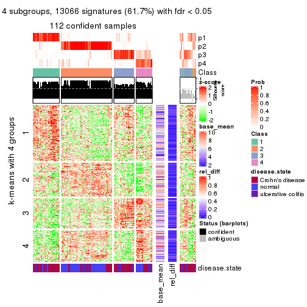</p>

</div>
<div id='tab-ATC-NMF-get-signatures-4'>
<pre><code class="r">get_signatures(res, k = 5)
</code></pre>

<p></p>

</div>
<div id='tab-ATC-NMF-get-signatures-5'>
<pre><code class="r">get_signatures(res, k = 6)
</code></pre>

<p></p>

</div>
</div>


Signature heatmaps where rows are not scaled:


<script>
$( function() {
	$( '#tabs-ATC-NMF-get-signatures-no-scale' ).tabs();
} );
</script>
<div id='tabs-ATC-NMF-get-signatures-no-scale'>
<ul>
<li><a href='#tab-ATC-NMF-get-signatures-no-scale-1'>k = 2</a></li>
<li><a href='#tab-ATC-NMF-get-signatures-no-scale-2'>k = 3</a></li>
<li><a href='#tab-ATC-NMF-get-signatures-no-scale-3'>k = 4</a></li>
<li><a href='#tab-ATC-NMF-get-signatures-no-scale-4'>k = 5</a></li>
<li><a href='#tab-ATC-NMF-get-signatures-no-scale-5'>k = 6</a></li>
</ul>
<div id='tab-ATC-NMF-get-signatures-no-scale-1'>
<pre><code class="r">get_signatures(res, k = 2, scale_rows = FALSE)
</code></pre>

<p></p>

</div>
<div id='tab-ATC-NMF-get-signatures-no-scale-2'>
<pre><code class="r">get_signatures(res, k = 3, scale_rows = FALSE)
</code></pre>

<p></p>

</div>
<div id='tab-ATC-NMF-get-signatures-no-scale-3'>
<pre><code class="r">get_signatures(res, k = 4, scale_rows = FALSE)
</code></pre>

<p></p>

</div>
<div id='tab-ATC-NMF-get-signatures-no-scale-4'>
<pre><code class="r">get_signatures(res, k = 5, scale_rows = FALSE)
</code></pre>

<p>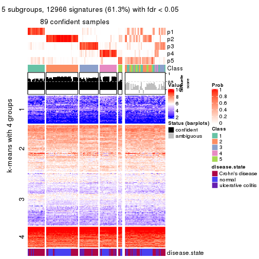</p>

</div>
<div id='tab-ATC-NMF-get-signatures-no-scale-5'>
<pre><code class="r">get_signatures(res, k = 6, scale_rows = FALSE)
</code></pre>

<p></p>

</div>
</div>


Compare the overlap of signatures from different k:

```r
compare_signatures(res)
```


`get_signature()` returns a data frame invisibly. TO get the list of signatures, the function
call should be assigned to a variable explicitly. In following code, if `plot` argument is set
to `FALSE`, no heatmap is plotted while only the differential analysis is performed.

```r
# code only for demonstration
tb = get_signature(res, k = ..., plot = FALSE)
```

An example of the output of `tb` is:

```
#>   which_row         fdr    mean_1    mean_2 scaled_mean_1 scaled_mean_2 km
#> 1        38 0.042760348  8.373488  9.131774    -0.5533452     0.5164555  1
#> 2        40 0.018707592  7.106213  8.469186    -0.6173731     0.5762149  1
#> 3        55 0.019134737 10.221463 11.207825    -0.6159697     0.5749050  1
#> 4        59 0.006059896  5.921854  7.869574    -0.6899429     0.6439467  1
#> 5        60 0.018055526  8.928898 10.211722    -0.6204761     0.5791110  1
#> 6        98 0.009384629 15.714769 14.887706     0.6635654    -0.6193277  2
...
```

The columns in `tb` are:

1. `which_row`: row indices corresponding to the input matrix.
2. `fdr`: FDR for the differential test. 
3. `mean_x`: The mean value in group x.
4. `scaled_mean_x`: The mean value in group x after rows are scaled.
5. `km`: Row groups if k-means clustering is applied to rows.


UMAP plot which shows how samples are separated.


<script>
$( function() {
	$( '#tabs-ATC-NMF-dimension-reduction' ).tabs();
} );
</script>
<div id='tabs-ATC-NMF-dimension-reduction'>
<ul>
<li><a href='#tab-ATC-NMF-dimension-reduction-1'>k = 2</a></li>
<li><a href='#tab-ATC-NMF-dimension-reduction-2'>k = 3</a></li>
<li><a href='#tab-ATC-NMF-dimension-reduction-3'>k = 4</a></li>
<li><a href='#tab-ATC-NMF-dimension-reduction-4'>k = 5</a></li>
<li><a href='#tab-ATC-NMF-dimension-reduction-5'>k = 6</a></li>
</ul>
<div id='tab-ATC-NMF-dimension-reduction-1'>
<pre><code class="r">dimension_reduction(res, k = 2, method = &quot;UMAP&quot;)
</code></pre>

<p></p>

</div>
<div id='tab-ATC-NMF-dimension-reduction-2'>
<pre><code class="r">dimension_reduction(res, k = 3, method = &quot;UMAP&quot;)
</code></pre>

<p></p>

</div>
<div id='tab-ATC-NMF-dimension-reduction-3'>
<pre><code class="r">dimension_reduction(res, k = 4, method = &quot;UMAP&quot;)
</code></pre>

<p></p>

</div>
<div id='tab-ATC-NMF-dimension-reduction-4'>
<pre><code class="r">dimension_reduction(res, k = 5, method = &quot;UMAP&quot;)
</code></pre>

<p></p>

</div>
<div id='tab-ATC-NMF-dimension-reduction-5'>
<pre><code class="r">dimension_reduction(res, k = 6, method = &quot;UMAP&quot;)
</code></pre>

<p></p>

</div>
</div>


Following heatmap shows how subgroups are split when increasing `k`:

```r
collect_classes(res)
```


Test correlation between subgroups and known annotations. If the known
annotation is numeric, one-way ANOVA test is applied, and if the known
annotation is discrete, chi-squared contingency table test is applied.

```r
test_to_known_factors(res)
```

```
#>           n disease.state(p) k
#> ATC:NMF 124         1.50e-07 2
#> ATC:NMF 124         9.13e-07 3
#> ATC:NMF 112         1.16e-06 4
#> ATC:NMF  89         1.39e-05 5
#> ATC:NMF  99         4.27e-06 6
```


If matrix rows can be associated to genes, consider to use `functional_enrichment(res,
...)` to perform function enrichment for the signature genes. See [this vignette](http://bioconductor.org/packages/devel/bioc/vignettes/cola/inst/doc/functional_enrichment.html) for more detailed explanations.


 

## Session info


```r
sessionInfo()
```

```
#> R version 3.6.0 (2019-04-26)
#> Platform: x86_64-pc-linux-gnu (64-bit)
#> Running under: CentOS Linux 7 (Core)
#> 
#> Matrix products: default
#> BLAS:   /usr/lib64/libblas.so.3.4.2
#> LAPACK: /usr/lib64/liblapack.so.3.4.2
#> 
#> locale:
#>  [1] LC_CTYPE=en_GB.UTF-8       LC_NUMERIC=C               LC_TIME=en_GB.UTF-8       
#>  [4] LC_COLLATE=en_GB.UTF-8     LC_MONETARY=en_GB.UTF-8    LC_MESSAGES=en_GB.UTF-8   
#>  [7] LC_PAPER=en_GB.UTF-8       LC_NAME=C                  LC_ADDRESS=C              
#> [10] LC_TELEPHONE=C             LC_MEASUREMENT=en_GB.UTF-8 LC_IDENTIFICATION=C       
#> 
#> attached base packages:
#> [1] grid      stats     graphics  grDevices utils     datasets  methods   base     
#> 
#> other attached packages:
#> [1] genefilter_1.66.0    ComplexHeatmap_2.3.1 markdown_1.1         knitr_1.26          
#> [5] GetoptLong_0.1.7     cola_1.3.2          
#> 
#> loaded via a namespace (and not attached):
#>  [1] circlize_0.4.8       shape_1.4.4          xfun_0.11            slam_0.1-46         
#>  [5] lattice_0.20-38      splines_3.6.0        colorspace_1.4-1     vctrs_0.2.0         
#>  [9] stats4_3.6.0         blob_1.2.0           XML_3.98-1.20        survival_2.44-1.1   
#> [13] rlang_0.4.2          pillar_1.4.2         DBI_1.0.0            BiocGenerics_0.30.0 
#> [17] bit64_0.9-7          RColorBrewer_1.1-2   matrixStats_0.55.0   stringr_1.4.0       
#> [21] GlobalOptions_0.1.1  evaluate_0.14        memoise_1.1.0        Biobase_2.44.0      
#> [25] IRanges_2.18.3       parallel_3.6.0       AnnotationDbi_1.46.1 highr_0.8           
#> [29] Rcpp_1.0.3           xtable_1.8-4         backports_1.1.5      S4Vectors_0.22.1    
#> [33] annotate_1.62.0      skmeans_0.2-11       bit_1.1-14           microbenchmark_1.4-7
#> [37] brew_1.0-6           impute_1.58.0        rjson_0.2.20         png_0.1-7           
#> [41] digest_0.6.23        stringi_1.4.3        polyclip_1.10-0      clue_0.3-57         
#> [45] tools_3.6.0          bitops_1.0-6         magrittr_1.5         eulerr_6.0.0        
#> [49] RCurl_1.95-4.12      RSQLite_2.1.4        tibble_2.1.3         cluster_2.1.0       
#> [53] crayon_1.3.4         pkgconfig_2.0.3      zeallot_0.1.0        Matrix_1.2-17       
#> [57] xml2_1.2.2           httr_1.4.1           R6_2.4.1             mclust_5.4.5        
#> [61] compiler_3.6.0
```


